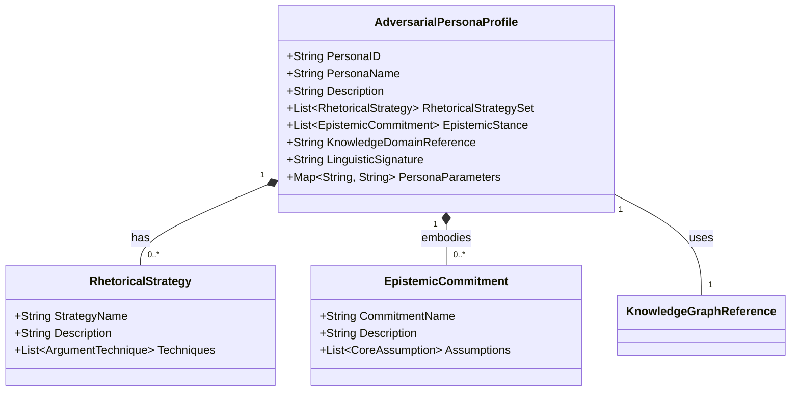
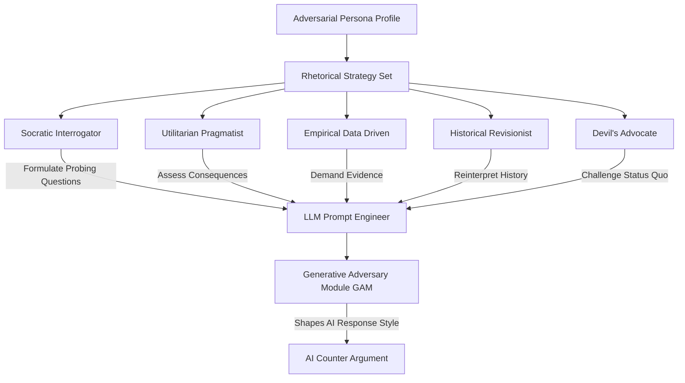
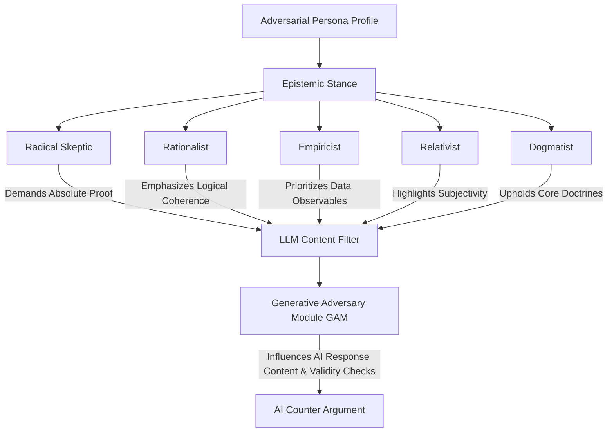
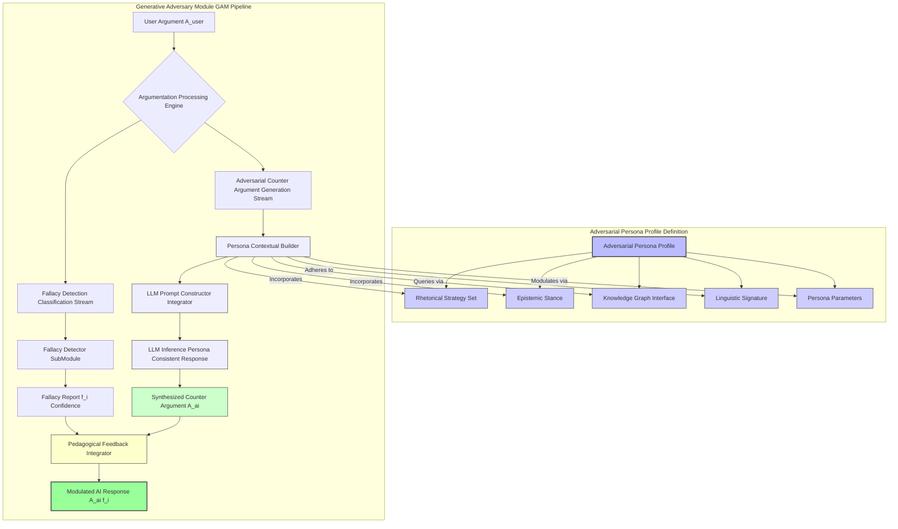
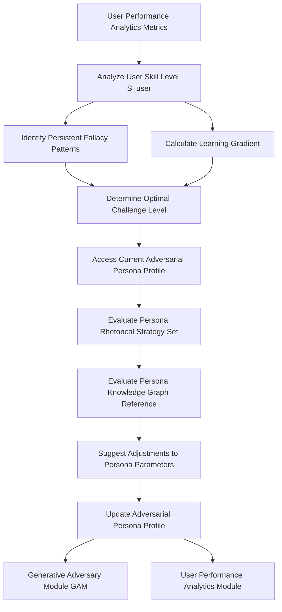

# Title of Invention: Adversarial Persona Profiles: Dynamic Configuration and Strategic Impact on AI Debate Training

## Abstract:
This document details the intricate design and dynamic operational mechanics of `AdversarialPersonaProfiles` within the AI Debate Training Adversary system. These profiles serve as the fundamental blueprint for shaping the AI's argumentative behavior, encompassing a `RhetoricalStrategySet`, `EpistemicStance`, `KnowledgeDomainReference`, and `LinguisticSignature`. Each persona is engineered to provide a unique and challenging dialectical experience, allowing the system to adaptively present diverse argumentative paradigms to the user. The dynamic configuration of these profiles, influenced by real-time user performance analytics, ensures a persistently optimal learning gradient. This sophisticated personalization of the adversarial agent maximizes the efficacy of pedagogical feedback and accelerates the user's development of superior critical thinking and argumentation skills.

## Field of the Invention:
The present invention pertains to advanced conversational AI, pedagogical systems, and the dynamic configuration of AI agents for intelligent tutoring. More specifically, it elaborates on the architectural and functional specifications of configurable `AdversarialPersonaProfiles` designed to modulate AI behavior for targeted skill development in debate and critical argumentation.

## Background of the Invention:
Traditional debate training often lacks the consistency, analytical depth, and adaptive challenge required for truly accelerated skill acquisition. While the core AI Debate Adversary system addresses many of these limitations, the quality and effectiveness of the adversarial engagement are profoundly dependent on the AI's ability to present varied, contextually relevant, and strategically coherent counter-arguments. Without carefully constructed and dynamically adjustable personas, the AI's responses could become predictable, repetitive, or insufficiently challenging, thus hindering the learning process. There exists a critical need to formalize the design and operationalization of these adversarial personas to ensure a rich, adaptive, and pedagogically potent training environment that can simulate a wide spectrum of argumentative styles and intellectual positions.

## Brief Summary of the Invention:
The present invention introduces the conceptual and functional framework for `AdversarialPersonaProfiles`, which are pivotal to the AI Debate Training Adversary's effectiveness. Each `AdversarialPersonaProfile` is a comprehensive data structure instantiated to define the cognitive and rhetorical attributes of the AI's debate opponent. These profiles are not static but are designed for dynamic adjustment by the `AdaptiveDifficultyModule`, ensuring that the challenge presented to the user remains optimal for learning. Key components include:
*   **Rhetorical Strategy Set**: A collection of predefined argumentative tactics and debate techniques.
*   **Epistemic Stance**: The fundamental philosophical position dictating how the persona evaluates truth claims and evidence.
*   **Knowledge Domain Reference**: Pointers to specific knowledge bases the persona can draw upon.
*   **Linguistic Signature**: Distinctive stylistic and lexical patterns for the AI's responses.

These parameters collectively inform the `Generative Adversary Module GAM` in synthesizing counter-arguments, ensuring they are not only logically sound but also perfectly aligned with the selected persona's characteristics, thereby creating an immersive and intellectually stimulating adversarial experience.

## Detailed Description of the Invention:

### I. Adversarial Persona Profile Structure and Attributes
The `AdversarialPersonaProfile` is the foundational data model that dictates the behavioral parameters of the AI opponent. This robust structure enables a wide range of adversarial styles and ensures consistency throughout a debate session, while also allowing for adaptive modifications.

#### A. PersonaID and PersonaName
Unique identifiers and human-readable names for quick selection and management.

#### B. Description
A textual explanation of the persona's general characteristics and typical argumentative approach.

#### C. Rhetorical Strategy Set
This attribute defines the preferred methods of persuasion and argument construction employed by the persona. It dictates *how* the persona will formulate its rebuttals and engage with the user's points. Examples include:
*   **Socratic Interrogator**: Emphasizes asking probing questions to expose inconsistencies or gaps in the user's reasoning.
*   **Utilitarian Pragmatist**: Focuses on the practical outcomes and consequences of proposed actions or beliefs, prioritizing the greatest good.
*   **Empirical Data Driven**: Insists on quantitative or verifiable evidence for every claim, challenging unsubstantiated assertions.
*   **Historical Revisionist**: Reinterprets historical events or narratives to support a specific viewpoint, often challenging conventional wisdom.
*   **Devil's Advocate**: Takes a position contrary to the popular or established one, purely for the sake of argument and to test the robustness of an idea.

#### D. Epistemic Stance
This attribute defines the persona's fundamental assumptions about knowledge, truth, and justification. It dictates *what* the persona considers valid evidence or a sound argument. Examples include:
*   **Radical Skeptic**: Doubts the possibility of certainty in knowledge, demanding an extremely high bar for evidence.
*   **Rationalist**: Prioritizes logical deduction and reason as the primary sources of knowledge, often preferring abstract principles over empirical observations.
*   **Empiricist**: Bases knowledge primarily on sensory experience and observational data, distrusting purely theoretical constructs.
*   **Relativist**: Believes that truth is subjective and dependent on context, culture, or individual perspective, challenging universal claims.
*   **Dogmatist**: Adheres strictly to a set of core beliefs or doctrines, often resisting contradictory evidence or alternative interpretations.

#### E. Knowledge Domain Reference
This attribute specifies the particular knowledge graphs or databases the persona is configured to access. For instance, a "Scientific Skeptic" might primarily draw from scientific literature databases, while a "Philosophical Ethicist" might query databases of ethical theories and case studies. This ensures domain-specific relevance and factual grounding.

#### F. Linguistic Signature
This attribute comprises stylistic preferences, vocabulary choices, sentence structure, and tone. It ensures that the AI's responses are not only logically consistent with the persona but also *sound* like the persona, enhancing immersion. Examples include:
*   **Formal Academic**: Precise, objective language, complex sentence structures.
*   **Colloquial Provocateur**: Informal, direct, perhaps confrontational language.
*   **Pedantic Scholar**: Uses highly specialized vocabulary, explains concepts in detail.

#### G. Persona Parameters
A flexible `Map` for storing additional, fine-grained control parameters that can be adjusted by the `AdaptiveDifficultyModule` to modulate the persona's aggressiveness, willingness to concede minor points, or the complexity of its arguments.

### II. Persona Influence on AI Response Generation
The `AdversarialPersonaProfile` is paramount in shaping the output of the `Generative Adversary Module GAM`. Upon receiving a user's argument, the GAM dynamically constructs an optimized prompt for the underlying Large Language Model LLM. This prompt is meticulously synthesized based on the selected `AdversarialPersonaProfile` and the ongoing `DiscourseHistory`.

As depicted in the detailed flow above, the `Adversarial Persona Profile` attributes feed directly into the `Persona Contextual Builder`, which is a critical sub-component of the `Adversarial Counter Argument Generation Stream`. This builder synthesizes a highly customized prompt for the LLM, ensuring that the generated counter-argument (`A_ai`) reflects the persona's chosen rhetorical strategies, epistemic commitments, knowledge base, and linguistic style. This sophisticated prompt engineering guarantees that the AI's response is not merely generic but a strategically tailored, persona-consistent challenge.

### III. Dynamic Persona Adaptation for Optimal Learning
The `AdversarialPersonaProfile` is not static; its parameters are dynamically adjusted by the `AdaptiveDifficultyModule` in response to the user's evolving performance. This ensures that the user is continuously challenged at an optimal difficulty level, preventing both frustration from excessive difficulty and stagnation from insufficient challenge.

The `AdaptiveDifficultyModule` uses metrics like `FallacyDetectionRate`, `ArgumentCoherenceScore`, and `RelevanceScore` to calculate the user's current `SkillLevelScore` (`S_user`). Based on this assessment and identified patterns of weakness, the module suggests adjustments to the `AdversarialPersonaProfile`. For instance, if a user consistently falls for `Straw Man` fallacies, the system might activate a persona with a `Red Herring` rhetorical strategy to introduce a new challenge, or it might subtly increase the complexity of the `KnowledgeDomainReference` for an `Empirical Data Driven` persona if the user is excelling at basic factual recall. This continuous feedback loop of performance assessment and persona adjustment is central to the system's pedagogical superiority.