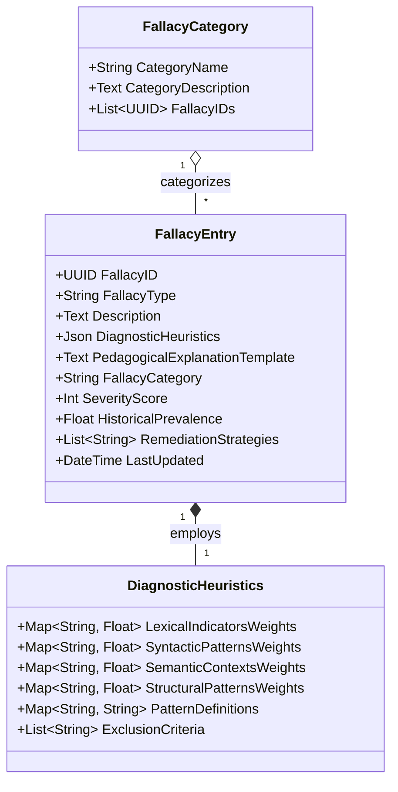
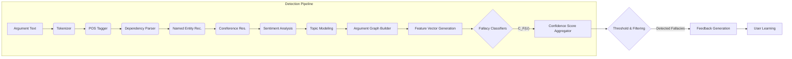
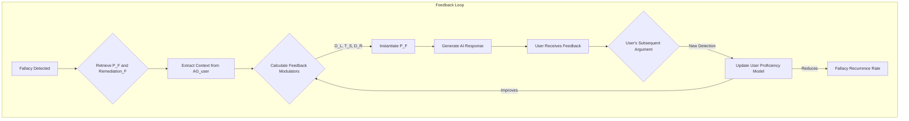
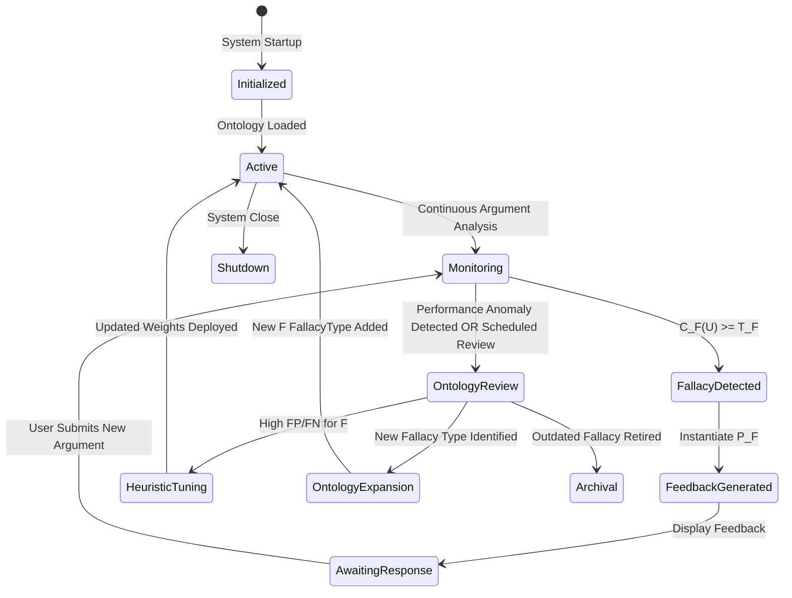
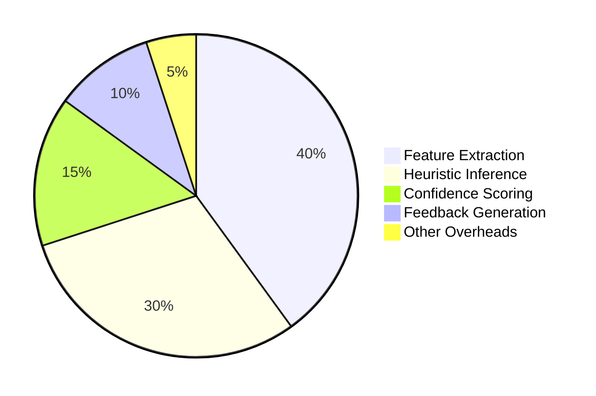
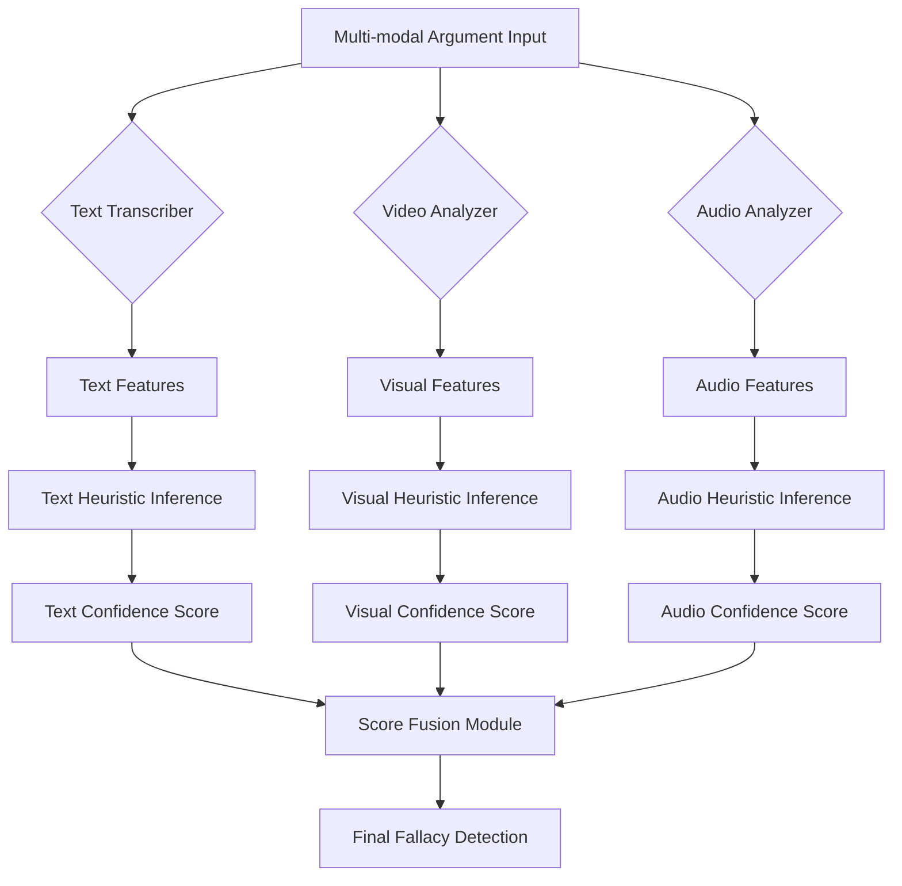
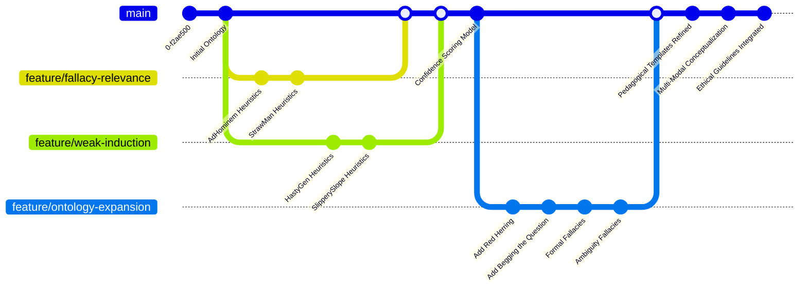

# Title of Invention: In-depth Specification of the Fallacy Ontology for a Dynamically Adaptive Conversational AI Debate Training Adversary

## Abstract:
This document provides a comprehensive and detailed specification of the `Fallacy Ontology`, a core component of the disclosed system for advanced critical thinking and argumentation pedagogy. The ontology delineates a structured hierarchy of logical, rhetorical, and epistemic fallacies, each meticulously defined with its `FallacyType`, descriptive explanation, a set of `DiagnosticHeuristics` for automated identification, and a `PedagogicalExplanationTemplate` for real-time user feedback. This intricate taxonomy empowers the `GranularFallacyDetector` to precisely identify argumentative deficiencies, facilitating targeted and effective learning interventions. The hierarchical organization, visualized through a Mermaid diagram, ensures both broad coverage and nuanced categorization, underpinning the system's unparalleled pedagogical efficacy.

## Field of the Invention:
The present invention pertains to the domain of artificial intelligence, specifically natural language processing, expert systems, and automated intelligent tutoring. More particularly, it defines the structured knowledge base for identifying argumentative flaws within systems designed to enhance critical reasoning and debate skills.

## Introduction to the Fallacy Ontology:
The `Fallacy Ontology` serves as the intellectual backbone for the `GranularFallacyDetector` module within the `Generative Adversary Module GAM`. It is a meticulously curated and formally structured knowledge base encompassing a wide array of argumentative errors that undermine the logical integrity, rhetorical fairness, or epistemic soundness of a discourse. Unlike simplistic keyword matching, this ontology provides a deep semantic and structural framework for fallacy identification, enabling the AI to offer precise, actionable, and contextually relevant pedagogical feedback.

Each entry within the `Fallacy Ontology` is more than a mere label; it is a rich data structure comprising:
*   **FallacyType**: A unique identifier for the specific fallacy.
*   **Description**: A concise explanation of the fallacy's nature and why it constitutes an argumentative error.
*   **DiagnosticHeuristics**: A set of patterns, rules, and indicators (lexical, syntactic, semantic, and structural) that the system uses to detect the fallacy within a user's argument. These are typically formalized as logical conditions or machine learning features.
*   **PedagogicalExplanationTemplate**: A pre-designed template that the system uses to construct clear, concise, and educational feedback for the user upon detection of the fallacy. This template is dynamically populated with specifics from the user's argument.
*   **FallacyCategory**: A higher-level classification (e.g., Fallacies of Relevance) to which the fallacy belongs, facilitating hierarchical organization and generalized feedback.
*   **SeverityScore**: A numerical value indicating the estimated impact of the fallacy on the argument's overall soundness or rhetorical integrity, ranging from 1 (minor) to 5 (critical).
*   **HistoricalPrevalence**: A statistical measure of how often this fallacy has been detected in similar debate contexts or by the current user.
*   **RemediationStrategies**: A set of suggested techniques or counter-arguments that the user can employ to avoid or address this fallacy in future debates.

## Key Claims and Theses of the Fallacy Ontology:

**Claim 1: Precision in Identification.** The `Fallacy Ontology` enables unprecedented precision in argumentative flaw identification by leveraging a multi-faceted heuristic approach, moving beyond keyword matching to deep semantic and structural analysis.

**Claim 2: Hierarchical Optimization.** Its rigorously designed hierarchical structure optimizes both the efficiency of fallacy detection algorithms and the pedagogical utility of feedback, allowing for generalized and specific interventions.

**Claim 3: Adaptive Pedagogical Efficacy.** The integration of `PedagogicalExplanationTemplates` with dynamic content population ensures that feedback is not only accurate but also adaptively tailored to the user's specific argumentative context, maximizing learning outcomes.

**Claim 4: Formal Quantifiability.** The `DiagnosticHeuristics` for each `FallacyType` are formally quantifiable, allowing for robust statistical modeling, machine learning integration, and the calculation of `DetectionConfidenceScores`.

**Claim 5: Context-Aware Remediation.** The ontology supports real-time, context-aware fallacy remediation by factoring in `DiscourseHistory` and user-specific `FallacyPrevalence` to provide highly relevant and actionable advice.

**Claim 6: Foundational for Scalability.** The `Fallacy Ontology` is designed as a foundational, extensible knowledge base, critical for scaling AI-driven critical reasoning education across diverse subject matters and user proficiencies.

**Claim 7: Longitudinal Performance Tracking.** The structured nature of fallacy detection allows for longitudinal tracking of user performance, enabling the system to identify persistent argumentative weaknesses and demonstrate learning progression.

**Claim 8: Interoperability and Modularity.** The ontology is architected for seamless interoperability with other core system modules, such as `Argument Graph Reconstruction` and `Pedagogical Feedback Integrator`, ensuring a cohesive and modular AI architecture.

**Claim 9: Explainable AI in Pedagogy.** By meticulously mapping detected patterns to specific fallacy definitions and providing clear explanations, the system embodies principles of Explainable AI (XAI), enhancing trust and understanding for the user.

**Claim 10: Robustness Against Sophisticated Fallacies.** The depth of its `DiagnosticHeuristics`, including semantic and structural analysis, equips the system to detect not only overt fallacies but also more subtle and sophisticated argumentative manipulations.

## Hierarchical Structure of the Fallacy Ontology:
The `Fallacy Ontology` is organized as a directed acyclic graph DAG, allowing for granular categorization while maintaining clear relationships between broader categories and specific instances of fallacies. This hierarchical structure is crucial for both robust detection and for providing pedagogically appropriate levels of detail in feedback.

```mermaid
graph TD
    A[Fallacy Ontology Root] --> B[Fallacies of Relevance];
    A --> C[Fallacies of Weak Induction];
    A --> D[Fallacies of Presumption];
    A --> E[Fallacies of Ambiguity];
    A --> F[Formal Fallacies];
    A --> G[Fallacies of Composition/Division];
    A --> H[Epistemic Fallacies];
    A --> I[Rhetorical Fallacies];

    B --> B1[Ad Hominem];
    B --> B2[Straw Man];
    B --> B3[Red Herring];
    B --> B4[Appeal to Authority Misused];
    B --> B5[Appeal to Emotion];
    B --> B6[Appeal to Ignorance];
    B --> B7[Tu Quoque];
    B --> B8[Genetic Fallacy];

    C --> C1[Hasty Generalization];
    C --> C2[Slippery Slope];
    C --> C3[False Cause];
    C --> C4[Weak Analogy];
    C --> C5[Appeal to Popularity];
    C --> C6[Post Hoc Ergo Propter Hoc];

    D --> D1[Begging the Question];
    D --> D2[Complex Question];
    D --> D3[False Dilemma];
    D --> D4[Suppressed Evidence];
    D --> D5[Loaded Question];
    D --> D6[Appeal to Tradition];

    E --> E1[Equivocation];
    E --> E2[Amphiboly];
    E --> E3[Accent];
    E --> E4[Composition];
    E --> E5[Division];

    F --> F1[Affirming the Consequent];
    F --> F2[Denying the Antecedent];
    F --> F3[Undistributed Middle];
    F --> F4[Existential Fallacy];

    G --> G1[Composition];
    G --> G2[Division];

    H --> H1[Argument from Ignorance];
    H --> H2[Misleading Vividness];

    I --> I1[Ad Populum (Bandwagon)];
    I --> I2[Personal Incredulity];
```

## Detailed Fallacy Specifications:

This section provides an in-depth look at selected fallacies from each major category, illustrating their definition, diagnostic criteria, and the pedagogical approach for user feedback.

### I. Fallacies of Relevance:
These fallacies occur when the premises, though perhaps true, are irrelevant to the conclusion.

#### 1. Ad Hominem
*   **FallacyType**: AdHominem
*   **Description**: Attacking the character, motive, or other attributes of the person making an argument, rather than attacking the substance of the argument itself.
*   **DiagnosticHeuristics**:
    *   `LexicalIndicators`: Presence of derogatory terms, insults, or pejoratives directed at the opponent (`e.g., "idiot", "ignorant", "biased"`).
    *   `SyntacticPatterns`: Predicate-argument structures where the subject is the opponent and the predicate is a negative attribute (e.g., `[Opponent] is [negative_trait]`).
    *   `SemanticContexts`: Analysis of sentiment polarity towards the opponent vs. sentiment towards the opponent's argument. Detection of statements questioning the opponent's credibility or integrity based on irrelevant traits (e.g., `"You can't trust anything [Opponent] says because they're a politician."`).
    *   `StructuralPatterns`: Absence of a direct engagement with the opponent's stated premises or conclusions, coupled with personal attacks.
*   **PedagogicalExplanationTemplate**: "Instead of addressing the substance of my argument regarding `[topic]`, your statement `[paraphrase user's attack]` constitutes an **Ad Hominem fallacy**. This occurs when you attack the person rather than the argument itself. Please refocus on the factual merits of the discussion."
*   **SeverityScore**: 3
*   **RemediationStrategies**: "Focus on the logical connections. Ask yourself: 'Does the personal characteristic truly invalidate the argument, or is it a distraction?'"

#### 2. Straw Man
*   **FallacyType**: StrawMan
*   **Description**: Misrepresenting or exaggerating an opponent's argument to make it easier to attack, then refuting the misrepresented argument as if it were the original.
*   **DiagnosticHeuristics**:
    *   `LexicalIndicators`: Use of hyperbole, absolute terms, or oversimplifications when summarizing the opponent's position (e.g., `always`, `never`, `extreme`, `total`).
    *   `SyntacticPatterns`: Comparison of `UserArgumentSummary` with `OpponentOriginalStatement` to identify negation, generalization, or narrowing transformations.
    *   `SemanticContexts`: Calculation of semantic similarity score between user's representation and original argument. Low similarity combined with a strong rebuttal is a key indicator. Detection of loaded language in the summary.
    *   `StructuralPatterns`: The user's counter-argument directly refutes the distorted version, not the actual points. The `DiscourseHistory` is crucial here.
*   **PedagogicalExplanationTemplate**: "Your argument `[paraphrase user's distorted argument]` misrepresents my actual position on `[topic]`. This is an instance of the **Straw Man fallacy**, where you create a distorted version of an argument to make it easier to refute. Let's address my original point, which was `[restate AI's original argument]`."
*   **SeverityScore**: 4
*   **RemediationStrategies**: "Quote or accurately paraphrase your opponent's exact words. Ask for clarification if unsure about their stance."

#### 3. Red Herring
*   **FallacyType**: RedHerring
*   **Description**: Introducing an irrelevant topic into an argument to divert attention from the original issue.
*   **DiagnosticHeuristics**:
    *   `LexicalIndicators`: Phrases signaling topic shift (e.g., "That reminds me of...", "But what about...", "The real issue here is...").
    *   `SyntacticPatterns`: Introduction of new subjects or predicates that are not logically linked to the immediate preceding argument.
    *   `SemanticContexts`: Low semantic coherence score between the introduced topic and the current primary topic of the debate. `TopicModeling` divergence.
    *   `StructuralPatterns`: User's response does not address the explicit or implicit question posed by the opponent, but rather shifts to an unrelated, often emotionally charged, side issue.
*   **PedagogicalExplanationTemplate**: "You've introduced the topic of `[new topic]` which, while interesting, diverts from our main discussion about `[original topic]`. This is a **Red Herring fallacy**. Let's keep our focus on the central argument to maintain clarity."
*   **SeverityScore**: 3
*   **RemediationStrategies**: "Before introducing a new point, ask yourself if it directly contributes to proving or disproving the current main claim."

### II. Fallacies of Weak Induction:
These fallacies occur when the premises provide some support for the conclusion, but the support is not strong enough to warrant believing the conclusion.

#### 1. Hasty Generalization
*   **FallacyType**: HastyGeneralization
*   **Description**: Drawing a broad conclusion based on a small, unrepresentative sample or insufficient evidence.
*   **DiagnosticHeuristics**:
    *   `LexicalIndicators`: Universal quantifiers (e.g., `all`, `every`, `always`) or sweeping statements with limited evidence. Small sample indicators (e.g., `one instance`, `a few times`).
    *   `SyntacticPatterns`: `[Claim] because [limited_evidence]`. Argument structures inferring properties of a superset from a very small subset.
    *   `SemanticContexts`: Quantitative analysis of supporting evidence against the scope of the conclusion. Identifying anecdotal evidence presented as statistical.
    *   `StructuralPatterns`: The conclusion's scope (`S_C`) vastly outweighs the evidence's scope (`S_E`), i.e., `S_C >> S_E`.
*   **PedagogicalExplanationTemplate**: "Your conclusion that `[user's broad conclusion]` based on `[user's limited evidence]` is a **Hasty Generalization fallacy**. This occurs when you draw a broad conclusion from insufficient or unrepresentative evidence. To make a stronger argument, consider providing a wider range of supporting data."
*   **SeverityScore**: 3
*   **RemediationStrategies**: "Seek out more diverse evidence. Ensure your sample size is representative of the population you're making a claim about."

#### 2. Slippery Slope
*   **FallacyType**: SlipperySlope
*   **Description**: Asserting that a relatively minor first step inevitably leads to a chain of related, usually negative, consequences, without demonstrating sufficient connections between each step.
*   **DiagnosticHeuristics**:
    *   `LexicalIndicators`: Causal chain markers (e.g., `will inevitably lead to`, `then this will happen`, `once X, then Y, then Z`). Predictions of severe future outcomes.
    *   `SyntacticPatterns`: Series of conditional statements `(A -> B -> C -> D)` without justification for each conditional `(A -> B)`, `(B -> C)`.
    *   `SemanticContexts`: Low probability scores for intermediate causal links (`P(B|A)` is low, `P(C|B)` is low). Detection of unjustified assumptions.
    *   `StructuralPatterns`: A sequence of predicted events where the logical or empirical necessity of each step is not established.
*   **PedagogicalExplanationTemplate**: "Your argument that `[initial action]` will inevitably lead to `[final negative consequence]` is an example of the **Slippery Slope fallacy**. This fallacy assumes a chain of events without providing sufficient evidence for each causal link. Consider providing stronger logical connections between each proposed step."
*   **SeverityScore**: 4
*   **RemediationStrategies**: "Examine each link in your proposed chain of events. Can you demonstrate a high probability or logical necessity for each step?"

### III. Fallacies of Presumption:
These fallacies arise from premises that presuppose what they purport to prove.

#### 1. Begging the Question
*   **FallacyType**: BeggingTheQuestion
*   **Description**: An argument whose conclusion is assumed in one of its premises. Also known as circular reasoning.
*   **DiagnosticHeuristics**:
    *   `LexicalIndicators`: Near-synonymous phrasing between premise and conclusion. Restatements.
    *   `SyntacticPatterns`: Conclusion `C` appears as a rephrased premise `P_i` (e.g., `C = f(P_i)` where `f` is a trivial transformation).
    *   `SemanticContexts`: High semantic similarity between premises and conclusion, without additional, independent support for the conclusion. Identifying propositions whose truth depends on the conclusion's truth.
    *   `StructuralPatterns`: The argument structure `P_1, P_2, ..., P_n => C` where `C` is logically identical or equivalent to one of `P_i`. Detection of lack of independent support.
*   **PedagogicalExplanationTemplate**: "Your argument `[user's argument]` appears to assume the very point it's trying to prove. This is a **Begging the Question fallacy** (circular reasoning), where the conclusion is already contained within the premises. For your argument to be sound, you need to provide independent support for your premises."
*   **SeverityScore**: 5
*   **RemediationStrategies**: "Ensure your premises are supported by evidence independent of your conclusion. Imagine someone asking 'Why is that premise true?' If the answer relies on the conclusion, it's circular."

#### 2. False Dilemma
*   **FallacyType**: FalseDilemma
*   **Description**: Presenting only two options or possibilities when in reality there are more, thereby forcing a choice between them.
*   **DiagnosticHeuristics**:
    *   `LexicalIndicators`: "Either/or" statements, phrases indicating exclusivity (e.g., `only two choices`, `must choose between`).
    *   `SyntacticPatterns`: Disjunctive propositions `(P OR Q)` presented as exhaustive, where `P` and `Q` are typically opposing extremes.
    *   `SemanticContexts`: Analysis of the problem space to identify overlooked or intentionally excluded alternatives. Determining if the presented options are truly exhaustive and mutually exclusive in the given context.
    *   `StructuralPatterns`: Argument reduces a complex issue with multiple potential solutions/perspectives to just two, often polarized, options.
*   **PedagogicalExplanationTemplate**: "Your statement `[user's statement of options]` presents a **False Dilemma fallacy**. This occurs when you present only two choices as if they are the only possibilities, when in fact, other viable options or nuances exist. Consider exploring a broader spectrum of solutions or perspectives."
*   **SeverityScore**: 4
*   **RemediationStrategies**: "Brainstorm additional options or points of view. Challenge the assumption that the given choices are the only ones available."

### IV. Fallacies of Ambiguity:
These fallacies arise from the careless or deliberately misleading use of language.

#### 1. Equivocation
*   **FallacyType**: Equivocation
*   **Description**: Using a word or phrase with two or more different meanings in a way that makes an argument seem to hold together when it logically does not.
*   **DiagnosticHeuristics**:
    *   `LexicalIndicators`: Identification of key terms used multiple times within an argument. Homonyms or polysemous words.
    *   `SyntacticPatterns`: The term appears in different grammatical contexts that subtly alter its meaning.
    *   `SemanticContexts`: Contextual semantic analysis to determine if a term's meaning shifts between its uses. `WordSenseDisambiguation` algorithms. Detection of arguments whose validity relies on this semantic shift (e.g., `P(term_1_meaning_A) AND Q(term_2_meaning_B)` but conclusion implies `term_1_meaning_B`).
    *   `StructuralPatterns`: A syllogistic or deductive argument where a middle term or connecting concept has different meanings in the premises, thus invalidating the link.
*   **PedagogicalExplanationTemplate**: "In your argument, the term `[ambiguous term]` seems to shift in meaning between `[meaning 1]` and `[meaning 2]`. This constitutes an **Equivocation fallacy**, which arises when a key term is used with different meanings in different parts of an argument. To maintain logical clarity, ensure consistent use of terminology."
*   **SeverityScore**: 3
*   **RemediationStrategies**: "Define your terms explicitly at the outset. If a word has multiple meanings, specify which one you intend in each instance."

### V. Formal Fallacies:
These fallacies involve an error in the argument's structure or form, making the conclusion invalid regardless of the truth of the premises.

#### 1. Affirming the Consequent
*   **FallacyType**: AffirmingTheConsequent
*   **Description**: An invalid deductive inference of the form: "If P then Q. Q. Therefore, P."
*   **DiagnosticHeuristics**:
    *   `LexicalIndicators`: Conditional phrases (`if...then`). Causal verbs.
    *   `SyntacticPatterns`: Pattern matching for `(P -> Q)`, assertion of `Q`, and conclusion `P`.
    *   `SemanticContexts`: Identification of explicit or implicit conditional relationships. Understanding what `P` (antecedent) and `Q` (consequent) represent.
    *   `StructuralPatterns`: Application of formal logic rules to identify the specific invalid inference structure. This is purely structural.
*   **PedagogicalExplanationTemplate**: "Your argument structure `If [P] then [Q]. [Q] is true. Therefore, [P] is true.` is an example of the **Affirming the Consequent fallacy**. While `Q` being true might be consistent with `P`, it does not logically guarantee that `P` must be true. Many other conditions could lead to `Q`."
*   **SeverityScore**: 5
*   **RemediationStrategies**: "Remember that a consequent can have multiple possible antecedents. The truth of Q does not uniquely imply the truth of P. Consider alternative explanations for Q."

## Integration with the AI System:

The `Fallacy Ontology` is directly consumed by the `Fallacy Detection Classification Stream` within the `Generative Adversary Module GAM`. When a user's argument (`A_user`) is submitted:
1.  The `Argumentation Processing Engine` preprocesses `A_user`, normalizing text, identifying rhetorical units, and constructing an `ArgumentGraph` (`AG_user`).
2.  The `Fallacy Detector SubModule` then employs `Lexical Syntactic Analysis`, `Semantic Pragmatic Analysis`, and `Argument Graph Reconstruction` to assess the argument against the `DiagnosticHeuristics` associated with each `FallacyType` in the `Fallacy Ontology`.
3.  The `Heuristic Inference Engine` applies complex rules and patterns, consulting the `Fallacy Ontology Lookup Match` to identify potential fallacies. This involves feature extraction and comparison against stored patterns.
4.  For each identified fallacy `f_i`, a `DetectionConfidenceScore` is calculated based on the strength of the match to `DiagnosticHeuristics`, structural flaws, and semantic deviations, modulated by `DiscourseHistory` and `UserProficiencyModel`.
5.  If `f_i` is detected with high confidence, its corresponding `PedagogicalExplanationTemplate` is retrieved and used by the `Pedagogical Feedback Integrator` to construct a modulated AI response that educates the user. This response also incorporates `RemediationStrategies` and context from `AG_user`.

```mermaid
graph LR
    A[User Argument A_user] --> B{Argumentation Processing Engine};
    B --> C[Argument Graph AG_user];
    C --> D{Fallacy Detector SubModule};
    D --> D1[Lexical Syntactic Analysis];
    D --> D2[Semantic Pragmatic Analysis];
    D --> D3[Structural Pattern Matching];
    D1 & D2 & D3 --> E{Heuristic Inference Engine};
    E --> F[Fallacy Ontology Lookup Match];
    F --> G[Fallacy Ontology (Database)];
    E --> H[Detection Confidence Scoring];
    H --> I{Pedagogical Feedback Integrator};
    G --> I;
    I --> J[AI Response / Feedback];
    J --> K[User Learning & Skill Improvement];
```

## Formal Definition and Attributes:

The `FALLACY_ONTOLOGY` database table, as described in the overall system blueprint, stores these definitions. Each record represents a single fallacy type with its comprehensive attributes:



## Formalization of Diagnostic Heuristics and Confidence Scoring:

To ensure robust and quantifiable fallacy detection, each `FallacyType` `F` is associated with a set of weighted diagnostic heuristics. Let `h_{F,k}` denote the `k`-th heuristic for fallacy `F`, belonging to types `T = {Lexical, Syntactic, Semantic, Structural}`. Each `h_{F,k}` has an associated base weight `w_{F,k}`.

### Heuristic Activation Function:

For a given user utterance `U` (or argument `A_user`), we define an activation function `A(h_{F,k}, U)` which quantifies the presence and strength of `h_{F,k}` in `U`.
For discrete indicators (e.g., keyword presence):
$$A_{discrete}(h_{F,k}, U) = \begin{cases} 1 & \text{if } h_{F,k} \text{ detected in } U \\ 0 & \text{otherwise} \end{cases}$$
For continuous indicators (e.g., semantic similarity, sentiment score):
$$A_{continuous}(h_{F,k}, U) = \text{score}(h_{F,k}, U) \in [0, 1]$$
The specific scoring function `score` would depend on the heuristic type (e.g., `cosine_similarity` for semantic context, `pattern_match_strength` for structural patterns).

### Raw Fallacy Score:

The raw score `S_F(U)` for a fallacy `F` in utterance `U` is a weighted sum of its activated heuristics:
$$S_F(U) = \sum_{k=1}^{N_F} w_{F,k} \cdot A(h_{F,k}, U)$$
where `N_F` is the total number of diagnostic heuristics for fallacy `F`.
The weights `w_{F,k}` are normalized such that `sum(w_{F,k}) = 1` for each `F`.

### Contextual and User Proficiency Modulators:

The raw score is then modulated by several factors:
1.  **Discourse Context Modulator** `M_{context}(F, U, DH)`: Accounts for the immediate debate history `DH`. If `F` was just addressed or is highly incongruent with the debate topic, its weight might be adjusted.
    $$M_{context}(F, U, DH) = 1 + \delta \cdot \text{ContextRelevance}(F, U, DH)$$
    where `ContextRelevance` is based on semantic similarity of `U` to `DH` and recency of `F` in `DH`. `$\delta$` is a tuning parameter.
2.  **User Proficiency Modulator** `M_{user}(F, U, UP)`: Accounts for the user's historical performance `UP` regarding fallacy `F`. If the user frequently commits `F`, detection sensitivity might be increased.
    $$M_{user}(F, U, UP) = 1 - \gamma \cdot \text{UserProficiency}(F, UP)$$
    where `UserProficiency(F, UP)` is inversely related to past detection frequency for `F` for this user, and `$\gamma$` is a tuning parameter.

### Detection Confidence Score:

The `DetectionConfidenceScore` `C_F(U)` for fallacy `F` in `U` is given by:
$$C_F(U) = \text{Sigmoid}\left( \alpha_1 S_F(U) \cdot M_{context}(F, U, DH) \cdot M_{user}(F, U, UP) - \alpha_2 \text{FalsePositiveRisk}(F) \right)$$
where `$\alpha_1$` and `$\alpha_2$` are scaling coefficients, and `FalsePositiveRisk(F)` is a pre-calculated statistical measure of how often `F` is falsely detected in a given domain, acting as a bias. The `Sigmoid` function maps the score to `[0, 1]`.

### Decision Threshold:

A fallacy `F` is considered detected if its `DetectionConfidenceScore` exceeds a dynamically adjusted threshold `T_F`:
$$\text{Detected}(F, U) = \begin{cases} 1 & \text{if } C_F(U) \ge T_F \\ 0 & \text{otherwise} \end{cases}$$
The threshold `T_F` can be adjusted based on `SeverityScore` of `F` (lower for critical fallacies), `UserProficiency`, and system's `AggressivenessSetting`.

## Advanced Fallacy Interdependencies and Nested Detection:

Certain fallacies can be nested or are highly correlated. The ontology supports modeling these interdependencies.
For example, a `Complex Question` often presumes a `Begging the Question` fallacy.
Let `Dep(F_i, F_j)` represent the dependency factor of `F_j` on `F_i`.
$$C_{F_j}^{adjusted}(U) = C_{F_j}(U) \cdot (1 + \lambda \cdot \text{Detected}(F_i, U) \cdot \text{Dep}(F_i, F_j))$$
where `$\lambda$` is an influence factor.



## Pedagogical Feedback Generation and Adaptation:

The `PedagogicalExplanationTemplate` `P_F` for a fallacy `F` is a rich text template with placeholders `[PLACEHOLDER_X]`. The `Pedagogical Feedback Integrator` instantiates this template using detected features from `U` and `AG_user`.

### Template Instantiation Function:
$$Feedback(F, U, AG_{user}, C_F(U)) = \text{Instantiate}(P_F, \text{Mappings}(U, AG_{user}))$$
where `Mappings` is a function that extracts relevant phrases, topics, or logical components from `U` and `AG_user` to fill the placeholders.

### Feedback Customization Metrics:
The level of detail `D_L`, tone `T_S`, and directness `D_R` of feedback can be customized:
$$D_L = \text{f_1}(\text{UserProficiency}(F, UP), \text{SeverityScore}(F), C_F(U))$$
$$T_S = \text{f_2}(\text{UserEmotionalState}, \text{HistoricalInteractionTone})$$
$$D_R = \text{f_3}(\text{DetectionConfidenceScore}, \text{UserResilienceMetric})$$
These functions `f_1`, `f_2`, `f_3` use various system metrics to dynamically adjust the output.

### Pedagogical Effectiveness Metric:
The system tracks the `PedagogicalEffectiveness` `E_P` for each fallacy, reflecting how well users learn to avoid it.
$$E_P(F, t) = \frac{\text{FallacyAvoidanceCount}(F, t)}{\text{FallacyExposureCount}(F, t)}$$
This `E_P` can feed back into `M_{user}` and help optimize `PedagogicalExplanationTemplate` wording.



## Ontology Evolution and Maintenance:

The `Fallacy Ontology` is a living document, subject to continuous refinement and expansion.

### Ontology Update Frequency:
$$f_{update} = \frac{N_{new\_fallacies} + N_{heuristic\_updates}}{T_{total}}$$
where `N_new_fallacies` is new fallacy types added, `N_heuristic_updates` is changes to `DiagnosticHeuristics`, and `T_total` is monitoring period.

### Version Control and Schema Evolution:
$$V_{ontology}(t) = \text{hash}(\text{structure}(t) || \text{content}(t))$$
Each update increments a version string `v_x.y.z`.
$$v_{next} = v_{current} + \Delta v$$
where `$\Delta v$` depends on the magnitude of the change (minor, major, patch).

### Automated Heuristic Refinement:
Using user interaction data, the `DiagnosticHeuristics` weights `w_{F,k}` can be refined:
$$w_{F,k}^{new} = w_{F,k}^{old} + \eta \cdot \frac{\partial L}{\partial w_{F,k}}$$
where `$\eta$` is the learning rate and `L` is a loss function (e.g., related to false positives/negatives).
The total number of parameters in the heuristic model `P_H` can be substantial:
$$P_H = \sum_{F \in \text{Fallacies}} (N_F \cdot P_A(h_{F,k}))$$
where `P_A` is the number of parameters for a given activation function.



## Computational Complexity Considerations:

The efficiency of fallacy detection is critical for real-time performance.

### Time Complexity of Feature Extraction:
$$O_{FE} = O_{tokenizer} + O_{parser} + O_{semantic\_analysis}$$
Typically, for an argument of length `L`, `O(L)` to `O(L^2)` depending on complexity of NLP tasks.

### Time Complexity of Heuristic Inference:
For `M` fallacies and `N_F` heuristics per fallacy:
$$O_{HI} = \sum_{F=1}^{M} (N_F \cdot O_{A}(h_{F,k}))$$
where `O_A` is the complexity of activating a single heuristic. If `O_A` is constant on average, then `O(M * N_avg)`.

### Total Detection Time:
$$T_{detect} = O_{FE} + O_{HI} + O_{CS}$$
where `O_{CS}` is complexity of confidence scoring.
The system aims for `T_{detect} < \tau_{realtime}` (e.g., 500ms for conversational AI).

### Storage Complexity:
The ontology size `S_O` depends on the number of fallacies `M`, and the complexity of `DiagnosticHeuristics`:
$$S_O = M \cdot (\text{size}(FallacyType) + \text{size}(Description) + \text{size}(DiagnosticHeuristics) + \ldots)$$
where `size(DiagnosticHeuristics)` is:
$$S_{DH} = \sum_{k=1}^{N_F} (\text{size}(w_{F,k}) + \text{size}(h_{F,k}.definition))$$
Typically, `S_O` is in megabytes, well within memory limits.



## Multi-Modal Fallacy Detection (Conceptual Framework):

While primarily text-based, the ontology is designed to extend to multi-modal debates (e.g., video, speech).

### Modality-Specific Heuristics:
For a visual argument, an `Ad Hominem` could involve visual cues (e.g., distracting attire of opponent, hostile body language in a video).
Let `h'_{F,k,modality}` be a heuristic for a specific modality.
$$A(h'_{F,k,modality}, U_{modality}) = \text{score}(h'_{F,k,modality}, U_{modality})$$

### Multi-Modal Confidence Fusion:
$$C_F^{multimodal}(U) = \text{Fuse}(\text{Sigmoid}(\sum_{mod \in Modalities} \beta_{mod} \cdot S_F^{modality}(U_{mod})))$$
where `$\beta_{mod}$` are modality weights, and `Fuse` is an aggregation function.



## Ethical Considerations in Fallacy Detection:

The deployment of a powerful fallacy detection system necessitates careful ethical consideration.

### Bias Mitigation:
$$Bias(F) = \text{FalsePositiveRate}(F | \text{Demographic}_A) - \text{FalsePositiveRate}(F | \text{Demographic}_B)$$
The system must be regularly audited to minimize bias in detection heuristics and pedagogical feedback across different user demographics.
$$L_{fairness} = \text{CrossEntropyLoss} + \lambda \cdot \text{BiasTerm}$$

### User Autonomy and Over-Correction:
The system's feedback should guide, not dictate. The `AggressivenessSetting` `$\zeta$` helps control this:
$$T_F^{user\_adjusted} = T_F^{base} + \text{g}(\zeta, \text{UserProficiency})$$
where `g` is a function increasing the threshold for more proficient users or less aggressive settings.

### Transparency and Explainability:
The `PedagogicalExplanationTemplate` is key to XAI, ensuring users understand _why_ a fallacy was flagged.
$$TransparencyIndex = \frac{\text{FeaturesExplained}}{\text{FeaturesUsedInDetection}}$$
The goal is `TransparencyIndex -> 1`.



This detailed specification ensures that the AI system's ability to diagnose and provide feedback on argumentative fallacies is both robust and highly nuanced, serving as a cornerstone for its pedagogical effectiveness.