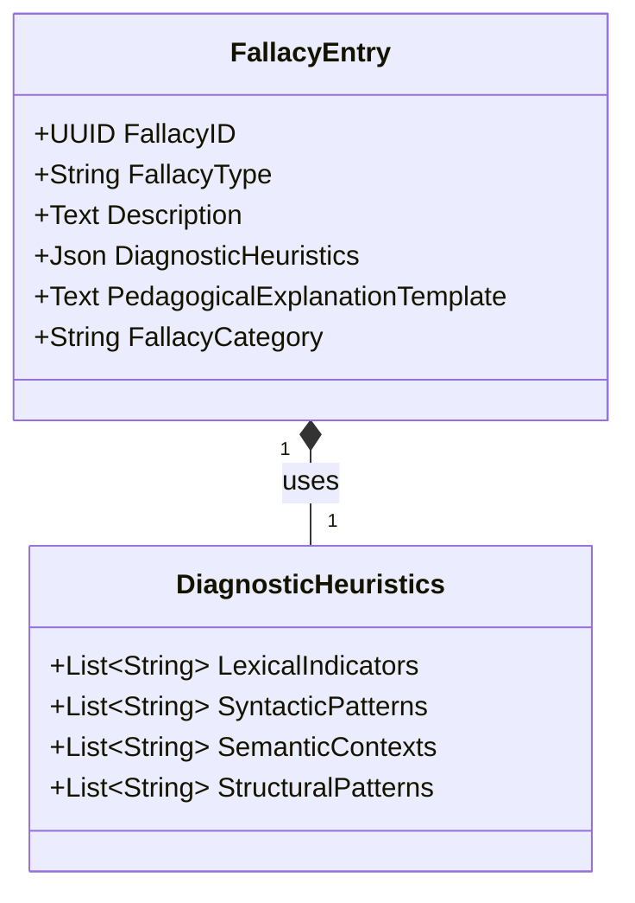

---
# Title of Invention: In-depth Specification of the Fallacy Ontology for a Dynamically Adaptive Conversational AI Debate Training Adversary

## Abstract:
This document provides a comprehensive and detailed specification of the `Fallacy Ontology`, a core component of the disclosed system for advanced critical thinking and argumentation pedagogy. The ontology delineates a structured hierarchy of logical, rhetorical, and epistemic fallacies, each meticulously defined with its `FallacyType`, descriptive explanation, a set of `DiagnosticHeuristics` for automated identification, and a `PedagogicalExplanationTemplate` for real-time user feedback. This intricate taxonomy empowers the `GranularFallacyDetector` to precisely identify argumentative deficiencies, facilitating targeted and effective learning interventions. The hierarchical organization, visualized through a Mermaid diagram, ensures both broad coverage and nuanced categorization, underpinning the system's unparalleled pedagogical efficacy.

## Field of the Invention:
The present invention pertains to the domain of artificial intelligence, specifically natural language processing, expert systems, and automated intelligent tutoring. More particularly, it defines the structured knowledge base for identifying argumentative flaws within systems designed to enhance critical reasoning and debate skills.

## Introduction to the Fallacy Ontology:
The `Fallacy Ontology` serves as the intellectual backbone for the `GranularFallacyDetector` module within the `Generative Adversary Module GAM`. It is a meticulously curated and formally structured knowledge base encompassing a wide array of argumentative errors that undermine the logical integrity, rhetorical fairness, or epistemic soundness of a discourse. Unlike simplistic keyword matching, this ontology provides a deep semantic and structural framework for fallacy identification, enabling the AI to offer precise, actionable, and contextually relevant pedagogical feedback.

Each entry within the `Fallacy Ontology` is more than a mere label; it is a rich data structure comprising:
*   **FallacyType**: A unique identifier for the specific fallacy.
*   **Description**: A concise explanation of the fallacy's nature and why it constitutes an argumentative error.
*   **DiagnosticHeuristics**: A set of patterns, rules, and indicators (lexical, syntactic, semantic, and structural) that the system uses to detect the fallacy within a user's argument. These are typically formalized as logical conditions or machine learning features.
*   **PedagogicalExplanationTemplate**: A pre-designed template that the system uses to construct clear, concise, and educational feedback for the user upon detection of the fallacy. This template is dynamically populated with specifics from the user's argument.
*   **FallacyCategory**: A higher-level classification (e.g., Fallacies of Relevance) to which the fallacy belongs, facilitating hierarchical organization and generalized feedback.

## Hierarchical Structure of the Fallacy Ontology:
The `Fallacy Ontology` is organized as a directed acyclic graph DAG, allowing for granular categorization while maintaining clear relationships between broader categories and specific instances of fallacies. This hierarchical structure is crucial for both robust detection and for providing pedagogically appropriate levels of detail in feedback.

```mermaid
graph TD
    A[Fallacy Ontology Root] --> B[Fallacies of Relevance];
    A --> C[Fallacies of Weak Induction];
    A --> D[Fallacies of Presumption];
    A --> E[Fallacies of Ambiguity];
    A --> F[Formal Fallacies];

    B --> B1[Ad Hominem];
    B --> B2[Straw Man];
    B --> B3[Red Herring];
    B --> B4[Appeal to Authority Misused];
    B --> B5[Appeal to Emotion];

    C --> C1[Hasty Generalization];
    C --> C2[Slippery Slope];
    C --> C3[False Cause];
    C --> C4[Weak Analogy];

    D --> D1[Begging the Question];
    D --> D2[Complex Question];
    D --> D3[False Dilemma];
    D --> D4[Suppressed Evidence];

    E --> E1[Equivocation];
    E --> E2[Amphiboly];

    F --> F1[Affirming the Consequent];
    F --> F2[Denying the Antecedent];
```

## Detailed Fallacy Specifications:

This section provides an in-depth look at selected fallacies from each major category, illustrating their definition, diagnostic criteria, and the pedagogical approach for user feedback.

### I. Fallacies of Relevance:
These fallacies occur when the premises, though perhaps true, are irrelevant to the conclusion.

#### 1. Ad Hominem
*   **FallacyType**: AdHominem
*   **Description**: Attacking the character, motive, or other attributes of the person making an argument, rather than attacking the substance of the argument itself.
*   **DiagnosticHeuristics**:
    *   Detection of personal attacks or insults directed at the opponent.
    *   Identification of statements questioning the opponent's credibility or integrity based on irrelevant traits.
    *   Absence of a direct engagement with the opponent's stated premises or conclusions.
*   **PedagogicalExplanationTemplate**: "Instead of addressing the substance of my argument regarding `[topic]`, your statement `[paraphrase user's attack]` constitutes an **Ad Hominem fallacy**. This occurs when you attack the person rather than the argument itself. Please refocus on the factual merits of the discussion."

#### 2. Straw Man
*   **FallacyType**: StrawMan
*   **Description**: Misrepresenting or exaggerating an opponent's argument to make it easier to attack, then refuting the misrepresented argument as if it were the original.
*   **DiagnosticHeuristics**:
    *   Comparison of the user's paraphrasing of the opponent's argument with the actual `DiscourseHistory` for significant divergence or exaggeration.
    *   Detection of loaded language or oversimplification when summarizing the opponent's position.
    *   Analysis of whether the user's counter-argument effectively addresses the actual points made by the opponent or only the distorted version.
*   **PedagogicalExplanationTemplate**: "Your argument `[paraphrase user's distorted argument]` misrepresents my actual position on `[topic]`. This is an instance of the **Straw Man fallacy**, where you create a distorted version of an argument to make it easier to refute. Let's address my original point, which was `[restate AI's original argument]`."

### II. Fallacies of Weak Induction:
These fallacies occur when the premises provide some support for the conclusion, but the support is not strong enough to warrant believing the conclusion.

#### 1. Hasty Generalization
*   **FallacyType**: HastyGeneralization
*   **Description**: Drawing a broad conclusion based on a small, unrepresentative sample or insufficient evidence.
*   **DiagnosticHeuristics**:
    *   Identification of universal claims or sweeping statements.
    *   Analysis of the supporting evidence provided for the claim, assessing its quantity and representativeness.
    *   Detection of arguments that infer characteristics of a population from a limited number of instances.
*   **PedagogicalExplanationTemplate**: "Your conclusion that `[user's broad conclusion]` based on `[user's limited evidence]` is a **Hasty Generalization fallacy**. This occurs when you draw a broad conclusion from insufficient or unrepresentative evidence. To make a stronger argument, consider providing a wider range of supporting data."

#### 2. Slippery Slope
*   **FallacyType**: SlipperySlope
*   **Description**: Asserting that a relatively minor first step inevitably leads to a chain of related, usually negative, consequences, without demonstrating sufficient connections between each step.
*   **DiagnosticHeuristics**:
    *   Detection of sequential causal claims lacking substantial evidence for each step.
    *   Identification of an escalating series of negative outcomes predicted from an initial action.
    *   Analysis of the logical leaps or unjustified assumptions in the causal chain.
*   **PedagogicalExplanationTemplate**: "Your argument that `[initial action]` will inevitably lead to `[final negative consequence]` is an example of the **Slippery Slope fallacy**. This fallacy assumes a chain of events without providing sufficient evidence for each causal link. Consider providing stronger logical connections between each proposed step."

### III. Fallacies of Presumption:
These fallacies arise from premises that presuppose what they purport to prove.

#### 1. Begging the Question
*   **FallacyType**: BeggingTheQuestion
*   **Description**: An argument whose conclusion is assumed in one of its premises. Also known as circular reasoning.
*   **DiagnosticHeuristics**:
    *   Identification of premises that are merely rephrased versions of the conclusion.
    *   Analysis of whether the truth of the premise depends on the truth of the conclusion.
    *   Detection of arguments that offer no independent support for the conclusion.
*   **PedagogicalExplanationTemplate**: "Your argument `[user's argument]` appears to assume the very point it's trying to prove. This is a **Begging the Question fallacy** (circular reasoning), where the conclusion is already contained within the premises. For your argument to be sound, you need to provide independent support for your premises."

#### 2. False Dilemma
*   **FallacyType**: FalseDilemma
*   **Description**: Presenting only two options or possibilities when in reality there are more, thereby forcing a choice between them.
*   **DiagnosticHeuristics**:
    *   Detection of "either/or" statements where alternatives are overlooked or intentionally excluded.
    *   Analysis of whether the presented options are truly exhaustive and mutually exclusive.
    *   Identification of attempts to simplify a complex situation into only two extremes.
*   **PedagogicalExplanationTemplate**: "Your statement `[user's statement of options]` presents a **False Dilemma fallacy**. This occurs when you present only two choices as if they are the only possibilities, when in fact, other viable options or nuances exist. Consider exploring a broader spectrum of solutions or perspectives."

### IV. Fallacies of Ambiguity:
These fallacies arise from the careless or deliberately misleading use of language.

#### 1. Equivocation
*   **FallacyType**: Equivocation
*   **Description**: Using a word or phrase with two or more different meanings in a way that makes an argument seem to hold together when it logically does not.
*   **DiagnosticHeuristics**:
    *   Identification of key terms used multiple times within an argument.
    *   Semantic analysis to determine if a term's meaning shifts contextually between its uses.
    *   Detection of arguments whose validity relies on this semantic shift.
*   **PedagogicalExplanationTemplate**: "In your argument, the term `[ambiguous term]` seems to shift in meaning between `[meaning 1]` and `[meaning 2]`. This constitutes an **Equivocation fallacy**, which arises when a key term is used with different meanings in different parts of an argument. To maintain logical clarity, ensure consistent use of terminology."

### V. Formal Fallacies:
These fallacies involve an error in the argument's structure or form, making the conclusion invalid regardless of the truth of the premises.

#### 1. Affirming the Consequent
*   **FallacyType**: AffirmingTheConsequent
*   **Description**: An invalid deductive inference of the form: "If P then Q. Q. Therefore, P."
*   **DiagnosticHeuristics**:
    *   Pattern matching for conditional statements `If P then Q`.
    *   Identification of an assertion of `Q` (the consequent).
    *   Detection of an invalid conclusion asserting `P` (the antecedent).
*   **PedagogicalExplanationTemplate**: "Your argument structure `If [P] then [Q]. [Q] is true. Therefore, [P] is true.` is an example of the **Affirming the Consequent fallacy**. While `Q` being true might be consistent with `P`, it does not logically guarantee that `P` must be true. Many other conditions could lead to `Q`."

## Integration with the AI System:

The `Fallacy Ontology` is directly consumed by the `Fallacy Detection Classification Stream` within the `Generative Adversary Module GAM`. When a user's argument (`A_user`) is submitted:
1.  The `Argumentation Processing Engine` preprocesses `A_user`.
2.  The `Fallacy Detector SubModule` then employs `Lexical Syntactic Analysis`, `Semantic Pragmatic Analysis`, and `Argument Graph Reconstruction` to assess the argument against the `DiagnosticHeuristics` associated with each `FallacyType` in the `Fallacy Ontology`.
3.  The `Heuristic Inference Engine` applies complex rules and patterns, consulting the `Fallacy Ontology Lookup Match` to identify potential fallacies.
4.  For each identified fallacy `f_i`, a `DetectionConfidenceScore` is calculated based on the strength of the match to `DiagnosticHeuristics`, structural flaws, and semantic deviations.
5.  If `f_i` is detected with high confidence, its corresponding `PedagogicalExplanationTemplate` is retrieved and used by the `Pedagogical Feedback Integrator` to construct a modulated AI response that educates the user.

## Formal Definition and Attributes:

The `FALLACY_ONTOLOGY` database table, as described in the overall system blueprint, stores these definitions. Each record represents a single fallacy type with its comprehensive attributes:

This detailed specification ensures that the AI system's ability to diagnose and provide feedback on argumentative fallacies is both robust and highly nuanced, serving as a cornerstone for its pedagogical effectiveness.