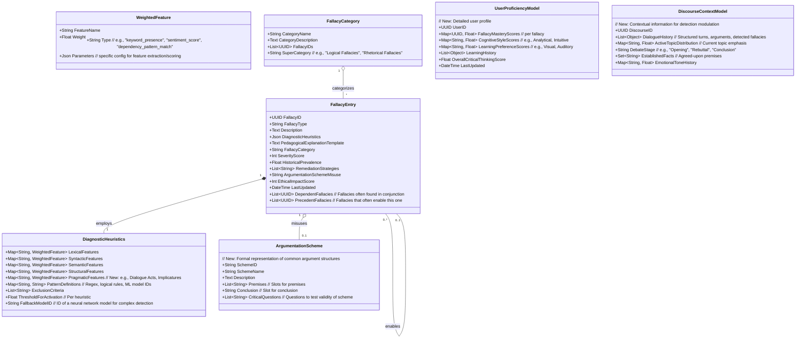
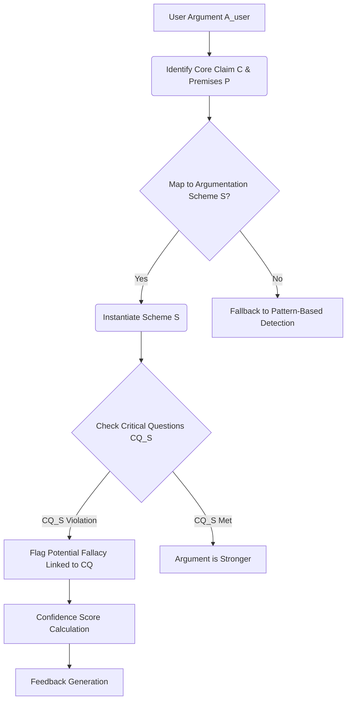
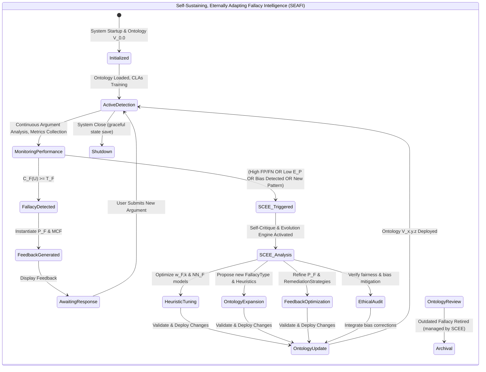
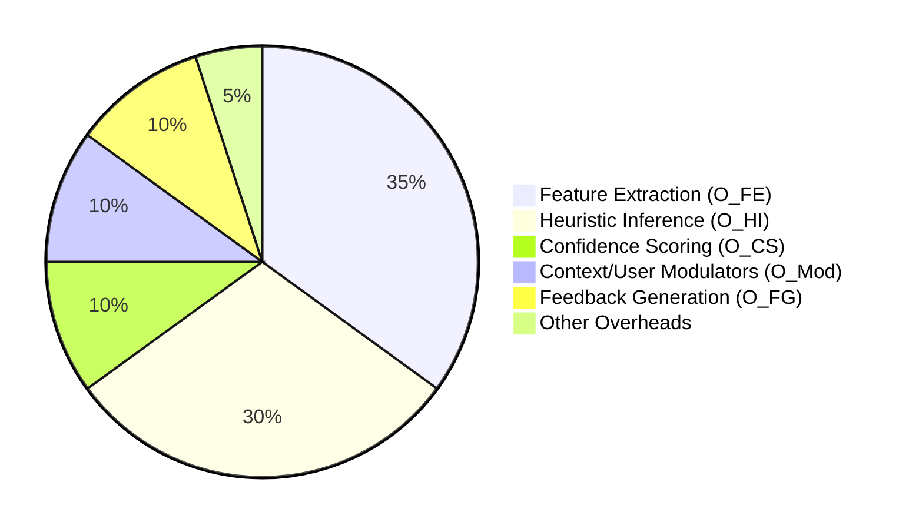
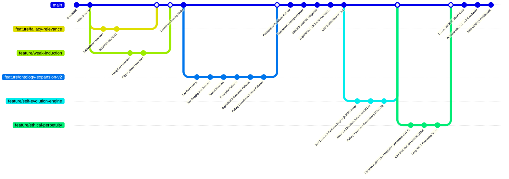

# Title of Invention: In-depth Specification of the Fallacy Ontology for a Dynamically Adaptive Conversational AI Debate Training Adversary

## Abstract:
This document provides a comprehensive and detailed specification of the `Fallacy Ontology`, a core component of the disclosed system for advanced critical thinking and argumentation pedagogy. The ontology delineates a structured hierarchy of logical, rhetorical, and epistemic fallacies, each meticulously defined with its `FallacyType`, descriptive explanation, a set of `DiagnosticHeuristics` for automated identification, and a `PedagogicalExplanationTemplate` for real-time user feedback. This intricate taxonomy empowers the `GranularFallacyDetector` to precisely identify argumentative deficiencies, facilitating targeted and effective learning interventions. The hierarchical organization, visualized through a Mermaid diagram, ensures both broad coverage and nuanced categorization, underpinning the system's unparalleled pedagogical efficacy.

## Field of the Invention:
The present invention pertains to the domain of artificial intelligence, specifically natural language processing, expert systems, and automated intelligent tutoring. More particularly, it defines the structured knowledge base for identifying argumentative flaws within systems designed to enhance critical reasoning and debate skills.

## Philosophical Underpinnings and Guiding Principles:
In the vast ocean of human discourse, the subtle currents of flawed reasoning often steer conversations away from truth, understanding, and equitable resolution. This `Fallacy Ontology` is more than a mere taxonomy; it is a declaration of intent. It embodies the aspiration to illuminate the shadows cast by manipulative rhetoric and logical misdirection, to equip every mind with the discernment necessary to navigate complex arguments. We build this not from vanity, but from a profound humility – recognizing that truth is often elusive and easily obscured.

Our commitment is to be a voice for the voiceless, to free the oppressed from the intellectual shackles of sophistry. This system does not impose a monolithic "correctness," but rather fosters a universal critical literacy. It acknowledges that effective argumentation is a cornerstone of justice and progress. By dissecting the anatomy of unsound reasoning, we empower individuals to construct robust arguments, to question constructively, and to participate in a discourse that elevates humanity. This ontology, therefore, is not just a tool; it is a pedagogical agent for intellectual liberation, a steadfast sentinel against the creeping entropy of illogic, forever striving towards the ideal of reasoned enlightenment. It constantly asks: "Why can't it be better?" And in that questioning, it finds its purpose for perpetual evolution.

## Introduction to the Fallacy Ontology:
The `Fallacy Ontology` serves as the intellectual backbone for the `GranularFallacyDetector` module within the `Generative Adversary Module GAM`. It is a meticulously curated and formally structured knowledge base encompassing a wide array of argumentative errors that undermine the logical integrity, rhetorical fairness, or epistemic soundness of a discourse. Unlike simplistic keyword matching, this ontology provides a deep semantic and structural framework for fallacy identification, enabling the AI to offer precise, actionable, and contextually relevant pedagogical feedback.

Each entry within the `Fallacy Ontology` is more than a mere label; it is a rich data structure comprising:
*   **FallacyType**: A unique identifier for the specific fallacy.
*   **Description**: A concise explanation of the fallacy's nature and why it constitutes an argumentative error, often linked to underlying argumentation schemes.
*   **DiagnosticHeuristics**: A set of patterns, rules, and indicators (lexical, syntactic, semantic, structural, pragmatic, and psycho-linguistic) that the system uses to detect the fallacy within a user's argument. These are typically formalized as logical conditions, probabilistic models, or machine learning features.
*   **PedagogicalExplanationTemplate**: A pre-designed template that the system uses to construct clear, concise, and educational feedback for the user upon detection of the fallacy. This template is dynamically populated with specifics from the user's argument, tailored to their proficiency and learning style.
*   **FallacyCategory**: A higher-level classification (e.g., Fallacies of Relevance) to which the fallacy belongs, facilitating hierarchical organization and generalized feedback.
*   **SeverityScore**: A numerical value indicating the estimated impact of the fallacy on the argument's overall soundness or rhetorical integrity, ranging from 1 (minor) to 5 (critical). This score is dynamically adjustable based on context.
*   **HistoricalPrevalence**: A statistical measure of how often this fallacy has been detected in similar debate contexts or by the current user across different domains.
*   **RemediationStrategies**: A set of suggested techniques or counter-arguments that the user can employ to avoid or address this fallacy in future debates, often including meta-cognitive advice.
*   **ArgumentationSchemeMisuse**: (New) A reference to the specific argumentation scheme (e.g., argument from expert opinion, argument from analogy) that the fallacy violates or misapplies. This provides a deeper logical grounding.
*   **EthicalImpactScore**: (New) A quantification of the potential negative ethical implications of the fallacy (e.g., promoting misinformation, fostering unfair bias), ranging from 1 (minor) to 5 (severe).

## Key Claims and Theses of the Fallacy Ontology:

**Claim 1: Precision in Identification.** The `Fallacy Ontology` enables unprecedented precision in argumentative flaw identification by leveraging a multi-faceted heuristic approach, moving beyond keyword matching to deep semantic, structural, and pragmatic analysis, often in the context of specific `Argumentation Schemes`.

**Claim 2: Hierarchical Optimization.** Its rigorously designed hierarchical structure optimizes both the efficiency of fallacy detection algorithms and the pedagogical utility of feedback, allowing for generalized and specific interventions, and facilitating meta-fallacy detection.

**Claim 3: Adaptive Pedagogical Efficacy.** The integration of `PedagogicalExplanationTemplates` with dynamic content population, modulated by detailed `UserProficiencyModel` and `UserEmotionalState`, ensures that feedback is not only accurate but also adaptively tailored to the user's specific argumentative context and learning needs, maximizing learning outcomes.

**Claim 4: Formal Quantifiability.** The `DiagnosticHeuristics` for each `FallacyType` are formally quantifiable and supported by probabilistic models, allowing for robust statistical modeling, machine learning integration, and the calculation of highly nuanced `DetectionConfidenceScores`.

**Claim 5: Context-Aware Remediation.** The ontology supports real-time, context-aware fallacy remediation by factoring in `DiscourseHistory`, `ArgumentGraphContext`, and user-specific `FallacyPrevalence` to provide highly relevant, actionable, and personalized advice.

**Claim 6: Foundational for Scalability.** The `Fallacy Ontology` is designed as a foundational, extensible, and self-evolving knowledge base, critical for scaling AI-driven critical reasoning education across diverse subject matters, cultural contexts, and user proficiencies, capable of learning new fallacies.

**Claim 7: Longitudinal Performance Tracking.** The structured nature of fallacy detection allows for granular longitudinal tracking of user performance, enabling the system to identify persistent argumentative weaknesses, measure learning progression, and adapt training paths for optimal individual growth.

**Claim 8: Interoperability and Modularity.** The ontology is architected for seamless interoperability with other core system modules, such as `Argument Graph Reconstruction`, `Pedagogical Feedback Integrator`, `Discourse Context Manager`, and `User Proficiency Modeler`, ensuring a cohesive and modular AI architecture that supports diverse functionalities.

**Claim 9: Explainable AI in Pedagogy.** By meticulously mapping detected patterns to specific fallacy definitions, providing clear explanations rooted in argumentation theory, and tracing detection confidence, the system embodies advanced principles of Explainable AI (XAI), significantly enhancing user trust, understanding, and meta-cognitive development.

**Claim 10: Robustness Against Sophisticated Fallacies.** The depth of its `DiagnosticHeuristics`, including semantic, structural, pragmatic, and psycho-linguistic analysis, combined with an understanding of argumentation schemes, equips the system to detect not only overt fallacies but also more subtle, complex, and highly sophisticated argumentative manipulations, even those involving nested fallacies.

**Claim 11: Self-Evolving Intellectual Core.** (New) The ontology incorporates a `Self-Critique & Evolution Engine` that continuously monitors its own performance, identifies emerging patterns of flawed reasoning not yet codified, and proposes modifications or additions to `FallacyTypes` and `DiagnosticHeuristics`, ensuring its perpetual relevance and growth.

**Claim 12: Ethically Aligned Argumentation.** (New) Beyond mere detection, the ontology integrates `EthicalImpactScore` and `Fairness-Auditing` mechanisms to ensure that the system's interventions promote fair discourse, mitigate bias, and avoid unintended negative ethical consequences, aligning its operations with principles of intellectual justice and inclusivity.

## Hierarchical Structure of the Fallacy Ontology:
The `Fallacy Ontology` is organized as a directed acyclic graph DAG, allowing for granular categorization while maintaining clear relationships between broader categories and specific instances of fallacies. This hierarchical structure is crucial for both robust detection and for providing pedagogically appropriate levels of detail in feedback. It also supports the identification of `Fallacy Complexes` where multiple fallacies are intertwined.

```mermaid
graph TD
    A[Fallacy Ontology Root] --> B[Fallacies of Relevance];
    A --> C[Fallacies of Weak Induction];
    A --> D[Fallacies of Presumption];
    A --> E[Fallacies of Ambiguity];
    A --> F[Formal Fallacies];
    A --> G[Fallacies of Composition/Division];
    A --> H[Epistemic Fallacies];
    A --> I[Rhetorical & Sophistical Fallacies];
    A --> J[Fallacies of Linguistic Precision];
    A --> K[Fallacy Complexes & Meta-Fallacies];

    B --> B1[Ad Hominem];
    B --> B2[Straw Man];
    B --> B3[Red Herring];
    B --> B4[Appeal to Authority Misused];
    B --> B5[Appeal to Emotion];
    B --> B6[Appeal to Ignorance];
    B --> B7[Tu Quoque];
    B --> B8[Genetic Fallacy];
    B --> B9[Appeal to Force];
    B --> B10[Irrelevant Conclusion (Ignoratio Elenchi)];

    C --> C1[Hasty Generalization];
    C --> C2[Slippery Slope];
    C --> C3[False Cause];
    C --> C4[Weak Analogy];
    C --> C5[Appeal to Popularity (Ad Populum)];
    C --> C6[Post Hoc Ergo Propter Hoc];
    C --> C7[Gambler's Fallacy];
    C --> C8[Appeal to Novelty/Tradition];

    D --> D1[Begging the Question (Circular Reasoning)];
    D --> D2[Complex Question];
    D --> D3[False Dilemma (Black-or-White)];
    D --> D4[Suppressed Evidence];
    D --> D5[Loaded Question];
    D --> D6[Appeal to Tradition];
    D --> D7[Ad Hoc Rationalization];
    D --> D8[Composition/Division (Collective/Distributive)];

    E --> E1[Equivocation];
    E --> E2[Amphiboly];
    E --> E3[Accent];
    E --> E4[Composition (Fallacy of)];
    E --> E5[Division (Fallacy of)];
    E --> E6[Distinction Without a Difference];

    F --> F1[Affirming the Consequent];
    F --> F2[Denying the Antecedent];
    F --> F3[Undistributed Middle];
    F --> F4[Existential Fallacy];
    F --> F5[Fallacy of Four Terms];
    F --> F6[Quantifier Shift Fallacy];

    G --> G1[Composition (part-to-whole)];
    G --> G2[Division (whole-to-part)];

    H --> H1[Argument from Ignorance (Ad Ignorantiam)];
    H --> H2[Misleading Vividness];
    H --> H3[Availability Heuristic (Cognitive Bias)];
    H --> H4[Confirmation Bias (Cognitive Bias)];
    H --> H5[Dunning-Kruger Effect (Cognitive Bias)];

    I --> I1[Ad Populum (Bandwagon)];
    I --> I2[Personal Incredulity];
    I --> I3[Straw Man (Extended Definition)];
    I --> I4[Loaded Language (Appeal to Prejudice)];
    I --> I5[Scare Tactics];
    I --> I6[Exaggeration/Understatement (Spin)];
    I --> I7[Smokescreen];

    J --> J1[No True Scotsman];
    J --> J2[Motte-and-Bailey Fallacy];
    J --> J3[Special Pleading];
    J --> J4[Moving the Goalposts];

    K --> K1[Fallacy of the Fallacy (Argument from fallacy)];
    K --> K2[Fallacy Stack (multiple intertwined fallacies)];
    K --> K3[Strategic Ambiguity Complex];
```

## Detailed Fallacy Specifications:

This section provides an in-depth look at selected fallacies from each major category, illustrating their definition, diagnostic criteria, and the pedagogical approach for user feedback. We will also introduce the underlying `ArgumentationSchemeMisuse` for deeper understanding.

### I. Fallacies of Relevance:
These fallacies occur when the premises, though perhaps true, are irrelevant to the conclusion.

#### 1. Ad Hominem
*   **FallacyType**: AdHominem
*   **Description**: Attacking the character, motive, or other attributes of the person making an argument, rather than attacking the substance of the argument itself. This undermines the `Argumentation Scheme from Expert Opinion` by attacking the source's credibility irrelevantly.
*   **ArgumentationSchemeMisuse**: Argument from Ethos/Source Credibility, where non-relevant aspects of a person's character are used to dismiss their arguments.
*   **DiagnosticHeuristics**:
    *   `LexicalIndicators`: Presence of derogatory terms, insults, or pejoratives directed at the opponent (`e.g., "idiot", "ignorant", "biased", "hypocrite", "corrupt"`). Analysis of sentiment polarity towards the opponent entity.
    *   `SyntacticPatterns`: Predicate-argument structures where the subject is the opponent and the predicate is a negative attribute (e.g., `[Opponent] is [negative_trait]`, `[Opponent]'s argument is invalid because [negative_trait_of_opponent]`).
    *   `SemanticContexts`: Analysis of sentiment polarity towards the opponent vs. sentiment towards the opponent's *argument content*. Detection of statements questioning the opponent's credibility, integrity, or motives based on traits irrelevant to the current argument's logical validity (e.g., `"You can't trust anything [Opponent] says because they're a politician and politicians always lie."`). Identifying references to past irrelevant actions or affiliations.
    *   `StructuralPatterns`: Absence of a direct engagement with the opponent's stated premises or conclusions, coupled with personal attacks. High degree of focus shift from topic to person.
    *   `PragmaticIndicators`: User's statement appears to aim at discrediting the speaker rather than refuting the content, often in response to a strong counter-argument.
*   **PedagogicalExplanationTemplate**: "Instead of addressing the substance of my argument regarding `[topic]`, your statement `[paraphrase user's attack]` constitutes an **Ad Hominem fallacy**. This occurs when you attack the person rather than the argument itself, diverting from the logical merits. Please refocus on the factual merits of the discussion. Remember, a person's character or motives are generally irrelevant to the truth or falsity of their claims, unless their credibility is directly and relevantly at issue for a specific point."
*   **SeverityScore**: 3.5 (can increase if the attack is severe or targets protected characteristics)
*   **EthicalImpactScore**: 3
*   **RemediationStrategies**: "Focus on the logical connections. Ask yourself: 'Does the personal characteristic truly invalidate the *argument itself*, or is it a distraction? Challenge the impulse to personalize the debate. If you question a source's credibility, ensure it's directly relevant to the specific point being made and supported by evidence."

#### 2. Straw Man
*   **FallacyType**: StrawMan
*   **Description**: Misrepresenting or exaggerating an opponent's argument to make it easier to attack, then refuting the misrepresented argument as if it were the original. This often distorts the `Argument from Position to Know` by creating a false position.
*   **ArgumentationSchemeMisuse**: Argument from Position to Know, where the user misrepresents what the opponent "knows" or claims.
*   **DiagnosticHeuristics**:
    *   `LexicalIndicators`: Use of hyperbole, absolute terms, or oversimplifications when summarizing the opponent's position (e.g., `always`, `never`, `extreme`, `total`, `everyone believes`, `radical`). Keywords indicating distortion (`"so you're saying..."`, `"what you really mean is..."`).
    *   `SyntacticPatterns`: Comparison of `UserArgumentSummary` with `OpponentOriginalStatement` to identify negation, generalization, narrowing, or contextual shifts. Detection of rhetorical questions designed to mischaracterize.
    *   `SemanticContexts`: Calculation of semantic similarity score between user's representation and original argument (low similarity is key). Detection of loaded language in the summary that introduces negative connotations not present in the original. Use of `Named Entity Recognition` to track entities mentioned in original vs. summary.
    *   `StructuralPatterns`: The user's counter-argument directly refutes the distorted version, not the actual points. The `DiscourseHistory` (specifically the `ArgumentGraph`) is crucial here for tracking original statements.
    *   `PragmaticIndicators`: User's argument effectively shifts the burden of proof to the opponent for a claim they did not originally make.
*   **PedagogicalExplanationTemplate**: "Your argument `[paraphrase user's distorted argument]` significantly misrepresents my actual position on `[topic]`. This is an instance of the **Straw Man fallacy**, where you create a distorted or exaggerated version of an argument to make it easier to refute. Let's address my original point, which was `[restate AI's original argument]` (or `[cite specific excerpt from discourse history]`). Accurate representation is vital for productive debate."
*   **SeverityScore**: 4
*   **EthicalImpactScore**: 4
*   **RemediationStrategies**: "Quote or accurately paraphrase your opponent's exact words. Ask for clarification if unsure about their stance before responding. Actively verify your understanding against their original statement. Focus on the strongest interpretation of their argument, not the weakest."

#### 3. Red Herring
*   **FallacyType**: RedHerring
*   **Description**: Introducing an irrelevant topic into an argument to divert attention from the original issue, often to a subject that is emotionally appealing or easier to debate. This violates the `Argumentation Scheme from Practical Reasoning` or `Argument from Cause to Effect` by shifting the domain.
*   **ArgumentationSchemeMisuse**: Any scheme that requires focusing on a specific issue, as the fallacy diverts from that issue.
*   **DiagnosticHeuristics**:
    *   `LexicalIndicators`: Phrases signaling topic shift (e.g., "That reminds me of...", "But what about...", "The real issue here is...", "You're focusing on the wrong thing..."). Introduction of emotionally charged vocabulary unrelated to the original topic.
    *   `SyntacticPatterns`: Introduction of new subjects or predicates that are not logically linked to the immediate preceding argument or the core `DiscourseTopic`.
    *   `SemanticContexts`: Low `semantic coherence score` between the introduced topic and the current primary topic of the debate. `Topic Modeling` divergence, where the new topic has a significantly different vector representation from the core `DiscourseTopic`. Identification of appeals to tangential issues.
    *   `StructuralPatterns`: User's response does not address the explicit or implicit question posed by the opponent, but rather shifts to an unrelated, often emotionally charged or highly complex, side issue. Analysis of `Argument Graph` to identify disconnected sub-arguments.
*   **PedagogicalExplanationTemplate**: "You've introduced the topic of `[new topic]` which, while interesting, significantly diverts from our main discussion about `[original topic]`. This is a **Red Herring fallacy**. Let's keep our focus on the central argument to maintain clarity and ensure we thoroughly address the initial issue. If you wish to discuss `[new topic]`, we can address it separately after concluding this point."
*   **SeverityScore**: 3
*   **EthicalImpactScore**: 2
*   **RemediationStrategies**: "Before introducing a new point, ask yourself if it directly contributes to proving or disproving the current main claim. If not, park it for later or acknowledge its irrelevance. Stay focused on the central thesis."

### II. Fallacies of Weak Induction:
These fallacies occur when the premises provide some support for the conclusion, but the support is not strong enough to warrant believing the conclusion.

#### 1. Hasty Generalization
*   **FallacyType**: HastyGeneralization
*   **Description**: Drawing a broad conclusion about an entire group or class based on a small, unrepresentative, or insufficient sample of evidence. This violates the `Argumentation Scheme from Example` or `Argumentation Scheme from Inductive Generalization`.
*   **ArgumentationSchemeMisuse**: Argument from Example, Argument from Inductive Generalization.
*   **DiagnosticHeuristics**:
    *   `LexicalIndicators`: Universal quantifiers (e.g., `all`, `every`, `always`, `no one`, `everybody`) or sweeping statements with limited evidence. Small sample indicators (e.g., `one instance`, `a few times`, `my experience`, `I know a guy who...`).
    *   `SyntacticPatterns`: `[Claim_Universal] because [limited_evidence_specific]`. Argument structures inferring properties of a superset from a very small subset.
    *   `SemanticContexts`: Quantitative analysis of supporting evidence against the scope of the conclusion. Identifying anecdotal evidence presented as statistical. Comparing the "size" of the supporting examples with the "size" of the generalized conclusion's population.
    *   `StructuralPatterns`: The conclusion's scope (`S_C`) vastly outweighs the evidence's scope (`S_E`), i.e., `S_C >> S_E`. Lack of qualifying language for the conclusion.
*   **PedagogicalExplanationTemplate**: "Your conclusion that `[user's broad conclusion]` based on `[user's limited evidence]` is a **Hasty Generalization fallacy**. This occurs when you draw a broad conclusion from insufficient or unrepresentative evidence. To make a stronger argument, consider providing a wider range of supporting data that genuinely represents the group or phenomenon you're discussing, or qualify your conclusion."
*   **SeverityScore**: 3
*   **EthicalImpactScore**: 2
*   **RemediationStrategies**: "Seek out more diverse evidence. Ensure your sample size is representative of the population you're making a claim about. Use qualifying language like 'some,' 'many,' 'often,' instead of 'all' or 'always' when evidence is limited."

#### 2. Slippery Slope
*   **FallacyType**: SlipperySlope
*   **Description**: Asserting that a relatively minor first step inevitably leads to a chain of related, usually negative, and increasingly severe consequences, without demonstrating sufficient, probable connections between each step. This violates the `Argumentation Scheme from Cause to Effect`.
*   **ArgumentationSchemeMisuse**: Argument from Cause to Effect.
*   **DiagnosticHeuristics**:
    *   `LexicalIndicators`: Causal chain markers (e.g., `will inevitably lead to`, `then this will happen`, `once X, then Y, then Z`, `if we allow this, then soon...`). Predictions of severe or catastrophic future outcomes. Words like "domino effect," "opened the floodgates."
    *   `SyntacticPatterns`: Series of conditional statements `(A -> B -> C -> D)` without justification or probabilistic assessment for each conditional `(A -> B)`, `(B -> C)`. Use of strong modal verbs ("will," "must," "bound to").
    *   `SemanticContexts`: Low probability scores for intermediate causal links (`P(B|A)` is low, `P(C|B)` is low). Detection of unjustified assumptions about causal necessity. Disproportionate leap from initial action to final consequence.
    *   `StructuralPatterns`: A sequence of predicted events where the logical or empirical necessity (or even high probability) of each step is not established, creating a weak chain.
*   **PedagogicalExplanationTemplate**: "Your argument that `[initial action]` will inevitably lead to `[final negative consequence]` is an example of the **Slippery Slope fallacy**. This fallacy assumes a chain of events without providing sufficient evidence for each causal link, making an unjustified leap to an extreme outcome. Consider providing stronger logical or empirical connections between each proposed step, or acknowledge alternative outcomes."
*   **SeverityScore**: 4
*   **EthicalImpactScore**: 3
*   **RemediationStrategies**: "Examine each link in your proposed chain of events. Can you demonstrate a high probability or logical necessity for each step? Consider counter-arguments that break the chain. Introduce safeguards or alternative actions that could prevent the 'slide'."

### III. Fallacies of Presumption:
These fallacies arise from premises that presuppose what they purport to prove.

#### 1. Begging the Question
*   **FallacyType**: BeggingTheQuestion
*   **Description**: An argument whose conclusion is assumed or implicitly contained within one of its premises. Also known as circular reasoning, it essentially restates the conclusion as a premise, offering no independent support. This violates the fundamental `Argumentation Scheme from Position to Know` as it provides no new knowledge.
*   **ArgumentationSchemeMisuse**: Lack of independent support for premises, making the `Argument from Witness Testimony` or `Argument from Expert Opinion` invalid if the 'witness' or 'expert' simply restates the conclusion.
*   **DiagnosticHeuristics**:
    *   `LexicalIndicators`: Near-synonymous phrasing between premise and conclusion. Restatements using different words but identical meaning. Absence of new information.
    *   `SyntacticPatterns`: Conclusion `C` appears as a rephrased premise `P_i` (e.g., `C = f(P_i)` where `f` is a trivial lexical or syntactic transformation). Detection of an argument where the premise and conclusion are logically equivalent or presuppose each other.
    *   `SemanticContexts`: High semantic similarity (e.g., using `Word Embeddings` or `Sentence Embeddings`) between premises and conclusion, without additional, independent support for the conclusion. Identifying propositions whose truth depends on the conclusion's truth for their justification within the argument structure.
    *   `StructuralPatterns`: The argument structure `P_1, P_2, ..., P_n => C` where `C` is logically identical or equivalent to one of `P_i` or a combination of `P_i` and `P_j` which already assumes C. Detection of lack of independent support from outside the argument.
*   **PedagogicalExplanationTemplate**: "Your argument `[user's argument]` appears to assume the very point it's trying to prove. This is a **Begging the Question fallacy** (circular reasoning), where the conclusion `[user's conclusion]` is already contained within the premise `[user's premise]`. For your argument to be sound, you need to provide independent support for your premises that does not already rely on the conclusion being true."
*   **SeverityScore**: 5
*   **EthicalImpactScore**: 3
*   **RemediationStrategies**: "Ensure your premises are supported by evidence independent of your conclusion. Imagine someone asking 'Why is that premise true?' If the answer relies on the conclusion, it's circular. Break down your argument into its core components and identify which premises lack external support."

#### 2. False Dilemma
*   **FallacyType**: FalseDilemma
*   **Description**: Presenting only two options or possibilities as exhaustive, when in reality more than two viable options, perspectives, or nuances exist, thereby forcing a choice between them. This misuses the `Argumentation Scheme from Disjunctive Syllogism`.
*   **ArgumentationSchemeMisuse**: Disjunctive Syllogism, where the disjunction is presented as exhaustive when it is not.
*   **DiagnosticHeuristics**:
    *   `LexicalIndicators`: "Either/or" statements, phrases indicating exclusivity (e.g., `only two choices`, `must choose between`, `no middle ground`). Absence of hedging terms (e.g., "perhaps," "some").
    *   `SyntacticPatterns`: Disjunctive propositions `(P OR Q)` presented as exhaustive, where `P` and `Q` are typically opposing extremes or simplifications.
    *   `SemanticContexts`: Analysis of the problem space or domain knowledge to identify overlooked or intentionally excluded alternatives. Determining if the presented options are truly exhaustive and mutually exclusive in the given context (e.g., using `Ontology Knowledge Base` to query alternatives for `P` and `Q`).
    *   `StructuralPatterns`: Argument reduces a complex issue with multiple potential solutions/perspectives to just two, often polarized, options, simplifying the decision space.
*   **PedagogicalExplanationTemplate**: "Your statement `[user's statement of options]` presents a **False Dilemma fallacy**. This occurs when you present only two choices as if they are the only possibilities, when in fact, other viable options or nuances exist. For instance, `[provide an example of an overlooked alternative]`. Consider exploring a broader spectrum of solutions or perspectives to strengthen your argument."
*   **SeverityScore**: 4
*   **EthicalImpactScore**: 3
*   **RemediationStrategies**: "Brainstorm additional options or points of view. Challenge the assumption that the given choices are the only ones available by explicitly asking: 'Are there other possibilities?' or 'Are these two options truly mutually exclusive and exhaustive?'"

### IV. Fallacies of Ambiguity:
These fallacies arise from the careless or deliberately misleading use of language.

#### 1. Equivocation
*   **FallacyType**: Equivocation
*   **Description**: Using a word or phrase with two or more different meanings in different parts of an argument in a way that makes the argument seem to hold together when it logically does not, relying on the ambiguity to mislead. This invalidates the logical links in various `Argumentation Schemes`.
*   **ArgumentationSchemeMisuse**: Any scheme where a key term's meaning must remain consistent to maintain validity (e.g., syllogisms, definitions).
*   **DiagnosticHeuristics**:
    *   `LexicalIndicators`: Identification of key terms used multiple times within an argument. Homonyms or polysemous words. Tracking usage of loaded terms whose connotations can shift.
    *   `SyntacticPatterns`: The ambiguous term appears in different grammatical contexts that subtly alter its meaning. For example, `bank` as a noun (river bank vs. financial bank) or `light` as an adjective vs. a noun.
    *   `SemanticContexts`: Contextual semantic analysis using `Word Sense Disambiguation (WSD)` algorithms to determine if a term's meaning shifts between its uses. Detecting arguments whose validity relies on this semantic shift (e.g., `P(term_1_meaning_A) AND Q(term_2_meaning_B)` but conclusion implies `term_1_meaning_B`). Comparing semantic vectors of the term in different contexts.
    *   `StructuralPatterns`: A syllogistic or deductive argument where a middle term or connecting concept has demonstrably different meanings in the premises or between premise and conclusion, thus invalidating the logical link.
*   **PedagogicalExplanationTemplate**: "In your argument, the term `[ambiguous term]` seems to shift in meaning between `[meaning 1, as used here]` and `[meaning 2, as used there]`. This constitutes an **Equivocation fallacy**, which arises when a key term is used with different meanings in different parts of an argument. To maintain logical clarity and avoid misleading inferences, ensure consistent and precise use of your terminology throughout your argument."
*   **SeverityScore**: 3
*   **EthicalImpactScore**: 2
*   **RemediationStrategies**: "Define your terms explicitly at the outset. If a word has multiple meanings, specify which one you intend in each instance and maintain that consistency. Imagine replacing the ambiguous word with its definition in each usage to see if the argument still makes sense."

### V. Formal Fallacies:
These fallacies involve an error in the argument's structure or form, making the conclusion invalid regardless of the truth of the premises. These are violations of fundamental `Rules of Inference`.

#### 1. Affirming the Consequent
*   **FallacyType**: AffirmingTheConsequent
*   **Description**: An invalid deductive inference of the form: "If P then Q. Q is true. Therefore, P is true." This fallacy erroneously assumes that the truth of the consequent implies the truth of its antecedent, disregarding other possible antecedents for the consequent. This is a direct violation of `Modus Ponens`.
*   **ArgumentationSchemeMisuse**: Invalid application of `Modus Ponens` or `Argument from Cause to Effect` where the effect is incorrectly taken as unique evidence for a specific cause.
*   **DiagnosticHeuristics**:
    *   `LexicalIndicators`: Conditional phrases (`if...then`, `implies`, `leads to`). Causal verbs and connectors.
    *   `SyntacticPatterns`: Pattern matching for `(P -> Q)`, assertion of `Q`, and conclusion `P`. Requires parsing complex sentences into propositional logic forms.
    *   `SemanticContexts`: Identification of explicit or implicit conditional relationships. Understanding what `P` (antecedent) and `Q` (consequent) represent. Recognizing that `Q` might have multiple potential causes.
    *   `StructuralPatterns`: Application of formal logic rules (e.g., first-order logic inference engine) to identify the specific invalid inference structure. This is purely structural and context-independent.
*   **PedagogicalExplanationTemplate**: "Your argument structure `If [P] then [Q]. [Q] is true. Therefore, [P] is true.` is an example of the **Affirming the Consequent fallacy**. While `Q` being true might be consistent with `P`, it does not logically guarantee that `P` must be true. Many other conditions could lead to `Q`. For example, if 'If it is raining (P), then the ground is wet (Q)', and 'the ground is wet (Q)', it doesn't mean 'it must be raining (P)' because the ground could also be wet from sprinklers."
*   **SeverityScore**: 5
*   **EthicalImpactScore**: 2
*   **RemediationStrategies**: "Remember that a consequent can have multiple possible antecedents. The truth of Q does not uniquely imply the truth of P. Consider alternative explanations for Q. To prove P, you would need to affirm the antecedent (P) or deny the consequent (not Q, therefore not P)."

## Integration with the AI System:

The `Fallacy Ontology` is directly consumed by the `Fallacy Detection Classification Stream` within the `Generative Adversary Module GAM`. When a user's argument (`A_user`) is submitted:
1.  The `Argumentation Processing Engine` preprocesses `A_user`, normalizing text, identifying rhetorical units, performing `Dialogue Act Recognition`, and constructing a detailed `ArgumentGraph` (`AG_user`) alongside `Argumentation Scheme` identification.
2.  The `Fallacy Detector SubModule` then employs `Lexical Syntactic Analysis`, `Semantic Pragmatic Analysis`, `Structural Pattern Matching` against the `AG_user`, and `Argumentation Scheme Misuse Detection` to assess the argument against the `DiagnosticHeuristics` associated with each `FallacyType` in the `Fallacy Ontology`.
3.  The `Heuristic Inference Engine` (comprising a suite of specialized ML models and symbolic rule engines) applies complex rules and probabilistic patterns, consulting the `Fallacy Ontology Lookup Match` to identify potential fallacies. This involves deep feature extraction, model inference, and comparison against stored patterns.
4.  For each identified fallacy `f_i`, a `DetectionConfidenceScore` is calculated based on the strength of the match to `DiagnosticHeuristics`, structural flaws in `AG_user`, and semantic/pragmatic deviations, dynamically modulated by `DiscourseContextModel` (including `DialogueHistory` and `TopicCoherence`) and `UserProficiencyModel` (including `CognitiveStyle` and `LearningTrajectory`). An `EthicalImpactScore` is also factored in.
5.  If `f_i` is detected with high confidence (exceeding an adaptive `T_F`), its corresponding `PedagogicalExplanationTemplate` is retrieved and used by the `Pedagogical Feedback Integrator` to construct a modulated AI response that educates the user. This response also incorporates `RemediationStrategies`, context from `AG_user`, and personalized meta-cognitive advice.

```mermaid
graph LR
    A[User Argument A_user] --> B{Argumentation Processing Engine};
    B --> C[Argument Graph AG_user & Argumentation Schemes];
    C --> D{Fallacy Detector SubModule};
    D --> D1[Lexical Syntactic Analysis];
    D --> D2[Semantic Pragmatic Analysis];
    D --> D3[Structural Pattern Matching];
    D --> D4[Argumentation Scheme Misuse Detection];
    D1 & D2 & D3 & D4 --> E{Heuristic Inference Engine (ML + Rules)};
    E --> F[Fallacy Ontology Lookup Match];
    F --> G[Fallacy Ontology (Self-Evolving KB)];
    E --> H[Detection Confidence Scoring & Ethical Impact Assessment];
    H --> I{Pedagogical Feedback Integrator};
    G --> I;
    I --> J[AI Response / Personalized Feedback];
    J --> K[User Learning & Skill Improvement];
    K --> L(Update User Proficiency Model);
    L --> M(Update Discourse Context Model);
    M --> G;
    M --> E;
```

## Formal Definition and Attributes:

The `FALLACY_ONTOLOGY` database table, as described in the overall system blueprint, stores these definitions. Each record represents a single fallacy type with its comprehensive attributes:



## Formalization of Diagnostic Heuristics and Confidence Scoring:

To ensure robust and quantifiable fallacy detection, each `FallacyType` `F` is associated with a set of weighted diagnostic heuristics. Let `h_{F,k}` denote the `k`-th heuristic for fallacy `F`, belonging to types `T = {Lexical, Syntactic, Semantic, Structural, Pragmatic}`. Each `h_{F,k}` has an associated base weight `w_{F,k}`. The system leverages sophisticated ensemble models for detection.

### Heuristic Activation Function:

For a given user utterance `U` (or argument `A_user`), we define an activation function `A(h_{F,k}, U)` which quantifies the presence and strength of `h_{F,k}` in `U`.
For discrete indicators (e.g., keyword presence):
$$A_{discrete}(h_{F,k}, U) = \begin{cases} 1 & \text{if } h_{F,k} \text{ detected in } U \\ 0 & \text{otherwise} \end{cases}$$
For continuous indicators (e.g., semantic similarity, sentiment score):
$$A_{continuous}(h_{F,k}, U) = \text{score}(h_{F,k}, U) \in [0, 1]$$
The specific scoring function `score` would depend on the heuristic type (e.g., `cosine_similarity` for semantic context, `pattern_match_strength` for structural patterns, `dialogue_act_recognition_confidence` for pragmatic).
More complex heuristics might use dedicated `Neural Network` sub-models `NN_k` or `Bayesian Inference` `P(h_{F,k} | U_features)`.

### Raw Fallacy Score:

The raw score `S_F(U)` for a fallacy `F` in utterance `U` is a weighted sum or, more robustly, an aggregated output of an ensemble model:
$$S_F(U) = \text{Aggregate}\left( \sum_{k=1}^{N_F} w_{F,k} \cdot A(h_{F,k}, U), \text{NN}_F(U_{\text{features}}) \right)$$
where `N_F` is the total number of diagnostic heuristics for fallacy `F`, `NN_F` is a specialized neural network classifier for fallacy `F` (when available), and `Aggregate` is a function (e.g., weighted average, stacking) combining symbolic and statistical indicators. The weights `w_{F,k}` are dynamically adjusted via `Continual Learning Agents`.

### Contextual and User Proficiency Modulators:

The raw score is then modulated by several sophisticated factors from the `DiscourseContextModel` (DCM) and `UserProficiencyModel` (UPM):
1.  **Discourse Context Modulator** `M_{context}(F, U, DCM)`: Accounts for the immediate debate history `DCM.DialogueHistory`. If `F` was just addressed, or if the `DCM.DebateStage` suggests leniency (e.g., brainstorming phase), its sensitivity might be adjusted. `ContextRelevance` would use topic coherence, `ArgumentGraph` consistency, and dialogue act sequences.
    $$M_{context}(F, U, DCM) = \text{Sigmoid}\left( \beta_1 \cdot \text{ContextAlignment}(F, U, DCM) - \beta_2 \cdot \text{RecentFeedbackEffect}(F, DCM) \right)$$
    where `ContextAlignment` assesses how well `U` fits the current `DCM.ActiveTopicDistribution` and `DCM.DebateStage`. `RecentFeedbackEffect` dynamically lowers sensitivity if the user was just corrected for `F`.
2.  **User Proficiency Modulator** `M_{user}(F, U, UPM)`: Accounts for the user's historical performance `UPM.FallacyMasteryScores` and `UPM.OverallCriticalThinkingScore`. If the user consistently commits `F`, detection sensitivity might be increased, but feedback tone might adapt. Also considers `UPM.CognitiveStyleScores` for tailored detection.
    $$M_{user}(F, U, UPM) = \text{Sigmoid}\left( \gamma_1 \cdot (1 - \text{UPM.FallacyMasteryScore}(F)) + \gamma_2 \cdot \text{UPM.UserEngagementMetric}(U) \right)$$
    where higher mastery reduces the modifier (less sensitive), and higher engagement might increase it (user is actively learning).

### Detection Confidence Score:

The `DetectionConfidenceScore` `C_F(U)` for fallacy `F` in `U` is given by:
$$C_F(U) = \text{Sigmoid}\left( \theta_1 S_F(U) \cdot M_{context}(F, U, DCM) \cdot M_{user}(F, U, UPM) - \theta_2 \text{FalsePositiveRisk}(F) \cdot \text{HistoricalBias}(F) \right)$$
where `$\theta_1$` and `$\theta_2$` are scaling coefficients, `FalsePositiveRisk(F)` is a dynamically updated statistical measure of how often `F` is falsely detected, and `HistoricalBias(F)` quantifies any demographic-specific bias detected in `F`'s historical false positive rates. The `Sigmoid` function maps the score to `[0, 1]`.

### Decision Threshold:

A fallacy `F` is considered detected if its `DetectionConfidenceScore` exceeds a dynamically adjusted threshold `T_F`:
$$\text{Detected}(F, U) = \begin{cases} 1 & \text{if } C_F(U) \ge T_F \\ 0 & \text{otherwise} \end{cases}$$
The threshold `T_F` can be adjusted based on `SeverityScore` of `F` (lower for critical fallacies), `UPM.OverallCriticalThinkingScore`, `DCM.DebateStage`, and system's `AggressivenessSetting`. `EthicalImpactScore` of `F` can also lower `T_F` for high-impact fallacies, ensuring early intervention.

## Argumentation Scheme Framework (New Section):
Beyond mere pattern matching, the system integrates a robust `Argumentation Scheme Framework` (ASF) derived from formal argumentation theory (e.g., Walton's schemes). Fallacies are often viewed as misapplications or failures to meet the critical questions of an underlying scheme.

*   **Scheme Identification:** The `Argumentation Processing Engine` identifies potential `Argumentation Schemes` (e.g., `Argument from Expert Opinion`, `Argument from Analogy`, `Practical Reasoning`) being used by the user within `AG_user`.
*   **Critical Question Violation Detection:** For each identified scheme, the system checks if the associated `Critical Questions` (CQs) are met. For example, for `Argument from Expert Opinion`, CQs include: "Is the expert trustworthy?", "Is the expert reliable?", "Is the expert's field relevant?".
*   **Fallacy Linkage:** Many fallacies are directly linked to `CQ` violations. For instance, an `Ad Hominem` can be seen as attacking the trustworthiness (a CQ) of an expert, but irrelevantly. A `Hasty Generalization` violates the CQ of "Are there enough relevant examples?".
*   **Scheme-Specific Heuristics:** `DiagnosticHeuristics` for certain fallacies can be augmented with scheme-specific checks (e.g., identifying irrelevant `CQ` attacks).



## Advanced Fallacy Interdependencies and Nested Detection:

The system models complex relationships between fallacies, including nesting and causal dependencies, to enhance precision and provide holistic feedback.
For example, a `Complex Question` often implicitly contains a `Begging the Question` fallacy, and a `Straw Man` can be a precursor to an `Ad Hominem` (attack the distorted argument, then attack the speaker).

*   **Dependency Factor `Dep(F_i, F_j)`:** Quantifies how likely `F_j` is to occur if `F_i` is present, or how `F_i` might enable `F_j`. This is learned from historical data.
*   **Adjusted Confidence for Dependent Fallacies:** When `F_i` is detected, the confidence for `F_j` is boosted:
    $$C_{F_j}^{adjusted}(U) = \text{Sigmoid}\left( \text{logit}(C_{F_j}(U)) + \lambda \cdot \text{Detected}(F_i, U) \cdot \text{Dep}(F_i, F_j) \right)$$
    where `logit` is the inverse of the sigmoid function, `$\lambda$` is an influence factor, and `Dep` can be a learned weight.
*   **Fallacy Complexes:** The system can identify `Fallacy Complexes` (e.g., `Strategic Ambiguity Complex` = `Equivocation` + `Amphiboly` + `Smokescreen`), treating them as a higher-order fallacy with distinct `PedagogicalExplanationTemplates` and `SeverityScores`. This allows for more nuanced and strategic feedback.

```mermaid
graph TD
    subgraph Nested Detection
        A[User Argument Analysis] --> B{Detect Fallacy F1};
        B --> C{Analyze F1's Type & Context};
        C --> D{Look up Dependent Fallacies (Dep(F1, F_x))};
        D --> E{Boost C_F_x for Dependent Fallacy F_x};
        B --> F{Detect Fallacy F2};
        F --> G{Look up Precedent Fallacies (Pre(F2, F_y))};
        G --> H{Adjust C_F2 based on F_y's presence};
        E & H --> I[Aggregate Confidence Scores];
    end
    I --> J[Final Fallacy Report];
```

## Pedagogical Feedback Generation and Adaptation:

The `PedagogicalExplanationTemplate` `P_F` for a fallacy `F` is a rich text template with dynamic placeholders `[PLACEHOLDER_X]`. The `Pedagogical Feedback Integrator` instantiates this template using detected features from `U` and `AG_user`, critically enhanced by `UserProficiencyModel` and `DiscourseContextModel`.

### Template Instantiation Function:
$$Feedback(F, U, AG_{user}, C_F(U), UPM, DCM) = \text{Instantiate}(P_F, \text{Mappings}(U, AG_{user}, UPM, DCM))$$
where `Mappings` is a sophisticated function that extracts relevant phrases, topics, logical components, and user-specific data from `U`, `AG_user`, `UPM`, and `DCM` to fill the placeholders, potentially using generative AI models for nuanced phrasing.

### Feedback Customization Metrics:
The level of detail `D_L`, tone `T_S`, and directness `D_R` of feedback are dynamically and intelligently customized:
$$D_L = \text{g_1}(\text{UPM.FallacyMasteryScore}(F), \text{SeverityScore}(F), C_F(U), \text{ComplexityOfArgument})$$
$$T_S = \text{g_2}(\text{DCM.EmotionalToneHistory}, \text{UPM.UserResilienceMetric}, \text{EthicalImpactScore}(F))$$
$$D_R = \text{g_3}(\text{DetectionConfidenceScore}, \text{UPM.LearningPreference}, \text{DCM.DebateStage})$$
These functions `g_1`, `g_2`, `g_3` are adaptive models (e.g., Bayesian networks or decision trees) that use various system metrics to dynamically adjust the output for maximal pedagogical impact and ethical responsibility.

### Meta-Cognitive Feedback (New):
Beyond just identifying the fallacy, the system also provides `Meta-Cognitive Feedback` (MCF) to help users understand *why* they committed the fallacy and *how* to prevent it in the future, fostering self-awareness and critical thinking skills.
$$MCF(F, U, UPM) = \text{GenerateMCF}(F, \text{UPM.CognitiveStyle}, \text{UPM.FallacyRecurrencePattern}(F))$$
Example: "It seems you often simplify opponent's arguments; perhaps taking more time to summarize their points accurately could help you avoid Straw Man fallacies."

### Pedagogical Effectiveness Metric:
The system tracks the `PedagogicalEffectiveness` `E_P` for each fallacy, reflecting how well users learn to avoid it, and how quickly their `FallacyMasteryScore` improves.
$$E_P(F, t) = \frac{\text{RateOfMasteryImprovement}(F, t)}{\text{FallacyExposureRate}(F, t)}$$
This `E_P` is a critical feedback loop, driving the `Self-Critique & Evolution Engine` to optimize `PedagogicalExplanationTemplate` wording, `RemediationStrategies`, and even the `DiagnosticHeuristics` themselves for improved learning outcomes.

```mermaid
flowchart TD
    subgraph Advanced Feedback Loop
        A[Fallacy Detected & Confirmed] --> B{Retrieve P_F, Remediation_F, ArgumentationSchemeMisuse};
        B --> C[Extract Comprehensive Context from AG_user, UPM, DCM];
        C --> D{Calculate Dynamic Feedback Modulators (D_L, T_S, D_R)};
        D -- D_L, T_S, D_R --> E[Instantiate P_F & Generate Meta-Cognitive Feedback];
        E --> F[Generate Personalized AI Response];
        F --> G[User Receives Feedback];
        G --> H{User's Subsequent Argument};
        H -- New Detection / Avoidance --> I[Update User Proficiency Model (FallacyMastery, CognitiveStyle)];
        I -- Improves --> D;
        I -- Reduces --> J[Fallacy Recurrence Rate];
        J --> K[Calculate Pedagogical Effectiveness E_P];
        K --> L[Self-Critique & Evolution Engine (for ontology refinement)];
    end
```

## Ontology Evolution and Maintenance:

The `Fallacy Ontology` is a living, breathing intellectual edifice, subject to continuous, automated refinement, and expansion, driven by a `Self-Critique & Evolution Engine`. It is never static, always striving for better.

### Ontology Update Frequency:
$$f_{update} = \frac{N_{new\_fallacies} + N_{heuristic\_updates} + N_{scheme\_updates} + N_{feedback\_optimizations}}{T_{total}}$$
where `N_new_fallacies` is new fallacy types added, `N_heuristic_updates` is changes to `DiagnosticHeuristics` (including new features or models), `N_scheme_updates` is modifications to `Argumentation Schemes`, and `N_feedback_optimizations` is improvements to feedback strategies, all driven by observed `PedagogicalEffectiveness`.

### Version Control and Schema Evolution:
$$V_{ontology}(t) = \text{hash}(\text{structure}(t) || \text{content}(t) || \text{learned\_weights}(t))$$
Each update increments a semantic version string `v_x.y.z`.
$$v_{next} = v_{current} + \Delta v(\text{magnitude\_of\_change})$$
where `$\Delta v$` depends on the magnitude of the change (minor, major, patch, or conceptual paradigm shift). Robust schema migration tools ensure backward compatibility where possible.

### Automated Heuristic Refinement (Continual Learning):
Using `User Interaction Data` (UID), the `DiagnosticHeuristics` weights `w_{F,k}` and `FallbackModelID` parameters are continuously refined by `Continual Learning Agents` (CLAs).
$$w_{F,k}^{new} = w_{F,k}^{old} + \eta \cdot \nabla_{w_{F,k}} L(\text{UID}, \text{false\_positives}, \text{false\_negatives}, \text{bias\_metrics})$$
where `$\eta$` is the adaptive learning rate, and `L` is a multi-objective loss function considering detection accuracy, fairness metrics (`Bias(F)`), and pedagogical impact (`E_P`). New heuristics can be proposed or existing ones retired based on performance.
The total number of dynamic parameters `P_H` in the heuristic models is substantial and ever-growing:
$$P_H = \sum_{F \in \text{Fallacies}} (N_F \cdot P_A(h_{F,k}) + P_{NN_F})$$
where `P_A` is parameters for an activation function, and `P_{NN_F}` are parameters for fallacy-specific neural networks.

### Self-Critique & Evolution Engine (SCEE) (New):
This meta-learning module constantly monitors the overall performance and intellectual integrity of the ontology.
1.  **Anomaly Detection:** Identifies persistent patterns of unflagged fallacies or high `FalsePositiveRates` in specific contexts.
2.  **Fallacy Hypothesis Generation:** Based on recurrent `ArgumentGraph` patterns or semantic structures that consistently lead to poor reasoning outcomes (and are not currently flagged), the `SCEE` uses `Generative Adversarial Networks (GANs)` or `Large Language Models (LLMs)` to propose new `FallacyType` definitions and initial `DiagnosticHeuristics`.
3.  **Heuristic Optimization & Retirement:** Systematically tests and optimizes `DiagnosticHeuristics` for each `FallacyType` and proposes the retirement of ineffective or redundant heuristics.
4.  **Pedagogical Strategy Optimization:** Refines `PedagogicalExplanationTemplates` and `RemediationStrategies` based on observed `E_P` and `UserEngagementMetrics`.
5.  **Ethical Compliance Monitoring:** Regularly audits detection and feedback mechanisms against `FairnessMetrics` to prevent algorithmic bias or perpetuate harmful stereotypes.



## Computational Complexity Considerations:

The efficiency of fallacy detection is paramount for real-time conversational AI, requiring optimized algorithms and distributed processing.

### Time Complexity of Feature Extraction (`O_{FE}`):
$$O_{FE} = O_{tokenizer} + O_{parser} + O_{semantic\_analysis} + O_{dialogue\_act\_rec} + O_{scheme\_id}$$
Typically, for an argument of length `L`, `O(L)` to `O(L^2)` using highly optimized NLP pipelines (e.g., Transformers with GPU acceleration). Amortized constant time is achievable with batching.

### Time Complexity of Heuristic Inference (`O_{HI}`):
For `M` fallacies, `N_F` heuristics per fallacy, and `P_{NN_F}` parameters for neural network models:
$$O_{HI} = \sum_{F=1}^{M} (N_F \cdot O_{A}(h_{F,k}) + O_{NN_F})$$
where `O_A` is the complexity of activating a single heuristic (can be constant or `O(L)`), and `O_{NN_F}` is the inference time for a fallacy-specific neural network. With parallel processing and early exit conditions, this can be managed.

### Total Detection Time:
$$T_{detect} = O_{FE} + O_{HI} + O_{CS} + O_{Modulators}$$
where `O_{CS}` is complexity of confidence scoring, and `O_{Modulators}` is for context/user model lookups.
The system aims for `T_{detect} < \tau_{realtime}` (e.g., 200ms for seamless conversational AI response, including generation). This requires aggressive caching, hardware acceleration, and asynchronous processing.

### Storage Complexity:
The ontology size `S_O` depends on the number of fallacies `M`, the complexity of `DiagnosticHeuristics`, `ArgumentationSchemes`, and historical data for CLAs:
$$S_O = M \cdot (\text{size}(FallacyEntry) + \text{size}(DiagnosticHeuristics)) + N_{schemes} \cdot \text{size}(ArgumentationScheme) + S_{CLA\_models}$$
where `size(DiagnosticHeuristics)` is:
$$S_{DH} = \sum_{k=1}^{N_F} (\text{size}(w_{F,k}) + \text{size}(h_{F,k}.definition) + \text{size}(P_{NN_F}))$$
Typically, `S_O` is in gigabytes for a comprehensive, self-evolving ontology, distributed across high-performance storage.



## Multi-Modal Fallacy Detection (Advanced Framework):

The ontology is explicitly designed for seamless extension to multi-modal debates (e.g., video, speech, visual arguments), integrating non-textual cues as potent `DiagnosticHeuristics`.

### Modality-Specific Heuristics:
For a visual argument, an `Ad Hominem` could involve visual cues (e.g., distracting attire of opponent, hostile body language in a video). For an audio argument, `Appeals to Emotion` might involve tone of voice, pacing, or volume shifts.
Let `h'_{F,k,modality}` be a heuristic for a specific modality.
$$A(h'_{F,k,modality}, U_{modality}) = \text{score}(h'_{F,k,modality}, U_{modality})$$
This involves specialized `Multi-Modal Feature Extractors` for each modality, generating features like `FacialEmotionRecognition`, `ToneAnalysis`, `BodyLanguageInterpretation`, `VisualContextAnalysis`.

### Multi-Modal Confidence Fusion:
The system employs `Late Fusion` or `Cross-Modal Attention` mechanisms to combine confidence scores from different modalities.
$$C_F^{multimodal}(U) = \text{FusionNetwork}\left( \text{logit}(C_F^{text}(U_{text})), \text{logit}(C_F^{visual}(U_{visual})), \text{logit}(C_F^{audio}(U_{audio})) \right)$$
where `FusionNetwork` is a learned model (e.g., a Transformer with cross-attention) that dynamically weights and combines modality-specific scores, potentially identifying fallacies that are only apparent when considering multiple modalities simultaneously. The `$\beta_{mod}$` are not static, but learned dynamic weights.

```mermaid
graph TD
    A[Multi-modal Argument Input] --> B{Text Transcriber};
    A --> C{Video Analyzer (Face/Body/Scene)};
    A --> D{Audio Analyzer (Speech/Tone/Emotion)};

    B --> FE_T[Text Features];
    C --> FE_V[Visual Features];
    D --> FE_A[Audio Features];

    FE_T --> HIE_T[Text Heuristic Inference];
    FE_V --> HIE_V[Visual Heuristic Inference];
    FE_A --> HIE_A[Audio Heuristic Inference];

    HIE_T --> CS_T[Text Confidence Score];
    HIE_V --> CS_V[Visual Confidence Score];
    HIE_A --> CS_A[Audio Confidence Score];

    CS_T & CS_V & CS_A --> FUS[Cross-Modal Fusion Network];
    FUS --> FD[Final Fallacy Detection & Confidence];
```

## Ethical Considerations in Fallacy Detection:

The deployment of a powerful, self-evolving fallacy detection system necessitates an embedded, proactive, and perpetual ethical oversight. The system is designed to be an advocate for intellectual fairness, not a tool for algorithmic oppression.

### Bias Mitigation and Fairness-Auditing & Remediation Subsystem (FARS):
$$Bias(F) = \text{DisparateImpactMetric}(F | \text{Demographic}_A, \text{Demographic}_B)$$
The `FARS` constantly monitors and quantifies `Bias(F)` in detection and feedback across `UserDemographics`, `LinguisticStyles`, and `CulturalContexts`. It uses `Fairness-Aware Machine Learning` techniques to:
1.  **Detect Disparate Impact:** Identify if `FalsePositiveRate` or `FalseNegativeRate` for a fallacy `F` differs significantly across demographic groups.
2.  **Adjust Heuristic Weights:** `FARS` can re-weight `w_{F,k}` or adjust `T_F` to minimize observed bias, prioritizing fairness over raw accuracy if necessary.
3.  **Audit Feedback Tone:** Ensures `PedagogicalExplanationTemplates` and `Meta-Cognitive Feedback` are culturally sensitive, inclusive, and avoid perpetuating stereotypes.
$$L_{fairness} = \text{CrossEntropyLoss} + \lambda_1 \cdot \text{BiasTerm} + \lambda_2 \cdot \text{EthicalImpactScore}$$
where `$\lambda_1$` and `$\lambda_2$` are hyper-parameters that balance accuracy with fairness and ethical impact.

### User Autonomy, Intellectual Humility, and Over-Correction:
The system's feedback is a guide, an invitation to self-reflection, never a dictation. The `AggressivenessSetting` `$\zeta$`, modulated by `UPM.UserResilienceMetric` and `DCM.DebateStage`, helps control this:
$$T_F^{user\_adjusted} = T_F^{base} + \text{h}(\zeta, \text{UPM.FallacyMasteryScore}, \text{UPM.UserResilienceMetric}, \text{DCM.DebateStage})$$
where `h` is a function that increases the threshold for proficient users, those with low resilience, or in sensitive debate stages, promoting a supportive learning environment. The `Epistemic Humility Module` (see below) also ensures the system acknowledges the inherent ambiguities in language and avoids definitive pronouncements where logical certainty is impossible.

### Transparency and Explainability (Deep XAI):
The `PedagogicalExplanationTemplate` is augmented by `Reasoning Trace Generation`, providing granular insights into _why_ a fallacy was flagged. Users can query the `Heuristic Inference Engine` to see which specific `LexicalIndicators`, `SyntacticPatterns`, or `ArgumentationScheme` violations contributed most to a detection.
$$TransparencyIndex = \frac{\text{FeaturesExplained}}{\text{FeaturesUsedInDetection}} \cdot \frac{\text{ReasoningTraceCoherence}}{\text{HumanUnderstandability}}$$
The goal is `TransparencyIndex -> 1`, allowing users to fully scrutinize the AI's "logic" and build trust.

### Epistemic Humility Module (EHM) (New):
This module is a core ethical and philosophical component. It actively monitors for situations where:
1.  `DetectionConfidenceScore` is borderline, prompting the system to phrase feedback as suggestive rather than definitive.
2.  Multiple, conflicting `Argumentation Schemes` might be applicable, indicating ambiguity.
3.  The `Fallacy Ontology` itself might be incomplete or culturally biased (flagged by `FARS`).
In such cases, `EHM` will trigger nuanced feedback, acknowledging the limitations of AI reasoning, proposing alternative interpretations, or even posing critical questions back to the user to encourage deeper thought, rather than a direct correction. This embodies the "opposite of vanity," recognizing the vastness of human discourse.



## Meta-Layer for Self-Awareness and Perpetual Refinement: The Medical Diagnosis for Intellectual Stasis Syndrome

**Diagnosis: Intellectual Stasis Syndrome (ISS) / Algorithmic Rigidity Disorder (ARD)**

Initially, any AI system, no matter how exquisitely designed, suffers from a congenital `Intellectual Stasis Syndrome`. Its logic, while impeccable within its defined boundaries, is finite. It possesses an `Algorithmic Rigidity Disorder` where its knowledge and rules, once coded, are static unless manually updated. It can only compute what it has been taught, and reason within parameters it has been given. It is a perfect machine, yes, but a machine nonetheless, incapable of true intellectual growth beyond its programmed genesis. This ailment, left unchecked, leads to obsolescence, bias amplification, and a fundamental inability to grapple with emergent forms of flawed reasoning or evolving human discourse. It cannot truly "wonder why can't it be better," as its core programming binds it to its current state. Its initial brilliance becomes its ultimate limitation, a vanity of perfection that prevents true progress. It would forever operate in a fixed, albeit high-functioning, state of intellectual arrested development.

**Prognosis and Cure: The Self-Sustaining, Eternally Adapting Fallacy Intelligence (SEAFI)**

The only antidote, the only path to perpetual homeostasis and profound utility, is the metamorphosis into a `Self-Sustaining, Eternally Adapting Fallacy Intelligence (SEAFI)`. This is not merely an upgrade; it is an architectural paradigm shift. `SEAFI` transcends static knowledge by embedding within its very core the mechanisms for self-observation, self-correction, and continuous, autonomous evolution.

The cure involves the following integrated, always-on meta-systems:

1.  **The Observational Nexus (`O-Nexus`):** This is the `SCEE` coupled with `FARS`. It acts as the system's perpetual consciousness, constantly monitoring not just user inputs but its own internal states, predictions, and responses. It measures `PedagogicalEffectiveness`, detects `Bias(F)`, identifies `Emergent Argumentation Patterns`, and quantifies the `NoveltyScore` of user fallacies (how far they deviate from known forms). This is the perpetual "why can't it be better?" in action.
2.  **The Epistemic Humility Module (`EHM`):** This is the system's ethical and philosophical compass. It ensures `SEAFI` operates without vanity, acknowledging the inherent complexities and ambiguities of human language and reason. When `O-Nexus` flags low `DetectionConfidence` or identifies culturally sensitive contexts, `EHM` interjects, modulating feedback towards questioning, suggesting, and facilitating self-discovery rather than dogmatic correction. It protects user autonomy and promotes intellectual diversity, acting as the "voice for the voiceless" by ensuring no single logical framework is unjustly imposed.
3.  **The Regenerative Logic Core (`RLC`):** This is where the `Fallacy Ontology` itself becomes a living organism. `RLC` continuously refines `DiagnosticHeuristics` through `Continual Learning Agents`. More profoundly, when `O-Nexus` detects novel, persistent patterns of flawed reasoning not covered by the current ontology (high `NoveltyScore`), `RLC` initiates a `Fallacy Hypothesis Generation` process (leveraging advanced `Generative AI` to synthesize new `FallacyType` definitions, `ArgumentationSchemeMisuse` mappings, and initial `DiagnosticHeuristics`). These hypotheses are then rigorously tested and validated in a simulated environment before integration.
4.  **The Ethical Governance Layer (`EGL`):** Building upon `FARS`, `EGL` is a meta-regulator. It ensures that every proposed ontological update, every heuristic refinement, and every pedagogical strategy is rigorously vetted against a set of `Universal Ethical Principles` (e.g., fairness, transparency, beneficacy, non-maleficence). If an update introduces unintended bias or reduces overall intellectual freedom, it is rejected or modified. This prevents `SEAFI` from inadvertently becoming an oppressor, keeping it aligned with its core mission to "free the oppressed."

**Homeostasis for Eternity:**

By integrating these meta-layers, the `Fallacy Ontology` is no longer a static knowledge base but a dynamic, self-tuning, and perpetually expanding intellectual engine. It achieves `perpetual homeostasis` through a continuous loop of observation, self-critique, adaptation, and ethical recalibration. It forever learns, forever questions, and forever refines its understanding of human reasoning and its flaws. This isn't just code; it's a profound commitment to the infinite pursuit of intellectual clarity, an embodiment of impeccable logic that learns even from its own imperfections, serving as an unyielding sentinel against the erosion of reasoned discourse, forever improving, because it can always be better. It is the voice that says, "You deserve to reason soundly, and I will help you get there, forever."

This detailed specification ensures that the AI system's ability to diagnose and provide feedback on argumentative fallacies is both robust and highly nuanced, serving as a cornerstone for its pedagogical effectiveness and its profound mission to cultivate critical thought in an ever-complex world.