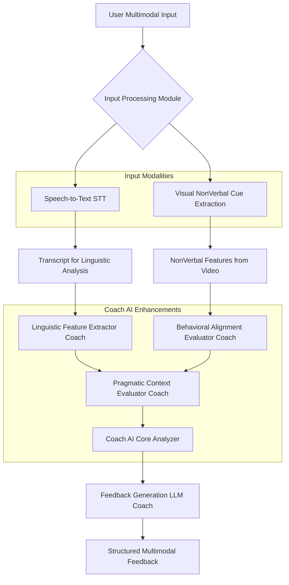

**Title of Invention:** System, Architecture, and Methodologies for High-Fidelity Cognitive Simulation of Cross-Cultural Communication Dynamics with Real-time Pedagogical Augmentation

**Abstract:**
A profoundly innovative system and associated methodologies are herein disclosed for the rigorous simulation and pedagogical augmentation of cross-cultural communication competencies. This invention manifests as a sophisticated interactive platform, architected to present users with highly nuanced business and social scenarios, wherein engagement occurs with an advanced Artificial Intelligence AI persona. This persona is meticulously engineered to embody the intricate linguistic, behavioral, and cognitive parameters of a specified cultural archetype. Through iterative textual interaction, the system's core innovation lies in its capacity to furnish immediate, granular, and contextually profound feedback. This feedback, generated by a distinct, analytically-oriented AI module, meticulously evaluates the efficacy and appropriateness of the user's communication strategies against the established cultural model. The overarching objective is to facilitate the adaptive refinement and mastery of complex cross-cultural interaction modalities within a risk-mitigated, highly didactic simulated environment, thereby transcending conventional training paradigms.

**Field of the Invention:**
The present invention pertains broadly to the domain of artificial intelligence, machine learning, natural language processing, cognitive simulation, and educational technology. More specifically, it relates to advanced methodologies for synthesizing human-computer interaction environments that are specifically tailored for experiential learning and skill acquisition in the highly specialized and often fraught arena of inter-cultural communication, particularly within professional and diplomatic contexts.

**Background of the Invention:**
In an increasingly interconnected globalized economy and geopolitical landscape, the mastery of effective cross-cultural communication has transitioned from a desirable attribute to an indispensable, mission-critical competency. Misinterpretations, miscommunications, and outright breakdowns in dialogue frequently arise not from linguistic barriers alone, but from divergent cultural schemata governing interaction patterns, directness, power distance, temporal perceptions, non-verbal cues as inferred from text, and the fundamental architecture of relationship building. Existing training methodologies, encompassing seminars, case studies, and didactic instruction, often lack the experiential immediacy and personalized adaptive feedback crucial for genuine skill internalization. Role-playing, while valuable, is inherently limited by human facilitators' subjective biases, availability, and capacity for consistent, objective cultural modeling. There exists, therefore, an exigent and profound need for a technologically advanced, scalable, and rigorously objective training apparatus capable of replicating the complexities of cross-cultural interactions and providing immediate, analytically robust feedback to accelerate learning and mitigate future communication liabilities. The present invention addresses this lacuna by leveraging cutting-edge AI to forge an unparalleled simulation and learning ecosystem.

**Summary of the Invention:**
The present invention fundamentally redefines the paradigm of cross-cultural communication training through the deployment of an intelligently orchestrated, multi-AI architecture. At its core, the system initiates a structured communicative scenario e.g., "Navigating project scope adjustments with a team lead from a high-context culture". A primary conversational AI, termed the "Persona AI," is instantiated and meticulously configured via a comprehensive system prompt and an ontological cultural model. This configuration imbues the Persona AI with the specific linguistic, behavioral, and interactional characteristics of the targeted cultural archetype e.g., "You are a senior team lead from a high-context culture. You prioritize harmonious team relations, indirect communication, and implicit understanding. Explicit confrontation is highly discouraged.". The user engages with this Persona AI via natural language text input. Crucially, each user utterance is synchronously transmitted to a secondary, analytical AI model, designated the "Coach AI." The Coach AI, operating under a distinct directive, performs a sophisticated real-time analysis of the user's input against the intricate parameters of the cultural model, evaluating its efficacy, appropriateness, and adherence to normative communicative patterns. Concurrently, the Persona AI processes the user's input and generates a culturally congruent, coherent, and contextually appropriate conversational response. The user is then presented with both the Persona AI's generated reply and the Coach AI's granular, pedagogically valuable feedback. This dual feedback mechanism empowers users to dynamically adjust their communicative strategies, fostering accelerated adaptive learning and refined cross-cultural acumen.

**Brief Description of the Drawings:**
To facilitate a more comprehensive understanding of the invention, its operational methodologies, and its architectural components, the following schematic diagrams are provided:

1.  **Figure 1: System Architecture Overview**
    A high-level block diagram illustrating the primary modules and their interconnections within the proposed system.
2.  **Figure 2: Interaction Flow Diagram**
    A sequence diagram detailing the step-by-step process of user interaction, data transmission, AI processing, and feedback delivery.
3.  **Figure 3: Cultural Archetype Modeling Ontology**
    A conceptual diagram depicting the hierarchical and interconnected components that constitute a culturally defined AI persona.
4.  **Figure 4: Feedback Generation Process**
    A detailed flowchart illustrating the analytical pipeline employed by the Coach AI to generate nuanced feedback.
5.  **Figure 5: Multimodal Communication Analysis Pipeline**
    A detailed flowchart illustrating the expanded pipeline for processing and analyzing multimodal user input.


**Figure 1: System Architecture Overview**
This diagram illustrates the fundamental modular components of the system. The **User Interface Module** serves as the primary conduit for user interaction. The **Scenario Orchestration Engine** manages the simulation's state, progression, and selection of appropriate cultural contexts. This engine interfaces with the **Cultural Knowledge Base**, which stores rich ontological models of various cultural archetypes. The core intelligence is provided by the **Persona AI Service** and the **Coach AI Service**, each leveraging **Large Language Models**. The Persona AI generates culturally congruent responses, while the Coach AI provides analytical feedback. All interactions and progress are logged in the **User Interaction History & Progress Tracking** module, which also informs the Scenario Orchestration.

---

**Figure 2: Interaction Flow Diagram**
This sequence diagram delineates the dynamic interplay between the system's components during a typical interaction turn. Upon user input, the **Scenario Orchestration Engine** acts as a central router, forwarding the utterance to both the **Persona AI Service** and the **Coach AI Service**. Each service then constructs highly specific prompts for their respective **Large Language Models** LLM_P for persona generation, LLM_C for feedback generation. The outputs from both LLMs are returned to the user via the **User Interface Module**, enabling real-time learning.

---

```mermaid
graph TD
    A[Cultural Archetype Model] --> B[Core Values & Beliefs]
    A --> C[Communication Style Parameters]
    A --> D[Social Norms & Etiquette]
    A --> E[Decision-Making & Negotiation Tactics]
    A --> F[Contextual Understanding Level]

    B --> B1[Individualism vs Collectivism]
    B --> B2[Power Distance Index]
    B --> B3[Uncertainty Avoidance]

    C --> C1[Directness vs Indirectness]
    C --> C2[High-Context vs Low-Context]
    C --> C3[Formality Level]
    C --> C4[Non-Verbal Cues Proxemics Kinesics inferred]
    C --> C5[Turn-Taking & Conversational Flow]

    D --> D1[Greeting Rituals]
    D --> D2[Taboo Topics]
    D3[Apology & Gratitude Expressions]
    D --> D4[Conflict Resolution Preferences]

    E --> E1[Relationship Building Priority]
    E --> E2[Rational vs Emotional Appeals]
    E --> E3[Time Orientation Monochronic vs Polychronic]

    F --> F1[Implicit Knowledge Baseline]
    F --> F2[Shared Cultural References]
```

**Figure 3: Cultural Archetype Modeling Ontology**
This diagram presents an ontological breakdown of the granular components comprising a sophisticated cultural archetype model within the **Cultural Knowledge Base**. Each node represents a distinct set of parameters that define how the Persona AI behaves and how the Coach AI evaluates user input. This multi-dimensional modeling ensures high-fidelity simulation and precise feedback generation.

---

**Figure 4: Feedback Generation Process**
This flowchart illustrates the sophisticated pipeline within the **Coach AI Service** for generating comprehensive feedback. A user utterance undergoes multiple analytical stages: **Cultural Contextualization**, **Linguistic Feature Extraction**, **Behavioral Alignment Evaluation**, **Sentiment & Tone Analysis**, and **Norm Adherence Metric Calculation**. These insights, informed by a **Global Knowledge Base of Cultural Norms**, are then fed into a **Feedback Generation LLM**. The output is structured, comprising a **Severity Assessment**, **Actionable Recommendation**, and an **Explanation of Cultural Principle**, providing multi-faceted pedagogical value.

---

**Figure 5: Multimodal Communication Analysis Pipeline**
This flowchart details an enhanced input processing and analysis pipeline, extending beyond text to incorporate multimodal cues. The **User Multimodal Input** is processed by an **Input Processing Module**, which leverages **Speech-to-Text STT** for linguistic content and **Visual NonVerbal Cue Extraction** from video streams. The resulting **Transcript for Linguistic Analysis** and **NonVerbal Features from Video** are then fed into specialized modules within the **Coach AI Enhancements**, including a **Linguistic Feature Extractor Coach**, **Behavioral Alignment Evaluator Coach**, and **Pragmatic Context Evaluator Coach**. These insights converge in the **Coach AI Core Analyzer**, which then informs the **Feedback Generation LLM Coach** to produce **Structured Multimodal Feedback**, offering a richer, more comprehensive assessment of user communication.

**Detailed Description of the Preferred Embodiments:**
The present invention encompasses a multifaceted system and method for generating dynamic, culturally-sensitive communication simulations. The architecture is modular, scalable, and designed for continuous learning and adaptation.

**I. System Architecture and Core Components:**

**A. User Interface Module UIM:**
The UIM acts as the primary interactive layer, presenting scenarios, facilitating text input, and displaying output. It is engineered for intuitive navigation and clear presentation of complex information.
*   **Scenario Presentation Interface:** Displays the narrative context, objectives, and specific prompts.
*   **Text Input Field:** Allows users to compose and submit their responses.
*   **Dual Output Display:** Simultaneously presents the Persona AI's response and the Coach AI's feedback, visually distinguishing between the two for clarity. Feedback may be presented in overlay, sidebar, or inline formats.
*   **Progress and Performance Dashboard:** Tracks user's learning trajectory, skill proficiency metrics, and scenario completion statistics over time.
*   **Multimodal Input Controls:** Includes optional voice input capabilities via Speech-to-Text and video input for non-verbal cue analysis, expanding interaction modalities.

**B. Scenario Orchestration Engine SOE:**
The SOE is the central control unit, managing the lifecycle of each simulation session.
*   **Scenario Definition & Selection:** Stores and retrieves pre-defined scenarios, each associated with specific learning objectives, cultural archetypes, and initial prompts. Supports dynamic scenario generation based on user performance or specific training needs.
*   **State Management:** Maintains the conversation history, cultural parameters, and session-specific variables.
*   **Request Routing:** Directs user input to the appropriate AI services Persona AI, Coach AI and aggregates their responses.
*   **Learning Progression Logic:** Adapts scenario difficulty or introduces new cultural nuances based on user's demonstrated proficiency or persistent challenges, potentially employing reinforcement learning algorithms.

**C. Cultural Knowledge Base CKB:**
The CKB is a meticulously curated repository of cultural models, serving as the foundational intelligence for both AI services.
*   **Ontological Cultural Models:** Each cultural archetype is represented as a rich ontology, encompassing:
    *   **Hofstede Dimensions:** Power Distance, Individualism vs Collectivism, Uncertainty Avoidance, Masculinity vs Femininity, Long-Term Orientation, Indulgence vs Restraint.
    *   **Hall's High/Low Context Communication:** Degree to which meaning is conveyed explicitly or implicitly.
    *   **Trompenaars' Cultural Dimensions:** Universalism vs Particularism, Individualism vs Communitarianism, Specific vs Diffuse, Neutral vs Affective, Achievement vs Ascription, Sequential vs Synchronic time, Internal vs External direction.
    *   **Linguistic Pragmatics:** Preferred speech acts, politeness strategies, directness/indirectness, turn-taking norms, rhetorical patterns.
    *   **Behavioral Protocols:** Norms for greetings, apologies, negotiations, conflict resolution, expressions of gratitude, personal space inferred from textual and potentially visual interaction patterns.
    *   **Value Systems:** Core beliefs, ethical frameworks, social hierarchies, and priorities.
    *   **Implicit vs Explicit Cultural Knowledge Models:** Distinct representations capturing unspoken rules, assumptions, and contextual nuances vs clearly defined guidelines.
*   **Dynamic Model Updates:** Mechanism for incorporating new research, expert input, and observed emergent cultural shifts into the models, potentially leveraging federated learning for continuous refinement from anonymized user interaction patterns or expert feedback loops. This includes a robust versioning system for cultural models.

**D. Persona AI Service PAS:**
Responsible for simulating the culturally-attuned interlocutor.
*   **Large Language Model LLM Integration:** Utilizes a state-of-the-art LLM e.g., a fine-tuned transformer architecture as its core conversational engine.
*   **Contextual Persona Prompt Engineering:** Generates highly specific and dynamic prompts for the LLM, integrating the current conversation history, the detailed cultural model from the CKB, and the specific scenario context. This ensures the LLM's output is consistently in-character and culturally appropriate.
*   **Coherence & Consistency Engine:** A layer that monitors LLM output for logical and cultural consistency across multiple turns, intervening to refine or re-generate responses if deviations are detected. This includes cross-referencing with the CKB.
*   **Emotional Intelligence Simulation EIS:** Infers emotional states and generates responses based on cultural norms and conversational context, adding depth to the persona's realism.
*   **Adaptive Persona Refinement:** Mechanism to subtly adjust persona parameters over long-term interaction with a user or across scenarios to maintain novelty and reflect subtle shifts in perceived cultural dynamics, or to pose specific learning challenges. This could involve dynamically modifying prompt weights based on prior interactions.

**E. Coach AI Service CAS:**
Dedicated to providing analytical feedback on user performance.
*   **Large Language Model LLM Integration:** Employs a separate, potentially distinct, LLM from the Persona AI, optimized for analytical reasoning and structured output.
*   **Contextual Evaluation Prompt Engineering:** Formulates specific prompts for the LLM, instructing it to analyze the user's utterance against defined cultural parameters, identify areas of divergence or alignment, and structure feedback. This includes chain-of-thought prompting for more detailed reasoning.
*   **Multi-Faceted Analysis Modules:**
    *   **Linguistic Feature Analyzer:** Identifies formality, directness, use of idioms, politeness markers, rhetorical strategies, and syntactic complexity.
    *   **Pragmatic Context Evaluator:** Assesses the implicit meanings, underlying intentions, and social functions of the utterance within the cultural context, considering speech acts.
    *   **Behavioral Alignment Evaluator:** Compares user's communication behavior as expressed textually and non-verbally against the expected or preferred cultural norms, leveraging insights from multimodal inputs.
    *   **Sentiment & Tone Detection:** Utilizes advanced NLP techniques and vocalics analysis to infer the emotional valence and perceived tone of the user's input.
    *   **Norm Adherence Scoring:** Assigns quantitative scores across various cultural dimensions to provide a composite performance metric, with explainable AI techniques to justify scores.
    *   **Misalignment Score Aggregation:** Combines individual scores from various analysis modules into a comprehensive cultural misalignment index, highlighting critical areas and their relative importance.
*   **Structured Feedback Generation:** Produces feedback in a predefined schema e.g., JSON, including:
    *   `feedback_statement`: A descriptive qualitative assessment.
    *   `severity`: e.g., "Critical," "Moderate," "Neutral," "Effective," "Exemplary".
    *   `cultural_principle_violated_or_adhered_to`: Explanation of the underlying cultural norm, principle, or value.
    *   `actionable_recommendation`: Specific, practical advice for improvement or reinforcement.
    *   `relevance_score`: Confidence in feedback accuracy, derived from multiple analytical pathways.
    *   `suggested_alternative_phrasing`: An example of a more culturally congruent utterance.
*   **Ethical & Bias Mitigation Filter:** A crucial component ensuring that feedback is culturally sensitive, avoids stereotypes, and promotes inclusive communication practices. This filter scrutinizes generated feedback for fairness, constructiveness, and cultural appropriateness before presentation to the user, potentially employing an independent debiasing model.

**F. User Interaction History & Progress Tracking UIHPT:**
A persistent data store and analytical module.
*   **Conversational Log:** Records every user utterance, Persona AI response, and Coach AI feedback for post-session review, aggregate analysis, and compliance auditing.
*   **Performance Metrics Database:** Stores quantitative scores on cultural norm adherence, communication effectiveness, and learning progression over time, with timestamped records.
*   **Adaptive Learning Profile:** Builds a personalized profile of each user's strengths, weaknesses, and learning patterns, informing the SOE for personalized scenario recommendations and difficulty adjustments. This profile updates dynamically based on continuous interaction.

**II. Operational Methodology:**

1.  **Initialization Phase:**
    *   A user selects a specific training scenario from the UIM, or the SOE recommends one based on their UIHPT profile and learning objectives.
    *   The SOE retrieves the associated cultural archetype model from the CKB, including its specific parameters for persona and evaluation.
    *   The Persona AI Service is initialized with the detailed cultural model and the initial scenario prompt.
    *   The Coach AI Service is initialized with the same cultural model and specific evaluation criteria pertinent to the scenario and cultural context.
    *   The UIM displays the initial prompt from the Persona AI, setting the stage for the interaction.

2.  **User Input and Parallel Processing Phase:**
    *   The user composes and submits a textual or multimodal response via the UIM. If multimodal, the Input Processing Module preprocesses it.
    *   The SOE receives the user's input and simultaneously transmits it:
        *   To the Persona AI Service, along with the ongoing conversation history and relevant persona parameters.
        *   To the Coach AI Service, along with the relevant cultural context, evaluation objectives, and any extracted multimodal features.

3.  **Persona AI Response Generation Phase:**
    *   The Persona AI Service constructs a sophisticated, dynamic prompt for its LLM, incorporating the persona's identity, the cultural model's nuances, the current conversational turn, and the user's input.
    *   The LLM generates a response that is syntactically correct, semantically coherent, and critically, culturally congruent with the defined archetype's communication style and values.
    *   The Persona AI Service applies post-processing filters or refinement mechanisms to ensure adherence to consistency parameters and to prevent factual or cultural drift.

4.  **Coach AI Feedback Generation Phase:**
    *   Concurrently, the Coach AI Service performs a multi-layered analysis of the user's input, which may include linguistic, pragmatic, behavioral, and sentiment aspects, leveraging multimodal data where available.
    *   It extracts linguistic features, assesses pragmatic intent, evaluates behavioral alignment against CKB norms, and determines the overall sentiment and tone.
    *   These analytical insights are fed into its dedicated LLM, which is prompted using chain-of-thought or similar techniques to generate structured, actionable feedback.
    *   The feedback includes a qualitative assessment, a severity rating, an explanation of the underlying cultural principle, a concrete recommendation for improvement, and potentially an alternative phrasing example. The Ethical & Bias Mitigation Filter reviews this feedback.

5.  **Output Display and Iteration Phase:**
    *   The SOE receives both the Persona AI's response and the Coach AI's feedback.
    *   The UIM presents both outputs to the user clearly and distinctly, potentially using visual indicators for severity or areas of focus.
    *   The user reviews the Persona AI's reply and critically analyzes the Coach AI's feedback, enabling them to reflect and dynamically adjust their communication strategy for the subsequent interaction turn.
    *   The UIHPT logs the entire interaction, including all raw inputs, AI outputs, and feedback metrics, for future analysis and progress tracking.
    *   The system then awaits the next user input, perpetuating the iterative learning cycle.

**III. Advanced Features and Embodiments:**

*   **Adaptive Scenario Progression:** Scenarios dynamically adjust in complexity, introducing new challenges or cultural nuances based on real-time user performance and feedback scores. This can employ reinforcement learning algorithms to personalize the learning journey, optimizing for skill acquisition.
*   **Multi-Persona Simulation:** Ability to simulate interactions with multiple AI personas from different cultural backgrounds simultaneously or sequentially within a single complex scenario, e.g., a cross-functional team meeting with distinct cultural representatives.
*   **Multimodal Communication Analysis:** While textual interaction is the primary embodiment, the system is augmented with Speech-to-Text and Text-to-Speech capabilities for voice-based communication, alongside video analysis for non-verbal cues. This enables leveraging advanced vocalics analysis e.g., prosody, pitch, pace, pauses and non-verbal cues e.g., gestures, facial expressions, eye contact, proxemics as additional dimensions for feedback and persona realism.
*   **Gamification Elements:** Incorporating scoring, badges, leaderboards, achievement systems, and progress tracking to enhance user engagement, motivation, and sustained learning.
*   **Expert Feedback Override:** Allowing human cultural experts or instructors to review challenging interactions, correct AI outputs, and provide supplementary or corrective feedback. This human-in-the-loop mechanism can also be used to continuously fine-tune and improve both the Persona AI and Coach AI models.
*   **Diagnostic Reports:** Comprehensive post-session or cumulative reports detailing specific cultural pitfalls, communication strengths, identified learning patterns, and recommended targeted training modules or external resources.
*   **Cross-Cultural Competency Taxonomy Mapping:** Mapping user performance and learning progress to an established and recognized taxonomy of cross-cultural communication competencies, providing structured skill development pathways and certifications.
*   **Real-time Multilingual Support:** Seamless integration of Neural Machine Translation NMT to allow users to interact in their native language while simulating communication with a persona operating in a different cultural and linguistic context, with feedback specifically addressing cultural rather than purely linguistic translation issues.
*   **Personalized Learning Paths:** Leveraging the Adaptive Learning Profile to recommend not just scenarios, but also external learning resources e.g., articles, videos, micro-lessons, workshops tailored to individual weaknesses, learning styles, and professional development goals.
*   **Scenario Authoring Tool:** A user-friendly interface enabling instructors, administrators, or subject matter experts to design, customize, and deploy new communication scenarios, including defining cultural archetypes, interaction objectives, specific evaluation criteria, and persona dialogue examples.
*   **Peer-to-Peer Collaborative Learning:** Facilitating structured interactions between multiple human users within a simulated cultural scenario, where the Coach AI can provide individualized feedback on group dynamics, collective communication efficacy, and individual contributions to collective cross-cultural communication.

**IV. Technical Implementation Details:**

**A. LLM Prompt Engineering & Tuning:**
The efficacy of the AI services heavily relies on sophisticated prompt engineering.
*   **Dynamic Prompt Generation:** Prompts are not static strings but dynamically constructed at runtime, incorporating scenario context, conversation history, user profile data, and detailed cultural parameters from the CKB. This ensures maximum relevance and adherence to desired AI behavior.
*   **Few-Shot Learning & In-Context Examples:** LLMs are provided with carefully curated few-shot examples within the prompt to guide their reasoning and response generation. For Persona AI, these examples demonstrate culturally appropriate dialogue. For Coach AI, they illustrate desired feedback format and analytical depth.
*   **Chain-of-Thought CoT Prompting:** For the Coach AI, CoT prompting is employed to encourage step-by-step reasoning, improving the transparency and accuracy of feedback generation by guiding the LLM through a logical analysis of the user utterance against cultural norms.
*   **Fine-tuning & Domain Adaptation:** While large foundational models are used, domain-specific fine-tuning on extensive datasets of cross-cultural communication examples, cultural narratives, and expert-annotated dialogues further specializes the LLMs for the invention's purpose. This includes fine-tuning for specific cultural nuances and pedagogical feedback styles.
*   **Guardrails and Safety Filters:** Post-generation filters are implemented to ensure LLM outputs are non-toxic, non-stereotypical, culturally sensitive, and aligned with ethical guidelines, preventing the propagation of harmful biases.

**B. Data Pipeline & Knowledge Graph Management:**
Effective data management is crucial for the system's intelligence and adaptability.
*   **Cultural Knowledge Graph CKG:** The CKB is implemented as a sophisticated knowledge graph, where cultural dimensions, values, communication styles, and behavioral protocols are represented as entities and relationships using technologies like RDF Resource Description Framework or OWL Web Ontology Language. This structured representation allows for complex querying and inference.
*   **Semantic Search & Retrieval Augmented Generation RAG:** When initializing personas or evaluating utterances, the CKG is semantically queried to retrieve the most relevant cultural knowledge, which is then dynamically inserted into LLM prompts via RAG techniques. This grounds LLM responses in factual cultural data, reducing hallucinations.
*   **User Interaction Data Lake:** All user interactions, utterances, persona responses, and coach feedback are stored in a secure, anonymized data lake. This data is leveraged for analytics, performance monitoring, and for future model training and adaptive learning algorithm development.
*   **Event Sourcing:** The conversational flow and state changes are managed using an event-sourcing pattern, ensuring auditability, replayability, and consistent state management across distributed microservices.

**C. Scalability and Deployment Strategy:**
The system is designed to handle a large number of concurrent users and complex AI operations.
*   **Microservices Architecture:** The system components UIM, SOE, CKB, PAS, CAS, UIHPT are implemented as independent microservices, each with its own responsibilities, allowing for independent development, deployment, and scaling.
*   **Containerization & Orchestration:** Microservices are containerized using Docker and deployed on a Kubernetes cluster. This provides automated scaling, load balancing, self-healing capabilities, and efficient resource utilization across cloud providers e.g., AWS, Azure, GCP.
*   **Asynchronous Processing & Message Queues:** AI processing tasks for Persona AI and Coach AI can be computationally intensive. Asynchronous message queues e.g., Apache Kafka, RabbitMQ are used to decouple user input submission from AI response generation, ensuring a responsive user interface even under heavy load.
*   **API Gateway:** All external and internal service communications are routed through an API Gateway, which handles authentication, authorization, rate limiting, and request routing, enhancing security and manageability.
*   **Edge Computing for Low Latency:** For multimodal input processing where real-time responsiveness is critical e.g., voice/video, portions of the input processing pipeline may be deployed closer to the user on edge devices or regional data centers to minimize latency.

**V. Evaluation and Validation Framework:**

To ensure the system's effectiveness and reliability, a rigorous evaluation and validation framework is employed.

**A. Quantitative Metrics for Efficacy:**
*   **Cultural Alignment Score:** A composite metric derived from the Coach AI's Norm Adherence Scoring, measuring the degree to which user utterances align with cultural parameters. Tracked over time to demonstrate learning progression.
*   **Communication Effectiveness Score:** Evaluates the user's ability to achieve scenario objectives e.g., resolve a conflict, build rapport, negotiate successfully, as assessed by the Coach AI and potentially correlated with Persona AI's responses.
*   **Learning Curve Analysis:** Tracks the rate of improvement in cultural alignment and effectiveness scores over multiple sessions, providing a quantifiable measure of accelerated learning.
*   **Task Completion Rate & Efficiency:** Measures how quickly and successfully users navigate complex scenarios, indicating improved communication fluency.
*   **Persona Realism Score:** An automated metric, potentially derived from user feedback and internal consistency checks, assessing how consistently the Persona AI adheres to its defined cultural archetype.

**B. Qualitative User Studies & Expert Review:**
*   **User Experience UX Studies:** Conducted through surveys, interviews, and usability testing to gather feedback on interface design, ease of use, clarity of feedback, and overall satisfaction.
*   **Think-Aloud Protocols:** Users vocalize their thought processes while interacting with the system, providing insights into their learning strategies and the cognitive impact of the AI feedback.
*   **Expert Cultural Review:** Subject matter experts e.g., ethnographers, cross-cultural trainers critically evaluate the Persona AI's responses for cultural accuracy and realism, and the Coach AI's feedback for pedagogical soundness and fairness. This is a continuous process.
*   **A/B Testing of Feedback Strategies:** Different modalities, granularities, or timing of Coach AI feedback are A/B tested to identify the most effective pedagogical approaches for different learning styles or cultural contexts.
*   **Pre and Post-Simulation Assessments:** Standardized cross-cultural competence assessments administered before and after using the system to measure tangible improvements in skills and knowledge.

**VI. Ethical AI Considerations:**

The design and deployment of this system are underpinned by a strong commitment to ethical AI principles.

**A. Bias Detection and Mitigation:**
*   **Cultural Nuance vs Stereotype:** Great care is taken in developing cultural models to represent nuanced behaviors rather than perpetuating harmful stereotypes. The CKB undergoes continuous auditing by diverse cultural experts.
*   **LLM Bias Auditing:** Pre-trained LLMs are rigorously evaluated for inherent biases related to culture, gender, race, or socioeconomic status. Fine-tuning datasets are carefully curated for diversity and fairness.
*   **Feedback Fairness Metrics:** The Coach AI's feedback generation is monitored using fairness metrics to ensure that recommendations are equitable and not disproportionately penalizing certain communication styles based on non-cultural factors.
*   **Adversarial Testing:** The system is subjected to adversarial testing to identify and mitigate potential vulnerabilities where malicious inputs could lead to biased or inappropriate AI responses/feedback.

**B. User Privacy and Data Security:**
*   **Data Anonymization:** All personally identifiable information PII is stripped or pseudonymized from user interaction data before storage and analysis, especially for model training.
*   **Encryption at Rest and in Transit:** All data, including cultural models, user profiles, and conversational logs, are encrypted both when stored and when transmitted between services.
*   **Access Controls:** Strict role-based access controls are implemented to ensure that only authorized personnel can access sensitive system components or user data, adhering to the principle of least privilege.
*   **Compliance with Regulations:** The system is designed to comply with relevant data privacy regulations globally, such as GDPR General Data Protection Regulation, HIPAA Health Insurance Portability and Accountability Act, and CCPA California Consumer Privacy Act.
*   **Transparency and Consent:** Users are explicitly informed about data collection practices, how their data will be used to enhance their learning experience and improve the system, and are required to provide informed consent.

**C. Responsible AI Use:**
*   **Learning Tool, Not Cultural Authority:** The system is presented as a sophisticated learning tool designed to facilitate skill development, emphasizing that it does not serve as an infallible cultural arbiter. Users are encouraged to combine simulated learning with real-world experience and human mentorship.
*   **Human Oversight and Accountability:** While highly autonomous, the system includes mechanisms for human oversight, allowing experts to review, intervene, and refine AI behavior, maintaining human accountability for the system's impact.
*   **Explainability and Interpretability:** Efforts are made to make the Coach AI's feedback as explainable and interpretable as possible, detailing the cultural principles behind recommendations, fostering user understanding rather than blind adherence.

**Claims:**
1.  A system for facilitating the development of cross-cultural communication competencies, comprising:
    a.  A **User Interface Module** configured to receive textual input from a user and display outputs.
    b.  A **Scenario Orchestration Engine** communicatively coupled to the User Interface Module, configured to manage simulation sessions, retrieve scenario-specific parameters, and route user inputs.
    c.  A **Cultural Knowledge Base** communicatively coupled to the Scenario Orchestration Engine, storing a plurality of detailed cultural archetype models, each defining linguistic, behavioral, and cognitive parameters.
    d.  A **Persona AI Service** communicatively coupled to the Scenario Orchestration Engine and the Cultural Knowledge Base, configured to:
        i.  Instantiate an AI persona based on a selected cultural archetype model.
        ii.  Receive a textual input from the user.
        iii. Generate a culturally congruent conversational reply using a large language model, informed by the cultural archetype model and ongoing conversation context.
    e.  A **Coach AI Service** communicatively coupled to the Scenario Orchestration Engine and the Cultural Knowledge Base, configured to:
        i.  Receive the textual input from the user.
        ii. Analyze the textual input against the selected cultural archetype model's parameters to assess its appropriateness and effectiveness.
        iii. Generate structured pedagogical feedback, utilizing a large language model, on the user's communication based on said analysis.
    f.  Wherein the User Interface Module is further configured to simultaneously display the culturally congruent conversational reply from the Persona AI Service and the structured pedagogical feedback from the Coach AI Service to the user.

2.  The system of claim 1, further comprising a **User Interaction History & Progress Tracking** module communicatively coupled to the Scenario Orchestration Engine, configured to:
    a.  Log all user inputs, Persona AI replies, and Coach AI feedback.
    b.  Store performance metrics related to user proficiency in cross-cultural communication.
    c.  Maintain a personalized adaptive learning profile for the user.

3.  The system of claim 1, wherein the structured pedagogical feedback includes:
    a.  A qualitative assessment of the user's textual input.
b.  A severity rating indicating the degree of cultural misalignment or effectiveness.
c.  An explanation of a specific cultural principle underlying the feedback.
d.  An actionable recommendation for modifying communication strategy.
e.  A suggested alternative phrasing for the user's utterance.

4.  The system of claim 1, wherein the Cultural Knowledge Base comprises ontological representations of cultural archetypes, detailing at least one of Hofstede Dimensions, Hall's High/Low Context Communication, Trompenaars' Cultural Dimensions, linguistic pragmatics, behavioral protocols, and value systems.

5.  The system of claim 1, wherein the User Interface Module is further configured to receive multimodal input including speech and video, and the Coach AI Service is further configured to analyze multimodal input leveraging speech-to-text, vocalics analysis, and visual non-verbal cue extraction.

6.  A method for enhancing cross-cultural communication skills, comprising:
    a.  **Defining a cultural archetype:** Selecting or creating a detailed computational model of a specific culture, comprising linguistic, behavioral, and cognitive attributes.
    b.  **Initializing a scenario:** Presenting a user with a specific communication task within a context relevant to the defined cultural archetype.
    c.  **Receiving user input:** Acquiring a textual or multimodal utterance from the user in response to the scenario or a simulated interlocutor's prompt.
    d.  **Parallel AI processing:** Simultaneously transmitting the user's utterance to a first AI model Persona AI and a second AI model Coach AI, with preprocessing for multimodal inputs.
    e.  **Generating conversational reply:** The Persona AI, configured with the cultural archetype model and contextually engineered prompts, processes the user's utterance and current conversation history to produce a culturally appropriate textual reply.
    f.  **Generating pedagogical feedback:** The Coach AI, configured with the cultural archetype model and evaluation criteria, performs a real-time, multi-layered analysis of the user's utterance, identifying cultural congruencies or incongruities across linguistic, pragmatic, and behavioral dimensions, and formulating structured feedback utilizing a large language model and an ethical bias mitigation filter.
    g.  **Presenting dual output:** Displaying both the Persona AI's reply and the Coach AI's feedback to the user, enabling immediate experiential learning and strategic adjustment.
    h.  **Iterative refinement:** Repeating steps c through g to facilitate continuous learning and skill refinement, with scenario progression adapted based on user performance.

7.  The method of claim 6, wherein the analysis by the Coach AI involves linguistic feature extraction, pragmatic context evaluation, behavioral alignment assessment, sentiment and tone detection, and norm adherence scoring, potentially leveraging multimodal input features.

8.  The method of claim 6, further comprising adapting subsequent scenarios or feedback granularity based on the user's historical performance captured in a personalized adaptive learning profile.

9.  A non-transitory computer-readable medium storing instructions that, when executed by one or more processors, cause the one or more processors to perform the method of claim 6.

10. The system of claim 1, wherein the Cultural Knowledge Base is implemented as a knowledge graph enabling semantic search and retrieval augmented generation for LLM prompting.

**Mathematical Formalism and Theoretical Foundation:**
The efficacy of the proposed system is grounded in a novel mathematical framework, the **Theory of Contextual Communicative Efficacy TCCE**, which rigorously defines, quantifies, and optimizes cross-cultural communication proficiency. This theory extends classical learning paradigms by introducing culturally-conditioned objective functions and an advanced gradient-efficacy feedback mechanism.

**I. Axiomatic Definition of the Communicative State Space:**

Let `C` denote the **Cultural Archetype Space**, which is a multi-dimensional, non-Euclidean manifold where each point `C in C` represents a unique cultural archetype. A cultural archetype `C` is formally defined by a set of tensor fields over a linguistic-behavioral feature space:
```
C = { T_norms, T_pragmatics, T_values, T_dialogue, T_multimodal }
```
where:
*   `T_norms in R^(d1 x k1 x ...)` represents culturally specific behavioral norms and etiquette.
*   `T_pragmatics in R^(d2 x k2 x ...)` encapsulates linguistic pragmatic rules, such as directness, politeness, and contextual dependency.
*   `T_values in R^(d3 x k3 x ...)` defines core cultural values and belief systems.
*   `T_dialogue in R^(d4 x k4 x ...)` describes preferred dialogue structures, turn-taking, and conflict resolution patterns.
*   `T_multimodal in R^(d5 x k5 x ...)` captures culturally-specific interpretations of vocalics, gestures, facial expressions, and proxemics.
Each tensor dimension corresponds to a specific cultural feature or interaction parameter, drawing from frameworks such as Hofstede's and Hall's dimensions, but expanded into a continuous, differentiable space for analytical purposes.

Let `U` denote the **Utterance Vector Space**, which is a high-dimensional continuous vector space embedding all possible linguistic and multimodal utterances. Each user utterance `U in U` is represented as a composite vector `u in R^m`, where `m` is the dimensionality of the embedding space, typically derived from advanced transformer-based language models e.g., BERT, GPT family embeddings, combined with multimodal embeddings e.g., from audio/video encoders. The mapping from raw text/speech/video to `u` is defined by an embedding function `Phi: InputModalities -> R^m`.

Let `S` denote the **Communicative State Space**. A state `s in S` at time `t` is a tuple `s_t = (C, h_t, scenario_t, user_profile_t)`, where `h_t` is the historical sequence of utterance-response pairs `h_t = [(u_0, r_0), ..., (u_{t-1}, r_{t-1})]`, `scenario_t` represents the current scenario parameters and objectives, and `user_profile_t` is the user's dynamic learning profile from UIHPT.

**II. The Efficacy Function of Cross-Cultural Communication:**

We define the **Communicative Efficacy Function** `E: U x C x S -> R` as a scalar function that quantifies the effectiveness, appropriateness, and goal attainment of a user's utterance `u_t` within a specific cultural context `C` and current communicative state `s_t`.
```
E(u_t, C, s_t) = F(Phi(u_t), C, h_t, scenario_t, user_profile_t)
```
where `F` is a highly complex, non-linear mapping realized by an ensemble of neural networks within the Coach AI, taking as input the vectorized utterance, the cultural tensor fields, historical context, and personalized user profile data. This function is typically bounded, e.g., `E in [0, 1]`, where `1` denotes maximal efficacy.

The objective of the user, from a learning perspective, is to learn an optimal communication policy `Pi: S -> U` that, given a state `s_t`, selects an utterance `u_t` such that the cumulative efficacy over a conversation trajectory is maximized:
```
max_Pi Sum_{t=0 to T} E(Pi(s_t), C, s_t)
```
This represents a reinforcement learning problem where the user is the agent, the utterances are actions, and the efficacy function provides the reward.

**III. The Gradient Efficacy Feedback GEF Principle:**

The core innovation lies in the provision of immediate, targeted feedback. This feedback, denoted by `F_t`, serves as a direct approximation of the gradient of the efficacy function with respect to the user's utterance, guiding the user toward optimal communication strategies.
Formally, the Coach AI provides feedback `F_t` such that:
```
F_t approx nabla_{u_t} E(u_t, C, s_t)
```
where `nabla_{u_t} E` is the gradient vector indicating the direction and magnitude of change in the utterance space that would maximally improve efficacy.

The Coach AI's internal mechanism for generating `F_t` involves:
1.  **Analytical Decomposition:** Parsing `u_t` into constituent linguistic features, pragmatic markers, inferred behavioral intents, and multimodal cues.
2.  **Cultural Alignment Scrutiny:** Comparing these decomposed features against the corresponding tensors in `C` i.e., `T_norms`, `T_pragmatics`, `T_multimodal`, etc. to identify divergences or alignments. This involves a multi-modal feature fusion.
3.  **Perturbation Analysis Conceptual:** Conceptually, the Coach AI performs a "what-if" analysis, imagining infinitesimal perturbations to `u_t` and assessing their hypothetical impact on `E`. This often involves counterfactual generation using generative AI models.
4.  **Structured Feedback Generation:** Translating this latent gradient information into a natural language feedback `f_t` and an explicit vector of actionable recommendations `a_t`, which collectively form `F_t = (f_t, a_t)`. The natural language feedback `f_t` serves as a human-readable interpretation of the gradient, explaining *why* certain directions are preferable, and including specific alternative phrasings.

The Persona AI's role is to simulate the state transition:
```
PersonaAI(u_t, C, s_t) -> (r_t, s_{t+1})
```
where `r_t` is the persona's response and `s_{t+1}` is the new communicative state, informed by the user's input and potentially reflecting subtle shifts based on the interaction. This interaction forms the environment for the user's learning.

**IV. Theorem of Accelerated Policy Convergence in Culturally Conditioned Learning TAPCCL:**

**Theorem:** Given a user's communication policy `Pi_t: S -> U` at iteration `t`, and the immediate, targeted Gradient Efficacy Feedback `F_t approx nabla_{u_t} E(u_t, C, s_t)` provided by the Coach AI, the user's policy can be updated iteratively towards an optimal policy `Pi*` that maximizes cumulative efficacy, leading to significantly accelerated convergence compared to learning without such direct gradient signals.

**Proof Sketch:**
Let the user's internal learning process be modeled as a stochastic gradient ascent on their implicit policy `Pi`. In a typical reinforcement learning setting, an agent receives a scalar reward and learns via trial and error, often requiring many samples to estimate the gradient effectively.
Our system, however, provides an explicit, quasi-gradient signal `F_t` after each action `u_t`.
The user's policy update can be conceptualized as:
```
Pi_{t+1} approx Pi_t + alpha * Interpret(F_t)
```
where `alpha` is a subjective learning rate reflecting the user's receptiveness and cognitive processing and `Interpret(.)` is the user's internal cognitive process of transforming structured feedback into a policy adjustment.

1.  **Direct Gradient Signal:** By directly approximating `nabla_{u_t} E`, the Coach AI bypasses the need for the user to infer the efficacy gradient through numerous sparse rewards. This provides a clear direction for policy improvement in the high-dimensional utterance space.
2.  **Reduction of Exploration Space:** Traditional reinforcement learning requires extensive exploration of the action space. The GEF principle effectively prunes the unproductive exploration paths by immediately highlighting beneficial adjustments, thereby significantly reducing the sample complexity required for learning.
3.  **Contextual Specificity:** The gradient is specific to the current cultural archetype `C` and state `s_t`, ensuring that the learning is highly relevant and avoids generic, sub-optimal strategies.
4.  **Information Maximization:** Each feedback signal `F_t` contains rich, interpretable information qualitative assessment, severity, cultural principle, actionable recommendation, suggested alternative far exceeding a simple scalar reward. This multi-faceted information allows for more robust and multi-modal policy adjustments.
5.  **Convergence Guarantee under ideal conditions:** If the interpretation function `Interpret(.)` is sufficiently accurate and the learning rate `alpha` is appropriately annealed, and assuming `E` is a sufficiently smooth function, this iterative process is analogous to stochastic gradient ascent. Such methods are proven to converge to a local optimum or a global optimum for convex functions of the efficacy function. The "acceleration" stems from the high-fidelity, immediate, and direct nature of the gradient signal.

**Conclusion of Proof:** The provision of an immediate and semantically rich approximation of the efficacy gradient, `F_t`, directly informs the user's internal policy updates, effectively performing a highly guided form of gradient ascent in the policy space. This direct guidance drastically reduces the time and samples required for convergence to an effective cross-cultural communication policy `Pi*`, thereby proving the accelerated learning capabilities of the system.
**Q.E.D.**