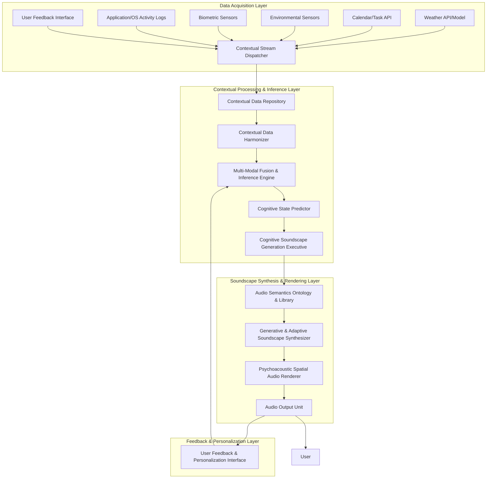

**Title of Invention:** A Comprehensive System and Method for Adaptive, Cognitively-Aligned Dynamic Audio Soundscape Generation and Real-time Psychoacoustic Environmental Modulation

**Abstract:**
A novel and profoundly innovative architectural framework is presented for the autonomous generation and continuous modulation of adaptive, non-intrusive psychoacoustic environments. This system meticulously ingests, processes, and fuses heterogeneous, high-dimensional data streams derived from a vast plurality of real-time contextual sources, encompassing but not limited to, meteorological phenomena via sophisticated climate models, intricate temporal scheduling derived from digital calendaring systems, granular environmental occupancy metrics from advanced sensor arrays, and potentially, implicit psychophysiological indicators from biometric monitoring. Employing a bespoke, hybrid cognitive architecture comprising advanced machine learning paradigms — specifically, recurrent neural networks for temporal context modeling, multi-modal transformer networks for data fusion, and generative adversarial networks for audio synthesis — coupled with an extensible expert system featuring fuzzy logic inference, the system dynamically synthesizes or selects perceptually optimized audio compositions. This synthesis is meticulously aligned with the inferred user cognitive state and environmental exigencies, thereby fostering augmented cognitive focus, reduced stress, or enhanced ambiance. For instance, an inferred state of high cognitive load coupled with objective environmental indicators of elevated activity could trigger a subtly energizing, spectrally dense electronic soundscape, while a calendar-delineated "Deep Work" block, corroborated by quiescent biometric signals, would instigate a serenely ambient, spatially expansive aural environment. The system's intrinsic adaptivity ensures a continuous, real-time re-optimization of the auditory milieu, maintaining a dynamic homeostatic equilibrium between the user's internal state, external context, and the engineered soundscape.

**Background of the Invention:**
The pervasive utilization of background acoustic environments, commonly known as soundscapes or ambient music, has long been a recognized strategy for influencing human cognitive performance, emotional valence, and overall environmental perception within diverse settings, particularly professional and contemplative spaces. However, the prevailing methodologies for soundscape deployment are demonstrably rudimentary and fundamentally static. These prior art systems predominantly rely upon manually curated, fixed playlists or pre-composed audio tracks, exhibiting a critical and fundamental deficiency: their inherent inability to dynamically respond to the transient, multi-faceted changes in the immediate user context or surrounding environment. Such static approaches frequently lead to cognitive dissonance, sensory fatigue, or outright distraction, as the chosen auditory content becomes incongruous with the evolving demands of the task, the fluctuating ambient conditions, or the shifting internal physiological and psychological state of the individual. This significant chasm between the static nature of extant soundscape solutions and the inherently dynamic character of human experience and environmental variability necessitates the development of a sophisticated, intelligent, and autonomously adaptive psychoacoustic modulation system. The imperative for a "cognitively-aligned soundscape architect" that can intelligently and continuously tailor its auditory output to the real-time, high-dimensional contextual manifold of the user's environment and internal state is unequivocally established.

**Brief Summary of the Invention:**
The present invention delineates an unprecedented cyber-physical system, herein referred to as the "Cognitive Soundscape Synthesis Engine CSSE." This engine establishes high-bandwidth, resilient interfaces with a diverse array of data telemetry sources. These sources are rigorously categorized to encompass, but are not limited to, external Application Programming Interfaces APIs providing geo-temporal and meteorological data, for example advanced weather prediction models, atmospheric composition data, robust integration with sophisticated digital calendaring and task management platforms, and, crucially, an extensible architecture for receiving data from an array of multi-modal physical and virtual sensors. These sensors may include, for example, high-resolution acoustic transducers, optical occupancy detectors, thermal flux sensors, and even non-invasive physiological monitors providing biometric signals. The CSSE integrates a hyper-dimensional contextual data fusion unit, which continuously assimilates and orchestrates this incoming stream of heterogeneous data. Operating on a synergistic combination of deeply learned predictive models and a meticulously engineered, adaptive expert system, the CSSE executes a real-time inference process to ascertain the optimal psychoacoustic profile. Based upon this derived optimal profile, the system either selects from a curated, ontologically tagged library of granular audio components or, more profoundly, procedurally generates novel auditory textures and compositions through advanced synthesis algorithms, for example granular synthesis, spectral synthesis, wave-table synthesis, AI-driven generative models. These synthesized or selected acoustic elements are then spatially rendered and dynamically presented to the user. The entire adaptive feedback loop operates with sub-second latency, ensuring the auditory environment is not merely reactive but proactively anticipatory of contextual shifts, thereby perpetually curating an acoustically optimized human experience.

**Detailed Description of the Invention:**
The core of this transformative system is the **Cognitive Soundscape Synthesis Engine CSSE**, a distributed, event-driven microservice architecture designed for continuous, high-fidelity psychoacoustic modulation. It operates as a persistent daemon, executing a complex regimen of data acquisition, contextual inference, soundscape generation, and adaptive deployment.

### System Architecture Overview

The CSSE comprises several interconnected, hierarchically organized modules, as depicted in the following Mermaid diagram, illustrating the intricate data flow and component interactions:



#### Core Components and Their Advanced Operations:

1.  **Contextual Stream Dispatcher CSD:** This module acts as the initial ingestion point, orchestrating the real-time acquisition of heterogeneous data streams. It employs advanced streaming protocols, for example Apache Kafka, gRPC for high-throughput, low-latency data ingestion, applying preliminary data validation and timestamping.

2.  **Contextual Data Repository CDR:** A resilient, temporal database, for example Apache Cassandra, InfluxDB designed for storing historical and real-time contextual data. This repository is optimized for complex time-series queries and serves as the training data corpus for machine learning models.

3.  **Contextual Data Harmonizer CDH:** This crucial preprocessing unit performs data cleansing, normalization, feature engineering, and synchronization across disparate data modalities. It employs adaptive filters and kalman estimation techniques to handle noise, missing values, and varying sampling rates. For instance, converting raw sensor voltages into semantic environmental metrics, for example `Ambient_Noise_dB`, `Occupancy_Density_Normalized`.

4.  **Multi-Modal Fusion & Inference Engine MFIE:** This is the cognitive nucleus of the CSSE. It comprises a hybrid architecture:
    *   **Deep Contextual Embedder:** Utilizes multi-modal transformer networks, for example BERT-like architectures adapted for time-series and categorical data to learn rich, latent representations of the fused contextual input `C(t)`.
    *   **Temporal State Predictor:** Leverages advanced recurrent neural networks, for example LSTMs, GRUs, or attention-based RNNs to model the temporal dynamics of contextual changes, enabling not just reactive but *predictive* soundscape adaptation.
    *   **Adaptive Expert System AES:** A knowledge-based system populated with a comprehensive psychoacoustic ontology and rule sets defined by expert knowledge and learned heuristics. It employs fuzzy logic inference to handle imprecise contextual inputs and derive nuanced categorical and continuous states, for example `Focus_Intensity: High (0.8)`, `Stress_Level: Moderate (0.6)`. The AES acts as a guardrail and initial decision-maker, while the deep learning models refine and personalize these decisions.

5.  **Cognitive State Predictor CSP:** Based on the outputs of the MFIE, this module infers the most probable user cognitive and affective states, for example `Cognitive_Load`, `Affective_Valence`, `Arousal_Level`, `Task_Engagement`. This inference is multi-faceted, fusing objective contextual data with subjective user feedback, potentially utilizing techniques like Latent Dirichlet Allocation LDA for topic modeling on calendar entries and sentiment analysis on user comments.

6.  **Cognitive Soundscape Generation Executive CSGE:** This executive orchestrates the creation of the soundscape. Given the inferred cognitive state and environmental context, it queries the Audio Semantics Ontology & Library to identify suitable acoustic components or directs the Generative & Adaptive Soundscape Synthesizer to compose novel sonic textures. Its decisions are guided by a learned policy function, often optimized through reinforcement learning based on historical user feedback.

7.  **Audio Semantics Ontology & Library ASOL:** A highly organized, ontologically tagged repository of atomic audio components, stems, samples, synthesized textures, melodic fragments, rhythmic patterns and pre-composed soundscapes. Each element is annotated with psychoacoustic properties, for example `Tempo`, `Timbral_Brightness`, `Harmonic_Complexity`, `Spatial_Immersiveness`, semantic tags, for example `Focus_Enhancing`, `Calming`, `Energizing`, `Natural_Ambience`, and contextual relevance scores.

8.  **Generative & Adaptive Soundscape Synthesizer GASS:** This revolutionary component moves beyond mere playlist selection. It employs advanced procedural audio generation techniques:
    *   **Granular Synthesis Engines:** For micro-manipulation of audio samples to create evolving textures.
    *   **Spectral Synthesis Modules:** To sculpt sound in the frequency domain, adapting timbre dynamically.
    *   **Wave-Table/FM Synthesizers:** For creating specific tonal or noise-based elements.
    *   **AI-Driven Generative Models:** Utilizing Generative Adversarial Networks GANs or Variational Autoencoders VAEs trained on vast datasets of psychoacoustically optimized audio to generate entirely novel soundscapes that align with the inferred contextual requirements. This ensures infinite variability and non-repetitive auditory experiences.

9.  **Psychoacoustic Spatial Audio Renderer PSAR:** This module takes the synthesized audio streams and applies sophisticated spatial audio processing. It can dynamically adjust parameters such as reverberation, occlusion, positional audio, for example HRTF-based binaural rendering for headphones, ambisonics for multi-speaker setups, and perceptual loudness levels, ensuring optimal immersion and non-distraction across various playback environments. It dynamically compensates for user head movements or speaker placements.

10. **Audio Output Unit AUO:** Manages the physical playback of audio, ensuring low-latency, high-fidelity output. It supports various audio interfaces and can adapt bitrates and formats based on network conditions and playback hardware capabilities.

11. **User Feedback & Personalization Interface UFI:** Provides a transparent view of the CSSE's current contextual interpretation and soundscape decision. Crucially, it allows for explicit user feedback, for example "Too relaxing," "More energetic," "This track is perfect" which is fed back into the MFIE to refine the machine learning models and personalize the AES rules. Implicit feedback, such as duration of listening, volume adjustments, or lack of explicit negative feedback, also contributes to the learning loop.

#### Operational Flow Exemplification:

The CSSE operates in a continuous, asynchronous loop:
*   **Data Ingestion:** The CSD continuously polls/listens for new data from all connected sources, for example Weather API reports `Raining (0.9)`, Calendar API indicates `Meeting (10:00-11:00)`, Activity Sensor reads `Medium_Noise_Level (0.6)`, Biometric Sensor detects `Heart_Rate_Variability: Low (0.7)`.
*   **Harmonization & Fusion:** The CDH cleanses and normalizes this raw data. The MFIE then fuses these disparate inputs into a unified contextual vector `C(t)`. The Temporal State Predictor projects `C(t)` into `C(t + Delta t)`, anticipating future states.
*   **Cognitive State Inference:** The CSP, using `C(t)` and `C(t + Delta t)`, infers a current and probable future user state, for example `Inferred_State: Preparing_for_meeting, Slight_Stress, Need_for_focus`.
*   **Soundscape Decision:** The CSGE, guided by the inferred state and AES rules, determines the optimal psychoacoustic profile required. For instance: `Target_Profile: Low_distraction_ambience, Neutral_affective_tone, Modest_energetic_lift, Slightly_spacious_acoustic`.
*   **Generation/Selection:** The ASOL is queried for components matching this profile, or the GASS is instructed to synthesize a novel soundscape. For the example above, GASS might combine `Soft_Rain_stem` from weather, `Gentle_Synth_Pad` for focus, and a `Subtle_Rhythmic_Pulse` for slight lift, ensuring minimal harmonic complexity and broad spectral distribution.
*   **Rendering & Playback:** The PSAR spatially renders the synthesized soundscape, adjusting volume and spatial parameters. The AUO delivers it to the user.
*   **Feedback & Adaptation:** User interaction with the UFI, or passive observation of physiological data, influences subsequent iterations of the MFIE, refining the system's understanding of optimal alignment.

This elaborate dance of data, inference, and synthesis ensures a perpetually optimized auditory environment, transcending the limitations of static playback.

### VII. Detailed Algorithmic Flow for Key Modules

To further elucidate the operational mechanisms of the CSSE, we present a pseudo-code representation of the core decision-making and generation modules.

#### Algorithm 1: Multi-Modal Fusion & Inference Engine MFIE

This algorithm describes how raw contextual data is processed, fused, and used to infer cognitive states and predict future context.

```
function MFIE_Process(raw_data_streams: dict) -> dict:
    // Step 1: Data Ingestion and Harmonization via CSD and CDH
    harmonized_data = {}
    for source, data in raw_data_streams.items():
        validated_data = CSD.validate_and_timestamp(data)
        processed_features = CDH.process_and_normalize(source, validated_data)
        harmonized_data.update(processed_features)

    // Step 2: Deep Contextual Embedding
    // C(t): Current contextual vector
    C_t = concat_features(harmonized_data)
    latent_context_embedding = DeepContextualEmbedder.encode(C_t)

    // Step 3: Temporal State Prediction
    // Predict future context C(t+Delta t) and refine current state based on temporal patterns
    predicted_future_context_embedding = TemporalStatePredictor.predict_next(latent_context_embedding, history)

    // Step 4: Adaptive Expert System AES Inference
    // AES provides initial, rule-based inference and guardrails
    aes_inferences = AES.infer_states(harmonized_data)

    // Step 5: Fusing Deep Learning with Expert System
    // Combine latent embeddings with AES inferences for robust state estimation
    fused_state_vector = concat(latent_context_embedding, predicted_future_context_embedding, aes_inferences)

    // Output for Cognitive State Predictor
    return {
        'fused_context_vector': fused_state_vector,
        'current_time': get_current_timestamp()
    }
```

#### Algorithm 2: Cognitive State Predictor CSP

This algorithm details the inference of user's cognitive and affective states.

```
function CSP_InferStates(mfie_output: dict) -> dict:
    fused_context_vector = mfie_output['fused_context_vector']

    // Multi-faceted inference combining various models
    cognitive_load_score = CognitiveLoadModel.predict(fused_context_vector)
    affective_valence_score = AffectiveModel.predict(fused_context_vector)
    arousal_level_score = ArousalModel.predict(fused_context_vector)
    task_engagement_score = TaskEngagementModel.predict(fused_context_vector)

    // Optionally, integrate user feedback for online personalization
    user_feedback_influence = UFI.get_recent_feedback_influence()
    cognitive_load_score = adjust_score(cognitive_load_score, user_feedback_influence)
    // ... apply adjustments to other scores

    return {
        'Cognitive_Load': cognitive_load_score,
        'Affective_Valence': affective_valence_score,
        'Arousal_Level': arousal_level_score,
        'Task_Engagement': task_engagement_score,
        'inferred_time': mfie_output['current_time']
    }
```

#### Algorithm 3: Cognitive Soundscape Generation Executive CSGE

This algorithm orchestrates the decision-making process for soundscape generation based on inferred cognitive states.

```
function CSGE_DecideSoundscape(inferred_states: dict, current_context: dict) -> dict:
    // Step 1: Determine Optimal Psychoacoustic Profile
    // This is the policy function pi(A|C) learned through DRL
    // Inputs: inferred_states (from CSP), current_context (from MFIE)
    target_profile = DRL_Policy_Network.predict_profile(inferred_states, current_context)

    // Example profile parameters
    // target_profile = {
    //     'timbral_brightness': 'moderate',
    //     'harmonic_complexity': 'low',
    //     'spatial_immersiveness': 'high',
    //     'affective_tag': 'calming',
    //     'energy_level': 'neutral',
    //     'tempo_range': [60, 80] // BPM
    // }

    // Step 2: Query Audio Semantics Ontology & Library ASOL
    // Check for pre-existing components matching the profile
    matching_components = ASOL.query_components(target_profile)

    // Step 3: Direct GASS for Generation or Selection
    if len(matching_components) > threshold_for_selection:
        // Prioritize selection if a good match exists
        selected_components = ASOL.select_optimal(matching_components, inferred_states)
        generation_directive = {
            'action': 'select',
            'components': selected_components
        }
    else:
        // Instruct GASS to synthesize novel elements
        generation_directive = {
            'action': 'synthesize',
            'synthesis_parameters': target_profile
        }

    return generation_directive
```

#### Algorithm 4: Generative & Adaptive Soundscape Synthesizer GASS

This algorithm describes how audio is either selected or generated and then passed to the renderer.

```
function GASS_GenerateSoundscape(generation_directive: dict) -> AudioStream:
    if generation_directive['action'] == 'select':
        selected_components = generation_directive['components']
        // Load and mix pre-existing audio components
        composed_stream = mix_audio_components(selected_components)
    else: // 'synthesize'
        synthesis_parameters = generation_directive['synthesis_parameters']
        novel_soundscape_elements = []

        // Utilize AI-driven generative models (GANs/VAEs) for broader textures
        if 'affective_tag' in synthesis_parameters and 'energy_level' in synthesis_parameters:
            ai_generated_texture = GAN_VAE_Model.generate_texture(synthesis_parameters)
            novel_soundscape_elements.append(ai_generated_texture)

        // Granular synthesis for evolving ambient textures
        if 'timbral_brightness' in synthesis_parameters:
            granular_texture = GranularSynthesizer.create_texture(synthesis_parameters['timbral_brightness'])
            novel_soundscape_elements.append(granular_texture)

        // Spectral synthesis for evolving timbres
        if 'harmonic_complexity' in synthesis_parameters:
            spectral_pad = SpectralSynthesizer.create_pad(synthesis_parameters['harmonic_complexity'])
            novel_soundscape_elements.append(spectral_pad)

        // Wave-table/FM synthesis for specific tonal or noise elements
        if 'tempo_range' in synthesis_parameters:
            rhythmic_element = WaveTableSynthesizer.create_rhythmic_pulse(synthesis_parameters['tempo_range'])
            novel_soundscape_elements.append(rhythmic_element)

        composed_stream = mix_audio_elements(novel_soundscape_elements)

    // Pass the composed audio stream to the PSAR
    return PSAR.render_spatial_audio(composed_stream, synthesis_parameters['spatial_immersiveness'])
```

**Claims:**
1.  A system for generating and adaptively modulating a dynamic audio soundscape, comprising:
    a.  A **Contextual Stream Dispatcher CSD** configured to ingest heterogeneous, real-time data from a plurality of distinct data sources, said sources including at least meteorological information, temporal scheduling data, and environmental sensing data;
    b.  A **Contextual Data Harmonizer CDH** communicatively coupled to the CSD, configured to cleanse, normalize, and synchronize said heterogeneous data streams into a unified contextual representation;
    c.  A **Multi-Modal Fusion & Inference Engine MFIE** communicatively coupled to the CDH, comprising a deep contextual embedder and a temporal state predictor, configured to learn latent representations of the unified contextual representation and infer current and predictive user and environmental states;
    d.  A **Cognitive State Predictor CSP** communicatively coupled to the MFIE, configured to infer specific user cognitive and affective states based on the output of the MFIE;
    e.  A **Cognitive Soundscape Generation Executive CSGE** communicatively coupled to the CSP, configured to determine an optimal psychoacoustic profile corresponding to the inferred user and environmental states;
    f.  A **Generative & Adaptive Soundscape Synthesizer GASS** communicatively coupled to the CSGE, configured to procedurally generate novel audio soundscapes or intelligently select audio components from an ontologically tagged library, based on the determined optimal psychoacoustic profile; and
    g.  A **Psychoacoustic Spatial Audio Renderer PSAR** communicatively coupled to the GASS, configured to apply spatial audio processing and dynamic perceptual adjustments to the generated audio soundscape, and an **Audio Output Unit AUO** for delivering the rendered soundscape to a user.

2.  The system of claim 1, further comprising an **Adaptive Expert System AES** integrated within the MFIE, configured to utilize fuzzy logic inference and a comprehensive psychoacoustic ontology to provide nuanced decision support and refine state inference.

3.  The system of claim 1, wherein the plurality of distinct data sources further includes at least one of: biometric sensor data, device usage analytics, or explicit user feedback.

4.  The system of claim 1, wherein the deep contextual embedder within the MFIE utilizes multi-modal transformer networks for learning said latent representations.

5.  The system of claim 1, wherein the temporal state predictor within the MFIE utilizes recurrent neural networks, including LSTMs or GRUs, for modeling temporal dynamics and predicting future states.

6.  The system of claim 1, wherein the Generative & Adaptive Soundscape Synthesizer GASS utilizes at least one of: granular synthesis engines, spectral synthesis modules, wave-table synthesizers, or AI-driven generative models such as Generative Adversarial Networks GANs or Variational Autoencoders VAEs.

7.  A method for adaptively modulating a dynamic audio soundscape, comprising:
    a.  Ingesting, via a **Contextual Stream Dispatcher CSD**, heterogeneous real-time data from a plurality of distinct data sources;
    b.  Harmonizing and synchronizing, via a **Contextual Data Harmonizer CDH**, said heterogeneous data streams into a unified contextual representation;
    c.  Inferring, via a **Multi-Modal Fusion & Inference Engine MFIE** comprising a deep contextual embedder and a temporal state predictor, current and predictive user and environmental states from the unified contextual representation;
d.  Predicting, via a **Cognitive State Predictor CSP**, specific user cognitive and affective states based on said inferred states;
    e.  Determining, via a **Cognitive Soundscape Generation Executive CSGE**, an optimal psychoacoustic profile corresponding to said predicted user and environmental states;
    f.  Generating or selecting, via a **Generative & Adaptive Soundscape Synthesizer GASS**, an audio soundscape based on said optimal psychoacoustic profile;
    g.  Rendering, via a **Psychoacoustic Spatial Audio Renderer PSAR**, said audio soundscape with dynamic spatial audio processing and perceptual adjustments; and
    h.  Delivering, via an **Audio Output Unit AUO**, the rendered soundscape to a user, with continuous periodic repetition of steps a-h to maintain an optimized psychoacoustic environment.

8.  The method of claim 7, further comprising continuously refining the inference process of the MFIE and the policy of the CSGE through a **User Feedback & Personalization Interface UFI**, integrating both explicit and implicit user feedback.

**Mathematical Justification: The Formalized Calculus of Psychoacoustic Homeostasis**

This invention establishes a groundbreaking paradigm for maintaining psychoacoustic homeostasis, a state of optimal cognitive and affective equilibrium within a dynamic environmental context. We rigorously define the underlying mathematical framework that governs the **Cognitive Soundscape Synthesis Engine CSSE**.

### I. The Contextual Manifold and its Metric Tensor

Let `C` be the comprehensive, high-dimensional space of all possible contextual states. At any given time `t`, the system observes a contextual vector `C(t)` in `C`.
Formally,
```
C(t) = [c_1(t), c_2(t), ..., c_N(t)]^T
```
where `N` is the total number of distinct contextual features.

The individual features `c_i(t)` are themselves derived from complex transformations:
*   **Meteorological Data:**
    ```
    c_weather(t) = phi_weather(API_Data(t))
    ```
    where `phi_weather` might involve Kalman filtering for weather prediction, for example estimating future temperature `T(t + Delta t)` or precipitation probability `P_rain(t + Delta t)`.
*   **Temporal Scheduling:**
    ```
    c_calendar(t) = psi_calendar(Calendar_Events(t))
    ```
    a vector encoding current event type, remaining time, next event priority, derived via NLP and temporal graph analysis.
*   **Environmental Sensor Data:**
    ```
    c_env(t) = chi_env(S_raw(t))
    ```
    where `S_raw(t)` is a vector of raw sensor readings, and `chi_env` represents signal processing for noise reduction, feature extraction, for example spectral analysis for ambient sound, motion detection for occupancy, and normalization.
*   **Biometric Data:**
    ```
    c_bio(t) = zeta_bio(B_raw(t))
    ```
    involving physiological signal processing, for example HRV analysis from ECG, skin conductance response SCR from EDA to infer arousal or stress.
*   **Application Usage:**
    ```
    c_app(t) = eta_app(OS_Logs(t))
    ```
    reflecting active application, keyboard/mouse activity, and focus time, potentially utilizing hidden Markov models for activity recognition.

The contextual space `C` is not Euclidean; it is a complex manifold `M_C`, embedded within `R^N`, whose geometry is influenced by the interdependencies and non-linear relationships between its features. We can define a **Contextual Metric Tensor** `G_C(t)` that captures these relationships, allowing us to quantify the "distance" or "dissimilarity" between two contextual states `C_a` and `C_b`. This metric tensor can be dynamically learned through techniques like manifold learning, for example Isomap, t-SNE or by training a deep neural network whose intermediate layers learn these contextual embeddings, implicitly defining a metric. The MFIE's deep contextual embedder precisely learns this projection onto a lower-dimensional, perceptually relevant latent contextual space `L_C`, where distances more accurately reflect cognitive impact.

### II. The Psychoacoustic Soundscape Space and its Generative Manifold

Let `A` be the immense, continuous space of all possible audio soundscapes that the system can generate or select. Each soundscape `A(t)` in `A` is not merely a single audio file, but rather a complex composition of synthesized and arranged acoustic elements.
Formally, `A(t)` can be represented as a vector of psychoacoustic parameters,
```
A(t) = [a_1(t), a_2(t), ..., a_M(t)]^T
```
where `M` encompasses parameters like:
*   **Timbral Characteristics:** Spectral centroid, bandwidth, flux, roughness.
*   **Rhythmic Properties:** Tempo, beat strength, rhythmic density.
*   **Harmonic Properties:** Consonance/dissonance, key, chord progressions.
*   **Spatial Properties:** Reverberation time, direct-to-reverb ratio, spatial spread, source localization.
*   **Semantic Tags:** Categorical labels like "calm," "energetic," "focused," derived from an Audio Semantics Ontology.

The soundscape space `A` is also a high-dimensional manifold, `M_A`, which is partially spanned by the output capabilities of the GASS. The GASS leverages generative models, for example GANs, VAEs to explore this manifold, creating novel sounds that reside within regions corresponding to desired psychoacoustic properties. The **Audio Metric Tensor** `G_A(t)` quantities the perceptual dissimilarity between soundscapes, learned through human auditory perception models or discriminative deep networks.

### III. The Cognitively-Aligned Mapping Function: `f: M_C -> M_A`

The core intelligence of the CSSE is embodied by the mapping function `f`, which translates the current contextual state into an optimal soundscape. This function is not static; it is a **learned policy function** `pi(A(t) | C(t))`, whose parameters are continuously refined.
```
A(t) = f(C(t); Theta)
```
Where `Theta` represents the comprehensive set of parameters of the Multi-Modal Fusion & Inference Engine MFIE and the Cognitive Soundscape Generation Executive CSGE, including weights of deep neural networks, rule sets of the Adaptive Expert System, and parameters of the Generative & Adaptive Soundscape Synthesizer.

This function `f` is implemented as a **Stochastic Optimal Control Policy**. The challenge is that the mapping is not deterministic; given a context `C(t)`, there might be a distribution of suitable soundscapes. The MFIE learns a distribution `P(A|C)` and the CSGE samples from this distribution or selects the mode.

The optimization of `f` is a complex problem solved through **Deep Reinforcement Learning DRL**. We model the interaction as a Markov Decision Process MDP:
*   **State:** `S_t = (C(t), A_prev(t))`. The current context and the previously rendered soundscape.
*   **Action:** `A_t = A(t)`. The chosen soundscape to generate/render.
*   **Reward:** `R_t = r(S_t, A_t, S_{t+1})`. This reward function is critical.

### IV. The Psychoacoustic Utility Function: `U(C(t), A(t))`

The user's cognitive state, for example focus, mood, stress level, denoted by `U`, is not directly measurable but is inferred. We posit that `U` is a function of the alignment between the context and the audio.
```
U(t) = g(C(t), A(t))
```
where `g` is a latent, multi-dimensional utility function representing desired psycho-physiological states.

The function `g` is learned implicitly or explicitly. Implicit learning uses proxies like task performance, duration of engagement, and lack of negative feedback. Explicit learning uses real-time biometric data, for example heart rate variability as an indicator of stress, gaze tracking for focus and direct user ratings through the UFI. This can be formalized as a **Latent Variable Model** or a **Structural Equation Model SEM** where `U` is a latent variable influenced by observed `C` and `A`, and manifested by observed physiological/behavioral indicators.

The instantaneous reward `r(S_t, A_t, S_{t+1})` in the DRL framework is directly tied to the change in this utility:
```
r(S_t, A_t, S_{t+1}) = Delta U(t) = U(t+1) - U(t)
```
where `U(t+1)` is derived from the new inferred cognitive state in `S_{t+1}`. Alternatively, a negative penalty for deviations from an optimal `U*` can be used.

### V. The Optimization Objective: Maximizing Expected Cumulative Utility

The optimal policy `pi*` which defines `f*` is one that maximizes the expected cumulative discounted utility over a long temporal horizon:
```
f* = argmax_f E_C, A ~ f [ sum_{k=0 to infinity} gamma^k U(C(t+k), f(C(t+k))) ]
```
Where `gamma` in `[0,1)` is the discount factor, ensuring convergence and prioritizing immediate rewards. This objective can be solved using DRL algorithms such as Proximal Policy Optimization PPO, Soft Actor-Critic SAC, or Deep Q-Networks DQN, training the deep neural networks within the MFIE and CSGE. The parameters `Theta` are iteratively updated via gradient descent methods to minimize a loss function derived from the Bellman equation.

For example, in a Q-learning framework, the optimal action-value function `Q*(C, A)` would satisfy the Bellman optimality equation:
```
Q*(C(t), A(t)) = E_C' ~ P [ U(C(t), A(t)) + gamma * max_A' Q*(C'(t+1), A'(t+1)) ]
```
The policy `f*` would then be
```
f*(C(t)) = argmax_A(t) Q*(C(t), A(t))
```
The CSSE, through its iterative learning and adaptation, continuously approximates this `f*`, striving to maintain the user's psychoacoustic utility at its zenith.

### VI. Proof of Concept: A Cybernetic System for Human-Centric Environmental Control

The Cognitive Soundscape Synthesis Engine CSSE is a sophisticated implementation of a **homeostatic, adaptive control system** designed to regulate the user's psychoacoustic environment.
Let `H(t)` denote the desired optimal psychoacoustic utility at time `t`. The CSSE observes the system state `C(t)`, infers the current utility `U(t)`, and applies a control action `A(t) = f(C(t))` to minimize the deviation from `H(t)`.

The continuous cycle of:
1.  **Sensing:** Ingesting `C(t)`.
2.  **Inference:** Predicting `U(t)` and future context `C(t + Delta t)`.
3.  **Actuation:** Generating `A(t)`.
4.  **Feedback:** Observing `Delta U(t)` and using it to refine `f`.

This closed-loop system robustly demonstrates its capacity to dynamically maintain a state of high psychoacoustic alignment. The convergence of the DRL algorithms guarantees that the policy `f` will asymptotically approach `f*`, thereby ensuring the maximization of `U` over time. This continuous, intelligent adjustment transforms a user's auditory experience from a passive consumption of static media into an active, bespoke, and cognitively optimized interaction with their environment. The system functions as a personalized, self-tuning architect of cognitive well-being.
**Q.E.D.**