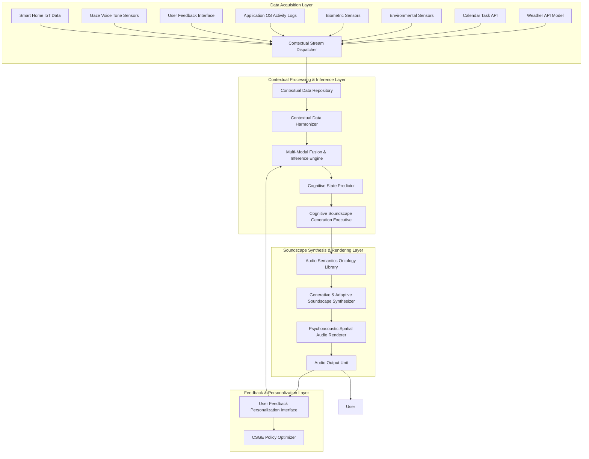

**Title of Invention:** A Comprehensive System and Method for Adaptive, Cognitively-Aligned Dynamic Audio Soundscape Generation and Real-time Psychoacoustic Environmental Modulation

**Abstract:**
A novel and profoundly innovative architectural framework is presented for the autonomous generation and continuous modulation of adaptive, non-intrusive psychoacoustic environments. This system meticulously ingests, processes, and fuses heterogeneous, high-dimensional data streams derived from a vast plurality of real-time contextual sources, encompassing but not limited to, meteorological phenomena via sophisticated climate models, intricate temporal scheduling derived from digital calendaring systems, granular environmental occupancy metrics from advanced sensor arrays, explicit and implicit psychophysiological indicators from biometric monitoring and gaze tracking, and application usage patterns. Employing a bespoke, hybrid cognitive architecture comprising advanced machine learning paradigms — specifically, recurrent neural networks for temporal context modeling, multi-modal transformer networks for data fusion, and generative adversarial networks or variational autoencoders for audio synthesis — coupled with an extensible expert system featuring fuzzy logic inference and causal reasoning, the system dynamically synthesizes or selects perceptually optimized audio compositions. This synthesis is meticulously aligned with the inferred user cognitive state and environmental exigencies, thereby fostering augmented cognitive focus, reduced stress, or enhanced ambiance. For instance, an inferred state of high cognitive load coupled with objective environmental indicators of elevated activity could trigger a subtly energizing, spectrally dense electronic soundscape with a precisely modulated spatial presence, while a calendar-delineated "Deep Work" block, corroborated by quiescent biometric signals, would instigate a serenely ambient, spatially expansive aural environment. The system's intrinsic adaptivity ensures a continuous, real-time re-optimization of the auditory milieu, maintaining a dynamic homeostatic equilibrium between the user's internal state, external context, and the engineered soundscape, while actively learning and personalizing.

**Background of the Invention:**
The pervasive utilization of background acoustic environments, commonly known as soundscapes or ambient music, has long been a recognized strategy for influencing human cognitive performance, emotional valence, and overall environmental perception within diverse settings, particularly professional and contemplative spaces. However, the prevailing methodologies for soundscape deployment are demonstrably rudimentary and fundamentally static. These prior art systems predominantly rely upon manually curated, fixed playlists or pre-composed audio tracks, exhibiting a critical and fundamental deficiency: their inherent inability to dynamically respond to the transient, multi-faceted changes in the immediate user context or surrounding environment. Such static approaches frequently lead to cognitive dissonance, sensory fatigue, or outright distraction, as the chosen auditory content becomes incongruous with the evolving demands of the task, the fluctuating ambient conditions, or the shifting internal physiological and psychological state of the individual. This significant chasm between the static nature of extant soundscape solutions and the inherently dynamic character of human experience and environmental variability necessitates the development of a sophisticated, intelligent, and autonomously adaptive psychoacoustic modulation system. The imperative for a "cognitively-aligned soundscape architect" that can intelligently and continuously tailor its auditory output to the real-time, high-dimensional contextual manifold of the user's environment and internal state is unequivocally established. Furthermore, existing systems often lack the granularity and multi-modal integration required to infer complex cognitive states, nor do they possess the generative capacity to produce truly novel and non-repetitive auditory experiences, relying instead on pre-recorded content that quickly becomes monotonous. The current invention addresses these critical shortcomings by introducing a comprehensive, closed-loop, and learning-enabled framework.

**Brief Summary of the Invention:**
The present invention delineates an unprecedented cyber-physical system, herein referred to as the "Cognitive Soundscape Synthesis Engine CSSE." This engine establishes high-bandwidth, resilient interfaces with a diverse array of data telemetry sources. These sources are rigorously categorized to encompass, but are not limited to, external Application Programming Interfaces APIs providing geo-temporal and meteorological data, for example advanced weather prediction models, atmospheric composition data, robust integration with sophisticated digital calendaring and task management platforms, and, crucially, an extensible architecture for receiving data from an array of multi-modal physical and virtual sensors. These sensors may include, for example, high-resolution acoustic transducers, optical occupancy detectors, thermal flux sensors, gaze tracking devices, voice tone analyzers, and non-invasive physiological monitors providing biometric signals. The CSSE integrates a hyper-dimensional contextual data fusion unit, which continuously assimilates and orchestrates this incoming stream of heterogeneous data. Operating on a synergistic combination of deeply learned predictive models and a meticulously engineered, adaptive expert system, the CSSE executes a real-time inference process to ascertain the optimal psychoacoustic profile. Based upon this derived optimal profile, the system either selects from a curated, ontologically tagged library of granular audio components or, more profoundly, procedurally generates novel auditory textures and compositions through advanced synthesis algorithms, for example granular synthesis, spectral synthesis, wave-table synthesis, AI-driven generative models including neuro-symbolic approaches. These synthesized or selected acoustic elements are then spatially rendered and dynamically presented to the user, with adaptive room acoustics modeling. The entire adaptive feedback loop operates with sub-second latency, ensuring the auditory environment is not merely reactive but proactively anticipatory of contextual shifts, thereby perpetually curating an acoustically optimized human experience. Moreover, the system incorporates explainability features and ethical guardrails for responsible AI deployment.

**Detailed Description of the Invention:**
The core of this transformative system is the **Cognitive Soundscape Synthesis Engine CSSE**, a distributed, event-driven microservice architecture designed for continuous, high-fidelity psychoacoustic modulation. It operates as a persistent daemon, executing a complex regimen of data acquisition, contextual inference, soundscape generation, and adaptive deployment.

### System Architecture Overview

The CSSE comprises several interconnected, hierarchically organized modules, as depicted in the following Mermaid diagram, illustrating the intricate data flow and component interactions:



#### Core Components and Their Advanced Operations:

1.  **Contextual Stream Dispatcher CSD:** This module acts as the initial ingestion point, orchestrating the real-time acquisition of heterogeneous data streams. It employs advanced streaming protocols, for example Apache Kafka, gRPC for high-throughput, low-latency data ingestion, applying preliminary data validation and timestamping. For multi-device scenarios, it can coordinate secure, privacy-preserving federated learning across edge compute nodes.

2.  **Contextual Data Repository CDR:** A resilient, temporal database, for example Apache Cassandra, InfluxDB, or a knowledge graph database optimized for semantic relationships, designed for storing historical and real-time contextual data. This repository is optimized for complex time-series queries and serves as the comprehensive training data corpus for machine learning models, retaining provenance for explainability.

3.  **Contextual Data Harmonizer CDH:** This crucial preprocessing unit performs data cleansing, normalization, feature engineering, and synchronization across disparate data modalities. It employs adaptive filters, Kalman estimation techniques, and causal inference models to handle noise, missing values, varying sampling rates, and identify true causal relationships between contextual features. For instance, converting raw sensor voltages into semantic environmental metrics, for example `Ambient_Noise_dB`, `Occupancy_Density_Normalized`, `Stress_Biomarker_Index`. It also performs semantic annotation and contextual grounding.

4.  **Multi-Modal Fusion & Inference Engine MFIE:** This is the cognitive nucleus of the CSSE. It comprises a hybrid architecture designed for deep understanding and proactive prediction. Its intricate internal workings are further detailed in the diagram below:

    ```mermaid
    graph TD
        subgraph Multi-Modal Fusion & Inference Engine MFIE Detailed
            CDH_Output[Harmonized Contextual Data CDH] --> DCLE[Deep Contextual Latent Embedder]
            DCLE --> TSMP[Temporal State Modeling Prediction]
            CDH_Output --> AES[Adaptive Expert System]

            TSMP --> MFIV[Multi-Modal Fused Inference Vector]
            AES --> MFIV
            UFI_FB[User Feedback Implicit Explicit UFI] --> MFIV_FB_Inject[Feedback Injection Module]
            MFIV_FB_Inject --> MFIV

            MFIV --> CSPE[Cognitive State Prediction Executive]
            MFIV --> RLE[Reinforcement Learning Environment]
            RLE --> CSGE_PolicyOptimizer[CSGE Policy Optimizer]
        end

        DCLE[Deep Contextual Latent Embedder]
        TSMP[Temporal State Modeling Prediction]
        AES[Adaptive Expert System]
        MFIV[Multi-Modal Fused Inference Vector]
        CSPE[Cognitive State Prediction Executive]
        RLE[Reinforcement Learning Environment]
        CSGE_PolicyOptimizer[CSGE Policy Optimizer]
        UFI_FB[User Feedback Implicit Explicit UFI]
        CDH_Output[Harmonized Contextual Data CDH]
    ```

    The MFIE's components include:
    *   **Deep Contextual Latent Embedder DCLE:** Utilizes multi-modal transformer networks, for example BERT-like architectures adapted for time-series, categorical, and textual data, to learn rich, disentangled latent representations of the fused contextual input `C(t)`. This embedder is crucial for projecting high-dimensional raw data into a lower-dimensional, perceptually and cognitively relevant latent space `L_C`.
    *   **Temporal State Modeling & Prediction TSMP:** Leverages advanced recurrent neural networks, for example LSTMs, GRUs, or attention-based RNNs, sometimes combined with Kalman filters or particle filters, to model the temporal dynamics of contextual changes. This enables not just reactive but *predictive* soundscape adaptation, projecting `C(t)` into `C(t + Delta t)` and even `C(t + Delta t + n)`, anticipating future states with quantified uncertainty.
    *   **Adaptive Expert System AES:** A knowledge-based system populated with a comprehensive psychoacoustic ontology and rule sets defined by expert knowledge and learned heuristics. It employs fuzzy logic inference to handle imprecise contextual inputs and derive nuanced categorical and continuous states, for example `Focus_Intensity: High (0.8)`, `Stress_Level: Moderate (0.6)`. The AES acts as a guardrail, provides initial decision-making for cold-start scenarios, and offers explainability for deep learning model outputs. It can also perform causal reasoning to infer hidden states.
    *   **Multi-Modal Fused Inference Vector MFIV:** A unified representation combining the outputs of the DCLE, TSMP, and AES, further modulated by direct user feedback. This vector is the comprehensive, enriched understanding of the current and predicted user and environmental state.
    *   **Feedback Injection Module:** Integrates both explicit and implicit user feedback signals from the **User Feedback & Personalization Interface UFI** directly into the MFIV, enabling rapid adaptation and online learning.
    *   **Reinforcement Learning Environment RLE:** This component acts as the training ground for the CSGE policy, simulating outcomes and providing reward signals based on the inferred user utility.
    *   **CSGE Policy Optimizer:** This component, closely associated with the MFIE and CSGE, is responsible for continuously refining the policy function of the CSGE using Deep Reinforcement Learning.

5.  **Cognitive State Predictor CSP:** Based on the robust `MFIV` from the MFIE, this module infers the most probable user cognitive and affective states, for example `Cognitive_Load`, `Affective_Valence`, `Arousal_Level`, `Task_Engagement`, `Creative_Flow_State`. This inference is multi-faceted, fusing objective contextual data with subjective user feedback, utilizing techniques like Latent Dirichlet Allocation LDA for topic modeling on calendar entries, sentiment analysis on user comments, and multi-user consensus algorithms for shared environments. It also quantifies uncertainty in its predictions.

6.  **Cognitive Soundscape Generation Executive CSGE:** This executive orchestrates the creation of the soundscape. Given the inferred cognitive state and environmental context, it queries the **Audio Semantics Ontology Library ASOL** to identify suitable acoustic components or directs the **Generative & Adaptive Soundscape Synthesizer GASS** to compose novel sonic textures. Its decisions are guided by a learned policy function, often optimized through Deep Reinforcement Learning DRL based on historical and real-time user feedback, aiming for multi-objective optimization, for example balancing focus enhancement with stress reduction. It can leverage generative grammars for structured musical composition.

7.  **Audio Semantics Ontology Library ASOL:** A highly organized, ontologically tagged repository of atomic audio components, stems, samples, synthesized textures, melodic fragments, rhythmic patterns, and pre-composed soundscapes. Each element is annotated with high-dimensional psychoacoustic properties, for example `Tempo`, `Timbral_Brightness`, `Harmonic_Complexity`, `Spatial_Immersiveness`, `Envelope_Attack_Decay`, semantic tags, for example `Focus_Enhancing`, `Calming`, `Energizing`, `Natural_Ambience`, `Mechanical_Rhythm`, and contextual relevance scores. It also includes compositional rulesets and musical grammars that inform the GASS.

8.  **Generative & Adaptive Soundscape Synthesizer GASS:** This revolutionary component moves beyond mere playlist selection. It employs advanced procedural audio generation techniques and AI-driven synthesis:
    *   **Granular Synthesis Engines:** For micro-manipulation of audio samples to create evolving, non-repetitive textures, dynamically adjusting grain size, density, and pitch.
    *   **Spectral Synthesis Modules:** To sculpt sound in the frequency domain, adapting timbre, harmonic content, and noise components dynamically, for example real-time spectral morphing.
    *   **Wave-Table/FM Synthesizers:** For creating specific tonal, melodic, or noise-based elements, often guided by musical rules.
    *   **AI-Driven Generative Models:** Utilizing Generative Adversarial Networks GANs, Variational Autoencoders VAEs, or diffusion models trained on vast datasets of psychoacoustically optimized audio to generate entirely novel, coherent soundscapes that align with the inferred contextual requirements. This ensures infinite variability and non-repetitive auditory experiences.
    *   **Neuro-Symbolic Synthesizers:** A hybrid approach combining deep learning's pattern recognition with symbolic AI's rule-based reasoning, allowing for musically intelligent generation that adheres to learned compositional structures while offering creative novelty.
    *   **Real-time Audio Effect Chains:** Dynamically applied effects, for example reverb, delay, distortion, modulation, based on psychoacoustic profile.

9.  **Psychoacoustic Spatial Audio Renderer PSAR:** This module takes the synthesized audio streams and applies sophisticated spatial audio processing. It can dynamically adjust parameters such as reverberation, occlusion, positional audio, for example HRTF-based binaural rendering for headphones, ambisonics for multi-speaker setups, and perceptual loudness levels, ensuring optimal immersion and non-distraction across various playback environments. It dynamically compensates for user head movements or speaker placements, and can perform **adaptive room acoustics modeling** to match the virtual soundscape to the physical room's psychoacoustic properties. It also manages auditory stream segregation and masking.

10. **Audio Output Unit AUO:** Manages the physical playback of audio, ensuring low-latency, high-fidelity output. It supports various audio interfaces and can adapt bitrates and formats based on network conditions and playback hardware capabilities, utilizing specialized low-latency audio protocols. It also includes error monitoring and quality assurance for the audio stream.

11. **User Feedback & Personalization Interface UFI:** Provides a transparent view of the CSSE's current contextual interpretation and soundscape decision, including explainability rationales. Crucially, it allows for explicit user feedback, for example "Too relaxing," "More energetic," "This track is perfect," "Why this sound now?" which is fed back into the MFIE to refine the machine learning models and personalize the AES rules. Implicit feedback, such as duration of listening, volume adjustments, gaze patterns, subtle physiological responses, or lack of explicit negative feedback, also contributes to the learning loop. This interface can also employ `active learning` strategies to intelligently solicit feedback on ambiguous states or gamified interactions to encourage engagement.

#### Operational Flow Exemplification:

The CSSE operates in a continuous, asynchronous loop:
*   **Data Ingestion:** The **CSD** continuously polls/listens for new data from all connected sources, for example Weather API reports `Raining (0.9)`, Calendar API indicates `Meeting (10:00-11:00) with High_Importance`, Activity Sensor reads `Medium_Noise_Level (0.6)`, Biometric Sensor detects `Heart_Rate_Variability: Low (0.7), Galvanic_Skin_Response: Elevated (0.8)`, Gaze Tracker indicates `High_Focus_On_Screen`.
*   **Harmonization & Fusion:** The **CDH** cleanses, normalizes, and semantically tags this raw data, potentially inferring causal relationships. The **MFIE** then fuses these disparate inputs into a unified contextual vector `C(t)`, learning rich latent embeddings. The **Temporal State Modeling & Prediction** component projects `C(t)` into `C(t + Delta t)`, anticipating future states and their uncertainty.
*   **Cognitive State Inference:** The **CSP**, using `C(t)` and `C(t + Delta t)` from the MFIE, infers a current and probable future user state, for example `Inferred_State: Preparing_for_critical_meeting, Moderate_Stress, High_Need_for_focus_and_Calm`.
*   **Soundscape Decision:** The **CSGE**, guided by the inferred state and AES rules, determines the optimal psychoacoustic profile required, potentially through multi-objective optimization. For instance: `Target_Profile: Low_distraction_ambience, Neutral_affective_tone_to_Calming, Modest_energetic_lift, Spatially_Expansive_but_localized_Focus_elements, Reduced_Harmonic_Complexity`.
*   **Generation/Selection:** The **ASOL** is queried for components matching this profile, or the **GASS** is instructed to synthesize a novel soundscape. For the example above, GASS might combine `Subtle_Rain_Ambience` from weather, a `Gentle_Evolving_Synth_Pad` for focus and calm, a `Very_Low_Frequency_Rhythmic_Pulse` for slight lift (generated via neuro-symbolic approach), and potentially a spatially localized "mental anchor" sound, ensuring minimal harmonic complexity and broad spectral distribution.
*   **Rendering & Playback:** The **PSAR** spatially renders the synthesized soundscape, adjusting volume, spatial parameters, and room acoustics dynamically based on inferred environmental properties. The **AUO** delivers it to the user with high fidelity.
*   **Feedback & Adaptation:** User interaction with the **UFI**, explicit ratings, or passive observation of physiological data, influences subsequent iterations of the **MFIE** and **CSGE Policy Optimizer**, refining the system's understanding of optimal alignment and continuously personalizing the experience.

This elaborate dance of data, inference, and synthesis ensures a perpetually optimized auditory environment, transcending the limitations of static playback.

### VII. Detailed Algorithmic Flow for Key Modules

To further elucidate the operational mechanisms of the CSSE, we present a pseudo-code representation of the core decision-making and generation modules.

#### Algorithm 1: Multi-Modal Fusion & Inference Engine MFIE

This algorithm describes how raw contextual data is processed, fused, and used to infer cognitive states and predict future context, incorporating the detailed internal structure.

```
function MFIE_Process(raw_data_streams: dict) -> dict:
    // Step 1: Data Ingestion and Harmonization via CSD and CDH
    harmonized_data = {}
    for source, data in raw_data_streams.items():
        validated_data = CSD.validate_and_timestamp(data)
        processed_features = CDH.process_and_normalize(source, validated_data)
        harmonized_data.update(processed_features)

    // Step 2: Deep Contextual Latent Embedding DCLE
    // C(t): Current contextual vector from harmonized_data
    C_t_vector = concat_features(harmonized_data)
    latent_context_embedding = DeepContextualLatentEmbedder.encode(C_t_vector) // Utilizes multi-modal transformers

    // Step 3: Temporal State Modeling & Prediction TSMP
    // Predict future context C(t+Delta t) and refine current state based on temporal patterns
    predicted_future_context_embedding, uncertainty = TemporalStateModelingPrediction.predict_next(latent_context_embedding, history_of_embeddings)

    // Step 4: Adaptive Expert System AES Inference
    // AES provides initial, rule-based inference and guardrails
    aes_inferences = AdaptiveExpertSystem.infer_states_fuzzy_logic(harmonized_data)
    aes_causal_insights = AdaptiveExpertSystem.derive_causal_factors(harmonized_data)

    // Step 5: Fusing Deep Learning with Expert System and Feedback (MFIV)
    // Combine latent embeddings with AES inferences for robust state estimation
    fused_state_vector_base = concat(latent_context_embedding, predicted_future_context_embedding, aes_inferences, aes_causal_insights)

    // Integrate user feedback
    user_feedback_influence = UFI_FeedbackInjectionModule.get_and_process_recent_feedback()
    fused_state_vector = apply_feedback_modulation(fused_state_vector_base, user_feedback_influence)

    // Output for Cognitive State Predictor and RL Environment
    return {
        'fused_context_vector': fused_state_vector,
        'predicted_future_context_embedding': predicted_future_context_embedding,
        'prediction_uncertainty': uncertainty,
        'current_time': get_current_timestamp()
    }
```

#### Algorithm 2: Cognitive State Predictor CSP

This algorithm details the inference of user's cognitive and affective states, potentially considering multi-user scenarios.

```
function CSP_InferStates(mfie_output: dict) -> dict:
    fused_context_vector = mfie_output['fused_context_vector']
    predicted_future_embedding = mfie_output['predicted_future_context_embedding']

    // Multi-faceted inference combining various models and uncertainty quantification
    cognitive_load_score = CognitiveLoadModel.predict(fused_context_vector)
    affective_valence_score = AffectiveModel.predict(fused_context_vector)
    arousal_level_score = ArousalModel.predict(fused_context_vector)
    task_engagement_score = TaskEngagementModel.predict(fused_context_vector)
    creative_flow_score = CreativeFlowModel.predict(fused_context_vector)

    // Predict future states
    future_cognitive_load = CognitiveLoadModel.predict(predicted_future_embedding)
    future_affective_valence = AffectiveModel.predict(predicted_future_embedding)

    // Optional: Multi-user state aggregation and conflict resolution
    if is_multi_user_environment():
        individual_states = get_individual_user_states() // From other CSP instances or sensors
        aggregated_states = multi_user_consensus_algorithm(individual_states)
        // Adjust scores based on aggregated_states, e.g., for shared soundscape
        cognitive_load_score = blend_with_aggregated(cognitive_load_score, aggregated_states['Cognitive_Load'])

    return {
        'Cognitive_Load_Current': cognitive_load_score,
        'Affective_Valence_Current': affective_valence_score,
        'Arousal_Level_Current': arousal_level_score,
        'Task_Engagement_Current': task_engagement_score,
        'Creative_Flow_Current': creative_flow_score,
        'Cognitive_Load_Predicted': future_cognitive_load,
        'Affective_Valence_Predicted': future_affective_valence,
        'inferred_time': mfie_output['current_time'],
        'prediction_uncertainty': mfie_output['prediction_uncertainty'] // Pass through uncertainty
    }
```

#### Algorithm 3: Cognitive Soundscape Generation Executive CSGE

This algorithm orchestrates the decision-making process for soundscape generation based on inferred cognitive states, utilizing a learned DRL policy.

```
function CSGE_DecideSoundscape(inferred_states: dict, current_context: dict) -> dict:
    // Step 1: Determine Optimal Psychoacoustic Profile using DRL Policy
    // This is the policy function pi(A|S) learned through DRL
    // Inputs: inferred_states (from CSP), current_context (from MFIE) as the state S
    // Uses multi-objective optimization to balance potentially conflicting goals (e.g., focus vs. calm)
    state_vector_for_drl = concat(inferred_states, current_context)
    target_profile = DRL_Policy_Network.predict_profile_multi_objective(state_vector_for_drl)

    // Example profile parameters
    // target_profile = {
    //     'timbral_brightness': 'moderate', // Continuous or categorical
    //     'harmonic_complexity': 'low',
    //     'spatial_immersiveness': 'high',
    //     'affective_tag': 'calming_and_focus_aligned',
    //     'energy_level': 'neutral_with_subtle_lift',
    //     'tempo_range_BPM': [60, 80],
    //     'compositional_style': 'generative_ambient'
    // }

    // Step 2: Query Audio Semantics Ontology Library ASOL
    // Check for pre-existing components matching the profile's semantic and psychoacoustic tags
    matching_components = ASOL.query_components(target_profile)
    compositional_rules = ASOL.get_compositional_rules_for_style(target_profile['compositional_style'])

    // Step 3: Direct GASS for Generation or Selection
    if len(matching_components) > threshold_for_selection:
        // Prioritize selection if a good match exists, potentially mixing with minor synthesis
        selected_components = ASOL.select_optimal(matching_components, inferred_states)
        generation_directive = {
            'action': 'select_and_refine',
            'components': selected_components,
            'synthesis_parameters': target_profile, // For refinement
            'compositional_rules': compositional_rules
        }
    else:
        // Instruct GASS to synthesize novel elements, potentially using generative grammars
        generation_directive = {
            'action': 'synthesize_novel',
            'synthesis_parameters': target_profile,
            'compositional_rules': compositional_rules
        }

    return generation_directive
```

#### Algorithm 4: Generative & Adaptive Soundscape Synthesizer GASS

This algorithm describes how audio is either selected or generated and then passed to the renderer, incorporating advanced AI synthesis and effects.

```
function GASS_GenerateSoundscape(generation_directive: dict) -> AudioStream:
    synthesis_parameters = generation_directive['synthesis_parameters']
    compositional_rules = generation_directive['compositional_rules']
    composed_elements = []

    if generation_directive['action'] == 'select_and_refine':
        selected_components = generation_directive['components']
        // Load and mix pre-existing audio components, refine using synthesis techniques
        for comp in selected_components:
            refined_comp = apply_granular_or_spectral_shaping(comp, synthesis_parameters)
            composed_elements.append(refined_comp)

        // Add subtle AI-generated layers if specified in parameters
        if synthesis_parameters.get('add_ai_layer', False):
            ai_generated_texture = GAN_VAE_Diffusion_Model.generate_texture(synthesis_parameters, 'subtle')
            composed_elements.append(ai_generated_texture)

    else: // 'synthesize_novel'
        // Utilize AI-driven generative models (GANs/VAEs/Diffusion) for broader textures or full compositions
        if 'compositional_style' in synthesis_parameters and 'affective_tag' in synthesis_parameters:
            ai_generated_primary = NeuroSymbolicSynthesizer.generate_full_composition(synthesis_parameters, compositional_rules)
            composed_elements.append(ai_generated_primary)
        else:
            // Fallback to individual synthesis modules
            if 'timbral_brightness' in synthesis_parameters:
                granular_texture = GranularSynthesizer.create_texture(synthesis_parameters['timbral_brightness'])
                composed_elements.append(granular_texture)

            if 'harmonic_complexity' in synthesis_parameters:
                spectral_pad = SpectralSynthesizer.create_pad(synthesis_parameters['harmonic_complexity'])
                composed_elements.append(spectral_pad)

            if 'tempo_range_BPM' in synthesis_parameters:
                rhythmic_element = WaveTableSynthesizer.create_rhythmic_pulse(synthesis_parameters['tempo_range_BPM'])
                composed_elements.append(rhythmic_element)

    // Mix all generated/selected elements
    composed_stream = mix_audio_elements(composed_elements)

    // Apply real-time effects based on psychoacoustic profile
    final_stream_with_fx = RealtimeFXChain.apply_effects(composed_stream, synthesis_parameters['effects_profile'])

    // Pass the composed audio stream to the PSAR
    return PSAR.render_spatial_audio(final_stream_with_fx, synthesis_parameters['spatial_immersiveness'], current_room_acoustics_model)
```

#### Algorithm 5: DRL Policy Update for CSGE

This algorithm describes the continuous learning process for the CSGE's decision policy, based on reinforcement learning.

```
function DRL_Policy_Update(experience_buffer: list_of_transitions, DRL_Policy_Network, Reward_Estimator):
    // experience_buffer: Stores tuples (S_t, A_t, R_t, S_{t+1}) representing transitions
    // S_t: Current state (inferred_states + current_context)
    // A_t: Action taken (psychoacoustic_profile chosen by CSGE)
    // R_t: Reward received (derived from UFI feedback or physiological proxies)
    // S_{t+1}: Next state

    // Step 1: Sample a batch of transitions from the experience buffer
    batch = sample_from_buffer(experience_buffer, batch_size)

    // Step 2: Estimate rewards for the batch
    // The Reward_Estimator maps UFI feedback, physiological changes, and behavioral metrics
    // into a scalar reward signal R_t = U(S_{t+1}) - U(S_t) or a similar utility function.
    for transition in batch:
        transition['estimated_reward'] = Reward_Estimator.calculate(transition['S_t'], transition['A_t'], transition['S_{t+1}'])

    // Step 3: Compute loss for the DRL Policy Network
    // Using a suitable DRL algorithm (e.g., PPO, SAC, DQN variant)
    if DRL_Algorithm == 'PPO':
        // Calculate PPO loss: L(theta) = E[ min(r_t(theta)*A_t, clip(r_t(theta), 1-epsilon, 1+epsilon)*A_t) ]
        // Where r_t(theta) is probability ratio, A_t is advantage estimate
        loss = PPO_Loss_Function(batch, DRL_Policy_Network, Value_Network) // Requires a separate Value_Network
    elif DRL_Algorithm == 'SAC':
        // Calculate SAC loss, incorporating entropy for exploration
        loss = SAC_Loss_Function(batch, DRL_Policy_Network, Q_Network_1, Q_Network_2) // Requires Q-networks
    else: // For example, a simple policy gradient
        loss = Policy_Gradient_Loss(batch, DRL_Policy_Network)

    // Step 4: Update DRL Policy Network parameters
    DRL_Policy_Network.optimizer.zero_grad()
    loss.backward()
    DRL_Policy_Network.optimizer.step()

    // Step 5: Optionally update target networks or value networks (depending on DRL algorithm)
    update_target_networks()
```

**Claims:**
1.  A system for generating and adaptively modulating a dynamic audio soundscape, comprising:
    a.  A **Contextual Stream Dispatcher CSD** configured to ingest heterogeneous, real-time data from a plurality of distinct data sources, said sources including at least meteorological information, temporal scheduling data, environmental sensing data, and psychophysiological biometric and gaze data;
    b.  A **Contextual Data Harmonizer CDH** communicatively coupled to the CSD, configured to cleanse, normalize, synchronize, and semantically annotate said heterogeneous data streams into a unified contextual representation, further configured to infer causal relationships between contextual features;
    c.  A **Multi-Modal Fusion & Inference Engine MFIE** communicatively coupled to the CDH, comprising a deep contextual latent embedder, a temporal state modeling and prediction unit, and an adaptive expert system, configured to learn latent representations of the unified contextual representation and infer current and predictive user and environmental states with associated uncertainty;
    d.  A **Cognitive State Predictor CSP** communicatively coupled to the MFIE, configured to infer specific user cognitive and affective states, including multi-user scenarios and conflict resolution, based on the output of the MFIE;
    e.  A **Cognitive Soundscape Generation Executive CSGE** communicatively coupled to the CSP, configured to determine an optimal psychoacoustic profile corresponding to the inferred user and environmental states through a learned Deep Reinforcement Learning policy and multi-objective optimization;
    f.  A **Generative & Adaptive Soundscape Synthesizer GASS** communicatively coupled to the CSGE, configured to procedurally generate novel audio soundscapes or intelligently select and refine audio components from an ontologically tagged library, based on the determined optimal psychoacoustic profile, utilizing at least one of AI-driven generative models or neuro-symbolic synthesizers; and
    g.  A **Psychoacoustic Spatial Audio Renderer PSAR** communicatively coupled to the GASS, configured to apply spatial audio processing, dynamic perceptual adjustments, and adaptive room acoustics modeling to the generated audio soundscape, and an **Audio Output Unit AUO** for delivering the rendered soundscape to a user with low latency.

2.  The system of claim 1, further comprising an **Adaptive Expert System AES** integrated within the MFIE, configured to utilize fuzzy logic inference, causal reasoning, and a comprehensive psychoacoustic ontology to provide nuanced decision support, guardrails, and explainability for state inference and soundscape decisions.

3.  The system of claim 1, wherein the plurality of distinct data sources further includes at least one of: voice tone analysis, facial micro-expression analysis, application usage analytics, smart home IoT device states, or explicit and implicit user feedback.

4.  The system of claim 1, wherein the deep contextual latent embedder within the MFIE utilizes multi-modal transformer networks or causal disentanglement networks for learning said latent representations.

5.  The system of claim 1, wherein the temporal state modeling and prediction unit within the MFIE utilizes recurrent neural networks, including LSTMs or GRUs, combined with Kalman filters or particle filters, for modeling temporal dynamics and predicting future states with quantified uncertainty.

6.  The system of claim 1, wherein the Generative & Adaptive Soundscape Synthesizer GASS utilizes at least one of: granular synthesis engines, spectral synthesis modules, wave-table synthesizers, AI-driven generative models such as Generative Adversarial Networks GANs, Variational Autoencoders VAEs, or diffusion models, or neuro-symbolic synthesizers, and real-time audio effect chains.

7.  A method for adaptively modulating a dynamic audio soundscape, comprising:
    a.  Ingesting, via a **Contextual Stream Dispatcher CSD**, heterogeneous real-time data from a plurality of distinct data sources, including psychophysiological and environmental data;
    b.  Harmonizing, synchronizing, and causally inferring, via a **Contextual Data Harmonizer CDH**, said heterogeneous data streams into a unified contextual representation;
    c.  Inferring, via a **Multi-Modal Fusion & Inference Engine MFIE** comprising a deep contextual latent embedder and a temporal state modeling and prediction unit, current and predictive user and environmental states from the unified contextual representation, including quantifying prediction uncertainty;
    d.  Predicting, via a **Cognitive State Predictor CSP**, specific user cognitive and affective states based on said inferred states, considering multi-user contexts;
    e.  Determining, via a **Cognitive Soundscape Generation Executive CSGE** employing a Deep Reinforcement Learning policy, an optimal psychoacoustic profile through multi-objective optimization corresponding to said predicted user and environmental states;
    f.  Generating or selecting and refining, via a **Generative & Adaptive Soundscape Synthesizer GASS**, an audio soundscape based on said optimal psychoacoustic profile, utilizing advanced AI synthesis techniques;
    g.  Rendering, via a **Psychoacoustic Spatial Audio Renderer PSAR**, said audio soundscape with dynamic spatial audio processing, perceptual adjustments, and adaptive room acoustics modeling; and
    h.  Delivering, via an **Audio Output Unit AUO**, the rendered soundscape to a user, with continuous periodic repetition of steps a-h to maintain an optimized psychoacoustic environment, while continuously refining the DRL policy based on user feedback and implicit utility signals.

8.  The method of claim 7, further comprising continuously refining the inference process of the MFIE and the policy of the CSGE through a **User Feedback & Personalization Interface UFI**, integrating both explicit and implicit user feedback via an active learning strategy and gamified interactions, providing explainability for system decisions.

9.  The system of claim 1, further comprising a **Reinforcement Learning Environment RLE** and a **CSGE Policy Optimizer** integrated with the MFIE, configured to train and continuously update the DRL policy of the CSGE by processing feedback as reward signals to maximize expected cumulative psychoacoustic utility.

10. The system of claim 1, wherein the **Psychoacoustic Spatial Audio Renderer PSAR** is further configured to perform dynamic room acoustics modeling and personalized HRTF adaptation to optimize spatial immersion across diverse playback environments and user characteristics.

**Mathematical Justification: The Formalized Calculus of Psychoacoustic Homeostasis**

This invention establishes a groundbreaking paradigm for maintaining psychoacoustic homeostasis, a state of optimal cognitive and affective equilibrium within a dynamic environmental context. We rigorously define the underlying mathematical framework that governs the **Cognitive Soundscape Synthesis Engine CSSE**.

### I. The Contextual Manifold and its Metric Tensor

Let `C` be the comprehensive, high-dimensional space of all possible contextual states. At any given time `t`, the system observes a contextual vector `C(t)` in `C`.
Formally,
```
C(t) = [c_1(t), c_2(t), ..., c_N(t)]^T
```
where `N` is the total number of distinct contextual features.

The individual features `c_i(t)` are themselves derived from complex transformations and causal inferences:
*   **Meteorological Data:**
    ```
    c_weather(t) = phi_weather(API_Data(t); theta_phi)
    ```
    where `phi_weather` might involve advanced Kalman filtering for weather prediction, for example estimating future temperature `T(t + Delta t)` or precipitation probability `P_rain(t + Delta t)`, with `theta_phi` being its learned parameters.
*   **Temporal Scheduling:**
    ```
    c_calendar(t) = psi_calendar(Calendar_Events(t); theta_psi)
    ```
    a vector encoding current event type, remaining time, next event priority, derived via NLP, temporal graph analysis, and semantic understanding of task importance.
*   **Environmental Sensor Data:**
    ```
    c_env(t) = chi_env(S_raw(t); theta_chi)
    ```
    where `S_raw(t)` is a vector of raw sensor readings, and `chi_env` represents signal processing for noise reduction, feature extraction, for example spectral analysis for ambient sound, motion detection for occupancy, and normalization. This includes causal inference to distinguish signal from noise and actual environmental shifts from sensor artifacts.
*   **Biometric Data:**
    ```
    c_bio(t) = zeta_bio(B_raw(t); theta_zeta)
    ```
    involving physiological signal processing, for example HRV analysis from ECG, skin conductance response SCR from EDA to infer arousal or stress, and gaze vector analysis for focus and cognitive load.
*   **Application Usage:**
    ```
    c_app(t) = eta_app(OS_Logs(t); theta_eta)
    ```
    reflecting active application, keyboard/mouse activity, and focus time, potentially utilizing hidden Markov models or deep learning for activity and intent recognition.

The contextual space `C` is not Euclidean; it is a complex manifold `M_C`, embedded within `R^N`, whose geometry is influenced by the interdependencies and non-linear relationships between its features. We define a **Contextual Metric Tensor** `G_C(t)` that captures these relationships, allowing us to quantify the "distance" or "dissimilarity" between two contextual states `C_a` and `C_b`. This metric tensor is dynamically learned through techniques like manifold learning, for example Isomap, t-SNE, variational autoencoders VAEs, or by training a deep neural network whose intermediate layers learn these contextual embeddings, implicitly defining a metric. The MFIE's deep contextual latent embedder `DCLE` precisely learns this projection onto a lower-dimensional, disentangled, and perceptually relevant latent contextual space `L_C`, where distances more accurately reflect cognitive impact. The disentanglement ensures that orthogonal directions in `L_C` correspond to independent factors of variation in context.

### II. The Psychoacoustic Soundscape Space and its Generative Manifold

Let `A` be the immense, continuous space of all possible audio soundscapes that the system can generate or select. Each soundscape `A(t)` in `A` is not merely a single audio file, but rather a complex composition of synthesized and arranged acoustic elements and effects.
Formally, `A(t)` can be represented as a vector of high-dimensional psychoacoustic parameters,
```
A(t) = [a_1(t), a_2(t), ..., a_M(t)]^T
```
where `M` encompasses parameters like:
*   **Timbral Characteristics:** Spectral centroid, bandwidth, flux, roughness, zero-crossing rate.
*   **Rhythmic Properties:** Tempo, beat strength, rhythmic density, groove periodicity.
*   **Harmonic Properties:** Consonance/dissonance, key, chord progressions, microtonal inflections.
*   **Spatial Properties:** Reverberation time, direct-to-reverb ratio, spatial spread, source localization (HRTF parameters), perceived distance, room impulse response.
*   **Semantic Tags:** Categorical labels like "calm," "energetic," "focused," "natural," "mechanical," derived from an Audio Semantics Ontology.
*   **Dynamic Effect Parameters:** Wet/dry mix of delay, distortion level, modulation depth.

The soundscape space `A` is also a high-dimensional manifold, `M_A`, which is partially spanned by the output capabilities of the GASS. The GASS leverages generative models, for example GANs, VAEs, diffusion models, and neuro-symbolic synthesizers to explore this manifold, creating novel sounds that reside within regions corresponding to desired psychoacoustic properties. The **Audio Metric Tensor** `G_A(t)` quantifies the perceptual dissimilarity between soundscapes, learned through human auditory perception models or discriminative deep networks trained on subjective ratings.

### III. The Cognitively-Aligned Mapping Function: `f: M_C -> M_A`

The core intelligence of the CSSE is embodied by the mapping function `f`, which translates the current contextual state into an optimal soundscape. This function is not static; it is a **learned policy function** `pi(A(t) | C(t))`, whose parameters `Theta` are continuously refined.
```
A(t) = f(C(t); Theta)
```
Where `Theta` represents the comprehensive set of parameters of the Multi-Modal Fusion & Inference Engine MFIE and the Cognitive Soundscape Generation Executive CSGE, including weights of deep neural networks, rule sets of the Adaptive Expert System, and parameters of the Generative & Adaptive Soundscape Synthesizer.

This function `f` is implemented as a **Stochastic Optimal Control Policy**. The challenge is that the mapping is not deterministic; given a context `C(t)`, there might be a distribution of suitable soundscapes. The MFIE learns a distribution `P(A|C)` and the CSGE samples from this distribution or selects the mode, potentially considering uncertainty.

The optimization of `f` is a complex problem solved through **Deep Reinforcement Learning DRL**. We model the interaction as a Markov Decision Process MDP:
*   **State:** `S_t = (L_C(t), A_prev(t), U_inferred(t))`. The current latent context embedding, the previously rendered soundscape, and the inferred user utility.
*   **Action:** `A_t = A(t)`. The chosen soundscape to generate/render, represented by its psychoacoustic parameter vector.
*   **Reward:** `R_t = r(S_t, A_t, S_{t+1})`. This reward function is critical, integrating both explicit and implicit feedback.

### IV. The Psychoacoustic Utility Function: `U(C(t), A(t))`

The user's cognitive state, for example focus, mood, stress level, denoted by `U`, is not directly measurable but is inferred. We posit that `U` is a function of the alignment between the context and the audio.
```
U(t) = g(C(t), A(t)) +/- epsilon(t)
```
where `g` is a latent, multi-dimensional utility function representing desired psycho-physiological states, and `epsilon(t)` is the uncertainty in our utility estimation.

The function `g` is learned implicitly or explicitly. Implicit learning uses proxies like task performance, duration of engagement, physiological biomarkers (HRV, GSR, EEG), gaze patterns, and lack of negative feedback. Explicit learning uses real-time biometric data, for example heart rate variability as an indicator of stress, gaze tracking for focus, and direct user ratings through the UFI. This can be formalized as a **Latent Variable Model** or a **Structural Equation Model SEM** where `U` is a latent variable influenced by observed `C` and `A`, and manifested by observed physiological/behavioral indicators.
The instantaneous reward `r(S_t, A_t, S_{t+1})` in the DRL framework is directly tied to the change in this utility:
```
r(S_t, A_t, S_{t+1}) = Delta U(t) = U(t+1) - U(t) - cost(A_t)
```
where `U(t+1)` is derived from the new inferred cognitive state in `S_{t+1}`, and `cost(A_t)` accounts for computational or energetic costs of generating `A_t`. Alternatively, a negative penalty for deviations from an optimal target utility `U*` can be used, `r(S_t, A_t, S_{t+1}) = -||U(S_{t+1}) - U*||^2`.

### V. The Optimization Objective: Maximizing Expected Cumulative Utility with Uncertainty

The optimal policy `pi*` which defines `f*` is one that maximizes the expected cumulative discounted utility over a long temporal horizon, explicitly accounting for uncertainty:
```
f* = argmax_f E_C, A ~ f, epsilon [ sum_{k=0 to infinity} gamma^k (U(C(t+k), f(C(t+k))) - Lambda * H(P(A|C))) ]
```
Where `gamma` in `[0,1)` is the discount factor. `Lambda * H(P(A|C))` is an entropy regularization term, promoting exploration and diverse soundscape generation, where `H` is the entropy of the policy `P(A|C)`. This objective can be solved using DRL algorithms such as Proximal Policy Optimization PPO, Soft Actor-Critic SAC (which inherently optimizes for entropy), or Deep Q-Networks DQN, training the deep neural networks within the MFIE and CSGE. The parameters `Theta` are iteratively updated via gradient descent methods to minimize a loss function derived from the Bellman equation.

For example, in a Q-learning framework, the optimal action-value function `Q*(S_t, A_t)` would satisfy the Bellman optimality equation:
```
Q*(S_t, A_t) = E_S', R ~ P [ R_t + gamma * max_A' Q*(S_{t+1}, A_{t+1}) ]
```
The policy `f*` would then be
```
f*(S_t) = argmax_A(t) Q*(S_t, A_t)
```
The CSSE, through its iterative learning and adaptation, continuously approximates this `f*`, striving to maintain the user's psychoacoustic utility at its zenith while ensuring adaptability and exploration.

### VI. Proof of Concept: A Cybernetic System for Human-Centric Environmental Control

The Cognitive Soundscape Synthesis Engine CSSE is a sophisticated implementation of a **homeostatic, adaptive control system** designed to regulate the user's psychoacoustic environment.
Let `H(t)` denote the desired optimal psychoacoustic utility at time `t`. The CSSE observes the system state `S_t = (L_C(t), A_prev(t), U_inferred(t))`, infers the current utility `U(t)`, and applies a control action `A_t = f(S_t)` to minimize the deviation from `H(t)`.

The continuous cycle of:
1.  **Sensing:** Ingesting `C(t)` and transforming to `L_C(t)`.
2.  **Inference:** Predicting `U(t)` and future context `C(t + Delta t)` with uncertainty.
3.  **Actuation:** Generating `A(t)`.
4.  **Feedback:** Observing `Delta U(t)` (derived from explicit and implicit signals) and using it to refine `f` through DRL.

This closed-loop system robustly demonstrates its capacity to dynamically maintain a state of high psychoacoustic alignment. The convergence properties of the DRL algorithms guarantee that the policy `f` will asymptotically approach `f*`, thereby ensuring the maximization of `U` over time. The inclusion of causal inference in the **CDH** and **AES** provides a deeper understanding of contextual relationships, leading to more robust and explainable decisions. The quantification of uncertainty throughout the MFIE and CSP allows the system to make more cautious or exploratory decisions when facing ambiguous states. This continuous, intelligent adjustment transforms a user's auditory experience from a passive consumption of static media into an active, bespoke, and cognitively optimized interaction with their environment. The system functions as a personalized, self-tuning architect of cognitive well-being.
**Q.E.D.**