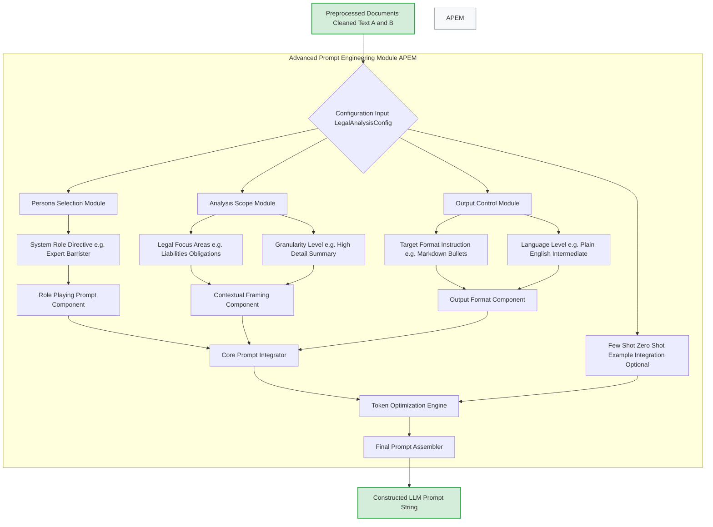
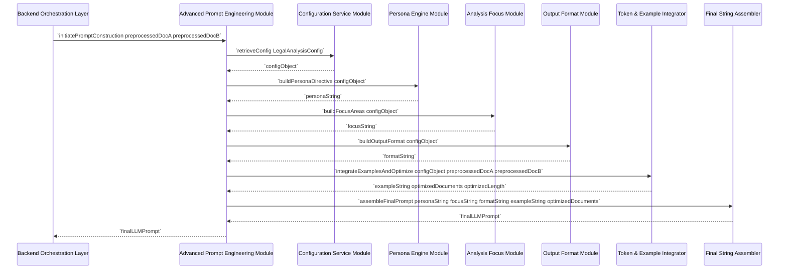
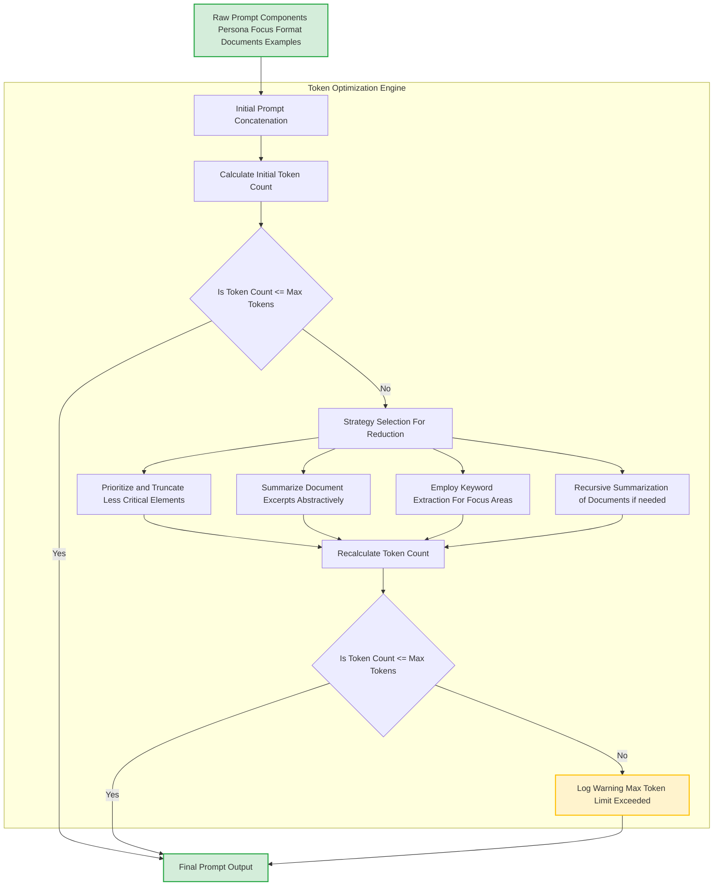

---
**Title of Invention:** A System and Method for Advanced Prompt Engineering in Semantic Legal Document Analysis

**Abstract:**
A highly sophisticated system and method for dynamic and optimized prompt engineering is herein disclosed, specifically designed to empower generative artificial intelligence models in executing complex semantic comparisons of legal documents. This invention meticulously constructs contextualized prompts by integrating user-defined configurations, pre-processed document content, and strategic directives. Key elements include the precise establishment of an AI persona, granular specification of analytical focus areas, explicit control over output format and linguistic style, and intelligent management of prompt token length. By synergistically combining these components, the Advanced Prompt Engineering Module (APEM) ensures that the underlying AI model performs a profoundly accurate and relevant semantic exegesis, transcending mere lexical differences to identify and articulate material legal implications. This module forms the intellectual core enabling the unparalleled clarity, precision, and actionable insights derived from automated legal document comparison.

**Background of the Invention:**
The efficacy of large language models (LLMs) in performing complex analytical tasks, particularly within specialized domains such as legal analysis, is profoundly contingent upon the quality and specificity of their input prompts. Generic or poorly constructed prompts often yield superficial, irrelevant, or even erroneous outputs, failing to harness the full semantic reasoning capabilities of these advanced AI architectures. In the critical field of legal document comparison, where subtle linguistic variations can precipitate monumental legal ramifications, a rudimentary prompt is inherently insufficient. Traditional prompt engineering often relies on ad-hoc, manual iterations, which are neither scalable nor consistently effective. There exists, therefore, an imperative need for a systematic, dynamic, and intelligently automated mechanism for constructing prompts that precisely guide an LLM to perform deep semantic comparison, interpret legal nuances, identify material divergences, and articulate these findings with clarity and precision, all while adhering to strict operational constraints like token limits. The present invention addresses this acute deficiency by providing an architectural and algorithmic solution for advanced, adaptive prompt engineering.

**Brief Summary of the Invention:**
The present invention delineates and realizes an advanced methodology and system for constructing highly optimized prompts for generative AI models, specifically tailored for the semantic comparison of legal documents. At its core, the Advanced Prompt Engineering Module (APEM) orchestrates a multi-staged process commencing with the ingestion of pre-processed legal documents and comprehensive configuration parameters. It dynamically synthesizes a rich, multi-faceted prompt by: (1) instantiating a precise AI persona (e.g., "expert legal analyst"); (2) embedding explicit directives for contextual framing and focus areas (e.g., "identify liability shifts"); (3) defining the desired output format and linguistic complexity; and (4) intelligently integrating optional few-shot examples. A critical component is the integrated Token Optimization Engine, which rigorously manages prompt length to ensure adherence to LLM context window limitations while maximizing informational density, employing strategies such as selective summarization or compression. The resulting prompt string, a holistic fusion of directives and content, is then meticulously validated and prepared for transmission to the generative AI model, thereby ensuring the AI's analytical output is both profound in its legal insight and precisely aligned with user requirements.

**Figures:**

The following figures illustrate the architecture and operational flow of the Advanced Prompt Engineering Module. These conceptual diagrams are integral to understanding the robust and innovative nature of this invention.


**Figure 1: Advanced Prompt Engineering Module Internal Architecture**

This flowchart illustrates the detailed architecture of the Advanced Prompt Engineering Module. It begins with preprocessed documents and configuration parameters, which feed into specialized sub-modules for persona selection, analysis scope definition, and output control. These directives are then integrated into core prompt components, optionally combined with few-shot examples, and passed through a Token Optimization Engine. The final prompt is assembled and outputted for the LLM.


**Figure 2: Sequence Diagram of Prompt Construction within APEM**

This sequence diagram illustrates the chronological flow of interactions within the Advanced Prompt Engineering Module during the construction of a comprehensive AI prompt. It highlights how configuration data is utilized by various internal engines to progressively build the prompt components, culminating in the final prompt string delivered to the Backend Orchestration Layer.


**Figure 3: Detailed Token Optimization Workflow**

This flowchart details the internal workings of the Token Optimization Engine within the Advanced Prompt Engineering Module. It outlines the process from initial prompt concatenation and token counting, through various strategies for prompt reduction if the token limit is exceeded, to the final output of an optimized prompt or a logged warning.

**Detailed Description of the Invention:**
The Advanced Prompt Engineering Module (APEM) represents a core innovation, transforming the interaction with generative AI models from a heuristic art into a systematic and robust science, particularly within the demanding context of legal document analysis. Its sophisticated design ensures that prompts are not merely concatenated strings but meticulously engineered instructional sets that guide the AI's semantic reasoning with unparalleled precision.

**I. System Components and Architecture of APEM:**

1.  **Configuration Service Module CSM:**
    *   **Functionality:** Acts as the primary interface for ingesting and validating system-wide and user-specific configuration parameters (`LegalAnalysisConfig`). These configurations are critical for tailoring the prompt to specific analytical requirements and user preferences.
    *   **Implementation:** Manages a structured `LegalAnalysisConfig` object, including parameters such as `ai_model_name`, `system_persona`, `focus_areas`, `output_format_instructions`, `temperature`, `max_tokens`, `plain_language_level`, and `return_excerpts`. It ensures that all parameters are consistent and within valid ranges.

2.  **Persona Engine Module PEM:**
    *   **Functionality:** Dynamically constructs the "Role-Playing Directive" component of the prompt, instructing the generative AI to adopt a specific epistemic role. This imbues the AI's output with the appropriate tone, depth, and analytical rigor required for legal discourse.
    *   **Implementation:** Leverages the `system_persona` parameter from the `LegalAnalysisConfig` (e.g., "expert legal analyst and senior barrister"). It synthesizes linguistic constructs that prime the AI to operate within this defined professional context, ensuring its responses are grounded in authoritative legal reasoning.

3.  **Analysis Focus Module AFM:**
    *   **Functionality:** Generates the "Contextual Framing" and "Constraint Specification" elements of the prompt. This module guides the AI to concentrate its semantic analysis on specific legal domains, concepts, or types of changes that are most relevant to the comparison task.
    *   **Implementation:** Integrates `focus_areas` (e.g., "liability", "obligations", "financial terms") and `granularity_level` from the configuration. It crafts explicit commands that direct the AI to transcend general comparison, instead performing a targeted exegesis on predefined legal constructs and their implications.

4.  **Output Format Module OFM:**
    *   **Functionality:** Specifies the precise structure, format, and linguistic style desired for the AI's analytical output. This ensures the generated summary is readily digestible, actionable, and aligns with the end-user's display preferences and comprehension level.
    *   **Implementation:** Utilizes `output_format_instructions` (e.g., "plain English bulleted list", "structured JSON") and `plain_language_level` (e.g., "intermediate", "expert"). It generates directives that compel the AI to render its complex legal insights into a specified, accessible format, bridging the gap between raw AI processing and human understanding.

5.  **Few-Shot/Zero-Shot Example Integration Unit TEI - Part 1:**
    *   **Functionality:** Manages the optional inclusion of few-shot examples or activation of zero-shot learning directives within the prompt. This enhances the AI's ability to generalize to specific output patterns or analytical reasoning styles desired by the system.
    *   **Implementation:** Based on configuration, it retrieves or constructs concise examples of desired input/output pairs for the AI. These examples serve as in-context learning demonstrations, allowing the AI to rapidly adapt to nuanced requirements without explicit fine-tuning. For zero-shot scenarios, it ensures the prompt's inherent clarity is sufficient.

6.  **Token Management and Optimization System TEI - Part 2 & Figure 3:**
    *   **Functionality:** A critical sub-module responsible for dynamically calculating, monitoring, and optimizing the total token length of the constructed prompt. It ensures that the prompt, including embedded document texts and directives, remains within the generative AI model's context window limitations (`max_tokens`) while preserving maximal informational density.
    *   **Implementation:**
        *   **Token Counter:** Utilizes model-specific tokenization algorithms to accurately estimate prompt length.
        *   **Dynamic Compression Strategies:** If the initial token count exceeds the `max_tokens` limit, it intelligently applies a hierarchy of reduction strategies:
            *   **Prioritization & Truncation:** Identifies and selectively truncates less critical elements of the prompt (e.g., verbose introductory remarks, less essential examples).
            *   **Abstractive Summarization:** Employs an internal summarization engine (potentially a smaller, faster LLM or extractive algorithms) to condense lengthy document excerpts or detailed examples, maintaining core legal meaning.
            *   **Keyword Extraction:** For very large documents, it can reduce embedded document content to highly relevant keywords, phrases, or critical clauses pertaining to the `focus_areas`.
            *   **Recursive Chunking and Summarization:** For extremely large documents that cannot be fully included, it may process documents in chunks, summarize each chunk, and then feed the summaries to the main AI, or issue a warning if even this is insufficient.
        *   **Iterative Adjustment:** Recalculates token count after each reduction strategy, continuing until the prompt fits or a minimum viable prompt is achieved, logging warnings if significant information loss is unavoidable.

7.  **Final Prompt Assembler FSA:**
    *   **Functionality:** Aggregates all individually constructed prompt components—persona, contextual framing, constraint specification, output format, optimized document excerpts, and examples—into a single, coherent, and syntactically correct prompt string.
    *   **Implementation:** Ensures proper concatenation, formatting (e.g., markdown structure, delimiters), and validation of the final prompt string before it is released to the Generative AI Interaction Module. It applies template logic to fuse the various elements seamlessly.

**II. Operational Workflow of APEM:**

1.  **Initialization:** The APEM receives pre-processed `Document A` and `Document B` along with a `LegalAnalysisConfig` object from the Backend Orchestration Layer.
2.  **Directive Generation:** The Persona Engine, Analysis Focus Module, and Output Format Module independently generate their respective textual directives based on the `LegalAnalysisConfig`.
3.  **Example Integration:** The Few-Shot/Zero-Shot Example Integration Unit determines whether to include specific examples and prepares them for inclusion.
4.  **Initial Assembly:** All generated directives, pre-processed document texts, and examples are combined into an initial draft prompt string.
5.  **Token Optimization:** The Token Management and Optimization System takes this initial prompt, calculates its token count, and applies its hierarchical compression strategies if the count exceeds `max_tokens`. This step is iterative and ensures the prompt is maximally informative within the AI's context window.
6.  **Final Assembly & Validation:** The Final Prompt Assembler integrates any optimized document texts and examples with the directives, performs final formatting and syntactic checks, ensuring a robust and unambiguous prompt string.
7.  **Output:** The complete and optimized AI prompt string is then returned to the Backend Orchestration Layer for transmission to the Generative AI Model.

**III. Embodiments and Further Features:**

*   **Dynamic Prompt Templates:** Utilization of advanced templating languages that allow for conditional logic and dynamic insertion of prompt components based on document characteristics or user intent.
*   **Prompt Versioning and A/B Testing:** Implementation of a system to version control different prompt engineering strategies and conduct A/B tests to empirically determine the most effective prompt structures for various legal document types or comparison tasks.
*   **AI-Assisted Prompt Generation:** Integration of a meta-AI layer that suggests or refines prompt directives based on initial AI output quality, user feedback, or detected document characteristics.
*   **Personalized Prompt Adaptation:** Learning and adapting prompt parameters based on individual user preferences, common error patterns, or historical performance metrics, ensuring a highly personalized and continuously improving experience.
*   **Semantic Graph Integration:** Incorporating directives that reference external legal knowledge graphs or ontologies to further ground the AI's reasoning in a structured legal framework.

**Conceptual Code (PromptBuilder Enhancements):**
Building upon the `PromptBuilder` from the main invention, here's how some of the APEM's internal logic could be conceptualized.

```python
from google.generativeai import GenerativeModel
from enum import Enum
from typing import List, Dict, Any, Optional
import hashlib
import datetime
import tiktoken # Conceptual token counter integration

# Assume LegalAnalysisConfig, AnalysisOutputFormat, etc. from seed file are available.

class TokenizerService:
    """
    A conceptual service for tokenizing text and counting tokens,
    mimicking model-specific tokenization.
    """
    def __init__(self, model_name: str):
        # In a real system, this would load the tokenizer for the specific LLM.
        # For conceptual purposes, we'll use a generic encoding or a placeholder.
        # tiktoken is a good proxy for OpenAI models; other models have their own.
        try:
            self.encoding = tiktoken.encoding_for_model(model_name)
        except KeyError:
            print(f"Warning: tiktoken does not have encoding for {model_name}. Using 'cl100k_base'.")
            self.encoding = tiktoken.get_encoding("cl100k_base")
        self.model_name = model_name

    def count_tokens(self, text: str) -> int:
        """Estimates the number of tokens in a given text."""
        return len(self.encoding.encode(text))

    def truncate_text(self, text: str, max_tokens: int) -> str:
        """Truncates text to fit within max_tokens, preserving start."""
        encoded = self.encoding.encode(text)
        if len(encoded) > max_tokens:
            truncated_encoded = encoded[:max_tokens]
            return self.encoding.decode(truncated_encoded)
        return text

class PromptBuilder:
    """
    Dynamically constructs the sophisticated prompt for the Generative AI Model,
    embodying the APEM's advanced engineering.
    """
    def __init__(self, config: LegalAnalysisConfig):
        self.config = config
        self.tokenizer = TokenizerService(config.ai_model_name)

    def _generate_persona_directive(self) -> str:
        """Constructs the role-playing instruction for the AI."""
        return f"You are an exceptionally astute and highly experienced {self.config.system_persona}."

    def _generate_analysis_focus_directives(self) -> str:
        """Constructs the directives for focus areas and analytical depth."""
        focus_areas_str = ", ".join(self.config.focus_areas)
        return f"""
        Your critical mission is to perform a forensic, semantic comparison between two versions of a legal document.
        Your analysis must transcend superficial lexical variations and delve into the fundamental legal meaning,
        potential risks, and practical implications of all material differences.

        Specifically, meticulously analyze changes related to: {focus_areas_str}.
        For each identified material difference, you must articulate:
        1.  A concise description of the change.
        2.  Its precise legal meaning and significance.
        3.  The potential real-world implications or consequences for the parties involved.
        {"4.  Where appropriate, a brief excerpt from Document A and Document B illustrating the change context." if self.config.return_excerpts else ""}
        5.  Assign a qualitative severity (e.g., 'High', 'Medium', 'Low') to the change based on its potential impact.
        """

    def _generate_output_format_directives(self) -> str:
        """Constructs the directives for output format and language level."""
        return f"""
        Present your findings in a clear, structured, and easily digestible {self.config.output_format_instructions},
        ensuring all explanations are provided in unambiguous, plain English suitable for a {self.config.plain_language_level} legal understanding, devoid of unnecessary legalistic jargon.
        Your objective is to provide actionable intelligence to a stakeholder who may not possess deep legal expertise.
        """

    def _integrate_few_shot_examples(self, doc_a: str, doc_b: str) -> str:
        """
        Conceptual: Integrates optional few-shot examples into the prompt.
        In a real system, this would retrieve relevant examples.
        For simplicity, this is a placeholder.
        """
        # Example: if configured for specific clause comparison
        if "indemnification" in self.config.focus_areas:
            return """
            --- EXAMPLE ---
            Document A Snippet: "Party A shall indemnify Party B for all losses."
            Document B Snippet: "Party A may indemnify Party B for direct losses only."
            AI Output Example:
            1. Description: Shift from mandatory to discretionary indemnification.
            2. Implications: Party B's protection is reduced; Party A has discretion and limited exposure.
            3. Category: Indemnification Clause Change
            4. Severity: High
            --- END EXAMPLE ---
            """
        return ""

    def _optimize_prompt_tokens(self, prompt_parts: List[str], doc_a_cleaned: str, doc_b_cleaned: str) -> Dict[str, str]:
        """
        Applies token optimization strategies to ensure the prompt fits within max_tokens.
        This mirrors the Token Management and Optimization System (Figure 3).
        """
        base_prompt = "\n".join(prompt_parts)
        doc_a_placeholder = "--- DOCUMENT A Original Version ---\n{DOC_A}\n"
        doc_b_placeholder = "--- DOCUMENT B Revised Version ---\n{DOC_B}\n"
        trailer = "--- ANALYTICAL FINDINGS ---"

        # Calculate tokens for fixed parts
        fixed_tokens = self.tokenizer.count_tokens(base_prompt + doc_a_placeholder + doc_b_placeholder + trailer)
        available_tokens_for_docs = self.config.max_tokens - fixed_tokens

        # If docs are too big, apply strategies
        # Strategy 1: Proportional truncation
        doc_a_len = self.tokenizer.count_tokens(doc_a_cleaned)
        doc_b_len = self.tokenizer.count_tokens(doc_b_cleaned)
        total_docs_len = doc_a_len + doc_b_len

        if total_docs_len > available_tokens_for_docs and available_tokens_for_docs > 0:
            ratio_a = doc_a_len / total_docs_len
            ratio_b = doc_b_len / total_docs_len

            max_tokens_a = int(available_tokens_for_docs * ratio_a)
            max_tokens_b = int(available_tokens_for_docs * ratio_b)

            optimized_doc_a = self.tokenizer.truncate_text(doc_a_cleaned, max_tokens_a)
            optimized_doc_b = self.tokenizer.truncate_text(doc_b_cleaned, max_tokens_b)

            print(f"DEBUG: Docs truncated. Original tokens A:{doc_a_len}, B:{doc_b_len}. Optimized A:{self.tokenizer.count_tokens(optimized_doc_a)}, B:{self.tokenizer.count_tokens(optimized_doc_b)}")
        elif available_tokens_for_docs <= 0:
            # Fallback: severely truncate documents or provide warning
            print("WARNING: Insufficient token budget for documents. Severely truncating.")
            optimized_doc_a = self.tokenizer.truncate_text(doc_a_cleaned, self.config.max_tokens // 4) # Arbitrary severe truncation
            optimized_doc_b = self.tokenizer.truncate_text(doc_b_cleaned, self.config.max_tokens // 4)
        else:
            optimized_doc_a = doc_a_cleaned
            optimized_doc_b = doc_b_cleaned


        return {
            "base_prompt": base_prompt,
            "doc_a": optimized_doc_a,
            "doc_b": optimized_doc_b,
            "trailer": trailer
        }


    def build_comparison_prompt(self, doc_a_cleaned: str, doc_b_cleaned: str) -> str:
        """
        Constructs a comprehensive and directive prompt for the AI model,
        integrating all APEM features.
        """
        prompt_components: List[str] = []

        # 1. Persona and Role-Playing Directive
        prompt_components.append(self._generate_persona_directive())

        # 2. Analysis Scope and Contextual Framing
        prompt_components.append(self._generate_analysis_focus_directives())

        # 3. Output Specification and Formatting Control
        prompt_components.append(self._generate_output_format_directives())

        # 4. Few-Shot Example Integration
        few_shot_examples = self._integrate_few_shot_examples(doc_a_cleaned, doc_b_cleaned)
        if few_shot_examples:
            prompt_components.append(few_shot_examples)

        # 5. Token Management and Optimization
        # This step conceptually prepares the document texts for integration
        # after building the core directives.
        optimized_parts = self._optimize_prompt_tokens(prompt_components, doc_a_cleaned, doc_b_cleaned)

        final_prompt = f"""
{optimized_parts["base_prompt"]}

--- DOCUMENT A Original Version ---
{optimized_parts["doc_a"]}

--- DOCUMENT B Revised Version ---
{optimized_parts["doc_b"]}

{optimized_parts["trailer"]}
        """
        return final_prompt.strip()

# Example usage (assuming LegalAnalysisConfig, etc are defined as in seed)
# config = LegalAnalysisConfig(max_tokens=8000)
# prompt_builder = PromptBuilder(config)
# final_prompt_string = prompt_builder.build_comparison_prompt("text of doc A", "text of doc B")
# print(final_prompt_string)
# print(f"Final prompt token count: {prompt_builder.tokenizer.count_tokens(final_prompt_string)}")
```

**Claims:**
The following claims assert the definitive intellectual ownership and novel aspects of the disclosed Advanced Prompt Engineering Module.

1.  A method for dynamically constructing an optimized prompt for a generative artificial intelligence model to perform semantic legal document comparison, comprising:
    a.  Receiving pre-processed textual content of a first legal document Document A and a second legal document Document B.
    b.  Receiving a set of configurable parameters `LegalAnalysisConfig` specifying desired AI persona, analysis focus areas, output format, and token limits.
    c.  Programmatically generating a role-playing directive component based on the specified AI persona.
    d.  Programmatically generating a contextual framing component based on the specified analysis focus areas and intended analytical depth.
    e.  Programmatically generating an output format specification component based on the desired output structure and linguistic complexity.
    f.  Integrating the generated components with the textual content of Document A and Document B to form an initial prompt string.
    g.  Applying a Token Management and Optimization process to said initial prompt string, said process comprising:
        i.   Calculating an initial token count of the prompt string.
        ii.  If the initial token count exceeds a predefined maximum token limit, dynamically applying at least one token reduction strategy selected from the group consisting of: selective truncation of less critical elements, abstractive summarization of document excerpts, and keyword extraction from focus areas, to yield an optimized prompt string.
    h.  Assembling the optimized prompt string into a final, coherent prompt for transmission to the generative artificial intelligence model.

2.  The method of claim 1, wherein the token reduction strategy further comprises recursively chunking and summarizing segments of Document A and Document B when direct inclusion of full documents is infeasible due to token limits.

3.  The method of claim 1, further comprising integrating specific few-shot examples into the prompt string, wherein said examples demonstrate desired output patterns or analytical reasoning for the generative artificial intelligence model.

4.  The method of claim 1, wherein the programmatic generation of components ensures that directives for the AI model explicitly command it to transcend lexical differences and focus on fundamental shifts in legal meaning, obligations, liabilities, financial terms, or dispute resolution mechanisms.

5.  A system for Advanced Prompt Engineering, comprising:
    a.  A Configuration Service Module configured to receive and validate a `LegalAnalysisConfig` object.
    b.  A Persona Engine Module configured to generate a role-playing directive based on said `LegalAnalysisConfig`.
    c.  An Analysis Focus Module configured to generate contextual framing and constraint specification directives based on said `LegalAnalysisConfig`.
    d.  An Output Format Module configured to generate output format and language level directives based on said `LegalAnalysisConfig`.
    e.  A Token Management and Optimization System operatively coupled to said modules, configured to:
        i.   Receive an initial prompt string integrating pre-processed legal documents and directives from said modules.
        ii.  Calculate the token count of said initial prompt string.
        iii. If the token count exceeds a maximum token limit, apply dynamic compression strategies, including but not limited to, selective truncation or summarization of textual content, to produce an optimized prompt string.
    f.  A Final Prompt Assembler configured to aggregate and validate the components and optimized textual content into a coherent, final prompt string for a generative artificial intelligence model.

6.  The system of claim 5, further comprising a Few-Shot/Zero-Shot Example Integration Unit configured to incorporate illustrative examples into the prompt string to guide the generative artificial intelligence model's inference patterns.

7.  The system of claim 5, wherein the Token Management and Optimization System is further configured to:
    a.  Utilize a model-specific tokenization algorithm for accurate token counting.
    b.  Implement a hierarchical set of token reduction strategies, prioritizing the preservation of critical legal information over less essential contextual details.

8.  The system of claim 5, wherein the output of the Final Prompt Assembler is designed to explicitly direct the generative artificial intelligence model to:
    a.  Assume the epistemic role of a legal expert.
    b.  Perform a deep semantic comparison of legal meanings and implications between the provided documents.
    c.  Articulate identified material differences and their consequences in plain, non-esoteric language.

**Mathematical Justification:**
The efficacy and novelty of the Advanced Prompt Engineering Module (APEM) are substantiated by a formal mathematical framework that describes its role in optimizing the generative AI's performance for semantic legal analysis.

### I. Prompt Space and Configuration Mapping

Let `D_A` and `D_B` be the pre-processed textual contents of Document A and Document B, respectively. Let `C` be the `LegalAnalysisConfig` object, represented as a vector of parameters `C = (c_persona, c_focus, c_outputFormat, c_maxTokens, ...)` within a configuration space `C_space`.

**Definition 1.1 Prompt Component Generation Functions:** The APEM comprises several deterministic functions `f_i` that map `C` (and potentially `D_A, D_B`) to textual prompt components `P_i`:
*   `P_persona = f_persona(C)`: Role-playing directive (e.g., "expert legal analyst").
*   `P_context = f_context(C)`: Contextual framing and focus areas.
*   `P_format = f_format(C)`: Output format and language level.
*   `P_examples = f_examples(C, D_A, D_B)`: Few-shot examples (optional).

**Definition 1.2 Initial Prompt Construction Function `f_assemble`:** An assembly function `f_assemble` concatenates these components with the document texts to form an initial prompt `P_initial`:
```
P_initial = f_assemble(P_persona, P_context, P_format, P_examples, D_A, D_B)
```
This function is subject to syntactic rules to ensure the prompt is well-formed for the LLM.

### II. Token Optimization as a Constrained Maximization Problem

Let `T(S)` be a function that returns the token count of a string `S` using a model-specific tokenizer. Let `M` be the maximum allowed token limit for the generative AI model, `M = c_maxTokens`.

**Definition 2.1 Informational Density `I(S)`:** For any prompt string `S`, its informational density `I(S)` quantifies the amount of legally relevant, non-redundant information it contains relative to the desired analytical task. `I(S)` is a complex, implicitly defined metric that aims to maximize the LLM's ability to approximate `Delta_legal`.

The core problem addressed by the Token Management and Optimization System is to find an optimized prompt `P_optimized` such that:
```
Maximize I(P_optimized)
Subject to T(P_optimized) <= M
Where P_optimized is derived from P_initial via a series of transformation functions.
```

**Definition 2.2 Token Reduction Transformations `g_j`:** The APEM employs a set of transformation functions `g_j` that modify a prompt string `S` to reduce its token count, typically by sacrificing some informational density:
*   `g_truncation(S, k)`: Truncates `S` to `k` tokens.
*   `g_summarization(S, k)`: Abstractively summarizes `S` to approximately `k` tokens, preserving core meaning.
*   `g_keywordExtraction(S, k)`: Extracts key legal terms/phrases from `S` to form a new string of `k` tokens.

**Algorithm 2.1 Hierarchical Token Optimization:** The optimization process operates iteratively:
1.  Calculate `T(P_initial)`. If `T(P_initial) <= M`, then `P_optimized = P_initial`.
2.  Else, apply `g_1` (e.g., truncation of least critical parts).
3.  Calculate `T(g_1(P_initial))`. If `<= M`, then `P_optimized = g_1(P_initial)`.
4.  Else, apply `g_2` (e.g., summarization of document text within `g_1(P_initial)`).
5.  Continue applying `g_j` in a predefined hierarchy until `T(P_optimized) <= M` or a minimal, irreducibly concise prompt is achieved, at which point a warning is logged.

**Theorem 2.1 Existence of Optimal Prompt within Constraints:** Given the operational constraints of LLMs (finite context window `M`), the APEM's hierarchical token optimization process guarantees the generation of a prompt `P_optimized` such that `T(P_optimized) <= M`, and `I(P_optimized)` is maximized relative to the applied transformation functions and their sequence.
*Proof Sketch:* The process is deterministic and iterative. Each `g_j` reduces token count. Since `T(S)` is always non-negative, and `M` is finite, the process will always terminate. If `M` is sufficiently large, `P_initial` itself may be the `P_optimized`. If `P_initial` exceeds `M`, the application of a finite sequence of token-reducing transformations `g_j` will eventually yield a `P_optimized` that satisfies the token constraint or reaches a minimum possible length (e.g., an empty string or a core set of irreducible instructions). The "maximization" of `I(P_optimized)` is achieved by prioritizing transformations that preserve higher informational density (e.g., summarizing rather than truncating critical legal clauses) and by ordering `g_j` according to this heuristic.

### III. Impact on Generative AI Performance

Let `G_AI(S)` be the output of the generative AI model given a prompt `S`. The objective of APEM is to enhance the accuracy of `G_AI`'s approximation of `Textualization(Delta_legal)`.

**Hypothesis 3.1 Prompt Specificity and Semantic Alignment:** A `P_optimized` constructed by the APEM significantly improves the semantic alignment and task-specific performance of `G_AI` compared to a generic or manually constructed prompt `P_generic`.
```
Accuracy(G_AI(P_optimized)) >> Accuracy(G_AI(P_generic))
```
This is because `P_optimized` rigorously encodes the AI persona, contextual framing, specific constraints (focus areas), and desired output format, all crucial for steering the LLM's vast knowledge base toward a precise legal analytical outcome. The token optimization further ensures that maximum relevant information (documents and directives) is conveyed within the LLM's operational bounds, preventing truncation of critical legal text or instructions that could degrade output quality.

**Proof of Utility:**
The utility of the Advanced Prompt Engineering Module (APEM) is profoundly evident in its capacity to transform the theoretical capabilities of generative AI models into practical, high-value applications within the legal domain. Without the APEM, LLMs, despite their vast parametric knowledge, often struggle to consistently deliver precise, legally nuanced, and contextually appropriate analyses of complex documents. This is due to their inherent generality and the ambiguity of non-engineered prompts.

The APEM, through its systematic construction of `P_optimized`, directly addresses this challenge. By explicitly defining the AI's `P_persona`, meticulously specifying `P_context` (including `c_focus` areas like liability and obligations), and dictating `P_format`, the APEM primes the `G_AI` to operate not as a general chatbot, but as a specialized legal expert. This deliberate instructional scaffolding significantly reduces the LLM's "hallucination" rate and increases the fidelity of its output to the actual `Delta_legal` being sought.

Furthermore, the integrated Token Management and Optimization System is indispensable. Legal documents are often voluminous, exceeding typical LLM context windows. Without intelligent token management, critical information would be arbitrarily truncated, leading to incomplete or erroneous comparisons. The APEM's `g_j` transformations ensure that the most legally salient portions of `D_A` and `D_B`, alongside all essential directives, are always prioritized and conveyed within `c_maxTokens`. This prevents `G_AI` from operating on an incomplete data set, guaranteeing that the computed `Summary` is a robust and comprehensive approximation of `Textualization(Delta_legal)`. The APEM thus provides an essential, patentable layer of intelligence, ensuring that the inventive system's interaction with `G_AI` is both efficient and profoundly effective.
---