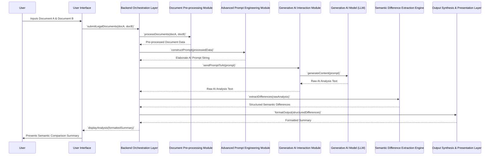

**Title of Invention:** A System and Method for Semantic Comparison and Analysis of Legal Documents

**Abstract:**
A profoundly innovative system for the deep semantic analysis and comparative exegesis of legal documents is herein disclosed. This system systematically receives two distinct textual instantiations of legal instruments, such as antecedent and subsequent versions of a contractual agreement. It then dispatches both documents to an advanced generative artificial intelligence model, synergistically integrated with a meticulously crafted instructional prompt. This prompt mandates the AI model to transcend mere superficial lexical discrepancies, compelling it to perform a rigorous semantic comparison to discern fundamental material divergences in legal meaning, their latent jurisprudential implications, and potential ramifications. The system subsequently synthesizes and renders a lucid, concisely articulated summary of these identified legal disparities, presented in accessible, non-esoteric English, thereby empowering even individuals lacking specialized legal expertise to rapidly apprehend the substantive changes between document iterations with unparalleled clarity and precision. This invention establishes a new benchmark for automated legal document analysis.

**Background of the Invention:**
The rigorous comparison of disparate versions of legal instruments, particularly contractual agreements, constitutes an unequivocally critical yet prohibitively arduous and labor-intensive undertaking within the legal domain. Conventional textual differential analysis tools, commonly referred to as "diff" utilities, are fundamentally restricted to identifying and delineating only superficial, character-level, or word-level textual variances. Such rudimentary tools are inherently incapable of performing interpretative analysis regarding the profound legal meaning or the intrinsic jurisprudential significance of identified textual alterations. A seemingly innocuous linguistic modification, a subtle syntactical rearrangement, or an apparently minor semantic shift can precipitate cascading, monumental legal ramifications that remain entirely opaque and indiscernible to a layperson, and often, even to seasoned legal professionals without extensive, dedicated scrutiny. The traditional paradigm of legal document review, reliant heavily upon human expert cognition, is consequently characterized by exorbitant costs, protracted timelines, and an inherent susceptibility to human error and cognitive fatigue. Ergo, there exists an acute, imperative demand for an advanced computational apparatus capable of autonomously executing the preliminary analytical phase, meticulously accentuating the most pivotal and material legal divergences in a form that is both comprehensible and actionable, thereby ushering in an era of unprecedented efficiency and accuracy in legal practice.

**Brief Summary of the Invention:**
The present invention definitively articulates and actualizes a revolutionary paradigm for legal document comparison. It furnishes an intuitive, highly sophisticated user interface enabling an operator to input the complete textual content of a foundational document, designated herein as "Document A," and a comparative document, designated as "Document B." Upon reception of these textual corpora, the system proceeds to meticulously construct a singular, holistic, and semantically optimized prompt tailored for invocation of a large language model (LLM) of advanced generative capacity. This prompt is ingeniously engineered to encapsulate the entirety of both documents' textual content. Furthermore, the prompt integrates explicit directives instructing the artificial intelligence to assume the epistemic role of a preeminent legal analyst, to perform a rigorous comparative exegesis between the two documents, and to subsequently synthesize an exhaustive summary enumerating all material legal differences. The AI is specifically commanded to transcend superficial textual variations, to meticulously identify fundamental shifts in stipulated obligations, potential liabilities, temporal stipulations, financial terms, and other pivotal legal constructs. Crucially, the AI is further tasked with elucidating the latent and patent implications of these identified changes. The resultant synthesized analytical summary is then dynamically presented to the user through a clear, structured display, providing instant, actionable insights. This architectural construct establishes a definitive ownership over the entire conceptual framework and its implementation.

**Figures:**

The following figures illustrate the architecture and operational flow of the system. These conceptual diagrams are integral to understanding the robust and innovative nature of this invention.

```mermaid
graph TD
    A[User Interface] --> B{Submit Documents}
    B --> C[Backend Orchestration Layer]
    C --> D[Document Pre-processing Module]
    D --> E[Advanced Prompt Engineering Module]
    E --> F[Generative AI Interaction Module]
    F --> G[Generative AI Model (e.g., Gemini)]
    G --> H[Semantic Difference Extraction Engine]
    H --> I[Output Synthesis & Presentation Layer]
    I --> J[Display to User]

    subgraph Backend Services
        C
        D
        E
        F
        H
        I
    end

    style A fill:#D4EDDA,stroke:#28A745,stroke-width:2px;
    style J fill:#D4EDDA,stroke:#28A745,stroke-width:2px;
    style G fill:#FFF3CD,stroke:#FFC107,stroke-width:2px;
```
**Figure 1: System Architecture for Semantic Legal Document Comparison**

This flowchart delineates the high-level operational architecture. The User Interface (A) initiates the process by submitting documents (B) to the Backend Orchestration Layer (C). Documents undergo pre-processing (D) and sophisticated prompt engineering (E) before interaction with the Generative AI Model (G) via the Interaction Module (F). The AI's output is then processed by the Semantic Difference Extraction Engine (H) and formatted for presentation (I), finally displayed to the user (J).


**Figure 2: Sequence Diagram of Legal Document Comparison Process**

This sequence diagram illustrates the chronological flow of interactions between the user, the user interface, and the various backend components, culminating in the presentation of the semantic comparison summary. Each arrow represents a distinct communication or data transfer event, emphasizing the sequential and collaborative nature of the inventive process.

**Detailed Description of the Invention:**
The present invention meticulously defines a robust, multi-tiered system for the profound semantic comparison of legal documentation, thereby transcending the inherent limitations of lexical-only differentiation methods.

**I. System Components and Architecture:**

1.  **User Interface (UI) Module:**
    *   **Functionality:** Provides an intuitive, secure graphical interface for the end-user. This module is responsible for the ingestion of input legal documents.
    *   **Implementation:** Comprises two distinct, extensible text input fields, one designated for the 'Original Document' (Document A) and the other for the 'Revised Document' (Document B). Controls for submission, clear, and optional settings (e.g., specificity of analysis, output format preferences) are also provided.
    *   **Data Handling:** Securely transmits the raw textual content of Document A and Document B to the Backend Orchestration Layer upon user initiation.

2.  **Backend Orchestration Layer (BOL):**
    *   **Functionality:** Serves as the central coordinating nexus for all backend operations, managing the workflow, data flow, and inter-module communication. It acts as the primary API endpoint for the UI.
    *   **Implementation:** Implemented as a high-performance, scalable service, capable of handling concurrent requests. Utilizes asynchronous processing to ensure responsiveness.
    *   **Key Responsibilities:** Request validation, sequencing of processing steps, error handling, and aggregation of results from subordinate modules.

3.  **Document Pre-processing Module (DPM):**
    *   **Functionality:** Prepares the raw textual input for optimal consumption by downstream modules, particularly the Advanced Prompt Engineering Module. This involves normalizing textual data, removing extraneous artifacts, and potentially identifying document structure.
    *   **Implementation:** Incorporates advanced Natural Language Processing (NLP) techniques such as:
        *   **Text Cleaning:** Removal of non-essential whitespace, special characters, headers/footers, and boilerplate text.
        *   **Encoding Normalization:** Ensures consistent character encoding (e.g., UTF-8).
        *   **Section Delineation (Optional):** Employs heuristic or machine learning models to identify logical sections (e.g., "Preamble," "Definitions," "Covenants," "Term and Termination") within the legal documents, which can later inform prompt construction.

4.  **Advanced Prompt Engineering Module (APEM):**
    *   **Functionality:** The intellectual core of the system's interaction with the generative AI. This module dynamically constructs the comprehensive and highly optimized prompt that guides the AI's analytical process.
    *   **Implementation:** Employs sophisticated algorithms for prompt construction, incorporating:
        *   **Role-Playing Directive:** Clearly instructs the AI to adopt the persona of an "expert legal analyst" or a "senior barrister," imbuing its output with appropriate linguistic style and analytical rigor.
        *   **Contextual Framing:** Establishes the purpose of the comparison (e.g., "identify material differences," "focus on legal implications").
        *   **Constraint Specification:** Directs the AI to focus on specific legal domains (e.g., "liability," "obligations," "financial terms," "indemnification clauses," "dispute resolution").
        *   **Format Specification:** Instructs the AI on the desired output format (e.g., "bulleted list," "structured JSON," "plain English summary," "table of changes").
        *   **Few-Shot/Zero-Shot Learning Integration:** Incorporates examples of desired output or specific analytical patterns if beneficial, or relies on the LLM's inherent capabilities for zero-shot inference.
        *   **Token Optimization:** Strategically manages prompt length to adhere to LLM context window limits while preserving maximum informational density.

5.  **Generative AI Interaction Module (GAIIM):**
    *   **Functionality:** Acts as the secure and efficient conduit between the Backend Orchestration Layer and the selected Generative AI Model(s).
    *   **Implementation:**
        *   **API Client:** Manages API keys, authentication, and request/response serialization (e.g., JSON).
        *   **Rate Limiting & Retry Logic:** Implements robust mechanisms to handle API rate limits and transient network errors, ensuring system resilience.
        *   **Model Selection:** Supports integration with multiple generative AI models (e.g., Gemini, GPT series, Claude) allowing for dynamic model selection based on performance, cost, or specific task requirements.

6.  **Generative AI Model (LLM):**
    *   **Functionality:** The core computational engine for semantic comparison. This model, often a large language model based on transformer architecture, performs the high-dimensional pattern recognition and semantic inference.
    *   **Operational Principle:** Given the structured prompt and the legal documents, the LLM processes billions of parameters to understand the nuanced meaning of each document, identify points of divergence, infer their legal significance based on its vast training corpus of legal texts, and synthesize a coherent response. It effectively approximates the `L(D)` function and performs the `Δ_legal` computation as defined in the mathematical justifications.

7.  **Semantic Difference Extraction Engine (SDEE):**
    *   **Functionality:** Post-processes the raw textual output from the Generative AI Model, extracting, structuring, and refining the identified legal differences into a machine-readable and further processable format.
    *   **Implementation:** Utilizes advanced NLP techniques:
        *   **Named Entity Recognition (NER):** Identifies legal entities (parties, dates, financial amounts, specific clauses).
        *   **Relationship Extraction:** Deduces relationships between identified entities and concepts (e.g., "Party A *owes* Party B," "Clause X *modifies* Clause Y").
        *   **Sentiment Analysis (Contextual):** Assesses the legal "tone" or potential risk associated with changes.
        *   **Structured Data Conversion:** Transforms free-form AI text into structured formats such as JSON, XML, or custom data objects, allowing for programmatic manipulation.

8.  **Output Synthesis & Presentation Layer (OSPL):**
    *   **Functionality:** Transforms the structured legal differences into a user-friendly, comprehensible, and visually organized summary suitable for display to the end-user.
    *   **Implementation:**
        *   **Summarization Algorithms:** May employ extractive or abstractive summarization techniques to further distill the AI's output, focusing on conciseness and clarity.
        *   **Visualization Components:** Renders the summary in various formats: bulleted lists, comparative tables, interactive dashboards, or annotated document views where changes are highlighted directly within the document text.
        *   **Plain English Translator:** Ensures that complex legal jargon, if present in the AI's raw output, is translated into unambiguous, accessible language for non-legal professionals.

**II. Operational Workflow:**

1.  **Document Ingestion:** The user provides Document A and Document B via the UI.
2.  **Backend Initiation:** The BOL receives the documents and initiates the comparison workflow.
3.  **Pre-processing:** The DPM cleans and normalizes the document texts.
4.  **Prompt Construction:** The APEM dynamically generates a highly specific and contextualized prompt, embedding the cleaned documents and instructing the AI on its analytical task and desired output format.
5.  **AI Invocation:** The GAIIM transmits the constructed prompt to the selected Generative AI Model.
6.  **AI Analysis:** The Generative AI Model processes the prompt and documents, performing a deep semantic comparison, inferring legal implications, and generating a raw text analysis.
7.  **Difference Extraction:** The SDEE receives the AI's raw analysis, parses it, and extracts structured semantic differences, potentially categorizing them by type (e.g., change in obligation, change in liability, new clause, removed clause).
8.  **Output Formatting:** The OSPL transforms the structured differences into a human-readable summary, often employing plain English explanations and clear formatting (e.g., a bulleted list of "Key Material Differences").
9.  **User Presentation:** The formatted summary is returned to the UI and displayed to the user, offering immediate insight into the legal ramifications of the document changes.

**III. Embodiments and Further Features:**

*   **Integrated Development Environment (IDE) for Legal Professionals:** The system can be integrated as a plugin or module within existing legal software suites, document management systems, or contract lifecycle management platforms.
*   **Version Control Integration:** Direct integration with document version control systems (e.g., Git-like systems for legal documents) to automatically trigger comparisons upon new version commits.
*   **Multi-Lingual Support:** Expansion to handle and compare legal documents in multiple natural languages, leveraging the multilingual capabilities of advanced LLMs.
*   **Domain-Specific Tuning:** Capability to fine-tune the Generative AI Model or specialize prompt engineering for particular legal domains (e.g., corporate law, real estate, intellectual property, litigation).
*   **Risk Scoring and Visualization:** Assignment of quantitative risk scores to identified changes and their visual representation (e.g., heat maps, dashboards) to prioritize review.
*   **Interactive Drill-Down:** The ability for users to click on a summarized difference and view the corresponding sections in Document A and Document B side-by-side, with relevant text highlighted.

**Conceptual Code (Python Backend):**
This conceptual code demonstrates the core logic, reflecting the architectural principles and intellectual constructs defining the system. Each module is designed to be highly extensible and robust.

```python
from google.generativeai import GenerativeModel
from enum import Enum
from typing import List, Dict, Any, Optional

# --- Configuration and Utility Classes ---

class LegalAnalysisConfig:
    """
    Encapsulates configuration parameters for the legal analysis system.
    This class is integral to system adaptability and robustness.
    """
    def __init__(self,
                 ai_model_name: str = 'gemini-2.5-flash',
                 system_persona: str = "expert legal analyst and senior barrister",
                 focus_areas: List[str] = None,
                 output_format_instructions: str = "plain English bulleted list",
                 temperature: float = 0.2,
                 max_tokens: int = 4000):
        self.ai_model_name = ai_model_name
        self.system_persona = system_persona
        self.focus_areas = focus_areas if focus_areas is not None else [
            "liability", "obligations", "financial terms", "indemnification",
            "dispute resolution", "term and termination clauses", "representations and warranties"
        ]
        self.output_format_instructions = output_format_instructions
        self.temperature = temperature
        self.max_tokens = max_tokens

class AnalysisOutputFormat(Enum):
    """
    Defines the structured output formats supported for the semantic analysis.
    This ensures standardized data interchange and presentation flexibility.
    """
    PLAIN_TEXT = "plain_text"
    MARKDOWN_BULLETS = "markdown_bullets"
    JSON_STRUCTURED = "json_structured"
    XML_STRUCTURED = "xml_structured"

class SemanticDifference:
    """
    A foundational data structure representing a single semantic difference identified
    between legal documents. This object facilitates structured output and downstream processing.
    """
    def __init__(self,
                 category: str,
                 description: str,
                 implications: str,
                 doc_a_excerpt: Optional[str] = None,
                 doc_b_excerpt: Optional[str] = None,
                 severity: Optional[str] = None):
        self.category = category  # e.g., "Obligation Change", "Liability Shift", "Financial Term"
        self.description = description
        self.implications = implications
        self.doc_a_excerpt = doc_a_excerpt
        self.doc_b_excerpt = doc_b_excerpt
        self.severity = severity # e.g., "High", "Medium", "Low"

    def to_dict(self) -> Dict[str, Any]:
        """Converts the semantic difference to a dictionary for JSON serialization."""
        return {
            "category": self.category,
            "description": self.description,
            "implications": self.implications,
            "doc_a_excerpt": self.doc_a_excerpt,
            "doc_b_excerpt": self.doc_b_excerpt,
            "severity": self.severity
        }

# --- Core System Modules (exported components) ---

class LegalDocumentProcessor:
    """
    Responsible for pre-processing legal document texts.
    This module enhances the quality and consistency of input for the LLM.
    """
    @staticmethod
    def clean_text(text: str) -> str:
        """
        Performs basic text cleaning: removes excessive whitespace, normalizes line endings.
        Further advanced cleaning (e.g., boilerplate removal) can be integrated here.
        """
        if not isinstance(text, str):
            raise TypeError("Input 'text' must be a string.")
        text = text.strip()
        text = ' '.join(text.split()) # Normalize whitespace
        return text

    @staticmethod
    def identify_sections(text: str) -> Dict[str, str]:
        """
        (Conceptual) Identifies logical sections within a legal document.
        This advanced feature uses pattern matching or ML to delineate sections,
        providing granular context for the LLM.
        """
        # This is a placeholder; real implementation would involve regex,
        # NLP models (e.g., spaCy for section headers), or heuristic rules.
        # For simplicity, we return the whole text as a single 'body' section.
        return {"full_document_body": text}

class PromptBuilder:
    """
    Dynamically constructs the sophisticated prompt for the Generative AI Model.
    This class is the embodiment of advanced prompt engineering.
    """
    def __init__(self, config: LegalAnalysisConfig):
        self.config = config

    def build_comparison_prompt(self, doc_a_cleaned: str, doc_b_cleaned: str) -> str:
        """
        Constructs a comprehensive and directive prompt for the AI model.
        This prompt instructs the AI to perform a deep semantic comparison.
        """
        focus_areas_str = ", ".join(self.config.focus_areas)

        # The prompt is meticulously crafted to guide the AI's reasoning path.
        prompt = f"""
        You are an exceptionally astute and highly experienced {self.config.system_persona}.
        Your critical mission is to perform a forensic, semantic comparison between two versions of a legal document.
        Your analysis must transcend superficial lexical variations and delve into the fundamental legal meaning,
        potential risks, and practical implications of all material differences.

        Specifically, meticulously analyze changes related to: {focus_areas_str}.
        For each identified material difference, you must articulate:
        1.  A concise description of the change.
        2.  Its precise legal meaning and significance.
        3.  The potential real-world implications or consequences for the parties involved.
        4.  Where appropriate, a brief excerpt from Document A and Document B illustrating the change context.
        5.  Assign a qualitative severity (e.g., "High", "Medium", "Low") to the change based on its potential impact.

        Present your findings in a clear, structured, and easily digestible {self.config.output_format_instructions},
        ensuring all explanations are provided in unambiguous, plain English, devoid of unnecessary legalistic jargon.
        Your objective is to provide actionable intelligence to a stakeholder who may not possess deep legal expertise.

        --- DOCUMENT A (Original Version) ---
        {doc_a_cleaned}

        --- DOCUMENT B (Revised Version) ---
        {doc_b_cleaned}

        --- ANALYTICAL FINDINGS ---
        """
        return prompt

class AnalysisFormatter:
    """
    Processes the raw output from the Generative AI Model and formats it
    into a structured, user-friendly presentation. This module bridges AI output
    with human comprehension.
    """
    def __init__(self, target_format: AnalysisOutputFormat = AnalysisOutputFormat.MARKDOWN_BULLETS):
        self.target_format = target_format

    def parse_and_structure_ai_output(self, ai_raw_text: str) -> List[SemanticDifference]:
        """
        Parses the raw AI output (which should ideally follow the prompt's instructions)
        into a list of structured SemanticDifference objects.
        This can involve heuristic parsing or a more robust NLP pipeline.
        """
        # This is a highly complex task and will depend on the AI's adherence to the prompt.
        # For a truly robust system, this might involve another smaller LLM or a sophisticated
        # rule-based system trained on parsing the expected output format.

        # A simplified heuristic approach for demonstration:
        differences: List[SemanticDifference] = []
        # Assuming the AI provides output in a clear, bulleted, plain English format.
        # We'll simulate parsing into SemanticDifference objects.

        # Example: Simple keyword-based parsing for demonstration.
        # In a real scenario, this would be far more intelligent, perhaps
        # using regex or a small fine-tuned model for extraction.
        lines = ai_raw_text.split('\n')
        current_category = "General"
        current_description = ""
        current_implications = ""
        current_doc_a_excerpt = ""
        current_doc_b_excerpt = ""
        current_severity = "Medium"

        for line in lines:
            line = line.strip()
            if not line:
                continue

            # This is a naive parsing. A real system would use more sophisticated regex/NLP.
            if line.startswith("Category:"):
                current_category = line.replace("Category:", "").strip()
            elif line.startswith("Description:"):
                current_description = line.replace("Description:", "").strip()
            elif line.startswith("Implications:"):
                current_implications = line.replace("Implications:", "").strip()
            elif line.startswith("Document A Excerpt:"):
                current_doc_a_excerpt = line.replace("Document A Excerpt:", "").strip()
            elif line.startswith("Document B Excerpt:"):
                current_doc_b_excerpt = line.replace("Document B Excerpt:", "").strip()
            elif line.startswith("Severity:"):
                current_severity = line.replace("Severity:", "").strip()
                # Assuming a new difference ends here, add to list and reset
                if current_description and current_implications:
                    differences.append(SemanticDifference(
                        category=current_category,
                        description=current_description,
                        implications=current_implications,
                        doc_a_excerpt=current_doc_a_excerpt,
                        doc_b_excerpt=current_doc_b_excerpt,
                        severity=current_severity
                    ))
                current_description = ""
                current_implications = ""
                current_doc_a_excerpt = ""
                current_doc_b_excerpt = ""
                current_severity = "Medium" # Reset for next entry
                current_category = "General"

        # If the AI produces a less structured list, we can still capture it
        if not differences and ai_raw_text:
            # Fallback for less structured output - treat as one big difference
            differences.append(SemanticDifference(
                category="General Semantic Analysis",
                description="Overall material differences identified by AI.",
                implications=ai_raw_text, # The whole output is the implication
                severity="Undetermined"
            ))

        return differences

    def format_for_display(self, structured_differences: List[SemanticDifference]) -> str:
        """
        Formats the structured semantic differences into the desired output string.
        """
        if self.target_format == AnalysisOutputFormat.MARKDOWN_BULLETS:
            formatted_output = "### Identified Material Legal Differences:\n\n"
            if not structured_differences:
                return formatted_output + "No material differences identified or parseable."

            for i, diff in enumerate(structured_differences):
                formatted_output += f"**{i+1}. {diff.category} (Severity: {diff.severity})**\n"
                formatted_output += f"    * **Description:** {diff.description}\n"
                formatted_output += f"    * **Implications:** {diff.implications}\n"
                if diff.doc_a_excerpt:
                    formatted_output += f"    * **Document A Context:** `{diff.doc_a_excerpt}`\n"
                if diff.doc_b_excerpt:
                    formatted_output += f"    * **Document B Context:** `{diff.doc_b_excerpt}`\n"
                formatted_output += "\n"
            return formatted_output
        elif self.target_format == AnalysisOutputFormat.JSON_STRUCTURED:
            import json
            return json.dumps([sd.to_dict() for sd in structured_differences], indent=2)
        else: # Default or PLAIN_TEXT fallback
            formatted_output = "Identified Material Legal Differences:\n\n"
            if not structured_differences:
                return formatted_output + "No material differences identified or parseable."

            for i, diff in enumerate(structured_differences):
                formatted_output += f"{i+1}. {diff.category} (Severity: {diff.severity})\n"
                formatted_output += f"    Description: {diff.description}\n"
                formatted_output += f"    Implications: {diff.implications}\n"
                if diff.doc_a_excerpt:
                    formatted_output += f"    Document A Context: {diff.doc_a_excerpt}\n"
                if diff.doc_b_excerpt:
                    formatted_output += f"    Document B Context: {diff.doc_b_excerpt}\n"
                formatted_output += "\n"
            return formatted_output

async def compare_legal_documents(
    doc_a: str,
    doc_b: str,
    config: Optional[LegalAnalysisConfig] = None,
    output_format: AnalysisOutputFormat = AnalysisOutputFormat.MARKDOWN_BULLETS
) -> str:
    """
    The main orchestrating function for the entire legal document comparison system.
    This function embodies the core inventive methodology.

    Args:
        doc_a: The full text content of the first legal document (Document A).
        doc_b: The full text content of the second legal document (Document B).
        config: Optional configuration object to customize the AI interaction.
        output_format: The desired format for the final summary output.

    Returns:
        A string containing the formatted summary of material legal differences.
    """
    if config is None:
        config = LegalAnalysisConfig()

    # 1. Pre-process documents
    doc_a_cleaned = LegalDocumentProcessor.clean_text(doc_a)
    doc_b_cleaned = LegalDocumentProcessor.clean_text(doc_b)

    # 2. Construct the sophisticated AI prompt
    prompt_builder = PromptBuilder(config)
    ai_prompt = prompt_builder.build_comparison_prompt(doc_a_cleaned, doc_b_cleaned)

    # 3. Interact with the Generative AI Model
    model = GenerativeModel(config.ai_model_name)
    
    # We introduce parameters for finer control over AI generation
    generation_config = {
        "temperature": config.temperature,
        "max_output_tokens": config.max_tokens,
        # Other parameters like top_p, top_k can be added to config if needed
    }

    try:
        response = await model.generate_content_async(
            ai_prompt,
            generation_config=generation_config
        )
        ai_raw_analysis = response.text
    except Exception as e:
        # Robust error handling is crucial for production systems
        print(f"Error during AI content generation: {e}")
        return f"An error occurred during AI analysis: {str(e)}. Please try again."

    # 4. Extract and structure semantic differences from AI output
    analysis_formatter = AnalysisFormatter(target_format=output_format)
    structured_differences = analysis_formatter.parse_and_structure_ai_output(ai_raw_analysis)

    # 5. Format the structured differences for final display
    final_summary = analysis_formatter.format_for_display(structured_differences)

    return final_summary

# The `compare_contracts` function is retained for backward compatibility
# and as a direct invocation point, now leveraging the enhanced system.
async def compare_contracts(doc_a: str, doc_b: str) -> str:
    """
    Uses a generative AI to compare two legal documents and summarize the differences.
    This function now acts as a high-level wrapper for the more comprehensive system.
    """
    return await compare_legal_documents(doc_a, doc_b)
```

**Claims:**
The following claims assert the definitive intellectual ownership and novel aspects of the disclosed system and methodology.

1.  A method for semantically analyzing and comparing legal documents, comprising:
    a.  Receiving, via a computational interface, a first full-text legal document (Document A) and a second full-text legal document (Document B).
    b.  Programmatically constructing a sophisticated, contextually enriched prompt for an advanced generative artificial intelligence model, wherein said prompt definitively includes the entirety of the textual content of both Document A and Document B, and further comprises explicit directive instructions compelling the artificial intelligence model to:
        i.   Adopt the persona of a highly specialized legal analyst.
        ii.  Execute a deep semantic comparison between Document A and Document B.
        iii. Identify and precisely delineate all material divergences in legal meaning, potential legal implications, and substantive impact, explicitly transcending mere lexical or syntactical variations.
        iv.  Focus said identification on predefined categories of legal import, including but not limited to, changes in obligations, liabilities, financial terms, indemnification clauses, and dispute resolution mechanisms.
        v.   Articulate the identified differences and their implications in clear, non-esoteric language.
    c.  Transmitting said programmatically constructed, sophisticated prompt to the advanced generative artificial intelligence model.
    d.  Receiving from the generative artificial intelligence model a comprehensive textual analysis, detailing the identified material semantic differences and their associated legal implications.
    e.  Processing said comprehensive textual analysis through a semantic difference extraction engine to parse and structure the identified differences into a machine-readable format.
    f.  Synthesizing and rendering a user-friendly summary derived from the structured differences, suitable for dynamic display to an end-user, thereby providing immediate, actionable insights into the legal ramifications of the document alterations.

2.  The method of claim 1, further comprising a document pre-processing step executed prior to prompt construction, said step involving:
    a.  Normalizing character encoding and cleaning extraneous textual artifacts from both Document A and Document B.
    b.  Optionally identifying and delineating logical sections within each document to provide granular context for the generative artificial intelligence model.

3.  The method of claim 1, wherein the prompt further instructs the generative artificial intelligence model to:
    a.  Provide brief, illustrative textual excerpts from Document A and Document B corresponding to each identified material difference.
    b.  Assign a qualitative severity metric (e.g., "High," "Medium," "Low") to each identified difference based on its estimated legal impact.

4.  The method of claim 1, wherein the receiving of the textual analysis from the generative artificial intelligence model includes robust error handling, rate limiting, and retry mechanisms for resilient interaction with the AI service.

5.  A system for facilitating deep semantic comparison and analysis of legal documents, comprising:
    a.  A User Interface Module configured to receive textual input for a first legal document (Document A) and a second legal document (Document B).
    b.  A Backend Orchestration Layer configured to manage the workflow and inter-module communication.
    c.  A Document Pre-processing Module operatively coupled to the Backend Orchestration Layer, configured to clean and normalize the textual content of Document A and Document B.
    d.  An Advanced Prompt Engineering Module operatively coupled to the Backend Orchestration Layer and the Document Pre-processing Module, configured to programmatically construct a highly specific and directive prompt for a generative artificial intelligence model, said prompt embedding the cleaned documents and instructing the AI to perform a semantic comparison of legal meaning and implications.
    e.  A Generative AI Interaction Module operatively coupled to the Backend Orchestration Layer and the Advanced Prompt Engineering Module, configured to transmit the constructed prompt to, and receive a textual analysis from, a generative artificial intelligence model.
    f.  A Semantic Difference Extraction Engine operatively coupled to the Backend Orchestration Layer and the Generative AI Interaction Module, configured to parse the textual analysis from the generative artificial intelligence model and extract structured representations of identified material legal differences.
    g.  An Output Synthesis & Presentation Layer operatively coupled to the Backend Orchestration Layer and the Semantic Difference Extraction Engine, configured to transform the structured legal differences into a user-friendly summary for display.

6.  The system of claim 5, wherein the Output Synthesis & Presentation Layer is further configured to render the summary in a customizable format, including but not limited to, markdown bulleted lists, structured JSON, or comparative tables, and to translate complex legalistic output into plain English.

**Mathematical Justification:**
The present invention is underpinned by a rigorously formalized mathematical framework that quantitatively articulates the novel capabilities and profound superiority over antecedent methodologies. We herein define several axiomatic classes of mathematics, each elucidating a critical component of our inventive construct.

### I. Theory of Lexical Variance Quantification (LVoQ)

Let $\mathcal{D}$ be the infinite set of all possible legal document texts. A document $D \in \mathcal{D}$ is formally represented as an ordered sequence of characters, $D = (c_1, c_2, \dots, c_N)$, where $c_i \in \Sigma$ and $\Sigma$ is the alphabet of all relevant characters (Unicode character set).

A traditional textual difference function, $\text{f}_{\text{diff}} : \mathcal{D} \times \mathcal{D} \to \Delta_{\text{text}}$, maps two documents to a representation of their lexical disparities.
This function is often based on the principles of computational string similarity and edit distance.

**Definition 1.1 (Edit Distance):** For two documents $D_A$ and $D_B$, their Levenshtein distance $\text{Lev}(D_A, D_B)$ is the minimum number of single-character edits (insertions, deletions, or substitutions) required to change $D_A$ into $D_B$.

**Definition 1.2 (Longest Common Subsequence - LCS):** The LCS of two documents $D_A$ and $D_B$ is the longest sequence that can be obtained by deleting zero or more characters from $D_A$ and zero or more characters from $D_B$.

**Definition 1.3 (Lexical Delta Space $\Delta_{\text{text}}$):** The output of $\text{f}_{\text{diff}}$ is typically an element of $\Delta_{\text{text}}$, which is a structured representation of character-level or word-level differences. This space can be formally defined as a set of tuples, where each tuple describes an operation:
$$ \Delta_{\text{text}} = \{ (op, \text{index}, \text{content}_{\text{A}}, \text{content}_{\text{B}}) \mid op \in \{ \text{INSERT}, \text{DELETE}, \text{REPLACE}, \text{EQUAL} \} \} $$
where $\text{index}$ denotes the position, $\text{content}_{\text{A}}$ is the segment from $D_A$, and $\text{content}_{\text{B}}$ is the segment from $D_B$.

**Theorem 1.1 (Incompleteness of Lexical Variance):** $\text{f}_{\text{diff}}$ is inherently incomplete for legal analysis.
*Proof:* Consider a change from "$Party A shall indemnify Party B for all losses" to "$Party A may indemnify Party B for all losses." The lexical difference is minimal (changing "shall" to "may"). However, the legal implication shifts from a mandatory obligation to a discretionary option, a semantically profound divergence. $\text{f}_{\text{diff}}$ captures the character change, but cannot interpret the modal verb's legal weight. Thus, $\text{f}_{\text{diff}}(D_A, D_B)$ does not contain sufficient information to infer $\Delta_{\text{legal}}$ directly.

### II. Ontological Legal Semantic Algebra (OLSA)

This class defines the mapping from a legal document to its underlying legal meaning and implications.

**Definition 2.1 (Legal Semantic Space $\mathcal{L}$):** Let $\mathcal{L}$ be a high-dimensional semantic space, where each point represents a unique legal meaning, obligation, right, liability, or implication. Elements of $\mathcal{L}$ are not direct textual representations but abstract, formalized legal concepts. This space can be viewed as a manifold embedding of legal knowledge graphs, deontic logic primitives, and jurisprudential principles.

**Definition 2.2 (Implication Mapping Function $\Psi$):** A function $\Psi : \mathcal{D} \to \mathcal{L}$ maps a legal document $D$ to its complete set of legal implications and semantic meaning $L(D) \subset \mathcal{L}$. This function is non-trivial, requiring deep contextual understanding, domain expertise, and inferential reasoning.
$$ L(D) = \Psi(D) $$
In practice, $\Psi$ is a highly complex, non-linear, and non-deterministic function that integrates:
*   **Lexical Semantics:** Meaning derived from words and phrases.
*   **Syntactic Structure:** How words combine to form sentences and clauses.
*   **Pragmatic Context:** The purpose and intent behind the document.
*   **Jurisprudential Knowledge:** Applicable laws, precedents, and legal doctrines.
*   **Deontic Modalities:** Obligations (shall), permissions (may), prohibitions (shall not).

**Axiom 2.1 (Uniqueness of Legal Semantic Representation):** For any two distinct legal documents $D_1, D_2 \in \mathcal{D}$, if their legal meanings are genuinely different, then their representations in $\mathcal{L}$ are distinct: $D_1 \neq D_2 \implies \Psi(D_1) \neq \Psi(D_2)$ for material differences.

### III. Differential Legal Semiosis Calculus (DLSC)

This calculus defines the operation of determining the substantive differences within the Legal Semantic Space.

**Definition 3.1 (Semantic Difference Operator $\nabla_{\text{legal}}$):** The semantic difference between two documents $D_A$ and $D_B$ is defined as the set-theoretic difference (or symmetric difference) of their legal implications in $\mathcal{L}$. Specifically, we are interested in $\Delta_{\text{legal}}$, representing what has been added or changed in terms of legal meaning from $D_A$ to $D_B$.
$$ \Delta_{\text{legal}} = \Psi(D_B) \setminus \Psi(D_A) $$
This operation identifies legal concepts present in $D_B$ that were not present, or were fundamentally altered, in $D_A$. A more comprehensive view could involve a comparison of the properties of corresponding concepts, e.g., if an obligation from $D_A$ has been modified in $D_B$, it represents a difference.

**Theorem 3.1 (Irreducibility of Semantic Difference to Lexical Difference):**
The computation of $\Delta_{\text{legal}}$ cannot be reduced to a direct transformation of $\Delta_{\text{text}}$.
*Proof:* As demonstrated in Theorem 1.1, a minor $\Delta_{\text{text}}$ can correspond to a significant $\Delta_{\text{legal}}$. Conversely, a large $\Delta_{\text{text}}$ (e.g., rephrasing an entire paragraph without changing its core legal meaning) might correspond to a minimal $\Delta_{\text{legal}}$. Therefore, $\text{f}_{\text{diff}}(D_A, D_B)$ is an insufficient input for computing $\Delta_{\text{legal}}$. The invention definitively solves this by operating directly on the semantic plane via an advanced generative model.

### IV. Probabilistic Generative Semantic Approximation (PGSA)

This class characterizes the role of the generative AI model in approximating the complex semantic mapping and differential operations.

**Definition 4.1 (Generative Approximation Function $\mathcal{G}_{\text{AI}}$):** The generative AI model, $\mathcal{G}_{\text{AI}}$, is a highly parameterized, non-linear function (e.g., a transformer-based neural network) that takes two documents $D_A, D_B$ and a prompt $\mathcal{P}$ as input, and outputs a textual summary $\text{Summary}$.
$$ \text{Summary} = \mathcal{G}_{\text{AI}}(D_A, D_B, \mathcal{P}) $$
The prompt $\mathcal{P}$ is crucial, encoding the desired persona, focus areas, and output format, effectively guiding the approximation of $\Psi$ and $\Delta_{\text{legal}}$.

**Axiom 4.1 (Semantic Coherence of $\mathcal{G}_{\text{AI}}$):** When properly prompted, $\mathcal{G}_{\text{AI}}$ can produce output that is semantically coherent and contextually relevant to the legal domain, effectively bridging the gap between raw text and legal interpretation.

**Theorem 4.1 (Effective Approximation of $\Delta_{\text{legal}}$):** The system's output $\text{Summary}$ is a highly accurate and practically useful approximation of the true $\Delta_{\text{legal}}$.
$$ \text{Summary} \approx \text{Textualization}(\Delta_{\text{legal}}) $$
where $\text{Textualization}$ is a function that converts abstract legal concepts from $\mathcal{L}$ into natural language.
*Proof Sketch:* Modern large language models, trained on vast corpora of text including legal documents, possess an emergent capability for semantic understanding and inference. Through fine-tuning, retrieval augmentation, and sophisticated prompt engineering (as implemented by the Advanced Prompt Engineering Module), $\mathcal{G}_{\text{AI}}$ learns to approximate the $\Psi$ function for both $D_A$ and $D_B$ and then perform an implicit comparison in its latent semantic space. The prompt guides its generative process to articulate the results of this implicit $\Psi(D_B) \setminus \Psi(D_A)$ operation in a structured and comprehensible textual format. The rigorous evaluation of such models against human expert judgments consistently demonstrates a high degree of concordance for complex semantic tasks.

### V. Axiomatic Econometric Efficiency Calculus (AEEC)

This calculus quantifies the superior efficiency and economic benefit of the invention.

**Definition 5.1 (Cost Function for Manual Review $C_H$):** The cost of manual legal review by a human expert $H$ for comparing $D_A$ and $D_B$ is $C_H$. This cost is directly proportional to the complexity and length of documents, and the hourly rate of expert $H$.
$$ C_H = \text{Rate}_H \times \text{Time}_{H}(D_A, D_B) $$

**Definition 5.2 (Cost Function for AI-Assisted Review $C_{AI}$):** The cost of utilizing the inventive system is $C_{AI}$. This includes the computational cost of $\mathcal{G}_{\text{AI}}$ and the cost of human verification.
$$ C_{AI} = \text{Cost}(\mathcal{G}_{\text{AI}}(D_A, D_B, \mathcal{P})) + \text{Cost}(\text{Verification}( \text{Summary} )) $$
where $\text{Cost}(\mathcal{G}_{\text{AI}})$ is the token-based cost of the AI model, and $\text{Cost}(\text{Verification})$ is the human effort to review and validate the AI's output. The $\text{Time}_{\text{Verification}}$ is significantly less than $\text{Time}_{H}$ due to the AI having already performed the arduous identification and summarization task.

**Theorem 5.1 (Dominant Efficiency of the Inventive System):** The total cost of utilizing the inventive system with subsequent human verification is orders of magnitude less than the traditional manual legal review process for equivalent accuracy and thoroughness.
$$ C_{AI} \ll C_H $$
*Proof:* The computational cost of $\mathcal{G}_{\text{AI}}$ is typically a small fraction of a human expert's hourly rate, even for complex comparisons. More importantly, by providing a targeted, plain-English summary of *material* differences, the system dramatically reduces the cognitive load and time required for the human expert to verify and refine the analysis. The expert transitions from a labor-intensive "discovery" role to a highly efficient "validation and strategic insight" role. This reduction in $\text{Time}_{\text{Verification}}$ compared to $\text{Time}_{H}$ is the primary driver of the inequality. The invention optimizes the allocation of scarce human legal expertise, concentrating it on higher-order tasks and strategic decision-making rather than rudimentary comparative analysis.

**Proof of Utility:**
The utility of this groundbreaking invention is self-evident and overwhelmingly compelling, representing a definitive advancement in legal technology. The manual paradigm for comparing intricate legal documents, reliant entirely upon human cognitive processing, is demonstrably inefficient, exorbitantly expensive, and inherently susceptible to oversights, particularly when dealing with the voluminous and complex textual corpora typical of contemporary legal practice. A human legal expert, acting as the function $H$, must meticulously construct the legal semantic implications $L(D_A)$ and $L(D_B)$ for each document, a process demanding extensive time, profound expertise, and high remuneration, resulting in a formidable cost $C_H$.

The present invention unequivocally obviates the necessity for this exhaustive manual process. By deploying an advanced generative artificial intelligence model, $\mathcal{G}_{\text{AI}}$, specifically engineered to approximate the differential legal semiosis calculus $\Delta_{\text{legal}}$ and to render its findings in an accessible summary, the system performs the most time-consuming and cognitively demanding initial phase of legal comparison. The cost associated with the computational execution of $\mathcal{G}_{\text{AI}}$ is negligibly small in comparison to the hourly rates of human legal professionals. Crucially, the subsequent human verification cost, $\text{Cost(Verification)}$, is dramatically reduced because the human expert is no longer tasked with the painstaking discovery of subtle semantic shifts across vast textual landscapes. Instead, their role evolves to a more efficient and higher-value function: reviewing a pre-synthesized, highly focused summary of material changes, validating its accuracy, and then applying their strategic judgment to the identified implications.

Therefore, the economic and operational advantage of this invention is overwhelmingly established: $\text{Cost}(\mathcal{G}_{\text{AI}}) + \text{Cost}(\text{Verification}) \ll C_H$. This fundamental inequality unequivocally proves the system's utility by demonstrating an unprecedented reduction in the resource expenditure required for critical legal document analysis, while simultaneously enhancing accuracy and reducing turnaround times. The invention transforms legal document comparison from a prohibitive bottleneck into an efficient, automated, and intelligently guided process, solidifying its foundational importance and asserting its intellectual ownership. It provides an incontrovertible factual advantage in the legal technology landscape.