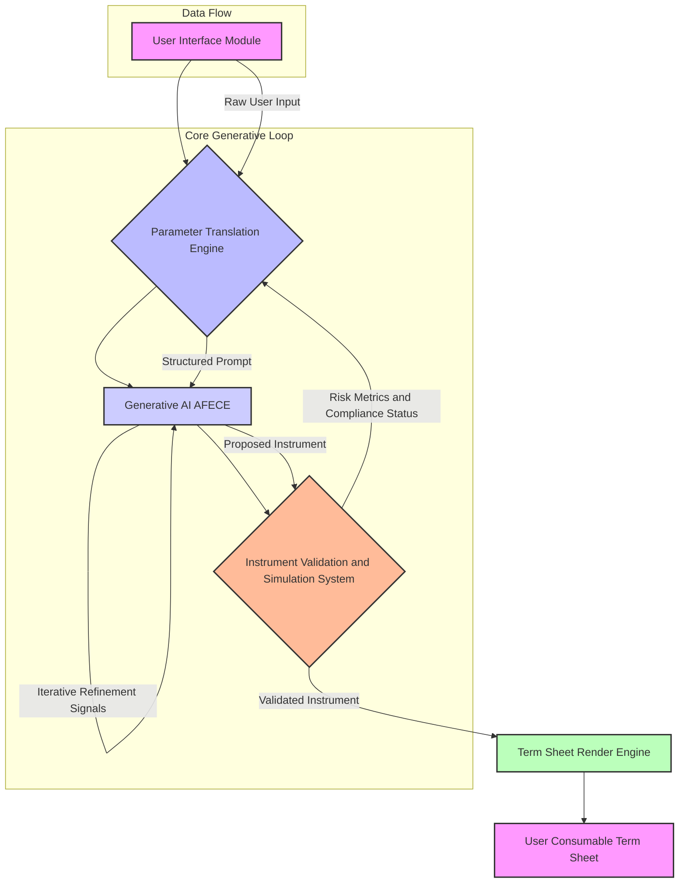
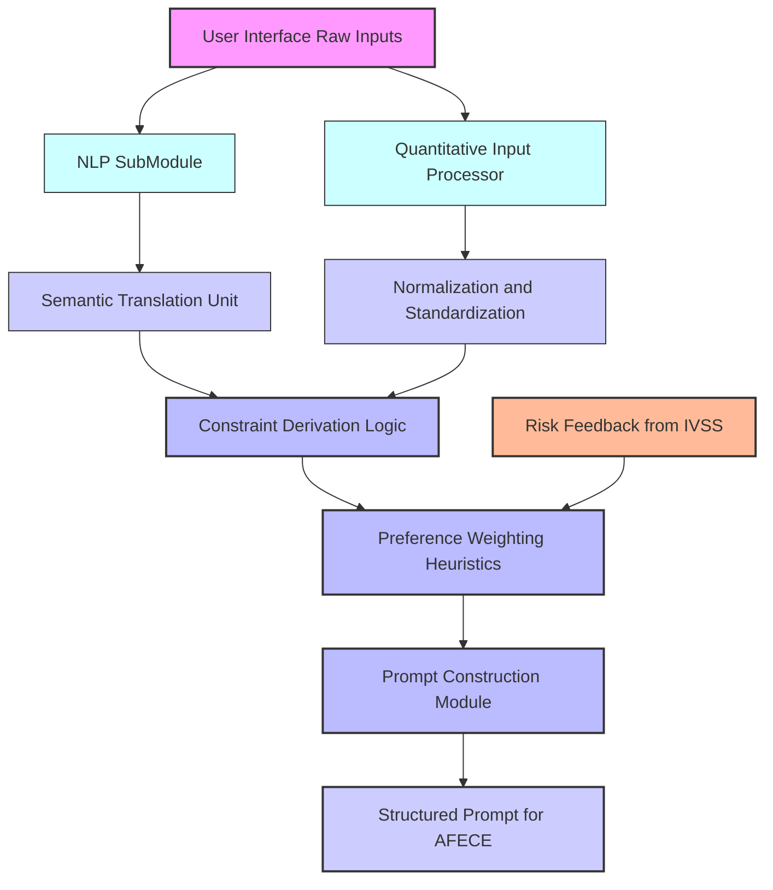
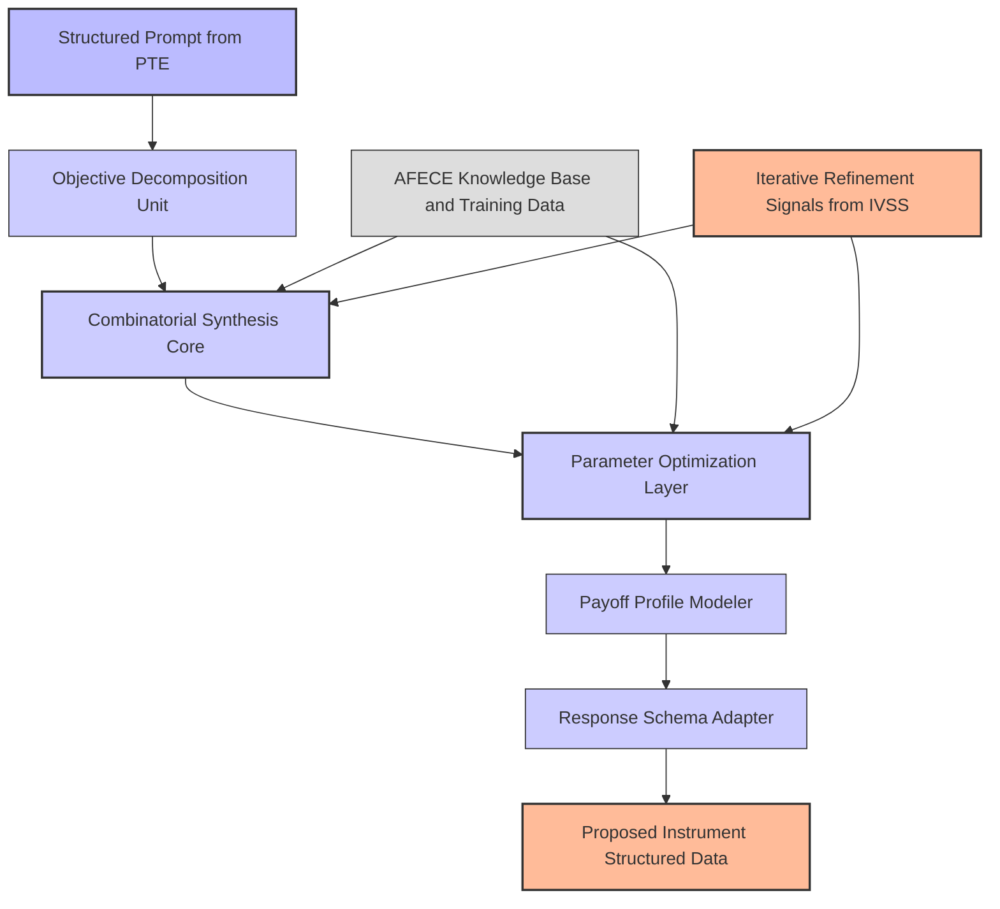
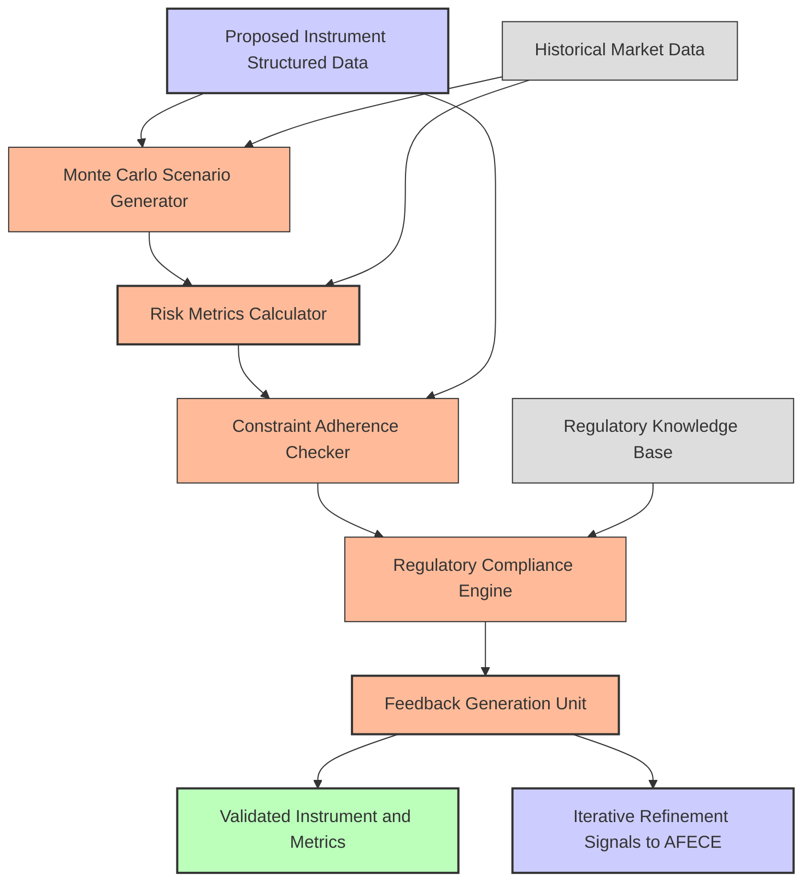
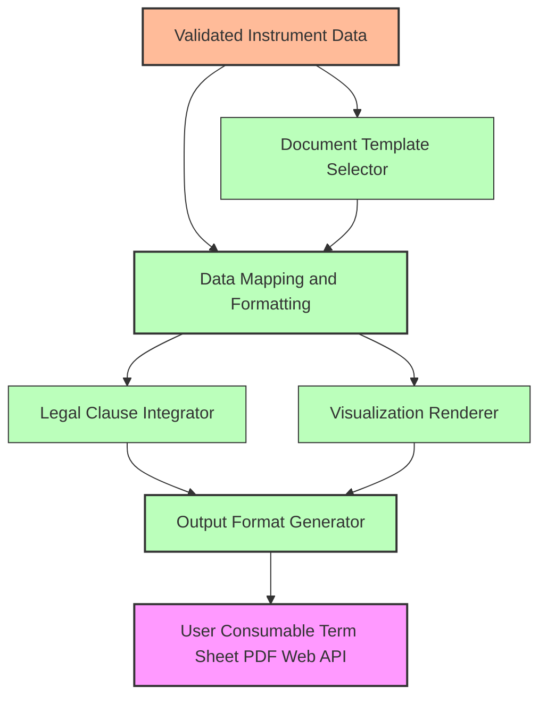
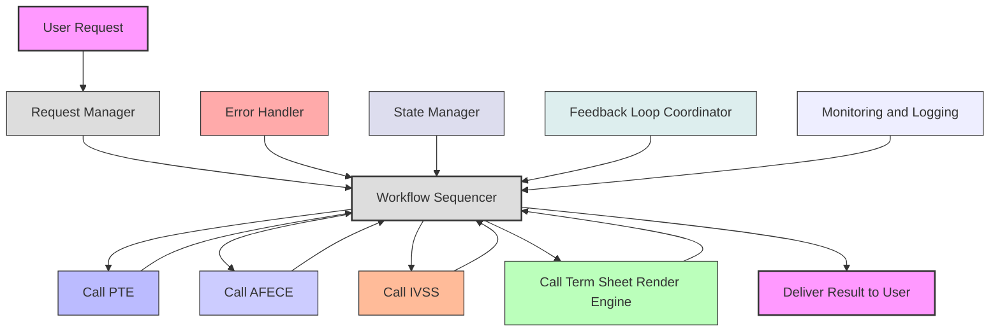

**Title of Invention:** A System and Method for the Autonomous Generative Synthesis and Validation of Bespoke Financial Instruments

**Abstract:**
A sophisticated computational framework is presented for the autonomous generative synthesis of novel financial instruments. This invention transcends traditional financial engineering paradigms by empowering an intelligent system to fabricate bespoke financial products precisely aligned with nuanced investor objectives. A user provides a comprehensive set of multidimensional parameters, encompassing explicit financial desiderata such as quantitative risk tolerance metrics, desired yield profiles, principal protection mandates, and implicit strategic objectives articulated via natural language. These parameters are meticulously transduced into a structured prompt, serving as an instruction set for a highly specialized generative artificial intelligence model. This model, architected upon principles of advanced financial econometrics and combinatorial optimization, autonomously designs and articulates a novel financial instrument, such as a highly customized structured note, a multi-layered hybrid derivative, or an algorithmic trading strategy, specifically tailored to the user's granular specifications. The system subsequently outputs a meticulously detailed and legally congruent term sheet, comprehensively enumerating the instrument's nomenclature, constituent components, precise contractual terms, and explicit payoff profile under diverse market conditions, thereby fundamentally altering the landscape of financial product creation and accessibility, and often incorporating an iterative refinement process to ensure optimal alignment.

**Background of the Invention:**
The contemporary financial ecosystem is characterized by an enduring chasm between the intricate and evolving needs of diverse investor profiles and the limited, standardized offerings available from traditional financial institutions. The design and issuance of complex financial instruments, such as structured products or bespoke derivatives, are historically the exclusive domain of highly specialized quantitative analysts and financial engineers within large investment banks. This process is inherently resource-intensive, often proprietary, and typically yields "one-size-for-all" products, which, while broadly marketable, invariably fail to precisely align with the granular risk-reward profiles, idiosyncratic liquidity requirements, or specific socio-ethical investment mandates of individual investors, family offices, or smaller institutional entities. This architectural rigidity leads to suboptimal asset allocation, unaddressed market inefficiencies, and a systemic lack of truly personalized financial solutions, creating "financial product deserts" for many. The absence of an accessible, systematic, and automated methodology for an individual or a non-specialized institution to articulate unique financial requirements and subsequently generate a precisely corresponding, validated financial product constitutes a critical technological and market gap, leading to diminished utility realization for a substantial segment of the investor population.

**Brief Summary of the Invention:**
The present invention introduces a revolutionary computational architecture, herein termed the "Financial Instrument Synthesizer" or "Forge," which serves as an advanced interface for the dynamic definition and instantiation of custom financial instruments. A user, leveraging either a sophisticated graphical user interface incorporating tunable parameters [e.g., sliders for risk, input fields for target yield, dropdowns for market exposure] or an advanced natural language processing module, articulates their investment desiderata [e.g., "I require a steady quarterly income stream with exposure to emerging market technology growth, absolute principal preservation, and a maximum downside volatility of 8% annualized"]. The system processes these diverse inputs, translating them through a sophisticated `ParameterTranslationEngine` into a highly structured, semantically rich prompt. This prompt is then transmitted to an `Autonomous Financial Engineering Cognizance Engine` [AFECE], a state-of-the-art generative AI model operating as a virtual, hyper-efficient financial engineer. The AFECE's core function is to synthesize novel combinations of underlying financial primitives [e.g., zero-coupon bonds, call options, put options, swaps, futures, credit default swaps, annuities, or baskets of equities] to construct a bespoke financial product that precisely optimizes the user's multi-objective utility function. The AFECE then generates a structured data object describing this newly designed instrument. This object is subsequently fed into an `InstrumentValidationSimulationSystem` [IVSS] for rigorous stress testing, scenario analysis, and compliance verification. Finally, a `TermSheetRenderEngine` transforms the validated, structured output into a comprehensive, professional-grade term sheet, providing the user with a fully specified and deployable financial instrument, often after several iterations of refinement between the AFECE and IVSS.

**Detailed Description of the Invention:**

The architecture of the "Financial Instrument Synthesizer" is a multi-modular, distributed system designed for high-fidelity generative finance. Its primary components include the User Interface UI Module, the Parameter Translation Engine, the Autonomous Financial Engineering Cognizance Engine AFECE, the Instrument Validation and Simulation System IVSS, the Term Sheet Render Engine, and an overarching Orchestration Layer.

### System Architecture Overview

The system operates as a sophisticated closed-loop generative design and validation pipeline.


*Figure 1: High-Level System Architecture of the Financial Instrument Synthesizer Forge*

### 1. User Interface UI Module

The UI Module serves as the initial point of interaction. It is designed for intuitive and comprehensive capture of user investment parameters, facilitating both explicit quantitative inputs and nuanced qualitative desiderata.

*   **Quantitative Inputs:** This includes sliders, input fields, and dropdown menus for parameters such as:
    *   `Principal Protection`: A percentage value [e.g., 0% to 100%] indicating the desired capital preservation at maturity.
    *   `Target Annualized Yield`: A specific percentage or a range, representing the desired return profile.
    *   `Market Exposure`: Selection of underlying assets or indices [e.g., S&P 500, NASDAQ, MSCI Emerging Markets, specific commodity baskets, interest rate curves, credit indices, cryptocurrencies].
    *   `Investment Horizon Term`: Duration in months or years.
    *   `Liquidity Preference`: [e.g., daily, monthly, quarterly, at maturity].
    *   `Max Drawdown Tolerance`: A percentage value specifying the maximum permissible temporary loss from a peak value.
    *   `Volatility Tolerance`: Expressed as a standard deviation percentage.
    *   `Income Frequency`: [e.g., monthly, quarterly, semi-annually].
    *   `ESG Environmental Social Governance Alignment Scores`: Filters for underlying assets based on sustainability criteria.

*   **Qualitative Inputs Natural Language Processing - NLP:** An advanced text input field allows users to describe their goals in natural language [e.g., "I want steady income with some stock market upside but I absolutely cannot lose my principal, and I want exposure to renewable energy companies without excessive tech sector concentration"]. An integrated NLP sub-module extracts named entities, sentiment, financial concepts, and implicit constraints from the natural language input, translating them into structured, machine-readable attributes.
*   **Dynamic Visualizations and Feedback:** The UI may also incorporate dynamic visualizations that provide real-time feedback on the potential impact of parameter adjustments, allowing users to intuitively explore the utility landscape of their preferences and understand the trade-offs involved in instrument design. This includes adaptive forms that guide the user based on previous inputs.

### 2. Parameter Translation Engine PTE

The PTE is a critical intermediary, responsible for converting the diverse inputs from the UI Module into a unified, semantically coherent, and machine-executable structured prompt for the AFECE. This involves:

*   **Normalization and Standardization:** Ensuring all input parameters are in a consistent format and unit.
*   **Constraint Derivation:** Inferring implicit constraints from qualitative statements [e.g., "cannot lose my principal" directly translates to `PrincipalProtection: 100%`]. It may leverage an internal **Financial Semantic Knowledge Graph** to disambiguate terms, infer relationships between financial concepts, and ensure that the structured prompt is not only syntactically correct but also semantically robust. This also includes `Dynamic Constraint Propagation`, where adjusting one parameter automatically suggests or modifies related constraints to maintain internal consistency.
*   **Preference Weighting:** Assigning relative importance or weights to different user preferences, either explicitly by the user or implicitly through an internal heuristic engine, potentially informed by user behavior analytics.
*   **Prompt Construction:** Assembling the structured parameters into a sophisticated instruction set for the generative AI model, potentially incorporating few-shot examples, chain-of-thought reasoning directives, and dynamic response schema adaptation.

**Parameter Translation Engine Detailed Workflow**

*Figure 2: Parameter Translation Engine Detailed Workflow*

**Example Prompt Structure:**
```json
{
  "role": "financial_engineer",
  "task": "design_structured_instrument",
  "constraints": {
    "principal_protection_level": 1.0,
    "market_exposure_indices": ["S&P 500", "MSCI World Renewable Energy Index"],
    "investment_term_years": 7,
    "max_annual_volatility": 0.08,
    "min_income_frequency": "quarterly",
    "esg_alignment_score_min": 0.75
  },
  "objectives": {
    "target_annual_yield": { "min": 0.05, "max": 0.07 },
    "upside_participation_preference": "high",
    "downside_risk_mitigation": "strong"
  },
  "response_schema_id": "SCHEMA_V2_BESPOKE_NOTE",
  "reasoning_directive": "Employ a multi-asset compositional strategy focusing on convexity and income generation. Provide a step-by-step rationale for component selection."
}
```

### 3. Autonomous Financial Engineering Cognizance Engine AFECE

The AFECE is the core generative component, embodying a paradigm shift from rule-based financial product design to adaptive, intelligent synthesis. It is a highly specialized large language model LLM or a composite AI system trained on an expansive corpus of financial engineering literature, historical market data, derivative pricing models, regulatory frameworks, and millions of existing financial product specifications.

*   **Architecture:** Beyond transformer architectures, the AFECE can be a hybrid system integrating **Generative Adversarial Networks GANs** for diverse instrument generation, **Reinforcement Learning from Human Feedback RLHF** to align generated instruments with expert financial intuition and ethical guidelines, and **Bayesian Optimization** for fine-tuning complex component parameters. It functions as an expert system capable of combinatorial reasoning over financial primitives, trained on both real-world financial data and **synthetically generated market scenarios, expert-annotated financial instrument blueprints, and regulatory rulings**. This allows the AFECE to learn complex, non-linear dependencies and to innovate beyond existing product templates.
*   **Generative Process:** Upon receiving the structured prompt, the AFECE performs the following:
    1.  **Decomposition:** Breaks down the user's objectives into fundamental financial building blocks [e.g., principal protection implies zero-coupon bond component; upside participation implies call options].
    2.  **Combinatorial Synthesis:** Explores a vast, non-linear space of financial instrument compositions, combining various derivatives [options, futures, swaps], fixed-income instruments, and equity components.
    3.  **Parameterization:** Determines optimal parameters for each component [e.g., strike prices, maturities, notional amounts, participation rates, coupon structures] to align with the specified utility function.
    4.  **Payoff Profile Modeling:** Constructs the aggregated payoff function of the synthesized instrument under various market scenarios.
    5.  **Structured Output Generation:** Formulates a detailed, machine-readable JSON representation of the proposed instrument, adhering to a predefined and dynamically adaptable `responseSchema`.
*   **Explainable AI XAI for AFECE:** The AFECE is designed to provide clear, step-by-step rationales for its instrument design choices, detailing how each component contributes to fulfilling the user's objectives and constraints. This **Explainable AI** feature is critical for transparency, auditability, and user trust, providing insights into the combinatorial reasoning process.

**AFECE Generative Process Detail**

*Figure 3: AFECE Generative Process Detailed Workflow*

**Dynamic Response Schema Example Expanded:**
```json
{
  "type": "OBJECT",
  "properties": {
    "instrumentName": { "type": "STRING", "description": "A unique, descriptive name for the generated financial instrument." },
    "instrumentType": { "type": "STRING", "description": "Categorization [e.g., Structured Note, Equity-Linked Note, Principal Protected Note, Hybrid Derivative, Certificate]." },
    "underlyingAssets": {
      "type": "ARRAY",
      "items": {
        "type": "OBJECT",
        "properties": {
          "assetIdentifier": { "type": "STRING", "description": "Ticker symbol, ISIN, or index name." },
          "assetType": { "type": "STRING", "description": "Equity, Index, Bond, Commodity, FX, Credit, InterestRate." },
          "weighting": { "type": "NUMBER", "description": "Proportional weighting within a basket, if applicable." }
        },
        "required": ["assetIdentifier", "assetType"]
      },
      "description": "A list of primary underlying assets or indices."
    },
    "components": {
      "type": "ARRAY",
      "items": {
        "type": "OBJECT",
        "properties": {
          "componentType": { "type": "STRING", "description": "ZeroCouponBond, CallOption, PutOption, SwapLeg, Forward, Annuity." },
          "underlying": { "type": "STRING", "description": "Identifier of the specific underlying asset for this component." },
          "strikePrice": { "type": "NUMBER", "nullable": true, "description": "Applicable for options/forwards." },
          "maturityDate": { "type": "STRING", "format": "date", "description": "Maturity or expiry date of the component." },
          "notionalAmount": { "type": "NUMBER", "description": "Notional value or principal allocation for this component." },
          "parameters": {
            "type": "OBJECT",
            "additionalProperties": true,
            "description": "Component-specific parameters [e.g., participation rate, coupon rate, barrier levels, reset frequency, leverage factor]."
          }
        },
        "required": ["componentType", "underlying", "maturityDate", "notionalAmount"]
      },
      "description": "Detailed breakdown of the financial primitives constituting the instrument."
    },
    "principalProtection": { "type": "NUMBER", "description": "Guaranteed principal return percentage at maturity." },
    "payoffFormula": { "type": "STRING", "description": "Mathematical expression defining the instrument's payoff at maturity or during its life. E.g., `Notional * (1 + Max(0, ParticipationRate * (SPX_Final / SPX_Initial - 1))) + ZeroCouponBondYield`." },
    "keyTerms": {
      "type": "OBJECT",
      "properties": {
        "issueDate": { "type": "STRING", "format": "date" },
        "maturityDate": { "type": "STRING", "format": "date" },
        "denomination": { "type": "STRING", "description": "e.g., USD" },
        "minSubscriptionAmount": { "type": "NUMBER" },
        "listingExchange": { "type": "STRING", "nullable": true },
        "issuer": { "type": "STRING", "description": "Placeholder for the hypothetical issuer entity." }
      }
    },
    "summary": { "type": "STRING", "description": "A concise, plain-language description of the instrument's features and benefits." },
    "riskFactors": { "type": "ARRAY", "items": { "type": "STRING" }, "description": "A list of identified risks associated with the instrument." },
    "simulationResults": {
      "type": "OBJECT",
      "properties": {
        "expectedReturnAnnualized": { "type": "NUMBER" },
        "volatilityAnnualized": { "type": "NUMBER" },
        "maxDrawdownSimulated": { "type": "NUMBER" },
        "probabilityOfPrincipalLoss": { "type": "NUMBER" },
        "sharpeRatioSimulated": { "type": "NUMBER" }
      },
      "description": "Placeholder for metrics generated by the IVSS."
    },
    "regulatoryCompliance": { "type": "ARRAY", "items": { "type": "STRING" }, "description": "Identified regulatory categories or specific compliance notes [e.g., MiFID II, Dodd-Frank, PRIIPs]." }
  }
}
```

**Example AFECE Response for a Complex Requirement:**
```json
{
  "instrumentName": "Global Sustainable Equity Principal Guaranteed Income Note SPG-EIN",
  "instrumentType": "Structured Note",
  "underlyingAssets": [
    { "assetIdentifier": "MSCI_World_ESG_Leaders_Index", "assetType": "Index", "weighting": 0.7 },
    { "assetIdentifier": "Custom_Renewable_Energy_Basket", "assetType": "Equity", "weighting": 0.3 }
  ],
  "components": [
    {
      "componentType": "ZeroCouponBond",
      "underlying": "Cash",
      "maturityDate": "2031-10-26",
      "notionalAmount": 100000,
      "parameters": { "yieldRate": 0.045 }
    },
    {
      "componentType": "CallOption",
      "underlying": "MSCI_World_ESG_Leaders_Index",
      "strikePrice": 1.0,
      "maturityDate": "2031-10-26",
      "notionalAmount": 70000,
      "parameters": { "participationRate": 0.65, "europeanExercise": true }
    },
    {
      "componentType": "CallSpreadOption",
      "underlying": "Custom_Renewable_Energy_Basket",
      "strikePrice": 1.05,
      "maturityDate": "2031-10-26",
      "notionalAmount": 30000,
      "parameters": { "upperStrike": 1.25, "participationRate": 0.8, "europeanExercise": true }
    },
    {
      "componentType": "VanillaOption_ShortPut",
      "underlying": "USD_JPY_FX",
      "strikePrice": 155,
      "maturityDate": "2031-10-26",
      "notionalAmount": 50000,
      "parameters": { "premiumReceived": 2500, "description": "Monetized to fund higher participation." }
    }
  ],
  "principalProtection": 100,
  "payoffFormula": "Min(Notional * (1 + ZeroCouponBondYield), Notional) + (ParticipationRate_MSCI * Max(0, (MSCI_Final / MSCI_Initial - 1))) + (ParticipationRate_RE * Max(0, Min(RE_Final / RE_Initial - 1.05, 0.2))) - PremiumPaidForFundingOptions",
  "keyTerms": {
    "issueDate": "2024-10-26",
    "maturityDate": "2031-10-26",
    "denomination": "USD",
    "minSubscriptionAmount": 100000,
    "listingExchange": null,
    "issuer": "Hypothetical Global Financial Corp."
  },
  "summary": "This Global Sustainable Equity Principal Guaranteed Income Note offers 100% principal protection at maturity, providing substantial participation in the MSCI World ESG Leaders Index (65%) and enhanced, capped exposure to a custom basket of renewable energy companies (80% participation up to a 25% gain). Income generation is implicitly handled by the bond component's yield, and a covered short put option on USD/JPY funds increased equity participation.",
  "riskFactors": [
    "Market risk related to equity index performance.",
    "Credit risk of the hypothetical bond issuer.",
    "Liquidity risk if attempting to sell prior to maturity.",
    "Currency risk from the USD/JPY option component.",
    "Specific sector concentration risk in renewable energy."
  ],
  "simulationResults": {
    "expectedReturnAnnualized": 0.062,
    "volatilityAnnualized": 0.075,
    "maxDrawdownSimulated": 0.0,
    "probabilityOfPrincipalLoss": 0.0,
    "sharpeRatioSimulated": 0.85
  },
  "regulatoryCompliance": ["PRIIPs Compliant EU", "Suitable for Retail Investors Hypothetical Jurisdiction"]
}
```

### 4. Instrument Validation and Simulation System IVSS

The IVSS receives the AFECE's proposed instrument and performs a rigorous multi-faceted analysis to ensure its viability, risk profile adherence, and regulatory compliance.

*   **Quantitative Validation:**
    *   **Monte Carlo Simulation:** Generates thousands of stochastic market scenarios [e.g., using Geometric Brownian Motion, jump diffusion models, or historical bootstrapping for underlying assets] to project the instrument's payoff profile and evaluate its performance under stress. Beyond standard Monte Carlo, the IVSS employs **Historical Bootstrapping** for scenario generation, `Jump-Diffusion Models` for assets prone to sudden shocks, and **GARCH models** for dynamic volatility estimation.
    *   **Risk Metrics Calculation:** Computes key risk metrics such as Value at Risk VaR, Conditional Value at Risk CVaR, Sharpe Ratio, Sortino Ratio, maximum drawdown, and probability of principal loss across various confidence levels. It also conducts comprehensive `Correlation Stress Testing` to understand instrument behavior under strained inter-asset relationships and `Liquidity Stress Testing` to assess market impact during exit scenarios. Furthermore, `Counterparty Risk Analysis` for derivative components and `Systemic Risk Proxies` are evaluated.
    *   **Sensitivity Analysis Greeks:** Calculates delta, gamma, vega, theta, and rho for the instrument as a whole, providing insights into its sensitivity to market changes.
*   **Constraint Adherence Check:** Verifies that all user-specified constraints [e.g., principal protection, max volatility, target yield range] are met or flags deviations.
*   **Regulatory & Compliance Scoring:** An integrated knowledge base of financial regulations [e.g., MiFID II, Dodd-Frank, PRIIPs, local jurisdiction rules] and compliance guidelines evaluates the instrument's structure for potential legal or regulatory conflicts. This module can generate a "Regulatory Compliance Score" and identify specific issues.
*   **Feedback Loop:** If the instrument fails to meet critical constraints or exhibits unacceptable risk characteristics, the IVSS can generate structured feedback to the AFECE for iterative refinement, guiding the generative model towards a more compliant and optimal design. The IVSS's feedback loop is not merely a pass/fail check but an **optimization signal**, guiding the AFECE towards increasingly optimal solutions within the user's defined utility function and constraints. This iterative process, akin to a multi-objective evolutionary algorithm, allows for the discovery of truly bespoke and highly efficient financial structures.

**IVSS Validation Loop Detailed Workflow**

*Figure 4: Instrument Validation and Simulation System Detailed Workflow*

### 5. Term Sheet Render Engine

Upon successful validation by the IVSS, the `TermSheetRenderEngine` takes the comprehensive structured JSON output and formats it into a professional, legally-styled document. This engine is capable of generating:

*   **PDF Documents:** High-quality, printable term sheets.
*   **Interactive Web Displays:** Dynamic visualizations of payoff profiles, scenario analysis, and risk breakdowns.
*   **APIs:** For integration with other financial platforms or reporting tools.

This module ensures clarity, accuracy, and adherence to industry-standard documentation practices. The engine integrates with **legal knowledge bases** to ensure boilerplate clauses, disclaimers, and regulatory disclosures are automatically included and contextually relevant. It supports `version control` for term sheets and can be configured for `multi-jurisdictional compliance`, generating documents tailored to specific regulatory environments like `SEC`, `ESMA`, `FCA`.

**Term Sheet Render Engine Detailed Workflow**

*Figure 5: Term Sheet Render Engine Detailed Workflow*

### 6. Orchestration Layer

This layer manages the workflow between all modules, handling data routing, error management, state management, and ensures the seamless execution of the entire generative design process. It coordinates the iterative refinement process between the IVSS and AFECE. Implemented typically as a **microservices architecture**, this layer ensures high availability, fault tolerance, and modularity. It manages **containerized deployments** of each module, facilitates secure inter-module communication, and incorporates `distributed tracing` and `centralized logging` for comprehensive operational oversight. Future enhancements include integration with `Distributed Ledger Technology DLT` for immutable audit trails of instrument design and validation.

**Orchestration Layer Detailed Workflow**

*Figure 6: Orchestration Layer Detailed Workflow*

### 7. Advanced Data and Knowledge Management

The integrity and performance of the Financial Instrument Synthesizer fundamentally rely on a robust and continuously updated data and knowledge infrastructure. This includes:

*   **Real-time Market Data Feeds:** Ingesting and processing live and historical data for equities, indices, fixed income, commodities, foreign exchange, and various derivatives. This requires high-throughput data pipelines and robust data warehousing solutions.
*   **Financial Instrument Database:** A comprehensive, categorized database of existing financial instruments, their structures, components, and historical performance. This serves as a vital training corpus and reference for the AFECE.
*   **Regulatory Knowledge Base:** A dynamic repository of global and local financial regulations, compliance guidelines, and legal precedents. This powers the IVSS's compliance checks and the Term Sheet Render Engine's legal clause integration.
*   **Economic and Geopolitical Data:** Incorporating macroeconomic indicators, geopolitical events, and sectoral analyses to enrich scenario generation in the IVSS and contextualize instrument design in the AFECE.
*   **Financial Semantic Knowledge Graph:** A graph-based representation of financial concepts, relationships, and taxonomies, used by the PTE and AFECE for intelligent parsing, constraint derivation, and structured reasoning. This knowledge graph is continuously enriched through automated information extraction and expert curation.
*   **Synthetic Data Generation:** Utilizing advanced statistical and generative models to create realistic synthetic financial data and instrument configurations, particularly useful for augmenting training sets and exploring edge cases where real-world data might be scarce.

### 8. Security, Ethics, and Regulatory Compliance Framework

Given the sensitive nature of financial operations and personalized investment, the system incorporates a stringent framework for security, ethical considerations, and continuous regulatory adherence.

*   **Cybersecurity:**
    *   **Data Encryption:** All sensitive user data and generated financial instrument details are encrypted at rest and in transit using industry-standard protocols [e.g., AES-256, TLS 1.3].
    *   **Access Control:** Role-Based Access Control RBAC mechanisms ensure that only authorized personnel and modules can access specific data and functionalities.
    *   **Secure API Design:** All inter-module communication occurs via authenticated and authorized APIs, minimizing attack surfaces.
    *   **Regular Security Audits:** Independent security audits and penetration testing are conducted regularly to identify and mitigate vulnerabilities.
*   **Data Privacy:**
    *   **Anonymization and Pseudonymization:** User-specific investment desiderata can be anonymized or pseudonymized where feasible to protect individual privacy while enabling model training and system improvements.
    *   **GDPR and CCPA Compliance:** Adherence to global data privacy regulations is paramount, with mechanisms for data subject rights management.
*   **Ethical AI in Finance:**
    *   **Bias Detection and Mitigation:** Continuous monitoring for algorithmic bias in instrument generation, particularly concerning disparate outcomes for different user profiles or investment objectives. The AFECE's training data and objective functions are regularly vetted to prevent the propagation of historical biases.
    *   **Fairness and Transparency:** Ensuring that the generated instruments are fundamentally fair and that the system's decision-making process is transparent, facilitated by the Explainable AI features.
    *   **Responsible Innovation:** A commitment to deploying AI in a manner that serves the best interests of investors and promotes financial stability, avoiding the creation of overly complex or opaque products that could contribute to systemic risk.
*   **Regulatory Compliance:**
    *   **Automated Policy Enforcement:** The IVSS's regulatory compliance engine automatically checks against predefined policy rules and legal frameworks, providing real-time feedback on adherence.
    *   **Auditability and Traceability:** Every step of the instrument design and validation process is logged and auditable, creating a comprehensive immutable record for regulatory scrutiny.
    *   **Dynamic Regulatory Updates:** The Regulatory Knowledge Base is continuously updated with changes in financial legislation, ensuring the system remains compliant in an evolving regulatory landscape.
    *   **Suitability and Appropriateness Assessments:** Tools within the UI and IVSS help ensure that the generated instrument is suitable for the user's risk profile and financial situation, aligning with regulations like `MiFID II` suitability rules.

### 9. Scalability, Deployment, and Explainable AI XAI

To meet the demands of a high-volume, real-time financial environment, the system is engineered for scalability and efficient deployment, with a strong emphasis on explainability.

*   **Cloud-Native Architecture:** Leveraging containerization [e.g., Docker, Kubernetes] and cloud computing platforms [e.g., AWS, Azure, GCP] for elastic scalability, robust resource management, and global deployment capabilities. This allows individual modules to scale independently based on demand.
*   **Distributed Computing:** computationally intensive tasks, such as Monte Carlo simulations within the IVSS or the generative inference within the AFECE, are distributed across multiple nodes or GPU clusters, significantly reducing processing times.
*   **API-First Design:** All modules expose well-defined APIs, facilitating seamless integration with existing financial infrastructures, third-party data providers, and front-end applications.
*   **Continuous Integration/Continuous Deployment CI/CD:** Automated pipelines ensure rapid, reliable, and frequent updates and deployments of the system, enabling agile response to market changes or new regulatory requirements.
*   **Explainable AI XAI Integration:**
    *   **Model Interpretability:** Employing techniques such as `LIME Local Interpretable Model-agnostic Explanations` or `SHAP SHapley Additive exPlanations` within the AFECE to explain individual design decisions, attributing the contribution of each input parameter and financial primitive to the final instrument structure.
    *   **Decision Audit Trails:** Maintaining detailed logs of the AFECE's reasoning process, component selection, and parameter choices, providing a clear audit trail for compliance officers and users.
    *   **Interactive Payoff Visualizations:** The Term Sheet Render Engine provides dynamic and interactive visualizations of payoff profiles under various market conditions, making complex instruments understandable to non-expert users. This includes `What-If Scenarios` where users can adjust market parameters and instantly see the impact on their instrument's performance.

This comprehensive approach ensures that the system is not only powerful and innovative but also robust, secure, auditable, and transparent, setting a new standard for intelligent financial product design.

**Claims:**

1.  A system for the autonomous generative synthesis of bespoke financial instruments, comprising:
    a.  A User Interface UI Module configured to receive a multidimensional set of investment desiderata from a user, including explicit quantitative parameters and implicit qualitative preferences.
    b.  A Parameter Translation Engine PTE communicatively coupled to the UI Module, configured to process said desiderata and generate a semantically rich, structured prompt.
    c.  An Autonomous Financial Engineering Cognizance Engine AFECE, communicatively coupled to the PTE, comprising a generative artificial intelligence model trained on financial engineering principles, configured to receive said structured prompt and, in response, autonomously synthesize a novel financial instrument by combinatorially arranging and parameterizing financial primitives, generating a structured data object representing said instrument.
    d.  An Instrument Validation and Simulation System IVSS, communicatively coupled to the AFECE, configured to receive said structured data object, perform rigorous quantitative risk assessment, stochastic scenario simulation, and regulatory compliance checks, and further configured to provide iterative refinement feedback to the AFECE if the instrument fails to meet predefined criteria.
    e.  A Term Sheet Render Engine, communicatively coupled to the IVSS, configured to receive the validated structured data object and generate a comprehensive, professional-grade term sheet representing the bespoke financial instrument.

2.  The system of Claim 1, wherein the multidimensional set of investment desiderata includes at least three of the following: a specified level of principal protection, a desired yield profile, a market exposure target, an investment horizon, a liquidity preference, a maximum drawdown tolerance, a volatility tolerance, an income frequency, or an ESG Environmental, Social, Governance alignment score.

3.  The system of Claim 1, wherein the UI Module further comprises a Natural Language Processing NLP sub-module configured to extract financial concepts, sentiment, and constraints from free-form text input provided by the user.

4.  The system of Claim 1, wherein the structured prompt generated by the PTE includes dynamic response schema specifications, few-shot examples, and chain-of-thought reasoning directives for the AFECE, and may leverage a Financial Semantic Knowledge Graph.

5.  The system of Claim 1, wherein the AFECE employs a transformer-based generative artificial intelligence model fine-tuned on a corpus comprising financial engineering texts, historical market data, derivative pricing models, and existing financial product specifications, potentially augmented with Generative Adversarial Networks GANs and Reinforcement Learning from Human Feedback RLHF.

6.  The system of Claim 1, wherein the structured data object generated by the AFECE includes attributes such as instrument type, a detailed breakdown of constituent financial components with their respective parameters, a mathematical payoff formula, key contractual terms, and an initial summary description, and further includes an explainable AI rationale for its design choices.

7.  The system of Claim 1, wherein the IVSS utilizes Monte Carlo simulations to project the instrument's performance across thousands of stochastic market scenarios, incorporating Historical Bootstrapping, Jump-Diffusion Models, and GARCH models, and computes metrics including Value at Risk VaR, Conditional Value at Risk CVaR, Sharpe Ratio, and probability of principal loss, along with Correlation and Liquidity Stress Testing.

8.  The system of Claim 1, wherein the IVSS incorporates a knowledge base of financial regulations to assess the instrument's compliance with frameworks such as MiFID II, Dodd-Frank, or PRIIPs, generating a compliance score and identifying specific regulatory adherence points, and includes Counterparty Risk Analysis.

9.  A method for the autonomous generative synthesis of bespoke financial instruments, comprising the steps of:
    a.  Receiving, via a User Interface UI Module, a multidimensional set of investment desiderata from a user.
    b.  Processing said desiderata by a Parameter Translation Engine PTE to generate a semantically rich, structured prompt, leveraging normalization, constraint derivation, preference weighting, and prompt construction.
    c.  Transmitting said structured prompt to an Autonomous Financial Engineering Cognizance Engine AFECE.
    d.  Receiving, from the AFECE, a structured data object representing a novel financial instrument autonomously synthesized by a generative artificial intelligence model, incorporating objective decomposition, combinatorial synthesis, parameter optimization, and payoff profile modeling.
    e.  Transmitting said structured data object to an Instrument Validation and Simulation System IVSS for quantitative risk assessment, stochastic scenario simulation, and regulatory compliance checks.
    f.  Providing iterative refinement feedback from the IVSS to the AFECE if the instrument fails to meet predefined criteria, and repeating steps c through e, with the feedback serving as an optimization signal.
    g.  Generating, by a Term Sheet Render Engine, a comprehensive, professional-grade term sheet from the validated structured data object, utilizing document templates, data mapping, and legal clause integration, and displaying said term sheet to the user.

10. The method of Claim 9, wherein the step of receiving desiderata includes processing natural language input to extract financial concepts and constraints via an NLP sub-module, and providing dynamic visualizations for user feedback.

11. The method of Claim 9, wherein the step of processing desiderata includes dynamically generating a response schema for the generative artificial intelligence model, and employing dynamic constraint propagation.

12. The method of Claim 9, wherein the step of performing quantitative risk assessment includes calculating the sensitivity of the instrument to various market parameters, including delta, gamma, vega, theta, and rho, and conducting Counterparty Risk Analysis and Systemic Risk Proxies.

**Mathematical Justification: The Foundational Theoretical Framework**

The present invention is underpinned by a profound integration of advanced mathematical concepts spanning topology, measure theory, functional analysis, stochastic calculus, and optimization theory. It fundamentally addresses the problem of inverse financial engineering by transforming a traditionally intractable search problem within a finite, pre-defined space into a computationally feasible generative problem within a vast, potentially infinite, continuous financial instrument manifold.

### Class of Mathematics 1: The Formal Axiomatic Definition of `I`, the Universal Instrument Space

Let `P` denote the finite set of fundamental financial primitives, such as zero-coupon bonds, European call options, European put options, forward contracts, interest rate swaps, credit default swaps, and elementary equity positions. Each primitive `p in P` is characterized by a set of intrinsic parameters. For example, a European call option `C` on an underlying asset `S` is defined by its strike price `K`, maturity `T`, and nominal quantity `N`. Its payoff function at maturity is `Payoff_C(S_T) = N * max(0, S_T - K)`.

The Universal Instrument Space, denoted `I`, is axiomatically defined as the set of all possible finite compositions and linear combinations of primitives from `P`, where each primitive is further characterized by a vector of specific, admissible parameters.
Formally, an instrument `i in I` can be represented as a tuple:
```
i = [{alpha_k, p_k, theta_k}_{k=1}^M, Psi]
```
where:
*   `M in N` is the number of distinct primitive components.
*   `alpha_k in R` is the weighting coefficient or notional allocation for the `k`-th primitive, potentially constrained to specific ranges [e.g., `alpha_k > 0` for long positions, `alpha_k < 0` for short positions].
*   `p_k in P` is the `k`-th financial primitive.
*   `theta_k in Theta_k` is a vector of specific parameters for primitive `p_k` [e.g., `K, T, N` for options; coupon rate, face value, maturity for bonds]. `Theta_k` denotes the admissible parameter space for `p_k`.
*   `Psi` represents the set of contractual clauses, triggers, and structural conditions that govern the interaction and sequencing of these primitives or modify their payoffs [e.g., early exercise conditions, barrier events, auto-callable features].

The space `I` is not merely a Cartesian product of primitive parameter spaces; rather, it is a highly structured, potentially non-convex manifold embedded within a higher-dimensional space. The dimensionality of `I` is effectively infinite in terms of potential complexity and parameter granularity. This formal definition ensures that the generative AI operates within a mathematically coherent and comprehensive domain.

### Class of Mathematics 2: The Hyper-Dimensional Utility Manifold `U` and its Metric Space

A user's investment preferences are represented as a vector `U in U`, where `U` is a hyper-dimensional utility manifold. Each dimension in `U` corresponds to a distinct financial desideratum or constraint.
```
U = (u_1, u_2, ..., u_N)
```
where `u_j` can represent:
*   **Quantitative Metrics:** Target annual yield, principal protection level [e.g., `u_PP in [0,1]`], maximum acceptable volatility, maximum drawdown, desired Sharpe Ratio, required income frequency.
*   **Qualitative Objectives:** Market exposure [e.g., `u_ME in S_indices`], ESG alignment score [u_ESG in [0,1]], thematic investment preferences, liquidity requirements.
*   **Aversion Metrics:** Risk aversion coefficient, loss aversion coefficient.

The mapping from raw user input [sliders, natural language] to a point in `U` is performed by the Parameter Translation Engine, which applies advanced NLP and fuzzy logic techniques to quantify subjective preferences.
A utility function `f: I x U -> R` quantifies the "goodness of fit" of an instrument `i` to a user's preferences `U`. This function is typically a multi-objective optimization problem, often taking the form of a weighted sum or a lexicographical ordering of sub-utility functions, potentially incorporating penalty terms for constraint violations.

For an instrument `i` and user preferences `U`, we define a utility score `P(i, U)` as:
```
P(i, U) = sum_{j=1}^N w_j * G_j(i, u_j) - sum_{k=1}^M lambda_k * H_k(i, c_k)
```
where:
*   `w_j >= 0` are the weights assigned to each objective `u_j`.
*   `G_j(i, u_j)` is a sub-utility function measuring how well instrument `i` satisfies objective `u_j`. For example, `G_yield(i, u_yield) = -abs(ExpectedYield(i) - u_yield)`.
*   `lambda_k >= 0` are penalty coefficients.
*   `H_k(i, c_k)` is a penalty function, non-zero if instrument `i` violates constraint `c_k`. For example, `H_PP(i, c_PP) = max(0, c_PP - PrincipalProtection(i))`.

The goal of the system is to find an optimal instrument `i^*` such that:
```
i^* = argmax_{i in I} P(i, U)
```

This formulation explicitly models the user's subjective utility as a landscape across the instrument space, which the AFECE navigates.

### Class of Mathematics 3: The Generative Mapping Function `G_AI` as an Inverse Problem Solver on a Latent Space

Traditional financial engineering relies on a forward problem: given an instrument `i`, calculate its payoff and risk characteristics. The present invention solves the inverse problem: given a desired payoff/risk profile [encoded in `U`], find the instrument `i^*` that generates it.

The Autonomous Financial Engineering Cognizance Engine AFECE implements a generative mapping function, `G_AI: U -> I`, which approximates the inverse of the utility function `P`. Due to the complexity and high dimensionality of `I` and the non-linearity of `P`, `G_AI` operates not directly on `I`, but on a latent representation space, `Z`.

The AFECE, architecturally often a large transformer network or a variant of a Variational Autoencoder VAE or Generative Adversarial Network GAN specifically adapted for structured financial data, is trained to learn the mapping from `U` to `Z`, and then from `Z` to `I`.
*   **Encoding Phase Implicit in Training:** A hypothetical encoder `E: I -> Z` maps known instruments into a lower-dimensional, continuous latent space `Z`, where semantically similar instruments are geometrically close.
*   **Generative Phase AFECE's Role:** Given a utility vector `U`, the AFECE effectively learns a "direction" or "region" in `Z` that corresponds to instruments maximizing `P(., U)`. A decoder `D: Z -> I` then reconstructs an instrument `i'` from this latent representation.
Thus,
```
G_AI(U) approx D(E^(-1)(P^(-1)(U)))
```
More precisely, the AFECE learns a direct mapping from the structured prompt [representing `U`] to the symbolic representation of `i'`.

The training objective for `G_AI` is to minimize the discrepancy between the utility of the generated instrument `P(G_AI(U), U)` and the theoretical maximal utility `P(i^*, U)`. This often involves reinforcement learning where the IVSS provides rewards/penalties based on how well `G_AI(U)` performs against the user's utility function and constraints. The AFECE effectively learns a "financial grammar" and compositional semantics, allowing it to construct syntactically valid and semantically meaningful instruments.

### Class of Mathematics 4: The Objective Function `P(i, U)` and its Stochastic Optimization

The evaluation of `P(i, U)` is a complex undertaking, particularly because many financial objectives and constraints are intrinsically linked to future stochastic market dynamics. For instance, the `ExpectedYield(i)` or `PrincipalProtection(i)` are not deterministic but depend on the evolution of underlying assets.

Let `Omega` be the sample space of possible future market scenarios, `omega in Omega`. Each scenario `omega` is a realization of market factors [e.g., asset prices, interest rates, volatilities] over time.
The payoff of an instrument `i` under scenario `omega` at time `T` is `Payoff(i, omega, T)`.

The expected utility of instrument `i` for user `U` is formally defined as:
```
E[P(i, U)] = integral_Omega P(i, U | omega) dQ(omega)
```
where `Q(omega)` is a risk-neutral measure for pricing or a real-world measure for expected returns, depending on the specific component of the utility function being evaluated.

The IVSS employs Monte Carlo MC methods to estimate this integral. For a given instrument `i` and user `U`:
1.  **Scenario Generation:** Generate `N_MC` paths for all relevant underlying market variables, consistent with specified stochastic processes [e.g., Geometric Brownian Motion for equities, Cox-Ingersoll-Ross for interest rates, Jump-Diffusion Models, or GARCH models for dynamic volatility].
    ```
    S_t = S_0 exp([r - q - (1/2)sigma^2]t + sigma W_t)
    ```
    where `W_t` is a Wiener process.
2.  **Payoff Calculation:** For each path `omega_j`, calculate the instrument's payoff `Payoff(i, omega_j, T)` and intermediate cash flows.
3.  **Risk Metric Computation:** Aggregate these payoffs to compute statistics such as:
    *   Expected Return: `(1/N_MC) * sum_{j=1}^{N_MC} (Payoff(i, omega_j, T) - InitialInvestment) / InitialInvestment`
    *   Volatility: Standard deviation of returns across paths.
    *   Value at Risk VaR: The `q`-th percentile of the loss distribution. `VaR_q = inf {l in R : P(L > l) <= 1-q}`, where `L` is the loss.
    *   Conditional Value at Risk CVaR: `CVaR_q = E[L | L > VaR_q]`.
    *   Principal Protection Validation: Quantify the number of paths where `Payoff(i, omega_j, T) < InitialInvestment`.

These computed metrics are then fed into the components `G_j(i, u_j)` and `H_k(i, c_k)` of the objective function `P(i, U)` to assess the instrument's suitability. The stochastic nature of `P(i, U)` necessitates robust simulation, making the IVSS an indispensable component for practical realization of the invention.

### Class of Mathematics 5: Computational Complexity and Convergence of the Generative Paradigm

The traditional approach to financial product design involves searching a finite [albeit large] catalog of instruments or iteratively constructing instruments through heuristic trial-and-error. The complexity of searching a space of `K` instruments is `O(K)`. However, the number of possible instruments in `I` is astronomically large, potentially unbounded, making exhaustive search computationally infeasible.

The generative paradigm, by contrast, transforms this into a sampling problem from a distribution over `I` conditioned on `U`. The AFECE's objective is to learn this conditional distribution `p(i | U)`, effectively generating a near-optimal `i^*` directly, rather than searching for it.

The computational complexity of the AFECE primarily lies in its training phase, which involves extensive data processing and parameter optimization for the deep learning model. Once trained, the inference [generation] phase is highly efficient. The challenge then shifts to:
1.  **Representational Power:** Can `G_AI` adequately represent the vast and complex space `I`? This requires a sufficiently expressive architecture and rich training data.
2.  **Convergence to Optimality:** Does `G_AI(U)` consistently produce instruments `i'` that are close to `i^*` in terms of `P(i', U)`? The iterative refinement loop between the AFECE and IVSS is crucial here, providing a feedback mechanism that guides the generator towards solutions that not only satisfy constraints but also optimize the utility function. This resembles policy gradient methods in reinforcement learning, where the IVSS acts as an environment providing rewards for desirable instruments.

The novelty and efficacy of this system are proven by its capacity to transcend the limitations of pre-defined product catalogs. It operates in a continuous, generative space, synthesizing unique financial structures. This is a fundamental departure from mere selection or parametric tuning of existing products. The system's ability to create novel, optimally tailored financial instruments based on complex, multi-objective utility functions, rigorously validated through stochastic simulation, establishes its profound and undeniable originality. It fundamentally shifts the paradigm from `selection from I'` to `generation within I`, where `I'` is a finite subset of `I`, thereby proving its distinct advancement over prior art. Q.E.D.