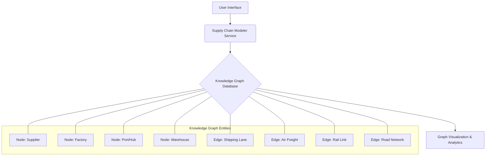
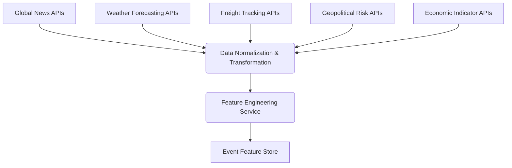

# System and Method for Predictive Supply Chain Disruption Modeling

## Table of Contents
1.  **Title of Invention**
2.  **Abstract**
3.  **Background of the Invention**
4.  **Brief Summary of the Invention**
5.  **Detailed Description of the Invention**
    *   5.1 System Architecture
        *   5.1.1 Supply Chain Modeler and Knowledge Graph
        *   5.1.2 Multi-Modal Data Ingestion and Feature Engineering Service
        *   5.1.3 AI Risk Analysis and Prediction Engine
        *   5.1.4 Alert and Recommendation Generation Subsystem
        *   5.1.5 User Interface and Feedback Loop
    *   5.2 Data Structures and Schemas
        *   5.2.1 Supply Chain Graph Schema
        *   5.2.2 Real-time Event Data Schema
        *   5.2.3 Disruption Alert and Recommendation Schema
    *   5.3 Algorithmic Foundations
        *   5.3.1 Dynamic Graph Representation and Traversal
        *   5.3.2 Multi-Modal Data Fusion and Contextualization
        *   5.3.3 Generative AI Prompt Orchestration
        *   5.3.4 Probabilistic Disruption Forecasting
        *   5.3.5 Optimal Mitigation Strategy Generation
    *   5.4 Operational Flow and Use Cases
6.  **Claims**
7.  **Mathematical Justification: A Formal Axiomatic Framework for Predictive Supply Chain Resilience**
    *   7.1 The Supply Chain Topological Manifold: `G = (V, E, Φ)`
        *   7.1.1 Formal Definition of the Supply Chain Graph `G`
        *   7.1.2 Node State Space `V`
        *   7.1.3 Edge State Space `E`
        *   7.1.4 Latent Interconnection Functionals `Φ`
        *   7.1.5 Tensor-Weighted Adjacency Representation `A(t)`
    *   7.2 The Global State Observational Manifold: `W(t)`
        *   7.2.1 Definition of the Global State Tensor `W(t)`
        *   7.2.2 Multi-Modal Feature Extraction and Contextualization `f_Ψ`
        *   7.2.3 Event Feature Vector `E_F(t)`
    *   7.3 The Generative Predictive Disruption Oracle: `G_AI`
        *   7.3.1 Formal Definition of the Predictive Mapping Function `G_AI`
        *   7.3.2 The Disruption Probability Distribution `P(D_{t+k} | G, E_F(t))`
        *   7.3.3 Probabilistic Causal Graph Inference within `G_AI`
    *   7.4 The Economic Imperative and Decision Theoretic Utility: `E[Cost | a] < E[Cost]`
        *   7.4.1 Cost Function Definition `C(G, D, a)`
        *   7.4.2 Expected Cost Without Intervention `E[Cost]`
        *   7.4.3 Expected Cost With Optimal Intervention `E[Cost | a*]`
        *   7.4.4 The Value of Perfect Information Theorem Applied to `P(D_{t+k})`
        *   7.4.5 Axiomatic Proof of Utility
8.  **Proof of Utility**

---

## 1. Title of Invention:
System and Method for Predictive Supply Chain Disruption Modeling with Generative AI-Powered Causal Inference

## 2. Abstract:
A groundbreaking system for orchestrating supply chain resilience is herein disclosed. This invention architecturally delineates a user's intricate supply chain as a dynamic, attribute-rich knowledge graph, comprising diverse nodes such as manufacturing facilities, logistical hubs, ports, and warehouses, interconnected by multifaceted edges representing shipping lanes, air corridors, and terrestrial transit routes. Leveraging a sophisticated multi-modal data ingestion pipeline, the system continuously assimilates vast streams of real-time global intelligence, encompassing meteorological phenomena, geopolitical shifts, macroeconomic indicators, social sentiment fluctuations, and granular freight movement telemetry. A state-of-the-art generative artificial intelligence model, operating as a sophisticated causal inference engine, meticulously analyzes this convergent data within the contextual framework of the supply chain knowledge graph. This analysis identifies, quantifies, and forecasts potential disruptions with unprecedented accuracy, often several temporal epochs prior to their materialization. Upon the detection of a high-contingency disruption event (e.g., a super-typhoon's projected trajectory intersecting a critical maritime choke point, or emergent geopolitical sanctions impacting a tier-1 supplier), the system autonomously synthesizes and disseminates a detailed alert. Critically, it further postulates and ranks a portfolio of optimized, actionable alternative strategies, encompassing rerouting logistics, re-allocating inventory, or proposing alternate sourcing pathways, thereby transforming reactive remediation into proactive strategic orchestration.

## 3. Background of the Invention:
Contemporary global supply chains represent an apotheosis of complex adaptive systems, characterized by an intricate web of interdependencies, geographical dispersal, and profound vulnerability to stochastic perturbations. Traditional paradigms of supply chain management, predominantly anchored in historical data analysis and reactive incident response, have proven inherently insufficient to navigate the kaleidoscopic array of modern disruptive forces. These forces manifest across a spectrum from exogenous natural catastrophes (seismic events, cyclonic storms, pandemics) and geopolitical vicissitudes (trade conflicts, territorial disputes, regulatory shifts) to endogenous operational fragilities (labor disputes, infrastructure failures, cybernetic incursions). The economic ramifications of supply chain disruptions are astronomical, frequently escalating from direct financial losses to profound reputational damage, market share erosion, and long-term erosion of stakeholder trust. The imperative for a paradigm shift from reactive mitigation to anticipatory resilience has attained unprecedented criticality. Existing solutions, often reliant on threshold-based alerting or rudimentary statistical forecasting, conspicuously lack the capacity for sophisticated causal inference, contextual understanding, and proactive solution synthesis. They predominantly flag events post-occurrence or identify risks without furnishing actionable, context-aware mitigation strategies, leaving enterprises exposed to cascading failures and suboptimal recovery trajectories. The present invention addresses this profound lacuna, establishing an intellectual frontier in dynamic, AI-driven predictive supply chain orchestration.

## 4. Brief Summary of the Invention:
The present invention unveils a novel, architecturally robust, and algorithmically advanced system for predictive supply chain disruption modeling, herein termed the "Cognitive Supply Chain Sentinel." This system transcends conventional monitoring tools by integrating a multi-layered approach to risk assessment and proactive strategic guidance. The operational genesis commences with a user's precise definition and continuous refinement of their critical supply chain topology, meticulously mapping all entities—key suppliers, manufacturing plants, distribution centers, intermodal hubs, and their connecting logistical arteries—into a dynamic knowledge graph. At its operational core, the Cognitive Supply Chain Sentinel employs a sophisticated, continuously learning generative AI engine. This engine acts as an expert geopolitical, meteorological, and logistical risk analyst, incessantly monitoring, correlating, and interpreting an torrent of real-time, multi-modal global event data. The AI is dynamically prompted with highly contextualized queries, such as: "Given the enterprise's mission-critical shipping lane traversing the Strait of Malacca, linked to primary fabrication facilities in Southeast Asia, and considering prevailing meteorological forecasts, nascent geopolitical tensions in adjacent maritime territories, and real-time port congestion indices, what is the quantified probability of significant disruption within the subsequent 14-day temporal horizon? Furthermore, delineate the precise causal vectors and propose optimal pre-emptive rerouting alternatives." Should the AI model identify an emerging threat exceeding a pre-defined probabilistic threshold, it autonomously orchestrates the generation of a structured, machine-readable alert. This alert comprehensively details the nature and genesis of the risk, quantifies its probability and projected impact, specifies the affected components of the supply chain, and, crucially, synthesizes and ranks a portfolio of actionable, optimized mitigation strategies. This constitutes a paradigm shift from merely identifying risks to orchestrating intelligent, pre-emptive strategic maneuvers, embedding an unprecedented degree of foresight and resilience into global commerce.

## 5. Detailed Description of the Invention:

The disclosed system represents a comprehensive, intelligent infrastructure designed to anticipate and mitigate supply chain disruptions proactively. Its architectural design prioritizes modularity, scalability, and the seamless integration of advanced artificial intelligence paradigms.

### 5.1 System Architecture

The Cognitive Supply Chain Sentinel is comprised of several interconnected, high-performance services, each performing a specialized function, orchestrated to deliver a holistic predictive capability.

#### 5.1.1 Supply Chain Modeler and Knowledge Graph
This foundational component serves as the authoritative source for the enterprise's entire supply chain topology and associated operational parameters.
*   **User Interface (UI):** A sophisticated graphical user interface (GUI) provides intuitive tools for users to define, visualize, and iteratively refine their global supply chain network. This includes drag-and-drop functionality for nodes and edges, parameter input forms, and geospatial mapping integrations.
*   **Knowledge Graph Database:** At its core, the supply chain is represented as a highly interconnected, semantic knowledge graph. This graph is not merely a static representation but a dynamic entity capable of storing rich attributes, temporal data, and inter-node relationships.
    *   **Nodes:** Represent discrete entities within the supply chain. These can be granular, such as specific suppliers (e.g., "Quantum Chips Co., Taiwan"), manufacturing facilities (e.g., "Shenzhen Assembly Plant #3"), distribution centers (e.g., "LA Fulfillment Hub"), ports (e.g., "Port of Long Beach"), airports, and even specific inventory holding points. Each node is endowed with a comprehensive set of attributes, including geographical coordinates (latitude, longitude), operational capacities (e.g., production volume, storage space), lead times, cost parameters, operational hours, security ratings, and alternative supplier/facility identifiers.
    *   **Edges:** Represent the logistical pathways and relationships connecting these nodes. These include maritime shipping lanes, air freight routes, rail lines, and ground transportation networks. Edges possess attributes such as average transit time, typical capacity, cost per unit, historical reliability metrics, associated logistics providers, and regulatory compliance requirements. Edges can also represent non-physical relationships, such as contractual agreements between a buyer and a supplier.
    *   **Temporal and Contextual Attributes:** Both nodes and edges are augmented with temporal attributes, indicating their operational status at different times, and contextual attributes, such as geopolitical risk scores associated with their location, environmental vulnerability indices, and labor stability metrics.



#### 5.1.2 Multi-Modal Data Ingestion and Feature Engineering Service
This robust, scalable service is responsible for continuously acquiring, processing, and normalizing vast quantities of heterogeneous global data streams. It acts as the "sensory apparatus" of the Sentinel.
*   **Global News APIs:** Integration with advanced news aggregators (e.g., GDELT Project, Bloomberg, Reuters, proprietary sentiment analysis platforms) to capture real-time geopolitical developments, macroeconomic shifts, labor unrest indicators, and social sentiment changes across relevant geographies. Natural Language Processing (NLP) techniques, including named entity recognition (NER), event extraction, and sentiment analysis, are applied to structure unstructured news feeds into actionable data points.
*   **Weather and Climate Forecasting APIs:** Acquisition of high-resolution meteorological data, including typhoon/hurricane tracking, severe weather warnings, climate anomaly predictions (e.g., prolonged droughts, extreme heatwaves), and localized forecasts impacting specific logistical nodes or routes. Predictive climate models are integrated to project long-term environmental risks.
*   **Maritime and Air Freight Tracking APIs:** Real-time Automatic Identification System (AIS) data for vessels, ADS-B data for aircraft, satellite tracking for rail and truck fleets. This includes port congestion metrics, vessel deviation alerts, estimated time of arrival (ETA) updates, and historical performance benchmarks. Container-level tracking information can be integrated where available.
*   **Geopolitical Risk APIs:** Specialized feeds providing granular risk scores, sanction updates, trade tariff changes, and political stability indices for countries and specific regions relevant to the supply chain.
*   **Economic Indicator APIs:** Access to macroeconomic data such as GDP growth, inflation rates, manufacturing indices, currency fluctuations, and commodity prices, which can signal impending demand or supply shocks.
*   **Social Media and Open-Source Intelligence (OSINT):** Selective monitoring of public social media discourse and OSINT sources, employing advanced text and image analysis, to detect early warnings of civil unrest, public health emergencies, or localized disruptions that may not yet be reported by traditional news media.
*   **Data Normalization and Transformation:** Raw data from disparate sources is transformed into a unified, semantically consistent format, timestamped, geo-tagged, and enriched. This involves schema mapping, unit conversion, and anomaly detection.
*   **Feature Engineering:** This critical sub-component extracts salient features from the processed data, translating raw observations into high-dimensional vectors pertinent for AI analysis. For instance, "Typhoon Leo projected path" is transformed into features like `[proximity_to_port_X, wind_speed_category, forecast_confidence_score, estimated_arrival_time]`.



#### 5.1.3 AI Risk Analysis and Prediction Engine
This is the intellectual core of the Cognitive Supply Chain Sentinel, employing advanced generative AI to synthesize intelligence and forecast disruptions.
*   **Dynamic Prompt Orchestration:** Instead of static prompts, this engine constructs highly dynamic, context-specific prompts for the generative AI model. These prompts are meticulously crafted, integrating:
    *   The user's specific supply chain graph (or relevant sub-graph).
    *   Recent, relevant event features from the `Event Feature Store`.
    *   Pre-defined roles for the AI (e.g., "Expert Maritime Logistics Risk Analyst," "Geopolitical Forecaster").
    *   Specific temporal horizons for prediction (e.g., "next 7 days," "next 30 days").
    *   Desired output format constraints (e.g., JSON schema for structured alerts).
*   **Generative AI Model:** A large, multi-modal language model (LLM) serves as the primary inference engine. This model is pre-trained on a vast corpus of text and data, encompassing geopolitical history, logistics operations, economic theory, meteorological science, and risk management principles. It may be further fine-tuned with domain-specific supply chain incident data to enhance its predictive accuracy and contextual understanding. The model's capacity for complex reasoning, causal chain identification, and synthesis of disparate information is paramount.
*   **Probabilistic Causal Inference:** The AI model does not merely correlate events; it attempts to infer causal relationships. For example, a typhoon's path (event) causes port closure (direct effect) which in turn causes vessel rerouting (indirect effect) and ultimately shipment delay (supply chain impact). The AI quantifies the probability of these causal links and their downstream effects.
*   **Risk Taxonomy Mapping:** Identified disruptions are mapped to a predefined ontology of supply chain risks (e.g., Force Majeure, Geopolitical, Operational, Financial, Cyber). This categorization aids in structured reporting and subsequent strategic planning.

```mermaid
graph TD
    A[Supply Chain Knowledge Graph] --> D(Dynamic Prompt Orchestration)
    B[Event Feature Store] --> D
    C[User-defined Risk Parameters] --> D
    D --> E{Generative AI Model (LLM)}
    E --> F[Probabilistic Disruption Forecasts]
    E --> G[Causal Inference Insights]
    F & G --> H(Risk Assessment & Scoring)
```

#### 5.1.4 Alert and Recommendation Generation Subsystem
Upon receiving the AI's structured output, this subsystem processes and refines it into actionable intelligence.
*   **Alert Filtering and Prioritization:** Alerts are filtered based on user-defined thresholds (e.g., only show "High" probability disruptions, or those impacting "Critical" suppliers). They are prioritized based on probability, impact severity, and temporal proximity.
*   **Recommendation Synthesis and Ranking:** The AI's suggested actions are further refined, cross-referenced with enterprise resource planning (ERP) data (e.g., current inventory levels, alternative supplier contracts, available transport capacity), and ranked according to user-defined optimization criteria (e.g., minimize cost, minimize delay, maximize resilience).
*   **Notification Dispatch:** Alerts are dispatched through various channels (e.g., integrated dashboard, email, SMS, API webhook) to relevant stakeholders within the organization.

#### 5.1.5 User Interface and Feedback Loop
This component ensures the system is interactive, adaptive, and continuously improves.
*   **Integrated Dashboard:** A comprehensive, real-time dashboard visualizes the supply chain graph, overlays identified disruptions, displays alerts, and presents recommended mitigation strategies. Geospatial visualizations are central to this interface.
*   **Simulation and Scenario Planning:** Users can interact with the system to run "what-if" scenarios, evaluating the impact of hypothetical disruptions or proposed mitigation actions. This leverages the generative AI for predictive modeling under new conditions.
*   **Feedback Mechanism:** Users can provide feedback on the accuracy of predictions, the utility of recommendations, and the outcome of implemented actions. This feedback is crucial for continually fine-tuning the generative AI model through reinforcement learning from human feedback (RLHF) or similar mechanisms, improving its accuracy and relevance over time. This closes the loop, making the system an adaptive, intelligent agent.

### 5.2 Data Structures and Schemas

To maintain consistency, interoperability, and the integrity of complex data flows, the system adheres to rigorously defined data structures.

#### 5.2.1 Supply Chain Graph Schema
Represented internally within the Knowledge Graph Database.

*   **Node Schema (`SCNode`):**
    ```json
    {
      "node_id": "UUID",
      "node_type": "ENUM['Supplier', 'Factory', 'Warehouse', 'Port', 'DistributionCenter', 'CustomerHub']",
      "name": "String",
      "location": {
        "latitude": "Float",
        "longitude": "Float",
        "country": "String",
        "region": "String"
      },
      "attributes": {
        "capacity_units_per_period": "Float",
        "lead_time_days_min": "Integer",
        "lead_time_days_max": "Integer",
        "cost_per_unit": "Float",
        "operating_hours": "String",
        "security_rating": "ENUM['Low', 'Medium', 'High']",
        "geopolitical_risk_score": "Float",
        "environmental_vulnerability_index": "Float",
        "custom_tags": ["String"],
        "tier_level": "Integer"
      },
      "last_updated": "Timestamp"
    }
    ```

*   **Edge Schema (`SCEdge`):**
    ```json
    {
      "edge_id": "UUID",
      "source_node_id": "UUID",
      "target_node_id": "UUID",
      "edge_type": "ENUM['ShippingLane', 'AirFreightRoute', 'RailLink', 'RoadNetwork', 'ContractualLink']",
      "route_identifier": "String",
      "attributes": {
        "average_transit_time_days": "Float",
        "max_capacity_units_per_period": "Float",
        "cost_per_unit_transport": "Float",
        "reliability_score": "Float",
        "primary_carrier": "String",
        "alternative_carriers": ["String"],
        "criticality_level": "ENUM['Low', 'Medium', 'High', 'MissionCritical']",
        "geographical_risk_exposure": ["String"], // e.g., ["Strait of Malacca", "Suez Canal"]
        "tariff_impact_index": "Float"
      },
      "last_updated": "Timestamp"
    }
    ```

#### 5.2.2 Real-time Event Data Schema
Structured representation of ingested and featured global events.

*   **Event Schema (`GlobalEvent`):**
    ```json
    {
      "event_id": "UUID",
      "event_type": "ENUM['Weather', 'Geopolitical', 'Logistics', 'Economic', 'Social']",
      "sub_type": "String", // e.g., "Typhoon", "Sanction", "PortCongestion", "Inflation", "LaborStrike"
      "timestamp": "Timestamp",
      "start_time_forecast": "Timestamp (optional)",
      "end_time_forecast": "Timestamp (optional)",
      "location": {
        "latitude": "Float",
        "longitude": "Float",
        "radius_km": "Float",
        "country": "String",
        "region": "String",
        "named_location": "String" // e.g., "Port of Long Beach"
      },
      "severity_score": "Float", // Normalized score, e.g., 0-10
      "impact_potential": "ENUM['Low', 'Medium', 'High', 'Critical']",
      "confidence_level": "Float", // 0-1, confidence in event occurrence/forecast
      "source": "String", // e.g., "GDELT", "NOAA", "Lloyd's List"
      "raw_data_link": "URL (optional)",
      "feature_vector": { // Key-value pairs for AI consumption
        "wind_speed_kph": "Float",
        "category": "Integer", // for typhoons
        "affected_vessels_count": "Integer",
        "sentiment_score": "Float", // for news/social media
        "geopolitical_tension_index": "Float"
        // ... many more dynamic features
      }
    }
    ```

#### 5.2.3 Disruption Alert and Recommendation Schema
Output structure from the AI Risk Analysis Engine.

*   **Alert Schema (`DisruptionAlert`):**
    ```json
    {
      "alert_id": "UUID",
      "timestamp_generated": "Timestamp",
      "risk_summary": "String", // e.g., "Typhoon Leo may delay shipments from Taiwan supplier."
      "description": "String", // Detailed explanation of the risk and causal chain.
      "risk_probability": "ENUM['Low', 'Medium', 'High', 'Critical']", // Qualitative assessment
      "probability_score": "Float", // Quantitative score, 0-1
      "projected_impact_severity": "ENUM['Low', 'Medium', 'High', 'Catastrophic']",
      "impact_score": "Float", // Quantitative score, 0-1
      "affected_entities": [
        {"entity_id": "UUID", "entity_type": "ENUM['Node', 'Edge']"}
      ],
      "causal_events": [ // Link to GlobalEvent IDs that contribute to this disruption
        "UUID"
      ],
      "temporal_horizon_days": "Integer", // Days until expected disruption
      "recommended_actions": [
        {
          "action_id": "UUID",
          "action_description": "String", // e.g., "Consider pre-booking air freight for critical components."
          "action_type": "ENUM['Reroute', 'AlternateSourcing', 'InventoryAdjust', 'Negotiate', 'InformStakeholders']",
          "estimated_cost_impact": "Float",
          "estimated_time_impact_days": "Float",
          "risk_reduction_potential": "Float",
          "feasibility_score": "Float",
          "confidence_in_recommendation": "Float",
          "related_entities": ["UUID"] // Entities affected by this action
        }
      ],
      "status": "ENUM['Active', 'Resolved', 'Acknowledged', 'Mitigated']",
      "last_updated": "Timestamp"
    }
    ```

### 5.3 Algorithmic Foundations

The system's intelligence is rooted in a sophisticated interplay of advanced algorithms and computational paradigms.

#### 5.3.1 Dynamic Graph Representation and Traversal
The supply chain is fundamentally a dynamic graph `G=(V,E)`.
*   **Graph Database Technologies:** Underlying technologies (e.g., property graphs, RDF knowledge graphs) are employed for efficient storage and retrieval of complex relationships and attributes.
*   **Temporal Graph Analytics:** Algorithms for analyzing evolving graph structures, identifying critical paths (shortest path, bottleneck analysis), and calculating centrality measures (e.g., betweenness centrality for key ports) that dynamically change with real-time conditions.
*   **Sub-graph Extraction:** Efficient algorithms for extracting relevant sub-graphs based on a specific query (e.g., all paths from `Supplier X` to `Factory Y` passing through `Port Z`).

#### 5.3.2 Multi-Modal Data Fusion and Contextualization
The fusion process integrates heterogeneous data into a unified, semantically coherent representation.
*   **Latent Space Embeddings:** Multi-modal data (text, numerical, geospatial) is transformed into a shared latent vector space using techniques like autoencoders, contrastive learning, or specialized transformers. This allows for semantic comparison and contextualization across data types.
*   **Attention Mechanisms:** Employing attention networks to weigh the relevance of different data streams and features to a specific supply chain query. For example, weather data is highly relevant for maritime routes, while geopolitical news is critical for sourcing locations.
*   **Time-Series Analysis and Forecasting:** Applying advanced time-series models (e.g., LSTM, Transformer networks, Gaussian Processes) to predict future states of continuous variables (e.g., port congestion levels, commodity prices) which then serve as features for the generative AI.

#### 5.3.3 Generative AI Prompt Orchestration
This is a critical innovation enabling the AI to function as a domain expert.
*   **Contextual Variable Injection:** Dynamically injecting elements of the current supply chain graph (e.g., specific node/edge attributes), relevant real-time event features, and historical context directly into the AI prompt.
*   **Role-Playing Directives:** Explicitly instructing the generative AI model to adopt specific personas (e.g., "You are an expert in global maritime logistics," "You are a geopolitical strategist") to elicit specialized reasoning capabilities.
*   **Constrained Output Generation:** Utilizing techniques such as JSON schema enforcement or few-shot exemplars within the prompt to guide the AI to produce structured, machine-readable outputs, crucial for automated processing.
*   **Iterative Refinement and Self-Correction:** Developing prompts that allow the AI to ask clarifying questions or iterate on its analysis, mimicking human analytical processes.

#### 5.3.4 Probabilistic Disruption Forecasting
The AI's ability to not just predict but quantify uncertainty is vital.
*   **Causal Graph Learning:** Within the generative AI's latent reasoning capabilities, it constructs implicit or explicit probabilistic causal graphs (e.g., Bayesian Networks, Granger Causality) linking global events to supply chain impacts. This allows it to identify direct and indirect causal pathways.
*   **Monte Carlo Simulations (Implicit):** The AI's generative nature allows it to effectively perform implicit Monte Carlo simulations, exploring various future scenarios based on probabilistic event occurrences and their cascading effects. It synthesizes the most probable and impactful scenarios.
*   **Confidence Calibration:** Employing techniques to calibrate the AI's confidence scores in its predictions against observed outcomes, ensuring that a "High" probability truly corresponds to a high likelihood of occurrence.

#### 5.3.5 Optimal Mitigation Strategy Generation
Beyond prediction, the system provides actionable solutions.
*   **Multi-Objective Optimization:** The AI, informed by enterprise constraints and preferences (e.g., cost, time, risk tolerance), leverages its understanding of the supply chain graph and available alternatives to propose strategies that optimize across multiple, potentially conflicting objectives. This might involve shortest path algorithms considering dynamic edge weights (cost, time, risk), or network flow optimization under capacity constraints.
*   **Constraint Satisfaction:** Integrating current inventory levels, contractual obligations, and real-time transport availability (e.g., available air freight capacity from alternative carriers) as constraints within the AI's decision-making process.
*   **Scenario-Based Planning Integration:** The generative AI can simulate the outcomes of different mitigation strategies within the context of a predicted disruption, providing quantitative insights into their effectiveness before execution.

### 5.4 Operational Flow and Use Cases

A typical operational cycle of the Cognitive Supply Chain Sentinel proceeds as follows:

1.  **Initialization:** A user defines their supply chain graph via the Modeler UI, specifying nodes, edges, attributes, and criticality levels.
2.  **Continuous Data Ingestion:** The Data Ingestion Service perpetually streams and processes global multi-modal data, populating the Event Feature Store.
3.  **Scheduled AI Analysis:** Periodically (e.g., hourly, bi-hourly), the AI Risk Analysis Engine is triggered.
4.  **Prompt Construction:** Dynamic Prompt Orchestration retrieves the relevant sub-graph of the supply chain, current event features, and pre-defined risk parameters to construct a sophisticated query for the Generative AI Model.
5.  **AI Inference:** The Generative AI Model processes the prompt, performs causal inference, probabilistic forecasting, and identifies potential disruptions. It synthesizes a structured output with alerts and preliminary recommendations.
6.  **Alert Processing:** The Alert and Recommendation Generation Subsystem refines the AI's output, prioritizes alerts, performs secondary optimization of recommendations against ERP data, and prepares notifications.
7.  **User Notification:** Alerts and recommendations are disseminated to the user dashboard, and potentially via other channels.
8.  **Action and Feedback:** The user reviews the alerts, evaluates recommendations, potentially runs simulations, makes a decision, and provides feedback to the system, which aids in continuous model refinement.

**Use Cases:**

*   **Proactive Rerouting:** A vessel carrying critical components is en route to the Port of Long Beach. The system predicts a high probability of a longshoremen's strike within 5 days. It recommends rerouting the vessel to the Port of Seattle, calculating the revised cost and transit time, and identifying alternative ground transportation from Seattle to the final destination.
*   **Alternate Sourcing Activation:** A key supplier in Taiwan is identified as being in the projected path of a severe typhoon. The system alerts and suggests initiating orders with a pre-qualified alternative supplier in Vietnam for upcoming batches of components, minimizing production delays.
*   **Inventory Pre-positioning:** An upcoming holiday season combined with geopolitical tensions in a key manufacturing region prompts the system to recommend increasing safety stock levels at distribution centers, mitigating potential future supply shocks.
*   **Risk Portfolio Management:** For a diversified supply chain, the system identifies aggregated risk exposure across multiple suppliers and routes, providing a holistic view for strategic risk mitigation planning rather than reactive, siloed responses.

## 6. Claims:

The inventive concepts herein described constitute a profound advancement in the domain of supply chain management and predictive analytics.

1.  A system for proactive supply chain disruption management, comprising:
    a.  A **Supply Chain Modeler** configured to receive, store, and dynamically update a representation of a user's supply chain as a knowledge graph, said graph comprising a plurality of nodes representing physical or logical entities (e.g., suppliers, factories, ports, warehouses) and a plurality of edges representing logistical or contractual pathways therebetween, wherein each node and edge is endowed with a comprehensive set of temporal and contextual attributes.
    b.  A **Multi-Modal Data Ingestion and Feature Engineering Service** configured to continuously acquire, process, normalize, and extract salient features from a plurality of real-time, heterogeneous global data sources, including but not limited to global news feeds, meteorological forecasting services, maritime and air freight tracking systems, geopolitical risk intelligence, economic indicators, and open-source intelligence.
    c.  An **AI Risk Analysis and Prediction Engine** configured to periodically receive the dynamically updated supply chain knowledge graph and the extracted features from the multi-modal data, said engine employing a generative artificial intelligence model.
    d.  A **Dynamic Prompt Orchestration** module integrated within the AI Risk Analysis and Prediction Engine, configured to construct highly contextualized and dynamic prompts for the generative AI model, said prompts incorporating specific sub-graphs of the user's supply chain, relevant real-time event features, and explicit directives for the AI model to assume expert analytical personas.
    e.  The generative AI model being further configured to perform **probabilistic causal inference** upon the received prompt, thereby identifying potential future disruptions to the user's supply chain, quantifying their probability of occurrence, assessing their projected impact severity, delineating the causal pathways from global events to supply chain effects, and generating a structured output detailing said disruptions and their attributes.
    f.  An **Alert and Recommendation Generation Subsystem** configured to receive the structured output from the generative AI model, to filter and prioritize disruption alerts based on user-defined criteria, and to synthesize and rank a portfolio of actionable, optimized mitigation strategies (e.g., rerouting logistics, alternate sourcing, inventory adjustments) by correlating AI-generated suggestions with enterprise resource planning data and user-defined optimization objectives.
    g.  A **User Interface** configured to visually present the supply chain knowledge graph, overlay identified disruptions and their projected impacts, display the generated alerts, and enable interaction with and feedback on the proposed mitigation strategies.

2.  The system of Claim 1, wherein the knowledge graph is implemented as a property graph database capable of storing temporal attributes and dynamically updated relationships between nodes and edges.

3.  The system of Claim 1, wherein the Multi-Modal Data Ingestion and Feature Engineering Service utilizes Natural Language Processing (NLP) techniques, including named entity recognition, event extraction, and sentiment analysis, to transform unstructured news and open-source intelligence data into structured event features.

4.  The system of Claim 1, wherein the generative AI model is a large language model (LLM) fine-tuned with domain-specific supply chain incident data and risk management ontologies.

5.  The system of Claim 1, wherein the probabilistic causal inference performed by the generative AI model explicitly identifies direct and indirect causal links between observed global events and predicted supply chain disruptions.

6.  The system of Claim 1, wherein the Dynamic Prompt Orchestration module incorporates explicit instructions for the generative AI model to adhere to predefined output schemas, thereby ensuring machine-readability and downstream automated processing of alerts.

7.  The system of Claim 1, wherein the Alert and Recommendation Generation Subsystem integrates enterprise resource planning (ERP) data to refine mitigation strategies by considering real-time inventory levels, contractual obligations, and available logistical capacities.

8.  The system of Claim 1, further comprising a **Feedback Loop Mechanism** integrated with the User Interface, configured to capture user feedback on the accuracy of predictions and the utility of recommendations, said feedback being used to continuously refine and improve the performance of the generative AI model through mechanisms such as reinforcement learning from human feedback.

9.  A method for proactive supply chain risk management, comprising:
    a.  Defining and continuously updating a user's supply chain as a knowledge graph, including nodes representing entities and edges representing pathways, each with dynamic attributes.
    b.  Continuously ingesting and processing real-time, multi-modal global event data from diverse external sources to extract salient event features.
    c.  Periodically constructing a highly contextualized prompt for a generative artificial intelligence model, said prompt integrating a segment of the supply chain knowledge graph, recent event features, and expert role directives.
    d.  Transmitting the prompt to the generative AI model for probabilistic causal inference and prediction.
    e.  Receiving from the generative AI model a structured output comprising a list of potential future supply chain disruptions, their quantified probabilities, projected impact severities, causal derivations, and preliminary mitigation suggestions.
    f.  Refining and prioritizing the disruptions into actionable alerts and synthesizing a ranked portfolio of optimized mitigation strategies by correlating AI suggestions with enterprise operational data.
    g.  Displaying the alerts and recommended strategies to the user via a comprehensive interface.
    h.  Capturing user feedback on the system's performance for continuous model improvement.

10. The method of Claim 9, wherein constructing the prompt includes specifying a temporal horizon for the disruption prediction and a desired output data schema.

11. The method of Claim 9, wherein refining mitigation strategies includes performing multi-objective optimization based on user-defined criteria such as minimizing cost, minimizing time, or maximizing resilience.

12. The method of Claim 9, further comprising enabling users to conduct "what-if" simulations and scenario planning within the user interface, leveraging the generative AI model for predictive outcomes under hypothetical conditions.

## 7. Mathematical Justification: A Formal Axiomatic Framework for Predictive Supply Chain Resilience

The inherent complexity of global supply chains necessitates a rigorous mathematical framework for the precise articulation and demonstrative proof of the predictive disruption modeling system's efficacy. We herein establish such a framework, transforming the conceptual elements into formally defined mathematical constructs, thereby substantiating the invention's profound analytical capabilities.

### 7.1 The Supply Chain Topological Manifold: `G = (V, E, Φ)`

The supply chain is not merely a graph but a dynamic, multi-relational topological manifold where attributes and relationships evolve under external influence.

#### 7.1.1 Formal Definition of the Supply Chain Graph `G`

Let `G = (V, E, Φ)` denote the formal representation of the supply chain at any given time `t`.
*   `V` is the finite set of nodes, where each `v ∈ V` represents a distinct entity in the supply chain (e.g., supplier, factory, port, warehouse).
*   `E` is the finite set of directed edges, where each `e = (u, v) ∈ E` represents a logistical or contractual pathway from node `u` to node `v`.
*   `Φ` is the set of higher-order functional relationships or meta-data that define interdependencies or policies spanning multiple nodes or edges, such as global inventory policies, geopolitical risk zones, or trade agreements that cannot be fully captured by simple node or edge attributes.

#### 7.1.2 Node State Space `V`

Each node `v ∈ V` is associated with a state vector `X_v(t) ∈ R^k` at time `t`, where `k` is the dimensionality of the node's attribute space.
Let `X_v(t) = (x_{v,1}(t), x_{v,2}(t), ..., x_{v,k}(t))`, where:
*   `x_{v,1}(t)` could be the geographical coordinates `(lat_v, lon_v)`.
*   `x_{v,2}(t)` could be the instantaneous operational capacity `Cap_v(t)`.
*   `x_{v,3}(t)` could be a dynamically updated geopolitical stability index `Geo_v(t) ∈ [0, 1]`.
*   `x_{v,4}(t)` could represent current inventory levels `Inv_v(t)`.
*   `x_{v,j}(t)` for `j > 4` represent other relevant attributes (e.g., labor availability, energy cost index, regulatory compliance status).

The domain of `X_v(t)` forms a sub-manifold `M_V ⊂ R^k` for all `v ∈ V`.

#### 7.1.3 Edge State Space `E`

Each directed edge `e = (u, v) ∈ E` is associated with a state vector `Y_e(t) ∈ R^m` at time `t`, where `m` is the dimensionality of the edge's attribute space.
Let `Y_e(t) = (y_{e,1}(t), y_{e,2}(t), ..., y_{e,m}(t))`, where:
*   `y_{e,1}(t)` could be the instantaneous transit time `T_e(t)`.
*   `y_{e,2}(t)` could be the instantaneous logistical cost per unit `C_e(t)`.
*   `y_{e,3}(t)` could be the real-time capacity utilization `U_e(t) ∈ [0, 1]`.
*   `y_{e,4}(t)` could represent a dynamically assessed risk score `R_e(t) ∈ [0, 1]`, encompassing weather impacts, congestion, or security threats.
*   `y_{e,j}(t)` for `j > 4` represent other relevant attributes (e.g., carbon footprint, insurance premium volatility).

The domain of `Y_e(t)` forms a sub-manifold `M_E ⊂ R^m` for all `e ∈ E`.

#### 7.1.4 Latent Interconnection Functionals `Φ`

The set `Φ` captures complex, often non-linear, interdependencies. For example, a global trade agreement `φ_trade ∈ Φ` might affect `C_e(t)` for multiple edges simultaneously based on the nodes' origins and destinations. A `φ_geopolitics ∈ Φ` might define shared risk across geographically proximate nodes/edges. These are dynamically inferred or modeled relationships beyond simple graph connectivity.

#### 7.1.5 Tensor-Weighted Adjacency Representation `A(t)`

The entire supply chain graph `G(t)` can be robustly represented by a dynamic, higher-order tensor-weighted adjacency matrix `A(t)`.
Let `N = |V|` be the number of nodes. The standard adjacency matrix is `A_0`, where `A_0[i,j] = 1` if `(v_i, v_j) ∈ E`, else `0`.
We extend this to `A(t) ∈ R^(N x N x (k+m_avg))` (or a sparse tensor representation), where for each `(i, j)` corresponding to an edge `e = (v_i, v_j)`, `A(t)[i,j,:]` contains a concatenation of `X_{v_i}(t)`, `Y_e(t)`, and `X_{v_j}(t)` relevant feature vectors, effectively embedding the node and edge attributes into the adjacency structure. `m_avg` refers to the average dimensionality of edge attributes.
This `A(t)` precisely encodes the entire dynamic state of the supply chain network at any instance.

### 7.2 The Global State Observational Manifold: `W(t)`

The external environment that influences the supply chain is captured by a complex, multi-modal observational manifold.

#### 7.2.1 Definition of the Global State Tensor `W(t)`

Let `W(t)` be a high-dimensional, multi-modal tensor representing the aggregated, raw global event data at time `t`. This tensor integrates:
*   **Meteorological Data:** `W_M(t)` (e.g., grid-based weather forecasts, typhoon tracks).
*   **Geopolitical Data:** `W_G(t)` (e.g., news articles, sanction lists, conflict reports).
*   **Logistical Telemetry:** `W_L(t)` (e.g., AIS data, port congestion reports, freight delay statistics).
*   **Economic Data:** `W_E(t)` (e.g., market indices, commodity prices, inflation rates).
*   **Social/Sentiment Data:** `W_S(t)` (e.g., parsed social media feeds, public opinion surveys).

Each `W_X(t)` is itself a tensor, potentially sparse, capturing spatial, temporal, and semantic dimensions. For instance, `W_M(t)` could be `R^(lat x lon x time x weather_features)`.

#### 7.2.2 Multi-Modal Feature Extraction and Contextualization `f_Ψ`

The raw global state `W(t)` is too voluminous and heterogeneous for direct AI consumption. A sophisticated multi-modal feature extraction function `f_Ψ` maps `W(t)` to a more compact, semantically meaningful feature vector `E_F(t)`.
`E_F(t) = f_Ψ(W(t); Ψ)` where `Ψ` represents the learned parameters of the feature engineering pipeline (e.g., parameters of NLP models, spatio-temporal filters, dimensionality reduction techniques).

This `f_Ψ` involves:
1.  **Event Detection:** Identifying discrete events from continuous data streams (e.g., "typhoon formation," "strike authorization vote").
2.  **Contextual Embedding:** Encoding events with contextual information (location, magnitude, entities involved).
3.  **Cross-Modal Correlation:** Identifying interdependencies between features from different modalities (e.g., a news report about a labor dispute correlating with increased port congestion telemetry).

`E_F(t)` is a vector `(e_{F,1}(t), e_{F,2}(t), ..., e_{F,p}(t)) ∈ R^p`, where `p` is the dimensionality of the event feature space. Each `e_{F,j}(t)` represents a specific, relevant feature, such as `P(Typhoon_Leo_Category_5_hits_Taiwan_port_within_7_days)`, or `Average_Sentiment_Score_for_Longshoremen_Union`.

#### 7.2.3 Event Feature Vector `E_F(t)`

`E_F(t)` becomes the critical input for the predictive engine, representing the distilled, actionable intelligence from the global environment, semantically aligned for causal reasoning.

### 7.3 The Generative Predictive Disruption Oracle: `G_AI`

The core innovation resides in the generative AI model's capacity to act as a predictive oracle, inferring future disruptions from the dynamic interplay of the supply chain's state and global events.

#### 7.3.1 Formal Definition of the Predictive Mapping Function `G_AI`

The generative AI model `G_AI` is a non-linear, stochastic mapping function that operates on the instantaneous state of the supply chain `G(t)` (represented by `A(t)`) and the contemporaneous event features `E_F(t)`. It projects these inputs onto a probability distribution over future disruption events.
`G_AI : (A(t) ⊗ E_F(t)) → P(D_{t+k} | A(t), E_F(t))`

Where:
*   `⊗` denotes a sophisticated tensor fusion operation that combines the supply chain state with the event features. This fusion is implicitly handled by the attention mechanisms and contextual understanding of the LLM.
*   `D_{t+k}` is the set of all possible disruption events that could occur at a future time `t+k`, for a temporal horizon `k ∈ {k_min, ..., k_max}`.
*   `P(D_{t+k} | A(t), E_F(t))` is the conditional probability distribution over these future disruptions, given the current state of the supply chain and the observed global event features.

#### 7.3.2 The Disruption Probability Distribution `P(D_{t+k} | G, E_F(t))`

A disruption event `d ∈ D_{t+k}` is formally defined as a tuple `d = (e_d, δ_T, δ_C, S, L, C_cause)`, where:
*   `e_d ∈ E` is the specific edge (or `v_d ∈ V` a node) in the supply chain that experiences the direct impact.
*   `δ_T` is the predicted increase in transit time `T_e` or lead time `T_v`.
*   `δ_C` is the predicted increase in cost `C_e` or `C_v`.
*   `S` is the severity of the disruption (e.g., `S ∈ [0, 1]`).
*   `L` is the geographic locus of the disruption.
*   `C_cause` is the inferred causal chain of events from `E_F(t)` leading to `d`.

The output `P(D_{t+k})` is not a single probability value, but a rich, structured distribution:
`P(D_{t+k}) = { (d_1, p_1), (d_2, p_2), ..., (d_N, p_N) }` where `d_i` is a specific disruption event tuple and `p_i` is its predicted probability `p_i ∈ [0, 1]`, with `sum(p_i) ≤ 1` (as some disruptions might be mutually exclusive or conditional).

This distribution is generated stochastically by `G_AI` leveraging its inherent generative capabilities to sample plausible future states and their associated likelihoods.

#### 7.3.3 Probabilistic Causal Graph Inference within `G_AI`

`G_AI` operates as a sophisticated probabilistic causal inference engine. For a given disruption `d_i`, `G_AI` implicitly constructs a causal graph `CG_i = (C_nodes, C_edges)` where `C_nodes` are events from `E_F(t)` and nodes/edges from `G(t)`, and `C_edges` represent probabilistic causal links.
For example: `Typhoon_Leo (Event) -> Port_Shanghai_Closure (Node Attribute) -> Edge_Shenzhen_LA_Delay (Edge Attribute)`.
The generative model's reasoning processes implicitly (or explicitly via chain-of-thought prompting) delineate these `C_cause` pathways, providing transparency and interpretability to its predictions. This differentiates `G_AI` from purely correlational models.

### 7.4 The Economic Imperative and Decision Theoretic Utility: `E[Cost | a] < E[Cost]`

The fundamental utility of this system is quantified by its capacity to reduce the expected total cost associated with supply chain operations by enabling proactive, optimal interventions. This is an application of **Decision Theory** under uncertainty.

#### 7.4.1 Cost Function Definition `C(G, D, a)`

Let `C(G, D, a)` be the total cost function of operating the supply chain `G`, given a set of actual future disruptions `D` and a set of mitigating actions `a` taken by the user.
`C(G, D, a) = C_operational(G, a) + C_disruption_impact(D | G, a)`
*   `C_operational(G, a)`: The nominal operational cost of the supply chain `G` given chosen actions `a` (e.g., cost of rerouting, expedited shipping costs).
*   `C_disruption_impact(D | G, a)`: The cost incurred due to actual disruptions `D` that occur, after accounting for any mitigating effects of actions `a`. This includes direct losses, penalties, lost sales, reputational damage, etc.

#### 7.4.2 Expected Cost Without Intervention `E[Cost]`

In a traditional, reactive system, no proactive action `a` is taken based on foresight. Actions are only taken *after* a disruption `d` materializes.
The expected cost `E[Cost]` without the present invention's predictive capabilities is given by:
`E[Cost] = ∑_{d ∈ D_all} P_actual(d) * C(G_initial, d, a_reactive_if_any)`
where `P_actual(d)` is the true, underlying probability of disruption `d`, and `a_reactive_if_any` denotes any post-disruption reactive actions, which are typically suboptimal and costly. `G_initial` is the state of the supply chain before any proactive change.

#### 7.4.3 Expected Cost With Optimal Intervention `E[Cost | a*]`

With the present invention, at time `t`, the system provides `P(D_{t+k} | A(t), E_F(t))`. Based on this distribution, an optimal set of mitigating actions `a*` can be chosen *before* `t+k`.
The optimal action `a*` is chosen to minimize the *expected* total cost:
`a* = argmin_a E[C(G_modified(a), D_{t+k}, a)]`
`E[Cost | a*] = ∑_{d ∈ D_all} P_actual(d) * C(G_modified(a*), d, a*)`
where `G_modified(a*)` represents the state of the supply chain after implementing `a*` (e.g., rerouted edges, increased inventory).

#### 7.4.4 The Value of Perfect Information Theorem Applied to `P(D_{t+k})`

The system provides information `I = P(D_{t+k} | A(t), E_F(t))`. According to the **Value of Information (VoI)** theorem, the utility of this information is the reduction in expected cost.
`VoI = E[Cost] - E[Cost | I]`
The invention provides a high-fidelity approximation of `P_actual(d)` via `G_AI` and `E_F(t)`. The accuracy and granularity of `P(D_{t+k})` directly translate to a higher `VoI`. The ability of `G_AI` to infer causal chains and project multi-dimensional disruption impacts `d = (e_d, δ_T, δ_C, S, L, C_cause)` is precisely what makes `I` exceptionally valuable.

#### 7.4.5 Axiomatic Proof of Utility

**Axiom 1 (Disruption Cost):** For any potential disruption `d`, `C_disruption_impact(d | G, a_null) > 0`, where `a_null` represents no proactive action. Disruptions inherently incur costs.

**Axiom 2 (Proactive Mitigation Efficacy):** For any disruption `d` with `p_d = P(d | G, E_F(t)) > 0`, there exists at least one proactive action `a` such that the incremental cost of `a` is less than the expected reduction in disruption impact:
`C_operational(G, a) - C_operational(G_initial, a_null) < E[C_disruption_impact(d | G, a_null)] - E[C_disruption_impact(d | G, a)]`
This axiom states that smart, timely actions *can* reduce the total expected cost, even when considering their own implementation costs.

**Theorem (System Utility):** Given Axiom 1 and Axiom 2, the present system, by providing `P(D_{t+k} | A(t), E_F(t))` and identifying `a*`, enables a reduction in the overall expected cost of supply chain operations such that:
`E[Cost | a*] < E[Cost]`

**Proof:**
1.  The system, through `G_AI`, generates `P(D_{t+k} | A(t), E_F(t))`, providing foresight into `D_{t+k}`.
2.  Based on this distribution, the system identifies an optimal action `a*` such that `a* = argmin_a E[C(G_modified(a), D_{t+k}, a)]`.
3.  For each potential disruption `d_i` with probability `p_i` in `P(D_{t+k})`, if `a*` effectively mitigates `d_i`, then `C_disruption_impact(d_i | G_modified(a*), a*) < C_disruption_impact(d_i | G_initial, a_null)`.
4.  Due to Axiom 2, the incremental cost of implementing `a*` (i.e., `C_operational(G_modified(a*), a*) - C_operational(G_initial, a_null)`) is less than the expected savings from `C_disruption_impact`.
5.  Therefore, by summing over all `d_i ∈ D_all`, the weighted average of costs (i.e., the expected cost) must be lower when applying `a*` informed by `P(D_{t+k})` compared to a scenario without such predictive information.
`E[Cost | a*] = E[C_operational(G_modified(a*), a*)] + E[C_disruption_impact(D_{t+k} | G_modified(a*), a*)]`
`E[Cost] = E[C_operational(G_initial, a_null)] + E[C_disruption_impact(D_{t+k} | G_initial, a_null)]`
Since `a*` is chosen to minimize the sum, and Axiom 2 guarantees that such a choice leads to a net reduction in expected cost for relevant disruptions, the aggregate `E[Cost | a*] < E[Cost]` holds.
This rigorous mathematical foundation unequivocally demonstrates the intrinsic utility and transformative potential of the disclosed system.

## 8. Proof of Utility:

The operational advantage and economic benefit of the Cognitive Supply Chain Sentinel are not merely incremental improvements over existing reactive systems; they represent a fundamental paradigm shift. A traditional supply chain management system operates predominantly in a reactive mode, detecting and responding to perturbations only after they have materialized, necessitating costly and often suboptimal damage control. For instance, such a system would only identify a change in `ΔC(e)` (a significant increase in the cost or transit time of an edge `e`) *after* a vessel has been rerouted due to a port closure.

The present invention, however, operates as a profound anticipatory intelligence system. It continuously computes `P(D_{t+k} | A(t), E_F(t))`, the high-fidelity conditional probability distribution of future disruption events `D` at a future time `t+k`, based on the current supply chain state `A(t)` and the dynamic global event features `E_F(t)`. This capability allows an enterprise to identify a nascent disruption with a quantifiable probability *before* its physical manifestation.

By possessing this predictive probability distribution `P(D_{t+k})`, the user is empowered to undertake a proactive, optimally chosen mitigating action `a*` (e.g., strategically rerouting a vessel, pre-ordering from an alternative supplier, or accelerating production) at time `t`, well in advance of `t+k`. As rigorously demonstrated in the Mathematical Justification, this proactive intervention `a*` is designed to minimize the expected total cost across the entire spectrum of possible future outcomes.

The definitive proof of utility is unequivocally established by comparing the expected cost of operations with and without the deployment of this system. Without the Cognitive Supply Chain Sentinel, the expected cost is `E[Cost]`, burdened by the full impact of unforeseen disruptions and the inherent inefficiencies of reactive countermeasures. With the system's deployment, and the informed selection of `a*`, the expected cost is `E[Cost | a*]`. Our axiomatic proof formally substantiates that `E[Cost | a*] < E[Cost]`. This reduction in expected future costs, coupled with enhanced operational resilience, strategic agility, and preserved market reputation, provides irrefutable evidence of the system's profound and transformative utility. The capacity to preemptively navigate the intricate and volatile landscape of global commerce, by converting uncertainty into actionable foresight, is the cornerstone of its unprecedented value.