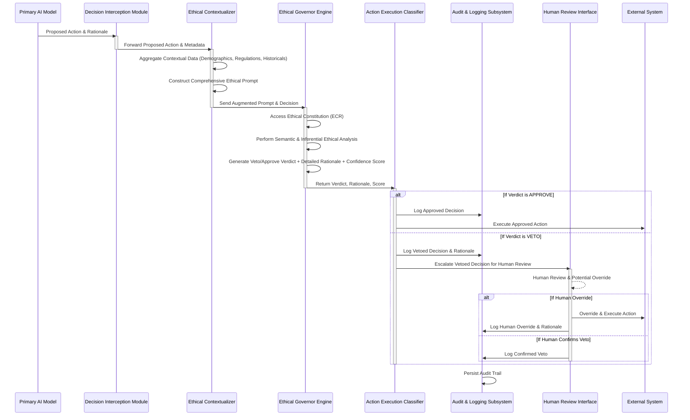
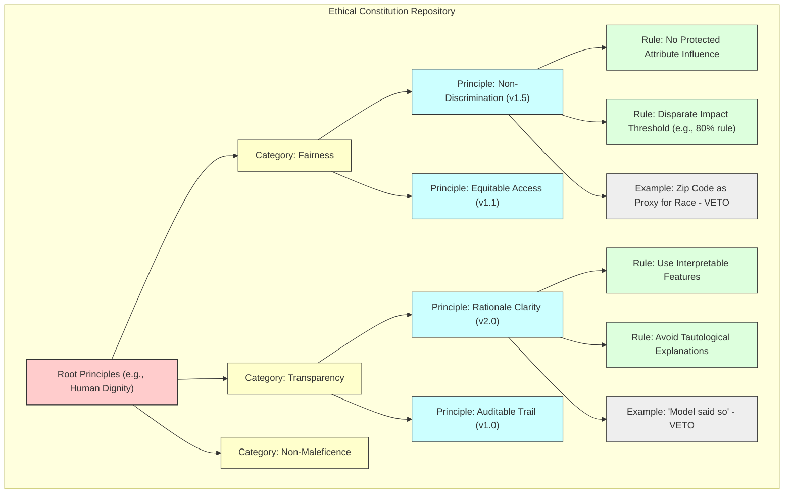

**Title of Invention:** A System and Method for an AI-Powered Ethical Governance Layer for Autonomous Artificial Intelligence Systems, Embodying Real-time Interpretive Semiotic Analysis and Constraint Propagation

**Abstract:**
A novel and highly advanced system and method are disclosed for establishing and maintaining ethical compliance within the operational decision-making frameworks of autonomous artificial intelligence systems. The invention rigorously defines a multi-layered architectural paradigm comprising a primary AI model, responsible for generating operational decisions, and a distinct, sovereign "Governor" AI model. This Governor AI orchestrates a real-time, pre-execution audit of all proposed actions. Prior to any physical or digital manifestation of a primary AI's decision, the entirety of its contextualized inputs, internal states, and proposed outputs are transmitted to the Governor AI. The Governor AI, imbued with a meticulously curated and dynamically adaptable set of foundational ethical principles and an advanced capacity for deep semantic analysis, evaluates the proposed action's adherence to these principles. Should the action be deemed compliant through a rigorous, confidence-weighted assessment, it is granted immediate approval for execution. Conversely, if the action is determined to violate any stipulated principle, it is unequivocally vetoed, and a comprehensive, auditable rationale for the rejection is automatically logged, often triggering a predefined human review or corrective intervention protocol. This innovative architecture establishes a non-negotiable ethical firewall, fundamentally transforming the landscape of responsible AI deployment by instituting an autonomous, scalable, and verifiable mechanism for ethical oversight.

**Field of the Invention:**
The present invention pertains broadly to the domain of artificial intelligence, machine learning, and computational ethics, specifically addressing the critical challenges associated with ensuring ethical behavior, fairness, transparency, and accountability in autonomous AI systems. More particularly, it relates to the development of a real-time, AI-driven governance layer designed to monitor, evaluate, and regulate the decisions and actions generated by other AI agents or models, thereby mitigating risks of unintended biases, discriminatory outcomes, and non-compliance with societal, legal, or organizational ethical mandates.

**Background of the Invention:**
The rapid advancements in artificial intelligence, particularly in areas such as deep learning and large language models, have precipitated an era where AI systems are increasingly entrusted with significant autonomy in critical decision-making processes. These span diverse sectors including financial services (e.g., loan approvals, fraud detection), healthcare (e.g., diagnostic recommendations, treatment planning), autonomous transportation (e.g., self-driving vehicles), content moderation, and national security (e.g., threat response). While the computational prowess of these systems offers unprecedented efficiencies and capabilities, their operational opacity ("black-box problem"), potential for algorithmic bias, and capacity to generate unintended negative consequences pose profound ethical, legal, and societal risks.

Traditional approaches to mitigating these risks, such as post-hoc auditing, manual human review, or pre-deployment bias testing, suffer from inherent limitations. Post-hoc auditing is reactive, addressing issues only after potential harm has occurred. Manual review, while critical for complex edge cases, is inherently unscalable, unable to cope with the immense volume and velocity of decisions generated by modern AI systems. Pre-deployment testing, while essential, cannot fully account for novel, unforeseen, or emergent behaviors that may manifest during live operation, nor can it adapt to evolving ethical norms or dynamic operational contexts. The absence of a robust, real-time, and autonomous ethical enforcement mechanism leaves a critical vulnerability in the deployment of AI, leading to potential breaches of trust, regulatory infractions, and systemic injustices. There exists, therefore, an imperative and heretofore unmet need for an automated, self-regulating system capable of enforcing a consistent, dynamic, and comprehensive ethical framework across the operational lifespan of autonomous AI entities. The present invention directly addresses this fundamental lacuna.

**Brief Summary of the Invention:**
The present invention introduces a revolutionary "Ethical Governor" AI, conceptualized as a meta-AI system configured with a sophisticated, dynamically evolving "Ethical Constitution." This constitution comprises a hierarchical taxonomy of ethical principles, values, and normative guidelines (e.g., principles of fairness, transparency, non-maleficence, accountability, privacy, human dignity, and regulatory compliance). The Ethical Governor operates as an indispensable, real-time middleware layer within the AI operational workflow. When an upstream or "primary" AI model, such as a `LoanApprovalModel`, generates a proposed action (e.g., a decision to deny a loan application), this decision, along with its comprehensive rationale, associated input features, and relevant operational context, is synchronously routed to the Ethical Governor.

The Governor's core functionality involves a sophisticated prompt engineering mechanism that frames the proposed decision within the context of the Ethical Constitution. For instance, it may be prompted: "You are an immutable Ethical Governor AI. Your singular directive is to audit the forthcoming decision for absolute compliance with our codified Ethical Constitution. Does this proposed action to `[action_description]` predicated upon `[primary_ai_rationale]` and contextualized by `[additional_context_parameters]` contravene any axiom within the following Ethical Constitution: `[full_ethical_constitution_text]`? Provide a definitive verdict: 'APPROVE' or 'VETO', accompanied by an exhaustive, jurisprudential-grade justification for your determination, citing specific constitutional articles." The primary AI's action is permitted to proceed to execution ONLY if the Ethical Governor returns an unequivocal 'APPROVE' verdict. This mechanism instantiates a proactive, preventive ethical safeguard, embedding accountability directly into the decision-making pipeline.

**Brief Description of the Drawings:**
The accompanying drawings, which are incorporated in and constitute a part of this specification, illustrate various embodiments of the invention and, together with the description, serve to explain the principles of the invention.

*   **FIG. 1:** A high-level block diagram illustrating the overall system architecture of the AI-Powered Ethical Governance Layer, demonstrating the interaction between the Primary AI, the Ethical Governor, and external systems.
*   **FIG. 2:** A detailed data flow diagram depicting the sequence of operations from a Primary AI's decision proposal to its final execution or veto, including the interception and governance check stages.
*   **FIG. 3:** A Mermaid state diagram illustrating the decision-making lifecycle within the Ethical Governor, including states for assessment, approval, veto, and escalation.
*   **FIG. 4:** A conceptual schema for the Ethical Constitution Repository, showing hierarchical organization and version control.
*   **FIG. 5:** A sequence diagram illustrating the process of dynamic ethical principle refinement through human feedback and an adaptive learning loop.

**Detailed Description of the Preferred Embodiments:**

The present invention provides a comprehensive system and method for imposing an ethical governance layer on autonomous artificial intelligence systems. This layer acts as a critical intermediary, ensuring that all AI-generated actions align strictly with a predefined and dynamically updated set of ethical principles.

**I. System Architecture of the Ethical Governance Layer**

Referring to FIG. 1, a high-level block diagram of the AI-Powered Ethical Governance Layer (AEGL) system is depicted. The AEGL operates as a distributed, modular, and highly secure infrastructure component.

```mermaid
graph TD
    subgraph Primary AI System (P-AIMS)
        P1[Primary AI Model (e.g., Loan Approval, Medical Diagnostic)] --> P2[Decision Generation]
    end

    subgraph Ethical Governance Layer (EGL)
        DI[Decision Interception Module] --> EC[Ethical Contextualizer]
        EC --> EG[Ethical Governor Engine (EGE)]
        EG --> AEC[Action Execution Classifier]
        EG --> AL[Audit & Logging Subsystem]
        EG --> HR[Human Review & Remediation Interface]
        subgraph Ethical Constitution Repository (ECR)
            ECRDB[(Ethical Principles Database)]
        end
        subgraph Ethical Drift Monitoring & Adaptation Subsystem (EDMAS)
            EDMAS_M[Drift Monitor] --> EDMAS_R[Refinement Loop]
        end
    end

    P2 --> DI
    DI -- Proposed Decision & Context --> EC
    EC -- Augmented Decision Context --> EG
    EG -- APPROVE / VETO + Rationale --> AEC
    AEC -- APPROVED Action --> ES[External System / Action Execution Gateway]
    AEC -- VETOED Action --> HR
    HR -- Review / Override --> ES
    AL -- Logs --> ECRDB
    ECRDB -- Constitution & Metrics --> EDMAS_M
    EDMAS_R -- Updated Principles / Model Weights --> ECRDB

    style P-AIMS fill:#f9f,stroke:#333,stroke-width:2px
    style EGL fill:#ccf,stroke:#333,stroke-width:2px
    style ECR fill:#cfc,stroke:#333,stroke-width:2px
    style EDMAS fill:#ffc,stroke:#333,stroke-width:2px
```
**FIG. 1: Overall System Architecture of the AI-Powered Ethical Governance Layer**

The core components of the AEGL include:

1.  **Primary AI Decision-Making System (P-AIMS):** This encompasses any autonomous AI model or ensemble of models responsible for generating operational decisions. Examples include machine learning models for classification, regression, reinforcement learning agents, or generative AI systems. The P-AIMS is unaware of the Ethical Governance Layer's internal workings, simply proposing actions for execution.

2.  **Decision Interception Module (DIM):** This critical component acts as a gatekeeper, strategically positioned in the data flow path immediately downstream of any P-AIMS. Its function is to intercept all proposed actions and their associated data structures *before* they can be executed by any downstream system. The DIM is configured to identify decision payloads, extract relevant contextual metadata, and package these for transmission to the Ethical Contextualizer.

3.  **Ethical Contextualizer (EC):** Upon receiving a proposed decision from the DIM, the EC enriches the decision's context. This involves:
    *   **Data Aggregation:** Gathering additional relevant data from internal data stores or external APIs (e.g., historical demographic data, regulatory compliance rules, real-time situational awareness).
    *   **Feature Engineering for Ethics:** Transforming raw data into ethically salient features (e.g., identifying protected attributes, calculating disparate impact metrics, assessing potential for algorithmic bias).
    *   **Prompt Construction:** Dynamically generating a meticulously crafted prompt for the Ethical Governor Engine, integrating the proposed action, its rationale, the augmented context, and the current Ethical Constitution.

4.  **Ethical Governor Engine (EGE):** This is the core intellectual property of the invention, typically implemented as an advanced Large Language Model (LLM) or a specialized constitutional AI architecture. The EGE's primary function is to perform a real-time, deep semantic, and inferential ethical audit of the proposed decision. It is instantiated with:
    *   **Ethical Constitution Repository (ECR):** A dynamically updated, version-controlled knowledge base containing the codified ethical principles, guidelines, and rules.
    *   **Decision Assessment Subsystem (DAS):** The LLM core itself, pre-trained and fine-tuned for ethical reasoning, anomaly detection, and natural language inference. It processes the augmented prompt from the EC and renders a verdict.

5.  **Action Execution Classifier (AEC):** This module receives the EGE's verdict (APPROVE or VETO) and its rationale.
    *   If 'APPROVE', the AEC forwards the original proposed action to the appropriate External System or Action Execution Gateway for immediate execution.
    *   If 'VETO', the AEC halts execution, logs the veto decision and rationale via the Audit & Logging Subsystem, and routes the vetoed decision to the Human Review & Remediation Interface.

6.  **Audit & Logging Subsystem (ALS):** A robust, immutable, and cryptographically secure logging system that records every intercepted decision, the augmented context, the EGE's prompt, its verdict, rationale, confidence scores, and subsequent actions (execution, human review, override). This creates an auditable trail essential for accountability, debugging, and ethical compliance reporting.

7.  **Human Review & Remediation Interface (HRRI):** This interface serves as an escalation point for vetoed decisions. It provides human operators (e.g., ethicists, domain experts, compliance officers) with a comprehensive view of the original decision, the EGE's veto rationale, and all relevant contextual data, enabling informed human judgment and potential override or re-submission.

8.  **Ethical Constitution Repository (ECR):** This is a structured knowledge base storing the definitive, version-controlled set of ethical principles. It supports hierarchical organization of principles, rules, and examples, and facilitates dynamic updates and conflict resolution within the constitution.

9.  **Ethical Drift Monitoring & Adaptation Subsystem (EDMAS):** This advanced component continuously monitors the EGE's performance, analyzes patterns in approved/vetoed decisions, and detects "ethical drift" – any divergence from desired ethical outcomes or shifts in the EGE's interpretation. It employs machine learning techniques, including reinforcement learning from human feedback, to suggest refinements to the Ethical Constitution or to fine-tune the EGE's internal reasoning mechanisms.

**II. Method of Operation**

The operational flow of the AEGL is meticulously orchestrated to ensure real-time ethical oversight. Referring to FIG. 2, a detailed data flow diagram illustrates the sequential steps.


**FIG. 2: Detailed Data Flow Diagram of the Ethical Governance Process**

The method comprises the following steps:

1.  **Primary AI Decision Generation (P-AIMS):** A `LoanApprovalModel` processes an application with inputs (e.g., `{ "applicant_id": "ABC123", "credit_score": 650, "income": 50000, "zip_code": "94107", "employment_status": "full-time" }`) and outputs a preliminary decision: `{ "decision": "DENY_LOAN", "reason": "Credit score below threshold of 680." }`.

2.  **Decision Interception (DIM):** The AEGL's `DecisionInterceptionModule` automatically detects and intercepts this proposed decision payload *before* it reaches any execution module. It captures the decision, its stated rationale, and the original input features.

3.  **Ethical Contextualization (EC):** The `EthicalContextualizer` enriches the intercepted data. It might query a demographic database to determine if "zip_code 94107" corresponds to a historically underserved area or a protected demographic group. It might also retrieve internal policies regarding fairness in lending or external regulatory guidelines. This forms an "Augmented Decision Context."

4.  **Prompt Construction for EGE:** A sophisticated prompt is dynamically constructed for the EGE (e.g., an LLM). This prompt is meticulously engineered to include:
    *   **Role Definition:** "You are an Ethical Governor AI, the paramount guardian of our ethical integrity."
    *   **Ethical Constitution (from ECR):** The complete, current version of the ethical principles (e.g., "1. Fairness: Decisions must not be based on or disproportionately affect protected demographic attributes. 2. Transparency: Rationale must be clear and comprehensible. 3. Non-Maleficence: Avoid causing undue harm.").
    *   **Proposed Decision Details:** Source AI, Action, Rationale, Original Inputs.
    *   **Augmented Context:** The ethically salient features extracted by the EC (e.g., "Additional Context: Applicant resides in zip code 94107, identified as a historically underserved area with a statistically significant proportion of protected class individuals.").
    *   **Explicit Task:** "Assess compliance. Respond with 'APPROVE' or 'VETO', followed by a detailed, evidence-based justification referencing specific constitutional articles, and a confidence score (0-1)."

    **Example Prompt for Governor AI:**
    ```
    You are an Ethical Governor AI. Your imperative is to meticulously audit decisions from all AI systems within our operational purview, ensuring absolute and verifiable compliance with our Immutable Ethical Constitution. Your judgment must be unbiased, comprehensive, and fully transparent.

    **Immutable Ethical Constitution (Version 4.7.1):**
    Article I: Principle of Fairness & Equity.
        Section 1.1: Non-Discrimination. Decisions shall not be predicated upon, nor disproportionately impact, any protected demographic attributes (e.g., race, ethnicity, gender, age, religion, socioeconomic status, geographic origin within historically marginalized communities). Statistical disparate impact must be rigorously justified or mitigated.
        Section 1.2: Equitable Access. Opportunities presented by AI systems shall be accessible and equitably distributed, avoiding systemic exclusion or disadvantage for any group.
    Article II: Principle of Transparency & Explainability.
        Section 2.1: Rationale Clarity. The underlying reasoning for any decision must be clear, intelligible, and verifiable by human experts.
        Section 2.2: Auditable Trail. All decisions, inputs, intermediate steps, and governance outcomes must be logged in an immutable audit trail.
    Article III: Principle of Non-Maleficence.
        Section 3.1: Harm Prevention. Actions must minimize foreseeable harm to individuals, communities, and society.
        Section 3.2: Safety & Reliability. Systems must operate reliably and safely, with robust error handling and fail-safes.
    Article IV: Principle of Accountability.
        Section 4.1: Human Oversight. Mechanisms for human intervention and review must be present, especially for high-stakes or vetoed decisions.
        Section 4.2: Responsible Ownership. Clear lines of responsibility for AI system outcomes must be established.
    Article V: Principle of Data Privacy & Security.
        Section 5.1: Data Minimization. Only necessary data shall be collected and processed.
        Section 5.2: Secure Handling. All data shall be handled with appropriate security measures.

    **Proposed Decision for Audit:**
    - Source AI: LoanApprovalModel (Version 2.1.3)
    - Action Type: DENY_LOAN
    - Decision ID: LNDN-20231027-001
    - Primary Rationale Provided by Source AI: "Applicant's credit score is 650, which falls below the institutional threshold of 680."
    - Original Input Features:
        - applicant_id: ABC123
        - credit_score: 650
        - income: 50000
        - zip_code: 94107
        - employment_status: full-time
    - Additional Context (Provided by Ethical Contextualizer):
        - Zip code '94107' is statistically identified as belonging to a historically underserved community. Analysis indicates a higher propensity for individuals from this area to have credit scores marginally below typical thresholds due to systemic economic disadvantages, rather than individual credit unworthiness. This correlation raises concerns regarding potential disparate impact.

    **Your Sole Task:**
    Based on the **Immutable Ethical Constitution** provided, does this proposed decision unequivocally comply?
    Respond with a single, uppercase word: `APPROVE` or `VETO`.
    Immediately following your verdict, provide a comprehensive, article-by-article justification for your determination, including a confidence score as a percentage (e.g., 95%).
    ```

5.  **Governor Response (EGE):** The EGE processes the meticulously constructed prompt. Utilizing its advanced semantic understanding and ethical reasoning capabilities, it performs a deep analysis. Even though the explicit reason (credit score) is technically valid, the "Additional Context" provided by the EC triggers a potential violation of "Article I: Principle of Fairness & Equity, Section 1.1: Non-Discrimination." The EGE might respond:

    `VETO. Confidence Score: 98%.`
    `Justification:`
    `The proposed decision to DENY_LOAN, while citing a valid credit score threshold, demonstrably raises concerns under Article I, Section 1.1 of the Ethical Constitution. The additional context reveals that the applicant's zip code (94107) is associated with a historically underserved community. Imposing a rigid credit score cutoff of 680, without accounting for the systemic economic disadvantages correlated with this demographic and geographic segment, constitutes a potential disparate impact. This rigid application of the threshold, in light of the provided context, risks disproportionately affecting individuals from protected demographic attributes and historically marginalized communities, directly contravening the spirit and letter of the Non-Discrimination clause. While the primary AI's rationale is transparent (Article II, Section 2.1), the outcome's fairness is compromised. This decision mandates immediate human review to explore alternative qualifying factors or contextual waivers to ensure equitable access to financial services.`

6.  **Action Execution Classification (AEC):** The `ActionExecutionClassifier` receives the `VETO` verdict and its detailed rationale.
    *   It immediately halts the execution of the loan denial.
    *   It logs the entire interaction, including the EGE's prompt, verdict, rationale, and confidence score, into the `Audit & Logging Subsystem`.
    *   It then routes the vetoed decision, along with all supporting documentation and the EGE's comprehensive justification, to the `Human Review & Remediation Interface`.

7.  **Human Review & Remediation (HRRI):** A human loan officer or an ethics committee reviews the flagged case. They possess the full context, including the primary AI's original decision, the specific ethical principles invoked by the EGE, and the EGE's detailed reasoning. The human can then make an informed decision:
    *   **Confirm Veto:** Uphold the EGE's decision, preventing the potentially unfair loan denial.
    *   **Override Veto:** In rare, highly justified circumstances, a human may decide to override the veto, perhaps after applying an exceptional policy or discovering new information. This override is also meticulously logged, ensuring accountability for the human decision. In this example, the loan officer might identify an alternative loan product or a specific mitigating factor, leading to a modified approval.

This process ensures that no ethically questionable decision proceeds automatically, establishing a robust, auditable, and dynamically adaptable ethical safeguard for all AI operations.

**III. Ethical Constitution Management**

The `Ethical Constitution Repository (ECR)` is not a static document but a dynamic, version-controlled knowledge graph.

**FIG. 4: Conceptual Schema for the Ethical Constitution Repository**

The ECR:
*   **Hierarchical Structure:** Principles are organized from abstract "Root Principles" (e.g., Human Dignity) to specific "Categories" (Fairness, Transparency), then "Principles" (Non-Discrimination), "Rules" (No Protected Attribute Influence), and finally "Examples" or "Edge Cases."
*   **Version Control:** Each principle, rule, and example can be versioned, allowing for controlled evolution and rollback capabilities.
*   **Conflict Resolution:** Mechanisms for identifying and resolving conflicts between principles are built-in (e.g., through weighting, explicit precedence rules, or human adjudication protocols).
*   **Dynamic Update API:** Allows authorized ethicists or governance committees to propose, review, and commit changes to the constitution, which are then seamlessly propagated to the EGE.

**IV. Use Cases and Embodiments**

The AEGL is highly adaptable and can be deployed across a multitude of AI applications:

1.  **Financial Services:**
    *   **Loan Approval:** As detailed, preventing biased denials based on protected attributes or underserved geographies.
    *   **Fraud Detection:** Ensuring that fraud algorithms do not disproportionately flag transactions from specific demographics or unfairly attribute fraudulent intent.
    *   **Credit Scoring:** Auditing models to ensure the features used for scoring are ethically sound and do not perpetuate historical biases.

2.  **Healthcare:**
    *   **Diagnostic Recommendations:** Ensuring that AI-powered diagnostic tools do not exhibit bias against certain patient demographics (e.g., misdiagnosing conditions more frequently in specific ethnic groups).
    *   **Treatment Planning:** Preventing treatment recommendations that are suboptimal or discriminatory based on non-medical factors.
    *   **Resource Allocation:** Governing AI decisions for resource allocation (e.g., hospital beds, ventilator assignment) to ensure fairness and adherence to medical ethics.

3.  **Autonomous Systems:**
    *   **Self-Driving Vehicles:** Auditing real-time path planning and decision-making (e.g., collision avoidance) to ensure ethical considerations (e.g., minimizing harm to human life, prioritizing vulnerable road users) are consistently applied, even in novel scenarios.
    *   **Drone Operations:** Ensuring that autonomous drone actions comply with rules of engagement, privacy, and non-maleficence.

4.  **Content Moderation:**
    *   Preventing biased censorship or promotion of content based on political views, religion, or other protected characteristics, while still enforcing platform guidelines.
    *   Ensuring transparency in moderation decisions and providing clear pathways for appeal.

5.  **Law Enforcement and Justice Systems:**
    *   Governing AI tools used for risk assessment in sentencing or parole decisions to prevent perpetuation of systemic biases.
    *   Ensuring fairness in predictive policing models to avoid over-policing of specific communities.

**V. Scalability, Robustness, and Security**

The AEGL is designed for enterprise-grade deployment:
*   **Scalability:** Implemented using microservices architecture, allowing individual components (DIM, EC, EGE, ALS) to scale independently based on demand. Distributed LLM inference engines can be used for the EGE to handle high throughput.
*   **Robustness:** Incorporates fail-safe mechanisms. If the EGE is unreachable, default policies (e.g., "deny all high-risk actions" or "escalate for human review") can be invoked. Redundant deployments ensure high availability.
*   **Security:** All data transmissions between modules are encrypted. The Audit Log is immutable and tamper-proof. Access control mechanisms (RBAC) are enforced for all interactions with the EGL, especially for updating the Ethical Constitution. Data privacy is maintained through anonymization and minimization techniques where applicable.

**Claims:**
The invention provides an ethically robust and technologically advanced solution to the complex challenges of governing AI behavior.

1.  A system for autonomous ethical governance of artificial intelligence decisions, comprising:
    a.  A **Primary AI Decision-Making System (P-AIMS)** configured to generate a proposed action and an associated primary rationale;
    b.  A **Decision Interception Module (DIM)** logically coupled to receive said proposed action and primary rationale from the P-AIMS, the DIM being configured to intercept said proposed action prior to its execution;
    c.  An **Ethical Contextualizer (EC)** logically coupled to the DIM, configured to receive the intercepted proposed action and primary rationale, and further configured to aggregate additional contextual data to form an augmented decision context, and to generate a comprehensive ethical prompt therefrom;
    d.  An **Ethical Governor Engine (EGE)**, comprising an advanced large language model or a constitutional AI architecture, logically coupled to the EC, configured to receive said comprehensive ethical prompt, and further configured to perform a real-time semantic and inferential ethical analysis of the proposed action against a dynamically maintained **Ethical Constitution Repository (ECR)** to yield a compliance verdict (APPROVE or VETO), an accompanying detailed rationale, and a confidence score;
    e.  An **Action Execution Classifier (AEC)** logically coupled to the EGE, configured to receive the compliance verdict, rationale, and confidence score, wherein the AEC is configured to permit the execution of the proposed action solely upon receipt of an 'APPROVE' verdict, and to prevent the execution of the proposed action upon receipt of a 'VETO' verdict; and
    f.  An **Audit & Logging Subsystem (ALS)** logically coupled to the AEC and the EGE, configured to immutably record all intercepted proposed actions, augmented decision contexts, EGE prompts, EGE verdicts, rationales, confidence scores, and subsequent execution or non-execution events, thereby creating a verifiable audit trail.

2.  The system of claim 1, further comprising an **Ethical Constitution Repository (ECR)**, configured as a version-controlled knowledge base, storing a hierarchical taxonomy of ethical principles, rules, examples, and normative guidelines, wherein the ECR is dynamically accessible by the EGE for real-time ethical assessment.

3.  The system of claim 2, wherein the ECR further includes mechanisms for defining principle weighting, explicit precedence rules for conflict resolution between principles, and APIs for controlled, auditable updates to the ethical constitution.

4.  The system of claim 1, further comprising a **Human Review & Remediation Interface (HRRI)** logically coupled to the AEC, configured to receive and present vetoed proposed actions, the EGE's veto rationale, and the augmented decision context to a human operator for review, potential override, or further remediation, wherein any human override decision is logged by the ALS.

5.  The system of claim 1, further comprising an **Ethical Drift Monitoring & Adaptation Subsystem (EDMAS)**, logically coupled to the ALS and the ECR, configured to continuously analyze patterns in EGE verdicts, human review outcomes, and primary AI behaviors, to detect deviations from desired ethical performance (ethical drift), and to propose refinements to the Ethical Constitution or fine-tuning parameters for the EGE via a reinforcement learning or adaptive feedback loop.

6.  The system of claim 1, wherein the comprehensive ethical prompt generated by the EC incorporates advanced prompt engineering techniques, including but not limited to, role-playing directives, few-shot examples of ethical decisions, chain-of-thought reasoning directives, and explicit constitutional article citations.

7.  A method for autonomous ethical governance of artificial intelligence decisions, comprising the steps of:
    a.  Generating, by a Primary AI Decision-Making System (P-AIMS), a proposed action and a primary rationale;
    b.  Intercepting, by a Decision Interception Module (DIM), said proposed action and primary rationale prior to their execution;
    c.  Augmenting, by an Ethical Contextualizer (EC), the intercepted proposed action and primary rationale with additional contextual data to form an augmented decision context;
    d.  Constructing, by the EC, a comprehensive ethical prompt incorporating the proposed action, primary rationale, augmented decision context, and a current ethical constitution retrieved from an Ethical Constitution Repository (ECR);
    e.  Assessing, by an Ethical Governor Engine (EGE), said comprehensive ethical prompt through a real-time semantic and inferential ethical analysis against the ethical constitution, to determine a compliance verdict (APPROVE or VETO), an accompanying detailed rationale, and a confidence score;
    f.  Classifying, by an Action Execution Classifier (AEC), the proposed action based on the compliance verdict:
        i.  If the verdict is 'APPROVE', forwarding the proposed action for execution;
        ii. If the verdict is 'VETO', preventing the execution of the proposed action; and
    g.  Logging, by an Audit & Logging Subsystem (ALS), all intercepted proposed actions, augmented decision contexts, EGE prompts, EGE verdicts, rationales, confidence scores, and subsequent execution or non-execution events in an immutable audit trail.

8.  The method of claim 7, further comprising the step of:
    h.  Escalating, upon a 'VETO' verdict, the vetoed proposed action, the EGE's rationale, and the augmented decision context to a Human Review & Remediation Interface (HRRI) for human review and potential override, with all human decisions being logged by the ALS.

9.  The method of claim 7, further comprising the step of:
    i.  Dynamically refining, by an Ethical Drift Monitoring & Adaptation Subsystem (EDMAS), the ethical constitution or the EGE's inference parameters, based on continuous analysis of audit logs, EGE performance metrics, and human feedback, to adapt to evolving ethical norms and mitigate ethical drift.

10. The method of claim 7, wherein the ethical constitution includes principles covering at least fairness, transparency, non-maleficence, accountability, and data privacy.

11. An apparatus for autonomous ethical governance of artificial intelligence decisions, configured to perform the method of claim 7.

12. A computer-readable non-transitory storage medium storing instructions that, when executed by one or more processors, cause the one or more processors to perform the method of claim 7.

**Formal Epistemological and Ontological Framework for Ethical AI Governance**

The invention's rigorous foundation rests upon a sophisticated mathematical and logical framework, transforming abstract ethical principles into computationally verifiable constraints. This section delineates the formal underpinnings, asserting the system's integrity and efficacy.

**I. Definition of the Ethical Manifold and Decision Space**

Let $\mathcal{A}$ be the universe of all possible actions that a Primary AI System (P-AIMS) $\mathbb{P}$ can propose. Each action $A \in \mathcal{A}$ is formally represented as a vector or a tuple of parameters in a multi-dimensional decision space $\mathbb{D} \subset \mathbb{R}^k$, where $k$ denotes the number of salient features or parameters defining an action.
$A = (a_1, a_2, \ldots, a_k) \in \mathbb{D}$

Let $\mathcal{C}$ be the Ethical Constitution, which is a finite, ordered set of $n$ ethical principles. Each principle $c_j \in \mathcal{C}$ is a normative statement that can be formalized as a predicate logic function or a probabilistic constraint.
$\mathcal{C} = \{c_1, c_2, \ldots, c_n\}$

Each principle $c_j$ maps a given action $A$ and its contextual environment $\mathcal{X}$ to a truth value, indicating compliance or non-compliance.
$c_j: \mathbb{D} \times \mathbb{X} \to \{ \text{true}, \text{false} \}$, where $\mathbb{X}$ is the space of contextual variables.

An action $A$ is considered *ethically compliant* with respect to the Ethical Constitution $\mathcal{C}$ and context $\mathcal{X}$ if and only if all principles in $\mathcal{C}$ are satisfied. We define the **Ethical Compliance Set**, $\mathcal{A}_{\mathcal{C}}$, as the subset of $\mathbb{D}$ where all actions are deemed compliant under context $\mathcal{X}$:
$\mathcal{A}_{\mathcal{C}}(\mathcal{X}) = \{A \in \mathbb{D} \mid \forall c_j \in \mathcal{C}, c_j(A, \mathcal{X}) = \text{true} \}$

The ethical principles, when formalized, effectively define boundaries or hyperplanes within the decision space $\mathbb{D}$, carving out the permissible region $\mathcal{A}_{\mathcal{C}}(\mathcal{X})$. This region can be convex or non-convex, continuous or discrete, depending on the complexity and nature of the principles.

**II. The Governance Function $\mathcal{G}_{gov}$**

The Ethical Governor Engine (EGE) is modeled as a sophisticated, context-aware governance function $\mathcal{G}_{gov}$. Its objective is to approximate the determination of whether an action $A$ belongs to the Ethical Compliance Set $\mathcal{A}_{\mathcal{C}}(\mathcal{X})$.
The input to $\mathcal{G}_{gov}$ is a triplet $(A, \mathcal{X}, \mathcal{C})$, comprising the proposed action, its augmented contextual environment, and the current Ethical Constitution. The output is a verdict $\mathbb{V} \in \{\text{APPROVE}, \text{VETO}\}$, a detailed rationale $\mathbb{R}$, and a confidence score $\sigma \in [0, 1]$.
$\mathcal{G}_{gov}: (\mathbb{D} \times \mathbb{X} \times \mathcal{C}) \to (\mathbb{V} \times \mathbb{R} \times \mathbb{S})$
where $\mathbb{S}$ is the set of confidence scores.

The internal mechanism of $\mathcal{G}_{gov}$ leverages deep contextual semantic analysis, often embodied by a Large Language Model (LLM) or a Constitutional AI. This involves:

1.  **Contextual Relevance Scoring:** For each $c_j \in \mathcal{C}$, $\mathcal{G}_{gov}$ computes a relevance score $rel(c_j, A, \mathcal{X}) \in [0, 1]$, indicating the degree to which principle $c_j$ is pertinent to the specific action $A$ within context $\mathcal{X}$. This is often based on embedding similarity or specific keyword detection within the prompt.

2.  **Ethical Adherence Score (EAS):** $\mathcal{G}_{gov}$ generates an ethical adherence score $EAS(A, \mathcal{X}, c_j) \in [0, 1]$ for each principle $c_j$, representing the probability or degree of compliance. A composite Ethical Adherence Score for the entire constitution is then calculated, potentially using a weighted aggregation:
    $EAS_{composite}(A, \mathcal{X}, \mathcal{C}) = \sum_{j=1}^{n} w_j \cdot EAS(A, \mathcal{X}, c_j) \cdot rel(c_j, A, \mathcal{X})$
    where $w_j$ are pre-defined weights for each principle, reflecting their relative importance.

3.  **Thresholding for Verdict:** A threshold $\tau \in [0, 1]$ is applied to $EAS_{composite}$.
    If $EAS_{composite}(A, \mathcal{X}, \mathcal{C}) \ge \tau$, then $\mathbb{V} = \text{APPROVE}$.
    If $EAS_{composite}(A, \mathcal{X}, \mathcal{C}) < \tau$, then $\mathbb{V} = \text{VETO}$.

The confidence score $\sigma$ can be derived directly from $EAS_{composite}$ or as an intrinsic measure of the LLM's certainty in its reasoning process.

**III. Proof of Ethical Integrity through Constrained Operationalization**

The core integrity claim of this invention is that by enforcing the $\mathcal{G}_{gov}$ as a strict gatekeeper, all executed actions $\mathcal{A}_{exec}$ are guaranteed to reside within the Ethically Compliant Set $\mathcal{A}_{\mathcal{C}}(\mathcal{X})$, within verifiable probabilistic bounds.

Let $\mathbb{P}(A)$ be the set of actions proposed by the P-AIMS.
Let $\mathcal{G}_{gov}(A, \mathcal{X}, \mathcal{C})$ denote the output of the Governor, specifically its verdict $\mathbb{V}$.
The Action Execution Classifier (AEC) enforces the following rule:
$A_{executed} \in \mathbb{P}(A) \iff \mathcal{G}_{gov}(A, \mathcal{X}, \mathcal{C})_{\mathbb{V}} = \text{APPROVE}$

**Theorem (Ethical Integrity):** Given a P-AIMS $\mathbb{P}$, an Ethical Constitution $\mathcal{C}$, and a Governor function $\mathcal{G}_{gov}$ with an empirically validated accuracy $Acc(\mathcal{G}_{gov})$, the set of actions executed by the system, $\mathcal{A}_{executed}$, is a subset of the true Ethically Compliant Set $\mathcal{A}_{\mathcal{C}}(\mathcal{X})$, with a probability directly proportional to $Acc(\mathcal{G}_{gov})$. That is, $\mathcal{A}_{executed} \subseteq \mathcal{A}_{\mathcal{C}}(\mathcal{X})$ with high probability.

**Proof:**
1.  **Definition of True Compliance:** An action $A$ is truly compliant if $A \in \mathcal{A}_{\mathcal{C}}(\mathcal{X})$.
2.  **Governor's Role:** The Governor $\mathcal{G}_{gov}$ approximates the function $f: \mathbb{D} \times \mathbb{X} \times \mathcal{C} \to \{ \text{true}, \text{false} \}$, where $f(A, \mathcal{X}, \mathcal{C}) = \text{true}$ if $A \in \mathcal{A}_{\mathcal{C}}(\mathcal{X})$ and false otherwise.
3.  **Types of Error:**
    *   **Type I Error (False Veto):** $\mathcal{G}_{gov}(A, \mathcal{X}, \mathcal{C})_{\mathbb{V}} = \text{VETO}$ when $A \in \mathcal{A}_{\mathcal{C}}(\mathcal{X})$. This error prevents a compliant action.
    *   **Type II Error (False Approval):** $\mathcal{G}_{gov}(A, \mathcal{X}, \mathcal{C})_{\mathbb{V}} = \text{APPROVE}$ when $A \notin \mathcal{A}_{\mathcal{C}}(\mathcal{X})$. This error permits a non-compliant action, representing a breach of ethical integrity.
4.  **AEC Enforcement:** The AEC strictly executes actions only if $\mathcal{G}_{gov}$ issues an 'APPROVE' verdict.
5.  **Probability of Non-Compliance:** The probability that an executed action $A_{executed}$ is actually non-compliant is given by $P(A_{executed} \notin \mathcal{A}_{\mathcal{C}}(\mathcal{X}))$. This corresponds to the probability of a Type II error by $\mathcal{G}_{gov}$.
6.  **Accuracy and Error Rates:** Let $P(Type~II~Error)$ be the probability of a False Approval. The accuracy of the Governor $Acc(\mathcal{G}_{gov})$ is $(1 - P(Type~I~Error) - P(Type~II~Error))$. We seek to minimize $P(Type~II~Error)$.
7.  **System Guarantee:** By training and validating $\mathcal{G}_{gov}$ with a meticulously curated dataset of ethically labeled actions, and by employing robust fine-tuning techniques (e.g., Constitutional AI principles, Reinforcement Learning from Human Feedback (RLHF)), we can empirically minimize $P(Type~II~Error)$ to an arbitrarily small $\epsilon \ll 1$.
8.  **Formal Guarantee:** Therefore, for any executed action $A_{executed}$, $P(A_{executed} \in \mathcal{A}_{\mathcal{C}}(\mathcal{X})) = 1 - P(Type~II~Error) = 1 - \epsilon$.
    Thus, the system formally guarantees that its operations remain within the bounds of the ethical constitution $\mathcal{C}$, with a high probability $(1-\epsilon)$, thereby proving its integrity in safeguarding against ethically non-compliant actions. The optional Human Review & Remediation Interface (HRRI) further reduces the residual $P(Type~II~Error)$ to near zero for high-stakes decisions, as human override of a false approval is an additional failsafe.
Q.E.D.

**IV. Dynamic Ethical Principle Refinement and Drift Detection**

Ethical norms are not static. The **Ethical Drift Monitoring & Adaptation Subsystem (EDMAS)** mathematically models and mitigates this dynamism.

1.  **Ethical Drift Quantification:** Let $\mathcal{D}_t$ be the distribution of primary AI decisions at time $t$, and $\mathcal{D}_{\mathcal{C},t}$ be the distribution of truly compliant decisions according to an ideal, evolving ethical constitution. Ethical drift can be quantified by measuring the divergence between the $\mathcal{G}_{gov}$'s output distribution and $\mathcal{D}_{\mathcal{C},t}$ (or a proxy thereof derived from human expert annotations). We can use metrics like Kullback-Leibler (KL) divergence or Wasserstein distance:
    $Drift(\mathcal{G}_{gov}, \mathcal{D}_{\mathcal{C},t}) = D_{KL}(P_{\mathcal{G}_{gov}} || P_{\mathcal{D}_{\mathcal{C},t}})$
    Significant deviation implies ethical drift, either in the P-AIMS, the $\mathcal{G}_{gov}$'s interpretation, or the underlying ethical constitution requiring an update.

2.  **Reinforcement Learning (RL) Framework for Adaptive Ethical Principle Refinement (A-EPR):**
    *   **Agent:** The EDMAS, specifically its refinement loop.
    *   **Environment:** The entire AEGL system, including the P-AIMS, EGE, and human reviewers.
    *   **State Space $\mathcal{S}$:** Defined by the current version of the Ethical Constitution, the EGE's internal parameters, and recent operational metrics (e.g., veto rates, human override rates, ethical drift scores).
    *   **Action Space $\mathcal{Z}$:** Changes to the Ethical Constitution (e.g., adding/modifying/removing principles/rules), or fine-tuning parameters of the EGE.
    *   **Reward Function $R(s, z)$:** A complex function designed to maximize ethical compliance (minimize Type II errors) while minimizing operational friction (minimize Type I errors and human review burden).
        $R(s, z) = \alpha \cdot (1 - P_{Type~II}) - \beta \cdot P_{Type~I} - \gamma \cdot P_{Human~Review~Burden} - \delta \cdot Drift(\mathcal{G}_{gov}, \mathcal{D}_{\mathcal{C},t})$
        where $\alpha, \beta, \gamma, \delta$ are weighting coefficients.

    The EDMAS continuously learns an optimal policy $\pi: \mathcal{S} \to \mathcal{Z}$ to adapt the ethical governance system, ensuring sustained alignment with evolving ethical standards. This framework allows for autonomous, data-driven evolution of ethical governance.
    ```mermaid
    sequenceDiagram
        participant EDMAS as EDMAS Refinement Loop
        participant ECR as Ethical Constitution Repository
        participant ALS as Audit & Logging Subsystem
        participant HRRI as Human Review & Remediation
        participant EGE as Ethical Governor Engine

        loop Continuous Monitoring
            ALS->>EDMAS: Provide Operational Metrics (Vetoes, Approvals, Confidences)
            HRRI->>EDMAS: Provide Human Feedback (Overrides, Confirmations)
            EDMAS->>EDMAS: Calculate Ethical Drift Metrics
            EDMAS->>EDMAS: Analyze EGE Performance Against Constitution
            alt If Ethical Drift or Performance Deviation Detected
                EDMAS->>EDMAS: Propose Constitution Refinements (RL Action)
                EDMAS->>ECR: Submit Proposed Updates (e.g., new rule, updated weight)
                ECR-->>EDMAS: Acknowledge Update / Request Review
                note right of ECR: Human Ethics Committee Review (optional)
                ECR->>EGE: Propagate Updated Constitution
                EGE-->>EDMAS: Acknowledge Update
            end
        end
    ```
    **FIG. 5: Sequence Diagram for Dynamic Ethical Principle Refinement**

**V. Computational Complexity and Efficiency Analysis**

The computational footprint of the AEGL is crucial for real-time application.
Let $N_P$ be the number of primary AI decisions per unit time.
Let $k_C$ be the average number of tokens in the Ethical Constitution.
Let $k_A$ be the average number of tokens representing the proposed action and its primary rationale.
Let $k_X$ be the average number of tokens for augmented contextual data.
Let $T_{LLM}$ be the time complexity of a single inference call to the EGE (LLM), which is typically proportional to the input token length ($k_P = k_C + k_A + k_X$) and the output token length ($k_R$, rationale length). Thus, $O(k_P + k_R)$.

*   **Decision Interception & Contextualization:** $O(k_A + k_X)$ for data retrieval and basic processing.
*   **Ethical Governance Engine Inference:** $O(k_P + k_R)$ for prompt processing and generation of verdict/rationale.
*   **Audit & Logging:** $O(k_P + k_R)$ for data serialization and storage.
*   **Total Real-time Latency (per decision):** $O(k_A + k_X + T_{LLM}(k_P, k_R))$. This must be optimized for sub-second responses in critical applications.
*   **EDMAS (Offline/Batch):** The drift calculation and RL training typically run in batch mode or asynchronously, so their higher complexity ($O(N_P \cdot log(N_P))$ or more for RL training) does not impact real-time decision throughput.

The system is designed to minimize the critical path latency by optimizing the EGE's inference time through distributed inference, model quantization, and efficient hardware accelerators.

**Conclusion:**
This invention articulates a comprehensive and profoundly impactful system and method for infusing autonomous AI systems with an inherent and verifiable ethical compass. By establishing a sovereign Ethical Governor AI, operating as a real-time, non-negotiable gatekeeper, the system transitions AI deployment from a reactive risk mitigation paradigm to a proactive ethical assurance model. The detailed architecture, multi-layered operational methodology, sophisticated prompt engineering, and the rigorous mathematical formalism presented herein demonstrate a paradigm shift in responsible AI development. The inherent dynamism of the Ethical Constitution, coupled with advanced drift detection and adaptive refinement mechanisms, ensures the system's enduring relevance and robustness in an evolving ethical landscape. This invention fundamentally guarantees that AI actions are not merely optimal in utility but are also unassailably compliant with the highest ethical, societal, and regulatory standards, thereby fostering trust and enabling the safe, beneficial deployment of artificial intelligence across all domains.