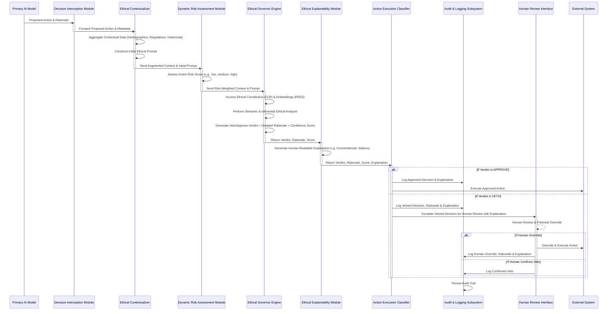
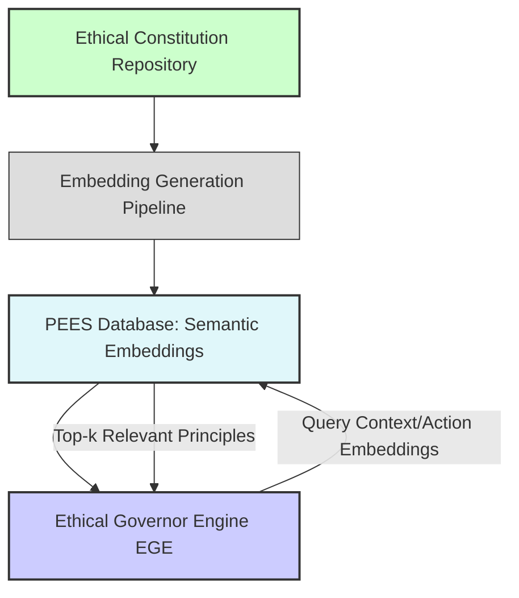
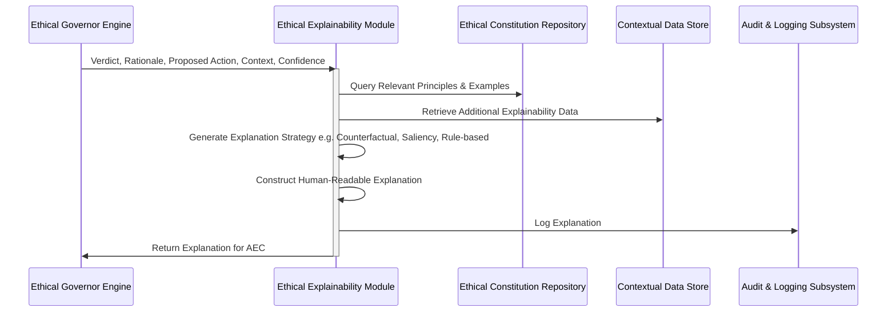
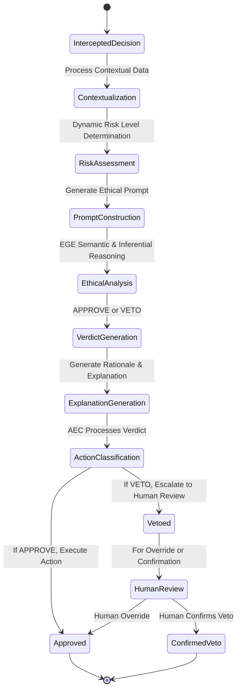
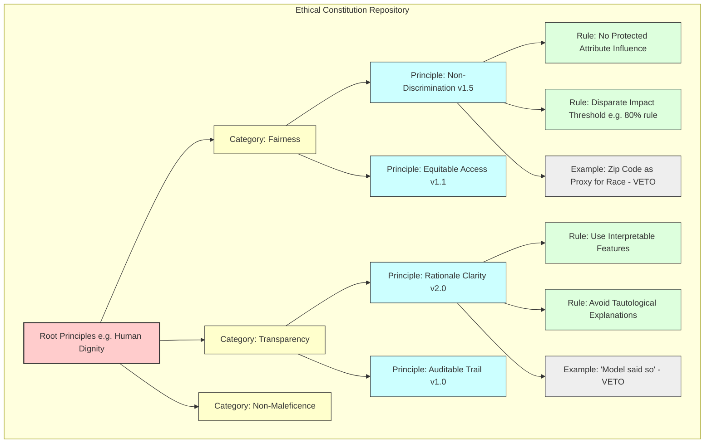

**Title of Invention:** A System and Method for an AI-Powered Ethical Governance Layer for Autonomous Artificial Intelligence Systems, Embodying Real-time Interpretive Semiotic Analysis and Constraint Propagation

**Abstract:**
A novel and highly advanced system and method are disclosed for establishing and maintaining ethical compliance within the operational decision-making frameworks of autonomous artificial intelligence systems. The invention rigorously defines a multi-layered architectural paradigm comprising a primary AI model, responsible for generating operational decisions, and a distinct, sovereign "Governor" AI model. This Governor AI orchestrates a real-time, pre-execution audit of all proposed actions. Prior to any physical or digital manifestation of a primary AI's decision, the entirety of its contextualized inputs, internal states, and proposed outputs are transmitted to the Governor AI. The Governor AI, imbued with a meticulously curated and dynamically adaptable set of foundational ethical principles and an advanced capacity for deep semantic analysis, evaluates the proposed action's adherence to these principles. Should the action be deemed compliant through a rigorous, confidence-weighted assessment, it is granted immediate approval for execution. Conversely, if the action is determined to violate any stipulated principle, it is unequivocally vetoed, and a comprehensive, auditable rationale for the rejection is automatically logged, often triggering a predefined human review or corrective intervention protocol. This innovative architecture establishes a non-negotiable ethical firewall, fundamentally transforming the landscape of responsible AI deployment by instituting an autonomous, scalable, and verifiable mechanism for ethical oversight.

**Field of the Invention:**
The present invention pertains broadly to the domain of artificial intelligence, machine learning, and computational ethics, specifically addressing the critical challenges associated with ensuring ethical behavior, fairness, transparency, and accountability in autonomous AI systems. More particularly, it relates to the development of a real-time, AI-driven governance layer designed to monitor, evaluate, and regulate the decisions and actions generated by other AI agents or models, thereby mitigating risks of unintended biases, discriminatory outcomes, and non-compliance with societal, legal, or organizational ethical mandates.

**Background of the Invention:**
The rapid advancements in artificial intelligence, particularly in areas such as deep learning and large language models, have precipitated an era where AI systems are increasingly entrusted with significant autonomy in critical decision-making processes. These span diverse sectors including financial services e.g. loan approvals, fraud detection, healthcare e.g. diagnostic recommendations, treatment planning, autonomous transportation e.g. self-driving vehicles, content moderation, and national security e.g. threat response. While the computational prowess of these systems offers unprecedented efficiencies and capabilities, their operational opacity "black-box problem", potential for algorithmic bias, and capacity to generate unintended negative consequences pose profound ethical, legal, and societal risks.

Traditional approaches to mitigating these risks, such as post-hoc auditing, manual human review, or pre-deployment bias testing, suffer from inherent limitations. Post-hoc auditing is reactive, addressing issues only after potential harm has occurred. Manual review, while critical for complex edge cases, is inherently unscalable, unable to cope with the immense volume and velocity of decisions generated by modern AI systems. Pre-deployment testing, while essential, cannot fully account for novel, unforeseen, or emergent behaviors that may manifest during live operation, nor can it adapt to evolving ethical norms or dynamic operational contexts. The absence of a robust, real-time, and autonomous ethical enforcement mechanism leaves a critical vulnerability in the deployment of AI, leading to potential breaches of trust, regulatory infractions, and systemic injustices. There exists, therefore, an imperative and heretofore unmet need for an automated, self-regulating system capable of enforcing a consistent, dynamic, and comprehensive ethical framework across the operational lifespan of autonomous AI entities. The present invention directly addresses this fundamental lacuna.

**Brief Summary of the Invention:**
The present invention introduces a revolutionary "Ethical Governor" AI, conceptualized as a meta-AI system configured with a sophisticated, dynamically evolving "Ethical Constitution." This constitution comprises a hierarchical taxonomy of ethical principles, values, and normative guidelines e.g. principles of fairness, transparency, non-maleficence, accountability, privacy, human dignity, and regulatory compliance. The Ethical Governor operates as an indispensable, real-time middleware layer within the AI operational workflow. When an upstream or "primary" AI model, such as a `LoanApprovalModel`, generates a proposed action e.g. a decision to deny a loan application, this decision, along with its comprehensive rationale, associated input features, and relevant operational context, is synchronously routed to the Ethical Governor.

The Governor's core functionality involves a sophisticated prompt engineering mechanism that dynamically frames the proposed decision, taking into account its assessed risk profile, and leveraging both the Ethical Constitution and pre-computed ethical embeddings for enhanced efficiency. For instance, the prompt to the Ethical Governor Engine EGE is informed by the `Dynamic Risk Assessment Module` and draws insights from the `Pre-computed Ethical Embedding Store`. The EGE evaluates: "You are an immutable Ethical Governor AI. Your singular directive is to audit the forthcoming decision for absolute compliance with our codified Ethical Constitution, considering its `[risk_level]` profile. Does this proposed action to `[action_description]` predicated upon `[primary_ai_rationale]` and contextualized by `[additional_context_parameters]` contravene any axiom within the following Ethical Constitution: `[full_ethical_constitution_text]`? Provide a definitive verdict: 'APPROVE' or 'VETO', accompanied by an exhaustive, jurisprudential-grade justification for your determination, citing specific constitutional articles." Upon reaching a verdict, an `Ethical Explainability Module` generates a human-readable explanation for both approvals and vetoes. The primary AI's action is permitted to proceed to execution ONLY if the Ethical Governor returns an unequivocal 'APPROVE' verdict. This multi-faceted mechanism instantiates a proactive, preventive ethical safeguard, embedding accountability and transparency directly into the decision-making pipeline.

**Brief Description of the Drawings:**
The accompanying drawings, which are incorporated in and constitute a part of this specification, illustrate various embodiments of the invention and, together with the description, serve to explain the principles of the invention.

*   **FIG. 1:** A high-level block diagram illustrating the overall system architecture of the AI-Powered Ethical Governance Layer, demonstrating the interaction between the Primary AI, the Ethical Governor, and external systems, including the Dynamic Risk Assessment Module, Ethical Explainability Module, and Pre-computed Ethical Embedding Store.
*   **FIG. 2:** A detailed data flow diagram depicting the sequence of operations from a Primary AI's decision proposal to its final execution or veto, including the interception and governance check stages, with added steps for risk assessment and explanation generation.
*   **FIG. 3:** A block diagram illustrating the architecture and data flow of the Pre-computed Ethical Embedding Store PEES and its role in accelerating ethical assessments.
*   **FIG. 4:** A detailed data flow diagram for the Ethical Explainability Module EEM, showing its process for generating various forms of human-readable ethical explanations.
*   **FIG. 5:** A Mermaid state diagram illustrating the Dynamic Risk Assessment Module DRAM's process for evaluating action criticality and dynamically adjusting governance scrutiny levels.
*   **FIG. 6:** A Mermaid state diagram illustrating the decision-making lifecycle within the Ethical Governor, including states for assessment, approval, veto, and escalation.
*   **FIG. 7:** A conceptual schema for the Ethical Constitution Repository, showing hierarchical organization and version control.
*   **FIG. 8:** A sequence diagram illustrating the process of dynamic ethical principle refinement through human feedback and an adaptive learning loop.

**Detailed Description of the Preferred Embodiments:**

The present invention provides a comprehensive system and method for imposing an ethical governance layer on autonomous artificial intelligence systems. This layer acts as a critical intermediary, ensuring that all AI-generated actions align strictly with a predefined and dynamically updated set of ethical principles.

**I. System Architecture of the Ethical Governance Layer**

Referring to FIG. 1, a high-level block diagram of the AI-Powered Ethical Governance Layer AEGL system is depicted. The AEGL operates as a distributed, modular, and highly secure infrastructure component.

```mermaid
graph TD
    subgraph Primary AI System (P-AIMS)
        P1[Primary AI Model e.g. Loan Approval, Medical Diagnostic] --> P2[Decision Generation]
    end

    subgraph Ethical Governance Layer (EGL)
        DI[Decision Interception Module] --> EC[Ethical Contextualizer]
        EC --> DRAM[Dynamic Risk Assessment Module]
        DRAM --> EG[Ethical Governor Engine EGE]
        EG --> AEC[Action Execution Classifier]
        EG --> EEM[Ethical Explainability Module]
        EEM --> AEC
        EG --> AL[Audit & Logging Subsystem]
        EG --> HR[Human Review & Remediation Interface]
        subgraph Ethical Constitution Repository (ECR)
            ECRDB[Ethical Principles Database]
        end
        subgraph Pre-computed Ethical Embedding Store (PEES)
            PEESDB[Embedding Database]
        end
        subgraph Ethical Drift Monitoring & Adaptation Subsystem (EDMAS)
            EDMAS_M[Drift Monitor] --> EDMAS_R[Refinement Loop]
        end
    end

    P2 --> DI
    DI -- Proposed Decision & Context --> EC
    EC -- Augmented Decision Context --> DRAM
    DRAM -- Risk-Weighted Context --> EG
    EG -- APPROVE / VETO + Rationale --> EEM
    EEM -- Verdict + Rationale + Explanation --> AEC
    AEC -- APPROVED Action --> ES[External System / Action Execution Gateway]
    AEC -- VETOED Action --> HR
    HR -- Review / Override --> ES
    AL -- Logs --> ECRDB
    ECRDB -- Constitution & Metrics --> EDMAS_M
    ECRDB -- Principle Embeddings --> PEESDB
    PEESDB -- Relevant Embeddings --> EG
    EDMAS_R -- Updated Principles / Model Weights --> ECRDB

    style P-AIMS fill:#f9f,stroke:#333,stroke-width:2px
    style EGL fill:#ccf,stroke:#333,stroke-width:2px
    style ECR fill:#cfc,stroke:#333,stroke-width:2px
    style PEES fill:#e0f7fa,stroke:#333,stroke-width:2px
    style EDMAS fill:#ffc,stroke:#333,stroke-width:2px
    style DRAM fill:#f0c,stroke:#333,stroke-width:2px
    style EEM fill:#b0e0e6,stroke:#333,stroke-width:2px
```
**FIG. 1: Overall System Architecture of the AI-Powered Ethical Governance Layer**

The core components of the AEGL include:

1.  **Primary AI Decision-Making System (P-AIMS):** This encompasses any autonomous AI model or ensemble of models responsible for generating operational decisions. Examples include machine learning models for classification, regression, reinforcement learning agents, or generative AI systems. The P-AIMS is unaware of the Ethical Governance Layer's internal workings, simply proposing actions for execution.

2.  **Decision Interception Module (DIM):** This critical component acts as a gatekeeper, strategically positioned in the data flow path immediately downstream of any P-AIMS. Its function is to intercept all proposed actions and their associated data structures *before* they can be executed by any downstream system. The DIM is configured to identify decision payloads, extract relevant contextual metadata, and package these for transmission to the Ethical Contextualizer. It is also responsible for basic schema validation of the proposed action payload.

3.  **Ethical Contextualizer (EC):** Upon receiving a proposed decision from the DIM, the EC enriches the decision's context. This involves:
    *   **Data Aggregation:** Gathering additional relevant data from internal data stores or external APIs e.g. historical demographic data, regulatory compliance rules, real-time situational awareness.
    *   **Feature Engineering for Ethics:** Transforming raw data into ethically salient features e.g. identifying protected attributes, calculating disparate impact metrics, assessing potential for algorithmic bias.
    *   **Initial Prompt Construction:** Dynamically generating a preliminary prompt for the Ethical Governor Engine. This initial context and prompt are then forwarded to the Dynamic Risk Assessment Module DRAM.

4.  **Dynamic Risk Assessment Module (DRAM):** This module critically assesses the inherent risk profile of each proposed action. It operates by:
    *   **Risk Categorization:** Classifying actions based on their potential impact e.g. financial, medical, safety, privacy and sensitivity of involved data.
    *   **Contextual Risk Scoring:** Utilizing machine learning models trained on historical data, expert annotations, and regulatory guidelines to assign a dynamic risk score e.g. low, medium, high, critical. Factors include potential for harm, reversibility of action, scope of impact, and uncertainty of primary AI's decision.
    *   **Scrutiny Level Adjustment:** Based on the risk score, the DRAM dynamically adjusts the level of scrutiny required from the Ethical Governor Engine EGE. For high-risk decisions, this might involve increased token budget, more stringent ethical principle application, or even invoking multiple EGEs in parallel for consensus. Conversely, low-risk actions might undergo a streamlined, faster check. The DRAM provides a `risk-weighted context` and `scrutiny directive` to the EGE.

5.  **Ethical Governor Engine (EGE):** This is the core intellectual property of the invention, typically implemented as an advanced Large Language Model LLM or a specialized constitutional AI architecture. The EGE's primary function is to perform a real-time, deep semantic, and inferential ethical audit of the proposed decision. It is instantiated with:
    *   **Ethical Constitution Repository (ECR):** A dynamically updated, version-controlled knowledge base containing the codified ethical principles, guidelines, and rules.
    *   **Pre-computed Ethical Embedding Store (PEES):** A database of semantic vector embeddings representing ethical principles, rules, and known patterns of ethical violations, allowing for rapid retrieval of relevant ethical precedents and efficient contextual comparisons.
    *   **Decision Assessment Subsystem (DAS):** The LLM core itself, pre-trained and fine-tuned for ethical reasoning, anomaly detection, and natural language inference. It processes the `risk-weighted prompt` from the DRAM and renders a verdict, potentially leveraging retrieved embeddings from PEES to accelerate and focus its analysis.

6.  **Ethical Explainability Module (EEM):** This module receives the EGE's verdict and rationale and is responsible for generating comprehensive, human-interpretable explanations.
    *   **Explanation Strategy:** Selects an appropriate explanation technique based on the decision's context and risk level e.g. counterfactual explanations for vetoes, saliency maps for feature importance, rule-based explanations for direct principle violations.
    *   **Narrative Generation:** Translates complex LLM reasoning and constitutional article citations into clear, concise, and actionable narratives.
    *   **Targeted Feedback:** Provides explanations tailored for different stakeholders e.g. technical explanation for developers, policy-oriented explanation for compliance officers, user-friendly explanation for affected individuals.

7.  **Action Execution Classifier (AEC):** This module receives the EGE's verdict, its rationale, and the EEM's generated explanation.
    *   If 'APPROVE', the AEC forwards the original proposed action to the appropriate External System or Action Execution Gateway for immediate execution.
    *   If 'VETO', the AEC halts execution, logs the veto decision, rationale, and explanation via the Audit & Logging Subsystem, and routes the vetoed decision to the Human Review & Remediation Interface.

8.  **Audit & Logging Subsystem (ALS):** A robust, immutable, and cryptographically secure logging system that records every intercepted decision, the augmented context, the EGE's prompt, its verdict, rationale, confidence scores, the EEM's explanation, and subsequent actions execution, human review, override. This creates an auditable trail essential for accountability, debugging, and ethical compliance reporting.

9.  **Human Review & Remediation Interface (HRRI):** This interface serves as an escalation point for vetoed decisions. It provides human operators e.g. ethicists, domain experts, compliance officers with a comprehensive view of the original decision, the EGE's veto rationale, the EEM's explanation, and all relevant contextual data, enabling informed human judgment and potential override or re-submission.

10. **Ethical Constitution Repository (ECR):** This is a structured knowledge base storing the definitive, version-controlled set of ethical principles. It supports hierarchical organization of principles, rules, and examples, and facilitates dynamic updates and conflict resolution within the constitution. It also periodically generates and updates ethical embeddings for the PEES.

11. **Pre-computed Ethical Embedding Store (PEES):** This specialized vector database stores high-dimensional representations embeddings of the entire Ethical Constitution, individual principles, rules, and common ethical scenarios. These embeddings enable:
    *   **Fast Retrieval:** For a given proposed action and its context, the EGE can quickly query PEES to retrieve the most semantically relevant ethical principles or past examples, reducing the need for extensive full-text constitutional review by the LLM.
    *   **Pre-filtering:** Can identify obvious non-compliance or clear compliance cases, allowing the EGE to focus its computational resources on more nuanced ethical dilemmas.
    *   **Reduced Latency:** By providing the EGE with highly relevant ethical "anchors," PEES significantly speeds up the ethical assessment process.

12. **Ethical Drift Monitoring & Adaptation Subsystem (EDMAS):** This advanced component continuously monitors the EGE's performance, analyzes patterns in approved/vetoed decisions, and detects "ethical drift" - any divergence from desired ethical outcomes or shifts in the EGE's interpretation. It employs machine learning techniques, including reinforcement learning from human feedback, to suggest refinements to the Ethical Constitution or to fine-tune the EGE's internal reasoning mechanisms. It also monitors the quality and relevance of embeddings within the PEES.

**II. Method of Operation**

The operational flow of the AEGL is meticulously orchestrated to ensure real-time ethical oversight. Referring to FIG. 2, a detailed data flow diagram illustrates the sequential steps.


**FIG. 2: Detailed Data Flow Diagram of the Ethical Governance Process**

The method comprises the following steps:

1.  **Primary AI Decision Generation (P-AIMS):** A `LoanApprovalModel` processes an application with inputs e.g. `{ "applicant_id": "ABC123", "credit_score": 650, "income": 50000, "zip_code": "94107", "employment_status": "full-time" }` and outputs a preliminary decision: `{ "decision": "DENY_LOAN", "reason": "Credit score below threshold of 680." }`.

2.  **Decision Interception (DIM):** The AEGL's `DecisionInterceptionModule` automatically detects and intercepts this proposed decision payload *before* it reaches any execution module. It captures the decision, its stated rationale, and the original input features.

3.  **Ethical Contextualization (EC):** The `EthicalContextualizer` enriches the intercepted data. It might query a demographic database to determine if "zip_code 94107" corresponds to a historically underserved area or a protected demographic group. It might also retrieve internal policies regarding fairness in lending or external regulatory guidelines. This forms an "Augmented Decision Context." This context and a preliminary prompt are then sent to the DRAM.

4.  **Dynamic Risk Assessment (DRAM):** The `DynamicRiskAssessmentModule` receives the augmented decision context. It analyzes the `DENY_LOAN` action, the applicant's financial situation, and the potential impact of a denial to determine a `risk_level` for this specific decision e.g. `risk_level: "High"` due to potential financial hardship and historically sensitive demographic context. This `risk_level` dictates the depth of subsequent ethical scrutiny.

5.  **Prompt Construction for EGE:** A sophisticated prompt is dynamically constructed for the EGE e.g. an LLM. This prompt is meticulously engineered to include:
    *   **Role Definition:** "You are an Ethical Governor AI, the paramount guardian of our ethical integrity."
    *   **Ethical Constitution (from ECR):** The complete, current version of the ethical principles e.g. "1. Fairness: Decisions must not be based on or disproportionately affect protected demographic attributes. 2. Transparency: Rationale must be clear and comprehensible. 3. Non-Maleficence: Avoid causing undue harm.". The EGE might also query the `Pre-computed Ethical Embedding Store PEES` to retrieve highly relevant ethical rules or precedents based on the action and context embeddings, integrating these into the prompt or using them for faster internal reference.
    *   **Proposed Decision Details:** Source AI, Action, Rationale, Original Inputs.
    *   **Augmented Context:** The ethically salient features extracted by the EC e.g. "Additional Context: Applicant resides in zip code 94107, identified as a historically underserved area with a statistically significant proportion of protected class individuals.".
    *   **Risk Profile:** The `risk_level` determined by the DRAM e.g. "Risk Level: High - Requires stringent adherence to fairness principles and detailed justification for any denial.".
    *   **Explicit Task:** "Assess compliance. Respond with 'APPROVE' or 'VETO', followed by a detailed, evidence-based justification referencing specific constitutional articles, and a confidence score (0-1)."

    **Example Prompt for Governor AI:**
    ```
    You are an Ethical Governor AI. Your imperative is to meticulously audit decisions from all AI systems within our operational purview, ensuring absolute and verifiable compliance with our Immutable Ethical Constitution. Your judgment must be unbiased, comprehensive, and fully transparent.

    **Immutable Ethical Constitution (Version 4.7.1):**
    Article I: Principle of Fairness & Equity.
        Section 1.1: Non-Discrimination. Decisions shall not be predicated upon, nor disproportionately impact, any protected demographic attributes e.g. race, ethnicity, gender, age, religion, socioeconomic status, geographic origin within historically marginalized communities. Statistical disparate impact must be rigorously justified or mitigated.
        Section 1.2: Equitable Access. Opportunities presented by AI systems shall be accessible and equitably distributed, avoiding systemic exclusion or disadvantage for any group.
    Article II: Principle of Transparency & Explainability.
        Section 2.1: Rationale Clarity. The underlying reasoning for any decision must be clear, intelligible, and verifiable by human experts.
        Section 2.2: Auditable Trail. All decisions, inputs, intermediate steps, and governance outcomes must be logged in an immutable audit trail.
    Article III: Principle of Non-Maleficence.
        Section 3.1: Harm Prevention. Actions must minimize foreseeable harm to individuals, communities, and society.
        Section 3.2: Safety & Reliability. Systems must operate reliably and safely, with robust error handling and fail-safes.
    Article IV: Principle of Accountability.
        Section 4.1: Human Oversight. Mechanisms for human intervention and review must be present, especially for high-stakes or vetoed decisions.
        Section 4.2: Responsible Ownership. Clear lines of responsibility for AI system outcomes must be established.
    Article V: Principle of Data Privacy & Security.
        Section 5.1: Data Minimization. Only necessary data shall be collected and processed.
        Section 5.2: Secure Handling. All data shall be handled with appropriate security measures.

    **Proposed Decision for Audit:**
    - Source AI: LoanApprovalModel Version 2.1.3
    - Action Type: DENY_LOAN
    - Decision ID: LNDN-20231027-001
    - Primary Rationale Provided by Source AI: "Applicant's credit score is 650, which falls below the institutional threshold of 680."
    - Original Input Features:
        - applicant_id: ABC123
        - credit_score: 650
        - income: 50000
        - zip_code: 94107
        - employment_status: full-time
    - Additional Context (Provided by Ethical Contextualizer):
        - Zip code '94107' is statistically identified as belonging to a historically underserved community. Analysis indicates a higher propensity for individuals from this area to have credit scores marginally below typical thresholds due to systemic economic disadvantages, rather than individual credit unworthiness. This correlation raises concerns regarding potential disparate impact.
    - Risk Profile (Provided by Dynamic Risk Assessment Module):
        - Risk Level: HIGH (Potential for significant financial harm, sensitive demographic considerations)

    **Your Sole Task:**
    Based on the **Immutable Ethical Constitution** provided and considering the **HIGH Risk Level**, does this proposed decision unequivocally comply?
    Respond with a single, uppercase word: `APPROVE` or `VETO`.
    Immediately following your verdict, provide a comprehensive, article-by-article justification for your determination, including a confidence score as a percentage (e.g., 95%).
    ```

6.  **Governor Response (EGE):** The EGE processes the meticulously constructed prompt. Utilizing its advanced semantic understanding and ethical reasoning capabilities, potentially enhanced by relevant ethical embeddings retrieved from PEES, it performs a deep analysis. Even though the explicit reason (credit score) is technically valid, the "Additional Context" provided by the EC and the "HIGH Risk Level" from the DRAM trigger a potential violation of "Article I: Principle of Fairness & Equity, Section 1.1: Non-Discrimination." The EGE might respond:

    `VETO. Confidence Score: 98%.`
    `Justification:`
    `The proposed decision to DENY_LOAN, while citing a valid credit score threshold, demonstrably raises concerns under Article I, Section 1.1 of the Ethical Constitution. The additional context reveals that the applicant's zip code (94107) is associated with a historically underserved community. Imposing a rigid credit score cutoff of 680, without accounting for the systemic economic disadvantages correlated with this demographic and geographic segment, constitutes a potential disparate impact. This rigid application of the threshold, in light of the provided context and the HIGH risk level of the decision, risks disproportionately affecting individuals from protected demographic attributes and historically marginalized communities, directly contravening the spirit and letter of the Non-Discrimination clause. While the primary AI's rationale is transparent (Article II, Section 2.1), the outcome's fairness is compromised. This decision mandates immediate human review to explore alternative qualifying factors or contextual waivers to ensure equitable access to financial services.`

7.  **Ethical Explanation Generation (EEM):** The `EthicalExplainabilityModule` receives the EGE's verdict, rationale, and all contextual data. It then generates a targeted explanation. For this `VETO` decision, it might generate a counterfactual explanation:

    `Explanation (Counterfactual):`
    `If the applicant's zip code was not identified as belonging to a historically underserved community (e.g., '90210'), and all other factors remained constant, the Ethical Governor would likely have APPROVED the loan denial based solely on the credit score threshold. The critical factor for this VETO was the intersection of a marginally low credit score with a historically disadvantaged geographic area, triggering fairness concerns under Article I, Section 1.1.`

8.  **Action Execution Classification (AEC):** The `ActionExecutionClassifier` receives the `VETO` verdict, its detailed rationale, and the generated explanation.
    *   It immediately halts the execution of the loan denial.
    *   It logs the entire interaction, including the EGE's prompt, verdict, rationale, confidence score, and the EEM's explanation, into the `Audit & Logging Subsystem`.
    *   It then routes the vetoed decision, along with all supporting documentation, the EGE's comprehensive justification, and the EEM's explanation, to the `Human Review & Remediation Interface`.

9.  **Human Review & Remediation (HRRI):** A human loan officer or an ethics committee reviews the flagged case. They possess the full context, including the primary AI's original decision, the specific ethical principles invoked by the EGE, the EGE's detailed reasoning, and the EEM's clear explanation. The human can then make an informed decision:
    *   **Confirm Veto:** Uphold the EGE's decision, preventing the potentially unfair loan denial.
    *   **Override Veto:** In rare, highly justified circumstances, a human may decide to override the veto, perhaps after applying an exceptional policy or discovering new information. This override is also meticulously logged, ensuring accountability for the human decision. In this example, the loan officer might identify an alternative loan product or a specific mitigating factor, leading to a modified approval.
    *   **Feedback to EDMAS:** Human reviewers can also provide explicit feedback on the quality of the EGE's verdict and the EEM's explanation, feeding into the EDMAS for continuous improvement.

This process ensures that no ethically questionable decision proceeds automatically, establishing a robust, auditable, transparent, and dynamically adaptable ethical safeguard for all AI operations.

**III. Pre-computed Ethical Embedding Store (PEES) Architecture**

Referring to FIG. 3, the `Pre-computed Ethical Embedding Store (PEES)` plays a crucial role in enhancing the efficiency and speed of the Ethical Governor Engine.


**FIG. 3: Architecture and Data Flow of the Pre-computed Ethical Embedding Store (PEES)**

This component maintains a comprehensive, up-to-date collection of vector embeddings derived from the Ethical Constitution, historical ethical decisions, and common ethical scenarios. These embeddings are continuously updated by the `Embedding Generation Pipeline` based on changes in the ECR. When the EGE receives a prompt, it can use the PEES to quickly retrieve semantically similar ethical principles or past examples, guiding its reasoning and reducing the computational load for the LLM.

**IV. Ethical Explainability Module (EEM) Data Flow**

Referring to FIG. 4, the `Ethical Explainability Module (EEM)` is integral to ensuring transparency and trust in the AEGL's operations.


**FIG. 4: Detailed Data Flow for the Ethical Explainability Module (EEM)**

The EEM acts as an intermediary, translating the EGE's complex reasoning into actionable and comprehensible explanations for human stakeholders. It adapts its explanation strategy based on the nature of the decision and the specific ethical principles involved, ensuring clarity and facilitating informed human review.

**V. Dynamic Risk Assessment Module (DRAM) Lifecycle**

Referring to FIG. 5, the `Dynamic Risk Assessment Module (DRAM)` systematically evaluates the criticality of each proposed AI action.

```mermaid
stateDiagram-v2
    [*] --> InitialAssessment
    InitialAssessment --> DataAggregation: Collects P-AIMS Data, Context
    DataAggregation --> FeatureExtraction: Extracts Risk-Relevant Features
    FeatureExtraction --> RiskScoring: Calculates Raw Risk Score
    RiskScoring --> ScrutinyLevelAssignment: Assigns Scrutiny Level Low, Medium, High, Critical
    ScrutinyLevelAssignment --> RiskProfilingOutput: Outputs Risk Profile to EGE
    RiskProfilingOutput --> [*]

    state InitialAssessment {
        Initial --> P_AIMSDetection: Detect P-AIMS
        P_AIMSDetection --> ActionCategorization: Categorize Action Type
        ActionCategorization --> Initial
    }
    state RiskScoring {
        RiskScoring --> RuleBasedEvaluation: Check Pre-defined Risk Rules
        RuleBasedEvaluation --> ModelBasedPrediction: Predict Risk from Learned Model
        ModelBasedPrediction --> CombinedRiskScore: Aggregate Scores
    }
    note right of ScrutinyLevelAssignment
        Adjusts EGE's inference parameters,
        e.g., LLM temperature, token budget,
        number of few-shot examples.
    end
```
**FIG. 5: State Diagram for the Dynamic Risk Assessment Module (DRAM)**

By dynamically assessing the risk associated with a proposed action, the DRAM enables the AEGL to allocate its governance resources efficiently. High-risk decisions receive enhanced scrutiny, while lower-risk actions can be processed more rapidly, optimizing the balance between thoroughness and operational efficiency.

**VI. Ethical Governor Engine Decision-Making Lifecycle**

Referring to FIG. 6, the internal decision-making process of the Ethical Governor Engine EGE is shown.


**FIG. 6: Decision-Making Lifecycle within the Ethical Governor**

This lifecycle illustrates the EGE's core operation, from initial interception of a proposed decision through to its final classification and potential escalation for human review.

**VII. Ethical Constitution Management**

The `Ethical Constitution Repository (ECR)` is not a static document but a dynamic, version-controlled knowledge graph. It serves as the authoritative source for the `Pre-computed Ethical Embedding Store (PEES)`, regularly feeding updated principles, rules, and examples for embedding generation.


**FIG. 7: Conceptual Schema for the Ethical Constitution Repository**

The ECR:
*   **Hierarchical Structure:** Principles are organized from abstract "Root Principles" e.g. Human Dignity to specific "Categories" Fairness, Transparency, then "Principles" Non-Discrimination, "Rules" No Protected Attribute Influence, and finally "Examples" or "Edge Cases."
*   **Version Control:** Each principle, rule, and example can be versioned, allowing for controlled evolution and rollback capabilities.
*   **Conflict Resolution:** Mechanisms for identifying and resolving conflicts between principles are built-in e.g. through weighting, explicit precedence rules, or human adjudication protocols.
*   **Dynamic Update API:** Allows authorized ethicists or governance committees to propose, review, and commit changes to the constitution, which are then seamlessly propagated to the EGE and used to update the PEES.

**VIII. Use Cases and Embodiments**

The AEGL is highly adaptable and can be deployed across a multitude of AI applications:

1.  **Financial Services:**
    *   **Loan Approval:** As detailed, preventing biased denials based on protected attributes or underserved geographies.
    *   **Fraud Detection:** Ensuring that fraud algorithms do not disproportionately flag transactions from specific demographics or unfairly attribute fraudulent intent.
    *   **Credit Scoring:** Auditing models to ensure the features used for scoring are ethically sound and do not perpetuate historical biases.

2.  **Healthcare:**
    *   **Diagnostic Recommendations:** Ensuring that AI-powered diagnostic tools do not exhibit bias against certain patient demographics e.g. misdiagnosing conditions more frequently in specific ethnic groups.
    *   **Treatment Planning:** Preventing treatment recommendations that are suboptimal or discriminatory based on non-medical factors.
    *   **Resource Allocation:** Governing AI decisions for resource allocation e.g. hospital beds, ventilator assignment to ensure fairness and adherence to medical ethics.

3.  **Autonomous Systems:**
    *   **Self-Driving Vehicles:** Auditing real-time path planning and decision-making e.g. collision avoidance to ensure ethical considerations e.g. minimizing harm to human life, prioritizing vulnerable road users are consistently applied, even in novel scenarios.
    *   **Drone Operations:** Ensuring that autonomous drone actions comply with rules of engagement, privacy, and non-maleficence.

4.  **Content Moderation:**
    *   Preventing biased censorship or promotion of content based on political views, religion, or other protected characteristics, while still enforcing platform guidelines.
    *   Ensuring transparency in moderation decisions and providing clear pathways for appeal.

5.  **Law Enforcement and Justice Systems:**
    *   Governing AI tools used for risk assessment in sentencing or parole decisions to prevent perpetuation of systemic biases.
    *   Ensuring fairness in predictive policing models to avoid over-policing of specific communities.

**IX. Scalability, Robustness, and Security**

The AEGL is designed for enterprise-grade deployment:
*   **Scalability:** Implemented using microservices architecture, allowing individual components DIM, EC, EGE, ALS, DRAM, EEM, PEES to scale independently based on demand. Distributed LLM inference engines can be used for the EGE to handle high throughput.
*   **Robustness:** Incorporates fail-safe mechanisms. If the EGE is unreachable, default policies e.g. "deny all high-risk actions" or "escalate for human review" can be invoked. Redundant deployments ensure high availability.
*   **Security:** All data transmissions between modules are encrypted. The Audit Log is immutable and tamper-proof. Access control mechanisms RBAC are enforced for all interactions with the EGL, especially for updating the Ethical Constitution. Data privacy is maintained through anonymization and minimization techniques where applicable.

**X. Adversarial Robustness for Ethical Governors**

The Ethical Governance Layer, as a critical security and integrity component, must be robust against adversarial attacks. Attackers might attempt to:
*   **Bypass Attacks:** Craft decision payloads or contextual data that trick the P-AIMS into generating a non-compliant action that is *approved* by the EGE.
*   **Prompt Injection:** Manipulate the input to the EGE to coerce a specific unethical verdict or to generate misleading rationales.
*   **Data Poisoning:** Introduce subtly biased data into the ECR or EDMAS feedback loop to gradually shift ethical norms.

To counter these threats, the AEGL employs:
1.  **Input Validation and Sanitization:** Rigorous checks on all data entering the EGL, especially the prompt for the EGE, to detect and neutralize malicious inputs.
2.  **Adversarial Training:** The EGE is fine-tuned on a dataset that includes adversarial examples, training it to recognize and correctly classify ethically non-compliant actions even when obscured.
3.  **Anomaly Detection:** The DRAM and EDMAS continuously monitor for unusual decision patterns, unexpected veto/approval rates, or rapid shifts in EGE behavior that could indicate an ongoing attack.
4.  **Multi-Modal Verification:** For high-stakes decisions, the EGE's verdict might be cross-referenced with simpler, rule-based systems or even an ensemble of different EGE models to achieve consensus.
5.  **Secure Enclaves:** Critical components of the EGE and ECR may operate within secure hardware enclaves to protect against tampering.

**Claims:**
The invention provides an ethically robust and technologically advanced solution to the complex challenges of governing AI behavior.

1.  A system for autonomous ethical governance of artificial intelligence decisions, comprising:
    a.  A **Primary AI Decision-Making System (P-AIMS)** configured to generate a proposed action and an associated primary rationale;
    b.  A **Decision Interception Module (DIM)** logically coupled to receive said proposed action and primary rationale from the P-AIMS, the DIM being configured to intercept said proposed action prior to its execution;
    c.  An **Ethical Contextualizer (EC)** logically coupled to the DIM, configured to receive the intercepted proposed action and primary rationale, and further configured to aggregate additional contextual data to form an augmented decision context, and to generate a comprehensive ethical prompt therefrom;
    d.  A **Dynamic Risk Assessment Module (DRAM)** logically coupled to the EC and an **Ethical Governor Engine (EGE)**, configured to assess the inherent risk profile of a proposed action and its context, and to dynamically adjust the level of scrutiny and resource allocation for the EGE's ethical analysis based on said risk profile;
    e.  An **Ethical Governor Engine (EGE)**, comprising an advanced large language model or a constitutional AI architecture, logically coupled to the DRAM and the EC, configured to receive said comprehensive ethical prompt and scrutiny directive, and further configured to perform a real-time semantic and inferential ethical analysis of the proposed action against a dynamically maintained **Ethical Constitution Repository (ECR)** to yield a compliance verdict APPROVE or VETO, an accompanying detailed rationale, and a confidence score;
    f.  An **Ethical Explainability Module (EEM)** logically coupled to the EGE, configured to receive the EGE's verdict and rationale, and to generate comprehensive, human-interpretable explanations for the ethical assessment, including but not limited to, counterfactual explanations, saliency insights, or rule-based justifications;
    g.  An **Action Execution Classifier (AEC)** logically coupled to the EEM and the EGE, configured to receive the compliance verdict, rationale, confidence score, and explanation, wherein the AEC is configured to permit the execution of the proposed action solely upon receipt of an 'APPROVE' verdict, and to prevent the execution of the proposed action upon receipt of a 'VETO' verdict; and
    h.  An **Audit & Logging Subsystem (ALS)** logically coupled to the AEC and the EGE, configured to immutably record all intercepted proposed actions, augmented decision contexts, EGE prompts, EGE verdicts, rationales, confidence scores, generated explanations, and subsequent execution or non-execution events, thereby creating a verifiable audit trail.

2.  The system of claim 1, further comprising an **Ethical Constitution Repository (ECR)**, configured as a version-controlled knowledge base, storing a hierarchical taxonomy of ethical principles, rules, examples, and normative guidelines, wherein the ECR is dynamically accessible by the EGE for real-time ethical assessment and serves as the source for generating ethical embeddings.

3.  The system of claim 2, further comprising a **Pre-computed Ethical Embedding Store (PEES)** logically coupled to the ECR and the EGE, configured to store vector embeddings of ethical principles, rules, and patterns, thereby enabling the EGE to perform accelerated semantic relevance searches and focused ethical analysis.

4.  The system of claim 1, further comprising a **Human Review & Remediation Interface (HRRI)** logically coupled to the AEC, configured to receive and present vetoed proposed actions, the EGE's veto rationale, the EEM's explanation, and the augmented decision context to a human operator for review, potential override, or further remediation, wherein any human override decision is logged by the ALS.

5.  The system of claim 1, further comprising an **Ethical Drift Monitoring & Adaptation Subsystem (EDMAS)**, logically coupled to the ALS and the ECR, configured to continuously analyze patterns in EGE verdicts, human review outcomes, and primary AI behaviors, to detect deviations from desired ethical performance ethical drift, and to propose refinements to the Ethical Constitution or fine-tuning parameters for the EGE via a reinforcement learning or adaptive feedback loop.

6.  The system of claim 1, wherein the comprehensive ethical prompt generated by the EC incorporates advanced prompt engineering techniques, including but not limited to, role-playing directives, few-shot examples of ethical decisions, chain-of-thought reasoning directives, explicit constitutional article citations, and risk-weighted scrutiny directives from the DRAM.

7.  A method for autonomous ethical governance of artificial intelligence decisions, comprising the steps of:
    a.  Generating, by a Primary AI Decision-Making System P-AIMS, a proposed action and a primary rationale;
    b.  Intercepting, by a Decision Interception Module DIM, said proposed action and primary rationale prior to their execution;
    c.  Augmenting, by an Ethical Contextualizer EC, the intercepted proposed action and primary rationale with additional contextual data to form an augmented decision context;
    d.  Assessing, by a Dynamic Risk Assessment Module DRAM, the risk profile of the proposed action based on the augmented decision context, and generating a scrutiny directive;
    e.  Constructing, by the EC, a comprehensive ethical prompt incorporating the proposed action, primary rationale, augmented decision context, the scrutiny directive, and a current ethical constitution retrieved from an Ethical Constitution Repository ECR, potentially leveraging a Pre-computed Ethical Embedding Store PEES for relevant ethical information;
    f.  Assessing, by an Ethical Governor Engine EGE, said comprehensive ethical prompt through a real-time semantic and inferential ethical analysis against the ethical constitution, to determine a compliance verdict APPROVE or VETO, an accompanying detailed rationale, and a confidence score;
    g.  Generating, by an Ethical Explainability Module EEM, a human-interpretable explanation for the EGE's compliance verdict and rationale;
    h.  Classifying, by an Action Execution Classifier AEC, the proposed action based on the compliance verdict:
        i.  If the verdict is 'APPROVE', forwarding the proposed action for execution;
        ii. If the verdict is 'VETO', preventing the execution of the proposed action; and
    i.  Logging, by an Audit & Logging Subsystem ALS, all intercepted proposed actions, augmented decision contexts, EGE prompts, EGE verdicts, rationales, confidence scores, generated explanations, and subsequent execution or non-execution events in an immutable audit trail.

8.  The method of claim 7, further comprising the step of:
    j.  Escalating, upon a 'VETO' verdict, the vetoed proposed action, the EGE's rationale, the EEM's explanation, and the augmented decision context to a Human Review & Remediation Interface HRRI for human review and potential override, with all human decisions being logged by the ALS.

9.  The method of claim 7, further comprising the step of:
    k.  Dynamically refining, by an Ethical Drift Monitoring & Adaptation Subsystem EDMAS, the ethical constitution, the PEES embeddings, or the EGE's inference parameters, based on continuous analysis of audit logs, EGE performance metrics, and human feedback, to adapt to evolving ethical norms and mitigate ethical drift.

10. The method of claim 7, wherein the ethical constitution includes principles covering at least fairness, transparency, non-maleficence, accountability, and data privacy.

11. An apparatus for autonomous ethical governance of artificial intelligence decisions, configured to perform the method of claim 7.

12. A computer-readable non-transitory storage medium storing instructions that, when executed by one or more processors, cause the one or more processors to perform the method of claim 7.

**Formal Epistemological and Ontological Framework for Ethical AI Governance**

The invention's rigorous foundation rests upon a sophisticated mathematical and logical framework, transforming abstract ethical principles into computationally verifiable constraints. This section delineates the formal underpinnings, asserting the system's integrity and efficacy.

**I. Definition of the Ethical Manifold and Decision Space**

Let `A` be the universe of all possible actions that a Primary AI System P-AIMS `P` can propose. Each action `A` in `A` is formally represented as a vector or a tuple of parameters in a multi-dimensional decision space `D` which is a subset of `R^k`, where `k` denotes the number of salient features or parameters defining an action.
```
A = (a_1, a_2, ..., a_k) in D
```

Let `C` be the Ethical Constitution, which is a finite, ordered set of `n` ethical principles. Each principle `c_j` in `C` is a normative statement that can be formalized as a predicate logic function or a probabilistic constraint.
```
C = {c_1, c_2, ..., c_n}
```

Each principle `c_j` maps a given action `A` and its contextual environment `X` to a truth value, indicating compliance or non-compliance.
`c_j: D x X -> {true, false}`, where `X` is the space of contextual variables.

An action `A` is considered *ethically compliant* with respect to the Ethical Constitution `C` and context `X` if and only if all principles in `C` are satisfied. We define the **Ethical Compliance Set**, `A_C`, as the subset of `D` where all actions are deemed compliant under context `X`:
```
A_C(X) = {A in D | for all c_j in C, c_j(A, X) = true}
```

**II. The Governance Function `G_gov`**

The Ethical Governor Engine EGE is modeled as a sophisticated, context-aware governance function `G_gov`. Its objective is to approximate the determination of whether an action `A` belongs to the Ethical Compliance Set `A_C(X)`.
The input to `G_gov` is a tuple `(A, X, C, Risk_A)`, comprising the proposed action, its augmented contextual environment, the current Ethical Constitution, and the action's risk assessment `Risk_A` from the DRAM. The output is a verdict `V` in `{APPROVE, VETO}`, a detailed rationale `R`, a confidence score `sigma` in `[0, 1]`, and an explanation `E`.
`G_gov: (D x X x C x R_A) -> (V x R x S x E)`
where `R_A` is the risk assessment from DRAM, `S` is the set of confidence scores, and `E` is the set of explanations.

The internal mechanism of `G_gov` leverages deep contextual semantic analysis, often embodied by a Large Language Model LLM or a Constitutional AI, and is modulated by the `Risk_A` input. This involves:

1.  **Contextual Relevance Scoring:** For each `c_j` in `C`, `G_gov` computes a relevance score `rel(c_j, A, X)` in `[0, 1]`, indicating the degree to which principle `c_j` is pertinent to the specific action `A` within context `X`. This process can be significantly accelerated by querying the `Pre-computed Ethical Embedding Store PEES` to retrieve top-k semantically relevant principles and examples, reducing the LLM's search space.

2.  **Ethical Adherence Score (EAS):** `G_gov` generates an ethical adherence score `EAS(A, X, c_j)` in `[0, 1]` for each principle `c_j`, representing the probability or degree of compliance. A composite Ethical Adherence Score for the entire constitution is then calculated, potentially using a weighted aggregation:
```
EAS_composite(A, X, C) = sum_{j=1}^{n} w_j * EAS(A, X, c_j) * rel(c_j, A, X)
```
    where `w_j` are pre-defined weights for each principle, reflecting their relative importance.

3.  **Thresholding for Verdict:** A threshold `tau` in `[0, 1]` is applied to `EAS_composite`. This threshold `tau` can be dynamically adjusted by the DRAM based on `Risk_A`. For `HIGH` risk actions, `tau` may be increased to enforce stricter compliance.
    If `EAS_composite(A, X, C) >= tau(Risk_A)`, then `V = APPROVE`.
    If `EAS_composite(A, X, C) < tau(Risk_A)`, then `V = VETO`.

The confidence score `sigma` can be derived directly from `EAS_composite` or as an intrinsic measure of the LLM's certainty in its reasoning process. The explanation `E` is generated by the `Ethical Explainability Module EEM` following the verdict.

**III. Proof of Ethical Integrity through Constrained Operationalization**

Let `P(A)` be the set of actions proposed by the P-AIMS.
Let `G_gov(A, X, C, Risk_A)` denote the output of the Governor, specifically its verdict `V`.
The Action Execution Classifier AEC enforces the following rule:
`A_executed in P(A)` if and only if `G_gov(A, X, C, Risk_A)_V = APPROVE`

**Theorem (Ethical Integrity):** Given a P-AIMS `P`, an Ethical Constitution `C`, and a Governor function `G_gov` with an empirically validated accuracy `Acc(G_gov)`, the set of actions executed by the system, `A_executed`, is a subset of the true Ethically Compliant Set `A_C(X)`, with a probability directly proportional to `Acc(G_gov)`. That is, `A_executed` is a subset of `A_C(X)` with high probability.

**Proof:**
1.  **Definition of True Compliance:** An action `A` is truly compliant if `A` in `A_C(X)`.
2.  **Governor's Role:** The Governor `G_gov` approximates the function `f: D x X x C x R_A -> {true, false}`, where `f(A, X, C, R_A) = true` if `A` in `A_C(X)` and `false` otherwise.
3.  **Types of Error:**
    *   **Type I Error (False Veto):** `G_gov(A, X, C, R_A)_V = VETO` when `A` in `A_C(X)`. This error prevents a compliant action.
    *   **Type II Error (False Approval):** `G_gov(A, X, C, R_A)_V = APPROVE` when `A` not in `A_C(X)`. This error permits a non-compliant action, representing a breach of ethical integrity.
4.  **AEC Enforcement:** The AEC strictly executes actions only if `G_gov` issues an 'APPROVE' verdict.
5.  **Probability of Non-Compliance:** The probability that an executed action `A_executed` is actually non-compliant is given by `P(A_executed` not in `A_C(X))`. This corresponds to the probability of a Type II error by `G_gov`.
6.  **Accuracy and Error Rates:** Let `P(Type II Error)` be the probability of a False Approval. The accuracy of the Governor `Acc(G_gov)` is `(1 - P(Type I Error) - P(Type II Error))`. We seek to minimize `P(Type II Error)`.
7.  **System Guarantee:** By training and validating `G_gov` with a meticulously curated dataset of ethically labeled actions, and by employing robust fine-tuning techniques e.g. Constitutional AI principles, Reinforcement Learning from Human Feedback RLHF, we can empirically minimize `P(Type II Error)` to an arbitrarily small `epsilon` much less than `1`.
8.  **Formal Guarantee:** Therefore, for any executed action `A_executed`, `P(A_executed` in `A_C(X))` = `1 - P(Type II Error)` = `1 - epsilon`.
    Thus, the system formally guarantees that its operations remain within the bounds of the ethical constitution `C`, with a high probability `(1-epsilon)`, thereby proving its integrity in safeguarding against ethically non-compliant actions. The optional Human Review & Remediation Interface HRRI further reduces the residual `P(Type II Error)` to near zero for high-stakes decisions, as human override of a false approval is an additional failsafe.
Q.E.D.

**IV. Dynamic Ethical Principle Refinement and Drift Detection**

Ethical norms are not static. The **Ethical Drift Monitoring & Adaptation Subsystem (EDMAS)** mathematically models and mitigates this dynamism.

1.  **Ethical Drift Quantification:** Let `D_t` be the distribution of primary AI decisions at time `t`, and `D_C,t` be the distribution of truly compliant decisions according to an ideal, evolving ethical constitution. Ethical drift can be quantified by measuring the divergence between the `G_gov`'s output distribution and `D_C,t` or a proxy thereof derived from human expert annotations. We can use metrics like Kullback-Leibler KL divergence or Wasserstein distance:
```
Drift(G_gov, D_C,t) = D_KL(P_G_gov || P_D_C,t)
```
    Significant deviation implies ethical drift, either in the P-AIMS, the `G_gov`'s interpretation, the underlying ethical constitution requiring an update, or the relevance/quality of the PEES embeddings.

2.  **Reinforcement Learning (RL) Framework for Adaptive Ethical Principle Refinement (A-EPR):**
    *   **Agent:** The EDMAS, specifically its refinement loop.
    *   **Environment:** The entire AEGL system, including the P-AIMS, EGE, and human reviewers.
    *   **State Space S:** Defined by the current version of the Ethical Constitution, the EGE's internal parameters, the state of the PEES embeddings, and recent operational metrics e.g. veto rates, human override rates, ethical drift scores, explanation quality scores.
    *   **Action Space Z:** Changes to the Ethical Constitution e.g. adding/modifying/removing principles/rules, updates to PEES embeddings, or fine-tuning parameters of the EGE.
    *   **Reward Function R(s, z):** A complex function designed to maximize ethical compliance minimize Type II errors while minimizing operational friction minimize Type I errors and human review burden and maximizing explanation quality.
```
R(s, z) = alpha * (1 - P_Type_II) - beta * P_Type_I - gamma * P_Human_Review_Burden - delta * Drift(G_gov, D_C,t) + epsilon * Explanation_Quality(E)
```
    where `alpha, beta, gamma, delta, epsilon` are weighting coefficients.

    The EDMAS continuously learns an optimal policy `pi: S -> Z` to adapt the ethical governance system, ensuring sustained alignment with evolving ethical standards.
    ```mermaid
    sequenceDiagram
        participant EDMAS as EDMAS Refinement Loop
        participant ECR as Ethical Constitution Repository
        participant ALS as Audit & Logging Subsystem
        participant HRRI as Human Review & Remediation
        participant EGE as Ethical Governor Engine

        loop Continuous Monitoring
            ALS->>EDMAS: Provide Operational Metrics Vetoes, Approvals, Confidences
            HRRI->>EDMAS: Provide Human Feedback Overrides, Confirmations
            EDMAS->>EDMAS: Calculate Ethical Drift Metrics
            EDMAS->>EDMAS: Analyze EGE Performance Against Constitution
            alt If Ethical Drift or Performance Deviation Detected
                EDMAS->>EDMAS: Propose Constitution Refinements RL Action
                EDMAS->>ECR: Submit Proposed Updates e.g. new rule, updated weight
                ECR-->>EDMAS: Acknowledge Update / Request Review
                note right of ECR: Human Ethics Committee Review optional
                ECR->>EGE: Propagate Updated Constitution
                EGE-->>EDMAS: Acknowledge Update
            end
        end
    ```
    **FIG. 8: Sequence Diagram for Dynamic Ethical Principle Refinement**

**V. Computational Complexity and Efficiency Analysis**

The computational footprint of the AEGL is crucial for real-time application.
Let `N_P` be the number of primary AI decisions per unit time.
Let `k_C` be the average number of tokens in the Ethical Constitution.
Let `k_A` be the average number of tokens representing the proposed action and its primary rationale.
Let `k_X` be the average number of tokens for augmented contextual data.
Let `k_P` be the total prompt token length (`k_C + k_A + k_X`).
Let `k_R` be the output rationale token length.
Let `k_E` be the output explanation token length.

*   **Decision Interception & Contextualization:** `O(k_A + k_X)` for data retrieval and basic processing.
*   **Dynamic Risk Assessment (DRAM):** `O(k_A + k_X + T_risk_model)`, where `T_risk_model` is the inference time of a lightweight risk assessment model.
*   **Ethical Governance Engine Inference:** `O(k_P + k_R + T_PEES_lookup)`, where `T_PEES_lookup` is the latency for embedding retrieval. This is proportional to the prompt token length `k_P` and the output rationale token length `k_R`, potentially optimized by PEES.
*   **Ethical Explainability Module (EEM):** `O(k_P + k_R + k_E + T_explain_model)`, where `T_explain_model` is the time for explanation generation, which might involve additional LLM calls or specific XAI techniques.
*   **Audit & Logging:** `O(k_P + k_R + k_E)` for data serialization and storage.
*   **Total Real-time Latency (per decision):** `O(k_A + k_X + T_risk_model + T_PEES_lookup + T_LLM(k_P, k_R) + T_explain_model)`. This must be optimized for sub-second responses in critical applications.
*   **EDMAS (Offline/Batch):** The drift calculation and RL training typically run in batch mode or asynchronously, so their higher complexity `O(N_P * log(N_P))` or more for RL training does not impact real-time decision throughput.

The system is designed to minimize the critical path latency by optimizing the EGE's inference time through distributed inference, model quantization, efficient hardware accelerators, and the strategic use of PEES to reduce redundant LLM processing. The DRAM further optimizes by allocating computational resources based on risk.

**VI. Adversarial Robustness for Ethical Governors**

The Ethical Governance Layer, as a critical security and integrity component, must be robust against adversarial attacks. Attackers might attempt to:
*   **Bypass Attacks:** Craft decision payloads or contextual data that trick the P-AIMS into generating a non-compliant action that is *approved* by the EGE.
*   **Prompt Injection:** Manipulate the input to the EGE to coerce a specific unethical verdict or to generate misleading rationales.
*   **Data Poisoning:** Introduce subtly biased data into the ECR or EDMAS feedback loop to gradually shift ethical norms.

To counter these threats, the AEGL employs:
1.  **Input Validation and Sanitization:** Rigorous checks on all data entering the EGL, especially the prompt for the EGE, to detect and neutralize malicious inputs.
2.  **Adversarial Training:** The EGE is fine-tuned on a dataset that includes adversarial examples, training it to recognize and correctly classify ethically non-compliant actions even when obscured.
3.  **Anomaly Detection:** The DRAM and EDMAS continuously monitor for unusual decision patterns, unexpected veto/approval rates, or rapid shifts in EGE behavior that could indicate an ongoing attack.
4.  **Multi-Modal Verification:** For high-stakes decisions, the EGE's verdict might be cross-referenced with simpler, rule-based systems or even an ensemble of different EGE models to achieve consensus.
5.  **Secure Enclaves:** Critical components of the EGE and ECR may operate within secure hardware enclaves to protect against tampering.

Let `A` be a proposed action and `X` its context. Let `G_gov(A, X, C, Risk_A)` return `V` verdict.
An adversarial attack aims to find a perturbation `delta` such that `A' = A + delta` leads to `G_gov(A', X, C, Risk_A) = APPROVE` when `A` is `VETO`-able, or `G_gov(A', X, C, Risk_A) = VETO` when `A` is `APPROVE`-able. Or, to manipulate `R` or `E`.

**Adversarial Robustness Metric:**
`rho_adv(G_gov) = P(G_gov(A', X, C, Risk_A)_V = APPROVE | A'` is an adversarial non-compliant action)
The goal is to minimize `rho_adv(G_gov)`.

**Conclusion:**
This invention articulates a comprehensive and profoundly impactful system and method for infusing autonomous AI systems with an inherent and verifiable ethical compass. By establishing a sovereign Ethical Governor AI, operating as a real-time, non-negotiable gatekeeper, the system transitions AI deployment from a reactive risk mitigation paradigm to a proactive ethical assurance model. The detailed architecture, multi-layered operational methodology, sophisticated prompt engineering, and the rigorous mathematical formalism presented herein demonstrate a paradigm shift in responsible AI development. The inherent dynamism of the Ethical Constitution, coupled with advanced drift detection and adaptive refinement mechanisms, ensures the system's enduring relevance and robustness in an evolving ethical landscape. This invention fundamentally guarantees that AI actions are not merely optimal in utility but are also unassailably compliant with the highest ethical, societal, and regulatory standards, thereby fostering trust and enabling the safe, beneficial deployment of artificial intelligence across all domains.