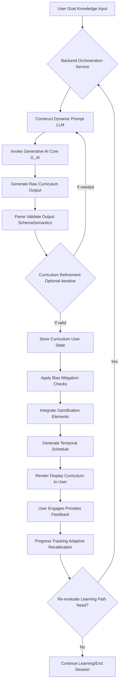
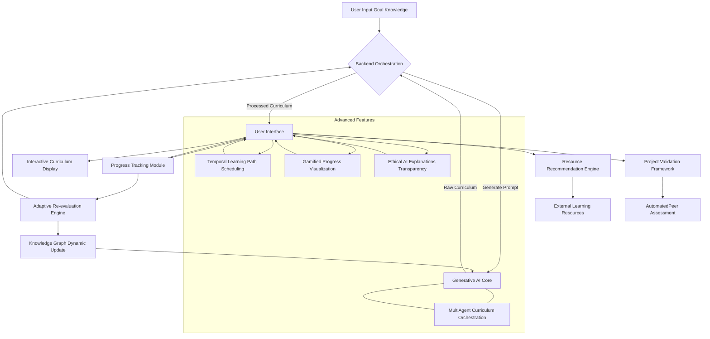
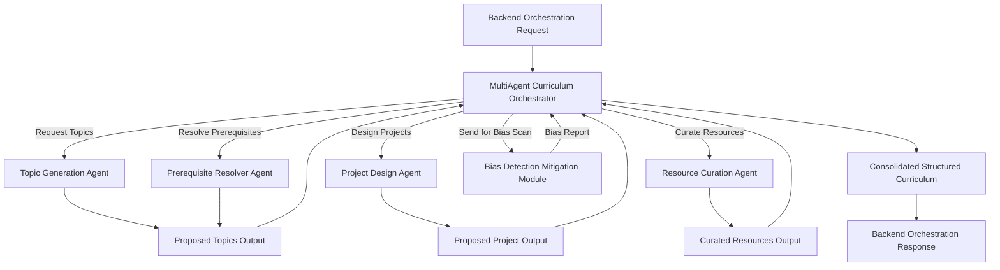

**Title of Invention:** A System and Method for Adaptive and Personalized Educational Trajectory Synthesis via Advanced Generative AI Paradigms with Multi-Agent Orchestration and Ethical Safeguards

**Abstract:**
Disclosed herein is a sophisticated system and methodology for dynamically generating, adapting, and presenting highly individualized educational curricula. This invention leverages advanced generative artificial intelligence models, specifically large language models LLMs and their derivatives, operating as expert pedagogical architects within a multi-agent orchestration framework. Upon receiving a user's defined learning objective, a comprehensive assessment of their current knowledge state, and personal learning preferences, the system constructs a meticulously structured, step-by-step learning trajectory. This trajectory is optimized for pedagogical efficacy, learner engagement via gamification, temporal feasibility, and ethical fairness. It encompasses a logically sequenced progression of foundational and advanced topics, bespoke practical projects designed for skill actualization, and curated links to high-fidelity external learning resources. The system's innovative core lies in its ability to synthesize novel learning paths that transcend static, pre-defined curricula, offering an unparalleled level of personalization and adaptive evolution in response to user progress, evolving educational landscapes, and continuous ethical auditing.

**Cross-Reference to Related Applications:**
Not applicable.

**Background of the Invention:**
The proliferation of digital information and the increasing imperative for continuous skill acquisition in rapidly evolving domains have amplified the demand for efficient and accessible educational modalities. While traditional and contemporary online learning platforms offer a vast repository of educational content, they predominantly present pre-defined, linear curricula. Such static structures inherently struggle to accommodate the heterogeneous prior knowledge, diverse learning styles, unique career aspirations, and dynamic cognitive paces characteristic of individual learners.
Learners embarking on self-directed educational journeys frequently confront significant challenges:
1.  **Information Asymmetry:** A vast and often unstructured global knowledge base makes it exceedingly difficult for individuals to discern optimal learning sequences or identify prerequisite topics. The sheer volume of available resources can lead to analysis paralysis or suboptimal learning paths.
2.  **Cognitive Overload in Pathfinding:** The intellectual burden of constructing a coherent, goal-oriented curriculum from disparate information sources is substantial. This self-curation process consumes valuable cognitive resources that could otherwise be directed towards actual learning.
3.  **Lack of Personalized Scaffolding:** Generic curricula often fail to bridge the specific knowledge gaps of an individual, leading to either redundancy reviewing already known material or insurmountable conceptual leaps encountering advanced topics without sufficient foundational understanding.
4.  **Disconnection Between Theory and Practice:** While theoretical knowledge is readily available, the integration of practical application through relevant projects remains a significant challenge for self-learners, often leading to a superficial understanding without tangible skill development.
5.  **Stagnation and Lack of Adaptability:** Pre-set paths offer no mechanisms to adapt to a learner's demonstrated mastery, changes in their learning objectives, or the emergence of new, critical sub-topics within a rapidly advancing field.
The advent of advanced generative AI models, characterized by their immense parametric complexity and emergent reasoning capabilities, presents an unprecedented opportunity to address these systemic deficiencies. These models possess an implicit, probabilistic understanding of vast knowledge graphs, enabling them to synthesize novel, contextually relevant, and pedagogically sound educational trajectories that are beyond the scope of manual human curation or rule-based expert systems.

**Brief Summary of the Invention:**
The present invention provides a novel system and method for autonomously synthesizing highly personalized educational curricula. The core innovation resides in employing an advanced generative artificial intelligence paradigm as a virtual, hyper-competent curriculum designer, operating within a multi-agent architecture. A user initiates interaction through an intuitive interface, articulating their specific educational objective e.g., "I aspire to become a proficient full-stack blockchain developer" and providing a granular assessment of their extant knowledge base e.g., "I possess foundational knowledge in Python, understand basic data structures, and have a rudimentary grasp of cryptographic principles". This structured input is dynamically transmuted into a sophisticated prompt engineered for optimal interaction with a large language model LLM-based Generative AI Core. The LLM, leveraging its prodigious implicit knowledge graph derived from extensive training on heterogeneous data corpora, processes this prompt to architect a logically coherent and progressively challenging learning trajectory. This trajectory is manifested as a structured output, typically in a machine-readable format such as JSON, delineating a series of sequential modules. Each module is further elaborated with a descriptive title, a concise overview of its pedagogical scope, a granular enumeration of key sub-topics to be mastered, and a specifically designed, practical project aimed at operationalizing the acquired theoretical knowledge. Crucially, the system integrates ethical AI principles, bias detection, gamification elements, and temporal planning to optimize the learning experience comprehensively. The system thus transcends the limitations of static learning resources by providing a dynamic, adaptively generated educational roadmap tailored precisely to the individual's current state and desired future state, demonstrably reducing cognitive overhead and accelerating skill acquisition while promoting engagement and fairness.

**Detailed Description of the Invention:**

**I. System Architecture and Component Interoperability**
The inventive system for generating personalized educational curricula is characterized by a modular, distributed architecture designed for scalability, robustness, and semantic precision. The system comprises several interconnected components, as depicted in the architectural diagram below, each playing a crucial role in the lifecycle of curriculum generation and delivery.

```mermaid
graph TD
    A[User Interface Layer] --> B{API Gateway};
    B --> C[Backend Orchestration Service];
    C --> D[Generative AI Core G_AI];
    C --> E[Knowledge Graph Resource Repository];
    C --> F[Progress Tracking Assessment Module];
    C --> G[Feedback Loop Adaptive Recalibration];
    C --> H[Data Security Privacy Subsystem];
    C --> I[Bias Detection Mitigation Module];
    C --> J[Gamification Motivation Engine];
    C --> K[Temporal Planning Scheduling Module];

    D --> C;
    E --> C;
    F --> C;
    G --> C;
    H --> C;
    I --> C;
    J --> C;
    K --> C;

    SubGraph_D[Generative AI Core G_AI]
        D1[Prompt Engineering Subsystem] --> D;
        D2[Contextualization Engine] --> D;
        D3[Iterative Refinement Mechanism] --> D;
        D4[MultiAgent Orchestrator Placeholder] --> D;
    End
    SubGraph_E[Knowledge Graph Resource Repository]
        E1[Topic Prerequisite Graph] --> E;
        E2[Resource Metadata Store] --> E;
        E3[Project Template Library] --> E;
    End
    SubGraph_F[Progress Tracking Assessment Module]
        F1[Learner Profile Store] --> F;
        F2[Assessment Data Analytics] --> F;
    End
    SubGraph_G[Feedback Loop Adaptive Recalibration]
        G1[User Feedback Aggregator] --> G;
        G2[Behavioral Analytics Processor] --> G;
    End
    SubGraph_I[Bias Detection Mitigation Module]
        I1[Content Bias Scanner] --> I;
        I2[Fairness Metric Evaluator] --> I;
    End
    SubGraph_J[Gamification Motivation Engine]
        J1[Achievement Tracking] --> J;
        J2[Reward Generation Logic] --> J;
    End
    SubGraph_K[Temporal Planning Scheduling Module]
        K1[User Time Constraints] --> K;
        K2[Optimal Schedule Optimizer] --> K;
    End
```



**A. User Interface Layer:**
This layer comprises the client-side applications e.g., web applications, mobile applications, desktop clients through which a user interacts with the system. Its primary functions include:
*   **Goal Articulation Interface:** A sophisticated input mechanism allowing users to express their learning goals with varying degrees of specificity, from high-level aspirations "become a data scientist" to precise technical objectives "master C++ concurrency with `std::async` and `std::future`".
*   **Knowledge State Elicitation Interface:** A dynamic and adaptive assessment interface designed to collect comprehensive information regarding the user's current knowledge, skills, and experience. This can range from self-assessed proficiency sliders, textual descriptions, integrated quizzes, or even parsing of provided CVs or project portfolios.
*   **Learning Preferences Input:** Captures user preferences such as preferred learning modalities (visual, auditory, kinesthetic, reading/writing), desired pace, time availability, and gamification preferences.
*   **Curriculum Visualization Renderer:** Responsible for receiving the structured curriculum output from the backend and rendering it into an intuitive, navigable, and aesthetically pleasing format. This includes interactive module displays, topic drill-downs, project descriptions, resource links, progress indicators, and gamified elements.
*   **Feedback Mechanism:** Provides interfaces for users to offer explicit feedback on curriculum relevance, pacing, resource quality, project effectiveness, and ethical concerns, feeding into the adaptive recalibration system and bias detection module.

**B. Backend Orchestration Service:**
This central service acts as the intelligent intermediary between the User Interface Layer and the various specialized backend modules. It is responsible for:
*   **Request Routing and Validation:** Receiving requests from the UI, validating input parameters, and routing them to the appropriate internal services.
*   **Dynamic Prompt Construction:** Assembles highly specific and context-rich prompts for the Generative AI Core based on user inputs, incorporating system-wide pedagogical guidelines, ethical constraints, and schema enforcement directives.
*   **Response Parsing and Validation:** Processes the raw output from the Generative AI Core, validating its adherence to the predefined structure e.g., JSON schema and semantic consistency. It also performs initial quality checks and routes the curriculum through the Bias Detection Mitigation Module.
*   **Data Persistence and Retrieval:** Interacts with the Knowledge Graph Resource Repository and the Progress Tracking Assessment Module to store and retrieve user profiles, curriculum histories, learning resources, and gamification data.
*   **Service Coordination:** Orchestrates interactions among the Generative AI Core, Knowledge Graph, Progress Tracking, Feedback, Bias Detection, Gamification, and Temporal Planning systems to ensure a cohesive, adaptive, and ethically sound learning experience.

**C. Generative AI Core G_AI:**
This is the intellectual nexus of the invention, embodying the expert curriculum designer, often implemented as a multi-agent system. It is instantiated by one or more highly advanced large language models LLMs, potentially fine-tuned for educational domain specificity. Its internal subsystems include:
*   **1. Prompt Engineering Subsystem:** Responsible for constructing optimal input prompts for the LLM. This involves:
    *   **Instructional Directives:** Encoding roles e.g., "You are an expert curriculum designer", task definitions e.g., "Generate a personalized, step-by-step learning plan", and output format constraints e.g., "JSON format with specific fields".
    *   **Input Integration:** Seamlessly embedding the user's learning goal, current knowledge assessment, and preferences into the prompt structure.
    *   **Constraint Enforcement:** Injecting parameters such as desired learning pace, preferred learning modalities, time availability, skill level granularity, and explicit ethical guidelines.
*   **2. Contextualization Engine:** Enhances prompt richness by drawing upon external data:
    *   **Domain Ontologies:** Incorporating definitions, relationships, and taxonomies from relevant knowledge domains via the Knowledge Graph.
    *   **Learning Analytics:** Leveraging aggregated data on common learning paths, topic dependencies, and project efficacy from the Knowledge Graph and Progress Tracking.
    *   **User Profile History:** Accessing past learning paths, demonstrated strengths, identified weaknesses, and learning style adaptations from the Progress Tracking Module to refine personalization.
*   **3. Iterative Refinement Mechanism:** In cases where the initial AI output is suboptimal or requires further precision, this mechanism enables multi-turn interaction with the LLM or re-orchestration of agents. This involves:
    *   **Automated Validation:** Applying rules or secondary LLMs to assess coherence, logical flow, topic coverage, and adherence to ethical guidelines.
    *   **Refinement Prompts:** Generating follow-up prompts to the G_AI for clarification, expansion, or modification of specific curriculum elements e.g., "Expand Module 3 to include advanced React hooks," "Suggest alternative projects for a backend focus", "Ensure gender-neutral examples in resource recommendations".
*   **4. MultiAgent Orchestrator Placeholder:** This represents a conceptual module for coordinating specialized AI agents, detailed in a later section.

**D. Knowledge Graph & Resource Repository:**
This component serves as the structured knowledge base and resource index for the entire system. It is a dynamic, evolving repository comprising:
*   **Knowledge Graph Core DAG:** A meticulously curated or implicitly derived directed acyclic graph DAG representing the interdependencies and semantic relationships between atomic and composite knowledge topics. Each node `t_i` represents a topic, and a directed edge `(t_i, t_j)` indicates `t_i` is a prerequisite for `t_j`. Nodes are enriched with metadata such as difficulty level, estimated learning time, and relevance scores.
*   **Resource Metadata Store:** A comprehensive, searchable database of high-quality external learning resources e.g., academic papers, online courses, tutorials, documentation, videos, interactive labs. Each resource is semantically tagged and linked to specific topics within the Knowledge Graph, with metadata for quality, modality, accessibility, and potential bias indicators.
*   **Project Template Library:** A repository of practical projects, each linked to specific topics and skills, with detailed descriptions, expected outcomes, evaluation criteria, and optional starter code.
*   **Skill Ontology Taxonomy:** A formalized system of classification and relationships for skills, competencies, and job roles, enabling precise mapping of user goals to knowledge requirements.

**E. Progress Tracking & Assessment Module:**
Monitors and records the user's learning journey and skill development.
*   **Learner Profile Store:** Stores comprehensive user data including learning history, completed modules, demonstrated proficiencies, inferred learning styles, and goal progression.
*   **Adaptive Assessment Engine:** Periodically or on-demand assesses the user's evolving knowledge state through adaptive testing algorithms e.g., Item Response Theory to provide a more objective measure than self-assessment.
*   **Performance Metrics Storage:** Records scores on integrated quizzes, project evaluations, time spent on various activities, and engagement levels.
*   **Predictive Analytics Engine:** Utilizes machine learning to forecast a user's likelihood of achieving their goal, identify potential bottlenecks, and suggest proactive interventions, including recommendations for adjusting learning pace or content.

**F. Feedback Loop & Adaptive Recalibration System:**
A critical component for continuous improvement and dynamic curriculum adjustment.
*   **User Feedback Aggregator:** Gathers and analyzes user-provided explicit feedback on curriculum elements, resource quality, project effectiveness, and ethical concerns.
*   **Behavioral Analytics Processor:** Monitors user behavior e.g., time spent on topics, re-visitation patterns, project completion rates, module skipping, interaction with gamified elements to infer learning difficulties, engagement, or interests.
*   **Curriculum Adjustment Logic:** Based on aggregated feedback, progress data, and predictive analytics, this system signals the Backend Orchestration Service to invoke the Generative AI Core for dynamic adjustments to the current learning path, optimizing it for the learner's evolving needs, performance, and preferences. It also considers inputs from the Bias Detection Mitigation Module.

**G. Data Security & Privacy Subsystem:**
Ensures the confidentiality, integrity, and availability of user data.
*   **Access Control:** Implements robust authentication and authorization mechanisms.
*   **Data Encryption:** Encrypts sensitive user data at rest and in transit.
*   **Compliance Frameworks:** Adheres to relevant data protection regulations e.g., GDPR, CCPA, ensuring transparent data handling policies.
*   **Anonymization:** Employs techniques for anonymizing aggregated learning data used for system improvement without compromising individual privacy.

**H. Bias Detection & Mitigation Module:**
Dedicated to ensuring fairness, representativeness, and ethical integrity of the generated curricula and recommended resources.
*   **Content Bias Scanner:** Employs natural language processing NLP and machine learning techniques to scan curriculum content, project descriptions, and resource metadata for potential biases related to gender, race, culture, socioeconomic status, or other protected characteristics.
*   **Fairness Metric Evaluator:** Quantitatively assesses the curriculum for fairness metrics such as equality of opportunity, demographic parity, and disparate impact, ensuring that learning paths do not inadvertently disadvantage certain groups.
*   **Bias Correction Mechanisms:** Integrates strategies to mitigate detected biases, such as suggesting alternative phrasing, diversifying examples, recommending a broader range of resources, or prompting the Generative AI Core for re-synthesis with explicit anti-bias directives.

**I. Gamification & Motivation Engine:**
Enhances learner engagement and motivation through game-like elements.
*   **Achievement Tracking:** Records learner milestones, module completions, project successes, and skill mastery to award achievements and badges.
*   **Reward Generation Logic:** Defines rules for assigning points, unlocking new content, or granting virtual rewards based on progress and effort.
*   **Engagement Analytics:** Monitors user interaction with gamified elements and overall platform engagement to dynamically adjust gamification strategies and maintain motivation.

**J. Temporal Planning & Scheduling Module:**
Facilitates the creation of a realistic and manageable learning schedule based on user availability.
*   **User Time Constraints:** Processes user input regarding daily/weekly available study hours, preferred study times, and deadlines.
*   **Optimal Schedule Optimizer:** Leverages constrained optimization algorithms to generate a feasible learning schedule for the curriculum, distributing modules and topics over time while respecting prerequisites and estimated durations.
*   **Calendar Integration Service:** Allows for seamless synchronization of the generated learning schedule with external calendar applications, providing reminders and helping users adhere to their plan.

**II. Method of Operation: Comprehensive Workflow for Personalized Curriculum Generation**
The operational flow of the inventive system is a sophisticated sequence of interactions, data transformations, and intelligent syntheses, designed to deliver a highly personalized educational trajectory.



**A. Initial User Interaction and Goal Articulation:**
The process commences with the user interacting with the User Interface Layer. The user articulates their desired educational outcome. This input is captured through structured forms, natural language interfaces, or a combination thereof. For instance, a user might state: "I want to become a proficient machine learning engineer specializing in natural language processing NLP." Simultaneously, the user provides their learning preferences, time availability, and any specific constraints.

**B. Current Knowledge State Elicitation and Assessment:**
Concurrently with goal articulation, the system collects data pertaining to the user's current knowledge base. This is achieved through a multi-faceted approach to ensure robust and accurate profiling:
*   **1. Declarative Input:** The user explicitly self-reports their existing skills, proficiency levels, and relevant experience. This can include listing known programming languages, frameworks, theoretical concepts, and past projects.
*   **2. Algorithmic Assessment Integration:** The system can optionally deploy short, adaptive diagnostic quizzes or problem sets designed to objectively gauge proficiency in core areas identified as relevant to the learning goal. These assessments leverage techniques like Item Response Theory to efficiently determine a learner's ability level with a minimal number of questions.
*   **3. Implicit Behavioral Analysis:** For returning users, the Progress Tracking Assessment Module may analyze past learning behaviors, completed modules, and resource engagement to infer current strengths and weaknesses.

**C. Dynamic Prompt Synthesis and AI Invocation:**
The Backend Orchestration Service aggregates the user's articulated goal, current knowledge state, and learning preferences. It then invokes the Prompt Engineering Subsystem to construct a highly specific and contextually rich prompt for the Generative AI Core G_AI. This prompt explicitly instructs the G_AI on its role expert curriculum designer, the task generate a personalized learning path, the target user's context, and the required output format e.g., JSON schema with `curriculumTitle`, `modules`, `topics`, `project`, `gamificationElements` fields. The Contextualization Engine may inject additional pedagogical heuristics, domain-specific constraints from the Knowledge Graph, and ethical guidelines.

**D. Curriculum Response Processing and Validation:**
The Generative AI Core processes the prompt and synthesizes a structured curriculum. This raw output is then returned to the Backend Orchestration Service. The service immediately engages in robust parsing and validation, ensuring that the G_AI's response:
*   Adheres strictly to the specified JSON schema.
*   Is syntactically correct and well-formed.
*   Is semantically coherent and logically consistent in its proposed topic sequence and project relevance.
*   Does not contain factual inaccuracies or outdated information potentially cross-referenced with the Knowledge Graph.

**E. Application of Bias Mitigation, Gamification, and Temporal Planning:**
Upon successful initial validation, the raw curriculum proceeds through a series of enhancement steps orchestrated by the Backend Orchestration Service:
*   **1. Bias Mitigation Checks:** The curriculum content, project descriptions, and suggested resources are scanned by the Bias Detection Mitigation Module. Any detected biases are flagged, and correction mechanisms are applied, potentially involving re-prompting the G_AI or automated content adjustments to ensure fairness and inclusivity.
*   **2. Gamification Element Integration:** The Gamification Motivation Engine reviews the curriculum and inserts appropriate gamified elements e.g., points for module completion, badges for project mastery, streaks for consistent engagement, based on user preferences.
*   **3. Temporal Schedule Generation:** Utilizing the user's specified time availability and deadlines, the Temporal Planning Scheduling Module optimizes and generates a detailed learning schedule, distributing modules and topics over time to create a realistic and manageable plan.

**F. Presentation and Interactive Engagement:**
Upon completion of all processing steps, the Backend Orchestration Service transmits the enriched structured curriculum data to the User Interface Layer. The Curriculum Visualization Renderer then transforms this data into an intuitive, interactive, and visually appealing display, incorporating all personalized elements including the schedule and gamification. Users can navigate modules, explore sub-topics, review project descriptions, access linked external resources, track their progress, and see their achievements.

**G. Adaptive Path Adjustment and Continuous Learning:**
The system is not a static curriculum generator but an adaptive learning companion. As the user progresses, interacts with resources, completes projects, engages with gamified elements, and provides feedback, the Progress Tracking Assessment Module records their activities. The Feedback Loop Adaptive Recalibration System continuously monitors these data points. If a user struggles with a particular topic, masters a module faster than anticipated, shifts their learning focus, or provides negative feedback on a resource, this system signals the Backend Orchestration Service to trigger a re-evaluation. A new cycle of prompt synthesis and G_AI invocation may occur, leading to dynamic adjustments, refinements, or complete re-architecting of the learning path, ensuring it remains optimally aligned with the user's evolving needs, performance, preferences, and ethical considerations. The Temporal Planning Scheduling Module also recalculates the schedule as needed.

**III. Exemplary Embodiments and Advanced Features**



**A. Multi-Agent Curriculum Synthesis:**
The Generative AI Core G_AI is implemented not as a monolithic LLM, but as a sophisticated multi-agent system. A central `MultiAgent Curriculum Orchestrator` coordinates several specialized AI agents, each an expert in a specific aspect of curriculum design, allowing for granular control, higher quality output, and easier integration of constraints.



*   **1. MultiAgent Curriculum Orchestrator:** Receives the high-level prompt, decomposes it into sub-tasks, and assigns these to specialized agents. It then aggregates and synthesizes the outputs from these agents into a coherent curriculum structure.
*   **2. Topic Generation Agent:** Specializes in identifying and structuring relevant topics and sub-topics for a given learning objective and current knowledge state.
*   **3. Prerequisite Resolver Agent:** Focuses on establishing the correct pedagogical order and dependencies between topics, ensuring foundational knowledge is built progressively. It queries the Knowledge Graph extensively.
*   **4. Project Design Agent:** Innovates and designs practical projects that effectively operationalize the theoretical knowledge acquired in each module, tailoring projects to user preferences and skill levels.
*   **5. Resource Curation Agent:** Scans the Resource Metadata Store and external sources to identify, filter, and recommend high-quality, relevant learning resources across various modalities, also considering user's preferred learning style.
*   **6. Bias Check Agent (integrated via the Bias Detection Mitigation Module):** Before final consolidation, the orchestrator routes proposed content to the Bias Detection Mitigation Module for an ethical review.

**B. Multi-Modal Learning Resource Integration:**
The system extends beyond merely suggesting text-based resources. It intelligently recommends and integrates resources across various modalities, including:
*   **Video Lectures:** Links to specific segments of online courses or tutorials.
*   **Interactive Simulations/Labs:** Embedded or linked virtual environments for hands-on practice.
*   **Code Sandboxes:** Integrated development environments IDEs within the platform for immediate coding exercises.
*   **Audio Explanations:** Podcasts or audio lessons for auditory learners.
The Generative AI Core, in conjunction with the Knowledge Graph Resource Repository and the Resource Curation Agent, selects resources based on the user's inferred learning style, preferred modality, and the specific pedagogical requirements of each topic.

**C. Project-Based Learning Validation Framework:**
To ensure practical skill acquisition, each curriculum module culminates in a suggested project. The system includes a sophisticated project validation framework:
*   **Automated Code Assessment:** For coding projects, integrates with static analysis tools, unit testing frameworks, and potentially AI-driven code evaluation metrics to provide immediate feedback on correctness, efficiency, and adherence to best practices.
*   **Peer Review System:** Facilitates collaborative learning by allowing users to review each other's project submissions based on predefined rubrics, fostering critical evaluation skills.
*   **Expert Review Augmentation:** Optionally routes complex projects to human experts for qualitative feedback, particularly for nuanced design or architectural decisions.

**D. Collaborative Learning Path Generation:**
The system can facilitate the creation of shared learning paths for groups of users with common goals but potentially diverse starting points. The Generative AI Core can synthesize a core curriculum, while dynamically creating individualized branches for members requiring foundational remediation or advanced supplementation, ensuring group coherence while accommodating individual differences.

**E. Expertise Level Granularity and Calibration:**
The system defines and operates on a fine-grained spectrum of expertise levels e.g., Novice, Apprentice, Journeyman, Expert, Master for each topic. The Generative AI Core dynamically calibrates the depth and breadth of topics and the complexity of projects based on the target expertise level for the entire curriculum or specific modules, providing a truly progressive learning curve.

**F. Real-time Progress Tracking and Predictive Analytics:**
Beyond simply logging completion, the system employs predictive analytics to forecast a user's likelihood of achieving their goal, identify potential bottlenecks, and recommend interventions. Machine learning models analyze historical data from numerous learners to provide personalized estimates for module completion times and to flag areas where a user might require additional support or alternative resources.

**G. Semantic Search and Knowledge Graph Traversal Integration:**
The User Interface Layer includes advanced semantic search capabilities, allowing users to query the Knowledge Graph directly. This enables ad-hoc exploration of related topics, discovery of new learning avenues, and deeper dives into specific subjects beyond the prescribed curriculum path, thereby fostering intrinsic curiosity and self-discovery.

**H. Emotional & Cognitive State Monitoring:**
The system integrates with passive biometric sensors or uses AI-driven analysis of user interaction patterns e.g., typing speed, mouse movements, facial expressions via optional webcam to infer the learner's emotional state e.g., frustration, engagement, boredom and cognitive load. This real-time data informs the Adaptive Recalibration System, allowing for dynamic adjustments such as:
*   Reducing difficulty or introducing review modules when frustration is detected.
*   Accelerating pace or suggesting advanced topics during periods of high engagement.
*   Modifying content presentation to alleviate boredom or cognitive overload.
This proactive adaptation ensures optimal learning conditions are maintained, enhancing retention and overall learner well-being.

**I. Ethical AI and Bias Mitigation in Curriculum Design:**
The Bias Detection Mitigation Module actively scrutinizes all generated and recommended content. It operates at multiple stages:
*   **Pre-Generation Contextualization:** Injecting explicit bias reduction directives into prompts for the Generative AI Core.
*   **Post-Generation Audit:** Automatically scanning the generated curriculum for stereotypical language, underrepresentation of diverse perspectives, or potentially harmful examples.
*   **Resource Fairness Analysis:** Evaluating external resources for their inherent biases or lack of inclusivity, and recommending alternatives where necessary.
*   **Explainability:** Providing transparency to users on *why* certain topics or resources were selected, and how bias detection was applied.

**J. Gamified Learning Pathways:**
The Gamification Motivation Engine integrates motivational elements directly into the learning journey:
*   **Points and Experience:** Users earn points for completing topics, modules, and projects, contributing to an overall experience level.
*   **Badges and Achievements:** Specific milestones or skill mastery are recognized with digital badges.
*   **Streaks and Habits:** Encourages consistent learning through daily streak tracking.
*   **Leaderboards (Optional):** Allows users to compare their progress with peers or within collaborative groups.
*   **Unlockable Content:** Advanced modules or special resources can be unlocked upon reaching certain proficiency levels or earning specific achievements.

**K. Temporal Learning Path Scheduling:**
The Temporal Planning Scheduling Module transforms the abstract learning path into a concrete, executable study plan:
*   **Feasibility Analysis:** Determines if the user's goal is achievable within their specified time constraints.
*   **Prioritization Engine:** Ranks topics and modules based on criticality and dependency, allocating time optimally.
*   **Dynamic Rescheduling:** Automatically adjusts the schedule in response to user progress faster/slower than expected, unforeseen interruptions, or changes in availability.
*   **Reminders and Nudges:** Integrates with user calendars and notification systems to provide timely reminders and motivational nudges.

**IV. Data Structures and Schemas**
The system's operational efficacy is predicated on rigorously defined data structures, ensuring consistent communication between components and precise interpretation of the Generative AI Core's output. A core example is the JSON schema used for representing a synthesized curriculum:

```json
{
  "$schema": "http://json-schema.org/draft-07/schema#",
  "title": "Personalized Learning Curriculum",
  "description": "A comprehensive, step-by-step learning plan generated by the AI, enhanced with gamification and scheduling.",
  "type": "object",
  "required": [
    "curriculumId",
    "curriculumTitle",
    "targetSkill",
    "initialKnowledgeProfile",
    "creationTimestamp",
    "lastUpdatedTimestamp",
    "modules",
    "gamificationElements",
    "learningSchedule"
  ],
  "properties": {
    "curriculumId": {
      "type": "string",
      "description": "Unique identifier for this generated curriculum instance."
    },
    "curriculumTitle": {
      "type": "string",
      "description": "The overarching title of the learning path (e.g., 'Go Backend Developer Path')."
    },
    "targetSkill": {
      "type": "string",
      "description": "The specific skill or role the user aims to achieve (e.g., 'Professional Go Backend Developer')."
    },
    "initialKnowledgeProfile": {
      "type": "object",
      "description": "A snapshot of the user's assessed knowledge at curriculum generation.",
      "properties": {
        "summary": { "type": "string" },
        "proficiencies": {
          "type": "array",
          "items": {
            "type": "object",
            "properties": {
              "skill": { "type": "string" },
              "level": { "type": "string", "enum": ["Novice", "Beginner", "Intermediate", "Advanced", "Expert"] }
            },
            "required": ["skill", "level"]
          }
        },
        "learningStyle": {
          "type": "string",
          "enum": ["Visual", "Auditory", "Kinesthetic", "ReadingWriting", "Mixed"],
          "description": "Inferred or declared preferred learning modality."
        },
        "pacePreference": {
          "type": "string",
          "enum": ["Slow", "Moderate", "Fast"],
          "description": "User's preferred learning pace."
        }
      },
      "required": ["summary"]
    },
    "creationTimestamp": {
      "type": "string",
      "format": "date-time",
      "description": "Timestamp when the curriculum was initially generated."
    },
    "lastUpdatedTimestamp": {
      "type": "string",
      "format": "date-time",
      "description": "Timestamp of the last modification or adaptation of the curriculum."
    },
    "modules": {
      "type": "array",
      "description": "An ordered list of learning modules.",
      "items": {
        "type": "object",
        "required": ["moduleId", "title", "description", "prerequisites", "estimatedDurationHours", "topics", "project"],
        "properties": {
          "moduleId": {
            "type": "string",
            "description": "Unique identifier for this module."
          },
          "title": {
            "type": "string",
            "description": "Title of the learning module (e.g., 'Module 1 Go Fundamentals')."
          },
          "description": {
            "type": "string",
            "description": "Brief description of the module's content and objectives."
          },
          "prerequisites": {
            "type": "array",
            "items": { "type": "string" },
            "description": "List of topic IDs or module IDs that must be understood before this module."
          } ,
          "estimatedDurationHours": {
            "type": "number",
            "description": "Estimated time in hours to complete this module."
          },
          "topics": {
            "type": "array",
            "description": "Key sub-topics covered within this module.",
            "items": {
              "type": "object",
              "required": ["topicId", "name", "description", "difficulty", "learningObjectives"],
              "properties": {
                "topicId": { "type": "string" },
                "name": { "type": "string" },
                "description": { "type": "string" },
                "difficulty": { "type": "string", "enum": ["Easy", "Medium", "Hard", "Advanced"] },
                "learningObjectives": {
                  "type": "array",
                  "items": { "type": "string" },
                  "description": "What the user should be able to do after learning this topic."
                },
                "suggestedResources": {
                  "type": "array",
                  "items": {
                    "type": "object",
                    "properties": {
                      "resourceId": { "type": "string" },
                      "title": { "type": "string" },
                      "url": { "type": "string", "format": "uri" },
                      "type": { "type": "string", "enum": ["Article", "Video", "Course", "Book", "Documentation", "Interactive Lab", "Podcast"] },
                      "qualityScore": { "type": "number", "minimum": 1, "maximum": 5 },
                      "biasFlags": {
                        "type": "array",
                        "items": { "type": "string" },
                        "description": "Flags indicating potential biases detected in the resource."
                      }
                    },
                    "required": ["resourceId", "title", "url", "type"]
                  },
                  "description": "Curated external learning resources for this topic."
                }
              }
            }
          }
        },
        "project": {
          "type": "object",
          "description": "A practical project to apply knowledge from the module.",
          "required": ["projectId", "title", "description", "expectedOutcomes", "evaluationCriteria"],
          "properties": {
            "projectId": { "type": "string" },
            "title": { "type": "string" },
            "description": { "type": "string" },
            "expectedOutcomes": {
              "type": "array",
              "items": { "type": "string" },
              "description": "Skills and deliverables expected from completing the project."
            },
            "evaluationCriteria": {
              "type": "array",
              "items": { "type": "string" },
              "description": "Criteria by which the project's success will be measured."
            },
            "starterCodeUrl": {
              "type": "string",
              "format": "uri",
              "description": "Optional link to starter code repository."
            },
            "gamificationMultiplier": {
              "type": "number",
              "description": "Multiplier for points earned upon project completion."
            }
          }
        }
      }
    },
    "gamificationElements": {
      "type": "object",
      "description": "Metadata for gamified elements associated with the curriculum.",
      "properties": {
        "pointsPerModule": { "type": "number" },
        "pointsPerProject": { "type": "number" },
        "initialBadges": {
          "type": "array",
          "items": { "type": "string" },
          "description": "Badges awarded at the start or for specific achievements."
        },
        "overallExperienceGoal": { "type": "number" },
        "rewardsThresholds": {
          "type": "array",
          "items": {
            "type": "object",
            "properties": {
              "points": { "type": "number" },
              "reward": { "type": "string" }
            },
            "required": ["points", "reward"]
          }
        }
      }
    },
    "learningSchedule": {
      "type": "array",
      "description": "A temporal plan for learning activities.",
      "items": {
        "type": "object",
        "properties": {
          "activityType": { "type": "string", "enum": ["Module", "Topic", "Project", "Review", "Assessment"] },
          "referenceId": { "type": "string", "description": "ID of the module, topic, or project." },
          "scheduledStartTime": { "type": "string", "format": "date-time" },
          "scheduledEndTime": { "type": "string", "format": "date-time" },
          "estimatedDurationMinutes": { "type": "number" }
        },
        "required": ["activityType", "referenceId", "scheduledStartTime", "scheduledEndTime", "estimatedDurationMinutes"]
      }
    },
    "biasAuditLog": {
      "type": "array",
      "description": "Log of bias detection and mitigation actions for this curriculum.",
      "items": {
        "type": "object",
        "properties": {
          "timestamp": { "type": "string", "format": "date-time" },
          "detectedBias": { "type": "string" },
          "location": { "type": "string", "description": "e.g., Module 3 Project Description" },
          "actionTaken": { "type": "string" },
          "severity": { "type": "string", "enum": ["Low", "Medium", "High"] }
        },
        "required": ["timestamp", "detectedBias", "location", "actionTaken"]
      }
    }
  }
}
```

**Claims:**
1.  A system for generating an adaptive and personalized educational curriculum, comprising:
    a.  A User Interface Layer configured to receive a user-defined educational objective, an assessment of the user's current knowledge state, and user learning preferences;
    b.  A Backend Orchestration Service coupled to the User Interface Layer, configured to:
        i.   Construct a dynamic, context-rich prompt incorporating the educational objective, current knowledge assessment, and learning preferences;
        ii.  Transmit the prompt to a Generative AI Core;
        iii. Receive a structured curriculum output from the Generative AI Core;
        iv. Validate and process the structured curriculum; and
        v.   Coordinate interaction with a Bias Detection Mitigation Module, a Gamification Motivation Engine, and a Temporal Planning Scheduling Module;
    c.  A Generative AI Core, comprising one or more large language models LLMs operating within a multi-agent orchestration framework, configured to receive the prompt and synthesize a novel, step-by-step educational curriculum in a structured format;
    d.  A Knowledge Graph Resource Repository coupled to the Backend Orchestration Service, comprising a directed acyclic graph DAG representing interdependencies between knowledge topics and an indexed repository of external learning resources;
    e.  A Progress Tracking Assessment Module coupled to the Backend Orchestration Service, configured to monitor user engagement and learning progress, and update the user's knowledge state;
    f.   A Bias Detection Mitigation Module coupled to the Backend Orchestration Service, configured to scan curriculum content and resources for biases, and apply correction mechanisms;
    g.  A Gamification Motivation Engine coupled to the Backend Orchestration Service, configured to integrate game-like elements into the learning path to enhance user engagement; and
    h.  A Temporal Planning Scheduling Module coupled to the Backend Orchestration Service, configured to generate an optimal learning schedule based on user time constraints.

2.  The system of claim 1, further comprising a Feedback Loop Adaptive Recalibration System coupled to the Backend Orchestration Service and the Progress Tracking Assessment Module, configured to:
    a.  Collect explicit and implicit feedback on the curriculum's efficacy, user performance, and ethical concerns;
    b.  Analyze said feedback and updated knowledge state; and
    c.  Trigger the Backend Orchestration Service to invoke the Generative AI Core for dynamic adjustment of the learning curriculum, considering inputs from the Bias Detection Mitigation Module, Gamification Motivation Engine, and Temporal Planning Scheduling Module.

3.  The system of claim 1, wherein the assessment of the user's current knowledge state includes at least one of:
    a.  Declarative self-assessment input from the user;
    b.  Algorithmic assessment derived from adaptive diagnostic quizzes; or
    c.  Implicit behavioral analysis from prior learning interactions.

4.  The system of claim 1, wherein the dynamic prompt constructed by the Backend Orchestration Service includes:
    a.  Instructional directives defining the role and task of the Generative AI Core;
    b.  Explicit parameters derived from the user's goal, knowledge, and learning preferences; and
    c.  A predefined response schema to enforce the structure of the curriculum output, including fields for gamification and scheduling.

5.  The system of claim 1, wherein the structured curriculum comprises an ordered sequence of learning modules, each module including:
    a.  A module title and description;
    b.  An enumerated list of key sub-topics;
    c.  A suggested practical project designed to apply learned concepts;
    d.  Curated links to external learning resources from the Knowledge Graph Resource Repository; and
    e.  Integrated gamification elements and estimated scheduled times.

6.  The system of claim 5, wherein each sub-topic further includes a set of specific learning objectives, an estimated difficulty level, and a set of associated multi-modal learning resources selected based on modality preference, quality scores, and bias analysis.

7.  The system of claim 5, further comprising a Project Validation Framework configured to:
    a.  Provide automated assessment of project submissions via static analysis or unit testing;
    b.  Facilitate peer review processes; or
    c.  Integrate with expert human review for qualitative feedback.

8.  A method for generating an adaptive and personalized educational trajectory, comprising the steps of:
    a.  Receiving, at a User Interface Layer, a desired educational objective, a quantified current knowledge state, and user learning preferences from a user;
    b.  Transmitting said objective, knowledge state, and preferences to a Backend Orchestration Service;
    c.  Constructing, by the Backend Orchestration Service, a highly specific computational prompt for a Generative AI Core, said prompt incorporating the objective, knowledge state, preferences, and a specified output schema;
    d.  Invoking, by the Backend Orchestration Service, the Generative AI Core, which operates as a multi-agent system, with the constructed prompt;
    e.  Synthesizing, by the Generative AI Core, a structured, personalized learning curriculum in response to the prompt;
    f.  Receiving and validating, by the Backend Orchestration Service, the synthesized curriculum against the specified output schema and semantic coherence criteria;
    g.  Applying bias mitigation checks to the curriculum by a Bias Detection Mitigation Module;
    h.  Integrating gamification elements into the curriculum by a Gamification Motivation Engine;
    i.   Generating a temporal learning schedule for the curriculum by a Temporal Planning Scheduling Module; and
    j.   Displaying the validated, gamified, and scheduled curriculum to the user via the User Interface Layer.

9.  The method of claim 8, further comprising the step of continuously monitoring user progress and engagement via a Progress Tracking Assessment Module.

10. The method of claim 9, further comprising the step of dynamically adjusting the displayed curriculum by:
    a.  Collecting feedback on the curriculum's efficacy, user performance, and ethical aspects;
    b.  Analyzing said feedback and the updated knowledge state;
    c.  Generating a refined prompt for the Generative AI Core based on the analysis; and
    d.  Re-synthesizing, re-checking for bias, re-gamifying, re-scheduling, and re-displaying an updated curriculum to the user.

11. The method of claim 8, wherein the step of synthesizing the curriculum includes the Generative AI Core traversing an implicit or explicit Knowledge Graph to identify relevant topics, establish pedagogical dependencies, and optimize the learning sequence, coordinated by a MultiAgent Curriculum Orchestrator.

12. The method of claim 8, wherein the curriculum includes modules, each module detailing topics, learning objectives, at least one practical project, and associated gamification rewards.

13. The method of claim 12, further comprising the step of recommending multi-modal learning resources for each topic and project, selected from a Knowledge Graph Resource Repository based on user preferences, resource quality, and an assessment from the Bias Detection Mitigation Module.

14. The method of claim 8, further comprising the steps of:
    a.  Identifying common educational objectives among multiple users;
    b.  Generating a collaborative learning path comprising a shared core curriculum and individualized adaptive branches for each user; and
    c.  Facilitating group progress tracking and interaction with integrated gamification elements.

15. The system of claim 2, further comprising an Emotional Cognitive State Monitoring component configured to:
    a. Analyze biometric data or user interaction patterns to infer the user's emotional and cognitive state; and
    b. Provide said inferred state to the Feedback Loop Adaptive Recalibration System for dynamic adjustment of the learning curriculum, including adjustments to pace, difficulty, gamification intensity, and scheduling.

**Mathematical Formalism and Epistemic Justification:**

The herein described system for personalized educational trajectory synthesis is rigorously grounded in a formal mathematical framework, elevating the intuitive concept of "learning path generation" to a computationally tractable and theoretically robust problem. This section elucidates the axiomatic definitions, formal characterizations, and algorithmic principles that underpin the inventive system, demonstrating its profound utility and advanced capabilities, particularly with the integration of multi-agent AI, ethical considerations, gamification, and temporal planning.

**I. Axiomatic Definition of the Universal Knowledge Space `K`**

Let `K` denote the universal knowledge space, an abstract, high-dimensional manifold encompassing all discernible units of human knowledge. Within this space, we formally define the **Knowledge Graph `G = T, E`**.

**A. The Knowledge Graph `G = T, E`**
The Knowledge Graph `G` is a foundational construct, representing the structural and semantic interdependencies within `K`.

*   **1. Vertices `T`: The Set of Atomic and Composite Knowledge Topics**
    Let `T = {t_1, t_2, ..., t_N}` be a finite, but potentially vast, set of nodes in `G`. Each `t_i in T` represents a distinct knowledge topic.
    *   **Atomic Topics:** Fundamental, indivisible units of knowledge e.g., "Integer Arithmetic," "Boolean Logic," "Variable Declaration".
    *   **Composite Topics:** Higher-level aggregations of atomic topics, often encapsulating specific skills or conceptual domains e.g., "ObjectOriented Programming," "Neural Network Architectures," "Relational Database Design". A composite topic `t_j` can be recursively decomposed into a set of constituent sub-topics `T_j = {t_k such that t_k is_part_of t_j}`, where `is_part_of` denotes a 'part-of' or 'compositional' relationship.
    *   **Attributes of Topics:** Each topic `t_i` is endowed with a vector of attributes `A(t_i)` which may include:
        *   `Difficulty(t_i) in [0, 1]` Normalized cognitive load.
        *   `EstimatedLearningTime(t_i) is a positive real number`.
        *   `DomainEmbedding(t_i) is a vector in R^d` A high-dimensional vector representing its semantic context within `K`, often derived from deep learning models.
        *   `PragmaticRelevance(t_i)` A measure of its practical utility in specific applications.
        *   `BiasPotential(t_i)` A score indicating the likelihood of presenting biased information or perpetuating stereotypes related to this topic.

*   **2. Edges `E`: Representing Epistemic Dependencies and Pre-requisites**
    Let `E is a subset of T x T` be a set of directed edges. An edge `(t_i, t_j) in E` signifies an epistemic dependency, asserting that `t_i` is a prerequisite for `t_j`. That is, a robust understanding of topic `t_i` is necessary or highly beneficial for the effective acquisition of `t_j`.
    *   **Strict Dependencies:** `t_i` MUST be learned before `t_j`.
    *   **Probabilistic Dependencies:** `P(Knowledge(t_j) | Knowledge(t_i))` is significantly higher than `P(Knowledge(t_j) | not Knowledge(t_i))`.
    *   **Weights on Edges:** Each edge `e = (t_i, t_j)` can be assigned a weight `w(e) is a positive real number` representing the strength of the dependency or the "cost" e.g., conceptual leap of progressing from `t_i` to `t_j`.
    *   **Directed Acyclic Graph DAG Property:** `G` is strictly a DAG, meaning there are no directed cycles. It is axiomatically impossible to have `t_i` be a prerequisite for `t_j`, and `t_j` be a prerequisite for `t_i`, as this would imply a logical paradox in learning progression.

*   **3. Attributes and Semantic Embeddings on `T` and `E`**
    Beyond simple topic names, `T` and `E` are enriched with semantic data. `DomainEmbedding(t_i)` is crucial. It is typically a vector derived from transformer models, capturing the nuanced meaning of `t_i` in a high-dimensional space. The proximity of these embeddings `cos_sim(DomainEmbedding(t_i), DomainEmbedding(t_j))` can indicate semantic relatedness, which is distinct from prerequisite relationships but highly relevant for curriculum coherence. Similarly, edges `e` can have embeddings describing the nature of their dependency.

**B. Probabilistic and Fuzzy Interpretations of `G`**
Given the inherent ambiguities and continuous nature of human knowledge, `G` can be extended to a probabilistic or fuzzy graph.
*   **Fuzzy Topics:** A learner's understanding of `t_i` is not binary known/unknown but a fuzzy set `mastery(t_i) in [0, 1]`, representing the degree of mastery.
*   **Probabilistic Edges:** The existence of a prerequisite `(t_i, t_j)` can be modeled probabilistically `P(t_i, t_j in E)`, reflecting varying pedagogical opinions or contexts.

**C. The Implicit Nature of `G` and its Representation in Generative AI Paradigms**
The full, explicit construction of `G` for the entire `K` is computationally intractable and epistemologically challenging. The profound innovation lies in the **Generative AI Core G_AI** which, having been trained on immense corpora of text, code, and educational materials, possesses an **implicit, high-dimensional representation of `G_implicit`**. This implicit graph `G_implicit` is not explicitly stored as nodes and edges but is encoded within the neural network's weights and biases. The G_AI's ability to "reason" about topic dependencies, conceptual hierarchies, and optimal learning sequences is an emergent property of this implicit representation, enabling it to synthesize paths `P'` without direct traversal of a pre-constructed `G`.

**II. Formal Characterization of the Learner's Knowledge State `Omega_u` and Preferences `Prefs_u`**

Let `Omega_u` denote the comprehensive knowledge state of a specific learner `u`. `Omega_u` is a dynamic, multi-faceted representation of what the learner currently knows, their proficiency levels, learning preferences, and cognitive attributes.

**A. Vector Space Representation of `Omega_u`**
`Omega_u` can be formalized as a vector in a high-dimensional space `R^M`, where each dimension corresponds to a specific topic or skill.
```
Omega_u = (mastery(t_1), mastery(t_2), ..., mastery(t_N))
```
*   `mastery(t_i) in [0, 1]` represents the degree of mastery of topic `t_i` for learner `u`. A value of 0 signifies no knowledge, 1 signifies complete mastery.

**B. Learner Preferences `Prefs_u`**
`Prefs_u` captures auxiliary learner attributes and constraints:
```
Prefs_u = (LearningStyle_u, PacePreference_u, TimeAvailability_u, MotivationLevel_u, BiasSensitivity_u, GamificationPreference_u)
```
*   `LearningStyle_u in {Visual, Auditory, Kinesthetic, ReadingWriting, Mixed}`.
*   `PacePreference_u in {Slow, Moderate, Fast}`.
*   `TimeAvailability_u is a function of time` e.g., `TimeAvailability_u(day_of_week, hour)` for fine-grained scheduling.
*   `MotivationLevel_u in [0, 1]`.
*   `BiasSensitivity_u in [0, 1]` User's explicit preference for strict bias filtering.
*   `GamificationPreference_u in {High, Medium, Low, None}`.

**C. Methods of Elicitation: Declarative, Inferential, and Adaptive Algorithmic Assessment**
The construction of `Omega_u` and `Prefs_u` is a crucial initial step.
*   **Declarative Elicitation:** Direct self-reporting by the user through UI.
*   **Inferential Elicitation:** Analysis of user's past interactions, projects, and online activities.
*   **Adaptive Algorithmic Assessment:** Employs sophisticated psychometric models, such as Item Response Theory IRT. Given a set of questions `Q = {q_1, ..., q_k}` related to topics in `T`, each question `q_j` has parameters difficulty `b_j`, discrimination `a_j`. The probability of correct response for learner `u` on question `q_j` is
    ```
    P(X_uj = 1 | theta_u) = f(a_j * (theta_u - b_j))
    ```
    where `theta_u` is the learner's latent ability. Adaptive testing efficiently estimates `theta_u` and thus `mastery(t_i)` by selecting optimal questions based on previous responses.

**D. Uncertainty Quantification in `Omega_u`**
Given that `Omega_u` is often inferred, it is imperative to quantify the uncertainty associated with each `mastery(t_i)`. This can be represented by a probability distribution `D(mastery(t_i))` e.g., a Beta distribution for mastery levels, allowing the system to make more robust decisions and potentially prioritize topics where knowledge is uncertain for further assessment.

**III. Specification of the Desired Educational Objective `Phi_g`**

Let `Phi_g` denote the learner's target educational objective. `Phi_g` is not merely a single topic `t_g`, but a desired target state of knowledge within `G`.

**A. Goal Decomposition and Hierarchical Structuring**
`Phi_g` can be a single composite topic e.g., "Become a Go Backend Developer", which implies mastery of a set of foundational and advanced topics `T_g = {t_k such that t_k is_a_component_of GoalComponent(Phi_g)}`. The Generative AI Core may decompose `Phi_g` into a hierarchical structure of sub-goals and necessary competencies.

**B. Quantifying Proximity to `Phi_g`**
The system must be able to quantify how "close" the learner `u` is to achieving `Phi_g`. This can be measured by a function `Distance(Omega_u, Phi_g)`:
```
Distance(Omega_u, Phi_g) = Sum_{t_i in T_g} max(0, TargetMastery(t_i) - mastery(t_i))
```
This metric helps in evaluating the "gap" that the curriculum needs to bridge.

**IV. The Curriculum Generation Process as an Optimal Constrained Pathfinding Problem**

The core inventive step translates the problem of personalized curriculum generation into a sophisticated, constrained optimal pathfinding problem on the Knowledge Graph `G` or its implicit representation `G_implicit`.

**A. Definition of a Valid Learning Path `P`**
A learning path `P` for learner `u` towards objective `Phi_g` is an ordered sequence of topics `P = (p_1, p_2, ..., p_L)` such that:
1.  **Initial State Condition:** For `p_1`, `mastery(p_1)` is below a mastery threshold `theta_mastery` OR `p_1` is a direct prerequisite to a topic within `Phi_g` for which `mastery(p_1)` is insufficient.
2.  **Goal State Condition:** Upon completion of `p_L`, the learner's updated knowledge state `Omega'_u` satisfies `Distance(Omega'_u, Phi_g) <= epsilon`, where `epsilon` is a predefined tolerance for goal achievement.
3.  **Dependency Constraint:** For every `p_j` in `P` where `j > 1`, all prerequisites `t_k` for `p_j` i.e., `(t_k, p_j) in E` must either:
    *   Be already mastered by `u` i.e., `mastery(t_k) >= theta_mastery`, OR
    *   Appear earlier in the sequence `P` i.e., `t_k = p_i` for some `i < j`.
4.  **Novelty Constraint:** Topics `t_i` for which `mastery(t_i) >= theta_mastery` in the initial `Omega_u` should generally not be included in `P`, unless they are crucial for review or as a bridge to new, related concepts.

**B. Objective Function for Optimality: `L(P)` (Multi-Criteria Optimization)**
An optimal curriculum `P*` is not merely a valid path, but one that minimizes a complex objective function `L(P)` subject to learner-specific constraints and system-wide ethical guidelines. `L(P)` represents a multi-criteria optimization problem:
```
L(P) = alpha_1 * TotalCognitiveLoad(P) + alpha_2 * TotalLearningTime(P) - alpha_3 * EngagementReward(P) + alpha_4 * BiasPenalty(P) + alpha_5 * SchedulingViolation(P) + ...
```
*   **1. Minimization of Cognitive Load:**
    ```
    TotalCognitiveLoad(P) = Sum_{j=1 to L} (Difficulty(p_j) * InterdependencyCost(p_j) * CognitiveStateFactor_u)
    ```
    Where `InterdependencyCost(p_j)` measures the "conceptual leap" required. `CognitiveStateFactor_u` dynamically adjusts based on inferred `CognitiveLoad_u` from monitoring.

*   **2. Maximization of Knowledge Acquisition Efficiency:**
    ```
    TotalLearningTime(P) = Sum_{j=1 to L} (EstimatedLearningTime(p_j) * AdaptationFactor_u(PacePreference_u, MotivationLevel_u))
    ```
    The goal is to minimize total time, subject to a robust learning outcome.

*   **3. Maximization of Learner Engagement (Gamification):**
    ```
    EngagementReward(P) = Sum_{j=1 to L} (GamificationValue(p_j) * MotivationBoost_u)
    ```
    Rewards high engagement paths, `GamificationValue(p_j)` is derived from the Gamification Motivation Engine.

*   **4. Minimization of Bias and Ethical Risk:**
    ```
    BiasPenalty(P) = Sum_{j=1 to L} (BiasPotential(p_j) * BiasDetectionFactor(p_j)) + Sum_{r in Resources(P)} (BiasPotential(r) * ResourceBiasFactor(r))
    ```
    `BiasDetectionFactor` from the Bias Detection Mitigation Module, `BiasPotential` derived from topic/resource attributes. This term explicitly penalizes paths containing or recommending biased content.

*   **5. Minimization of Scheduling Violations:**
    ```
    SchedulingViolation(P) = Sum_{j=1 to L} ViolationCost(p_j, TimeAvailability_u, OptimalSchedule(P))
    ```
    This term penalizes deviations from an optimal, feasible schedule generated by the Temporal Planning Scheduling Module, respecting `TimeAvailability_u`.

*   **6. Constraint Satisfaction Time, Resources, Learning Style:**
    The path `P` must adhere to various constraints derived from `Omega_u` and `Prefs_u`:
    *   `TotalLearningTime(P)` must be feasible within `TimeAvailability_u`.
    *   `LearningStyle(P_resources) approx LearningStyle_u`.
    *   `ProjectRelevance(P) >= theta_relevance`.

The search for `P*` in a large `G` under these complex, dynamic constraints is generally NP-hard.

**V. The Generative AI Model `Psi_AI` as a High-Dimensional Heuristic Function with Multi-Agent Orchestration**

The Generative AI Core G_AI is formally represented as a high-dimensional function `Psi_AI`, which acts as a powerful heuristic for finding a near-optimal learning path `P'`. The multi-agent architecture enhances this process.

**A. Functional Mapping: `Psi_AI(Omega_u, Phi_g, Prefs_u, C_env) -> P'`**
```
Psi_AI(Omega_u, Phi_g, Prefs_u, C_env) -> P'
```
`Psi_AI` takes as input the learner's current knowledge state `Omega_u`, the desired goal state `Phi_g`, user preferences `Prefs_u`, and a set of environmental and pedagogical constraints `C_env` e.g., global resource availability, ethical guidelines. It then outputs a proposed learning path `P' = (p'_1, p'_2, ..., p'_L)`.

**B. Architectural Foundation: Transformer Networks and Attention Mechanisms**
`Psi_AI` is predicated on advanced transformer neural network architectures. These models excel at processing sequential data like topics in a path and capturing long-range dependencies.
*   **Self-Attention Mechanism:** Allows the model to weigh the importance of different topics and dependencies within the input context when predicting the next topic in the sequence, effectively performing a highly parallelized, weighted "traversal" of its implicit `G_implicit`.
*   **Positional Encoding:** Enables the model to understand the sequential order of topics in the generated path.

**C. Multi-Agent System `M_AI` for Robustness and Control:**
Instead of a single `Psi_AI`, the Generative AI Core operates as a multi-agent system `M_AI = {A_orchestrator, A_topic, A_prereq, A_project, A_resource}`.
*   Each agent `A_k` is a specialized LLM, potentially fine-tuned for its specific sub-task.
*   `A_orchestrator` guides the overall curriculum generation process, decomposing the prompt and synthesizing outputs, ensuring the combined `P'` minimizes `L(P)`.
*   This modularity allows for:
    *   **Improved Accuracy:** Each agent focuses on a narrower, more specialized task, leading to more precise outputs.
    *   **Better Constraint Adherence:** Specific constraints e.g., ethical, temporal can be enforced at the agent level or by the orchestrator.
    *   **Enhanced Debuggability and Auditability:** Outputs from individual agents can be inspected, facilitating bias detection and system improvement.

**D. The Role of Fine-tuning and Domain-Specific Knowledge Injection**
While pre-trained LLMs possess broad knowledge, their efficacy as a pedagogical architect is significantly enhanced by:
*   **Domain-Specific Fine-tuning:** Training on large corpora of educational curricula, textbooks, academic papers, and successful learning trajectories positive examples related to the target domains.
*   **Reinforcement Learning from Human Feedback RLHF:** Iteratively refining `M_AI` by having human experts rate the quality, coherence, pedagogical soundness, ethical compliance, and engaging nature of generated curricula, optimizing the agents' objective functions to align with human preferences.

**E. Probabilistic Nature of `P'` and Confidence Metrics**
The output `P'` from `M_AI` is inherently probabilistic. For each predicted topic `p'_j`, the agents output a probability distribution over the next possible topics. The system can leverage these probabilities to:
*   **Generate Alternative Paths:** Presenting `k` alternative near-optimal paths.
*   **Confidence Scores:** Attaching a confidence score to each module or topic within `P'`, indicating `M_AI`'s certainty regarding its optimal placement and relevance, and the degree of ethical compliance.

**F. Convergence Properties and Asymptotic Behavior**
With continuous feedback and adaptive recalibration, the system's ability to synthesize optimal paths `P'` exhibits convergence properties. As `M_AI` is exposed to more user interactions, expert feedback, and bias detection reports, `P'` asymptotically approaches `P*` over repeated iterations. The dynamic adjustment mechanism ensures that `M_AI` improves its heuristic function through real-world empirical data, refining `G_implicit` and its understanding of optimal learning, ethical boundaries, and engagement.

**VI. Epistemological Proof of System Utility and Efficacy**

The utility and efficacy of this inventive system are demonstrably superior to conventional educational paradigms, providing a profound advancement in personalized learning.

**A. Reduction in Cognitive Overhead for the Human Learner:**
As established in the Background, human learners manually attempting to construct an optimal learning path `P*` from `G` face an intractable problem, requiring extensive search, evaluation of dependencies, resource curation, and scheduling. This imposes a debilitating cognitive load, diverting mental resources away from actual learning. The system's Generative AI Core `M_AI` automates this complex, multi-variable optimization process, including planning for ethical and engagement factors. By offloading this task, the system demonstrably frees the learner's cognitive resources, allowing for focused engagement with the material, thereby accelerating skill acquisition and enhancing retention. This is a direct, quantifiable benefit in terms of cognitive resource allocation.

**B. Superiority of `M_AI`-Synthesized Paths over Manual Construction:**
*   **Scale and Scope:** `M_AI`, leveraging its implicit `G_implicit`, can operate on a scale of knowledge `K` that is orders of magnitude beyond any single human expert. It synthesizes paths drawing from a global understanding of interdependencies that no individual curriculum designer could explicitly hold.
*   **Optimality Criteria:** While human-designed curricula are often based on general heuristics, `M_AI` optimizes `P'` against the formalized, multi-criteria objective function `L(P)` Section IV.B, taking into account `Omega_u`, `Phi_g`, `Prefs_u`, and `C_env` with unprecedented granularity, including ethical and motivational dimensions. This mathematical optimization inherently leads to more efficient, effective, engaging, and fair learning trajectories.
*   **Adaptability:** Unlike static human-crafted curricula, `P'` is dynamically generated and continuously adapted. This responsiveness to individual learner progress, preferences, and external changes ensures that the curriculum remains maximally relevant, engaging, and effective, preventing stagnation or redundancy.

**C. Adaptive Re-optimization and Dynamic Trajectory Correction:**
The system's inherent feedback loops and adaptive recalibration capabilities ensure that `P'` is not a one-time generation but a living document. The continuous monitoring of `Omega_u` and `Prefs_u` via Progress Tracking and the subsequent re-invocation of `M_AI` with updated parameters allows for real-time `P'` adjustments. This mitigates the risk of suboptimal paths diverging from `P*` and ensures that `P'` always remains aligned with the learner's current state and goal, even if these change. The ability to dynamically correct the learning trajectory in response to performance, evolving preferences, identified biases, or shifting time availability is a paradigm shift from rigid, pre-set educational structures.

**D. Empirical Validation Framework:**
The system's efficacy can be empirically validated through controlled studies. Metrics for comparison would include:
*   Time-to-mastery for target skills.
*   Learner engagement and completion rates (enhanced by gamification metrics).
*   Objective assessment scores post-curriculum.
*   Learner satisfaction and perceived utility.
*   Quantifiable fairness metrics from bias assessments.
Such validation, conducted against control groups using static curricula, would quantitatively demonstrate the superior outcomes achieved through `M_AI`-driven personalized learning paths.

`Q.E.D.`

**Conclusion:**
The inventive system and methodology disclosed herein represent a monumental leap forward in personalized education. By harnessing the unparalleled capabilities of advanced generative AI models operating within a multi-agent framework as expert pedagogical architects, grounded in a formal mathematical framework of knowledge and ethics, this invention empowers individuals with dynamically crafted, optimally sequenced, ethically sound, gamified, and continuously adaptive learning trajectories. This innovation fundamentally transforms self-directed learning from a cognitively burdensome, often inefficient, and potentially biased endeavor into a highly efficient, engaging, fair, and demonstrably effective process, thereby maximizing human potential for knowledge acquisition and skill actualization in an ever-evolving world. The profound impact on educational accessibility, efficiency, engagement, and individual learning outcomes positions this system as a cornerstone of future pedagogical paradigms.