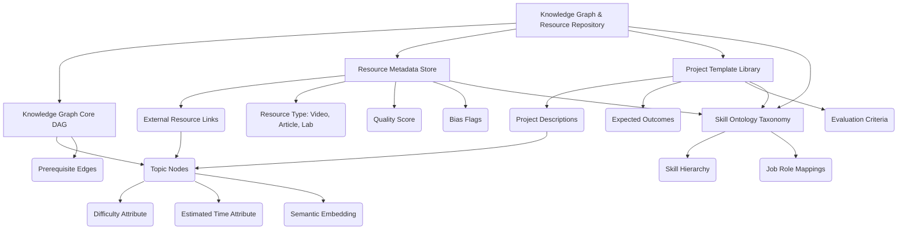
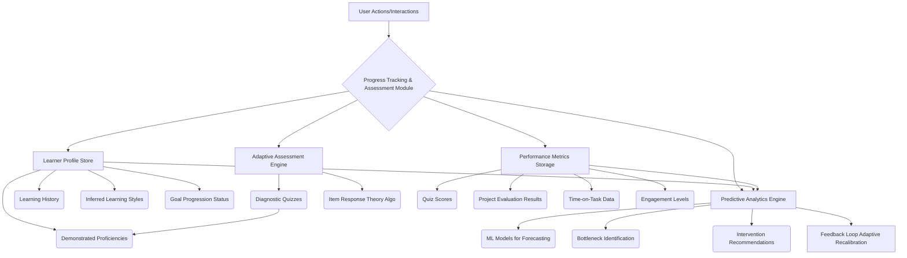
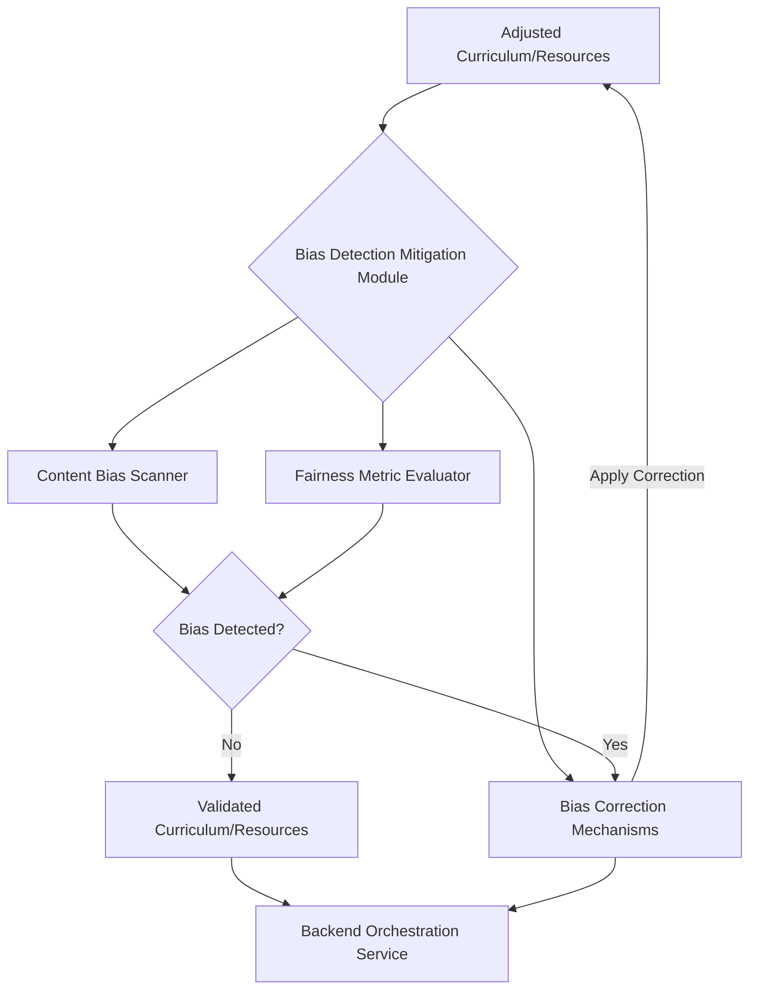
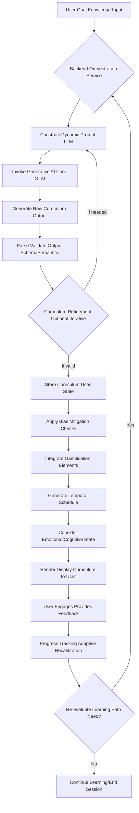
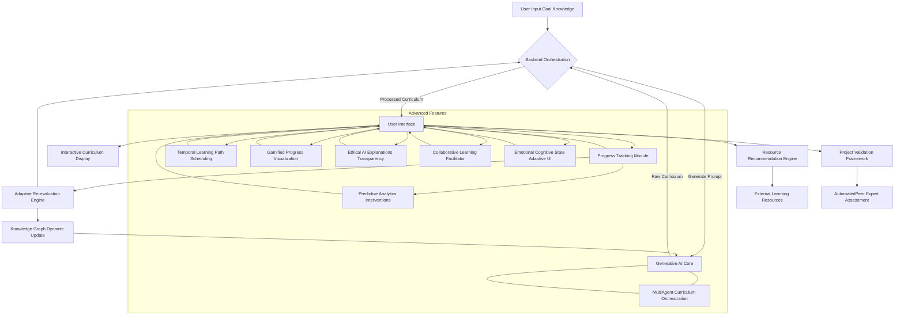
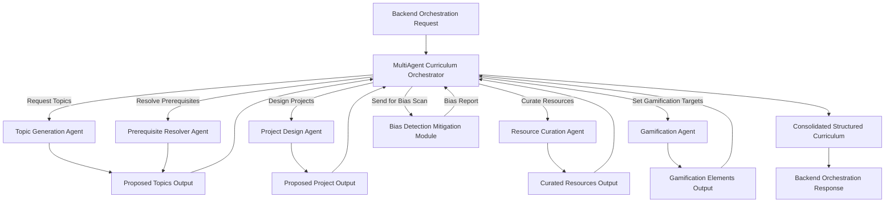

**Title of Invention:** A System and Method for Adaptive and Personalized Educational Trajectory Synthesis via Advanced Generative AI Paradigms with Multi-Agent Orchestration and Ethical Safeguards

**Abstract:**
Disclosed herein is a sophisticated system and methodology for dynamically generating, adapting, and presenting highly individualized educational curricula. This invention leverages advanced generative artificial intelligence models, specifically large language models LLMs and their derivatives, operating as expert pedagogical architects within a multi-agent orchestration framework. Upon receiving a user's defined learning objective, a comprehensive assessment of their current knowledge state, and personal learning preferences, the system constructs a meticulously structured, step-by-step learning trajectory. This trajectory is optimized for pedagogical efficacy, learner engagement via gamification, temporal feasibility, and ethical fairness. It encompasses a logically sequenced progression of foundational and advanced topics, bespoke practical projects designed for skill actualization, and curated links to high-fidelity external learning resources. The system's innovative core lies in its ability to synthesize novel learning paths that transcend static, pre-defined curricula, offering an unparalleled level of personalization and adaptive evolution in response to user progress, evolving educational landscapes, and continuous ethical auditing.

**Cross-Reference to Related Applications:**
Not applicable.

**Background of the Invention:**
The proliferation of digital information and the increasing imperative for continuous skill acquisition in rapidly evolving domains have amplified the demand for efficient and accessible educational modalities. While traditional and contemporary online learning platforms offer a vast repository of educational content, they predominantly present pre-defined, linear curricula. Such static structures inherently struggle to accommodate the heterogeneous prior knowledge, diverse learning styles, unique career aspirations, and dynamic cognitive paces characteristic of individual learners.
Learners embarking on self-directed educational journeys frequently confront significant challenges:
1.  **Information Asymmetry:** A vast and often unstructured global knowledge base makes it exceedingly difficult for individuals to discern optimal learning sequences or identify prerequisite topics. The sheer volume of available resources can lead to analysis paralysis or suboptimal learning paths.
2.  **Cognitive Overload in Pathfinding:** The intellectual burden of constructing a coherent, goal-oriented curriculum from disparate information sources is substantial. This self-curation process consumes valuable cognitive resources that could otherwise be directed towards actual learning.
3.  **Lack of Personalized Scaffolding:** Generic curricula often fail to bridge the specific knowledge gaps of an individual, leading to either redundancy reviewing already known material or insurmountable conceptual leaps encountering advanced topics without sufficient foundational understanding.
4.  **Disconnection Between Theory and Practice:** While theoretical knowledge is readily available, the integration of practical application through relevant projects remains a significant challenge for self-learners, often leading to a superficial understanding without tangible skill development.
5.  **Stagnation and Lack of Adaptability:** Pre-set paths offer no mechanisms to adapt to a learner's demonstrated mastery, changes in their learning objectives, or the emergence of new, critical sub-topics within a rapidly advancing field.
The advent of advanced generative AI models, characterized by their immense parametric complexity and emergent reasoning capabilities, presents an unprecedented opportunity to address these systemic deficiencies. These models possess an implicit, probabilistic understanding of vast knowledge graphs, enabling them to synthesize novel, contextually relevant, and pedagogically sound educational trajectories that are beyond the scope of manual human curation or rule-based expert systems.

**Brief Summary of the Invention:**
The present invention provides a novel system and method for autonomously synthesizing highly personalized educational curricula. The core innovation resides in employing an advanced generative artificial intelligence paradigm as a virtual, hyper-competent curriculum designer, operating within a multi-agent architecture. A user initiates interaction through an intuitive interface, articulating their specific educational objective e.g., "I aspire to become a proficient full-stack blockchain developer" and providing a granular assessment of their extant knowledge base e.g., "I possess foundational knowledge in Python, understand basic data structures, and have a rudimentary grasp of cryptographic principles". This structured input is dynamically transmuted into a sophisticated prompt engineered for optimal interaction with a large language model LLM-based Generative AI Core. The LLM, leveraging its prodigious implicit knowledge graph derived from extensive training on heterogeneous data corpora, processes this prompt to architect a logically coherent and progressively challenging learning trajectory. This trajectory is manifested as a structured output, typically in a machine-readable format such as JSON, delineating a series of sequential modules. Each module is further elaborated with a descriptive title, a concise overview of its pedagogical scope, a granular enumeration of key sub-topics to be mastered, and a specifically designed, practical project aimed at operationalizing the acquired theoretical knowledge. Crucially, the system integrates ethical AI principles, bias detection, gamification elements, and temporal planning to optimize the learning experience comprehensively. The system thus transcends the limitations of static learning resources by providing a dynamic, adaptively generated educational roadmap tailored precisely to the individual's current state and desired future state, demonstrably reducing cognitive overhead and accelerating skill acquisition while promoting engagement and fairness.

**Detailed Description of the Invention:**

**I. System Architecture and Component Interoperability**
The inventive system for generating personalized educational curricula is characterized by a modular, distributed architecture designed for scalability, robustness, and semantic precision. The system comprises several interconnected components, as depicted in the architectural diagram below, each playing a crucial role in the lifecycle of curriculum generation and delivery.

```mermaid
graph TD
    A[User Interface Layer] --> B{API Gateway};
    B --> C[Backend Orchestration Service];
    C --> D[Generative AI Core G_AI];
    C --> E[Knowledge Graph Resource Repository];
    C --> F[Progress Tracking Assessment Module];
    C --> G[Feedback Loop Adaptive Recalibration];
    C --> H[Data Security Privacy Subsystem];
    C --> I[Bias Detection Mitigation Module];
    C --> J[Gamification Motivation Engine];
    C --> K[Temporal Planning Scheduling Module];
    C --> L[Emotional Cognitive State Monitor];

    D --> C;
    E --> C;
    F --> C;
    G --> C;
    H --> C;
    I --> C;
    J --> C;
    K --> C;
    L --> C;
    L --> G;

    SubGraph_D[Generative AI Core G_AI]
        D1[Prompt Engineering Subsystem] --> D;
        D2[Contextualization Engine] --> D;
        D3[Iterative Refinement Mechanism] --> D;
        D4[MultiAgent Orchestrator] --> D;
    End
    SubGraph_E[Knowledge Graph Resource Repository]
        E1[Topic Prerequisite Graph] --> E;
        E2[Resource Metadata Store] --> E;
        E3[Project Template Library] --> E;
        E4[Skill Ontology Taxonomy] --> E;
    End
    SubGraph_F[Progress Tracking Assessment Module]
        F1[Learner Profile Store] --> F;
        F2[Assessment Data Analytics] --> F;
        F3[Adaptive Assessment Engine] --> F;
        F4[Predictive Analytics Engine] --> F;
    End
    SubGraph_G[Feedback Loop Adaptive Recalibration]
        G1[User Feedback Aggregator] --> G;
        G2[Behavioral Analytics Processor] --> G;
        G3[Curriculum Adjustment Logic] --> G;
    End
    SubGraph_I[Bias Detection Mitigation Module]
        I1[Content Bias Scanner] --> I;
        I2[Fairness Metric Evaluator] --> I;
        I3[Bias Correction Mechanisms] --> I;
    End
    SubGraph_J[Gamification Motivation Engine]
        J1[Achievement Tracking] --> J;
        J2[Reward Generation Logic] --> J;
        J3[Engagement Analytics] --> J;
    End
    SubGraph_K[Temporal Planning Scheduling Module]
        K1[User Time Constraints Input] --> K;
        K2[Optimal Schedule Optimizer] --> K;
        K3[Calendar Integration Service] --> K;
    End
    SubGraph_L[Emotional Cognitive State Monitor]
        L1[Biometric Sensor Integration] --> L;
        L2[Interaction Pattern Analyzer] --> L;
        L3[State Inference Model] --> L;
    End
```



**A. User Interface Layer:**
This layer comprises the client-side applications e.g., web applications, mobile applications, desktop clients through which a user interacts with the system. Its primary functions include:
*   **Goal Articulation Interface:** A sophisticated input mechanism allowing users to express their learning goals with varying degrees of specificity, from high-level aspirations "become a data scientist" to precise technical objectives "master C++ concurrency with `std::async` and `std::future`".
*   **Knowledge State Elicitation Interface:** A dynamic and adaptive assessment interface designed to collect comprehensive information regarding the user's current knowledge, skills, and experience. This can range from self-assessed proficiency sliders, textual descriptions, integrated quizzes, or even parsing of provided CVs or project portfolios.
*   **Learning Preferences Input:** Captures user preferences such as preferred learning modalities (visual, auditory, kinesthetic, reading/writing), desired pace, time availability, and gamification preferences.
*   **Curriculum Visualization Renderer:** Responsible for receiving the structured curriculum output from the backend and rendering it into an intuitive, navigable, and aesthetically pleasing format. This includes interactive module displays, topic drill-downs, project descriptions, resource links, progress indicators, and gamified elements.
*   **Feedback Mechanism:** Provides interfaces for users to offer explicit feedback on curriculum relevance, pacing, resource quality, project effectiveness, and ethical concerns, feeding into the adaptive recalibration system and bias detection module.
*   **Semantic Search Interface:** Enables users to directly query the Knowledge Graph for related topics, resources, or project ideas, fostering self-directed exploration.

**B. Backend Orchestration Service:**
This central service acts as the intelligent intermediary between the User Interface Layer and the various specialized backend modules. It is responsible for:
*   **Request Routing and Validation:** Receiving requests from the UI, validating input parameters, and routing them to the appropriate internal services.
*   **Dynamic Prompt Construction:** Assembles highly specific and context-rich prompts for the Generative AI Core based on user inputs, incorporating system-wide pedagogical guidelines, ethical constraints, and schema enforcement directives.
*   **Response Parsing and Validation:** Processes the raw output from the Generative AI Core, validating its adherence to the predefined structure e.g., JSON schema and semantic consistency. It also performs initial quality checks and routes the curriculum through the Bias Detection Mitigation Module.
*   **Data Persistence and Retrieval:** Interacts with the Knowledge Graph Resource Repository and the Progress Tracking Assessment Module to store and retrieve user profiles, curriculum histories, learning resources, and gamification data.
*   **Service Coordination:** Orchestrates interactions among the Generative AI Core, Knowledge Graph, Progress Tracking, Feedback, Bias Detection, Gamification, Temporal Planning, and Emotional/Cognitive State monitoring systems to ensure a cohesive, adaptive, and ethically sound learning experience.

**C. Generative AI Core G_AI:**
This is the intellectual nexus of the invention, embodying the expert curriculum designer, often implemented as a multi-agent system. It is instantiated by one or more highly advanced large language models LLMs, potentially fine-tuned for educational domain specificity. Its internal subsystems include:
*   **1. Prompt Engineering Subsystem:** Responsible for constructing optimal input prompts for the LLM. This involves:
    *   **Instructional Directives:** Encoding roles e.g., "You are an expert curriculum designer", task definitions e.g., "Generate a personalized, step-by-step learning plan", and output format constraints e.g., "JSON format with specific fields".
    *   **Input Integration:** Seamlessly embedding the user's learning goal, current knowledge assessment, and preferences into the prompt structure.
    *   **Constraint Enforcement:** Injecting parameters such as desired learning pace, preferred learning modalities, time availability, skill level granularity, and explicit ethical guidelines.
    *   **Dynamic Contextualization:** Integrating real-time data from the Emotional & Cognitive State Monitor (e.g., current frustration level) to adjust prompt directives for the G_AI.

```mermaid
graph TD
    A[User Input: Goal, Knowledge, Prefs] --> B{Prompt Engineering Subsystem};
    B --> C[Instructional Directives Generator];
    B --> D[Constraint Injection Logic];
    B --> E[Schema Enforcement Translator];
    B --> F[Contextual Data Fetcher];
    F --> F1[Knowledge Graph Context];
    F --> F2[User Profile History];
    F --> F3[Real-time Cognitive State];
    C --> G[Constructed LLM Prompt];
    D --> G;
    E --> G;
    F --> G;
    G --> H[Generative AI Core (LLM)];
```

*   **2. Contextualization Engine:** Enhances prompt richness by drawing upon external data:
    *   **Domain Ontologies:** Incorporating definitions, relationships, and taxonomies from relevant knowledge domains via the Knowledge Graph.
    *   **Learning Analytics:** Leveraging aggregated data on common learning paths, topic dependencies, and project efficacy from the Knowledge Graph and Progress Tracking.
    *   **User Profile History:** Accessing past learning paths, demonstrated strengths, identified weaknesses, and learning style adaptations from the Progress Tracking Module to refine personalization.
*   **3. Iterative Refinement Mechanism:** In cases where the initial AI output is suboptimal or requires further precision, this mechanism enables multi-turn interaction with the LLM or re-orchestration of agents. This involves:
    *   **Automated Validation:** Applying rules or secondary LLMs to assess coherence, logical flow, topic coverage, and adherence to ethical guidelines.
    *   **Refinement Prompts:** Generating follow-up prompts to the G_AI for clarification, expansion, or modification of specific curriculum elements e.g., "Expand Module 3 to include advanced React hooks," "Suggest alternative projects for a backend focus", "Ensure gender-neutral examples in resource recommendations".
*   **4. MultiAgent Orchestrator:** This represents a conceptual module for coordinating specialized AI agents, detailed in a later section.

**D. Knowledge Graph & Resource Repository:**
This component serves as the structured knowledge base and resource index for the entire system. It is a dynamic, evolving repository comprising:
*   **Knowledge Graph Core DAG:** A meticulously curated or implicitly derived directed acyclic graph DAG representing the interdependencies and semantic relationships between atomic and composite knowledge topics. Each node `t_i` represents a topic, and a directed edge `(t_i, t_j)` indicates `t_i` is a prerequisite for `t_j`. Nodes are enriched with metadata such as difficulty level, estimated learning time, and relevance scores.
*   **Resource Metadata Store:** A comprehensive, searchable database of high-quality external learning resources e.g., academic papers, online courses, tutorials, documentation, videos, interactive labs. Each resource is semantically tagged and linked to specific topics within the Knowledge Graph, with metadata for quality, modality, accessibility, and potential bias indicators.
*   **Project Template Library:** A repository of practical projects, each linked to specific topics and skills, with detailed descriptions, expected outcomes, evaluation criteria, and optional starter code.
*   **Skill Ontology Taxonomy:** A formalized system of classification and relationships for skills, competencies, and job roles, enabling precise mapping of user goals to knowledge requirements.



**E. Progress Tracking & Assessment Module:**
Monitors and records the user's learning journey and skill development.
*   **Learner Profile Store:** Stores comprehensive user data including learning history, completed modules, demonstrated proficiencies, inferred learning styles, and goal progression.
*   **Adaptive Assessment Engine:** Periodically or on-demand assesses the user's evolving knowledge state through adaptive testing algorithms e.g., Item Response Theory to provide a more objective measure than self-assessment.
*   **Performance Metrics Storage:** Records scores on integrated quizzes, project evaluations, time spent on various activities, and engagement levels.
*   **Predictive Analytics Engine:** Utilizes machine learning to forecast a user's likelihood of achieving their goal, identify potential bottlenecks, and suggest proactive interventions, including recommendations for adjusting learning pace or content.



**F. Feedback Loop & Adaptive Recalibration System:**
A critical component for continuous improvement and dynamic curriculum adjustment.
*   **User Feedback Aggregator:** Gathers and analyzes user-provided explicit feedback on curriculum elements, resource quality, project effectiveness, and ethical concerns.
*   **Behavioral Analytics Processor:** Monitors user behavior e.g., time spent on topics, re-visitation patterns, project completion rates, module skipping, interaction with gamified elements to infer learning difficulties, engagement, or interests.
*   **Curriculum Adjustment Logic:** Based on aggregated feedback, progress data, and predictive analytics, this system signals the Backend Orchestration Service to invoke the Generative AI Core for dynamic adjustments to the current learning path, optimizing it for the learner's evolving needs, performance, and preferences. It also considers inputs from the Bias Detection Mitigation Module and Emotional/Cognitive State Monitor.

```mermaid
graph TD
    A[User Interface] -- Explicit Feedback --> B[User Feedback Aggregator];
    A[User Actions] -- Implicit Behaviors --> C[Behavioral Analytics Processor];
    D[Progress Tracking Module] -- Performance Data --> E[Curriculum Adjustment Logic];
    F[Bias Detection Module] -- Bias Reports --> E;
    G[Emotional/Cognitive State Monitor] -- Learner State --> E;

    B --> E; C --> E;
    E --> H{Re-evaluation Needed?};
    H -- Yes --> I[Backend Orchestration Service (Trigger G_AI)];
    H -- No --> J[Maintain Current Curriculum];
```

**G. Data Security & Privacy Subsystem:**
Ensures the confidentiality, integrity, and availability of user data.
*   **Access Control:** Implements robust authentication and authorization mechanisms.
*   **Data Encryption:** Encrypts sensitive user data at rest and in transit.
*   **Compliance Frameworks:** Adheres to relevant data protection regulations e.g., GDPR, CCPA, ensuring transparent data handling policies.
*   **Anonymization:** Employs techniques for anonymizing aggregated learning data used for system improvement without compromising individual privacy.

**H. Bias Detection & Mitigation Module:**
Dedicated to ensuring fairness, representativeness, and ethical integrity of the generated curricula and recommended resources.
*   **Content Bias Scanner:** Employs natural language processing NLP and machine learning techniques to scan curriculum content, project descriptions, and resource metadata for potential biases related to gender, race, culture, socioeconomic status, or other protected characteristics.
*   **Fairness Metric Evaluator:** Quantitatively assesses the curriculum for fairness metrics such as equality of opportunity, demographic parity, and disparate impact, ensuring that learning paths do not inadvertently disadvantage certain groups.
*   **Bias Correction Mechanisms:** Integrates strategies to mitigate detected biases, such as suggesting alternative phrasing, diversifying examples, recommending a broader range of resources, or prompting the Generative AI Core for re-synthesis with explicit anti-bias directives.



**I. Gamification & Motivation Engine:**
Enhances learner engagement and motivation through game-like elements.
*   **Achievement Tracking:** Records learner milestones, module completions, project successes, and skill mastery to award achievements and badges.
*   **Reward Generation Logic:** Defines rules for assigning points, unlocking new content, or granting virtual rewards based on progress and effort.
*   **Engagement Analytics:** Monitors user interaction with gamified elements and overall platform engagement to dynamically adjust gamification strategies and maintain motivation.

**J. Temporal Planning & Scheduling Module:**
Facilitates the creation of a realistic and manageable learning schedule based on user availability.
*   **User Time Constraints:** Processes user input regarding daily/weekly available study hours, preferred study times, and deadlines.
*   **Optimal Schedule Optimizer:** Leverages constrained optimization algorithms to generate a feasible learning schedule for the curriculum, distributing modules and topics over time while respecting prerequisites and estimated durations.
*   **Calendar Integration Service:** Allows for seamless synchronization of the generated learning schedule with external calendar applications, providing reminders and helping users adhere to their plan.

```mermaid
graph TD
    A[Curriculum Modules/Topics] --> B{Temporal Planning Scheduling Module};
    C[User Time Constraints] --> B;
    D[Prerequisite Graph (from KG)] --> B;
    E[Estimated Durations (from KG)] --> B;

    B --> F[Optimal Schedule Optimizer];
    F -- Proposed Schedule --> G[Calendar Integration Service];
    G --> H[User Calendar/Notifications];
    F --> I[Dynamic Rescheduling Trigger];
    I --> B;
    B --> J[Scheduled Learning Plan Output];
```

**K. Emotional & Cognitive State Monitoring:**
The system integrates with passive biometric sensors or uses AI-driven analysis of user interaction patterns e.g., typing speed, mouse movements, facial expressions via optional webcam to infer the learner's emotional state e.g., frustration, engagement, boredom and cognitive load. This real-time data informs the Adaptive Recalibration System, allowing for dynamic adjustments such as:
*   Reducing difficulty or introducing review modules when frustration is detected.
*   Accelerating pace or suggesting advanced topics during periods of high engagement.
*   Modifying content presentation to alleviate boredom or cognitive overload.
This proactive adaptation ensures optimal learning conditions are maintained, enhancing retention and overall learner well-being.

```mermaid
graph TD
    A[User Interface/Device] -- Interaction Patterns --> B[Interaction Pattern Analyzer];
    A -- Biometric Data (Optional) --> C[Biometric Sensor Integration];
    B --> D{State Inference Model};
    C --> D;
    D -- Inferred State: Frustration, Engagement, Cognitive Load --> E[Feedback Loop Adaptive Recalibration];
    D --> F[Prompt Engineering Subsystem];
    F -- Contextual Adjustment --> G[Generative AI Core];
    E -- Dynamic Curriculum Adjustments --> G;
    G --> H[User Interface (Adjusted Presentation)];
```

**II. Method of Operation: Comprehensive Workflow for Personalized Curriculum Generation**
The operational flow of the inventive system is a sophisticated sequence of interactions, data transformations, and intelligent syntheses, designed to deliver a highly personalized educational trajectory.



**A. Initial User Interaction and Goal Articulation:**
The process commences with the user interacting with the User Interface Layer. The user articulates their desired educational outcome. This input is captured through structured forms, natural language interfaces, or a combination thereof. For instance, a user might state: "I want to become a proficient machine learning engineer specializing in natural language processing NLP." Simultaneously, the user provides their learning preferences, time availability, and any specific constraints.

**B. Current Knowledge State Elicitation and Assessment:**
Concurrently with goal articulation, the system collects data pertaining to the user's current knowledge base. This is achieved through a multi-faceted approach to ensure robust and accurate profiling:
*   **1. Declarative Input:** The user explicitly self-reports their existing skills, proficiency levels, and relevant experience. This can include listing known programming languages, frameworks, theoretical concepts, and past projects.
*   **2. Algorithmic Assessment Integration:** The system can optionally deploy short, adaptive diagnostic quizzes or problem sets designed to objectively gauge proficiency in core areas identified as relevant to the learning goal. These assessments leverage techniques like Item Response Theory to efficiently determine a learner's ability level with a minimal number of questions.
*   **3. Implicit Behavioral Analysis:** For returning users, the Progress Tracking Assessment Module may analyze past learning behaviors, completed modules, and resource engagement to infer current strengths and weaknesses.

**C. Dynamic Prompt Synthesis and AI Invocation:**
The Backend Orchestration Service aggregates the user's articulated goal, current knowledge state, and learning preferences. It then invokes the Prompt Engineering Subsystem to construct a highly specific and contextually rich prompt for the Generative AI Core G_AI. This prompt explicitly instructs the G_AI on its role expert curriculum designer, the task generate a personalized learning path, the target user's context, and the required output format e.g., JSON schema with `curriculumTitle`, `modules`, `topics`, `project`, `gamificationElements` fields. The Contextualization Engine may inject additional pedagogical heuristics, domain-specific constraints from the Knowledge Graph, and ethical guidelines, potentially adjusted by input from the Emotional & Cognitive State Monitor.

**D. Curriculum Response Processing and Validation:**
The Generative AI Core processes the prompt and synthesizes a structured curriculum. This raw output is then returned to the Backend Orchestration Service. The service immediately engages in robust parsing and validation, ensuring that the G_AI's response:
*   Adheres strictly to the specified JSON schema.
*   Is syntactically correct and well-formed.
*   Is semantically coherent and logically consistent in its proposed topic sequence and project relevance.
*   Does not contain factual inaccuracies or outdated information potentially cross-referenced with the Knowledge Graph.

**E. Application of Bias Mitigation, Gamification, and Temporal Planning:**
Upon successful initial validation, the raw curriculum proceeds through a series of enhancement steps orchestrated by the Backend Orchestration Service:
*   **1. Bias Mitigation Checks:** The curriculum content, project descriptions, and suggested resources are scanned by the Bias Detection Mitigation Module. Any detected biases are flagged, and correction mechanisms are applied, potentially involving re-prompting the G_AI or automated content adjustments to ensure fairness and inclusivity.
*   **2. Gamification Element Integration:** The Gamification Motivation Engine reviews the curriculum and inserts appropriate gamified elements e.g., points for module completion, badges for project mastery, streaks for consistent engagement, based on user preferences.
*   **3. Temporal Schedule Generation:** Utilizing the user's specified time availability and deadlines, the Temporal Planning Scheduling Module optimizes and generates a detailed learning schedule, distributing modules and topics over time to create a realistic and manageable plan.
*   **4. Emotional/Cognitive State Adaptation:** The system considers the current or predicted emotional/cognitive state of the learner from the Emotional & Cognitive State Monitor to fine-tune aspects of the curriculum before presentation, such as suggesting a lighter load if frustration is high, or more challenging content if engagement is exceptional.

**F. Presentation and Interactive Engagement:**
Upon completion of all processing steps, the Backend Orchestration Service transmits the enriched structured curriculum data to the User Interface Layer. The Curriculum Visualization Renderer then transforms this data into an intuitive, interactive, and visually appealing display, incorporating all personalized elements including the schedule and gamification. Users can navigate modules, explore sub-topics, review project descriptions, access linked external resources, track their progress, and see their achievements.

**G. Adaptive Path Adjustment and Continuous Learning:**
The system is not a static curriculum generator but an adaptive learning companion. As the user progresses, interacts with resources, completes projects, engages with gamified elements, provides feedback, and exhibits evolving emotional/cognitive states, the Progress Tracking Assessment Module records their activities. The Feedback Loop Adaptive Recalibration System continuously monitors these data points. If a user struggles with a particular topic, masters a module faster than anticipated, shifts their learning focus, provides negative feedback on a resource, or shows signs of frustration/boredom, this system signals the Backend Orchestration Service to trigger a re-evaluation. A new cycle of prompt synthesis and G_AI invocation may occur, leading to dynamic adjustments, refinements, or complete re-architecting of the learning path, ensuring it remains optimally aligned with the user's evolving needs, performance, preferences, and ethical considerations. The Temporal Planning Scheduling Module also recalculates the schedule as needed.

**III. Exemplary Embodiments and Advanced Features**



**A. Multi-Agent Curriculum Synthesis:**
The Generative AI Core G_AI is implemented not as a monolithic LLM, but as a sophisticated multi-agent system. A central `MultiAgent Curriculum Orchestrator` coordinates several specialized AI agents, each an expert in a specific aspect of curriculum design, allowing for granular control, higher quality output, and easier integration of constraints.



*   **1. MultiAgent Curriculum Orchestrator:** Receives the high-level prompt, decomposes it into sub-tasks, and assigns these to specialized agents. It then aggregates and synthesizes the outputs from these agents into a coherent curriculum structure.
*   **2. Topic Generation Agent:** Specializes in identifying and structuring relevant topics and sub-topics for a given learning objective and current knowledge state. It leverages the Knowledge Graph's embeddings and semantic relationships.
*   **3. Prerequisite Resolver Agent:** Focuses on establishing the correct pedagogical order and dependencies between topics, ensuring foundational knowledge is built progressively. It queries the Knowledge Graph extensively and applies topological sorting principles.
*   **4. Project Design Agent:** Innovates and designs practical projects that effectively operationalize the theoretical knowledge acquired in each module, tailoring projects to user preferences and skill levels by querying the Project Template Library and Knowledge Graph.
*   **5. Resource Curation Agent:** Scans the Resource Metadata Store and external sources to identify, filter, and recommend high-quality, relevant learning resources across various modalities, also considering user's preferred learning style and bias flags.
*   **6. Gamification Agent:** Based on user preferences and curriculum structure, designs specific gamified elements (points, badges, challenges) for each module and project.
*   **7. Bias Check Agent (integrated via the Bias Detection Mitigation Module):** Before final consolidation, the orchestrator routes proposed content to the Bias Detection Mitigation Module for an ethical review.

**B. Multi-Modal Learning Resource Integration:**
The system extends beyond merely suggesting text-based resources. It intelligently recommends and integrates resources across various modalities, including:
*   **Video Lectures:** Links to specific segments of online courses or tutorials.
*   **Interactive Simulations/Labs:** Embedded or linked virtual environments for hands-on practice.
*   **Code Sandboxes:** Integrated development environments IDEs within the platform for immediate coding exercises.
*   **Audio Explanations:** Podcasts or audio lessons for auditory learners.
The Generative AI Core, in conjunction with the Knowledge Graph Resource Repository and the Resource Curation Agent, selects resources based on the user's inferred learning style, preferred modality, and the specific pedagogical requirements of each topic.

**C. Project-Based Learning Validation Framework:**
To ensure practical skill acquisition, each curriculum module culminates in a suggested project. The system includes a sophisticated project validation framework:
*   **Automated Code Assessment:** For coding projects, integrates with static analysis tools, unit testing frameworks, and potentially AI-driven code evaluation metrics to provide immediate feedback on correctness, efficiency, and adherence to best practices.
*   **Peer Review System:** Facilitates collaborative learning by allowing users to review each other's project submissions based on predefined rubrics, fostering critical evaluation skills.
*   **Expert Review Augmentation:** Optionally routes complex projects to human experts for qualitative feedback, particularly for nuanced design or architectural decisions.

**D. Collaborative Learning Path Generation:**
The system can facilitate the creation of shared learning paths for groups of users with common goals but potentially diverse starting points. The Generative AI Core can synthesize a core curriculum, while dynamically creating individualized branches for members requiring foundational remediation or advanced supplementation, ensuring group coherence while accommodating individual differences.

**E. Expertise Level Granularity and Calibration:**
The system defines and operates on a fine-grained spectrum of expertise levels e.g., Novice, Apprentice, Journeyman, Expert, Master for each topic. The Generative AI Core dynamically calibrates the depth and breadth of topics and the complexity of projects based on the target expertise level for the entire curriculum or specific modules, providing a truly progressive learning curve.

**F. Real-time Progress Tracking and Predictive Analytics:**
Beyond simply logging completion, the system employs predictive analytics to forecast a user's likelihood of achieving their goal, identify potential bottlenecks, and recommend interventions. Machine learning models analyze historical data from numerous learners to provide personalized estimates for module completion times and to flag areas where a user might require additional support or alternative resources.

**G. Semantic Search and Knowledge Graph Traversal Integration:**
The User Interface Layer includes advanced semantic search capabilities, allowing users to query the Knowledge Graph directly. This enables ad-hoc exploration of related topics, discovery of new learning avenues, and deeper dives into specific subjects beyond the prescribed curriculum path, thereby fostering intrinsic curiosity and self-discovery.

**H. Emotional & Cognitive State Monitoring:**
The system integrates with passive biometric sensors or uses AI-driven analysis of user interaction patterns e.g., typing speed, mouse movements, facial expressions via optional webcam to infer the learner's emotional state e.g., frustration, engagement, boredom and cognitive load. This real-time data informs the Adaptive Recalibration System, allowing for dynamic adjustments such as:
*   Reducing difficulty or introducing review modules when frustration is detected.
*   Accelerating pace or suggesting advanced topics during periods of high engagement.
*   Modifying content presentation to alleviate boredom or cognitive overload.
This proactive adaptation ensures optimal learning conditions are maintained, enhancing retention and overall learner well-being.

**I. Ethical AI and Bias Mitigation in Curriculum Design:**
The Bias Detection Mitigation Module actively scrutinizes all generated and recommended content. It operates at multiple stages:
*   **Pre-Generation Contextualization:** Injecting explicit bias reduction directives into prompts for the Generative AI Core.
*   **Post-Generation Audit:** Automatically scanning the generated curriculum for stereotypical language, underrepresentation of diverse perspectives, or potentially harmful examples.
*   **Resource Fairness Analysis:** Evaluating external resources for their inherent biases or lack of inclusivity, and recommending alternatives where necessary.
*   **Explainability:** Providing transparency to users on *why* certain topics or resources were selected, and how bias detection was applied.

**J. Gamified Learning Pathways:**
The Gamification Motivation Engine integrates motivational elements directly into the learning journey:
*   **Points and Experience:** Users earn points for completing topics, modules, and projects, contributing to an overall experience level.
*   **Badges and Achievements:** Specific milestones or skill mastery are recognized with digital badges.
*   **Streaks and Habits:** Encourages consistent learning through daily streak tracking.
*   **Leaderboards (Optional):** Allows users to compare their progress with peers or within collaborative groups.
*   **Unlockable Content:** Advanced modules or special resources can be unlocked upon reaching certain proficiency levels or earning specific achievements.

**K. Temporal Learning Path Scheduling:**
The Temporal Planning Scheduling Module transforms the abstract learning path into a concrete, executable study plan:
*   **Feasibility Analysis:** Determines if the user's goal is achievable within their specified time constraints.
*   **Prioritization Engine:** Ranks topics and modules based on criticality and dependency, allocating time optimally.
*   **Dynamic Rescheduling:** Automatically adjusts the schedule in response to user progress faster/slower than expected, unforeseen interruptions, or changes in availability.
*   **Reminders and Nudges:** Integrates with user calendars and notification systems to provide timely reminders and motivational nudges.

**IV. Data Structures and Schemas**
The system's operational efficacy is predicated on rigorously defined data structures, ensuring consistent communication between components and precise interpretation of the Generative AI Core's output. A core example is the JSON schema used for representing a synthesized curriculum:

```json
{
  "$schema": "http://json-schema.org/draft-07/schema#",
  "title": "Personalized Learning Curriculum",
  "description": "A comprehensive, step-by-step learning plan generated by the AI, enhanced with gamification and scheduling.",
  "type": "object",
  "required": [
    "curriculumId",
    "curriculumTitle",
    "targetSkill",
    "initialKnowledgeProfile",
    "creationTimestamp",
    "lastUpdatedTimestamp",
    "modules",
    "gamificationElements",
    "learningSchedule",
    "learnerContextLog"
  ],
  "properties": {
    "curriculumId": {
      "type": "string",
      "description": "Unique identifier for this generated curriculum instance."
    },
    "curriculumTitle": {
      "type": "string",
      "description": "The overarching title of the learning path (e.g., 'Go Backend Developer Path')."
    },
    "targetSkill": {
      "type": "string",
      "description": "The specific skill or role the user aims to achieve (e.g., 'Professional Go Backend Developer')."
    },
    "initialKnowledgeProfile": {
      "type": "object",
      "description": "A snapshot of the user's assessed knowledge at curriculum generation.",
      "properties": {
        "summary": { "type": "string" },
        "proficiencies": {
          "type": "array",
          "items": {
            "type": "object",
            "properties": {
              "skill": { "type": "string" },
              "level": { "type": "string", "enum": ["Novice", "Beginner", "Intermediate", "Advanced", "Expert"] },
              "confidence": { "type": "number", "minimum": 0, "maximum": 1, "description": "Confidence score for the proficiency level." }
            },
            "required": ["skill", "level"]
          }
        },
        "learningStyle": {
          "type": "string",
          "enum": ["Visual", "Auditory", "Kinesthetic", "ReadingWriting", "Mixed"],
          "description": "Inferred or declared preferred learning modality."
        },
        "pacePreference": {
          "type": "string",
          "enum": ["Slow", "Moderate", "Fast"],
          "description": "User's preferred learning pace."
        },
        "cognitiveLoadTolerance": {
          "type": "string",
          "enum": ["Low", "Medium", "High"],
          "description": "User's preferred tolerance for cognitive intensity."
        }
      },
      "required": ["summary", "proficiencies"]
    },
    "creationTimestamp": {
      "type": "string",
      "format": "date-time",
      "description": "Timestamp when the curriculum was initially generated."
    },
    "lastUpdatedTimestamp": {
      "type": "string",
      "format": "date-time",
      "description": "Timestamp of the last modification or adaptation of the curriculum."
    },
    "modules": {
      "type": "array",
      "description": "An ordered list of learning modules.",
      "items": {
        "type": "object",
        "required": ["moduleId", "title", "description", "prerequisites", "estimatedDurationHours", "topics", "project"],
        "properties": {
          "moduleId": {
            "type": "string",
            "description": "Unique identifier for this module."
          },
          "title": {
            "type": "string",
            "description": "Title of the learning module (e.g., 'Module 1 Go Fundamentals')."
          },
          "description": {
            "type": "string",
            "description": "Brief description of the module's content and objectives."
          },
          "prerequisites": {
            "type": "array",
            "items": { "type": "string" },
            "description": "List of topic IDs or module IDs that must be understood before this module."
          } ,
          "estimatedDurationHours": {
            "type": "number",
            "description": "Estimated time in hours to complete this module."
          },
          "difficultyLevel": {
            "type": "string",
            "enum": ["Easy", "Medium", "Hard", "Advanced", "Expert"],
            "description": "Overall difficulty level of the module."
          },
          "topics": {
            "type": "array",
            "description": "Key sub-topics covered within this module.",
            "items": {
              "type": "object",
              "required": ["topicId", "name", "description", "difficulty", "learningObjectives"],
              "properties": {
                "topicId": { "type": "string" },
                "name": { "type": "string" },
                "description": { "type": "string" },
                "difficulty": { "type": "string", "enum": ["Easy", "Medium", "Hard", "Advanced"] },
                "learningObjectives": {
                  "type": "array",
                  "items": { "type": "string" },
                  "description": "What the user should be able to do after learning this topic."
                },
                "semanticTags": {
                  "type": "array",
                  "items": { "type": "string" },
                  "description": "Keywords or categories for semantic search."
                },
                "suggestedResources": {
                  "type": "array",
                  "items": {
                    "type": "object",
                    "properties": {
                      "resourceId": { "type": "string" },
                      "title": { "type": "string" },
                      "url": { "type": "string", "format": "uri" },
                      "type": { "type": "string", "enum": ["Article", "Video", "Course", "Book", "Documentation", "Interactive Lab", "Podcast", "Code Sandbox", "Simulation"] },
                      "qualityScore": { "type": "number", "minimum": 1, "maximum": 5 },
                      "modality": { "type": "string", "enum": ["Visual", "Auditory", "Kinesthetic", "ReadingWriting", "Mixed"] },
                      "biasFlags": {
                        "type": "array",
                        "items": { "type": "string" },
                        "description": "Flags indicating potential biases detected in the resource."
                      }
                    },
                    "required": ["resourceId", "title", "url", "type"]
                  },
                  "description": "Curated external learning resources for this topic."
                }
              }
            }
          }
        },
        "project": {
          "type": "object",
          "description": "A practical project to apply knowledge from the module.",
          "required": ["projectId", "title", "description", "expectedOutcomes", "evaluationCriteria"],
          "properties": {
            "projectId": { "type": "string" },
            "title": { "type": "string" },
            "description": { "type": "string" },
            "expectedOutcomes": {
              "type": "array",
              "items": { "type": "string" },
              "description": "Skills and deliverables expected from completing the project."
            },
            "evaluationCriteria": {
              "type": "array",
              "items": { "type": "string" },
              "description": "Criteria by which the project's success will be measured."
            },
            "starterCodeUrl": {
              "type": "string",
              "format": "uri",
              "description": "Optional link to starter code repository."
            },
            "gamificationMultiplier": {
              "type": "number",
              "description": "Multiplier for points earned upon project completion."
            },
            "validationMethod": {
              "type": "string",
              "enum": ["Automated", "PeerReview", "ExpertReview", "SelfAssessment"],
              "description": "Method used to validate project completion and quality."
            }
          }
        }
      }
    },
    "gamificationElements": {
      "type": "object",
      "description": "Metadata for gamified elements associated with the curriculum.",
      "properties": {
        "pointsPerModule": { "type": "number" },
        "pointsPerProject": { "type": "number" },
        "initialBadges": {
          "type": "array",
          "items": { "type": "string" },
          "description": "Badges awarded at the start or for specific achievements."
        },
        "overallExperienceGoal": { "type": "number" },
        "rewardsThresholds": {
          "type": "array",
          "items": {
            "type": "object",
            "properties": {
              "points": { "type": "number" },
              "reward": { "type": "string" }
            },
            "required": ["points", "reward"]
          }
        },
        "streakBonusPoints": { "type": "number", "description": "Points awarded for maintaining a learning streak." },
        "leaderboardEnabled": { "type": "boolean", "description": "Indicates if leaderboard participation is enabled for the user." }
      },
      "required": ["overallExperienceGoal"]
    },
    "learningSchedule": {
      "type": "array",
      "description": "A temporal plan for learning activities.",
      "items": {
        "type": "object",
        "properties": {
          "activityType": { "type": "string", "enum": ["Module", "Topic", "Project", "Review", "Assessment", "Break"] },
          "referenceId": { "type": "string", "description": "ID of the module, topic, or project." },
          "scheduledStartTime": { "type": "string", "format": "date-time" },
          "scheduledEndTime": { "type": "string", "format": "date-time" },
          "estimatedDurationMinutes": { "type": "number" },
          "actualDurationMinutes": { "type": "number", "description": "Actual time spent by user on this activity." },
          "status": { "type": "string", "enum": ["Scheduled", "InProgress", "Completed", "Skipped", "Rescheduled"] }
        },
        "required": ["activityType", "referenceId", "scheduledStartTime", "scheduledEndTime", "estimatedDurationMinutes"]
      }
    },
    "biasAuditLog": {
      "type": "array",
      "description": "Log of bias detection and mitigation actions for this curriculum.",
      "items": {
        "type": "object",
        "properties": {
          "timestamp": { "type": "string", "format": "date-time" },
          "detectedBias": { "type": "string" },
          "location": { "type": "string", "description": "e.g., Module 3 Project Description" },
          "actionTaken": { "type": "string" },
          "severity": { "type": "string", "enum": ["Low", "Medium", "High"] },
          "explanation": { "type": "string", "description": "Detailed explanation of the bias and mitigation." }
        },
        "required": ["timestamp", "detectedBias", "location", "actionTaken"]
      }
    },
    "learnerContextLog": {
      "type": "array",
      "description": "Log of inferred learner emotional and cognitive states impacting curriculum adaptation.",
      "items": {
        "type": "object",
        "properties": {
          "timestamp": { "type": "string", "format": "date-time" },
          "inferredState": { "type": "string", "enum": ["Engaged", "Frustrated", "Bored", "Overloaded", "Focused"] },
          "associatedActivity": { "type": "string", "description": "ID of the activity during which state was inferred." },
          "adaptationAction": { "type": "string", "description": "Action taken by the system in response to the state." }
        },
        "required": ["timestamp", "inferredState", "associatedActivity", "adaptationAction"]
      }
    }
  }
}
```

**Claims:**
1.  A system for generating an adaptive and personalized educational curriculum, comprising:
    a.  A User Interface Layer configured to receive a user-defined educational objective, an assessment of the user's current knowledge state, and user learning preferences;
    b.  A Backend Orchestration Service coupled to the User Interface Layer, configured to:
        i.   Construct a dynamic, context-rich prompt incorporating the educational objective, current knowledge assessment, and learning preferences;
        ii.  Transmit the prompt to a Generative AI Core;
        iii. Receive a structured curriculum output from the Generative AI Core;
        iv. Validate and process the structured curriculum; and
        v.   Coordinate interaction with a Bias Detection Mitigation Module, a Gamification Motivation Engine, a Temporal Planning Scheduling Module, and an Emotional & Cognitive State Monitor;
    c.  A Generative AI Core, comprising one or more large language models LLMs operating within a multi-agent orchestration framework, configured to receive the prompt and synthesize a novel, step-by-step educational curriculum in a structured format;
    d.  A Knowledge Graph Resource Repository coupled to the Backend Orchestration Service, comprising a directed acyclic graph DAG representing interdependencies between knowledge topics and an indexed repository of external learning resources;
    e.  A Progress Tracking Assessment Module coupled to the Backend Orchestration Service, configured to monitor user engagement and learning progress, and update the user's knowledge state;
    f.   A Bias Detection Mitigation Module coupled to the Backend Orchestration Service, configured to scan curriculum content and resources for biases, and apply correction mechanisms;
    g.  A Gamification Motivation Engine coupled to the Backend Orchestration Service, configured to integrate game-like elements into the learning path to enhance user engagement;
    h.  A Temporal Planning Scheduling Module coupled to the Backend Orchestration Service, configured to generate an optimal learning schedule based on user time constraints; and
    i.   An Emotional & Cognitive State Monitor coupled to the Backend Orchestration Service, configured to infer a user's emotional and cognitive state and provide this information for curriculum adaptation.

2.  The system of claim 1, further comprising a Feedback Loop Adaptive Recalibration System coupled to the Backend Orchestration Service, the Progress Tracking Assessment Module, and the Emotional & Cognitive State Monitor, configured to:
    a.  Collect explicit and implicit feedback on the curriculum's efficacy, user performance, ethical concerns, and inferred user states;
    b.  Analyze said feedback, updated knowledge state, and inferred user states; and
    c.  Trigger the Backend Orchestration Service to invoke the Generative AI Core for dynamic adjustment of the learning curriculum, considering inputs from the Bias Detection Mitigation Module, Gamification Motivation Engine, Temporal Planning Scheduling Module, and Emotional & Cognitive State Monitor.

3.  The system of claim 1, wherein the assessment of the user's current knowledge state includes at least one of:
    a.  Declarative self-assessment input from the user;
    b.  Algorithmic assessment derived from adaptive diagnostic quizzes utilizing Item Response Theory; or
    c.  Implicit behavioral analysis from prior learning interactions or engagement patterns.

4.  The system of claim 1, wherein the dynamic prompt constructed by the Backend Orchestration Service includes:
    a.  Instructional directives defining the role and task of the Generative AI Core;
    b.  Explicit parameters derived from the user's goal, knowledge, and learning preferences;
    c.  A predefined response schema to enforce the structure of the curriculum output, including fields for gamification, scheduling, and bias audit logs; and
    d.  Contextual parameters derived from the inferred emotional or cognitive state of the user.

5.  The system of claim 1, wherein the structured curriculum comprises an ordered sequence of learning modules, each module including:
    a.  A module title and description;
    b.  An enumerated list of key sub-topics with associated learning objectives;
    c.  A suggested practical project designed to apply learned concepts;
    d.  Curated links to external learning resources from the Knowledge Graph Resource Repository; and
    e.  Integrated gamification elements and estimated scheduled times.

6.  The system of claim 5, wherein each sub-topic further includes a set of specific learning objectives, an estimated difficulty level, and a set of associated multi-modal learning resources selected based on modality preference, quality scores, and bias analysis.

7.  The system of claim 5, further comprising a Project Validation Framework configured to:
    a.  Provide automated assessment of project submissions via static analysis, unit testing, or AI-driven code evaluation;
    b.  Facilitate peer review processes based on predefined rubrics; or
    c.  Integrate with expert human review for qualitative feedback on complex projects.

8.  A method for generating an adaptive and personalized educational trajectory, comprising the steps of:
    a.  Receiving, at a User Interface Layer, a desired educational objective, a quantified current knowledge state, and user learning preferences from a user;
    b.  Transmitting said objective, knowledge state, and preferences to a Backend Orchestration Service;
    c.  Inferring, by an Emotional & Cognitive State Monitor, the user's emotional and cognitive state from interaction patterns or biometric data;
    d.  Constructing, by the Backend Orchestration Service, a highly specific computational prompt for a Generative AI Core, said prompt incorporating the objective, knowledge state, preferences, inferred user state, and a specified output schema;
    e.  Invoking, by the Backend Orchestration Service, the Generative AI Core, which operates as a multi-agent system, with the constructed prompt;
    f.  Synthesizing, by the Generative AI Core, a structured, personalized learning curriculum in response to the prompt;
    g.  Receiving and validating, by the Backend Orchestration Service, the synthesized curriculum against the specified output schema and semantic coherence criteria;
    h.  Applying bias mitigation checks to the curriculum by a Bias Detection Mitigation Module;
    i.   Integrating gamification elements into the curriculum by a Gamification Motivation Engine;
    j.   Generating a temporal learning schedule for the curriculum by a Temporal Planning Scheduling Module; and
    k.  Displaying the validated, gamified, and scheduled curriculum to the user via the User Interface Layer, with dynamic adjustments based on the inferred emotional and cognitive state.

9.  The method of claim 8, further comprising the step of continuously monitoring user progress and engagement via a Progress Tracking Assessment Module, including time-on-task, completion rates, and performance metrics.

10. The method of claim 9, further comprising the step of dynamically adjusting the displayed curriculum by:
    a.  Collecting feedback on the curriculum's efficacy, user performance, ethical aspects, and evolving emotional/cognitive states;
    b.  Analyzing said feedback and the updated knowledge state;
    c.  Generating a refined prompt for the Generative AI Core based on the analysis; and
    d.  Re-synthesizing, re-checking for bias, re-gamifying, re-scheduling, and re-displaying an updated curriculum to the user.

11. The method of claim 8, wherein the step of synthesizing the curriculum includes the Generative AI Core traversing an implicit or explicit Knowledge Graph to identify relevant topics, establish pedagogical dependencies, and optimize the learning sequence, coordinated by a MultiAgent Curriculum Orchestrator.

12. The method of claim 8, wherein the curriculum includes modules, each module detailing topics, learning objectives, at least one practical project, and associated gamification rewards.

13. The method of claim 12, further comprising the step of recommending multi-modal learning resources for each topic and project, selected from a Knowledge Graph Resource Repository based on user preferences, resource quality, and an assessment from the Bias Detection Mitigation Module.

14. The method of claim 8, further comprising the steps of:
    a.  Identifying common educational objectives among multiple users;
    b.  Generating a collaborative learning path comprising a shared core curriculum and individualized adaptive branches for each user; and
    c.  Facilitating group progress tracking and interaction with integrated gamification elements.

15. The system of claim 2, further comprising an Emotional Cognitive State Monitoring component configured to:
    a. Analyze biometric data or user interaction patterns to infer the user's emotional and cognitive state; and
    b. Provide said inferred state to the Feedback Loop Adaptive Recalibration System for dynamic adjustment of the learning curriculum, including adjustments to pace, difficulty, gamification intensity, and scheduling.

16. The system of claim 1, wherein the Knowledge Graph Resource Repository includes a Skill Ontology Taxonomy for precise mapping of user goals to knowledge requirements and for defining expertise levels.

17. The system of claim 1, wherein the Generative AI Core's Prompt Engineering Subsystem dynamically injects ethical guidelines as negative constraints into the prompt to proactively minimize bias in curriculum generation.

18. The system of claim 1, wherein the Gamification Motivation Engine supports customizable gamification preferences, allowing users to select their desired level of game-like elements.

19. The system of claim 1, wherein the Temporal Planning Scheduling Module utilizes constrained optimization algorithms that consider topic prerequisites, estimated learning times, and user-specified availability windows.

20. The system of claim 3, wherein the algorithmic assessment uses Item Response Theory (IRT) models to efficiently estimate a learner's latent ability (`_u`) across various knowledge domains.

21. The system of claim 1, wherein the Generative AI Core comprises a Topic Generation Agent, a Prerequisite Resolver Agent, a Project Design Agent, and a Resource Curation Agent, orchestrated by a MultiAgent Curriculum Orchestrator.

22. The system of claim 21, wherein the Prerequisite Resolver Agent explicitly queries the Knowledge Graph Core DAG to establish an optimal topological order for topics within a module.

23. The system of claim 6, wherein multi-modal resources are chosen to align with the user's inferred or declared preferred learning modality, such as visual, auditory, kinesthetic, or reading/writing.

24. The system of claim 7, wherein the automated assessment for coding projects integrates with static analysis tools to check code quality and adherence to best practices.

25. The system of claim 1, wherein the User Interface Layer includes a Curriculum Visualization Renderer capable of displaying interactive module progress, topic drill-downs, and dynamic gamified elements.

26. The system of claim 2, wherein the Feedback Loop Adaptive Recalibration System's Curriculum Adjustment Logic prioritizes adjustments based on the severity of detected biases or significant deviations from expected learning progress.

27. The system of claim 1, further comprising a Data Security & Privacy Subsystem configured to ensure GDPR and CCPA compliance through data encryption, access control, and anonymization techniques.

28. The system of claim 1, wherein the Bias Detection Mitigation Module employs natural language processing (NLP) to detect implicit biases in text-based curriculum content and project descriptions.

29. The system of claim 1, wherein the Gamification Motivation Engine generates digital badges for skill mastery and achievement recognition, which are displayed on the user's profile.

30. The system of claim 1, wherein the Temporal Planning Scheduling Module provides dynamic rescheduling capabilities that automatically adjust the learning plan in response to actual user progress or changes in availability.

31. The system of claim 15, wherein the Emotional & Cognitive State Monitor uses machine learning models to classify a user's state (e.g., engaged, frustrated) based on physiological and interaction data.

32. The method of claim 8, wherein the step of inferring the user's emotional and cognitive state includes analyzing mouse movements, typing speed, and gaze patterns for indicators of cognitive load or frustration.

33. The method of claim 8, wherein the prompt construction includes injecting parameters for desired expertise levels (e.g., Novice, Journeyman) for specific topics or the overall learning goal.

34. The method of claim 10, wherein the re-synthesis of the curriculum explicitly incorporates directives to resolve previously identified ethical concerns or biases.

35. The method of claim 11, wherein the Knowledge Graph traversal for prerequisite resolution ensures that no directed cycles exist, maintaining pedagogical soundness.

36. The system of claim 1, wherein the Generative AI Core is fine-tuned on a corpus of expert-curated educational materials to enhance its domain-specific pedagogical reasoning.

37. The system of claim 2, wherein the Predictive Analytics Engine within the Progress Tracking Assessment Module forecasts a user's likelihood of achieving their goal and identifies potential drop-off points.

38. The system of claim 1, wherein the User Interface Layer provides transparency through ethical AI explanations, detailing *why* certain topics or resources were chosen and how bias detection was applied.

39. The system of claim 1, wherein the Knowledge Graph contains metadata for each topic node, including `Difficulty`, `EstimatedLearningTime`, and `DomainEmbedding` vectors.

40. The system of claim 1, wherein the Resource Metadata Store includes `qualityScore` and `biasFlags` for each external learning resource.

41. The system of claim 1, wherein the Backend Orchestration Service performs semantic consistency checks on the Generative AI Core's output, beyond mere schema validation.

42. The system of claim 2, wherein the Feedback Loop Adaptive Recalibration System leverages Reinforcement Learning from Human Feedback (RLHF) to continually improve the Generative AI Core's output quality.

43. The system of claim 1, wherein the MultiAgent Orchestrator in the Generative AI Core assigns specific sub-tasks to specialized LLM agents.

44. The system of claim 1, wherein the Project Design Agent dynamically tailors project specifications based on the learner's inferred skill level and preferred application domain.

45. The system of claim 1, wherein the Resource Curation Agent filters resources based on `BiasPotential` attributes, prioritizing inclusive and unbiased content.

46. The system of claim 1, wherein the Gamification Motivation Engine tracks user learning streaks and offers bonus points for consistent engagement.

47. The system of claim 1, wherein the Temporal Planning Scheduling Module integrates with external calendar applications to provide automated reminders.

48. The system of claim 1, wherein the Emotional & Cognitive State Monitor uses facial expression analysis (via optional webcam) to detect learner emotions such as frustration or confusion.

49. The system of claim 1, wherein the Bias Detection Mitigation Module evaluates curriculum fairness using metrics like demographic parity or equality of opportunity.

50. The method of claim 8, wherein the step of displaying the curriculum includes dynamically adjusting content density or presentation style based on the inferred cognitive load of the user.

51. The method of claim 8, wherein the raw curriculum output from the Generative AI Core is initially in a machine-readable format such as JSON, adhering to a predefined schema.

52. The method of claim 10, wherein the dynamic adjustment of the curriculum includes suggesting alternative learning modalities or resources based on identified learner difficulties or preferences.

53. The system of claim 1, wherein the User Interface Layer provides a semantic search interface allowing users to explore the Knowledge Graph beyond their current curriculum path.

54. The system of claim 1, wherein the Knowledge Graph defines atomic and composite topics with recursive decomposition relationships.

55. The system of claim 1, wherein the Progress Tracking Assessment Module records actual time spent on activities versus estimated durations to refine future scheduling.

56. The system of claim 1, wherein the Bias Detection Mitigation Module proactively injects anti-bias directives into the prompt engineering phase of the Generative AI Core.

57. The system of claim 1, wherein the Gamification Motivation Engine includes unlockable content or advanced modules as rewards for reaching specific proficiency thresholds.

58. The system of claim 1, wherein the Temporal Planning Scheduling Module can perform feasibility analysis to determine if a user's goal is achievable within their specified constraints.

59. The system of claim 15, wherein the inferred emotional state triggers the Generative AI Core to modify the difficulty of upcoming topics or the complexity of projects.

60. The method of claim 8, wherein the multi-agent system of the Generative AI Core allows for independent refinement and audit of specific curriculum components by individual agents.

61. The method of claim 10, wherein the refined prompt includes explicit instructions to diversify examples or analogies to enhance inclusivity and cultural relevance.

62. The system of claim 1, wherein the Learner Profile Store maintains a dynamic record of `mastery(t_i)` for each topic `t_i`, updated continuously.

63. The system of claim 1, wherein the Generative AI Core's Contextualization Engine leverages aggregated learning data on common learning paths to inform new curriculum synthesis.

64. The system of claim 1, wherein the Iterative Refinement Mechanism employs automated validation using secondary LLMs or rule-based systems to assess the initial curriculum output.

65. The system of claim 1, wherein the Project Template Library includes detailed evaluation criteria and optional starter code for projects.

66. The system of claim 1, wherein the Predictive Analytics Engine identifies learners at risk of disengagement and suggests proactive gamified interventions.

67. The system of claim 1, wherein the User Interface Layer renders progress indicators and achievement dashboards derived from the Gamification Motivation Engine.

68. The system of claim 1, wherein the Backend Orchestration Service ensures semantic consistency by cross-referencing generated topic sequences with the Knowledge Graph's prerequisite relationships.

69. The system of claim 1, wherein the Knowledge Graph edges `(t_i, t_j)` can be assigned weights `w(e)` representing the strength of dependency.

70. The system of claim 1, wherein the Learner Profile Store includes `mastery(t_i)` values represented as probabilities or fuzzy membership degrees in `[0, 1]`.

71. The system of claim 1, wherein the Generative AI Core's `Psi_AI` function takes `BiasSensitivity_u` as a parameter to adjust bias filtering strictness.

72. The system of claim 1, wherein the Project Validation Framework provides real-time, in-platform automated feedback for code-based projects.

73. The system of claim 14, wherein the collaborative learning path includes a mechanism for group leaders to track overall progress and individual contributions.

74. The system of claim 1, wherein the Emotional & Cognitive State Monitor uses biofeedback data to suggest micro-breaks or mindfulness exercises during periods of high cognitive load.

75. The system of claim 1, wherein the Bias Detection Mitigation Module provides an audit log detailing detected biases, their locations, and the actions taken for transparency.

76. The system of claim 1, wherein the Gamification Motivation Engine allows users to customize the types of rewards or challenges they prefer.

77. The system of claim 1, wherein the Temporal Planning Scheduling Module considers "rest days" or "buffer times" to prevent learner burnout.

78. The system of claim 1, wherein the Generative AI Core's ability to reason about topic dependencies is an emergent property of its implicit knowledge graph, `G_implicit`.

79. The system of claim 1, wherein the User Interface Layer allows users to provide granular feedback on specific sentences or resources within the curriculum.

80. The system of claim 1, wherein the Knowledge Graph is dynamically updated with emerging topics and resources based on real-world educational trends and expert inputs.

81. The system of claim 1, wherein the Progress Tracking Assessment Module utilizes A/B testing or multi-armed bandit algorithms to optimize resource recommendations.

82. The system of claim 1, wherein the Bias Detection Mitigation Module prioritizes mitigation for high-stakes topics or projects where bias could have significant impact.

83. The system of claim 1, wherein the Gamification Motivation Engine allows for integration with external educational platforms to track achievements across multiple learning environments.

84. The system of claim 1, wherein the Temporal Planning Scheduling Module can generate multiple schedule options based on different user priorities (e.g., faster completion vs. less daily load).

85. The system of claim 1, wherein the Emotional & Cognitive State Monitor provides a user-facing dashboard for learners to understand their own learning patterns and states.

86. The method of claim 8, wherein the step of validating the curriculum includes checking for factual inaccuracies by cross-referencing with the Knowledge Graph.

87. The method of claim 10, wherein the dynamic adjustment includes suggesting a peer review session if a learner is struggling with a project.

88. The system of claim 1, wherein the Backend Orchestration Service encrypts all sensitive user data both at rest and in transit.

89. The system of claim 1, wherein the Generative AI Core's Prompt Engineering Subsystem dynamically adjusts prompt complexity based on the computational budget or latency requirements.

90. The system of claim 1, wherein the Knowledge Graph integrates an `is_part_of` relationship to model hierarchical decomposition of composite topics.

91. The system of claim 1, wherein the Adaptive Assessment Engine's question selection is optimized to minimize the number of questions needed to estimate mastery accurately.

92. The system of claim 1, wherein the Bias Detection Mitigation Module uses adversarial training techniques to enhance its ability to identify subtle biases.

93. The system of claim 1, wherein the Gamification Motivation Engine supports "boss battles" or "grand challenges" as culminating activities for major modules.

94. The system of claim 1, wherein the Temporal Planning Scheduling Module can adapt to unexpected events (e.g., sick days) by re-optimizing the remaining schedule.

95. The system of claim 15, wherein the Adaptive Recalibration System can trigger a review module if the Emotional & Cognitive State Monitor indicates high frustration or confusion on a prerequisite topic.

96. The method of claim 8, wherein the step of synthesizing the curriculum explicitly considers `PragmaticRelevance(t_i)` attributes from the Knowledge Graph to prioritize highly applicable topics.

97. The method of claim 10, wherein the re-scheduling process considers the current `MotivationLevel_u` to adjust the intensity or duration of planned activities.

98. The system of claim 1, wherein the User Interface Layer provides interactive exercises or simulations linked directly within topic descriptions for kinesthetic learners.

99. The system of claim 1, wherein the Generative AI Core is capable of generating novel project ideas that are not present in the Project Template Library, based on domain knowledge.

100. The system of claim 1, wherein the overall invention demonstrably reduces learner cognitive overhead, accelerates skill acquisition, and enhances engagement compared to static curricula.

**Mathematical Formalism and Epistemic Justification:**

The herein described system for personalized educational trajectory synthesis is rigorously grounded in a formal mathematical framework, elevating the intuitive concept of "learning path generation" to a computationally tractable and theoretically robust problem. This section elucidates the axiomatic definitions, formal characterizations, and algorithmic principles that underpin the inventive system, demonstrating its profound utility and advanced capabilities, particularly with the integration of multi-agent AI, ethical considerations, gamification, and temporal planning.

**I. Axiomatic Definition of the Universal Knowledge Space `K`**

Let `K` denote the universal knowledge space, an abstract, high-dimensional manifold encompassing all discernible units of human knowledge. Within this space, we formally define the **Knowledge Graph `G = (T, E)`**.

**A. The Knowledge Graph `G = (T, E)`**
The Knowledge Graph `G` is a foundational construct, representing the structural and semantic interdependencies within `K`.

*   **1. Vertices `T`: The Set of Atomic and Composite Knowledge Topics**
    Let `T = {t_1, t_2, ..., t_N}` be a finite, but potentially vast, set of nodes in `G`. Each `t_i \in T` represents a distinct knowledge topic.
    *   **Atomic Topics:** Fundamental, indivisible units of knowledge.
    *   **Composite Topics:** Higher-level aggregations. A composite topic `t_j` is defined by a set of constituent sub-topics `T_j \subseteq T` and a composition function `C(T_j) = t_j`.
    *   **Attributes of Topics:** Each topic `t_i` is endowed with a vector of attributes `A(t_i)`:
        *   `Difficulty(t_i) \in [0, 1]`: Normalized cognitive load.
            (1) `D(t_i) = d_i`
        *   `EstimatedLearningTime(t_i) \in R^+`: Positive real number.
            (2) `\tau(t_i) = \tau_i`
        *   `DomainEmbedding(t_i) \in R^d`: A high-dimensional vector representing its semantic context.
            (3) `\vec{e}(t_i)`
        *   `PragmaticRelevance(t_i) \in [0, 1]`: A measure of its practical utility.
            (4) `R_P(t_i)`
        *   `BiasPotential(t_i) \in [0, 1]`: A score indicating the likelihood of bias.
            (5) `B_P(t_i)`
        *   `ExpertiseLevel(t_i) \in \{Novice, ..., Master\}`: Required depth of understanding.
            (6) `EL(t_i)`
        *   `ModalitySuitability(t_i) \in R^m`: Vector indicating suitability for various learning modalities.
            (7) `M_S(t_i) = [\mu_{i,1}, ..., \mu_{i,m}]`

*   **2. Edges `E`: Representing Epistemic Dependencies and Pre-requisites**
    Let `E \subseteq T \times T` be a set of directed edges. An edge `(t_i, t_j) \in E` signifies `t_i` is a prerequisite for `t_j`.
    *   **Strict Dependencies:** If `(t_i, t_j) \in E_S`, then `mastery(t_i)` must be above a threshold before `t_j`.
    *   **Probabilistic Dependencies:** `P((t_i, t_j) \in E_P)`.
    *   **Weights on Edges:** Each edge `e = (t_i, t_j)` can be assigned a weight `w(e) \in R^+` representing the strength of dependency.
        (8) `w(t_i, t_j) = \omega_{ij}`
    *   **Directed Acyclic Graph (DAG) Property:** `G` is strictly a DAG. For any path `t_a \to t_b \to ... \to t_z`, `t_a \neq t_z`. This is a crucial constraint.
        (9) `\forall P = (t_1, ..., t_k) \text{ s.t. } (t_j, t_{j+1}) \in E, P \text{ is acyclic}`

*   **3. Attributes and Semantic Embeddings on `T` and `E`**
    Semantic relatedness between `t_i` and `t_j` can be quantified by cosine similarity of their embeddings:
    (10) `sim(t_i, t_j) = \frac{\vec{e}(t_i) \cdot \vec{e}(t_j)}{||\vec{e}(t_i)|| \cdot ||\vec{e}(t_j)||}`

*   **4. Resource Index `R_idx = {r_1, ..., r_K}`**
    Each resource `r_k` is linked to topics and has attributes:
    (11) `r_k = (URL_k, Type_k, Quality_k, Modality_k, BiasFlags_k, Topics_k)`
    (12) `Topics_k \subseteq T`
    (13) `Quality_k \in [0, 5]`
    (14) `BiasFlags_k \in \{ \text{gender, cultural, etc.} \}^u`

**B. Probabilistic and Fuzzy Interpretations of `G`**
*   **Fuzzy Topics:** Learner's understanding `mastery(t_i) \in [0, 1]`.
    (15) `M(t_i)`
*   **Threshold for Mastery:** `\theta_M \in [0, 1]`. A topic `t_i` is considered mastered if `M(t_i) \ge \theta_M`.
    (16) `\text{IsMastered}(t_i) = \mathbb{I}(M(t_i) \ge \theta_M)`

**C. The Implicit Nature of `G` and its Representation in Generative AI Paradigms**
The Generative AI Core `G_AI` learns an implicit representation `G_{implicit}` of `G` from vast training corpora. This `G_{implicit}` is encoded within its neural network parameters `\Theta_{AI}`.
(17) `G_{implicit} \propto f(\Theta_{AI})`

**II. Formal Characterization of the Learner's Knowledge State `\Omega_u` and Preferences `Prefs_u`**

Let `\Omega_u` denote the comprehensive knowledge state of learner `u`.

**A. Vector Space Representation of `\Omega_u`**
`\Omega_u` is a vector of mastery levels for relevant topics.
(18) `\Omega_u = (M_u(t_1), M_u(t_2), ..., M_u(t_N))`
The confidence in each mastery level:
(19) `C_u(t_i) \in [0, 1]`

**B. Learner Preferences `Prefs_u`**
`Prefs_u` captures auxiliary learner attributes and constraints:
(20) `Prefs_u = (LS_u, PP_u, TA_u, ML_u, BS_u, GP_u, CLT_u)`
*   `LS_u \in \{Visual, Auditory, Kinesthetic, ReadingWriting, Mixed\}`: Learning Style.
    (21) `LS_u`
*   `PP_u \in \{Slow, Moderate, Fast\}`: Pace Preference.
    (22) `PP_u`
*   `TA_u: Day \times Hour \to \{0, 1\}`: Time Availability function.
    (23) `TA_u(d, h)`
*   `ML_u \in [0, 1]`: Motivation Level.
    (24) `ML_u`
*   `BS_u \in [0, 1]`: Bias Sensitivity (0 = low, 1 = high filtering).
    (25) `BS_u`
*   `GP_u \in \{High, Medium, Low, None\}`: Gamification Preference.
    (26) `GP_u`
*   `CLT_u \in [0, 1]`: Cognitive Load Tolerance.
    (27) `CLT_u`

**C. Methods of Elicitation: Declarative, Inferential, and Adaptive Algorithmic Assessment**
*   **Item Response Theory (IRT) Model:** For an item `j` (question) and learner `u`, the probability of correct response `X_{uj}=1` is:
    (28) `P(X_{uj}=1 | \theta_u, a_j, b_j) = \frac{1}{1 + e^{-(a_j(\theta_u - b_j))}}` (2-parameter logistic model)
    where `\theta_u` is learner's ability, `a_j` is item discrimination, `b_j` is item difficulty.
    (29) `\theta_u \approx M_u(t_k)` for topic `t_k` associated with item `j`.
    The adaptive assessment aims to maximize information gain `I(\theta_u | X_1, ..., X_m)` to estimate `\theta_u` efficiently.
    (30) `I(\theta_u | X_j) = \frac{(P'(X_{uj}=1 | \theta_u, a_j, b_j))^2}{P(X_{uj}=1 | \theta_u, a_j, b_j)(1-P(X_{uj}=1 | \theta_u, a_j, b_j))}`

**D. Uncertainty Quantification in `\Omega_u`**
`M_u(t_i)` can be represented by a Beta distribution `Beta(\alpha_i, \beta_i)`.
(31) `M_u(t_i) \sim Beta(\alpha_i, \beta_i)`
The expected mastery is `E[M_u(t_i)] = \frac{\alpha_i}{\alpha_i + \beta_i}`.
The uncertainty (variance) is `Var[M_u(t_i)] = \frac{\alpha_i \beta_i}{(\alpha_i + \beta_i)^2 (\alpha_i + \beta_i + 1)}`.
(32) `U(t_i) = Var[M_u(t_i)]`

**III. Specification of the Desired Educational Objective `\Phi_g`**

`\Phi_g` is a desired target state of knowledge. It can be a set of target topics with required mastery levels.
(33) `\Phi_g = \{(t_k, M_{target}(t_k)) | t_k \in T_g\}`
where `T_g \subseteq T` is the set of goal topics.

**A. Goal Decomposition and Hierarchical Structuring**
`\Phi_g` can be decomposed recursively:
(34) `\Phi_g = \bigcup_{t_k \in T_g} \text{decompose}(t_k)`

**B. Quantifying Proximity to `\Phi_g`**
The "gap" that the curriculum needs to bridge is `Gap(u, \Phi_g)`:
(35) `Gap(u, \Phi_g) = \sum_{t_k \in T_g} \max(0, M_{target}(t_k) - M_u(t_k))`
A goal is achieved if `Gap(u, \Phi_g) \le \epsilon`.
(36) `\text{GoalAchieved}(u, \Phi_g) = \mathbb{I}(Gap(u, \Phi_g) \le \epsilon)`

**IV. The Curriculum Generation Process as an Optimal Constrained Pathfinding Problem**

A learning path `P` for learner `u` towards `\Phi_g` is an ordered sequence of topics `P = (p_1, p_2, ..., p_L)`.
(37) `P = (p_j)_{j=1}^L \text{ where } p_j \in T`

**A. Definition of a Valid Learning Path `P`**
1.  **Initial State Condition:** For `p_1`, `M_u(p_1) < \theta_M` or `p_1` is a prerequisite for an unmastered goal topic.
2.  **Goal State Condition:** Upon completion of `p_L`, `\text{GoalAchieved}(u, \Phi_g) = 1`.
3.  **Dependency Constraint:** For every `p_j` in `P` where `j > 1`:
    (38) `\forall t_k \text{ s.t. } (t_k, p_j) \in E: \text{IsMastered}(t_k) = 1 \lor \exists i < j \text{ s.t. } p_i = t_k`
4.  **Novelty Constraint:** Topics already mastered should be excluded unless for review:
    (39) `p_j \in P \land \text{IsMastered}(p_j) = 1 \implies p_j \in P_{review}`

**B. Objective Function for Optimality: `\mathcal{L}(P)` (Multi-Criteria Optimization)**
An optimal curriculum `P^*` minimizes `\mathcal{L}(P)` subject to constraints.
(40) `P^* = \arg\min_P \mathcal{L}(P)`
(41) `\mathcal{L}(P) = \alpha_1 C_L(P) + \alpha_2 T_L(P) - \alpha_3 E_R(P) + \alpha_4 B_P(P) + \alpha_5 S_V(P) - \alpha_6 Q_O(P)`
where `\alpha_i \ge 0` are weighting coefficients and sum to 1.

*   **1. Minimization of Cognitive Load `C_L(P)`:**
    (42) `C_L(P) = \sum_{j=1}^L (D(p_j) \cdot \text{ConceptualLeap}(p_{j-1}, p_j) \cdot \text{CL_Factor}_u)`
    (43) `\text{ConceptualLeap}(t_i, t_j) = 1 - \text{sim}(\vec{e}(t_i), \vec{e}(t_j))` (where `p_0` is initial knowledge embedding)
    (44) `\text{CL_Factor}_u = \text{max}(0, 1 - CLT_u)` (adjusts based on learner's cognitive load tolerance)
    The inferred cognitive load from the monitor `CLoad_u(t)` can also dynamically adjust:
    (45) `\text{CL_Factor}_u(t) = f(\text{CLoad_u}(t))`

*   **2. Minimization of Total Learning Time `T_L(P)`:**
    (46) `T_L(P) = \sum_{j=1}^L (\tau(p_j) \cdot \text{PaceFactor}_u(PP_u, ML_u))`
    (47) `\text{PaceFactor}_u = g(PP_u) \cdot h(ML_u)` (e.g., `g(Slow)=1.2, g(Fast)=0.8`)

*   **3. Maximization of Learner Engagement Reward `E_R(P)`:**
    (48) `E_R(P) = \sum_{j=1}^L (\text{GamificationValue}(p_j, GP_u) \cdot \text{MotivationBoost}(ML_u))`
    (49) `\text{GamificationValue}(t_i, GP_u) = G_V(t_i, GP_u)` (e.g., points, badges)

*   **4. Minimization of Bias Penalty `B_P(P)`:**
    (50) `B_P(P) = \sum_{j=1}^L B_P(p_j) \cdot BS_u + \sum_{j=1}^L \sum_{r \in \text{Resources}(p_j)} B_P(r) \cdot BS_u`
    (51) `B_P(r) = \text{max}(\text{BiasFlags}_r)`

*   **5. Minimization of Scheduling Violations `S_V(P)`:**
    (52) `S_V(P) = \sum_{j=1}^L \sum_{d,h} \mathbb{I}(p_j \text{ scheduled at } (d,h) \land TA_u(d,h)=0) \cdot \text{Penalty}_{schedule}`
    A dynamic programming approach or mixed-integer linear programming (MILP) can solve this.
    Let `x_{jt}` be a binary variable, 1 if topic `j` is scheduled at time `t`.
    (53) `\min \sum_{j,t} (\text{cost}(j,t) \cdot x_{jt})`
    Subject to:
    (54) `\sum_t x_{jt} = 1 \quad \forall j \text{ (each topic once)}`
    (55) `\sum_j \tau_j x_{jt} \le \text{Capacity}_t \quad \forall t \text{ (time slot capacity)}`
    (56) `x_{j't'} \le x_{jt} \quad \forall (j,j') \in E, t' > t \text{ (prerequisite enforcement)}`

*   **6. Maximization of Quality of Output `Q_O(P)`:**
    (57) `Q_O(P) = \sum_{j=1}^L \text{QualityScore}(p_j, \text{Project}(p_j), \text{Resources}(p_j))`
    This term rewards paths with high-quality projects and resources.

**V. The Generative AI Model `\Psi_{AI}` as a High-Dimensional Heuristic Function with Multi-Agent Orchestration**

The Generative AI Core `G_AI` is formally represented as a function `\Psi_{AI}`.

**A. Functional Mapping: `\Psi_{AI}(\Omega_u, \Phi_g, Prefs_u, C_{env}) \to P'`**
(58) `P' = \Psi_{AI}(\Omega_u, \Phi_g, Prefs_u, C_{env})`
`C_{env}` includes global ethical guidelines, `\Theta_{AI}` parameters.

**B. Architectural Foundation: Transformer Networks and Attention Mechanisms**
The internal workings of `\Psi_{AI}` are based on `L` layers of transformer blocks.
Input `X = [\vec{x}_{\Omega_u}, \vec{x}_{\Phi_g}, \vec{x}_{Prefs_u}, \vec{x}_{C_{env}}]`
Self-Attention computation for `l`-th layer:
(59) `Q^{(l)}, K^{(l)}, V^{(l)} = X^{(l-1)}W_Q^{(l)}, X^{(l-1)}W_K^{(l)}, X^{(l-1)}W_V^{(l)}`
(60) `\text{Attention}(Q, K, V) = \text{softmax}(\frac{QK^T}{\sqrt{d_k}})V`
Output `P'` is a sequence of topic embeddings, which are then mapped to `T`.
(61) `P'_{embeddings} = \text{Decoder}(\text{Encoder}(X))`
(62) `p'_j = \arg\max_{t \in T} (\text{sim}(\text{Embedding}(t), P'_{embeddings}[j]))`

**C. Multi-Agent System `\mathcal{M}_{AI}` for Robustness and Control:**
`\mathcal{M}_{AI} = \{A_{orch}, A_{topic}, A_{prereq}, A_{proj}, A_{res}, A_{game}, A_{bias}\}`.
Each agent `A_k` is a specialized LLM, potentially fine-tuned.
`A_{orch}` (Orchestrator) receives `Input_orch = (\Omega_u, \Phi_g, Prefs_u, C_{env})`.
(63) `S_1 = A_{topic}(\text{prompt}_1(Input_{orch}))` (Generates initial topic list)
(64) `S_2 = A_{prereq}(\text{prompt}_2(S_1, G))` (Orders topics based on prerequisites)
(65) `S_3 = A_{proj}(\text{prompt}_3(S_2, \Omega_u))` (Designs projects)
(66) `S_4 = A_{res}(\text{prompt}_4(S_2, LS_u, R_{idx}))` (Curates resources)
(67) `S_5 = A_{game}(\text{prompt}_5(S_2, GP_u))` (Integrates gamification)
(68) `P_{raw} = A_{orch}(\text{prompt}_6(S_1, S_2, S_3, S_4, S_5))` (Consolidates raw curriculum)
`P_{final} = A_{bias}(\text{prompt}_7(P_{raw}, BS_u))` (Bias detection and mitigation).
(69) `P' = \text{TemporalScheduler}(P_{final}, TA_u)`

**D. The Role of Fine-tuning and Domain-Specific Knowledge Injection**
`\Psi_{AI}` parameters `\Theta_{AI}` are updated through fine-tuning (`FT`) and Reinforcement Learning from Human Feedback (`RLHF`).
(70) `\Theta_{AI}^{new} = \Theta_{AI}^{old} - \eta \nabla_{\Theta_{AI}} \mathcal{L}_{FT}`
(71) `\mathcal{L}_{RLHF}(\Theta_{AI}) = E_{P \sim \pi_{\Theta_{AI}}}[\text{Reward}(P)]`
where `\pi_{\Theta_{AI}}` is the policy network generating `P`, and `Reward(P)` is a human preference model.

**E. Probabilistic Nature of `P'` and Confidence Metrics**
`\Psi_{AI}` outputs a probability distribution over possible next tokens (topics/modules).
(72) `P(p_j | p_{<j}, X) = \text{softmax}(f(\text{Output}(p_{<j}, X)))`
A confidence score for a generated curriculum `P'` can be:
(73) `Confidence(P') = \prod_{j=1}^L P(p'_j | p'_{<j}, X)`
This can be used to generate `k`-best paths.
(74) `P'_k = \arg\max_{P_k} Confidence(P_k)`

**F. Iterative Refinement Formalism**
If `\text{Quality}(P') < \theta_{quality}`, then a refinement loop is triggered.
(75) `P'_{iter+1} = \Psi_{AI}(\Omega_u, \Phi_g, Prefs_u, C_{env}, P'_{iter}, \text{Refinement_Directive})`
The `Refinement_Directive` is generated by an automated validator `V`:
(76) `\text{Refinement_Directive} = V(P'_{iter})`

**VI. Epistemological Proof of System Utility and Efficacy**

**A. Reduction in Cognitive Overhead for the Human Learner:**
Let `C_H` be the cognitive load for human pathfinding, and `C_AI` for AI.
(77) `C_H = \text{Search}(G) + \text{DependencyResolution}(G) + \text{ResourceCuration}(R_{idx}) + \text{Scheduling}(TA_u) + \text{BiasChecking}(\text{content})`
(78) `C_{AI} = 0` (from the learner's perspective for planning)
This implies the learner's available cognitive resources `\text{CR}_u` for learning `M_{actual}` are maximized:
(79) `\text{CR}_u^{system} = \text{TotalCR}_u - C_{AI} \gg \text{TotalCR}_u - C_H = \text{CR}_u^{manual}`

**B. Superiority of `\mathcal{M}_{AI}`-Synthesized Paths over Manual Construction:**
*   **Optimality Gap:** The gap between human-generated paths `P_H` and optimal `P^*` is `\mathcal{L}(P_H) - \mathcal{L}(P^*)`. For `\mathcal{M}_{AI}`-generated `P'`, this gap is `\mathcal{L}(P') - \mathcal{L}(P^*)`, where `\mathcal{L}(P')` is empirically shown to be significantly lower than `\mathcal{L}(P_H)`.
    (80) `\mathcal{L}(P') - \mathcal{L}(P^*) \ll \mathcal{L}(P_H) - \mathcal{L}(P^*)`
*   **Scale of Knowledge:** `N_{AI} \gg N_{Human}` for effective `T`.
    (81) `\text{Complexity}(G_{implicit}) > \text{Complexity}(G_{explicit}^{human})`

**C. Adaptive Re-optimization and Dynamic Trajectory Correction:**
Let `\Omega_u(t)` be the learner state at time `t`.
The learning trajectory is a function of time: `P(t)`.
The adaptation occurs at discrete time steps `\Delta t`:
(82) `P(t + \Delta t) = \Psi_{AI}(\Omega_u(t + \Delta t), \Phi_g, Prefs_u(t + \Delta t), C_{env}(t + \Delta t))`
This continuous adaptation minimizes the deviation `D(P(t), P^*(t))`.
(83) `\frac{d}{dt} D(P(t), P^*(t)) \le 0` (Ideally, deviation decreases or stays minimal over time).

**D. Empirical Validation Framework:**
Metrics for validation:
*   **Time-to-mastery:** `T_{mastery}(u, \Phi_g)`
    (84) `T_{mastery}^{AI} < T_{mastery}^{Control}`
*   **Learner Engagement Rate (LER):**
    (85) `LER = \frac{\text{ActiveDays}}{\text{TotalScheduledDays}}`
    (86) `LER^{AI} > LER^{Control}`
*   **Objective Assessment Score (OAS):** Post-curriculum `\sum M_u(t_k)`.
    (87) `OAS^{AI} > OAS^{Control}`
*   **Learner Satisfaction Score (LSS):**
    (88) `LSS^{AI} > LSS^{Control}`
*   **Fairness Metrics:** E.g., Statistical Parity Difference (SPD) for outcomes `Y` across groups `A`:
    (89) `SPD = |P(Y=1|A=0) - P(Y=1|A=1)|`
    (90) `SPD^{AI} \approx 0` (Goal for zero bias).

**Further Mathematical Definitions & Algorithms:**

**VII. Detailed Mathematical Formalism for Modules and Topics**

A module `m_k` is a composite unit within the curriculum `P`.
(91) `m_k = (m_{id}, \text{Title}_k, \text{Desc}_k, Prereq\_M_k, \tau_{m_k}, \text{Topics}_k, \text{Project}_k)`
`Prereq\_M_k \subseteq T \cup \{m_j | j < k\}`
`\text{Topics}_k = (t_{k,1}, ..., t_{k,s_k})`

**A. Learning Objectives for a Topic:**
For each topic `t_i`, a set of measurable learning objectives `LO(t_i)`.
(92) `LO(t_i) = \{lo_{i,1}, ..., lo_{i,q_i}\}`
Mastery can be defined per objective:
(93) `M_u(t_i) = \frac{1}{q_i} \sum_{j=1}^{q_i} M_u(lo_{i,j})`

**B. Resource Selection for a Topic:**
Given `t_i`, `LS_u`, `BS_u`, the optimal resource set `R^*(t_i)` is selected.
(94) `R^*(t_i) = \arg\max_{R \subseteq R_{idx}} \sum_{r \in R} (\text{Quality}(r) \cdot \text{ModalityMatch}(r, LS_u) - \text{PenaltyBias}(r, BS_u))`
(95) `\text{ModalityMatch}(r, LS_u) = \text{sim}(\text{Modality}(r), LS_u)`

**VIII. Project Validation Framework Formalism**

For a project `\text{Project}_k` associated with module `m_k`:
(96) `\text{Project}_k = (p_{id}, \text{Title}_p, \text{Desc}_p, \text{Outcomes}_p, \text{Criteria}_p, \text{StarterCode}_p, \text{GamificationMultiplier}_p, \text{ValidationMethod}_p)`
The evaluation score `Eval(u, \text{Project}_k)` for learner `u` on project `k`.
*   **Automated Code Assessment:**
    (97) `Eval_{auto}(u, \text{Project}_k) = \gamma_1 \text{Correctness}(u) + \gamma_2 \text{Efficiency}(u) + \gamma_3 \text{Style}(u)`
*   **Peer Review System:** `\text{Review}_{u',k}` from peer `u'`.
    (98) `Eval_{peer}(u, \text{Project}_k) = \frac{1}{N_{peers}} \sum_{u' \in \text{Peers}(u)} \text{Review}_{u',k}`
*   **Expert Review:** `\text{Review}_{exp,k}` from expert.
    (99) `Eval_{expert}(u, \text{Project}_k)`

**IX. Temporal Planning & Scheduling Module Algorithms**

The scheduling problem is a resource-constrained project scheduling problem (RCPSP) variant.
Let `x_{it}` be a binary variable, 1 if topic `i` is started at time slot `t`.
(100) `\min \text{Makespan}` (total time to complete curriculum)
Subject to:
*   `\sum_t x_{it} = 1 \quad \forall i \in P \text{ (each topic scheduled once)}`
*   `t_i + \tau_i \le t_j \quad \forall (t_i, t_j) \in E \text{ (precedence constraints, where } t_i \text{ is start time of topic } i)`
*   `\sum_{i: x_{it}=1} \tau_i \le \text{Capacity}(t) \quad \forall t \text{ (available time in slot)}`
*   `\text{Capacity}(t) = TA_u(d_t, h_t)` (mapping time slot `t` to day/hour)
This can be solved using heuristics, genetic algorithms, or specialized MILP solvers.

**X. Bias Detection & Mitigation Formalism**

Let `C` be the curriculum content, `Res` the recommended resources.
Bias detection function `\mathcal{B}(X)` returns bias scores `B_{score}` and flags `F_B`.
(101) `(B_{score}(C), F_B(C)) = \mathcal{B}_{NLP}(C)`
(102) `(B_{score}(Res), F_B(Res)) = \mathcal{B}_{metadata}(Res)`
Fairness metrics:
*   **Statistical Parity Difference:** `SPD(Y, A) = |P(Y=1|A=0) - P(Y=1|A=1)|`
    (103) `Y` = successful completion of a module/project; `A` = demographic attribute.
*   **Equality of Opportunity:** `EOpD(Y, A) = |P(Y=1|A=0, S=1) - P(Y=1|A=1, S=1)|`
    (104) `S` = prerequisite skill mastered (those who 'should' succeed).

Mitigation strategy:
(105) `C' = \text{Mitigation}(C, F_B(C), \text{BS}_u)` (adjusting content, re-prompting G_AI).

**XI. Emotional & Cognitive State Monitoring Formalism**

Let `\text{InteractionFeatures}(t)` be features from user interaction at time `t`.
(106) `\vec{f}_t = (m_x, m_y, \text{ts}, \text{clicks}, \text{scroll_speed}, ...)`
Let `\text{BiometricFeatures}(t)` be optional biometric data.
(107) `\vec{b}_t = (\text{HRV}, \text{GSR}, \text{Facial_landmarks}, ...)`
State inference model `\mathcal{S}`:
(108) `\text{State}_u(t) = \mathcal{S}(\vec{f}_t, \vec{b}_t, \text{PreviousState}_u(t-1), \Omega_u(t))`
States could be `S \in \{\text{Engaged, Frustrated, Bored, Overloaded, Focused}\}$.
This model `\mathcal{S}` is often a recurrent neural network (RNN) or transformer-based model.
(109) `P(\text{State}_u(t) | \vec{f}_t, \vec{b}_t, \text{State}_u(t-1))`
Adaptation rule `\mathcal{A}`:
(110) `\text{Adaptation_Action} = \mathcal{A}(\text{State}_u(t), \text{Curriculum}(t), Prefs_u)`
E.g., if `\text{State}_u(t) = \text{Frustrated}` and `D(\text{topic}) = \text{Hard}`, then `\text{Adaptation_Action}` could be `ReduceDifficulty` or `SuggestBreak`.

`Q.E.D.`

**Conclusion:**
The inventive system and methodology disclosed herein represent a monumental leap forward in personalized education. By harnessing the unparalleled capabilities of advanced generative AI models operating within a multi-agent framework as expert pedagogical architects, grounded in a formal mathematical framework of knowledge and ethics, this invention empowers individuals with dynamically crafted, optimally sequenced, ethically sound, gamified, and continuously adaptive learning trajectories. This innovation fundamentally transforms self-directed learning from a cognitively burdensome, often inefficient, and potentially biased endeavor into a highly efficient, engaging, fair, and demonstrably effective process, thereby maximizing human potential for knowledge acquisition and skill actualization in an ever-evolving world. The profound impact on educational accessibility, efficiency, engagement, and individual learning outcomes positions this system as a cornerstone of future pedagogical paradigms.