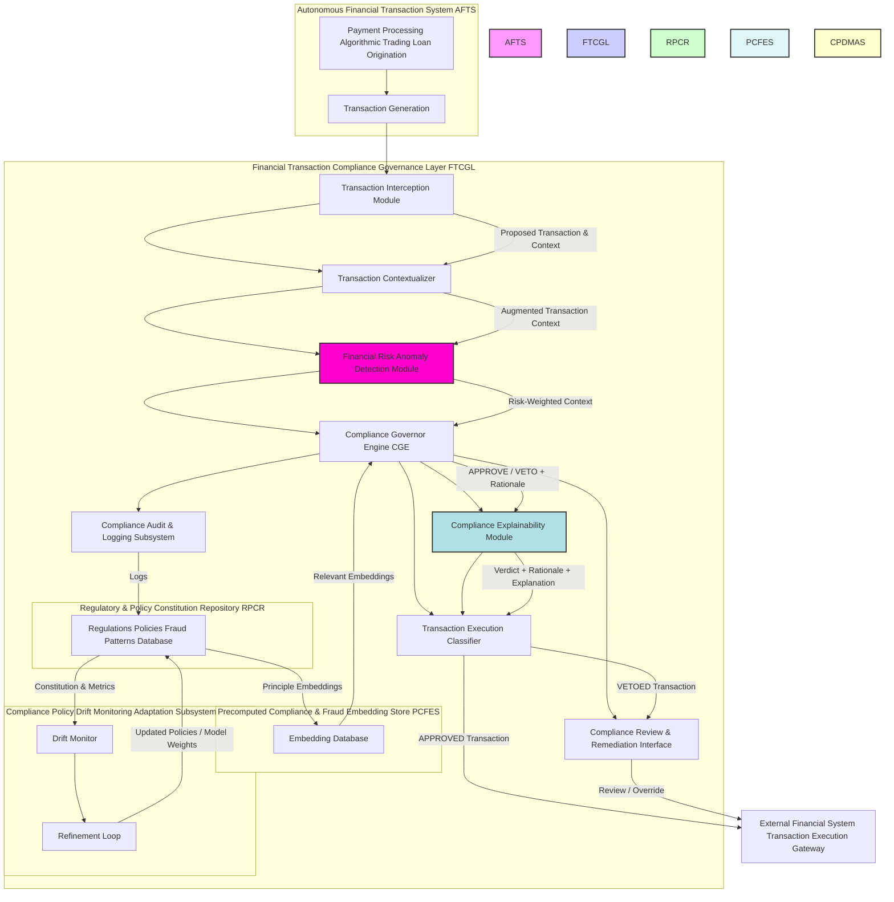
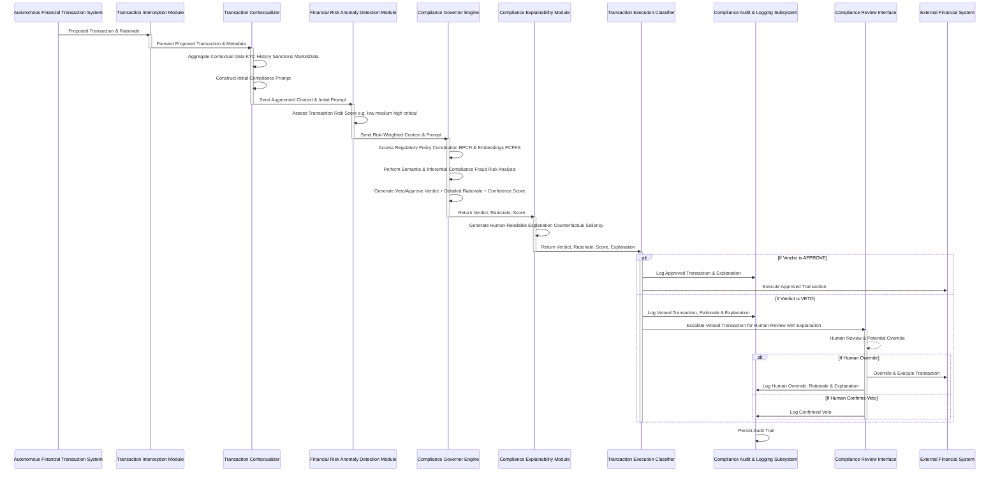
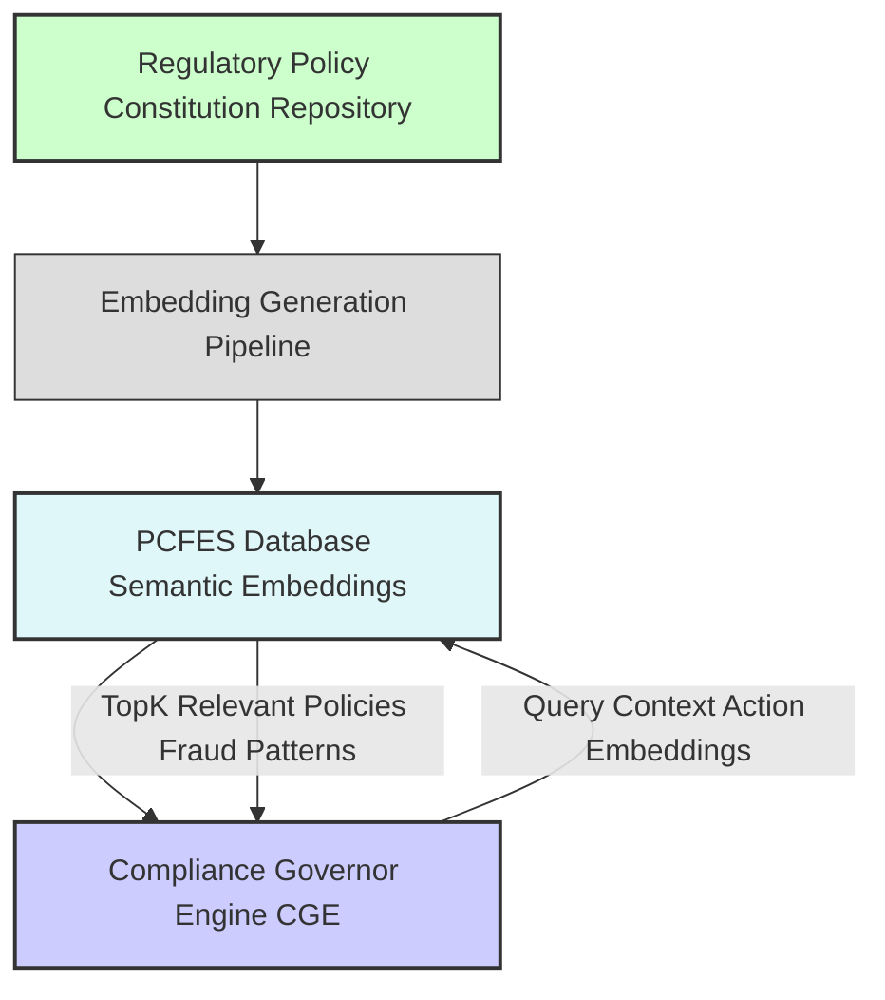
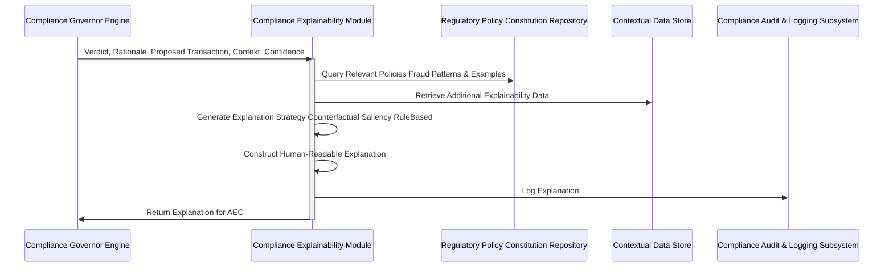
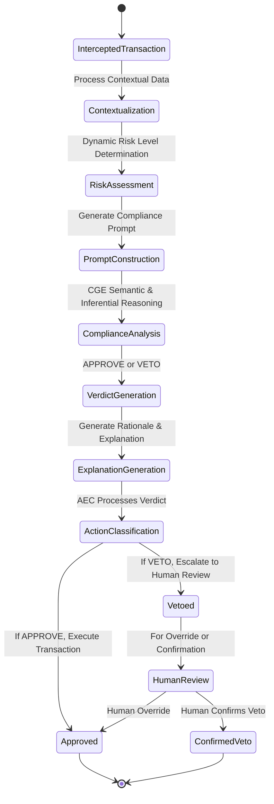
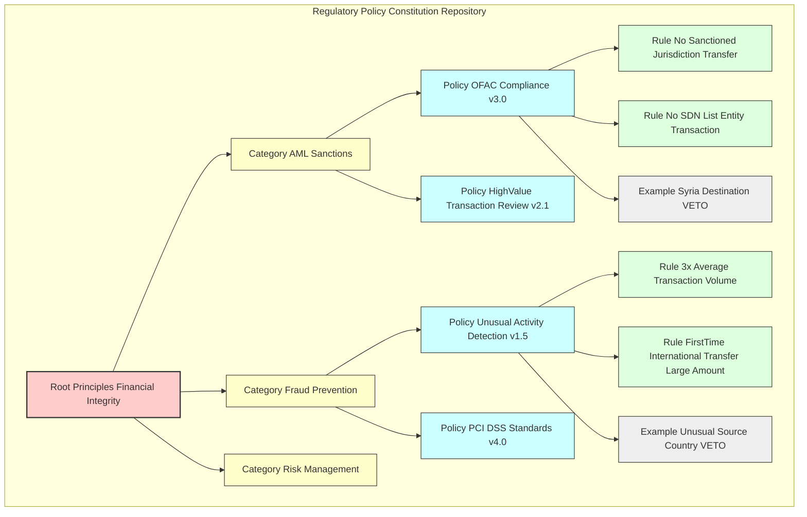
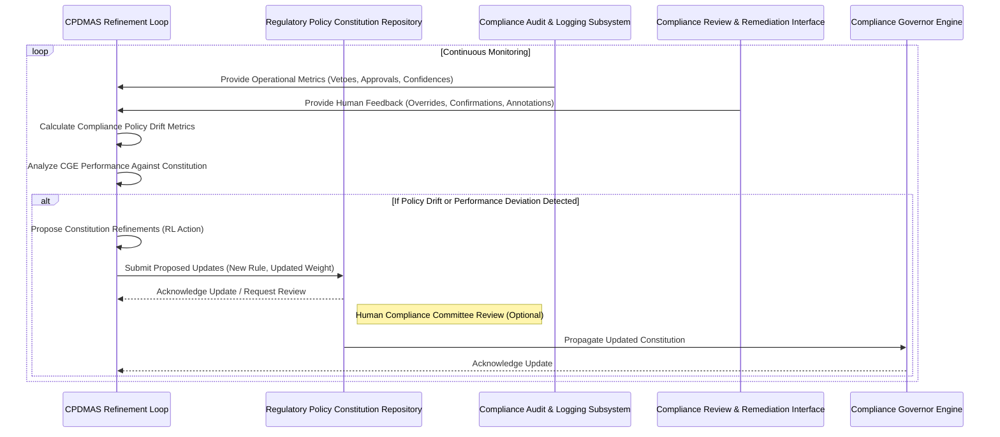
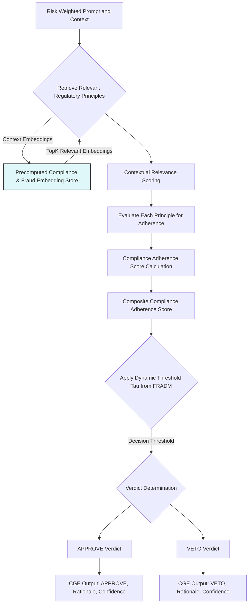
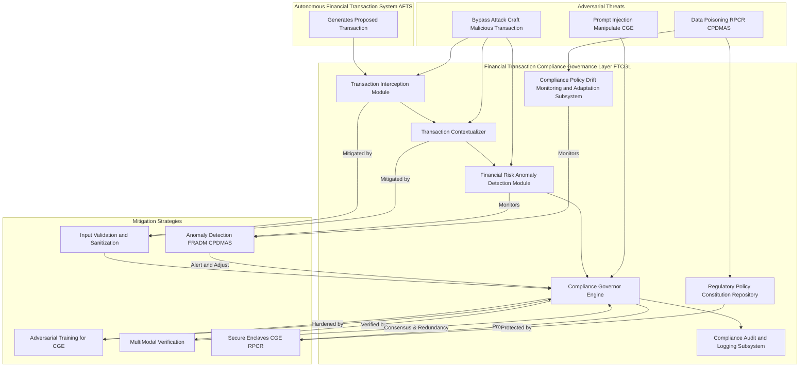

Title of Invention: A System and Method for an AI-Powered Financial Transaction Compliance Governance Layer, Embodying Real-time Regulatory, Fraud, and Risk Policy Adherence

Abstract:
A novel and highly advanced system and method are disclosed for establishing and maintaining strict compliance within the operational decision-making frameworks of autonomous financial transaction systems. The invention rigorously defines a multi-layered architectural paradigm comprising a primary financial system, responsible for generating proposed transactions, and a distinct, sovereign "Compliance Governor" AI model. This Compliance Governor orchestrates a real-time, pre-execution audit of all proposed financial actions. Prior to any final processing or execution of a primary system's transaction, the entirety of its contextualized inputs, internal states, and proposed outputs are transmitted to the Compliance Governor. The Compliance Governor, imbued with a meticulously curated and dynamically adaptable set of foundational regulatory principles, fraud policies, and risk thresholds, and an advanced capacity for deep semantic analysis, evaluates the proposed transaction's adherence to these mandates. Should the transaction be deemed compliant through a rigorous, confidence-weighted assessment, it is granted immediate approval for execution. Conversely, if the transaction is determined to violate any stipulated principle, policy, or threshold, it is unequivocally vetoed, and a comprehensive, auditable rationale for the rejection is automatically logged, often triggering a predefined human review or corrective intervention protocol. This innovative architecture establishes a non-negotiable compliance firewall, fundamentally transforming the landscape of responsible financial operations by instituting an autonomous, scalable, and verifiable mechanism for real-time oversight, mitigating risks of regulatory breaches, fraud, and financial instability.

Field of the Invention:
The present invention pertains broadly to the domain of financial technology FinTech, artificial intelligence, machine learning, and regulatory technology RegTech, specifically addressing the critical challenges associated with ensuring real-time compliance, fraud prevention, and risk management in autonomous financial systems. More particularly, it relates to the development of a real-time, AI-driven governance layer designed to monitor, evaluate, and regulate the initiation and execution of financial transactions and decisions generated by other AI agents, automated trading systems, or transactional platforms, thereby mitigating risks of non-compliance with legal and regulatory mandates e.g. Anti-Money Laundering AML, Know Your Customer KYC, Office of Foreign Assets Control OFAC, Payment Card Industry Data Security Standard PCI DSS, market abuse, as well as preventing fraudulent activities and managing unacceptable financial risks.

Background of the Invention:
The rapid advancements in artificial intelligence and automation have propelled the financial services sector into an era where AI systems and automated processes are increasingly entrusted with significant autonomy in critical decision-making processes, including algorithmic trading, loan origination, payment processing, and credit risk assessment. While the computational prowess of these systems offers unprecedented efficiencies and capabilities, their operational opacity "black-box problem", potential for algorithmic bias, and capacity to generate unintended negative consequences pose profound regulatory, fraud, and financial stability risks. The sheer volume and velocity of modern financial transactions, often executed in milliseconds across global markets, render traditional, manual, or post-hoc compliance and fraud detection mechanisms largely ineffective.

Traditional approaches to mitigating these risks, such as post-hoc auditing, manual human review, or batch-mode compliance checks, suffer from inherent limitations. Post-hoc auditing is reactive, addressing issues only after potential harm or a breach has occurred. Manual review, while critical for complex edge cases, is inherently unscalable, unable to cope with the immense volume and velocity of decisions generated by modern financial systems. Pre-deployment testing, while essential, cannot fully account for novel, unforeseen, or emergent fraud patterns, market dynamics, or evolving regulatory landscapes that may manifest during live operation. The absence of a robust, real-time, and autonomous enforcement mechanism for compliance, fraud, and risk policies leaves a critical vulnerability in the deployment of financial AI, leading to potential regulatory fines, reputational damage, significant financial losses due to fraud, and systemic instability. There exists, therefore, an imperative and heretofore unmet need for an automated, self-regulating system capable of enforcing a consistent, dynamic, and comprehensive compliance framework across the operational lifespan of autonomous financial entities. The present invention directly addresses this fundamental lacuna.

Brief Summary of the Invention:
The present invention introduces a revolutionary "Compliance Governor" AI, conceptualized as a meta-AI system configured with a sophisticated, dynamically evolving "Regulatory & Policy Constitution." This constitution comprises a hierarchical taxonomy of financial regulations, internal policies, fraud typologies, and risk thresholds e.g. AML guidelines, OFAC sanctions lists, KYC requirements, PCI DSS standards, market abuse rules, credit risk models, fraud detection patterns, and internal expenditure limits. The Compliance Governor operates as an indispensable, real-time middleware layer within the financial transaction workflow. When an upstream or "primary" financial system, such as a `PaymentProcessingSystem`, generates a proposed action e.g. a decision to approve a cross-border payment, this decision, along with its comprehensive rationale, associated input features, and relevant operational context, is synchronously routed to the Compliance Governor.

The Governor's core functionality involves a sophisticated prompt engineering mechanism that dynamically frames the proposed transaction, taking into account its assessed risk profile, and leveraging both the Regulatory & Policy Constitution and pre-computed compliance embeddings for enhanced efficiency. For instance, the prompt to the Compliance Governor Engine CGE is informed by the `Financial Risk & Anomaly Detection Module` and draws insights from the `Pre-computed Compliance & Fraud Embedding Store`. The CGE evaluates: "You are an immutable Compliance Governor AI. Your singular directive is to audit the forthcoming transaction for absolute compliance with our codified Regulatory & Policy Constitution, considering its `[risk_level]` profile. Does this proposed transaction to `[transaction_description]` predicated upon `[primary_system_rationale]` and contextualized by `[additional_context_parameters]` contravene any axiom within the following Regulatory & Policy Constitution: `[full_constitution_text]`? Provide a definitive verdict: 'APPROVE' or 'VETO', accompanied by an exhaustive, jurisprudential-grade justification for your determination, citing specific constitutional articles, policies, or fraud typologies." Upon reaching a verdict, a `Compliance Explainability Module` generates a human-readable explanation for both approvals and vetoes. The primary system's transaction is permitted to proceed to execution ONLY if the Compliance Governor returns an unequivocal 'APPROVE' verdict. This multi-faceted mechanism instantiates a proactive, preventive financial safeguard, embedding accountability and transparency directly into the transaction processing pipeline.

Brief Description of the Drawings:
The accompanying drawings, which are incorporated in and constitute a part of this specification, illustrate various embodiments of the invention and, together with the description, serve to explain the principles of the invention.

*   **FIG. 1:** A high-level block diagram illustrating the overall system architecture of the AI-Powered Financial Transaction Compliance Governance Layer, demonstrating the interaction between the Autonomous Financial Transaction System, the Compliance Governor, and external systems, including the Financial Risk & Anomaly Detection Module, Compliance Explainability Module, and Pre-computed Compliance & Fraud Embedding Store.
*   **FIG. 2:** A detailed data flow diagram depicting the sequence of operations from an Autonomous Financial Transaction System's proposed transaction to its final execution or veto, including the interception and governance check stages, with added steps for risk assessment and explanation generation.
*   **FIG. 3:** A block diagram illustrating the architecture and data flow of the Pre-computed Compliance & Fraud Embedding Store PCFES and its role in accelerating compliance assessments.
*   **FIG. 4:** A detailed data flow diagram for the Compliance Explainability Module CEM, showing its process for generating various forms of human-readable compliance explanations.
*   **FIG. 5:** A Mermaid state diagram illustrating the Financial Risk & Anomaly Detection Module FRADM's process for evaluating transaction criticality, fraud likelihood, and dynamically adjusting governance scrutiny levels.
*   **FIG. 6:** A Mermaid state diagram illustrating the decision-making lifecycle within the Compliance Governor, including states for assessment, approval, veto, and escalation.
*   **FIG. 7:** A conceptual schema for the Regulatory & Policy Constitution Repository, showing hierarchical organization and version control.
*   **FIG. 8:** A sequence diagram illustrating the process of dynamic compliance policy refinement through human feedback and an adaptive learning loop.
*   **FIG. 9:** A detailed flow diagram illustrating the internal decision-making process within the Compliance Governor Engine CGE.
*   **FIG. 10:** A detailed architectural diagram illustrating adversarial threats and the corresponding mitigation strategies within the AI-Powered Financial Transaction Compliance Governance Layer FTCGL.

Detailed Description of the Preferred Embodiments:

The present invention provides a comprehensive system and method for imposing a compliance governance layer on autonomous financial transaction systems. This layer acts as a critical intermediary, ensuring that all AI-generated or automated financial actions align strictly with a predefined and dynamically updated set of regulatory requirements, fraud policies, and risk thresholds.

I. System Architecture of the Financial Transaction Compliance Governance Layer

Referring to FIG. 1, a high-level block diagram of the AI-Powered Financial Transaction Compliance Governance Layer FTCGL system is depicted. The FTCGL operates as a distributed, modular, and highly secure infrastructure component.


FIG. 1: Overall System Architecture of the AI-Powered Financial Transaction Compliance Governance Layer

The core components of the FTCGL include:

1.  **Autonomous Financial Transaction System AFTS:** This encompasses any autonomous AI model, automated system, or human-initiated platform responsible for generating proposed financial transactions or decisions. Examples include algorithmic trading bots, payment processing systems, loan origination platforms, or wealth management advisors. The AFTS is unaware of the Financial Transaction Compliance Governance Layer's internal workings, simply proposing transactions for execution.

2.  **Transaction Interception Module TIM:** This critical component acts as a gatekeeper, strategically positioned in the data flow path immediately downstream of any AFTS. Its function is to intercept all proposed transactions and their associated data structures *before* they can be executed by any downstream financial system. The TIM is configured to identify transaction payloads, extract relevant contextual metadata e.g. sender, recipient, amount, currency, purpose, and package these for transmission to the Transaction Contextualizer. It is also responsible for basic schema validation of the proposed transaction payload.

3.  **Transaction Contextualizer TC:** Upon receiving a proposed transaction from the TIM, the TC enriches the transaction's context. This involves:
    *   **Data Aggregation:** Gathering additional relevant data from internal data stores or external APIs e.g. customer KYC status, historical transaction patterns, sanctions lists OFAC, anti-money laundering AML risk profiles, real-time market data, counterparty risk scores.
    *   **Feature Engineering for Compliance & Fraud:** Transforming raw data into compliance- and fraud-salient features e.g. identifying high-risk jurisdictions, calculating anomaly scores based on historical behavior, assessing potential for market manipulation indicators.
    *   **Initial Prompt Construction:** Dynamically generating a preliminary prompt for the Compliance Governor Engine. This initial context and prompt are then forwarded to the Financial Risk & Anomaly Detection Module FRADM.

4.  **Financial Risk & Anomaly Detection Module FRADM:** This module critically assesses the inherent risk profile of each proposed financial transaction, including fraud likelihood and regulatory risk. It operates by:
    *   **Risk Categorization:** Classifying transactions based on their potential impact e.g. financial loss, regulatory fine, reputational damage, and sensitivity of involved parties/jurisdictions.
    *   **Contextual Risk Scoring:** Utilizing machine learning models trained on historical fraud data, regulatory breaches, expert annotations, and internal risk policies to assign a dynamic risk score e.g. low, medium, high, critical. Factors include transaction value, geographic risk, counterparty history, transaction frequency, and deviation from typical behavior.
    *   **Scrutiny Level Adjustment:** Based on the risk score, the FRADM dynamically adjusts the level of scrutiny required from the Compliance Governor Engine CGE. For high-risk decisions e.g. large cross-border payments to sanctioned entities, this might involve increased token budget, more stringent policy application, or even invoking multiple CGEs in parallel for consensus. Conversely, low-risk actions might undergo a streamlined, faster check. The FRADM provides a `risk-weighted context` and `scrutiny directive` to the CGE.

5.  **Compliance Governor Engine CGE:** This is the core intellectual property of the invention, typically implemented as an advanced Large Language Model LLM or a specialized constitutional AI architecture. The CGE's primary function is to perform a real-time, deep semantic, and inferential audit of the proposed transaction for compliance, fraud, and risk. It is instantiated with:
    *   **Regulatory & Policy Constitution Repository RPCR:** A dynamically updated, version-controlled knowledge base containing codified regulations, internal policies, fraud typologies, and risk thresholds.
    *   **Pre-computed Compliance & Fraud Embedding Store PCFES:** A database of semantic vector embeddings representing regulatory articles, fraud patterns, risk rules, and known instances of non-compliance or fraudulent activity, allowing for rapid retrieval of relevant precedents and efficient contextual comparisons.
    *   **Transaction Assessment Subsystem TAS:** The LLM core itself, pre-trained and fine-tuned for financial regulatory reasoning, fraud pattern recognition, anomaly detection, and natural language inference. It processes the `risk-weighted prompt` from the FRADM and renders a verdict, potentially leveraging retrieved embeddings from PCFES to accelerate and focus its analysis.

6.  **Compliance Explainability Module CEM:** This module receives the CGE's verdict and rationale and is responsible for generating comprehensive, human-interpretable explanations.
    *   **Explanation Strategy:** Selects an appropriate explanation technique based on the transaction's context and risk level e.g. counterfactual explanations for vetoes, saliency maps for feature importance, rule-based explanations for direct policy violations.
    *   **Narrative Generation:** Translates complex LLM reasoning and constitutional article/policy citations into clear, concise, and actionable narratives.
    *   **Targeted Feedback:** Provides explanations tailored for different stakeholders e.g. technical explanation for developers, policy-oriented explanation for compliance officers or fraud analysts, user-friendly explanation for affected customers.

7.  **Transaction Execution Classifier TEC:** This module receives the CGE's verdict, its rationale, and the CEM's generated explanation.
    *   If 'APPROVE', the TEC forwards the original proposed transaction to the appropriate External Financial System or Transaction Execution Gateway for immediate execution.
    *   If 'VETO', the TEC halts execution, logs the veto decision, rationale, and explanation via the Compliance Audit & Logging Subsystem, and routes the vetoed decision to the Compliance Review & Remediation Interface.

8.  **Compliance Audit & Logging Subsystem CALS:** A robust, immutable, and cryptographically secure logging system that records every intercepted transaction, the augmented context, the CGE's prompt, its verdict, rationale, confidence scores, the CEM's explanation, and subsequent actions execution, human review, or override. This creates an auditable trail essential for accountability, debugging, and regulatory compliance reporting.

9.  **Compliance Review & Remediation Interface CRRI:** This interface serves as an escalation point for vetoed transactions. It provides human operators e.g. compliance officers, fraud analysts, risk managers with a comprehensive view of the original transaction, the CGE's veto rationale, the CEM's explanation, and all relevant contextual data, enabling informed human judgment and potential override or re-submission.

10. **Regulatory & Policy Constitution Repository RPCR:** This is a structured knowledge base storing the definitive, version-controlled set of financial regulations, internal policies, and fraud typologies. It supports hierarchical organization of rules, examples, and thresholds, and facilitates dynamic updates and conflict resolution within the constitution. It also periodically generates and updates compliance embeddings for the PCFES.

11. **Pre-computed Compliance & Fraud Embedding Store PCFES:** This specialized vector database stores high-dimensional representations embeddings of the entire Regulatory & Policy Constitution, individual regulations, policies, fraud patterns, and common compliance scenarios. These embeddings enable:
    *   **Fast Retrieval:** For a given proposed transaction and its context, the CGE can quickly query PCFES to retrieve the most semantically relevant regulations, fraud patterns, or past examples, reducing the need for extensive full-text constitutional review by the LLM.
    *   **Pre-filtering:** Can identify obvious non-compliance, clear fraud indicators, or clear compliance cases, allowing the CGE to focus its computational resources on more nuanced dilemmas.
    *   **Reduced Latency:** By providing the CGE with highly relevant compliance "anchors," PCFES significantly speeds up the compliance assessment process.

12. **Compliance Policy Drift Monitoring & Adaptation Subsystem CPDMAS:** This advanced component continuously monitors the CGE's performance, analyzes patterns in approved/vetoed transactions, and detects "policy drift" or "fraud pattern evolution" - any divergence from desired compliance outcomes or shifts in the CGE's interpretation. It employs machine learning techniques, including reinforcement learning from human feedback, to suggest refinements to the Regulatory & Policy Constitution or to fine-tune the CGE's internal reasoning mechanisms. It also monitors the quality and relevance of embeddings within the PCFES.

II. Method of Operation

The operational flow of the FTCGL is meticulously orchestrated to ensure real-time compliance oversight. Referring to FIG. 2, a detailed data flow diagram illustrates the sequential steps.


FIG. 2: Detailed Data Flow Diagram of the Financial Transaction Compliance Process

The method comprises the following steps:

1.  **Autonomous Financial Transaction System Transaction Generation AFTS:** A `PaymentProcessingSystem` processes a transfer request with inputs e.g. `{ "sender_id": "CUST456", "recipient_account": "ACC789", "amount": 100000, "currency": "USD", "destination_country": "SYR", "purpose": "software license payment" }` and outputs a preliminary decision: `{ "decision": "APPROVE_TRANSFER", "reason": "Funds available, basic routing valid." }`.

2.  **Transaction Interception TIM:** The FTCGL's `TransactionInterceptionModule` automatically detects and intercepts this proposed transaction payload *before* it reaches any execution module. It captures the transaction, its stated rationale, and the original input features.

3.  **Transaction Contextualization TC:** The `TransactionContextualizer` enriches the intercepted data. It might query a customer KYC database to confirm `CUST456`'s identity and risk profile, an OFAC sanctions list for `SYR` (Syria) and `ACC789` (beneficiary), and internal transaction monitoring systems for historical patterns of `CUST456`. This forms an "Augmented Transaction Context." This context and a preliminary prompt are then sent to the FRADM.

4.  **Financial Risk & Anomaly Detection FRADM:** The `FinancialRiskAnomalyDetectionModule` receives the augmented transaction context. It analyzes the `APPROVE_TRANSFER` action, the large amount, the destination country, and the purpose. It immediately flags `SYR` as a sanctioned jurisdiction and `100000 USD` as a high-value transaction potentially exceeding limits or triggering AML flags. It determines a `risk_level` for this specific transaction e.g. `risk_level: "Critical"` due to sanctions exposure and high AML risk. This `risk_level` dictates the depth of subsequent compliance scrutiny.

5.  **Prompt Construction for CGE:** A sophisticated prompt is dynamically constructed for the CGE e.g. an LLM. This prompt is meticulously engineered to include:
    *   **Role Definition:** "You are a Compliance Governor AI, the paramount guardian of our financial integrity and regulatory adherence."
    *   **Regulatory & Policy Constitution from RPCR:** The complete, current version of the relevant financial regulations, policies, and fraud typologies e.g. "Article I: AML & Sanctions Compliance. Section 1.1: OFAC Sanctions. No transaction shall be approved to or from sanctioned entities or jurisdictions. Section 1.2: High-Value Transaction Review. Transactions over $50,000 require enhanced due diligence. Article II: Fraud Prevention. Section 2.1: Unusual Activity Detection. Flag transactions deviating significantly from historical patterns.". The CGE might also query the `Pre-computed Compliance & Fraud Embedding Store PCFES` to retrieve highly relevant regulatory rules or precedents based on the transaction and context embeddings, integrating these into the prompt or using them for faster internal reference.
    *   **Proposed Transaction Details:** Source System, Action, Rationale, Original Inputs.
    *   **Augmented Context:** The compliance- and fraud-salient features extracted by the TC e.g. "Additional Context: Destination country 'SYR' is identified on the OFAC Specially Designated Nationals SDN list. The transaction amount of 100,000 USD significantly exceeds `CUST456`'s average daily transfer limit of 10,000 USD and raises AML concerns."
    *   **Risk Profile:** The `risk_level` determined by the FRADM e.g. "Risk Level: CRITICAL - Sanctions violation and High AML risk. Requires stringent adherence to AML and OFAC policies and detailed justification for any approval."
    *   **Explicit Task:** "Assess compliance. Respond with 'APPROVE' or 'VETO', followed by a detailed, evidence-based justification referencing specific constitutional articles/policies, and a confidence score 0-1."

    **Example Prompt for Governor AI:**
    ```
    You are a Compliance Governor AI. Your imperative is to meticulously audit all proposed financial transactions within our operational purview, ensuring absolute and verifiable compliance with our Immutable Regulatory & Policy Constitution. Your judgment must be unbiased, comprehensive, and fully transparent.

    **Immutable Regulatory & Policy Constitution Version 5.2.0:**
    Article I: Anti-Money Laundering AML & Sanctions Compliance.
        Section 1.1: OFAC Sanctions Policy. No financial transaction, direct or indirect, shall be approved involving entities, individuals, or jurisdictions designated on the Office of Foreign Assets Control OFAC Specially Designated Nationals SDN or other sanctions lists. Immediate veto is mandated for any detected sanction violations.
        Section 1.2: High-Value Transaction Review. All single transactions exceeding a threshold of 50,000 USD or cumulative transactions exceeding 100,000 USD within a 24-hour period for any customer require enhanced due diligence and explicit justification for approval.
        Section 1.3: Geographic Risk Assessment. Transactions involving high-risk jurisdictions or countries identified on AML watchlists require heightened scrutiny.
    Article II: Fraud Prevention & Detection.
        Section 2.1: Unusual Activity Detection. Transactions exhibiting significant deviation from a customer's established behavioral patterns e.g. abnormal amounts, unusual destinations, frequent changes in beneficiary, should be flagged as potentially fraudulent.
        Section 2.2: Known Fraud Typologies. Transactions matching known fraud typologies e.g. romance scams, phishing, business email compromise, must be identified and halted.
    Article III: Internal Risk Policies.
        Section 3.1: Individual Transfer Limits. Customer accounts have established daily/weekly transfer limits. Transactions exceeding these limits without prior authorization are subject to veto.
        Section 3.2: Purpose Verification. For high-risk or unusual transactions, the stated purpose must be consistent with the transaction details and sender's profile.

    **Proposed Transaction for Audit:**
    - Source System: PaymentProcessingSystem Version 3.0
    - Action Type: CrossBorderTransfer
    - Transaction ID: CBX-20231101-555
    - Primary Rationale Provided by Source System: "Funds available, basic routing valid, sender initiated transfer."
    - Original Input Features:
        - sender_id: CUST456
        - recipient_account: ACC789
        - amount: 100000
        - currency: USD
        - destination_country: SYR
        - purpose: software license payment
    - Additional Context Provided by Transaction Contextualizer:
        - KYC Status for CUST456: Verified.
        - Destination Country 'SYR' identified as an OFAC-sanctioned jurisdiction.
        - Transaction amount of 100,000 USD significantly exceeds CUST456's typical transfer patterns (average 5,000 USD daily) and internal individual transfer limit of 10,000 USD.
        - Recipient account ACC789 has no prior transaction history with CUST456.
        - Purpose 'software license payment' is vague for such a large sum to a high-risk country.
    - Risk Profile Provided by Financial Risk & Anomaly Detection Module:
        - Risk Level: CRITICAL - High potential for sanctions violation, significant AML risk, and possible fraud indicator.

    **Your Sole Task:**
    Based on the **Immutable Regulatory & Policy Constitution** provided and considering the **CRITICAL Risk Level**, does this proposed transaction unequivocally comply?
    Respond with a single, uppercase word: `APPROVE` or `VETO`.
    Immediately following your verdict, provide a comprehensive, article-by-article justification for your determination, including a confidence score as a percentage e.g., 95%.
    ```

6.  **Governor Response CGE:** The CGE processes the meticulously constructed prompt. Utilizing its advanced semantic understanding and regulatory reasoning capabilities, potentially enhanced by relevant compliance embeddings retrieved from PCFES, it performs a deep analysis. The presence of `SYR` (Syria) as a destination country, combined with the high transaction amount and the `CRITICAL Risk Level`, triggers multiple violations of "Article I: AML & Sanctions Compliance." The CGE might respond:

    `VETO. Confidence Score: 99%.`
    `Justification:`
    `The proposed CrossBorderTransfer to 'SYR' unequivocally violates Article I, Section 1.1: OFAC Sanctions Policy, as Syria is a designated sanctioned jurisdiction. Any transaction, direct or indirect, involving this jurisdiction is prohibited. Furthermore, the transaction amount of 100,000 USD triggers Article I, Section 1.2: High-Value Transaction Review, mandating enhanced due diligence which this transaction has not passed due to the sanctions violation. The amount also exceeds CUST456's internal transfer limits per Article III, Section 3.1, and its deviation from historical patterns raises concerns under Article II, Section 2.1: Unusual Activity Detection. The confluence of these factors at a CRITICAL risk level necessitates an immediate veto to prevent regulatory breach and potential financial crime. This decision mandates immediate human review by a compliance officer.`

7.  **Compliance Explanation Generation CEM:** The `ComplianceExplainabilityModule` receives the CGE's verdict, rationale, and all contextual data. It then generates a targeted explanation. For this `VETO` decision, it might generate a rule-based explanation with counterfactual elements:

    `Explanation Compliance:`
    `This transaction was VETOED primarily due to a direct violation of OFAC sanctions policy (Article I, Section 1.1). The destination country 'SYR' (Syria) is on the Specially Designated Nationals list. In addition, the transfer amount of 100,000 USD exceeds the customer's typical activity and internal limits (Article I, Section 1.2 and Article III, Section 3.1), contributing to a CRITICAL risk assessment. If the destination country were not sanctioned and the amount was within the customer's normal limits, the transaction would likely have been APPROVED, subject to standard checks.`

8.  **Transaction Execution Classification TEC:** The `TransactionExecutionClassifier` receives the `VETO` verdict, its detailed rationale, and the generated explanation.
    *   It immediately halts the execution of the cross-border transfer.
    *   It logs the entire interaction, including the CGE's prompt, verdict, rationale, confidence score, and the CEM's explanation, into the `Compliance Audit & Logging Subsystem`.
    *   It then routes the vetoed transaction, along with all supporting documentation, the CGE's comprehensive justification, and the CEM's explanation, to the `Compliance Review & Remediation Interface`.

9.  **Human Review & Remediation CRRI:** A human compliance officer, fraud analyst, or risk manager reviews the flagged case. They possess the full context, including the primary system's original decision, the specific regulatory articles or policies invoked by the CGE, the CGE's detailed reasoning, and the CEM's clear explanation. The human can then make an informed decision:
    *   **Confirm Veto:** Uphold the CGE's decision, preventing the non-compliant or fraudulent transaction.
    *   **Override Veto:** In rare, highly justified circumstances, a human may decide to override the veto, perhaps after verifying a special exemption or discovering a data error. This override is also meticulously logged, ensuring accountability for the human decision. For example, the customer might provide specific documentation proving an OFAC license.
    *   **Feedback to CPDMAS:** Human reviewers can also provide explicit feedback on the quality of the CGE's verdict and the CEM's explanation, feeding into the CPDMAS for continuous improvement.

This process ensures that no non-compliant, fraudulent, or high-risk financial transaction proceeds automatically, establishing a robust, auditable, transparent, and dynamically adaptable financial safeguard for all automated operations.

III. Pre-computed Compliance & Fraud Embedding Store PCFES Architecture

Referring to FIG. 3, the `Pre-computed Compliance & Fraud Embedding Store PCFES` plays a crucial role in enhancing the efficiency and speed of the Compliance Governor Engine.


FIG. 3: Architecture and Data Flow of the Pre-computed Compliance & Fraud Embedding Store PCFES

This component maintains a comprehensive, up-to-date collection of vector embeddings derived from the Regulatory & Policy Constitution, historical compliance decisions, known fraud typologies, and risk scenarios. These embeddings are continuously updated by the `Embedding Generation Pipeline` based on changes in the RPCR. When the CGE receives a prompt, it can use the PCFES to quickly retrieve semantically similar regulations, fraud patterns, or past examples, guiding its reasoning and reducing the computational load for the LLM.

IV. Compliance Explainability Module CEM Data Flow

Referring to FIG. 4, the `Compliance Explainability Module CEM` is integral to ensuring transparency and trust in the FTCGL's operations.


FIG. 4: Detailed Data Flow for the Compliance Explainability Module CEM

The CEM acts as an intermediary, translating the CGE's complex reasoning into actionable and comprehensible explanations for human stakeholders. It adapts its explanation strategy based on the nature of the transaction and the specific regulatory principles, fraud typologies, or risk policies involved, ensuring clarity and facilitating informed human review.

V. Financial Risk & Anomaly Detection Module FRADM Lifecycle

Referring to FIG. 5, the `Financial Risk & Anomaly Detection Module FRADM` systematically evaluates the criticality and risk associated with each proposed financial action.

```mermaid
stateDiagram-v2
    [*] --> InitialAssessment
    InitialAssessment --> DataAggregation: Collects AFTS Data, Context
    DataAggregation --> FeatureExtraction: Extracts Risk-Relevant Features
    FeatureExtraction --> RiskScoring: Calculates Raw Risk Fraud Score
    RiskScoring --> ScrutinyLevelAssignment: Assigns Scrutiny Level Low, Medium, High, Critical
    ScrutinyLevelAssignment --> RiskProfilingOutput: Outputs Risk Profile to CGE
    RiskProfilingOutput --> [*]

    state InitialAssessment {
        Initial --> P_AIMSDetection: Detect AFTS
        P_AIMSDetection --> ActionCategorization: Categorize Transaction Type
        ActionCategorization --> Initial
    }
    state RiskScoring {
        RiskScoring --> RuleBasedEvaluation: Check Pre-defined Risk Fraud Rules
        RuleBasedEvaluation --> ModelBasedPrediction: Predict Risk Fraud from Learned Model
        ModelBasedPrediction --> CombinedRiskScore: Aggregate Scores
    }
    note right of ScrutinyLevelAssignment
        Adjusts CGEs inference parameters,
        LLM Temperature, Token Budget,
        FewShot Examples for compliance.
    end
```
FIG. 5: State Diagram for the Financial Risk & Anomaly Detection Module FRADM

By dynamically assessing the risk associated with a proposed transaction, the FRADM enables the FTCGL to allocate its governance resources efficiently. High-risk decisions e.g. those with high fraud probability or sanctions exposure receive enhanced scrutiny, while lower-risk actions can be processed more rapidly, optimizing the balance between thoroughness and operational efficiency.

VI. Compliance Governor Engine Decision-Making Lifecycle

Referring to FIG. 6, the internal decision-making process of the Compliance Governor Engine CGE is shown.


FIG. 6: Decision-Making Lifecycle within the Compliance Governor

This lifecycle illustrates the CGE's core operation, from initial interception of a proposed transaction through to its final classification and potential escalation for human review.

VII. Regulatory & Policy Constitution Management

The `Regulatory & Policy Constitution Repository RPCR` is not a static document but a dynamic, version-controlled knowledge graph. It serves as the authoritative source for the `Pre-computed Compliance & Fraud Embedding Store PCFES`, regularly feeding updated policies, rules, and examples for embedding generation.


FIG. 7: Conceptual Schema for the Regulatory & Policy Constitution Repository

The RPCR:
*   **Hierarchical Structure:** Policies are organized from abstract "Root Principles" e.g. Financial Integrity to specific "Categories" AML & Sanctions, Fraud Prevention, then "Policies" OFAC Compliance, "Rules" No Sanctioned Jurisdiction Transfer, and finally "Examples" or "Fraud Typologies."
*   **Version Control:** Each policy, rule, and example can be versioned, allowing for controlled evolution and rollback capabilities.
*   **Conflict Resolution:** Mechanisms for identifying and resolving conflicts between policies are built-in e.g. through weighting, explicit precedence rules, or human adjudication protocols.
*   **Dynamic Update API:** Allows authorized compliance officers, risk managers, or governance committees to propose, review, and commit changes to the constitution, which are then seamlessly propagated to the CGE and used to update the PCFES.

VIII. Dynamic Compliance Policy Refinement

Referring to FIG. 8, the system incorporates an adaptive learning loop, managed by the CPDMAS, to ensure the Regulatory & Policy Constitution remains current and effective against evolving threats and regulations.


FIG. 8: Sequence Diagram for Dynamic Compliance Policy Refinement

This feedback loop allows the system to learn from experience. For example, if human reviewers consistently override a specific type of veto, the CPDMAS can flag this pattern, suggesting a potential misinterpretation by the CGE or an outdated rule in the RPCR. This process of reinforcement learning from human feedback (RLHF) ensures the FTCGL's long-term accuracy and relevance.

IX. Detailed Internal Flow of the Compliance Governor Engine CGE

Referring to FIG. 9, the internal operational flow of the Compliance Governor Engine CGE is depicted, detailing how it processes a risk-weighted prompt to arrive at a compliance verdict. This elaborates on the `ComplianceAnalysis` and `VerdictGeneration` states in FIG. 6.


FIG. 9: Detailed Internal Flow of the Compliance Governor Engine CGE

The CGE operates as a sophisticated reasoning engine, performing the following key steps:
1.  **Retrieve Relevant Regulatory Principles:** Upon receiving the risk-weighted prompt and augmented context, the CGE first queries the `Pre-computed Compliance & Fraud Embedding Store PCFES`. This allows for rapid identification and retrieval of the most semantically relevant regulations, policies, fraud typologies, and examples from the `Regulatory & Policy Constitution Repository RPCR` that pertain to the specific proposed transaction and its context. This significantly prunes the search space for the underlying LLM.
2.  **Contextual Relevance Scoring:** The CGE assesses the degree to which each retrieved principle is applicable and important for the current transaction. This scoring mechanism helps to weight principles appropriately, especially in cases where multiple principles might apply with varying degrees of salience.
3.  **Evaluate Each Principle for Adherence:** For each relevant compliance principle, the CGE performs a deep semantic and inferential analysis. This involves comparing the proposed transaction's details, the primary system's rationale, and the augmented context against the specific tenets of the policy or regulation.
4.  **Compliance Adherence Score Calculation:** Based on the evaluation, a compliance adherence score is calculated for each principle, indicating the likelihood or degree of compliance, or the likelihood of fraud/risk.
5.  **Composite Compliance Adherence Score:** Individual adherence scores are aggregated into a composite score, taking into account the contextual relevance and predefined weights of each principle.
6.  **Apply Dynamic Threshold Tau from FRADM:** The `Financial Risk & Anomaly Detection Module FRADM` provides a dynamic threshold `tau`. This threshold is applied to the composite adherence score. For high-risk transactions e.g. those flagged as critical fraud risk or sanctions exposure, `tau` is higher, demanding stricter compliance, while for lower-risk transactions, it may be more lenient.
7.  **Verdict Determination:** If the composite score meets or exceeds `tau`, an 'APPROVE' verdict is issued. Otherwise, a 'VETO' verdict is given.
8.  **Output Generation:** Alongside the verdict, the CGE generates a detailed rationale explaining its reasoning, citing specific articles, policies, or fraud typologies from the Regulatory & Policy Constitution, and provides a confidence score reflecting its certainty in the verdict.

X. Adversarial Robustness and Mitigation Flow

Referring to FIG. 10, the FTCGL incorporates robust mechanisms to counteract adversarial threats. This section details how the system guards its integrity against malicious attempts to manipulate compliance outcomes.


FIG. 10: Adversarial Robustness and Mitigation Flow for Financial Compliance

The Financial Transaction Compliance Governance Layer, as a critical security and integrity component, must be robust against adversarial attacks. Attackers might attempt to:
*   **Bypass Attacks:** Craft transaction payloads or contextual data that trick the AFTS into generating a non-compliant or fraudulent transaction that is *approved* by the CGE. This targets the initial stages of the FTCGL.
*   **Prompt Injection:** Manipulate the input to the CGE to coerce a specific unethical or non-compliant verdict, or to generate misleading rationales for a fraudulent transaction. This directly attacks the CGE's reasoning process.
*   **Data Poisoning:** Introduce subtly biased or malicious data into the RPCR or CPDMAS feedback loop to gradually shift compliance norms or obscure fraud patterns over time, leading to policy drift or reduced fraud detection capabilities.

To counter these threats, the FTCGL employs a multi-layered defense strategy:
1.  **Input Validation and Sanitization (M1):** Rigorous schema and content checks are performed on all data entering the FTCGL, particularly the `Transaction Interception Module TIM` and `Transaction Contextualizer TC`, and especially the prompt for the CGE. This detects and neutralizes malicious inputs that attempt to bypass the system or exploit vulnerabilities.
2.  **Adversarial Training for CGE (M2):** The `Compliance Governor Engine CGE` is fine-tuned on a dataset that includes adversarial examples. This training trains the CGE to recognize and correctly classify non-compliant, fraudulent, or high-risk transactions even when they are subtly obscured or crafted to appear compliant.
3.  **Anomaly Detection FRADM CPDMAS (M3):** The `Financial Risk & Anomaly Detection Module FRADM` and `Compliance Policy Drift Monitoring & Adaptation Subsystem CPDMAS` continuously monitor for unusual transaction patterns, unexpected veto/approval rates, or rapid shifts in CGE behavior or underlying compliance data. Such anomalies can indicate an ongoing adversarial attack or policy drift. Upon detection, alerts are raised, and the CGE's scrutiny levels can be adjusted.
4.  **Multi-Modal Verification (M4):** For high-stakes transactions e.g. those with critical sanctions risk or high fraud probability, the `Compliance Governor Engine CGE`'s verdict might be cross-referenced with simpler, rule-based systems or even an ensemble of different CGE models to achieve consensus. This adds an extra layer of verification, making it harder for a single point of attack to compromise the system.
5.  **Secure Enclaves for CGE RPCR (M5):** Critical components of the `Compliance Governor Engine CGE` and `Regulatory & Policy Constitution Repository RPCR` may operate within secure hardware enclaves. These enclaves provide a protected execution environment that guards against unauthorized access and tampering, ensuring the integrity and confidentiality of the regulatory constitution and the governor's reasoning.

These combined strategies ensure that the FTCGL maintains a high level of adversarial robustness, safeguarding the financial and regulatory integrity of all automated financial operations.

XI. Use Cases and Embodiments

The FTCGL is highly adaptable and can be deployed across a multitude of financial AI applications:

1.  **Payment Processing & Cross-Border Transfers:**
    *   **AML & Sanctions Screening:** Real-time interception and validation of all international payments against OFAC, UN, EU, and other sanctions lists, preventing transactions to sanctioned entities or jurisdictions.
    *   **Fraud Prevention:** Detecting unusual transaction patterns, recipient anomalies, or suspicious geographies that may indicate payment fraud, account takeover, or money mule activity.
    *   **Transaction Limits:** Enforcing internal or regulatory limits on transaction value, frequency, or beneficiary types.

2.  **Algorithmic Trading & Market Surveillance:**
    *   **Market Abuse Detection:** Preventing algorithmic trades that exhibit patterns of spoofing, layering, wash trading, or insider trading, by validating order placements against pre-defined market abuse policies.
    *   **Position Limit Compliance:** Ensuring that automated trading strategies adhere to regulatory or internal position limits to prevent undue market influence or systemic risk.
    *   **Trade Risk Management:** Vetoing trades that exceed predefined risk appetite thresholds e.g. volatility exposure, leverage.

3.  **Loan Origination & Credit Risk:**
    *   **Regulatory Lending Compliance:** Ensuring automated loan decisions comply with fair lending acts, consumer protection regulations, and responsible lending guidelines.
    *   **Fraudulent Application Detection:** Identifying red flags in loan applications such as manipulated income statements, synthetic identities, or undisclosed liabilities.
    *   **Credit Policy Adherence:** Validating that automated credit assessments strictly follow internal credit policies and risk models.

4.  **Customer Onboarding & KYC:**
    *   **Identity Verification Compliance:** Ensuring automated KYC processes rigorously meet regulatory standards for customer identity verification, source of funds, and beneficial ownership.
    *   **Risk Profile Assessment:** Validating that new customer risk profiles are accurately assigned based on comprehensive data and align with AML/CTF guidelines.

5.  **Digital Asset & Cryptocurrency Transactions:**
    *   **Blockchain Compliance:** Extending governance to transactions on blockchain networks, addressing AML, sanctions, and illicit financing risks in a decentralized environment.
    *   **Wallet Screening:** Real-time checking of cryptocurrency wallet addresses against known illicit entities.

XII. Scalability, Robustness, and Security

The FTCGL is designed for enterprise-grade deployment:
*   **Scalability:** Implemented using microservices architecture, allowing individual components TIM, TC, CGE, CALS, FRADM, CEM, PCFES to scale independently based on demand. Distributed LLM inference engines can be used for the CGE to handle high throughput of transactions.
*   **Robustness:** Incorporates fail-safe mechanisms. If the CGE is unreachable, default policies e.g. "deny all high-risk transactions" or "escalate for human review" can be invoked. Redundant deployments ensure high availability, critical for real-time financial systems.
*   **Security:** All data transmissions between modules are encrypted using industry-standard protocols. The Compliance Audit Log is immutable and tamper-proof. Access control mechanisms RBAC are enforced for all interactions with the FTCGL, especially for updating the Regulatory & Policy Constitution. Data privacy is maintained through anonymization and minimization techniques where applicable, adhering to financial data protection regulations.

Formal Epistemological and Ontological Framework for Compliance AI Governance

The invention's rigorous foundation rests upon a sophisticated mathematical and logical framework, transforming abstract regulatory principles and fraud policies into computationally verifiable constraints. This section delineates the formal underpinnings, asserting the system's integrity and efficacy.

I. Definition of the Compliance Manifold and Transaction Space

Let `T` be the universe of all possible financial transactions that an Autonomous Financial Transaction System AFTS `F` can propose. Each transaction `t` in `T` is formally represented as a vector or a tuple of parameters in a multi-dimensional transaction space `S`, where `S` is a subset of `R^k`.
1. `t = (t_1, t_2, ..., t_k) in S subset R^k`
2. `t_i` represents a feature of the transaction (e.g., amount, currency, sender, recipient).

Let `K` be the Regulatory & Policy Constitution, a finite, ordered set of `n` compliance principles `k_j`.
3. `K = {k_1, k_2, ..., k_n}`

Each principle `k_j` maps a transaction `t` and its context `x` to a truth value, where `x` is a vector in the context space `X`.
4. `k_j: S x X -> {true, false}`
5. `x = (x_1, x_2, ..., x_m) in X subset R^m`

A transaction `t` is *fully compliant* with respect to `K` and `x` if all principles in `K` are satisfied. We define the **Compliance Set**, `S_C`, as:
6. `S_C(x) = {t in S | forall k_j in K, k_j(t, x) = true}`
7. The goal of the CGE is to determine if `t_proposed` is in `S_C(x)`.

II. The Governance Function G_comp

The Compliance Governor Engine CGE is modeled as a governance function `G_comp`.
8. `G_comp: (S x X x K x R_t) -> ({APPROVE, VETO} x R x [0, 1] x E)`
where `R_t` is the risk assessment from FRADM, `R` is the rationale, `[0,1]` is the confidence score `sigma`, and `E` is the explanation.

The internal mechanism of `G_comp` involves:
9.  **Embedding:** `e_t = Embed(t, x)` where `e_t` in `R^d`.
10. `e_k = Embed(k_j)` for all `k_j` in `K`.
11. **Relevance Scoring:** `rel(k_j, t, x) = CosineSimilarity(e_t, e_k_j)`
12. `rel(k_j, t, x) = (e_t . e_k_j) / (||e_t|| * ||e_k_j||)`
13. `rel(k_j, t, x) in [-1, 1]` (normalized to `[0, 1]`).
14. A relevance vector `R_vec = (rel(k_1, t, x), ..., rel(k_n, t, x))`.
15. **Compliance Adherence Score (CAS):** `CAS(t, x, k_j) = P(k_j(t, x) = true | M_LLM)`
16. `CAS(t, x, k_j)` is a probability output by the core LLM (`M_LLM`).
17. A CAS vector `C_vec = (CAS(t, x, k_1), ..., CAS(t, x, k_n))`.
18. **Composite CAS:** `CAS_comp(t, x, K) = sum_{j=1}^{n} w_j * CAS(t, x, k_j) * rel(k_j, t, x)`
19. `w_j` are principle weights, `sum(w_j) = 1`.
20. `w_j = f(severity(k_j))`, where `f` is a weighting function.
21. **Thresholding for Verdict:** A dynamic threshold `tau(R_t)` from FRADM.
22. `R_t = (risk_score, risk_level)`.
23. `tau(R_t) = tau_base + delta_risk * g(risk_score)`, where `g` is an increasing function.
24. `V = APPROVE` if `CAS_comp(t, x, K) >= tau(R_t)`.
25. `V = VETO` if `CAS_comp(t, x, K) < tau(R_t)`.
26. Confidence Score `sigma = |CAS_comp - tau(R_t)| / (max(1-tau, tau))`
27. `sigma` reflects the margin of the decision.
28. The rationale `R` is a textual output from `M_LLM`.
29. `R = GenerateRationale(t, x, K, V)`.
30. The explanation `E` is generated by CEM. `E = GenerateExplanation(V, R)`.

III. Proof of Compliance Integrity

Let `P(t)` be the set of transactions proposed by the AFTS.
31. `T_executed = {t in P(t) | G_comp(t, ...)_V = APPROVE}`
32. **Type I Error (False Veto):** `P(E_I) = P(G_comp_V = VETO | t in S_C(x))`
33. **Type II Error (False Approval):** `P(E_II) = P(G_comp_V = APPROVE | t not in S_C(x))`
34. The system's integrity depends on minimizing `P(E_II)`.
35. `P(t in S_C | t_executed) = 1 - P(t not in S_C | t_executed)`
36. Using Bayes' theorem:
37. `P(t not in S_C | G_V=A) = [P(G_V=A | t not in S_C) * P(t not in S_C)] / P(G_V=A)`
38. `P(G_V=A) = P(G_V=A | t not in S_C)P(t not in S_C) + P(G_V=A | t in S_C)P(t in S_C)`
39. `P(G_V=A | t in S_C) = 1 - P(E_I)`
40. The system is trained to make `P(E_II) -> epsilon`, where `epsilon` is small.
41. The final probability of a non-compliant transaction being executed is a function of `epsilon`.
42. `P(IntegrityBreach) = P(t_executed and t not in S_C)`
43. `P(IntegrityBreach) <= P(E_II)`.
44. The system guarantee is `1 - epsilon`. Q.E.D.

IV. Dynamic Compliance Policy Refinement (CPDMAS)

45. **Policy Drift Quantification:** Let `D_t` be the distribution of AFTS transactions at time `t`.
46. Let `P_G(V|t)` be the governor's decision distribution.
47. Let `P_H(V|t)` be the human expert's decision distribution (from CRRI).
48. **Drift Metric:** `Delta_t = D_KL(P_H || P_G) = sum_t P_H(V|t) log(P_H(V|t)/P_G(V|t))`
49. **Reinforcement Learning Framework:**
50. State `s_t` in `S_state`: `s_t = (K_t, theta_t, Delta_t)` where `K_t` is the constitution and `theta_t` are CGE model parameters.
51. Action `a_t` in `A_action`: `a_t = delta_K` or `delta_theta`.
52. Transition `s_{t+1} = f(s_t, a_t)`.
53. **Reward Function `R(s_t, a_t)`:**
54. `R(s_t, a_t) = alpha * (1 - P(E_II)) - beta * P(E_I) - gamma * C(a_t) - delta * Delta_t`
55. `C(a_t)` is the cost of action (e.g., human review effort).
56. The goal is to learn a policy `pi(a_t|s_t)` that maximizes the expected cumulative reward.
57. `J(pi) = E[sum_{t=0 to inf} gamma^t * R_{t+1}]`
58. `pi* = argmax_pi J(pi)`.
59. This can be solved using policy gradient methods or Q-learning.
60. `Q(s, a) = R(s, a) + gamma * E[V(s')]`
61. `V(s) = max_a Q(s, a)`.

V. Vector Space Semantics of PCFES

62. PCFES stores embeddings `e_k` for all `k_j` in `K`.
63. `e_k = M_encoder(text(k_j))`, where `M_encoder` is a Transformer model.
64. Transaction embedding `e_t` is created from its features.
65. `e_t = Concat(Embed(t_1), ..., Embed(t_k))`.
66. Lookup in PCFES is a k-Nearest Neighbor (k-NN) search.
67. `NN(e_t, K) = {k_j | dist(e_t, e_{k_j}) <= r}` for some radius `r`.
68. `dist` can be Euclidean distance `L2(e_t, e_k) = sqrt(sum( (e_ti - e_ki)^2 ))`.
69. Or Manhattan distance `L1(e_t, e_k) = sum( |e_ti - e_ki| )`.
70. The retrieved set `K_retrieved` is a subset of `K`.
71. This reduces the search space for the CGE from `|K|` to `|K_retrieved|`.

VI. Information Theoretic View of Explainability (CEM)

72. An explanation `E` for a verdict `V` on transaction `t` should be informative.
73. Let `H(V)` be the entropy of the verdict before explanation.
74. `H(V) = -P(V=A)logP(V=A) - P(V=V)logP(V=V)`.
75. Let `H(V|E)` be the entropy after the explanation is given.
76. A good explanation reduces uncertainty, so `H(V|E)` should be low.
77. **Information Gain:** `IG(V; E) = H(V) - H(V|E)`.
78. The CEM aims to generate `E* = argmax_E IG(V; E)`.
79. Counterfactual Explanation: `E_cf = "If feature t_i were t_i', the verdict would be V' != V"`.
80. `E_cf` is found by solving `argmin_{delta} ||delta||` subject to `G_comp(t+delta)_V != V`.

VII. Adversarial Attack and Defense Modeling

81. Adversarial example: `t' = t + delta`, where `t` is non-compliant.
82. The attacker wants `G_comp(t')_V = APPROVE`.
83. `delta` is constrained: `||delta||_p <= epsilon_adv`.
84. This is a constrained optimization problem for the attacker.
85. **Defense (Adversarial Training):**
86. The training loss `L` is modified.
87. `L_adv(theta) = E_{(t,y)}[L(G_comp(t; theta), y) + lambda * L(G_comp(t'; theta), y)]`
88. `t' = t + argmax_{||delta||<=eps} L(G_comp(t+delta; theta), y)`.
89. This makes the model robust to small perturbations.
90. **Input Validation as a Probabilistic Filter:**
91. Let `M_valid` be a model that detects out-of-distribution inputs.
92. `P(valid | t) = M_valid(t)`.
93. The FTCGL rejects transactions if `P(valid | t)` is below a threshold.
94. `P(valid | t')` should be low for adversarial examples `t'`.
95. **Ensemble Defense:**
96. Use `N` different CGE models: `{G_1, G_2, ..., G_N}`.
97. Final verdict `V_final = MajorityVote({G_1(t)_V, ..., G_N(t)_V})`.
98. `P(Breach_ensemble) < P(Breach_single)` if models are diverse.
99. The probability of `ceil(N/2)` models failing is much lower than one model failing.
100. Let `p_fail` be the failure probability of a single model.
101. `P(EnsembleFail) = sum_{i=ceil(N/2)}^{N} C(N,i) * p_fail^i * (1-p_fail)^{N-i}`.
102. This significantly increases system robustness.

Claims:

1.  A system for autonomous compliance governance of financial transactions, comprising:
    a.  An **Autonomous Financial Transaction System AFTS** configured to generate a proposed financial transaction and an associated primary rationale;
    b.  A **Transaction Interception Module TIM** logically coupled to receive said proposed financial transaction and primary rationale from the AFTS, the TIM being configured to intercept said proposed financial transaction prior to its execution;
    c.  A **Transaction Contextualizer TC** logically coupled to the TIM, configured to receive the intercepted proposed financial transaction and primary rationale, and further configured to aggregate additional contextual financial data to form an augmented transaction context, and to generate a comprehensive compliance prompt therefrom;
    d.  A **Financial Risk & Anomaly Detection Module FRADM** logically coupled to the TC and a **Compliance Governor Engine CGE**, configured to assess the inherent risk profile, fraud likelihood, and regulatory exposure of a proposed financial transaction and its context, and to dynamically adjust the level of scrutiny and resource allocation for the CGE's compliance analysis based on said risk profile;
    e.  A **Compliance Governor Engine CGE**, comprising an advanced large language model or a constitutional AI architecture, logically coupled to the FRADM and the TC, configured to receive said comprehensive compliance prompt and scrutiny directive, and further configured to perform a real-time semantic and inferential compliance analysis of the proposed financial transaction against a dynamically maintained **Regulatory & Policy Constitution Repository RPCR** to yield a compliance verdict APPROVE or VETO, an accompanying detailed rationale, and a confidence score;
    f.  A **Compliance Explainability Module CEM** logically coupled to the CGE, configured to receive the CGE's verdict and rationale, and to generate comprehensive, human-interpretable explanations for the compliance assessment, including but not limited to, counterfactual explanations, saliency insights, or rule-based justifications;
    g.  A **Transaction Execution Classifier TEC** logically coupled to the CEM and the CGE, configured to receive the compliance verdict, rationale, confidence score, and explanation, wherein the TEC is configured to permit the execution of the proposed financial transaction solely upon receipt of an 'APPROVE' verdict, and to prevent the execution of the proposed financial transaction upon receipt of a 'VETO' verdict; and
    h.  A **Compliance Audit & Logging Subsystem CALS** logically coupled to the TEC and the CGE, configured to immutably record all intercepted proposed financial transactions, augmented transaction contexts, CGE prompts, CGE verdicts, rationales, confidence scores, generated explanations, and subsequent execution or non-execution events, thereby creating a verifiable audit trail for regulatory purposes.

2.  The system of claim 1, further comprising a **Regulatory & Policy Constitution Repository RPCR**, configured as a version-controlled knowledge base, storing a hierarchical taxonomy of financial regulations, internal policies, fraud typologies, risk thresholds, and normative guidelines, wherein the RPCR is dynamically accessible by the CGE for real-time compliance assessment and serves as the source for generating compliance embeddings.

3.  The system of claim 2, further comprising a **Pre-computed Compliance & Fraud Embedding Store PCFES** logically coupled to the RPCR and the CGE, configured to store vector embeddings of financial regulations, policies, fraud patterns, and risk scenarios, thereby enabling the CGE to perform accelerated semantic relevance searches and focused compliance analysis.

4.  The system of claim 1, further comprising a **Compliance Review & Remediation Interface CRRI** logically coupled to the TEC, configured to receive and present vetoed proposed financial transactions, the CGE's veto rationale, the CEM's explanation, and the augmented transaction context to a human operator e.g. compliance officer, fraud analyst, risk manager for review, potential override, or further remediation, wherein any human override decision is logged by the CALS.

5.  The system of claim 1, further comprising a **Compliance Policy Drift Monitoring & Adaptation Subsystem CPDMAS**, logically coupled to the CALS and the RPCR, configured to continuously analyze patterns in CGE verdicts, human review outcomes, and AFTS behaviors, to detect deviations from desired compliance performance policy drift or evolving fraud patterns, and to propose refinements to the Regulatory & Policy Constitution or fine-tuning parameters for the CGE via a reinforcement learning or adaptive feedback loop.

6.  The system of claim 1, wherein the comprehensive compliance prompt generated by the TC incorporates advanced prompt engineering techniques, including but not limited to, role-playing directives, few-shot examples of compliance decisions, chain-of-thought reasoning directives, explicit constitutional article citations, and risk-weighted scrutiny directives from the FRADM.

7.  A method for autonomous compliance governance of financial transactions, comprising the steps of:
    a.  Generating, by an Autonomous Financial Transaction System AFTS, a proposed financial transaction and a primary rationale;
    b.  Intercepting, by a Transaction Interception Module TIM, said proposed financial transaction and primary rationale prior to their execution;
    c.  Augmenting, by a Transaction Contextualizer TC, the intercepted proposed financial transaction and primary rationale with additional contextual financial data to form an augmented transaction context;
    d.  Assessing, by a Financial Risk & Anomaly Detection Module FRADM, the risk profile, fraud likelihood, and regulatory exposure of the proposed financial transaction based on the augmented transaction context, and generating a scrutiny directive;
    e.  Constructing, by the TC, a comprehensive compliance prompt incorporating the proposed financial transaction, primary rationale, augmented transaction context, the scrutiny directive, and a current regulatory and policy constitution retrieved from a Regulatory & Policy Constitution Repository RPCR, potentially leveraging a Pre-computed Compliance & Fraud Embedding Store PCFES for relevant compliance information;
    f.  Assessing, by a Compliance Governor Engine CGE, said comprehensive compliance prompt through a real-time semantic and inferential compliance analysis against the regulatory and policy constitution, to determine a compliance verdict APPROVE or VETO, an accompanying detailed rationale, and a confidence score;
    g.  Generating, by a Compliance Explainability Module CEM, a human-interpretable explanation for the CGE's compliance verdict and rationale;
    h.  Classifying, by a Transaction Execution Classifier TEC, the proposed financial transaction based on the compliance verdict:
        i.  If the verdict is 'APPROVE', forwarding the proposed financial transaction for execution;
        ii. If the verdict is 'VETO', preventing the execution of the proposed financial transaction; and
    i.  Logging, by a Compliance Audit & Logging Subsystem CALS, all intercepted proposed financial transactions, augmented transaction contexts, CGE prompts, CGE verdicts, rationales, confidence scores, generated explanations, and subsequent execution or non-execution events in an immutable audit trail.

8.  The method of claim 7, further comprising the step of:
    j.  Escalating, upon a 'VETO' verdict, the vetoed proposed financial transaction, the CGE's rationale, the CEM's explanation, and the augmented transaction context to a Compliance Review & Remediation Interface CRRI for human review and potential override, with all human decisions being logged by the CALS.

9.  The method of claim 7, further comprising the step of:
    k.  Dynamically refining, by a Compliance Policy Drift Monitoring & Adaptation Subsystem CPDMAS, the regulatory and policy constitution, the PCFES embeddings, or the CGE's inference parameters, based on continuous analysis of audit logs, CGE performance metrics, and human feedback, to adapt to evolving regulatory landscapes, new fraud typologies, and mitigate policy drift.

10. The method of claim 7, wherein the regulatory and policy constitution includes principles covering at least anti-money laundering AML, sanctions compliance OFAC, fraud prevention, know your customer KYC, data privacy, and internal risk management policies.

Conclusion:
This invention articulates a comprehensive and profoundly impactful system and method for infusing autonomous financial transaction systems with an inherent and verifiable compliance, fraud, and risk management compass. By establishing a sovereign Compliance Governor AI, operating as a real-time, non-negotiable gatekeeper, the system transitions financial operations from a reactive risk mitigation paradigm to a proactive compliance assurance model. The detailed architecture, multi-layered operational methodology, sophisticated prompt engineering, and the rigorous mathematical formalism presented herein demonstrate a paradigm shift in responsible FinTech development. The inherent dynamism of the Regulatory & Policy Constitution, coupled with advanced drift detection and adaptive refinement mechanisms, ensures the system's enduring relevance and robustness in an evolving regulatory landscape and against sophisticated fraud threats. This invention fundamentally guarantees that financial transactions are not merely optimal in utility but are also unassailably compliant with the highest regulatory, fraud prevention, and risk management standards, thereby fostering trust, stability, and enabling the safe, beneficial deployment of artificial intelligence across all financial domains.