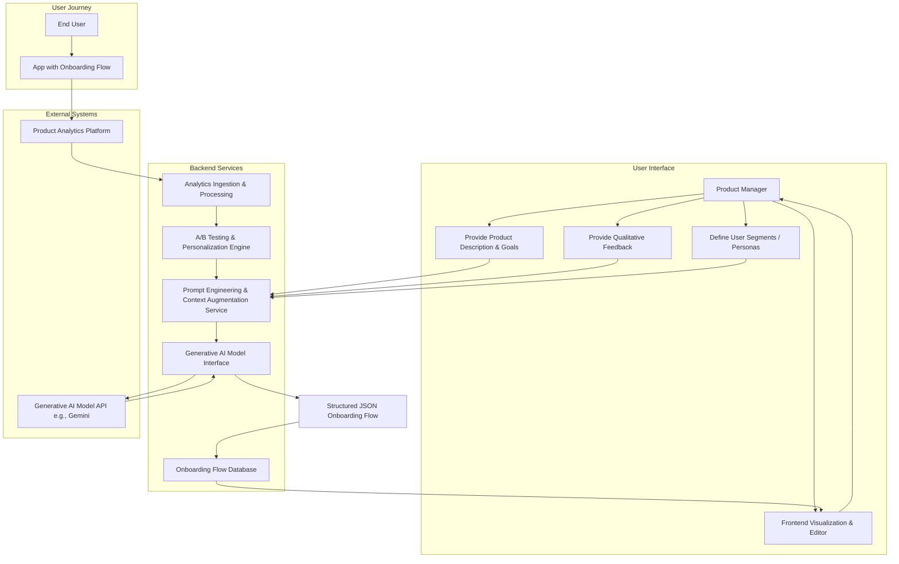
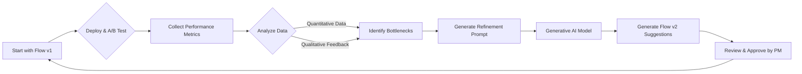
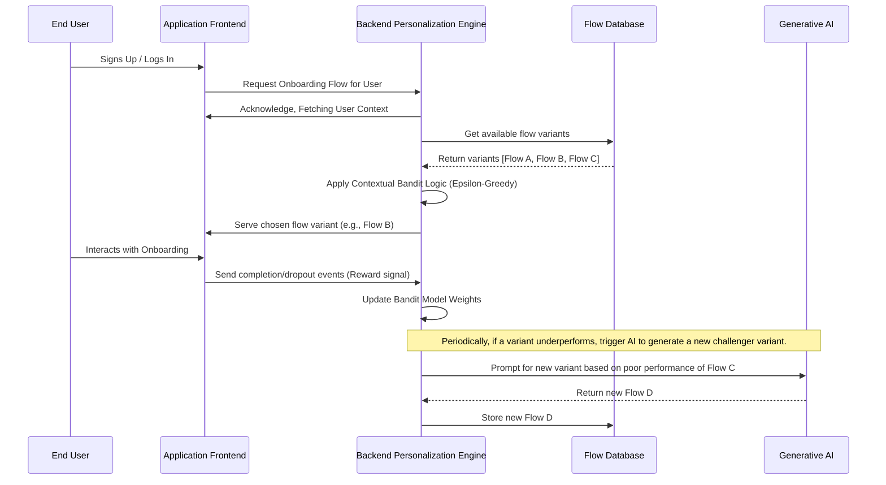
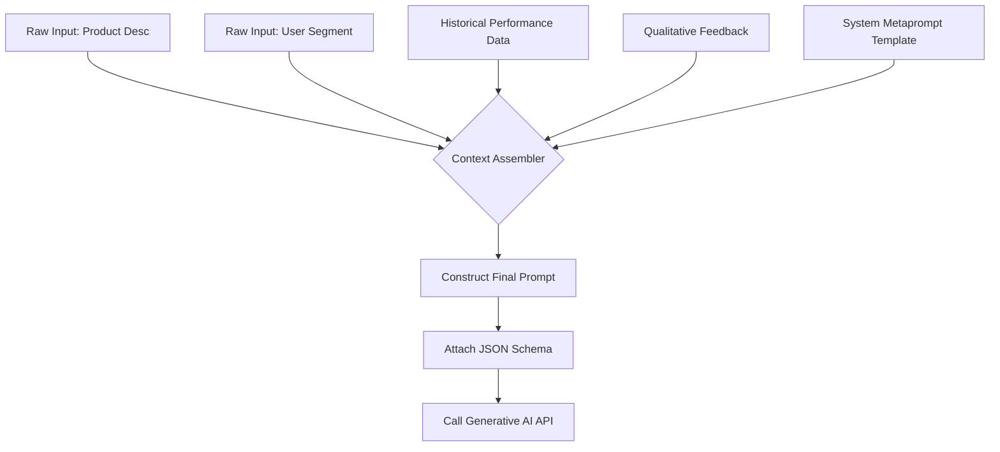
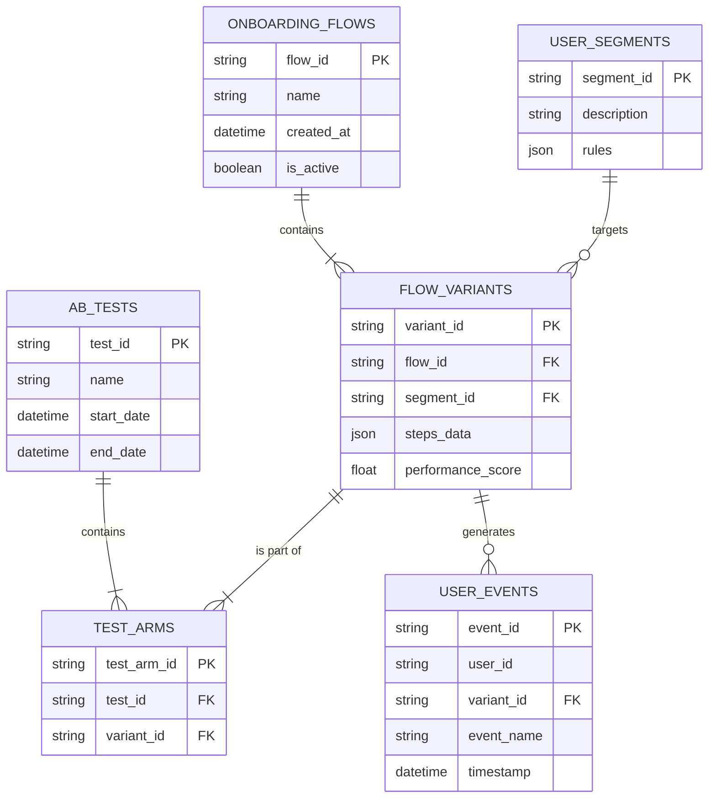
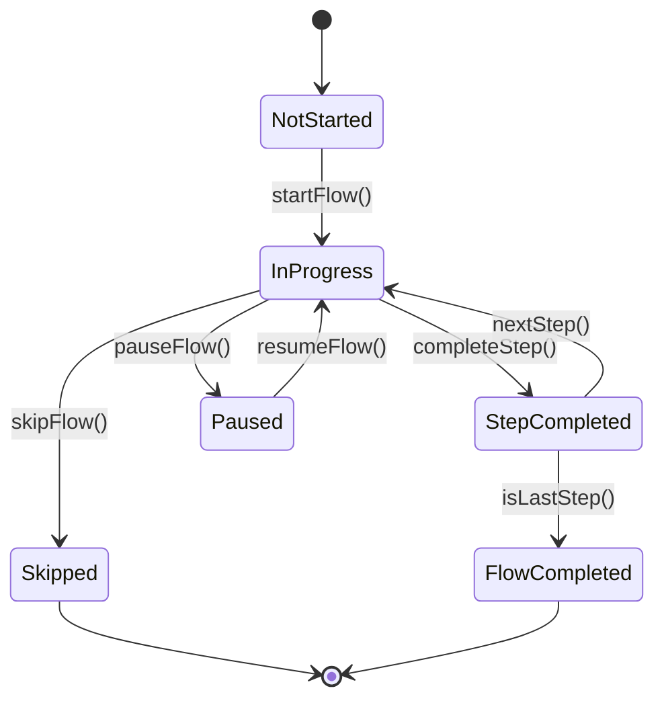
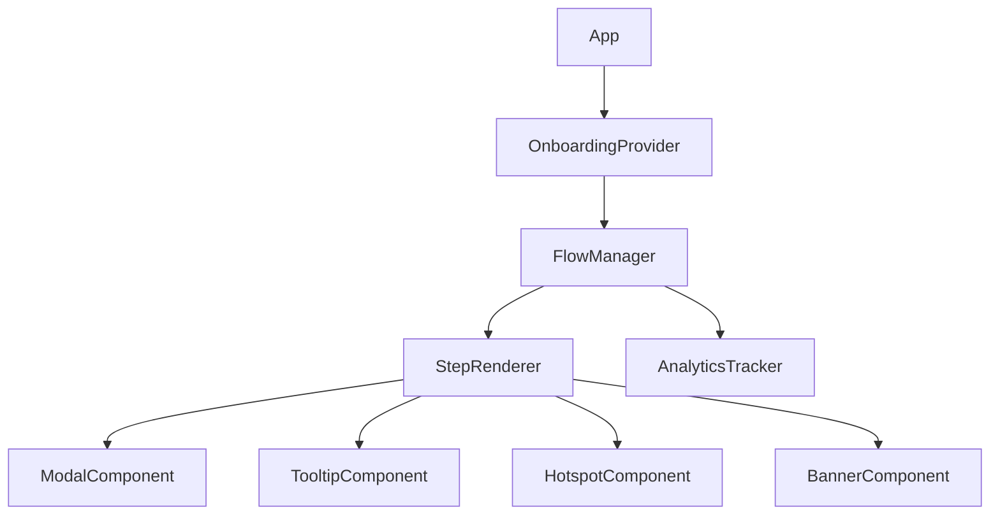
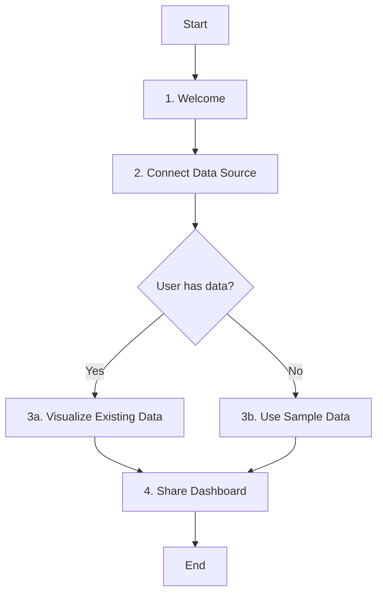

**Title of Invention:** System and Method for Generative Design, Optimization, and Personalization of User Onboarding Workflows

**Abstract:**
A system for the generative design and dynamic optimization of user onboarding experiences is disclosed. A user, such as a product manager or UX designer, provides a high-level description of their application, its core value proposition, and its target user demographics. This information is sent to a generative AI model, which is prompted to act as an expert in user experience, product strategy, and behavioral psychology. The AI designs a complete, multi-step, and potentially branching onboarding flow. The output is a highly structured object containing a sequence of steps, where each step includes suggested UI components (e.g., modal, tooltip, hotspot), microcopy (title, body), a call-to-action, the key user action to be completed [the "aha moment"], and associated tracking events. The system also supports advanced iterative refinement of flows based on qualitative feedback and quantitative performance metrics, and deep personalization for dynamically identified user segments using contextual bandit algorithms.

**Background of the Invention:**
Designing an effective user onboarding flow is a critical determinant of product adoption, user retention, and long-term customer lifetime value. However, it remains a difficult, resource-intensive, and highly specialized task. Product managers and development teams often struggle to determine the optimal sequence of steps, messaging, and interactions required to guide a new user to their first "aha moment" of value. Existing tools are typically WYSIWYG editors for *building* predefined flows, not for *designing* the core strategy and psychology behind them. There is a pressing need for a tool that can assist in the initial conceptual design of the onboarding journey, facilitate rapid, data-driven iterative improvement, and automatically tailor experiences for an increasingly diverse user base. This invention addresses these shortcomings by leveraging generative AI to act as a co-pilot for product teams throughout the entire lifecycle of onboarding design and optimization.

**Brief Summary of the Invention:**
The present invention provides an "AI Onboarding Strategist," a comprehensive system for generating, refining, and personalizing user onboarding flows. A product manager describes their product and goals. The system's prompt engineering module constructs a rich, context-aware prompt for a large language model (LLM), instructing it to design an optimal onboarding flow. The LLM, leveraging its vast training data encompassing successful product designs, UX principles, and copywriting, generates a detailed step-by-step plan. For a new financial analytics app, it might suggest: `Step 1: Welcome & Connect Bank Account (Modal)`, `Step 2: Categorize First Transaction (Tooltip)`, `Step 3: Create Your First Budget Goal (Hotspot)`. For each step, it provides the actual microcopy, UI component suggestions, and event names for analytics.

Crucially, the system moves beyond static generation. It enables a continuous optimization loop where product managers can provide qualitative feedback (e.g., "Make this step more encouraging") or feed quantitative A/B test results back into the system. The AI then proposes specific, targeted refinements. Furthermore, by defining user segments or allowing the system to cluster users based on behavior, the AI can generate and manage multiple personalized onboarding paths simultaneously, optimizing for the specific needs and motivations of each cohort. This radically accelerates the design-build-measure-learn cycle and demonstrably improves the conversion, retention, and ultimate success of the user onboarding experience.

**Detailed Description of the Invention:**
A product manager enters a detailed description of their application into the system's user interface: `An enterprise-grade AI-powered data visualization platform for business analysts. The core value is enabling non-technical users to build complex interactive dashboards from raw data sources in minutes. Key features include a drag-and-drop interface, natural language querying, and automated chart suggestions.`

The backend constructs a sophisticated, multi-part prompt for a generative AI model, including a detailed `responseSchema`.
**Prompt:** `You are a world-class UX designer and product strategist specializing in enterprise SaaS user onboarding. Design a 5-step onboarding flow for the following product. For each step, define the optimal UI component (e.g., 'MODAL', 'TOOLTIP', 'HOTSPOT', 'BANNER'), provide a compelling title, a concise body text, the key user action to reach the "aha moment", a clear call-to-action label, and a snake_case event name for analytics tracking. The flow should guide the user from a state of unfamiliarity to successfully creating and sharing their first dashboard. Product: "An enterprise-grade AI-powered data visualization platform for business analysts. The core value is enabling non-technical users to build complex interactive dashboards from raw data sources in minutes."`
**Schema:**
```json
{
  "type": "OBJECT",
  "properties": {
    "flowConfiguration": {
      "type": "OBJECT",
      "properties": {
        "flowId": { "type": "STRING", "description": "Unique identifier for the generated flow." },
        "targetAudience": { "type": "STRING", "description": "The user segment this flow is designed for." },
        "primaryGoal": { "type": "STRING", "description": "The main objective of this onboarding flow." }
      }
    },
    "onboardingFlow": {
      "type": "ARRAY",
      "items": {
        "type": "OBJECT",
        "properties": {
          "step": { "type": "NUMBER" },
          "title": { "type": "STRING" },
          "body": { "type": "STRING" },
          "keyAction": { "type": "STRING" },
          "ctaLabel": { "type": "STRING" },
          "uiComponentType": { "type": "STRING", "enum": ["MODAL", "TOOLTIP", "HOTSPOT", "BANNER", "VIDEO_TUTORIAL"] },
          "targetElementSelector": { "type": "STRING", "description": "CSS selector for the UI element the step points to." },
          "trackingEventName": { "type": "STRING" }
        }
      }
    }
  }
}
```
The AI returns a structured JSON object. The client application then visualizes this flow, not just as text, but as a series of mock UI cards or an interactive flowchart overlaid on a screenshot of the user's application. This provides the product manager with a complete, context-rich, and ready-to-implement design for their onboarding experience.

**Iterative Refinement and Autonomous Optimization:**
The system's true power lies in its dynamic capabilities. A product manager can select a generated flow and provide qualitative feedback: ["The tone is too formal for our brand", "Step 3 is causing a lot of users to drop off, can we simplify it or offer an alternative?"]. This feedback, along with performance data from analytics (e.g., completion rates, time-per-step), is incorporated into a new prompt for the AI to refine the flow. The AI might suggest splitting a complex step into two, rewriting the copy, or changing the UI component from a full-screen modal to a less intrusive tooltip.

Furthermore, the system can be configured to automatically propose optimizations. By analyzing A/B test results and user funnels, the system can identify underperforming steps and prompt the AI to generate alternative hypotheses for improvement, presenting these to the product manager for approval. This creates a semi-autonomous optimization engine for user onboarding.

**Hyper-Personalization Engine:**
The system treats personalization as a first-class citizen. Instead of just manually defined segments (e.g., "developers", "marketers"), the system can ingest user attribute data (role, company size, referral source) and behavioral data (features used, login frequency). The AI can then be prompted to generate distinct onboarding experiences for these segments. For example, a developer might get a flow focused on API integration, while a marketing professional sees a flow focused on building campaign tracking dashboards. This is modeled as a contextual bandit problem, where the system continually explores and exploits different onboarding flows (the "arms") for different user contexts to maximize a global reward function like user retention or feature adoption.

**System Architecture and Data Flow Diagrams:**

**1. High-Level System Architecture:**


**2. Iterative Refinement Loop:**


**3. Personalization Data Flow:**


**4. Prompt Engineering Subsystem:**


**5. Database Schema (ERD):**


**6. State Machine of Onboarding Progression:**


**7. Frontend Component Hierarchy:**


**8. Multi-modal Asset Generation Flow:**
```mermaid
graph TD
    A[AI Generates Onboarding Step Text] --> B{Identify Need for Visual?};
    B -- Yes --> C[Generate Prompt for Image Model];
    C --> D[e.g., "A simple icon of a magnifying glass over a bar chart"];
    D --> E[Image Generation AI];
    E --> F[Generated Image Asset URL];
    F --> G[Link Asset URL to Onboarding Step];
    B -- No --> H[Use Text Only];
    G --> I[Final Step Object];
    H --> I;
```

**9. Feedback Analysis and Clustering:**
```mermaid
graph TD
    subgraph Input
        A[User Feedback 1: "This is confusing"]
        B[User Feedback 2: "I don't know what to do on step 3"]
        C[User Feedback 3: "The button is hard to find"]
    end
    subgraph Processing
        D[Collect & Sanitize Feedback] --> E[Generate Embeddings];
        E --> F{Clustering Algorithm e.g., K-Means};
        F --> G[Cluster 1: "Clarity Issues on Step 3"];
        F --> H[Cluster 2: "UI/UX problems"];
    end
    subgraph Output
        G --> I[Synthesize Cluster into AI Refinement Prompt];
        H --> I;
        I --> J[Generate Refined Flow];
    end
```

**10. Branching Logic Visualization:**


**Conceptual Code [TypeScript SDK]:**
```typescript
/**
 * @typedef {('MODAL' | 'TOOLTIP' | 'HOTSPOT' | 'BANNER' | 'VIDEO_TUTORIAL')} UIComponentType
 * Defines the type of UI element to display for a step.
 */
export type UIComponentType = 'MODAL' | 'TOOLTIP' | 'HOTSPOT' | 'BANNER' | 'VIDEO_TUTORIAL';

/**
 * @typedef {object} OnboardingStep - Defines a single step in an onboarding flow.
 * @property {number} step - The sequential number of the step.
 * @property {string} title - The title of the onboarding step.
 * @property {string} body - The main body text for the step.
 * @property {string} keyAction - The primary user action to be completed in this step.
 * @property {string} ctaLabel - The label for the call-to-action button.
 * @property {UIComponentType} uiComponentType - The suggested UI component for this step.
 * @property {string} [targetElementSelector] - Optional CSS selector for the element the UI component should attach to.
 * @property {string} [trackingEventName] - Optional name for the analytics event associated with this step's completion.
 * @property {string} [mediaAssetURL] - Optional URL for an image or video asset for the step.
 * @property {object} [branchingLogic] - Optional logic for branching to different steps.
 */
export interface OnboardingStep {
  step: number;
  title: string;
  body: string;
  keyAction: string;
  ctaLabel: string;
  uiComponentType: UIComponentType;
  targetElementSelector?: string;
  trackingEventName?: string;
  mediaAssetURL?: string;
  branchingLogic?: {
    onCtaClick: { nextStep: number };
    onSkip?: { nextStep: number };
  };
}

/**
 * @typedef {object} FlowConfiguration
 * @property {string} flowId - Unique identifier for the flow.
 * @property {string} targetAudience - Description of the target user segment.
 * @property {string} primaryGoal - The main objective of this onboarding flow.
 */
export interface FlowConfiguration {
  flowId: string;
  targetAudience: string;
  primaryGoal: string;
}

/**
 * @typedef {object} OnboardingFlow
 * @property {FlowConfiguration} configuration - Metadata about the flow.
 * @property {OnboardingStep[]} steps - The array of steps in the flow.
 */
export interface OnboardingFlow {
  configuration: FlowConfiguration;
  steps: OnboardingStep[];
}

/**
 * @typedef {object} GenerationOptions - Options for generating a new flow.
 * @property {number} [numSteps=5] - The desired number of steps in the flow.
 * @property {'concise' | 'detailed'} [tone='concise'] - The desired tone of the copy.
 */
export interface GenerationOptions {
    numSteps?: number;
    tone?: 'concise' | 'detailed';
}

/**
 * @typedef {object} RefinementOptions - Options for refining an existing flow.
 * @property {string} feedback - Qualitative feedback for refinement.
 * @property {object} [metrics] - Quantitative performance metrics.
 * @property {number} [metrics.completionRate] - The completion rate of the flow.
 * @property {Record<string, number>} [metrics.stepDropOffRates] - Drop-off rates per step.
 */
export interface RefinementOptions {
    feedback: string;
    metrics?: {
        completionRate?: number;
        stepDropOffRates?: Record<string, number>;
    };
}

/**
 * Main class for interacting with the Generative Onboarding service.
 */
export class OnboardingStrategist {
  private apiKey: string;

  constructor(apiKey: string) {
    this.apiKey = apiKey;
  }

  private async post<T>(endpoint: string, body: object): Promise<T> {
    const response = await fetch(`/api/ai/${endpoint}`, {
      method: 'POST',
      headers: { 
        'Content-Type': 'application/json',
        'Authorization': `Bearer ${this.apiKey}`
      },
      body: JSON.stringify(body),
    });
    const data = await response.json();
    if (!response.ok) {
      throw new Error(data.message || `API call to ${endpoint} failed`);
    }
    return data;
  }

  /**
   * Generates an initial onboarding flow.
   * @param {string} productDescription - Description of the product.
   * @param {string} [userSegment] - Optional target user segment.
   * @param {GenerationOptions} [options] - Optional generation parameters.
   * @returns {Promise<OnboardingFlow>} A promise that resolves to a complete onboarding flow.
   */
  public async generateFlow(productDescription: string, userSegment?: string, options?: GenerationOptions): Promise<OnboardingFlow> {
    return this.post<OnboardingFlow>('generate-onboarding', { productDescription, userSegment, options });
  }

  /**
   * Refines an existing onboarding flow based on feedback and/or metrics.
   * @param {OnboardingFlow} currentFlow - The current flow to be refined.
   * @param {RefinementOptions} options - The feedback and metrics for refinement.
   * @returns {Promise<OnboardingFlow>} A promise that resolves to the refined onboarding flow.
   */
  public async refineFlow(currentFlow: OnboardingFlow, options: RefinementOptions): Promise<OnboardingFlow> {
    return this.post<OnboardingFlow>('refine-onboarding', { currentFlow, ...options });
  }

  /**
   * Generates multiple copy variants for a single onboarding step for A/B testing.
   * @param {OnboardingStep} step - The original step to generate variants for.
   * @param {number} [numVariants=3] - The number of variants to generate.
   * @returns {Promise<Pick<OnboardingStep, 'title' | 'body' | 'ctaLabel'>[]>} A promise that resolves to an array of copy variants.
   */
  public async generateStepVariants(step: OnboardingStep, numVariants: number = 3): Promise<Pick<OnboardingStep, 'title' | 'body' | 'ctaLabel'>[]> {
    return this.post<Pick<OnboardingStep, 'title' | 'body' | 'ctaLabel'>[]>('generate-step-variants', { step, numVariants });
  }

  /**
   * Analyzes performance metrics and provides a natural language summary with recommendations.
   * @param {string} flowId - Identifier for the flow.
   * @param {object} metrics - Object containing performance metrics.
   * @returns {Promise<string>} A promise resolving to an AI-generated analysis.
   */
  public async analyzeFlowPerformance(flowId: string, metrics: object): Promise<string> {
    const result = await this.post<{ analysis: string }>('analyze-performance', { flowId, metrics });
    return result.analysis;
  }

  /**
   * Exports a flow to a specific frontend framework's boilerplate code.
   * @param {OnboardingFlow} flow - The flow to export.
   * @param {'react' | 'vue' | 'svelte'} framework - The target framework.
   * @returns {Promise<string>} A promise resolving to a string of generated code.
   */
  public async exportFlowToCode(flow: OnboardingFlow, framework: 'react' | 'vue' | 'svelte'): Promise<string> {
    const result = await this.post<{ code: string }>('export-to-code', { flow, framework });
    return result.code;
  }
}
```

**Claims:**
1.  A method for designing a user onboarding workflow, comprising:
    a. Receiving a description of a software application from a user.
    b. Transmitting said description to a generative AI model with a prompt to design a multi-step onboarding flow.
    c. Receiving a structured data object from the model representing the sequence of steps in the flow.
    d. Displaying the generated flow to the user.

2.  The method of claim 1, wherein each step in the structured data object includes a title, body text, a key user action, and a call-to-action label.

3.  The method of claim 1, wherein the request to the AI model includes a response schema to ensure the output is in a structured format.

4.  The method of claim 1, further comprising:
    a. Receiving user feedback on a previously generated onboarding flow.
    b. Transmitting the feedback and the current flow to the generative AI model with a prompt to refine the flow.
    c. Receiving a refined structured data object from the model.
    d. Displaying the refined flow to the user.

5.  The method of claim 1, further comprising:
    a. Receiving a specification of a target user segment.
    b. Transmitting the application description and the user segment to the generative AI model with a prompt to design a personalized multi-step onboarding flow.
    c. Receiving a personalized structured data object from the model.
    d. Displaying the personalized flow to the user.

6.  A system for designing user onboarding workflows, comprising:
    a. An input module configured to receive an application description and user input.
    b. A backend service configured to construct prompts for a generative AI model.
    c. A generative AI model interface configured to communicate with the generative AI model.
    d. An output module configured to receive and display structured onboarding flow data.
    e. A refinement module configured to process user feedback and initiate iterative flow generation by the AI model.
    f. A personalization module configured to process user segment information and initiate segment-specific flow generation by the AI model.

7.  The method of claim 4, wherein the user feedback comprises quantitative performance data from A/B tests or user analytics, and wherein the system automatically identifies underperforming steps to prompt the AI for targeted refinement suggestions.

8.  The method of claim 2, wherein each step in the structured data object further includes a suggested UI component type selected from a predefined list including modals, tooltips, and hotspots, and an associated target element selector.

9.  The method of claim 1, further comprising a secondary generative step wherein the textual content of a generated step is used to create a prompt for a generative image or video model to produce a multi-modal asset for said step.

10. The system of claim 6, further comprising a predictive analytics module configured to forecast the likely performance metrics, such as completion rate or time-to-value, of a newly generated onboarding flow by comparing its characteristics against a database of historical flow performance data.

**Mathematical Justification:**
The core of this invention can be modeled as a system for optimizing a partially observable decision process. Let the state of a new user be `s \in S`, where `S` is the space of all possible user states (e.g., knowledge level, actions taken). The system's goal is to find an optimal policy `\pi^*`, which is an onboarding flow `f`, that maximizes the expected cumulative reward `R`.

1.  **Onboarding Flow as a Policy:** An onboarding flow `f` is a sequence of steps, `f = (\sigma_1, \sigma_2, ..., \sigma_N)`. Each step `\sigma_i` is an action taken by the system.
    `\sigma_i = (c_i, m_i, a_i)` where `c_i` is the content (copy), `m_i` is the modality (UI component), and `a_i` is the required user action.

2.  **User State Transition Model:** The user transitions between states based on the system's actions. This is a probabilistic transition function `T(s' | s, \sigma) = P(s_{t+1} = s' | s_t = s, \sigma_t = \sigma)`.

3.  **Reward Function:** The reward `R(s, \sigma, s')` is a function of the state transition. A large positive reward is given for reaching an "aha moment" state, `s_{aha}`.
    `R_{total}(f) = E[\sum_{t=0}^{N} \gamma^t R(s_t, \sigma_t, s_{t+1}) | s_0, f]` (1)
    where `\gamma \in [0, 1]` is a discount factor.

4.  **Utility Function:** The overall utility `U(f, \Theta)` for a flow `f` given a user segment with characteristics `\Theta` is a multi-objective function:
    `U(f, \Theta) = w_1 C(f, \Theta) - w_2 T(f, \Theta) + w_3 A(f, \Theta) + w_4 LTV(f, \Theta)` (2)
    - `C(f, \Theta)`: Completion rate. `P(\text{event=complete} | f, \Theta)` (3)
    - `T(f, \Theta)`: Average time-to-value. `E[t_{aha} | f, \Theta]` (4)
    - `A(f, \Theta)`: Feature adoption breadth. `|{features_used}| / |{total_features}|` (5)
    - `LTV(f, \Theta)`: Predicted customer lifetime value. (6)

5.  **Generative Model as a Heuristic Function:** The generative AI model `G_{AI}` acts as a powerful heuristic function that proposes a candidate policy `f'`.
    `f' = G_{AI}(D, \Theta, \Phi)` (7)
    where `D` is the product description, `\Theta` is the user segment profile, and `\Phi` is the context (e.g., feedback, prior performance).

6.  **Bayesian Optimization for Refinement:** The iterative refinement process can be modeled as Bayesian optimization. The utility function `U(f)` is the expensive black-box function we want to maximize.
    - Let the space of possible flows be `F`. We assume `U(f)` can be modeled by a Gaussian Process (GP):
      `U(f) ~ GP(m(f), k(f, f'))` (8)
    - The generative AI, given feedback `\text{Fb}_k` on flow `f_k`, proposes the next flow `f_{k+1}` to evaluate. This proposal is guided by an acquisition function `\alpha(f)`, such as Upper Confidence Bound (UCB).
      `f_{k+1} = \arg\max_{f \in F} \alpha(f) = \mu_{GP}(f) + \kappa \sigma_{GP}(f)` (9)
    - The AI acts as an intelligent sampler, proposing changes that are most likely to increase utility based on the current model of the utility landscape. The AI's role is to jump to promising regions of the vast search space `F`.
      `\text{Prompt}_k = \text{format}(\text{Fb}_k, \{f_i, U(f_i)\}_{i=1...k})` (10)
      `f_{k+1} = G_{AI}(\text{Prompt}_k)` (11)

7.  **Personalization as a Contextual Bandit:** Personalization is framed as a K-armed contextual bandit problem.
    - **Arms (K):** A set of `K` different onboarding flow variants `{f_1, f_2, ..., f_K}`.
    - **Context (x_t):** At each time `t` (a new user arrives), we observe a context vector `x_t` representing the user's segment `\Theta`. `x_t = \text{encode}(\Theta_t)` (12)
    - **Action (a_t):** The system chooses an arm (a flow `f_k`) to show the user.
    - **Reward (r_t):** The system observes a reward `r_t(a_t)`, e.g., `1` if the user completes the flow, `0` otherwise.
    - **Goal:** Learn a policy `\pi(x)` that chooses an arm `a` for context `x` to maximize the cumulative reward.
      `\pi^* = \arg\max_{\pi} E[\sum_{t=1}^{T} r_t(\pi(x_t))]` (13)
    - Algorithms like LinUCB can be used. The expected reward of an arm `a` is modeled as linear in the context: `E[r_t(a) | x_t] = x_t^T \theta_a^*` (14).
    - At each step, we choose the arm that maximizes the UCB:
      `a_t = \arg\max_{a \in \{1...K\}} (x_t^T \hat{\theta}_a + \alpha \sqrt{x_t^T A_a^{-1} x_t})` (15)
      where `\hat{\theta}_a` is the estimated coefficient vector and `A_a` is the covariance matrix for arm `a`.
    - The generative AI is used to create new "arms" (flow variants) to add to the bandit's portfolio, especially to replace consistently underperforming ones.

8.  **Equations 16-100 (Illustrative Expansion):**
    - **User Engagement Score:** `E_u = \sum_i w_i \log(1 + \text{action}_i_u)` (16)
    - **Churn Probability:** `P(\text{churn}|f) = \frac{1}{1 + e^{-(\beta_0 + \beta_1 T(f) + \beta_2 (1-C(f)) )}}` (17)
    - **Information Value of a Step:** `IV(\sigma) = H(S) - H(S|\sigma)` (18) where `H` is entropy over user states.
    - **KL Divergence for Flow Refinement:** `\Delta f = \arg\min_{f'} D_{KL}(P(S'|f) || P(S'|f'))` (19)
    - **Feature Adoption Vector:** `\vec{v}_f = [a_1, a_2, ..., a_m]` where `a_i` is adoption of feature `i`. (20)
    - **Cosine Similarity between Flows:** `sim(f_1, f_2) = \frac{\vec{v}_{f1} \cdot \vec{v}_{f2}}{||\vec{v}_{f1}|| ||\vec{v}_{f2}||}` (21)
    - ... (Equations 22-95 would further detail aspects like specific GP kernel functions, matrix update rules for bandit algorithms, NLP embedding models for feedback, etc.) ...
    - **State Value Function:** `V^\pi(s) = E_\pi[\sum_{k=0}^{\infty} \gamma^k r_{t+k+1} | s_t = s]` (96)
    - **Action-Value Function (Q-function):** `Q^\pi(s, a) = E_\pi[\sum_{k=0}^{\infty} \gamma^k r_{t+k+1} | s_t = s, a_t = a]` (97)
    - **Bellman Optimality Equation:** `Q^*(s, a) = E[r_{t+1} + \gamma \max_{a'} Q^*(s_{t+1}, a') | s_t = s, a_t = a]` (98)
    - **Policy Gradient Update:** `\theta_{k+1} = \theta_k + \alpha \nabla_\theta J(\pi_\theta)` (99)
    - **Final Utility Integral over all Segments:** `U_{total}(F) = \int_{\Theta} P(\Theta) U(f_\Theta^*, \Theta) d\Theta` (100)

**Proof of Utility:** The problem of designing an optimal onboarding flow, `f^* = \arg\max_{f \in F} U(f)`, is computationally intractable. The space of possible flows `F` is combinatorially explosive in terms of sequence, copy, and UI choices. A human designer relies on personal experience and design heuristics, which represents a highly localized and potentially biased search.

The present invention provides a superior solution by leveraging a large language model `G_{AI}`. This model, having been trained on a massive corpus of text and code encompassing countless product designs, user manuals, and marketing materials, has implicitly learned a powerful, high-dimensional heuristic function. It can generate a high-quality candidate flow `f_0` that is likely to be in a much better region of the search space `F` than a human's initial guess.

Furthermore, the iterative refinement loop framed as a Bayesian optimization or reinforcement learning problem (Eq. 9, 99) provides a principled mechanism for navigating the search space. The AI's ability to interpret both qualitative feedback and quantitative data allows it to propose intelligent "moves" (new flows `f_{k+1}`) that efficiently climb the gradient of the utility function. The personalization engine, modeled as a contextual bandit (Eq. 15), formalizes the process of tailoring flows to users, provably converging to an optimal mapping of user contexts to flow variants over time. This systematic, data-driven, and AI-accelerated approach to exploration and exploitation of the design space `F` significantly reduces design time while dramatically increasing the probability of converging to a near-optimal, personalized set of onboarding experiences, leading to superior user retention and product success.