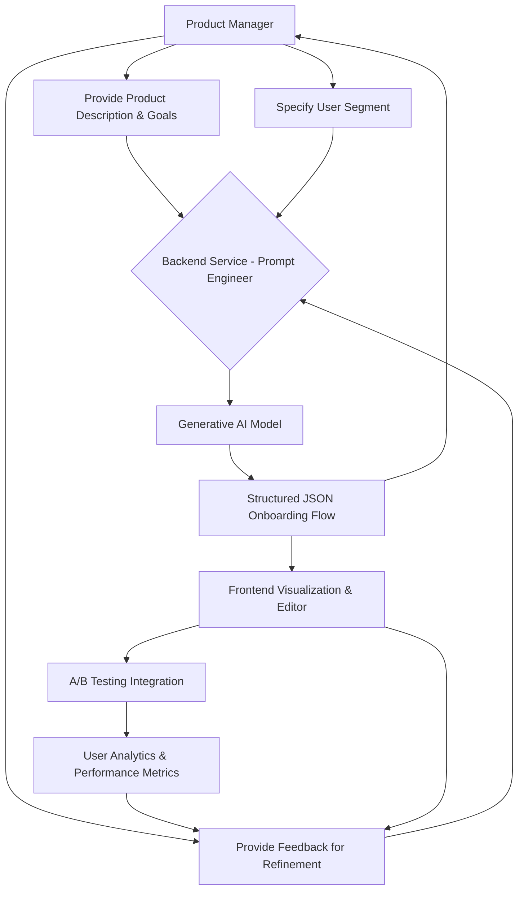

**Title of Invention:** System and Method for Generative Design of User Onboarding Workflows

**Abstract:**
A system for designing user onboarding experiences is disclosed. A user, such as a product manager, provides a description of their application and its target user. This information is sent to a generative AI model, which is prompted to act as a user experience expert. The AI designs a complete, multi-step onboarding flow. The output is a structured object containing a sequence of steps, where each step includes the suggested UI title, body text, a call-to-action, and the key user action to be completed [the "aha moment"]. The system also supports iterative refinement of flows based on user feedback and personalization for different user segments.

**Background of the Invention:**
Designing an effective user onboarding flow is critical for product success, but it is a difficult and specialized task. Product managers often struggle to determine the best sequence of steps to guide a new user to their first "aha moment" of value. Existing tools are for building flows, not for designing the strategy behind them. There is a need for a tool that can assist in the conceptual design of the onboarding journey itself, and further, to facilitate iterative improvement and tailored experiences for diverse user bases.

**Brief Summary of the Invention:**
The present invention provides an "AI Onboarding Strategist." A product manager describes their product. The system prompts an LLM to design an optimal onboarding flow. The LLM, using its vast training data of successful product designs, generates a step-by-step plan. For a project management app, it might suggest: `Step 1: Welcome & Create First Project`, `Step 2: Invite a Teammate`, `Step 3: Create Your First Task`. For each step, it provides the actual microcopy for the UI, ensuring the user is guided by clear and motivating language. The system also enables the product manager to provide feedback for an existing flow, allowing the AI to generate refined versions, and to specify user segments for generating personalized onboarding paths. This significantly accelerates the design cycle and improves the relevance of the onboarding experience.

**Detailed Description of the Invention:**
A product manager enters a description of their app: `A collaborative project management tool for small teams. The core value is seeing your team's work in one place.`

The backend constructs a prompt for a generative AI model, including a `responseSchema`.
**Prompt:** `You are a world-class UX designer specializing in user onboarding. Design a 3-step onboarding flow for the following product. For each step, provide a title, a short body text, the key user action to reach the "aha moment", and a call-to-action label. Product: "A collaborative project management tool for small teams. The core value is seeing your team's work in one place."`
**Schema:**
```json
{
  "type": "OBJECT",
  "properties": {
    "onboardingFlow": {
      "type": "ARRAY",
      "items": {
        "type": "OBJECT",
        "properties": {
          "step": { "type": "NUMBER" },
          "title": { "type": "STRING" },
          "body": { "type": "STRING" },
          "keyAction": { "type": "STRING" },
          "ctaLabel": { "type": "STRING" }
        }
      }
    }
  }
}
```
The AI returns a structured JSON object. The client application then visualizes this flow, perhaps as a series of mock UI cards or a flowchart, giving the product manager a complete, ready-to-implement design for their onboarding experience.

**Iterative Refinement and Personalization:**
Beyond initial generation, the system supports dynamic adjustment. Product managers can provide qualitative feedback [e.g., "Step 2 is too complex, simplify it" or "Need more emphasis on collaboration"], which is then incorporated into a new prompt for the AI to refine an existing flow. Furthermore, by specifying target user segments [e.g., "developers", "marketing professionals", "small business owners"], the AI can generate distinct, personalized onboarding experiences that resonate more deeply with specific user needs and use cases.

**System Architecture Flowchart:**


**Conceptual Code [TypeScript Frontend]:**
```typescript
/**
 * @typedef {object} OnboardingStep - Basic structure for an onboarding step.
 * @property {number} step - The sequential number of the step.
 * @property {string} title - The title of the onboarding step.
 * @property {string} body - The main body text for the step.
 * @property {string} keyAction - The primary user action to be completed in this step.
 * @property {string} ctaLabel - The label for the call-to-action button.
 */
export interface OnboardingStep {
  step: number;
  title: string;
  body: string;
  keyAction: string;
  ctaLabel: string;
}

/**
 * @typedef {object} OnboardingStepDetail - Enhanced structure for an onboarding step, including UI assets and tracking.
 * @property {number} step - The sequential number of the step.
 * @property {string} title - The title of the onboarding step.
 * @property {string} body - The main body text for the step.
 * @property {string} keyAction - The primary user action to be completed in this step.
 * @property {string} ctaLabel - The label for the call-to-action button.
 * @property {string} [mediaAssetURL] - Optional URL for an image or video asset for the step.
 * @property {string} [trackingEventName] - Optional name for the analytics event associated with this step's completion.
 */
export interface OnboardingStepDetail extends OnboardingStep {
  mediaAssetURL?: string;
  trackingEventName?: string;
}

/**
 * Generates an initial onboarding flow based on a product description.
 * @param {string} productDescription - A description of the product and its core value.
 * @returns {Promise<OnboardingStep[]>} A promise that resolves to an array of onboarding steps.
 */
export async function generateOnboarding(productDescription: string): Promise<OnboardingStep[]> {
  // This would call the backend, which in turn calls the Gemini API
  // with the appropriate prompt and responseSchema.
  const response = await fetch('/api/ai/generate-onboarding', {
    method: 'POST',
    headers: { 'Content-Type': 'application/json' },
    body: JSON.stringify({ description: productDescription }),
  });
  const data = await response.json();
  if (!response.ok) {
    throw new Error(data.message || 'Failed to generate onboarding flow');
  }
  return data.onboardingFlow;
}

/**
 * Refines an existing onboarding flow based on specific feedback.
 * @param {OnboardingStep[]} currentFlow - The current onboarding flow to be refined.
 * @param {string} feedback - Text feedback from the product manager for refinement.
 * @returns {Promise<OnboardingStep[]>} A promise that resolves to a refined array of onboarding steps.
 */
export async function refineOnboarding(currentFlow: OnboardingStep[], feedback: string): Promise<OnboardingStep[]> {
  const response = await fetch('/api/ai/refine-onboarding', {
    method: 'POST',
    headers: { 'Content-Type': 'application/json' },
    body: JSON.stringify({ currentFlow, feedback }),
  });
  const data = await response.json();
  if (!response.ok) {
    throw new Error(data.message || 'Failed to refine onboarding flow');
  }
  return data.onboardingFlow;
}

/**
 * Generates an onboarding flow tailored for a specific user segment.
 * @param {string} productDescription - A description of the product.
 * @param {string} userSegment - A description of the target user segment (e.g., "new developers", "marketing teams").
 * @returns {Promise<OnboardingStep[]>} A promise that resolves to a personalized array of onboarding steps.
 */
export async function personalizeOnboarding(productDescription: string, userSegment: string): Promise<OnboardingStep[]> {
  const response = await fetch('/api/ai/personalize-onboarding', {
    method: 'POST',
    headers: { 'Content-Type': 'application/json' },
    body: JSON.stringify({ description: productDescription, userSegment }),
  });
  const data = await response.json();
  if (!response.ok) {
    throw new Error(data.message || 'Failed to personalize onboarding flow');
  }
  return data.onboardingFlow;
}

/**
 * Simulates tracking a user's progress through an onboarding step.
 * In a real application, this would send data to an analytics service.
 * @param {string} flowId - Identifier for the specific onboarding flow instance.
 * @param {number} stepId - The ID of the step being tracked.
 * @param {'start' | 'complete' | 'skip' | 'error'} eventType - The type of event to track.
 * @returns {Promise<void>}
 */
export async function trackOnboardingProgress(flowId: string, stepId: number, eventType: 'start' | 'complete' | 'skip' | 'error'): Promise<void> {
  console.log(`Tracking event for flow ${flowId}, step ${stepId}: ${eventType}`);
  // Simulate API call to analytics service
  await new Promise(resolve => setTimeout(resolve, 100));
}

/**
 * Simulates an evaluation of a specific onboarding flow's effectiveness based on metrics.
 * @param {string} flowId - Identifier for the onboarding flow.
 * @param {object} metrics - Object containing performance metrics.
 * @param {number} metrics.conversionRate - The percentage of users completing the flow.
 * @param {number} metrics.timeToAha - The average time for users to reach the key action.
 * @returns {Promise<string>} A promise that resolves to an AI-generated summary or recommendation based on metrics.
 */
export async function evaluateFlowEffectiveness(flowId: string, metrics: { conversionRate: number, timeToAha: number }): Promise<string> {
  const response = await fetch('/api/ai/evaluate-flow', {
    method: 'POST',
    headers: { 'Content-Type': 'application/json' },
    body: JSON.stringify({ flowId, metrics }),
  });
  const data = await response.json();
  if (!response.ok) {
    throw new Error(data.message || 'Failed to evaluate flow effectiveness');
  }
  return data.evaluationSummary;
}

// Usage examples:
/*
async function main() {
  const productDescription = "A collaborative project management tool for small teams. The core value is seeing your team's work in one place.";
  
  // 1. Generate initial flow
  const initialFlow = await generateOnboarding(productDescription);
  console.log("Initial Onboarding Flow:", JSON.stringify(initialFlow, null, 2));

  // 2. Refine flow
  const feedback = "Step 2 feels a bit too passive. Let's make it more about directly creating a task or inviting someone, instead of just 'reviewing'.";
  const refinedFlow = await refineOnboarding(initialFlow, feedback);
  console.log("Refined Onboarding Flow:", JSON.stringify(refinedFlow, null, 2));

  // 3. Personalize flow for a specific segment
  const developerSegmentFlow = await personalizeOnboarding(productDescription, "experienced software developers");
  console.log("Developer Onboarding Flow:", JSON.stringify(developerSegmentFlow, null, 2));

  // 4. Track progress (simulated)
  await trackOnboardingProgress("flow-abc-123", 1, "start");
  await trackOnboardingProgress("flow-abc-123", 1, "complete");
  
  // 5. Evaluate flow (simulated)
  const evaluation = await evaluateFlowEffectiveness("flow-abc-123", { conversionRate: 0.75, timeToAha: 120 });
  console.log("Flow Evaluation:", evaluation);
}

main().catch(console.error);
*/
```

**Claims:**
1.  A method for designing a user onboarding workflow, comprising:
    a. Receiving a description of a software application from a user.
    b. Transmitting said description to a generative AI model with a prompt to design a multi-step onboarding flow.
    c. Receiving a structured data object from the model representing the sequence of steps in the flow.
    d. Displaying the generated flow to the user.

2.  The method of claim 1, wherein each step in the structured data object includes a title, body text, a key user action, and a call-to-action label.

3.  The method of claim 1, wherein the request to the AI model includes a response schema to ensure the output is in a structured format.

4.  The method of claim 1, further comprising:
    a. Receiving user feedback on a previously generated onboarding flow.
    b. Transmitting the feedback and the current flow to the generative AI model with a prompt to refine the flow.
    c. Receiving a refined structured data object from the model.
    d. Displaying the refined flow to the user.

5.  The method of claim 1, further comprising:
    a. Receiving a specification of a target user segment.
    b. Transmitting the application description and the user segment to the generative AI model with a prompt to design a personalized multi-step onboarding flow.
    c. Receiving a personalized structured data object from the model.
    d. Displaying the personalized flow to the user.

6.  A system for designing user onboarding workflows, comprising:
    a. An input module configured to receive an application description and user input.
    b. A backend service configured to construct prompts for a generative AI model.
    c. A generative AI model interface configured to communicate with the generative AI model.
    d. An output module configured to receive and display structured onboarding flow data.
    e. A refinement module configured to process user feedback and initiate iterative flow generation by the AI model.
    f. A personalization module configured to process user segment information and initiate segment-specific flow generation by the AI model.

**Mathematical Justification:**
Let `F` be the space of all possible onboarding flows. Let `D` be the product description. Let `S` denote a specific user segment.
The goal is to find an optimal flow `f*_S` for a segment `S` that maximizes a utility function `U(f, S)`. The utility function `U(f, S)` for a flow `f` and segment `S` could be a composite metric, such as:
`U(f, S) = w_1 * RetentionRate(f, S) + w_2 * TimeToAha(f, S)^-1 + w_3 * FeatureAdoption(f, S)`
where `w_i` are weighting coefficients.

The generative AI model `G_AI` acts as a function:
`G_AI : (D, S, f_k, Feedback_k) → f_{k+1}`
This means `G_AI` takes the product description `D`, an optional user segment `S`, a current flow `f_k` [which could be initial or an earlier iteration], and optional `Feedback_k` to produce a new or refined flow `f_{k+1}`.

For initial generation, `f_0 = G_AI(D, S=null, f_k=null, Feedback_k=null)`.
For personalization, `f_S = G_AI(D, S, f_k=null, Feedback_k=null)`.
For iterative refinement, `f_{k+1} = G_AI(D, S, f_k, Feedback_k)`.

The problem of finding `f*_S = argmax_{f in F} U(f, S)` is computationally intractable due to the combinatorially large size of `F`.
The system provides a heuristic approach by leveraging `G_AI`. The AI model, having been trained on a massive corpus of successful and unsuccessful product designs and user engagement data, has learned a powerful heuristic function that can efficiently generate a candidate flow `f'` or refine `f_k` towards `f*_S`.

**Proof of Utility:** The space `F` is combinatorially large and cannot be exhaustively searched. A human designer uses their own heuristics to design a candidate flow. The AI model, having been trained on a massive corpus of successful and unsuccessful product designs, has learned a more powerful heuristic function. The system is proven useful because it automates the generation of a high-quality candidate flow `f'`, significantly reducing the design time and increasing the probability that the chosen flow is near-optimal. Furthermore, the ability to iteratively refine and personalize flows based on segments and feedback means the system can adapt and optimize the onboarding experience over time, leading to higher retention and user satisfaction compared to static, manually designed flows.