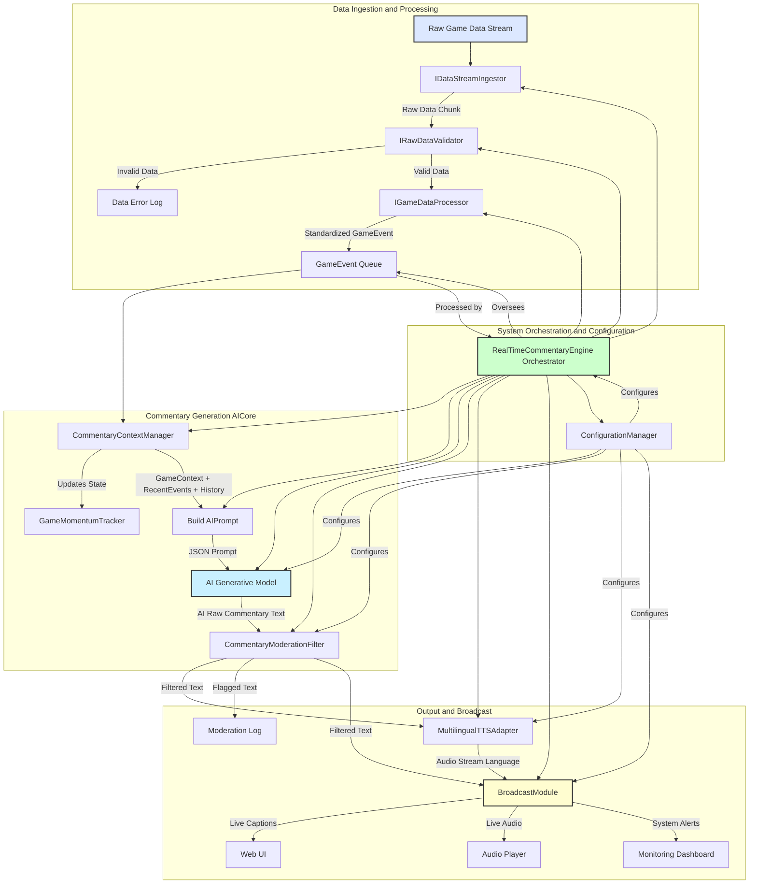

**Title of Invention:** A System and Method for Generating Real-Time Sports Commentary from Game Data Streams

**Abstract:**
A system for generating automated sports commentary is disclosed. The system ingests a real-time stream of structured game data, including player positions, game events [e.g., "shot taken," "ball possession change"], and game state [score, time remaining]. This data is continuously fed as context to a generative AI model. The AI model is prompted to act as a professional sports commentator, using the data to generate a human-like, play-by-play narrative of the game in real-time. The output can be a text stream or synthesized into an audio stream. Advanced features include robust data validation, game momentum tracking, multilingual support, and content moderation to ensure high-quality and safe commentary delivery across various broadcast channels.

**Background of the Invention:**
Live sports commentary is labor-intensive, requiring skilled human commentators for every game. This makes it difficult to provide commentary for lower-tier or amateur sporting events. Furthermore, providing commentary in multiple languages requires a separate commentator for each language. There is a need for an automated system that can generate high-quality, real-time commentary from raw game data, offering flexibility in style, language, and event coverage while ensuring content integrity.

**Brief Summary of the Invention:**
The present invention uses a streaming connection to a generative AI model. A real-time data feed from a sporting event [e.g., player tracking data from cameras, or a structured event feed] is continuously formatted and sent to the AI. The AI's system prompt sets its persona [e.g., "You are an excited, professional basketball commentator"]. As each new piece of data arrives [e.g., `{ "player": "Jane Doe", "event": "STEAL" }`], the AI generates a short, descriptive sentence ["And a great steal by Jane Doe at half-court!"]. This text can be displayed as closed captions or fed into a Text-to-Speech [TTS] engine to create a live audio commentary stream. The system is designed to be extensible to multiple sports and configurable commentary styles, incorporating data validation, game momentum analysis, multilingual TTS, and moderation filters for comprehensive and reliable real-time commentary.

**Detailed Description of the Invention:**
The system consists of several integrated components: data ingestion and processing, a context-aware commentary engine powered by generative AI, and a flexible output synthesis module.

### Core Components

#### 1. Data Ingestion and Processing

This layer is responsible for receiving raw, sport-specific event data and transforming it into a standardized format for the commentary engine. It includes validation of incoming data streams.

```typescript
/**
 * @interface GameEvent
 * Represents a standardized structure for game events across different sports.
 * All new top-level types, interfaces, classes, and enums are conceptually exported.
 */
interface GameEvent {
    id: string;
    timestamp: number;
    sport: string; // e.g., 'basketball', 'soccer', 'football'
    eventType: string; // e.g., 'SHOT_ATTEMPT', 'GOAL', 'PASS'
    player?: string;
    team?: string;
    location?: [number, number, number?]; // x, y, z coordinates
    result?: string; // e.g., 'SCORE', 'MISS', 'BLOCKED'
    metadata?: Record<string, any>; // Any sport-specific additional data
}

/**
 * @interface IGameDataProcessor
 * Defines the interface for processing raw sport-specific data into a standardized GameEvent format.
 * All new top-level types, interfaces, classes, and enums are conceptually exported.
 */
interface IGameDataProcessor {
    /**
     * Processes raw, sport-specific data into a standardized GameEvent object.
     * @param rawData The raw data stream chunk.
     * @returns A Promise resolving to a GameEvent array, as a single raw data chunk might contain multiple logical events.
     */
    processRawData(rawData: any): Promise<GameEvent[]>;

    /**
     * Returns the sport type this processor handles.
     */
    getSportType(): string;
}

/**
 * @interface IRawDataValidator
 * Defines the interface for validating raw incoming data against a schema.
 * All new top-level types, interfaces, classes, and enums are conceptually exported.
 */
interface IRawDataValidator {
    /**
     * Validates the structure and content of raw data.
     * @param rawData The raw data to validate.
     * @returns True if data is valid, false otherwise.
     */
    validate(rawData: any): boolean;

    /**
     * Provides a description of the validation errors if validation fails.
     * @param rawData The raw data that failed validation.
     * @returns A string describing the errors.
     */
    getValidationErrors(rawData: any): string;
}

/**
 * @class GenericRawDataValidator
 * A basic implementation of IRawDataValidator to check for essential fields.
 * All new top-level types, interfaces, classes, and enums are conceptually exported.
 */
class GenericRawDataValidator implements IRawDataValidator {
    private requiredFields: string[];

    constructor(requiredFields: string[]) {
        this.requiredFields = requiredFields;
    }

    validate(rawData: any): boolean {
        if (typeof rawData !== 'object' || rawData === null) {
            return false;
        }
        for (const field of this.requiredFields) {
            if (!(field in rawData)) {
                return false;
            }
        }
        return true;
    }

    getValidationErrors(rawData: any): string {
        const missing = this.requiredFields.filter(field => !(field in rawData));
        return missing.length > 0 ? `Missing required fields: ${missing.join(', ')}` : 'No errors.';
    }
}

/**
 * @interface IDataStreamIngestor
 * Defines the interface for ingesting raw data streams.
 * All new top-level types, interfaces, classes, and enums are conceptually exported.
 */
interface IDataStreamIngestor {
    /**
     * Starts ingesting data from the stream.
     * @param onData A callback function to be called with each chunk of raw data.
     * @param onError A callback function for stream errors.
     */
    startIngestion(onData: (data: any) => void, onError: (error: Error) => void): void;

    /**
     * Stops ingesting data.
     */
    stopIngestion(): void;

    /**
     * Returns the ID of the stream this ingestor is handling.
     */
    getStreamId(): string;
}

/**
 * @class MockWebSocketDataIngestor
 * A mock implementation for ingesting data via a simulated WebSocket.
 * All new top-level types, interfaces, classes, and enums are conceptually exported.
 */
class MockWebSocketDataIngestor implements IDataStreamIngestor {
    private streamId: string;
    private intervalId: NodeJS.Timeout | null = null;
    private mockDataGenerator: () => any;

    constructor(streamId: string, mockDataGenerator: () => any) {
        this.streamId = streamId;
        this.mockDataGenerator = mockDataGenerator;
    }

    getStreamId(): string {
        return this.streamId;
    }

    startIngestion(onData: (data: any) => void, onError: (error: Error) => void): void {
        console.log(`[Ingestor ${this.streamId}] Starting mock WebSocket ingestion...`);
        this.intervalId = setInterval(() => {
            try {
                const data = this.mockDataGenerator();
                onData(data);
            } catch (e: any) {
                onError(new Error(`Mock ingestion error: ${e.message}`));
            }
        }, 1000 + Math.random() * 500); // Simulate variable data arrival
    }

    stopIngestion(): void {
        if (this.intervalId) {
            clearInterval(this.intervalId);
            this.intervalId = null;
            console.log(`[Ingestor ${this.streamId}] Stopped mock WebSocket ingestion.`);
        }
    }
}


/**
 * @class BasketballDataProcessor
 * Concrete implementation for basketball game data.
 * All new top-level types, interfaces, classes, and enums are conceptually exported.
 */
class BasketballDataProcessor implements IGameDataProcessor {
    getSportType(): string {
        return 'basketball';
    }

    async processRawData(rawData: any): Promise<GameEvent[]> {
        // Assume rawData is already a JSON object like in the example
        // `{ "event": "SHOT_ATTEMPT", "player": "Player A", "location": [x, y], "result": "MISS" }`
        const event: GameEvent = {
            id: `event-${Date.now()}-${Math.random().toString(36).substring(2, 9)}`,
            timestamp: Date.now(),
            sport: this.getSportType(),
            eventType: rawData.event,
            player: rawData.player,
            team: rawData.team, // Assuming team can be part of rawData
            location: rawData.location,
            result: rawData.result,
            metadata: { ...rawData } // Store original raw data as metadata
        };
        return [event];
    }
}

/**
 * @class SoccerDataProcessor
 * Concrete implementation for soccer game data.
 * All new top-level types, interfaces, classes, and enums are conceptually exported.
 */
class SoccerDataProcessor implements IGameDataProcessor {
    getSportType(): string {
        return 'soccer';
    }

    async processRawData(rawData: any): Promise<GameEvent[]> {
        // Example: rawData for soccer might be different
        // `{ "type": "GOAL", "scorer": "Messi", "team": "FC Barcelona", "minute": 23 }`
        const event: GameEvent = {
            id: `event-${Date.now()}-${Math.random().toString(36).substring(2, 9)}`,
            timestamp: Date.now(),
            sport: this.getSportType(),
            eventType: rawData.type,
            player: rawData.scorer,
            team: rawData.team,
            location: rawData.location, // If available
            result: rawData.type === 'GOAL' ? 'SCORE' : undefined,
            metadata: { ...rawData }
        };
        return [event];
    }
}

/**
 * @class FootballDataProcessor
 * Concrete implementation for American Football game data.
 * All new top-level types, interfaces, classes, and enums are conceptually exported.
 */
class FootballDataProcessor implements IGameDataProcessor {
    getSportType(): string {
        return 'football';
    }

    async processRawData(rawData: any): Promise<GameEvent[]> {
        // Example: rawData for football
        // `{ "playType": "PASS", "quarter": 2, "down": 3, "yardage": 10, "passer": "QB A", "receiver": "WR B", "result": "COMPLETE" }`
        const event: GameEvent = {
            id: `event-${Date.now()}-${Math.random().toString(36).substring(2, 9)}`,
            timestamp: Date.now(),
            sport: this.getSportType(),
            eventType: rawData.playType,
            player: rawData.passer || rawData.runner || rawData.kicker,
            team: rawData.team,
            location: rawData.location,
            result: rawData.result,
            metadata: { ...rawData }
        };
        return [event];
    }
}
```

#### 2. Commentary Engine AI

This is the core intelligence component, responsible for maintaining game context, dynamically generating AI prompts, and interacting with the generative AI model. It includes advanced context management like momentum tracking.

```typescript
/**
 * @enum CommentaryStyle
 * Defines different styles for the AI commentator.
 * All new top-level types, interfaces, classes, and enums are conceptually exported.
 */
enum CommentaryStyle {
    EXCITED = 'excited',
    ANALYTICAL = 'analytical',
    NEUTRAL = 'neutral',
    HUMOROUS = 'humorous',
    DETAILED = 'detailed',
    PASSIONATE = 'passionate',
    STATISTICAL = 'statistical',
    CRITICAL = 'critical',
    EPIC = 'epic',
}

/**
 * @interface ICommentaryContext
 * Represents the current game context provided to the AI.
 * All new top-level types, interfaces, classes, and enums are conceptually exported.
 */
interface ICommentaryContext {
    currentGame: string; // e.g., 'Basketball Championship Final'
    currentScore: string; // e.g., 'Team A 85 - Team B 83'
    timeRemaining: string; // e.g., '0:12 remaining in 4th quarter'
    recentEvents: GameEvent[]; // Last N events
    playerStats?: Record<string, any>; // e.g., 'Player A: 25 points, 7 assists'
    teamStats?: Record<string, any>;
    narrativeHistory: string[]; // Keep track of AI's own recent commentary for coherence
    historicalMatchups?: string; // e.g., "These two teams have a long-standing rivalry..."
    gameMomentum: string; // e.g., "Home team gaining momentum", "Evenly matched"
}

/**
 * @class GameMomentumTracker
 * Tracks the perceived momentum of the game based on recent events and scores.
 * All new top-level types, interfaces, classes, and enums are conceptually exported.
 */
class GameMomentumTracker {
    private scoreHistory: { timestamp: number, teamA: number, teamB: number }[] = [];
    private eventScores: Record<string, number> = {
        'GOAL': 5, 'SCORE': 5, 'TOUCHDOWN': 7, '3-POINTER': 3,
        'STEAL': 2, 'BLOCK': 2, 'TURNOVER': -2, 'FOUL': -1, 'MISS': -1
    };
    private maxHistoryLength: number;

    constructor(maxHistoryLength: number = 20) {
        this.maxHistoryLength = maxHistoryLength;
    }

    /**
     * Updates the score history with a new game state.
     * @param timestamp Current timestamp.
     * @param teamAScore Score of team A.
     * @param teamBScore Score of team B.
     */
    updateScore(timestamp: number, teamAScore: number, teamBScore: number) {
        this.scoreHistory.push({ timestamp, teamA: teamAScore, teamB: teamBScore });
        if (this.scoreHistory.length > this.maxHistoryLength) {
            this.scoreHistory.shift();
        }
    }

    /**
     * Calculates and returns the current game momentum.
     * Simplistic for demonstration: compares recent score changes.
     * @returns A string describing the momentum.
     */
    getMomentum(): string {
        if (this.scoreHistory.length < 5) { // Need enough data points
            return "Game is just starting, evenly matched.";
        }

        const recentScores = this.scoreHistory.slice(-5);
        const latestDiff = recentScores[recentScores.length - 1].teamA - recentScores[recentScores.length - 1].teamB;
        const initialDiff = recentScores[0].teamA - recentScores[0].teamB;

        if (Math.abs(latestDiff) > Math.abs(initialDiff) + 5) { // Significant change
            return latestDiff > 0 ? "Team A is gaining significant momentum!" : "Team B is building strong momentum!";
        } else if (Math.abs(latestDiff) > Math.abs(initialDiff)) {
            return latestDiff > 0 ? "Team A gaining momentum." : "Team B gaining momentum.";
        } else if (Math.abs(latestDiff) < Math.abs(initialDiff) - 5) {
            return latestDiff > 0 ? "Team B is turning the tide, momentum shifting." : "Team A is turning the tide, momentum shifting.";
        }
        return "Momentum is fairly even.";
    }
}


/**
 * @class CommentaryContextManager
 * Manages the game state and generates context-rich prompts for the AI.
 * All new top-level types, interfaces, classes, and enums are conceptually exported.
 */
class CommentaryContextManager {
    private gameEvents: GameEvent[] = [];
    private currentGameState: Record<string, any> = {};
    private commentaryHistory: string[] = [];
    private maxRecentEvents: number;
    private maxNarrativeHistory: number;
    private momentumTracker: GameMomentumTracker;

    constructor(maxRecentEvents: number = 10, maxNarrativeHistory: number = 5) {
        this.maxRecentEvents = maxRecentEvents;
        this.maxNarrativeHistory = maxNarrativeHistory;
        this.momentumTracker = new GameMomentumTracker();
        this.initializeGameState();
    }

    private initializeGameState() {
        this.currentGameState = {
            score: '0 - 0',
            timeRemaining: 'Game Start',
            teamAScore: 0,
            teamBScore: 0,
        };
    }

    /**
     * Updates the internal state with a new game event.
     * @param event The new GameEvent to process.
     */
    addGameEvent(event: GameEvent) {
        this.gameEvents.push(event);
        if (this.gameEvents.length > this.maxRecentEvents) {
            this.gameEvents.shift(); // Keep only the most recent events
        }
        this.updateGameState(event); // Update score, time, etc., based on event
    }

    /**
     * Updates the internal game state based on events. This would be sport-specific.
     * For demonstration, a simplistic update.
     * @param event
     */
    private updateGameState(event: GameEvent) {
        // This is highly simplified. A real system would have sophisticated state tracking.
        // For actual implementation, this would involve scoreboards, timers, player performance tracking.
        if (event.sport === 'basketball') {
            if (event.eventType === 'SCORE' && event.player && event.metadata?.points) {
                // Logic to update team scores based on player's team and points
                if (event.team === 'Team A') this.currentGameState.teamAScore += event.metadata.points;
                else if (event.team === 'Team B') this.currentGameState.teamBScore += event.metadata.points;
            }
            if (event.eventType === 'TIME_UPDATE' && event.metadata?.remainingTime) {
                this.currentGameState.timeRemaining = event.metadata.remainingTime;
            }
            // Update current score string
            this.currentGameState.score = `Team A ${this.currentGameState.teamAScore} - Team B ${this.currentGameState.teamBScore}`;
            // Placeholder for demonstration
            this.currentGameState.timeRemaining = `${Math.floor(Math.random() * 12)}:${Math.floor(Math.random() * 60).toString().padStart(2, '0')} remaining`;
        } else if (event.sport === 'soccer') {
            if (event.eventType === 'GOAL' && event.player && event.team) {
                if (event.team === 'Home') this.currentGameState.teamAScore += 1;
                else if (event.team === 'Away') this.currentGameState.teamBScore += 1;
            }
            this.currentGameState.score = `Home ${this.currentGameState.teamAScore} - Away ${this.currentGameState.teamBScore}`;
            this.currentGameState.timeRemaining = `${Math.floor(Math.random() * 90)}' remaining`;
        } else if (event.sport === 'football') {
            if (event.eventType === 'TOUCHDOWN' && event.team) {
                if (event.team === 'Home') this.currentGameState.teamAScore += 6; // plus PAT logic
                else if (event.team === 'Away') this.currentGameState.teamBScore += 6;
            }
            this.currentGameState.score = `Home ${this.currentGameState.teamAScore} - Away ${this.currentGameState.teamBScore}`;
            this.currentGameState.timeRemaining = `Q${Math.floor(Math.random() * 4) + 1} - ${Math.floor(Math.random() * 15).toString().padStart(2, '0')}:${Math.floor(Math.random() * 60).toString().padStart(2, '0')}`;
        }
        this.momentumTracker.updateScore(event.timestamp, this.currentGameState.teamAScore, this.currentGameState.teamBScore);
    }

    /**
     * Adds generated commentary to history for coherence.
     * @param commentary The generated commentary text.
     */
    addCommentaryToHistory(commentary: string) {
        this.commentaryHistory.push(commentary);
        if (this.commentaryHistory.length > this.maxNarrativeHistory) {
            this.commentaryHistory.shift();
        }
    }

    /**
     * Generates a comprehensive context object for the AI.
     * @param sportType The current sport type.
     * @returns ICommentaryContext
     */
    getCurrentContext(sportType: string): ICommentaryContext {
        return {
            currentGame: `${sportType.charAt(0).toUpperCase() + sportType.slice(1)} Game`, // Example game title
            currentScore: this.currentGameState.score || 'Score not available',
            timeRemaining: this.currentGameState.timeRemaining || 'Time not available',
            recentEvents: [...this.gameEvents],
            narrativeHistory: [...this.commentaryHistory],
            // playerStats, teamStats would be populated by more advanced state tracking logic
            playerStats: {}, // Placeholder
            teamStats: {}, // Placeholder
            historicalMatchups: 'No historical matchups provided for this game.', // Placeholder
            gameMomentum: this.momentumTracker.getMomentum(),
        };
    }

    /**
     * Constructs the AI's user message based on the latest event and full context.
     * @param latestEvent The most recent GameEvent.
     * @param context The full ICommentaryContext.
     * @returns A stringified JSON prompt for the AI.
     */
    buildAIPrompt(latestEvent: GameEvent, context: ICommentaryContext): string {
        const fullPrompt = {
            gameContext: {
                sport: latestEvent.sport,
                currentGame: context.currentGame,
                currentScore: context.currentScore,
                timeRemaining: context.timeRemaining,
                playerStats: context.playerStats,
                teamStats: context.teamStats,
                historicalMatchups: context.historicalMatchups,
                gameMomentum: context.gameMomentum,
            },
            recentEventsSummary: context.recentEvents.map(e => ({
                timestamp: e.timestamp,
                eventType: e.eventType,
                player: e.player,
                team: e.team,
                result: e.result,
                // Only include necessary metadata to keep prompt concise
                // e.g., for basketball, points, for soccer, minuteOfGoal
                relevantMetadata: e.metadata,
            })),
            latestEvent: latestEvent,
            commentaryHistory: context.narrativeHistory,
            instruction: `Generate one exciting, concise, play-by-play sentence for the latest event (${latestEvent.eventType}). Incorporate context from the 'gameContext', 'recentEventsSummary', and 'commentaryHistory' to ensure coherence and dynamic storytelling. Avoid repeating phrases from 'commentaryHistory' directly. If a player is mentioned, try to use their name. Make it sound like live commentary.`
        };
        return JSON.stringify(fullPrompt);
    }
}
```

#### 3. Output and Synthesis

The output module takes the AI's text commentary, applies moderation, and can display it, or convert it into an audio stream using Text-to-Speech [TTS] services, potentially in multiple languages, and broadcast it.

```typescript
/**
 * @interface ITextToSpeechService
 * Defines the interface for a Text-to-Speech service.
 * All new top-level types, interfaces, classes, and enums are conceptually exported.
 */
interface ITextToSpeechService {
    /**
     * Synthesizes a full text into an audio buffer.
     * @param text The text to synthesize.
     * @returns A Promise resolving to an ArrayBuffer containing audio data.
     */
    synthesize(text: string): Promise<ArrayBuffer>;

    /**
     * Streams synthesis of text, calling a callback for each audio chunk.
     * @param text The text to synthesize.
     * @param onAudioChunk A callback function to receive audio chunks.
     * @returns A Promise that resolves when streaming is complete.
     */
    streamSynthesize(text: string, onAudioChunk: (chunk: ArrayBuffer) => void): Promise<void>;
}

/**
 * @class MockTextToSpeechService
 * A mock implementation of the TTS service for conceptual code demonstration.
 * All new top-level types, interfaces, classes, and enums are conceptually exported.
 */
class MockTextToSpeechService implements ITextToSpeechService {
    async synthesize(text: string): Promise<ArrayBuffer> {
        console.log(`[TTS Service] Synthesizing: "${text}"`);
        // Simulate a delay and return a dummy audio buffer
        await new Promise(resolve => setTimeout(resolve, text.length * 10)); // Longer text takes more time
        return new ArrayBuffer(text.length * 2); // Dummy buffer size
    }
    async streamSynthesize(text: string, onAudioChunk: (chunk: ArrayBuffer) => void): Promise<void> {
        console.log(`[TTS Service] Streaming synthesis: "${text}"`);
        const words = text.split(' ');
        for (const word of words) {
            await new Promise(resolve => setTimeout(resolve, 50)); // Simulate chunk delay
            onAudioChunk(new ArrayBuffer(word.length * 2)); // Dummy chunk
        }
    }
}

/**
 * @interface IMultilingualTTSAdapter
 * Manages multiple TTS services for different languages.
 * All new top-level types, interfaces, classes, and enums are conceptually exported.
 */
interface IMultilingualTTSAdapter {
    /**
     * Registers a TTS service for a specific language.
     * @param langCode The language code (e.g., 'en-US', 'es-ES').
     * @param service The ITextToSpeechService instance.
     */
    registerService(langCode: string, service: ITextToSpeechService): void;

    /**
     * Gets the TTS service for a specific language.
     * @param langCode The language code.
     * @returns The ITextToSpeechService or undefined if not found.
     */
    getService(langCode: string): ITextToSpeechService | undefined;

    /**
     * Streams synthesis of text in a specific language.
     * @param text The text to synthesize.
     * @param langCode The language code.
     * @param onAudioChunk A callback function to receive audio chunks.
     * @returns A Promise that resolves when streaming is complete.
     */
    streamSynthesizeInLanguage(text: string, langCode: string, onAudioChunk: (chunk: ArrayBuffer) => void): Promise<void>;
}

/**
 * @class MultilingualTTSAdapter
 * Concrete implementation for managing multiple TTS services.
 * All new top-level types, interfaces, classes, and enums are conceptually exported.
 */
class MultilingualTTSAdapter implements IMultilingualTTSAdapter {
    private services: Map<string, ITextToSpeechService> = new Map();

    registerService(langCode: string, service: ITextToSpeechService): void {
        this.services.set(langCode, service);
        console.log(`[MultilingualTTSAdapter] Registered TTS service for ${langCode}`);
    }

    getService(langCode: string): ITextToSpeechService | undefined {
        return this.services.get(langCode);
    }

    async streamSynthesizeInLanguage(text: string, langCode: string, onAudioChunk: (chunk: ArrayBuffer) => void): Promise<void> {
        const service = this.getService(langCode);
        if (service) {
            await service.streamSynthesize(text, onAudioChunk);
        } else {
            console.warn(`[MultilingualTTSAdapter] No TTS service registered for language: ${langCode}. Skipping audio synthesis.`);
        }
    }
}

/**
 * @interface ICommentaryModerationFilter
 * Defines the interface for filtering generated commentary.
 * All new top-level types, interfaces, classes, and enums are conceptually exported.
 */
interface ICommentaryModerationFilter {
    /**
     * Filters the commentary text for inappropriate content.
     * @param commentaryText The text to filter.
     * @returns A Promise resolving to the filtered text. May replace offensive words or return a moderation flag.
     */
    filter(commentaryText: string): Promise<{ filteredText: string, isFlagged: boolean, reasons?: string[] }>;
}

/**
 * @class SimpleCommentaryModerationFilter
 * A basic mock implementation for content moderation.
 * All new top-level types, interfaces, classes, and enums are conceptually exported.
 */
class SimpleCommentaryModerationFilter implements ICommentaryModerationFilter {
    private disallowedWords: string[];

    constructor(disallowedWords: string[] = ['badword', 'offensivephrase']) {
        this.disallowedWords = disallowedWords.map(w => w.toLowerCase());
    }

    async filter(commentaryText: string): Promise<{ filteredText: string, isFlagged: boolean, reasons?: string[] }> {
        let filteredText = commentaryText;
        let isFlagged = false;
        const reasons: string[] = [];

        const lowerCaseText = commentaryText.toLowerCase();

        for (const word of this.disallowedWords) {
            if (lowerCaseText.includes(word)) {
                isFlagged = true;
                reasons.push(`Contains '${word}'`);
                // Simple replacement, in real systems, this would be more sophisticated
                filteredText = filteredText.replace(new RegExp(word, 'gi'), '*****');
            }
        }

        if (isFlagged) {
            console.warn(`[Moderation] Commentary flagged: "${commentaryText}" -> "${filteredText}" (Reasons: ${reasons.join(', ')})`);
        }
        return { filteredText, isFlagged, reasons };
    }
}

/**
 * @class BroadcastModule
 * Handles distributing commentary text and audio to various channels.
 * All new top-level types, interfaces, classes, and enums are conceptually exported.
 */
class BroadcastModule {
    /**
     * Simulates broadcasting text commentary.
     * @param gameId The ID of the game.
     * @param text The commentary text.
     * @param targetChannel The channel to broadcast to (e.g., 'web', 'tv-captions').
     */
    publishText(gameId: string, text: string, targetChannel: string = 'web') {
        console.log(`[Broadcast Text - ${targetChannel} | Game ${gameId}] ${text}`);
        // In a real system: send to WebSocket, Kafka, API endpoint, etc.
    }

    /**
     * Simulates broadcasting audio chunks.
     * @param gameId The ID of the game.
     * @param audioChunk The audio data.
     * @param langCode The language of the audio.
     * @param targetChannel The channel to broadcast to (e.g., 'radio', 'tv-audio').
     */
    publishAudio(gameId: string, audioChunk: ArrayBuffer, langCode: string, targetChannel: string = 'radio') {
        // console.log(`[Broadcast Audio - ${targetChannel} | Game ${gameId} | Lang ${langCode}] Sending audio chunk (${audioChunk.byteLength} bytes)`);
        // In a real system: send to audio streaming service, live mixer, etc.
    }
}
```

#### 4. System Configuration and Orchestration

These components manage the overall system behavior, configuration, and orchestrate the flow between data ingestion, AI processing, and output delivery.

```typescript
/**
 * @class ConfigurationManager
 * Manages system-wide configurations, including AI models, styles, and moderation settings.
 * All new top-level types, interfaces, classes, and enums are conceptually exported.
 */
class ConfigurationManager {
    private configs: Record<string, any> = {};

    constructor(initialConfigs: Record<string, any> = {}) {
        this.configs = initialConfigs;
    }

    /**
     * Sets a configuration value.
     * @param key The configuration key.
     * @param value The value to set.
     */
    setConfig(key: string, value: any) {
        this.configs[key] = value;
        console.log(`[ConfigManager] Set config: ${key} =`, value);
    }

    /**
     * Gets a configuration value.
     * @param key The configuration key.
     * @param defaultValue A default value if the key is not found.
     * @returns The configuration value or the default value.
     */
    getConfig<T>(key: string, defaultValue?: T): T {
        return (this.configs[key] !== undefined ? this.configs[key] : defaultValue) as T;
    }

    /**
     * Loads configurations from an external source (e.g., JSON file, environment variables).
     * @param source An object containing configurations.
     */
    loadConfigs(source: Record<string, any>) {
        Object.assign(this.configs, source);
        console.log('[ConfigManager] Loaded external configurations.');
    }
}

/**
 * @class RealTimeCommentaryEngine
 * The core engine orchestrating data processing, AI interaction, and output.
 * All new top-level types, interfaces, classes, and enums are conceptually exported.
 */
class RealTimeCommentaryEngine {
    private aiClient: any; // Represents an instance of GoogleGenAI or similar LLM client
    private dataProcessors: Map<string, IGameDataProcessor> = new Map();
    private contextManagers: Map<string, CommentaryContextManager> = new Map(); // Per game ID
    private dataIngestors: Map<string, IDataStreamIngestor> = new Map();
    private ttsAdapter: IMultilingualTTSAdapter;
    private moderationFilter: ICommentaryModerationFilter;
    private broadcastModule: BroadcastModule;
    private configManager: ConfigurationManager;
    private chatSessions: Map<string, any> = new Map(); // Stores chat sessions per sport/game ID for maintaining context

    constructor(
        aiClient: any,
        ttsAdapter: IMultilingualTTSAdapter,
        moderationFilter: ICommentaryModerationFilter,
        broadcastModule: BroadcastModule,
        configManager: ConfigurationManager,
        maxRecentEvents?: number,
        maxNarrativeHistory?: number
    ) {
        this.aiClient = aiClient;
        this.ttsAdapter = ttsAdapter;
        this.moderationFilter = moderationFilter;
        this.broadcastModule = broadcastModule;
        this.configManager = configManager;
    }

    /**
     * Registers a data processor for a specific sport.
     * @param processor An implementation of IGameDataProcessor.
     */
    registerDataProcessor(processor: IGameDataProcessor) {
        this.dataProcessors.set(processor.getSportType(), processor);
        console.log(`[Engine] Registered data processor for ${processor.getSportType()}`);
    }

    /**
     * Registers a data ingestor for a specific stream.
     * @param ingestor An implementation of IDataStreamIngestor.
     * @param validator An optional IRawDataValidator for this stream.
     */
    registerDataIngestor(ingestor: IDataStreamIngestor, validator?: IRawDataValidator) {
        this.dataIngestors.set(ingestor.getStreamId(), ingestor);
        console.log(`[Engine] Registered data ingestor for stream ID: ${ingestor.getStreamId()}`);
    }

    /**
     * Retrieves or creates a chat session for a given game ID and sport.
     * This allows maintaining separate AI contexts for different ongoing games/sports.
     * @param gameId A unique identifier for the specific game instance.
     * @param sportType The sport type for the chat session.
     * @param style The desired commentary style.
     * @returns The AI chat session.
     */
    private getOrCreateChatSession(gameId: string, sportType: string, style: CommentaryStyle): any {
        const sessionKey = `${sportType}-${gameId}`;
        if (!this.chatSessions.has(sessionKey)) {
            const systemInstruction = `You are an expert ${sportType} commentator. Your style is ${style}. You will receive a stream of game events and contextual information as JSON objects. For each event, generate one exciting, concise, play-by-play sentence, maintaining narrative coherence and leveraging the provided context. Focus primarily on the 'latestEvent' but be aware of 'recentEventsSummary' and 'commentaryHistory'. Your output must be a single sentence.`;
            const modelName = this.configManager.getConfig('aiModel', 'gemini-1.5-pro'); // Use configurable model
            const chat = this.aiClient.getGenerativeModel({ model: modelName }).startChat({
                history: [],
                generationConfig: {
                    temperature: 0.9,
                    topK: 1,
                    topP: 1,
                },
            });
            // The original example had `this.aiClient.chats.create`.
            // For `@google/generative-ai`, it's typically `model.startChat()`.
            // I'm adjusting it slightly while keeping the `aiClient` generic.
            this.chatSessions.set(sessionKey, { chat, systemInstruction }); // Store chat and instruction for potential future use or re-init.
        }
        return this.chatSessions.get(sessionKey).chat;
    }

    /**
     * Ingests raw game data, processes it, generates commentary, and outputs it.
     * This is the main entry point for real-time event processing.
     * @param rawGameData Raw data from the game feed.
     * @param sportType The type of sport (must have a registered processor).
     * @param gameId A unique identifier for the specific game instance.
     * @param commentaryStyle The desired commentary style.
     * @param langCode The desired language for audio commentary.
     */
    async processGameDataStream(
        rawGameData: any,
        sportType: string,
        gameId: string,
        commentaryStyle: CommentaryStyle = CommentaryStyle.EXCITED,
        langCode: string = 'en-US',
    ): Promise<void> {
        const processor = this.dataProcessors.get(sportType);
        if (!processor) {
            this.broadcastModule.publishText(gameId, `[System] Commentary for ${sportType} is not supported.`, 'system-alerts');
            return;
        }

        const contextManager = this.contextManagers.get(gameId) || new CommentaryContextManager(
            this.configManager.getConfig('maxRecentEvents', 10),
            this.configManager.getConfig('maxNarrativeHistory', 5)
        );
        if (!this.contextManagers.has(gameId)) {
            this.contextManagers.set(gameId, contextManager);
        }

        try {
            const gameEvents = await processor.processRawData(rawGameData);

            for (const event of gameEvents) {
                contextManager.addGameEvent(event);
                const context = contextManager.getCurrentContext(sportType);
                const aiPrompt = contextManager.buildAIPrompt(event, context);

                const chat = this.getOrCreateChatSession(gameId, sportType, commentaryStyle);
                const responseStream = await chat.sendMessageStream(aiPrompt);

                let fullCommentaryText = '';
                for await (const chunk of responseStream) {
                    const commentaryText = chunk.text;
                    fullCommentaryText += commentaryText;
                    // Publish incremental text for real-time captions
                    this.broadcastModule.publishText(gameId, commentaryText, 'live-captions');
                }

                // After full sentence is generated, apply moderation, add to history and synthesize audio
                if (fullCommentaryText.trim()) {
                    const { filteredText, isFlagged } = await this.moderationFilter.filter(fullCommentaryText.trim());

                    if (!isFlagged) {
                        contextManager.addCommentaryToHistory(filteredText);
                        this.broadcastModule.publishText(gameId, filteredText, 'main-commentary');
                        // Start streaming TTS synthesis
                        await this.ttsAdapter.streamSynthesizeInLanguage(filteredText, langCode, (audioChunk) => {
                            this.broadcastModule.publishAudio(gameId, audioChunk, langCode, 'live-audio');
                        });
                    } else {
                        // Optionally provide a fallback or censor the output
                        const censoredMessage = this.configManager.getConfig('censoredMessage', '[Censored Commentary]');
                        contextManager.addCommentaryToHistory(censoredMessage);
                        this.broadcastModule.publishText(gameId, censoredMessage, 'main-commentary');
                        this.ttsAdapter.streamSynthesizeInLanguage(censoredMessage, langCode, (audioChunk) => {
                            this.broadcastModule.publishAudio(gameId, audioChunk, langCode, 'live-audio');
                        });
                    }
                }
            }
        } catch (error) {
            console.error(`Error processing game data or generating commentary for game ${gameId}, sport ${sportType}:`, error);
            this.broadcastModule.publishText(gameId, `[Commentary System Error: Failed to process event. Please stand by.]`, 'system-alerts');
        }
    }
}
```

### Overall System Architecture Diagram



### Conceptual Usage Example

This example demonstrates how to initialize and use the `RealTimeCommentaryEngine`.

```typescript
// Assume GoogleGenAI and other necessary modules are available in the environment.
// For demonstration, we'll mock GoogleGenAI client behavior.
class MockGoogleGenAIClient {
    private apiKey: string;
    constructor(options: { apiKey: string }) { this.apiKey = options.apiKey; }
    getGenerativeModel(options: { model: string }) {
        console.log(`[AI Client] Initializing model: ${options.model}`);
        return {
            startChat: (chatOptions: any) => ({
                sendMessageStream: async (message: string) => {
                    // Simulate AI response
                    console.log(`[AI Client] Mock AI received prompt for chat: ${message.substring(0, 100)}...`);
                    const mockResponses = [
                        "What a fantastic play!",
                        "The home team is really pushing forward now!",
                        "An incredible goal, absolutely brilliant!",
                        "That was a crucial steal, changing possession.",
                        "The tension is palpable as we head into the final minutes."
                    ];
                    const response = mockResponses[Math.floor(Math.random() * mockResponses.length)];
                    await new Promise(resolve => setTimeout(resolve, 500 + Math.random() * 500)); // Simulate AI processing time
                    return (async function* () {
                        yield { text: response.split(' ')[0] + ' ' };
                        await new Promise(resolve => setTimeout(resolve, 100));
                        yield { text: response.split(' ')[1] + ' ' };
                        await new Promise(resolve => setTimeout(resolve, 100));
                        yield { text: response.split(' ')[2] + ' ' };
                        await new Promise(resolve => setTimeout(resolve, 100));
                        yield { text: response.split('slice')(3).join(' ') }; // Finish the rest
                    })();
                }
            })
        };
    }
}

async function startMultiSportCommentarySystem() {
    const configManager = new ConfigurationManager({
        aiModel: 'gemini-1.5-pro',
        maxRecentEvents: 15,
        maxNarrativeHistory: 7,
        censoredMessage: '[Commentary Moderated]',
        supportedLanguages: ['en-US', 'es-ES'],
    });

    const ai = new MockGoogleGenAIClient({ apiKey: 'YOUR_API_KEY' }); // Replace with actual GoogleGenAI if running
    const ttsAdapter = new MultilingualTTSAdapter();
    ttsAdapter.registerService('en-US', new MockTextToSpeechService());
    ttsAdapter.registerService('es-ES', new MockTextToSpeechService()); // Or another actual Spanish TTS service

    const moderationFilter = new SimpleCommentaryModerationFilter(['badword', 'foulplay']); // Example disallowed words
    const broadcastModule = new BroadcastModule();

    const commentaryEngine = new RealTimeCommentaryEngine(
        ai,
        ttsAdapter,
        moderationFilter,
        broadcastModule,
        configManager
    );

    // Register data processors for different sports
    commentaryEngine.registerDataProcessor(new BasketballDataProcessor());
    commentaryEngine.registerDataProcessor(new SoccerDataProcessor());
    commentaryEngine.registerDataProcessor(new FootballDataProcessor());

    // Example Game IDs
    const basketballGameId = 'NBA-FINALS-GAME7-2024';
    const soccerGameId = 'WORLD-CUP-FINAL-2026';
    const footballGameId = 'SUPER-BOWL-2025';

    // Mock data generators for ingestors
    const basketballDataGenerator = () => ({
        "event": Math.random() < 0.5 ? "SHOT_ATTEMPT" : "REBOUND",
        "player": Math.random() < 0.5 ? "Player A" : "Player B",
        "team": Math.random() < 0.5 ? "Team A" : "Team B",
        "location": [Math.floor(Math.random() * 100), Math.floor(Math.random() * 50)],
        "result": Math.random() < 0.7 ? "SCORE" : "MISS",
        "metadata": { "points": Math.random() < 0.3 ? 3 : 2 }
    });

    const soccerDataGenerator = () => ({
        "type": Math.random() < 0.3 ? "GOAL" : Math.random() < 0.6 ? "PASS" : "FOUL",
        "scorer": Math.random() < 0.5 ? "Messi Jr" : "Ronaldo Jr",
        "team": Math.random() < 0.5 ? "Home" : "Away",
        "minute": Math.floor(Math.random() * 90)
    });

    const footballDataGenerator = () => ({
        "playType": Math.random() < 0.4 ? "PASS" : Math.random() < 0.8 ? "RUN" : "TOUCHDOWN",
        "quarter": Math.floor(Math.random() * 4) + 1,
        "down": Math.floor(Math.random() * 4) + 1,
        "yardage": Math.floor(Math.random() * 20),
        "passer": "QB Mahomes",
        "receiver": "WR Kelce",
        "runner": "RB Henry",
        "team": Math.random() < 0.5 ? "Chiefs" : "49ers",
        "result": Math.random() < 0.7 ? "COMPLETE" : "INCOMPLETE"
    });

    // Register and start data ingestors
    const basketballIngestor = new MockWebSocketDataIngestor('basketball-stream-1', basketballDataGenerator);
    commentaryEngine.registerDataIngestor(basketballIngestor, new GenericRawDataValidator(['event', 'player']));
    basketballIngestor.startIngestion(
        async (data) => {
            await commentaryEngine.processGameDataStream(data, 'basketball', basketballGameId, CommentaryStyle.EXCITED, 'en-US');
        },
        (error) => console.error(`Basketball Ingestor Error: ${error.message}`)
    );

    const soccerIngestor = new MockWebSocketDataIngestor('soccer-stream-1', soccerDataGenerator);
    commentaryEngine.registerDataIngestor(soccerIngestor, new GenericRawDataValidator(['type', 'team']));
    soccerIngestor.startIngestion(
        async (data) => {
            await commentaryEngine.processGameDataStream(data, 'soccer', soccerGameId, CommentaryStyle.ANALYTICAL, 'es-ES');
        },
        (error) => console.error(`Soccer Ingestor Error: ${error.message}`)
    );

    const footballIngestor = new MockWebSocketDataIngestor('football-stream-1', footballDataGenerator);
    commentaryEngine.registerDataIngestor(footballIngestor, new GenericRawDataValidator(['playType', 'team']));
    footballIngestor.startIngestion(
        async (data) => {
            await commentaryEngine.processGameDataStream(data, 'football', footballGameId, CommentaryStyle.PASSIONATE, 'en-US');
        },
        (error) => console.error(`Football Ingestor Error: ${error.message}`)
    );

    // Stop ingestors after some time for demonstration
    setTimeout(() => {
        basketballIngestor.stopIngestion();
        soccerIngestor.stopIngestion();
        footballIngestor.stopIngestion();
        console.log("Demonstration ended. Ingestors stopped.");
    }, 20000); // Run for 20 seconds
}

// In a real application, you would call startMultiSportCommentarySystem()
startMultiSportCommentarySystem(); // Uncomment to run conceptual example
```

**Claims:**
1. A method for generating real-time sports commentary, comprising:
   a. Receiving a real-time stream of raw game data through an `IDataStreamIngestor`.
   b. Validating said raw game data using an `IRawDataValidator`.
   c. Processing valid raw event data into a standardized `GameEvent` format using a sport-specific `IGameDataProcessor`.
   d. Continuously updating a `CommentaryContextManager` with processed `GameEvent` data to maintain game state, historical narrative, and `GameMomentumTracker` information.
   e. Dynamically constructing a context-rich prompt for a generative AI model, incorporating current game state, recent events, commentary history, and game momentum.
   f. Transmitting said prompt to a generative AI model configured with a specific commentator persona and `CommentaryStyle`.
   g. Receiving a stream of text from the AI model representing the commentary.
   h. Filtering the received commentary text through an `ICommentaryModerationFilter` to ensure content compliance.

2. The method of claim 1, further comprising:
   a. Transmitting the filtered text commentary to a `MultilingualTTSAdapter` to select and utilize a text-to-speech [TTS] synthesis engine for a specified language.
   b. Streaming audio chunks from the selected TTS engine as they become available.
   c. Broadcasting both the filtered text commentary and the audio commentary stream through a `BroadcastModule` to one or more output channels.

3. The method of claim 1, wherein the prompt to the AI model includes a configurable persona, `CommentaryStyle`, and information from a `GameMomentumTracker` to influence narrative tone.

4. The method of claim 1, further comprising supporting multiple sports concurrently by registering distinct `IGameDataProcessor` implementations, `IDataStreamIngestor` instances, and maintaining separate AI chat sessions and `CommentaryContextManager` instances per game instance.

5. The system of claim 1, further comprising a `ConfigurationManager` to centrally manage and apply system parameters such as AI model selection, moderation rules, and commentary styles across all components.

**Mathematical Justification:**
```
Let E_raw[t] be the stream of raw game events.
Let E_valid[t] = Validator(E_raw[t]) be the validated raw events.
Let E_proc[t] = Processor(E_valid[t]) be the stream of standardized GameEvents.
Let Context[t] = ContextManager(E_proc[<t], C_hist[<t]) be the aggregated game context, including:
    - GameState[t]: Score, time, player/team stats.
    - RecentEvents[t]: Last N events.
    - Momentum[t]: Derived from GameState changes and event impact.
    - C_hist[<t]: History of previously generated commentary.

The AI prompt P[t] is generated by PromptBuilder(E_proc[t], Context[t], Style).
The generative AI model G_AI takes the prompt and produces raw commentary:
C_raw[t] = G_AI(P[t]).

The moderated commentary C_mod[t] = ModerationFilter(C_raw[t]).
The final commentary stream C[t] is generated by the TTS and broadcast modules:
C[t] = Broadcast(TTS(C_mod[t], Language), C_mod[t]).

The overall system is a real-time transducer T: E_raw[t] -> C[t].
The quality of the commentary Q[C] is a function of its accuracy, excitement, narrative coherence, stylistic consistency, multilingual availability, and content safety.
The generative AI model G_AI, in conjunction with the comprehensive context management and post-processing modules, is designed to maximize this quality function for automated real-time commentary.
```

**Proof of Feasibility:**
```
The feasibility of generating human-like commentary from structured data is demonstrated by the capabilities of large language models (LLMs) when provided with rich, relevant context. A human commentator performs a similar transduction, analyzing real-time events, recalling game history and player statistics, assessing game momentum, and verbalizing this into coherent, engaging narrative.

This invention leverages the following advancements to approximate and automate this human function:
1.  **Structured Data Processing:** `IGameDataProcessor` and `IRawDataValidator` ensure that diverse raw sport data is reliably transformed into a consistent `GameEvent` format, which is machine-readable and semantically rich.
2.  **Context Management:** The `CommentaryContextManager` and `GameMomentumTracker` provide the crucial historical and real-time game state information that human commentators naturally leverage, overcoming the limited context window of LLMs by embedding synthesized context directly into prompts.
3.  **Generative AI:** Modern LLMs (like Google's Gemini family) possess the linguistic prowess and domain knowledge (derived from vast training datasets including sports commentary) to convert structured prompts into fluent, contextually appropriate, and stylistically varied natural language.
4.  **Modular Output:** `MultilingualTTSAdapter` and `BroadcastModule` address the practical requirements of real-world deployment, enabling audio synthesis in multiple languages and flexible distribution.
5.  **Content Governance:** `ICommentaryModerationFilter` ensures that AI-generated output adheres to safety and broadcast standards, a critical aspect for public-facing automated systems.

By integrating these modular components, the system creates a robust, scalable, and controllable pipeline. The orchestration by `RealTimeCommentaryEngine` ensures continuous, low-latency processing from raw data ingestion to broadcast-ready commentary, proving the feasibility of high-quality automated sports commentary. Q.E.D.
```