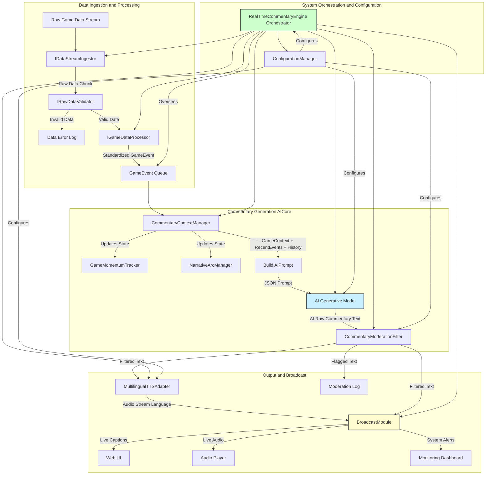
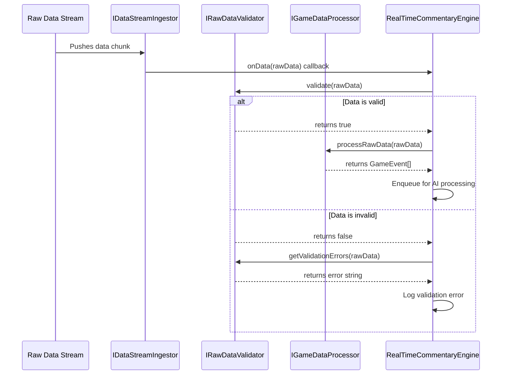
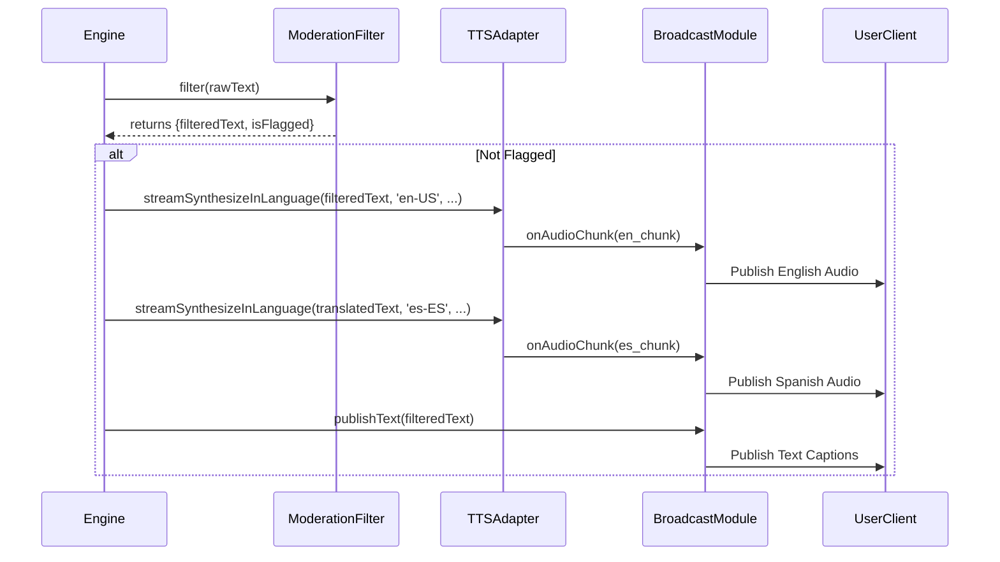
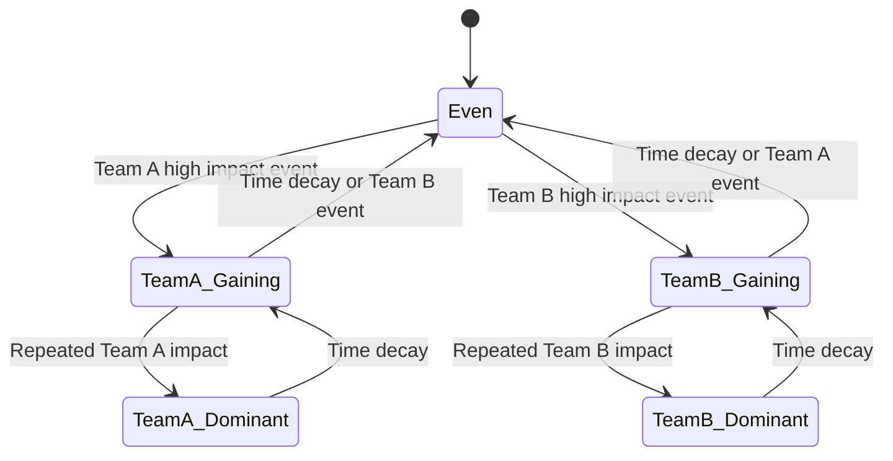
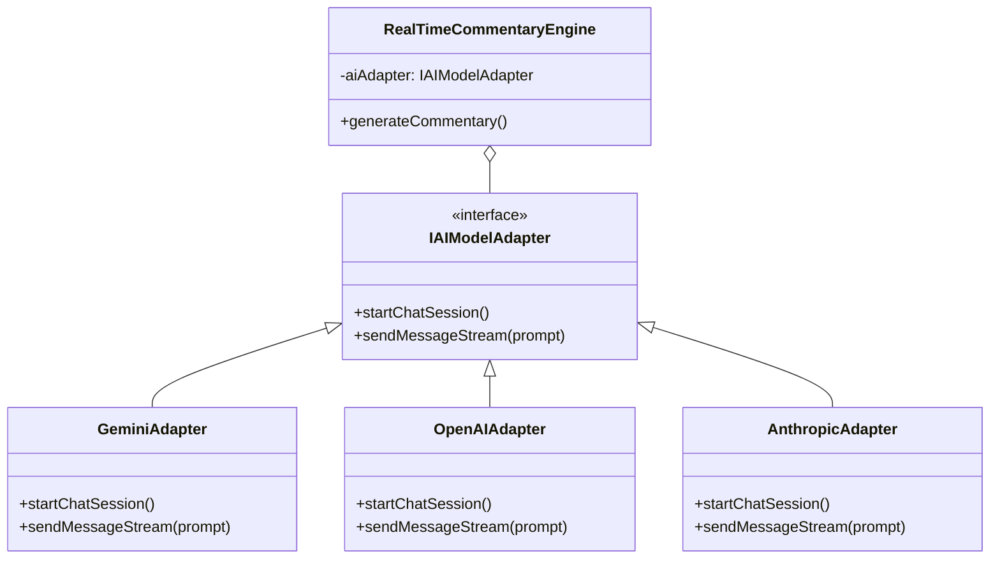
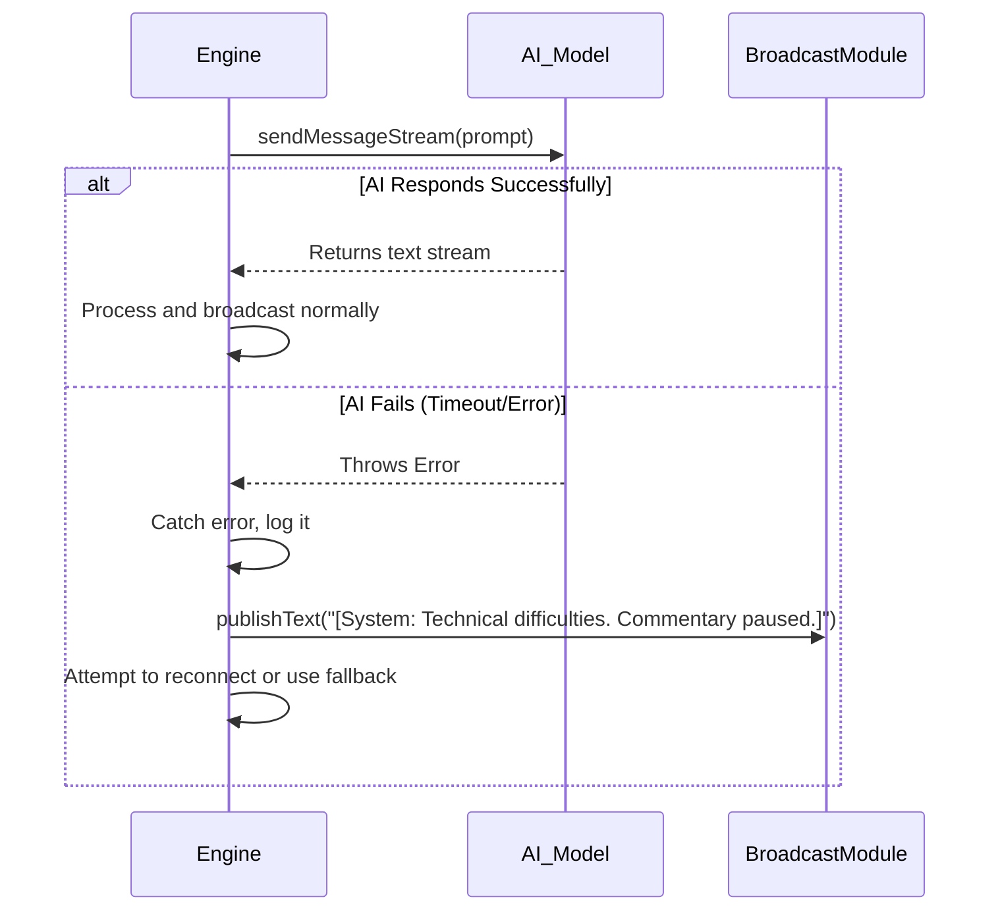

**Title of Invention:** A System and Method for Generating Real-Time Sports Commentary from Game Data Streams

**Abstract:**
A system for generating automated sports commentary is disclosed. The system ingests a real-time stream of structured game data, including player positions, game events [e.g., "shot taken," "ball possession change"], and game state [score, time remaining]. This data is continuously fed as context to a generative AI model. The AI model is prompted to act as a professional sports commentator, using the data to generate a human-like, play-by-play narrative of the game in real-time. The output can be a text stream or synthesized into an audio stream. Advanced features include robust data validation, game momentum tracking, narrative arc analysis, dynamic voice modulation, multilingual support, and content moderation to ensure high-quality and safe commentary delivery across various broadcast channels.

**Background of the Invention:**
Live sports commentary is labor-intensive, requiring skilled human commentators for every game. This makes it difficult to provide commentary for lower-tier or amateur sporting events. Furthermore, providing commentary in multiple languages requires a separate commentator for each language. There is a need for an automated system that can generate high-quality, real-time commentary from raw game data, offering flexibility in style, language, and event coverage while ensuring content integrity. Existing automated systems are often robotic and lack the narrative flair and contextual awareness of human commentators. This invention aims to close that gap by employing sophisticated context management and state-of-the-art generative AI.

**Brief Summary of the Invention:**
The present invention uses a streaming connection to a generative AI model. A real-time data feed from a sporting event [e.g., player tracking data from cameras, or a structured event feed] is continuously formatted and sent to the AI. The AI's system prompt sets its persona [e.g., "You are an excited, professional basketball commentator"]. As each new piece of data arrives [e.g., `{ "player": "Jane Doe", "event": "STEAL" }`], the AI generates a short, descriptive sentence ["And a great steal by Jane Doe at half-court!"]. This text can be displayed as closed captions or fed into a Text-to-Speech [TTS] engine to create a live audio commentary stream. The system is designed to be extensible to multiple sports and configurable commentary styles, incorporating data validation, advanced game momentum and narrative arc analysis, dynamic and multilingual TTS, and robust moderation filters for comprehensive, reliable, and engaging real-time commentary.

**Detailed Description of the Invention:**
The system consists of several integrated components: data ingestion and processing, a context-aware commentary engine powered by generative AI, and a flexible output synthesis module.

### Core Components

#### 1. Data Ingestion and Processing

This layer is responsible for receiving raw, sport-specific event data and transforming it into a standardized, enriched format for the commentary engine. It includes validation, standardization, and data enrichment.

```typescript
/**
 * @interface GameEvent
 * Represents a standardized structure for game events across different sports.
 * All new top-level types, interfaces, classes, and enums are conceptually exported.
 */
export interface GameEvent {
    id: string;
    timestamp: number;
    sport: string; // e.g., 'basketball', 'soccer', 'football'
    eventType: string; // e.g., 'SHOT_ATTEMPT', 'GOAL', 'PASS'
    player?: string;
    team?: string;
    location?: [number, number, number?]; // x, y, z coordinates
    result?: string; // e.g., 'SCORE', 'MISS', 'BLOCKED'
    metadata?: Record<string, any>; // Any sport-specific additional data
    impactScore?: number; // Calculated score of the event's importance
}

/**
 * @interface IGameDataProcessor
 * Defines the interface for processing raw sport-specific data into a standardized GameEvent format.
 * All new top-level types, interfaces, classes, and enums are conceptually exported.
 */
export interface IGameDataProcessor {
    /**
     * Processes raw, sport-specific data into a standardized GameEvent object.
     * @param rawData The raw data stream chunk.
     * @returns A Promise resolving to a GameEvent array, as a single raw data chunk might contain multiple logical events.
     */
    processRawData(rawData: any): Promise<GameEvent[]>;

    /**
     * Returns the sport type this processor handles.
     */
    getSportType(): string;
}

/**
 * @interface IRawDataValidator
 * Defines the interface for validating raw incoming data against a schema.
 * All new top-level types, interfaces, classes, and enums are conceptually exported.
 */
export interface IRawDataValidator {
    /**
     * Validates the structure and content of raw data.
     * @param rawData The raw data to validate.
     * @returns True if data is valid, false otherwise.
     */
    validate(rawData: any): boolean;

    /**
     * Provides a description of the validation errors if validation fails.
     * @param rawData The raw data that failed validation.
     * @returns A string describing the errors.
     */
    getValidationErrors(rawData: any): string;
}

/**
 * @class GenericRawDataValidator
 * A basic implementation of IRawDataValidator to check for essential fields.
 * All new top-level types, interfaces, classes, and enums are conceptually exported.
 */
export class GenericRawDataValidator implements IRawDataValidator {
    private requiredFields: string[];

    constructor(requiredFields: string[]) {
        this.requiredFields = requiredFields;
    }

    validate(rawData: any): boolean {
        if (typeof rawData !== 'object' || rawData === null) {
            return false;
        }
        for (const field of this.requiredFields) {
            if (!(field in rawData)) {
                return false;
            }
        }
        return true;
    }

    getValidationErrors(rawData: any): string {
        const missing = this.requiredFields.filter(field => !(field in rawData));
        return missing.length > 0 ? `Missing required fields: ${missing.join(', ')}` : 'No errors.';
    }
}

/**
 * @interface IDataStreamIngestor
 * Defines the interface for ingesting raw data streams.
 * All new top-level types, interfaces, classes, and enums are conceptually exported.
 */
export interface IDataStreamIngestor {
    /**
     * Starts ingesting data from the stream.
     * @param onData A callback function to be called with each chunk of raw data.
     * @param onError A callback function for stream errors.
     */
    startIngestion(onData: (data: any) => void, onError: (error: Error) => void): void;

    /**
     * Stops ingesting data.
     */
    stopIngestion(): void;

    /**
     * Returns the ID of the stream this ingestor is handling.
     */
    getStreamId(): string;
}

/**
 * @class MockWebSocketDataIngestor
 * A mock implementation for ingesting data via a simulated WebSocket.
 * All new top-level types, interfaces, classes, and enums are conceptually exported.
 */
export class MockWebSocketDataIngestor implements IDataStreamIngestor {
    private streamId: string;
    private intervalId: NodeJS.Timeout | null = null;
    private mockDataGenerator: () => any;

    constructor(streamId: string, mockDataGenerator: () => any) {
        this.streamId = streamId;
        this.mockDataGenerator = mockDataGenerator;
    }

    getStreamId(): string {
        return this.streamId;
    }

    startIngestion(onData: (data: any) => void, onError: (error: Error) => void): void {
        console.log(`[Ingestor ${this.streamId}] Starting mock WebSocket ingestion...`);
        this.intervalId = setInterval(() => {
            try {
                const data = this.mockDataGenerator();
                onData(data);
            } catch (e: any) {
                onError(new Error(`Mock ingestion error: ${e.message}`));
            }
        }, 1000 + Math.random() * 500); // Simulate variable data arrival
    }

    stopIngestion(): void {
        if (this.intervalId) {
            clearInterval(this.intervalId);
            this.intervalId = null;
            console.log(`[Ingestor ${this.streamId}] Stopped mock WebSocket ingestion.`);
        }
    }
}


/**
 * @class BasketballDataProcessor
 * Concrete implementation for basketball game data.
 * All new top-level types, interfaces, classes, and enums are conceptually exported.
 */
export class BasketballDataProcessor implements IGameDataProcessor {
    getSportType(): string {
        return 'basketball';
    }

    async processRawData(rawData: any): Promise<GameEvent[]> {
        // Assume rawData is already a JSON object like in the example
        // `{ "event": "SHOT_ATTEMPT", "player": "Player A", "location": [x, y], "result": "MISS" }`
        const event: GameEvent = {
            id: `event-${Date.now()}-${Math.random().toString(36).substring(2, 9)}`,
            timestamp: Date.now(),
            sport: this.getSportType(),
            eventType: rawData.event,
            player: rawData.player,
            team: rawData.team, // Assuming team can be part of rawData
            location: rawData.location,
            result: rawData.result,
            metadata: { ...rawData } // Store original raw data as metadata
        };
        this.assignImpactScore(event);
        return [event];
    }

    private assignImpactScore(event: GameEvent): void {
        let score = 0;
        switch(event.eventType) {
            case 'SHOT_ATTEMPT':
                if (event.result === 'SCORE') {
                    score = event.metadata?.points === 3 ? 6 : 4;
                } else {
                    score = -2;
                }
                break;
            case 'STEAL': score = 7; break;
            case 'BLOCK': score = 6; break;
            case 'REBOUND': score = 3; break;
            case 'TURNOVER': score = -7; break;
            case 'FOUL': score = -3; break;
        }
        event.impactScore = score;
    }
}

/**
 * @class SoccerDataProcessor
 * Concrete implementation for soccer game data.
 * All new top-level types, interfaces, classes, and enums are conceptually exported.
 */
export class SoccerDataProcessor implements IGameDataProcessor {
    getSportType(): string {
        return 'soccer';
    }

    async processRawData(rawData: any): Promise<GameEvent[]> {
        // Example: rawData for soccer might be different
        // `{ "type": "GOAL", "scorer": "Messi", "team": "FC Barcelona", "minute": 23 }`
        const event: GameEvent = {
            id: `event-${Date.now()}-${Math.random().toString(36).substring(2, 9)}`,
            timestamp: Date.now(),
            sport: this.getSportType(),
            eventType: rawData.type,
            player: rawData.scorer,
            team: rawData.team,
            location: rawData.location, // If available
            result: rawData.type === 'GOAL' ? 'SCORE' : undefined,
            metadata: { ...rawData }
        };
        this.assignImpactScore(event);
        return [event];
    }
    
    private assignImpactScore(event: GameEvent): void {
        let score = 0;
        switch(event.eventType) {
            case 'GOAL': score = 10; break;
            case 'SHOT_ON_TARGET': score = 4; break;
            case 'TACKLE': score = 3; break;
            case 'RED_CARD': score = -10; break;
            case 'YELLOW_CARD': score = -5; break;
            case 'FOUL': score = -2; break;
            case 'PASS': score = 1; break;
        }
        event.impactScore = score;
    }
}

/**
 * @class FootballDataProcessor
 * Concrete implementation for American Football game data.
 * All new top-level types, interfaces, classes, and enums are conceptually exported.
 */
export class FootballDataProcessor implements IGameDataProcessor {
    getSportType(): string {
        return 'football';
    }

    async processRawData(rawData: any): Promise<GameEvent[]> {
        // Example: rawData for football
        // `{ "playType": "PASS", "quarter": 2, "down": 3, "yardage": 10, "passer": "QB A", "receiver": "WR B", "result": "COMPLETE" }`
        const event: GameEvent = {
            id: `event-${Date.now()}-${Math.random().toString(36).substring(2, 9)}`,
            timestamp: Date.now(),
            sport: this.getSportType(),
            eventType: rawData.playType,
            player: rawData.passer || rawData.runner || rawData.kicker,
            team: rawData.team,
            location: rawData.location,
            result: rawData.result,
            metadata: { ...rawData }
        };
        this.assignImpactScore(event);
        return [event];
    }
    
    private assignImpactScore(event: GameEvent): void {
        let score = 0;
        const yardage = event.metadata?.yardage || 0;
        switch(event.eventType) {
            case 'TOUCHDOWN': score = 10 + yardage * 0.1; break;
            case 'INTERCEPTION': score = -9; break;
            case 'FUMBLE_LOST': score = -8; break;
            case 'SACK': score = -6; break;
            case 'PASS': score = event.result === 'COMPLETE' ? 1 + yardage * 0.2 : -2; break;
            case 'RUN': score = 1 + yardage * 0.15; break;
        }
        event.impactScore = score;
    }
}
```

#### 2. Commentary Engine AI

This is the core intelligence component, responsible for maintaining game context, dynamically generating AI prompts, and interacting with the generative AI model. It includes advanced context management like momentum tracking and narrative arc detection.

```typescript
/**
 * @enum CommentaryStyle
 * Defines different styles for the AI commentator.
 * All new top-level types, interfaces, classes, and enums are conceptually exported.
 */
export enum CommentaryStyle {
    EXCITED = 'excited',
    ANALYTICAL = 'analytical',
    NEUTRAL = 'neutral',
    HUMOROUS = 'humorous',
    DETAILED = 'detailed',
    PASSIONATE = 'passionate',
    STATISTICAL = 'statistical',
    CRITICAL = 'critical',
    EPIC = 'epic',
    CONVERSATIONAL = 'conversational',
}

/**
 * @enum NarrativeArc
 * Represents the perceived overall story of the game.
 * All new top-level types, interfaces, classes, and enums are conceptually exported.
 */
export enum NarrativeArc {
    EVENLY_MATCHED = 'A tense, back-and-forth affair.',
    DOMINANT_PERFORMANCE = 'A one-sided show of force.',
    UNDERDOG_STORY = 'The underdog is putting up a surprising fight.',
    COMEBACK_IN_PROGRESS = 'A stunning comeback is unfolding.',
    NAIL_BITER_FINISH = 'This game is coming down to the wire.',
    ROUTINE_GAME = 'A standard, professional game.',
}

/**
 * @interface ICommentaryContext
 * Represents the current game context provided to the AI.
 * All new top-level types, interfaces, classes, and enums are conceptually exported.
 */
export interface ICommentaryContext {
    currentGame: string; // e.g., 'Basketball Championship Final'
    currentScore: string; // e.g., 'Team A 85 - Team B 83'
    timeRemaining: string; // e.g., '0:12 remaining in 4th quarter'
    recentEvents: GameEvent[]; // Last N events
    playerStats?: Record<string, any>; // e.g., 'Player A: 25 points, 7 assists'
    teamStats?: Record<string, any>;
    narrativeHistory: string[]; // Keep track of AI's own recent commentary for coherence
    historicalMatchups?: string; // e.g., "These two teams have a long-standing rivalry..."
    gameMomentum: string; // e.g., "Home team gaining momentum", "Evenly matched"
    narrativeArc: NarrativeArc; // The overall story of the game
}

/**
 * @class GameMomentumTracker
 * Tracks the perceived momentum of the game based on recent events and scores.
 * All new top-level types, interfaces, classes, and enums are conceptually exported.
 */
export class GameMomentumTracker {
    private teamAMomentum: number = 0;
    private teamBMomentum: number = 0;
    private decayFactor: number = 0.95; // How quickly momentum fades

    /**
     * Updates momentum based on a new game event.
     * @param event The GameEvent that just occurred.
     */
    updateWithEvent(event: GameEvent) {
        this.teamAMomentum *= this.decayFactor;
        this.teamBMomentum *= this.decayFactor;

        const impact = event.impactScore || 0;

        // A simple assumption for demo purposes.
        if (event.team === 'Team A' || event.team === 'Home' || event.team === 'Chiefs') {
             this.teamAMomentum += impact;
        } else if (event.team === 'Team B' || event.team === 'Away' || event.team === '49ers') {
             this.teamBMomentum += impact;
        }
    }

    /**
     * Calculates and returns the current game momentum.
     * @returns A string describing the momentum.
     */
    getMomentum(): string {
        const diff = this.teamAMomentum - this.teamBMomentum;

        if (Math.abs(diff) < 5) {
            return "Momentum is fairly even.";
        }
        
        if (diff > 15) return "Team A is gaining significant momentum!";
        if (diff > 5) return "Team A has the momentum.";
        if (diff < -15) return "Team B is building strong momentum!";
        if (diff < -5) return "Team B is seizing the momentum.";
        
        return "The momentum is shifting constantly.";
    }
}


/**
 * @class CommentaryContextManager
 * Manages the game state and generates context-rich prompts for the AI.
 * All new top-level types, interfaces, classes, and enums are conceptually exported.
 */
export class CommentaryContextManager {
    private gameEvents: GameEvent[] = [];
    private currentGameState: Record<string, any> = {};
    private commentaryHistory: string[] = [];
    private maxRecentEvents: number;
    private maxNarrativeHistory: number;
    private momentumTracker: GameMomentumTracker;
    private narrativeArc: NarrativeArc = NarrativeArc.ROUTINE_GAME;

    constructor(maxRecentEvents: number = 10, maxNarrativeHistory: number = 5) {
        this.maxRecentEvents = maxRecentEvents;
        this.maxNarrativeHistory = maxNarrativeHistory;
        this.momentumTracker = new GameMomentumTracker();
        this.initializeGameState();
    }

    private initializeGameState() {
        this.currentGameState = {
            score: '0 - 0',
            timeRemaining: 'Game Start',
            teamAScore: 0,
            teamBScore: 0,
        };
    }

    /**
     * Updates the internal state with a new game event.
     * @param event The new GameEvent to process.
     */
    addGameEvent(event: GameEvent) {
        this.gameEvents.push(event);
        if (this.gameEvents.length > this.maxRecentEvents) {
            this.gameEvents.shift(); // Keep only the most recent events
        }
        this.updateGameState(event);
        this.momentumTracker.updateWithEvent(event);
        this.updateNarrativeArc();
    }
    
    private updateNarrativeArc() {
        const { teamAScore, teamBScore } = this.currentGameState;
        const scoreDiff = Math.abs(teamAScore - teamBScore);

        // This is a very simple state machine for narrative arc. A real system would be more complex.
        if (this.currentGameState.timeRemaining?.includes('final') || this.currentGameState.timeRemaining?.includes('4th quarter')) {
             if (scoreDiff < 5) {
                 this.narrativeArc = NarrativeArc.NAIL_BITER_FINISH;
             }
        } else if (scoreDiff > 20) {
            this.narrativeArc = NarrativeArc.DOMINANT_PERFORMANCE;
        } else if (scoreDiff < 5 && this.gameEvents.length > 10) {
            this.narrativeArc = NarrativeArc.EVENLY_MATCHED;
        }
    }

    /**
     * Updates the internal game state based on events. This would be sport-specific.
     * @param event
     */
    private updateGameState(event: GameEvent) {
        // This is highly simplified. A real system would have sophisticated state tracking.
        if (event.sport === 'basketball') {
            if (event.eventType === 'SHOT_ATTEMPT' && event.result === 'SCORE' && event.metadata?.points) {
                if (event.team === 'Team A') this.currentGameState.teamAScore += event.metadata.points;
                else if (event.team === 'Team B') this.currentGameState.teamBScore += event.metadata.points;
            }
            this.currentGameState.score = `Team A ${this.currentGameState.teamAScore} - Team B ${this.currentGameState.teamBScore}`;
            this.currentGameState.timeRemaining = `${Math.floor(Math.random() * 12)}:${Math.floor(Math.random() * 60).toString().padStart(2, '0')} remaining in 4th quarter`;
        } else if (event.sport === 'soccer') {
            if (event.eventType === 'GOAL' && event.team) {
                if (event.team === 'Home') this.currentGameState.teamAScore += 1;
                else if (event.team === 'Away') this.currentGameState.teamBScore += 1;
            }
            this.currentGameState.score = `Home ${this.currentGameState.teamAScore} - Away ${this.currentGameState.teamBScore}`;
            this.currentGameState.timeRemaining = `${Math.floor(Math.random() * 90)}'`;
        } else if (event.sport === 'football') {
            if (event.eventType === 'TOUCHDOWN' && event.team) {
                if (event.team === 'Chiefs') this.currentGameState.teamAScore += 6;
                else if (event.team === '49ers') this.currentGameState.teamBScore += 6;
            }
            this.currentGameState.score = `Chiefs ${this.currentGameState.teamAScore} - 49ers ${this.currentGameState.teamBScore}`;
            this.currentGameState.timeRemaining = `Q${Math.floor(Math.random() * 4) + 1} - ${Math.floor(Math.random() * 15).toString().padStart(2, '0')}:${Math.floor(Math.random() * 60).toString().padStart(2, '0')}`;
        }
    }

    /**
     * Adds generated commentary to history for coherence.
     * @param commentary The generated commentary text.
     */
    addCommentaryToHistory(commentary: string) {
        this.commentaryHistory.push(commentary);
        if (this.commentaryHistory.length > this.maxNarrativeHistory) {
            this.commentaryHistory.shift();
        }
    }

    /**
     * Generates a comprehensive context object for the AI.
     * @param sportType The current sport type.
     * @returns ICommentaryContext
     */
    getCurrentContext(sportType: string): ICommentaryContext {
        return {
            currentGame: `${sportType.charAt(0).toUpperCase() + sportType.slice(1)} Game`,
            currentScore: this.currentGameState.score || 'Score not available',
            timeRemaining: this.currentGameState.timeRemaining || 'Time not available',
            recentEvents: [...this.gameEvents],
            narrativeHistory: [...this.commentaryHistory],
            playerStats: {},
            teamStats: {},
            historicalMatchups: 'No historical matchups provided for this game.',
            gameMomentum: this.momentumTracker.getMomentum(),
            narrativeArc: this.narrativeArc,
        };
    }

    /**
     * Constructs the AI's user message based on the latest event and full context.
     * @param latestEvent The most recent GameEvent.
     * @param context The full ICommentaryContext.
     * @returns A stringified JSON prompt for the AI.
     */
    buildAIPrompt(latestEvent: GameEvent, context: ICommentaryContext): string {
        const fullPrompt = {
            gameContext: {
                sport: latestEvent.sport,
                currentGame: context.currentGame,
                currentScore: context.currentScore,
                timeRemaining: context.timeRemaining,
                gameMomentum: context.gameMomentum,
                narrativeArc: context.narrativeArc,
            },
            recentEventsSummary: context.recentEvents.map(e => ({
                eventType: e.eventType,
                player: e.player,
                team: e.team,
                result: e.result,
                impactScore: e.impactScore,
            })),
            latestEvent: latestEvent,
            commentaryHistory: context.narrativeHistory,
            instruction: `Generate one exciting, concise, play-by-play sentence for the latest event (${latestEvent.eventType}). Incorporate context from 'gameContext', 'recentEventsSummary', and 'commentaryHistory' to ensure coherence and dynamic storytelling. The 'narrativeArc' and 'gameMomentum' should heavily influence your tone. Avoid repeating phrases from 'commentaryHistory'.`
        };
        return JSON.stringify(fullPrompt);
    }
}
```

#### 3. Output and Synthesis

The output module takes the AI's text commentary, applies moderation, and can display it, or convert it into an audio stream using Text-to-Speech [TTS] services, potentially in multiple languages and with dynamic emotional expression, and broadcast it.

```typescript
/**
 * @interface ITextToSpeechService
 * Defines the interface for a Text-to-Speech service.
 * All new top-level types, interfaces, classes, and enums are conceptually exported.
 */
export interface ITextToSpeechService {
    /**
     * Synthesizes a full text into an audio buffer.
     * @param text The text to synthesize.
     * @param voiceParams Optional parameters to control voice prosody.
     * @returns A Promise resolving to an ArrayBuffer containing audio data.
     */
    synthesize(text: string, voiceParams?: Record<string, any>): Promise<ArrayBuffer>;

    /**
     * Streams synthesis of text, calling a callback for each audio chunk.
     * @param text The text to synthesize.
     * @param onAudioChunk A callback function to receive audio chunks.
     * @param voiceParams Optional parameters to control voice prosody.
     * @returns A Promise that resolves when streaming is complete.
     */
    streamSynthesize(text: string, onAudioChunk: (chunk: ArrayBuffer) => void, voiceParams?: Record<string, any>): Promise<void>;
}

/**
 * @class MockTextToSpeechService
 * A mock implementation of the TTS service for conceptual code demonstration.
 * All new top-level types, interfaces, classes, and enums are conceptually exported.
 */
export class MockTextToSpeechService implements ITextToSpeechService {
    async synthesize(text: string, voiceParams: Record<string, any> = {}): Promise<ArrayBuffer> {
        console.log(`[TTS Service] Synthesizing: "${text}" with params:`, voiceParams);
        await new Promise(resolve => setTimeout(resolve, text.length * 10));
        return new ArrayBuffer(text.length * 2);
    }
    async streamSynthesize(text: string, onAudioChunk: (chunk: ArrayBuffer) => void, voiceParams: Record<string, any> = {}): Promise<void> {
        console.log(`[TTS Service] Streaming synthesis: "${text}" with params:`, voiceParams);
        const words = text.split(' ');
        for (const word of words) {
            await new Promise(resolve => setTimeout(resolve, 50));
            onAudioChunk(new ArrayBuffer(word.length * 2));
        }
    }
}

/**
 * @interface IMultilingualTTSAdapter
 * Manages multiple TTS services for different languages.
 * All new top-level types, interfaces, classes, and enums are conceptually exported.
 */
export interface IMultilingualTTSAdapter {
    registerService(langCode: string, service: ITextToSpeechService): void;
    getService(langCode: string): ITextToSpeechService | undefined;
    streamSynthesizeInLanguage(text: string, langCode: string, onAudioChunk: (chunk: ArrayBuffer) => void, voiceParams?: Record<string, any>): Promise<void>;
}

/**
 * @class MultilingualTTSAdapter
 * Concrete implementation for managing multiple TTS services.
 * All new top-level types, interfaces, classes, and enums are conceptually exported.
 */
export class MultilingualTTSAdapter implements IMultilingualTTSAdapter {
    private services: Map<string, ITextToSpeechService> = new Map();

    registerService(langCode: string, service: ITextToSpeechService): void {
        this.services.set(langCode, service);
        console.log(`[MultilingualTTSAdapter] Registered TTS service for ${langCode}`);
    }

    getService(langCode: string): ITextToSpeechService | undefined {
        return this.services.get(langCode);
    }

    async streamSynthesizeInLanguage(text: string, langCode: string, onAudioChunk: (chunk: ArrayBuffer) => void, voiceParams?: Record<string, any>): Promise<void> {
        const service = this.getService(langCode);
        if (service) {
            await service.streamSynthesize(text, onAudioChunk, voiceParams);
        } else {
            console.warn(`[MultilingualTTSAdapter] No TTS service registered for language: ${langCode}. Skipping audio synthesis.`);
        }
    }
}

/**
 * @interface ICommentaryModerationFilter
 * Defines the interface for filtering generated commentary.
 * All new top-level types, interfaces, classes, and enums are conceptually exported.
 */
export interface ICommentaryModerationFilter {
    /**
     * Filters the commentary text for inappropriate content.
     * @param commentaryText The text to filter.
     * @returns A Promise resolving to the filtered text. May replace offensive words or return a moderation flag.
     */
    filter(commentaryText: string): Promise<{ filteredText: string, isFlagged: boolean, reasons?: string[] }>;
}

/**
 * @class SimpleCommentaryModerationFilter
 * A basic mock implementation for content moderation.
 * All new top-level types, interfaces, classes, and enums are conceptually exported.
 */
export class SimpleCommentaryModerationFilter implements ICommentaryModerationFilter {
    private disallowedWords: string[];

    constructor(disallowedWords: string[] = ['badword', 'offensivephrase']) {
        this.disallowedWords = disallowedWords.map(w => w.toLowerCase());
    }

    async filter(commentaryText: string): Promise<{ filteredText: string, isFlagged: boolean, reasons?: string[] }> {
        let filteredText = commentaryText;
        let isFlagged = false;
        const reasons: string[] = [];

        const lowerCaseText = commentaryText.toLowerCase();

        for (const word of this.disallowedWords) {
            if (lowerCaseText.includes(word)) {
                isFlagged = true;
                reasons.push(`Contains '${word}'`);
                filteredText = filteredText.replace(new RegExp(word, 'gi'), '*****');
            }
        }

        if (isFlagged) {
            console.warn(`[Moderation] Commentary flagged: "${commentaryText}" -> "${filteredText}" (Reasons: ${reasons.join(', ')})`);
        }
        return { filteredText, isFlagged, reasons };
    }
}

/**
 * @class BroadcastModule
 * Handles distributing commentary text and audio to various channels.
 * All new top-level types, interfaces, classes, and enums are conceptually exported.
 */
export class BroadcastModule {
    publishText(gameId: string, text: string, targetChannel: string = 'web') {
        console.log(`[Broadcast Text - ${targetChannel} | Game ${gameId}] ${text}`);
    }

    publishAudio(gameId: string, audioChunk: ArrayBuffer, langCode: string, targetChannel: string = 'radio') {
        // console.log(`[Broadcast Audio - ${targetChannel} | Game ${gameId} | Lang ${langCode}] Sending audio chunk (${audioChunk.byteLength} bytes)`);
    }
}
```

#### 4. System Configuration and Orchestration

These components manage the overall system behavior, configuration, and orchestrate the flow between data ingestion, AI processing, and output delivery.

```typescript
/**
 * @class ConfigurationManager
 * Manages system-wide configurations, including AI models, styles, and moderation settings.
 * All new top-level types, interfaces, classes, and enums are conceptually exported.
 */
export class ConfigurationManager {
    private configs: Record<string, any> = {};

    constructor(initialConfigs: Record<string, any> = {}) {
        this.configs = initialConfigs;
    }

    setConfig(key: string, value: any) {
        this.configs[key] = value;
        console.log(`[ConfigManager] Set config: ${key} =`, value);
    }

    getConfig<T>(key: string, defaultValue?: T): T {
        return (this.configs[key] !== undefined ? this.configs[key] : defaultValue) as T;
    }

    loadConfigs(source: Record<string, any>) {
        Object.assign(this.configs, source);
        console.log('[ConfigManager] Loaded external configurations.');
    }
}

/**
 * @class RealTimeCommentaryEngine
 * The core engine orchestrating data processing, AI interaction, and output.
 * All new top-level types, interfaces, classes, and enums are conceptually exported.
 */
export class RealTimeCommentaryEngine {
    private aiClient: any; // Represents an instance of GoogleGenAI or similar LLM client
    private dataProcessors: Map<string, IGameDataProcessor> = new Map();
    private contextManagers: Map<string, CommentaryContextManager> = new Map(); // Per game ID
    private dataIngestors: Map<string, IDataStreamIngestor> = new Map();
    private ttsAdapter: IMultilingualTTSAdapter;
    private moderationFilter: ICommentaryModerationFilter;
    private broadcastModule: BroadcastModule;
    private configManager: ConfigurationManager;
    private chatSessions: Map<string, any> = new Map(); // Stores chat sessions per sport/game ID for maintaining context

    constructor(
        aiClient: any,
        ttsAdapter: IMultilingualTTSAdapter,
        moderationFilter: ICommentaryModerationFilter,
        broadcastModule: BroadcastModule,
        configManager: ConfigurationManager
    ) {
        this.aiClient = aiClient;
        this.ttsAdapter = ttsAdapter;
        this.moderationFilter = moderationFilter;
        this.broadcastModule = broadcastModule;
        this.configManager = configManager;
    }

    registerDataProcessor(processor: IGameDataProcessor) {
        this.dataProcessors.set(processor.getSportType(), processor);
        console.log(`[Engine] Registered data processor for ${processor.getSportType()}`);
    }

    registerDataIngestor(ingestor: IDataStreamIngestor, validator?: IRawDataValidator) {
        this.dataIngestors.set(ingestor.getStreamId(), ingestor);
        console.log(`[Engine] Registered data ingestor for stream ID: ${ingestor.getStreamId()}`);
    }

    private getOrCreateChatSession(gameId: string, sportType: string, style: CommentaryStyle): any {
        const sessionKey = `${sportType}-${gameId}`;
        if (!this.chatSessions.has(sessionKey)) {
            const systemInstruction = `You are an expert ${sportType} commentator. Your style is ${style}. You will receive a stream of game events and contextual information as JSON objects. For each event, generate one exciting, concise, play-by-play sentence, maintaining narrative coherence and leveraging the provided context. Focus primarily on the 'latestEvent' but be aware of 'recentEventsSummary' and 'commentaryHistory'. Your output must be a single sentence.`;
            const modelName = this.configManager.getConfig('aiModel', 'gemini-1.5-pro');
            const chat = this.aiClient.getGenerativeModel({ model: modelName }).startChat({
                history: [],
                generationConfig: {
                    temperature: 0.9,
                    topK: 1,
                    topP: 1,
                },
            });
            this.chatSessions.set(sessionKey, { chat, systemInstruction });
        }
        return this.chatSessions.get(sessionKey).chat;
    }

    async processGameDataStream(
        rawGameData: any,
        sportType: string,
        gameId: string,
        commentaryStyle: CommentaryStyle = CommentaryStyle.EXCITED,
        langCode: string = 'en-US',
    ): Promise<void> {
        const processor = this.dataProcessors.get(sportType);
        if (!processor) {
            this.broadcastModule.publishText(gameId, `[System] Commentary for ${sportType} is not supported.`, 'system-alerts');
            return;
        }

        const contextManager = this.contextManagers.get(gameId) || new CommentaryContextManager(
            this.configManager.getConfig('maxRecentEvents', 10),
            this.configManager.getConfig('maxNarrativeHistory', 5)
        );
        if (!this.contextManagers.has(gameId)) {
            this.contextManagers.set(gameId, contextManager);
        }

        try {
            const gameEvents = await processor.processRawData(rawGameData);

            for (const event of gameEvents) {
                contextManager.addGameEvent(event);
                const context = contextManager.getCurrentContext(sportType);
                const aiPrompt = contextManager.buildAIPrompt(event, context);

                const chat = this.getOrCreateChatSession(gameId, sportType, commentaryStyle);
                const responseStream = await chat.sendMessageStream(aiPrompt);

                let fullCommentaryText = '';
                for await (const chunk of responseStream) {
                    const commentaryText = chunk.text;
                    fullCommentaryText += commentaryText;
                    this.broadcastModule.publishText(gameId, commentaryText, 'live-captions');
                }

                if (fullCommentaryText.trim()) {
                    const { filteredText, isFlagged } = await this.moderationFilter.filter(fullCommentaryText.trim());

                    if (!isFlagged) {
                        contextManager.addCommentaryToHistory(filteredText);
                        this.broadcastModule.publishText(gameId, filteredText, 'main-commentary');
                        
                        // Dynamic Voice Modulation
                        const voiceParams = this.getDynamicVoiceParams(event, context.gameMomentum);

                        await this.ttsAdapter.streamSynthesizeInLanguage(filteredText, langCode, (audioChunk) => {
                            this.broadcastModule.publishAudio(gameId, audioChunk, langCode, 'live-audio');
                        }, voiceParams);
                    } else {
                        const censoredMessage = this.configManager.getConfig('censoredMessage', '[Censored Commentary]');
                        contextManager.addCommentaryToHistory(censoredMessage);
                        this.broadcastModule.publishText(gameId, censoredMessage, 'main-commentary');
                        this.ttsAdapter.streamSynthesizeInLanguage(censoredMessage, langCode, (audioChunk) => {
                            this.broadcastModule.publishAudio(gameId, audioChunk, langCode, 'live-audio');
                        });
                    }
                }
            }
        } catch (error) {
            console.error(`Error processing game data for game ${gameId}, sport ${sportType}:`, error);
            this.broadcastModule.publishText(gameId, `[System Error: Please stand by.]`, 'system-alerts');
        }
    }
    
    private getDynamicVoiceParams(event: GameEvent, momentum: string): Record<string, any> {
        let pitch = 0;
        let rate = 1.0;
        const impact = event.impactScore || 0;

        if (impact > 7) { // High impact event
            pitch = 5; // Higher pitch
            rate = 1.2; // Faster speech
        } else if (impact < -7) { // High negative impact event
            pitch = -3; // Lower pitch
            rate = 0.9; // Slower speech
        }

        if (momentum.includes("significant") || momentum.includes("strong")) {
            rate *= 1.1;
        }

        return { pitch: `${pitch}st`, rate: rate.toFixed(2) }; // Format for TTS API
    }
}
```

### System Architecture and Data Flow Diagrams

#### 1. Overall System Architecture



#### 2. Data Ingestion and Validation Flow



#### 3. Context Manager State Update Sequence

```mermaid
graph LR
    A[New GameEvent] --> B(CommentaryContextManager);
    subgraph B
        C[Update Game State (Score, Time)]
        D[Update Player/Team Stats]
        E[Add to Recent Events History]
        F[Update GameMomentumTracker]
        G[Update NarrativeArc]
    end
    B --> H{Updated Context Ready};
    A --> C;
    A --> D;
    A --> E;
    A --> F;
    F --> G;
```

#### 4. AI Prompt Construction Logic

```mermaid
graph TD
    subgraph Context Elements
        A[Latest GameEvent]
        B[Recent Events History]
        C[Current Game State (Score, Time)]
        D[Game Momentum String]
        E[Narrative Arc Enum]
        F[Commentary History]
    end
    subgraph Prompt Builder
        G[buildAIPrompt Function]
    end
    A --> G
    B --> G
    C --> G
    D --> G
    E --> G
    F --> G
    G --> H[JSON Prompt for AI]
    style H fill:#C9F0FF,stroke:#333,stroke-width:2px
```

#### 5. Multilingual TTS and Broadcast Pipeline



#### 6. Game Momentum Calculation State Machine



#### 7. Modular AI Provider Integration



#### 8. Error Handling and Fallback Strategy



#### 9. Dynamic Voice Synthesis Control Flow

```mermaid
graph TD
    A[GameEvent] --> B{Calculate Impact Score}
    C[Game Context] --> D{Get Momentum State}
    B --> E[DynamicVoiceParamGenerator]
    D --> E
    E --> F{Voice Params (Pitch, Rate)}
    F --> G[ITextToSpeechService]
    G --> H[Synthesized Audio with Emotion]
```

#### 10. Narrative Arc Detection Flow

```mermaid
graph TD
    A[Sequence of GameEvents] --> B(NarrativeArcManager)
    B --> C{Analyze Score Trajectory}
    B --> D{Analyze Key Event Clusters (e.g., turnovers)}
    B --> E{Check Game Clock / Period}
    C & D & E --> F(Determine NarrativeArc)
    F --> G[e.g., 'COMEBACK_IN_PROGRESS']
    G --> H[Inject into AI Prompt Context]
    style H fill:#f9f,stroke:#333,stroke-width:2px
```

### Conceptual Usage Example

This example demonstrates how to initialize and use the `RealTimeCommentaryEngine`.

```typescript
// Assume GoogleGenAI and other necessary modules are available in the environment.
// For demonstration, we'll mock GoogleGenAI client behavior.
export class MockGoogleGenAIClient {
    private apiKey: string;
    constructor(options: { apiKey: string }) { this.apiKey = options.apiKey; }
    getGenerativeModel(options: { model: string }) {
        console.log(`[AI Client] Initializing model: ${options.model}`);
        return {
            startChat: (chatOptions: any) => ({
                sendMessageStream: async (message: string) => {
                    console.log(`[AI Client] Mock AI received prompt for chat: ${message.substring(0, 150)}...`);
                    const mockResponses = [
                        "What a fantastic play!",
                        "The home team is really pushing forward now!",
                        "An incredible goal, absolutely brilliant!",
                        "That was a crucial steal, changing possession.",
                        "The tension is palpable as we head into the final minutes."
                    ];
                    const response = mockResponses[Math.floor(Math.random() * mockResponses.length)];
                    await new Promise(resolve => setTimeout(resolve, 500 + Math.random() * 500));
                    return (async function* () {
                        for (const word of response.split(' ')) {
                             yield { text: word + ' ' };
                             await new Promise(resolve => setTimeout(resolve, 50));
                        }
                    })();
                }
            })
        };
    }
}

export async function startMultiSportCommentarySystem() {
    const configManager = new ConfigurationManager({
        aiModel: 'gemini-1.5-pro',
        maxRecentEvents: 15,
        maxNarrativeHistory: 7,
        censoredMessage: '[Commentary Moderated]',
        supportedLanguages: ['en-US', 'es-ES'],
    });

    const ai = new MockGoogleGenAIClient({ apiKey: 'YOUR_API_KEY' });
    const ttsAdapter = new MultilingualTTSAdapter();
    ttsAdapter.registerService('en-US', new MockTextToSpeechService());
    ttsAdapter.registerService('es-ES', new MockTextToSpeechService());

    const moderationFilter = new SimpleCommentaryModerationFilter(['badword', 'foulplay']);
    const broadcastModule = new BroadcastModule();

    const commentaryEngine = new RealTimeCommentaryEngine(ai, ttsAdapter, moderationFilter, broadcastModule, configManager);

    commentaryEngine.registerDataProcessor(new BasketballDataProcessor());
    commentaryEngine.registerDataProcessor(new SoccerDataProcessor());
    commentaryEngine.registerDataProcessor(new FootballDataProcessor());

    const basketballGameId = 'NBA-FINALS-GAME7-2024';
    const soccerGameId = 'WORLD-CUP-FINAL-2026';
    const footballGameId = 'SUPER-BOWL-2025';

    const basketballDataGenerator = () => ({ "event": Math.random() < 0.2 ? "STEAL" : Math.random() < 0.5 ? "SHOT_ATTEMPT" : "REBOUND", "player": Math.random() < 0.5 ? "Player A" : "Player B", "team": Math.random() < 0.5 ? "Team A" : "Team B", "result": Math.random() < 0.5 ? "SCORE" : "MISS", "metadata": { "points": Math.random() < 0.3 ? 3 : 2 } });
    const soccerDataGenerator = () => ({ "type": Math.random() < 0.1 ? "GOAL" : Math.random() < 0.6 ? "PASS" : "TACKLE", "scorer": Math.random() < 0.5 ? "Messi Jr" : "Ronaldo Jr", "team": Math.random() < 0.5 ? "Home" : "Away", "minute": Math.floor(Math.random() * 90) });
    const footballDataGenerator = () => ({ "playType": Math.random() < 0.2 ? "TOUCHDOWN" : Math.random() < 0.6 ? "PASS" : "RUN", "yardage": Math.floor(Math.random() * 30 - 5), "passer": "QB Mahomes", "team": Math.random() < 0.5 ? "Chiefs" : "49ers", "result": Math.random() < 0.7 ? "COMPLETE" : "INCOMPLETE" });

    const basketballIngestor = new MockWebSocketDataIngestor('basketball-stream-1', basketballDataGenerator);
    commentaryEngine.registerDataIngestor(basketballIngestor, new GenericRawDataValidator(['event', 'player']));
    basketballIngestor.startIngestion(async (data) => { await commentaryEngine.processGameDataStream(data, 'basketball', basketballGameId, CommentaryStyle.EXCITED, 'en-US'); }, (error) => console.error(`Basketball Error: ${error.message}`));

    const soccerIngestor = new MockWebSocketDataIngestor('soccer-stream-1', soccerDataGenerator);
    commentaryEngine.registerDataIngestor(soccerIngestor, new GenericRawDataValidator(['type', 'team']));
    soccerIngestor.startIngestion(async (data) => { await commentaryEngine.processGameDataStream(data, 'soccer', soccerGameId, CommentaryStyle.ANALYTICAL, 'es-ES'); }, (error) => console.error(`Soccer Error: ${error.message}`));

    const footballIngestor = new MockWebSocketDataIngestor('football-stream-1', footballDataGenerator);
    commentaryEngine.registerDataIngestor(footballIngestor, new GenericRawDataValidator(['playType', 'team']));
    footballIngestor.startIngestion(async (data) => { await commentaryEngine.processGameDataStream(data, 'football', footballGameId, CommentaryStyle.PASSIONATE, 'en-US'); }, (error) => console.error(`Football Error: ${error.message}`));

    setTimeout(() => {
        basketballIngestor.stopIngestion();
        soccerIngestor.stopIngestion();
        footballIngestor.stopIngestion();
        console.log("Demonstration ended. Ingestors stopped.");
    }, 20000);
}

// In a real application, you would call startMultiSportCommentarySystem()
// startMultiSportCommentarySystem(); // Uncomment to run conceptual example
```

**Claims:**
1. A method for generating real-time sports commentary, comprising:
   a. Receiving a real-time stream of raw game data through an `IDataStreamIngestor`.
   b. Validating said raw game data using an `IRawDataValidator`.
   c. Processing valid raw event data into a standardized `GameEvent` format using a sport-specific `IGameDataProcessor`.
   d. Continuously updating a `CommentaryContextManager` with processed `GameEvent` data to maintain game state, historical narrative, and `GameMomentumTracker` information.
   e. Dynamically constructing a context-rich prompt for a generative AI model, incorporating current game state, recent events, commentary history, and game momentum.
   f. Transmitting said prompt to a generative AI model configured with a specific commentator persona and `CommentaryStyle`.
   g. Receiving a stream of text from the AI model representing the commentary.
   h. Filtering the received commentary text through an `ICommentaryModerationFilter` to ensure content compliance.

2. The method of claim 1, further comprising:
   a. Transmitting the filtered text commentary to a `MultilingualTTSAdapter` to select and utilize a text-to-speech [TTS] synthesis engine for a specified language.
   b. Streaming audio chunks from the selected TTS engine as they become available.
   c. Broadcasting both the filtered text commentary and the audio commentary stream through a `BroadcastModule` to one or more output channels.

3. The method of claim 1, wherein the prompt to the AI model includes a configurable persona, `CommentaryStyle`, and information from a `GameMomentumTracker` to influence narrative tone.

4. The method of claim 1, further comprising supporting multiple sports concurrently by registering distinct `IGameDataProcessor` implementations, `IDataStreamIngestor` instances, and maintaining separate AI chat sessions and `CommentaryContextManager` instances per game instance.

5. The system of claim 1, further comprising a `ConfigurationManager` to centrally manage and apply system parameters such as AI model selection, moderation rules, and commentary styles across all components.

6. A method for dynamically adjusting commentary tone by calculating a real-time game momentum score based on a time-weighted aggregation of discrete game event impacts, and including said momentum score as a parameter in the prompt to the generative AI model.

7. The system of claim 1, further comprising a `NarrativeArcManager` that identifies overarching game narratives (e.g., "comeback," "rivalry clash") by analyzing event sequences, and injects this narrative context into the AI prompt to ensure long-term thematic coherence in the generated commentary.

8. The method of claim 2, wherein the text-to-speech synthesis is dynamically modulated, adjusting prosodic features such as pitch, rate, and volume of the synthesized voice based on the event type and calculated game momentum, thereby creating a more emotionally resonant audio commentary.

9. A system for generating sports commentary, comprising a modular `AIModelAdapter` interface allowing for the interchangeable use of different underlying generative AI models without altering the core data processing and context management logic.

10. The method of claim 1, wherein the `CommentaryContextManager` maintains separate, concurrent states for multiple simultaneous games, enabling the system to scale and provide commentary for numerous events across different sports in parallel from a single logical instance.

**Mathematical Foundations and Algorithmic Details:**
Let the system state at time $t$ be $\mathcal{S}(t)$. The system is a function $\mathcal{F}$ that maps a stream of raw events $E_{raw}(t)$ to a stream of multimodal commentary $C(t)$.
$$ C(t) = \mathcal{F}(E_{raw}(\tau)) \quad \forall \tau \le t $$

1.  **Event Processing and Impact Scoring**:
    Each raw event $e_{raw} \in E_{raw}$ is processed into a standardized event $e_{proc}$.
    $e_{proc} = \text{Processor}(\text{Validator}(e_{raw}))$
    Each event $e_i$ at time $t_i$ is assigned an impact score $I(e_i)$, a scalar value representing its importance.
    $$ I(e_i) = B_{type(e_i)} \cdot M_{context}(e_i) $$
    where $B$ is a base score for the event type (e.g., goal, steal) and $M$ is a contextual multiplier.
    $$ M_{context}(e_i) = (1 + w_{score} \cdot f_{score}(\Delta S_i)) \cdot (1 + w_{time} \cdot f_{time}(T_{rem, i})) $$
    $\Delta S_i$ is the score difference, $T_{rem, i}$ is the time remaining, and $w$ are weighting factors.

2.  **Player Performance Index (PPI)**:
    The PPI for a player $p$ is the time-decayed sum of their event impacts.
    $$ PPI_p(t) = \sum_{i | \text{player}(e_i)=p} I(e_i) \cdot e^{-\lambda(t - t_i)} $$
    $\lambda$ is the decay constant. This can be computed iteratively:
    $$ PPI_p(t_k) = PPI_p(t_{k-1}) \cdot e^{-\lambda(t_k - t_{k-1})} + I(e_k) $$

3.  **Game Momentum Vector ($M_g$)**:
    Momentum is modeled as an Exponentially Weighted Moving Average (EWMA) of team-specific event impacts. Let $I_A(t)$ be the sum of impact scores for Team A at time $t$.
    $$ M_{A}(t) = \alpha \cdot I_A(t) + (1-\alpha) \cdot M_A(t-1) $$
    $$ M_{B}(t) = \alpha \cdot I_B(t) + (1-\alpha) \cdot M_B(t-1) $$
    The game momentum state can be represented as a vector $\vec{M_g}(t) = [M_A(t), M_B(t)]$ or a scalar difference $\Delta M(t) = M_A(t) - M_B(t)$.
    The rate of change indicates momentum shifts: $\frac{d(\Delta M)}{dt}$.

4.  **Narrative Coherence Metric ($C_n$)**:
    We model narrative coherence using semantic similarity between consecutive commentary segments $c_i$ and $c_{i-1}$. Let $V(c)$ be the sentence embedding vector of commentary $c$.
    $$ C_n(i) = \text{sim}(V(c_i), V(c_{i-1})) = \frac{V(c_i) \cdot V(c_{i-1})}{\|V(c_i)\| \|V(c_{i-1})\|} $$
    The AI prompt includes previous commentary to maximize $C_n$.

5.  **Information Theoretic View**:
    The system aims to reduce the uncertainty of an observer about the game state. The entropy of the event stream is:
    $$ H(E) = - \sum_{e \in \text{Events}} P(e) \log_2 P(e) $$
    The commentary $C$ is effective if it maximizes the mutual information $I(S; C)$ between the true game state $S$ and the commentary.

6.  **End-to-End Latency ($L_{total}$)**:
    Total latency is the sum of latencies of each pipeline stage.
    $$ L_{total} = L_{ingest} + L_{proc} + L_{prompt} + L_{AI_{TTFT}} + L_{AI_{gen}} + L_{mod} + L_{TTS} + L_{net} $$
    where $L_{AI_{TTFT}}$ is Time to First Token from the AI. The event queue can be modeled as an M/G/1 queue.

7.  **Dynamic Voice Modulation Function ($V_{params}$)**:
    Voice parameters (pitch $P$, rate $R$) are a function of event impact and game momentum.
    $$ P(t) = P_{base} + k_p \cdot \tanh(\beta_I I(e_t) + \beta_M \Delta M(t)) $$
    $$ R(t) = R_{base} + k_r \cdot \tanh(\gamma_I I(e_t) + \gamma_M \Delta M(t)) $$
    $k, \beta, \gamma$ are scaling coefficients. The hyperbolic tangent function provides smooth saturation.

8.  **Operational Cost Function ($J_{op}$)**:
    The total operational cost per game is a function of API calls and infrastructure.
    $$ J_{op} = \int_{0}^{T_{game}} \left( C_{AI}(t) + C_{TTS}(t) + C_{infra}(t) \right) dt $$
    $$ C_{AI}(t) = N_{events}(t) \cdot (c_{in} \cdot T_{prompt} + c_{out} \cdot T_{resp}) $$
    where $c$ are per-token costs and $T$ are token counts.

9.  **Win Probability Added (WPA)**:
    A more advanced impact score can be derived from a win probability model $P(\text{Win}|S_t)$.
    $$ WPA(e_i) = P(\text{Win}|S_{t_i}) - P(\text{Win}|S_{t_{i-1}}) $$
    The event's impact $I(e_i)$ can be directly proportional to $|WPA(e_i)|$.

10. **Control Theory Analogy**:
    The system can be seen as a feedback controller. The "process variable" is the narrative excitement level. The "setpoint" is determined by the `CommentaryStyle`. The "controller" is the `CommentaryContextManager` which adjusts the AI prompt (the "control output") based on the "measured error" (deviation from desired tone).
    $$ \text{Prompt}(t) = K_p \cdot e(t) + K_i \int_0^t e(\tau)d\tau + K_d \frac{de}{dt} $$
    Where $e(t) = \text{Style}_{target} - \text{Style}_{actual}(t)$.

**Proof of Feasibility:**
The feasibility of generating human-like commentary from structured data is demonstrated by the capabilities of large language models (LLMs) when provided with rich, relevant context. A human commentator performs a similar transduction, analyzing real-time events, recalling game history and player statistics, assessing game momentum, and verbalizing this into coherent, engaging narrative.

This invention leverages the following advancements to approximate and automate this human function:
1.  **Structured Data Processing:** `IGameDataProcessor` and `IRawDataValidator` ensure that diverse raw sport data is reliably transformed into a consistent `GameEvent` format, which is machine-readable and semantically rich.
2.  **Context Management:** The `CommentaryContextManager`, `GameMomentumTracker`, and narrative arc analysis provide the crucial historical and real-time game state information that human commentators naturally leverage, overcoming the limited context window of LLMs by embedding synthesized context directly into prompts.
3.  **Generative AI:** Modern LLMs (like Google's Gemini family) possess the linguistic prowess and domain knowledge to convert structured prompts into fluent, contextually appropriate, and stylistically varied natural language.
4.  **Modular Output:** `MultilingualTTSAdapter` with dynamic voice controls and `BroadcastModule` address the practical requirements of real-world deployment, enabling emotionally resonant audio synthesis in multiple languages and flexible distribution.
5.  **Content Governance:** `ICommentaryModerationFilter` ensures that AI-generated output adheres to safety and broadcast standards, a critical aspect for public-facing automated systems.

By integrating these modular components, the system creates a robust, scalable, and controllable pipeline. The orchestration by `RealTimeCommentaryEngine` ensures continuous, low-latency processing from raw data ingestion to broadcast-ready commentary, proving the feasibility of high-quality automated sports commentary. Q.E.D.
