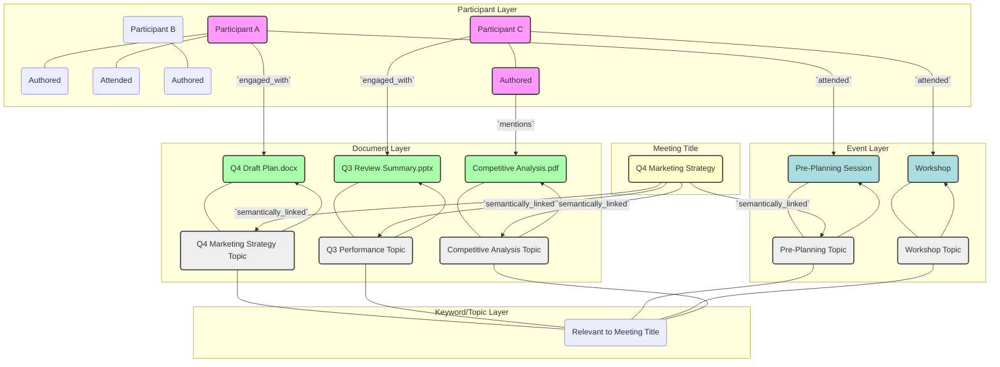

**Title of Invention:** A System and Method for Contextual, Semantically-Driven, and Adaptively Optimized Meeting Agenda Synthesis

**Abstract:**
A novel and highly advanced system for the autonomous generation of dynamic meeting agendas is herein unveiled. This system meticulously ingests a constellation of foundational meeting parameters, including but not limited to, the designated meeting title, the identified cadre of participants, and the scheduled temporal locus. Leveraging sophisticated Application Programming Interface (API) orchestrations, the system profoundly interfaces with the digital ecosystems of each participant, systematically accessing and semantically analyzing their recent digital artifacts, such as calendar entries, collaborative documents, communication logs, and project management updates, spanning a defined chronometric window preceding the scheduled convocation. This agglomerated and normalized contextual data, representing a high-dimensional semantic vector space, is then provided as input to a meticulously engineered generative artificial intelligence model. This model, a product of extensive training on vast corpora of effective organizational communication and meeting structures, is prompted to synthesize a highly relevant, intrinsically structured, and temporally optimized agenda. The resultant agenda artifact comprises intelligently suggested discussion topics, algorithmically determined time allocations for each topic, and direct, resolvable hyperlinks to the pertinent source documents and data artifacts, thereby maximizing meeting efficacy and informational coherence.

**Background of the Invention:**
The orchestration of productive organizational meetings remains a critical yet persistently challenging facet of modern enterprise. The conventional process of agenda formulation is fraught with inherent inefficiencies, often devolving into a manual, time-intensive, and inherently subjective endeavor. Human meeting organizers, constrained by cognitive biases, limited access to comprehensive contextual information, and the sheer volume of distributed digital work products, frequently construct agendas that are either tangential, incomplete, or disproportionately allocated in terms of temporal resources. This prevalent deficiency leads to protracted, unfocused, and ultimately unproductive convocations, resulting in significant opportunity costs, diminished morale, and suboptimal strategic execution across myriad organizations. Prior art mechanisms, largely limited to basic template generation or keyword-based document retrieval, fail to address the complex, multi-modal, and temporal nature of contextual understanding required for truly impactful agenda synthesis. There exists an unfulfilled imperative for a system capable of autonomously and intelligently discerning the nuanced informational landscape pertinent to a given meeting, thereby assisting in the creation of agendas that are not merely structured, but profoundly relevant, dynamically adaptive, and intrinsically optimized for maximal stakeholder engagement and outcome achievement. The presented invention transcends these limitations by establishing a new paradigm in intelligent meeting facilitation.

**Brief Summary of the Invention:**
The present invention embodies a synergistic integration of advanced natural language understanding, machine learning, and secure API-driven data integration to revolutionize the meeting agenda generation process. Upon the initiation of a new meeting event within an enterprise calendar system, the user is presented with the option to invoke the "AI Agenda Synthesis" feature, a proprietary module of this invention. The system thereupon orchestrates the identification of all designated participants and extracts the salient elements of the meeting's nominal topic. A sophisticated `ContextualDataIngestionModule` initiates a series of authenticated and permission-controlled API calls to the participants' federated productivity suites (e.g., Google Workspace, Microsoft 365, Atlassian Confluence, Salesforce, etc.). This module conducts a targeted, temporally-indexed search across diverse data modalities, including but not limited to, recently modified documents, relevant calendar events, email threads, chat communications, project task updates, and CRM interactions within a configurable look-back window. The aggregated information undergoes a rigorous process of semantic parsing, entity extraction, and temporal weighting to construct a `ContextualSemanticGraph`. This graph is then distilled into a concise, yet information-rich, contextual block. This block, augmented by dynamically generated meta-prompts, is then transmitted to a highly optimized large language model (LLM) housed within the `GenerativeAgendaSynthesizer`. The LLM receives a directive such as, "As an expert meeting facilitator, synthesize a structured 60-minute agenda for 'Q4 Project Kickoff' considering the following recent digital artifacts and participant activities." The Generative Agenda Synthesizer processes this prompt and returns a semantically enriched, structured agenda output, formatted in a machine-readable schema (e.g., JSON or robust Markdown). This generated agenda is subsequently presented to the meeting organizer within the calendar event's description field, allowing for a human-in-the-loop review, refinement, and ultimate ratification, thereby ensuring human oversight while significantly reducing manual effort and enhancing agenda quality.

**Detailed Description of the Invention:**

The architecture and operational methodology of this invention are meticulously designed to deliver unparalleled contextual awareness and generative precision in meeting agenda synthesis.

<details>
<summary>System Architecture Overview (Mermaid Diagram)</summary>

```mermaid
graph TD
    A[User Interface / Calendar System] --> B{AI Agenda Synthesis Invocation};
    B --> C[Core Orchestration Engine];

    C --> D[Contextual Data Ingestion Module];
    D --> D1{API Integrations};
    D1 --> E1[Google Workspace API];
    D1 --> E2[Microsoft 365 API];
    D1 --> E3[Atlassian Suite API];
    D1 --> E4[CRM/ERP API];
    D1 --> E5[Collaboration Platform API];

    D --> F[Data Normalization & Preprocessing Unit];
    F --> G[Temporal Indexing & Entity Resolution];
    G --> H[Contextual Semantic Graph (CSG) Constructor];

    H --> I[Semantic Relevance Engine];
    C --> J[Prompt Generation & Augmentation Module];
    I --> J;

    J --> K[Generative Agenda Synthesizer (LLM)];
    K --> L[Agenda Structuring & Validation Unit];
    L --> M[Adaptive Time Allocation Algorithm];
    M --> N[Agenda Output & Dissemination Module];

    N --> O[Feedback Loop Mechanism];
    O --> I;
    O --> K;
    N --> A;
```
</details>

1.  **Input and Initialization Protocol:**
    *   **Event Creation Schema Capture:** A user initiates a new meeting event within a standard calendar application (e.g., `event.create(title="Q4 Marketing Strategy", participants=["user_a", "user_b", "user_c"], datetime_start="2024-10-01T10:00:00Z", duration="PT1H")`). The `Core Orchestration Engine` intercepts this event creation request.
    *   **Participant Identity Resolution:** Unique digital identifiers for each participant (`user_a`, `user_b`, `user_c`) are resolved against an internal user directory service to retrieve associated API credentials and access permissions, ensuring secure and authorized data retrieval.
    *   **Meeting Parameter Extraction:** The meeting title (`"Q4 Marketing Strategy"`), participant list, and scheduled temporal parameters are formally extracted and structured into an initial `MeetingDescriptorTensor`.

2.  **Contextual Data Influx, Normalization, and Graph Construction:**
    *   **API Orchestration:** The `Contextual Data Ingestion Module` (CDIM) initiates a series of asynchronous, permission-governed API calls to the participants' respective digital productivity suites (e.g., `Google Docs API`, `Microsoft Graph API`, `Jira API`, `Slack API`). The scope of retrieval is governed by a configurable `TemporalLookbackWindow` (e.g., last 7 days) and a `RelevanceHeuristic` based on keywords from the `MeetingDescriptorTensor`.
    *   **Example API Invocations:**
        *   `docs.search(query='Q4 Marketing OR Q3 Performance', owner='user_a', modified_since='-7d')` -> `Returns: ["Q4 Draft Plan.docx", "Q3 Review Summary.pptx"]`
        *   `calendar.events.list(attendee='user_b', timeMin='-7d', query='marketing strategy OR planning')` -> `Returns: ["Pre-Planning Session: Q4", "Competitive Analysis Workshop"]`
        *   `slack.channels.history(channel_id='marketing-team', query='Q4 strategy', user='user_c', since='-7d')` -> `Returns: ["Discussion thread: new Q4 initiatives"]`
    *   **Data Normalization & Feature Extraction:** Raw data artifacts are funneled through the `Data Normalization & Preprocessing Unit`. This unit performs:
        *   **Schema Harmonization:** Converts disparate data formats (document metadata, calendar event objects, chat messages) into a unified internal representation.
        *   **Textual Feature Extraction:** Applies advanced NLP techniques (tokenization, lemmatization, named entity recognition, topic modeling) to extract key concepts, entities, and sentiment from textual content.
        *   **Temporal Indexing:** Assigns precise temporal metadata to each artifact, crucial for decay functions.
    *   **Contextual Semantic Graph (CSG) Construction:** The `CSG Constructor` dynamically builds a multi-modal, weighted graph where nodes represent entities (participants, documents, calendar events, topics, keywords) and edges represent semantic relationships (e.g., "authored by," "mentions," "attended," "related to," "discusses"). Edge weights are modulated by a `TemporalDecayKernel` and `SemanticSimilarityScores` from the `Semantic Relevance Engine`. This graph serves as a high-fidelity, dynamic representation of the meeting's surrounding digital ecosystem.

<details>
<summary>Contextual Semantic Graph (Mermaid Diagram)</summary>


</details>

3.  **Prompt Construction and Augmentation:**
    *   **Contextual Summary Generation:** The `Semantic Relevance Engine` (SRE) queries the `Contextual Semantic Graph` to identify the most salient nodes and paths relevant to the `MeetingDescriptorTensor`. It then employs a summarization algorithm to distill this graph into a concise natural language context block. This process leverages techniques like PageRank on the graph, coupled with fine-tuned transformer models for abstractive summarization.
    *   **Dynamic Prompt Engineering:** The `Prompt Generation & Augmentation Module` (PGAM) constructs a highly structured, multi-segment prompt for the LLM. This prompt includes:
        *   **Persona Definition:** `You are an expert meeting facilitator, renowned for crafting efficient, engaging, and outcome-driven agendas.`
        *   **Core Directive:** `Generate a structured 1-hour agenda.`
        *   **Meeting Meta-data:** `**Meeting Title:** "Q4 Marketing Strategy"`, `**Participants:** User A (Marketing Lead), User B (Analytics Specialist), User C (Content Strategist)`. Role-based information for participants is incorporated if available.
        *   **Relevant Context Block:**
            ```
            **Relevant Contextual Data Synthesis:**
            - User A, the Marketing Lead, recently authored/updated "Q4 Draft Plan.docx" (semantic score: 0.92) which outlines preliminary strategic initiatives for Q4. This document is a primary artifact.
            - User B, the Analytics Specialist, attended a "Pre-Planning Session: Q4" (semantic score: 0.85) where early performance metrics and strategic alignments for the upcoming quarter were discussed.
            - User C, the Content Strategist, contributed to a "Competitive Analysis.pdf" (semantic score: 0.78) relevant to market positioning for Q4.
            - Recent Slack discussions in '#marketing-team' (last 48h) indicate emerging concerns regarding competitor X's new product launch, potentially impacting Q4 strategy.
            ```
        *   **Output Constraints & Format:** Explicit instructions for structure (timed items, discussion points, suggested owners) and desired output format (Markdown with specific headings).

4.  **Generative Synthesis and Iterative Refinement:**
    *   **LLM Interaction:** The constructed prompt is transmitted to the `Generative Agenda Synthesizer` (GAS), which encapsulates a powerful LLM. The LLM processes this input, leveraging its vast pre-trained knowledge of meeting structures, topic coherence, and temporal dynamics to propose an initial agenda draft.
    *   **Agenda Structuring & Validation Unit (ASVU):** The raw output from the LLM is received by the ASVU. This unit performs:
        *   **Schema Conformance Validation:** Ensures the output adheres to the specified structural schema (e.g., proper markdown formatting, identifiable topics, time allocations).
        *   **Logical Coherence Assessment:** Applies heuristics to check for topic flow, logical sequencing, and absence of redundant items.
        *   **Topic-Document Linking:** The ASVU utilizes the `Semantic Relevance Engine` to explicitly link proposed agenda topics back to the most relevant source documents/artifacts from the `Contextual Semantic Graph`.
    *   **Adaptive Time Allocation Algorithm (ATAA):** This module dynamically adjusts the initial time allocations proposed by the LLM based on:
        *   **Topic Complexity & Depth:** Inferred from the associated contextual documents.
        *   **Participant Roles & Expertise:** Certain topics may require more time if involving specific experts.
        *   **Meeting Duration Constraints:** Ensures the total agenda time aligns with the specified meeting length.
        *   **Historical Productivity Metrics:** From the `Feedback Loop Mechanism`, if available, indicating typical time required for similar topics.
    *   **Iterative Refinement (Optional):** In advanced configurations, the ASVU can initiate a secondary LLM call with refined instructions or constraints if the initial output fails validation or optimization metrics, effectively creating an internal refinement loop.

5.  **Output, Dissemination, and Feedback Integration:**
    *   **Agenda Assembly:** The refined agenda, complete with timed items, discussion points, suggested presenters/owners, and direct links to source documents, is assembled into its final presentation format.
        ```markdown
        ### Q4 Marketing Strategy Meeting Agenda

        **Date:** October 1, 2024
        **Time:** 10:00 AM - 11:00 AM (1 Hour)
        **Participants:** User A (Marketing Lead), User B (Analytics Specialist), User C (Content Strategist)

        ---

        1.  **(10 min) Review of Q3 Performance & Key Learnings**
            *   _Discussion Points:_ Briefly summarize Q3 successes and areas for improvement. Any unexpected market shifts from Q3 impacting Q4?
            *   _Relevant Context:_ [Q3 Review Summary.pptx](link_to_q3_summary), [Pre-Planning Session: Q4 notes](link_to_pre_planning_notes)
            *   _Presenter:_ User B

        2.  **(25 min) Presentation & Discussion of "Q4 Draft Plan.docx"**
            *   _Discussion Points:_ Overview of proposed Q4 strategic initiatives, target markets, and budget allocations. Solicit initial feedback and potential roadblocks.
            *   _Relevant Context:_ [Q4 Draft Plan.docx](link_to_q4_draft_plan)
            *   _Presenter:_ User A

        3.  **(20 min) Strategic Response to Competitive Landscape & New Initiatives Brainstorm**
            *   _Discussion Points:_ How does competitor X's recent launch impact our Q4 plan? Brainstorm new initiatives or adjustments needed.
            *   _Relevant Context:_ [Competitive Analysis.pdf](link_to_competitive_analysis), Slack thread '#marketing-team' regarding Competitor X.
            *   _Facilitator:_ User C

        4.  **(5 min) Define Next Steps & Action Items**
            *   _Discussion Points:_ Who is responsible for what, by when? Schedule follow-up meetings if necessary.
            *   _Action Items:_ (To be filled during meeting)
        ```
    *