**Title of Invention:** A System and Method for Contextual, Semantically-Driven, and Adaptively Optimized Meeting Agenda Synthesis

**Abstract:**
A novel and highly advanced system for the autonomous generation of dynamic meeting agendas is herein unveiled. This system meticulously ingests a constellation of foundational meeting parameters, including but not limited to, the designated meeting title, the identified cadre of participants, and the scheduled temporal locus. Leveraging sophisticated Application Programming Interface [API] orchestrations, the system profoundly interfaces with the digital ecosystems of each participant, systematically accessing and semantically analyzing their recent digital artifacts, such as calendar entries, collaborative documents, communication logs, and project management updates, spanning a defined chronometric window preceding the scheduled convocation. This agglomerated and normalized contextual data, representing a high-dimensional semantic vector space, is then provided as input to a meticulously engineered generative artificial intelligence model. This model, a product of extensive training on vast corpora of effective organizational communication and meeting structures, is prompted to synthesize a highly relevant, intrinsically structured, and temporally optimized agenda. The resultant agenda artifact comprises intelligently suggested discussion topics, algorithmically determined time allocations for each topic, and direct, resolvable hyperlinks to the pertinent source documents and data artifacts, thereby maximizing meeting efficacy and informational coherence.

**Background of the Invention:**
The orchestration of productive organizational meetings remains a critical yet persistently challenging facet of modern enterprise. The conventional process of agenda formulation is fraught with inherent inefficiencies, often devolving into a manual, time-intensive, and inherently subjective endeavor. Human meeting organizers, constrained by cognitive biases, limited access to comprehensive contextual information, and the sheer volume of distributed digital work products, frequently construct agendas that are either tangential, incomplete, or disproportionately allocated in terms of temporal resources. This prevalent deficiency leads to protracted, unfocused, and ultimately unproductive convocations, resulting in significant opportunity costs, diminished morale, and suboptimal strategic execution across myriad organizations. Prior art mechanisms, largely limited to basic template generation or keyword-based document retrieval, fail to address the complex, multi-modal, and temporal nature of contextual understanding required for truly impactful agenda synthesis. There exists an unfulfilled imperative for a system capable of autonomously and intelligently discerning the nuanced informational landscape pertinent to a given meeting, thereby assisting in the creation of agendas that are not merely structured, but profoundly relevant, dynamically adaptive, and intrinsically optimized for maximal stakeholder engagement and outcome achievement. The presented invention transcends these limitations by establishing a new paradigm in intelligent meeting facilitation.

**Brief Summary of the Invention:**
The present invention embodies a synergistic integration of advanced natural language understanding, machine learning, and secure API-driven data integration to revolutionize the meeting agenda generation process. Upon the initiation of a new meeting event within an enterprise calendar system, the user is presented with the option to invoke the "AI Agenda Synthesis" feature, a proprietary module of this invention. The system thereupon orchestrates the identification of all designated participants and extracts the salient elements of the meeting's nominal topic. A sophisticated `ContextualDataIngestionModule` initiates a series of authenticated and permission-controlled API calls to the participants' federated productivity suites [e.g., Google Workspace, Microsoft 365, Atlassian Confluence, Salesforce, etc.]. This module conducts a targeted, temporally-indexed search across diverse data modalities, including but not limited to, recently modified documents, relevant calendar events, email threads, chat communications, project management updates, and CRM interactions within a configurable look-back window. The aggregated information undergoes a rigorous process of semantic parsing, entity extraction, and temporal weighting to construct a `ContextualSemanticGraph`. This graph is then distilled into a concise, yet information-rich, contextual block. This block, augmented by dynamically generated meta-prompts, is then transmitted to a highly optimized large language model [LLM] housed within the `GenerativeAgendaSynthesizer`. The LLM receives a directive such as, "As an expert meeting facilitator, synthesize a structured 60-minute agenda for 'Q4 Project Kickoff' considering the following recent digital artifacts and participant activities." The Generative Agenda Synthesizer processes this prompt and returns a semantically enriched, structured agenda output, formatted in a machine-readable schema [e.g., JSON or robust Markdown]. This generated agenda is subsequently presented to the meeting organizer within the calendar event's description field, allowing for a human-in-the-loop review, refinement, and ultimate ratification, thereby ensuring human oversight while significantly reducing manual effort and enhancing agenda quality.

**Detailed Description of the Invention:**

The architecture and operational methodology of this invention are meticulously designed to deliver unparalleled contextual awareness and generative precision in meeting agenda synthesis.

<details>
<summary>System Architecture Overview (Mermaid Diagram)</summary>

```mermaid
graph TD
    A[User Interface / Calendar System] --> B{AI Agenda Synthesis Invocation};
    B --> C[Core Orchestration Engine];

    C --> D[Contextual Data Ingestion Module];
    D --> D1{API Integrations};
    D1 --> E1[Google Workspace API];
    D1 --> E2[Microsoft 365 API];
    D1 --> E3[Atlassian Suite API];
    D1 --> E4[CRM/ERP API];
    D1 --> E5[Collaboration Platform API];

    D --> D6[Privacy & Security Enforcement Module];
    D6 --> G[Temporal Indexing & Entity Resolution];

    D --> F[Data Normalization & Preprocessing Unit];
    F --> G;
    G --> H[Contextual Semantic Graph [CSG] Constructor];

    H --> I[Semantic Relevance Engine];
    C --> J[Prompt Generation & Augmentation Module];
    I --> J;

    J --> K[Generative Agenda Synthesizer [LLM]];
    K --> L[Agenda Structuring & Validation Unit];
    L --> M[Adaptive Time Allocation Algorithm];
    M --> N[Agenda Output & Dissemination Module];

    N --> O[Feedback Loop Mechanism];
    O --> I;
    O --> K;
    N --> A;
```
</details>

1.  **Input and Initialization Protocol:**
    *   **Event Creation Schema Capture:** A user initiates a new meeting event within a standard calendar application [e.g., `event.create(title="Q4 Marketing Strategy", participants=["user_a", "user_b", "user_c"], datetime_start="2024-10-01T10:00:00Z", duration="PT1H")`]. The `Core Orchestration Engine` intercepts this event creation request.
    *   **Participant Identity Resolution & Role Inference:** Unique digital identifiers for each participant [`user_a`, `user_b`, `user_c`] are resolved against an internal user directory service to retrieve associated API credentials, access permissions, and inferred or explicitly defined roles [e.g., "Marketing Lead," "Analytics Specialist"]. This role information is critical for personalized context retrieval and agenda item assignment.
    *   **Meeting Parameter Extraction & Goal Setting:** The meeting title [`"Q4 Marketing Strategy"`], participant list, scheduled temporal parameters, and any explicit meeting goals or objectives provided by the organizer are formally extracted and structured into an initial `MeetingDescriptorTensor`. This tensor now includes `GoalVector`, derived from NLP analysis of provided objectives.
    *   **User Preferences & Customization:** The system can access individual user preferences for agenda style [e.g., verbose vs. concise], preferred time allocation units, or specific exclusion keywords, which are stored within a `UserProfileService` and integrated into the `MeetingDescriptorTensor`.

2.  **Contextual Data Influx, Normalization, and Graph Construction:**
    *   **API Orchestration & Secure Data Access:** The `Contextual Data Ingestion Module` [CDIM] initiates a series of asynchronous, permission-governed API calls to the participants' respective digital productivity suites [e.g., `Google Docs API`, `Microsoft Graph API`, `Jira API`, `Slack API`]. Crucially, this process is overseen by the `Privacy & Security Enforcement Module`, ensuring adherence to granular access controls, data minimization principles, and audit trails. Participant consent is dynamically managed at this stage. The scope of retrieval is governed by a configurable `TemporalLookbackWindow` [e.g., last 7 days] and a `RelevanceHeuristic` based on keywords from the `MeetingDescriptorTensor`.
    *   **Multi-modal Data Ingestion:** Beyond textual documents, the CDIM now supports ingestion of various data modalities:
        *   **Document Content:** Full text from documents, presentations [via OCR], spreadsheets [key cells/summaries].
        *   **Calendar Events:** Titles, descriptions, attendees, related attachments.
        *   **Communication Logs:** Summaries of recent email threads, chat discussions, and forum posts.
        *   **Project Management:** Task status updates, bug reports, feature requests.
        *   **CRM Data:** Recent client interactions, sales pipeline updates.
    *   **Example API Invocations:**
        ```
        docs.search(query='Q4 Marketing OR Q3 Performance', owner='user_a', modified_since='-7d', content_extraction=true) 
        # Returns: ["Q4 Draft Plan.docx", "Q3 Review Summary.pptx" with extracted text]
        calendar.events.list(attendee='user_b', timeMin='-7d', query='marketing strategy OR planning') 
        # Returns: ["Pre-Planning Session: Q4", "Competitive Analysis Workshop"]
        slack.channels.history(channel_id='marketing-team', query='Q4 strategy', user='user_c', since='-7d', summarize=true) 
        # Returns: ["Summary of Discussion thread: new Q4 initiatives"]
        jira.issues.search(assignee='user_a', status_category='In Progress', updated_since='-7d', labels='Q4') 
        # Returns: ["Task: Develop Q4 Ad Copy", "Bug: Campaign Tracking Issue"]
        ```
    *   **Data Normalization & Feature Extraction:** Raw data artifacts are funneled through the `Data Normalization & Preprocessing Unit`. This unit performs:
        *   **Schema Harmonization:** Converts disparate data formats [document metadata, calendar event objects, chat messages, task data] into a unified internal representation.
        *   **Textual & Semantic Feature Extraction:** Applies advanced NLP techniques [tokenization, lemmatization, named entity recognition, topic modeling, sentiment analysis] to extract key concepts, entities, sentiment, and intent from textual content. `embedding_vector = encode_text(artifact_content)`.
        *   **Temporal Indexing:** Assigns precise temporal metadata to each artifact, crucial for decay functions.
        *   **Privacy Filtering:** Before graph construction, this unit also applies anonymization and sensitive data redaction based on policies from the `Privacy & Security Enforcement Module`.
    *   **Contextual Semantic Graph [CSG] Construction:** The `CSG Constructor` dynamically builds a multi-modal, weighted graph where nodes represent entities [participants, documents, calendar events, topics, keywords, projects, tasks] and edges represent semantic relationships [e.g., "authored by," "mentions," "attended," "related to," "discusses," "assigned to," "blocked by"]. Edge weights are modulated by a `TemporalDecayKernel`, `SemanticSimilarityScores` from the `Semantic Relevance Engine`, and `InteractionFrequencyMetrics`. This graph serves as a high-fidelity, dynamic representation of the meeting's surrounding digital ecosystem.

```mermaid
graph TD
    subgraph Participant Layer
        P1[Participant A] --- PA1[Authored];
        P1 --- PA2[Attended];
        P1 --- P_ROLE[Marketing Lead];
        PP[Participant B] --- PB1[Authored];
        PP --- P_ROLE_B[Analytics Specialist];
        P2[Participant C] --- PC1[Authored];
        P2 --- P_ROLE_C[Content Strategist];
    end

    subgraph Document Layer
        D1[Q4 Draft Plan.docx] --- Q4_T[Q4 Marketing Strategy Topic];
        D2[Q3 Review Summary.pptx] --- Q3_T[Q3 Performance Topic];
        D3[Competitive Analysis.pdf] --- CA_T[Competitive Analysis Topic];
        D4[Q4 Ad Copy Task] --- QA_T[Q4 Ad Copy Topic];
    end

    subgraph Event Layer
        E1[Pre-Planning Session] --- PPS_T[Pre-Planning Topic];
        E2[Workshop] --- WS_T[Workshop Topic];
    end

    subgraph Keyword/Topic Layer
        Q4_T --> D1;
        Q3_T --> D2;
        PPS_T --> E1;
        WS_T --> E2;
        CA_T --> D3;
        QA_T --> D4;
        
        Q4_T --- RelevantTo[Relevant to Meeting Title];
        Q3_T --- RelevantTo;
        PPS_T --- RelevantTo;
        WS_T --- RelevantTo;
        CA_T --- RelevantTo;
        QA_T --- RelevantTo;
    end

    subgraph Meeting Title
        MT[Q4 Marketing Strategy]
    end

    P1 -- `engaged_with` --> D1;
    P1 -- `attended` --> E1;
    PP -- `engaged_with` --> D2;
    PP -- `attended` --> E2;
    P2 -- `mentions` --> D3;
    P1 -- `assigned_to` --> D4;
    
    MT -- `semantically_linked` --> Q4_T;
    MT -- `semantically_linked` --> Q3_T;
MT -- `semantically_linked` --> PPS_T;
    MT -- `semantically_linked` --> CA_T;
    MT -- `semantically_linked` --> QA_T;
    
    style P1 fill:#f9f,stroke:#333,stroke-width:2px;
    style PP fill:#f9f,stroke:#333,stroke-width:2px;
    style P2 fill:#f9f,stroke:#333,stroke-width:2px;
    style P_ROLE fill:#fcf,stroke:#333,stroke-width:1px;
    style P_ROLE_B fill:#fcf,stroke:#333,stroke-width:1px;
    style P_ROLE_C fill:#fcf,stroke:#333,stroke-width:1px;
    style D1 fill:#afa,stroke:#333,stroke-width:2px;
    style D2 fill:#afa,stroke:#333,stroke-width:2px;
    style D3 fill:#afa,stroke:#333,stroke-width:2px;
    style D4 fill:#afa,stroke:#333,stroke-width:2px;
    style E1 fill:#add,stroke:#333,stroke-width:2px;
    style E2 fill:#add,stroke:#333,stroke-width:2px;
    style Q4_T fill:#eee,stroke:#333,stroke-width:2px;
    style Q3_T fill:#eee,stroke:#333,stroke-width:2px;
    style PPS_T fill:#eee,stroke:#333,stroke-width:2px;
    style WS_T fill:#eee,stroke:#333,stroke-width:2px;
    style CA_T fill:#eee,stroke:#333,stroke-width:2px;
    style QA_T fill:#eee,stroke:#333,stroke-width:2px;
    style MT fill:#ffc,stroke:#333,stroke-width:2px;
```

<details>
<summary>Contextual Semantic Graph (Mermaid Diagram)</summary>


</details>

3.  **Prompt Construction and Augmentation:**
    *   **Contextual Summary Generation:** The `Semantic Relevance Engine` [SRE] queries the `Contextual Semantic Graph` to identify the most salient nodes and paths relevant to the `MeetingDescriptorTensor` and `GoalVector`. It then employs a multi-stage summarization algorithm to distill this graph into a concise, yet comprehensive, natural language context block. This process leverages techniques like PageRank or graph neural networks on the graph, coupled with fine-tuned transformer models for abstractive summarization. It also includes `TopicClustering` to group related artifacts and insights.
    *   **Dynamic Prompt Engineering [DPE]:** The `Prompt Generation & Augmentation Module` [PGAM] constructs a highly structured, multi-segment prompt for the LLM, leveraging advanced techniques to maximize output quality and adherence to specific directives. This includes:
        *   **Persona Definition:** `You are an expert meeting facilitator, renowned for crafting efficient, engaging, and outcome-driven agendas. Prioritize actionable items and clear time management.` This persona can be dynamically adjusted based on meeting type or user preferences.
        *   **Core Directive & Constraints:** `Generate a structured 1-hour agenda focused on achieving our Q4 Marketing Strategy goals.` Explicitly specify total duration, desired number of topics, and balance [e.g., "70% discussion, 30% decision-making"].
        *   **Meeting Meta-data:**
            ```
            **Meeting Title:** "Q4 Marketing Strategy"
            **Participants:** User A [Marketing Lead], User B [Analytics Specialist], User C [Content Strategist]
            **Meeting Goal:** Finalize Q4 marketing strategic initiatives, respond to competitive landscape changes, and define immediate action items.
            ```
            Role-based information for participants is incorporated and used to suggest presenters/facilitators for specific topics.
        *   **Relevant Context Block:**
            ```
            **Relevant Contextual Data Synthesis:**
            - User A [Marketing Lead] recently authored/updated "Q4 Draft Plan.docx" [semantic score: 0.92] which outlines preliminary strategic initiatives for Q4. This document is a primary artifact and requires significant discussion time.
            - User B [Analytics Specialist] attended a "Pre-Planning Session: Q4" [semantic score: 0.85] where early performance metrics and strategic alignments for the upcoming quarter were discussed. User B also provided a "Q3 Review Summary.pptx" [semantic score: 0.80] indicating performance trends.
            - User C [Content Strategist] contributed to a "Competitive Analysis.pdf" [semantic score: 0.78] relevant to market positioning for Q4.
            - Recent Slack discussions in '#marketing-team' [last 48h] indicate emerging concerns regarding competitor X's new product launch, potentially impacting Q4 strategy. [Sentiment: moderately negative, urgency: high].
            - User A has an in-progress Jira task "Develop Q4 Ad Copy" due next week, which relates directly to Q4 initiatives.
            ```
        *   **Few-Shot Examples [Optional]:** Depending on the LLM, the prompt can include 1-2 examples of highly effective agendas for similar meeting types, demonstrating the desired structure and level of detail.
        *   **Output Constraints & Format:** Explicit instructions for structure [timed items, discussion points, suggested owners, action item placeholders, direct hyperlinks] and desired output format [Markdown with specific headings and nested lists, or a JSON schema for programmatic parsing]. This includes specifying the exact markdown syntax for links.

4.  **Generative Synthesis and Iterative Refinement:**
    *   **LLM Interaction & Initial Draft Generation:** The constructed prompt is transmitted to the `Generative Agenda Synthesizer` [GAS], which encapsulates a powerful LLM. The LLM processes this input, leveraging its vast pre-trained knowledge of meeting structures, topic coherence, and temporal dynamics to propose an initial agenda draft.
    *   **Agenda Structuring & Validation Unit [ASVU]:** The raw output from the LLM is received by the ASVU. This unit performs several crucial post-processing and validation steps:
        *   **Schema Conformance Validation:** Ensures the output adheres strictly to the specified structural schema [e.g., proper markdown formatting, identifiable topics, time allocations, valid URLs for links]. It checks against a `JSONSchema` for structured output.
        *   **Logical Coherence & Completeness Assessment:** Applies sophisticated heuristics and secondary NLP models to check for:
            *   Topic flow and logical sequencing.
            *   Absence of redundant or contradictory items.
            *   Coverage of all explicit meeting goals from the `GoalVector`.
            *   Inclusion of all critical stakeholders in relevant discussion points.
        *   **Topic-Document Linking & Resolution:** The ASVU utilizes the `Semantic Relevance Engine` to explicitly link proposed agenda topics back to the most relevant source documents/artifacts from the `Contextual Semantic Graph`. It resolves these links to direct, actionable URLs where possible, or generates summaries/previews for internal systems.
    *   **Adaptive Time Allocation Algorithm [ATAA]:** This sophisticated module dynamically adjusts the initial time allocations proposed by the LLM based on a multi-factor analysis:
        *   **Topic Complexity & Depth:** Inferred from the associated contextual documents [e.g., document length, number of linked entities, `cosine_similarity_score` to complex topics]. `Time_Allocation ~ f(Complexity_Score, Priority)`.
        *   **Participant Roles & Expertise:** Certain topics may require more time if involving specific experts [e.g., an Analytics Specialist presenting data] or if critical decision-makers need to be convinced.
        *   **Meeting Duration Constraints:** Ensures the total agenda time aligns precisely with the specified meeting length, dynamically re-allocating time using an optimization algorithm [e.g., `simulated_annealing`] to fit within `total_duration`.
        *   **Historical Productivity Metrics:** From the `Feedback Loop Mechanism`, if available, indicating typical time required for similar topics or by specific teams/individuals. `Historical_Topic_Duration_Bias`.
        *   **Meeting Goal Prioritization:** Topics directly aligned with `high-priority` goals receive preferential time allocation.
    *   **Iterative Refinement & Self-Correction:** The ASVU can initiate a secondary LLM call with refined instructions or constraints if the initial output fails validation or optimization metrics. For example, `Refine agenda: "Increase discussion time for topic 2 by 5 minutes, ensuring total duration remains 60 minutes. Integrate action item placeholders."` This creates an internal, automated refinement loop until an optimal agenda is generated.
    *   **Bias Detection & Mitigation:** An integrated module assesses the generated agenda for potential biases, such as disproportionate allocation of discussion time to certain individuals or overlooking key topics relevant to specific participant roles. It suggests adjustments to promote fairness and inclusivity.

5.  **Output, Dissemination, and Feedback Integration:**
    *   **Agenda Assembly & Finalization:** The refined agenda, complete with timed items, detailed discussion points, intelligently suggested presenters/owners, and direct, resolvable links to source documents, is assembled into its final presentation format. This includes a clear `Action Item` section with placeholders.
        ```markdown
        ### Q4 Marketing Strategy Meeting Agenda

        **Date:** October 1, 2024
        **Time:** 10:00 AM - 11:00 AM [1 Hour]
        **Participants:** User A [Marketing Lead], User B [Analytics Specialist], User C [Content Strategist]
        **Goal:** Finalize Q4 marketing strategic initiatives, respond to competitive landscape changes, and define immediate action items.

        ---

        1.  **[10 min] Review of Q3 Performance & Key Learnings**
            *   _Discussion Points:_ Briefly summarize Q3 successes and areas for improvement based on provided metrics. Identify any unexpected market shifts from Q3 impacting Q4 planning.
            *   _Relevant Context:_ [Q3 Review Summary.pptx](link_to_q3_summary), [Pre-Planning Session: Q4 notes](link_to_pre_planning_notes)
            *   _Presenter:_ User B [Analytics Specialist]
            *   _Goal Linkage:_ Inform Q4 strategy with past performance.

        2.  **[25 min] Presentation & Discussion of "Q4 Draft Plan.docx"**
            *   _Discussion Points:_ User A to present proposed Q4 strategic initiatives, target markets, and initial budget allocations. Solicit initial feedback from User B [Analytics] and User C [Content] on feasibility and alignment.
            *   _Relevant Context:_ [Q4 Draft Plan.docx](link_to_q4_draft_plan)
            *   _Presenter:_ User A [Marketing Lead]
            *   _Goal Linkage:_ Finalize Q4 initiatives.

        3.  **[20 min] Strategic Response to Competitive Landscape & New Initiatives Brainstorm**
            *   _Discussion Points:_ Analyze implications of Competitor X's recent launch, as highlighted in Slack discussions and competitive analysis. Brainstorm necessary adjustments to our Q4 plan or new initiatives to counter competitive pressure. Focus on content strategy adjustments.
            *   _Relevant Context:_ [Competitive Analysis.pdf](link_to_competitive_analysis), Slack thread '#marketing-team' regarding Competitor X, summary of User A's "Develop Q4 Ad Copy" task.
            *   _Facilitator:_ User C [Content Strategist]
            *   _Goal Linkage:_ Respond to competitive landscape.

        4.  **[5 min] Define Next Steps & Action Items**
            *   _Discussion Points:_ Clearly assign ownership and deadlines for key action items identified during the meeting. Confirm follow-up meeting requirements.
            *   _Action Items:_
                *   [ ] User A: Finalize Q4 plan with agreed-upon adjustments by [Date].
                *   [ ] User C: Draft preliminary response strategy for Competitor X by [Date].
                *   [ ] User B: Provide updated Q4 forecast based on revised plan by [Date].
        ```
    *   **Dissemination and User Interface Integration:** The final agenda is seamlessly pushed back to the originating calendar event's description field. It can also be disseminated via email, chat platforms, or integrated into project management tools. A user interface widget allows for in-situ review and minor edits.
    *   **Feedback Loop Mechanism [FLM]:** This critical module enables continuous learning and system improvement. After the meeting, users are prompted to provide feedback on the agenda's effectiveness:
        *   **Rating:** Agenda relevance, clarity, and time accuracy.
        *   **Corrections:** Manual edits made to the agenda.
        *   **Outcome Capture:** Actual decisions made, action items completed.
        *   **Survey Data:** Short post-meeting surveys on perceived productivity.
        This feedback is used to:
        *   **Retrain/Fine-tune LLM:** Adjust `Generative Agenda Synthesizer` weights and prompt engineering strategies.
        *   **Refine ATAA:** Improve time allocation heuristics.
        *   **Enhance SRE:** Strengthen semantic relevance scoring and context summarization.
        *   **Update User Profiles:** Adapt to evolving user preferences.
        The FLM thus ensures that the system becomes progressively more accurate and tailored over time, adhering to `Reinforcement Learning from Human Feedback` principles.