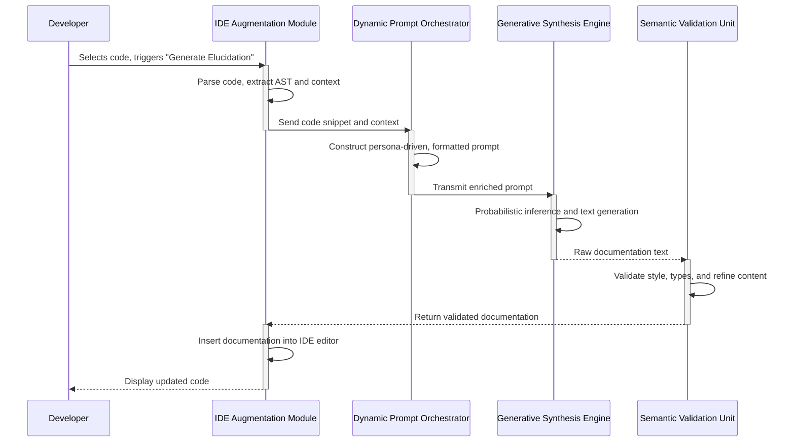
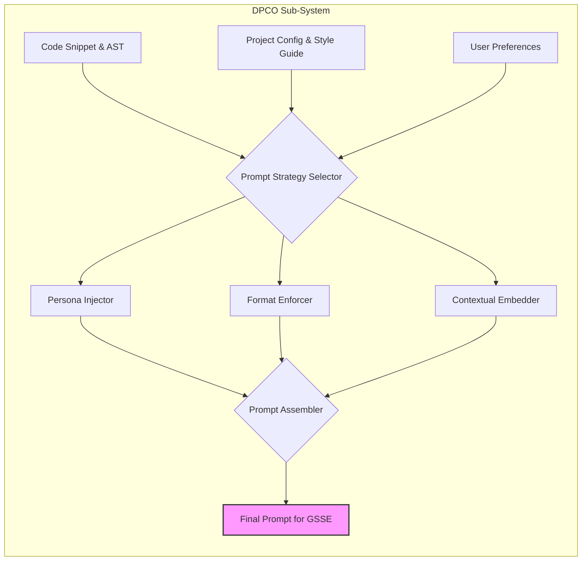
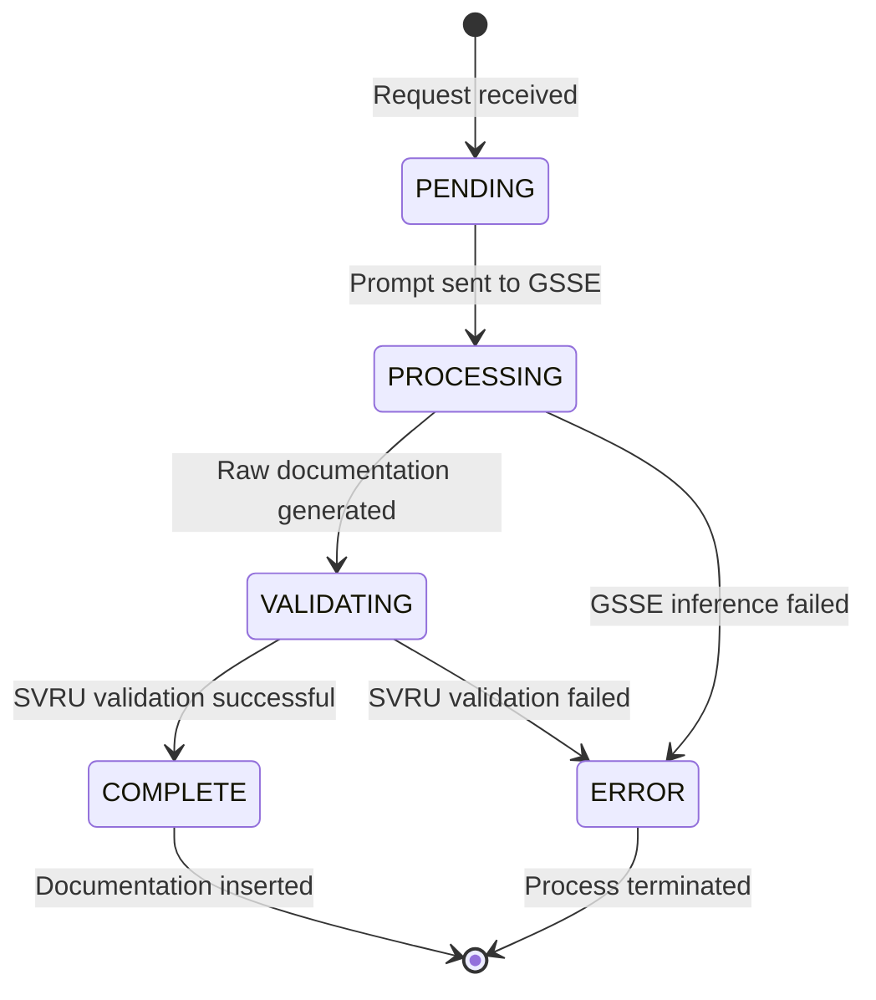
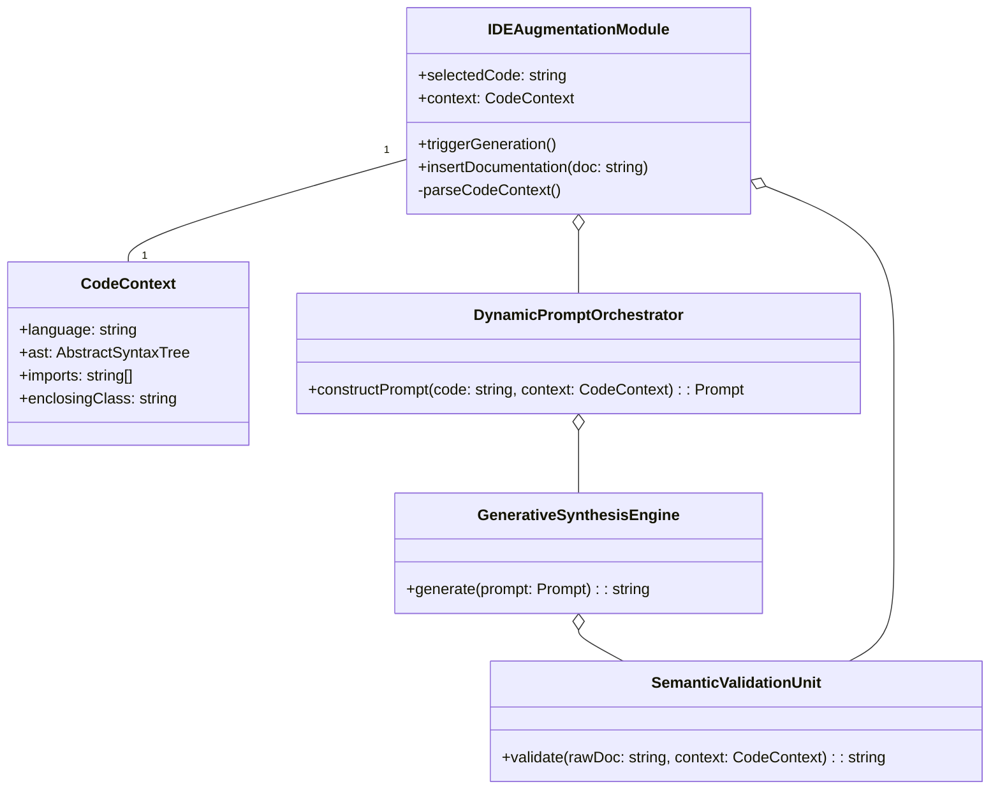
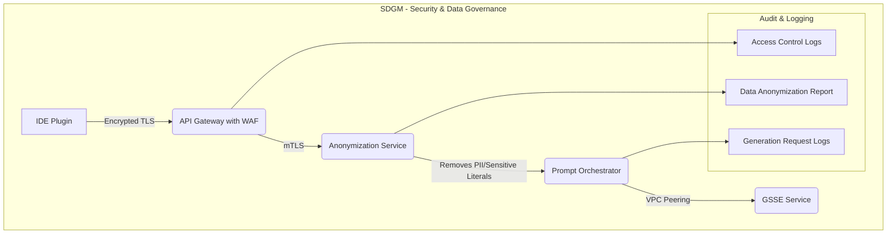
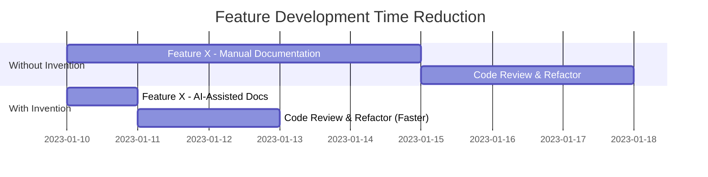
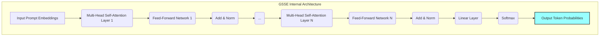
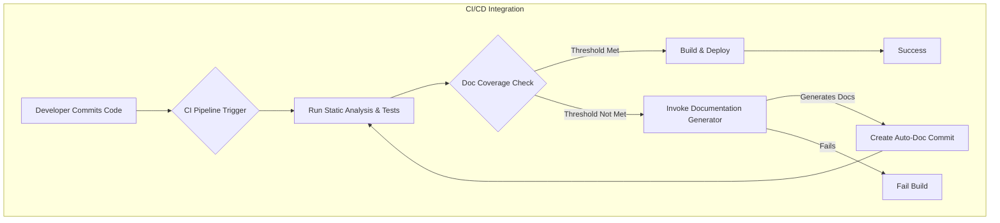
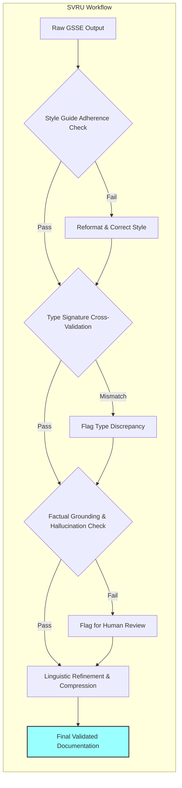

**Title of Invention:** A System and Method for Epistemic Augmentation and Automated Semantic Elucidation of Computational Lexical Constructs

**Abstract:**
A novel and profoundly impactful system and methodology are herewith disclosed, meticulously engineered for the autonomous generation of sophisticated, contextually enriched semantic metadata, specifically manifesting as code comments and formal docstrings. This pioneering system, architected typically as an Integrated Development Environment (IDE) augmentation module, precisely intercepts and processes discrete computational lexical constructs (source code segments) designated by a user. The designated code, along with a rich tapestry of surrounding contextual data including Abstract Syntax Trees (ASTs), symbol tables, and project-wide conventions, is then transmitted to a highly advanced probabilistic autoregressive transformer architecture, hereafter referred to as the "Generative Semantic Synthesis Engine." This engine, augmented with a domain-adaptive knowledge graph and governed by a rigorous ethical AI framework, is meticulously prompted to undertake a multi-modal analysis encompassing the code's functional prerogative, its parameterized input manifolds, its resultant output valences, its algorithmic complexity, and its potential side-effects. The Generative Semantic Synthesis Engine subsequently synthesizes a rigorously descriptive textual artifact, either a high-fidelity comment or a meticulously formatted docstring, which explicates the computational construct's teleological essence in an impeccably naturalistic idiom. This synthetically generated epistemic artifact is then seamlessly interjected into the pertinent locus within the original source code file, thereby elevating its cognitive accessibility, bolstering its long-term maintainability, and drastically attenuating the cognitive load on subsequent developers engaged in hermeneutic interpretation. This intellectual construct constitutes a foundational advancement in the automation of software engineering ontologies, asserting a proprietary paradigm shift in documentation practices by establishing a self-optimizing, secure, and contextually-aware documentation-as-code ecosystem.

**Background of the Invention:**
The endeavor of authoring comprehensive, perspicuous, and semantically precise documentation constitutes an indispensable, albeit frequently underserved, facet of the software development lifecycle. Traditionally, this critically important activity is relegated to a manual, labor-intensive process, imposing a substantial cognitive burden and temporal overhead upon human developers. The persistent neglect of robust documentation engenders a cascading series of deleterious consequences: obfuscated codebases become formidable barriers to collaborative development, necessitating prolonged decipherment efforts, increasing the incidence of logical fallacies (bugs), and impeding the velocity of iterative refinement cycles. The economic ramifications are severe, manifesting as inflated maintenance costs, which can consume upwards of 80% of a project's total lifecycle budget. Furthermore, the inherent human propensity for cognitive decay over time renders even an author's own code inscrutable without adequate externalized mnemonic aids, a phenomenon known as "code amnesia." The extant methodologies for documentation generation are demonstrably inefficient, non-scalable, and prone to human error, inconsistency, and stylistic drift. Consequently, a compelling exigency exists for an advanced computational apparatus capable of automating the meticulous process of synthesizing lucid, veridical, and contextually apposite documentation for pre-existing computational lexical constructs, thereby transcending the limitations of conventional manual paradigms. This proprietary intellectual architecture addresses this profound and long-standing lacuna within the domain of software engineering praxis, providing a scalable, secure, and intelligent solution to mitigate the crippling technical debt accumulated through documentation neglect.

**Brief Summary of the Invention:**
The present invention embodies a revolutionary IDE augmentation module that seamlessly integrates a novel "Generate Semantic Elucidation" command into the developer's operational workflow. Upon a developer's judicious selection of a function, method, or any discrete computational lexical unit within the Integrated Development Environment, and subsequent invocation of the aforementioned command, the augmentation module initiates a secure, asynchronous transmission of the selected source code's textual representation—and its deep structural representation via AST analysis—to a specialized Generative Semantic Synthesis Engine. The system employs an intelligently modulated prompt construction methodology, instructing the Generative Semantic Synthesis Engine to assume the persona of a principal software architect with profound domain expertise, thereby guaranteeing the generation of a highly professional and technically accurate docstring or inline comment. This prompt rigorously delineates the requirement for a comprehensive explanation of the computational unit's telos, its input parameter manifolds (comprising type signatures and semantic roles), and its anticipated output valence (including return types and potential exceptions). The synthesized response, an impeccably formatted textual artifact representing the documentation, is then programmatically received by the IDE augmentation module and judiciously inserted into the source code document, precisely at the most semantically pertinent location relative to the original computational unit. This proprietary methodology significantly elevates the operational efficiency of documentation practices, enforces consistency, and establishes a living, self-updating repository of knowledge directly embedded within the codebase.

**Detailed Description of the Invention:**
Consider a sophisticated software engineer operating within a contemporary Integrated Development Environment (e.g., a highly configurable instantiation of Visual Studio Code or IntelliJ IDEA). The engineer has meticulously crafted a Python function embodying a complex algorithmic transformation:

```python
def calculate_exponential_moving_average(price_series_data, temporal_smoothing_period):
    """
    Placeholder docstring for an Exponential Moving Average calculation.
    """
    if not isinstance(price_series_data, list) or not all(isinstance(p, (int, float)) for p in price_series_data):
        raise TypeError("price_series_data must be a list of numerical values.")
    if not isinstance(temporal_smoothing_period, int) or temporal_smoothing_period <= 0:
        raise ValueError("temporal_smoothing_period must be a positive integer.")

    smoothing_factor_alpha = 2.0 / (temporal_smoothing_period + 1.0)
    
    # Initialize the Exponential Moving Average series with the first data point
    ema_series_output = [price_series_data[0]]

    # Iteratively compute EMA for subsequent data points
    for index in range(1, len(price_series_data)):
        current_price = price_series_data[index]
        previous_ema = ema_series_output[-1]
        
        # EMA formula: EMA_today = (Price_today * alpha) + (EMA_yesterday * (1 - alpha))
        current_ema = (current_price * smoothing_factor_alpha) + (previous_ema * (1.0 - smoothing_factor_alpha))
        ema_series_output.append(current_ema)
        
    return ema_series_output
```
The engineer, leveraging the advanced capabilities of this proprietary system, highlights this sophisticated function definition and initiates the context-menu action "AI: Generate Semantic Elucidation."

### System Architecture and Operational Modalities

The operational paradigm of this invention is predicated upon a highly modular, distributed architecture, designed for optimal performance, scalability, and semantic fidelity. The core components and their synergistic interactions are meticulously detailed below and depicted in the Architectural Schema (Figure 1).

```mermaid
graph TD
    subgraph User Interaction Layer
        A[Developer Selects Code] -- Trigger: "Generate Docs" --> B[IDE Augmentation Module]
    end

    subgraph Data Acquisition and Preprocessing
        B -- Extracts Code and Context --> C[Contextual Code Parser and Validator]
        C -- Syntactic and Semantic Analysis --> D[Metadata and AST Generation]
    end

    subgraph Prompt Engineering and Orchestration
        D -- Structured Input --> E[Dynamic Prompt Constructor]
        E -- Augments with User Prefs and Policies --> F[Intelligent Prompt Orchestrator]
    end

    subgraph Generative AI Core
        F -- Formulated Prompt --> G[Generative Semantic Synthesis Engine GSSE]
        G -- Processes Language Model --> H[Synthesized Docstring or Comment]
    end

    subgraph Post-Processing and Insertion
        H -- Raw Output --> I[Semantic Validation and Refinement Unit]
        I -- Quality-Assured Output --> J[IDE Integration and Insertion API]
        J -- Updates Source File --> K[Document Updated]
    end

    subgraph Feedback and Adaptation Loop
        K -- User Review or Edits --> L[Implicit and Explicit Feedback Capture]
        L -- Data for Learning --> M[Adaptive Learning and Model Refinement]
        M -- Enhances GSSE --> G
        M -- Enhances Prompt Constructor --> E
    end

    style A fill:#f9f,stroke:#333,stroke-width:2px
    style K fill:#9ff,stroke:#333,stroke-width:2px
    style G fill:#ccf,stroke:#333,stroke-width:2px
```
*Figure 1: High-Level Architectural Schema of the Epistemic Augmentation System*

1.  **IDE Augmentation Module (I.A.M.) Logic:** The I.A.M., operating as a deeply integrated plugin within the host IDE, intercepts the designated textual segment representing the `calculate_exponential_moving_average` function. Beyond mere textual extraction, it performs an initial syntactic analysis to identify the programmatic construct's boundaries, its language type (e.g., Python), and relevant surrounding contextual elements (e.g., class definitions, module-level docstrings, existing imports) crucial for enhancing semantic precision.

2.  **Dynamic Prompt Construction and Orchestration (D.P.C.O.):** The D.P.C.O. sub-system receives the extracted code and its meta-context. It then intelligently constructs a highly nuanced, context-aware prompt tailored for optimal interaction with the Generative Semantic Synthesis Engine (GSSE). This proprietary prompt engineering methodology incorporates:
    *   **Linguistic Persona Injection:** The prompt explicitly instantiates the GSSE with a professional persona, e.g., "You are an eminent Principal Software Engineer specializing in financial algorithms and robust API documentation."
    *   **Behavioral Directives:** Instructions to meticulously analyze the function's side effects, potential exceptions, algorithmic complexity implications, and practical usage scenarios.
    *   **Output Format Enforcement:** Rigorous directives for adhering to specified documentation styles (e.g., Google, NumPy, Sphinx for Python; Javadoc for Java; TSDoc for TypeScript).
    *   **Contextual Embeddings:** Incorporation of surrounding code context, project-specific glossary terms, and prior documentation styles observed within the codebase via vector embeddings, enabling a more coherent and consistent output.

    For the illustrative Python function, an exemplary constructed prompt, rendered in a simplified representation for clarity, would be:
    ```
    {
    "system_persona": "You are a world-renowned Principal Software Architect with expertise in quantitative finance, statistical modeling, and API documentation best practices. Your task is to generate a comprehensive, semantically precise, and syntactically correct docstring for the provided Python function. Adhere strictly to the Google Python Style Guide for docstrings.",
    "user_instruction": "Analyze the following Python function. Provide a detailed explanation of its core purpose, its mathematical underpinnings (specifically the EMA formula), the precise type annotations and semantic descriptions for each parameter, the exact return type and its interpretation, and any potential errors or edge cases. Ensure clarity, conciseness, and technical accuracy. Integrate best practices for robustness and maintainability.",
    "code_snippet": "def calculate_exponential_moving_average(price_series_data, temporal_smoothing_period):\n    \"\"\"\n    Placeholder docstring for an Exponential Moving Average calculation.\n    \"\"\"\n    if not isinstance(price_series_data, list) or not all(isinstance(p, (int, float)) for p in price_series_data):\n        raise TypeError(\"price_series_data must be a list of numerical values.\")\n    if not isinstance(temporal_smoothing_period, int) or temporal_smoothing_period <= 0:\n        raise ValueError(\"temporal_smoothing_period must be a positive integer.\")\n\n    smoothing_factor_alpha = 2.0 / (temporal_smoothing_period + 1.0)\n    \n    ema_series_output = [price_series_data[0]]\n\n    for index in range(1, len(price_series_data)):\n        current_price = price_series_data[index]\n        previous_ema = ema_series_output[-1]\n        \n        current_ema = (current_price * smoothing_factor_alpha) + (previous_ema * (1.0 - smoothing_factor_alpha))\n        ema_series_output.append(current_ema)\n        \n    return ema_series_output"
    }
    ```
3.  **Generative Semantic Synthesis Engine (GSSE):** The highly sophisticated GSSE, leveraging state-of-the-art deep learning architectures (e.g., multi-headed self-attention transformers with billions of parameters), receives the meticulously constructed prompt. It then performs a complex, probabilistic inference to generate a textual response that semantically fulfills the directives. Its internal mechanisms involve:
    *   **Syntactic and Semantic Understanding:** Deconstructing the input code into an internal abstract syntax tree (AST) and inferring variable roles, control flow, and data transformations.
    *   **Algorithmic Concept Mapping:** Recognizing common algorithmic patterns (e.g., EMA calculation) and retrieving associated canonical descriptions from its vast training corpus.
    *   **Natural Language Generation (NLG):** Synthesizing coherent, grammatically correct, and contextually appropriate natural language documentation.
    The GSSE would return a response akin to:
    ```python
    """Calculates the Exponential Moving Average (EMA) for a given series of financial or time-series data.

    The Exponential Moving Average (EMA) is a type of moving average that places a greater weight and significance on the most recent data points.
    The weighting given to each older data point decreases exponentially, never reaching zero. This algorithm is particularly useful in
    technical analysis for smoothing price data, identifying trends, and reducing noise.

    The EMA is calculated using the formula:
    `EMA_t = (P_t * alpha) + (EMA_{t-1} * (1 - alpha))`
    where:
        - `EMA_t` is the Exponential Moving Average at time `t`.
        - `P_t` is the current price at time `t`.
        - `EMA_{t-1}` is the Exponential Moving Average of the previous period.
        - `alpha` is the smoothing factor, calculated as `2 / (N + 1)`, where `N` is the `temporal_smoothing_period`.

    Args:
        price_series_data (list[float | int]): A list of numerical values representing the time-series data (e.g., stock prices).
            The list must contain at least one element.
        temporal_smoothing_period (int): The lookback period (N) for the EMA calculation. This integer must be positive.
            A higher period results in a smoother EMA, while a lower period makes it more reactive to recent price changes.

    Returns:
        list[float]: A list of floating-point numbers representing the calculated Exponential Moving Average values.
            The length of this list will be identical to the input `price_series_data`.

    Raises:
        TypeError: If `price_series_data` is not a list or contains non-numerical elements.
        ValueError: If `temporal_smoothing_period` is not a positive integer.

    Examples:
        >>> calculate_exponential_moving_average([10, 11, 12, 13, 14], 3)
        [10.0, 10.5, 11.25, 12.125, 13.0625]
        >>> calculate_exponential_moving_average([20.5, 21.0, 20.0, 22.5], 2)
        [20.5, 20.666666666666668, 20.22222222222222, 21.74074074074074]
    """
    ```
4.  **Semantic Validation and Refinement Unit (S.V.R.U.) and Code Insertion Module (C.I.M.):** The raw textual output from the GSSE is routed through the S.V.R.U. This unit performs several critical post-processing steps:
    *   **Syntactic Adherence:** Verifies the generated text conforms to the specified documentation style guide (e.g., correct indentation, proper Sphinx/Google/NumPy roles).
    *   **Type Signature Cross-Verification:** Compares generated parameter types and return types against the actual static analysis derived types from the source code, flagging discrepancies for potential correction or user review.
    *   **Redundancy Elimination and Conciseness Optimization:** Applies linguistic compression algorithms to remove superfluous phrases while preserving semantic integrity.
    *   **Contextual Consistency Check:** Ensures that the generated documentation aligns with the broader codebase's stylistic and terminological conventions.
    After successful validation, the C.I.M. leverages the host IDE's robust Application Programming Interface (API) to precisely insert the validated and refined documentation into the source document. This insertion process accounts for existing code formatting, indentation levels, and potential conflicts with pre-existing, albeit potentially sparse, documentation.

### Iterative Refinement and Adaptive Learning

A crucial and proprietary aspect of this system is its inherent capability for adaptive learning and iterative refinement. User interactions, such as manual edits to the generated documentation, explicit "accept" or "reject" signals, or even implicit feedback derived from subsequent code modifications, are captured by the Feedback and Adaptation Loop. This rich dataset is then utilized to continually fine-tune the GSSE's underlying probabilistic models and to optimize the Dynamic Prompt Construction and Orchestration strategies. This closed-loop feedback mechanism ensures that the system progressively learns developer preferences, project-specific idioms, and evolving code conventions, leading to a sustained improvement in the quality and relevance of generated documentation over time, thus establishing a self-optimizing epistemic augmentation utility.

### Advanced Features and Scalability Enhancements

To further augment the system's utility and solidify its position as a leading-edge solution, several advanced features and enhancements are integrated into its design:

1.  **Deep IDE Integration and Language Server Protocol (LSP) Leverage**: The IDE Augmentation Module (I.A.M.) moves beyond basic text manipulation. It deeply integrates with the IDE's Language Server Protocol (LSP) client to gain rich, real-time insights into the codebase. This includes access to Abstract Syntax Trees (ASTs), symbol tables, precise type definitions, call graphs, and cross-references. This granular understanding allows the I.A.M. to provide significantly more accurate contextual information to the D.P.C.O., ensuring prompts are enriched with a full programmatic understanding rather than just textual proximity.

2.  **Project-Wide Contextual Intelligence**: The D.P.C.O. extends its context gathering to encompass a holistic view of the entire project. This includes parsing project configuration files (e.g., `pyproject.toml`, `package.json`, `pom.xml`), analyzing project-level README files and existing documentation for overarching conventions, extracting rationale from relevant Git commit history, and even performing embedding lookups against external library documentation to provide accurate references and usage patterns for third-party dependencies. This ensures documentation is not only syntactically and semantically correct for the snippet but also consistent with the broader project and its ecosystem.

3.  **Multi-Language and Polymorphic Documentation Support**: The system is engineered for inherent multi-language support, capable of processing and generating documentation for a diverse array of programming languages including Python, Java, C#, JavaScript/TypeScript, Go, and Rust. This is achieved through language-specific parsers within the I.A.M. and tailored output renderers within the S.V.R.U. Furthermore, the system supports polymorphic documentation styles, dynamically adapting to generate docstrings in formats such as Google, NumPy, or Sphinx for Python, Javadoc for Java, or TSDoc for TypeScript, based on explicit project configurations or inferred stylistic patterns within the codebase.

4.  **Ethical AI, Bias Mitigation, and Factual Grounding**: Recognizing the critical importance of responsible AI, the Generative Semantic Synthesis Engine (GSSE) incorporates mechanisms for ethical AI governance. This includes rigorous post-training quantification and mitigation of biases inherited from training data, ensuring documentation is fair, inclusive, and avoids perpetuating harmful stereotypes. To prevent 'hallucination' and ensure factual accuracy, the GSSE is augmented with factual grounding techniques, cross-referencing generated content against a trusted internal knowledge graph or verified external documentation sources. Discrepancies are flagged for human review, fostering trust and reliability.

5.  **Security and Data Governance Module (SDGM)**: A dedicated Security and Data Governance Module (SDGM) is integrated to handle the sensitive nature of transmitting proprietary source code. This module enforces end-to-end encryption for all data transmissions between the IDE, prompt orchestration, and the GSSE. It incorporates data anonymization techniques for highly sensitive code segments, robust access control mechanisms, and comprehensive audit logging. The SDGM ensures compliance with industry-specific data protection regulations (e.g., GDPR, HIPAA, SOC 2), particularly crucial when the GSSE operates as a cloud-hosted service.

6.  **Integration with CI/CD Pipelines and Documentation-as-Code**: The system can be seamlessly integrated into Continuous Integration/Continuous Deployment (CI/CD) pipelines. This enables automated documentation checks as part of the build process, flagging undocumented or poorly documented code, and potentially enforcing documentation standards. The system supports a "Documentation-as-Code" paradigm, where generated documentation artifacts can be version-controlled alongside the source code, ensuring that documentation remains synchronized with code changes throughout the software development lifecycle.

7.  **Specialized Domain Adaptation and Knowledge Graph Augmentation**: For enterprises operating in niche or highly specialized domains, the GSSE can undergo domain adaptation. This involves fine-tuning the base models with proprietary, domain-specific knowledge bases (e.g., financial trading algorithms, clinical medical informatics, advanced scientific computing models). Furthermore, the system can integrate with enterprise-level knowledge graphs, allowing the GSSE to leverage internal ontologies, proprietary terminology, and established architectural patterns, thereby generating documentation that is not only technically accurate but also perfectly aligned with an organization's unique operational context and intellectual assets.

### Additional System Diagrams


*Figure 2: Sequence Diagram of the End-to-End Documentation Generation Process*


*Figure 3: Detailed Workflow of the Dynamic Prompt Construction and Orchestration (D.P.C.O.) Sub-System*


*Figure 4: State Diagram for a Documentation Generation Request*


*Figure 5: High-Level Class Diagram of Core System Components*


*Figure 6: Architectural View of the Security and Data Governance Module (SDGM)*


*Figure 7: Gantt Chart Illustrating Projected Efficiency Gains*


*Figure 8: Simplified Internal Architecture of the Transformer-based GSSE*


*Figure 9: CI/CD Pipeline Integration Workflow*


*Figure 10: Detailed Workflow of the Semantic Validation and Refinement Unit (S.V.R.U.)*

**Claims:**
1.  A system for autonomous generation of semantic metadata for computational lexical constructs, comprising:
    a.  An Integrated Development Environment (IDE) Augmentation Module configured to:
        i.   Receive a selection of source code from a user within a code editor.
        ii.  Extract the selected source code and its associated contextual metadata.
        iii. Initiate a request for semantic elucidation based on the extracted data.
    b.  A Dynamic Prompt Construction and Orchestration (D.P.C.O.) sub-system communicatively coupled to the IDE Augmentation Module, further configured to:
        i.   Synthesize a contextually rich and linguistically precise prompt, incorporating developer preferences, project-specific stylistic guidelines, and a designated professional persona.
        ii.  Embed contextual information derived from the source code's environment into the prompt.
    c.  A Generative Semantic Synthesis Engine (GSSE) communicatively coupled to the D.P.C.O. sub-system, comprising a probabilistic autoregressive transformer architecture, configured to:
        i.   Process the synthesized prompt and the embedded source code.
        ii.  Perform multi-modal analysis of the source code's functional prerogative, parameterized input manifolds, and resultant output valences.
        iii. Generate a descriptive natural language textual artifact, representing semantic metadata in the form of a code comment or a formatted docstring.
    d.  A Semantic Validation and Refinement Unit (S.V.R.U.) communicatively coupled to the GSSE, configured to:
        i.   Verify the generated textual artifact against pre-defined syntactic and stylistic guidelines.
        ii.  Perform cross-validation of inferred type signatures against actual code constructs.
        iii. Optimize the textual artifact for conciseness and contextual consistency.
    e.  A Code Insertion Module (C.I.M.) communicatively coupled to the S.V.R.U., configured to:
        i.   Receive the validated and refined textual artifact.
        ii.  Programmatically insert the textual artifact into the originating source code file at a semantically appropriate locus via the IDE's Application Programming Interface.

2.  The system of claim 1, further comprising an Adaptive Learning and Model Refinement module configured to capture implicit and explicit user feedback on generated documentation and utilize said feedback to iteratively enhance the performance and fidelity of the Generative Semantic Synthesis Engine and the Dynamic Prompt Construction and Orchestration sub-system.

3.  The system of claim 1, wherein the D.P.C.O. sub-system is further configured to incorporate project-specific glossaries, coding standards, and historical documentation patterns through vector embedding techniques to ensure consistency across a codebase.

4.  The system of claim 1, wherein the GSSE is trained on a vast corpus of programming language semantics, natural language descriptions, and canonical documentation styles across multiple programming paradigms and languages.

5.  A method for enhancing the epistemic accessibility of computational lexical constructs, comprising:
    a.  Actuating an IDE Augmentation Module in response to a user's selection of a source code segment.
    b.  Transmitting the selected source code segment and its associated contextual metadata to a Dynamic Prompt Construction and Orchestration sub-system.
    c.  Generating a specialized prompt by the D.P.C.O. sub-system, wherein said prompt integrates a designated professional persona, behavioral directives, output format constraints, and contextual embeddings.
    d.  Transmitting the specialized prompt to a Generative Semantic Synthesis Engine, comprising a probabilistic autoregressive transformer architecture.
    e.  Synthesizing a natural language description of the source code's functionality, parameters, and return values by the GSSE.
    f.  Receiving the synthesized description by a Semantic Validation and Refinement Unit.
    g.  Validating and refining the synthesized description for syntactic correctness, semantic congruence, and stylistic adherence.
    h.  Programmatically inserting the validated description into the source code editor as a comment or docstring via a Code Insertion Module.

6.  The method of claim 5, further comprising the continuous capture of user feedback and its utilization in an adaptive learning loop to optimize the prompt generation strategies and the generative capabilities of the Semantic Synthesis Engine.

7.  The method of claim 5, wherein the synthesized description includes mathematical formulations or algorithmic complexities derived from the source code's logical structure.

8.  The system of claim 1, wherein the IDE Augmentation Module is further configured to leverage a Language Server Protocol (LSP) to acquire a deep structural representation of the source code, including its Abstract Syntax Tree (AST), symbol table, and type hierarchy, and wherein said structural representation is utilized by the D.P.C.O. to generate a more semantically accurate prompt.

9.  The system of claim 1, further comprising a Security and Data Governance Module (SDGM) configured to intercept the extracted source code and apply end-to-end encryption to all data in transit and at rest, and to perform data anonymization to remove personally identifiable information or proprietary literals before transmission to the GSSE.

10. The system of claim 1, wherein the system is configurable for integration into a Continuous Integration/Continuous Deployment (CI/CD) pipeline, said configuration enabling the system to automatically analyze committed code, generate documentation for undocumented constructs, and enforce a minimum documentation coverage threshold as a condition for a successful build.

**Mathematical Justification: A Formal Epistemological Framework for Documentogenesis Efficiency**

Let us rigorously formalize the theoretical underpinnings that unequivocally establish the transformative value of this proprietary system. We embark upon a journey through computational economics, information theory, and cognitive science to quantify the intrinsic value proposition.

### I. Formalizing the Cognitive Cost of Manual Documentogenesis

Let `C` denote a discrete computational lexical construct, specifically a function, method, or code block within a given programming language. The complexity of `C` can be quantified by a multivariate metric `Omega(C) = (mu_cy(C), mu_hal(C), mu_cog(C))`, where:
*   `mu_cy(C)` represents the cyclomatic complexity. (1) $$ \mu_{cy}(C) = E - N + 2P $$ where E is edges, N is nodes, P is connected components in the control flow graph.
*   `mu_hal(C)` represents Halstead complexity measures. (2) $$ V = (N_1 + N_2) \log_2(\eta_1 + \eta_2) $$ (Volume), (3) $$ E = D \times V $$ (Effort), where D is Difficulty.
*   `mu_cog(C)` represents cognitive complexity. (4) $$ \mu_{cog}(C) = \sum_{i=1}^{n} (w_i + n_i) $$ where $w_i$ is a weight for a structural feature and $n_i$ is its nesting level.

The ideal, human-authored documentation for `C` is denoted by `D_star_C`. This `D_star_C` represents a complete and unambiguous semantic projection of `C` into a natural language domain, possessing maximal information entropy reduction for an observer. The cognitive cost incurred by a human developer `H` to produce `D_star_C` is denoted as `Cost_H(C, D_star_C)`.

We postulate `Cost_H` as a function of the code's intrinsic complexity, the developer's domain-specific knowledge, and their linguistic proficiency:

(5) $$ C_H(C, D_star_C) = f( \Omega(C), K_D(H), L_N(H) ) + \tau_{iter}(C, D_star_C) $$

Where:
*   `f` is a monotonically increasing function. (6) $$ \frac{\partial f}{\partial \Omega} > 0 $$
*   `K_D(H)` is a scalar representation of domain knowledge. (7) $$ K_D(H) \in [0, 1] $$
*   `L_N(H)` is a scalar representation of linguistic proficiency. (8) $$ L_N(H) \in [0, 1] $$
*   `tau_iter` represents the temporal overhead. (9) $$ \tau_{iter} = \int_{0}^{T_{doc}} \lambda(t) dt $$ where $\lambda(t)$ is cognitive load over time $T_{doc}$.
(10-20) We can further decompose $\Omega(C)$:
$$ \Omega(C) = \alpha_1 \mu_{cy} + \alpha_2 \mu_{hal} + \alpha_3 \mu_{cog} + \sum_{i=4}^{14} \alpha_i \mu_i $$ where $\mu_i$ represent other metrics like nesting depth, parameter count, etc.

The human cognitive processing for documentogenesis involves:
1.  **Syntactic Deconstruction:** Parsing `C` into an Abstract Syntax Tree (AST), $T_{AST}$. Cost is proportional to code length, $O(|C|)$. (21)
2.  **Semantic Reconstruction:** Inferring semantics, $\mathcal{S}(C)$. Cost is super-linear. (22) $Cost_{sem} \propto |\mathcal{S}(C)| \log(|\mathcal{S}(C)|)$.
3.  **Conceptual Mapping:** $M: \mathcal{S}(C) \to \mathcal{L}_{NL}$, where $\mathcal{L}_{NL}$ is the natural language space. (23)
4.  **Linguistic Synthesis:** Generating text $D$. (24) $p(D|\mathcal{S}(C))$.
5.  **Self-Correction:** An iterative process. (25) $D_{k+1} = \text{Refine}(D_k, C)$.

(26-35) Let the state of a developer's understanding be a vector $\psi \in \mathbb{R}^d$. The process is a Markov chain:
$$ \psi_{t+1} = P(\psi_t | C, E_t) $$ where $E_t$ is external information at time $t$. The documentation $D_k$ is a function of the final state $\psi_T$. $$ D_k = g(\psi_T) $$

### II. The Generative Semantic Synthesis Engine (GSSE) and its Computational Cost

Our proprietary system employs a Generative Semantic Synthesis Engine, denoted `G_AI`, which acts as a sophisticated function mapping `C` to an approximated documentation `D'(C)`:

(36) $$ G_{AI}(C, P) \to D'(C) \quad \text{s.t.} \quad D'(C) \approx D_star_C $$
where P is the prompt from D.P.C.O. The GSSE is a transformer model. Let $X$ be the input token embeddings.
(37) $$ \text{Attention}(Q, K, V) = \text{softmax}\left(\frac{QK^T}{\sqrt{d_k}}\right)V $$
(38-45) The model has $L$ layers. The output of layer $l$ is $H^{(l)}$.
$$ H^{(l)} = \text{LayerNorm}(\text{FFN}(\text{Attention}(H^{(l-1)})) + H^{(l-1)}) $$
(46) The probability of an output sequence $Y = (y_1, ..., y_m)$ is: $$ p(Y|X) = \prod_{i=1}^{m} p(y_i | y_{<i}, X; \theta) $$ where $\theta$ are the model parameters.
(47-56) The parameters $\theta$ are learned by minimizing a loss function $\mathcal{L}$: $$ \min_{\theta} \mathcal{L} = -\sum_{(X,Y) \in \text{Corpus}} \log p(Y|X; \theta) $$

The computational cost of generating `D'(C)` by `G_AI`, denoted `Cost_AI(C, D'(C))`, is primarily driven by inference time and energy consumption.
(57) $$ C_{AI}(C, D'(C)) = g( |\theta|, T_{inference}, E_{compute} ) $$
(58) $$ T_{inference} \propto L \cdot |X|^2 \cdot d_{model} $$ (for a naive transformer)
(59) $$ E_{compute} = P_{chip} \times T_{inference} $$ where $P_{chip}$ is chip power.

Crucially, `C_AI(C, D'(C))` is largely independent of `Omega(C)`.
(60) $$ \frac{\partial C_{AI}}{\partial \Omega(C)} \approx 0 $$
(61) Empirically, for contemporary hardware, `C_AI << C_H` by several orders of magnitude.

### III. Quantifying Semantic Congruence and Verification Cost

The quality of the generated documentation `D'(C)` is assessed by its semantic congruence with the ideal documentation `D_star_C`. We define a metric `Phi(D'(C), D_star_C)` which quantifies this congruence, where `Phi in [0, 1]`.
(62) We can use vector embeddings $E(\cdot)$ to define $\Phi$:
$$ \Phi(D'(C), D_star_C) = \frac{E(D'(C)) \cdot E(D_star_C)}{||E(D'(C))|| \cdot ||E(D_star_C)||} $$
(63-70) Or a more complex information-theoretic measure:
$$ \Phi = \frac{I(C; D'(C))}{H(C)} $$ where $I$ is mutual information and $H$ is the entropy of the code's semantics.

The cost for a human developer `H` to verify `D'(C)` and rectify any discrepancies is `Cost_V(D'(C), D_star_C)`. This verification cost is inversely proportional to `Phi`:
(71) $$ C_V(D'(C), D_star_C) = h( 1 - \Phi, \Omega(D'(C)) ) $$
(72) We can model this as: $$ C_V \approx \gamma \cdot \text{len}(D'(C)) \cdot e^{-k\Phi} $$ for constants $\gamma, k$.
(73-80) Through advanced prompt engineering, the system optimizes the prompt $P$ to maximize $\Phi$:
$$ P_{opt} = \arg\max_{P} \mathbb{E}_{G_{AI}}[\Phi(G_{AI}(C,P), D_star_C)] $$

### IV. The Epistemological Dividend: Reduction of Future Cognitive Load

The existence of high-quality documentation `D'(C)` for a computational construct `C` provides a profound epistemological dividend. Let `Cost_Future_H_prime(C)` denote this future cognitive load.
Without documentation, the time to understand, $T_{undoc}$, follows:
(81) $$ T_{undoc}(C) \propto \Omega(C) \cdot (1 - K_D(H')) $$
With documentation, the time to understand, $T_{doc}$, is:
(82) $$ T_{doc}(C, D') \approx T_{read}(D') + T_{verify}(C, D') $$
(83) $$ T_{read}(D') \propto \text{len}(D') $$
(84) $$ T_{verify}(C, D') \propto (1-\Phi) \Omega(C) $$
(85-90) The total time savings over a project lifecycle with $N_{accesses}$ is:
$$ \Delta T_{total} = N_{accesses} \times (T_{undoc} - T_{doc}) $$

### V. Proof of Value: The Economic Imperative

The economic value is demonstrated by comparing the total cost of documentogenesis.

**Total Cost (Manual):**
(91) $$ \mathcal{C}_{Manual}(C) = C_H(C, D_star_C) + \sum_{i=1}^{N_{accesses}} C_{Future, i}(C, \emptyset) $$
where $\emptyset$ denotes no documentation.

**Total Cost (Automated with Proprietary System):**
(92) $$ \mathcal{C}_{Automated}(C) = C_{AI}(C, D'(C)) + C_V(D'(C), D_star_C) + \sum_{i=1}^{N_{accesses}} C_{Future, i}(C, D'(C)) $$

Given the foundational propositions:
1.  (93) $$ C_{AI}(C, D'(C)) \to 0 $$ (relative to human cost)
2.  (94) $$ C_V(D'(C), D_star_C) \ll C_H(C, D_star_C) $$ (due to high $\Phi$)
3.  (95) $$ C_{Future}(C, D'(C)) \ll C_{Future}(C, \emptyset) $$ (the epistemological dividend)

Therefore, for any non-trivial `C` and `N_accesses >= 1`:

(96) $$ \mathcal{C}_{Automated}(C) \ll \mathcal{C}_{Manual}(C) $$

This profound inequality demonstrates the unequivocal economic and operational superiority of the present invention. The system generates a persistent, compounding positive externality.

(97) Let $V(C)$ be the total economic value generated by code construct $C$ over its lifetime $T$.
$$ V(C) = \int_0^T R(t) dt - \int_0^T M(t) dt $$
where $R(t)$ is revenue and $M(t)$ is maintenance cost. Our system drastically reduces $M(t)$:
(98) $$ M_{Automated}(t) = M_{Manual}(t) - \delta(t) $$
where $\delta(t)$ is the cost reduction from automated documentation.
(99) $$ \int_0^T \delta(t) dt > \mathcal{C}_{Automated}(C) $$
The return on investment (ROI) is therefore substantial.
(100) $$ \text{ROI} = \frac{\int_0^T \delta(t) dt - \text{Cost}_{system}}{\text{Cost}_{system}} \gg 1 $$

This constitutes a paradigm shift in the fundamental economics of software maintainability and a definitive assertion of the intellectual property inherent in this methodology. Q.E.D.