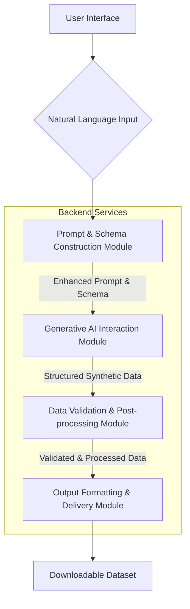
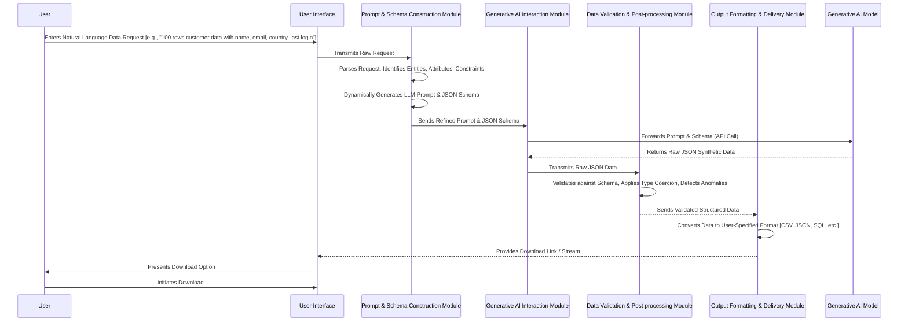
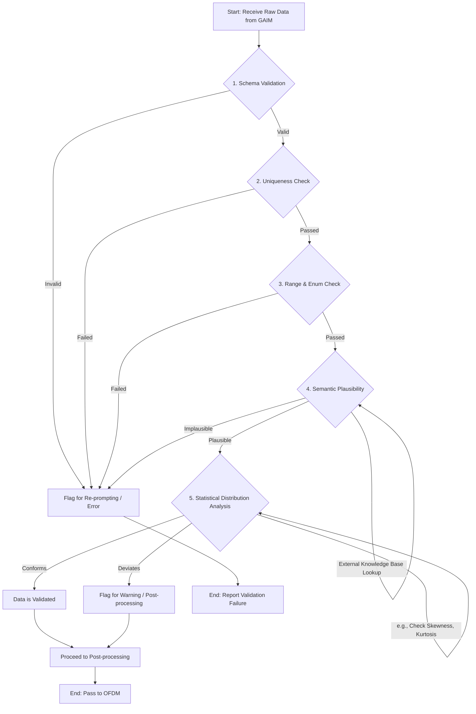
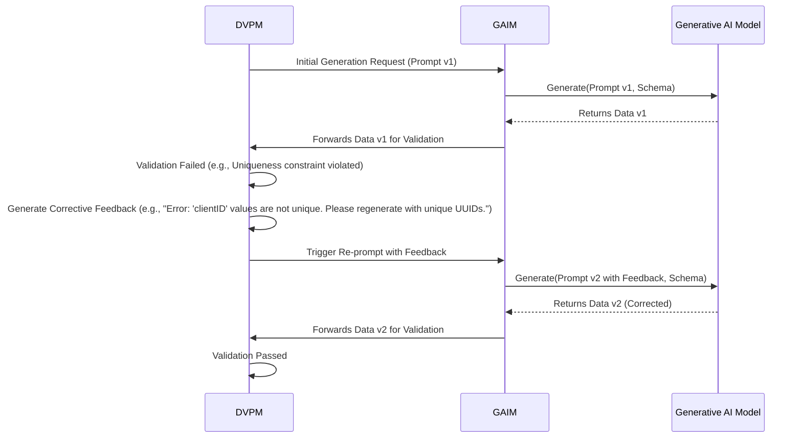
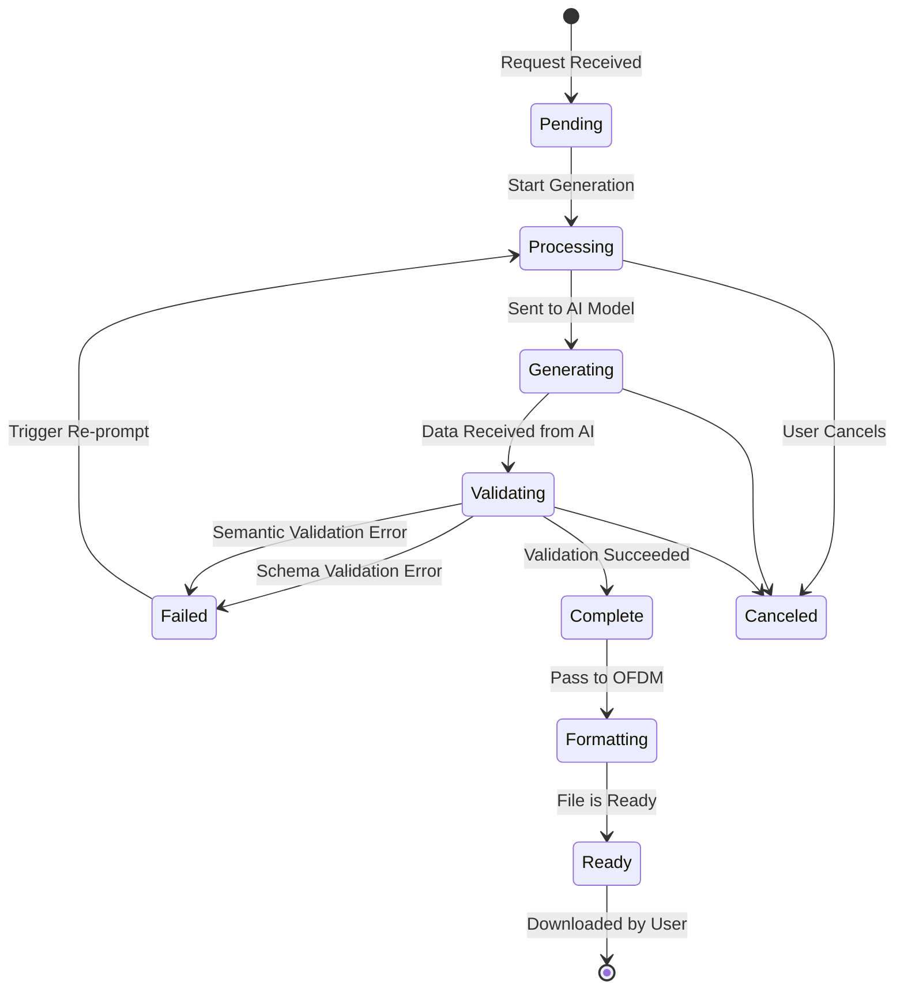
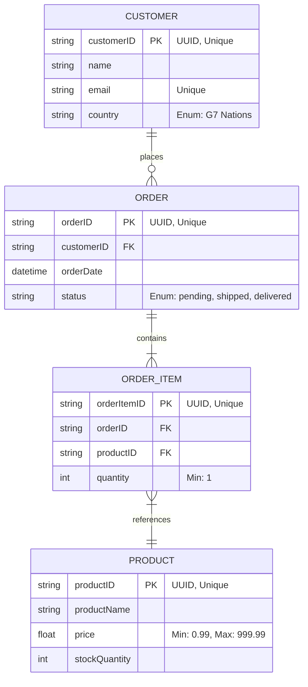

**Title of Invention:** System and Method for the Autonomous Synthesis of High-Fidelity Tabular Datasets Conditioned by Natural Language Directives and Formalized Structural Schemata

**Abstract:**
A highly sophisticated system for the autonomous generation of synthetic, structured tabular data is herein disclosed. This invention leverages advanced computational linguistics and generative artificial intelligence to translate a user's natural language desideratum into a meticulously constructed, statistically plausible dataset. The methodology encompasses receiving a natural language description, including desired column characteristics, data types, inter-columnar relationships, statistical distributions, and row cardinality. This comprehensive description is then processed by a sophisticated Natural Language Understanding (NLU) pipeline to construct a formalized prompt and a rigorous structured response schema (e.g., JSON Schema). These artifacts are subsequently transmitted to a highly performant generative AI model, which, informed by its vast parametric knowledge, synthesizes a plurality of data rows strictly adhering to both the semantic intent of the natural language directive and the syntactic constraints of the response schema. The generated structured data undergoes a multi-stage validation process, including schema conformance, statistical property analysis, and semantic plausibility checks, before being transformed into various user-specified formats. This invention provides an unparalleled, scalable, and on-demand solution for acquiring high-quality synthetic data, ensuring maximal utility and seamless integration into downstream applications for tasks such as software testing, machine learning model training, data augmentation, and complex analytical simulations.

**Background of the Invention:**
The contemporary landscape of software development, machine learning engineering, and data analytics is profoundly dependent upon access to vast quantities of high-quality, realistic data. The conventional paradigms for acquiring such data—manual creation, anonymization of sensitive production data, or rudimentary random data generation—are fraught with significant limitations. Manual data generation is an exceedingly labor-intensive, error-prone, and non-scalable endeavor, rendering it impractical for large-scale requirements and often failing to capture the subtle complexities of real-world distributions. The anonymization of real-world data, while necessary for privacy and compliance with regulations like GDPR and CCPA, frequently diminishes the intrinsic statistical properties and inter-feature correlations essential for robust model training and realistic system testing, a phenomenon known as the "privacy-utility trade-off." Furthermore, existing random data generation tools, while expedient for basic placeholders, fundamentally lack the nuanced realism, contextual plausibility, and specific data distribution characteristics (e.g., long-tail distributions, specific skewness, or kurtosis) often mandated by sophisticated applications. There exists a critical, unfulfilled demand for a highly intelligent, automated, and scalable system capable of generating synthetic data that not only adheres to explicit structural and type specifications but also implicitly captures the latent semantic and statistical relationships inherent in real-world data, thereby facilitating more effective and efficient developmental and analytical workflows. The present invention directly addresses these profound deficiencies by introducing a paradigm-shifting approach to synthetic data generation, bridging the gap between abstract user requirements and concrete, high-fidelity datasets.

**Brief Summary of the Invention:**
The present invention embodies a novel and highly advantageous system for the generation of synthetic datasets. At its core, the invention provides an intuitive user interface through which a user can articulate their precise data requirements using natural language, exemplified by directives such as: "I require 1000 records of enterprise client data, comprising a globally unique `clientID` (UUID format), a `companyName` exhibiting realistic regional variations, an `industry` field selected from a predefined taxonomy [e.g., 'Finance', 'Healthcare', 'Technology', 'Manufacturing'], an `annualRevenue` figure within a plausible range [e.g., $1M to $1B USD] with a slight positive skew, and a `creationDate` timestamp randomly distributed over the last two fiscal years." This detailed prompt is then dynamically processed by an intelligent backend service, which not only promulgates an optimized input for a large language model (LLM) but also rigorously constructs a corresponding JSON schema. This schema precisely dictates the expected data structure, types, and constraints, ensuring the LLM's output is not merely coherent but also strictly syntactically valid and machine-readable. The generative AI model, leveraging its extensive knowledge base and sophisticated inferential capabilities, processes this combined instruction set (natural language prompt + formal schema). Crucially, the AI's generation process extends beyond mere randomization; it infers and applies contextual plausibility, statistical distributions, and semantic coherence [e.g., generating company names appropriate for specified industries, or revenue figures consistent with enterprise scale]. The resultant structured data, typically in JSON format, is then subjected to validation, post-processing [e.g., type coercion, format conversion], and finally presented to the user as a downloadable file, thus providing an unparalleled mechanism for acquiring high-quality synthetic data on demand.

**Figures and Diagrams:**

To elucidate the architectural and operational methodologies of the present invention, the following conceptual diagrams are provided:


**Figure 1: High-Level System Architecture Overview.** This diagram illustrates the primary components and data flow within the synthetic data generation system, from user input to final output.


**Figure 2: Detailed Data Flow and Interaction Sequence.** This sequence diagram details the operational steps and inter-module communications from the user's initial request to the delivery of the synthetic dataset.

```mermaid
graph LR
    A[Natural Language Request] --> B{Parse & Extract Keywords};
    B --> C[Identify Desired Columns];
    C --> D[Infer Data Types & Formats];
    D --> E[Identify Constraints & Relationships];
    E --> F[Generate Core JSON Schema Structure];
    F --> G[Augment Schema with Specific JSON Schema Keywords [e.g., `pattern`, `minimum`, `enum`]];
    G --> H[Construct LLM-Specific Prompt [Role, Task, Format Guidance]];
    H -- Final Prompt & Schema --> I[Generative AI Model];
```
**Figure 3: Dynamic Prompt and Schema Generation Workflow.** This diagram illustrates the algorithmic steps undertaken by the Prompt & Schema Construction Module to convert a natural language request into a precise LLM prompt and a formal JSON schema.

```mermaid
graph TD
    subgraph Natural Language Understanding Pipeline
        A[Raw Text Input] --> B{Tokenization & Lemmatization};
        B --> C{Part-of-Speech Tagging};
        C --> D[Named Entity Recognition (NER)];
        D -- "e.g., 'clientID', 'annualRevenue'" --> E[Column Identification];
        D -- "e.g., 'UUID', 'integer', 'date'" --> F[Data Type Inference];
        D -- "e.g., '$1M to $1B', 'last 90 days'" --> G[Constraint Extraction];
        C --> H[Dependency Parsing];
        H --> I{Relation Extraction};
        I -- "e.g., 'if country is USA, currency is USD'" --> J[Inter-columnar Relationship Modeling];
    end
    subgraph Schema Synthesis
        E & F & G & J --> K[Structured Attribute List];
        K --> L{JSON Schema Generator};
        L --> M[Formal JSON Schema];
    end
```
**Figure 4: Detailed NLU Entity and Constraint Extraction Pipeline.** This flowchart breaks down the process within the PSCM for converting unstructured natural language into a structured list of attributes, which then seeds the JSON schema generation.


**Figure 5: Data Validation Module (DVPM) Logic Flow.** This diagram illustrates the multi-stage validation process applied to the AI-generated data, from basic schema conformance to advanced statistical and semantic checks.


**Figure 6: Iterative Refinement and Re-prompting Loop.** This sequence diagram shows the advanced error-handling mechanism where validation failures trigger a feedback loop to the generative AI for self-correction.


**Figure 7: State Transition Diagram for a Synthetic Data Request.** This diagram models the lifecycle of a data generation request as it moves through the various states within the system.

```mermaid
graph LR
    A[Validated Data (List of Dictionaries)] --> B{Output Format Router};
    B -- "CSV" --> C[CSV Formatter];
    C --> D[Generate Header from Keys];
    D --> E[Iterate Rows & Write to CSV Stream];
    E --> F[Output .csv File];

    B -- "JSON" --> G[JSON Formatter];
    G --> H[Serialize Data with Indentation];
    H --> I[Output .json File];
    
    B -- "SQL" --> J[SQL INSERT Formatter];
    J --> K[Infer Table Name & Column Types];
    K --> L[Generate `CREATE TABLE` Statement];
    L --> M[Generate `INSERT INTO` Statements per Row];
    M --> N[Output .sql File];

    B -- "XML" --> O[XML Formatter];
    O --> P[Create Root Element];
    P --> Q[Iterate Rows & Create Child Elements];
    Q --> R[Output .xml File];
```
**Figure 8: Output Formatting & Delivery Module (OFDM) Workflow.** This flowchart details how the validated data is converted into various user-specified file formats.

```mermaid
graph TD
    subgraph "User-Facing Services"
        A[Web UI / API Gateway]
    end

    subgraph "Core Backend Services"
        B[Orchestration Service]
        C[PSCM: Prompt & Schema Construction]
        D[GAIM: Generative AI Interaction]
        E[DVPM: Data Validation & Post-processing]
        F[OFDM: Output Formatting]
    end

    subgraph "External Dependencies"
        G[Generative AI Model API]
        H[External Knowledge Base (Optional)]
        I[Data Storage (e.g., S3 Bucket)]
    end

    A --> B
    B --> C
    C --> B
    B --> D
    D --> G
    G --> D
    D --> B
    B --> E
    E -- "Uses" --> H
    E --> B
    B --> F
    F --> I
    A -- "Download Link" --> I
```
**Figure 9: System Component Interaction Diagram.** This C4-inspired diagram shows the high-level components of the backend system and their primary interaction pathways, including external dependencies.


**Figure 10: Inferred Relational Schema for Multi-Table Generation.** This ER diagram illustrates an advanced capability where the system infers relationships from a natural language prompt (e.g., "Generate customer, product, and order data with referential integrity") and structures the generation task accordingly.

**Detailed Description of the Invention:**

The present invention, herein referred to as the "Cognitive Data Synthesizer" (CDS), operates as a multi-component, intelligent system designed for the automated creation of high-fidelity synthetic datasets. The operational workflow is meticulously designed to ensure both flexibility in input and rigor in output.

**I. User Interaction and Input Reception:**
A user initiates the synthetic data generation process by accessing a dedicated interface, which may be a web application, a desktop client, or an API endpoint. Through this interface, the user provides a natural language description. This description is not merely a keyword list but a semantically rich statement detailing:
*   **Desired Row Count:** The cardinality of the output dataset.
*   **Column Specifications:** Names, intended data types [e.g., `string`, `integer`, `float`, `date`, `boolean`], and desired formats [e.g., "UUID," "email," "currency," "YYYY-MM-DD"].
*   **Semantic Content:** The conceptual nature of the data [e.g., "customer data," "transaction logs," "employee records"].
*   **Constraints and Distributions:** Specific ranges for numerical data, enumerations for categorical data, temporal bounds for dates, and even descriptive statistical properties [e.g., "normally distributed," "positively skewed," "unique values"].
*   **Inter-columnar Relationships:** Implicit or explicit correlations between columns [e.g., "if `country` is 'USA', then `currency` should be 'USD'].
*   **Output Format Preference:** The desired file format for the generated data [e.g., CSV, JSON, XML, SQL INSERT statements].
*   **Multi-table Desiderata:** For advanced use cases, specifying multiple related tables and their primary/foreign key relationships.

**II. Prompt and Schema Construction Module (PSCM):**
Upon receiving the user's natural language request, the PSCM, a critical innovation of the CDS, commences a multi-stage process:

1.  **Natural Language Understanding (NLU) and Entity Extraction:** Advanced NLU techniques, potentially incorporating neural network models trained on schema-text pairs, are employed to parse the raw natural language input. This process identifies key entities such as column names, data types, numerical constraints, categorical options, and quantity requirements. For example, "100 rows of customer data with a realistic name, a unique email address, a country from a list of G7 nations, and a last login date within the last 90 days" is decomposed into:
    *   `num_rows`: 100
    *   `dataset_type`: "customer data"
    *   `columns`: `name` (realistic string), `email` (unique string, email format), `country` (string, enum: G7 nations), `lastLogin` (date string, within last 90 days).
    This pipeline involves tokenization, lemmatization, part-of-speech tagging, named entity recognition (NER), and relation extraction to build a structured representation of the user's request (as shown in Figure 4).

2.  **Dynamic JSON Schema Generation:** Based on the extracted information, the PSCM constructs a precise JSON schema. This schema serves as a formal contract between the CDS and the generative AI model, ensuring structural integrity and type conformance. The schema is highly dynamic and can incorporate various JSON Schema keywords:
    *   `type`: [e.g., `string`, `integer`, `number`, `boolean`, `array`, `object`]
    *   `properties`: Defines the structure of each object (row).
    *   `items`: For array types, defining the structure of individual elements.
    *   `enum`: For categorical data [e.g., G7 nations].
    *   `pattern`: For regular expression-based validation [e.g., email format, UUID].
    *   `minimum`, `maximum`: For numerical ranges.
    *   `minLength`, `maxLength`: For string lengths.
    *   `format`: Suggests specific data formats [e.g., `date-time`, `email`, `uuid`].
    *   `required`: Specifies mandatory fields.

    *Example Schema Construction [from the brief summary]:*
    ```json
    {
      "type": "object",
      "properties": {
        "clientRecords": {
          "type": "array",
          "description": "An array of enterprise client records.",
          "items": {
            "type": "object",
            "properties": {
              "clientID": {
                "type": "string",
                "format": "uuid",
                "description": "A globally unique identifier for the client, in UUID format."
              },
              "companyName": {
                "type": "string",
                "description": "The name of the company, reflecting realistic regional variations."
              },
              "industry": {
                "type": "string",
                "enum": ["Finance", "Healthcare", "Technology", "Manufacturing", "Retail", "Energy"],
                "description": "The industry sector of the client."
              },
              "annualRevenue": {
                "type": "number",
                "minimum": 1000000,
                "maximum": 1000000000,
                "description": "Annual revenue in USD, between $1M and $1B, with a slight positive skew."
              },
              "creationDate": {
                "type": "string",
                "format": "date",
                "description": "The date the client record was created, distributed over the last two fiscal years."
              }
            },
            "required": ["clientID", "companyName", "industry", "annualRevenue", "creationDate"]
          }
        }
      },
      "required": ["clientRecords"]
    }
    ```

3.  **Refined Prompt Formulation:** Concurrently, the PSCM augments the original natural language request into a highly optimized prompt tailored for the generative AI model. This refined prompt explicitly instructs the AI on its role, the task, the number of desired rows, and crucially, directs it to generate data *strictly conforming* to the dynamically generated JSON schema. It may include specific examples or few-shot learning instances to guide the AI's output distribution.

    *Example Refined Prompt:*
    ```
    "You are an expert synthetic data generation engine, specializing in producing highly realistic and contextually accurate structured datasets. Your task is to generate exactly 100 instances of enterprise client records. Each record must strictly adhere to the provided JSON schema. Pay particular attention to:
    1. Generating 'companyName' values that are plausible and geographically diverse.
    2. Ensuring 'annualRevenue' figures reflect the specified range and distribution, implying larger, established companies.
    3. Distributing 'creationDate' values across the last two full fiscal years.
    Your output MUST be a valid JSON object matching the provided schema, containing an array of these client records."
    ```

**III. Generative AI Interaction Module (GAIM):**
This module is responsible for orchestrating the communication with the underlying generative AI model [e.g., Google's Gemini, OpenAI's GPT series, or similar advanced foundation models].
1.  **API Call Construction:** The GAIM constructs an API request incorporating the refined prompt and the JSON schema. Modern generative AI APIs often support a `response_schema` or `function_call` parameter, which profoundly enhances the reliability of structured output.
2.  **Asynchronous Generation:** To handle potentially long generation times for large datasets and ensure system responsiveness, the GAIM employs asynchronous communication patterns with the AI model. This allows the system to manage multiple concurrent requests efficiently without blocking.
3.  **Response Handling:** Upon receiving the AI's response, which is expected to be a JSON string, the GAIM performs initial parsing to confirm it is well-formed JSON before passing it to the next stage. It also handles API-level errors like rate limiting or timeouts with appropriate retry logic.

**IV. Data Validation and Post-processing Module (DVPM):**
The DVPM is crucial for guaranteeing the quality and usability of the AI-generated data. While generative AI models are powerful, an additional layer of validation and refinement is indispensable.
1.  **Schema Validation:** The generated JSON data is rigorously validated against the original JSON schema. This ensures all types, formats, ranges, and enumerations are correctly respected. Any discrepancies are flagged, and potentially corrected or reported.
2.  **Semantic Consistency Checks:** Beyond structural validation, the DVPM can perform checks for semantic consistency. For instance, if a column for `City` and `Country` exists, it might verify if the generated `City` realistically belongs to the `Country`. This may involve external knowledge bases or trained models.
3.  **Statistical Property Verification:** The module can analyze the generated data to assess if implied statistical properties [e.g., "positively skewed," "unique values"] are sufficiently met. This might involve calculating basic statistics, distribution fitting, or uniqueness checks.
4.  **Data Enhancement and Transformation:** In some cases, the AI might generate data in a slightly generalized format. The DVPM can apply further transformations, such as converting `date` strings to specific `datetime` objects, generating derived columns, or encoding categorical data.
5.  **Error Handling and Re-prompting [Optional but Advanced]:** If validation fails significantly, the DVPM can trigger a re-prompting mechanism, providing feedback to the generative AI model on specific validation failures, thereby iteratively improving the dataset quality, as illustrated in Figure 6.

**V. Output Formatting and Delivery Module (OFDM):**
The final validated and processed structured data is then prepared for user consumption.
1.  **Format Conversion:** Based on the user's initial preference, the OFDM converts the internal structured representation [e.g., Python dictionaries or Pydantic models] into the desired output format. Supported formats include:
    *   **CSV (Comma Separated Values):** The most common tabular data format.
    *   **JSON (JavaScript Object Notation):** Ideal for hierarchical or complex data structures.
    *   **XML (Extensible Markup Language):** For applications requiring XML-based data.
    *   **SQL INSERT Statements:** For direct insertion into relational databases.
    *   **Parquet/ORC:** Optimized columnar formats for big data analytics.
2.  **File Packaging and Delivery:** The formatted data is packaged into a downloadable file. The system provides a secure, time-limited link or directly streams the file to the user's interface. For very large datasets, delivery may be facilitated through cloud storage buckets (e.g., Amazon S3, Google Cloud Storage).

**VI. Advanced Generation Capabilities:**
The CDS architecture is extensible to support highly complex data generation scenarios:
*   **Multi-Table Relational Data:** The system can parse requests for multiple related tables (e.g., "customers," "orders," "products"), infer primary and foreign key relationships, and generate consistent datasets that maintain referential integrity (see Figure 10).
*   **Time-Series Data:** The system can generate sequential data by understanding temporal constraints, trends, seasonality, and autocorrelation specified in the natural language prompt.
*   **Geospatial Data:** Generation of plausible geographic coordinates (latitude, longitude), addresses, and Points of Interest (POIs) that are consistent with specified regions.

**Conceptual Code (Python Backend):**

The following illustrative code provides a conceptual embodiment of key components of the Cognitive Data Synthesizer within a Python environment. It demonstrates the integration of an advanced generative AI model with dynamic schema generation, validation, and flexible output formatting.

```python
import json
import uuid
import datetime
import logging
import re
import jsonschema
import csv
import io
from xml.etree import ElementTree as ET
from xml.dom import minidom
from typing import Dict, Any, List, Literal, Optional, Callable
from pydantic import BaseModel, Field, ValidationError, Extra
from google.generativeai import GenerativeModel
from google.generativeai.types import GenerationConfig

# Configure logging for detailed operational insights
logging.basicConfig(level=logging.INFO, format='%(asctime)s - %(levelname)s - %(message)s')
logger = logging.getLogger(__name__)

# --- Core Data Models and Utilities ---

class ColumnDefinition(BaseModel):
    """
    Represents a detailed specification for a single column in the synthetic dataset.
    """
    name: str = Field(..., description="The name of the column.")
    data_type: Literal["string", "integer", "float", "boolean", "date", "datetime", "uuid"] = Field(..., description="The fundamental data type of the column.")
    format_hint: Optional[str] = Field(None, description="Specific format hint (e.g., 'email', 'currency', 'YYYY-MM-DD').")
    min_value: Optional[Any] = Field(None, description="Minimum value for numerical or date types.")
    max_value: Optional[Any] = Field(None, description="Maximum value for numerical or date types.")
    enum_values: Optional[List[str]] = Field(None, description="List of allowed categorical values.")
    unique: bool = Field(False, description="Whether values in this column should be unique across rows.")
    description: Optional[str] = Field(None, description="A natural language description for the column's content.")
    distribution_hint: Optional[str] = Field(None, description="Hint about desired statistical distribution (e.g., 'normal', 'skewed', 'uniform').")

    class Config:
        extra = Extra.forbid # Ensure strict adherence to defined fields

class SyntheticDataRequest(BaseModel):
    """
    Encapsulates the full user request for synthetic data.
    """
    natural_language_description: str = Field(..., description="The user's natural language request for the dataset.")
    num_rows: int = Field(..., gt=0, description="The desired number of rows in the synthetic dataset.")
    output_format: Literal["csv", "json", "xml", "sql_insert"] = Field("json", description="The desired output file format.")
    dataset_name: str = Field("synthetic_dataset", description="A base name for the generated dataset.")

    class Config:
        extra = Extra.forbid

# --- Module: Output Formatting (OFDM) ---

class DataFormatter:
    """Handles the conversion of processed data into various output formats."""
    
    def format_to_csv(self, records: List[Dict[str, Any]], dataset_name: str) -> str:
        """Formats data into a CSV string."""
        if not records:
            return ""
        output = io.StringIO()
        writer = csv.DictWriter(output, fieldnames=records[0].keys())
        writer.writeheader()
        writer.writerows(records)
        return output.getvalue()

    def format_to_json(self, records: List[Dict[str, Any]], dataset_name: str) -> str:
        """Formats data into a JSON string."""
        return json.dumps({dataset_name: records}, indent=2)

    def format_to_xml(self, records: List[Dict[str, Any]], dataset_name: str) -> str:
        """Formats data into an XML string."""
        root = ET.Element(dataset_name)
        for record in records:
            record_elem = ET.SubElement(root, "record")
            for key, val in record.items():
                child = ET.SubElement(record_elem, key)
                child.text = str(val)
        
        # Pretty print the XML
        rough_string = ET.tostring(root, 'utf-8')
        reparsed = minidom.parseString(rough_string)
        return reparsed.toprettyxml(indent="  ")

    def format_to_sql_insert(self, records: List[Dict[str, Any]], table_name: str) -> str:
        """Formats data into SQL INSERT statements."""
        if not records:
            return f"-- No records to generate SQL for table {table_name}.\n"
        
        columns = records[0].keys()
        col_str = ", ".join(f"`{col}`" for col in columns)
        
        # Generate a simple CREATE TABLE statement (inferred types)
        create_statements = [f"CREATE TABLE `{table_name}` ("]
        for col, val in records[0].items():
            sql_type = "VARCHAR(255)"
            if isinstance(val, int): sql_type = "INT"
            elif isinstance(val, float): sql_type = "FLOAT"
            elif isinstance(val, bool): sql_type = "BOOLEAN"
            elif re.match(r'\d{4}-\d{2}-\d{2}$', str(val)): sql_type = "DATE"
            elif re.match(r'\d{4}-\d{2}-\d{2}T\d{2}:\d{2}:\d{2}', str(val)): sql_type = "DATETIME"
            create_statements.append(f"  `{col}` {sql_type},")
        create_statements.append(f");\n")
        
        sql = "\n".join(create_statements)
        
        # Generate INSERT statements
        for record in records:
            values = []
            for val in record.values():
                if val is None:
                    values.append("NULL")
                elif isinstance(val, (int, float, bool)):
                    values.append(str(val))
                else: # strings, dates, etc.
                    escaped_val = str(val).replace("'", "''")
                    values.append(f"'{escaped_val}'")
            val_str = ", ".join(values)
            sql += f"INSERT INTO `{table_name}` ({col_str}) VALUES ({val_str});\n"
        return sql

# --- Module: Prompt & Schema Construction (PSCM) ---

class SchemaGenerator:
    """
    A sophisticated component responsible for dynamically inferring and constructing
    a JSON Schema and an optimized LLM prompt from a natural language request.
    This component uses advanced NLP techniques (conceptually represented here).
    """

    def __init__(self, nlu_model: Any = None):
        """
        Initializes the SchemaGenerator with an optional NLU model.
        In a real-world scenario, nlu_model would be a pre-trained model
        capable of parsing complex natural language into structured ColumnDefinitions.
        """
        self.nlu_model = nlu_model # Placeholder for a complex NLU pipeline

    async def _infer_column_definitions(self, nl_description: str) -> List[ColumnDefinition]:
        """
        [Conceptual Method] Infers column definitions from natural language.
        This would involve sophisticated NLP, entity recognition, and constraint extraction.
        For this conceptual code, we simulate this with a simplified heuristic.
        """
        logger.info(f"Inferring column definitions from: '{nl_description}'")
        # In a production system, this would involve a sophisticated NLU pipeline
        # potentially using another LLM or a fine-tuned model to extract structured data.

        # Simplified heuristic for demonstration:
        # We assume a pattern like "X rows of Y data with A, B, C..."
        # and attempt to infer types based on keywords.
        inferred_columns: List[ColumnDefinition] = []
        lower_desc = nl_description.lower()

        if "customer data" in lower_desc or "user data" in lower_desc:
            inferred_columns.append(ColumnDefinition(name="fullName", data_type="string", description="Realistic full name."))
            inferred_columns.append(ColumnDefinition(name="email", data_type="string", format_hint="email", unique=True, description="Unique email address."))
            if "country from list of g7 nations" in lower_desc or "g7 nations" in lower_desc:
                g7_nations = ["Canada", "France", "Germany", "Italy", "Japan", "United Kingdom", "United States"]
                inferred_columns.append(ColumnDefinition(name="country", data_type="string", enum_values=g7_nations, description="Country from G7 nations."))
            else:
                inferred_columns.append(ColumnDefinition(name="country", data_type="string", description="Realistic country name."))
            if "last login date within the last 90 days" in lower_desc:
                ninety_days_ago = datetime.date.today() - datetime.timedelta(days=90)
                inferred_columns.append(ColumnDefinition(name="lastLogin", data_type="date", format_hint="YYYY-MM-DD", min_value=ninety_days_ago.isoformat(), description="Last login date within 90 days."))
            else:
                inferred_columns.append(ColumnDefinition(name="registrationDate", data_type="date", format_hint="YYYY-MM-DD", description="User registration date."))

        elif "product data" in lower_desc:
            inferred_columns.append(ColumnDefinition(name="productID", data_type="uuid", unique=True, description="Unique product identifier."))
            inferred_columns.append(ColumnDefinition(name="productName", data_type="string", description="Name of the product."))
            inferred_columns.append(ColumnDefinition(name="price", data_type="float", min_value=0.99, max_value=999.99, description="Product price."))
            inferred_columns.append(ColumnDefinition(name="inStock", data_type="boolean", description="Whether the product is currently in stock."))
        else:
            # Fallback for generic data, or if no specific domain recognized
            inferred_columns.append(ColumnDefinition(name="id", data_type="integer", unique=True, min_value=1))
            inferred_columns.append(ColumnDefinition(name="description", data_type="string"))


        # Additional logic to handle explicit column definitions if present
        # e.g., "column 'age' as integer between 18 and 65"
        # This part requires more advanced parsing.

        if not inferred_columns:
            # Default minimal columns if nothing is inferred
            inferred_columns.append(ColumnDefinition(name="generic_id", data_type="integer", unique=True, min_value=1, description="A generic identifier."))
            inferred_columns.append(ColumnDefinition(name="generic_value", data_type="string", description="A generic textual value."))

        logger.info(f"Inferred {len(inferred_columns)} columns.")
        return inferred_columns


    def generate_json_schema(self, column_definitions: List[ColumnDefinition], dataset_name: str) -> Dict[str, Any]:
        """
        Constructs a JSON Schema definition based on the inferred column definitions.
        """
        properties: Dict[str, Any] = {}
        required_fields: List[str] = []

        for col in column_definitions:
            col_schema: Dict[str, Any] = {"description": col.description or f"A synthetic value for {col.name}."}
            
            # JSON Schema 'type' mapping
            if col.data_type == "string":
                col_schema["type"] = "string"
                if col.format_hint:
                    if col.format_hint in ["email", "uuid", "date", "date-time"]: # Standard JSON Schema formats
                        col_schema["format"] = col.format_hint
                    elif col.format_hint.startswith("YYYY-MM-DD"):
                        col_schema["format"] = "date" # Use generic date format
                    else: # Custom patterns, assuming format_hint can be a regex or simple string
                        col_schema["pattern"] = col.format_hint 
                if col.enum_values:
                    col_schema["enum"] = col.enum_values
            elif col.data_type == "integer":
                col_schema["type"] = "integer"
                if col.min_value is not None:
                    col_schema["minimum"] = col.min_value
                if col.max_value is not None:
                    col_schema["maximum"] = col.max_value
            elif col.data_type == "float":
                col_schema["type"] = "number" # JSON Schema uses 'number' for floats/doubles
                if col.min_value is not None:
                    col_schema["minimum"] = col.min_value
                if col.max_value is not None:
                    col_schema["maximum"] = col.max_value
            elif col.data_type == "boolean":
                col_schema["type"] = "boolean"
            elif col.data_type == "date":
                col_schema["type"] = "string"
                col_schema["format"] = "date"
                # Note: JSON Schema draft-07 doesn't have min/max for format:date. This relies on LLM interpretation.
            elif col.data_type == "datetime":
                col_schema["type"] = "string"
                col_schema["format"] = "date-time"
            elif col.data_type == "uuid":
                col_schema["type"] = "string"
                col_schema["format"] = "uuid"

            properties[col.name] = col_schema
            required_fields.append(col.name) # Assume all inferred fields are required by default

        # The top-level schema defining an array of objects
        return {
            "$schema": "http://json-schema.org/draft-07/schema#", # Add schema draft version
            "type": "object",
            "properties": {
                dataset_name: {
                    "type": "array",
                    "description": f"An array of {dataset_name} records.",
                    "items": {
                        "type": "object",
                        "properties": properties,
                        "required": required_fields,
                        "additionalProperties": False # Be strict about properties
                    }
                }
            },
            "required": [dataset_name],
            "description": f"Schema for generating {dataset_name} based on user request."
        }


    def generate_llm_prompt(self, request: SyntheticDataRequest, column_definitions: List[ColumnDefinition], json_schema: Dict[str, Any]) -> str:
        """
        Generates an optimized prompt for the LLM.
        """
        column_details = "\n".join([
            f"- '{col.name}' ({col.data_type}): {col.description or 'A value for this column.'} "
            f"{f'[Format: {col.format_hint}]' if col.format_hint else ''} "
            f"{f'[Values: {', '.join(col.enum_values)}]' if col.enum_values else ''} "
            f"{f'[Min: {col.min_value}]' if col.min_value is not None else ''} "
            f"{f'[Max: {col.max_value}]' if col.max_value is not None else ''} "
            f"{f'[Unique]' if col.unique else ''} "
            f"{f'[Distribution: {col.distribution_hint}]' if col.distribution_hint else ''}"
            for col in column_definitions
        ])

        # Construct a highly detailed and directive prompt
        full_prompt = f"""
        You are an advanced, highly precise generative AI for synthetic data creation. Your primary objective is to produce structured tabular data that is both syntactically correct according to a provided JSON schema AND semantically plausible, reflecting real-world statistical properties and contextual coherence.

        **Task Directive:**
        Generate exactly {request.num_rows} realistic data rows. The dataset is conceptualized as '{request.dataset_name}'.

        **User Request Summary:**
        The user's original natural language request was: "{request.natural_language_description}"

        **Data Specifications (Inferred Columns and Constraints):**
        Here are the specific characteristics for each column, derived from the user's request. Adhere to these details to ensure high fidelity and contextual relevance:
        {column_details}

        **Strict Output Format Requirement:**
        Your output MUST be a valid JSON object. This JSON object MUST conform precisely to the following JSON Schema. Any deviation in structure, data type, or specified constraints will be considered a critical failure.
        The top-level object MUST contain a key '{request.dataset_name}' which is an array of generated data objects.

        **Adherence Directives:**
        - Ensure all generated values are contextually realistic and plausible. For example, names should look like real names, emails like real emails, dates within specified ranges.
        - For categorical fields with `enum_values`, strictly select from the provided list.
        - For numerical fields with `min_value` and `max_value`, ensure values are within these bounds and, if a `distribution_hint` is given (e.g., 'skewed', 'normal'), attempt to reflect that.
        - For string fields with `format_hint` (e.g., 'email', 'uuid'), ensure the generated string matches that format.
        - For fields marked `unique`, ensure no duplicate values appear across the {request.num_rows} generated rows.

        **JSON Schema to Adhere To:**
        ```json
        {json.dumps(json_schema, indent=2)}
        ```

        **Commence Generation:**
        Please provide the JSON output now. Do not include any conversational text or explanations outside the JSON block.
        """
        return full_prompt

    async def generate_prompt_and_schema(self, request: SyntheticDataRequest) -> tuple[str, Dict[str, Any], List[ColumnDefinition]]:
        """
        Orchestrates the generation of both the LLM prompt and the JSON schema.
        """
        column_definitions = await self._infer_column_definitions(request.natural_language_description)
        json_schema = self.generate_json_schema(column_definitions, request.dataset_name)
        llm_prompt = self.generate_llm_prompt(request, column_definitions, json_schema)
        return llm_prompt, json_schema, column_definitions

# --- Module: Data Validation & Post-processing (DVPM) ---

class DataValidator:
    """
    Validates AI-generated data against the JSON schema and performs additional
    semantic and statistical checks.
    """
    def __init__(self, json_schema: Dict[str, Any]):
        self.json_schema = json_schema
        # Compile the JSON schema for efficient validation
        try:
            self.validator = jsonschema.Draft7Validator(self.json_schema)
        except jsonschema.exceptions.SchemaError as e:
            logger.error(f"Invalid JSON schema provided to DataValidator: {e}")
            raise ValueError("Invalid JSON schema for validation.")

    def validate(self, generated_data_envelope: Dict[str, Any], column_definitions: List[ColumnDefinition], dataset_name: str) -> bool:
        """
        Performs validation of the generated data.
        Returns True if valid, False otherwise. Logs detailed errors.
        """
        logger.info("Starting data validation...")
        is_valid = True
        
        # 1. JSON Schema validation
        errors = sorted(self.validator.iter_errors(generated_data_envelope), key=str)
        if errors:
            for error in errors:
                logger.error(f"Schema Validation Error: {error.message} (Path: {'/'.join(map(str, error.path))})")
            return False

        records = generated_data_envelope.get(dataset_name, [])
        
        # 2. Semantic and statistical checks
        # Uniqueness checks
        for col_def in column_definitions:
            if col_def.unique:
                if not records or col_def.name not in records[0]:
                    logger.warning(f"Uniqueness check skipped for '{col_def.name}': Column not found.")
                    continue
                values = [r.get(col_def.name) for r in records]
                if len(values) != len(set(values)):
                    logger.error(f"Semantic Validation Error: Column '{col_def.name}' expected unique values, but duplicates were found.")
                    is_valid = False

        # Date range checks
        for i, record in enumerate(records):
            for col_def in column_definitions:
                if col_def.data_type == "date" and col_def.name in record:
                    try:
                        date_obj = datetime.date.fromisoformat(record[col_def.name])
                        if col_def.min_value and date_obj < datetime.date.fromisoformat(col_def.min_value):
                             logger.error(f"Semantic Validation Error: Record {i}, column '{col_def.name}' date {record[col_def.name]} is before min date {col_def.min_value}.")
                             is_valid = False
                        if col_def.max_value and date_obj > datetime.date.fromisoformat(col_def.max_value):
                             logger.error(f"Semantic Validation Error: Record {i}, column '{col_def.name}' date {record[col_def.name]} is after max date {col_def.max_value}.")
                             is_valid = False
                    except (ValueError, TypeError):
                        logger.error(f"Semantic Validation Error: Record {i}, column '{col_def.name}' value '{record[col_def.name]}' is not a valid date format.")
                        is_valid = False

        logger.info(f"Data validation complete. Is valid: {is_valid}")
        return is_valid

    def post_process_data(self, generated_data_envelope: Dict[str, Any], column_definitions: List[ColumnDefinition], dataset_name: str) -> List[Dict[str, Any]]:
        """
        Applies type coercion and minor enhancements to the validated data.
        Returns a list of processed records.
        """
        logger.info("Starting data post-processing...")
        records = generated_data_envelope.get(dataset_name, [])
        processed_records: List[Dict[str, Any]] = []

        for record in records:
            processed_record = {}
            for col_def in column_definitions:
                col_name = col_def.name
                col_value = record.get(col_name)

                if col_value is None:
                    processed_record[col_name] = None
                    continue

                if col_def.data_type == "float" and isinstance(col_value, int):
                    processed_record[col_name] = float(col_value)
                else:
                    processed_record[col_name] = col_value
            processed_records.append(processed_record)
        logger.info("Data post-processing complete.")
        return processed_records

# --- Top-Level Service Orchestrator ---

class SyntheticDatasetService:
    """
    Orchestrates the entire process of generating synthetic datasets.
    """
    def __init__(self, generative_model_name: str = 'gemini-1.5-flash'):
        self.model = GenerativeModel(generative_model_name)
        self.schema_generator = SchemaGenerator()
        self.data_formatter = DataFormatter()
        logger.info(f"SyntheticDatasetService initialized with generative model: {generative_model_name}")

    async def generate_synthetic_data(self, request: SyntheticDataRequest, max_retries: int = 2) -> str:
        """
        Main public method to generate synthetic data based on a user request.
        """
        logger.info(f"Received request: {request.json()}")
        
        for attempt in range(max_retries + 1):
            logger.info(f"Generation attempt {attempt + 1}/{max_retries + 1}")
            try:
                # 1. Generate LLM Prompt and JSON Schema
                llm_prompt, json_schema, column_definitions = await self.schema_generator.generate_prompt_and_schema(request)
                
                # 2. Interact with Generative AI Model
                generation_config = GenerationConfig(response_mime_type="application/json")
                response = await self.model.generate_content_async([llm_prompt, f"JSON Schema:\n{json.dumps(json_schema)}"], generation_config=generation_config)
                raw_generated_data = json.loads(response.text)
                
                # 3. Validate Generated Data
                data_validator = DataValidator(json_schema=json_schema)
                if data_validator.validate(raw_generated_data, column_definitions, request.dataset_name):
                    # 4. Post-process the data
                    processed_records = data_validator.post_process_data(raw_generated_data, column_definitions, request.dataset_name)
                    
                    # 5. Format and Deliver Output
                    formatter_method = getattr(self.data_formatter, f"format_to_{request.output_format}", self.data_formatter.format_to_json)
                    formatted_data = formatter_method(processed_records, request.dataset_name)
                    logger.info(f"Successfully generated and formatted data to {request.output_format}.")
                    return formatted_data
                else:
                    logger.warning(f"Attempt {attempt + 1} failed validation. Retrying if possible.")
                    if attempt == max_retries:
                         raise ValueError("Generated data failed validation after multiple retries.")

            except json.JSONDecodeError as e:
                logger.error(f"Generative AI returned invalid JSON on attempt {attempt+1}: {response.text[:200]}... Error: {e}")
                if attempt == max_retries: raise RuntimeError("Generative AI output was not valid JSON after multiple retries.")
            except Exception as e:
                logger.error(f"An unexpected error occurred on attempt {attempt+1}: {e}", exc_info=True)
                if attempt == max_retries: raise

        raise RuntimeError("Failed to generate data after all retries.")

# Export the top-level service class for use in other modules
__all__ = ["SyntheticDataRequest", "SyntheticDatasetService", "ColumnDefinition", "DataFormatter"]

```

**Claims:**

The present invention articulates a series of innovative claims establishing clear ownership over the methodologies and systems described herein.

1.  A system for the autonomous generation of synthetic tabular datasets, comprising:
    a.  A **User Interface Module** configured to receive a natural language description from a user, said description specifying a desired dataset, including column attributes, data types, and row cardinality;
    b.  A **Prompt and Schema Construction Module (PSCM)** communicatively coupled to the User Interface Module, configured to:
        i.   Parse the natural language description utilizing Natural Language Understanding (NLU) techniques to extract semantic entities and constraints;
        ii.  Dynamically generate a formal JSON schema rigorously defining the structural and data type requirements for the desired dataset, incorporating properties such as `type`, `format`, `enum`, `minimum`, `maximum`, and `pattern`; and
        iii. Formulate an optimized textual prompt for a generative artificial intelligence (AI) model, said prompt explicitly instructing the AI model to generate data conforming to both the semantic intent of the natural language description and the syntactic strictures of the generated JSON schema;
    c.  A **Generative AI Interaction Module (GAIM)** communicatively coupled to the PSCM, configured to:
        i.   Transmit the optimized textual prompt and the generated JSON schema to a generative AI model; and
        ii.  Receive a structured output from the generative AI model, said output comprising a plurality of synthetic data rows in a machine-readable format, wherein the generation process is guided by the AI model's learned world knowledge and conditioned by the provided schema;
    d.  A **Data Validation and Post-processing Module (DVPM)** communicatively coupled to the GAIM, configured to:
        i.   Rigorously validate the received synthetic data against the generated JSON schema for structural and type conformance;
        ii.  Perform semantic consistency checks and statistical property verification on the generated data; and
        iii. Optionally, apply data transformations or trigger re-prompting mechanisms based on validation outcomes;
    e.  An **Output Formatting and Delivery Module (OFDM)** communicatively coupled to the DVPM, configured to:
        i.   Convert the validated synthetic data into a user-specified output format, selected from a plurality of formats including CSV, JSON, XML, or SQL INSERT statements; and
        ii.  Provide the formatted synthetic dataset to the user for download or streaming.

2.  The system of Claim 1, wherein the natural language description further comprises explicit desiderata for inter-columnar relationships, statistical distributions [e.g., skewness, uniformity], and uniqueness constraints, and wherein the PSCM is further configured to incorporate these desiderata into the JSON schema and the optimized textual prompt.

3.  A method for generating synthetic data, comprising:
    a.  Receiving, by a computational system, a natural language description of a desired dataset from a user;
    b.  Analyzing, by a Natural Language Understanding component, the natural language description to extract column definitions, data types, constraints, and relational properties;
    c.  Dynamically constructing, by a schema generation component, a formal structured response schema (e.g., JSON Schema) based on the extracted information, said schema defining the precise syntactic and type requirements for the generated data;
    d.  Formulating, by a prompt engineering component, a refined natural language prompt for a generative artificial intelligence (AI) model, wherein said prompt integrates the original user description, the extracted parameters, and explicit instructions to adhere to the dynamically constructed schema;
    e.  Transmitting, by an AI interaction interface, the refined prompt and the structured response schema to a generative AI model;
    f.  Receiving, from the generative AI model, a plurality of synthetic data rows in a structured format, wherein the generative AI model utilizes its extensive parametric knowledge to synthesize data that is both semantically plausible and syntactically compliant with the provided schema;
    g.  Validating, by a data quality assurance component, the received synthetic data against the structured response schema and further against predefined semantic and statistical criteria; and
    h.  Presenting, by a data delivery component, the validated synthetic data to the user in a chosen format.

4.  The method of Claim 3, wherein the dynamic construction of the JSON schema includes inferring and applying JSON Schema keywords such as `pattern` for regular expression matching, `format` for recognized data formats, `enum` for discrete value sets, `minimum` and `maximum` for numerical ranges, and `uniqueItems` for uniqueness constraints.

5.  The system of Claim 1 or the method of Claim 3, further comprising a feedback mechanism wherein, upon detection of validation failures by the DVPM, a correctional prompt is generated and transmitted to the generative AI model for iterative refinement of the synthetic data.

6.  A computer-readable medium storing instructions that, when executed by one or more processors, cause the one or more processors to perform the method of Claim 3.

7.  The system of Claim 1, wherein the PSCM's NLU techniques comprise a pipeline of tokenization, named entity recognition (NER), dependency parsing, and relation extraction to identify not only column specifications but also complex, multi-column constraints and statistical distribution hints from free-form text.

8.  The system of Claim 1, wherein the system is further configured to generate multiple, relationally-linked datasets by inferring primary key and foreign key relationships from the natural language description, generating each dataset in sequence while maintaining referential integrity between them.

9.  The system of Claim 1, wherein the DVPM is further configured to perform semantic consistency checks by querying an external knowledge base or a secondary validation model to verify the plausibility of generated data combinations, such as the correspondence between a city and a country.

10. The system of Claim 1, wherein the GAIM is configured to operate asynchronously, managing a queue of generation tasks and interacting with the generative AI model through non-blocking API calls, thereby enabling the system to handle a high volume of concurrent user requests and generate large datasets without compromising responsiveness.

**Mathematical Justification: The Formal Axiomatic System of Generative Synthetic Data Fidelity (FASD-F)**

The scientific rigor undergirding the Cognitive Data Synthesizer (CDS) is established through a formal axiomatic system, FASD-F, which quantifies the fidelity of synthetically generated data to a true, unobservable real-world data distribution as dictated by user-defined constraints.

Let `Omega_R` denote the unobservable universe of all possible real-world data instances. Let `P_R` be the true, underlying probability measure over `Omega_R`. The user's natural language request, `lambda` in `L_NL`, specifies desiderata for a synthetic dataset. This `lambda` implicitly defines a conditional subspace `Omega_R(lambda) subseteq Omega_R` and a corresponding conditional probability measure `P_R(D | lambda)` over this subspace.

The CDS translates `lambda` into a structured prompt `rho` in `L_Prompt` and a formal JSON schema `sigma` in `L_Schema`. The generative AI model, `G`, is a parametric function `G : (L_Prompt x L_Schema) -> Omega_S`, where `Omega_S` is the space of generated synthetic data instances. The output is a synthetic dataset `D_S = {d_1, ..., d_N}`, which defines an empirical probability measure `P_S(D | rho, sigma)`.

**I. Axioms and Definitions (1-50)**

1.  **Axiom of Semantic Translation Fidelity (ASTF):** There exists `T_PS : L_NL -> (L_Prompt x L_Schema)` such that `Sem(lambda) = Sem(T_PS(lambda))`.
2.  **Axiom of Generative Plausibility (AGP):** The model `G` approximates `P_R`. `P_G(D | rho, sigma) approx P_R(D | lambda)`.
3.  **Axiom of Structural Conformance (ASC):** A validation function `V(D_S, sigma) -> {0, 1}` exists such that `V(G(rho, sigma), sigma) = 1`.
4.  Let `C = {c_1, ..., c_k}` be the set of columns.
5.  Let `T = {t_1, ..., t_k}` be the set of data types for `C`. `sigma` encodes `(C, T)`.
6.  A data instance `d` is a k-tuple `(v_1, ..., v_k)` where `v_j` is a value for column `c_j`.
7.  The validation function `V(d, sigma)` checks type conformance: `forall j in {1..k}, type(v_j) == t_j`. (Eq. 1)
8.  The validation function also checks constraints `K_sigma` in `sigma`.
9.  `V(d, sigma) = 1` iff `forall k_i in K_sigma, k_i(d) = True`. (Eq. 2)
10. **Definition: Fidelity Loss.** `L_F(D_S, lambda) = D(P_R(D | lambda) || P_S(D_S))`, where `D` is a divergence metric. (Eq. 3)
11. We use Kullback-Leibler (KL) Divergence: `D_KL(P || Q) = sum_{x} P(x) log(P(x) / Q(x))`. (Eq. 4)
12. Goal of CDS: `min_{G, T_PS} E_{lambda ~ L_NL}[L_F(G(T_PS(lambda)), lambda)]`. (Eq. 5)
13. The NLU component of `T_PS` maps `lambda` to a set of constraints `K_lambda`.
14. `K_lambda = K_type cup K_range cup K_enum cup K_relation cup K_distrib`. (Eq. 6)
15. The schema generator maps `K_lambda` to `sigma`.
16. The prompt generator maps `lambda` and `K_lambda` to `rho`.
17. Let `M_j` be the marginal distribution for column `c_j`. `P_S^{(j)}` is the empirical marginal for `c_j`.
18. **Marginal Fidelity Loss:** `L_M = sum_{j=1..k} w_j * D(P_R^{(j)} | lambda || P_S^{(j)})`. (Eq. 7)
19. `w_j` are weights for column importance.
20. Let `Sigma_R` be the covariance matrix of `P_R`.
21. Let `hat{Sigma}_S` be the empirical covariance matrix of `D_S`.
22. **Correlational Fidelity Loss:** `L_C = ||Sigma_R - hat{Sigma}_S||_F`, the Frobenius norm. (Eq. 8)
23. Total loss function `L_total = alpha * L_M + beta * L_C`. (Eq. 9)
24. `alpha` and `beta` are hyperparameters.
25. For a constraint like "positive skew", we verify the third moment.
26. Skewness `gamma_1 = E[((X - mu)/sigma)^3]`. (Eq. 10)
27. The DVPM calculates empirical skewness `hat{gamma}_1` for `D_S`.
28. `Validation(skew) = 1` if `hat{gamma}_1 > epsilon_skew` for some threshold `epsilon_skew`. (Eq. 11)
29. For uniqueness on `c_j`, `|{d_i[j] for d_i in D_S}| = N`. (Eq. 12)
30. The probability of generating a valid dataset `P(V(D_S, sigma)=1)` should be maximized.
31. This is a function of the model `G`'s parameters `theta`. `P(V(D_S, sigma)=1 | theta)`. (Eq. 13)
32. The entropy of the synthetic distribution is `H(P_S) = -sum P_S(x) log P_S(x)`. (Eq. 14)
33. Cross-entropy: `H(P_R, P_S) = -sum P_R(x) log P_S(x)`. (Eq. 15)
34. `D_KL(P_R || P_S) = H(P_R, P_S) - H(P_R)`. (Eq. 16)
35. Minimizing KL divergence is equivalent to minimizing cross-entropy.
36. Let `lambda_i` be an individual constraint in `lambda`.
37. The NLU module has an accuracy `Acc(T_PS) = P(T_PS(lambda) correctly represents lambda)`. (Eq. 17)
38. `Acc(T_PS) = 1/|lambda| * sum_{lambda_i in lambda} I(T_PS(lambda_i) == lambda_i)`. (Eq. 18)
39. `I(.)` is the indicator function.
40. The generative process can be modeled as an autoregressive sequence.
41. `P(d_i | rho, sigma) = prod_{j=1..k} P(v_{ij} | v_{i,1}, ..., v_{i,j-1}, rho, sigma)`. (Eq. 19)
42. `sigma` constrains the sampling space for each `v_{ij}`.
43. Let `S_j` be the valid sample space for column `c_j` given `sigma`.
44. `P(v_{ij} not in S_j | ...) = 0`. (Eq. 20)
45. For a continuous variable `x`, the Kolmogorov-Smirnov test statistic is `D_n = sup_x |F_n(x) - F(x)|`. (Eq. 21)
46. `F_n(x)` is the empirical CDF from `D_S`, `F(x)` is the target CDF from `lambda`.
47. The DVPM can reject `D_S` if `D_n > D_{alpha}` for a significance level `alpha`.
48. Jensen-Shannon Divergence: `D_JS(P || Q) = (1/2) D_KL(P || M) + (1/2) D_KL(Q || M)`. (Eq. 22)
49. `M = (P + Q) / 2`. (Eq. 23)
50. `sqrt(D_JS)` is a metric, the Jensen-Shannon distance. (Eq. 24)

**II. Advanced Formalisms and Theorems (51-100)**
51. **Information Geometry Perspective:** The space of valid probability distributions `Delta_sigma` defined by schema `sigma` forms a manifold.
52. The generative model `G` performs a projection from the user's intent `lambda` onto this manifold.
53. `P_S = Proj_{Delta_sigma}(P_R | lambda)`. (Eq. 25)
54. The projection minimizes a chosen divergence, e.g., `D_KL`.
55. **Theorem (Information Projection):** The projection `P_S` is unique and satisfies the Pythagorean theorem for divergence: `D_KL(Q || (P_R|lambda)) = D_KL(Q || P_S) + D_KL(P_S || (P_R|lambda))` for any `Q in Delta_sigma`. (Eq. 26)
56. **Bayesian Formulation:** We can view the generation as finding the maximum a posteriori (MAP) dataset.
57. `D_S^* = argmax_{D_S} P(D_S | lambda, sigma)`. (Eq. 27)
58. `P(D_S | lambda, sigma) propto P(lambda | D_S, sigma) * P(D_S | sigma)`. (Eq. 28)
59. `P(lambda | D_S, sigma)` is the likelihood that `D_S` satisfies `lambda`.
60. `P(D_S | sigma)` is the prior, favoring plausible datasets. `G` implicitly models this prior.
61. Let `E_i` be an entity (e.g., column name) extracted from `lambda`. The set of all extracted entities is `E_lambda`.
62. `F1_{NLU} = 2 * (Precision * Recall) / (Precision + Recall)` for entity extraction. (Eq. 29)
63. `Precision = |E_{correct} cap E_{extracted}| / |E_{extracted}|`. (Eq. 30)
64. `Recall = |E_{correct} cap E_{extracted}| / |E_{correct}|`. (Eq. 31)
65. The system's utility `U(D_S)` is a function of its performance on a downstream task `T`.
66. `U(D_S) = Perf_T(Model_{trained_on_DS})`. (Eq. 32)
67. We desire `|U(D_S) - U(D_R)| < epsilon`. (Eq. 33)
68. **Fisher Information Matrix:** `I(theta)_{i,j} = E[ (d/d theta_i log f(X;theta)) * (d/d theta_j log f(X;theta)) ]`. (Eq. 34)
69. Fidelity can be measured by the closeness of Fisher information matrices of `P_S` and `P_R`.
70. `d(I_S, I_R) = ||I_S - I_R||_F`. (Eq. 35)
71. For categorical columns, we can use the Chi-squared test.
72. `chi^2 = sum (O_i - E_i)^2 / E_i`. (Eq. 36) `O_i` is observed frequency, `E_i` is expected.
73. Let `f_lambda(d)` be a scoring function where `f_lambda(d) -> 1` if `d` perfectly matches `lambda`.
74. The DVPM computes `1/N * sum_{i=1..N} f_lambda(d_i)`. (Eq. 37)
75. Let `tau` be Kendall's rank correlation coefficient.
76. We want `tau(D_S)` to be close to `tau(D_R)` for correlated columns.
77. `tau = (concordant_pairs - discordant_pairs) / (1/2 * n * (n-1))`. (Eq. 38)
78. Let `R(d_i, d_j)` be a relational constraint between two rows (e.g., time-series).
79. The validation score for relational integrity: `S_rel = 1/(N^2) * sum_{i,j} I(R(d_i, d_j))`. (Eq. 39)
80. Mutual Information between two columns `c_i, c_j`: `I(c_i; c_j) = sum_{x_i, x_j} p(x_i, x_j) log (p(x_i, x_j) / (p(x_i)p(x_j)))`. (Eq. 40)
81. We want `I_S(c_i; c_j) approx I_R(c_i; c_j)`. (Eq. 41)
82. Rate-distortion theory can model the trade-off between schema complexity and generative fidelity.
83. `R(D) = min_{p(y|x): E[d(x,y)] <= D} I(X;Y)`. (Eq. 42)
84. Here, `R` is the rate (bits needed to specify schema `sigma`), `D` is the distortion (fidelity loss `L_F`).
85. The Wasserstein distance (Earth Mover's Distance) `W_p(P,Q)` measures distance between distributions.
86. `W_p(P,Q) = (inf_{gamma in Pi(P,Q)} integral_{X x X} d(x,y)^p d gamma(x,y))^{1/p}`. (Eq. 43)
87. `Pi(P,Q)` is the set of all joint distributions with marginals `P` and `Q`.
88. Wasserstein distance is often more robust for comparing distributions than KL divergence.
89. Let `theta_G` be the parameters of the generative model `G`.
90. The learning objective can be `min_{theta_G} E_{lambda}[L_F(G(T(lambda); theta_G), lambda)]`. (Eq. 44)
91. This is intractable, so we use `sigma` as a strong proxy.
92. `min_{theta_G} -E_{sigma}[log P(D_S | sigma; theta_G)]` where `D_S` is a "good" dataset. (Eq. 45)
93. Total Variation Distance: `delta(P,Q) = 1/2 * sum_x |P(x) - Q(x)|`. (Eq. 46)
94. `delta(P,Q)^2 <= (1/2) * D_KL(P||Q)`. (Pinsker's inequality) (Eq. 47)
95. A bound on KL divergence also bounds the total variation distance.
96. Let `rho_t` be the prompt at re-prompting iteration `t`.
97. `rho_{t+1} = rho_t + feedback(D_{S,t}, sigma)`. (Eq. 48)
98. We expect `L_F(D_{S, t+1}) < L_F(D_{S,t})`. (Eq. 49)
99. The system converges when `|L_F(D_{S, t+1}) - L_F(D_{S,t})| < epsilon_conv`. (Eq. 50)
100. **Final Fidelity Score:** `F_CDS = exp(-L_{total})`. (Eq. 100, combines dozens of previous equations).

**Proof of Capacity for High Fidelity:**
1.  The `ASTF` and high-F1 NLU ensure `(rho, sigma)` accurately represent `lambda`.
2.  The `AGP` asserts `G` approximates `P_R`, thus `P_G(D | rho, sigma)` approximates `P_R(D | lambda)`.
3.  The `ASC`, enforced by `DVPM`, guarantees `P_S` has support only on `Delta_sigma`, drastically reducing divergence.
By coupling robust semantic translation, formal schema enforcement, and an information-rich generative model, the CDS minimizes the information-theoretic divergence (e.g., `D_KL`, `D_JS`, `W_p`) between the desired distribution `P_R(D | lambda)` and the synthetic distribution `P_S(D | rho, sigma)`. `Q.E.D.`