**Title of Invention:** A Systemic and Methodological Framework for Autonomously Generating Hyper-Prioritized Product Roadmaps through Advanced Generative Artificial Intelligence and Probabilistic Strategic Alignment

**Abstract:**
A profoundly innovative system and associated methodology are herein disclosed for the autonomous generation of product roadmaps. This system axiomatically processes high-level strategic directives, exemplified by objectives such as "Ameliorate user retention rates by 10% within the fourth fiscal quarter", in conjunction with vast, heterogeneous repositories of unstructured user telemetry and explicit feedback. This confluence of contextual information is meticulously curated and furnished as an input manifold to an advanced generative artificial intelligence paradigm, which is meticulously engineered to emulate and surpass the cognitive faculties of an expert product strategist. The AI, operating within a constrained but flexible `responseSchema`, executes a sophisticated hermeneutic synthesis of the disparate data streams to architect a comprehensive, chronologically phased, and rigorously prioritized product roadmap. Each constituent element within this generated roadmap is a structured artifact comprising a precisely formulated user story, a logically coherent rationale rigorously articulating its direct mechanistic contribution to the overarching strategic objective, a granular estimate of developmental effort, and a quantified strategic alignment score, thereby transforming an inherently complex, subjective process into an objective, data-driven, and highly optimized strategic imperative.

**Background of the Invention:**
The conventional genesis of a product roadmap represents a formidable epistemological and logistical challenge within the domain of product lifecycle management. It necessitates an intricate synthesis of macro-level corporate strategic imperatives with the micro-level granular insights derived from often cacophonous, disparate, and occasionally contradictory user feedback streams. This synthesis traditionally falls upon the shoulders of human product managers, who must navigate an arduous manual process of ideation, prioritization, and resource allocation. This human-centric paradigm is demonstrably susceptible to inherent cognitive biases, suffers from significant temporal inefficiencies, and frequently yields sub-optimal strategic outcomes due to the sheer volume and complexity of data requiring interpretation. There has existed, heretofore, a profound and unmet exigency for an intelligent, automated, and unbiased system capable of transcending these limitations, providing an efficacious means to not only brainstorm innovative features but to rigorously prioritize them based upon a multifaceted evaluation of their strategic resonance, anticipated user impact, and estimated resource expenditure. The present invention directly addresses and unequivocally resolves this fundamental deficiency, ushering in a new era of strategic product development.

**Brief Summary of the Invention:**
The present invention definitively establishes an "Autonomous Product Strategist Engine" – a revolutionary intellectual construct and a robust computational system. This engine is initiated by a user providing two fundamental inputs: a precisely articulated strategic goal and a comprehensive corpus of raw, unadulterated user feedback data. These inputs are subsequently transduced into a highly optimized payload transmitted to a large language model (LLM), meticulously configured with a sophisticated and contextually rich prompt, alongside a stringent `responseSchema`. The prompt is architected to instruct the generative AI to perform a comprehensive, multi-dimensional analysis of the provided user feedback, interpreting its latent implications strictly in the context of the overarching strategic goal. The objective of this analytical phase is the algorithmic generation of a rigorously prioritized list of features, intended for implementation within a designated fiscal quarter. The `responseSchema` is a critically important component, ensuring that the LLM's output is not merely prose but a structured, machine-readable roadmap object. This structured output facilitates subsequent automated processes, including its seamless visualization as an interactive timeline, integration into enterprise project management platforms, or serving as a foundational input for further predictive analytics. The core innovation resides in the transformation of qualitative, often ambiguous, strategic and experiential data into quantifiable, actionable, and systematically prioritized product development directives.

**Detailed Description of the Invention:**
The foundational architecture of the present invention, referred to as the "Cognitive Roadmap Orchestrator" (CRO), comprises several interconnected modules designed for robust, scalable, and intelligent product roadmap generation.

**I. Data Ingestion and Contextualization Layer:**
This layer is responsible for the acquisition, preliminary processing, and contextual embedding of diverse input modalities.

*   **Strategic Goal Input:** The primary strategic directive is captured. This is not merely a string but is semantically parsed to extract key performance indicators (KPIs), temporal constraints, target user segments, and desired outcomes.
    *   Example Input: `"Improve user retention for our mobile app by 10% in Q4, specifically targeting new users in North America."`
*   **User Feedback Corpus:** A heterogeneous collection of unstructured user feedback is ingested. This can originate from various sources including:
    *   Direct user surveys and interviews
    *   App store reviews
    *   Social media sentiment
    *   Customer support tickets
    *   In-app feedback mechanisms
    *   Example Input: `["The app feels slow to load on Android devices, especially older models.", "I wish there was a dark mode option for night use, my eyes hurt.", "It's hard to find the search feature; it's buried in settings.", "Notifications are too frequent and irrelevant.", "I love the new onboarding flow but it crashes sometimes.", "My friend said the app is too complicated for beginners."]`
*   **Ancillary Contextual Data (Optional but Recommended):** The system is designed to incorporate additional data streams to enrich the AI's understanding, including:
    *   Competitive Analysis Reports
    *   Market Trend Analyses
    *   Internal Business Constraints (e.g., budget, team capacity)
    *   Existing Product Analytics (e.g., funnel drop-offs, feature usage statistics)
*   **Advanced Pre-processing & Feature Extraction:**
    *   **Sentiment Analysis Module:** Automatically assesses the emotional tone of user feedback, classifying it as positive, negative, or neutral. This helps in identifying critical pain points and areas of delight.
    *   **Topic Modeling & Clustering Module:** Identifies underlying themes and recurring issues within the vast feedback corpus, even when expressed in varied language. This distills high-level insights from granular comments.
    *   **Named Entity Recognition NER & Entity Linking:** Extracts specific product components, user demographics, or technical terms mentioned in feedback, linking them to a predefined knowledge base for enhanced context.
    *   **Data Harmonization & Knowledge Graph Integration:** Transforms disparate data points into a unified, structured representation. This module can leverage a knowledge graph to semantically link user feedback, strategic goals, competitive features, and internal capabilities, allowing the AI to perform more sophisticated contextual reasoning.

**II. AI Orchestration and Inference Engine:**
This core layer manages the interaction with the generative AI model, ensuring optimal prompt construction, schema enforcement, and intelligent response processing.

*   **Advanced Prompt Engineering Module:** A highly sophisticated module dynamically constructs the comprehensive prompt for the generative AI. This module employs a multi-faceted approach to prompt generation:
    *   **Persona Definition:** The AI is meticulously instructed to adopt a specific, expert-level persona.
        *   Example Persona: `You are a Principal Product Manager with over 15 years of experience in high-growth mobile SaaS applications, specializing in user retention and growth strategies. Your acumen combines deep market insight, user empathy, and a rigorous understanding of development feasibility.`
    *   **Strategic Goal Integration:** The parsed strategic goal is explicitly embedded, guiding the AI's objective function.
    *   **Feedback Integration Summarization:** The tokenized and contextualized user feedback is inserted, often after a preliminary summarization or clustering phase (executed by a pre-processor within this module) to manage token limits and focus the AI on salient patterns.
    *   **Instructional Directives:** Clear, unambiguous instructions are provided regarding output format, prioritization criteria, and expected content for each feature.
    *   **Dynamic Few-Shot Learning Examples:** The system intelligently selects a small set of high-quality, relevant example roadmap entries from a curated library, dynamically including them in the prompt to refine the AI's understanding of desired output quality, style, and successful prioritization patterns.
    *   **Chain-of-Thought / Tree-of-Thought Prompting:** Employs advanced prompting techniques to guide the LLM through a series of logical reasoning steps, ensuring more robust and transparent decision-making for complex prioritization tasks, feature ideation, and rationale generation.
    *   The complete, dynamically constructed prompt might appear as:
        **Prompt:** `You are a Principal Product Manager with over 15 years of experience in high-growth mobile SaaS applications, specializing in user retention and growth strategies. Your acumen combines deep market insight, user empathy, and a rigorous understanding of development feasibility. Your overarching strategic directive is to "Improve user retention for our mobile app by 10% in Q4, specifically targeting new users in North America." Based on the following comprehensive corpus of user feedback, competitive landscape analysis, and internal capacity constraints, generate a hyper-prioritized product roadmap for the upcoming fiscal quarter. For each feature, you must provide a unique identifier, a concise feature name, a detailed user story, an exhaustive rationale explaining its direct mechanistic contribution to the strategic goal (with explicit references to the feedback provided), a quantifiable strategic alignment score (0-100), a quantifiable user impact score (0-100), an effort estimate (categorized as Minimal, Low, Medium, High, or Extensive), a comprehensive list of internal and external dependencies, a set of measurable key metrics with target values, a multi-faceted risk assessment (technical, market, compliance), a suggested fiscal quarter for implementation, a target audience segment, regulatory compliance tags, and an AI confidence score for the feature's success. Respond STRICTLY in the specified JSON format. User Feedback Corpus: [serialized_feedback_array] Competitive Analysis Snippets: [serialized_competitive_data] Internal Constraints: [serialized_constraints]`

*   **Schema Enforcement Module:** This module enforces strict adherence to the defined output schema, often leveraging the LLM's native function-calling capabilities or employing a post-processing validation parser (e.g., using Pydantic or similar libraries) to ensure the output is always a structured, navigable object.

    **Expanded Output Schema:**
    ```json
    {
      "type": "OBJECT",
      "description": "The comprehensive, AI-generated product roadmap, meticulously structured for strategic planning and execution.",
      "properties": {
        "roadmap": {
          "type": "ARRAY",
          "description": "An ordered array of prioritized product features, each a distinct strategic initiative.",
          "items": {
            "type": "OBJECT",
            "description": "A single, well-defined feature proposal.",
            "properties": {
              "featureID": {
                "type": "STRING",
                "description": "A globally unique identifier for this specific feature proposal (e.g., 'F-001', generated systematically)."
              },
              "featureName": {
                "type": "STRING",
                "description": "A concise, actionable, and descriptive title for the feature (e.g., 'Optimized Android Load Times')."
              },
              "userStory": {
                "type": "STRING",
                "description": "A detailed narrative from the end-user's perspective, articulating the functional need and the perceived value upon implementation (e.g., 'As an Android user, I want the app to load instantly, so I don't feel frustrated and abandon it.')."
              },
              "rationale": {
                "type": "STRING",
                "description": "An exhaustive explanation of the empirical and strategic justification for the feature, explicitly detailing how it mechanistically contributes to the primary strategic goal, citing specific elements of the ingested user feedback, competitive analysis, and/or internal data."
              },
              "strategicAlignmentScore": {
                "type": "NUMBER",
                "minimum": 0,
                "maximum": 100,
                "description": "A quantifiable, AI-derived score (0-100) indicating the degree of direct alignment and contribution to the primary strategic objective. Higher values denote stronger alignment."
              },
              "userImpactScore": {
                "type": "NUMBER",
                "minimum": 0,
                "maximum": 100,
                "description": "A quantifiable, AI-derived score (0-100) representing the anticipated positive impact on the user base, extrapolated from feedback analysis and potential behavioral shifts. Higher values signify greater anticipated user benefit."
              },
              "effort": {
                "type": "STRING",
                "enum": ["Minimal", "Low", "Medium", "High", "Extensive"],
                "description": "An estimated categorical assessment of the resources (personnel, time, technical complexity) required for complete development and deployment."
              },
              "dependencies": {
                "type": "ARRAY",
                "items": { "type": "STRING" },
                "description": "A comprehensive list of other features, technical components, external APIs, or organizational prerequisites that must be completed or available prior to or concurrently with the implementation of this feature."
              },
              "keyMetrics": {
                "type": "ARRAY",
                "description": "A collection of quantifiable metrics that will be used to objectively measure the success, impact, and efficacy of the feature post-deployment.",
                "items": {
                  "type": "OBJECT",
                  "properties": {
                    "metricName": { "type": "STRING", "description": "The name of the metric (e.g., 'Average Session Duration', 'Crash-Free Users')." },
                    "targetValue": { "type": "STRING", "description": "The specific, measurable target value for this metric (e.g., 'Increase by 15%', 'Maintain >99.9%')." },
                    "currentValue": { "type": "STRING", "description": "The baseline or current value of the metric, for comparative analysis (e.g., '12 minutes', '99.5%')." }
                  },
                  "required": ["metricName", "targetValue"]
                }
              },
              "riskAssessment": {
                "type": "OBJECT",
                "description": "A multi-dimensional assessment of potential risks associated with the feature's development and market reception.",
                "properties": {
                  "technicalRisk": {
                    "type": "STRING",
                    "enum": ["Low", "Medium", "High", "Critical"],
                    "description": "Assessment of technical challenges, architectural complexities, and potential for unforeseen issues during development."
                  },
                  "marketRisk": {
                    "type": "STRING",
                    "enum": ["Low", "Medium", "High", "Critical"],
                    "description": "Assessment of potential for negative market reception, competitive response, or misjudgment of user need."
                  },
                  "complianceRisk": {
                    "type": "STRING",
                    "enum": ["Low", "Medium", "High", "Critical"],
                    "description": "Assessment of potential regulatory or legal compliance issues."
                  }
                },
                "required": ["technicalRisk", "marketRisk", "complianceRisk"]
              },
              "suggestedQuarter": {
                "type": "STRING",
                "enum": ["Q1", "Q2", "Q3", "Q4", "Ongoing"],
                "description": "The recommended fiscal quarter for the feature's primary development and rollout, or 'Ongoing' for continuous improvements."
              },
              "status": {
                "type": "STRING",
                "enum": ["Proposed", "Approved", "In Progress", "Completed", "Deferred", "Cancelled"],
                "description": "Current status of the feature within the product lifecycle."
              },
              "targetAudienceSegment": {
                "type": "STRING",
                "description": "The specific user segment this feature is primarily intended to benefit (e.g., 'New Users - North America', 'Existing Power Users')."
              },
              "regulatoryComplianceTags": {
                "type": "ARRAY",
                "items": { "type": "STRING" },
                "description": "Tags indicating relevant regulatory or legal compliance requirements (e.g., 'GDPR', 'HIPAA', 'CCPA')."
              },
              "aiConfidenceScore": {
                "type": "NUMBER",
                "minimum": 0,
                "maximum": 100,
                "description": "An AI-derived score (0-100) indicating the model's confidence in the accuracy of its estimates and recommendations for this feature."
              }
            },
            "required": ["featureID", "featureName", "userStory", "rationale", "strategicAlignmentScore", "userImpactScore", "effort", "riskAssessment", "suggestedQuarter", "status"]
          }
        },
        "roadmapSummary": {
          "type": "STRING",
          "description": "A high-level, executive summary providing an overview of the generated roadmap's strategic focus, key themes, and anticipated overall impact."
        },
        "identifiedThemes": {
          "type": "ARRAY",
          "items": { "type": "STRING" },
          "description": "A synthesis of major underlying themes, pain points, or opportunities extracted from the user feedback and strategically contextualized."
        },
        "prioritizationMethodology": {
          "type": "STRING",
          "description": "A brief explanation of the implicit or explicit methodology used by the AI for feature prioritization (e.g., 'Weighted Shortest Job First WSJF informed by strategic alignment and user impact', 'Impact vs. Effort Matrix')."
        }
      },
      "required": ["roadmap", "roadmapSummary", "identifiedThemes", "prioritizationMethodology"]
    }
    ```

*   **Probabilistic Prioritization Engine:** This engine operationalizes the mathematical framework by quantitatively assessing feature attributes and optimizing the roadmap.
    *   **Feature Attribute Inferencer:** This component employs advanced statistical models and neural networks to infer `U(phi_j)` User Utility, `S(phi_j)` Strategic Alignment, `E(phi_j)` Estimated Effort, and `R(phi_j)` Risk Profile for each candidate feature. It leverages historical data, similarity to past features, and patterns extracted from the current inputs.
    *   **Goal Achievement Probabilizer:** This module calculates `P(G | Phi_prime)` the probability of achieving the strategic goal given a proposed roadmap. It models the complex interdependencies between features and their collective impact on intermediate metrics and, ultimately, the overarching strategic objective.
    *   **Optimization Solver:** This component executes the multi-objective optimization algorithm, leveraging techniques such as genetic algorithms, simulated annealing, or reinforcement learning to search the vast feature space for `Phi_prime` that maximizes the defined utility function within given constraints.

**III. Output Generation and Visualization Layer:**
This layer consumes the structured roadmap data and renders it into actionable insights and intuitive visualizations.

*   **Structured Data Parser:** Validates and parses the JSON output from the AI, preparing it for further processing and ensuring data integrity against the defined schema.
*   **Visualization Engine:** Renders the structured data into various professional-grade, interactive visualizations, including:
    *   **Interactive Gantt Charts:** Timeline views with dynamic dependencies and progress tracking capabilities.
    *   **Customizable Kanban Boards:** For agile planning, enabling drag-and-drop prioritization and status updates.
    *   **Feature Prioritization Matrices:** E.g., impact vs. effort, RICE score, WSJF, providing multi-dimensional insights.
    *   **Dependency Graphs and Critical Path Analysis:** To highlight bottlenecks and critical sequence items.
    *   **Risk Heatmaps and Resource Allocation Dashboards:** For comprehensive oversight.
*   **Integration Adapters:** Provides robust APIs and connectors for seamless integration with third-party project management tools (e.g., Jira, Asana, Trello), BI dashboards, documentation systems (e.g., Confluence), and development platforms (e.g., GitHub, GitLab).
*   **Predictive Analytics & Simulation Module:**
    *   **Impact Simulation Engine:** Projects the anticipated impact of the generated roadmap on key metrics and the strategic goal over time, allowing product teams to run "what-if" scenarios by altering feature priority or scope.
    *   **Resource Allocation Optimizer:** Analyzes the estimated effort for each feature against available team capacity and skills, recommending an optimal allocation strategy to maximize throughput and minimize bottlenecks.
    *   **Risk Forecaster:** Identifies potential future risks (technical, market, operational) associated with the proposed roadmap, offering early warnings and mitigation strategies based on historical data and projected trends.

**IV. Continuous Adaptation & Learning Layer:**
This layer ensures the system remains current, accurate, and progressively smarter by incorporating real-world outcomes and human feedback.

*   **Performance Monitoring & Outcome Tracking:** Automatically ingests real-time product analytics, user behavior data, and business metrics post-feature deployment. It compares actual outcomes against the AI's predicted impacts and target values specified in the roadmap.
*   **Human Feedback & Annotation System:** Provides an interface for human product managers to explicitly rate the quality of generated roadmaps, correctness of rationales, accuracy of effort/impact estimates, and overall success of implemented features. This structured feedback is crucial for model refinement.
*   **Model Fine-tuning Framework:** Leverages the collected performance data and human annotations to iteratively fine-tune the generative AI model. This can involve techniques such as Reinforcement Learning from Human Feedback RLHF, supervised fine-tuning on revised roadmaps, or transfer learning with updated market data. The goal is to continuously reduce the delta between AI predictions and real-world results.
*   **Knowledge Base Updater:** Automatically integrates newly identified market trends, competitive intelligence, successful feature patterns, and updated internal constraints into the system's foundational knowledge base, ensuring the AI's contextual understanding evolves with the product and market landscape.

**V. System Integrations and Extensibility:**
The CRO is designed with an open and modular architecture to ensure maximum interoperability and extensibility within diverse enterprise ecosystems.
*   **API Gateway:** A robust API layer provides programmatic access to the CRO's functionalities, allowing other internal systems or custom applications to interact with roadmap generation, retrieval, and management.
*   **Data Connectors Library:** Pre-built connectors for popular data sources such as CRM systems (Salesforce), analytics platforms (Google Analytics, Mixpanel), support ticketing systems (Zendesk, Intercom), and public social media APIs.
*   **Webhook & Notification Service:** Enables real-time updates and notifications to be pushed to external collaboration tools (Slack, Microsoft Teams) or dashboarding solutions whenever a roadmap is generated, updated, or a key metric deviates significantly.
*   **Customizable Plug-in Framework:** Allows developers to extend the system's capabilities by adding custom pre-processing routines, alternative prioritization algorithms, or specialized visualization components, without altering the core CRO architecture.

**VI. Security, Privacy, and Ethical AI Considerations:**
Recognizing the sensitive nature of user data and strategic business information, the CRO incorporates rigorous measures for security, privacy, and ethical AI governance.
*   **Data Encryption:** All ingested and processed data, both at rest and in transit, is protected using industry-standard encryption protocols (e.g., AES-256 for data at rest, TLS for data in transit).
*   **Access Control & Authentication:** Role-based access control RBAC ensures that only authorized personnel can access or modify strategic goals, user feedback, or generated roadmaps. Integration with enterprise identity providers (e.g., OAuth2, SAML) is supported.
*   **Anonymization & Pseudonymization:** Sensitive Personally Identifiable Information PII within user feedback is automatically identified and either anonymized or pseudonymized during the ingestion phase, ensuring compliance with data privacy regulations like GDPR and CCPA.
*   **Bias Detection & Mitigation:** The Model Fine-tuning Framework includes mechanisms to monitor for and mitigate algorithmic biases that could lead to unfair prioritization or underrepresentation of certain user segments. This involves regular audits of generated roadmaps against fairness metrics and re-training with debiased datasets.
*   **Explainable AI XAI Components:** The detailed rationales, strategic alignment scores, user impact scores, and AI confidence scores serve as XAI components, providing transparency into the AI's decision-making process and enabling human oversight and validation.
*   **Data Governance & Retention Policies:** Strict policies are enforced for data retention and deletion, ensuring that data is only stored as long as necessary and is purged securely thereafter.

**VII. Use Cases and Applications:**
The Autonomous Product Strategist Engine can be deployed across a wide array of organizational contexts and product lifecycle stages.
*   **New Product Development NPD:** Rapidly generate initial roadmap proposals for entirely new products or market entries, synthesizing market research, competitive analysis, and aspirational strategic goals.
*   **Feature Prioritization for Existing Products:** Continuously optimize and re-prioritize features for mature products based on real-time user feedback, evolving market trends, and shifting business objectives.
*   **Strategic Re-alignment:** When a company undergoes a significant strategic pivot, the system can quickly re-evaluate existing roadmaps and generate new ones that align with the updated corporate directives.
*   **Resource Planning & Capacity Management:** Inform resource allocation decisions by providing data-backed effort estimates and dependency mapping, allowing for more efficient team utilization and project sequencing.
*   **Competitive Strategy Development:** Analyze competitor feature sets and user sentiment towards them to identify strategic gaps and opportunities for differentiation, generating features that exploit these insights.
*   **Investor Relations & Stakeholder Communication:** Provide clear, data-driven visualizations and summaries of product strategy, enhancing transparency and confidence among investors and internal stakeholders.

**VIII. Scalability and Performance:**
The CRO is engineered for high scalability and robust performance, capable of handling vast datasets and high-demand operational scenarios.
*   **Distributed Architecture:** Components of the CRO are deployed in a microservices-based, containerized architecture, allowing for independent scaling of individual modules (e.g., NLP pre-processing, AI inference engine, visualization backend).
*   **Cloud Native Design:** Leverages cloud computing paradigms, including serverless functions and managed services, for elastic scalability, automatic load balancing, and high availability.
*   **Optimized Data Pipelines:** Utilizes stream processing and batch processing frameworks (e.g., Apache Kafka, Spark) for efficient ingestion, transformation, and storage of large volumes of user feedback and analytics data.
*   **AI Model Optimization:** Employs techniques like model quantization, distillation, and efficient inference engines (e.g., ONNX Runtime, TensorRT) to minimize latency and computational cost of the generative AI model, particularly for high-frequency roadmap updates or simulations.
*   **Caching Mechanisms:** Extensive caching layers are implemented at various stages of the pipeline (e.g., for processed embeddings, frequently accessed roadmap objects) to reduce redundant computations and improve response times.
*   **Database Sharding & Replication:** For structured data storage, sharding and replication strategies are employed to ensure data redundancy, fault tolerance, and performant data retrieval across geographically distributed deployments.

**System Architecture Diagram:**

```mermaid
graph TD
    subgraph User Interaction and Input
        A[Strategic Goal Input] --> A1[Goal Semantic Parser]
        B[User Feedback Corpus] --> B1[Feedback Collection Aggregator]
        C[Ancillary Contextual Data] --> C1[Context Data Harvester]
    end

    subgraph Data Ingestion and Contextualization Layer
        A1 --> D1[Advanced Preprocessing and Feature Extraction]
        B1 --> D1
        C1 --> D1
        D1 --> D1a[Sentiment Analysis Module]
        D1 --> D1b[Topic Modeling and Clustering Module]
        D1 --> D1c[Named Entity Recognition NER and Entity Linking]
        D1a --> D2[Data Harmonization and Knowledge Graph Integration]
        D1b --> D2
        D1c --> D2
    end

    subgraph AI Orchestration and Inference Engine
        D2 --> E[Semantic Parser and Embedder]
        E --> F[Prompt Engineering Module]
        F --> F1[Persona Definition]
        F --> F2[Strategic Goal Integration]
        F --> F3[Feedback Integration Summarization]
        F --> F4[Instructional Directives]
        F --> F5[Dynamic Few-Shot Learning Examples]
        F --> F6[Chain-of-Thought Prompting]
        F1 & F2 & F3 & F4 & F5 & F6 --> G[Generative AI Model LLM]
        G --> H[Schema Enforcement Module]
        H --> H1[Probabilistic Prioritization Engine]
        H1 --> H1a[Feature Attribute Inferencer]
        H1 --> H1b[Goal Achievement Probabilizer]
        H1 --> H1c[Optimization Solver]
        H1c --> I[Structured Roadmap Object]
    end

    subgraph Output Generation and Visualization
        I --> J[Structured Data Parser]
        J --> K[Visualization Engine]
        K --> K1[Interactive Gantt Charts]
        K --> K2[Customizable Kanban Boards]
        K --> K3[Feature Prioritization Matrices]
        K --> K4[Dependency Graphs and Critical Path Analysis]
        K --> K5[Risk Heatmaps and Resource Dashboards]
        J --> L[Integration Adapters]
        J --> L1[Predictive Analytics and Simulation Module]
        L1 --> L1a[Impact Simulation Engine]
        L1 --> L1b[Resource Allocation Optimizer]
        L1 --> L1c[Risk Forecaster]
        K1 & K2 & K3 & K4 & K5 & L1a & L1b & L1c --> M[Interactive Roadmap UI]
        L --> N[Project Management Tools BI Systems]
    end

    subgraph Continuous Adaptation and Learning Layer
        M --> O[Human Review and Refinement]
        N --> O
        O --> P[Human Feedback and Annotation System]
        P --> P1[Performance Monitoring and Outcome Tracking]
        P1 --> P2[Model Fine-tuning Framework]
        P2 --> G
        P2 --> P3[Knowledge Base Updater]
        P3 --> D2
        P3 --> C1
        P1 --> L1a
        P1 --> L1b
        P1 --> L1c
    end

    subgraph System Integrations and Extensibility
        CROAPI[CRO API Gateway]
        DILib[Data Connectors Library]
        WebHookNotif[Webhook and Notification Service]
        PlugInFrame[Customizable Plug-in Framework]

        CROAPI --> G
        CROAPI --> I
        CROAPI --> P
        DILib --> B1
        DILib --> C1
        WebHookNotif --> M
        WebHookNotif --> N
        PlugInFrame --> D1
        PlugInFrame --> H1
        PlugInFrame --> K
    end

    subgraph Security Privacy and Ethical AI
        DataEncrypt[Data Encryption]
        AccessControl[Access Control and Authentication]
        AnonymizationPII[Anonymization and Pseudonymization of PII]
        BiasDetectMitigate[Bias Detection and Mitigation]
        ExplainableAI[Explainable AI XAI Components]
        DataGovRetain[Data Governance and Retention Policies]

        DataEncrypt --> D1
        DataEncrypt --> G
        DataEncrypt --> I
        AccessControl --> CROAPI
        AccessControl --> O
        AnonymizationPII --> D1
        BiasDetectMitigate --> P2
        ExplainableAI --> I
        DataGovRetain --> D1
        DataGovRetain --> P1
    end

    style A fill:#e0f7fa,stroke:#00796b,stroke-width:2px
    style B fill:#e0f7fa,stroke:#00796b,stroke-width:2px
    style C fill:#e0f7fa,stroke:#00796b,stroke-width:2px
    style A1 fill:#b2ebf2,stroke:#00796b,stroke-width:1px
    style B1 fill:#b2ebf2,stroke:#00796b,stroke-width:1px
    style C1 fill:#b2ebf2,stroke:#00796b,stroke-width:1px

    style D1 fill:#ffe0b2,stroke:#ff9800,stroke-width:2px
    style D1a fill:#fff3e0,stroke:#ff9800,stroke-width:1px
    style D1b fill:#fff3e0,stroke:#ff9800,stroke-width:1px
    style D1c fill:#fff3e0,stroke:#ff9800,stroke-width:1px
    style D2 fill:#ffcc80,stroke:#ff9800,stroke-width:2px

    style E fill:#c8e6c9,stroke:#4caf50,stroke-width:2px
    style F fill:#a5d6a7,stroke:#4caf50,stroke-width:2px
    style F1 fill:#e8f5e9,stroke:#4caf50,stroke-width:1px
    style F2 fill:#e8f5e9,stroke:#4caf50,stroke-width:1px
    style F3 fill:#e8f5e9,stroke:#4caf50,stroke-width:1px
    style F4 fill:#e8f5e9,stroke:#4caf50,stroke-width:1px
    style F5 fill:#e8f5e9,stroke:#4caf50,stroke-width:1px
    style F6 fill:#e8f5e9,stroke:#4caf50,stroke-width:1px
    style G fill:#81c784,stroke:#4caf50,stroke-width:2px
    style H fill:#66bb6a,stroke:#4caf50,stroke-width:2px
    style H1 fill:#4caf50,stroke:#2e7d32,stroke-width:2px
    style H1a fill:#c8e6c9,stroke:#2e7d32,stroke-width:1px
    style H1b fill:#c8e6c9,stroke:#2e7d32,stroke-width:1px
    style H1c fill:#c8e6c9,stroke:#2e7d32,stroke-width:1px
    style I fill:#388e3c,stroke:#1b5e20,stroke-width:2px

    style J fill:#bbdefb,stroke:#2196f3,stroke-width:2px
    style K fill:#90caf9,stroke:#2196f3,stroke-width:2px
    style K1 fill:#e3f2fd,stroke:#2196f3,stroke-width:1px
    style K2 fill:#e3f2fd,stroke:#2196f3,stroke-width:1px
    style K3 fill:#e3f2fd,stroke:#2196f3,stroke-width:1px
    style K4 fill:#e3f2fd,stroke:#2196f3,stroke-width:1px
    style K5 fill:#e3f2fd,stroke:#2196f3,stroke-width:1px
    style L fill:#64b5f6,stroke:#2196f3,stroke-width:2px
    style L1 fill:#42a5f5,stroke:#2196f3,stroke-width:2px
    style L1a fill:#e3f2fd,stroke:#2196f3,stroke-width:1px
    style L1b fill:#e3f2fd,stroke:#2196f3,stroke-width:1px
    style L1c fill:#e3f2fd,stroke:#2196f3,stroke-width:1px
    style M fill:#1e88e5,stroke:#1565c0,stroke-width:2px
    style N fill:#1976d2,stroke:#1565c0,stroke-width:2px

    style O fill:#ffccbc,stroke:#ff5722,stroke-width:2px
    style P fill:#ffab91,stroke:#ff5722,stroke-width:2px
    style P1 fill:#fff3e0,stroke:#ff5722,stroke-width:1px
    style P2 fill:#fff3e0,stroke:#ff5722,stroke-width:1px
    style P3 fill:#fff3e0,stroke:#ff5722,stroke-width:1px

    style CROAPI fill:#d1c4e9,stroke:#673ab7,stroke-width:2px
    style DILib fill:#e0d0f5,stroke:#673ab7,stroke-width:1px
    style WebHookNotif fill:#e0d0f5,stroke:#673ab7,stroke-width:1px
    style PlugInFrame fill:#e0d0f5,stroke:#673ab7,stroke-width:1px

    style DataEncrypt fill:#cfd8dc,stroke:#546e7a,stroke-width:2px
    style AccessControl fill:#eceff1,stroke:#546e7a,stroke-width:1px
    style AnonymizationPII fill:#eceff1,stroke:#546e7a,stroke-width:1px
    style BiasDetectMitigate fill:#eceff1,stroke:#546e7a,stroke-width:1px
    style ExplainableAI fill:#eceff1,stroke:#546e7a,stroke-width:1px
    style DataGovRetain fill:#eceff1,stroke:#546e7a,stroke-width:1px
```



The AI analyzes the inputs, synthesizing seemingly disparate information streams. For instance, feedback like "The app feels slow to load on Android devices" would be correlated by the AI with the strategic goal "Improve user retention for our mobile app." The AI, leveraging its vast training data encompassing countless instances of product development wisdom, understands that performance issues are a significant detractor of user retention, particularly for new users on diverse hardware. Conversely, "dark mode" might be prioritized lower if the primary goal is retention for new users, as it's often a quality-of-life feature rather than a core retention driver. The system's output is not merely a list but a deeply contextualized and rigorously prioritized strategic plan. The continuous learning layer further refines these prioritization heuristics based on actual post-release performance data, making the system adapt and improve over time.

**Claims:**
1.  A method for autonomously generating a hyper-prioritized product roadmap, comprising:
    a.  Receiving a formal declaration of a high-level strategic goal, said goal being semantically parsed into quantifiable objectives and contextual parameters by a Goal Semantic Parser.
    b.  Acquiring a heterogeneous corpus of unstructured user feedback via a Feedback Collection Aggregator, said feedback subjected to preliminary processing for semantic feature extraction, sentiment analysis, topic identification, and named entity recognition NER.
    c.  Receiving ancillary contextual data via a Context Data Harvester, said data encompassing competitive analysis, market trends, and internal business constraints.
    d.  Transmitting said parsed strategic goal, processed user feedback, and integrated ancillary contextual data to an Advanced Preprocessing and Feature Extraction module, which further utilizes Sentiment Analysis, Topic Modeling and Clustering, and Named Entity Recognition NER and Entity Linking, followed by Data Harmonization and Knowledge Graph Integration.
    e.  Transmitting the harmonized data to an AI Orchestration and Inference Engine, said engine comprising:
        i. A Semantic Parser and Embedder for high-dimensional representation.
        ii. An Advanced Prompt Engineering Module configured to dynamically construct contextually rich prompts by integrating Persona Definition, Strategic Goal Integration, Feedback Integration Summarization, Instructional Directives, Dynamic Few-Shot Learning Examples, and Chain-of-Thought Prompting.
        iii. A Generative AI Model LLM configured to process said prompts and produce structured responses.
        iv. A Schema Enforcement Module configured to validate and ensure the output of the Generative AI Model LLM adheres to a predefined output schema.
        v. A Probabilistic Prioritization Engine configured to infer feature attributes, probabilistically assess goal achievement, and execute a multi-objective optimization for feature selection and ordering, utilizing a Feature Attribute Inferencer, a Goal Achievement Probabilizer, and an Optimization Solver.
    f.  Receiving a highly structured roadmap object from the Generative AI Model LLM, said object conforming rigorously to a predefined, comprehensive schema that includes, for each feature, a unique identifier, a descriptive name, a detailed user story, an exhaustive rationale linking it unequivocally to the strategic goal, a quantified strategic alignment score, a quantified user impact score, an estimated developmental effort, associated key performance indicators, a multi-dimensional risk assessment, a suggested fiscal quarter, a status, a target audience segment, regulatory compliance tags, and an AI confidence score.
    g.  Presenting the structured roadmap object to a user via an interactive visualization engine, said engine including Interactive Gantt Charts, Customizable Kanban Boards, Feature Prioritization Matrices, Dependency Graphs and Critical Path Analysis, and Risk Heatmaps and Resource Dashboards, enabling comprehensive strategic review, predictive analytics, and subsequent operationalization through an Interactive Roadmap UI.

2.  The method of claim 1, further comprising a Continuous Adaptation and Learning Layer that captures human review and refinement, human feedback and annotations, performance monitoring and outcome tracking, and utilizes a Model Fine-tuning Framework to iteratively enhance the performance and accuracy of the Generative AI Model LLM and its underlying inferential processes, alongside a Knowledge Base Updater for evolving contextual understanding.

3.  The method of claim 1, further comprising a Predictive Analytics and Simulation Module configured to:
    a.  Simulate the expected impact of the proposed roadmap on key performance indicators over time via an Impact Simulation Engine.
    b.  Optimize resource allocation based on estimated effort and available capacity via a Resource Allocation Optimizer.
    c.  Forecast potential future risks associated with the roadmap via a Risk Forecaster.

4.  The method of claim 1, further comprising a System Integrations and Extensibility layer, including an API Gateway, Data Connectors Library, Webhook and Notification Service, and a Customizable Plug-in Framework, to facilitate interoperability with external enterprise systems and custom extensions.

5.  A system for autonomous product roadmap generation, comprising:
    a.  A Data Ingestion and Contextualization Layer configured to receive, parse, semantically embed, and pre-process strategic goals and unstructured user feedback using modules for Sentiment Analysis, Topic Modeling and Clustering, Named Entity Recognition NER and Entity Linking, and Knowledge Graph Integration.
    b.  An AI Orchestration and Inference Engine operatively coupled to the Data Ingestion and Contextualization Layer, said engine comprising:
        i.  A Prompt Engineering Module configured to dynamically construct contextually rich prompts for a Generative AI Model LLM, incorporating Persona Definition, Strategic Goal Integration, Feedback Integration Summarization, Instructional Directives, Dynamic Few-Shot Learning Examples, and Chain-of-Thought Prompting.
        ii. A Generative AI Model LLM configured to process said prompts and produce structured responses.
        iii. A Schema Enforcement Module configured to validate and ensure the output of the Generative AI Model LLM adheres to a predefined output schema.
        iv. A Probabilistic Prioritization Engine configured to infer feature attributes via a Feature Attribute Inferencer, probabilistically assess goal achievement via a Goal Achievement Probabilizer, and execute a multi-objective optimization for feature selection and ordering via an Optimization Solver.
    c.  An Output Generation and Visualization Layer operatively coupled to the AI Orchestration and Inference Engine, said layer configured to:
        i.  Parse the structured output from the Generative AI Model LLM.
        ii. Render said structured output into interactive visualizations including Interactive Gantt Charts, Customizable Kanban Boards, Feature Prioritization Matrices, Dependency Graphs and Critical Path Analysis, and Risk Heatmaps and Resource Dashboards.
        iii. Facilitate integration with external project management and business intelligence platforms via Integration Adapters.
        iv. A Predictive Analytics and Simulation Module comprising an Impact Simulation Engine, a Resource Allocation Optimizer, and a Risk Forecaster.
    d.  A Continuous Adaptation and Learning Layer operatively coupled to the Output Generation and Visualization Layer and the AI Orchestration and Inference Engine, said layer configured to:
        i.  Monitor actual product performance and outcome tracking against AI predictions via a Performance Monitoring and Outcome Tracking module.
        ii. Collect human feedback and annotations on generated roadmaps and implemented features via a Human Feedback and Annotation System.
        iii. Employ a Model Fine-tuning Framework to iteratively update the Generative AI Model LLM based on collected data.
        iv. Update a Knowledge Base with new market insights and successful product patterns via a Knowledge Base Updater.
    e.  A Security, Privacy, and Ethical AI layer, including Data Encryption, Access Control and Authentication, Anonymization and Pseudonymization of PII, Bias Detection and Mitigation, Explainable AI XAI Components, and Data Governance and Retention Policies, ensuring responsible and compliant operation of the system.

6.  The system of claim 5, further comprising a System Integrations and Extensibility Layer, including an API Gateway, Data Connectors Library, Webhook and Notification Service, and a Customizable Plug-in Framework, configured to provide interoperability and expansion capabilities.

**Mathematical Justification:**
The present invention fundamentally addresses a multi-objective optimization problem within a high-dimensional semantic and probabilistic space. Let us formally define the components:

1.  **Strategic Goal Manifold, `G`**: Represents the target state, defined by a set of quantifiable Key Performance Indicators KPIs and their desired trajectories. `G` can be formalized as a vector `G = (g_1, g_2, ..., g_m)` where each `g_j` is a tuple `(metric_j, target_value_j, baseline_value_j, temporal_constraint_j)`. The achievement of `G` is a probabilistic outcome, `P(G)`, dependent on enacted interventions.

2.  **User Feedback Corpus, `F`**: An extensive collection of unstructured textual data, `F = {f_1, f_2, ..., f_n}`, where each `f_i` is a natural language utterance or data point. Through sophisticated Natural Language Processing NLP and embedding techniques, `F` is transformed into a high-dimensional vector space `E_F subset R^d`, where semantic proximity implies thematic correlation.

3.  **Feature Space, `Phi`**: The conceptual universe of all conceivable product features or interventions, `Phi = {phi_1, phi_2, ..., phi_k}`, where each `phi_j` is a potential action. Each `phi_j` can be characterized by a set of attributes:
    *   `U(phi_j)`: Anticipated User Utility impact on user satisfaction, engagement.
    *   `S(phi_j)`: Strategic Alignment direct contribution to `G`.
    *   `E(phi_j)`: Estimated Effort resource cost.
    *   `R(phi_j)`: Risk Profile technical, market, compliance.
    These attributes are derived from a complex interplay of internal data and the hermeneutic analysis of `E_F`.

4.  **Roadmap Candidate, `Phi_prime`**: A finite, ordered subset of features selected from `Phi`, `Phi_prime subset Phi`, representing a proposed product roadmap. The primary objective is to select `Phi_prime` such that it maximizes the probability of achieving `G`, `P(G | Phi_prime)`, subject to various constraints (e.g., total effort, budget, temporal limits).

The core mathematical challenge is to determine `Phi_prime` such that it optimizes a multi-objective utility function, `Utility(Phi_prime)`, which is a composite of `P(G | Phi_prime)`, user satisfaction, and resource efficiency. The generative AI model, `G_AI`, functions as a sophisticated inference engine approximating this optimization:

```
G_AI: (Embed(G), Embed(F), Context) -> Optimal(Phi_prime)
```

Where `Embed(.)` refers to the semantic embedding of inputs into a shared vector space.

**I. Probabilistic Strategic Alignment P G | Phi_prime**:
The conditional probability `P(G | Phi_prime)` quantifies the likelihood that the strategic goal `G` will be achieved given the implementation of the feature set `Phi_prime`. This is a complex probabilistic inference, modeled as:

```
P(G | Phi_prime) = integral_Omega_M P(G | M) P(M | Phi_prime) dM
```

Where `M` is a vector of intermediate metrics (e.g., session duration, churn rate, feature adoption) that are directly influenced by `Phi_prime` and, in turn, influence `G`. `Omega_M` represents the space of all possible values for `M`.

*   `P(M | Phi_prime)`: This term represents the probabilistic impact of the feature set `Phi_prime` on the intermediate metrics `M`. It's a function of individual feature impacts and their potential synergistic or antagonistic interactions. For a feature `phi_j` in `Phi_prime`, its impact on metric `m_p` can be represented as `Delta m_p(phi_j)`. The collective impact from `Phi_prime` might be modeled as a non-linear combination:
    ```
    P(M | Phi_prime) = softmax (
        sum_{j in Phi_prime} W_{M,j} * v_{phi_j} +
        sum_{j != l in Phi_prime} W_{Inter,j,l} * (v_{phi_j} outer_product v_{phi_l})
    )
    ```
    where `v_{phi_j}` is the semantic vector embedding of feature `phi_j`, `W` are learned weight matrices representing feature-metric relationships and interaction effects, and `outer_product` denotes an outer product or other interaction mechanism. These weights are learned by the `G_AI` from vast datasets correlating feature implementations with metric shifts.

*   `P(G | M)`: This term represents the conditional probability of achieving `G` given the state of intermediate metrics `M`. This can be modeled as a logistic regression or a more complex neural network, mapping metric states to the probability of goal attainment:
    ```
    P(G | M) = sigmoid (w_G * M + b_G)
    ```
    where `sigmoid` is the sigmoid function, `w_G` are weights learned from historical data relating metrics to goal achievement, and `b_G` is a bias term.

**II. Multi-Objective Optimization for Roadmap Generation:**
The `G_AI` implicitly or explicitly solves an optimization problem for selecting features for `Phi_prime`. The objective function `Loss(Phi_prime)` aims to maximize utility while minimizing costs and risks:

```
maximize_{Phi_prime subset Phi} [
    alpha * P(G | Phi_prime) +
    beta * sum_{phi in Phi_prime} U(phi) -
    gamma * sum_{phi in Phi_prime} E(phi) -
    delta * sum_{phi in Phi_prime} R(phi)
]
```

Subject to:
*   `sum(E(phi) for phi in Phi_prime) <= C_effort` Total effort constraint
*   `len(Phi_prime) <= N_max_features` Maximum number of features
*   `Dependencies(phi_a) does not contain phi_b if phi_b precedes phi_a in roadmap order` Dependency constraints

Where `alpha, beta, gamma, delta` are hyper-parameters representing the strategic weights assigned to goal achievement probability, user utility, effort, and risk, respectively. These weights can be dynamically adjusted based on the organization's current strategic priorities.

The `G_AI`, acting as a sophisticated computational oracle, performs a heuristic search or generates feature sequences directly by:
1.  **Semantic Retrieval:** Identifying candidate features `phi_j` in `Phi` whose semantic embeddings are proximate to the semantic embeddings of `G` and the salient themes extracted from `E_F`.
2.  **Attribute Estimation:** Inferring `U(phi_j)`, `S(phi_j)`, `E(phi_j)`, and `R(phi_j)` for each candidate feature based on its description, contextual knowledge, and correlations learned from training data.
3.  **Probabilistic Ranking:** Utilizing the relationships defined in `P(G | Phi_prime)` and `P(M | Phi_prime)` to assign a "strategic value" to each feature and feature combination.
4.  **Constrained Sequence Generation:** Constructing `Phi_prime` by selecting and ordering features that maximize the objective function `Loss` within the given constraints, often through techniques analogous to beam search or reinforcement learning over the feature space.

This advanced mathematical framework demonstrates how the `G_AI` transcends mere textual generation, performing a rigorous, data-driven, and probabilistically informed optimization, thereby moving from qualitative inputs to quantitatively justified strategic outputs.

**Proof of Utility:**
The unprecedented utility of the "Autonomous Product Strategist Engine" is unequivocally established by its capacity to fundamentally transform the landscape of product development and strategic planning. The manual process of roadmap generation, traditionally burdened by high cognitive load, subjective biases, and inefficiencies inherent in human information processing, yields outcomes that are often sub-optimal, temporally protracted, and lacking in empirical rigor. Human product managers are compelled to intuit complex correlations between nebulous user feedback, amorphous strategic goals, and myriad development constraints – a task of immense combinatorial complexity and inherent uncertainty.

The present invention leverages a generative AI model, architected upon a vast corpus of product development methodologies, historical project outcomes, and market intelligence. This model has inductively learned the intricate, often non-linear, correlations between specific types of user feedback, proposed feature implementations, and their empirically observed impact on critical strategic goals such as user retention, engagement, and revenue growth. By transforming unstructured feedback `F` and a high-level goal `G` into a rigorous, data-driven, and probabilistically optimized roadmap `Phi_prime`, the system demonstrably:

1.  **Eliminates Bias:** The AI's inferential processes are driven by statistical patterns and objective criteria embedded in the `responseSchema`, effectively mitigating human cognitive biases such as anchoring, confirmation bias, or recency bias.
2.  **Enhances Efficiency:** The time-intensive manual process of ideation, research, synthesis, and prioritization is dramatically accelerated, enabling product teams to respond with unparalleled agility to market shifts and user needs.
3.  **Maximizes Strategic Alignment:** The system's explicit optimization for `P(G | Phi_prime)` ensures that every feature proposed is directly and mechanistically aligned with the overarching strategic goal, maximizing the probability of achieving desired business outcomes.
4.  **Increases Objectivity and Transparency:** By generating detailed rationales, quantified strategic alignment scores, user impact scores, key metrics, and risk assessments, the system provides a transparent, auditable, and data-backed justification for each roadmap item, fostering greater stakeholder confidence and alignment.
5.  **Facilitates Scalability:** The automated nature of the system allows organizations to generate and adapt roadmaps for multiple products, initiatives, or market segments concurrently and consistently, a task virtually impossible with traditional manual methods.
6.  **Enables Predictive Foresight:** With the integration of the Predictive Analytics and Simulation Module, product teams can proactively simulate outcomes, identify potential pitfalls, and optimize resource allocation *before* development begins, leading to smarter strategic decisions and reduced waste.
7.  **Ensures Continuous Improvement:** The Continuous Adaptation and Learning Layer provides a robust feedback mechanism, allowing the AI model to learn from real-world successes and failures. This self-improving capability ensures the system's recommendations become progressively more accurate and tailored over time, maintaining relevance in dynamic market conditions.

The resultant roadmap `Phi_prime` is not merely a list of features but a meticulously engineered strategic blueprint that is statistically more likely to maximize `P(G | Phi_prime)` and overall organizational utility than any purely intuitive or manually intensive approach. The system unequivocally accelerates the path to achieving strategic objectives, reduces waste in development cycles, and provides an unparalleled level of strategic foresight and precision. The utility and transformative impact of this invention are thus unequivocally proven. `Q.E.D.`