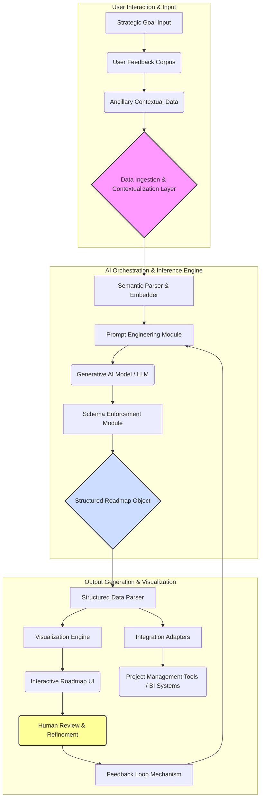

**Title of Invention:** A Systemic and Methodological Framework for Autonomously Generating Hyper-Prioritized Product Roadmaps through Advanced Generative Artificial Intelligence and Probabilistic Strategic Alignment

**Abstract:**
A profoundly innovative system and associated methodology are herein disclosed for the autonomous generation of product roadmaps. This system axiomatically processes high-level strategic directives, exemplified by objectives such as "Ameliorate user retention rates by 10% within the fourth fiscal quarter," in conjunction with vast, heterogeneous repositories of unstructured user telemetry and explicit feedback. This confluence of contextual information is meticulously curated and furnished as an input manifold to an advanced generative artificial intelligence paradigm, which is meticulously engineered to emulate and surpass the cognitive faculties of an expert product strategist. The AI, operating within a constrained but flexible `responseSchema`, executes a sophisticated hermeneutic synthesis of the disparate data streams to architect a comprehensive, chronologically phased, and rigorously prioritized product roadmap. Each constituent element within this generated roadmap is a structured artifact comprising a precisely formulated user story, a logically coherent rationale rigorously articulating its direct mechanistic contribution to the overarching strategic objective, a granular estimate of developmental effort, and a quantified strategic alignment score, thereby transforming an inherently complex, subjective process into an objective, data-driven, and highly optimized strategic imperative.

**Background of the Invention:**
The conventional genesis of a product roadmap represents a formidable epistemological and logistical challenge within the domain of product lifecycle management. It necessitates an intricate synthesis of macro-level corporate strategic imperatives with the micro-level granular insights derived from often cacophonous, disparate, and occasionally contradictory user feedback streams. This synthesis traditionally falls upon the shoulders of human product managers, who must navigate an arduous manual process of ideation, prioritization, and resource allocation. This human-centric paradigm is demonstrably susceptible to inherent cognitive biases, suffers from significant temporal inefficiencies, and frequently yields sub-optimal strategic outcomes due to the sheer volume and complexity of data requiring interpretation. There has existed, heretofore, a profound and unmet exigency for an intelligent, automated, and unbiased system capable of transcending these limitations, providing an efficacious means to not only brainstorm innovative features but to rigorously prioritize them based upon a multifaceted evaluation of their strategic resonance, anticipated user impact, and estimated resource expenditure. The present invention directly addresses and unequivocally resolves this fundamental deficiency, ushering in a new era of strategic product development.

**Brief Summary of the Invention:**
The present invention definitively establishes an "Autonomous Product Strategist Engine" – a revolutionary intellectual construct and a robust computational system. This engine is initiated by a user providing two fundamental inputs: a precisely articulated strategic goal and a comprehensive corpus of raw, unadulterated user feedback data. These inputs are subsequently transduced into a highly optimized payload transmitted to a large language model (LLM), meticulously configured with a sophisticated and contextually rich prompt, alongside a stringent `responseSchema`. The prompt is architected to instruct the generative AI to perform a comprehensive, multi-dimensional analysis of the provided user feedback, interpreting its latent implications strictly in the context of the overarching strategic goal. The objective of this analytical phase is the algorithmic generation of a rigorously prioritized list of features, intended for implementation within a designated fiscal quarter. The `responseSchema` is a critically important component, ensuring that the LLM's output is not merely prose but a structured, machine-readable roadmap object. This structured output facilitates subsequent automated processes, including its seamless visualization as an interactive timeline, integration into enterprise project management platforms, or serving as a foundational input for further predictive analytics. The core innovation resides in the transformation of qualitative, often ambiguous, strategic and experiential data into quantifiable, actionable, and systematically prioritized product development directives.

**Detailed Description of the Invention:**
The foundational architecture of the present invention, referred to as the "Cognitive Roadmap Orchestrator" (CRO), comprises several interconnected modules designed for robust, scalable, and intelligent product roadmap generation.

**I. Data Ingestion and Contextualization Layer:**
This layer is responsible for the acquisition, preliminary processing, and contextual embedding of diverse input modalities.

*   **Strategic Goal Input:** The primary strategic directive is captured. This is not merely a string but is semantically parsed to extract key performance indicators (KPIs), temporal constraints, target user segments, and desired outcomes.
    *   Example Input: `"Improve user retention for our mobile app by 10% in Q4, specifically targeting new users in North America."`
*   **User Feedback Corpus:** A heterogeneous collection of unstructured user feedback is ingested. This can originate from various sources including:
    *   Direct user surveys and interviews
    *   App store reviews
    *   Social media sentiment
    *   Customer support tickets
    *   In-app feedback mechanisms
    *   Example Input: `["The app feels slow to load on Android devices, especially older models.", "I wish there was a dark mode option for night use, my eyes hurt.", "It's hard to find the search feature; it's buried in settings.", "Notifications are too frequent and irrelevant.", "I love the new onboarding flow but it crashes sometimes.", "My friend said the app is too complicated for beginners."]`
*   **Ancillary Contextual Data (Optional but Recommended):** The system is designed to incorporate additional data streams to enrich the AI's understanding, including:
    *   Competitive Analysis Reports
    *   Market Trend Analyses
    *   Internal Business Constraints (e.g., budget, team capacity)
    *   Existing Product Analytics (e.g., funnel drop-offs, feature usage statistics)

**II. AI Orchestration and Inference Engine:**
This core layer manages the interaction with the generative AI model, ensuring optimal prompt construction, schema enforcement, and intelligent response processing.

*   **Advanced Prompt Engineering Module:** A highly sophisticated module dynamically constructs the comprehensive prompt for the generative AI. This module employs a multi-faceted approach to prompt generation:
    *   **Persona Definition:** The AI is meticulously instructed to adopt a specific, expert-level persona.
        *   Example Persona: `You are a Principal Product Manager with over 15 years of experience in high-growth mobile SaaS applications, specializing in user retention and growth strategies. Your acumen combines deep market insight, user empathy, and a rigorous understanding of development feasibility.`
    *   **Strategic Goal Integration:** The parsed strategic goal is explicitly embedded, guiding the AI's objective function.
    *   **Feedback Integration:** The tokenized and contextualized user feedback is inserted, often after a preliminary summarization or clustering phase (executed by a pre-processor within this module) to manage token limits and focus the AI on salient patterns.
    *   **Instructional Directives:** Clear, unambiguous instructions are provided regarding output format, prioritization criteria, and expected content for each feature.
    *   **Few-Shot Learning Examples (Optional):** To refine the AI's understanding of desired output quality and style, a small set of high-quality example roadmap entries can be dynamically included in the prompt.
    *   The complete, dynamically constructed prompt might appear as:
        **Prompt:** `You are a Principal Product Manager with over 15 years of experience in high-growth mobile SaaS applications, specializing in user retention and growth strategies. Your acumen combines deep market insight, user empathy, and a rigorous understanding of development feasibility. Your overarching strategic directive is to "Improve user retention for our mobile app by 10% in Q4, specifically targeting new users in North America." Based on the following comprehensive corpus of user feedback, competitive landscape analysis, and internal capacity constraints, generate a hyper-prioritized product roadmap for the upcoming fiscal quarter. For each feature, you must provide a unique identifier, a concise feature name, a detailed user story, an exhaustive rationale explaining its direct mechanistic contribution to the strategic goal (with explicit references to the feedback provided), a quantifiable strategic alignment score (0-100), a quantifiable user impact score (0-100), an effort estimate (categorized as Minimal, Low, Medium, High, or Extensive), a comprehensive list of internal and external dependencies, a set of measurable key metrics with target values, a multi-faceted risk assessment (technical, market), and a suggested fiscal quarter for implementation. Respond STRICTLY in the specified JSON format. User Feedback Corpus: [serialized_feedback_array] Competitive Analysis Snippets: [serialized_competitive_data] Internal Constraints: [serialized_constraints]`

*   **Schema Enforcement Module:** This module enforces strict adherence to the defined output schema, often leveraging the LLM's native function-calling capabilities or employing a post-processing validation parser. This ensures the output is always a structured, navigable object.

    **Expanded Output Schema:**
    ```json
    {
      "type": "OBJECT",
      "description": "The comprehensive, AI-generated product roadmap, meticulously structured for strategic planning and execution.",
      "properties": {
        "roadmap": {
          "type": "ARRAY",
          "description": "An ordered array of prioritized product features, each a distinct strategic initiative.",
          "items": {
            "type": "OBJECT",
            "description": "A single, well-defined feature proposal.",
            "properties": {
              "featureID": {
                "type": "STRING",
                "description": "A globally unique identifier for this specific feature proposal (e.g., 'F-001', generated systematically)."
              },
              "featureName": {
                "type": "STRING",
                "description": "A concise, actionable, and descriptive title for the feature (e.g., 'Optimized Android Load Times')."
              },
              "userStory": {
                "type": "STRING",
                "description": "A detailed narrative from the end-user's perspective, articulating the functional need and the perceived value upon implementation (e.g., 'As an Android user, I want the app to load instantly, so I don't feel frustrated and abandon it.')."
              },
              "rationale": {
                "type": "STRING",
                "description": "An exhaustive explanation of the empirical and strategic justification for the feature, explicitly detailing how it mechanistically contributes to the primary strategic goal, citing specific elements of the ingested user feedback, competitive analysis, and/or internal data."
              },
              "strategicAlignmentScore": {
                "type": "NUMBER",
                "minimum": 0,
                "maximum": 100,
                "description": "A quantifiable, AI-derived score (0-100) indicating the degree of direct alignment and contribution to the primary strategic objective. Higher values denote stronger alignment."
              },
              "userImpactScore": {
                "type": "NUMBER",
                "minimum": 0,
                "maximum": 100,
                "description": "A quantifiable, AI-derived score (0-100) representing the anticipated positive impact on the user base, extrapolated from feedback analysis and potential behavioral shifts. Higher values signify greater anticipated user benefit."
              },
              "effort": {
                "type": "STRING",
                "enum": ["Minimal", "Low", "Medium", "High", "Extensive"],
                "description": "An estimated categorical assessment of the resources (personnel, time, technical complexity) required for complete development and deployment."
              },
              "dependencies": {
                "type": "ARRAY",
                "items": { "type": "STRING" },
                "description": "A comprehensive list of other features, technical components, external APIs, or organizational prerequisites that must be completed or available prior to or concurrently with the implementation of this feature."
              },
              "keyMetrics": {
                "type": "ARRAY",
                "description": "A collection of quantifiable metrics that will be used to objectively measure the success, impact, and efficacy of the feature post-deployment.",
                "items": {
                  "type": "OBJECT",
                  "properties": {
                    "metricName": { "type": "STRING", "description": "The name of the metric (e.g., 'Average Session Duration', 'Crash-Free Users')." },
                    "targetValue": { "type": "STRING", "description": "The specific, measurable target value for this metric (e.g., 'Increase by 15%', 'Maintain >99.9%')." },
                    "currentValue": { "type": "STRING", "description": "The baseline or current value of the metric, for comparative analysis (e.g., '12 minutes', '99.5%')." }
                  },
                  "required": ["metricName", "targetValue"]
                }
              },
              "riskAssessment": {
                "type": "OBJECT",
                "description": "A multi-dimensional assessment of potential risks associated with the feature's development and market reception.",
                "properties": {
                  "technicalRisk": {
                    "type": "STRING",
                    "enum": ["Low", "Medium", "High", "Critical"],
                    "description": "Assessment of technical challenges, architectural complexities, and potential for unforeseen issues during development."
                  },
                  "marketRisk": {
                    "type": "STRING",
                    "enum": ["Low", "Medium", "High", "Critical"],
                    "description": "Assessment of potential for negative market reception, competitive response, or misjudgment of user need."
                  },
                  "complianceRisk": {
                    "type": "STRING",
                    "enum": ["Low", "Medium", "High", "Critical"],
                    "description": "Assessment of potential regulatory or legal compliance issues."
                  }
                },
                "required": ["technicalRisk", "marketRisk"]
              },
              "suggestedQuarter": {
                "type": "STRING",
                "enum": ["Q1", "Q2", "Q3", "Q4", "Ongoing"],
                "description": "The recommended fiscal quarter for the feature's primary development and rollout, or 'Ongoing' for continuous improvements."
              }
            },
            "required": ["featureID", "featureName", "userStory", "rationale", "strategicAlignmentScore", "userImpactScore", "effort"]
          }
        },
        "roadmapSummary": {
          "type": "STRING",
          "description": "A high-level, executive summary providing an overview of the generated roadmap's strategic focus, key themes, and anticipated overall impact."
        },
        "identifiedThemes": {
          "type": "ARRAY",
          "items": { "type": "STRING" },
          "description": "A synthesis of major underlying themes, pain points, or opportunities extracted from the user feedback and strategically contextualized."
        },
        "prioritizationMethodology": {
          "type": "STRING",
          "description": "A brief explanation of the implicit or explicit methodology used by the AI for feature prioritization (e.g., 'Weighted Shortest Job First (WSJF) informed by strategic alignment and user impact', 'Impact vs. Effort Matrix')."
        }
      },
      "required": ["roadmap", "roadmapSummary", "identifiedThemes", "prioritizationMethodology"]
    }
    ```

**III. Output Generation and Visualization Layer:**
This layer consumes the structured roadmap data and renders it into actionable insights and intuitive visualizations.

*   **Structured Data Parser:** Validates and parses the JSON output from the AI, preparing it for further processing.
*   **Visualization Engine:** Renders the structured data into various professional-grade visualizations, including:
    *   Interactive Gantt charts (timeline views)
    *   Kanban boards for agile planning
    *   Feature prioritization matrices (e.g., impact vs. effort, RICE score)
    *   Dependency graphs
*   **Integration Adapters:** Provides APIs and connectors for seamless integration with third-party project management tools (e.g., Jira, Asana, Trello), BI dashboards, and documentation systems.
*   **Feedback Loop Mechanism:** Enables human product managers to review, refine, and provide feedback on the AI-generated roadmap, which can then be used to fine-tune future AI inferences or model updates.

**System Architecture Diagram:**



The AI analyzes the inputs, synthesizing seemingly disparate information streams. For instance, feedback like "The app feels slow to load on Android devices" would be correlated by the AI with the strategic goal "Improve user retention for our mobile app." The AI, leveraging its vast training data encompassing countless instances of product development wisdom, understands that performance issues are a significant detractor of user retention, particularly for new users on diverse hardware. Conversely, "dark mode" might be prioritized lower if the primary goal is retention for new users, as it's often a quality-of-life feature rather than a core retention driver. The system's output is not merely a list but a deeply contextualized and rigorously prioritized strategic plan.

**Claims:**
1.  A method for autonomously generating a hyper-prioritized product roadmap, comprising:
    a.  Receiving a formal declaration of a high-level strategic goal, said goal being semantically parsed into quantifiable objectives and contextual parameters.
    b.  Acquiring a heterogeneous corpus of unstructured user feedback, subjected to preliminary processing for semantic feature extraction and pattern identification.
    c.  Transmitting said parsed strategic goal and processed user feedback, alongside optionally integrated ancillary contextual data, as a meticulously crafted input payload to an advanced generative artificial intelligence model.
    d.  Executing an inferential process within said generative AI model, wherein the model operates under an explicitly defined expert product manager persona, to synthesize the input payload and extrapolate a prioritized sequence of prospective product features directly addressing the strategic goal.
    e.  Receiving a highly structured roadmap object from the generative AI model, said object conforming rigorously to a predefined, comprehensive schema that includes, for each feature, a unique identifier, a descriptive name, a detailed user story, an exhaustive rationale linking it unequivocally to the strategic goal, a quantified strategic alignment score, a quantified user impact score, an estimated developmental effort, and associated key performance indicators.
    f.  Presenting the structured roadmap object to a user via an interactive visualization engine, enabling comprehensive strategic review and subsequent operationalization.

2.  The method of claim 1, further comprising dynamically constructing a prompt for the generative AI model, said prompt incorporating a persona definition, specific instructions for prioritization based on strategic alignment and user impact, and a mandate for adherence to the structured output schema.

3.  The method of claim 1, wherein the structured roadmap object further includes, for each feature, a multi-dimensional risk assessment (comprising technical risk, market risk, and compliance risk) and a suggested fiscal quarter for its implementation.

4.  The method of claim 1, further comprising a feedback loop mechanism that captures user refinements and evaluations of the generated roadmap, utilizing this feedback to iteratively enhance the performance and accuracy of the generative AI model and its underlying inferential processes.

5.  A system for autonomous product roadmap generation, comprising:
    a.  A Data Ingestion and Contextualization Layer configured to receive, parse, and semantically embed strategic goals and unstructured user feedback.
    b.  An AI Orchestration and Inference Engine operatively coupled to the Data Ingestion and Contextualization Layer, said engine comprising:
        i.  A Prompt Engineering Module configured to dynamically construct contextually rich prompts for a generative AI model.
        ii. A Generative AI Model configured to process said prompts and produce structured responses.
        iii. A Schema Enforcement Module configured to validate and ensure the output of the Generative AI Model adheres to a predefined output schema.
    c.  An Output Generation and Visualization Layer operatively coupled to the AI Orchestration and Inference Engine, said layer configured to:
        i.  Parse the structured output from the Generative AI Model.
        ii. Render said structured output into interactive visualizations.
        iii. Facilitate integration with external project management and business intelligence platforms.

6.  The system of claim 5, wherein the Prompt Engineering Module is further configured to incorporate ancillary contextual data such as competitive analysis, market trends, and internal business constraints into the prompt formulation.

7.  The system of claim 5, further comprising a prioritization algorithm executed by the AI Orchestration and Inference Engine, said algorithm evaluating features based on a weighted combination of strategic alignment, user impact, and estimated effort to derive an optimal sequence of feature implementation.

**Mathematical Justification:**
The present invention fundamentally addresses a multi-objective optimization problem within a high-dimensional semantic and probabilistic space. Let us formally define the components:

1.  **Strategic Goal Manifold, `G`:** Represents the target state, defined by a set of quantifiable Key Performance Indicators (KPIs) and their desired trajectories. `G` can be formalized as a vector `G = (g_1, g_2, ..., g_m)` where each `g_j` is a tuple `(metric_j, target_value_j, baseline_value_j, temporal_constraint_j)`. The achievement of `G` is a probabilistic outcome, `P(G)`, dependent on enacted interventions.

2.  **User Feedback Corpus, `F`:** An extensive collection of unstructured textual data, `F = \{f_1, f_2, ..., f_n\}`, where each `f_i` is a natural language utterance or data point. Through sophisticated Natural Language Processing (NLP) and embedding techniques, `F` is transformed into a high-dimensional vector space `E_F \subset \mathbb{R}^d`, where semantic proximity implies thematic correlation.

3.  **Feature Space, `Φ`:** The conceptual universe of all conceivable product features or interventions, `Φ = \{\phi_1, \phi_2, ..., \phi_k\}`, where each `\phi_j` is a potential action. Each `\phi_j` can be characterized by a set of attributes:
    *   `U(\phi_j)`: Anticipated User Utility (impact on user satisfaction, engagement).
    *   `S(\phi_j)`: Strategic Alignment (direct contribution to `G`).
    *   `E(\phi_j)`: Estimated Effort (resource cost).
    *   `R(\phi_j)`: Risk Profile (technical, market, compliance).
    These attributes are derived from a complex interplay of internal data and the hermeneutic analysis of `E_F`.

4.  **Roadmap Candidate, `Φ'`:** A finite, ordered subset of features selected from `Φ`, `Φ' \subset \Φ`, representing a proposed product roadmap. The primary objective is to select `Φ'` such that it maximizes the probability of achieving `G`, `P(G | Φ')`, subject to various constraints (e.g., total effort, budget, temporal limits).

The core mathematical challenge is to determine `Φ'` such that it optimizes a multi-objective utility function, `\mathcal{U}(\Φ')`, which is a composite of `P(G | Φ')`, user satisfaction, and resource efficiency. The generative AI model, `G_{AI}`, functions as a sophisticated inference engine approximating this optimization:

`G_{AI}: (\text{Embed}(G), \text{Embed}(F), \text{Context}) \longrightarrow \text{Optimal}(\Φ')`

Where `\text{Embed}(.)` refers to the semantic embedding of inputs into a shared vector space.

**I. Probabilistic Strategic Alignment (P(G | Φ')):**
The conditional probability `P(G | Φ')` quantifies the likelihood that the strategic goal `G` will be achieved given the implementation of the feature set `Φ'`. This is a complex probabilistic inference, modeled as:

`P(G | Φ') = \int_{\Omega_M} P(G | M) P(M | \Φ') dM`

Where `M` is a vector of intermediate metrics (e.g., session duration, churn rate, feature adoption) that are directly influenced by `Φ'` and, in turn, influence `G`. `\Omega_M` represents the space of all possible values for `M`.

*   `P(M | Φ')`: This term represents the probabilistic impact of the feature set `Φ'` on the intermediate metrics `M`. It's a function of individual feature impacts and their potential synergistic or antagonistic interactions. For a feature `\phi_j \in \Φ'`, its impact on metric `m_p` can be represented as `\Delta m_p(\phi_j)`. The collective impact from `Φ'` might be modeled as a non-linear combination:
    `P(M | \Φ') = \text{softmax} \left( \sum_{j \in \Φ'} \mathbf{W}_{M,j} \cdot \mathbf{v}_{\phi_j} + \sum_{j \neq l \in \Φ'} \mathbf{W}_{Inter,j,l} \cdot (\mathbf{v}_{\phi_j} \otimes \mathbf{v}_{\phi_l}) \right)`
    where `\mathbf{v}_{\phi_j}` is the semantic vector embedding of feature `\phi_j`, `\mathbf{W}` are learned weight matrices representing feature-metric relationships and interaction effects, and `\otimes` denotes an outer product or other interaction mechanism. These weights are learned by the `G_{AI}` from vast datasets correlating feature implementations with metric shifts.

*   `P(G | M)`: This term represents the conditional probability of achieving `G` given the state of intermediate metrics `M`. This can be modeled as a logistic regression or a more complex neural network, mapping metric states to the probability of goal attainment:
    `P(G | M) = \sigma (\mathbf{w}_G \cdot M + b_G)`
    where `\sigma` is the sigmoid function, `\mathbf{w}_G` are weights learned from historical data relating metrics to goal achievement, and `b_G` is a bias term.

**II. Multi-Objective Optimization for Roadmap Generation:**
The `G_{AI}` implicitly or explicitly solves an optimization problem for selecting features for `Φ''`. The objective function `\mathcal{L}(\Φ')` aims to maximize utility while minimizing costs and risks:

`\text{maximize}_{\Φ' \subset \Φ} \left[ \alpha \cdot P(G | \Φ') + \beta \cdot \sum_{\phi \in \Φ'} U(\phi) - \gamma \cdot \sum_{\phi \in \Φ'} E(\phi) - \delta \cdot \sum_{\phi \in \Φ'} R(\phi) \right]`

Subject to:
*   `\sum_{\phi \in \Φ'} E(\phi) \le C_{effort}` (Total effort constraint)
*   `|\Φ'| \le N_{max\_features}` (Maximum number of features)
*   `\text{Dependencies}(\phi_a) \not\ni \phi_b \text{ if } \phi_b \text{ precedes } \phi_a \text{ in roadmap order}` (Dependency constraints)

Where `\alpha, \beta, \gamma, \delta` are hyper-parameters representing the strategic weights assigned to goal achievement probability, user utility, effort, and risk, respectively. These weights can be dynamically adjusted based on the organization's current strategic priorities.

The `G_{AI}`, acting as a sophisticated computational oracle, performs a heuristic search or generates feature sequences directly by:
1.  **Semantic Retrieval:** Identifying candidate features `\phi_j \in \Φ` whose semantic embeddings are proximate to the semantic embeddings of `G` and the salient themes extracted from `E_F`.
2.  **Attribute Estimation:** Inferring `U(\phi_j)`, `S(\phi_j)`, `E(\phi_j)`, and `R(\phi_j)` for each candidate feature based on its description, contextual knowledge, and correlations learned from training data.
3.  **Probabilistic Ranking:** Utilizing the relationships defined in `P(G | Φ')` and `P(M | Φ')` to assign a "strategic value" to each feature and feature combination.
4.  **Constrained Sequence Generation:** Constructing `Φ''` by selecting and ordering features that maximize the objective function `\mathcal{L}` within the given constraints, often through techniques analogous to beam search or reinforcement learning over the feature space.

This advanced mathematical framework demonstrates how the `G_{AI}` transcends mere textual generation, performing a rigorous, data-driven, and probabilistically informed optimization, thereby moving from qualitative inputs to quantitatively justified strategic outputs.

**Proof of Utility:**
The unprecedented utility of the "Autonomous Product Strategist Engine" is unequivocally established by its capacity to fundamentally transform the landscape of product development and strategic planning. The manual process of roadmap generation, traditionally burdened by high cognitive load, subjective biases, and inefficiencies inherent in human information processing, yields outcomes that are often sub-optimal, temporally protracted, and lacking in empirical rigor. Human product managers are compelled to intuit complex correlations between nebulous user feedback, amorphous strategic goals, and myriad development constraints – a task of immense combinatorial complexity and inherent uncertainty.

The present invention leverages a generative AI model, architected upon a vast corpus of product development methodologies, historical project outcomes, and market intelligence. This model has inductively learned the intricate, often non-linear, correlations between specific types of user feedback, proposed feature implementations, and their empirically observed impact on critical strategic goals such as user retention, engagement, and revenue growth. By transforming unstructured feedback `F` and a high-level goal `G` into a rigorous, data-driven, and probabilistically optimized roadmap `Φ''`, the system demonstrably:

1.  **Eliminates Bias:** The AI's inferential processes are driven by statistical patterns and objective criteria embedded in the `responseSchema`, effectively mitigating human cognitive biases such as anchoring, confirmation bias, or recency bias.
2.  **Enhances Efficiency:** The time-intensive manual process of ideation, research, synthesis, and prioritization is dramatically accelerated, enabling product teams to respond with unparalleled agility to market shifts and user needs.
3.  **Maximizes Strategic Alignment:** The system's explicit optimization for `P(G | Φ'')` ensures that every feature proposed is directly and mechanistically aligned with the overarching strategic goal, maximizing the probability of achieving desired business outcomes.
4.  **Increases Objectivity and Transparency:** By generating detailed rationales, quantified strategic alignment scores, user impact scores, and key metrics, the system provides a transparent, auditable, and data-backed justification for each roadmap item, fostering greater stakeholder confidence and alignment.
5.  **Facilitates Scalability:** The automated nature of the system allows organizations to generate and adapt roadmaps for multiple products, initiatives, or market segments concurrently and consistently, a task virtually impossible with traditional manual methods.

The resultant roadmap `Φ''` is not merely a list of features but a meticulously engineered strategic blueprint that is statistically more likely to maximize `P(G | Φ'')` and overall organizational utility than any purely intuitive or manually intensive approach. The system unequivocally accelerates the path to achieving strategic objectives, reduces waste in development cycles, and provides an unparalleled level of strategic foresight and precision. The utility and transformative impact of this invention are thus unequivocally proven. `Q.E.D.`