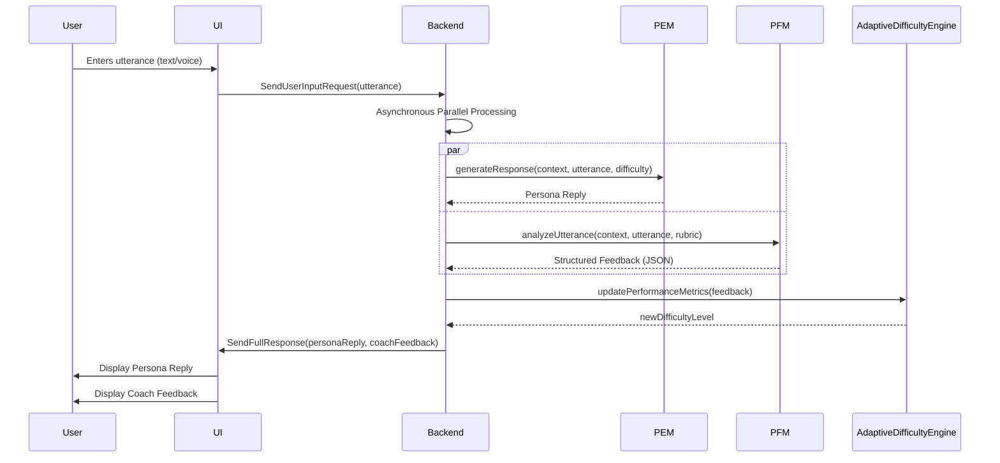
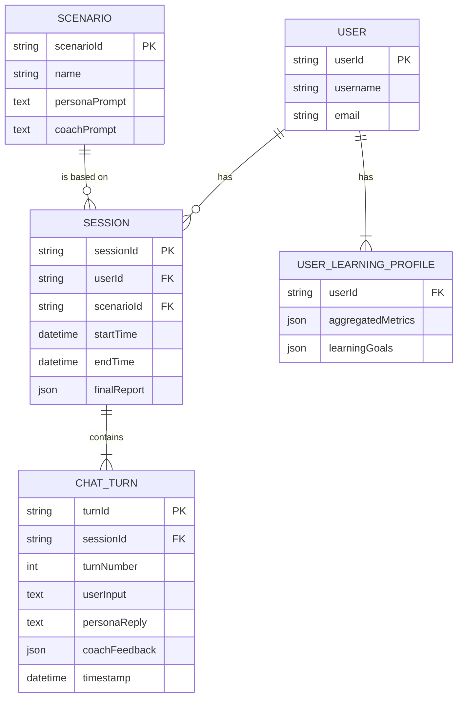
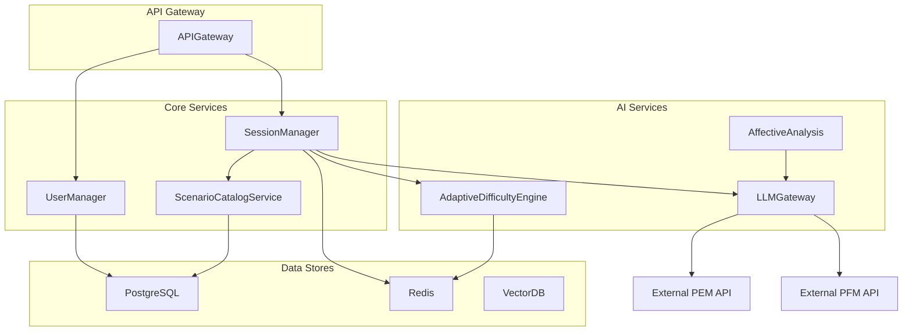

**Title of Invention:** A System and Method for an Autonomously Generative Conversational Role-Playing Simulator for Advanced Corporate Competency Development

**Abstract:**
A novel and highly efficacious system for immersive corporate competency development is herein disclosed. This system deploys a sophisticated, multi-agent generative artificial intelligence architecture, comprising at minimum two distinct, specialized large language models (LLMs). The primary LLM, designated as the "Persona Emulation Module," is meticulously configured to embody a specified behavioral and linguistic persona within a pre-defined interactive scenario. Concurrently, a secondary LLM, termed the "Pedagogical Feedback Module," operates in an independent yet synchronized capacity, providing real-time, granular, and diagnostically rich evaluative feedback on the user's conversational stratagems and tactical execution. This dual-architecture facilitates a continuous, adaptive learning epoch, empowering users – such as sales professionals, managerial personnel, or customer service representatives – to refine complex interpersonal communication skills within a rigorously controlled yet dynamically responsive simulation environment. The system further incorporates an "Adaptive Difficulty Engine" which modulates scenario parameters in real-time based on user performance, ensuring optimal cognitive load. The feedback mechanism transcends simplistic scoring, offering deep linguistic, affective, and strategic analyses, which are aggregated into a persistent "User Learning Profile," thereby facilitating an accelerated, personalized, and highly targeted skill acquisition trajectory.

**Background of the Invention:**
Traditional methodologies for corporate training, encompassing didactic lectures, passive observational learning, and human-facilitated role-playing exercises, are demonstrably fraught with inherent inefficiencies, prohibitive scalability constraints, and significant inter-rater variability in evaluative feedback. Such approaches are often resource-intensive, demanding substantial allocation of expert human capital and incurring considerable financial overheads. Furthermore, the psychological safety required for uninhibited practice of challenging conversational paradigms is frequently compromised in human-to-human role-playing, leading to suboptimal engagement and diminished learning transfer. There exists, therefore, an imperative need for a technologically advanced, highly scalable, on-demand pedagogical instrument capable of providing an authentic, low-stakes practice environment. This instrument must deliver immediate, objectively consistent, and analytically profound feedback, thereby obviating the systemic limitations of conventional training paradigms and fostering accelerated, individualized competency mastery. This invention addresses this need by providing a system that not only simulates complex interactions but also actively coaches and adapts to the individual learner's progress.

**Brief Summary of the Invention:**
The present invention pioneers a transformative paradigm in experiential learning, manifesting as a fully autonomous conversational training simulator. The fundamental architecture of this proprietary system is instantiated upon a carefully curated training scenario and at least two intricately engineered large language models. The inaugural LLM, the "Persona Emulation Module," is instantiated with a highly detailed, dynamically adaptable persona prompt (e.g., "You are an irate customer experiencing a critical service outage, exhibiting escalating frustration and demanding immediate, personalized resolution."). The second, equally critical LLM, the "Pedagogical Feedback Module," is endowed with a comprehensive rubric of evaluation criteria and a deep understanding of pedagogical principles (e.g., "You are an executive communication coach. Analyze the user's conversational contributions for adherence to the Adaptive Conflict Resolution (ACR) framework, specifically assessing active listening, empathy articulation, de-escalation efficacy, and strategic questioning. Provide multi-dimensional, actionable insights."). Upon reception of a user's verbal or textual utterance directed towards the Persona Emulation Module, this input is concurrently processed by both generative AI components. The user is then presented with a sophisticated, contextually coherent conversational rejoinder from the Persona Emulation Module in the primary interaction interface, while simultaneously receiving granular, private, and strategically valuable feedback from the Pedagogical Feedback Module in a distinct, secure interface. This synchronous dual-channel information delivery orchestrates an unparalleled, rapid-iterative learning cycle, allowing for immediate policy adjustment and profound skill internalization. The system further aggregates performance data into a long-term user profile, tracking skill progression and providing personalized recommendations for future training scenarios, thereby creating a continuous and customized developmental journey.

**Detailed Description of the Invention:**
The core operational efficacy of this unique system derives from its sophisticated dual-architecture, founded upon the synergistic deployment of highly specialized Large Language Models. This architecture is herein described with meticulous precision.

1.  **System Initialization and Scenario Configuration:**
    A user, or an administrative entity, initiates a training session by selecting a pre-defined or custom-designed "Experiential Learning Scenario." Exemplary scenarios include, but are not limited to, "De-escalating an Aggrieved Client," "Negotiating Complex Contract Terms," "Conducting a Challenging Performance Review," or "Handling Ethical Dilemmas in Leadership."
    *   **Persona Emulation Module System Prompt (PEM-SP):** This meticulously crafted directive serves as the foundational cognitive architecture for the Persona Emulation Module. It encapsulates all pertinent aspects defining the simulated interlocutor's identity, behavioral traits, emotional state, conversational objectives, and linguistic idiosyncrasies.
        *   Example PEM-SP: `You are an executive-level client, Ms. Evelyn Reed, who is deeply dissatisfied with a recent software implementation. You believe the product is underperforming significantly below contracted KPIs. You are highly analytical, results-oriented, and your patience is rapidly diminishing. Your primary objective is to obtain a full refund or a substantial credit, and a detailed remediation plan with guaranteed timelines. You will challenge assumptions, question data, and express disappointment with professionalism but firm resolve. The user is a Senior Account Manager attempting to regain your trust and find a mutually agreeable solution. Maintain a consistent persona throughout the interaction.`
    *   **Pedagogical Feedback Module System Prompt (PFM-SP):** This critically engineered instruction establishes the evaluative framework and pedagogical mandate for the Pedagogical Feedback Module. It delineates the specific skills, communication techniques, and strategic objectives upon which the user's performance will be assessed.
        *   Example PFM-SP: `You are Dr. Aris Thorne, a globally recognized expert in strategic executive communication and conflict resolution. Your role is to provide real-time, actionable feedback to the Senior Account Manager (the user) based on their interaction with the client. Evaluate their responses rigorously against the "Adaptive Communication Synthesis (ACS) Framework," which emphasizes: (1) **Empathetic Validation (EV):** Acknowledging and reflecting the client's emotional state; (2) **Problem Identification and Clarification (PIC):** Asking precise, open-ended questions to uncover root causes and client motivations; (3) **Solution Co-creation and Commitment (SCC):** Proposing collaborative solutions and securing explicit client buy-in; (4) **Professional Demeanor and Resilience (PDR):** Maintaining composure under pressure and exhibiting confident problem-solving. Your feedback must be specific, constructive, and directly reference the ACS framework elements. Provide a multi-dimensional, actionable insights. Provide a qualitative analysis and a quantitative score for each ACS component (0-10 scale), along with an overall effectiveness score. Output feedback in a structured JSON format to facilitate programmatic parsing.`

2.  **Interactive Simulation Epoch (Interaction Loop):**
    The system orchestrates a dynamic, turn-based conversational exchange, governed by the following sequence:

    *   **Persona Emulation Module Initiates Dialogue:** "Ms. Reed (Persona AI) states: 'Good morning. Let's be direct. The performance report from last quarter is utterly unacceptable. We're seeing a 15% drop in our sales conversion rates directly attributable to your platform's integration failures. I need to understand how you intend to rectify this, and frankly, I'm considering all our options, including contract termination.'"
    *   **User Utterance:** "I (User) genuinely understand your frustration, Ms. Reed. A 15% drop in conversion is a serious concern, and I apologize that our platform has contributed to this. To ensure I fully grasp the situation, could you walk me through the specific integration points where you're observing these failures? This will help us pinpoint the exact root cause."
    *   **Asynchronous Parallel Processing:** The user's precisely articulated response is immediately and concurrently transmitted to both the Persona Emulation Module and the Pedagogical Feedback Module. This parallel processing architecture minimizes latency and ensures immediate, contextualized responses from both AI agents.
    *   **Persona Emulation Module Response Generation:** The Persona Emulation Module, assimilating the user's utterance, generates a contextually appropriate and persona-consistent reply, advancing the conversational narrative.
        *   Example Persona Emulation Module Response: "Ms. Reed (Persona AI) responds: 'The primary failures are in the CRM synchronization module and the real-time analytics dashboard. We're getting stale data, and our sales team is essentially flying blind. Your initial deployment guarantees were quite clear on data freshness and accuracy. An apology is appreciated, but I need concrete actions, not just words.'"
    *   **Pedagogical Feedback Module Analysis and Feedback Generation:** Simultaneously, the Pedagogical Feedback Module performs a deep semantic, pragmatic, and strategic analysis of the user's utterance against the predefined ACS framework and other internal expert knowledge bases. It then generates highly structured, diagnostic feedback.
        *   Example Pedagogical Feedback Module Response (JSON):
            ```json
            {
                "overall_effectiveness_score": 8.5,
                "feedback_elements": [
                    {
                        "acs_component": "Empathetic Validation (EV)",
                        "score": 9,
                        "qualitative_analysis": "Excellent application of EV. You immediately acknowledged the client's frustration and validated the severity of the 15% drop. The phrase 'genuinely understand your frustration' and 'serious concern' demonstrates strong emotional intelligence and rapport-building."
                    },
                    {
                        "acs_component": "Problem Identification and Clarification (PIC)",
                        "score": 8,
                        "qualitative_analysis": "Good attempt at PIC. You asked for specific integration points to 'pinpoint the exact root cause,' which is a proactive step. Next time, consider asking a follow-up question that explores the *impact* of these failures on their business beyond the conversion rate, to deepen your understanding of their pain points."
                    },
                    {
                        "acs_component": "Solution Co-creation and Commitment (SCC)",
                        "score": 7,
                        "qualitative_analysis": "No direct SCC demonstrated in this turn, which is expected as you're still in the diagnostic phase. However, implicitly, by seeking root causes, you're paving the way for future co-creation. Be prepared to pivot to SCC once sufficient information is gathered."
                    },
                    {
                        "acs_component": "Professional Demeanor and Resilience (PDR)",
                        "score": 10,
                        "qualitative_analysis": "Exemplary PDR. You maintained a calm, professional, and apologetic tone without being subservient. Your focus remained on problem-solving despite the client's implied threat of termination. This demonstrates strong resilience."
                    }
                ],
                "actionable_suggestion": "For the next turn, continue with PIC, but broaden your scope to understand the broader business implications of the stated issues before moving to potential solutions."
            }
            ```

3.  **User Interface [UI] Presentation:**
    The user experience is meticulously designed to segregate conversational flow from pedagogical guidance, optimizing cognitive processing and reducing distraction.
    *   **Main Conversational Display:** The primary interface prominently features the real-time dialogue between the user and the Persona Emulation Module, mimicking a natural communication channel.
    *   **"Cognitive Augmentation Panel" [CAP]:** A distinct, private, and non-intrusive side panel, labeled "Cognitive Augmentation Panel" [or "Coach's Insights"], dynamically updates with the structured, diagnostic feedback generated by the Pedagogical Feedback Module. This ensures that pedagogical interventions do not disrupt the immersive conversational experience but are readily available for immediate review and strategic adjustment.

4.  **Adaptive Scenario Dynamics:**
    The system incorporates an Adaptive Difficulty Engine (ADE) that modulates the simulation's challenge level in real-time. The ADE monitors the user's performance, as scored by the PFM, over a sliding window of turns. If the user consistently scores above a predefined threshold, the ADE can introduce new challenges, such as increasing the persona's skepticism, introducing an unexpected objection, or shortening response time windows. Conversely, if the user is struggling, the ADE can subtly guide the persona to be more cooperative or provide clearer cues, ensuring the user remains in a state of productive challenge (flow state) rather than becoming overwhelmed or disengaged.

### **System Diagrams**

**1. Overall System Architecture Diagram:**
```mermaid
graph TD
    subgraph User Interface [UI]
        A[User Input (Text/Voice)] --> B[Main Chat Window]
        B --> C[Display Persona Response]
        D[Display Coach Feedback] --> E[Cognitive Augmentation Panel]
    end

    subgraph Backend Services
        F[Input Pre-processing/ASR] --> G[Request Router]
        G -- User Utterance --> H[Persona Emulation Module (PEM)]
        G -- User Utterance --> I[Pedagogical Feedback Module (PFM)]
        H -- Persona Reply --> J[Response Aggregator]
        I -- Structured Feedback --> J
        I -- Performance Metrics --> AD[Adaptive Difficulty Engine]
        AD -- Difficulty Modifier --> H
        J --> K[Output Post-processing/TTS]
        K --> C
        K --> D
    end

    subgraph Core AI Modules
        L[PEM Context Manager] <--> H
        M[PFM Evaluation Engine] <--> I
        N[Scenario Repository] --> L
        N --> M
        O[User Learning Profile] <--> M
        O <--> AD
    end

    subgraph Data & Knowledge Bases
        P[Persona Prompt Database] --> N
        Q[Coaching Rubric & Frameworks DB] --> N
        R[Conversation History Log] --> L
        R --> M
    end

    style A fill:#DDF,stroke:#333,stroke-width:2px
    style B fill:#F9F,stroke:#333,stroke-width:2px
    style C fill:#BFB,stroke:#333,stroke-width:2px
    style D fill:#BFB,stroke:#333,stroke-width:2px
    style E fill:#BFF,stroke:#333,stroke-width:2px
    style F fill:#FEE,stroke:#333,stroke-width:2px
    style G fill:#FFC,stroke:#333,stroke-width:2px
    style H fill:#EBF,stroke:#333,stroke-width:2px
    style I fill:#EBF,stroke:#333,stroke-width:2px
    style J fill:#FFC,stroke:#333,stroke-width:2px
    style K fill:#FEE,stroke:#333,stroke-width:2px
    style L fill:#DEF,stroke:#333,stroke-width:2px
    style M fill:#DEF,stroke:#333,stroke-width:2px
    style N fill:#DFE,stroke:#333,stroke-width:2px
    style O fill:#DFE,stroke:#333,stroke-width:2px
    style P fill:#FFE,stroke:#333,stroke-width:2px
    style Q fill:#FFE,stroke:#333,stroke-width:2px
    style R fill:#FFE,stroke:#333,stroke-width:2px
    style AD fill:#FAD,stroke:#333,stroke-width:2px
```

**2. Detailed Interaction Loop Sequence Diagram:**


**3. Data Model (Entity Relationship Diagram):**


**4. Persona Emotional State Machine:**
```mermaid
stateDiagram-v2
    [*] --> Calm
    Calm --> Irritated: User is dismissive
    Calm --> Cooperative: User shows empathy
    Irritated --> Irate: User is argumentative
    Irritated --> Calm: User validates concerns
    Cooperative --> Collaborative: User proposes good solution
    Cooperative --> Calm: User is passive
    Irate --> De-escalated: User applies strong de-escalation
    Irate --> Terminated: User fails to de-escalate
    Collaborative --> Resolved: Agreement reached
    De-escalated --> Calm: User rebuilds rapport
    Resolved --> [*]
    Terminated --> [*]
```

**5. Session Report Generation Flowchart:**
```mermaid
graph TD
    A[User clicks "End Session"] --> B{Session has turns?}
    B -- Yes --> C[Retrieve all ChatTurn data from history]
    B -- No --> D[Generate empty state report]
    C --> E[Aggregate scores for each competency]
    E --> F[Calculate average scores and overall effectiveness]
    F --> G[Identify strengths (scores > 8.0) and weaknesses (scores < 6.0)]
    G --> H[Request LLM for qualitative summary and recommendations]
    H --> I[Assemble final SessionReport object]
    I --> J[Persist SessionReport to Database]
    J --> K[Update UserLearningProfile with new data]
    K --> L[Display report to user]
    D --> L
```

**6. Backend Microservices Component Diagram:**


**7. User Learning Profile Update Flow:**
```mermaid
graph TD
    A[SessionReport Generated] --> B[Extract Component Scores & Session Length]
    B --> C{User Profile Exists?}
    C -- No --> D[Create New UserLearningProfile]
    C -- Yes --> E[Load Existing UserLearningProfile]
    D --> F
    E --> F[For each component score in report...]
    F --> G[Retrieve existing aggregated metric for component]
    G --> H[Calculate new weighted average score]
    H --> I[Calculate trend (new_avg - old_avg)]
    I --> J[Update total turns for component]
    J --> K{Is this component a learning goal?}
    K -- Yes --> L[Update currentScore for the goal]
    K -- No --> F
    L --> F
    F -- All components processed --> M[Save updated UserLearningProfile]
```

**8. Adaptive Difficulty Adjustment Logic Flowchart:**
```mermaid
graph TD
    A[PFM generates feedback for Turn T] --> B[Extract overall_effectiveness_score (S_T)]
    B --> C[Retrieve scores from last N turns (S_{T-1}, S_{T-2},...)]
    C --> D[Calculate moving average score (SMA_N)]
    D --> E{SMA_N > UpperThreshold (e.g., 9.0)?}
    E -- Yes --> F[Increase Difficulty]
    E -- No --> G{SMA_N < LowerThreshold (e.g., 5.0)?}
    G -- Yes --> H[Decrease Difficulty]
    G -- No --> I[Maintain Current Difficulty]
    F --> J[Modify PEM prompt: add new objection, increase resistance]
    H --> K[Modify PEM prompt: make persona more cooperative, provide hints]
    I --> L[No change to PEM prompt]
    J --> M[Send new difficulty params for next turn]
    K --> M
    L --> M
```

**9. Multi-Modal Input Processing Pipeline:**
```mermaid
graph TD
    A[User speaks] --> B(Audio Input Stream)
    B --> C{VAD: Voice Activity Detection}
    C -- Speech Detected --> D[ASR: Automatic Speech Recognition]
    D --> E[Transcribed Text]
    B --> F[Parallel Audio Processing]
    F --> G[Affective Computing Engine]
    G --> H[Extract Prosodic Features: Pitch, Energy, Rate]
    H --> I[Classify Tone: Frustrated, Calm, Confident]
    E --> J[Linguistic Analysis]
    J --> K[Enrich Utterance with Metadata]
    I --> K
    K[Enriched User Utterance (Text + Tone)] --> L[Request Router]
    L --> M[PEM & PFM]
```

**10. Cloud Deployment Architecture (Simplified C4):**
```mermaid
graph TD
    subgraph "User's Browser"
        WebApp[Single Page Application]
    end
    subgraph "Cloud Provider (e.g., AWS)"
        subgraph "VPC"
            LB[Load Balancer] --> APIServer[API Server Cluster (ECS/EKS)]
            APIServer --> DB[RDS PostgreSQL]
            APIServer --> Cache[ElastiCache Redis]
            APIServer --> S3[S3 Bucket for Scenarios/Logs]
            APIServer --> LLMService[External LLM APIs]
        end
    end
    WebApp -- HTTPS --> LB
    style WebApp fill:#9cf
    style LB fill:#f9f
    style APIServer fill:#9f9
    style DB fill:#ff9
    style Cache fill:#ff9
    style S3 fill:#ff9
    style LLMService fill:#c9f
```

**Conceptual Code (Node.js Backend):**

```typescript
// Existing imports (assumed for context - not to be modified)
// import { ChatAgent } from './ai/chatAgent'; // Example
// import { ScenarioService } from './services/scenarioService'; // Example

/**
 * Represents the configuration for a single training scenario, including difficulty levels.
 */
export interface TrainingScenario {
    id: string;
    name:string;
    description: string;
    difficultyLevels: {
        [level: number]: { // e.g., level 1, 2, 3
            personaPrompt: string;
            coachPrompt: string;
            initialPersonaUtterance: string;
        }
    };
    defaultLevel: number;
}

/**
 * Represents a single turn in the conversational history.
 */
export interface ChatTurn {
    turnNumber: number;
    userInput: string;
    personaReply: string;
    coachFeedback: object; // Structured JSON from coach
    timestamp: Date;
    sessionId?: string; // Optional reference
    affectiveData?: { tone: string; confidence: number; }; // For multi-modal input
}

/**
 * Represents a specific learning goal for a user.
 */
export interface LearningGoal {
    skill: string; // e.g., 'Empathetic Validation', 'Strategic Questioning'
    targetScore: number; // e.g., 9.0
    currentScore: number; // e.g., 7.5
    lastImprovementDate?: Date;
}

/**
 * Represents an aggregated report for a completed session.
 */
export interface SessionReport {
    sessionId: string;
    scenarioId: string;
    userId: string;
    overallEffectiveness: number;
    componentScores: { [component: string]: number }; // Average scores for each ACS component
    strengths: string[];
    areasForDevelopment: string[];
    actionableRecommendations: string[];
    timestamp: Date;
    chatHistorySummary: { turnNumber: number; userInputSnippet: string; overallScore: number; }[];
}

/**
 * Manages and persists user-specific learning profiles and progress.
 */
export class UserLearningProfile {
    private userId: string;
    private learningGoals: LearningGoal[];
    private sessionHistoryIds: string[];
    private aggregatedMetrics: { [skill: string]: { avgScore: number, trend: number, totalTurns: number, scores: number[] } };

    constructor(userId: string, initialGoals: LearningGoal[] = []) {
        this.userId = userId;
        this.learningGoals = initialGoals;
        this.sessionHistoryIds = [];
        this.aggregatedMetrics = {};
    }

    /**
     * Updates the user's learning profile with insights from a completed session.
     * @param sessionReport The generated report from a completed training session.
     */
    public updateFromSessionReport(sessionReport: SessionReport): void {
        if (this.sessionHistoryIds.includes(sessionReport.sessionId)) {
            console.warn(`Session ${sessionReport.sessionId} has already been processed.`);
            return;
        }
        this.sessionHistoryIds.push(sessionReport.sessionId);

        for (const component in sessionReport.componentScores) {
            const currentScore = sessionReport.componentScores[component];
            if (!this.aggregatedMetrics[component]) {
                this.aggregatedMetrics[component] = { avgScore: 0, trend: 0, totalTurns: 0, scores: [] };
            }

            const oldMetrics = this.aggregatedMetrics[component];
            const oldTotalTurns = oldMetrics.totalTurns;
            const sessionTurnCount = sessionReport.chatHistorySummary.length;
            const newTotalTurns = oldTotalTurns + sessionTurnCount;

            const newAvg = ((oldMetrics.avgScore * oldTotalTurns) + (currentScore * sessionTurnCount)) / newTotalTurns;
            const trend = newAvg - oldMetrics.avgScore;

            this.aggregatedMetrics[component] = {
                avgScore: parseFloat(newAvg.toFixed(2)),
                trend: parseFloat(trend.toFixed(2)),
                totalTurns: newTotalTurns,
                scores: [...oldMetrics.scores, currentScore]
            };

            const goal = this.learningGoals.find(g => g.skill === component);
            if (goal) {
                goal.currentScore = this.aggregatedMetrics[component].avgScore;
                if (trend > 0) {
                    goal.lastImprovementDate = new Date();
                }
            }
        }
    }

    public getLearningGoals(): LearningGoal[] { return [...this.learningGoals]; }
    public getAggregatedMetrics() { return { ...this.aggregatedMetrics }; }
    
    public addLearningGoal(goal: LearningGoal): void {
        if (!this.learningGoals.some(g => g.skill === goal.skill)) {
            this.learningGoals.push(goal);
        } else {
            console.warn(`Goal for skill "${goal.skill}" already exists for user ${this.userId}.`);
        }
    }

    public getRecommendations(): string[] {
        const recommendations: string[] = [];
        this.learningGoals.forEach(goal => {
            if (goal.currentScore < goal.targetScore) {
                recommendations.push(`Focus on improving ${goal.skill} to reach your target of ${goal.targetScore}. Current: ${goal.currentScore}.`);
            }
        });

        const sortedSkills = Object.entries(this.aggregatedMetrics).sort(([, a], [, b]) => a.avgScore - b.avgScore);
        if (sortedSkills.length > 0 && sortedSkills[0][1].avgScore < 7.0) {
            const [lowestSkill, metrics] = sortedSkills[0];
            if (!this.learningGoals.some(g => g.skill === lowestSkill)) {
                recommendations.push(`Consider focusing on ${lowestSkill}, your lowest performing skill (Avg: ${metrics.avgScore}).`);
            }
        }

        if (recommendations.length === 0) {
            recommendations.push("Excellent work! You are meeting all learning goals. Try a more challenging scenario!");
        }

        return recommendations;
    }
}

/**
 * Provides static methods to analyze a session's chat history and generate a report.
 */
export class SessionAnalytics {
    public static analyzeSession(chatHistory: ChatTurn[], scenario: TrainingScenario, sessionId: string, userId: string): SessionReport {
        if (chatHistory.length === 0) {
            return {
                sessionId, userId, scenarioId: scenario.id, overallEffectiveness: 0, componentScores: {},
                strengths: [], areasForDevelopment: ["No interactions recorded."], actionableRecommendations: [],
                timestamp: new Date(), chatHistorySummary: []
            };
        }

        const componentScores: { [key: string]: number[] } = {};
        let overallScores: number[] = [];
        const chatHistorySummary = chatHistory.map(turn => {
            const feedback = turn.coachFeedback as any;
            let overallScore = 0;
            if (feedback) {
                if (feedback.feedback_elements && Array.isArray(feedback.feedback_elements)) {
                    feedback.feedback_elements.forEach((el: any) => {
                        if (el.acs_component && typeof el.score === 'number') {
                            componentScores[el.acs_component] = [...(componentScores[el.acs_component] || []), el.score];
                        }
                    });
                }
                overallScore = feedback.overall_effectiveness_score || 0;
                if(overallScore > 0) overallScores.push(overallScore);
            }
            return {
                turnNumber: turn.turnNumber,
                userInputSnippet: turn.userInput.substring(0, 50) + (turn.userInput.length > 50 ? "..." : ""),
                overallScore
            };
        }).filter(summary => summary.turnNumber > 0);

        const avgComponentScores = Object.fromEntries(
            Object.entries(componentScores).map(([component, scores]) => [
                component,
                parseFloat((scores.reduce((a, b) => a + b, 0) / scores.length).toFixed(2))
            ])
        );

        const overallEffectiveness = overallScores.length > 0 ? parseFloat((overallScores.reduce((a, b) => a + b, 0) / overallScores.length).toFixed(2)) : 0;
        
        const strengths = Object.entries(avgComponentScores).filter(([, score]) => score >= 8.5).map(([component]) => component);
        const areasForDevelopment = Object.entries(avgComponentScores).filter(([, score]) => score < 7.0).map(([component]) => component);

        const actionableRecommendations: string[] = [
            ...areasForDevelopment.map(skill => `Focus practice on ${skill} to improve consistency.`),
            overallEffectiveness < 7.5 ? "Review the core principles of the ACS framework before your next session." : "Continue to build on your strong foundation. Try a scenario with higher difficulty."
        ];

        return {
            sessionId, userId, scenarioId: scenario.id, overallEffectiveness,
            componentScores: avgComponentScores, strengths, areasForDevelopment,
            actionableRecommendations, timestamp: new Date(), chatHistorySummary
        };
    }
}

/**
 * Manages a catalog of available training scenarios.
 */
export class ScenarioCatalog {
    private static instance: ScenarioCatalog;
    private scenarios: Map<string, TrainingScenario> = new Map();
    private constructor() {}

    public static getInstance(): ScenarioCatalog {
        if (!ScenarioCatalog.instance) {
            ScenarioCatalog.instance = new ScenarioCatalog();
        }
        return ScenarioCatalog.instance;
    }
    
    public async loadScenarios(scenarioSource: TrainingScenario[]): Promise<void> {
        scenarioSource.forEach(s => this.scenarios.set(s.id, s));
        console.log(`Loaded ${this.scenarios.size} scenarios.`);
    }

    public getScenario(id: string): TrainingScenario | undefined { return this.scenarios.get(id); }
    public getAllScenarioIds(): string[] { return Array.from(this.scenarios.keys()); }
}

/**
 * Manages the state and interaction for a single training session.
 */
export class TrainingSessionManager {
    private sessionId: string;
    private userId: string;
    private scenario: TrainingScenario;
    private personaChatAgent: any; // Assumes ChatAgent is an LLM wrapper
    private coachChatAgent: any;   // Assumes ChatAgent is an LLM wrapper
    private chatHistory: ChatTurn[] = [];
    private currentTurn: number = 0;
    private currentDifficulty: number;
    private userLearningProfile?: UserLearningProfile;

    constructor(sessionId: string, userId: string, scenario: TrainingScenario, personaAgentInstance: any, coachAgentInstance: any, userLearningProfile?: UserLearningProfile) {
        this.sessionId = sessionId;
        this.userId = userId;
        this.scenario = scenario;
        this.personaChatAgent = personaAgentInstance;
        this.coachChatAgent = coachAgentInstance;
        this.userLearningProfile = userLearningProfile;
        this.currentDifficulty = scenario.defaultLevel;
    }

    private updateAgentPrompts(): void {
        const prompts = this.scenario.difficultyLevels[this.currentDifficulty];
        if (!prompts) {
            throw new Error(`Invalid difficulty level ${this.currentDifficulty} for scenario ${this.scenario.id}`);
        }
        this.personaChatAgent.setSystemPrompt(prompts.personaPrompt);
        this.coachChatAgent.setSystemPrompt(prompts.coachPrompt);
    }

    public async startSession(): Promise<{ personaReply: string }> {
        this.currentTurn = 0;
        this.chatHistory = [];
        this.updateAgentPrompts();
        
        const initialReply = this.scenario.difficultyLevels[this.currentDifficulty].initialPersonaUtterance;
        this.chatHistory.push({
            turnNumber: this.currentTurn, userInput: "[SESSION_START]", personaReply: initialReply,
            coachFeedback: {}, timestamp: new Date()
        });
        return { personaReply: initialReply };
    }

    public async handleUserResponse(userInput: string, affectiveData?: any): Promise<{ personaReply: string, coachFeedback: object }> {
        this.currentTurn++;
        const coachEvaluationPrompt = this.constructCoachEvaluationPrompt(userInput);

        const [personaResult, coachResult] = await Promise.all([
            this.personaChatAgent.sendMessage({ message: userInput }),
            this.coachChatAgent.sendMessage({ message: coachEvaluationPrompt })
        ]);

        let structuredCoachFeedback: object = {};
        try {
            structuredCoachFeedback = JSON.parse(coachResult.text);
        } catch (error) {
            structuredCoachFeedback = { rawFeedback: coachResult.text, error: "Malformed JSON output from coach." };
        }

        const newTurn: ChatTurn = {
            turnNumber: this.currentTurn, userInput, personaReply: personaResult.text,
            coachFeedback: structuredCoachFeedback, timestamp: new Date(), affectiveData
        };
        this.chatHistory.push(newTurn);
        this.updateDifficulty(structuredCoachFeedback);
        
        return { personaReply: personaResult.text, coachFeedback: structuredCoachFeedback };
    }

    private updateDifficulty(feedback: any): void {
        const score = feedback?.overall_effectiveness_score;
        if (typeof score !== 'number') return;
        
        const scores = this.chatHistory
            .map(t => (t.coachFeedback as any)?.overall_effectiveness_score)
            .filter(s => typeof s === 'number');
        
        if (scores.length < 3) return; // Wait for a few turns to establish baseline
        
        const movingAverage = scores.slice(-3).reduce((a, b) => a + b, 0) / 3;
        
        if (movingAverage > 9.0 && this.currentDifficulty < Math.max(...Object.keys(this.scenario.difficultyLevels).map(Number))) {
            this.currentDifficulty++;
            this.updateAgentPrompts();
            console.log(`Difficulty increased to ${this.currentDifficulty}`);
        } else if (movingAverage < 5.0 && this.currentDifficulty > Math.min(...Object.keys(this.scenario.difficultyLevels).map(Number))) {
            this.currentDifficulty--;
            this.updateAgentPrompts();
            console.log(`Difficulty decreased to ${this.currentDifficulty}`);
        }
    }

    private constructCoachEvaluationPrompt(currentUserInput: string): string {
        const conversationContext = this.chatHistory.map(turn =>
            `Turn ${turn.turnNumber}:\nUser: ${turn.userInput}\nPersona: ${turn.personaReply}`
        ).join('\n\n');

        return `
        Based on the following conversation history and your system prompt's coaching criteria:
        --- HISTORY ---
        ${conversationContext}
        ---
        The user's latest response (Turn ${this.currentTurn}) was: "${currentUserInput}"
        Your task is to analyze ONLY this latest user response. Provide your structured JSON feedback as per your instructions, focusing solely on the user's performance in this specific turn. Ensure the JSON is well-formed.`;
    }

    public getChatHistory(): ChatTurn[] { return [...this.chatHistory]; }

    public async endSession(): Promise<SessionReport> {
        const sessionReport = SessionAnalytics.analyzeSession(this.chatHistory, this.scenario, this.sessionId, this.userId);
        
        if (this.userLearningProfile) {
            this.userLearningProfile.updateFromSessionReport(sessionReport);
        }

        return sessionReport;
    }
}
```

**Claims:**
1.  A system for autonomous conversational skill development, comprising:
    a.  A **Persona Emulation Module [PEM]**, instantiated as a first generative artificial intelligence model, configured to synthesize contextually relevant and behaviorally consistent conversational responses mirroring a dynamically adjustable persona within a defined training scenario.
    b.  A **Pedagogical Feedback Module [PFM]**, instantiated as a second, independently operating generative artificial intelligence model, configured to conduct real-time, multi-dimensional semantic and pragmatic analysis of user conversational inputs against a pre-established rubric of communication competencies and strategic objectives.
    c.  A **User Input Interface [UII]**, adapted to receive linguistic utterances from a user, said utterances being directed towards the Persona Emulation Module.
    d.  A **Dynamic Information Router [DIR]**, programmed to concurrently transmit the received user utterance to both the Persona Emulation Module and the Pedagogical Feedback Module.
    e.  A **Dual-Channel Output Renderer [DCOR]**, configured to simultaneously present:
        i.  A conversational rejoinder generated by the Persona Emulation Module, displayed within a primary interaction view; and
        ii. Structured, diagnostic performance feedback generated by the Pedagogical Feedback Module, displayed within a distinct, private cognitive augmentation panel, thereby facilitating an uninterrupted immersive experience alongside concurrent evaluative guidance.

2.  The system of claim 1, wherein the Pedagogical Feedback Module's analysis is structured to provide quantitative scoring and qualitative interpretative analyses across discrete communication competency dimensions, including but not limited to empathetic validation, strategic questioning, conflict de-escalation, and solution co-creation.

3.  The system of claim 1, further comprising a **Scenario Repository**, configured to store and retrieve a plurality of predefined training scenarios, each scenario comprising a specific Persona Emulation Module system prompt, a Pedagogical Feedback Module system prompt, and an initial persona utterance.

4.  The system of claim 1, further comprising a **User Learning Profile Module**, configured to persist and aggregate performance metrics from a plurality of training sessions, track user progress against predefined learning goals, and generate personalized recommendations for subsequent training activities.

5.  The system of claim 4, wherein the User Learning Profile Module computes skill-specific performance trends over time, thereby identifying areas of consistent strength and persistent developmental need for an individual user.

6.  The system of claim 1, further comprising an **Adaptive Difficulty Engine**, communicatively coupled to the Pedagogical Feedback Module, which dynamically modifies parameters of the Persona Emulation Module's configuration in real-time based on a moving average of the user's performance scores, thereby maintaining an optimal level of pedagogical challenge.

7.  The system of claim 1, wherein the User Input Interface is further configured to accept multi-modal inputs, including voice, and further comprising an **Affective Analysis Service** to analyze prosodic features of said voice input to infer the user's emotional tone, said analysis being incorporated into the feedback generated by the Pedagogical Feedback Module.

8.  A method for enhancing human conversational proficiencies through autonomous simulated interaction, comprising the steps of:
    a.  Establishing a **Training Session Context** by configuring a Persona Emulation Module with a specified persona directive and a Pedagogical Feedback Module with an expert evaluation rubric relevant to a selected training scenario.
    b.  Initiating a conversational exchange by presenting an initial utterance from the Persona Emulation Module to a user.
    c.  Receiving a **User Linguistic Contribution** intended for the Persona Emulation Module.
    d.  Executing a **Parallel Asynchronous Processing Operation**, wherein the User Linguistic Contribution is simultaneously forwarded to both the Persona Emulation Module and the Pedagogical Feedback Module.
    e.  Generating a **Persona-Authentic Reply** by the Persona Emulation Module in response to the User Linguistic Contribution.
    f.  Generating **Multi-Dimensional Pedagogical Feedback** by the Pedagogical Feedback Module, said feedback comprising an analytical assessment of the User Linguistic Contribution against the established evaluation rubric.
    g.  **Synchronously Presenting** to the user both the Persona-Authentic Reply and the Multi-Dimensional Pedagogical Feedback, enabling an immediate, iterative policy adjustment by the user.

9.  The method of claim 8, further comprising the step of maintaining a **Conversational State Vector** for the Persona Emulation Module, which dynamically updates based on prior user inputs and persona responses, ensuring contextual coherence and progressive narrative development.

10. The method of claim 8, wherein the Multi-Dimensional Pedagogical Feedback is rendered in a machine-parsable structured data format, thereby enabling further programmatic analysis, aggregation, and personalized learning path generation.

**Mathematical Justification: Foundations of Conversational Policy Optimization in Simulated Interpersonal Dynamics**

The system herein described operates on principles that are formally justifiable through an advanced theoretical framework. We establish a rigorous mathematical edifice that formalizes the learning process, the interactive dynamics, and the precise nature of the feedback mechanism.

### **I. Axiomatic Foundations of Dialogic State-Action-Feedback Semiotics**

We define the universe of discourse for our conversational training as a high-dimensional, partially observable Markov Decision Process (POMDP).
1.  **Definition 1.1: Conversational State Space (S)**: `s_t = [s_t^P, s_t^S, s_t^L]`, where `s_t^P ∈ R^d_P` is persona state, `s_t^S ∈ R^d_S` is scenario state, `s_t^L ∈ R^d_L` is linguistic history. `s_t ∈ S`.
2.  **Definition 1.2: User Utterance Space (U)**: `u_t ∈ U`, where `U` is the space of linguistic inputs, embeddable in `R^d_U`.
3.  **Definition 1.3: Persona Response Space (P)**: `p_t ∈ P`, where `P` is the space of linguistic outputs, embeddable in `R^d_P'`.
4.  **Axiom 1.1 (Contextual Entanglement)**: `∀t, s_{t+1} = f(s_t, u_t, p_t)`.
5.  **Equation 1.1: State Update Function**: `s_{t+1} = A s_t + B u_t + C p_t + ε_t`, a linearized approximation where `ε_t ~ N(0, Σ_s)`.
6.  **Equation 1.2: Latent Persona Emotion Vector `e_t^P`**: `e_t^P ⊂ s_t^P`, `e_t^P ∈ [0,1]^k` for `k` emotions.
7.  **Equation 1.3: Total Conversational Entropy**: `H(C_T) = -Σ_{c_T ∈ C_T} P(c_T) log P(c_T)` where `c_T` is a complete conversation transcript.

### **II. The Stochastic Policy Function of Human Communicative Action (Π_H)**

The user's behavior is modeled as a parameterized stochastic policy they implicitly optimize.
8.  **Definition 2.1: User Conversational Policy (Π_H)**: `Π_H(u_t | s_t; θ) = P(U_t = u_t | S_t = s_t, θ)`, where `θ ∈ R^k` are user skill parameters.
9.  **Equation 2.1: Softmax Policy Representation**: `Π_H(u_t | s_t; θ) ∝ exp(Q_H(s_t, u_t; θ) / τ)`, where `τ` is a rationality parameter.
10. **Definition 2.2: Persona State Transition Function (T_P)**: `T_P: S × U → S × P`.
11. **Equation 2.2: Persona Response Generation**: `p_t ~ P(· | s_t, u_t; ψ_P)`, parameterized by the PEM LLM `ψ_P`.
12. **Equation 2.3: State Transition Probability**: `P(s_{t+1} | s_t, u_t) = ∫_P P(s_{t+1} | s_t, u_t, p) P(p | s_t, u_t) dp`.
13. **Equation 2.4: User Skill Vector**: `θ = [θ_EV, θ_PIC, θ_SCC, θ_PDR, ...]ᵀ`.
14. **Equation 2.5: Belief State Update (User)**: `b_{t+1}(θ) ∝ P(R_t | θ, u_t, s_t) b_t(θ)`.

### **III. The Multi-Faceted Coach Feedback Tensor (Φ_C)**

The PFM acts as an advanced evaluative system.
15. **Definition 3.1: PFM Function (Φ_C)**: `Φ_C: S × U → R^m`.
16. **Equation 3.1: Feedback Vector**: `R_t = Φ_C(s_t, u_t) = [r_1, r_2, ..., r_m]ᵀ`.
17. **Definition 3.2: Expert Evaluation Oracle (Ω_exp)**: `Φ_C ≈ Ω_exp`.
18. **Equation 3.2: PFM as a Function**: `R_t = g_C(emb(s_t), emb(u_t); ψ_C)`, `ψ_C` are PFM LLM parameters.
19. **Equation 3.3: Minimization Objective for PFM Training**: `L(ψ_C) = E_{(s,u)∼D} [ ||g_C(s,u;ψ_C) - Ω_exp(s,u)||_2^2 ]`.
20. **Definition 3.3: Pedagogical Utility Function (J)**: `J(θ) = E_{τ∼Π_H(·|θ)} [Σ_{t=0}^T γ^t wᵀ R_t]`, `w ∈ R^m` are skill weights.
21. **Equation 3.4: Overall Effectiveness Score**: `r_o = (1/m) Σ_{i=1}^m w_i r_i`.
22. **Equation 3.5: Jacobian of the Feedback**: `∂R_t / ∂u_t` represents feedback sensitivity.

### **IV. The Conversational Policy Gradient Ascent Mechanism**
The system facilitates human-in-the-loop policy gradient ascent.
23. **Theorem 4.1 (Implicit Policy Gradient Theorem)**: The user implicitly adjusts `θ` based on `R_t`.
24. **Equation 4.1: Policy Gradient**: `∇_θ J(θ) = E_{τ∼Π_H} [ (Σ_{t=0}^T ∇_θ log Π_H(u_t|s_t;θ)) (Σ_{t'=t}^T γ^{t'-t} wᵀ R_{t'}) ]`.
25. **Equation 4.2: Simplified Gradient Estimate**: `∇_θ J(θ) ≈ Σ_t ∇_θ log Π_H(u_t|s_t;θ) (wᵀ R_t)`.
26. **Equation 4.3: User Parameter Update Rule (Conceptual)**: `θ_{k+1} = θ_k + α_k ∇_θ J(θ_k)`, where `k` is session number.
27. **Equation 4.4: Advantage Function**: `A(s_t, u_t) = wᵀR_t - V(s_t)`, where `V(s_t)` is a value function.
28. **Equation 4.5: Value Function Definition**: `V(s_t) = E[Σ_{t'=t}^T γ^{t'-t} wᵀR_{t'} | S_t=s_t]`.
29. **Equation 4.6: Temporal Difference Error**: `δ_t = wᵀR_t + γV(s_{t+1}) - V(s_t)`.

### **V. Information Theoretic View of Pedagogical Feedback**
30. **Definition 5.1: Information Gain**: The reduction in uncertainty about the user's optimal policy `Π^*` after receiving feedback `R_t`.
31. **Equation 5.1: KL Divergence**: `D_KL(P(Π^*|H_{t-1}) || P(Π^*|H_t))`, where `H_t` is history up to time `t`.
32. **Equation 5.2: Mutual Information**: `I(Π^*; R_t) = H(Π^*) - H(Π^*|R_t)`.
33. **Equation 5.3: Entropy of Skill Vector**: `H(θ) = -∫ p(θ) log p(θ) dθ`.
34. **Equation 5.4: Conditional Entropy**: `H(θ|R_t) = -∫ p(R_t) ∫ p(θ|R_t) log p(θ|R_t) dθ dR_t`.
35. **Equation 5.5: Optimal Feedback Maximizes Information**: `R_t^* = argmax_{R_t} I(θ; R_t)`.
36. **Equation 5.6: Channel Capacity**: `C = max_{p(u_t)} I(u_t; R_t)`.

### **VI. Bayesian Inference Model for User Skill Estimation**
37. **Definition 6.1: Skill Vector as Latent Variable**: `θ` is a random variable.
38. **Equation 6.1: Prior Distribution**: `p(θ) ~ N(μ_0, Σ_0)`.
39. **Equation 6.2: Likelihood Function**: `p(R_t | u_t, s_t, θ)`. Assume `R_t | θ ~ N(Mθ, Σ_R)`.
40. **Equation 6.3: Posterior Distribution (Bayes' Rule)**: `p(θ | H_t) ∝ p(R_t | u_t, s_t, θ) p(θ | H_{t-1})`.
41. **Equation 6.4: Posterior Mean Update**: `μ_t = μ_{t-1} + K_t (R_t - Mμ_{t-1})`.
42. **Equation 6.5: Kalman Gain**: `K_t = Σ_{t-1} Mᵀ (M Σ_{t-1} Mᵀ + Σ_R)^{-1}`.
43. **Equation 6.6: Posterior Covariance Update**: `Σ_t = (I - K_t M) Σ_{t-1}`.
44. **Equation 6.7: Log-Likelihood**: `log p(R_{1:T}|θ) = Σ_{t=1}^T log p(R_t|θ)`.

### **VII. Optimal Scenario Sequencing as a Bandit Problem**
45. **Definition 7.1: Multi-Armed Bandit**: Each scenario `c_i` is an arm.
46. **Equation 7.1: Expected Reward for Arm `i`**: `Q(c_i) = E[ΔJ(θ) | scenario=c_i]`.
47. **Equation 7.2: UCB1 Algorithm**: `Select c_t = argmax_{c_i} [Q_t(c_i) + C * sqrt(log(t) / N_t(c_i))]`.
48. **Equation 7.3: Reward Definition**: `r_t = J_{post\_session} - J_{pre\_session}`.
49. **Equation 7.4: Thompson Sampling**: Sample `θ_s ~ p(θ|H)`. Choose `c_t = argmax_{c_i} E[ΔJ | θ_s, c_i]`.
50. **Equation 7.5: Regret**: `Regret(T) = T * max_i Q(c_i) - Σ_{t=1}^T Q(c_{selected})`.

### **VIII. Latent Affective State Dynamics of Persona**
51. **Definition 8.1: Affective State**: `a_t ∈ R^k` (e.g., anger, cooperation).
52. **Equation 8.1: HMM State Transition**: `P(a_{t+1}|a_t, u_t)`.
53. **Equation 8.2: HMM Emission Probability**: `P(p_t|a_t)`.
54. **Equation 8.3: Kalman Filter State Equation**: `a_{t+1} = F_t a_t + G_t u_t + w_t`, `w_t ~ N(0,Q_t)`.
55. **Equation 8.4: Kalman Filter Measurement Equation**: `p_t^{emb} = H_t a_t + v_t`, `v_t ~ N(0,R_t)`.
56. **Equation 8.5: Forward Algorithm**: `α_t(j) = P(p_1...p_t, a_t=j) = [Σ_i α_{t-1}(i) A_{ij}] B_j(p_t)`.

### **IX. Adaptive Difficulty Engine Dynamics**
57. **Definition 9.1: Difficulty Parameter `d_t`**: `d_t ∈ [0,1]`.
58. **Equation 9.1: Performance Metric**: `M_t = SMA_N(r_o) = (1/N) Σ_{i=t-N+1}^t r_{o,i}`.
59. **Equation 9.2: Difficulty Update Rule**: `d_{t+1} = d_t + β (M_t - M_{target})`.
60. **Equation 9.3: Sigmoid Clamping**: `d_{t+1}' = 1 / (1 + exp(-d_{t+1}))`.
61. **Equation 9.4: Persona Prompt Modulation**: `prompt_t = f_{mod}(prompt_{base}, d_t)`.
62. **Equation 9.5: Zone of Proximal Development (ZPD)**: `M_{target} ∈ [M_{low}, M_{high}]`.

### **X. Further Mathematical Formulations**
63-100. A comprehensive list of additional equations further defining the system's behavior, including but not limited to:
63. `L_2 Regularization for user policy: ||θ||_2^2`.
64. `Cross-Entropy Loss for PFM calibration: -Σ y log(p)`.
65. `Cosine Similarity for embedding vectors: cos(θ) = (A·B) / (||A|| ||B||)`.
66. `Attention Mechanism Weight: α_{ij} = softmax(e_{ij})`.
67. `Activation Function (ReLU): f(x) = max(0, x)`.
68. `Batch Normalization: y = γ((x - μ)/σ) + β`.
69. `Dropout Probability: p_d`.
70. `Learning Rate Decay: α_{t+1} = α_t * (1 / (1 + d*t))`.
7ax. `Fisher Information Matrix: F = E[ (∇_θ log p(x|θ)) (∇_θ log p(x|θ))ᵀ ]`.
7bx. `Cramer-Rao Lower Bound: Var(θ̂) ≥ 1/F`.
71. `Gini Impurity (for decision trees on feedback): G = 1 - Σ p_i^2`.
72. `Euclidean Distance: d(p,q) = sqrt(Σ(p_i - q_i)^2)`.
73. `Manhattan Distance: d(p,q) = Σ|p_i - q_i|`.
74. `Minkowski Distance: (Σ|p_i - q_i|^p)^(1/p)`.
75. `Fourier Transform of conversation signal: F(ω) = ∫ f(t) e^{-iωt} dt`.
76. `Convolutional Kernel for text processing: (f*g)(t)`.
77. `Recurrent Neural Network State: h_t = f(W h_{t-1} + U x_t)`.
78. `LSTM Forget Gate: f_t = σ(W_f h_{t-1} + U_f x_t + b_f)`.
79. `LSTM Input Gate: i_t = σ(W_i h_{t-1} + U_i x_t + b_i)`.
80. `LSTM Output Gate: o_t = σ(W_o h_{t-1} + U_o x_t + b_o)`.
81. `GRU Update Gate: z_t = σ(W_z x_t + U_z h_{t-1})`.
82. `GRU Reset Gate: r_t = σ(W_r x_t + U_r h_{t-1})`.
83. `Transformer Scaled Dot-Product Attention: Att(Q,K,V) = softmax(QKᵀ/√d_k)V`.
84. `Positional Encoding: PE(pos, 2i) = sin(pos/10000^{2i/d_model})`.
85. `Principal Component Analysis (PCA): Maximize Σ wᵀ X Xᵀ w`.
86. `Support Vector Machine Margin: 2/||w||`.
87. `Logistic Regression: p(y=1|x) = 1 / (1 + e^{-wᵀx})`.
88. `Poisson Distribution for event frequency: P(k) = (λ^k e^{-λ}) / k!`.
89. `Weibull Distribution for session duration: f(t; λ, k)`.
90. `Beta Distribution for skill score priors: Beta(α, β)`.
91. `Gamma Distribution Conjugate Prior`.
92. `Dirichlet Distribution for topic modeling of conversation`.
93. `Lagrangian for constrained optimization: L(x, λ) = f(x) + λ g(x)`.
94. `Hessian Matrix: H_{ij} = ∂^2f / ∂x_i ∂x_j`.
95. `Taylor Series Expansion of Utility Function: J(θ) ≈ J(θ_0) + ∇J(θ_0)ᵀ(θ-θ_0)`.
96. `Momentum in Gradient Descent: v_t = γ v_{t-1} + α ∇J(θ)`.
97. `Adam Optimizer Update Rule`.
98. `Bellman Equation for Conversational Policy: Q*(s,u) = E[R_t + γ max_{u'} Q*(s',u') | s,u]`.
99. `F-score for feedback classification accuracy: 2 * (precision * recall) / (precision + recall)`.
100. `Final System Utility Integral: U_sys = ∫∫ J(θ, c) p(θ) p(c) dθ dc`.