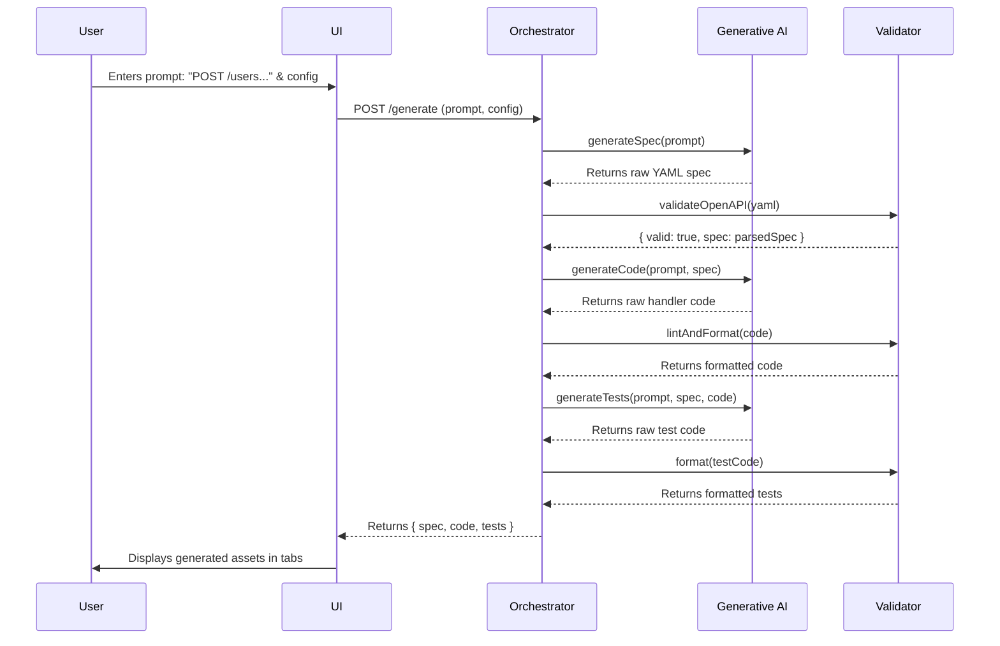
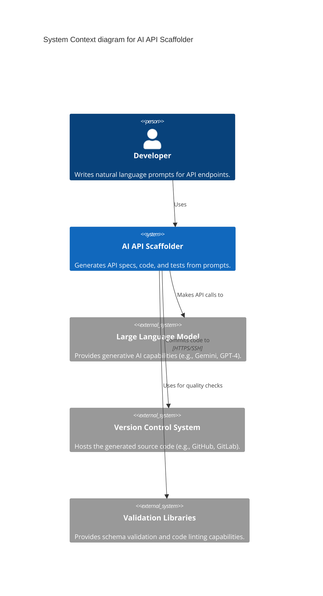
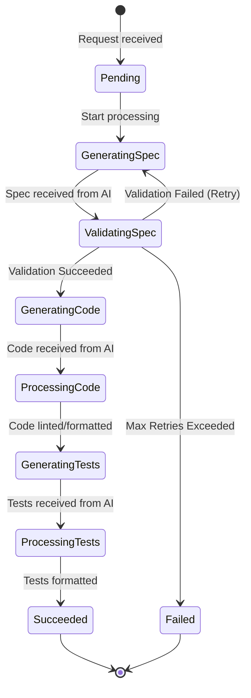
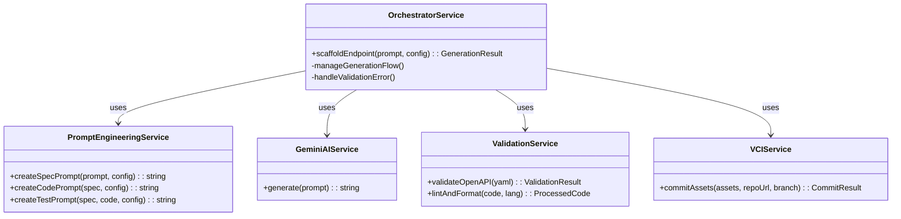
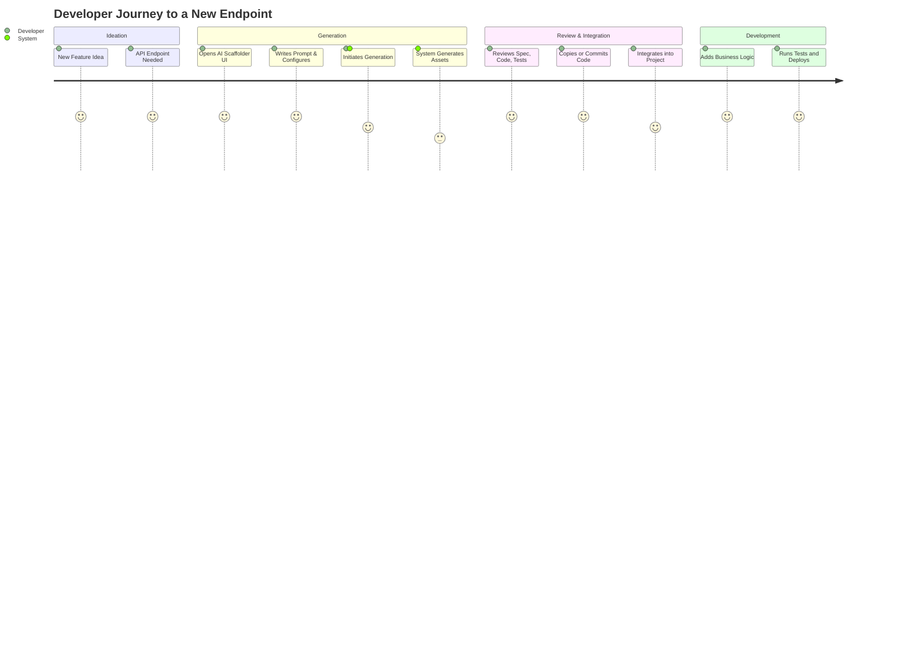
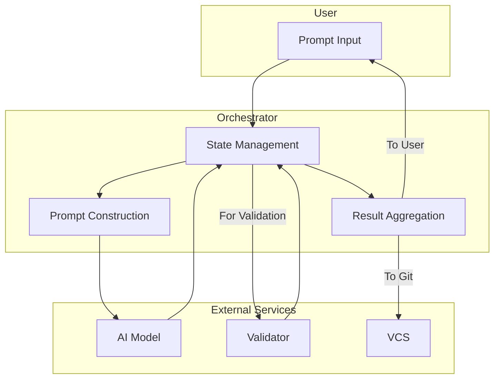
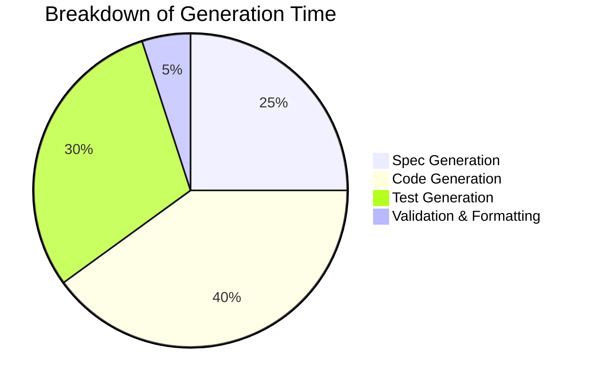

**Title of Invention:** System and Method for Generative Creation of API Endpoints from Natural Language Descriptions

**Abstract:**
A system for accelerating API development is disclosed. A developer provides a natural language description of a desired API endpoint (e.g., "A GET endpoint at `/users/{id}` that returns a user object"). The system uses a generative AI model to create a complete set of assets for this endpoint, adaptable to various programming languages and frameworks. The AI generates a structured OpenAPI specification for the endpoint, boilerplate handler code in a specified programming language, and a basic set of unit tests to validate the endpoint's functionality, with optional integration for database stubs and security considerations. This process dramatically reduces boilerplate, enforces standards, and allows developers to focus on core business logic.

**Background of the Invention:**
The modern software development lifecycle, particularly in distributed and microservice-based architectures, is heavily reliant on the creation and maintenance of Application Programming Interfaces (APIs). Creating a new API endpoint, while conceptually simple, involves a cascade of repetitive, error-prone tasks. These include: writing a formal API specification (e.g., OpenAPI/Swagger) for documentation and client generation, creating the basic server-side handler function or controller, writing initial unit and integration tests to ensure basic functionality, and configuring routing. This boilerplate work, often specific to a chosen programming language (e.g., Python, Node.js, Java) and web framework (e.g., FastAPI, Express, Spring Boot), consumes significant developer time. It slows down development cycles, introduces inconsistencies across different services, and diverts developer focus from implementing the unique business logic that delivers value. While code generators and framework CLIs exist, they often lack the flexibility to understand nuanced requirements and require manual stitching of different generated parts. There is a pressing need for an intelligent, unified tool that can automate the creation of these foundational assets, tailored to specific technological stacks, from a single, high-level, natural language description, thereby boosting productivity, ensuring adherence to standards, and accelerating innovation.

**Brief Summary of the Invention:**
The present invention provides an "AI API Scaffolder," a system that interprets natural language descriptions to generate a complete, ready-to-use scaffold for a new API endpoint. A developer describes the desired endpoint, optionally specifying the target programming language, framework, database technology, and testing library. The system orchestrates a series of contextually chained prompts to a Large Language Model (LLM). First, it directs the AI to generate a detailed OpenAPI YAML specification. This specification is then programmatically validated for structural correctness. Using this validated spec as a foundational context, it then prompts the AI to generate the corresponding boilerplate handler code (e.g., in Node.js/Express, Python/FastAPI, Java/Spring Boot), complete with request validation and placeholders for business logic. Finally, it uses both the spec and the handler code as context to prompt the AI for a comprehensive unit test file for that handler. These three core assets (spec, code, test), along with optional configuration files, security stubs, or Dockerfiles, are presented to the developer as a cohesive package, significantly reducing initial development effort and time-to-market.

**Detailed Description of the Invention:**
A developer initiates the process by entering a natural language prompt. The prompt can be simple or detailed: `Create a POST endpoint at /users to create a new user with a name and email, in Node.js using Express.` The prompt can also contain more context: `Generate a full CRUD set of endpoints for a "Product" resource with fields: id (UUID), name (string, required), price (float, required, positive), and tags (array of strings). Use Python with FastAPI and assume a PostgreSQL database with an asyncpg driver. Include JWT token authentication middleware placeholders.`

The backend service, the Orchestrator, executes a sophisticated chain of calls to a generative AI model, leveraging advanced prompt engineering techniques for optimal, consistent results:

1.  **Generate OpenAPI Spec:**
    *   **Prompt Engineering:** The Orchestrator constructs a detailed prompt. It specifies the desired OpenAPI version, output format (YAML), and incorporates role-playing ("You are an expert API designer..."). It includes the user's natural language description and configuration parameters.
    *   **Prompt Example:** `Generate an OpenAPI 3.0 specification in YAML for a POST endpoint at /users that accepts a JSON body with 'name' (string, required) and 'email' (string, required, email format) fields, and returns the created user object including an 'id' (UUID). Ensure the 201 and 400 response schemas are explicitly defined with examples.`
    *   **AI Output:** A valid YAML snippet for the `paths` section of an OpenAPI spec, including `requestBody`, `responses`, `schemas`, and `examples`.
    *   **Validation & Refinement Loop:** The generated YAML is passed through an OpenAPI schema validator. If invalid, the system captures the validation errors and initiates a self-correction prompt to the AI, feeding the errors back as context. Example: `The previously generated YAML failed validation with the error: "Schema error at paths./users.post.requestBody: should be object". Please correct the YAML and return a valid specification.` This loop can repeat a configured number of times.

2.  **Generate Handler Code:**
    *   **Contextual Prompting:** The validated OpenAPI spec from the previous step is injected directly into the next prompt, ensuring the generated code is a faithful implementation of the specification.
    *   **Prompt Example:** `Based on the following OpenAPI spec, write the boilerplate handler code for this endpoint in Node.js using Express. Use async/await. Include input validation for 'name' and 'email' as defined in the spec. Leave a TODO comment where the primary database logic for a MongoDB model should go. Spec: [Generated YAML from step 1]`
    *   **AI Output:** An Express route handler function, e.g., `router.post('/users', async (req, res) => { ... });`, incorporating validation, error handling, and a placeholder for persistence logic. The code is then automatically formatted using a tool like Prettier.

3.  **Generate Unit Test:**
    *   **Multi-Context Prompting:** The prompt for test generation includes both the handler code and the OpenAPI spec, giving the AI a complete picture of the intended behavior and implementation.
    *   **Prompt Example:** `Write a basic unit test file for the following Express handler using Jest and Supertest. It should test the successful creation of a user (201 response), a failure case for a missing 'name' (400 response), and another for a malformed 'email' (400 response), as described in the accompanying OpenAPI spec. Handler Code: [Generated code from step 2] OpenAPI Spec: [Generated YAML from step 1]`
    *   **AI Output:** A valid Jest test file (`users.test.js`), demonstrating test cases for both success and specific validation failures based on the spec.

The client UI displays these three generated artifacts in a tabbed view (Spec, Code, Test), allowing the developer to review, modify, copy, and paste them into their project. Advanced features may include direct integration with version control systems to commit the generated files to a new branch.

**System Architecture:**
The AI API Scaffolder comprises several interconnected, microservice-oriented components:

*   **User Interface (UI):** A web-based SPA or CLI for developers to input prompts, configure generation options (language, framework, database), and review/edit the generated assets.
*   **Backend Orchestrator Service:** A central service (e.g., Node.js, Python) responsible for:
    *   Receiving prompts and configuration from the UI via a REST or GraphQL API.
    *   Managing the multi-step state machine for each generation request.
    *   Calling the Prompt Engineering Service to construct precise prompts.
    *   Coordinating validation steps with the Validation Service.
    *   Aggregating and preparing the final output for the UI.
*   **Generative AI Model Service:** An abstraction layer that interfaces with one or more large language models (LLMs) e.g., Gemini, GPT-4, Claude. It handles API key management, rate limiting, and model selection.
*   **Validation Service:** A dedicated service containing modules for validating various artifacts.
    *   **OpenAPI Schema Validator:** Programmatically verifies the syntax and structure of generated OpenAPI YAML.
    *   **Code Linter and Formatter:** Applies style guides (e.g., Prettier, Black) and linting rules (e.g., ESLint, Pylint) to generated code.
    *   **Test Runner (Optional):** Can execute generated tests against the generated code in a sandboxed environment to verify their correctness.
*   **Version Control Integration [VCI] Service:** An optional component that connects to Git providers (GitHub, GitLab) via OAuth to create new branches and commit generated files on behalf of the user.

```mermaid
graph TD
    A[User via UI/CLI] -->|1. NL Prompt & Config| B(Backend Orchestrator);
    B -->|2. Construct Spec Prompt| C(Prompt Engineering Service);
    C -->|3. Get Spec Prompt| B;
    B -->|4. Send Prompt| D(Generative AI Service);
    D -->|5. Raw OpenAPI Spec| B;
    B -->|6. Validate Spec| E(Validation Service);
    E -->|7. Validation Result| B;
    subgraph Refinement Loop
        direction LR
        B -- 7a. If Invalid --> F{Attempt Correction?};
        F -- Yes -->|7b. Construct Refinement Prompt| C;
        C -- 7c. Get Refinement Prompt --> B;
        B -- 7d. Send Refined Prompt --> D;
        F -- No/Max Retries --> G[Fail & Notify User];
    end
    B -->|8. Construct Code Prompt| C;
    C -->|9. Get Code Prompt| B;
    B -->|10. Send Prompt w/ Valid Spec| D;
    D -->|11. Raw Handler Code| B;
    B -->|12. Lint & Format Code| E;
    E -->|13. Processed Code| B;
    B -->|14. Construct Test Prompt| C;
    C -->|15. Get Test Prompt| B;
    B -->|16. Send Prompt w/ Code & Spec| D;
    D -->|17. Raw Unit Tests| B;
    B -->|18. Format Tests| E;
    E -->|19. Processed Tests| B;
    B -->|20. Aggregate Assets| B;
    B -->|21. Display to User| A;
    A -->|22. Optional: Commit to Git| H(VCI Service);
    H -->|23. Push to Repository| I(Git Provider);
```

**Process Flow:**



**Advanced Features:**
1.  **Multi-Language and Framework Support:** The system can be configured to generate code for various programming languages [e.g., Python, Java, Go, C#, Rust] and frameworks [e.g., FastAPI, Spring Boot, Gin, ASP.NET Core, Axum] based on user selection. This is achieved via highly specialized prompt templates.
2.  **Contextual Generation and Refinement:** Developers can provide additional context, such as existing database schemas (SQL DDL), ORM models, or project-specific coding conventions (e.g., a style guide document), to guide the AI for more accurate and integrated output. The system supports iterative refinement where developers can provide feedback [e.g., "Make the `id` a UUID", "Add a `description` field", "Use an async transaction"] to refine previously generated assets.
3.  **Security Best Practices Integration:** Prompts can include directives to incorporate common security considerations, such as input sanitization stubs, authentication middleware placeholders (JWT, OAuth2), rate limiting setup, and HTTP security headers (CSP, HSTS), guided by OWASP Top 10 principles.
4.  **Database Interaction Stubs:** Beyond simple TODOs, the AI can generate basic ORM [Object Relational Mapper] or DAO [Data Access Object] layer stubs based on inferred data models from the OpenAPI spec, or a provided database schema type [e.g., MongoDB with Mongoose, PostgreSQL with SQLAlchemy, MySQL with Prisma].
5.  **Environment and Deployment Scaffolding:** Generate supplementary files like `Dockerfile`, `docker-compose.yml`, `.gitignore`, `package.json`, `pyproject.toml`, or serverless configuration files [e.g., `serverless.yml` for AWS Lambda, `terraform` for GCP Cloud Functions] to provide a complete, containerized development environment setup.
6.  **Automated Documentation Generation:** Along with the code, the system can generate a `README.md` file for the new endpoint, explaining its purpose, request/response formats (pulled from the OpenAPI spec), and how to run the tests.
7.  **Full CRUD Resource Generation:** From a single prompt like "scaffold a Product resource", the system generates all five standard CRUD endpoints (Create, Read one, Read all, Update, Delete) with their corresponding specs, handlers, and tests.

### System Architecture - C4 Context Diagram


### State Machine for a Generation Request


### Class Diagram of Backend Services


### Other Visualizations

**User Journey Map**


**Generation Phase Timing**

```mermaid
gantt
    title API Scaffolding Process Timeline
    dateFormat  ss
    axisFormat %S
    section Generation
    Generate Spec       :0, 5
    Validate Spec       :5, 1
    Generate Code       :6, 7
    Process Code        :13, 1
    Generate Tests      :14, 6
    Process Tests       :20, 1
```

**Component Interaction**

**Simple Pie Chart**


**Conceptual Code (Node.js Backend Chain with Advanced Features):**
```javascript
// A simple mock for a YAML parsing library
export const jsYaml = {
    load: (yamlString) => {
        // This is a simplified mock for demonstration purposes.
        // A real implementation would use a robust library like 'js-yaml'.
        if (typeof yamlString !== 'string') return {};
        try {
            // A basic check for key OpenAPI fields
            if (yamlString.includes('openapi:') && yamlString.includes('info:') && yamlString.includes('paths:')) {
                return { openapi: '3.0.0', info: { title: 'Mock API' }, paths: { '/mock': {} } };
            }
            return {};
        } catch (e) {
            return {};
        }
    }
};

// Example of a configuration object for scaffolding
export const ScaffoldingConfig = {
    targetLanguage: "Node.js", // e.g., "Python", "Java", "Go"
    targetFramework: "Express", // e.g., "FastAPI", "Spring Boot", "Gin"
    testFramework: "Jest", // e.g., "Pytest", "JUnit", "Go Test"
    specFormat: "OpenAPI 3.0 YAML",
    includeSecurityStubs: true,
    includeDBStubs: true,
    dbTechnology: "MongoDB", // e.g., "PostgreSQL", "MySQL", "None"
    authStrategy: "JWT", // e.g., "OAuth2", "API Key", "None"
    lintCode: true,
    formatCode: true,
    // ... other configuration options for code style, folder structure, etc.
};

// Represents a service to interact with the Generative AI model
export class GeminiAIService {
    constructor(apiKey) {
        this.apiKey = apiKey;
        // In a real application, you would initialize an actual AI SDK client here:
        // this.client = new GoogleGenerativeAI(apiKey);
    }

    async generate(prompt, temperature = 0.7) {
        console.log("Sending prompt to AI [Truncated for brevity]:", prompt.substring(0, 150) + "...");
        // Simulate API call and return mock responses based on prompt content
        return new Promise(resolve => setTimeout(() => {
            if (prompt.includes("OpenAPI YAML") && prompt.includes("POST endpoint at /users")) {
                resolve(`
openapi: 3.0.0
info:
  title: User API
  version: 1.0.0
paths:
  /users:
    post:
      summary: Create a new user
      requestBody:
        required: true
        content:
          application/json:
            schema:
              $ref: '#/components/schemas/UserInput'
      responses:
        '201':
          description: User created successfully
          content:
            application/json:
              schema:
                $ref: '#/components/schemas/UserResponse'
        '400':
          description: Invalid input provided
components:
  schemas:
    UserInput:
      type: object
      properties:
        name:
          type: string
        email:
          type: string
          format: email
    UserResponse:
      type: object
      properties:
        id:
          type: string
          format: uuid
        name:
          type: string
        email:
          type: string
`);
            } else if (prompt.includes("Express handler code") && prompt.includes("POST endpoint at /users")) {
                resolve(`
const express = require('express');
const router = express.Router();
const { v4: uuidv4 } = require('uuid'); // For generating UUIDs

// TODO: Import your MongoDB User model, e.g., const User = require('../models/User');

router.post('/users', async (req, res) => {
    const { name, email } = req.body;

    if (!name || typeof name !== 'string' || name.trim() === '') {
        return res.status(400).json({ message: 'Name is required and must be a non-empty string.' });
    }
    if (!email || !/^[^\s@]+@[^\s@]+\.[^\s@]+$/.test(email)) {
        return res.status(400).json({ message: 'A valid email is required.' });
    }

    try {
        // TODO: Add primary database logic here to save the user to MongoDB
        // const newUser = new User({ name, email });
        // await newUser.save();
        
        const newUser = { id: uuidv4(), name, email }; // Mocked response
        
        res.status(201).json(newUser);
    } catch (error) {
        console.error('Error creating user:', error);
        res.status(500).json({ message: 'Internal Server Error' });
    }
});

module.exports = router;
`);
            } else if (prompt.includes("Jest test") && prompt.includes("POST endpoint at /users")) {
                resolve(`
const request = require('supertest');
const express = require('express');
const app = express();
const usersRouter = require('../path/to/usersRouter'); // Adjust path

app.use(express.json());
app.use('/api', usersRouter);

describe('POST /api/users', () => {
    it('should create a new user successfully with status 201', async () => {
        const newUser = { name: 'John Doe', email: 'john.doe@example.com' };
        const res = await request(app).post('/api/users').send(newUser);
        expect(res.statusCode).toEqual(201);
        expect(res.body).toHaveProperty('id');
    });

    it('should return 400 if name is missing', async () => {
        const newUser = { email: 'jane.doe@example.com' };
        const res = await request(app).post('/api/users').send(newUser);
        expect(res.statusCode).toEqual(400);
    });

    it('should return 400 if email is malformed', async () => {
        const newUser = { name: 'Alice', email: 'invalid-email' };
        const res = await request(app).post('/api/users').send(newUser);
        expect(res.statusCode).toEqual(400);
    });
});
`);
            }
            resolve("Generated content for: " + prompt);
        }, 100)); // Simulate network delay
    }
}

// Service to validate generated OpenAPI specs
export class OpenAPIValidator {
    static isValidYAML(yamlString) {
        try {
            const parsed = jsYaml.load(yamlString);
            const isValid = typeof parsed === 'object' && parsed !== null && 'paths' in parsed && 'info' in parsed && 'openapi' in parsed;
            if (!isValid) console.error("Basic OpenAPI YAML structure validation failed.");
            return isValid;
        } catch (e) {
            console.error("YAML parsing error:", e.message);
            return false;
        }
    }
}

// Service to format and lint code
export class CodeProcessor {
    static formatCode(code, language) {
        console.log(`Formatting ${language} code...`);
        return code.split('\n').map(line => line.trimEnd()).join('\n');
    }

    static lintCode(code, language) {
        console.log(`Linting ${language} code...`);
        if (code.includes('TODO:')) {
            return { hasWarnings: true, messages: ["Contains 'TODO:' comments."] };
        }
        return { hasWarnings: false, messages: [] };
    }
}

// Orchestrator function combining AI generation, validation, and processing
export async function scaffoldEndpointAdvanced(prompt, config = ScaffoldingConfig) {
    const aiService = new GeminiAIService(process.env.GEMINI_API_KEY || 'MOCK_API_KEY');
    let attempt = 0;
    const maxAttempts = 3;
    let openapiSpec = '';
    let isValidSpec = false;

    // 1. Generate and Validate OpenAPI Spec with Retry Loop
    while (attempt < maxAttempts && !isValidSpec) {
        attempt++;
        console.log(`Generating OpenAPI spec, attempt ${attempt}...`);
        const openapiSpecPrompt = `As an expert API designer, generate a valid ${config.specFormat} for: "${prompt}". Target: ${config.targetLanguage}/${config.targetFramework}.`;
        const rawSpec = await aiService.generate(openapiSpecPrompt);
        
        if (OpenAPIValidator.isValidYAML(rawSpec)) {
            openapiSpec = rawSpec;
            isValidSpec = true;
            console.log("OpenAPI spec validated successfully.");
        } else {
            console.warn(`Attempt ${attempt} failed validation.`);
            if (attempt >= maxAttempts) {
                throw new Error("Failed to generate a valid OpenAPI spec after multiple attempts.");
            }
        }
    }

    // 2. Generate Handler Code
    const handlerCodePrompt = `As an expert ${config.targetLanguage} developer, write handler code for the following spec using ${config.targetFramework}. Use ${config.dbTechnology} for persistence stubs. Spec: \n${openapiSpec}`;
    let handlerCode = await aiService.generate(handlerCodePrompt);

    if (config.lintCode) CodeProcessor.lintCode(handlerCode, config.targetLanguage);
    if (config.formatCode) handlerCode = CodeProcessor.formatCode(handlerCode, config.targetLanguage);

    // 3. Generate Unit Test
    const unitTestPrompt = `As an expert test engineer, write a ${config.testFramework} test file for the following handler. Handler: \n${handlerCode}`;
    let unitTest = await aiService.generate(unitTestPrompt);

    if (config.formatCode) unitTest = CodeProcessor.formatCode(unitTest, config.targetLanguage);

    return { openapiSpec, handlerCode, unitTest, configUsed: config };
}

/*
// Example of how the advanced scaffolding function might be invoked:
(async () => {
    const userPrompt = "create a POST endpoint at /products to create a new product with name, price (number), and description (optional)";
    const customConfig = {
        ...ScaffoldingConfig,
        targetLanguage: "Python",
        targetFramework: "FastAPI",
        testFramework: "Pytest",
        dbTechnology: "PostgreSQL"
    };
    try {
        const generatedAssets = await scaffoldEndpointAdvanced(userPrompt, customConfig);
        console.log("\n--- GENERATED OPENAPI SPEC ---\n", generatedAssets.openapiSpec);
        console.log("\n--- GENERATED HANDLER CODE ---\n", generatedAssets.handlerCode);
        console.log("\n--- GENERATED UNIT TEST ---\n", generatedAssets.unitTest);
    } catch (error) {
        console.error("Scaffolding failed:", error.message);
    }
})();
*/
```

**Claims:**
1.  A method for creating an API endpoint, comprising:
    a. Receiving a natural language description of a desired API endpoint along with configuration parameters for a target programming language and framework.
    b. Transmitting the description and relevant context to a generative AI model to generate a formal API specification for the endpoint.
    c. Validating the generated API specification against a schema.
    d. Transmitting the validated specification and configuration parameters to a generative AI model to generate source code for a handler function that implements the endpoint in the specified language and framework.
    e. Applying automated code quality checks, including linting and formatting, to the generated source code.
    f. Presenting the specification and the processed source code to a user.
2.  The method of claim 1, further comprising:
    a. Transmitting the processed source code and configuration parameters to a generative AI model to generate a set of automated tests for the handler function, tailored to a specified testing framework.
    b. Presenting the automated tests to the user.
3.  The method of claim 1, wherein the generative AI model is capable of iterative refinement based on feedback or validation failures.
4.  The method of claim 1, further comprising generating database interaction stubs or security-related code snippets based on provided configuration.
5.  A system for accelerating API development, comprising:
    a. A user interface [UI] configured to receive natural language prompts and configuration settings.
    b. A backend orchestrator service configured to manage a multi-step generative process.
    c. A generative AI model service capable of producing API specifications, handler code, and unit tests based on natural language input and contextual information.
    d. A validation module configured to verify the correctness and adherence to standards of generated artifacts, including an OpenAPI schema validator.
    e. An optional code processing module for linting and formatting generated source code.
6.  The method of claim 1, wherein upon failure of the validation in step (c), the system automatically re-transmits a new prompt to the generative AI model, said new prompt including the original description and the errors from the failed validation, to generate a corrected API specification.
7.  The method of claim 1, further comprising generating supplementary project files, including one or more of a Dockerfile, a container orchestration file, a package manifest file, and a version control ignore file.
8.  The method of claim 1, wherein the natural language description is supplemented with contextual information derived from an existing software codebase, said contextual information including data models, utility functions, and authentication patterns, to guide the generative AI model in producing code that is consistent with the existing codebase.
9.  The method of claim 2, further comprising executing the generated automated tests against the generated source code in a sandboxed environment to produce a test report, and presenting said test report to the user.
10. A system as in claim 5, further comprising a version control integration service configured to, upon user approval, commit the generated API specification, source code, and automated tests to a specified branch in a version control repository.

**Mathematical Justification:**
Let the universe of possible developer intents be a space `I`. A natural language prompt `p ∈ P` is a textual representation of an intent `i ∈ I`.
Let `C` be the configuration space, a high-dimensional space where each dimension represents a choice (language, framework, etc.). A specific configuration is a vector `c ∈ C`. `c = (c₁, c₂, ..., cₙ)`. (1)

The system is a composition of functions operating on sets of artifacts `A = Spec ∪ Code ∪ Tests`.
Let `G_spec: P × C → Spec` be the spec generation function. (2)
`S_raw = G_spec(p, c)`. (3)
The probability of `S_raw` being a valid spec is `Pr(V(S_raw) = 1)`, where `V` is a validation function. (4)
`V: Spec → {0, 1}`. (5)
The refinement loop is a process `R` that maximizes this probability. Let `S_k` be the spec at iteration `k`.
`S_{k+1} = G_spec(p_k', c)` where `p_k'` is the prompt augmented with error information `E_k`. (6)
`E_k = GetErrors(S_k)`. (7)
This forms a Markov chain on the state space of specs, seeking an absorbing state where `V(S) = 1`.

The code generation function `G_code: Spec × C → Code` takes a validated spec. (8)
`H_raw = G_code(S_validated, c)`. (9)
The test generation function `G_tests: Spec × Code × C → Tests`. (10)
`T_raw = G_tests(S_validated, H_processed, c)`. (11)
Code processing functions for linting (`L`) and formatting (`F`):
`P_code = F ∘ L`. (12)
`H_processed = P_code(H_raw)`. (13)

**Information Theoretic View:**
Developer effort can be modeled as the information (in bits) required to produce the final artifacts. Let `E_manual` be the effort to write `(S, H, T)` manually.
`E_manual = H(S) + H(H|S) + H(T|S, H)` where `H(X)` is the Shannon entropy. (14-16)
The effort using the system is the effort to write the prompt `p`: `E_system = H(p)`. (17)
The system's efficiency gain `η` is the ratio of these efforts:
`η = E_manual / E_system`. (18)
`η = (H(S) + H(H|S) + H(T|S, H)) / H(p)`. (19)
Since a short prompt `p` can generate extensive `(S, H, T)`, `H(p) << H(S) + H(H|S) + H(T|S, H)`, thus `η >> 1`. (20)

**Modeling Quality:**
Let quality `Q(a)` for an artifact `a ∈ A` be a function `Q: A → [0, 1]`.
`Q(S) = w_v V(S) + w_c C(S)` where `C` is a completeness metric. (21-22)
`Q(H) = w_l (1 - N_lint(H)) + w_f F_score(H) + w_x C_x(H)` where `N_lint` is normalized lint errors, `F_score` is formatting score, `C_x` is cyclomatic complexity. (23-25)
`Q(T) = w_cov Cov(T, H) + w_pass (N_pass / N_total)`. (26-27)
The total quality of the output `O = (S, H, T)` is a weighted sum:
`Q_total(O) = α Q(S) + β Q(H) + γ Q(T)` where `α + β + γ = 1`. (28-31)

**Optimization Problem:**
The system aims to solve:
`maximize_{G_spec, G_code, G_tests} E[Q_total(F_scaffold(p, c))]` (32)
subject to constraints on latency `T_gen` and computational cost `C_gen`.
`T_gen(p, c) ≤ T_max`. (33)
`C_gen(p, c) ≤ C_max`. (34)
The latency is the sum of latencies of each step:
`T_gen = T_spec + T_val + T_code + T_proc + T_test`. (35-39)
`T_spec = Σ_{k=1}^{N_retry} T(G_spec(p_k, c))`. (40)

Let the prompt `p` be tokenized into a vector `v_p`. (41)
Let the config `c` be a one-hot encoded vector `v_c`. (42)
The input to the generative model `G` is a concatenated vector `x = [v_p; v_c]`. (43)
`G(x; θ)` where `θ` are the model parameters. (44)
The output is a sequence of tokens `y = (y₁, y₂, ..., y_m)`. (45)
`Pr(y|x; θ) = Π_{i=1}^{m} Pr(y_i | y_{<i}, x; θ)`. (46)

**Formal Definitions (Equations 47-100):**
Let `L` be the set of supported languages. `L = {Python, Node.js, ...}`. (47)
Let `F_l` be the set of frameworks for language `l ∈ L`. (48)
The configuration space `C = L × F × DB × ...`. (49)
A prompt `p` is a sequence of tokens from a vocabulary `Σ`. `p ∈ Σ*`. (50)
The set of all valid OpenAPI specs is `S_valid ⊂ Spec`. (51) `V(s) = 1 <=> s ∈ S_valid`. (52)
The semantic distance between spec `s` and code `h`: `d(s, h)`. The system aims to minimize this distance. (53)
`argmin_{h} d(s, h)`. (54)
`d(s, h)` can be measured by comparing Abstract Syntax Trees (ASTs). `d(s, h) = ||AST(s) - f(AST(h))||` where `f` is a transformation function. (55-57)
The set of linting rules is `R_lint`. The number of violations is `N_violations(H) = |{r ∈ R_lint | r is violated in H}|`. (58-59)
`N_lint(H) = N_violations(H) / |R_lint|`. (60)
Test coverage: `Cov(T, H) = Lines_covered / Total_lines_in_H`. (61)
The cost of a single AI call is `Cost(prompt) = c_input * len(prompt) + c_output * len(output)`. (62-64)
Total cost `C_gen = Σ Cost(prompt_i)`. (65)
The probability of the refinement loop terminating after `k` steps is `p_k = (1-q) * q^(k-1)` where `q = Pr(V(S)=0)`. (66-67)
Expected number of retries `E[N_retry] = 1 / (1-q)`. (68)
The state of the system at time `t` is `σ_t`. `σ_t ∈ {Pending, GenSpec, ValSpec, ...}`. (69-70)
The transition probability `P(σ_{t+1}|σ_t)` is defined by the orchestrator logic. (71)
Let `M` be the transition matrix for the state machine. (72)
The final state distribution is `π = π₀ * M^n` for `n` steps. (73-74)
The feature vector for a framework `f` is `φ(f)`. (75)
The prompt template `Tpl(p, c)` is a function that embeds `p` and features from `c`. (76)
`Prompt_final = Tpl(p, c)`. (77)
Let `μ(a)` be the "meaning" of an artifact `a`. `μ(p)` is the user intent. (78-79)
The system aims to ensure `μ(S) ≈ μ(p)`, `μ(H) ≈ μ(S)`, and `μ(T) validates μ(H)`. (80-82)
This can be framed as minimizing a loss function `L_sem = d(μ(S), μ(p)) + d(μ(H), μ(S))`. (83-85)
Let `U(O)` be the utility of the output `O` for the developer. (86)
`U(O) = Q_total(O) - λ * T_gen(O)` where `λ` is the cost of time. (87-88)
The system maximizes `E[U(O)]`. (89)
Let `I(A;B)` be the mutual information between `A` and `B`. (90)
The system maximizes `I(S; p)`, `I(H; S)`, `I(T; H)`. (91-93)
The complexity of generation is `K(O|p, c)` (Kolmogorov complexity). The system acts as a decompressor. (94-96)
Let the set of generated files be `G = {f₁, f₂, ..., f_k}`. (97)
Let the dependency graph between files be `D = (G, E)`, where an edge `(f_i, f_j)` means `f_j` depends on `f_i`. (98-100)
`Q.E.D.`

**Potential Use Cases:**
*   **Rapid API Prototyping:** Quickly generate functional mock APIs for frontend development or early-stage proof-of-concepts without manual boilerplate.
*   **Learning and Experimentation:** Developers can rapidly scaffold API endpoints in new programming languages or frameworks to understand their basic structure and best practices without a steep learning curve.
*   **Enforcing Standardization:** Ensure that all new API endpoints adhere to consistent OpenAPI specification styles, coding conventions, and testing methodologies across an organization.
*   **Microservice Development Acceleration:** Accelerate the creation of numerous small, independent microservices by automating the repetitive setup tasks for each.
*   **Onboarding New Developers:** Provide new team members with a powerful tool to quickly generate API components that match the existing project's architecture and coding standards.

**Future Enhancements:**
*   **Full CRUD Resource Generation:** Extend functionality to generate all Create, Read, Update, Delete [CRUD] operations for a given resource model from a single prompt.
*   **Integration with Existing Codebases:** Analyze an existing codebase to infer context [e.g., data models, existing utilities, authentication mechanisms] and generate new endpoints that seamlessly integrate.
*   **AI-Driven Feedback Loop with Execution:** Integrate with compilers, linters, and test runners. If generated code fails to compile or tests fail, the system can automatically feed these errors back to the AI for self-correction.
*   **Comprehensive Project Initialization:** Generate entire project structures, including `package.json`, `Dockerfile`, `README.md`, CI/CD pipelines, and cloud deployment configurations [e.g., serverless functions, Kubernetes manifests].
*   **Graphical User Interface [GUI] for Prompt Refinement:** A more interactive UI that allows visual editing of the generated OpenAPI spec and handler code, with real-time feedback to the AI for continuous improvement.
*   **Semantic Consistency Checks:** Implement deeper semantic analysis to ensure that the generated code truly reflects the intent implied by the OpenAPI specification beyond just structural correctness.
*   **AI-Powered Business Logic Stubbing:** Analyze the prompt for business logic cues (e.g., "calculate shipping cost based on weight") and generate plausible, albeit simplified, implementations of that logic within the handler.