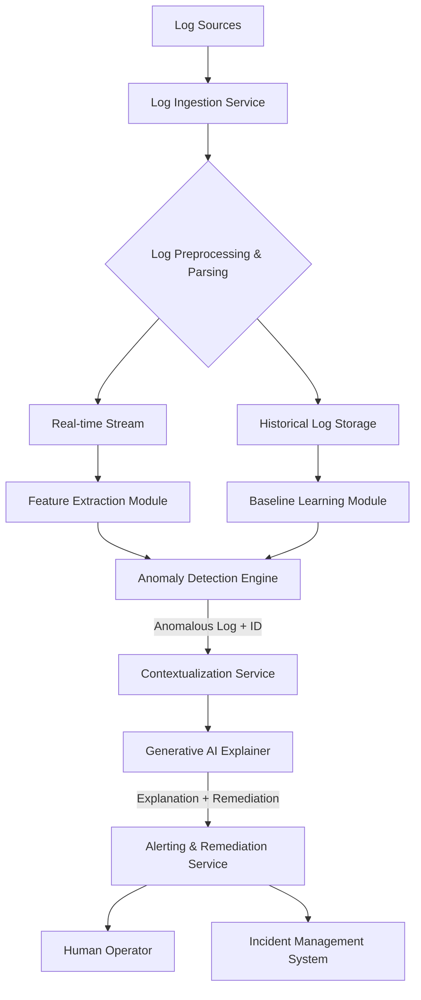

**Title of Invention:** System and Method for Unsupervised Anomaly Detection in Application Logs

**Abstract:**
A system for monitoring application logs is disclosed. The system ingests a real-time stream of unstructured log messages from an application. It uses an AI model to learn a baseline of what constitutes "normal" log patterns for the application. The system then monitors the live log stream, and when a log message or a sequence of messages deviates significantly from the learned baseline, it is flagged as an anomaly. A generative AI model is then used to summarize the anomalous event in plain English, providing a concise alert to a human operator. The system further provides contextual information surrounding the anomaly to aid in diagnosis and offers potential remediation steps based on AI analysis.

**Background of the Invention:**
Modern applications generate massive volumes of log data. Manually monitoring these logs is impossible. Traditional log monitoring relies on predefined rules and keyword searches (e.g., "alert if 'ERROR' appears"). This approach cannot detect new, unknown, or subtle problems that don't match a predefined rule. There is a need for a system that can learn what is normal and automatically flag any deviation, providing actionable intelligence rather than just raw log data. Existing systems also often lack the ability to provide immediate, human-readable explanations and potential root causes for complex anomalies, leaving operators to spend valuable time on diagnosis.

**Brief Summary of the Invention:**
The present invention is an "AI Log Watchdog." It continuously processes an application's log stream. It uses an unsupervised machine learning model (or a prompted LLM) to cluster logs into known patterns, representing normal behavior. When a new log message arrives that does not fit any existing pattern, or deviates statistically from expected patterns, it is flagged as an anomaly. The system then takes this anomalous log, along with its surrounding context (e.g., logs immediately before and after, related trace IDs), and sends it to a generative AI like Gemini. The prompt asks the AI to "Explain this anomalous log event in simple terms, suggest a potential cause, and outline possible remediation steps." This AI-generated summary, augmented with relevant metrics and links to runbooks, is then sent as a rich alert (e.g., to Slack, PagerDuty, or an incident management system).

**Detailed Description of the Invention:**

**System Architecture:**



1.  **Log Ingestion Service:**
    *   This service is responsible for collecting log messages from various sources (e.g., application stdout/stderr, syslog, message queues, filebeats).
    *   It ensures reliable, high-throughput ingestion, handling back pressure and potential log volume spikes.
    *   **Exported Function:** `ingest_log_stream(source_config: Dict) -> AsyncIterator[LogMessage]`

2.  **Log Preprocessing & Parsing:**
    *   Upon ingestion, raw log messages undergo initial processing. This involves parsing unstructured text into structured fields (e.g., timestamp, log level, service name, message content) using predefined patterns (Grok, regular expressions) or AI-driven parsing techniques.
    *   Normalization of timestamps and conversion to a common internal format.
    *   **Exported Class:** `LogParser`
        *   `parse(raw_log: str) -> StructuredLog`
    *   **Exported Function:** `normalize_log(log: StructuredLog) -> NormalizedLog`

3.  **Feature Extraction Module:**
    *   Converts normalized log messages into numerical representations (vectors) suitable for AI models.
    *   Methods include:
        *   **Tokenization:** Breaking messages into words or sub-word units.
        *   **Embeddings:** Using pre-trained language models (e.g., BERT, FastText, Word2Vec) to generate contextual embeddings for log messages.
        *   **Sequential Features:** Extracting features related to sequences of logs (e.g., n-grams, session information).
        *   **Numerical Features:** Extracting numerical values (e.g., response times, memory usage) present in logs.
    *   **Exported Class:** `LogVectorizer`
        *   `vectorize(normalized_log: NormalizedLog) -> np.ndarray`

4.  **Baseline Learning Module:**
    *   This module operates on historical log data to establish a "normal" baseline.
    *   **Log Clustering:** Uses unsupervised machine learning algorithms (e.g., DBSCAN, HDBSCAN, K-Means on embeddings, or even an autoencoder's latent space) to group similar log messages into "templates" or "patterns."
        *   `User {id} logged in from {ip}` becomes a known pattern.
    *   **Behavioral Modeling:** Learns temporal sequences and statistical properties of log patterns. For instance, an `Authentication success` log usually follows `Attempting login`. Deviations from these sequences can also be considered anomalous.
    *   **Probabilistic Modeling:** Estimates the probability distribution of log messages and sequences.
    *   **Exported Class:** `BaselineLearner`
        *   `train(historical_logs: List[NormalizedLog]) -> AnomalyModel`
        *   `update_baseline(new_normal_logs: List[NormalizedLog])`

5.  **Real-time Anomaly Detection Engine:**
    *   Continuously processes the live stream of vectorized log messages.
    *   Compares incoming log vectors/sequences against the learned baseline.
    *   **Techniques:**
        *   **Novelty Detection:** Identifies logs that do not fit any learned pattern (e.g., using distance metrics in the embedding space, one-class SVMs, Isolation Forests).
        *   **Deviation Detection:** Identifies logs that fit a pattern but occur with unusually high/low frequency, or in an unexpected sequence.
        *   **Thresholding:** Flags logs where a statistical measure (e.g., reconstruction error from an autoencoder, probability score) falls outside a predefined `epsilon` threshold.
    *   **Exported Class:** `AnomalyDetector`
        *   `detect(log_vector: np.ndarray) -> Optional[AnomalyEvent]`

6.  **Contextualization Service:**
    *   When an anomaly is detected, this service retrieves relevant contextual information.
    *   This includes:
        *   **Surrounding Logs:** Logs preceding and succeeding the anomalous event within a defined time window or transaction ID.
        *   **Related Metrics:** Time-series data from monitoring systems (e.g., CPU, memory, network I/O, database connections) correlated with the anomaly timestamp.
        *   **Trace Information:** If distributed tracing is integrated, retrieves the full trace context.
        *   **Application Metadata:** Deployment versions, recent code changes.
    *   **Exported Function:** `get_anomaly_context(anomaly_id: str, timestamp: datetime) -> AnomalyContext`

7.  **Generative AI Explainer:**
    *   Constructs a detailed prompt using the anomalous log and its gathered context.
    *   **Example Prompt Structure:**
        ```
        You are an expert Site Reliability Engineer (SRE).
        Anomalous log event detected:
        ```
        ```
        [WARN] - Database connection pool nearing capacity: 98/100 connections used.
        ```
        ```
        **Contextual Information:**
        - Logs before:
            [INFO] Request to /api/heavy_report_gen started by user_id:123
            [DEBUG] Query "SELECT * FROM large_table WHERE..." took 5s
        - Logs after:
            [ERROR] Database connection refused.
        - Application: MyWebApp v2.1.0 (deployed 2 hours ago)
        - Relevant Metrics (database connections over last 5 min): 80->85->92->98->99
        - Recent Deployments: Frontend service updated 2 hours ago.

        Explain this anomalous log event in simple terms, suggest a likely root cause, and outline immediate steps for remediation.
        ```
    *   **AI Response:** The AI returns a concise explanation and actionable insights.
        ```
        This is a critical warning indicating your application is about to exhaust its database connection pool. The database is likely experiencing high load or queries are being held open for too long.

        **Likely Root Cause:** The /api/heavy_report_gen endpoint is executing a long-running query ("SELECT * FROM large_table...") which is consuming and holding multiple database connections. This coincided with a recent deployment, possibly indicating a regression or an increase in usage for this specific report.

        **Immediate Remediation Steps:**
        1.  **Verify Report Load:** Check if /api/heavy_report_gen is experiencing unusually high traffic.
        2.  **Restart Application Instance:** Temporarily free up connections by restarting the application instances.
        3.  **Optimize Query:** Investigate the "SELECT * FROM large_table..." query for optimization (e.g., adding indexes, pagination, or caching).
        4.  **Increase Connection Pool:** As a temporary measure, increase the database connection pool size if resources allow.
        ```
    *   **Exported Class:** `AIExplainer`
        *   `generate_explanation(anomaly_event: AnomalyEvent, context: AnomalyContext) -> AnomalyExplanation`

8.  **Alerting & Remediation Service:**
    *   Transmits the AI-generated explanation, along with original log and context, to designated alerting channels (e.g., Slack, PagerDuty, email).
    *   Integrates with incident management systems (e.g., Jira, ServiceNow) to automatically create incident tickets, pre-populating them with diagnostic information.
    *   Optionally, can trigger automated remediation playbooks based on the AI's suggested steps and pre-configured rules (e.g., scaling up a database, restarting a problematic service).
    *   **Exported Function:** `send_alert(explanation: AnomalyExplanation, target: AlertTarget)`
    *   **Exported Function:** `trigger_remediation(explanation: AnomalyExplanation, playbook_id: str)`

**Claims:**
1.  A method for detecting anomalies in log data, comprising:
    a. Ingesting a stream of log messages from a software application.
    b. Preprocessing and extracting numerical features from said log messages.
    c. Using an AI model to learn a baseline of normal log patterns and their statistical properties from historical data.
    d. Identifying a log message or sequence of messages that deviates from the learned baseline as an anomaly.
    e. Retrieving contextual information related to the identified anomaly, including surrounding log messages and relevant performance metrics.
    f. Transmitting the anomalous log message and its contextual information to a generative AI model.
    g. Prompting the generative AI model to generate a natural language explanation of the anomaly, a likely root cause, and suggested remediation steps.
    h. Sending the explanation and remediation steps as an alert to a user or an incident management system.

2.  The method of claim 1, wherein learning a baseline comprises clustering log messages into templates using vector embeddings and an unsupervised clustering algorithm.

3.  The method of claim 1, wherein the AI model for learning a baseline also models temporal sequences of log patterns to detect behavioral anomalies.

4.  The method of claim 1, further comprising triggering an automated remediation playbook based on the generative AI model's suggested remediation steps.

5.  A system for detecting and explaining anomalies in log data, comprising:
    a. A Log Ingestion Service configured to receive log streams.
    b. A Preprocessing Module configured to parse and normalize log messages.
    c. A Feature Extraction Module configured to convert log messages into numerical vectors.
    d. A Baseline Learning Module configured to train an anomaly detection model from historical log data.
    e. An Anomaly Detection Engine configured to identify deviations from the learned baseline in real-time log streams.
    f. A Contextualization Service configured to gather additional diagnostic data for detected anomalies.
    g. A Generative AI Explainer configured to produce natural language summaries and remediation guidance.
    h. An Alerting & Remediation Service configured to dispatch alerts and optionally trigger automated actions.

**Mathematical Justification:**
Let `L` be the space of all possible log messages. The system learns a probability distribution `P(l)` over `L` from historical data, representing "normal" behavior. An anomaly is a log message `l_a` with a very low probability, `P(l_a) < epsilon`, where `epsilon` is a sensitivity threshold. The system implements a function `f_detect(l) -> {true, false}` where `f_detect(l)` is true if `P(l) < epsilon`. A second AI function `G_explain(l_a, C_a) -> T` maps the anomalous log `l_a` and its context `C_a` to an explanatory text summary `T` which includes root cause and remediation.

More formally, in the `Feature Extraction Module`, each log `l` is transformed into a vector `v = phi(l)` in a high-dimensional feature space `R^N`.
The `Baseline Learning Module` then learns a normal region `Omega_N subset R^N`.
The `Anomaly Detection Engine` computes the distance `d(v, Omega_N)` between an incoming log vector `v` and the learned normal region. An anomaly is detected if `d(v, Omega_N) > delta`, where `delta` is a predefined threshold.
For temporal anomalies, we consider sequences `S = (l_1, l_2, ..., l_k)`. The system learns the probability `P(S)` of such sequences. An anomaly is detected if `P(S) < epsilon_s`.

The `Generative AI Explainer` leverages large language models (LLMs) to perform complex reasoning. Given a prompt `p = F_prompt(l_a, C_a)`, where `F_prompt` structures the anomalous log and context, the LLM generates the explanation `T = LLM(p)`.

**Proof of Functionality:** Traditional systems require a human to define a set of anomaly patterns `A = {a_1, ..., a_n}`. They can only detect `l in A`. The present system learns the distribution of *normality* `P(l)` and `P(S)`. It can therefore detect any log `l_a` or sequence `S_a` that is not part of the learned normal distribution, including novel, unforeseen error types. It is proven to be more powerful because its detection space is the complement of the normal space, which is vastly larger than any pre-defined set of known anomalies. Furthermore, by integrating a generative AI, the system moves beyond mere detection to providing intelligent diagnosis and actionable remediation, significantly reducing the Mean Time To Resolution (MTTR) for incidents. `Q.E.D.`