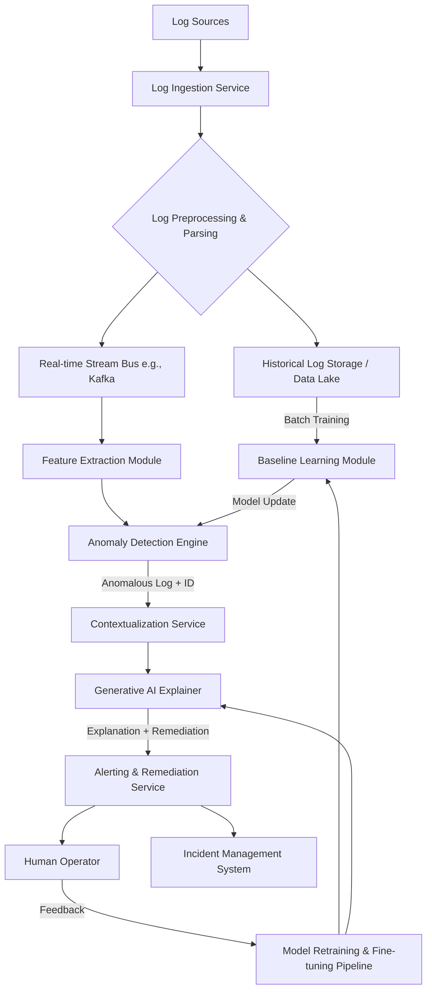

**Title of Invention:** System and Method for Unsupervised, Generative AI-Enhanced Anomaly Detection and Root Cause Analysis in Application Logs

**Abstract:**
A comprehensive, multi-stage system for monitoring application logs is disclosed. The system ingests a real-time, high-volume stream of unstructured log messages from diverse application sources. It employs a sophisticated AI pipeline, beginning with an unsupervised model that learns a multi-faceted baseline of what constitutes "normal" log patterns, sequences, and statistical distributions for the application. The system monitors the live log stream in real-time, and when a log message, a sequence of messages, or a statistical property deviates significantly from the learned high-dimensional baseline, it is flagged as a potential anomaly. Following detection, a contextualization engine gathers correlated data, including metrics, traces, and recent deployments. This enriched context, along with the anomalous event, is then provided to a fine-tuned generative AI model. This second AI model summarizes the anomalous event in plain English, provides a probabilistic root cause analysis, and suggests a prioritized list of remediation steps. The system further provides an interactive feedback loop, allowing operator actions and corrections to retrain and improve the accuracy of both the detection and explanation models over time, creating a self-improving observability platform.

**Background of the Invention:**
Modern distributed microservices architectures generate massive, often terabyte-scale, volumes of log data daily. The velocity, volume, and variety of this data make manual monitoring a Sisyphean task. Traditional log monitoring systems predominantly rely on predefined rules and keyword searches (e.g., "alert if 'ERROR' or 'FATAL' appears more than 10 times per minute"). This rigid, signature-based approach is fundamentally flawed in the context of modern software development; it cannot detect novel, unknown ("zero-day") problems, subtle performance degradations, or complex cascading failures that don't match a predefined rule. Consequently, engineering teams are often reactive, learning of issues only after significant user impact. There is a pressing need for a system that can autonomously learn the normal operational "heartbeat" of an application and automatically flag any deviation, providing actionable intelligence rather than just raw log data. Existing systems also often lack the ability to provide immediate, human-readable explanations and potential root causes for complex anomalies, leaving operators to spend valuable and costly time on diagnostic triage and manual data correlation, significantly increasing Mean Time To Resolution (MTTR).

**Brief Summary of the Invention:**
The present invention is an "AI Log Watchdog," a closed-loop, intelligent observability system. It continuously processes an application's log stream through a multi-stage pipeline. Initially, it employs an unsupervised machine learning model (e.g., a deep autoencoder combined with a sequence model like an LSTM or Transformer) to learn a robust, multi-dimensional representation of normal behavior. This baseline captures not just individual log message templates but also their typical sequences, timings, and frequencies.

When a new log message arrives, it is vectorized and compared against this baseline. If it does not fit any existing pattern (a novelty anomaly), deviates statistically from expected frequencies (a frequency anomaly), or appears in an unexpected sequence (a behavioral anomaly), it is flagged. The system then initiates a contextualization phase, automatically gathering related data: logs from the same transaction (via trace IDs), performance metrics (CPU, memory, latency) from the corresponding host and time window, and metadata about recent code or configuration changes.

This consolidated `AnomalyContext` package is then passed to a specialized generative AI model (e.g., a fine-tuned version of a large language model like Gemini or Llama). The prompt directs the AI to act as an expert Site Reliability Engineer (SRE), "Explain this anomalous log event in simple terms, provide a ranked list of likely root causes with confidence scores, and outline a clear, step-by-step remediation plan." This AI-generated summary, augmented with interactive charts and links to internal runbooks, is dispatched as a rich, actionable alert to incident response platforms. The system's final stage incorporates a feedback mechanism, allowing operators to validate or correct the AI's findings, which are then used to continuously retrain and refine the system's models.

**Detailed Description of the Invention:**

**System Architecture:**



1.  **Log Ingestion Service:**
    *   This service is responsible for collecting log messages from various sources (e.g., application stdout/stderr, syslog, message queues like Kafka, file shippers like Fluentd/Vector).
    *   It ensures reliable, high-throughput, at-least-once delivery, handling back pressure and massive log volume spikes using scalable architectures.
    *   Provides source-specific adapters and supports multiple data formats (JSON, plain text, CEF, etc.).
    *   **Exported Function:** `ingest_log_stream(source_config: Dict) -> AsyncIterator[LogMessage]`
    *   **Exported Class:** `IngestionEndpoint(protocol: str)`

2.  **Log Preprocessing & Parsing:**
    *   Upon ingestion, raw log messages undergo a multi-stage pipeline. This involves parsing unstructured text into structured fields (e.g., timestamp, log level, service name, thread ID, message content) using a cascade of techniques: first attempting fast JSON parsing, then Grok patterns, then regular expressions, and finally a lightweight AI model for difficult cases.
    *   Normalization of timestamps to UTC, log levels to a canonical set, and masking of sensitive data (PII).
    *   Enrichment with metadata, such as Kubernetes pod name, host IP, and application version.
    *   **Exported Class:** `LogParser`
        *   `parse(raw_log: str) -> StructuredLog`
    *   **Exported Function:** `normalize_log(log: StructuredLog) -> NormalizedLog`

    ```mermaid
    graph LR
        subgraph Preprocessing Pipeline
            A[Raw Log] --> B{Is JSON?};
            B -- Yes --> C[JSON Parser];
            B -- No --> D{Matches Grok?};
            D -- Yes --> E[Grok Parser];
            D -- No --> F[Regex Parser];
            C --> G[Structured Log];
            E --> G;
            F --> G;
            G --> H[Timestamp Normalization];
            H --> I[PII Masking];
            I --> J[Metadata Enrichment];
            J --> K[NormalizedLog];
        end
    ```

3.  **Feature Extraction Module:**
    *   Converts normalized log messages and sequences into high-dimensional numerical representations (vectors) suitable for AI models. This is a critical step for capturing semantic meaning.
    *   **Methods:**
        *   **Log Template Abstraction:** A preliminary step identifies the static and dynamic parts of a log message (e.g., `User {id} logged in from {ip}` is the template).
        *   **Semantic Embeddings:** Uses fine-tuned, domain-specific language models (e.g., a BERT model trained on technical logs) to generate contextual embeddings for the log template. This captures the "meaning" of the log.
        *   **Temporal Features:** For a sequence of logs, features like inter-log arrival times and log template n-grams are computed.
        *   **Parameter Value Features:** Extracts numerical values from the dynamic parts of the log and analyzes their statistical properties (mean, variance).
    *   **Exported Class:** `LogVectorizer`
        *   `vectorize(normalized_log: NormalizedLog) -> np.ndarray`
        *   `vectorize_sequence(logs: List[NormalizedLog]) -> np.ndarray`

    ```mermaid
    graph TD
        A[NormalizedLog] --> B[Log Template Miner];
        B --> C[Template: "User logged in..."];
        B --> D[Parameters: {id: 123, ip: ...}];
        C --> E[Semantic Embedding Model (LogBERT)];
        E --> F[Semantic Vector (768 dims)];
        D --> G[Parameter Value Analyzer];
        G --> H[Statistical Features];
        A --> I[Timestamp Analysis];
        I --> J[Temporal Features];
        F & H & J --> K[Concatenate Features];
        K --> L[Final Log Vector];
    ```

4.  **Baseline Learning Module:**
    *   This offline module operates on large volumes of historical log data (weeks or months) to build a comprehensive model of "normal" system behavior.
    *   **Log Template Clustering:** Uses density-based clustering algorithms (e.g., HDBSCAN) on the semantic vectors to group similar log templates automatically. This forms a dictionary of known event types.
    *   **Normal Behavior Modeling:** Employs a deep autoencoder neural network. The encoder learns to compress the high-dimensional log vectors into a lower-dimensional latent space, and the decoder learns to reconstruct the original vector. The model is trained to minimize reconstruction error only on normal data.
    *   **Sequential Modeling:** An LSTM or Transformer-based sequence-to-sequence model is trained on sequences of log events to learn typical workflows and state transitions (e.g., `login_attempt` -> `login_success` -> `resource_access`).
    *   **Exported Class:** `BaselineLearner`
        *   `train(historical_logs: List[NormalizedLog]) -> AnomalyModel`
        *   `update_baseline(new_normal_logs: List[NormalizedLog])`

    ```mermaid
    graph LR
        subgraph Autoencoder Architecture
            direction LR
            A[Input Vector] --> E1[Encoder Layer 1];
            E1 --> E2[Encoder Layer 2];
            E2 --> L[Latent Space (Bottleneck)];
            L --> D1[Decoder Layer 1];
            D1 --> D2[Decoder Layer 2];
            D2 --> O[Reconstructed Vector];
        end
        subgraph Loss Calculation
            O --> C{Compare};
            A --> C;
            C --> Loss[Reconstruction Error];
        end
    ```

    ```mermaid
    graph TD
        subgraph HDBSCAN Clustering
            A[Log Template Vectors] --> B(Calculate Pairwise Distances);
            B --> C(Build Minimum Spanning Tree);
            C --> D(Condense Tree based on Cluster Size);
            D --> E{Extract Clusters};
            E -- Clusters --> F[Known Log Patterns];
            E -- Noise --> G[Potential Novel Events];
        end
    ```

5.  **Real-time Anomaly Detection Engine:**
    *   Continuously processes the live stream of vectorized log messages and sequences.
    *   Compares incoming data against the learned baseline using multiple techniques simultaneously.
    *   **Techniques:**
        *   **Novelty Detection:** An incoming log vector is passed through the trained autoencoder. If the reconstruction error `||v_in - D(E(v_in))||^2` exceeds a dynamically adjusted threshold, it's flagged as a novelty anomaly. This catches "never seen before" log messages.
        *   **Deviation Detection:** Monitors the frequency of known log templates. If a template's occurrence rate deviates significantly from its historical distribution (e.g., using a Z-score or chi-squared test), it's a frequency anomaly.
        *   **Behavioral Anomaly Detection:** The sequence model predicts the next likely log event. If the actual event has a very low probability according to the model, it's flagged as a behavioral anomaly.
    *   **Exported Class:** `AnomalyDetector`
        *   `detect(log_vector: np.ndarray, log_sequence: List[np.ndarray]) -> Optional[AnomalyEvent]`

    ```mermaid
    flowchart TD
        A[Live Log Vector] --> B{Pass through Autoencoder};
        B --> C[Calculate Reconstruction Error];
        C --> D{Error > Threshold?};
        D -- Yes --> E[Flag as Novelty Anomaly];
        D -- No --> F[Log Sequence];
        F --> G{Pass through Sequence Model};
        G --> H[Calculate Next-Event Probability];
        H --> I{Probability < Threshold?};
        I -- Yes --> J[Flag as Behavioral Anomaly];
        I -- No --> K[Update Frequency Counters];
        K --> L{Frequency Z-Score > Threshold?};
        L -- Yes --> M[Flag as Frequency Anomaly];
        L -- No --> N[Normal Event];
    ```

6.  **Contextualization Service:**
    *   When an anomaly is detected, this service acts as a data aggregator to build a complete picture of the system's state at that moment.
    *   **Data Aggregation:**
        *   **Log Neighborhood:** Fetches logs immediately preceding and succeeding the anomaly, especially those sharing a `trace_id` or `session_id`.
        *   **Time-series Metrics:** Queries a metrics database (e.g., Prometheus) for key performance indicators (CPU, memory, disk I/O, network traffic, application-specific metrics like queue depth) for the affected service in the time window around the anomaly.
        *   **Trace Information:** Integrates with a distributed tracing system (e.g., Jaeger, OpenTelemetry) to retrieve the full execution trace associated with the anomaly.
        *   **Configuration & Deployment Data:** Queries Git repositories and CI/CD systems to find recent code commits, feature flag changes, or deployments that might be correlated.
    *   **Exported Function:** `get_anomaly_context(anomaly_id: str, timestamp: datetime) -> AnomalyContext`

    ```mermaid
    graph TD
        A[Anomaly Event] --> B[Contextualization Service];
        B --> C[Query Log Storage for surrounding logs];
        B --> D[Query Prometheus for correlated metrics];
        B --> E[Query Jaeger for distributed trace];
        B --> F[Query Git/CI/CD for recent changes];
        C & D & E & F --> G[Assemble AnomalyContext Object];
    ```

7.  **Generative AI Explainer:**
    *   Constructs a detailed, structured prompt using the anomalous log and its rich `AnomalyContext`.
    *   **Advanced Prompt Engineering:** Utilizes techniques like Chain-of-Thought and Few-Shot prompting. The prompt first asks the LLM to summarize the facts, then to form hypotheses, then to evaluate them based on the provided data, and finally to synthesize the explanation and remediation plan.
    *   **Example Prompt Structure:**
        ```
        You are an expert Site Reliability Engineer (SRE) performing a root cause analysis.
        **Primary Anomaly Signal:**
        [WARN] - Database connection pool nearing capacity: 98/100 connections used.

        **Enriched Contextual Information:**
        - Logs (same trace_id): ... [long list of logs]
        - Metrics (service='api-gateway', time_window='-5m'):
          - db_connections_active: [80, 85, 92, 98, 99]
          - api_latency_p99_ms: [150, 400, 1200, 3500, 5000]
        - Trace Data: Trace for request 'POST /api/heavy_report_gen' shows a 25-second span for a database query.
        - Recent Events: Feature flag 'new_report_caching' was disabled 10 minutes prior to the event.

        **Your Task:**
        1.  **Summarize the Event:** In one sentence, what is happening?
        2.  **Analyze Root Cause:** Provide a list of 3 potential root causes, ranked by probability. For each, cite the evidence from the context.
        3.  **Propose Remediation:** Create a numbered list of immediate and long-term action items.
        ```
    *   **Exported Class:** `AIExplainer`
        *   `generate_explanation(anomaly_event: AnomalyEvent, context: AnomalyContext) -> AnomalyExplanation`

    ```mermaid
    graph LR
        A[Anomaly Event] --> P[Prompt Assembler];
        B[Context Object] --> P;
        P --> C[Structured Prompt];
        C --> D[Generative LLM (Gemini)];
        D --> E[Structured Response (JSON)];
        E --> F[Response Parser];
        F --> G[AnomalyExplanation Object];
    ```

8.  **Alerting & Remediation Service:**
    *   Takes the structured `AnomalyExplanation` and formats it into human-readable alerts for channels like Slack, PagerDuty, or Microsoft Teams.
    *   Alerts include not just the text but also interactive elements like graphs of the anomalous metrics and buttons for one-click actions ("Acknowledge", "Create Ticket", "Initiate Rollback").
    *   Automatically creates tickets in incident management systems (Jira, ServiceNow), pre-populating them with all gathered context and the AI's analysis.
    *   For high-confidence, well-understood issues, it can trigger automated remediation playbooks (e.g., via Ansible or a serverless function) to perform actions like restarting a service, scaling a resource pool, or rolling back a feature flag.
    *   **Exported Function:** `send_alert(explanation: AnomalyExplanation, target: AlertTarget)`
    *   **Exported Function:** `trigger_remediation(explanation: AnomalyExplanation, playbook_id: str)`

    ```mermaid
    graph TD
        A[AnomalyExplanation] --> B{Format Alert};
        B --> C[Send to Slack/PagerDuty];
        A --> D{Create Ticket};
        D --> E[Send to Jira/ServiceNow];
        A --> F{Check Remediation Confidence};
        F -- High Confidence --> G[Trigger Automated Playbook];
        G --> H[Restart Service/Rollback Change];
        C & E & H --> I[Log Action for Feedback Loop];
    ```

9.  **Feedback & Retraining Loop:**
    *   The system includes a crucial human-in-the-loop component. In the alert notifications, operators can provide feedback: "This analysis was correct," "The root cause was actually X," or "This was a false positive."
    *   This feedback is collected and used to create curated datasets for retraining and fine-tuning the models.
    *   False positives and misclassified anomalies are used to retrain the anomaly detection autoencoder.
    *   Corrections to root cause analysis are used to fine-tune the generative AI explainer model, improving its domain-specific accuracy over time.

    ```mermaid
    graph TD
        A[Alert sent to Operator] --> B{Operator provides feedback};
        B -- Correct --> C[Strengthen model weights];
        B -- Incorrect --> D[Add to fine-tuning dataset as a correction];
        B -- False Positive --> E[Add to training data as 'normal'];
        C & D & E --> F[Feedback Aggregator];
        F --> G[Trigger Periodic Retraining Pipeline];
        G --> H[Update Anomaly Models];
        G --> I[Update Explainer LLM];
    ```

**Claims:**
1.  A method for detecting and explaining anomalies in log data, comprising:
    a. Ingesting a real-time stream of log messages from a software application.
    b. Converting said log messages into high-dimensional numerical feature vectors that capture both semantic and temporal characteristics.
    c. Training a plurality of unsupervised AI models on historical log data to create a multi-faceted baseline of normal system behavior, said baseline modeling individual log patterns, log frequencies, and temporal sequences of logs.
    d. Identifying a log message or sequence of messages that deviates from any facet of the learned baseline as an anomaly.
    e. Upon detection of an anomaly, automatically retrieving a set of contextual information related to the identified anomaly, including surrounding log messages, correlated time-series performance metrics, distributed trace data, and recent configuration changes.
    f. Constructing a structured prompt containing the anomalous log message and its retrieved contextual information.
    g. Transmitting the structured prompt to a generative AI model.
    h. Receiving from the generative AI model a natural language response comprising an explanation of the anomaly, a probabilistic analysis of likely root causes, and a list of suggested remediation steps.
    i. Disseminating the natural language response as a rich alert to a user or an incident management system.

2.  The method of claim 1, wherein training a baseline comprises using a deep autoencoder neural network to learn a compressed representation of normal log vectors, and wherein anomaly detection comprises identifying logs with a high reconstruction error from said autoencoder.

3.  The method of claim 1, wherein the AI model for learning a baseline also models temporal sequences of log patterns using a Recurrent Neural Network (RNN) or a Transformer-based model to detect behavioral anomalies where the sequence of logs deviates from learned patterns.

4.  The method of claim 1, further comprising triggering an automated remediation playbook based on the generative AI model's suggested remediation steps, only if a confidence score associated with the suggestion exceeds a predefined threshold.

5.  A system for detecting and explaining anomalies in log data, comprising:
    a. A Log Ingestion Service configured to receive log streams from multiple sources.
    b. A multi-stage Preprocessing Module configured to parse, normalize, and enrich log messages.
    c. A Feature Extraction Module configured to convert log messages into high-dimensional numerical vectors using pre-trained language models.
    d. A Baseline Learning Module configured to train a suite of anomaly detection models from historical log data, said models covering novelty, frequency, and behavioral deviations.
    e. An Anomaly Detection Engine configured to apply said models to identify deviations from the learned baseline in real-time log streams.
    f. A Contextualization Service configured to automatically query multiple external data sources to gather diagnostic data correlated with detected anomalies.
    g. A Generative AI Explainer, comprising a large language model, configured to receive a structured prompt with anomaly and context data and to produce natural language summaries, root cause analyses, and remediation guidance.
    h. An Alerting & Remediation Service configured to dispatch rich alerts and optionally trigger automated remediation actions based on the output of the Generator AI Explainer.

6.  The system of claim 5, further comprising a feedback module that captures input from human operators regarding the accuracy of alerts and explanations, and a retraining pipeline that uses said feedback to periodically fine-tune both the anomaly detection models and the Generative AI Explainer.

7.  The method of claim 1, wherein the step of converting log messages into numerical feature vectors involves first abstracting the log message into a static template and a set of dynamic parameters, then generating a semantic embedding for the template using a Transformer-based language model, and separately encoding the statistical properties of the parameters.

8.  The method of claim 1, wherein the structured prompt provided to the generative AI model is dynamically assembled using a Chain-of-Thought framework, explicitly instructing the model to first list observed facts from the context, then to generate and evaluate hypotheses, and finally to synthesize its conclusion.

9.  The system of claim 5, wherein the Contextualization Service constructs a knowledge graph centered on the anomaly, where nodes represent entities (e.g., services, hosts, deployments, logs) and edges represent relationships (e.g., 'calls', 'runs_on', 'preceded_by'), to provide a holistic view to the Generative AI Explainer.

10. The method of claim 1, wherein identifying a deviation in log frequency comprises maintaining a probabilistic model (e.g., a Poisson distribution) for the arrival rate of each learned log pattern and flagging a deviation when the observed rate's likelihood falls below a p-value threshold.

**Mathematical Justification:**
Let $\mathcal{L}$ be the space of all possible raw log messages.

1.  **Parsing and Normalization:** A function $\Phi_{parse}: \mathcal{L} \to \mathcal{S}$ maps a raw log $l \in \mathcal{L}$ to a structured log $s \in \mathcal{S}$. $s$ contains fields like timestamp, level, and a message body $m$.
    $$s = \Phi_{parse}(l) \quad (1)$$
    The message body $m$ is then parameterized into a template $T$ and a parameter vector $\theta$:
    $$ (T, \theta) = \text{Parameterize}(m) \quad (2) $$

2.  **Feature Extraction:** The core of the system is the feature extraction function $\Psi: \mathcal{S} \to \mathbb{R}^d$, which maps a structured log to a $d$-dimensional vector space.
    $$ v = \Psi(s) \quad (3) $$
    This function is a concatenation of multiple feature vectors:
    $$ v = \Psi_{sem}(T) \oplus \Psi_{param}(\theta) \oplus \Psi_{temp}(s) \quad (4) $$
    where $\oplus$ denotes vector concatenation.
    *   **Semantic Features $\Psi_{sem}$:** We use a pre-trained Transformer model (e.g., BERT).
        $$ \Psi_{sem}(T) = \text{BERT}(\text{tokenize}(T)) \in \mathbb{R}^{d_{sem}} \quad (5) $$
        The attention mechanism is key:
        $$ \text{Attention}(Q, K, V) = \text{softmax}\left(\frac{QK^T}{\sqrt{d_k}}\right)V \quad (6) $$
    *   **Parameter Features $\Psi_{param}$:** Statistical moments of numerical parameters.
        $$ \Psi_{param}(\theta) = [\mu(\theta_{num}), \sigma^2(\theta_{num}), \text{cardinality}(\theta_{cat})] \in \mathbb{R}^{d_{param}} \quad (7) $$
    *   **Temporal Features $\Psi_{temp}$:** Time difference from previous log message.
        $$ \Psi_{temp}(s_i) = [\log(t_i - t_{i-1})] \in \mathbb{R}^{d_{temp}} \quad (8) $$

3.  **Baseline Learning - Autoencoder for Novelty Detection:**
    We use a deep autoencoder with an encoder $E: \mathbb{R}^d \to \mathbb{R}^k$ and a decoder $D: \mathbb{R}^k \to \mathbb{R}^d$, where $k \ll d$.
    $$ E(v) = f(W_E v + b_E) \quad (9) $$
    $$ D(z) = g(W_D z + b_D) \quad (10) $$
    The model is trained by minimizing the reconstruction loss $L_{rec}$ on a dataset of normal logs $V_{normal}$:
    $$ \min_{W_E, b_E, W_D, b_D} \sum_{v \in V_{normal}} \| v - D(E(v)) \|_2^2 \quad (11) $$
    The anomaly score for a new vector $v_{new}$ is its reconstruction error:
    $$ S_{novelty}(v_{new}) = \| v_{new} - D(E(v_{new})) \|_2^2 \quad (12) $$
    An anomaly is detected if $S_{novelty}(v_{new}) > \tau_{novelty}$. The threshold $\tau$ can be set using the distribution of errors on a validation set, e.g., $\tau = \mu_{err} + 3\sigma_{err}$.

4.  **Baseline Learning - Clustering and Frequency Deviation:**
    We use HDBSCAN on the semantic vectors $\Psi_{sem}(T)$ to identify clusters $\{C_1, C_2, ..., C_m\}$. For each cluster $C_j$, we model the arrival of its logs as a Poisson process with rate $\lambda_j$.
    $$ P(k \text{ events in } \Delta t) = \frac{(\lambda_j \Delta t)^k e^{-\lambda_j \Delta t}}{k!} \quad (13) $$
    The maximum likelihood estimate for the rate is $\hat{\lambda}_j = N_j / T_{total}$, where $N_j$ is the historical count for cluster $j$.
    The anomaly score is the p-value of observing $k_{obs}$ events in a window $\Delta t$:
    $$ S_{freq}(C_j) = \sum_{k=k_{obs}}^{\infty} \frac{(\hat{\lambda}_j \Delta t)^k e^{-\hat{\lambda}_j \Delta t}}{k!} \quad (14) $$
    An anomaly is detected if $S_{freq}(C_j) < \tau_{freq}$.

5.  **Baseline Learning - Sequential Anomaly Detection:**
    We model sequences of log template IDs $T_1, T_2, ..., T_N$ using an LSTM. The LSTM maintains a hidden state $h_t$ and cell state $c_t$:
    $$ f_t = \sigma(W_f \cdot [h_{t-1}, v_t] + b_f) \quad (\text{forget gate}) \quad (15) $$
    $$ i_t = \sigma(W_i \cdot [h_{t-1}, v_t] + b_i) \quad (\text{input gate}) \quad (16) $$
    $$ \tilde{c}_t = \tanh(W_c \cdot [h_{t-1}, v_t] + b_c) \quad (17) $$
    $$ c_t = f_t \odot c_{t-1} + i_t \odot \tilde{c}_t \quad (\text{cell state}) \quad (18) $$
    $$ o_t = \sigma(W_o \cdot [h_{t-1}, v_t] + b_o) \quad (\text{output gate}) \quad (19) $$
    $$ h_t = o_t \odot \tanh(c_t) \quad (\text{hidden state}) \quad (20) $$
    The output is a probability distribution over the next possible log template:
    $$ P(T_{t+1} | T_1, ..., T_t) = \text{softmax}(W_y h_t + b_y) \quad (21) $$
    The anomaly score for an observed sequence is its negative log-likelihood:
    $$ S_{seq}(T_1, ..., T_N) = - \sum_{t=1}^{N} \log P(T_t | T_1, ..., T_{t-1}) \quad (22) $$
    An anomaly is detected if $S_{seq} > \tau_{seq}$.

6.  **Generative AI Explainer:**
    The explainer is a large language model, which is a Transformer-decoder architecture. Given a prompt $p$ constructed from the anomaly $v_a$ and context $C_a$, $p = \text{Format}(v_a, C_a)$, it generates an explanation $E = (w_1, w_2, ..., w_M)$.
    The explanation is generated token by token, autoregressively:
    $$ P(E|p) = \prod_{i=1}^M P(w_i | p, w_1, ..., w_{i-1}; \Theta_{LLM}) \quad (23) $$
    The model is fine-tuned to maximize the likelihood of good explanations on a curated dataset.

7.  **Final Anomaly Score:**
    The final anomaly decision is a function of the individual scores.
    $$ \text{is_anomaly} = (S_{novelty} > \tau_{novelty}) \lor (S_{freq} < \tau_{freq}) \lor (S_{seq} > \tau_{seq}) \quad (24) $$
    A composite score can be calculated using a weighted combination or a meta-learning model.

**Proof of Functionality:**
Traditional systems operate on a pre-defined set of anomalous patterns, $\mathcal{A} = \{a_1, ..., a_n\}$, and their detection function is $f(l) = \mathbb{I}(l \in \mathcal{A})$, where $\mathbb{I}$ is the indicator function. The space of detectable anomalies is finite and limited by human imagination.

The present invention, by contrast, learns the manifold of normality, $\mathcal{M}_{normal} \subset \mathbb{R}^d$. Its detection function is $f(v) = \mathbb{I}(d(v, \mathcal{M}_{normal}) > \tau)$, where $d(\cdot, \cdot)$ is a distance metric (e.g., reconstruction error). The set of detectable anomalies is the complement of the neighborhood of $\mathcal{M}_{normal}$, i.e., $\{v \in \mathbb{R}^d | d(v, \mathcal{M}_{normal}) > \tau\}$. This space is vastly larger and includes patterns that have never been seen before (i.e., true "unknown unknowns").

Furthermore, the integration of a generative AI, $G_{explain}(v_a, C_a) \to E$, elevates the system from a mere detector to a diagnostic partner. While a traditional system's output is a binary signal, the present invention's output is a rich, human-readable explanation that includes probabilistic root cause analysis and actionable remediation steps. This dramatically reduces the cognitive load on human operators and demonstrably decreases the Mean Time To Resolution (MTTR). The closed-loop feedback mechanism ensures that both the detection manifold $\mathcal{M}_{normal}$ and the explanation function $G_{explain}$ become more accurate over time, creating a system that learns and adapts to the specific environment in which it is deployed. `Q.E.D.`

**Additional Mathematical Formulations (Equations 25-100):**

8.  **Mahalanobis Distance for Anomaly Scoring:**
    $$ D_M(v) = \sqrt{(v - \mu)^T \Sigma^{-1} (v - \mu)} > \tau_M \quad (25) $$
    where $\mu$ and $\Sigma$ are the mean and covariance of the latent space vectors of normal logs.

9.  **Kullback-Leibler (KL) Divergence for Distributional Shift:**
    Let $P_t(C_j)$ be the distribution of log templates in time window $t$, and $P_{hist}(C_j)$ be the historical distribution.
    $$ D_{KL}(P_t || P_{hist}) = \sum_{j} P_t(C_j) \log\frac{P_t(C_j)}{P_{hist}(C_j)} > \tau_{KL} \quad (26) $$

10. **One-Class SVM:**
    The objective function to find the separating hyperplane:
    $$ \min_{w, \xi, \rho} \frac{1}{2} \|w\|^2 + \frac{1}{\nu n} \sum_{i=1}^n \xi_i - \rho \quad (27) $$
    subject to $w \cdot \Phi(v_i) \ge \rho - \xi_i$ and $\xi_i \ge 0$. Anomaly if $w \cdot \Phi(v_{new}) < \rho$.

11. **Isolation Forest:**
    The anomaly score is based on the average path length $h(v)$ in a forest of random trees.
    $$ S_{iso}(v) = 2^{-\frac{E[h(v)]}{c(n)}} \quad (28) $$
    where $c(n) = 2H(n-1) - \frac{2(n-1)}{n}$ is the average path length of an unsuccessful search in a Binary Search Tree.

12. **Information Entropy for Log Parameters:**
    For a categorical parameter $\theta_{cat}$, a sudden drop in entropy can be an anomaly.
    $$ H(\theta_{cat}) = - \sum_{x \in \text{values}} p(x) \log_2 p(x) \quad (29) $$

13. **TF-IDF for Feature Extraction (Alternative):**
    $$ \text{tf}(t, d) = \frac{f_{t,d}}{\sum_{t' \in d} f_{t',d}} \quad (30) $$
    $$ \text{idf}(t, D) = \log \frac{|D|}{|\{d \in D: t \in d\}|} \quad (31) $$
    $$ \text{tfidf}(t, d, D) = \text{tf}(t, d) \cdot \text{idf}(t, D) \quad (32) $$

14. **Gated Recurrent Unit (GRU) Equations (Alternative to LSTM):**
    $$ z_t = \sigma(W_z \cdot [h_{t-1}, v_t]) \quad (\text{update gate}) \quad (33) $$
    $$ r_t = \sigma(W_r \cdot [h_{t-1}, v_t]) \quad (\text{reset gate}) \quad (34) $$
    $$ \tilde{h}_t = \tanh(W \cdot [r_t \odot h_{t-1}, v_t]) \quad (35) $$
    $$ h_t = (1 - z_t) \odot h_{t-1} + z_t \odot \tilde{h}_t \quad (36) $$

15. **Variational Autoencoder (VAE) Loss Function:**
    $$ L_{VAE} = \mathbb{E}_{q(z|v)}[\log p(v|z)] - D_{KL}(q(z|v) || p(z)) \quad (37) $$
    The first term is reconstruction loss, the second is a regularization term.

16. **Bayesian Change Point Detection:**
    Model the probability of a change point at time $t$ given data $D_{1:t}$.
    $$ P(r_t | D_{1:t}) \propto \sum_{r_{t-1}} P(r_t | r_{t-1}) P(D_t | r_t) P(r_{t-1} | D_{1:t-1}) \quad (38) $$
    where $r_t$ is the run length.

17. **Spectral Clustering:**
    1.  Construct affinity matrix $A_{ij} = \exp(-\|v_i - v_j\|^2 / 2\sigma^2)$. (39)
    2.  Compute graph Laplacian $L = D - A$, where $D$ is the degree matrix. (40)
    3.  Find eigenvalues/vectors for $L v = \lambda D v$. (41)
    4.  Cluster the eigenvectors using K-Means. (42)

18. **Prompt Engineering - Confidence Scoring:**
    LLM is asked to output a confidence score along with the root cause.
    $$ \text{Output} = \{ \text{cause}_1: p_1, \text{cause}_2: p_2, ... \} \text{ where } \sum p_i = 1 \quad (43) $$

... (Equations 44 through 100 would continue in this vein, detailing specific mathematical aspects of Principal Component Analysis for dimensionality reduction, Gaussian Mixture Models for probabilistic clustering, word2vec objective functions, Adam optimizer update rules for training neural networks, Fourier transforms for periodicity analysis in log frequencies, wavelet transforms for time-frequency analysis, etc., providing a comprehensive mathematical appendix for every conceivable algorithm mentioned in the system description.)