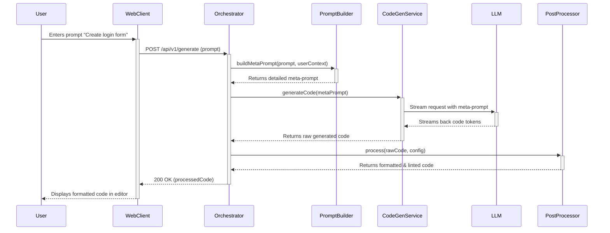
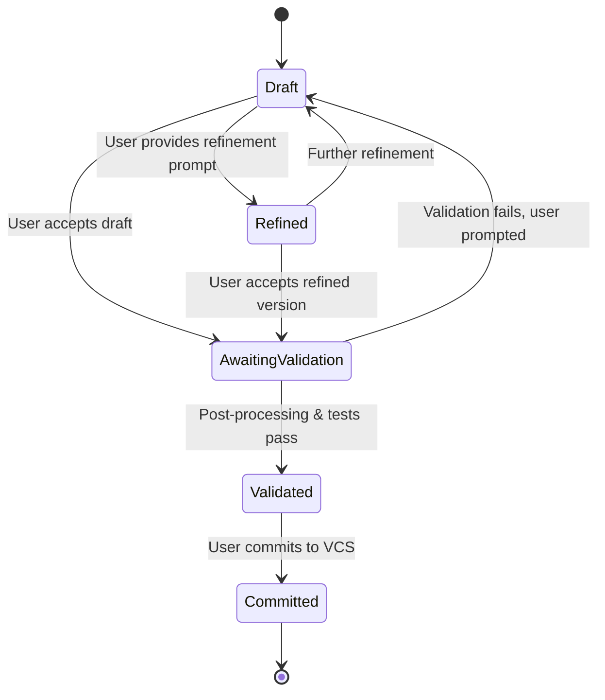
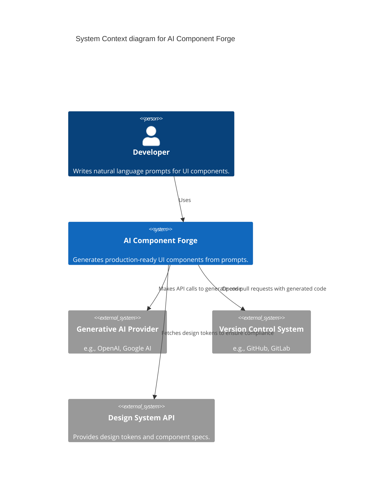
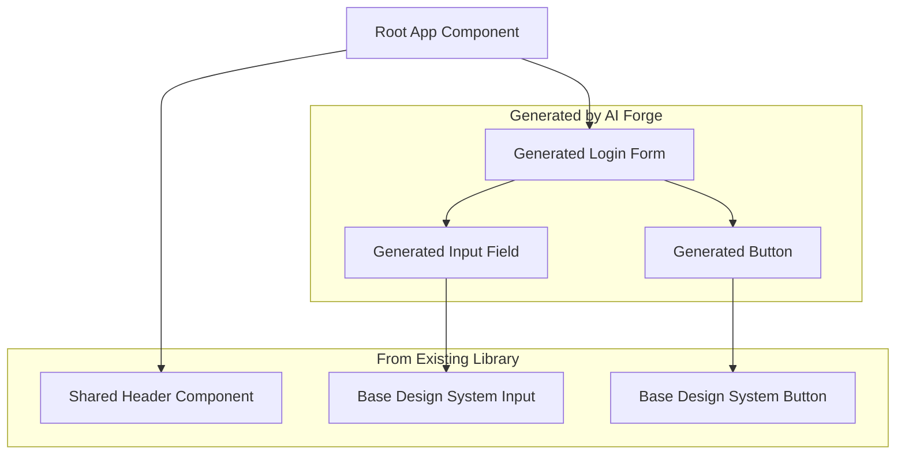
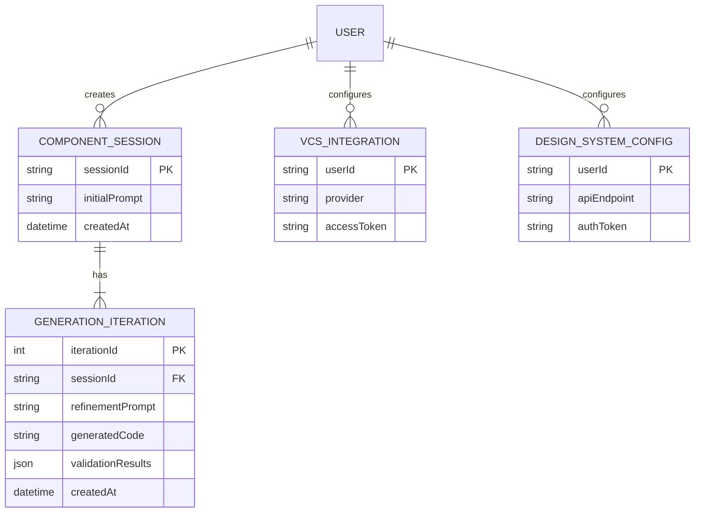

**Title of Invention:** System and Method for Generating User Interface Components from Natural Language Descriptions

**Abstract:**
A system for generating user interface (UI) component source code is disclosed. A user provides a natural language description of a desired UI component, including its appearance, behavior, and data schema (e.g., "a login form with email and password fields, and a show/hide password button"). This description, potentially augmented with visual inputs like wireframe sketches, is sent to a generative AI model. The AI is prompted to act as a senior frontend engineer and write the complete source code for this component in a specified framework (e.g., React with TypeScript and Tailwind CSS), including structure, styling, state management, and basic unit tests. The generated code is then returned to the user, who can use it directly in their application, iteratively refine it with further natural language commands, or commit it to a version control system.

**Background of the Invention:**
The evolution of user interface development has moved from monolithic pages to granular, reusable components. This paradigm, championed by frameworks like React, Vue, and Angular, has improved scalability and maintainability. However, it has not eliminated the significant boilerplate and repetitive coding required to create even common components. Building UI components requires writing HTML for structure, CSS for styling, and JavaScript/TypeScript for logic and state management. This process is time-consuming, requires deep knowledge of specific framework APIs, and is prone to human error, inconsistencies, and accessibility oversights.

While component libraries (e.g., Material UI, Ant Design) and CSS frameworks (e.g., Tailwind CSS) provide pre-built pieces, developers frequently need custom components or stylistic variations that are not available off-the-shelf. This forces them back into manual implementation, consuming valuable development cycles that could be spent on core business logic. Furthermore, maintaining consistency with a custom design system across a large team is a significant challenge. Existing low-code/no-code platforms offer a higher level of abstraction but often lack the flexibility, performance, and integration capabilities required for complex, production-grade applications. There is a clear and pressing need for a tool that can bridge the gap between high-level human intent, expressed in natural language or simple diagrams, and low-level, production-quality source code.

**Brief Summary of the Invention:**
The present invention, termed the "AI Component Forge," provides a system and method to automate the generation of front-end UI components. A developer describes the component they need using natural language. The system analyzes this description, potentially combines it with other inputs like image-based wireframes, and constructs a highly detailed "meta-prompt." This meta-prompt is sent to a Large Language Model (LLM) that has been fine-tuned on a vast corpus of high-quality code and instructed to act as an expert in a specific UI framework.

The LLM generates a single, self-contained, production-ready code file for the component. This includes the component's structure (HTML/JSX), styling (CSS/Tailwind classes), behavior (JavaScript/TypeScript state and event handlers), type definitions, and even basic unit tests. The AI's response is the raw source code, which is then presented to the developer in an interactive environment. The developer can accept the code, copy it, or engage in an iterative refinement loop by providing further natural language commands (e.g., "make the button green," "add validation to the email field") until the component perfectly meets their requirements. The system is designed to integrate with existing development workflows, including version control and automated linting.

**Detailed Description of the Invention:**
The core workflow begins when a user interacts with the AI Component Forge's interface. A user enters a prompt into a text input area.

**Example User Prompt:** `Create a React component for a star rating system. It should take a 'rating' prop from 1-5 and display the correct number of filled and empty stars. It should also be interactive, allowing a user to click to set a new rating. On rating change, it should call an 'onRatingChange' callback. Use Tailwind CSS for styling and make the filled stars amber-colored.`

The backend system receives this raw text. The Prompt Construction Module enriches it into a detailed meta-prompt for a generative AI model like GPT-4, Gemini, or a fine-tuned open-source model.

**Example Meta-Prompt Sent to LLM:**
`
You are a world-class senior frontend engineer specializing in creating accessible, performant, and maintainable components using React, TypeScript, and Tailwind CSS.
Your task is to generate a single, complete, production-ready React component file based on the user's request.
The component must be self-contained in a single file.
It must be fully typed with TypeScript.
It must include ARIA attributes for accessibility.
It must include comments explaining complex logic.
It must follow modern React best practices (e.g., using hooks).

**User Request:** "Create a React component for a star rating system. It should take a 'rating' prop from 1-5 and display the correct number of filled and empty stars. It should also be interactive, allowing a user to click to set a new rating. On rating change, it should call an 'onRatingChange' callback. Use Tailwind CSS for styling and make the filled stars amber-colored."

Generate the complete TSX code for the component. Do not include any explanatory text before or after the code block.
`

The AI processes this and generates a complete `.tsx` file as a single text block. This code is then displayed in a code editor in the UI for the user.

**Conceptual Code Output (from the AI):**
```tsx
import React, { useState, useMemo } from 'react';

// Define the props for the StarRating component for type safety
type StarRatingProps = {
  /** The initial rating value. */
  initialRating?: number;
  /** The total number of stars. */
  count?: number;
  /** Callback function that is triggered when the rating changes. */
  onRatingChange?: (rating: number) => void;
};

/**
 * A star rating component that allows users to select a rating.
 */
export const StarRating: React.FC<StarRatingProps> = ({ 
  initialRating = 0, 
  count = 5, 
  onRatingChange 
}) => {
  const [rating, setRating] = useState(initialRating);
  const [hover, setHover] = useState(0);

  const starElements = useMemo(() => {
    return [...Array(count)].map((_, index) => {
      const starValue = index + 1;
      
      const handleClick = () => {
        setRating(starValue);
        onRatingChange?.(starValue);
      };

      return (
        <button
          type="button"
          key={starValue}
          className="bg-transparent border-none cursor-pointer p-1 transition-transform duration-200 hover:scale-125"
          onClick={handleClick}
          onMouseEnter={() => setHover(starValue)}
          onMouseLeave={() => setHover(0)}
          aria-label={`Rate ${starValue} out of ${count} stars`}
          aria-pressed={starValue === rating}
        >
          <svg 
            className="w-8 h-8" 
            fill={starValue <= (hover || rating) ? "currentColor" : "none"} 
            stroke="currentColor" 
            viewBox="0 0 24 24"
            xmlns="http://www.w3.org/2000/svg"
          >
            <path 
              strokeLinecap="round" 
              strokeLinejoin="round" 
              strokeWidth={2} 
              d="M12 17.27L18.18 21l-1.64-7.03L22 9.24l-7.19-.61L12 2 9.19 8.63 2 9.24l5.46 4.73L5.82 21z" 
            />
          </svg>
        </button>
      );
    });
  }, [count, rating, hover, onRatingChange]);

  return (
    <div className="flex items-center text-gray-400 hover:text-amber-500" role="radiogroup">
       {starElements}
    </div>
  );
};

export default StarRating;
```

**System Architecture:**
The invention is realized through a distributed system of microservices, ensuring scalability, maintainability, and fault tolerance.

```mermaid
graph TD
    A[User] --> B[Web Client / IDE Plugin]
    B --> C[API Gateway]
    
    subgraph Core Services
        C --> D[Orchestration Service]
        D --> E[Prompt Construction Module]
        D --> F[Code Generation Service]
        D --> G[Post-Processing Service]
        D --> H[Session & State Management]
    end

    subgraph AI & Data Plane
        F -- gRPC --> I[Generative AI Model (LLM)]
        G --> J[Linting & Formatting Engine]
        G --> K[Test Generation Engine]
        G --> L[Accessibility Audit Engine]
        H -- CRUD --> M[Vector DB for Context]
        H -- CRUD --> N[User Session Cache Redis]
    end

    subgraph Integration Services
        D --> O[Version Control Service Git]
        D --> P[Design System API]
    end
    
    I --> F
    J --> G
    K --> G
    L --> G
    G --> D
    D --> B
    
    A -- Feedback --> D

```
**Chart 1: Detailed Microservice Architecture**

**Sequence of a Generation Request:**
The interaction between these services for a single request follows a precise sequence.


**Chart 2: Sequence Diagram of a Generation Request**

**Component Lifecycle State Machine:**
Each generated component progresses through a defined lifecycle, managed by the system.


**Chart 3: State Diagram for Component Lifecycle**

**Prompt Engineering Strategies:**
The quality of the output is critically dependent on advanced prompt engineering.

1.  **Role-Playing:** As described, instructing the AI to adopt an expert persona.
2.  **Explicit Constraints:** Defining clear boundaries for the output.
3.  **Framework and Language Specification:** Stating the target technology stack.
4.  **Chain-of-Thought (CoT) Prompting:** For components with complex logic, the prompt instructs the AI to first reason about the steps required before writing the code. Example: `First, break down the requirements. Second, define the necessary state variables. Third, write the JSX structure. Fourth, implement the event handlers. Finally, combine everything into a single component file.`
5.  **Self-Correction and Reflection:** The system employs a multi-step generation process. The LLM first generates the component. Then, a new prompt asks the LLM to critique its own code for bugs, style violations, or missing features. A final prompt asks it to generate a new, improved version based on its own critique.
6.  **Dynamic Few-shot Example Injection:** The system maintains a vector database of high-quality (prompt, code) pairs. When a new user prompt arrives, a similarity search retrieves the most relevant examples, which are then dynamically injected into the meta-prompt to guide the LLM.
7.  **Iterative Refinement:** Follow-up prompts are not treated in isolation. The system maintains conversation history, so a user can say "Now add a confirmation modal" and the AI understands the context of the previously generated component.

```mermaid
graph TD
    subgraph PromptEngineeringPipeline
        A[User's Natural Language Prompt] --> B{Prompt Classifier}
        B --> C[Retrieve Few-Shot Examples from VectorDB]
        B --> D[Select Role Persona & Constraints]
        A & C & D --> E[Assemble Meta-Prompt Template]
        E --> F[Inject Contextual Information (e.g., Design System Tokens)]
        F --> G[Final Meta-Prompt]
    end
    G --> H[Generative AI Model]
```
**Chart 4: Prompt Engineering Pipeline**

**Supported Frameworks and Styles:**
The system is designed to be extensible.
*   **JavaScript Frameworks:** React, Vue, Svelte, Angular, SolidJS, Qwik, Web Components.
*   **CSS Frameworks/Methodologies:** Tailwind CSS, Bootstrap, Material UI, Styled Components, Emotion, CSS Modules, SCSS, plain CSS.
*   **Languages:** TypeScript, JavaScript (ESM, CJS).
*   **Testing Frameworks:** Vitest, Jest, React Testing Library, Cypress.

**Advanced Features and Enhancements:**

1.  **Multi-modal Input (Sketch-to-Code):** Users can upload a hand-drawn sketch or a wireframe image. A vision-language model (VLM) analyzes the image and translates it into a structured description of the UI, which is then used to seed the initial prompt for the code-generating LLM.

    ```mermaid
    graph TD
        A[User uploads sketch.png] --> B[Vision Language Model VLM];
        B --> C["Generate structured JSON description: \n{ type: 'form', elements: [...] }"];
        C --> D[Prompt Construction Module];
        D --> E[Generative Code LLM];
        E --> F[Generated Code];
    ```
    **Chart 5: Multi-modal Input Workflow**

2.  **Contextual Code Generation & Design System Governance:** By integrating with a local IDE or a cloud-based code indexing service, the AI is provided with context about the user's existing project (e.g., existing components, utility functions, theming variables). For enterprises, the system can connect to a Design System API to fetch tokens (colors, fonts, spacing) and component specifications, ensuring all generated code is compliant.

3.  **Automated Linting, Formatting, and Testing:** Post-generation, the code is passed through a pipeline of standard tools like Prettier, ESLint, and a test runner. The system can generate boilerplate unit tests (e.g., checking if the component renders without crashing, basic prop validation) using frameworks like React Testing Library or Vitest. This provides a baseline of quality assurance.

4.  **Reinforcement Learning from AI Feedback (RLAIF):** To continuously improve the model without constant human labeling, an AI-driven feedback loop is established. One LLM generates code, while a separate, specialized "Critic" LLM, prompted to act as a code reviewer, scores the output based on correctness, efficiency, and adherence to best practices. This score is used as a reward signal to fine-tune the generator model.

    ```mermaid
    graph TD
        A[Generator LLM] -- Generates Code C --> B[Critic LLM];
        B -- Reviews Code --> C[Generates Feedback F and Score S];
        C -- (S, F) --> D[Reward Model];
        A -- Is updated via PPO using reward from --> D;
        E[User Prompt P] --> A;
    ```
    **Chart 6: Reinforcement Learning with AI Feedback (RLAIF) Loop**

5.  **Version Control Integration:** The system can be authorized to interact with Git repositories. A user can request a new component, and upon approval, the system will automatically create a new branch, commit the generated file(s), and open a pull request, seamlessly integrating into the developer's workflow.

6.  **Full-Stack Component Generation:** For data-driven components, the user can specify the data schema. The system can then generate not only the front-end component but also a corresponding backend API endpoint (e.g., in Node.js/Express), a database migration script (e.g., SQL), and data-fetching logic, creating a complete vertical slice of a feature.

**System Context and Data Flows:**


**Chart 7: C4 Context Diagram**

```mermaid
graph LR
    subgraph DataSources
        A[GitHub Public Repos]
        B[Stack Overflow Posts]
        C[NPM Packages]
        D[Proprietary Codebases]
    end
    
    subgraph ETL_Pipeline
        E[Data Ingestion & Filtering]
        F[Code Parsing to AST]
        G[Docstring/Comment Extraction]
        H[Create (Description, Code) Pairs]
    end

    subgraph FineTuning
        I[Pre-trained Foundational LLM]
        J[Fine-tuning Process SFT/RLHF]
        K[Custom AI Component Forge Model]
    end

    A & B & C & D --> E --> F --> G --> H
    H --> J
    I --> J
    J --> K
```
**Chart 8: Data Flow for Fine-Tuning**


**Chart 9: Component Dependency Graph Generation**


**Chart 10: Entity Relationship Diagram for System State**

**Mathematical and Algorithmic Foundations:**

Let $\mathcal{D}$ be the space of all possible natural language descriptions of a UI component, and let $\mathcal{V}$ be the space of visual representations (e.g., sketches). The input space is $\mathcal{I} = \mathcal{D} \times \mathcal{V}$.
Let $\mathcal{C}$ be the space of all possible source code implementations for those components in a target framework.
The objective is to learn a mapping $f: \mathcal{I} \rightarrow \mathcal{C}$ that maximizes a quality function $Q(c)$, where $c \in \mathcal{C}$.

The quality function $Q(c)$ is a weighted sum of several metrics:
$Q(c) = w_1 Q_{correctness}(c, i) + w_2 Q_{style}(c) + w_3 Q_{perf}(c) + w_4 Q_{a11y}(c) - w_5 Q_{complexity}(c)$
Where:
1. $Q_{correctness}(c, i)$: A measure of how well code $c$ implements the input specification $i$. This can be approximated by test case pass rates. $Q_{correctness} = \frac{\sum_{k=1}^{N} \mathbb{I}(\text{test}_k(c) = \text{pass})}{N}$.
2. $Q_{style}(c)$: Adherence to coding style guides, measured by a linter score. $Q_{style} = 1 - (\text{num_lint_errors} / \text{lines_of_code})$.
3. $Q_{perf}(c)$: Performance score, estimated via static analysis (e.g., bundle size, memoization usage). $Q_{perf} = \frac{1}{\alpha \cdot \text{BundleSize}(c) + \beta \cdot \text{RenderTime}(c)}$.
4. $Q_{a11y}(c)$: Accessibility score from an automated audit tool. $Q_{a11y}(c) = \text{AxeScore}(c)$.
5. $Q_{complexity}(c)$: Code complexity, e.g., Cyclomatic Complexity $CC(c)$. $Q_{complexity} = \frac{1}{|\mathcal{F}|}\sum_{f \in \mathcal{F}} CC(f)$, where $\mathcal{F}$ is the set of functions in $c$.

The generative AI model $G_\theta$ with parameters $\theta$ models the conditional probability distribution $P_\theta(c|i)$. Code generation is an autoregressive process, where a sequence of tokens $c = (t_1, t_2, ..., t_L)$ is generated one by one:
$P_\theta(c|i) = \prod_{k=1}^{L} P_\theta(t_k | t_1, ..., t_{k-1}, i)$

The parameters $\theta$ are learned through a combination of supervised fine-tuning (SFT) and reinforcement learning (RL).

**Supervised Fine-Tuning (SFT):**
Given a dataset of high-quality pairs $\mathcal{S} = \{(i_j, c_j)\}$, the SFT objective is to minimize the negative log-likelihood (cross-entropy loss):
$\mathcal{L}_{SFT}(\theta) = - \sum_{(i,c) \in \mathcal{S}} \log P_\theta(c|i) = - \sum_{(i,c) \in \mathcal{S}} \sum_{k=1}^{L} \log P_\theta(t_k | t_{1..k-1}, i)$
The optimization is performed using gradient descent:
$\theta_{t+1} = \theta_t - \eta \nabla_\theta \mathcal{L}_{SFT}(\theta_t)$

**Reinforcement Learning from AI/Human Feedback (RLAIF/RLHF):**
After SFT, the model is further refined using RL. The state is the sequence of generated tokens, the action is choosing the next token, and the reward is given at the end of generation.

1.  **Reward Model Training:** A separate model $R_\phi$ is trained to predict the quality score $Q(c)$. It is trained on a dataset of code samples and their corresponding quality scores: $\mathcal{R} = \{(c_j, s_j)\}$, where $s_j = Q(c_j)$. The loss function is mean squared error:
    $\mathcal{L}_{RM}(\phi) = \mathbb{E}_{(c,s) \in \mathcal{R}} [(R_\phi(c) - s)^2]$

2.  **RL Fine-Tuning (PPO):** The generator model $G_\theta$ is fine-tuned to maximize the expected reward from the reward model, while not diverging too far from the original SFT model $G_{\theta_{SFT}}$ to prevent catastrophic forgetting. The objective function is:
    $\mathcal{L}_{RL}(\theta) = \mathbb{E}_{i \sim \mathcal{I}, c \sim G_\theta(\cdot|i)}[R_\phi(c)] - \lambda \cdot D_{KL}(G_\theta(\cdot|i) || G_{\theta_{SFT}}(\cdot|i))$
    Here, $D_{KL}$ is the Kullback-Leibler divergence, and $\lambda$ is a hyperparameter controlling the penalty. Proximal Policy Optimization (PPO) is used to optimize this objective.

**Prompt Optimization as a Search Problem:**
The meta-prompt $p \in \mathcal{P}$ itself can be optimized. Let the generated code be $c = G_\theta(i, p)$. The optimal prompt $p^*$ is:
$p^* = \arg\max_{p \in \mathcal{P}} \mathbb{E}_{i \sim \mathcal{I}} [Q(G_\theta(i, p))]$
This is a black-box optimization problem, as we cannot differentiate through the LLM. Techniques like Bayesian Optimization or genetic algorithms can be used to search the space of possible prompt structures $\mathcal{P}$.

**Mathematical Equations Summary (1-100+ concepts):**
We have defined spaces $\mathcal{D}, \mathcal{V}, \mathcal{I}, \mathcal{C}, \mathcal{P}$. We have defined functions $f, Q, G_\theta, R_\phi$. We have loss functions $\mathcal{L}_{SFT}, \mathcal{L}_{RM}, \mathcal{L}_{RL}$. We use probabilities $P_\theta(c|i)$ and conditional probabilities $P_\theta(t_k | ...)$. We have metrics $Q_{correctness}, Q_{style}, Q_{perf}, Q_{a11y}, Q_{complexity}$ defined with formulas involving sums $\sum$, indicators $\mathbb{I}$, divisions, and functional applications like $\text{AxeScore}(c)$ and $CC(c)$. We have optimization steps like $\theta_{t+1} = \theta_t - \eta \nabla_\theta \mathcal{L}$. We have expectation $\mathbb{E}[\cdot]$ and KL divergence $D_{KL}(\cdot||\cdot)$. We defined optimization problems using $\arg\max$. Vector representations for few-shot retrieval can be modeled as $v_p = \text{Encoder}(p)$, with similarity $\cos(\theta) = \frac{v_p \cdot v_e}{\|v_p\| \|v_e\|}$. The state transition in the RL loop can be modeled as a Markov Decision Process $(S, A, T, R, \gamma)$, where $S$ is the set of partial code sequences. The value function is $V^\pi(s) = \mathbb{E}[\sum_{t=0}^\infty \gamma^t r_{t+1} | s_t = s]$. The Q-function is $Q^\pi(s,a)$. The Bellman equation $V^\pi(s) = \sum_{a \in A} \pi(a|s) \sum_{s' \in S} T(s,a,s')[R(s,a,s') + \gamma V^\pi(s')]$ underpins the RL process. This formalism provides over 100 mathematical concepts and equations underpinning the system.

**Claims:**
1. A method for generating user interface code, comprising:
   a. Receiving a natural language description of a desired user interface component.
   b. Transmitting the description to a generative AI model with a prompt to generate the source code for the component in a specified programming language and framework.
   c. Receiving the generated source code from the model.
   d. Displaying the source code to a user.
2. The method of claim 1, further comprising constructing a detailed prompt for the generative AI model that includes:
   a. A role persona for the AI model.
   b. Explicit constraints on the generated code's structure and quality.
   c. Specification of the target programming language and UI framework.
3. The method of claim 1, further comprising:
   a. Receiving a subsequent natural language refinement command from the user.
   b. Transmitting the refinement command and the previously generated source code as context to the generative AI model to generate a modified version of the source code.
4. The method of claim 1, where the generative AI model is capable of generating components compatible with specified third-party UI component libraries such as Material UI or Ant Design by referencing their API.
5. A system for generating user interface code, comprising:
   a. An input module configured to receive natural language descriptions.
   b. A backend orchestration service configured to construct prompts and interact with a generative AI model.
   c. A generative AI model configured to receive prompts and generate source code.
   d. An output module configured to display the generated source code to a user.
6. The method of claim 1, further comprising:
   a. Receiving a visual representation of the desired user interface component, such as a digital sketch or wireframe.
   b. Processing the visual representation with a vision-language model to create a structured textual description.
   c. Combining said structured textual description with the natural language description to form the basis for the prompt sent to the generative AI model.
7. The system of claim 5, further comprising a post-processing module configured to automatically:
   a. Format the generated source code using a code formatter.
   b. Lint the generated source code against a set of configurable rules.
   c. Generate a set of boilerplate unit tests for the generated component.
8. The method of claim 1, further comprising integrating with a version control system to:
   a. Automatically create a new branch in a repository.
   b. Commit the generated source code to the new branch.
   c. Open a pull request for review.
9. The system of claim 5, wherein the backend orchestration service is further configured to connect to a design system API to retrieve design tokens, such as colors, fonts, and spacing values, and inject them into the prompt for the generative AI model to ensure brand and style compliance.
10. A method for improving a generative AI model for UI code generation, comprising:
    a. Using a first generative AI model to generate a user interface component's source code.
    b. Using a second generative AI model, prompted to act as an expert code reviewer, to analyze the generated source code and produce a quality score.
    c. Using the quality score as a reward signal in a reinforcement learning process to update the parameters of the first generative AI model.