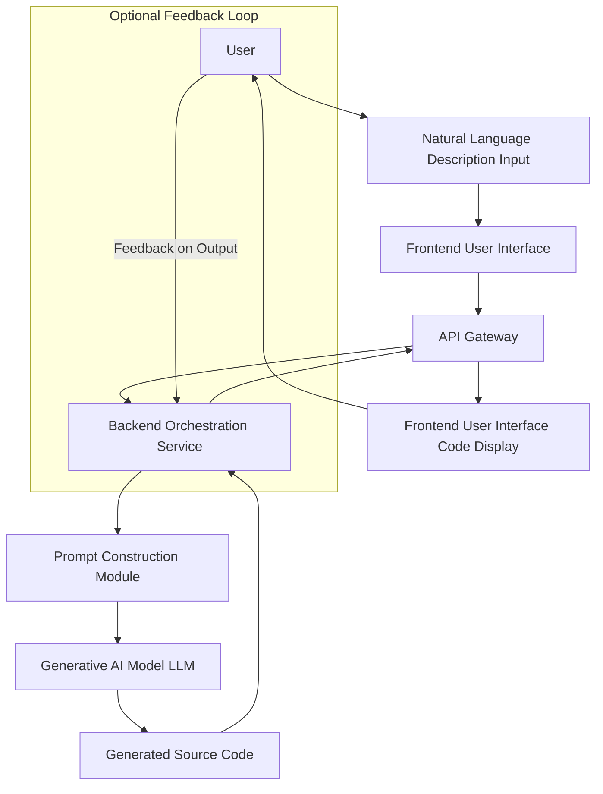

**Title of Invention:** System and Method for Generating User Interface Components from Natural Language Descriptions

**Abstract:**
A system for generating user interface (UI) component source code is disclosed. A user provides a natural language description of a desired UI component, including its appearance and behavior (e.g., "a login form with email and password fields, and a show/hide password button"). This description is sent to a generative AI model. The AI is prompted to act as a senior frontend engineer and write the complete source code for this component in a specified framework (e.g., React with TypeScript and Tailwind CSS). The generated code is then returned to the user, who can use it directly in their application.

**Background of the Invention:**
Building UI components, even common ones, requires writing boilerplate HTML, CSS, and JavaScript. This is a repetitive task that consumes significant developer time. While component libraries exist, developers often need custom components or variations that are not available off-the-shelf. There is a need for a tool that can translate a high-level visual or functional description directly into production-quality code.

**Brief Summary of the Invention:**
The present invention provides an "AI Component Forge." A developer describes the component they need. The system sends this description to an LLM that has been fine-tuned or prompted with extensive knowledge of a specific UI framework. The prompt instructs the AI to generate a single, self-contained code file for the component, including structure (HTML/JSX), styling (CSS/Tailwind), and behavior (JavaScript/TypeScript). The AI's response is the raw code, ready to be copied and pasted into a project.

**Detailed Description of the Invention:**
A user enters a prompt into the tool: `Create a React component for a star rating system. It should take a 'rating' prop from 1-5 and display the correct number of filled and empty stars. It should also be interactive, allowing a user to click to set a new rating.`

The backend constructs a detailed prompt for a generative AI model like Gemini:
`
You are a world-class senior frontend engineer specializing in React, TypeScript, and Tailwind CSS.
Your task is to generate a single, complete, production-ready React component file based on the user's request.
The component should be self-contained, well-structured, and include accessibility attributes.

**User Request:** "Create a React component for a star rating system. It should take a 'rating' prop from 1-5 and display the correct number of filled and empty stars. It should also be interactive, allowing a user to click to set a new rating."

Generate the complete TSX code for the component.
`

The AI processes this and generates a complete `.tsx` file as a single text block, including imports, type definitions, the component function, JSX with Tailwind classes, and state management for the interactive rating. This code is then displayed in a code editor in the UI for the user.

**Conceptual Code Output (from the AI):**
```tsx
import React, { useState } from 'react';

type StarRatingProps = {
  initialRating?: number;
  count?: number;
  onRatingChange?: (rating: number) => void;
};

const StarRating: React.FC<StarRatingProps> = ({ initialRating = 0, count = 5, onRatingChange }) => {
  const [rating, setRating] = useState(initialRating);
  const [hover, setHover] = useState(0);

  return (
    <div className="flex items-center">
      {[...Array(count)].map((_, index) => {
        const starValue = index + 1;
        return (
          <button
            type="button"
            key={starValue}
            className="bg-transparent border-none cursor-pointer"
            onClick={() => {
              setRating(starValue);
              onRatingChange?.(starValue);
            }}
            onMouseEnter={() => setHover(starValue)}
            onMouseLeave={() => setHover(0)}
            aria-label={`Rate ${starValue} stars`}
          >
            <svg className="w-6 h-6" fill={starValue <= (hover || rating) ? "#f59e0b" : "#6b7280"} viewBox="0 0 24 24">
              <path d="M12 17.27L18.18 21l-1.64-7.03L22 9.24l-7.19-.61L12 2 9.19 8.63 2 9.24l5.46 4.73L5.82 21z" />
            </svg>
          </button>
        );
      })}
    </div>
  );
};

export default StarRating;
```

**System Architecture:**
The core invention orchestrates several components to achieve its goal. This diagram illustrates the high-level flow from user input to generated code output.



**Prompt Engineering Strategies:**
The quality of the generated UI component is highly dependent on the prompt provided to the generative AI model. Several strategies are employed:

1.  **Role-Playing:** Instructing the AI to adopt the persona of an expert, such as "You are a world-class senior frontend engineer," guides its output style and content towards production-readiness.
2.  **Explicit Constraints:** Defining clear boundaries for the output, such as "single, complete, production-ready file," "self-contained," and "include accessibility attributes," ensures adherence to best practices and ease of integration.
3.  **Framework and Language Specification:** Directly stating the target framework (e.g., `React, TypeScript, Tailwind CSS`) ensures the generated code is compatible and immediately usable in the user's technology stack.
4.  **Few-shot Examples:** For complex or niche components, the system may implicitly or explicitly provide 1-2 examples of desired input descriptions and corresponding code outputs to further guide the AI's generation process.
5.  **Iterative Refinement:** After initial generation, users can provide follow-up natural language prompts (e.g., "Change the color scheme to dark mode," "Add an onSubmit handler") to incrementally modify and improve the component.

**Supported Frameworks and Styles:**
The system is designed to be adaptable and can be configured to support various frontend technologies.
*   **JavaScript Frameworks:** React, Vue, Svelte, Angular, Web Components.
*   **CSS Frameworks/Methodologies:** Tailwind CSS, Bootstrap, Material UI, Styled Components, Emotion, plain CSS.
*   **Languages:** TypeScript, JavaScript ES Modules.

**Advanced Features and Enhancements:**

1.  **Component Library Integration:** The system can be extended to understand and generate components that leverage existing design systems or UI libraries, such as Material UI, Ant Design, Chakra UI, etc. For example, a prompt like "Create a Material UI login form with email and password fields" would result in a React component using Material UI components.
2.  **Contextual Code Generation:** By integrating with a local code analysis tool or a cloud-based code indexing service, the AI can be provided with context about the user's existing project structure, theme, or component naming conventions. This allows for more seamless integration of generated components into an ongoing project.
3.  **Automated Linting and Formatting:** Post-generation, the code can be automatically processed by standard tools like Prettier and ESLint configured to the user's project settings, ensuring consistency and adherence to coding standards.
4.  **Basic Test Case Generation:** For increased robustness, the system can generate boilerplate unit or integration tests for the new component, using frameworks like React Testing Library or Vitest, covering basic rendering and interaction scenarios.
5.  **Accessibility Auditing:** Incorporating automated accessibility checks (e.g., using Axe Core) after generation can highlight potential issues, allowing for immediate refinement prompts or manual correction.
6.  **Version Control Integration:** Direct integration with version control systems like Git, allowing generated code to be committed to a new branch or as a proposed pull request, streamlining the developer workflow.

**Claims:**
1. A method for generating user interface code, comprising:
   a. Receiving a natural language description of a desired user interface component.
   b. Transmitting the description to a generative AI model with a prompt to generate the source code for the component in a specified programming language and framework.
   c. Receiving the generated source code from the model.
   d. Displaying the source code to a user.

2. The method of claim 1, further comprising constructing a detailed prompt for the generative AI model that includes:
   a. A role persona for the AI model.
   b. Explicit constraints on the generated code's structure and quality.
   c. Specification of the target programming language and UI framework.

3. The method of claim 1, further comprising:
   a. Receiving user feedback on the displayed source code.
   b. Using the feedback to refine the generative AI model's future outputs.

4. The method of claim 1, where the generative AI model is capable of generating components compatible with specified UI component libraries such as Material UI or Ant Design.

5. A system for generating user interface code, comprising:
   a. An input module configured to receive natural language descriptions.
   b. A backend orchestration service configured to construct prompts and interact with a generative AI model.
   c. A generative AI model configured to receive prompts and generate source code.
   d. An output module configured to display the generated source code to a user.

**Mathematical Justification:**
```
Let D be the space of all possible natural language descriptions of a UI component.
Let C be the space of all possible source code implementations for those components.
The problem is to find a mapping f: D -> C that is correct (the code implements the description) and optimal (the code is efficient, maintainable, and follows best practices).
This function f is extremely complex.
The generative AI model G_AI, trained on a vast corpus of paired descriptions and code (e.g., from GitHub issues and pull requests), learns a powerful probabilistic approximation of f.
```

**Proof of Value:**
```
The human development process is H d -> c, which has a cost Cost H.
The AI system is G_AI d -> c'.
The system provides value if:
Cost G_AI + Cost Verification c' < Cost H
Since Cost G_AI is minimal and the model is trained to produce high-quality code, the verification cost is also low.
The system is proven valuable as it automates the translation from high-level human intent to low-level, formal code, significantly reducing development time.
Q.E.D.
```