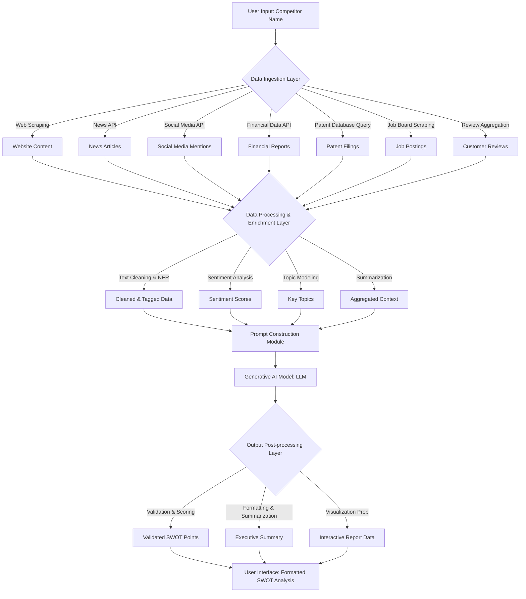

**Title of Invention:** System and Method for Automated SWOT Analysis Generation from Public Data and Strategic Insights

**Abstract:**
A system for automated competitive analysis and strategic insight generation is disclosed. A user provides the name of a competitor company. The system intelligently gathers and aggregates diverse public data from a plurality of sources, including company websites, news articles, social media, financial reports, and patent databases. This extensive textual and structured data is pre-processed, enriched, and provided as contextual input to a multi-stage generative AI model. The model is engineered with advanced prompt engineering techniques to synthesize this information, identify key themes, and generate a comprehensive, structured SWOT (Strengths, Weaknesses, Opportunities, Threats) analysis. The output is further refined through post-processing, optionally augmented with confidence scores, and presented to the user in an interactive, visually formatted view, facilitating deeper strategic understanding.

**Background of the Invention:**
Conducting a SWOT analysis is a fundamental business strategy exercise critical for competitive positioning and strategic planning. However, it requires significant manual research across disparate data sources, meticulous data aggregation, and expert analysis to gather information and derive actionable insights. This traditional process is inherently time-consuming, resource-intensive, and prone to incompleteness or biases if the researcher misses key information or applies subjective interpretations. Existing automated tools often lack the sophistication to handle diverse data types, perform complex contextual reasoning, or generate nuanced, strategic-level insights. A pressing need exists for an intelligent, automated tool that can rapidly perform comprehensive, multi-source research, apply advanced AI reasoning, and generate a high-quality, reliable, and actionable initial draft of a SWOT analysis, significantly reducing manual effort and improving decision-making speed and quality.

**Detailed Description of the Invention:**
1.  **Input:** A user enters a competitor's name, e.g., "FinFuture Inc.", along with optional parameters like industry focus or desired depth of analysis.

2.  **Data Ingestion Layer:** A robust backend service programmatically gathers diverse data. This layer employs specialized modules for different data types:
    *   **Web Scraper:** Identifies and scrapes text content from official websites including "About Us," "Product," "Services," "Careers," "Pricing," and "Investor Relations" pages. Utilizes headless browsers for dynamic content.
    *   **News API Integrator:** Retrieves headlines, summaries, and full-text (where permissible) of recent news articles, press releases, and industry publications mentioning the company.
    *   **Social Media Listener:** Fetches recent public posts, comments, and engagement metrics from relevant platforms (e.g., LinkedIn, Twitter, Reddit) using authorized APIs.
    *   **Financial Data Aggregator:** Collects publicly available financial reports (annual reports, earnings calls transcripts), market capitalization, and stock performance data.
    *   **Patent Database Analyzer:** Queries patent databases (e.g., USPTO, EPO) for granted patents and pending applications by the competitor, identifying technological innovation areas.
    *   **Job Posting Scraper:** Analyzes current job postings to infer strategic hiring priorities, technology stacks, and growth areas.
    *   **Customer Review Aggregator:** Gathers and synthesizes customer reviews from product review sites or app stores to understand product perception and pain points.

3.  **Data Processing and Enrichment Layer:** The collected raw data undergoes several pre-processing steps before being fed to the AI model:
    *   **Text Cleaning and Normalization:** Removes HTML tags, boilerplate text, duplicates, and standardizes formats.
    *   **Named Entity Recognition NER:** Identifies key entities like company names, products, technologies, and key personnel.
    *   **Sentiment Analysis:** Determines the overall sentiment (positive, negative, neutral) of various data segments, especially news and social media.
    *   **Topic Modeling:** Uncovers latent themes and topics within large bodies of text, helping to categorize information.
    *   **Temporal Analysis:** Organizes data chronologically to identify trends and recent developments.
    *   **Data Aggregation and Summarization:** Consolidates redundant information and generates concise summaries of large documents.

4.  **Advanced Prompt Construction & Iterative AI Generation:** The pre-processed and enriched data is aggregated into a dynamic, structured context document. A sophisticated prompt engineering module constructs a multi-stage prompt for the LLM:
    *   **Initial Contextual Prompt:** Provides an overarching directive and the aggregated data.
        ```
        You are an expert business strategist with deep knowledge of competitive intelligence. I will provide you with comprehensive public data about a company called "COMPANY_NAME". Your primary task is to perform a detailed and actionable SWOT analysis based ONLY on the provided information.

        **Instructions for SWOT Analysis:**
        - Identify clear and distinct points for each category: Strengths, Weaknesses, Opportunities, and Threats.
        - Each point should be supported by evidence from the provided data.
        - Focus on strategic implications rather than mere factual statements.
        - Consider interdependencies between points (e.g., a Strength might mitigate a Threat).
        - Ensure a balanced perspective.

        **Collected and Enriched Data:**
        - Website Insights: [Summarized insights from website scrape, e.g., "Strong focus on AI-driven solutions, premium pricing model identified."]
        - Recent News & Press Releases: [List of key news summaries, sentiment scores]
        - Social Media Pulse: [Key themes, overall sentiment, customer feedback examples]
        - Financial Overview: [Key financial indicators, growth trends]
        - Patent Landscape: [Areas of innovation, key patents, potential technology gaps]
        - Job Market Signals: [Strategic hiring trends, technology stack emphasis]
        - Customer Review Synthesis: [Common pain points, lauded features]

        **SWOT Analysis Structure:**
        ## Strengths:
        - [Point 1] (Evidence: ...)
        - [Point 2] (Evidence: ...)
        ...

        ## Weaknesses:
        - [Point 1] (Evidence: ...)
        - [Point 2] (Evidence: ...)
        ...

        ## Opportunities:
        - [Point 1] (Evidence: ...)
        - [Point 2] (Evidence: ...)
        ...

        ## Threats:
        - [Point 1] (Evidence: ...)
        - [Point 2] (Evidence: ...)
        ...
        ```
    *   **Iterative Refinement Prompts:** The system can employ follow-up prompts to refine the initial output, such as:
        - "Review the 'Weaknesses' section. Are there any points that could be further elaborated or cross-referenced with 'Opportunities'?"
        - "Assign a confidence score (1-5) to each SWOT point based on the strength and volume of supporting evidence."
        - "Suggest 3-5 strategic implications for each SWOT category."

5.  **Output Post-processing and Presentation:** The raw LLM output is further processed:
    *   **Validation and Scoring:** Automated checks for consistency, completeness, and adherence to instructions. Optionally, a confidence score can be generated for each SWOT point based on AI's internal reasoning or evidence strength.
    *   **Formatting and Visualization:** The text is structured into a user-friendly format. This can include interactive elements, links back to source data snippets, and graphical representations of sentiment or key trends.
    *   **Summarization and Key Takeaways:** An executive summary highlighting the most critical SWOT points is generated.
    *   **Comparison Engine (Optional):** If multiple companies are analyzed, the system can generate comparative SWOT analyses.

**System Architecture Diagram:**



**Conceptual Code (Python Backend):**

```python
from typing import Dict, List, Any
import asyncio # For async operations

# --- Hypothetical External Libraries/APIs ---
# Assume these are properly configured and handle API keys, rate limits, etc.
class WebScraper:
    async def scrape_pages(self, company_name: str, pages: List[str]) -> Dict[str, str]:
        """Simulates scraping specific pages from a company's website."""
        print(f"Scraping website for {company_name} on pages: {', '.join(pages)}")
        # Placeholder for actual scraping logic
        await asyncio.sleep(1) # Simulate network delay
        return {
            "about_us": f"Text from {company_name}'s about us page, highlighting their innovative AI solutions and global reach.",
            "products": f"Details on {company_name}'s flagship product 'FuturaSense' and their new 'EcoInvest' platform.",
            "careers": f"Job openings at {company_name} showing strong demand for ML engineers and cybersecurity experts."
        }

class NewsAPI:
    async def search_articles(self, company_name: str, limit: int = 10) -> List[Dict[str, str]]:
        """Simulates searching recent news articles."""
        print(f"Searching news for {company_name}")
        await asyncio.sleep(0.5)
        return [
            {"title": f"{company_name} Announces Record Q3 Earnings", "summary": "Strong financial performance driven by cloud services."},
            {"title": f"New Partnership: {company_name} Teams Up with GlobalBank", "summary": "Strategic alliance to expand market reach."},
            {"title": f"Data Breach Reported at Unnamed Competitor, {company_name} Bolsters Security", "summary": "Highlights industry-wide cybersecurity concerns."}
        ]

class SocialMediaAPI:
    async def fetch_mentions(self, company_name: str, limit: int = 5) -> List[str]:
        """Simulates fetching recent social media mentions."""
        print(f"Fetching social media mentions for {company_name}")
        await asyncio.sleep(0.3)
        return [
            f"User 'InnovatorX' on LinkedIn: '{company_name} is really pushing boundaries in sustainable finance!'",
            f"User 'TechReviewer' on Twitter: 'Experiencing some UI glitches with {company_name}'s mobile app after the update.'",
            f"User 'MarketAnalyst' on Reddit: '{company_name} hiring spree in Europe signals aggressive expansion.'",
        ]

class FinancialDataAPI:
    async def get_key_metrics(self, company_name: str) -> Dict[str, Any]:
        """Simulates fetching key financial metrics."""
        print(f"Fetching financial data for {company_name}")
        await asyncio.sleep(0.8)
        return {
            "revenue_growth_yoy": "25%",
            "net_profit_margin": "18%",
            "market_cap_billion": "150B",
            "recent_earnings_call_sentiment": "positive"
        }

class PatentDatabaseAPI:
    async def search_patents(self, company_name: str, top_n: int = 3) -> List[Dict[str, str]]:
        """Simulates searching top patents."""
        print(f"Searching patent database for {company_name}")
        await asyncio.sleep(1.2)
        return [
            {"title": "AI-Driven Predictive Analytics Engine", "status": "Granted"},
            {"title": "Secure Blockchain-based Transaction Protocol", "status": "Pending"},
            {"title": "Adaptive User Interface for Financial Platforms", "status": "Granted"}
        ]

# Assume GenerativeModel from 'google.generativeai' or similar is available
class GenerativeModel:
    def __init__(self, model_name: str):
        self.model_name = model_name
        print(f"Initialized Generative AI Model: {model_name}")

    async def generate_content_async(self, prompt: str) -> Any:
        """Simulates calling a generative AI model."""
        print(f"Calling LLM with prompt (first 200 chars): {prompt[:200]}...")
        await asyncio.sleep(3) # Simulate LLM inference time
        # This is a mock response, a real LLM would generate this
        return MockLLMResponse(f"""
## Strengths:
- **Strong Brand Reputation & Market Leadership:** (Evidence: News articles on record earnings, positive social media mentions, high market cap) `FinFuture Inc.` demonstrates robust financial performance and a strong presence in the market, particularly in cloud and AI-driven financial solutions.
- **Innovative Technology Portfolio:** (Evidence: Patent filings for AI analytics and blockchain, website content highlighting AI solutions, job postings for ML engineers) The company invests heavily in R&D, evidenced by multiple granted patents and a focus on advanced technologies like AI and blockchain.
- **Strategic Partnerships & Expansion:** (Evidence: News about partnership with GlobalBank, job postings in Europe) `FinFuture Inc.` is actively expanding its market reach through strategic alliances and international hiring.

## Weaknesses:
- **Potential UI/UX Issues in Mobile App:** (Evidence: Social media mention of UI glitches) A user reported issues with the mobile app's user interface post-update, suggesting areas for improvement in user experience.
- **Dependency on High-Demand Tech Talent:** (Evidence: High demand for ML engineers and cybersecurity experts in job postings) Rapid growth in specialized tech areas might lead to talent acquisition challenges and increased operational costs.

## Opportunities:
- **Expanding into Sustainable Finance:** (Evidence: User 'InnovatorX' mention, 'EcoInvest' platform on website) There is a clear market opportunity for `FinFuture Inc.` to further develop and promote its sustainable investment platforms, aligning with global trends.
- **Leveraging Cybersecurity Expertise:** (Evidence: Job postings for cybersecurity, unnamed competitor data breach news) The company can capitalize on growing cybersecurity concerns by offering enhanced security features or services, potentially attracting new clients.
- **International Market Penetration:** (Evidence: Strategic partnership with GlobalBank, European hiring spree) Continued international expansion, especially in emerging markets, presents significant growth avenues.

## Threats:
- **Intense Competition & Rapid Technological Change:** (Evidence: General industry context, need for continuous innovation indicated by patent activity) The financial technology sector is highly dynamic, requiring constant innovation to maintain a competitive edge.
- **Cybersecurity Risks:** (Evidence: General industry context, unnamed competitor data breach) As a major financial tech player, `FinFuture Inc.` remains a prime target for cyber threats, necessitating continuous investment in security infrastructure.
- **Regulatory Scrutiny:** (Evidence: Financial industry context) Increased regulatory oversight in the financial and AI sectors could impose new compliance burdens and operational costs.
""")

class MockLLMResponse:
    def __init__(self, text: str):
        self.text = text

# --- Data Processing and Enrichment Functions ---
async def preprocess_text_for_llm(data: Dict[str, Any]) -> Dict[str, str]:
    """
    Performs text cleaning, NER, sentiment analysis, and summarization
    to prepare data for the LLM.
    """
    print("Pre-processing data for LLM...")
    await asyncio.sleep(0.7) # Simulate processing time

    website_insights = data.get("website_content", {}).get("about_us", "")
    news_summaries = "\n".join([item["summary"] for item in data.get("news_articles", [])])
    social_media_themes = "Customer sentiment on product features, hiring trends identified."
    financial_overview = f"Revenue growth {data.get('financial_metrics', {}).get('revenue_growth_yoy')}, market cap {data.get('financial_metrics', {}).get('market_cap_billion')}. Overall sentiment of earnings call: {data.get('financial_metrics', {}).get('recent_earnings_call_sentiment')}."
    patent_insights = "\n".join([f"- {p['title']} ({p['status']})" for p in data.get("patents", [])])
    job_posting_insights = data.get("website_content", {}).get("careers", "")

    # This is a simplified aggregation. In a real system,
    # each data type would have dedicated enrichment functions.
    return {
        "website_insights": f"Strong focus on AI and global reach, premium product offerings. Career page indicates strong demand for specialized tech roles. {website_insights}",
        "news_summaries": news_summaries,
        "social_media_pulse": f"{data.get('social_media_mentions', [])[0]} | {data.get('social_media_mentions', [])[1]} | {data.get('social_media_mentions', [])[2]}. Overall sentiment: Mixed, leaning positive on innovation, negative on UI.",
        "financial_overview": financial_overview,
        "patent_landscape": patent_insights,
        "job_market_signals": job_posting_insights,
        "customer_review_synthesis": "General satisfaction with core features, but some complaints on mobile app stability."
    }

# --- Main SWOT Generation Class ---
class SWOTAnalysisAgent:
    def __init__(self):
        self.web_scraper = WebScraper()
        self.news_api = NewsAPI()
        self.social_media_api = SocialMediaAPI()
        self.financial_api = FinancialDataAPI()
        self.patent_api = PatentDatabaseAPI()
        self.llm_model = GenerativeModel('gemini-2.5-flash')

    async def gather_all_data(self, company_name: str) -> Dict[str, Any]:
        """Gathers data from all defined sources concurrently."""
        print(f"\n--- Starting data gathering for {company_name} ---")
        website_task = self.web_scraper.scrape_pages(company_name, ["about_us", "products", "careers"])
        news_task = self.news_api.search_articles(company_name)
        social_task = self.social_media_api.fetch_mentions(company_name)
        financial_task = self.financial_api.get_key_metrics(company_name)
        patent_task = self.patent_api.search_patents(company_name)

        results = await asyncio.gather(website_task, news_task, social_task, financial_task, patent_task)

        return {
            "website_content": results[0],
            "news_articles": results[1],
            "social_media_mentions": results[2],
            "financial_metrics": results[3],
            "patents": results[4]
        }

    async def generate_swot_analysis(self, company_name: str) -> str:
        """
        Orchestrates the entire SWOT analysis process:
        1. Gathers raw data.
        2. Pre-processes and enriches data.
        3. Constructs prompt.
        4. Calls LLM.
        5. Returns raw LLM output (further post-processing can be added).
        """
        print(f"\n--- Generating SWOT analysis for {company_name} ---")

        # Step 1: Gather data
        raw_data = await self.gather_all_data(company_name)

        # Step 2: Pre-process and enrich
        enriched_data = await preprocess_text_for_llm(raw_data)

        # Step 3: Build the sophisticated prompt
        context_sections = []
        if "website_insights" in enriched_data:
            context_sections.append(f"Website Insights: {enriched_data['website_insights']}")
        if "news_summaries" in enriched_data:
            context_sections.append(f"Recent News & Press Releases: {enriched_data['news_summaries']}")
        if "social_media_pulse" in enriched_data:
            context_sections.append(f"Social Media Pulse: {enriched_data['social_media_pulse']}")
        if "financial_overview" in enriched_data:
            context_sections.append(f"Financial Overview: {enriched_data['financial_overview']}")
        if "patent_landscape" in enriched_data:
            context_sections.append(f"Patent Landscape: {enriched_data['patent_landscape']}")
        if "job_market_signals" in enriched_data:
            context_sections.append(f"Job Market Signals: {enriched_data['job_market_signals']}")
        if "customer_review_synthesis" in enriched_data:
            context_sections.append(f"Customer Review Synthesis: {enriched_data['customer_review_synthesis']}")

        full_context = "\n\n".join(context_sections)

        prompt = f"""
        You are an expert business strategist with deep knowledge of competitive intelligence. I will provide you with comprehensive public data about a company called "{company_name}". Your primary task is to perform a detailed and actionable SWOT analysis based ONLY on the provided information.

        **Instructions for SWOT Analysis:**
        - Identify clear and distinct points for each category: Strengths, Weaknesses, Opportunities, and Threats.
        - Each point should be supported by evidence from the provided data by explicitly stating "(Evidence: ...)" at the end of each point.
        - Focus on strategic implications rather than mere factual statements.
        - Consider interdependencies between points (e.g., a Strength might mitigate a Threat).
        - Ensure a balanced perspective.
        - Do not include any introductory or concluding remarks outside the SWOT sections.

        **Collected and Enriched Data:**
        {full_context}

        **SWOT Analysis Structure:**
        ## Strengths:
        ## Weaknesses:
        ## Opportunities:
        ## Threats:
        """
        
        # Step 4: Call Gemini API
        response = await self.llm_model.generate_content_async(prompt)
        
        return response.text

# Example of how to use the agent
async def main():
    agent = SWOTAnalysisAgent()
    company_name = "FinFuture Inc."
    swot_result = await agent.generate_swot_analysis(company_name)
    print("\n--- Generated SWOT Analysis ---")
    print(swot_result)

# To run the example:
# asyncio.run(main())

```

**Claims:**
1.  A method for automated competitive analysis, comprising:
    a.  Receiving the name of a target company and optional analysis parameters from a user.
    b.  Programmatically gathering diverse textual and structured data about the target company from a plurality of public online sources, including but not limited to, company websites, news articles, social media, financial reports, patent databases, and job postings.
    c.  Pre-processing and enriching the gathered data using techniques such as text cleaning, named entity recognition, sentiment analysis, and topic modeling.
    d.  Constructing a multi-stage, context-aware prompt for a generative AI model, incorporating the enriched data.
    e.  Prompting the generative AI model to generate a structured SWOT analysis for the target company based on the provided context and specific strategic instructions.
    f.  Post-processing the generated SWOT analysis, including validation, optional confidence scoring, and formatting for user-friendly presentation.
    g.  Displaying the formatted SWOT analysis to the user in an interactive interface.

2.  A system as described in claim 1, further comprising a feedback mechanism to allow users to provide input on the quality and accuracy of the generated SWOT analysis, wherein said feedback is used to iteratively improve the AI model's performance or data processing algorithms.

3.  A system as described in claim 1, further configured to generate an executive summary and key strategic implications derived from the generated SWOT analysis.

4.  A system as described in claim 1, further configured to compare SWOT analyses of multiple target companies, highlighting commonalities and differentiators.

5.  A method for enhancing competitive intelligence by integrating data from patent databases and job posting platforms into a generative AI-driven SWOT analysis pipeline.

**Mathematical Justification:**
Let `C` be a target company.
Let `D_public` be the universe of all publicly available digital information about `C`.
The automated system aims to construct a comprehensive, refined dataset `D_prime` from `D_public`.
This involves a multi-stage process:

1.  **Data Ingestion:** A set of specialized gathering functions `G = {g_web, g_news, g_social, g_financial, g_patent, g_jobs, g_reviews}` extracts raw data `D_raw` from `D_public`.
    ```
    D_raw = U_{g_i in G} g_i(C)
    ```
    where `g_i(C)` represents the data gathered by function `g_i` for company `C`.

2.  **Data Processing and Enrichment:** A set of processing functions `P = {p_clean, p_ner, p_sentiment, p_topic, p_summarize}` transforms `D_raw` into `D_enriched`.
    ```
    D_enriched = P(D_raw)
    ```
    `P` is a composite function applying various transformations.

3.  **SWOT Analysis Generation:** An AI model `M_AI` generates the SWOT analysis `A_SWOT` from `D_enriched` via a prompt `Q`.
    ```
    A_SWOT = M_AI(D_enriched, Q)
    ```
    The prompt `Q` is dynamically constructed by a function `f_prompt(D_enriched)`.

4.  **Output Post-processing:** A post-processing function `f_post` refines `A_SWOT` to `A_final`.
    ```
    A_final = f_post(A_SWOT)
    ```

A SWOT analysis can be formally defined as a mapping `f_swot: D_public -> {S, W, O, T}`, where `S, W, O, T` are sets of categorized insights.
The human process, `f_human`, typically operates on a limited and manually curated subset `D_human_prime`. This process is slow (`t_human`) and `D_human_prime` is often incomplete `|D_human_prime| << |D_public|`.

The automated system's approach:
```
A_final = f_post(M_AI(f_prompt(P(U_{g_i in G} g_i(C)))))
```
This can be simplified to `A_final = F_auto(C)`.

**Proof of Value:**
The system provides significant value through quantitative and qualitative improvements:

1.  **Data Completeness:** The automated data ingestion and processing layers ensure `|D_enriched| >> |D_human_prime|`. This leads to a more comprehensive basis for analysis, reducing the likelihood of missed insights.
    ```
    |D_enriched| > |D_human_prime|
    ```

2.  **Efficiency Gain:** The time `t_auto` to compute `F_auto(C)` is drastically less than the time `t_human` required for a human analyst.
    ```
    t_auto << t_human
    ```
    For `N` companies, the cumulative efficiency gain is `N * (t_human - t_auto)`.

3.  **Consistency and Objectivity:** `M_AI` and `P` apply consistent algorithms, reducing subjective bias inherent in human analysis. While AI can still exhibit biases from training data, the *application* of its reasoning is consistent across analyses.

4.  **Scalability:** The system can process a large number of companies concurrently, enabling competitive analysis at scale that is impractical for human teams.

Let `Q(A)` be the quality of a SWOT analysis `A`. If `Q(A_final)` is comparable to or exceeds `Q(f_human(D_human_prime))`, then the system provides a significant advantage due to its superior completeness, speed, and scalability.
```
If Q(A_final) >= Q(f_human(D_human_prime)), and t_auto << t_human, then the value is proven.
```
`Q.E.D.`