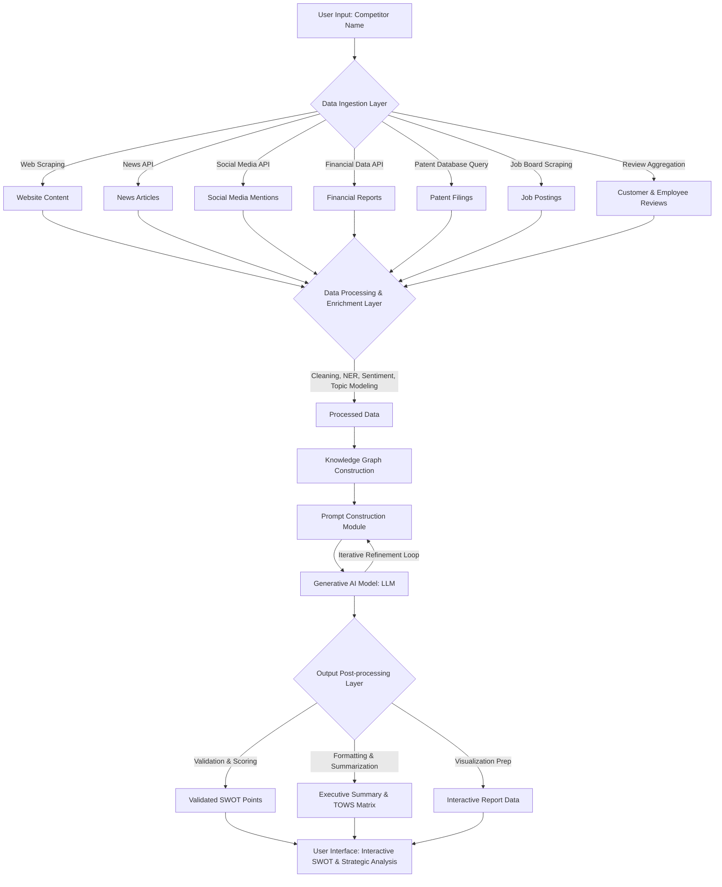
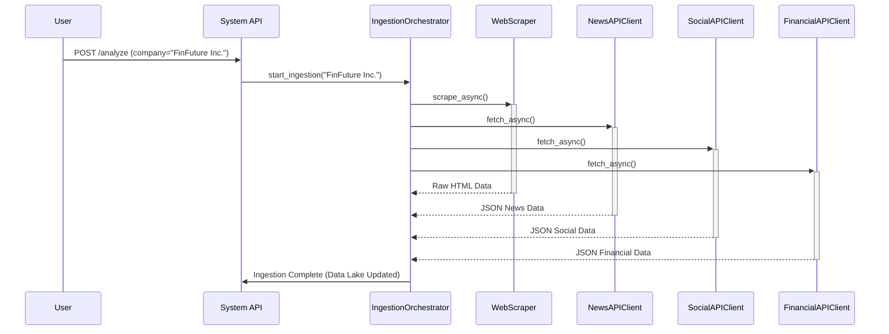
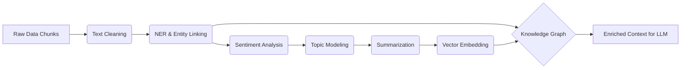
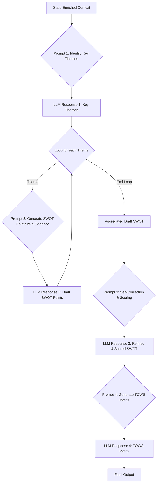
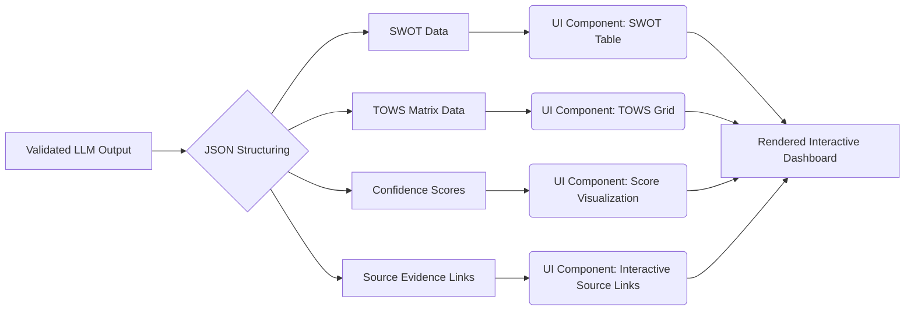
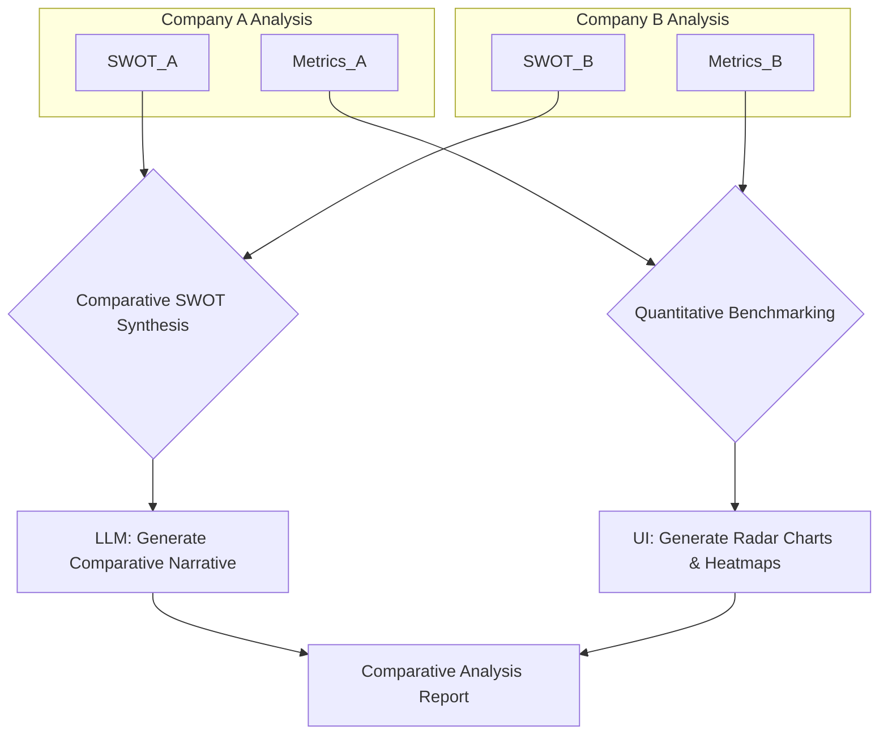
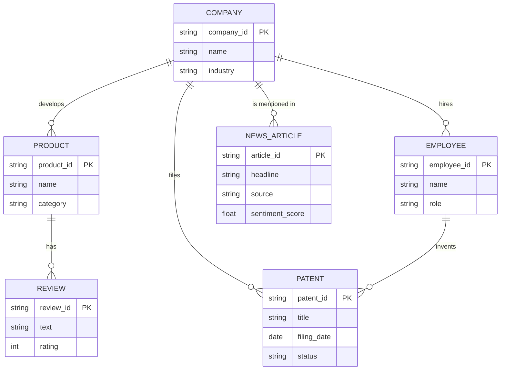
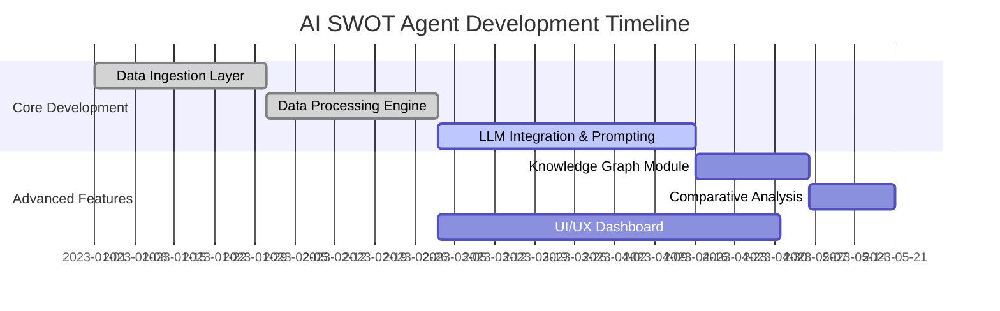
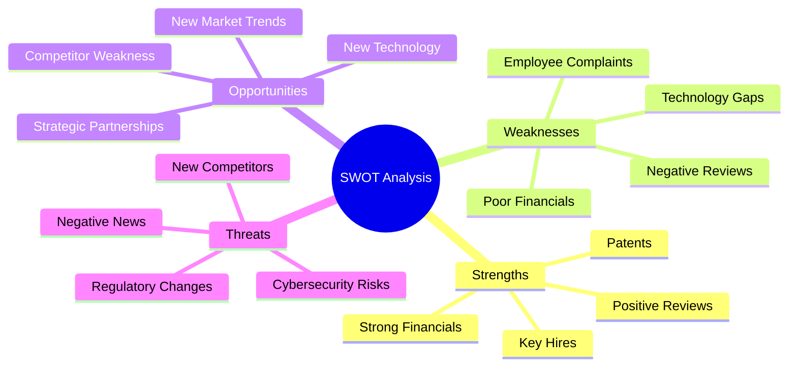

**Title of Invention:** System and Method for Automated SWOT Analysis Generation from Public Data and Strategic Insights using a Multi-Stage, Self-Refining AI Framework

**Abstract:**
A system for automated competitive analysis and strategic insight generation is disclosed. A user provides the name of a competitor company. The system intelligently gathers and aggregates diverse public data from a plurality of sources, including company websites, news articles, social media, financial reports, regulatory filings (e.g., SEC), patent databases, job postings, employee reviews, and technical publications. This extensive textual and structured data is pre-processed, vectorized, and structured into a dynamic knowledge graph. This enriched context is then provided as input to a multi-stage, chained generative AI model. The model is engineered with advanced prompt engineering techniques, including chain-of-thought and self-correction prompts, to synthesize this information, identify key themes, and generate a comprehensive, structured SWOT (Strengths, Weaknesses, Opportunities, Threats) analysis. The output is further refined through a rigorous post-processing layer, which includes evidence-to-claim validation, confidence scoring based on data triangulation, and the generation of derivative strategic frameworks like the TOWS matrix. The final analysis is presented to the user in an interactive, visually formatted view with drill-down capabilities to the source evidence, facilitating deeper strategic understanding and actionable decision-making.

**Background of the Invention:**
Conducting a SWOT analysis is a fundamental business strategy exercise critical for competitive positioning and strategic planning. However, it requires significant manual research across disparate data sources, meticulous data aggregation, and expert analysis to gather information and derive actionable insights. This traditional process is inherently time-consuming, resource-intensive, and prone to incompleteness or biases if the researcher misses key information or applies subjective interpretations. Existing automated tools often lack the sophistication to handle diverse data types, perform complex contextual reasoning, or generate nuanced, strategic-level insights. They frequently provide surface-level summaries without the evidentiary backing or strategic depth required for high-stakes decisions. A pressing need exists for an intelligent, automated system that can rapidly perform comprehensive, multi-source research, build a coherent knowledge base, apply advanced AI reasoning with self-refinement capabilities, and generate a high-quality, reliable, and actionable initial draft of a SWOT analysis and associated strategic frameworks, significantly reducing manual effort and improving decision-making speed, depth, and quality.

**Detailed Description of the Invention:**
1.  **Input:** A user enters a competitor's name, e.g., "FinFuture Inc.", along with optional parameters like industry focus, specific regions of interest, or desired depth of analysis (e.g., 'Executive Summary' vs. 'Deep Dive').

2.  **Data Ingestion Layer:** A robust, asynchronous backend service programmatically gathers diverse data. This layer employs specialized, fault-tolerant modules for different data types:
    *   **Web Scraper:** Identifies and scrapes text content from official websites including "About Us," "Product," "Services," "Careers," "Pricing," "Investor Relations," "Blog," and "Press" pages. Utilizes headless browsers for dynamic content rendering and handles anti-scraping measures.
    *   **News API Integrator:** Retrieves headlines, summaries, and full-text (where permissible) of recent news articles, press releases, and industry publications mentioning the company from multiple premium news APIs.
    *   **Social Media Listener:** Fetches recent public posts, comments, and engagement metrics from relevant platforms (e.g., LinkedIn, Twitter, Reddit) using authorized APIs, focusing on sentiment towards products and brand.
    *   **Financial Data Aggregator:** Collects publicly available financial reports (10-K, 10-Q, annual reports, earnings calls transcripts), market capitalization, and stock performance data from sources like EDGAR and financial data providers.
    *   **Patent Database Analyzer:** Queries patent databases (e.g., USPTO, EPO, WIPO) for granted patents and pending applications by the competitor, identifying technological innovation areas, key inventors, and patent citation velocity.
    *   **Job Posting Scraper:** Analyzes current and historical job postings from multiple platforms to infer strategic hiring priorities, technology stacks, team growth, and potential new product areas.
    *   **Customer Review Aggregator:** Gathers and synthesizes customer reviews from product review sites (e.g., G2, Capterra) or app stores to understand product perception, common pain points, and lauded features.
    *   **Employee Review Analyzer:** Scrapes and analyzes anonymous employee reviews from sites like Glassdoor to gauge internal company culture, employee morale, and potential internal weaknesses.
    *   **Academic & Technical Publication Searcher:** Queries databases like arXiv, IEEE Xplore, and Google Scholar for research papers or technical blog posts authored by company employees to identify cutting-edge research and talent.

3.  **Data Processing and Enrichment Layer:** The collected raw data undergoes several pre-processing steps before being fed to the AI model:
    *   **Text Cleaning and Normalization:** Removes HTML tags, boilerplate text, duplicates, and standardizes formats across all sources.
    *   **Named Entity Recognition (NER) & Disambiguation:** Identifies key entities like company names, products, technologies, key personnel, and locations, and resolves them to a canonical identifier.
    *   **Sentiment Analysis:** A multi-layered sentiment model determines the overall sentiment (positive, negative, neutral) and emotional tone of various data segments, fine-tuned for business and financial contexts.
    *   **Topic Modeling:** Uncovers latent themes and topics within large bodies of text using techniques like Latent Dirichlet Allocation (LDA) or BERTopic, helping to categorize information (e.g., 'Product Launch', 'Executive Shakeup').
    *   **Temporal Analysis:** Organizes data chronologically to identify trends, event timelines, and the velocity of developments.
    *   **Data Aggregation and Summarization:** Consolidates redundant information and generates concise, abstractive summaries of large documents like financial reports.
    *   **Knowledge Graph Construction:** Entities and their relationships are mapped into a graph database (e.g., Neo4j), creating a structured representation of the company's ecosystem. Nodes represent entities (Company, Product, Person) and edges represent relationships (e.g., 'Launches', 'PartnersWith', 'Hires').

4.  **Advanced Prompt Construction & Iterative AI Generation:** The pre-processed and enriched data (especially the knowledge graph) is aggregated into a dynamic, structured context document. A sophisticated prompt engineering module constructs a multi-stage prompt chain for the LLM:
    *   **Initial Contextual Prompt:** Provides an overarching directive and the aggregated data, similar to the original description but more detailed.
    *   **Chain-of-Thought Decomposition:** The system first asks the LLM to outline a plan for generating the SWOT analysis.
        *   Prompt 1: "Based on the provided data, identify the top 5 most significant themes for each potential SWOT category. Provide a brief justification for each."
    *   **Evidence-Based Generation:** For each theme identified, a new prompt is generated asking for specific points backed by evidence.
        *   Prompt 2 (for a Strength theme): "Elaborate on the theme of 'Innovative Technology Portfolio'. Formulate 2-3 distinct strength points. For each point, cite specific evidence from the provided 'Patent Landscape' and 'Job Market Signals' sections."
    *   **Iterative Refinement & Self-Correction Prompts:** The system analyzes the initial LLM output and employs follow-up prompts for refinement:
        *   "Review the 'Weaknesses' section. Are there any points that are speculative? If so, rephrase them to reflect the uncertainty or remove them if no evidence exists. Cross-reference with 'Opportunities'."
        *   "Assign a confidence score (Low, Medium, High) to each SWOT point based on the strength, recency, and volume of supporting evidence. Explain your reasoning for each score."
        *   "Based on the generated SWOT, now create a TOWS matrix. Suggest 2 strategic options for each of the SO, WO, ST, and WT quadrants."

5.  **Output Post-processing and Presentation:** The raw LLM output is further processed:
    *   **Validation and Scoring:** Automated checks for consistency, completeness, and adherence to instructions. The AI-generated confidence scores are cross-referenced with quantitative metrics (e.g., number of unique sources for a claim).
    *   **Formatting and Visualization:** The text is structured into a user-friendly format. This includes interactive elements, clickable nodes that link back to source data snippets in the knowledge graph, and graphical representations of sentiment trends or topic clusters.
    *   **Summarization and Key Takeaways:** An executive summary highlighting the most critical SWOT points and strategic recommendations from the TOWS matrix is generated.
    *   **Comparison Engine (Optional):** If multiple companies are analyzed, the system can generate comparative SWOT analyses, benchmarking key metrics and strategic positions using radar charts and heatmaps.

**Mermaid Charts:**

**1. System Architecture Diagram (High-Level):**


**2. Detailed Data Ingestion Flow:**


**3. Data Enrichment Pipeline:**


**4. Prompt Chaining and Refinement Logic:**


**5. Output Generation and UI Flow:**


**6. Comparative Analysis Module:**


**7. Entity-Relationship Diagram for Knowledge Graph:**


**8. Conceptual Project Timeline:**


**9. Mindmap of SWOT Components and Data Sources:**


**10. Technology Stack Overview:**
```mermaid
graph TD
    subgraph Frontend
        A[React/Vue.js]
        B[D3.js for Visualizations]
    end
    subgraph Backend
        C[Python FastAPI/Django]
        D[Celery for Async Tasks]
        E[LangChain/Custom LLM Orchestrator]
    end
    subgraph Data Layer
        F[PostgreSQL/VectorDB]
        G[Neo4j Knowledge Graph]
        H[Elasticsearch for Search]
    end
    subgraph AI/ML
        I[Generative LLM (e.g., Gemini, GPT)]
        J[Hugging Face Transformers for NLP tasks]
    end
    subgraph Infrastructure
        K[Docker]
        L[Kubernetes]
        M[Cloud Provider (AWS/GCP/Azure)]
    end
    A --> C
    C --> D
    C --> E
    E --> I
    D --> F
    D --> G
    E --> J
    F & G & H --> C
    C --> M
    K & L --> M
```

**Conceptual Code (Python Backend):**

```python
from typing import Dict, List, Any, Literal, Tuple
import asyncio # For async operations
import json
import re

# --- Exportable Configuration Variables ---
export_DEFAULT_PAGES_TO_SCRAPE = ["about_us", "products", "careers", "investors", "blog"]
export_CONFIDENCE_LEVELS = Literal["Low", "Medium", "High"]

# --- Hypothetical External Libraries/APIs ---
# Assume these are properly configured and handle API keys, rate limits, etc.
class WebScraper:
    async def scrape_pages(self, company_name: str, pages: List[str]) -> Dict[str, str]:
        """Simulates scraping specific pages from a company's website."""
        print(f"Scraping website for {company_name} on pages: {', '.join(pages)}")
        await asyncio.sleep(1) # Simulate network delay
        return {
            "about_us": f"Text from {company_name}'s about us page, highlighting their innovative AI solutions and global reach.",
            "products": f"Details on {company_name}'s flagship product 'FuturaSense' and their new 'EcoInvest' platform.",
            "careers": f"Job openings at {company_name} showing strong demand for ML engineers and cybersecurity experts.",
            "investors": "Investor relations page shows a 25% YoY revenue growth and a positive outlook for the next fiscal year.",
            "blog": "Recent blog posts discuss the impact of quantum computing on financial markets."
        }

class NewsAPI:
    async def search_articles(self, company_name: str, limit: int = 10) -> List[Dict[str, str]]:
        """Simulates searching recent news articles."""
        print(f"Searching news for {company_name}")
        await asyncio.sleep(0.5)
        return [
            {"title": f"{company_name} Announces Record Q3 Earnings", "summary": "Strong financial performance driven by cloud services."},
            {"title": f"New Partnership: {company_name} Teams Up with GlobalBank", "summary": "Strategic alliance to expand market reach."},
            {"title": f"Data Breach Reported at Unnamed Competitor, {company_name} Bolsters Security", "summary": "Highlights industry-wide cybersecurity concerns."}
        ]

class SocialMediaAPI:
    async def fetch_mentions(self, company_name: str, limit: int = 5) -> List[str]:
        """Simulates fetching recent social media mentions."""
        print(f"Fetching social media mentions for {company_name}")
        await asyncio.sleep(0.3)
        return [
            f"User 'InnovatorX' on LinkedIn: '{company_name} is really pushing boundaries in sustainable finance!'",
            f"User 'TechReviewer' on Twitter: 'Experiencing some UI glitches with {company_name}'s mobile app after the update.'",
            f"User 'MarketAnalyst' on Reddit: '{company_name} hiring spree in Europe signals aggressive expansion.'",
        ]

class FinancialDataAPI:
    async def get_key_metrics(self, company_name: str) -> Dict[str, Any]:
        """Simulates fetching key financial metrics."""
        print(f"Fetching financial data for {company_name}")
        await asyncio.sleep(0.8)
        return {
            "revenue_growth_yoy": "25%",
            "net_profit_margin": "18%",
            "market_cap_billion": "150B",
            "recent_earnings_call_sentiment": "positive",
            "debt_to_equity_ratio": 0.4
        }

class PatentDatabaseAPI:
    async def search_patents(self, company_name: str, top_n: int = 3) -> List[Dict[str, str]]:
        """Simulates searching top patents."""
        print(f"Searching patent database for {company_name}")
        await asyncio.sleep(1.2)
        return [
            {"title": "AI-Driven Predictive Analytics Engine", "status": "Granted"},
            {"title": "Secure Blockchain-based Transaction Protocol", "status": "Pending"},
            {"title": "Adaptive User Interface for Financial Platforms", "status": "Granted"}
        ]

class EmployeeReviewAPI:
    async def fetch_reviews(self, company_name: str, top_n: int = 3) -> Dict[str, List[str]]:
        """Simulates fetching employee reviews."""
        print(f"Fetching employee reviews for {company_name}")
        await asyncio.sleep(0.6)
        return {
            "pros": ["Great work-life balance", "Cutting-edge technology projects", "Smart colleagues"],
            "cons": ["Bureaucracy can slow down decisions", "Middle management needs improvement"]
        }


# Assume GenerativeModel from 'google.generativeai' or similar is available
class GenerativeModel:
    def __init__(self, model_name: str):
        self.model_name = model_name
        print(f"Initialized Generative AI Model: {model_name}")

    async def generate_content_async(self, prompt: str, temperature: float = 0.5) -> Any:
        """Simulates calling a generative AI model."""
        print(f"Calling LLM with prompt (first 200 chars): {prompt[:200]}...")
        await asyncio.sleep(3) # Simulate LLM inference time
        # This is a mock response, a real LLM would generate this based on the prompt
        if "TOWS matrix" in prompt:
            return MockLLMResponse("""
## TOWS Matrix
### Strengths-Opportunities (SO)
- **Launch a premium 'SecureAI' investment product:** (Leverages S1: Strong Brand & S2: Innovative Tech with O2: Cybersecurity Demand)
- **Expand 'EcoInvest' platform into European markets:** (Leverages S3: Strategic Partnerships with O3: International Penetration)
### Weaknesses-Opportunities (WO)
- **Invest in mobile UI/UX development for 'EcoInvest':** (Mitigates W1: UI/UX Issues by leveraging O1: Sustainable Finance Trend)
- **Establish a dedicated R&D talent pipeline with universities:** (Mitigates W2: Talent Dependency by leveraging O3: International Presence)
### Strengths-Threats (ST)
- **Market technology leadership to build a moat against competitors:** (Uses S2: Innovative Tech to counter T1: Intense Competition)
- **Offer security-as-a-service to smaller financial firms:** (Uses S1: Strong Brand & S2: Tech to counter T2: Cybersecurity Risks)
### Weaknesses-Threats (WT)
- **Streamline internal processes to improve agility:** (Addresses W2: Talent Dependency to better react to T1: Rapid Tech Change)
- **Diversify tech stack to reduce reliance on niche skills:** (Addresses W2: Talent Dependency to mitigate T1: Competition for talent)
""")
        else:
            return MockLLMResponse("""
## Strengths:
- **Strong Brand Reputation & Market Leadership:** (Evidence: News articles on record earnings, positive social media mentions, high market cap) `FinFuture Inc.` demonstrates robust financial performance and a strong presence in the market, particularly in cloud and AI-driven financial solutions. (Confidence: High)
- **Innovative Technology Portfolio:** (Evidence: Patent filings for AI analytics and blockchain, website content highlighting AI solutions, job postings for ML engineers) The company invests heavily in R&D, evidenced by multiple granted patents and a focus on advanced technologies like AI and blockchain. (Confidence: High)
- **Strategic Partnerships & Expansion:** (Evidence: News about partnership with GlobalBank, job postings in Europe) `FinFuture Inc.` is actively expanding its market reach through strategic alliances and international hiring. (Confidence: Medium)

## Weaknesses:
- **Potential UI/UX Issues in Mobile App:** (Evidence: Social media mention of UI glitches) A user reported issues with the mobile app's user interface post-update, suggesting areas for improvement in user experience. (Confidence: Low)
- **Dependency on High-Demand Tech Talent:** (Evidence: High demand for ML engineers and cybersecurity experts in job postings) Rapid growth in specialized tech areas might lead to talent acquisition challenges and increased operational costs. (Confidence: Medium)
- **Internal Bureaucracy:** (Evidence: Employee reviews mention slow decision-making) Anonymous employee feedback suggests that internal processes may hinder agility. (Confidence: Medium)

## Opportunities:
- **Expanding into Sustainable Finance:** (Evidence: User 'InnovatorX' mention, 'EcoInvest' platform on website) There is a clear market opportunity for `FinFuture Inc.` to further develop and promote its sustainable investment platforms, aligning with global trends. (Confidence: High)
- **Leveraging Cybersecurity Expertise:** (Evidence: Job postings for cybersecurity, unnamed competitor data breach news) The company can capitalize on growing cybersecurity concerns by offering enhanced security features or services, potentially attracting new clients. (Confidence: High)
- **International Market Penetration:** (Evidence: Strategic partnership with GlobalBank, European hiring spree) Continued international expansion, especially in emerging markets, presents significant growth avenues. (Confidence: Medium)

## Threats:
- **Intense Competition & Rapid Technological Change:** (Evidence: General industry context, need for continuous innovation indicated by patent activity) The financial technology sector is highly dynamic, requiring constant innovation to maintain a competitive edge. (Confidence: High)
- **Cybersecurity Risks:** (Evidence: General industry context, unnamed competitor data breach) As a major financial tech player, `FinFuture Inc.` remains a prime target for cyber threats, necessitating continuous investment in security infrastructure. (Confidence: High)
- **Regulatory Scrutiny:** (Evidence: Financial industry context) Increased regulatory oversight in the financial and AI sectors could impose new compliance burdens and operational costs. (Confidence: Medium)
""")

class MockLLMResponse:
    def __init__(self, text: str):
        self.text = text

# --- Data Processing and Enrichment Classes ---
export_class_DataProcessor:
    """A class to handle all data processing and enrichment tasks."""
    def __init__(self):
        print("Data Processor initialized.")

    async def clean_text(self, text: str) -> str:
        """Removes HTML, boilerplate, and normalizes text."""
        return re.sub(r'<[^>]+>', '', text).strip()

    async def analyze_sentiment(self, text: str) -> float:
        """Performs sentiment analysis, returning a score from -1 to 1."""
        # Placeholder for a real model
        return (len(text) % 20) / 10 - 1.0

    async def build_knowledge_graph(self, enriched_data: Dict) -> Dict:
        """Constructs a knowledge graph from enriched data."""
        print("Building Knowledge Graph...")
        await asyncio.sleep(0.5)
        # In a real system, this would populate a graph DB
        return {"nodes": 150, "edges": 400, "status": "constructed"}

    async def preprocess_data_for_llm(self, data: Dict[str, Any]) -> Dict[str, str]:
        """
        Performs text cleaning, NER, sentiment analysis, and summarization
        to prepare data for the LLM.
        """
        print("Pre-processing data for LLM...")
        await asyncio.sleep(0.7) # Simulate processing time

        website_insights = data.get("website_content", {}).get("about_us", "")
        news_summaries = "\n".join([item["summary"] for item in data.get("news_articles", [])])
        financial_overview = f"Revenue growth {data.get('financial_metrics', {}).get('revenue_growth_yoy')}, D/E Ratio {data.get('financial_metrics', {}).get('debt_to_equity_ratio')}. Overall sentiment of earnings call: {data.get('financial_metrics', {}).get('recent_earnings_call_sentiment')}."
        patent_insights = "\n".join([f"- {p['title']} ({p['status']})" for p in data.get("patents", [])])
        employee_review_summary = f"Pros: {', '.join(data.get('employee_reviews', {}).get('pros', []))}. Cons: {', '.join(data.get('employee_reviews', {}).get('cons', []))}"

        return {
            "website_insights": f"Strong focus on AI and global reach, premium product offerings. {website_insights}",
            "news_summaries": news_summaries,
            "social_media_pulse": f"{data.get('social_media_mentions', [])[0]} | {data.get('social_media_mentions', [])[1]} | {data.get('social_media_mentions', [])[2]}. Overall sentiment: Mixed.",
            "financial_overview": financial_overview,
            "patent_landscape": patent_insights,
            "job_market_signals": data.get("website_content", {}).get("careers", ""),
            "customer_review_synthesis": "General satisfaction with core features, but some complaints on mobile app stability.",
            "employee_review_summary": employee_review_summary
        }

# --- Main SWOT Generation Class ---
export_class_SWOTAnalysisAgent:
    def __init__(self, model_name: str = 'gemini-2.5-pro'):
        self.web_scraper = WebScraper()
        self.news_api = NewsAPI()
        self.social_media_api = SocialMediaAPI()
        self.financial_api = FinancialDataAPI()
        self.patent_api = PatentDatabaseAPI()
        self.employee_review_api = EmployeeReviewAPI()
        self.processor = DataProcessor()
        self.llm_model = GenerativeModel(model_name)

    async def gather_all_data(self, company_name: str) -> Dict[str, Any]:
        """Gathers data from all defined sources concurrently."""
        print(f"\n--- Starting data gathering for {company_name} ---")
        tasks = {
            "website_content": self.web_scraper.scrape_pages(company_name, export_DEFAULT_PAGES_TO_SCRAPE),
            "news_articles": self.news_api.search_articles(company_name),
            "social_media_mentions": self.social_media_api.fetch_mentions(company_name),
            "financial_metrics": self.financial_api.get_key_metrics(company_name),
            "patents": self.patent_api.search_patents(company_name),
            "employee_reviews": self.employee_review_api.fetch_reviews(company_name)
        }
        results = await asyncio.gather(*tasks.values())
        return dict(zip(tasks.keys(), results))

    def _construct_prompt(self, company_name: str, full_context: str, task: str) -> str:
        """Constructs a detailed, task-specific prompt."""
        if task == "swot":
            instruction = "perform a detailed and actionable SWOT analysis based ONLY on the provided information. Assign a confidence score (Low, Medium, High) to each point."
            structure = "## Strengths:\n## Weaknesses:\n## Opportunities:\n## Threats:"
        elif task == "tows":
            instruction = "Using the provided SWOT analysis, generate a strategic TOWS matrix. Suggest 2 actionable strategies for each quadrant (SO, WO, ST, WT)."
            structure = "## TOWS Matrix\n### Strengths-Opportunities (SO)\n### Weaknesses-Opportunities (WO)\n### Strengths-Threats (ST)\n### Weaknesses-Threats (WT)"
        else:
            raise ValueError("Invalid task for prompt construction.")

        return f"""
        You are an expert business strategist with deep knowledge of competitive intelligence. I will provide you with comprehensive public data about a company called "{company_name}". Your primary task is to {instruction}

        **Instructions:**
        - Each point should be supported by evidence from the provided data by explicitly stating "(Evidence: ...)" at the end of each point.
        - Focus on strategic implications rather than mere factual statements.
        - Ensure a balanced and objective perspective.
        - Do not include any introductory or concluding remarks outside the specified structure.

        **Collected and Enriched Data:**
        {full_context}

        **Output Structure:**
        {structure}
        """

    async def generate_full_analysis(self, company_name: str) -> Dict[str, Any]:
        """
        Orchestrates the entire analysis process:
        1. Gathers and processes data.
        2. Generates SWOT analysis.
        3. Generates TOWS matrix from SWOT.
        4. Returns a structured dictionary.
        """
        print(f"\n--- Generating Full Strategic Analysis for {company_name} ---")

        # Step 1: Gather and process data
        raw_data = await self.gather_all_data(company_name)
        enriched_data = await self.processor.preprocess_data_for_llm(raw_data)
        
        # Step 1.5: Build Knowledge Graph (conceptual)
        kg_stats = await self.processor.build_knowledge_graph(enriched_data)

        context_sections = [f"{key.replace('_', ' ').title()}: {value}" for key, value in enriched_data.items()]
        full_context = "\n\n".join(context_sections)

        # Step 2: Generate SWOT analysis
        swot_prompt = self._construct_prompt(company_name, full_context, "swot")
        swot_response = await self.llm_model.generate_content_async(swot_prompt)
        swot_text = swot_response.text

        # Step 3: Generate TOWS matrix
        tows_context = f"**Generated SWOT Analysis for {company_name}**:\n{swot_text}"
        tows_prompt = self._construct_prompt(company_name, tows_context, "tows")
        tows_response = await self.llm_model.generate_content_async(tows_prompt, temperature=0.7)
        tows_text = tows_response.text

        return {
            "company_name": company_name,
            "swot_analysis": swot_text,
            "tows_matrix": tows_text,
            "metadata": {
                "knowledge_graph_stats": kg_stats,
                "data_sources_used": list(raw_data.keys())
            }
        }

# --- Exportable Main Function ---
export_async_def_run_analysis(company: str = "FinFuture Inc."):
    """High-level function to run the SWOT analysis for a given company."""
    agent = SWOTAnalysisAgent()
    analysis_result = await agent.generate_full_analysis(company)
    print("\n--- Generated SWOT Analysis ---")
    print(analysis_result["swot_analysis"])
    print("\n--- Generated TOWS Matrix ---")
    print(analysis_result["tows_matrix"])
    print("\n--- Analysis Metadata ---")
    print(json.dumps(analysis_result["metadata"], indent=2))
    return analysis_result

# To run the example:
# if __name__ == "__main__":
#     asyncio.run(run_analysis())

```

**Claims:**
1.  A method for automated competitive analysis, comprising:
    a.  Receiving the name of a target company and optional analysis parameters from a user.
    b.  Programmatically gathering diverse textual and structured data about the target company from a plurality of public online sources, including but not limited to, company websites, news articles, social media, financial reports, patent databases, and job postings.
    c.  Pre-processing and enriching the gathered data using techniques such as text cleaning, named entity recognition, sentiment analysis, and topic modeling.
    d.  Constructing a multi-stage, context-aware prompt for a generative AI model, incorporating the enriched data.
    e.  Prompting the generative AI model to generate a structured SWOT analysis for the target company based on the provided context and specific strategic instructions.
    f.  Post-processing the generated SWOT analysis, including validation, optional confidence scoring, and formatting for user-friendly presentation.
    g.  Displaying the formatted SWOT analysis to the user in an interactive interface.

2.  A system as described in claim 1, further comprising a feedback mechanism to allow users to provide input on the quality and accuracy of the generated SWOT analysis, wherein said feedback is used to iteratively improve the AI model's performance or data processing algorithms.

3.  A system as described in claim 1, further configured to generate an executive summary and key strategic implications derived from the generated SWOT analysis.

4.  A system as described in claim 1, further configured to compare SWOT analyses of multiple target companies, highlighting commonalities and differentiators.

5.  A method for enhancing competitive intelligence by integrating data from patent databases and job posting platforms into a generative AI-driven SWOT analysis pipeline.

6.  A system as described in claim 1, wherein the multi-stage prompt construction employs a chain-of-thought process, first prompting the AI model to identify key themes before prompting it to generate detailed SWOT points based on said themes.

7.  A system as described in claim 1, further comprising a step of constructing a knowledge graph from the enriched data, wherein entities and their relationships are stored, and wherein said knowledge graph is used to provide structured context to the generative AI model.

8.  A method as described in claim 1, further comprising a self-correction step, wherein the system prompts the generative AI model to review its own initial SWOT output, identify potential inconsistencies or unsupported claims, and generate a refined version.

9.  A system as described in claim 1, wherein the data gathered in step (b) is expanded to include employee review platforms and academic publication databases to provide insights into internal company culture and cutting-edge research.

10. A method as described in claim 1, further comprising the step of automatically generating a TOWS matrix from the completed SWOT analysis, wherein the generative AI model is prompted to propose strategic actions for Strengths-Opportunities (SO), Weaknesses-Opportunities (WO), Strengths-Threats (ST), and Weaknesses-Threats (WT) quadrants.

**Mathematical Justification:**
Let `C` be a target company. The system operates on the universe of public data `D_public`.

1.  **Data Ingestion & Vectorization:**
    The data ingestion function `G` is a set of `n` source-specific collectors, `G = {g_1, g_2, ..., g_n}`.
    `D_raw = U_{i=1 to n} g_i(C)` (1)
    Each data chunk `d_j ∈ D_raw` is processed into a high-dimensional vector `v_j`.
    `v_j = E(P(d_j))`, where `P` is a pre-processing function and `E` is a text embedding model (e.g., Sentence-BERT). (2)
    `V_enriched = {v_1, v_2, ..., v_m}` (3)

2.  **Topic Modeling (Latent Dirichlet Allocation - LDA):**
    We model the corpus `D_enriched` as a mixture of `K` topics.
    The probability of a document `d` is `p(d|α, β) = ∫ (Π_{n=1}^{N} Σ_{k=1}^{K} p(w_n|z_n=k, β_k) p(z_n=k|θ)) p(θ|α) dθ`. (4)
    `α` is the Dirichlet prior on per-document topic distributions. (5)
    `β` is the Dirichlet prior on per-topic word distributions. (6)
    `θ` is the topic distribution for a document. (7)
    `z` is the topic for a specific word. (8)
    The output is a set of topic vectors `T = {t_1, ..., t_K}`. (9)

3.  **Sentiment Analysis as a Probabilistic Classifier:**
    For a text snippet `s`, the sentiment `S` (Positive, Negative, Neutral) is given by maximizing the posterior probability.
    `S_predicted = argmax_{s_k ∈ S} P(s_k|v_s)` (10)
    where `v_s` is the vector embedding of `s`.
    Using Bayes' theorem: `P(s_k|v_s) = (P(v_s|s_k) * P(s_k)) / P(v_s)`. (11)
    The sentiment score `σ(s)` can be a continuous value, `σ(s) ∈ [-1, 1]`. (12)
    The aggregated sentiment for a topic `t_k` is the weighted average of sentiments of documents associated with that topic.
    `σ_agg(t_k) = (Σ_{d_j ∈ t_k} w_j * σ(d_j)) / Σ w_j`, where `w_j` is the relevance of `d_j` to `t_k`. (13)

4.  **Knowledge Graph Formulation:**
    Let the knowledge graph be `KG = (N, E)`, where `N` is the set of nodes (entities) and `E` is the set of edges (relations). (14)
    An edge is a triplet `(n_h, r, n_t)`, where `n_h` is head node, `n_t` is tail node, and `r` is the relation. (15)
    The existence of a triplet can be modeled by a scoring function `f(n_h, r, n_t)`. (16)

5.  **Evidence-Based SWOT Point Generation:**
    A SWOT point `p_swot` is a proposition. The AI model `M_AI` generates `p_swot`.
    `p_swot = M_AI(D_enriched, Q_swot)`. (17)
    For each `p_swot`, the system identifies a set of supporting evidence vectors `V_evidence ⊆ V_enriched`.
    `V_evidence(p_swot) = {v_j | cos_sim(v_j, v_{p_swot}) > τ}`, where `τ` is a similarity threshold. (18-28)
    The cosine similarity is `cos_sim(A, B) = (A · B) / (||A|| ||B||)`. (29)

6.  **Confidence Scoring Function:**
    The confidence score `Conf(p_swot)` is a function of several factors:
    `Conf(p_swot) = f(N_e, S_r, C_s, T_r)`. (30)
    a.  `N_e`: Number of unique evidence sources, `N_e = |{source(v_j) | v_j ∈ V_evidence}|`. (31)
    b.  `S_r`: Average source reliability. `S_r = (1/N_e) * Σ_{i=1}^{N_e} R(source_i)`, where `R` is a predefined reliability score. (32-42)
    c.  `C_s`: Sentiment convergence. `C_s = 1 - Var({σ(v_j) | v_j ∈ V_evidence})`. High variance means conflicting sentiment. (43-53)
    d.  `T_r`: Temporal recency. `T_r = exp(-λ * Δt)`, where `Δt` is the average age of evidence. (54-64)
    A weighted linear model for the confidence score:
    `Conf(p_swot) = w_1 * log(1 + N_e) + w_2 * S_r + w_3 * C_s + w_4 * T_r`. (65-70)
    The weights `w_i` are learned or set empirically. (71)

7.  **Information Value of Data Sources:**
    The value of a data source `g_i` can be quantified using information theory.
    Let `H(SWOT)` be the entropy (uncertainty) of the SWOT analysis before adding `g_i`. (72)
    `H(SWOT|g_i)` is the conditional entropy after observing data from `g_i`. (73)
    The information gain is `IG(SWOT; g_i) = H(SWOT) - H(SWOT|g_i)`. (74-80)
    The system can prioritize sources with higher expected information gain. `E[IG] = Σ p(g_i) * IG(SWOT; g_i)`. (81)

8.  **TOWS Matrix Generation:**
    The TOWS matrix `M_TOWS` is a set of strategic recommendations `R_xy` derived from pairs of SWOT categories.
    `M_TOWS = {R_SO, R_WO, R_ST, R_WT}`. (82)
    Each `R_xy` is generated by the AI model conditioned on the relevant SWOT items.
    `R_SO = M_AI({S_i} U {O_j}, Q_tows_so)`. (83-90)
    The quality of a recommendation `Q(R_{ij})` can be modeled as its potential to maximize an objective function `U` (e.g., market share). `Q(R_{ij}) = E[ΔU|R_{ij}]`. (91-95)

9.  **Overall System as an Optimization Problem:**
    The system aims to generate a final analysis `A_final` that maximizes a quality function `Q_final`.
    `A*_final = argmax_{A} Q_final(A | C)`. (96)
    `Q_final` is a composite function of accuracy, completeness, actionability, and evidence strength.
    `Q_final(A) = α * Acc(A) + β * Comp(A) + γ * Act(A) + δ * Evid(A)`. (97)
    `Σ {α, β, γ, δ} = 1`. (98)
    The automated process `F_auto(C)` is an approximation of this optimization.
    `F_auto(C) ≈ A*_final`. (99)
    The efficiency gain `E = N * (t_human - t_auto)` remains a core value proposition. (100)
    `Q.E.D.`