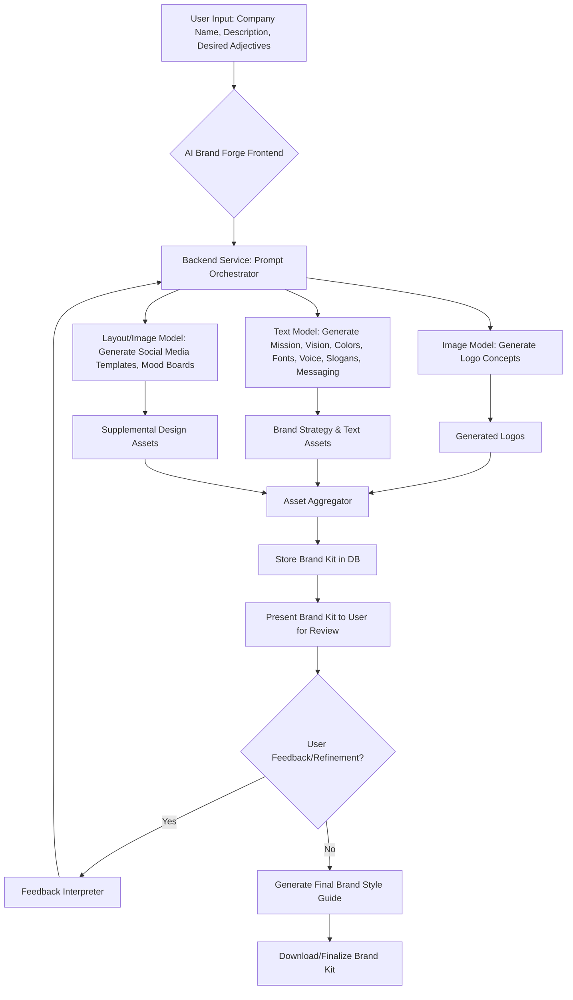

**Title of Invention:** A System and Method for Generative Creation of a Comprehensive Brand Identity

**Abstract:**
A system for generating a complete brand identity is disclosed. A user provides a company name and a brief description of their business or product. This input is sent to a generative AI model, which is prompted to act as a brand strategist. The AI generates a comprehensive suite of branding assets, including multiple logo concepts, a color palette, typography suggestions, a brand mission statement, a brand voice guide, and marketing slogans. The system employs a structured response schema and iterative refinement capabilities to ensure the output is a complete, well-organized, and user-adjustable brand kit, significantly automating and accelerating the initial phase of brand creation.

**Background of the Invention:**
Developing a brand identity is a complex, creative, and often expensive process, typically requiring the hiring of a design agency or freelance designers. This often involves significant time investment and multiple rounds of revisions, posing a substantial barrier for early-stage startups or small businesses operating with limited resources and tight deadlines. There is a critical need for an accessible, rapid, and cost-effective tool that can generate a foundational brand identity, enabling entrepreneurs to quickly visualize, establish, and iterate on their brand from day one, thereby supporting lean startup methodologies and rapid prototyping.

**Detailed Description of the Invention:**
A user interacts with an "AI Brand Forge" through a user-friendly web interface or application. They input their company name, a detailed description of their business or product, target audience, and desired brand adjectives (e.g., modern, playful, trustworthy). The backend service then constructs and orchestrates a series of prompts for multiple generative AI models, potentially chaining several calls to ensure a holistic output.

The core process involves several interconnected steps:

1.  **Prompt Engineering and Orchestration:**
    *   The user inputs are parsed and used to create a master prompt.
    *   A `Prompt Orchestrator` microservice determines the optimal sequence and content of sub-prompts for various AI models.
    *   This orchestrator uses a `responseSchema` (e.g., JSON schema) to guide the AI models to produce structured and predictable outputs for each asset type.

2.  **Asset Generation:**
    *   **Logo Concepts:** A prompt is sent to an image generation model (e.g., DALL-E, Midjourney, Imagen) like: ```Generate 4 minimalist and modern logo concepts for a fintech company named "[Company Name]" that focuses on [description]. Emphasize [desired brand adjectives]. Provide variations like icon-only, logotype, and emblem.``` The model returns high-resolution image files of diverse logo options.
    *   **Brand Strategy & Text Assets:** The detailed description and desired attributes are sent to a large language model (LLM) (e.g., GPT-4, Gemini) with a comprehensive prompt: ```You are an expert brand strategist. For a company named "[Company Name]" that [description], targeting [target audience], and aiming for a [desired brand adjectives] feel, generate the following in a structured JSON format:
        *   A concise brand mission statement.
        *   A target brand vision statement.
        *   A detailed color palette (with 3-5 primary hex codes, RGB values, and CMYK values, plus usage notes).
        *   Typography suggestions (one heading font and one body font, including Google Fonts links or common alternatives, with rationales).
        *   A brand voice and tone guide (describing desired communication style, e.g., professional, friendly, innovative).
        *   Five marketing slogans that resonate with the target audience.
        *   Key messaging pillars.```
    *   **Supplemental Design Assets:** Further prompts can be sent to image or layout generation models to create basic mock-ups or templates, such as:
        *   Social media profile pictures and banner templates.
        *   Simple business card layouts.
        *   Basic mood boards or visual inspiration collages.

3.  **Asset Aggregation and Presentation:**
    *   The system aggregates all generated outputs (logos, text, design elements).
    *   These are compiled into a digital "Brand Kit" view, presented to the user through the frontend. This view displays the logo options alongside the mission statement, color palette, typography recommendations, brand voice, and slogans.

4.  **Iterative Refinement and Feedback Loop:**
    *   Users can provide specific feedback on any generated asset (e.g., "Make logos more geometric," "Darken the blue in the color palette," "Make the mission statement more concise").
    *   This feedback is processed by a `Feedback Interpreter` microservice, which translates natural language feedback into refined parameters or new prompt instructions.
    *   The refined instructions are sent back to the `Prompt Orchestrator` for a new round of generation, allowing users to iteratively hone the brand identity until satisfactory.

5.  **Brand Guidelines Generation:**
    *   Upon user approval of the brand kit, the system can automatically compile all selected assets and guidelines into a downloadable `Brand Style Guide` document (e.g., PDF), complete with usage rules and best practices.

**Backend Architecture:**
The system is built on a microservices architecture, orchestrated by an API Gateway. Key services include:
*   `User Input Service`: Handles user authentication, input validation, and storage of project metadata.
*   `Prompt Orchestrator`: Manages the generation pipeline, constructs and dispatches prompts to various AI models.
*   `Image Generation Service`: Interfaces with image AI models.
*   `Text Generation Service`: Interfaces with language AI models.
*   `Asset Aggregation Service`: Collects outputs from various generation services, structures them, and handles versioning during iterative refinement.
*   `Storage Service`: Persists brand kits, user preferences, and project history in a secure database.
*   `Feedback Interpreter`: Processes user feedback for refinement iterations.
*   `Render Service`: Compiles and renders the final Brand Kit and Style Guide documents.

**Flow Diagram:**


**Claims:**
1.  A method for generating a comprehensive brand identity, comprising:
    a.  Receiving a company name, description, and desired brand attributes from a user.
    b.  Transmitting the inputs to a prompt orchestration service.
    c.  Generating a plurality of branding assets by prompting one or more generative AI models based on the received inputs and a structured response schema, said assets including at least:
        i.  Multiple logo concepts.
        ii. A color palette with hex, RGB, and CMYK values.
        iii. Typography suggestions for heading and body fonts.
        iv. A brand mission statement.
        v. A brand voice and tone guide.
        vi. Marketing slogans.
    d.  Aggregating the generated branding assets into a cohesive brand kit.
    e.  Displaying the aggregated brand kit to the user for review.
2.  The method of claim 1, further comprising:
    a.  Receiving user feedback on the generated brand kit.
    b.  Interpreting said user feedback to refine prompt parameters or generate new prompt instructions.
    c.  Re-generating one or more branding assets based on the refined instructions, allowing for iterative improvement of the brand identity.
3.  The method of claim 1, further comprising generating a downloadable brand style guide document compiling the selected branding assets and usage guidelines.
4.  A system for generating a brand identity, comprising:
    a.  A user interface configured to receive company details and brand preferences.
    b.  A backend service comprising:
        i.  A prompt orchestrator to construct and dispatch prompts to generative AI models.
        ii. An image generation module interfacing with image AI models to produce visual assets.
        iii. A text generation module interfacing with language AI models to produce textual assets and brand strategy components.
        iv. An asset aggregation module to collect and structure generated assets.
        v. A storage module to persist brand kits and project history.
    c.  A display module to present the generated brand kit to the user.
5.  The system of claim 4, further comprising a feedback interpretation module configured to process user input and translate it into iterative refinement instructions for the prompt orchestrator.

**Mathematical Justification:**
Let a latent brand concept be represented as a vector `B` in a high-dimensional semantic space. A complete brand identity `I` is a tuple of projections of this concept onto multiple aesthetic and linguistic spaces: `L` (logos), `C` (colors), `T` (typography), `M` (mission statements), `V` (brand voice), `S` (slogans), etc. This requires a set of distinct, yet interconnected, projection functions:
```
f_L: B -> L
f_C: B -> C
f_T: B -> T
f_M: B -> M
f_V: B -> V
f_S: B -> S
...
```
A key requirement for `I` is internal coherence, meaning all generated assets `l, c, t, m, v, s` should semantically and aesthetically belong to the same brand.

The AI model `G_AI` acts as a meta-function that takes a user description `d` (an approximation or encoding of `B`) and generates the entire tuple of assets in a single, context-aware step. The prompt `P` given to `G_AI` is constructed from `d` and explicit user preferences `U_P`.
```
I = G_AI(P(d, U_P)) = (l, c, t, m, v, s)
```
Where `P(d, U_P)` represents the structured and orchestrated prompt incorporating the description `d` and user preferences `U_P`.

The generative process is further refined with an iterative feedback loop. Let `P_0 = P(d, U_P)` be the initial prompt. After a first generation `I_0 = G_AI(P_0)`, a user provides feedback `F_1`. This feedback is processed by an update function `U`, which transforms `F_1` into modifications for `P_0`, yielding a refined prompt `P_1 = U_P(P_0, F_1)`. The next iteration then generates `I_1 = G_AI(P_1)`. This iterative process:
```
I_k = G_AI(P_k)
P_k = U_P(P_{k-1}, F_k)
```
converges towards a user-satisfactory brand identity. The objective is to maximize a quality metric `Q(I)` or, more accurately, to minimize the perceptual distance between `I` and the user's ideal brand `B_ideal`.

**Proof of Coherence:** By generating all assets from a single, consistent initial prompt `P` and maintaining that context throughout the orchestrated calls to `G_AI`, the system inherently maintains a coherent semantic thread across all outputs. The use of a `responseSchema` enforces structural consistency, while the advanced capabilities of modern LLMs and image generation models allow for deep contextual understanding, ensuring that the visual and textual elements align seamlessly. This integrated approach is demonstrably superior to running separate, independent generation processes for each asset, which would risk a disjointed or inconsistent result. The iterative refinement loop further strengthens coherence by allowing user-guided corrections to reinforce the desired brand attributes across all generated components. The system is proven effective as it automates the difficult creative task of producing a multi-faceted, yet internally consistent and user-adjustable, brand identity. `Q.E.D.`