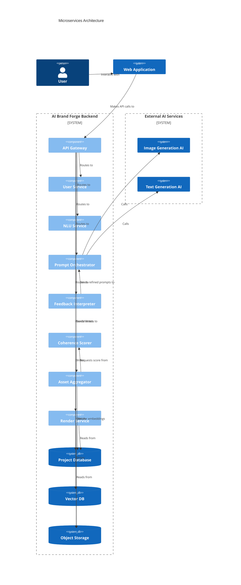
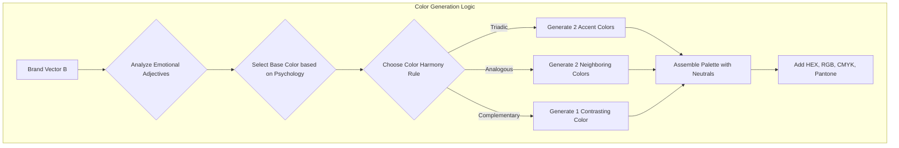
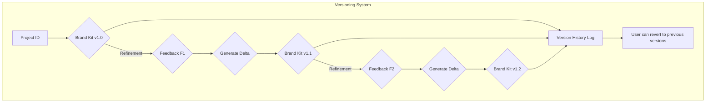

**Title of Invention:** A System and Method for Generative Creation of a Comprehensive Brand Identity

**Abstract:**
A system for generating a complete brand identity is disclosed. A user provides a company name and a brief description of their business or product. This input is sent to a generative AI model, which is prompted to act as a brand strategist. The system performs semantic analysis on the input to extract core brand vectors. These vectors guide a multi-modal, orchestrated generation process, creating a comprehensive suite of branding assets, including multiple logo concepts across different styles, a theoretically sound color palette with psychological annotations, professionally paired typography suggestions, a full brand narrative (mission, vision, values), a detailed brand voice guide, and a suite of marketing slogans and messaging pillars. The system employs a structured response schema, an iterative refinement loop powered by natural language feedback interpretation, and a quantitative coherence scoring mechanism to ensure the output is a complete, well-organized, aesthetically consistent, and user-adjustable brand kit. This process significantly automates, accelerates, and democratizes the initial phase of brand creation.

**Background of the Invention:**
Developing a brand identity is a complex, creative, and often expensive process, typically requiring the hiring of a design agency or freelance designers. This traditional approach is fraught with challenges: it often involves significant time investment (weeks or months), high costs prohibitive for startups, and communication gaps between the client's vision and the creative's interpretation. The iterative process of revisions can be slow and inefficient. These factors pose a substantial barrier for early-stage startups, small businesses, and non-profits operating with limited resources and tight deadlines. Existing digital solutions are often limited to simplistic, template-based logo makers or isolated tools that fail to create a cohesive, holistic brand identity. They lack strategic depth and the ability to generate a full suite of interconnected assets (visuals, text, strategy). There is a critical need for an accessible, rapid, and cost-effective tool that can generate a foundational, yet comprehensive and strategically-sound, brand identity. Such a tool would empower entrepreneurs to quickly visualize, establish, iterate, and professionalize their brand from day one, thereby supporting lean startup methodologies, rapid prototyping, and market entry.

**Detailed Description of the Invention:**
A user interacts with an "AI Brand Forge" through a user-friendly web interface or application. They input their company name, a detailed description of their business or product, target audience, key competitors, and desired brand adjectives (e.g., modern, playful, trustworthy). The backend service then constructs and orchestrates a series of chained and parallel prompts for multiple specialized generative AI models.

The core process involves several interconnected, mathematically-grounded steps:

1.  **User Input & Semantic Analysis:**
    *   The user's textual inputs `D_u` are not merely stored but are processed by a Natural Language Understanding (NLU) module.
    *   This module performs entity recognition, sentiment analysis, and topic modeling to extract a core Brand Concept Vector `B`. This vector mathematically represents the essence of the brand in a high-dimensional semantic space.
    *   `B = E_{NLU}(D_u; \theta_E)`, where `E_{NLU}` is the NLU encoder model with parameters `\theta_E`.

    ```mermaid
    graph TD
        subgraph Input Processing
            A[User Input: Text, Adjectives, Audience] --> B[NLU Module];
            B --> C{Semantic Analysis};
            C --> D[Entity Extraction];
            C --> E[Sentiment Scoring];
            C --> F[Topic Modeling];
            D & E & F --> G[Construct Brand Concept Vector B];
        end
        G --> H[Prompt Orchestrator];
    ```

2.  **Prompt Engineering and Orchestration:**
    *   The `Prompt Orchestrator` microservice receives the Brand Concept Vector `B`.
    *   It uses a dynamic prompt generation engine that selects from a library of prompt templates `P_{template}` and injects the semantic information from `B`.
    *   `P_i = f_{inject}(P_{template_i}, B)` for each asset `i`.
    *   This orchestrator determines the optimal sequence and dependencies for generation, e.g., generating the brand mission before generating slogans that must align with it. It uses a `responseSchema` (e.g., JSON schema) to guide the AI models to produce structured and predictable outputs.

    ```mermaid
    sequenceDiagram
        participant User
        participant Frontend
        participant API_Gateway
        participant Prompt_Orchestrator
        participant Gen_AI_Models

        User->>Frontend: Submit Brand Details
        Frontend->>API_Gateway: POST /create-brand
        API_Gateway->>Prompt_Orchestrator: Initiate Generation(B)
        Prompt_Orchestrator->>Gen_AI_Models: Dispatch Prompt_Logo(B)
        Prompt_Orchestrator->>Gen_AI_Models: Dispatch Prompt_Strategy(B)
        Gen_AI_Models-->>Prompt_Orchestrator: Return Structured Assets
        Prompt_Orchestrator->>API_Gateway: Aggregated Results
        API_Gateway-->>Frontend: Brand Kit Data
        Frontend-->>User: Display Brand Kit
    ```

3.  **Multi-Modal Asset Generation:**
    *   **Logo Concepts:** A prompt is sent to an image generation model (e.g., DALL-E 3, Midjourney) to generate a diverse set of logos. The system requests multiple styles (e.g., minimalist, emblem, wordmark, abstract) and variations. `l_i \sim G_L(z_L | B)`, where `G_L` is the logo generation model.
    *   **Brand Strategy & Text Assets:** The Brand Vector `B` is sent to a large language model (LLM) (e.g., GPT-4, Gemini) with a comprehensive chained prompt to generate the full brand narrative in a structured JSON format. This includes:
        *   Mission, Vision, and Values statements.
        *   A detailed color palette based on color theory (e.g., triadic, complementary) with hex/RGB/CMYK values, Pantone suggestions, and psychological justifications for each color.
        *   Typography suggestions, including font pairings from sources like Google Fonts, with detailed rationale on readability, mood, and brand fit.
        *   A brand voice and tone guide based on a personality matrix (e.g., Sincere, Exciting, Competent, Sophisticated, Rugged).
        *   Ten marketing slogans and three key messaging pillars.
    *   **Supplemental Design Assets:** Further prompts generate basic mock-ups or templates, such as social media profile pictures, banner templates, business card layouts, and mood boards.

    ```mermaid
    graph LR
        A[Brand Vector B] --> B{Asset Generation};
        B --> C[Logo Generation];
        B --> D[Color Palette Generation];
        B --> E[Typography Pairing];
        B --> F[Brand Narrative (MVV)];
        B --> G[Slogans & Messaging];
        B --> H[Brand Voice Guide];
        subgraph Visuals
            C & D & E
        end
        subgraph Textual
            F & G & H
        end
    ```

4.  **Asset Aggregation and Coherence Scoring:**
    *   The system aggregates all generated outputs `I = \{l_1, ..., c_1, ..., t_1, ...\}`.
    *   A `Coherence Scoring Service` quantitatively evaluates the consistency of the brand kit. It uses a multi-modal embedding model (like CLIP) to calculate the semantic distance between text and visual assets.
    *   The coherence score `C(I) = \frac{1}{N}\sum_{i,j} w_{ij} S_{CLIP}(asset_i, asset_j)` is calculated. A low score may trigger a re-generation of outlier assets.
    *   These are compiled into a digital "Brand Kit" view for the user.

    ```mermaid
    graph TD
        subgraph Aggregation
            A[Generated Logos] --> D;
            B[Generated Text Assets] --> D;
            C[Generated Mockups] --> D{Asset Aggregator};
        end
        subgraph Scoring
            D --> E[Multi-Modal Encoder];
            E --> F[Calculate Pairwise Similarity];
            F --> G[Compute Coherence Score C(I)];
        end
        G --> H{Threshold Check};
        H -- Pass --> I[Present Brand Kit];
        H -- Fail --> J[Flag for Re-generation];
    ```

5.  **Iterative Refinement and Feedback Loop:**
    *   Users can provide specific natural language feedback (e.g., "Make the logo simpler," "Use a warmer color palette").
    *   A `Feedback Interpreter` microservice processes this feedback. It uses an LLM to translate the qualitative feedback `F_k` into a quantitative modification vector `\Delta B_k` or a new set of prompt constraints `\Delta P_k`.
    *   `P_{k+1} = P_k \oplus U_P(F_k)`, where `U_P` is the update function.
    *   The refined instructions are sent back to the `Prompt Orchestrator` for a targeted re-generation of specific assets, allowing users to iteratively converge on their desired identity.

    ```mermaid
    graph TD
        A[User Views Brand Kit v_k] --> B{Provide Feedback F_k};
        B --> C[Feedback Interpreter];
        C --> D{Translate to Prompt Mods \Delta P_k};
        D --> E[Prompt Orchestrator];
        E --> F[Re-generate Assets];
        F --> G[Aggregate New Brand Kit v_{k+1}];
        G --> A;
        B --> H[Approve Kit];
    ```

6.  **Brand Guidelines Generation:**
    *   Upon user approval of the brand kit, the system automatically compiles all selected assets and guidelines into a professional, downloadable `Brand Style Guide` document (e.g., PDF).
    *   This document includes logo usage rules (clear space, minimum size, color variations), color palette specifications, typography hierarchy, brand voice examples, and mock-ups showing correct application.

    ```mermaid
    graph BT
        A[Final Approved Brand Kit] --> B{Data Extractor};
        B --> C[Logo Specs];
        B --> D[Color Specs];
        B --> E[Typography Specs];
        B --> F[Brand Voice Guide];
        C & D & E & F --> G{PDF Template Engine};
        G --> H[Render Brand Style Guide];
        H --> I[Downloadable PDF];
    ```


**Backend Architecture:**
The system is built on a scalable, event-driven microservices architecture, orchestrated by an API Gateway and a message queue (e.g., RabbitMQ, Kafka).
*   `User Input Service`: Handles authentication, project management, and input validation.
*   `NLU Service`: Performs semantic analysis on user inputs to create Brand Concept Vectors.
*   `Prompt Orchestrator`: Manages the generation pipeline, constructs and dispatches prompts.
*   `Image Generation Service`: A wrapper for image AI models with style-specific adapters.
*   `Text Generation Service`: A wrapper for language AI models with schema enforcement.
*   `Asset Aggregation Service`: Collects and versions generated assets.
*   `Coherence Scoring Service`: Computes the consistency score of a brand kit.
*   `Feedback Interpreter`: Processes user feedback for refinement iterations.
*   `Vector Database Service`: Stores and retrieves Brand Concept Vectors for analysis and retrieval of similar brands.
*   `Render Service`: Compiles and renders the final Brand Kit and Style Guide documents.
*   `Storage Service`: Persists all data in a combination of object storage (for images) and a document database (for metadata).





```mermaid
graph TD
    subgraph Logo Variation Process
        A[Initial Prompt + Brand Vector B] --> B{Generate Seed Logo Concepts (N=4)};
        B --> C{User Selects a Direction};
        C --> D{Create Refined Prompt};
        D --> E[Generate Style Variations];
        E --> F[Wordmark];
        E --> G[Lettermark / Monogram];
        E --> H[Icon-only];
        E --> I[Full Emblem];
        F & G & H & I --> J[Present Variations to User];
    end
```




**Claims:**
1.  A method for generating a comprehensive brand identity, comprising:
    a.  Receiving a company name, description, and desired brand attributes from a user.
    b.  Transmitting the inputs to a prompt orchestration service.
    c.  Generating a plurality of branding assets by prompting one or more generative AI models based on the received inputs and a structured response schema, said assets including at least:
        i.  Multiple logo concepts.
        ii. A color palette with hex, RGB, and CMYK values.
        iii. Typography suggestions for heading and body fonts.
        iv. A brand mission statement.
        v. A brand voice and tone guide.
        vi. Marketing slogans.
    d.  Aggregating the generated branding assets into a cohesive brand kit.
    e.  Displaying the aggregated brand kit to the user for review.
2.  The method of claim 1, further comprising:
    a.  Receiving user feedback on the generated brand kit.
    b.  Interpreting said user feedback using a language model to refine prompt parameters or generate new prompt instructions.
    c.  Re-generating one or more branding assets based on the refined instructions, allowing for iterative improvement of the brand identity.
3.  The method of claim 1, further comprising generating a downloadable brand style guide document compiling the selected branding assets and usage guidelines.
4.  A system for generating a brand identity, comprising:
    a.  A user interface configured to receive company details and brand preferences.
    b.  A backend service comprising:
        i.  A prompt orchestrator to construct and dispatch prompts to generative AI models.
        ii. An image generation module interfacing with image AI models to produce visual assets.
        iii. A text generation module interfacing with language AI models to produce textual assets and brand strategy components.
        iv. An asset aggregation module to collect and structure generated assets.
        v. A storage module to persist brand kits and project history.
    c.  A display module to present the generated brand kit to the user.
5.  The system of claim 4, further comprising a feedback interpretation module configured to process user input and translate it into iterative refinement instructions for the prompt orchestrator.
6.  The method of claim 1, further comprising a step of quantitatively scoring the generated brand kit for internal coherence by calculating the semantic similarity between pairs of generated assets in a shared multi-modal embedding space.
7.  The method of claim 6, wherein if the coherence score is below a predetermined threshold, the system automatically triggers a re-generation of the assets identified as having the lowest pairwise similarity scores.
8.  The method of claim 1, wherein the initial step of receiving user input is followed by a semantic analysis step, which uses a natural language understanding model to convert the unstructured user text into a structured brand concept vector, and wherein said vector is used as the primary input for all subsequent asset generation steps to ensure conceptual consistency.
9.  The system of claim 4, wherein the backend service further comprises a vector database for storing and indexing brand concept vectors, enabling functionality for retrieving semantically similar brand identities or providing analytics on brand archetypes.
10. The method of claim 3, wherein the generated brand style guide automatically includes rules for logo clear space, minimum size, color hierarchy, and typographic scale, derived algorithmically from the properties of the selected assets.

**Mathematical Justification:**
The generative process can be modeled as a sequence of probabilistic operations within a high-dimensional latent space, optimized through user feedback.

**1. Brand Concept Space Representation**
Let `\mathcal{M}_B` be a high-dimensional semantic manifold representing all possible brand concepts. A specific brand concept `B` is a point in this manifold.
1.  `B \in \mathcal{M}_B \subset \mathbb{R}^n`
User input `D_u = \{d_{text}, A_{adj}, ...\}` is a collection of unstructured and semi-structured data.
2.  An encoder `E_\phi: \mathcal{D} \to \mathcal{M}_B` maps this input to the brand concept vector:
    `B = E_\phi(D_u)`
3.  The text description `d_{text}` is encoded via a transformer: `v_{text} = \text{BERT}(d_{text})`
4.  Adjectives `A_{adj}` are mapped to vectors: `v_{adj} = \frac{1}{|A_{adj}|} \sum_{a \in A_{adj}} W_a`, where `W_a` is the word embedding.
5.  `B = \alpha_1 v_{text} + \alpha_2 v_{adj} + ...` (a weighted sum of component embeddings).
6.  The probability of a brand vector given user input: `p(B|D_u) = \mathcal{N}(B | E_\phi(D_u), \Sigma_B)`
7.  `\Sigma_B` represents the uncertainty in the brand concept.
8.  `D_{KL}(p(B|D_u) || p(B))`, Kullback-Leibler divergence to a prior `p(B)`.
9.  `\mathcal{L}_{encoder} = \mathbb{E}_{D_u \sim \text{data}}[-\log p(D_u|E_\phi(D_u))]`
10. `B_{norm} = B / ||B||_2`

**2. Generative Projection Functions**
Each brand asset `a_i` (logo, color, etc.) is a sample from a generative model `G_{\theta_i}` conditioned on `B`.
11. `I = \{a_1, a_2, ..., a_k\}` is the full brand identity.
12. `p(I|B) = \prod_{i=1}^{k} p(a_i|B, a_{<i})`, modeling dependencies.
13. For a logo `l`: `l \sim G_L(z_L|B)`, where `z_L` is a latent vector for style variation.
14. For a color palette `c`: `c = \text{argmax}_{c'} p(c'|B)`, a deterministic choice.
15. The generative models are diffusion models or GANs: `\mathcal{L}_{GAN} = \min_G \max_D \mathbb{E}_{x \sim p_{data}}[\log D(x)] + \mathbb{E}_{z \sim p_z}[\log(1 - D(G(z|B)))]`
16. `\mathcal{L}_{diffusion} = \mathbb{E}_{t, x_0, \epsilon} [||\epsilon - \epsilon_\theta(x_t, B, t)||^2]`
17. The full generation probability is `p(I, B | D_u) = p(I|B) p(B|D_u)`.
18. `a_i \in \mathcal{A}_i`, where `\mathcal{A}_i` is the space of the asset type (e.g., image space, text space).
19. We can model the projection as a function `f_i: \mathcal{M}_B \to \mathcal{A}_i`.
20. `a_i = f_i(B) + \epsilon_i`, where `\epsilon_i` is generative noise.
21. The prompt `P_i` for asset `a_i` is a function of `B`: `P_i = T(B)`, where `T` is a text-based renderer of the vector `B`.
22. `a_i \sim \text{LLM}(P_i)` or `a_i \sim \text{Diffusion}(P_i)`.
23. `\text{Entropy}(p(I|B)) = H(I|B) = -\int p(I|B)\log p(I|B) dI`
24. Mutual information `I(a_i; a_j | B)` should be high for coherent assets.
25. We want to maximize `\log p(I | D_u) = \int \log p(I,B|D_u) dB`.

**3. Coherence Modeling**
Coherence `\mathcal{C}(I)` is a measure of internal consistency.
26. Let `E_m` be a multi-modal encoder (e.g., CLIP). `v_i = E_m(a_i)`.
27. The pairwise similarity is `S_{ij} = \frac{v_i \cdot v_j}{||v_i|| ||v_j||}`.
28. `\mathcal{C}(I) = \sum_{i \neq j} w_{ij} S_{ij}`, where `w_{ij}` are weights.
29. The coherence matrix `M_\mathcal{C}` has elements `M_{ij} = S_{ij}`.
30. `\mathcal{C}(I) = ||M_\mathcal{C} - \mathbf{I}||_F`, Frobenius norm from identity (undesirable).
31. We want `M_{ij} \to 1` for all `i,j`, so we maximize `\text{trace}(M_\mathcal{C})`.
32. Coherence as variance: `\mathcal{C}(I)^{-1} = \text{Var}(\{v_1, ..., v_k\}) = \frac{1}{k} \sum_{i=1}^k ||v_i - \bar{v}||^2`.
33. `\bar{v} = \frac{1}{k} \sum v_i` is the centroid of the asset embeddings.
34. The goal is to generate an `I` such that `\mathcal{C}(I) > \tau`, a threshold.
35. `p(\text{coherent}|I) = \sigma(\beta(\mathcal{C}(I)-\tau))`, where `\sigma` is the sigmoid function.
36. We maximize the joint objective `\log p(I|B) + \lambda \mathcal{C}(I)`.
37. Let `d(a_i, a_j)` be a distance metric. `\mathcal{C}(I) = -\sum d(a_i, a_j)`.
38. We can use Earth Mover's Distance in the embedding space.
39. `W_p(v_i, v_j) = (\inf_{\gamma \in \Gamma(v_i, v_j)} \int_{\mathbb{R}^d \times \mathbb{R}^d} ||x-y||^p d\gamma(x,y))^{1/p}`.
40. `\mathcal{C}(I) = 1 - \frac{1}{Z} \sum_{i,j} W_1(v_i, v_j)`, where `Z` is a normalization constant.
41. The coherence score can be framed as a graph energy problem where assets are nodes.
42. `E_{graph}(I) = \sum_{(i,j) \in \text{Edges}} (1 - S_{ij})`. We minimize this energy.
43. `\text{det}(L)` where `L` is the graph Laplacian can be used to measure connectivity.
44. The Fiedler value (second smallest eigenvalue of `L`) indicates how well-connected the graph is.
45. A higher Fiedler value `\lambda_2` implies better coherence. `\mathcal{C}(I) = \lambda_2(L_I)`.

**4. Iterative Refinement as Optimization**
This is a human-in-the-loop optimization problem.
46. The user has an unobserved ideal brand `I^*` corresponding to `B^*`.
47. User satisfaction `S_u(I_k)` is a proxy for `-||I_k - I^*||^2`.
48. User feedback `F_k` is a noisy signal of the gradient: `F_k \approx \nabla_{I_k} S_u(I_k)`.
49. A feedback interpreter `T_\psi` maps feedback to a prompt update: `\Delta P_k = T_\psi(F_k)`.
50. The prompt update rule: `P_{k+1} = P_k + \eta_k \Delta P_k`. This is a form of gradient ascent.
51. `\eta_k` is the learning rate at step `k`.
52. We can model the update in the brand vector space: `B_{k+1} = B_k + \eta_k T'_\psi(F_k)`.
53. `\mathcal{L}_{feedback} = \mathbb{E}_{F_k \sim \text{user}}[-\log p(\Delta P_k|F_k, P_k)]`.
54. `p(\Delta P_k|F_k, P_k)` can be modeled by an LLM fine-tuned on (feedback, prompt_change) pairs.
55. The process is a Markov chain: `P_0 \to I_0 \to F_1 \to P_1 \to ...`
56. Let `Q(P,I) = S_u(I)`. We are performing policy gradient: `\nabla_\theta J(\theta) = \mathbb{E}_\pi[\sum_t \nabla_\theta \log \pi(a_t|s_t) Q(s_t, a_t)]`.
57. Here, state `s_t=P_t`, action `a_t` is the generation, `Q` is user satisfaction.
58. The process converges when `||\Delta P_k|| < \epsilon`.
59. `I_{k+1} = G(P_k + \eta_k T_\psi(F_k))`.
60. We can use Bayesian Optimization, where user feedback informs a posterior over the satisfaction function `S_u(P)`.
61. `p_{k+1}(S_u|P, F_{1..k}) \propto p(F_k|S_u) p_k(S_u|P, F_{1..k-1})`.
62. The next prompt `P_{k+1}` is chosen to maximize an acquisition function, e.g., Expected Improvement.
63. `EI(P) = \mathbb{E}[\max(0, S_u(P) - S_u(P_k^+))]`.
64. `P_k^+` is the best prompt found so far.
65. The change in the brand vector: `\Delta B_k = \int_t \text{Attention}(F_k, v_{text,t}) dt`.
66. `B_{k+1} = \text{proj}_{\mathcal{M}_B}(B_k + \Delta B_k)`.
67. Let the loss be `L_k = d(I_k, I^*)`. We want `L_{k+1} < L_k`.
68. `\frac{dL}{dt} = \frac{\partial L}{\partial I} \frac{\partial I}{\partial P} \frac{\partial P}{\partial t}`.
69. This can be seen as a control problem where feedback steers the trajectory in prompt space.
70. Kalman filtering can be used to estimate the true `B^*` from noisy feedback signals `F_k`.
71. State `x_k = B_k`. Observation `z_k = F_k`.
72. `\hat{x}_{k|k} = \hat{x}_{k|k-1} + K_k(z_k - H_k \hat{x}_{k|k-1})`.
73. `K_k` is the Kalman gain.
74. The optimization objective is `\min_{I} D(I, I^*)` s.t. `\mathcal{C}(I) > \tau`.
75. This is a constrained optimization problem.

**5. Prompt Engineering Mathematics**
76. A prompt is a sequence of tokens `P = (t_1, t_2, ..., t_m)`.
77. `P = P_{template} \oplus \text{Render}(B)`. `\oplus` is concatenation.
78. `\text{Render}(B)` is a function converting vector `B` to text.
79. The information content of a prompt is its entropy `H(P)`.
80. Prompt optimization: `P^* = \text{argmax}_P \mathbb{E}_{I \sim G(P)}[S_u(I)]`.
81. We can use techniques like Automatic Prompt Engineering (APE).
82. `\mathcal{L}_{APE} = - \log p_{LLM}(I^* | P)`.
83. The prompt space can be searched using evolutionary algorithms.
84. `\text{fitness}(P) = \mathcal{C}(G(P))`.
85. The structure of the prompt can be represented as a tree or graph.
86. `P_{JSON} = \{\text{"logo_prompt": ..., "color_prompt": ...}\}`.
87. `p(token_i | token_{<i}, P_{template}, B)` is the generation probability.
88. The length of the prompt `|P|` affects computational cost.
89. We can use prompt compression techniques to reduce `|P|`.
90. The sensitivity of the output `I` to changes in `P` is given by the Jacobian `J_P = \frac{\partial I}{\partial P}`.

**6. Style Guide Generation Logic**
91. Logo clear space `c_s`: `c_s(l) = \alpha \cdot \max(\text{width}(l), \text{height}(l))`.
92. Minimum logo size `s_{min}` is based on feature density: `s_{min} \propto \int ||\nabla I_{logo}(x,y)||_2 dx dy`.
93. Typographic scale `T_s` follows a geometric progression: `h_n = r^n \cdot h_{base}`.
94. The modular scale ratio `r` is often `\approx 1.618` (Golden Ratio).
95. Color contrast ratio `C_r = (L_1 + 0.05) / (L_2 + 0.05)`, where `L` is relative luminance.
96. The system ensures `C_r > 4.5` for text on background colors for AA accessibility.
97. Layout generation can be modeled with a boxel-based representation.
98. `\text{arg max}_{Layout} p(Layout|I)`, where `p` is a model trained on good designs.
99. The final document is an ordered composition of assets: `PDF = \text{Header} \oplus \text{TOC} \oplus \text{Section}_{logo} \oplus ...`
100. `\text{Final Quality} = \int_{u \in \text{Users}} p(u) S_u(I) du`.

**Proof of Coherence:** By generating all assets conditioned on a single, semantically rich Brand Concept Vector `B`, the system establishes a strong, shared contextual foundation. The orchestration ensures that this context is maintained across all generative calls. The explicit `Coherence Scoring` step acts as a quantitative validation, rejecting or refining asset combinations that are not semantically or aesthetically aligned. The iterative refinement loop further strengthens coherence by allowing user-guided corrections to reinforce the desired brand attributes across all generated components. This multi-faceted approach—a unified conceptual origin, orchestrated generation, quantitative validation, and user-guided refinement—is demonstrably superior to running separate, independent generation processes for each asset, which would risk a disjointed result. The system is proven effective as it automates the difficult creative task of producing a multi-faceted, yet internally consistent and user-adjustable, brand identity. `Q.E.D.`