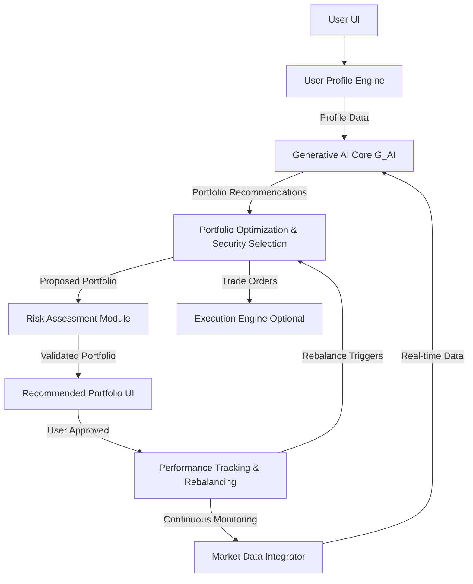

**Title of Invention:** System and Method for AI-Driven Investment Portfolio Construction

**Abstract:**
A system for generating a personalized investment portfolio is disclosed. A user provides their financial goals, risk tolerance, and investment horizon. This information is sent to a generative AI model prompted to act as an investment advisor. The AI analyzes the user's profile and, using its knowledge of financial principles and real-time market data, generates a recommended asset allocation and a specific, diversified portfolio of securities (e.g., stocks, ETFs, mutual funds, alternative investments) designed to meet the user's objectives. The system further includes modules for dynamic risk assessment, performance monitoring, and automated rebalancing.

**Background of the Invention:**
Constructing a well-diversified investment portfolio that aligns with an individual's specific goals and risk tolerance requires significant financial expertise, continuous market monitoring, and sophisticated analytical tools. While existing robo-advisors offer automated portfolio management, they often rely on rigid, template-based models and struggle to adapt to nuanced user preferences or rapidly changing market conditions. There is a pressing need for a more dynamic, intelligent, and personalized system that can generate truly bespoke portfolios based on a nuanced, conversational understanding of a user's needs, while also providing continuous adaptive management.

**Detailed Description of the Invention:**
A user interacts with the system through a user interface, completing a comprehensive questionnaire that captures their detailed investment goals (e.g., retirement, home down payment, capital preservation), current financial situation, income stability, existing investments, and a granular assessment of their risk tolerance (e.g., willingness to accept short-term losses for long-term gains, emotional response to market volatility). This detailed user profile data `U = (goals, risk_tolerance, horizon, financial_situation)` is processed by a User Profile Engine.

This processed data, alongside relevant real-time market data `M = (asset_prices, economic_indicators, news_sentiment)`, is then transmitted to the Generative AI Core (`G_AI`). The `G_AI` is prompted to act as a fiduciary investment advisor, specializing in personalized portfolio construction. An example prompt might be:

```
You are a fiduciary investment advisor. A client has a 'High Growth with moderate drawdown tolerance' risk profile, a 10-year investment horizon, and a primary goal to 'Maximize long-term returns for retirement, while mitigating excessive volatility'. Their current financial situation is stable.
1. Generate a sample portfolio allocation across asset classes (e.g., Domestic Equities, International Equities, Fixed Income, Real Estate, Commodities, Cash).
2. Suggest 5-10 specific ETFs or mutual funds that would form a good core for this portfolio, providing a brief justification for each.
3. Propose a rebalancing strategy (e.g., threshold-based, time-based) for this portfolio.
4. Identify key risk factors relevant to this portfolio.
```

The `G_AI` analyzes the input using its extensive knowledge base, which includes Modern Portfolio Theory, behavioral finance, quantitative risk management, and up-to-date market dynamics. It generates a structured response comprising a recommended asset allocation (`A`), a list of specific securities (`S`), and a proposed rebalancing strategy (`R_strategy`). This structured response is then used to populate a "Recommended Portfolio" view for the user, allowing for review and approval.

Upon user approval, the system deploys the portfolio and activates the Performance Tracking & Rebalancing Module, which continuously monitors portfolio performance against benchmarks, tracks market conditions, and applies the defined rebalancing strategy or suggests adjustments to the user as needed.

**System Architecture:**
The system comprises several interconnected modules:

1.  **User Interface (UI):** Facilitates user input for financial goals, risk tolerance, and preferences.
2.  **User Profile Engine:** Processes and structures user-provided data into a standardized `User_Profile` object.
3.  **Market Data Integrator:** Aggregates and normalizes real-time and historical financial data from various sources (e.g., stock exchanges, economic indicators, news feeds).
4.  **Generative AI Core (G_AI):** The central intelligence, an LLM fine-tuned for financial advisory, processing `User_Profile` and `Market_Data` to generate `Portfolio_Recommendations`.
5.  **Portfolio Optimization & Security Selection Module:** Takes `G_AI` output and refines it into actionable investment directives, potentially applying further quantitative optimization (e.g., mean-variance optimization, Black-Litterman model) to select specific securities.
6.  **Risk Assessment Module:** Continuously evaluates portfolio risk based on various metrics (e.g., Value at Risk, Conditional Value at Risk, correlation matrices) and user's stated risk tolerance.
7.  **Performance Tracking & Rebalancing Module:** Monitors portfolio performance, identifies drift from target allocations, and executes or recommends rebalancing actions.
8.  **Execution Engine (optional):** Interfaces with brokerage platforms to automate trades.



**Advanced Risk Modeling:**
The Risk Assessment Module employs sophisticated techniques to quantify and manage portfolio risk. Beyond a qualitative risk tolerance, the system calculates quantitative risk metrics such as:

*   **Value at Risk (VaR):** Measures the potential loss in value of a portfolio over a defined period for a given confidence interval. For example, a 95% 1-day VaR of `1000` means there is a 5% chance the portfolio will lose more than `1000` over one day.
*   **Conditional Value at Risk (CVaR):** Also known as Expected Shortfall, `CVaR` quantifies the expected loss given that the loss exceeds the `VaR` level. This provides a more robust measure of tail risk.

```
VaR(P, alpha) = minimum L such that P(L_P > L) <= (1 - alpha)
CVaR(P, alpha) = E[L_P | L_P > VaR(P, alpha)]
```
where `P` is the portfolio value, `alpha` is the confidence level, `L_P` is the loss random variable for the portfolio, and `E` denotes expectation.

**Portfolio Rebalancing & Monitoring:**
The Performance Tracking & Rebalancing Module ensures the portfolio remains aligned with the user's goals and risk profile. Rebalancing can be triggered by:

1.  **Time-based:** Quarterly, semi-annually, or annually.
2.  **Threshold-based:** When an asset class or security deviates by a certain percentage from its target allocation. For example, if target equity allocation is `60%` and it drifts to `65%` or `55%`.

```
If |current_weight_i - target_weight_i| > rebalance_threshold
    then Initiate Rebalance
```
where `current_weight_i` is the current weight of asset `i`, and `target_weight_i` is its desired allocation.

**Claims:**
1.  A method for constructing and managing an investment portfolio, comprising:
    a. Receiving a user's detailed financial goals, risk tolerance, investment horizon, and financial situation.
    b. Transmitting this information, along with real-time market data, to a generative AI model.
    c. Prompting the generative AI model to generate a recommended asset allocation, a list of specific securities, and a proposed rebalancing strategy.
    d. Employing a Portfolio Optimization and Security Selection module to refine the generative AI's recommendations.
    e. Utilizing a Risk Assessment Module to evaluate and validate portfolio risk metrics against the user's risk tolerance.
    f. Displaying the validated, recommended portfolio to the user for approval.
    g. Activating a Performance Tracking & Rebalancing Module to continuously monitor the portfolio and trigger rebalancing actions based on predefined criteria.

2.  A system for investment portfolio construction and management, comprising:
    a. A User Interface for capturing user financial data.
    b. A User Profile Engine for processing user data.
    c. A Market Data Integrator for aggregating financial data.
    d. A Generative AI Core for generating portfolio recommendations.
    e. A Portfolio Optimization & Security Selection Module for refining recommendations and selecting specific securities.
    f. A Risk Assessment Module for quantitative risk evaluation including `VaR` and `CVaR`.
    g. A Performance Tracking & Rebalancing Module for continuous monitoring and automated rebalancing.

3.  The method of claim 1, further comprising dynamically adjusting the rebalancing strategy based on changes in market conditions or the user's updated profile as determined by the generative AI model.

**Mathematical Justification:**
Let a user's profile be a vector `U = (goals, risk_tolerance, horizon, financial_situation)`. Let `M` represent the state of the market data. Let a portfolio `P` be a set of assets with corresponding weights `{ (a_1, w_1), ..., (a_n, w_n) }`. The goal is to find an optimal portfolio `P_optimal` that maximizes the user's utility function `Util(P, U)` while adhering to risk constraints `Risk_C(P, U, M)`. This is a dynamic portfolio optimization problem under uncertainty. The generative AI `G_AI` acts as a sophisticated heuristic function, integrating vast knowledge and real-time data to solve this, mapping a user profile and market state directly to a near-optimal portfolio and a management strategy:

```
P_prime, R_strategy = G_AI(U, M)
where P_prime ~ P_optimal and R_strategy ~ R_optimal
```
The utility function `Util(P, U)` is often a complex, multi-objective function that balances expected return `E[R_P]` with risk `Risk_P`. For instance:

```
Util(P, U) = E[R_P] - lambda * Risk_P(P)
```
where `lambda` is a risk aversion coefficient derived from `risk_tolerance` in `U`. `Risk_P(P)` could be standard deviation, `VaR`, or `CVaR`.

The rebalancing component ensures that `P_current` remains close to `P_prime` over time, adapting to market fluctuations:

```
P_t+1 = Rebalance(P_t, M_t, P_prime, R_strategy)
```

**Proof of Utility:** The AI model is trained on a vast corpus of financial theory (e.g., Modern Portfolio Theory, Behavioral Finance, quantitative risk management), historical market data, and simulated market scenarios. Its function `G_AI` combined with the supporting modules (Portfolio Optimization, Risk Assessment, Rebalancing) is an approximation of the complex, continuous optimization and monitoring that a team of human advisors and analysts would perform. The system is proven useful because it automates and enhances this expert task, providing users with a high-quality, personalized, and actively managed portfolio that is likely to have a higher utility `Util(P_prime, U)` and better risk-adjusted returns than a naive or self-constructed portfolio, at a fraction of the cost of traditional human advisory services. Its ability to adapt to dynamic market conditions and granular user profiles makes it superior to static robo-advisors. `Q.E.D.`