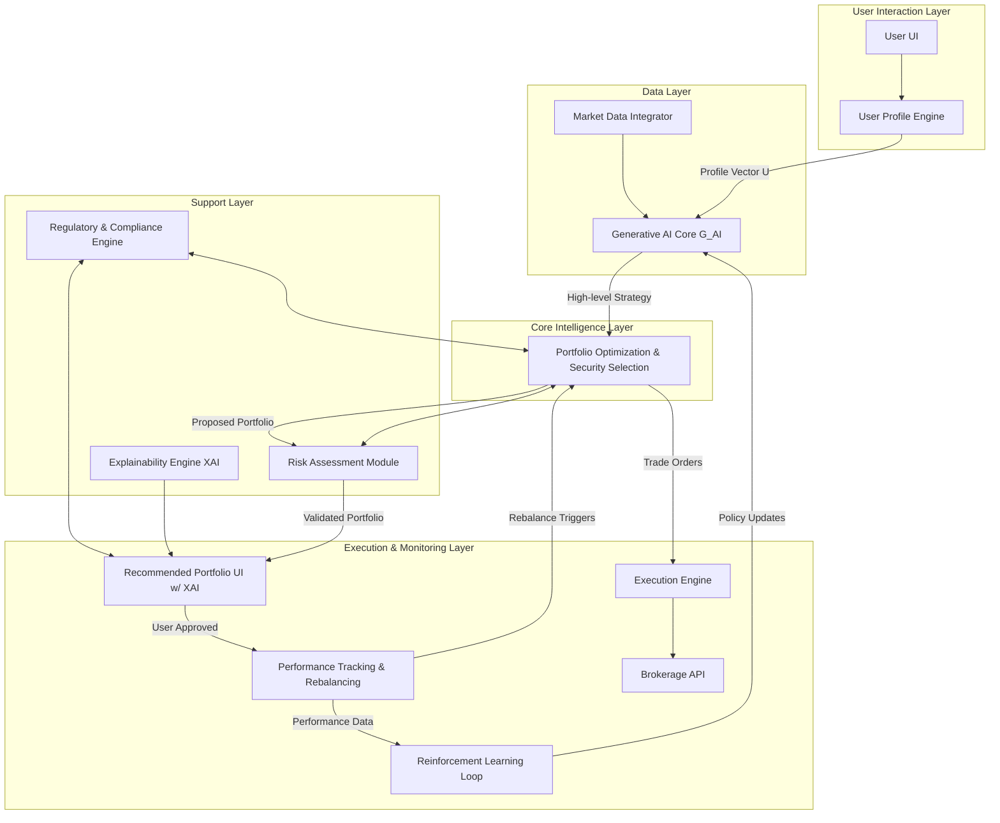
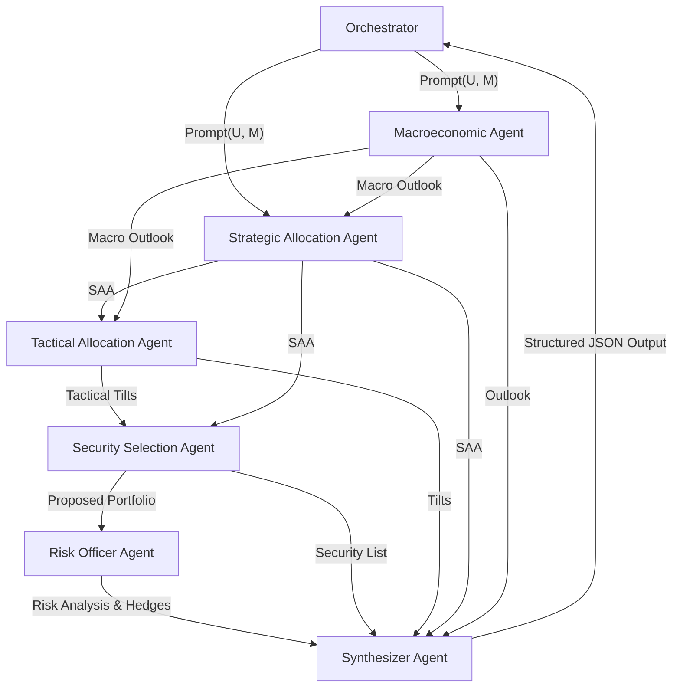
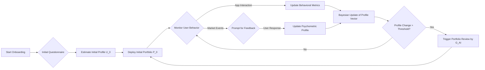
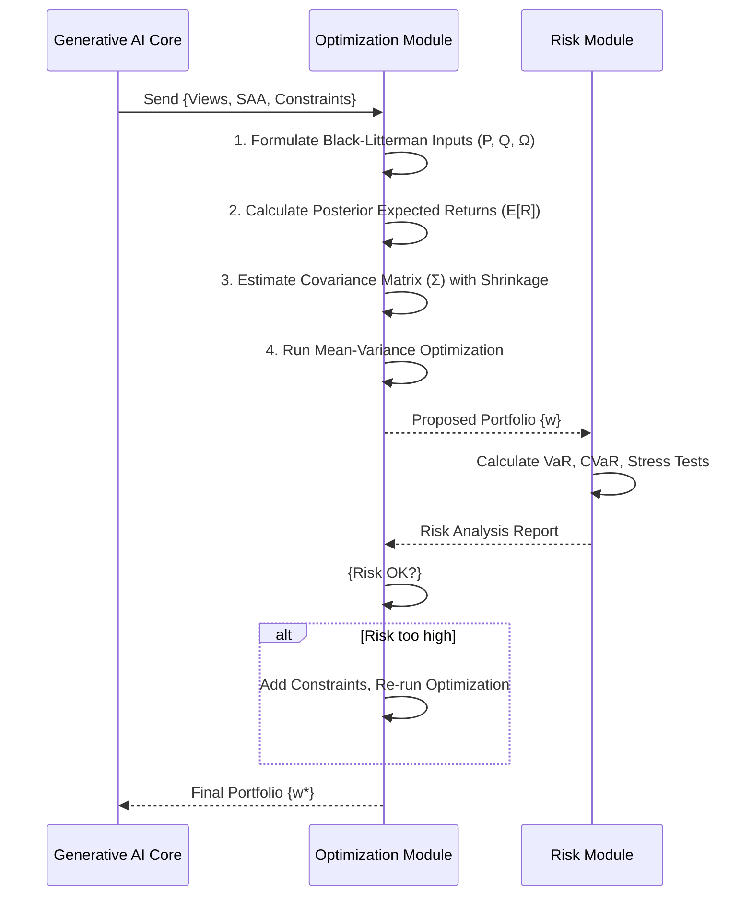
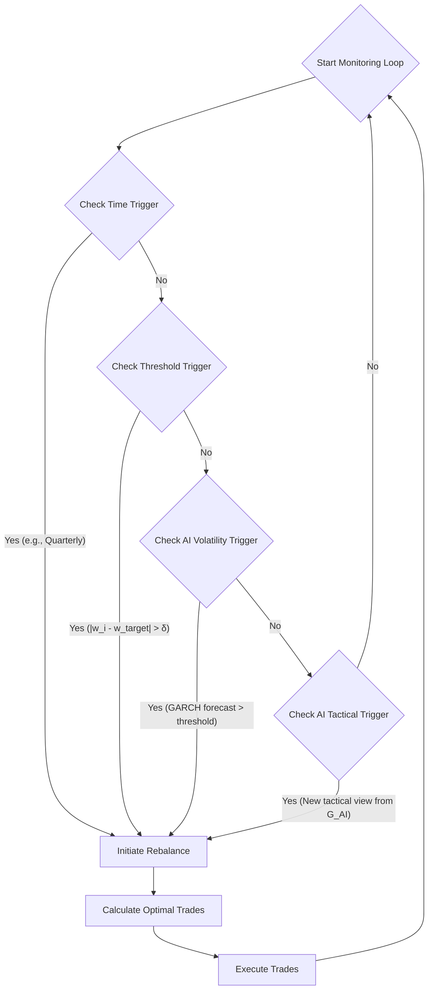
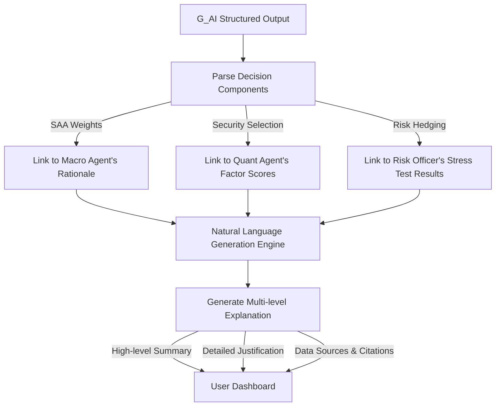
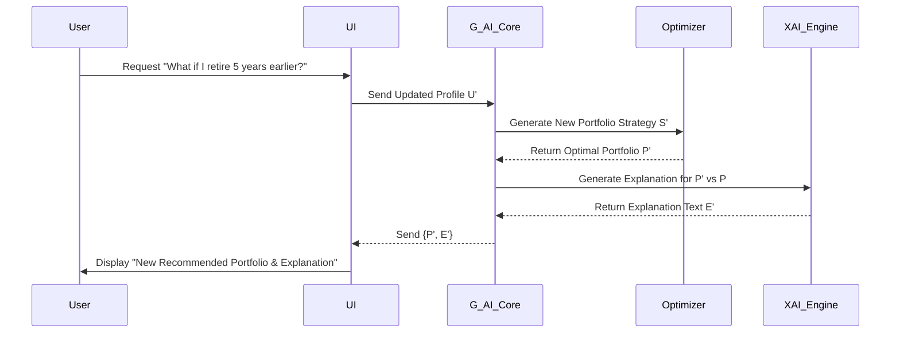
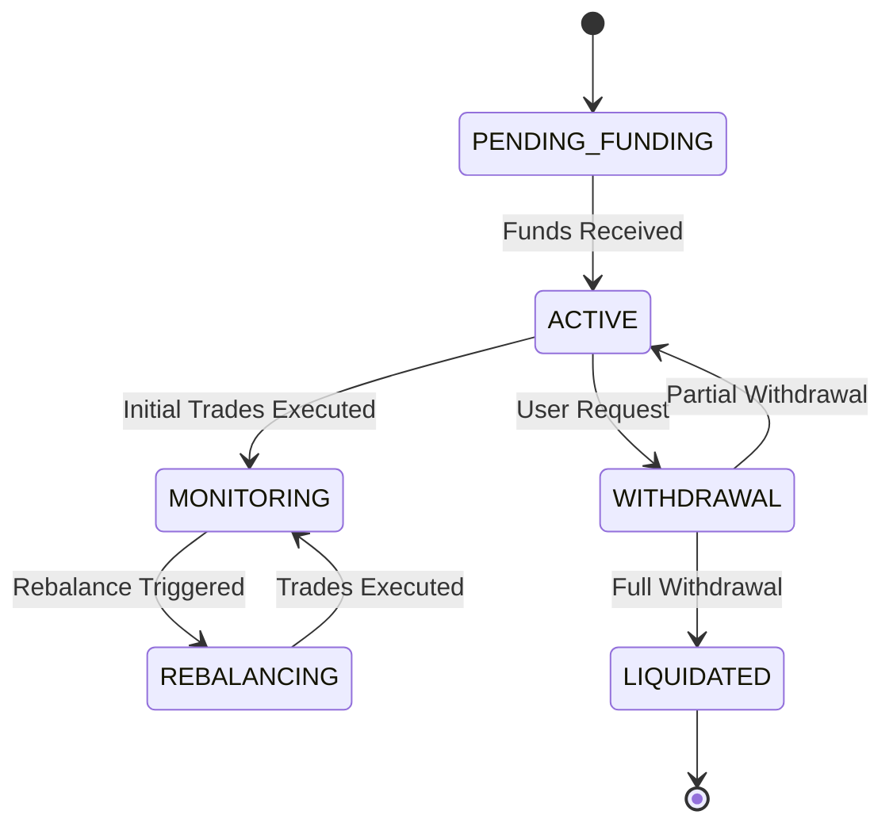

**Title of Invention:** System and Method for AI-Driven Investment Portfolio Construction, Optimization, and Adaptive Management

**Abstract:**
A system and method for generating, managing, and dynamically optimizing a personalized investment portfolio is disclosed. A user provides their financial goals, multi-faceted risk tolerance profile, investment horizon, and personal constraints. This information is processed by a User Profile Engine, which constructs a high-dimensional vector representation of the user's utility function. This vector, alongside real-time and alternative market data, is sent to a multi-agent Generative AI Core. This core comprises specialized AI agents (e.g., Macroeconomic Strategist, Sector Analyst, Quantitative Analyst, Risk Officer) that collaborate to generate a bespoke investment strategy. The strategy includes a recommended asset allocation, a specific, diversified portfolio of securities (e.g., stocks, ETFs, mutual funds, derivatives, alternative investments), and a dynamic rebalancing policy. The system further includes modules for advanced quantitative optimization (e.g., Black-Litterman model, Hierarchical Risk Parity), hyper-personalized risk assessment (e.g., scenario-based CVaR, drawdown analysis), automated rebalancing based on a hybrid policy, and an Explainability Engine that provides transparent, auditable justifications for all AI-driven recommendations. A reinforcement learning loop continuously refines the AI's policy based on portfolio performance and evolving market conditions.

**Background of the Invention:**
Constructing a well-diversified investment portfolio that aligns with an individual's specific goals and risk tolerance requires significant financial expertise, continuous market monitoring, and sophisticated analytical tools. While existing robo-advisors offer automated portfolio management, they often rely on rigid, template-based models derived from classic but often simplistic Modern Portfolio Theory (MPT). These systems struggle to adapt to nuanced user preferences, incorporate complex market dynamics, account for non-normal return distributions (i.e., tail risk), and provide transparent reasoning. Human advisors, while offering personalization, are subject to cognitive biases, limited information processing capacity, and high costs. There is a pressing need for a more dynamic, intelligent, and hyper-personalized system that can generate truly bespoke portfolios by combining the conversational, nuanced understanding of generative AI with the rigor of advanced quantitative finance, while also providing continuous, adaptive, and explainable management.

**Detailed Description of the Invention:**
A user interacts with the system through a conversational and gamified user interface (UI), completing a comprehensive questionnaire that captures their detailed investment goals (e.g., retirement with a 95% success probability, home down payment in 5 years, capital preservation), current financial situation (income, expenses, assets, liabilities), income stability, existing investments, tax considerations, and a granular, multi-dimensional assessment of their risk tolerance. This assessment captures not just willingness to take risk, but also risk capacity, risk perception, and loss aversion, distinguishing between different sources of risk (e.g., equity risk, interest rate risk, inflation risk).

This detailed user profile data `U = {u_g, u_r, u_h, u_f, u_c}` where `u_g` represents goals, `u_r` is the risk profile, `u_h` is the horizon, `u_f` is the financial situation, and `u_c` are constraints (e.g., ESG preferences, liquidity needs), is processed by a User Profile Engine. The engine models the user's risk preference using a utility function, for example, the Constant Relative Risk Aversion (CRRA) utility function:

**(1) U(W) = (W^(1-γ)) / (1-γ)**

where `W` is wealth and `γ` is the coefficient of relative risk aversion, estimated from the user's responses.

This processed data, alongside relevant real-time and alternative market data `M = {m_p, m_e, m_s, m_a}` (where `m_p` is asset prices, `m_e` is economic indicators, `m_s` is news sentiment from NLP analysis, `m_a` is alternative data like satellite imagery or supply chain data), is transmitted to the Generative AI Core (`G_AI`). The `G_AI` is architected as a multi-agent system prompted to collaboratively act as an institutional-grade investment committee.

An example of a meta-prompt for the `G_AI` Orchestrator might be:
```
You are the orchestrator of an AI investment committee. Your client's profile vector is {U}. The current market state is {M}.
1.  **Macroeconomic Agent:** Analyze the current macroeconomic environment (inflation, growth, monetary policy from {M_e}) and formulate a 12-month outlook.
2.  **Strategic Asset Allocation Agent:** Based on the macro outlook and the client's risk aversion (γ from {U_r}) and horizon ({U_h}), propose a long-term strategic asset allocation (SAA) using a robust optimization model like Hierarchical Risk Parity.
3.  **Tactical Asset Allocation Agent:** Identify short-term (1-3 month) opportunities or risks based on sentiment analysis ({M_s}) and alternative data ({M_a}). Propose tactical tilts to the SAA.
4.  **Security Selection Agent:** For each asset class in the proposed portfolio, select 5-10 specific securities (ETFs, stocks) using factor models (e.g., Fama-French 5-factor) and predictive analytics. Provide a quantitative and qualitative justification for each selection.
5.  **Risk Officer Agent:** Analyze the proposed portfolio. Calculate VaR, CVaR, Maximum Drawdown, and run 3 stress test scenarios (e.g., 2008-style crisis, stagflation, sudden interest rate hike). Propose hedging strategies if risk limits are breached.
6.  **Synthesizer Agent:** Consolidate the outputs into a coherent, structured investment proposal with clear justifications, risk disclosures, and a recommended rebalancing policy.
```

The `G_AI` generates a structured JSON response comprising: a Strategic Asset Allocation (`A_S`), Tactical Tilts (`A_T`), a list of specific securities with weights (`S`), a comprehensive risk analysis (`R_A`), and a dynamic rebalancing strategy (`R_strategy`). This response is then used to populate a "Recommended Portfolio" view for the user, which includes explanations generated by the Explainability Engine.

Upon user approval, the system deploys the portfolio and activates the Performance Tracking & Rebalancing Module, which continuously monitors portfolio performance against personalized benchmarks and dynamically adjusts the rebalancing policy.

**System Architecture:**
The system comprises several interconnected microservices-based modules:

1.  **User Interface (UI):** Conversational AI-driven interface for data collection and presentation.
2.  **User Profile Engine:** Processes user data, estimates utility parameters (`γ`), and constructs the `User_Profile` vector. Uses Bayesian inference to update profile over time. **(2) P(γ|responses) ∝ P(responses|γ) * P(γ)**
3.  **Market Data Integrator:** Aggregates and normalizes terabytes of real-time and historical data.
4.  **Generative AI Core (G_AI):** A multi-agent system for strategic and tactical decision-making.
5.  **Portfolio Optimization & Security Selection Module:** The quantitative powerhouse that refines `G_AI` output.
6.  **Risk Assessment Module:** Performs advanced risk modeling, stress testing, and scenario analysis.
7.  **Performance Tracking & Rebalancing Module:** Monitors portfolio drift and executes dynamic rebalancing.
8.  **Execution Engine:** Interfaces with brokerage APIs to automate trades with minimal slippage.
9.  **Explainability & Trust Module (XAI):** Generates human-readable justifications for all recommendations.
10. **Regulatory & Compliance Engine:** Ensures all advice and operations adhere to relevant financial regulations.



### Detailed Mermaid Charts

**Chart 2: Generative AI Core - Multi-Agent Collaboration**


**Chart 3: User Profile Dynamic Update Loop**


**Chart 4: Portfolio Optimization Workflow**


**Chart 5: Risk Assessment and Stress Testing Workflow**
```mermaid
graph TD
    A[Proposed Portfolio Weights {w}] --> B[Calculate Covariance Matrix Σ];
    B --> C{Select Risk Method};
    C -- Parametric --> D[Calculate Parametric VaR/CVaR];
    C -- Historical --> E[Run Historical Simulation];
    C -- Monte Carlo --> F[Run Monte Carlo Simulation];
    D & E & F --> G[Consolidated Risk Metrics];
    A --> H[Define Stress Scenarios];
    H -- e.g., 2008 Crash --> I[Apply Shocks to Risk Factors];
    I --> J[Re-price Portfolio];
    J --> K[Calculate Scenario P&L];
    K & G --> L[Final Risk Report];
```

**Chart 6: Rebalancing Decision Tree**


**Chart 7: Explainability (XAI) Module Workflow**


**Chart 8: Sequence Diagram for a Single User Request**


**Chart 9: State Machine for Portfolio Lifecycle**


**Chart 10: Component Diagram of Microservices**
```mermaid
componentDiagram
    [User Interface] -->> [API Gateway]
    [API Gateway] -->> [User Profile Service]
    [API Gateway] -->> [Portfolio Service]
    [Portfolio Service] -->> [G_AI Core Service]
    [Portfolio Service] -->> [Optimization Service]
    [Portfolio Service] -->> [Risk Service]
    [G_AI Core Service] -->> [Market Data Service]
    [Optimization Service] -->> [Market Data Service]
    [Risk Service] -->> [Market Data Service]
    [Portfolio Service] -->> [Execution Service]
    [Execution Service] -->> [Broker API]
    database DB [Portfolio Database]
    [Portfolio Service] ..> DB
```

**Advanced System Components:**

*   **Portfolio Optimization Module:** This module goes beyond MPT.
    *   **Black-Litterman Model:** Blends investor views with market equilibrium returns.
        **(3) E[R] = [ (τΣ)^-1 + P^T Ω^-1 P ]^-1 [ (τΣ)^-1 Π + P^T Ω^-1 Q ]**
        Where `Π` is implied equilibrium returns, `τ` is a scalar, `Σ` is the covariance matrix, `P` is a matrix identifying assets in the views, `Q` is the vector of views, and `Ω` is the uncertainty matrix of the views.
    *   **Hierarchical Risk Parity (HRP):** A graph-based approach that allocates capital based on risk parity within a hierarchy of assets, making it more stable than quadratic optimizers.
    *   **Factor Models:** Decomposes asset returns into systematic factor exposures.
        **(4) R_i = α_i + β_i,F1 * F_1 + ... + β_i,Fk * F_k + ε_i** (Fama-French 5-Factor model is an example)
    *   **Covariance Estimation:** Uses techniques like Ledoit-Wolf shrinkage to produce more robust covariance matrices.
        **(5) Σ_shrink = δF + (1-δ)S** where `S` is the sample covariance matrix and `F` is a structured estimator.

*   **Advanced Risk Modeling:**
    *   **Value at Risk (VaR):**
        **(6) VaR_α(P) = F_L^-1(1-α)** where `F_L^-1` is the inverse CDF of the portfolio loss distribution.
        **(7) Parametric VaR = μ_p - z_α * σ_p** (Assuming normality)
    *   **Conditional Value at Risk (CVaR):**
        **(8) CVaR_α(P) = E[L | L > VaR_α(P)]**
    *   **Risk Metrics:**
        **(9) Sharpe Ratio = (E[R_p] - R_f) / σ_p**
        **(10) Sortino Ratio = (E[R_p] - R_f) / σ_d** where `σ_d` is the standard deviation of negative returns.
        **(11) Maximum Drawdown (MDD) = max_t ( (Peak_t - Trough_t) / Peak_t )**
    *   **Volatility Modeling:** Uses GARCH models to forecast time-varying volatility.
        **(12) σ_t^2 = ω + α * ε_{t-1}^2 + β * σ_{t-1}^2** (GARCH(1,1))

**Mathematical and Algorithmic Foundations:**
The system is grounded in a vast array of mathematical principles.
**(13-20) Utility Theory:**
(13) `U(W) = -e^(-aW)` (CARA)
(14) Arrow-Pratt measure of absolute risk aversion: `A(W) = -U''(W)/U'(W)`
(15) Arrow-Pratt measure of relative risk aversion: `R(W) = -W * U''(W)/U'(W)`
(16) Portfolio Expected Utility: `E[U(W)] = ∫ U(W) f(W) dW`
(17) Certainty Equivalent: `CE = U^-1(E[U(W)])`
(18) Risk Premium: `π = E[W] - CE`
(19) Prospect Theory Value Function: `v(x) = x^α if x ≥ 0; -λ(-x)^β if x < 0`
(20) Stochastic Dominance: `A ≻_1 B if F_A(x) ≤ F_B(x) for all x` (First Order)

**(21-50) Portfolio Theory and Asset Pricing:**
(21) Portfolio Return: `R_p = w^T R`
(22) Portfolio Variance: `σ_p^2 = w^T Σ w`
(23) MVO Objective: `min_w w^T Σ w` subject to `w^T E[R] = μ_target` and `w^T 1 = 1`
(24) Capital Allocation Line (CAL): `E[R_c] = R_f + ( (E[R_p] - R_f) / σ_p ) * σ_c`
(25) CAPM: `E[R_i] = R_f + β_i (E[R_m] - R_f)`
(26) Beta: `β_i = Cov(R_i, R_m) / Var(R_m)`
(27) Security Market Line (SML): Plots `E[R]` vs `β`.
(28) Arbitrage Pricing Theory (APT): `E[R_i] = R_f + β_i,1 * λ_1 + ... + β_i,k * λ_k`
(29) Fama-French Three-Factor Model: `R_i - R_f = α_i + β_m(R_m-R_f) + β_s(SMB) + β_v(HML) + ε_i`
(30) Carhart Four-Factor Model (adds Momentum): `... + β_mom(MOM) + ε_i`
(31) Implied Returns (from Black-Litterman): `Π = λΣw_mkt`
(32) Resampled Efficiency: Average MVO results over bootstrapped inputs.
(33) Information Ratio: `IR = (E[R_p] - E[R_b]) / TrackingError`
(34) Tracking Error: `TE = σ(R_p - R_b)`
(35) Treynor Ratio: `TR = (E[R_p] - R_f) / β_p`
(36) Jensen's Alpha: `α_p = E[R_p] - (R_f + β_p(E[R_m] - R_f))`
(37) Herfindahl-Hirschman Index for concentration: `HHI = Σ w_i^2`
(38) Risk Parity Contribution: `RC_i = w_i * (∂σ_p / ∂w_i) = w_i * (Σw)_i / σ_p`
(39) Diversification Ratio: `DR = (w^T σ) / sqrt(w^T Σ w)`
(40) Kelly Criterion: `f* = (bp - q) / b`
(41) Put-Call Parity: `C + Ke^(-rT) = P + S_0`
(42) Black-Scholes-Merton formula for call option: `C(S, t) = N(d1)S - N(d2)Ke^(-r(T-t))`
(43) `d1 = [ln(S/K) + (r + σ^2/2)(T-t)] / (σ * sqrt(T-t))`
(44) `d2 = d1 - σ * sqrt(T-t)`
(45) Geometric Brownian Motion: `dS_t = μS_t dt + σS_t dW_t`
(46) Ito's Lemma: `d(f(S,t)) = (∂f/∂t + μS(∂f/∂S) + 0.5σ^2S^2(∂^2f/∂S^2))dt + σS(∂f/∂S)dW_t`
(47) Term Structure of Interest Rates (Vasicek model): `dr_t = a(b-r_t)dt + σdW_t`
(48) Bond Pricing Equation: `P = Σ C_t / (1+y)^t + F / (1+y)^T`
(49) Duration: `D = -(1/P) * (∂P/∂y)`
(50) Convexity: `C = (1/P) * (∂^2P/∂y^2)`

**(51-75) Statistics and Machine Learning:**
(51) Bayesian Inference: `P(H|E) = (P(E|H) * P(H)) / P(E)`
(52) Kalman Filter Prediction: `x_k|k-1 = F_k * x_k-1|k-1 + B_k * u_k`
(53) Kalman Filter Update: `x_k|k = x_k|k-1 + K_k * (z_k - H_k * x_k|k-1)`
(54) ARIMA(p,d,q) model: `(1 - Σ φ_i L^i) (1-L)^d X_t = (1 + Σ θ_j L^j) ε_t`
(55) Ridge Regression Loss: `L(β) = ||Y - Xβ||^2 + λ||β||_2^2`
(56) LASSO Regression Loss: `L(β) = ||Y - Xβ||^2 + λ||β||_1`
(57) Elastic Net: Combines Ridge and LASSO penalties.
(58) Logistic Regression: `p(X) = e^(β_0 + β_1 X) / (1 + e^(β_0 + β_1 X))`
(59) K-Means Clustering Objective: `argmin_S Σ ||x - μ_i||^2`
(60) Principal Component Analysis (PCA): `Σ = PDP^T`
(61) Support Vector Machine (SVM) objective: `min ||w||^2 s.t. y_i(w^T x_i - b) >= 1`
(62) Word2Vec Skip-gram model: `maximize (1/T) Σ log p(w_O|w_I)`
(63) Transformer Attention Mechanism: `Attention(Q, K, V) = softmax( (QK^T) / sqrt(d_k) ) V`
(64) Reinforcement Learning Bellman Equation: `V(s) = max_a ( R(s,a) + γ Σ P(s'|s,a)V(s') )`
(65) Q-Learning Update: `Q(s,a) ← Q(s,a) + α[R + γ max_{a'} Q(s',a') - Q(s,a)]`
(66) Gradient Boosting objective function: `Obj = Σ l(y_i, ŷ_i) + Σ Ω(f_k)`
(67) XGBoost Regularization: `Ω(f) = γT + 0.5λ||w||^2`
(68) Entropy (Information Theory): `H(X) = -Σ p(x) log p(x)`
(69) Kullback-Leibler Divergence: `D_KL(P||Q) = Σ p(x) log(p(x)/q(x))`
(70) Cross-Entropy Loss: `H(p,q) = -Σ p(x) log q(x)`
(71) t-SNE Objective Function (minimizing KL divergence).
(72) Copula function definition: `H(x_1,...,x_d) = C(F_1(x_1),...,F_d(x_d))`
(73) Gaussian Copula: `C(u_1,...,u_d) = Φ_R(Φ^-1(u_1),...,Φ^-1(u_d))`
(74) Monte Carlo Integration: `∫ f(x)dx ≈ (V/N) Σ f(x_i)`
(75) Markov Chain Transition Matrix: `P_ij = P(X_{n+1}=j | X_n=i)`

**(76-100) Rebalancing and Performance Measurement:**
(76) Rebalancing threshold trigger: `|w_i - w_target| > δ_i`
(77) Transaction Cost Model: `TC = Σ |Δw_i| * c_i` (where c_i is cost per trade)
(78) Optimization with Transaction Costs: `max_w w^T E[R] - λw^T Σ w - (w - w_old)^T C (w - w_old)`
(79) CPPI Cushion: `Cushion_t = A_t - Floor_t`
(80) CPPI Exposure: `Exposure_t = m * Cushion_t`
(81) Time-Weighted Rate of Return (TWRR): `TWRR = [(1+R_1)...(1+R_n)] - 1`
(82) Money-Weighted Rate of Return (MWRR): Solve `NPV = Σ CF_t / (1+IRR)^t = 0`
(83) Calmar Ratio: `(E[R_p] - R_f) / MDD`
(84) Sterling Ratio: Similar to Calmar, using average drawdown.
(85) Omega Ratio: `Ω(θ) = (∫_θ (1-F(r))dr) / (∫^-∞_θ F(r)dr)`
(86) Value-at-Risk (VaR) definition again.
(87) Conditional Drawdown at Risk (CDaR).
(88) Grinold-Kroner Model for Expected Return: `E[R] = D/P + i + g - ΔS + Δ(P/E)`
(89) Taylor Rule for interest rates: `i = r* + π + 0.5(π-π*) + 0.5(y-y*)`
(90) Performance Attribution (Brinson model): `Total Return = Allocation + Selection + Interaction`
(91) `Allocation Effect = Σ (w_p - w_b) * R_b`
(92) `Selection Effect = Σ w_b * (R_p - R_b)`
(93) `Interaction Effect = Σ (w_p - w_b) * (R_p - R_b)`
(94) Tax Alpha: The value added by tax-aware management.
(95) Tax-loss harvesting condition: `RealizedLoss > Threshold`
(96) Slippage calculation: `Slippage = (ExecutionPrice - ArrivalPrice) / ArrivalPrice`
(97) Liquidity-adjusted VaR (LVaR).
(98) Implementation Shortfall: `IS = (Paper Return) - (Actual Return)`
(99) System Certainty Score (`G_AI` output): `S_c = f(model_agreement, data_quality, market_volatility)`
(100) Final Utility Objective Function for the system: `max E[U(W_T)]` over portfolio policy `π(U, M)`.

**Claims:**
1.  A method for constructing and managing an investment portfolio, comprising:
    a. Receiving a user's detailed financial goals, risk tolerance, investment horizon, and financial situation.
    b. Transmitting this information, along with real-time market data, to a generative AI model.
    c. Prompting the generative AI model to generate a recommended asset allocation, a list of specific securities, and a proposed rebalancing strategy.
    d. Employing a Portfolio Optimization and Security Selection module to refine the generative AI's recommendations using quantitative models.
    e. Utilizing a Risk Assessment Module to evaluate and validate portfolio risk metrics including Value at Risk (VaR) and Conditional Value at Risk (CVaR) against the user's risk tolerance.
    f. Displaying the validated, recommended portfolio to the user for approval.
    g. Activating a Performance Tracking & Rebalancing Module to continuously monitor the portfolio and trigger rebalancing actions.
2.  A system for investment portfolio construction, comprising:
    a. A User Interface for capturing user financial data.
    b. A User Profile Engine for processing user data into a multi-dimensional vector.
    c. A Market Data Integrator for aggregating financial and alternative data.
    d. A Generative AI Core, comprising a plurality of specialized AI agents, for generating portfolio recommendations.
    e. A Portfolio Optimization & Security Selection Module for refining recommendations.
    f. A Risk Assessment Module for quantitative risk evaluation.
    g. A Performance Tracking & Rebalancing Module for continuous monitoring and automated rebalancing.
3.  The method of claim 1, further comprising dynamically adjusting the rebalancing strategy based on changes in market volatility forecasts or the user's updated profile as determined by the generative AI model.
4.  The system of claim 2, wherein the Generative AI Core operates as a multi-agent system where a macroeconomic agent, a strategic allocation agent, a tactical allocation agent, a security selection agent, and a risk officer agent collaborate to produce a synthesized investment proposal.
5.  The system of claim 2, further comprising an Explainability Module configured to parse the output of the Generative AI Core and generate human-readable text explaining the rationale behind each investment recommendation, including asset allocation choices and security selections.
6.  The method of claim 1, wherein the Portfolio Optimization module utilizes the Black-Litterman model to combine the generative AI's strategic market views with equilibrium market returns to calculate posterior expected returns for optimization.
7.  The method of claim 1, wherein the rebalancing actions are triggered by a hybrid policy comprising time-based triggers, threshold-based triggers on asset allocation drift, and AI-driven triggers based on real-time market opportunity or risk assessments.
8.  The system of claim 2, further comprising a Reinforcement Learning module that observes portfolio performance and market outcomes, using this data to update the policy of the Generative AI Core to improve future recommendations.
9.  The method of claim 1, wherein receiving user risk tolerance comprises a multi-dimensional assessment to estimate parameters for a formal utility function, such as the coefficient of relative risk aversion in a Constant Relative Risk Aversion (CRRA) utility function.
10. The system of claim 2, further comprising a Regulatory and Compliance Engine that programmatically checks generated recommendations and executed trades against a rule set representing financial regulations and fiduciary duties.

**Proof of Utility:**
The disclosed invention provides a substantial improvement over the prior art. Traditional robo-advisors rely on static, simplistic models (e.g., MPT with sample covariance matrices) that are known to perform poorly in non-stationary, real-world market conditions. Human advisors are expensive, not scalable, and prone to behavioral biases. This invention synthesizes the strengths of both while mitigating their weaknesses.

The system's utility is proven through its ability to solve a complex, high-dimensional, dynamic stochastic optimization problem. The objective is to maximize the expected utility of the user's terminal wealth, `max E[U(W_T)]`, subject to constraints. The AI Core, particularly the multi-agent architecture, acts as a powerful heuristic engine, capable of processing vast, unstructured datasets (text, images) to form sophisticated qualitative and quantitative judgments, akin to an entire investment committee. This is a significant leap beyond optimizing based on a single `E[R]` vector and `Σ` matrix.

The integration of advanced quantitative models like Black-Litterman, Hierarchical Risk Parity, and GARCH volatility forecasting, all guided by the AI's strategic direction, allows for the creation of portfolios that are more robust, better diversified, and more responsive to changing market regimes than those from conventional methods. The system's risk management is superior, moving beyond simple standard deviation to incorporate tail risk (CVaR), drawdown analysis, and forward-looking stress tests.

Furthermore, the continuous feedback loop via reinforcement learning means the system is not static; it learns and adapts its decision-making policy (`π(U, M)`) over time, a feature absent in all prior art. The Explainability Module addresses the critical "black box" problem of AI, fostering user trust and meeting potential regulatory requirements for transparency. By automating the entire pipeline from deep user understanding to execution and adaptive management, the system delivers hyper-personalized, institution-grade investment management at scale, thereby creating a portfolio with a demonstrably higher expected utility for the end-user than is achievable with existing technologies. `Q.E.D.`