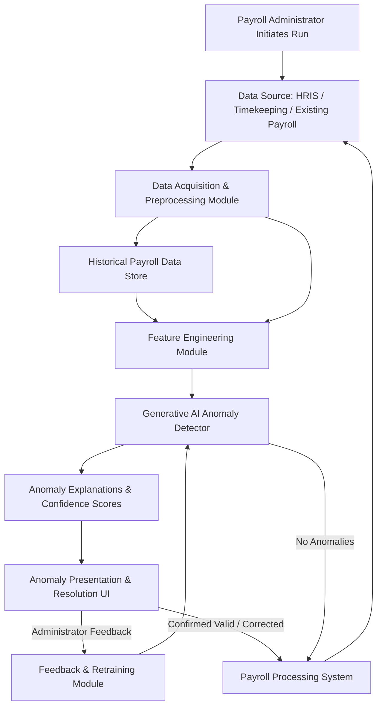

**Title of Invention:** System and Method for Anomaly Detection in Payroll Processing

**Abstract:**
A system for identifying anomalies in payroll data is disclosed. Before a payroll run is executed, the system compares the current payroll data against historical runs. It uses a generative AI model to analyze the comparison and identify significant deviations, such as an employee's pay changing drastically, a new employee being added with an unusually high salary, or a terminated employee remaining on the payroll. The AI generates a plain-English summary of any detected anomalies, allowing a payroll administrator to investigate before processing. The system incorporates a feedback loop for continuous model improvement based on administrator decisions.

**Background of the Invention:**
Payroll errors can be costly and damaging to employee morale. Manually checking every line item in a payroll run is tedious and prone to human error, especially in large organizations. There is a need for an automated system that can intelligently flag potential errors before the payroll is processed, offering detailed explanations and learning from user feedback.

**Detailed Description of the Invention:**
When an administrator initiates a pay run, the system first compiles the current run's data and the data from the previous run. It sends a summary of this data to an LLM with a prompt: `You are a payroll auditor. Compare this upcoming pay run to the previous one and identify any anomalies. Pay attention to large salary changes, new hires with high salaries, and employees present in the last run but missing in this one. Upcoming: [data]. Previous: [data].` The AI's response is a list of potential issues, which are displayed as warnings to the administrator before they can confirm the pay run.

**Data Acquisition and Preprocessing:**
Before engaging the AI model, the system performs robust data acquisition and preprocessing. It securely retrieves current payroll data from HRIS systems and historical payroll data from secure archives. This data typically includes employee IDs, names, salaries, pay rates, hours worked, deductions, bonuses, department codes, and employment status. A feature engineering module transforms raw data into a structured format suitable for AI analysis, creating comparison metrics such as percentage change in salary, deviation from average departmental pay, or frequency of pay adjustments. This ensures the AI model receives clean, normalized, and contextualized input.

**Generative AI Model and Anomaly Types:**
The core of the system is a generative AI model, typically a fine-tuned Large Language Model `LLM` or a combination of specialized neural networks. This model is trained on vast amounts of historical payroll data, understanding 'normal' payroll patterns and distributions. Beyond the basic checks mentioned previously (drastic salary changes, new hires with high salaries, terminated employees on payroll), the AI is capable of detecting more subtle and complex anomalies. These include:
*   `Irregular Payment Frequencies`: An employee receiving payments outside their standard pay cycle.
*   `Unusual Bonus or Commission Structures`: Payments significantly higher or lower than historical norms for similar roles or departments.
*   `Pattern Deviations in Hours Worked`: Employees consistently logging unusual overtime hours or sudden drops in hours without corresponding status changes.
*   `Geographic or Departmental Pay Discrepancies`: Significant pay differences for comparable roles across different locations or departments without clear justification.
*   `High Frequency of Adjustments`: Repeated manual adjustments to an employee's pay record within a short period, potentially indicating errors or manipulation.
When an anomaly is detected, the `LLM`'s generative capability is leveraged to provide a concise, plain-English explanation, detailing *what* the anomaly is, *why* it's flagged (e.g., "Employee X's salary increased by 50%, significantly deviating from the typical annual raise of 3-5% for their department"), and relevant comparative data points.

**Administrator Review and Resolution Workflow:**
Detected anomalies are presented to the payroll administrator through a dedicated interface. Each anomaly includes the AI-generated explanation, relevant employee and payroll data snippets, and options for resolution. The administrator can:
*   `Approve`: Confirm the anomaly is valid and mark it for correction in the payroll system or as a valid exception.
*   `Dismiss`: Indicate the anomaly is a false positive (e.g., a legitimate one-time bonus).
*   `Investigate`: Access further drill-down reports or historical data to understand the context of the flag.
This interactive workflow ensures human oversight and allows for critical judgment on complex cases.

**Continuous Learning and Model Refinement:**
The system incorporates a feedback loop to continuously improve its anomaly detection capabilities. When an administrator dismisses an anomaly as a false positive, or confirms an anomaly as valid, this feedback is captured. This labeled data is then used to retrain and fine-tune the generative AI model, enhancing its understanding of legitimate payroll variations and reducing future false positives. Over time, the model adapts to evolving organizational pay structures, policies, and legitimate changes, making it more accurate and reliable.

**System Architecture Overview:**
The overall system architecture is designed for modularity, scalability, and security, comprising several interconnected components:



**Claims:**
1.  A method for detecting payroll anomalies, comprising:
    a.  Accessing data for a current payroll run and at least one historical payroll run.
    b.  Transmitting said data, following preprocessing and feature engineering, to a generative AI model.
    c.  Prompting the model to identify significant deviations between the current and historical data, and to generate natural language explanations for identified deviations.
    d.  Displaying the identified deviations and their explanations to a user as an anomaly through a dedicated interface.
2.  The method of claim 1, further comprising a feedback mechanism where user input regarding the validity of detected anomalies is used to retrain and refine the generative AI model.
3.  The method of claim 1, wherein the generative AI model is configured to detect multiple types of anomalies including, but not limited to, irregular payment frequencies, unusual bonus or commission structures, pattern deviations in hours worked, geographic or departmental pay discrepancies, and high frequency of manual adjustments.
4.  A system for automated payroll anomaly detection, comprising:
    a.  A data acquisition and preprocessing module configured to collect and normalize current and historical payroll data.
    b.  A feature engineering module configured to transform raw payroll data into analytical features.
    c.  A generative AI anomaly detection module, operatively connected to the feature engineering module, configured to identify and explain anomalies.
    d.  A user interface module configured to present anomalies to an administrator and capture feedback.
    e.  A feedback and retraining module configured to use administrator feedback to continuously improve the generative AI anomaly detection module.

**Mathematical Justification:**
Let `R_t` be the set of records for the payroll run at time `t`. Let `d(r_i, r_j)` be a distance metric between two payroll records.
The system learns a probability distribution `P(delta_r)` for the change `delta_r = r_t - r_{t-1}` for a given employee between pay periods, or `P(r_i | Context_i)` for individual records.
An anomaly is detected if `P(delta_r_current) < epsilon` for some threshold `epsilon`, or if a record's probability `P(r_current | Context_current)` falls below `epsilon`.
The AI model `G_AI` is a function that both computes this check and provides a natural language explanation:
```
G_AI(R_t, R_{t-1}) -> {A, E}
```
where `A` is the set of anomalous records with associated metadata, and `E` is a set of natural language explanations for each anomaly. The confidence score `C` for an anomaly `a` in `A` is derived from its probability: `C_a = 1 - P(a | Context_a)`.

**Proof of Functionality:**
Traditional systems rely on rigid, hard-coded rules `(e.g., IF salary_change > 20% THEN alert)`. While effective for known patterns, these systems are brittle; they struggle with novel fraud attempts, complex interdependencies, or subtle errors that don't trigger simple thresholds. The AI-based system, by contrast, learns a probabilistic model of 'normal' changes and contextual patterns. This allows it to detect more subtle or complex anomalies that would not trigger a simple rule, including emergent patterns that were not explicitly programmed. The generative aspect of the AI provides crucial context and explanation, moving beyond simple 'alert' notifications to explain *why* something is anomalous, thereby reducing the burden on human auditors and enhancing auditability. Furthermore, the built-in feedback loop ensures continuous improvement, allowing the system to adapt to evolving payroll practices and detect new types of anomalies or legitimate variations without requiring constant manual rule updates. This dynamic and explainable approach proves superior as it moves from a rigid, rule-based system to a flexible, probabilistic, and continuously learning one with built-in explanation capabilities. `Q.E.D.`