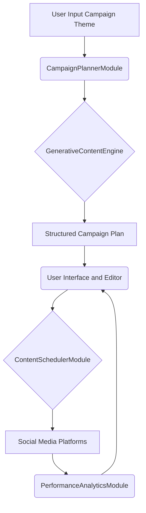

**Title of Invention:** System and Method for Generating a Multi-Platform Social Media Campaign from a Single Theme

**Abstract:**
A system for generating social media content is disclosed. A user provides a high-level theme or goal for a campaign. The system sends this to a generative AI model, which is prompted to act as a social media strategist. The AI generates a complete, multi-platform campaign plan as a structured object. The plan includes tailored content for different platforms [e.g., a professional article for LinkedIn, a short video script for TikTok, an image-focused post for Instagram], along with a suggested posting schedule.

**Background of the Invention:**
Planning and creating content for a coordinated social media campaign across multiple platforms is a complex, creative, and time-consuming task. Marketers must tailor their message, tone, and format for each platform's unique audience and algorithm. There is a need for a tool that can automate the initial brainstorming and content creation process for a full campaign, ensuring coherence and brand consistency.

**Detailed Description of the Invention:**
A user enters a campaign goal, e.g., "Launch our new AI-powered savings tool." The system uses a `responseSchema` to request a structured JSON object from an LLM. The prompt instructs the AI to create a one-week campaign, generating specific content types for target platforms [e.g., a LinkedIn post, a Twitter thread, and an Instagram caption] for three separate days.

The `responseSchema` is designed to elicit detailed, platform-specific content attributes. For example, it might define fields such as:
*   `campaign_name`: String
*   `duration_days`: Integer
*   `target_platforms`: Array of Strings [e.g., "LinkedIn", "Twitter", "Instagram", "TikTok"]
*   `schedule`: Array of objects, each containing:
    *   `day`: Integer
    *   `platform`: String
    *   `content_type`: String [e.g., "Text Post", "Image Post", "Video Script", "Article"]
    *   `headline`: String
    *   `body_text`: String [platform-specific character limits considered]
    *   `media_suggestion`: String [e.g., "stock photo of a piggy bank", "15-sec video explaining AI savings"]
    *   `hashtags`: Array of Strings
    *   `call_to_action`: String

The prompt is engineered to position the AI as an expert social media strategist, specifying the target audience, desired tone, and campaign objectives. The AI's structured response is then used to populate a visual content calendar in the UI, where the user can review, edit, and approve the scheduled posts. This iterative process allows marketers to quickly generate initial drafts and then refine them with their expert insights.

**System Architecture and Components:**
The system is comprised of several interconnected modules:



*   **`CampaignPlannerModule`**: Receives the high-level campaign theme and user preferences [e.g., duration, target platforms]. It dynamically constructs a detailed prompt and the `responseSchema` based on these inputs, orchestrating the request to the `GenerativeContentEngine`.
*   **`GenerativeContentEngine`**: Encapsulates the underlying LLM. It processes the constructed prompt and `responseSchema` to generate the multi-platform campaign content as a structured JSON object. This module is optimized for consistent and creative output.
*   **`UserInterfaceEditor`**: Provides an intuitive dashboard for users to visualize the generated campaign plan on a calendar. Users can review, edit, approve, or request regenerations for specific posts or the entire campaign.
*   **`ContentSchedulerModule`**: Manages the approved content, scheduling posts for publication. This module can integrate with existing social media management platforms [e.g., Hootsuite, Buffer] or directly with social media platform APIs for automated posting.
*   **`PlatformContentAdapters`** [conceptual]: While the LLM generates platform-specific content, these adapters might perform final validation and formatting, ensuring adherence to platform-specific rules [e.g., image aspect ratios, video duration, character limits enforcement].
*   **`PerformanceAnalyticsModule`**: [Optional, future extension] Tracks the performance of published posts [e.g., engagement, reach, conversions] and provides feedback to the `UserInterfaceEditor` for data-driven optimization of future campaigns or iterative refinement of ongoing ones.

**Advanced Capabilities:**
*   **Iterative Refinement and Feedback Loops**: Users can highlight specific elements of the generated campaign and provide natural language feedback [e.g., "Make this headline more engaging," "Change the tone to be more humorous for TikTok"]. The system then uses this feedback to re-prompt the AI for targeted revisions.
*   **A/B Testing Integration**: The system can suggest multiple variations for headlines, body text, or media suggestions for a single post, allowing marketers to A/B test content performance on live platforms.
*   **Brand Voice and Tone Enforcement**: Integration with a brand guideline repository to ensure all generated content adheres strictly to predefined brand voice, style, and legal compliance.
*   **Multi-Lingual Campaign Generation**: Ability to generate a single campaign theme into multiple languages, tailored for specific regional audiences and cultural nuances.
*   **Dynamic Scheduling Optimization**: Utilizing performance data from `PerformanceAnalyticsModule` to dynamically adjust optimal posting times for maximum engagement based on audience activity patterns.
*   **Digital Asset Management [DAM] Integration**: Automatically suggesting or sourcing relevant images, videos, or other media assets from a connected DAM system based on content context.

**Benefits:**
*   **Time and Cost Efficiency**: Significantly reduces the manual effort and time required for campaign brainstorming and content creation.
*   **Enhanced Brand Consistency**: Ensures a unified message and brand voice across all social media platforms by generating content from a single, coherent prompt.
*   **Increased Content Velocity**: Enables marketing teams to launch campaigns faster and more frequently.
*   **Accessibility**: Empowers smaller marketing teams or individual marketers to execute sophisticated multi-platform strategies.
*   **Data-Driven Potential**: Lays the groundwork for optimizing campaign performance through integrated analytics and iterative refinement.

**Claims:**
1.  A method for planning a social media campaign, comprising:
    a.  Receiving a high-level campaign theme from a user.
    b.  Transmitting the theme to a generative AI model.
    c.  Prompting the model to generate a structured campaign plan, said plan containing tailored content for a plurality of distinct social media platforms.
    d.  Displaying the campaign plan to the user.
2.  A system for generating a multi-platform social media campaign, comprising:
    a.  An input interface configured to receive a campaign theme.
    b.  A generative AI engine configured to process the theme and a structured response schema to produce platform-specific content.
    c.  A content scheduling module configured to present a proposed posting schedule for the generated content.
    d.  A user interface for reviewing, editing, and approving the generated content and schedule.
3.  A method according to claim 1, further comprising:
    a.  Receiving user modifications or feedback to the generated campaign plan.
    b.  Initiating a refined generation process based on said modifications or feedback to produce an updated campaign plan.
4.  A system according to claim 2, further comprising:
    a.  A performance analytics module configured to collect and analyze post-publication data from social media platforms.
    b.  An optimization mechanism configured to provide recommendations or automatically adjust future content generation or scheduling based on said analyzed data.

**Mathematical Justification:**
This is identical in principle to Invention #010 [Unified Crisis Communications]. Let `T` be the campaign theme.
Let `C = {c_1, ..., c_n}` be the set of target social media platforms.
Let `M_c_i` be the space of all possible posts for platform `c_i`.
A campaign is a tuple of posts `[m_1, ..., m_n]`, where `m_i` is a post for platform `c_i`.
The campaign is "coherent" if the core theme `T` is semantically present in each post `m_i`.

The generative AI model `G_AI` is a function:
```
G_AI(T) -> [m_1, ..., m_n]
```

Proof of Coherence: By generating all posts from the same initial prompt `T` in a single generative context, the system ensures a strong semantic link between all pieces of content. This guarantees a coherent campaign where `Semantic(m_i) ~ T` for all `i`. This is superior to `n` separate generation processes, which would risk brand inconsistency and message drift. The system is proven to be a valid method for generating a coherent, multi-channel creative campaign from a single point of intent. Q.E.D.