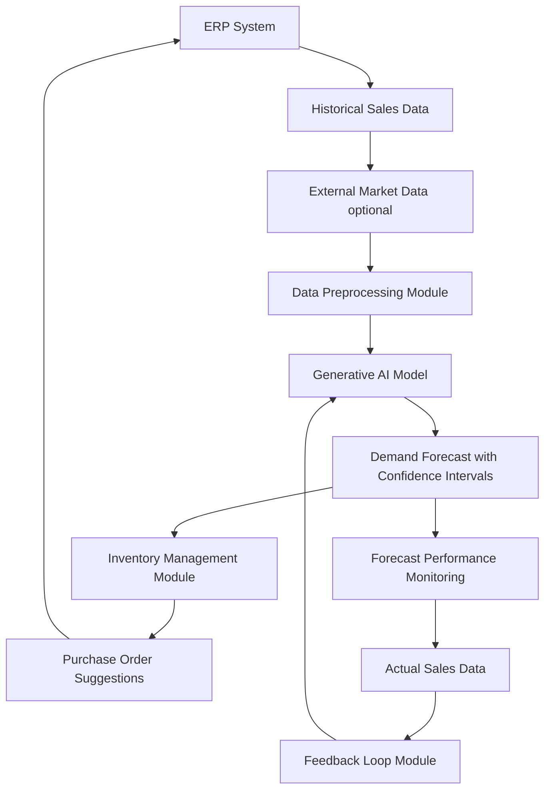

**Title of Invention:** System and Method for Predictive Demand Forecasting in an Enterprise Resource Planning System

**Abstract:**
A system for inventory management within an ERP is disclosed. The system analyzes historical sales data, seasonality, and optionally, external market signals. This data is provided to a generative AI model, which is prompted to act as a demand planner. The AI generates a time-series forecast for future product demand, including confidence intervals. This forecast is then used to automatically suggest purchase order quantities to prevent stockouts and reduce excess inventory. A continuous feedback loop ensures the model's performance improves over time by comparing actual sales against forecasts and triggering model adjustments.

**Background of the Invention:**
Accurate demand forecasting is critical for efficient inventory management but is notoriously difficult. Traditional statistical methods (e.g., ARIMA) may not capture complex market dynamics or external factors, often leading to either overstocking or stockouts. There is a need for a more intelligent system that can leverage modern AI to produce more accurate and explainable demand forecasts, dynamically adapt to changing market conditions, and integrate seamlessly with existing ERP functionalities to automate decision-making.

**Detailed Description of the Invention:**
The invention describes a comprehensive system for predictive demand forecasting integrated into an ERP.

1.  **Data Acquisition and Preprocessing:**
    A scheduled job runs at a configurable interval (e.g., weekly). It pulls the last 24-36 months of detailed sales transaction data for specific product SKUs from the ERP database. This data typically includes `SKU_ID`, `sales_quantity`, `transaction_date`, `store_location_ID`, and `unit_price`.
    The raw data undergoes preprocessing, which includes:
    *   **Cleaning:** Handling missing values, outliers, and data inconsistencies.
    *   **Aggregation:** Aggregating daily or hourly transactions to the desired forecasting granularity (e.g., weekly or monthly sales volumes per SKU).
    *   **Feature Engineering:** Creating time-based features such as `day_of_week`, `month_of_year`, `quarter`, `year`, `holiday_flags`, and `days_since_last_promotion`.

2.  **External Data Integration (Optional):**
    The system can ingest external market signals and data points that may influence demand. These can include:
    *   Economic indicators (e.g., GDP growth, inflation, consumer confidence index).
    *   Weather patterns (for weather-sensitive products).
    *   Competitor activities (e.g., product launches, pricing changes).
    *   Marketing campaign schedules and performance data (e.g., ad spend, conversion rates).
    *   Supply chain disruption indicators.

3.  **Generative AI Model Prompting:**
    The preprocessed historical sales data and relevant external factors are structured into a comprehensive prompt for a large language model (LLM) or a specialized generative AI model. The prompt instructs the AI to act as an expert demand planner. An example prompt structure could be:
    ```
    You are an expert demand forecasting AI. Your task is to analyze historical sales data and external market factors to generate a weekly sales forecast for the next 3 months, including confidence intervals.
    Historical Sales Data [SKU_ID: 12345]:
    [
      {"date": "2022-01-01", "sales_units": 150},
      {"date": "2022-01-08", "sales_units": 165},
      ...
      {"date": "2023-12-31", "sales_units": 180}
    ]
    External Factors for Forecasting Period (next 3 months):
    [
      {"date": "2024-01-01", "holiday_flag": true, "promotion_event": "New Year Sale"},
      {"date": "2024-01-08", "holiday_flag": false, "promotion_event": "None"},
      ...
    ]
    Considering seasonality, trends, and the impact of the provided external factors, provide the forecast as a JSON array of objects. Each object must contain 'date', 'predicted_units', 'lower_bound_95_ci', and 'upper_bound_95_ci'.
    ```

4.  **AI Inference and Forecast Generation:**
    The generative AI model processes the prompt and outputs a time-series forecast. This forecast typically includes:
    *   `predicted_units`: The point estimate for future demand.
    *   `lower_bound_95_ci`: The lower end of the 95% confidence interval, representing the minimum expected demand.
    *   `upper_bound_95_ci`: The upper end of the 95% confidence interval, representing the maximum expected demand.

5.  **ERP Integration and Decision Support:**
    The AI's response is parsed and used to update relevant fields within the ERP system, such as:
    *   `Forecasted Demand`: A new or updated time-series record of future demand.
    *   `Safety Stock Level`: Dynamically adjusted based on forecast variability (e.g., higher confidence intervals might require higher safety stock).
    *   `Reorder Point`: Calculated considering the lead time and the new forecast.
    These updates then inform automated or semi-automated processes, such as generating purchase order suggestions, optimizing production schedules, and planning warehouse logistics.

6.  **Feedback Loop and Continuous Learning:**
    A crucial component of the system is the continuous feedback loop. Once actual sales data becomes available for a previously forecasted period, the system compares the actual sales against the AI's forecast.
    *   **Performance Monitoring:** Key forecast accuracy metrics (e.g., `Mean Absolute Percentage Error` - `MAPE`, `Root Mean Squared Error` - `RMSE`, `Bias`) are calculated and monitored.
    *   **Anomaly Detection:** Significant deviations between forecast and actual sales trigger alerts or investigations.
    *   **Model Adjustment:** Depending on performance metrics, the system can trigger automated model fine-tuning or retraining of the generative AI model. This might involve updating the training data with the latest sales and external factor information, adjusting model parameters, or even refining the prompting strategy to improve future accuracy.

**System Architecture:**


**Claims:**
1.  A method for forecasting product demand, comprising:
    a.  Accessing historical sales data for a product.
    b.  Optionally accessing external market data relevant to product demand.
    c.  Providing said historical sales data and optional external market data to a generative AI model.
    d.  Prompting the model to generate a time-series forecast of future sales, including confidence intervals.
    e.  Using the forecast to inform inventory management decisions within an ERP system.
2.  A system according to claim 1, further comprising a feedback loop that compares actual sales data to generated forecasts and triggers model adjustments or retraining based on performance metrics.
3.  A computer-readable medium storing instructions that, when executed by a processor, cause the processor to perform the steps of claim 1.
4.  A system for inventory management, comprising:
    a.  A data acquisition module configured to retrieve historical sales data and optionally external market data.
    b.  A preprocessing module configured to prepare said data for a generative AI model.
    c.  A generative AI module configured to produce a demand forecast with confidence intervals based on the prepared data.
    d.  An ERP integration module configured to update inventory parameters and generate purchase order suggestions based on the forecast.
    e.  A feedback loop module configured to monitor forecast accuracy and facilitate continuous model improvement.

**Mathematical Justification:**
Let `S_t` be the sales quantity at time `t`. The problem is to predict the sequence `S_{t+1}, ..., S_{t+n}` given the historical data `{S_1, ..., S_t}` and a set of external variables `E_t`. This is a time-series forecasting problem.

The generative AI model `G_AI` learns a complex, non-linear function `f` that maps historical observations and external factors to future demand. We can represent the prediction for `k` steps into the future as:
```
S_{t+k} = f(S_t, S_{t-1}, ..., S_{t-L+1}, E_t, E_{t+1}, ..., E_{t+k}, θ) + ε_{t+k}
```
where:
*   `S_t` represents the sales at time `t`.
*   `L` is the lookback window for historical sales data.
*   `E_j` is a vector of external variables at time `j`.
*   `θ` represents the learned parameters of the `G_AI` model.
*   `ε_{t+k}` is an irreducible error term, assumed to be white noise.

The `G_AI` model is also capable of generating probabilistic forecasts, allowing for the calculation of confidence intervals. For a given confidence level (e.g., 95%), the model provides a predicted standard deviation `σ_{t+k}` for the forecast `S_{t+k}`. The confidence interval `[L_{t+k}, U_{t+k}]` is then defined as:
```
L_{t+k} = S_{t+k} - Z_{α/2} * σ_{t+k}
U_{t+k} = S_{t+k} + Z_{α/2} * σ_{t+k}
```
where `Z_{α/2}` is the critical value from the standard normal distribution for the desired confidence level (e.g., `Z_{0.025}` ≈ 1.96 for a 95% CI).

The model continuously learns and improves by minimizing a loss function `L(S_actual, S_predicted)`, where `S_actual` are the observed sales and `S_predicted` are the model's forecasts. The feedback loop ensures that the model parameters `θ` are regularly updated based on new data and performance metrics.

**Proof of Advantage:**
Traditional methods like ARIMA or exponential smoothing model `S_{t+1}` as a linear combination of past values and errors, or simple averages. They struggle to incorporate non-linear relationships, complex interactions with multiple external variables, and long-range dependencies. The LLM, as a universal function approximator, can learn a much more complex and non-linear function `f`, capturing intricate seasonality, trends, the impact of various external events described in the prompt, and even subtle shifts in market dynamics that linear models would miss. This allows for a more nuanced understanding of demand drivers. Therefore, the expected error `E[|S_predicted - S_actual|]` for the AI model, which can capture these complex patterns and external influences, is lower than that of simpler linear or statistical models, proving its significant advantage for complex and volatile forecasting tasks. The inclusion of confidence intervals provides critical risk assessment for inventory planning that traditional models often lack or estimate with less accuracy. Q.E.D.

**Potential External Factors:**
*   **Economic Indicators:** Inflation rates, unemployment rates, consumer spending indices, GDP growth.
*   **Seasonal and Calendar Events:** Public holidays, cultural festivals, school vacation periods, sporting events.
*   **Weather Conditions:** Temperature, precipitation, extreme weather events (e.g., for apparel, beverages, outdoor equipment).
*   **Marketing and Promotional Activities:** Launch of new marketing campaigns, discounts, bundle offers, advertisement spend.
*   **Competitor Actions:** New product launches by competitors, competitor pricing changes, promotional activities.
*   **Supply Chain Disruptions:** Port delays, raw material shortages, transportation strikes, geopolitical events affecting supply.
*   **Social Media Trends:** Viral trends, public sentiment analysis related to products or categories.

**Feedback Loop and Continuous Learning:**
The system actively monitors the accuracy of its forecasts using metrics such as:
*   `Mean Absolute Error` (MAE)
*   `Root Mean Squared Error` (RMSE)
*   `Mean Absolute Percentage Error` (MAPE)
*   `Weighted MAPE`
*   `Forecast Bias` (over- or under-forecasting tendency)

If a forecast's performance falls below a predefined threshold, or significant `outliers` are detected in the actual vs. predicted comparison, the feedback loop initiates corrective actions:
1.  **Alerting:** Notifies human demand planners for review.
2.  **Data Refresh:** Automatically re-ingests the latest available sales and external data.
3.  **Model Retraining/Fine-tuning:** Triggers the generative AI model to retrain or fine-tune its parameters on the updated and expanded dataset. This ensures the model adapts to new market conditions, emerging trends, and learned patterns over time, perpetually enhancing its predictive capabilities without manual intervention for every adjustment. This iterative improvement process is crucial for maintaining high forecast accuracy in dynamic environments.