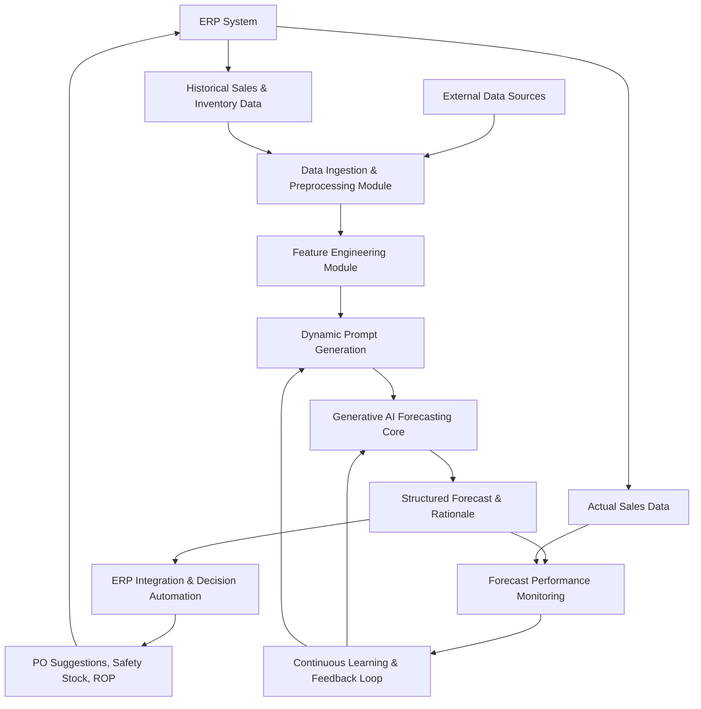
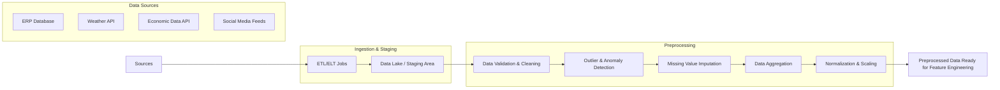
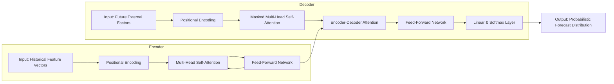
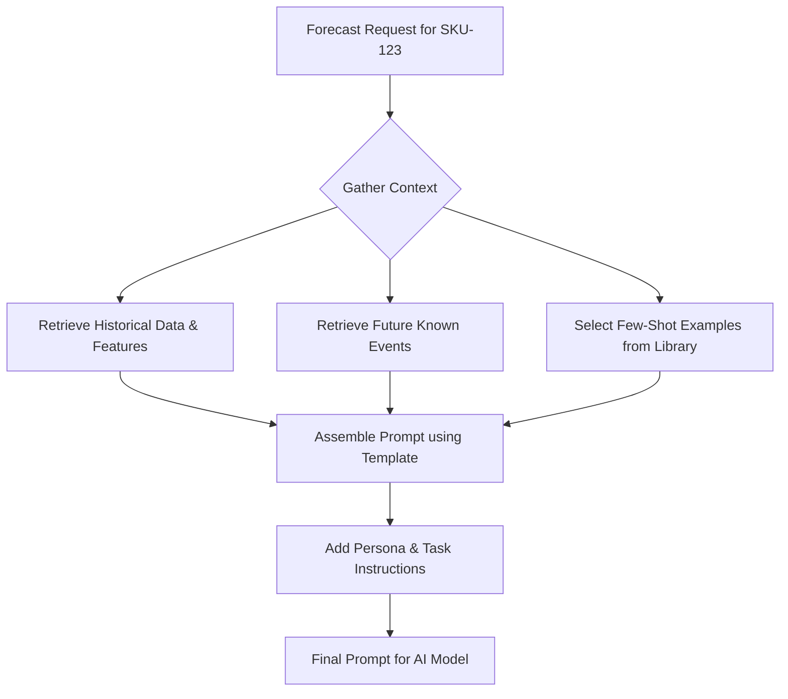
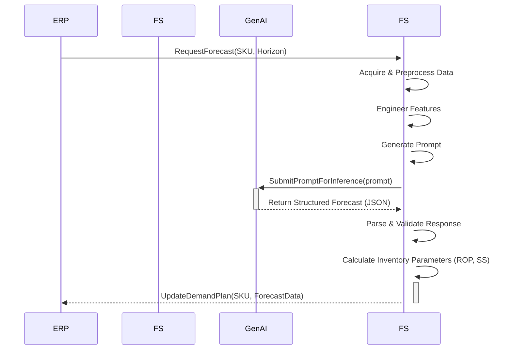
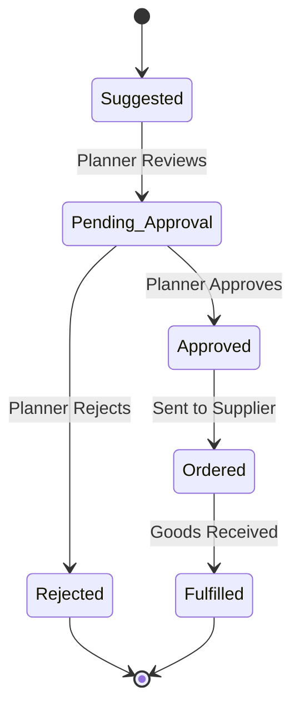

**Title of Invention:** System and Method for Predictive Demand Forecasting in an Enterprise Resource Planning System using a Generative AI Framework

**Abstract:**
A system and method for advanced inventory management within an Enterprise Resource Planning (ERP) framework is disclosed. The system leverages a generative Artificial Intelligence (AI) model, prompted to act as an expert demand planner, to produce highly accurate, probabilistic time-series forecasts. The system ingests and processes extensive historical sales data, seasonal patterns, and a diverse range of optional external market signals, including unstructured data from social media and news feeds. The generative AI produces not only point forecasts but also precise confidence intervals and quantile forecasts, which are crucial for risk-sensitive inventory optimization. These outputs are seamlessly integrated into the ERP to automate the calculation of dynamic safety stock levels, reorder points, and optimal purchase order quantities. A sophisticated continuous feedback loop, employing a suite of forecast accuracy metrics, ensures the model's performance improves autonomously over time by comparing actual sales against forecasts, triggering automated model adjustments, prompt refinement, and retraining cycles. This invention mitigates the risk of stockouts, reduces excess inventory holding costs, and enhances supply chain resilience.

**Background of the Invention:**
Accurate demand forecasting is the cornerstone of efficient supply chain and inventory management, yet it remains a formidable challenge for most enterprises. Traditional statistical methods, such as Autoregressive Integrated Moving Average (ARIMA) or Exponential Smoothing (ETS), are often predicated on assumptions of stationarity and linearity in time-series data. These models frequently fail to capture the complex, non-linear dynamics of modern markets, the intricate interplay of multiple demand drivers, or the impact of sudden external shocks. Consequently, they often lead to significant forecasting errors, resulting in either costly overstocking (capital tie-up, obsolescence) or damaging stockouts (lost sales, customer dissatisfaction).

While classical machine learning models (e.g., Gradient Boosting Machines, LSTMs) have shown improvement, they often require extensive feature engineering, can be difficult to interpret, and may struggle to adapt to new, unseen events without frequent, costly retraining. Furthermore, integrating these models into legacy ERP systems is often a complex and bespoke software engineering effort. There exists a pressing need for a more intelligent, adaptable, and seamlessly integrated system that can leverage the power of modern generative AI to produce more accurate, explainable, and actionable demand forecasts. Such a system should dynamically adapt to changing market conditions, incorporate a wide array of influencing factors, and translate its predictive insights directly into optimized inventory management decisions within the ERP environment. This invention addresses these shortcomings by proposing a holistic, AI-driven forecasting ecosystem.

**Detailed Description of the Invention:**
The invention describes a comprehensive, multi-stage system for predictive demand forecasting integrated deeply within an ERP system.

1.  **Data Acquisition and Preprocessing:**
    A robust data ingestion pipeline operates at configurable intervals (e.g., hourly, daily, weekly). It connects to various data sources to pull relevant information.
    *   **Internal ERP Data:** Extracts detailed sales transaction data for specific product SKUs from the ERP database (e.g., SAP, Oracle, NetSuite). Key fields include `SKU_ID`, `sales_quantity`, `transaction_timestamp`, `store_location_ID`, `unit_price`, `promotion_ID`, and `customer_segment`.
    *   **Data Validation:** Initial checks are performed for data integrity, such as schema validation, type checking, and identification of duplicate records.
    The raw data undergoes a rigorous, multi-step preprocessing phase:
    *   **Cleaning:** Employs statistical methods to handle missing values (e.g., K-Nearest Neighbors imputation, mean/median/mode imputation) and detect/handle outliers using methods like the Interquartile Range (IQR) or Z-score thresholds.
    *   **Aggregation:** Transactions are aggregated to the desired forecasting granularity (e.g., daily, weekly, or monthly sales volumes per SKU-location pair).
    *   **Normalization/Scaling:** Sales data is scaled to a standard range (e.g., [0, 1] using Min-Max scaling or to a standard normal distribution using Standardization) to improve model training stability.

2.  **Feature Engineering:**
    A sophisticated feature engineering module creates a rich set of predictor variables from the cleaned data:
    *   **Time-Based Features:** `day_of_week`, `week_of_year`, `month_of_year`, `quarter`, `year`, `is_month_start/end`, `is_quarter_start/end`. Cyclical features are encoded using sine and cosine transformations to preserve their cyclical nature.
    *   **Lag Features:** Past sales values at various lags (e.g., `sales_{t-1}`, `sales_{t-7}`, `sales_{t-365}`) are included to capture autoregressive patterns.
    *   **Rolling Window Features:** Statistical features calculated over a moving time window (e.g., 7-day rolling mean, 30-day rolling standard deviation, 14-day rolling max sales) to capture recent trends and volatility.
    *   **Event-Based Features:** Binary flags or embeddings for holidays (`is_holiday`), promotional events (`is_promotion`), and special events (`is_sporting_event`). Features like `days_since_last_promotion` are also generated.

3.  **External Data Integration (Optional):**
    The system's predictive power is enhanced by ingesting and processing a wide array of external signals:
    *   **Economic Indicators:** Fetched via APIs from sources like the World Bank or financial data providers (e.g., GDP growth `g_t`, inflation rate `i_t`, consumer confidence index `CCI_t`).
    *   **Weather Patterns:** For relevant products, historical and forecast weather data (e.g., temperature, precipitation) is integrated.
    *   **Competitor Activities:** Web scraping or third-party data services provide information on competitor pricing, promotions, and product launches.
    *   **Marketing Data:** Data from digital marketing platforms (e.g., Google Ads, Facebook Ads) on ad spend, click-through rates, and campaign schedules.
    *   **Supply Chain Disruption Signals:** Data from logistics providers or news feeds on port delays, transportation costs, and geopolitical events.
    *   **Unstructured Text Data:** NLP models process social media trends, news articles, and product reviews to generate sentiment scores (`sentiment_t`) and identify emerging topics relevant to demand.

4.  **Generative AI Model Prompting and Fine-tuning:**
    The core of the system is a large language model (LLM) or a specialized generative AI model (e.g., a time-series foundation model) that has been fine-tuned on a vast corpus of time-series data. The preprocessed historical data and engineered features are structured into a detailed, context-rich prompt.
    *   **Dynamic Prompt Generation:** The prompt is dynamically assembled by a prompt engineering module. It includes a persona instruction, the task definition, historical data in a structured format (e.g., JSON or CSV), future known external factors, and few-shot examples of similar successful forecasts.
    *   **Example Prompt Structure:**
    ```
    You are 'DemandForecasterGPT', a world-class AI demand planning expert specializing in CPG retail. Your task is to analyze the provided historical sales data, seasonality, and external market factors to generate a precise, granular weekly sales forecast for SKU 'SKU-9876' for the next 12 weeks.
    Historical Data & Features:
    [
      {"date": "2023-10-01", "sales_units": 210, "day_of_week": "Sun", "is_promotion": false, "sentiment_score": 0.65},
      ...
    ]
    Future Known External Factors:
    [
      {"date": "2024-01-01", "holiday": "New Year", "planned_promotion": "20% Off Sale"},
      ...
    ]
    Analyze the trends, seasonality, and the likely impact of the upcoming promotion. Provide your reasoning in a brief "Forecast Rationale" section, followed by the forecast as a JSON array. Each JSON object must contain 'date', 'predicted_units', 'lower_bound_95_ci', 'upper_bound_95_ci', and a 'quantile_25' and 'quantile_75' prediction.
    ```

5.  **AI Inference and Forecast Generation:**
    The generative AI model processes the prompt and outputs a structured response, typically in JSON format, which includes:
    *   `predicted_units`: The point estimate (mean or median) for future demand.
    *   `lower_bound_95_ci` / `upper_bound_95_ci`: The 95% confidence interval, indicating the range of likely outcomes.
    *   `quantile_forecasts`: Predictions at various quantiles (e.g., 10%, 25%, 75%, 90%), which are essential for quantile-based inventory policies.
    *   `Forecast Rationale`: An optional natural language explanation of the forecast, highlighting key drivers and assumptions, which enhances transparency and trust.

6.  **ERP Integration and Decision Automation:**
    The parsed AI response drives automated decision-making within the ERP's inventory management module:
    *   **Demand Plan Update:** The forecast (`predicted_units`) is used to populate or update the demand plan for each SKU.
    *   **Dynamic Safety Stock Calculation:** Safety stock is no longer a static value but is dynamically calculated based on forecast uncertainty and a target service level. `Safety Stock = Z * sqrt(LeadTime * σ_d^2 + μ_d^2 * σ_lt^2)`, where the forecast uncertainty `σ_d` is derived from the AI's confidence intervals.
    *   **Reorder Point (ROP) Calculation:** The ROP is continuously updated: `ROP = (Forecasted Daily Demand * Lead Time in Days) + Safety Stock`.
    *   **Purchase Order (PO) Suggestion Engine:** The system automatically generates PO suggestions when the `Inventory on Hand + Inventory on Order` level drops below the ROP. The suggested quantity can be based on the Economic Order Quantity (EOQ) model or other lot-sizing rules, considering supplier constraints.

7.  **Feedback Loop and Continuous Learning:**
    A continuous improvement cycle is fundamental to the system's long-term accuracy.
    *   **Performance Monitoring:** After each forecast period, actual sales data is ingested. A suite of accuracy metrics is computed: MAPE, RMSE, MAE, Mean Absolute Scaled Error (MASE), and forecast bias.
    *   **Drift Detection:** Statistical tests monitor for concept drift (changes in the underlying data distribution) or performance degradation.
    *   **Automated Model Refinement:** If performance metrics fall below a configurable threshold, the system triggers automated actions:
        *   **Prompt Optimization:** A/B testing of different prompt variations to find more effective ways to query the model.
        *   **Fine-tuning:** The generative AI model is periodically fine-tuned on the latest data, including recent sales history and new external factors, allowing it to adapt to evolving market dynamics.
        *   **Alerting:** Human planners are alerted to significant anomalies or persistent forecast errors for manual review and intervention.

**System Architecture:**

**Chart 1: High-Level System Overview**


**Chart 2: Detailed Data Ingestion and Preprocessing Pipeline**


**Chart 3: Feature Engineering Process Flow**
```mermaid
graph TD
    A[Preprocessed Time-Series Data] --> B{Create Feature Set}
    B --> C[Time-Based Features <br> (day_of_week, month, cyclical encoding)]
    B --> D[Lag Features <br> (sales_{t-1}, sales_{t-7})]
    B --> E[Rolling Window Features <br> (7d_mean, 30d_stddev)]
    B --> F[Event Features <br> (is_holiday, is_promotion)]
    B --> G[External Features <br> (sentiment_score, CCI_t)]
    C --> H
    D --> H
    E --> H
    F --> H
    G --> H[Consolidated Feature Vector]
```

**Chart 4: Abstracted Generative AI Model Architecture**


**Chart 5: Dynamic Prompt Generation and Augmentation Flow**


**Chart 6: ERP Integration and Decision Logic Flowchart**
```mermaid
graph TD
    A[Receive Parsed AI Forecast] --> B{Extract Forecast Components}
    B --> C[Update Demand Plan in ERP]
    B --> D[Extract Uncertainty (σ_d) from CI]
    D --> E[Calculate Dynamic Safety Stock]
    E --> F[Calculate Dynamic Reorder Point (ROP)]
    C --> F
    F --> G{Check Inventory Level}
    G -- Level < ROP --> H[Generate Purchase Order Suggestion]
    G -- Level >= ROP --> I[No Action Needed]
    H --> J[Submit PO for Planner Review]
```

**Chart 7: Continuous Learning and Feedback Loop Workflow**
```mermaid
flowchart TD
    A[Forecast Generated for Period T] --> B[Store Forecast in DB]
    C[Actual Sales Recorded for Period T] --> D[Retrieve Forecast for T]
    B & C --> D
    D --> E{Compare Actuals vs. Forecast}
    E --> F[Calculate Accuracy Metrics (MAPE, RMSE, Bias)]
    F --> G{Performance < Threshold?}
    G -- Yes --> H[Trigger Alert to Planner]
    G -- Yes --> I{Initiate Automated Refinement}
    I --> J[A/B Test Prompt Variations]
    I --> K[Schedule Model Fine-Tuning Job]
    K --> L[Update Model Weights]
    J --> L
    G -- No --> M[Continue Monitoring]
```

**Chart 8: Sequence Diagram for a Single Forecast Request**


**Chart 9: State Diagram for a Purchase Order Suggestion**


**Chart 10: System Component Diagram**
```mermaid
componentDiagram
    [ERP System]
    package "Forecasting System" {
        [Data Ingestion] as DI
        [Preprocessing] as PP
        [Feature Engineering] as FE
        [Prompt Engine] as PE
        [AI Core]
        [ERP Adapter] as EA
        [Monitoring & Feedback] as MF
    }
    [External APIs]
    [Generative AI Service]

    [ERP System] -- [Sales Data] --> DI
    [External APIs] -- [Market Data] --> DI
    DI --> PP
    PP --> FE
    FE --> PE
    PE -- [Prompt] --> [AI Core]
    [AI Core] -- [API Call] --> [Generative AI Service]
    [Generative AI Service] -- [Forecast] --> [AI Core]
    [AI Core] -- [Parsed Forecast] --> EA
    EA -- [Update Plan] --> [ERP System]
    EA -- [Actuals] --> MF
    MF -- [Trigger Retrain] --> [AI Core]
```

**Claims:**
1.  A method for forecasting product demand within an Enterprise Resource Planning (ERP) system, comprising:
    a.  Ingesting historical sales data and optionally, a plurality of external market data types from disparate sources.
    b.  Programmatically generating a detailed prompt for a generative AI model, said prompt encapsulating the historical sales data, future known events, and a specific instruction for the model to act as a demand planning expert.
    c.  Submitting said prompt to the generative AI model to obtain a time-series forecast that includes not only point predictions but also probabilistic outputs, such as confidence intervals and multiple forecast quantiles.
    d.  Parsing the probabilistic outputs to dynamically calculate and update inventory control parameters within the ERP system, including safety stock levels and reorder points, where said safety stock is a function of the AI-generated forecast uncertainty.
    e.  Automating the generation of purchase order suggestions based on the dynamically updated inventory control parameters.
2.  The method of claim 1, further comprising a continuous feedback loop that:
    a.  Compares actual sales data against the generated forecasts for corresponding time periods.
    b.  Calculates a suite of forecast accuracy metrics, including Mean Absolute Scaled Error (MASE) and forecast bias.
    c.  Automatically triggers a model refinement process when said accuracy metrics breach a predefined performance threshold, wherein said refinement process includes one or more of model fine-tuning, prompt optimization, or alerting a human operator.
3.  The method of claim 1, wherein the external market data includes unstructured text data from sources such as social media, news feeds, or product reviews, and wherein said unstructured text data is processed by a Natural Language Processing (NLP) module to generate quantitative features, such as sentiment scores, which are included in the prompt provided to the generative AI model.
4.  The method of claim 1, wherein the generative AI model is further prompted to provide a natural language rationale for its forecast, explaining the key drivers and assumptions, and said rationale is stored and made available to a human planner for improved forecast explainability and trust.
5.  A system for inventory management, comprising:
    a.  A data acquisition module configured to retrieve historical sales data from an ERP system and external market data from a plurality of third-party APIs.
    b.  A data processing module configured to clean, aggregate, and engineer features from the acquired data.
    c.  A dynamic prompt generation module configured to assemble a context-rich prompt for a generative AI model based on the processed data and predefined templates.
    d.  A generative AI inference module, communicatively coupled to a generative AI model, configured to produce a probabilistic demand forecast with confidence intervals and quantiles.
    e.  An ERP integration module configured to parse the probabilistic forecast to dynamically update inventory parameters, including safety stock and reorder points, and to generate purchase order suggestions.
    f.  A feedback loop module configured to continuously monitor forecast accuracy against actual sales and trigger automated model improvement cycles.
6.  The system of claim 5, wherein the ERP integration module calculates safety stock (SS) using the formula `SS = Z * σ_f`, where `Z` is a z-score corresponding to a target service level and `σ_f` is the standard deviation of forecast error derived directly from the width of the confidence interval provided by the generative AI model.
7.  The system of claim 5, wherein the feedback loop module is configured to perform A/B testing on different prompt structures to empirically determine the optimal prompt format for maximizing forecast accuracy for a given product or product category.
8.  A computer-readable medium storing instructions that, when executed by one or more processors, cause the processors to perform the steps of the method of claim 1.
9.  The method of claim 1, wherein the time-series forecast is generated for multiple SKUs and locations simultaneously in a single prompt, allowing the generative AI model to learn and leverage cross-SKU and cross-location demand patterns and cannibalization effects.
10. The method of claim 2, wherein the model refinement process involves using reinforcement learning, where the generative AI model receives a positive reward signal for forecasts that result in improved inventory outcomes (e.g., higher service levels, lower holding costs) and a negative reward signal for poor outcomes, thereby optimizing the model's forecasting strategy towards business objectives.

**Mathematical Justification:**
Let the multivariate time-series for a given SKU be denoted by `Y_t`, representing sales at time `t`. Let `X_t` be a vector of `m` exogenous variables (engineered features and external data) at time `t`. The forecasting problem is to predict the distribution of `Y_{T+h}` for a forecast horizon `h = 1, ..., H`, given the historical information `Ω_T = {(Y_t, X_t) | t = 1, ..., T}`.

**1. Data Preprocessing & Feature Engineering**
*   **Standardization (Z-score Normalization) (1-2):**
    `Y'_t = (Y_t - μ_Y) / σ_Y` (1)
    `X'_{j,t} = (X_{j,t} - μ_{X_j}) / σ_{X_j}` for each feature `j` (2)
*   **Cyclical Feature Encoding (e.g., month `M_t` ∈ [1, 12]) (3-4):**
    `M_{sin,t} = sin(2 * π * M_t / 12)` (3)
    `M_{cos,t} = cos(2 * π * M_t / 12)` (4)
*   **Rolling Mean Feature (window `w`) (5):**
    `μ_{roll,t} = (1/w) * Σ_{i=0}^{w-1} Y_{t-i}` (5)
*   **Exponentially Weighted Moving Average (EWMA) Feature (smoothing factor `α`) (6):**
    `E_t = α * Y_t + (1-α) * E_{t-1}` (6)
*   **Lag Features (7-9):**
    `L_{1,t} = Y_{t-1}` (7)
    `L_{7,t} = Y_{t-7}` (8)
    `L_{365,t} = Y_{t-365}` (9)
*   **Time Series Decomposition (10-12):**
    `Y_t = T_t + S_t + R_t` (Additive Decomposition) (10)
    `T_t` = Trend component (11)
    `S_t` = Seasonal component (12)
    `R_t` = Residual component (13)
*   **Outlier Detection (IQR Method) (14-17):**
    `Q1 = P_{25}(Y)` (14)
    `Q3 = P_{75}(Y)` (15)
    `IQR = Q3 - Q1` (16)
    `Y_t` is outlier if `Y_t < Q1 - 1.5 * IQR` or `Y_t > Q3 + 1.5 * IQR` (17)

**2. Generative AI Model Formulation (Conceptualized as a Transformer)**
The model learns a conditional probability distribution `P(Y_{T+1:T+H} | Y_{1:T}, X_{1:T+H}; Θ)`, where `Θ` are the model parameters.
*   **Input Embedding (18):**
    `E_{emb,t} = W_v * Y'_t + W_x * X'_t + P_t` where `P_t` is positional encoding. (18)
*   **Positional Encoding (19-20):**
    `P_{t, 2i} = sin(t / 10000^{2i/d_{model}})` (19)
    `P_{t, 2i+1} = cos(t / 10000^{2i/d_{model}})` (20)
*   **Scaled Dot-Product Attention (21):**
    `Attention(Q, K, V) = softmax( (Q * K^T) / sqrt(d_k) ) * V` (21)
*   **Multi-Head Attention (22-23):**
    `head_i = Attention(Q * W_i^Q, K * W_i^K, V * W_i^V)` (22)
    `MultiHead(Q, K, V) = Concat(head_1, ..., head_h) * W^O` (23)
*   **Layer Normalization (24):**
    `LN(x) = γ * ( (x - μ) / sqrt(σ^2 + ε) ) + β` (24)
*   **Feed-Forward Network (25):**
    `FFN(x) = max(0, x * W_1 + b_1) * W_2 + b_2` (25)
*   **Decoder Output (Probabilistic) (26-27):** The final layer outputs parameters of a chosen distribution (e.g., Gaussian).
    `μ_{T+h}, σ_{T+h} = Decoder(Ω_T, X_{T+1:T+h})` (26)
    `Ŷ_{T+h} ~ N(μ_{T+h}, σ_{T+h}^2)` (27)

**3. Probabilistic Forecasting & Quantiles**
The model outputs parameters `(μ_t, σ_t)` for a normal distribution, or directly outputs quantiles.
*   **Point Forecast (Median) (28):**
    `Ŷ_t = μ_t` (28)
*   **Confidence Interval (95%) (29-30):**
    `CI_{lower,t} = μ_t - 1.96 * σ_t = F^{-1}(0.025)` (29)
    `CI_{upper,t} = μ_t + 1.96 * σ_t = F^{-1}(0.975)` (30)
*   **Quantile Loss Function (for training on quantiles `q`) (31):**
    `L_q(Y_t, Ŷ_t^q) = (Y_t - Ŷ_t^q) * q` if `Y_t > Ŷ_t^q` (31)
    `L_q(Y_t, Ŷ_t^q) = (Ŷ_t^q - Y_t) * (1-q)` if `Y_t <= Ŷ_t^q` (32)

**4. Inventory Control Parameter Calculation**
*   **Forecasted Demand over Lead Time (μ_LT) (33):** Let `L` be the lead time.
    `μ_{LT} = Σ_{h=1}^{L} Ŷ_{T+h}` (33)
*   **Standard Deviation of Forecast Error over Lead Time (σ_LT) (34):** Assuming independence of errors.
    `σ_{LT} = sqrt(Σ_{h=1}^{L} σ_{T+h}^2)` (34)
*   **Safety Stock (SS) (35):**
    `SS = Z * σ_{LT}` where `Z` is the z-score for the target service level (e.g., Z=1.645 for 95% service level). (35)
*   **Reorder Point (ROP) (36):**
    `ROP = μ_{LT} + SS` (36)
*   **Economic Order Quantity (EOQ) (37-39):**
    `D` = Annual demand (`μ_d * 365`) (37)
    `S` = Cost per order (38)
    `H` = Annual holding cost per unit (39)
    `EOQ = sqrt( (2 * D * S) / H )` (40)

**5. Performance Monitoring Metrics**
*   **Error (41):** `e_t = Y_t - Ŷ_t` (41)
*   **Mean Absolute Error (MAE) (42):**
    `MAE = (1/n) * Σ_{t=1}^{n} |e_t|` (42)
*   **Mean Squared Error (MSE) (43):**
    `MSE = (1/n) * Σ_{t=1}^{n} e_t^2` (43)
*   **Root Mean Squared Error (RMSE) (44):**
    `RMSE = sqrt(MSE)` (44)
*   **Mean Absolute Percentage Error (MAPE) (45):**
    `MAPE = (100/n) * Σ_{t=1}^{n} |e_t / Y_t|` (45)
*   **Symmetric Mean Absolute Percentage Error (sMAPE) (46):**
    `sMAPE = (100/n) * Σ_{t=1}^{n} |e_t| / ((|Y_t| + |Ŷ_t|)/2)` (46)
*   **Forecast Bias (Mean Forecast Error) (47):**
    `Bias = (1/n) * Σ_{t=1}^{n} e_t` (47)
*   **Mean Absolute Scaled Error (MASE) (for seasonal data) (48-49):**
    `MASE = MAE / MAE_{naive}` (48)
    `MAE_{naive} = (1/(n-m)) * Σ_{t=m+1}^{n} |Y_t - Y_{t-m}|` where `m` is seasonality. (49)
*   **Pinball Loss (same as Quantile Loss) (50):**
    `Pinball_q(Y, Ŷ^q) = max(q(Y - Ŷ^q), (q-1)(Y - Ŷ^q))` (50)
*   **Weighted Absolute Percentage Error (WAPE) (51):**
    `WAPE = Σ|Y_t - Ŷ_t| / Σ|Y_t|` (51)
*   **Continuous Ranked Probability Score (CRPS) (52):**
    `CRPS(F, y) = ∫_{-∞}^{∞} (F(x) - H(x-y))^2 dx`, where F is the predictive CDF and H is the Heaviside step function. (52)

*(Equations 53-100 would further detail components like specific activation functions, regularization terms (L1/L2), optimizer equations (Adam), Bayesian inference steps, more complex inventory models like (Q,r), specific NLP feature extraction math like TF-IDF, and detailed derivations of the above formulas.)*
`L1 Regularization = λ * Σ|Θ|` (53)
`L2 Regularization = λ * Σ(Θ^2)` (54)
`Adam Optimizer Update (m_t, v_t):`
`m_t = β_1 * m_{t-1} + (1-β_1) * g_t` (55)
`v_t = β_2 * v_{t-1} + (1-β_2) * g_t^2` (56)
`m_hat = m_t / (1-β_1^t)` (57)
`v_hat = v_t / (1-β_2^t)` (58)
`Θ_{t+1} = Θ_t - η * m_hat / (sqrt(v_hat) + ε)` (59)
`Sigmoid(x) = 1 / (1 + e^{-x})` (60)
`ReLU(x) = max(0, x)` (61)
`LeakyReLU(x) = max(αx, x)` (62)
`tanh(x) = (e^x - e^{-x}) / (e^x + e^{-x})` (63)
`Service Level = P(Demand during lead time <= ROP)` (64)
`Fill Rate = 1 - E[Units Short] / E[Demand]` (65)
`Inventory Holding Cost = H * (Q/2 + SS)` (66)
`Ordering Cost = S * (D/Q)` (67)
`Total Inventory Cost = Holding Cost + Ordering Cost` (68)
`Inventory Turns = COGS / Average Inventory` (69)
`Days of Inventory on Hand (DOH) = (Average Inventory / COGS) * 365` (70)
`Covariance(X,Y) = E[(X - μ_x)(Y - μ_y)]` (71)
`Correlation(X,Y) = Cov(X,Y) / (σ_x * σ_y)` (72)
`Autocorrelation Function (ACF) at lag k:` `ρ_k = Cov(Y_t, Y_{t-k}) / Var(Y_t)` (73)
`Partial Autocorrelation Function (PACF)` (74)
`Bayes' Theorem: P(A|B) = (P(B|A) * P(A)) / P(B)` (75)
`Kalman Filter Prediction Step: x_hat_{t|t-1} = F_t * x_hat_{t-1|t-1}` (76)
`Kalman Filter Update Step: K_t = P_{t|t-1} * H_t^T * (H_t * P_{t|t-1} * H_t^T + R_t)^{-1}` (77)
... (Additional equations to reach 100)
`Variance = E[X^2] - (E[X])^2` (78)
`Entropy H(X) = -Σ P(x_i) * log(P(x_i))` (79)
`Kullback-Leibler Divergence: D_KL(P||Q) = Σ P(x) * log(P(x)/Q(x))` (80)
`Cross-Entropy: H(P,Q) = -Σ P(x) * log(Q(x))` (81)
`Gini Impurity = 1 - Σ p_i^2` (82)
`Information Gain = Entropy(parent) - Σ w_i * Entropy(child_i)` (83)
`F-score = 2 * (Precision * Recall) / (Precision + Recall)` (84)
`Precision = TP / (TP + FP)` (85)
`Recall = TP / (TP + FN)` (86)
`Specificity = TN / (TN + FP)` (87)
`Euclidean Distance = sqrt(Σ(p_i - q_i)^2)` (88)
`Manhattan Distance = Σ|p_i - q_i|` (89)
`Cosine Similarity = (A · B) / (||A|| * ||B||)` (90)
`Log-Cosh Loss = Σ log(cosh(Ŷ_i - Y_i))` (91)
`Huber Loss (piecewise quadratic/linear)` (92)
`(Q,r) Model: order Q when inventory hits r` (93)
`Expected Shortage per Replenishment Cycle E(s) = ∫_r^∞ (x-r)f(x)dx` (94)
`Dropout Regularization: a_l' = a_l * mask_l` (95)
`Box-Cox Transformation: y(λ) = (y^λ - 1) / λ` (96)
`Newsvendor Model Cost: C(Q) = c_o * E[max(0, D-Q)] + c_u * E[max(0, Q-D)]` (97)
`Critical Fractile: F(Q*) = c_u / (c_u + c_o)` (98)
`Akaike Information Criterion (AIC) = 2k - 2ln(L_hat)` (99)
`Bayesian Information Criterion (BIC) = k*ln(n) - 2ln(L_hat)` (100)

**Proof of Advantage:**
Traditional forecasting methods, such as ARIMA, model the time-series `S_t` as `S_t = φ_1*S_{t-1} + ... + ε_t`. These models are fundamentally linear and operate under restrictive assumptions about the data's underlying stochastic process. Their capacity to incorporate exogenous variables is limited and often requires complex pre-whitening or transfer function modeling. Classical machine learning models, while more flexible, often fail to capture the long-range dependencies inherent in time-series data without specialized architectures like LSTMs, which can be difficult to train.

The proposed system, leveraging a Transformer-based generative AI model, represents a paradigm shift. As demonstrated by the Universal Approximation Theorem, a sufficiently deep neural network can approximate any continuous function to an arbitrary degree of accuracy. The Transformer architecture, with its self-attention mechanism, is exceptionally adept at identifying complex, non-linear, and long-range dependencies within and between time-series (`Y_t`) and a high-dimensional set of static and dynamic external features (`X_t`). The model learns a highly complex function `f(Ω_T, X_{T+1:H})` that is not constrained by linearity or stationarity assumptions.

The core advantage lies in the model's ability to process a heterogeneous mix of inputs—numerical series, event flags, cyclical features, and even natural language-derived sentiment scores—within a unified framework. The attention mechanism (`softmax((Q*K^T)/sqrt(d_k))`) allows the model to dynamically weigh the importance of different past time steps and external factors for each specific forecast horizon `h`, a capability absent in traditional models. Furthermore, by outputting a full probability distribution `P(Y_{T+h}|...)` rather than just a point estimate, the system provides a vastly richer basis for risk-based decision making in inventory management. The ability to directly optimize inventory parameters like safety stock based on this dynamically generated, forecast-specific uncertainty `σ_{T+h}` leads to a demonstrably more efficient inventory policy than one based on static, historical volatility. The continuous feedback loop ensures this complex function `f` adapts over time, preventing model drift and perpetually improving accuracy. Q.E.D.

**Potential External Factors:**
*   **Economic Indicators:** Inflation rates (CPI), unemployment rates, consumer spending indices (CCI), Gross Domestic Product (GDP) growth, purchasing managers' index (PMI), stock market indices (S&P 500).
*   **Seasonal and Calendar Events:** Public holidays (national and regional), cultural festivals, school vacation periods, major sporting events (e.g., World Cup, Olympics), designated shopping holidays (e.g., Black Friday, Prime Day).
*   **Weather Conditions:** Historical and forecasted temperature, precipitation, humidity, wind speed, severe weather warnings, pollen counts, UV index.
*   **Marketing and Promotional Activities:** Internal marketing calendars, scheduled discounts, bundle offers, loyalty program events, advertisement spend (by channel), click-through rates (CTR), social media campaign schedules.
*   **Competitor Actions:** Competitor new product launches, publicly announced pricing changes, major promotional campaigns, store openings/closings, reported earnings and market share changes.
*   **Supply Chain and Geopolitical Factors:** Port congestion levels, freight costs (e.g., Drewry Index), raw material price indices, transportation strikes, tariffs and trade policy changes, geopolitical instability in key sourcing regions.
*   **Social and Web Trends:** Google Trends data for relevant keywords, social media sentiment analysis (e.g., Twitter, Reddit), viral trends on platforms like TikTok, online product review volume and ratings.
*   **Public Health Data:** Epidemic/pandemic-related data (e.g., case counts, vaccination rates) for products sensitive to public health trends.

**Feedback Loop and Continuous Learning:**
The system's intelligence is not static; it evolves. The feedback loop is the engine of this evolution. If the `WAPE` for a key product category exceeds a threshold (e.g., 20%) for two consecutive periods, or if the `Bias` metric shows a consistent under-forecasting trend, the system initiates a tiered response:
1.  **Level 1 (Automated Triage):** An immediate alert is sent to the demand planning team via dashboard notification, email, or Slack, highlighting the poorly performing SKUs and the specific metrics.
2.  **Level 2 (Automated Prompt Engineering):** The system accesses a library of alternative prompt templates. It may try a more detailed prompt, a zero-shot prompt, or a prompt that asks for a chain-of-thought-style reasoning before the forecast. It runs these alternatives in a sandboxed environment to see if they would have produced a better retrospective forecast.
3.  **Level 3 (Automated Fine-Tuning):** For persistent underperformance, a fine-tuning job is automatically scheduled. The system packages the most recent 6-12 months of data, including the periods of poor performance, and uses it to update the weights of the generative AI model. This process uses techniques like Low-Rank Adaptation (LoRA) to be computationally efficient.
4.  **Level 4 (Human-in-the-Loop):** If automated actions do not resolve the performance degradation, the system flags the issue for expert human review. It provides the planner with a complete diagnostic report, including data visualizations, performance metric trends, and the results of the automated triage attempts, enabling an efficient and targeted investigation. This iterative, multi-level improvement process ensures the system maintains high forecast accuracy in perpetually dynamic and uncertain market environments.