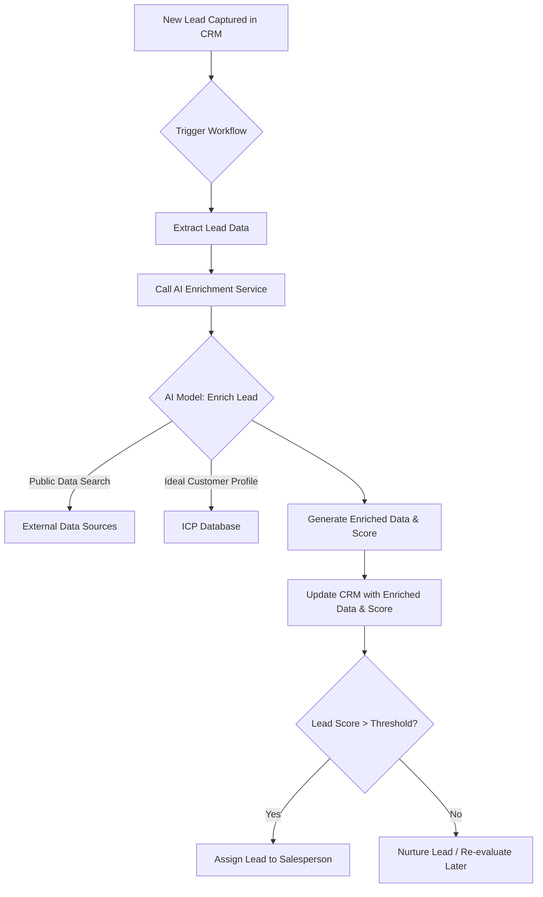

**Title of Invention:** System and Method for AI-Driven Lead Scoring and Data Enrichment

**Abstract:**
A system for qualifying leads in a Customer Relationship Management [CRM] system is disclosed. When a new lead is created, the system sends the available information [e.g. name, company, email] to a generative AI model. The AI is prompted to perform two actions: first, to search for public information about the lead and their company to enrich the profile; second, to analyze all available information against an ideal customer profile and provide a "lead score" and a plain-English rationale for that score.

**Background of the Invention:**
Sales teams spend a significant amount of time researching new leads and prioritizing their outreach. This manual process is slow and inconsistent. There is a need for an automated system that can both enrich lead data and provide an intelligent score to help salespeople focus their efforts on the most promising opportunities.

**Detailed Description of the Invention:**
A new lead is captured. A backend workflow is triggered. It prompts an LLM: `You are a sales development AI. Here is a new lead: [lead data]. 1. Find additional public information like company size, industry, and recent news. 2. Based on all information, provide a lead score from 1-100 and a 2-bullet point summary explaining your reasoning.` The structured response from the AI is used to update the lead's record in the CRM, and high-scoring leads are automatically assigned to a salesperson.

### System Architecture Overview



### AI Model Interactions and Prompt Engineering

The system leverages a large language model [LLM] configured with specific prompts to perform its tasks. The Ideal Customer Profile [ICP] is a critical input to the scoring process.

#### Ideal Customer Profile [ICP] Definition
The ICP is a structured data representation [e.g. JSON] that defines the characteristics of the most valuable customers. It includes:
*   `Firmographics`: Company size, industry, revenue range, geographic location.
*   `Technographics`: Specific technologies used [e.g. CRM, cloud provider, marketing automation].
*   `Demographics`: Job titles, seniority levels, departments of target individuals.
*   `Behavioral Patterns`: Indicators of engagement or need.

The `ICP` can be dynamically updated based on historical conversion data and business strategy.

#### Example Prompt Structures

1.  **Enrichment Prompt:**
    ```
    You are a data enrichment expert. Given the following initial lead data, search public information to find and return the company's industry, company size (employee count), primary location, recent news headlines, key technologies used, and LinkedIn profile URL for both the lead and their company. Return the results in a JSON format.

    Initial Lead Data:
    {
      "name": "John Doe",
      "email": "john.doe@example.com",
      "company": "ExampleCorp"
    }
    ```

2.  **Scoring Prompt:**
    ```
    You are a lead qualification AI. Given the following enriched lead data and the Ideal Customer Profile, provide a lead score from 1-100 and a 2-bullet point summary explaining your reasoning. Focus on alignment with the ICP and potential for conversion. Return the results in a JSON format.

    Enriched Lead Data:
    {
      "name": "John Doe",
      "company": "ExampleCorp",
      "industry": "Software Development",
      "employee_count": "500-1000",
      "technologies": ["CRM_system_X", "cloud_provider_Y"],
      "recent_news": "ExampleCorp raises Series B funding"
    }

    Ideal Customer Profile:
    {
      "target_industry": ["Software Development", "Fintech"],
      "target_employee_count": "200-1500",
      "required_technologies": ["CRM_system_X"],
      "strategic_events": ["funding rounds"]
    }
    ```

### Data Sources for Enrichment

The generative AI model interfaces with various external data sources to gather comprehensive lead information:
*   `Company Databases`: Platforms like ZoomInfo, Clearbit, Apollo.io for firmographic and demographic data.
*   `News APIs`: Google News, Bloomberg, or industry-specific news aggregators for recent company events and announcements.
*   `Social Media Platforms`: LinkedIn for professional profiles and company pages, Twitter for real-time updates.
*   `Technographic Data Providers`: BuiltWith, Wappalyzer for identifying the technology stack used by a company.
*   `Public Registries`: Government business registries, patent databases for company legitimacy and innovation.
*   `Website Scraping`: Intelligent agents for extracting data directly from company websites.

### Scoring Methodology Refinement

The AI's scoring function, `G_score`, considers multiple dimensions to provide a nuanced qualification.
*   `Firmographic Fit`: How well the company's size, industry, revenue, and location align with the `ICP`.
*   `Technographic Fit`: The presence of specific technologies in the lead's company stack that indicate compatibility or need for the offered product/service.
*   `Demographic Fit`: The individual lead's role, seniority, department, and decision-making authority.
*   `Behavioral Fit`: [If integrated with marketing automation] Website visits, content downloads, email engagement, event attendance, product usage.

The `G_score` model learns complex relationships and implicit weightings among these dimensions to predict conversion likelihood.

### Integration Points

Seamless integration with existing sales and marketing infrastructure is crucial:
*   `CRM Systems`: Salesforce, HubSpot, Zoho CRM, Microsoft Dynamics 365 via native APIs or custom webhooks for lead creation, updates, and assignment.
*   `Data Enrichment Platforms`: Direct API integrations with third-party providers for raw data retrieval before AI processing.
*   `Internal Databases`: Connection to existing customer databases, product usage logs, or billing systems to identify existing relationships or upsell opportunities.
*   `Marketing Automation Platforms`: Integration with Pardot, Marketo, Outreach.io to trigger nurture campaigns for low-scoring leads or personalized outreach sequences for high-scoring ones.
*   `Communication Platforms`: Slack, Microsoft Teams for real-time notifications to sales representatives when high-scoring leads are assigned.

### Edge Cases and Error Handling

Robust error handling ensures system reliability and data quality:
*   `Missing or Incomplete Data`: The AI is prompted to either make an informed guess based on available context or flag the lead for manual review. Confidence scores can be generated by the `G_score` model.
*   `AI Hallucinations`: Implementation of guardrails, cross-referencing information from multiple sources, and human-in-the-loop review for critical decisions or unusually high scores.
*   `Rate Limiting`: An API gateway manages requests to external data sources to prevent exceeding rate limits and ensure fair usage.
*   `Data Inconsistency`: Mechanisms for data cleaning and reconciliation when conflicting information is found across different sources.
*   `Security and Privacy`: Adherence to data protection regulations [GDPR, CCPA] through anonymization/pseudonymization of sensitive data and secure data transfer protocols.

### Scalability and Performance

The system is designed for high performance and scalability to handle a large volume of leads:
*   `Asynchronous Processing`: Lead enrichment and scoring are performed as background jobs or serverless functions, preventing bottlenecks in the CRM system.
*   `Caching Mechanisms`: Frequently accessed public data [e.g. industry definitions, common company attributes] is cached to reduce redundant external API calls.
*   `Distributed Architecture`: Leveraging cloud-native services [e.g. AWS Lambda, Azure Functions, Google Cloud Run] for parallel processing and auto-scaling.
*   `Microservices Approach`: Modular design allows independent scaling and deployment of the enrichment service, scoring service, and CRM integration modules.

### Future Enhancements

The system is designed to evolve with advancements in AI and business needs:
*   `Predictive Outreach Recommendations`: AI to suggest personalized outreach messages, optimal communication channels, and best times to contact leads based on enriched data and historical success.
*   `Dynamic ICP Adaptation`: Fully automated AI-driven updates to the Ideal Customer Profile based on actual conversion data and customer lifetime value metrics.
*   `Integration with Generative Marketing`: Automatically generate initial personalized marketing copy or email drafts for high-scoring leads.
*   `Multi-Modal Enrichment`: Incorporate insights from audio/video call transcripts, customer interaction logs, or public sentiment analysis.
*   `Churn Prediction for Existing Customers`: Adapt the scoring model to predict potential churn for existing customers, enabling proactive retention efforts.

**Claims:**
1. A method for qualifying a sales lead, comprising:
   a. Receiving initial data for a sales lead.
   b. Transmitting the data to a generative AI model.
   c. Prompting the model to find additional public information about the lead and to calculate a qualification score based on all available information.
   d. Receiving the enriched data and the score from the model.
   e. Storing the enriched data and score in a CRM system.
2. The method of claim 1, further comprising defining and utilizing an Ideal Customer Profile [ICP] to guide the generative AI model in calculating the qualification score.
3. The method of claim 1, further comprising automatically assigning leads exceeding a predefined score threshold to a sales representative.
4. The method of claim 1, wherein the additional public information includes firmographic data, technographic data, and recent company news.
5. The method of claim 1, further comprising a feedback loop where actual lead conversion data is used to refine the generative AI model's scoring function and/or the Ideal Customer Profile.

**Mathematical Justification:**
```
Let a lead L be a vector of features.
Let `P(convert | L)` be the probability that the lead will convert.
A lead score `S(L)` should be monotonic with this probability.
The initial lead `L_0` has few features.
The system first applies an enrichment function `G_enrich(L_0) -> L_1`, where `L_1` has more features.
Then, an AI scoring function `G_score(L_1) -> s` calculates the score.
```

**Proof of Value:**
The enrichment step increases the dimensionality of the feature vector, providing more information to the scoring function. The AI model `G_score` is trained on a vast dataset and learns a better approximation of `P(convert | L)` than simple, rule-based scoring systems. The value is proven by demonstrating that the set of leads where `s > threshold` has a significantly higher conversion rate than a randomly selected or manually prioritized set of leads, thus improving sales efficiency. Q.E.D.