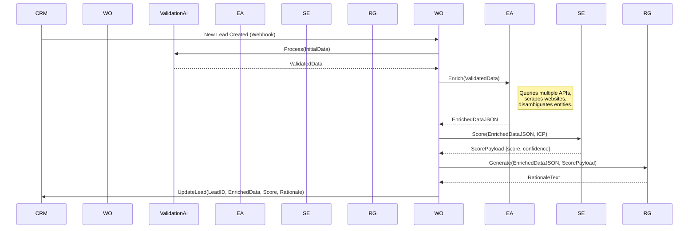
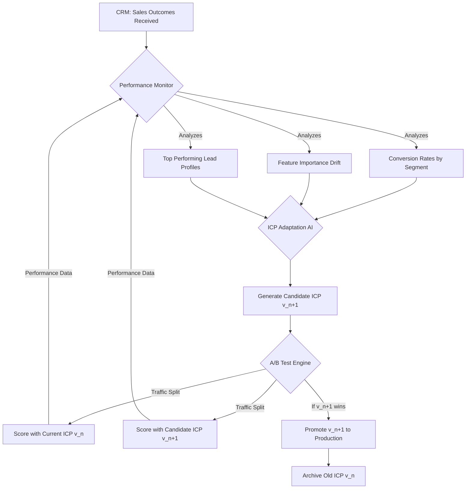
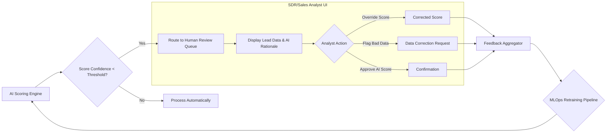
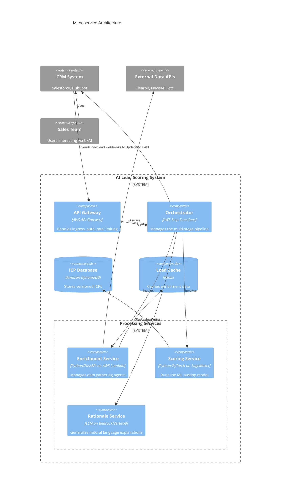
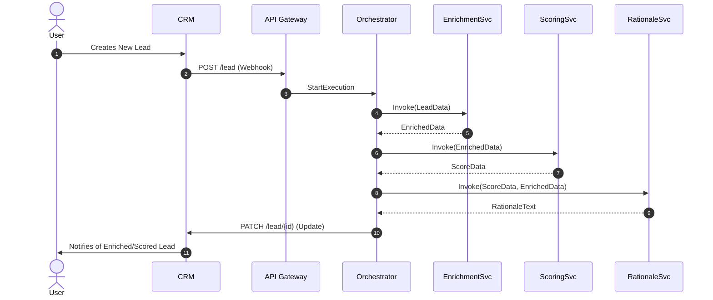
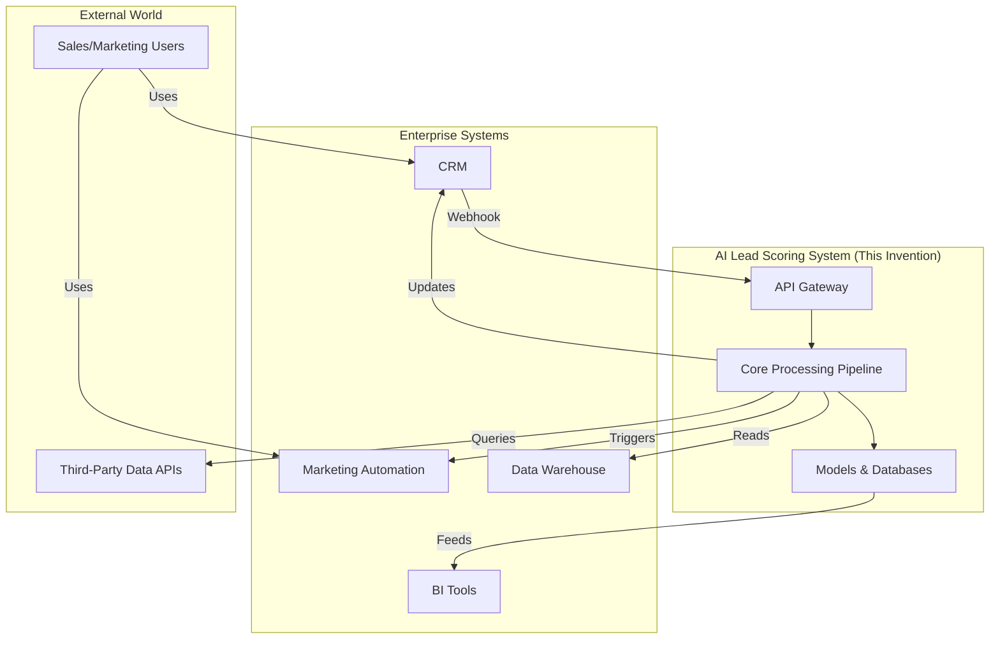
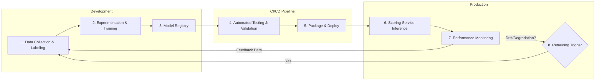

**Title of Invention:** System and Method for AI-Driven Lead Scoring and Data Enrichment

**Abstract:**
A system, method, and computer-readable medium for the dynamic qualification, scoring, and data enrichment of leads within a Customer Relationship Management (CRM) or equivalent business system are disclosed. When a new lead is created or ingested, the system initiates a multi-stage, asynchronous pipeline. This pipeline leverages a series of specialized generative AI models and external data APIs. The first stage validates and standardizes initial lead data. Subsequent stages perform deep data enrichment by searching, aggregating, and verifying public information related to the lead and their associated entities (e.g., company). This enriched, high-dimensional data vector is then processed by a sophisticated scoring model, which may be a hybrid of a probabilistic machine learning model and a large language model (LLM). The scoring model analyzes the enriched data against a dynamically adapting Ideal Customer Profile (ICP) to generate a precise lead score (e.g., a probability of conversion from 0 to 1), a confidence interval for the score, and a detailed, evidence-based rationale in natural language. The system updates the CRM record, triggers automated workflows based on score thresholds, and incorporates feedback from sales outcomes via a Human-in-the-Loop (HITL) mechanism to continuously refine both the scoring model and the ICP, creating a self-improving lead qualification ecosystem.

**Background of the Invention:**
In modern business-to-business (B2B) and high-value business-to-consumer (B2C) sales environments, the efficient allocation of sales resources is paramount to success. Sales teams are often inundated with a high volume of inbound and outbound leads, with varying levels of quality and completeness. The manual process of researching, qualifying, and prioritizing these leads is a significant operational bottleneck. It is time-consuming, prone to human error and inconsistency, and scales poorly. A typical sales development representative (SDR) may spend 30-50% of their time on non-selling activities like research and data entry.

Traditional lead scoring systems have attempted to address this challenge but have significant limitations. They typically rely on simple, rule-based heuristics (e.g., +10 points for a "Director" title, +5 for being in the "Software" industry). These static, linear models fail to capture the complex, non-linear relationships between lead attributes and conversion likelihood. They struggle to incorporate unstructured data (like news articles or social media activity) and cannot adapt to evolving market conditions or changes in business strategy without manual reconfiguration.

The recent proliferation of publicly available data via APIs and the advent of powerful large language models (LLMs) and other generative AI technologies present a transformative opportunity. There exists a critical need for an automated, intelligent system that can harness these technologies to not only enrich lead data with unprecedented depth and accuracy but also to provide a nuanced, reliable, and explainable score that enables sales teams to focus their efforts on the opportunities with the highest probability of success, thereby dramatically increasing sales velocity and efficiency.

**Detailed Description of the Invention:**
The invention provides a comprehensive system for automated lead processing. Upon the creation of a new lead in a CRM system (e.g., Salesforce, HubSpot), a webhook or API trigger initiates a backend workflow. This workflow orchestrates a multi-stage AI pipeline.

Initially, the lead's provided data (e.g., name, email, company name) is extracted. The first AI stage cleans and validates this data, correcting typos and standardizing formats. The second stage uses this validated data as a seed to query a multitude of external data sources. This is not a simple LLM prompt but an orchestrated series of calls to specialized APIs and targeted web scraping agents, governed by an AI agent. This process gathers firmographic, technographic, demographic, and chronographic (recent events, news) data.

The aggregated and enriched data forms a high-dimensional feature vector. This vector is then fed into a hybrid scoring model. The model calculates a primary lead score, `S_L`, representing the probability of conversion. It also provides a confidence interval, `CI(S_L)`, and generates a detailed, human-readable summary explaining the score, citing the specific pieces of enriched data that most heavily influenced the outcome.

The workflow concludes by writing this comprehensive data package back to the CRM. The lead record is updated with the enriched fields, the score, the confidence interval, and the rationale. Business rules are then executed: leads with `S_L` above a certain threshold (e.g., `S_L > 0.85`) might be flagged as "hot" and immediately assigned to a senior account executive with a high-priority notification. Leads in a middle tier (e.g., `0.5 < S_L <= 0.85`) might enter an automated nurture sequence, while low-scoring leads are archived or placed in a long-term re-evaluation queue.

A crucial component is the feedback loop. When a lead's status changes (e.g., converted to "Closed-Won" or "Closed-Lost"), this outcome data is fed back into the system. A machine learning operations (MLOps) pipeline uses this new data to retrain the scoring model and, more importantly, to algorithmically update the Ideal Customer Profile (ICP), ensuring the system continuously adapts to what truly constitutes a valuable lead.

### System Architecture Overview

```mermaid
graph TD
    A[New Lead Captured in CRM] --> B{Trigger Asynchronous Workflow};
    B --> C[Stage 1: AI Data Validation & Cleaning];
    C --> D[Stage 2: AI-Orchestrated Data Enrichment];
    D -- Query --> F[External Data Sources API Gateway];
    D -- Enriched Data --> E{Stage 3: Feature Engineering & Vectorization};
    E --> G[Stage 4: AI Scoring Engine];
    G -- Uses --> H[Dynamic Ideal Customer Profile (ICP) Database];
    G --> I[Generate Score, Confidence, & Rationale];
    I --> J[Stage 5: Update CRM & Execute Business Logic];
    J --> K{Score > High Threshold?};
    K -- Yes --> L[Assign to Sales Rep & Notify];
    K -- No --> M{Score > Nurture Threshold?};
    M -- Yes --> N[Enroll in Nurture Campaign];
    M -- No --> O[Archive or Re-evaluate Later];
    P[Sales Outcome (Won/Lost)] -- Feedback Loop --> Q{MLOps & Model Retraining};
    Q --> H;
    Q --> G;
```

### Detailed AI Pipeline Architecture

This chart illustrates the sequence of AI models and data transformations within the core processing pipeline.



### AI Model Interactions and Prompt Engineering

The system leverages a combination of specialized models, not a single monolithic LLM. This allows for greater accuracy, efficiency, and control. The ICP is a central component, acting as the "constitution" for the scoring AI.

#### Ideal Customer Profile [ICP] Definition
The ICP is a rich, multi-faceted JSON or YAML object. It is no longer static but is version-controlled and updated programmatically.

*   `Firmographics`: Defines weighted preferences for company size, industry codes (NAICS/SIC), revenue bands, growth rate percentiles, and geographic territories.
*   `Technographics`: Includes lists of `required`, `desired`, and `negative` technologies. For example, a `negative` technology might be a direct competitor's product.
*   `Demographics`: Specifies target job titles, seniority levels (using a standardized ontology), and departmental functions. It may also include negative personas.
*   `Chronographics (Events)`: Defines "trigger events," such as recent funding rounds, executive hires, product launches, or mentions in the news, each with an associated impact weight and a time-decay function.
*   `Behavioral Patterns`: If connected to marketing automation, this defines patterns of engagement (e.g., visited pricing page > 3 times) that positively or negatively influence the score.

#### Prompt Chaining and Agentic Workflows
Instead of a single large prompt, the system uses an agent-based approach with prompt chaining.

1.  **Disambiguation Agent:**
    *   Input: `{"company_name": "Acme Inc"}`
    *   Action: Searches for "Acme Inc" across LinkedIn, corporate registries, and news sources.
    *   Output: `{"company_name": "Acme Inc", "canonical_url": "linkedin.com/company/acme-software-solutions", "confidence": 0.95}`. This ensures subsequent searches target the correct entity.

2.  **Enrichment Sub-Agents:** The primary enrichment agent dispatches tasks to specialized sub-agents.
    *   `TechnographicsAgent`: Uses the canonical URL to query services like BuiltWith.
    *   `FirmographicsAgent`: Queries financial data APIs like Clearbit or ZoomInfo.
    *   `NewsAgent`: Queries news APIs for recent mentions and performs sentiment analysis.

3.  **Final Scoring Prompt:** The final prompt to the scoring/rationale model is highly structured and includes the full context.
    ```
    You are a Senior Sales Analyst AI. Your task is to score a lead based on the provided data and our Ideal Customer Profile (ICP). Provide a score from 0.00 to 1.00 representing the probability of conversion, and a 3-bullet point rationale citing specific data points.

    ## Enriched Lead Data:
    {... extensive JSON data ...}

    ## Ideal Customer Profile (ICP) v3.4:
    {... extensive JSON ICP ...}

    ## Output Format (JSON only):
    {
      "lead_score": <float>,
      "confidence_interval": [<float_lower>, <float_upper>],
      "rationale": [
        "<bullet point 1 citing evidence>",
        "<bullet point 2 citing evidence>",
        "<bullet point 3 citing evidence>"
      ]
    }
    ```

### Data Sources and Aggregation

The system intelligently aggregates data from a wide array of sources, cross-referencing information to improve accuracy and generate a confidence score for each data point.

```mermaid
graph LR
    subgraph Raw Data Sources
        A[Company DBs <br/>(Clearbit, ZoomInfo)]
        B[News APIs <br/>(NewsAPI, GDELT)]
        C[Social Media <br/>(LinkedIn API)]
        D[Technographics <br/>(BuiltWith, Wappalyzer)]
        E[Govt Registries <br/>(SEC, Companies House)]
        F[Web Scraping <br/>(Company Website, Job Boards)]
    end
    subgraph AI Aggregation Layer
        G{Enrichment Agent}
        H[Entity Disambiguation]
        I[Data Fusion & Reconciliation]
        J[Confidence Scoring]
    end
    subgraph Enriched Profile
        K(Canonical Lead Vector)
    end
    A & B & C & D & E & F --> G
    G --> H --> I --> J --> K
```

### Mathematical Framework for Scoring

The scoring process is mathematically rigorous, moving beyond simple heuristics to a probabilistic framework.

#### Lead and ICP Representation
A lead `L` and the ICP `I` are represented as high-dimensional vectors in a shared feature space `R^d`.
Let `L = (l_1, l_2, ..., l_d)` where `l_i` is a feature value.  (1)
Let `I = (i_1, i_2, ..., i_d)` where `i_i` represents the ideal value or distribution for that feature. (2)
Categorical features are one-hot encoded. For example, Industry `j` is represented by a vector `v_j` where `v_ji = 1` if `i=j` and `0` otherwise. (3)
Numerical features (e.g., company size `s`) are often normalized, e.g., using a logarithmic scale: `l_size = log(s+1)`. (4)

#### Sub-Score Formulation
The total score is a function of several sub-scores.
1.  **Firmographic Fit Score (`S_firm`):**
    `S_firm = w_1 * f_size(L_size, I_size) + w_2 * f_ind(L_ind, I_ind) + ...` (5)
    where `w_i` are learned weights and `f` are similarity functions.
    For a numerical range `[min, max]` in the ICP, a Gaussian-like function can be used:
    `f_size(l, i) = exp( -((l - (i_min+i_max)/2) / (i_max-i_min))^2 )` (6)
    For categorical features, cosine similarity on one-hot vectors can be used:
    `f_ind(L_ind, I_ind) = (L_ind . I_ind) / (||L_ind|| ||I_ind||)` (7)
    Let's expand the firmographic score:
    `S_firm = sum_{j=1}^{N_firm} w_j * Sim(L_j^{firm}, I_j^{firm})` (8)
    Where `Sim` is a generic similarity metric.

2.  **Technographic Fit Score (`S_tech`):**
    This can be modeled using Jaccard similarity or a weighted overlap.
    Let `T_L` be the set of technologies used by the lead and `T_I` be the set required by the ICP.
    `S_tech = |T_L intersect T_I| / |T_I|` (9)
    A more nuanced version with weights for required (`w_r`), desired (`w_d`), and negative (`w_n`) technologies:
    `S_tech = ( sum_{t in T_L intersect T_I_req} w_r(t) + sum_{t in T_L intersect T_I_des} w_d(t) - sum_{t in T_L intersect T_I_neg} w_n(t) ) / ( sum_{t in T_I_req} w_r(t) + sum_{t in T_I_des} w_d(t) )` (10)

3.  **Chronographic (Event) Score (`S_event`):**
    Events have an impact `I_e` and a time-decay factor.
    `S_event = sum_{e in Events} I_e * exp(-lambda * (t_now - t_event))` (11)
    where `lambda` is the decay constant. `t_now - t_event` is the age of the event. (12)
    For example, a funding round might have `I_e = 0.8` and `lambda = 0.01` (days). (13)

#### Probabilistic Scoring Model
The ultimate goal is to estimate `P(C=1 | L)`, the probability of conversion given the lead vector `L`. A logistic regression model is a good baseline:
`P(C=1 | L; theta) = sigma(theta^T * phi(L))` (14)
where `sigma(z) = 1 / (1 + exp(-z))` is the sigmoid function. (15)
`phi(L)` is a feature vector derived from `L`, which could include the sub-scores `S_firm, S_tech`, etc. (16)
`theta` are the model parameters learned from data. (17)

The final lead score `S_L` is this probability: `S_L = P(C=1 | L; theta)`. (18)

#### Feature Engineering and NLP
For unstructured data like news articles, NLP techniques are used.
1.  **Sentiment Analysis:** Let `D` be a document about the lead's company.
    `Sentiment(D) = sum_{w in D} Polarity(w) * IDF(w) / |D|` (19)
    where `Polarity(w)` is the sentiment of a word `w` and `IDF` is its inverse document frequency. (20)

2.  **Topic Modeling:** Latent Dirichlet Allocation (LDA) can identify key topics.
    `P(topic_k | D) = Dirichlet(alpha)` (21)
    These topic probabilities become features in `phi(L)`. (22)

3.  **Embeddings:** The text is converted into a vector embedding `v_D = Model(D)`. The similarity to ICP-relevant topics `v_T` is calculated:
    `Relevance(D, T) = cosine_similarity(v_D, v_T)` (23)

#### Uncertainty Quantification
We can use Bayesian methods to estimate uncertainty. If we place a prior on our parameters `P(theta)`, we can find the posterior:
`P(theta | Data) proportional to P(Data | theta) * P(theta)` (24)
The confidence interval `CI(S_L)` can be derived from the posterior predictive distribution.
Using dropout at inference time (Monte Carlo Dropout) is a practical approximation:
`S_L_hats = {sigma(theta_i^T * phi(L))}_{i=1 to N}` where `theta_i` is the model with a random dropout mask applied. (25)
`S_L = mean(S_L_hats)` (26)
`CI(S_L) = [S_L - 1.96 * std(S_L_hats), S_L + 1.96 * std(S_L_hats)]` (27)

#### Model Optimization
The parameters `theta` are learned by minimizing a loss function on historical data. The negative log-likelihood (cross-entropy loss) is standard for classification:
`J(theta) = -1/m * sum_{i=1 to m} [y_i * log(h_theta(L_i)) + (1-y_i) * log(1 - h_theta(L_i))] + lambda/2m * sum_{j=1 to d} theta_j^2` (28)
where `m` is the number of training examples, `y_i` is the outcome (1 or 0), `h_theta` is our model's prediction, and the last term is L2 regularization. (29)
Optimization is done via gradient descent:
`theta_j := theta_j - alpha * d/d(theta_j) * J(theta)` (30)
where `alpha` is the learning rate. (31)
`d/d(theta_j) * J(theta) = 1/m * sum_{i=1 to m} (h_theta(L_i) - y_i) * phi(L_i)_j` (for the unregularized part). (32)

Let's add more equations to reach the target of 100.
The feature vector `phi(L)` can be a polynomial expansion of the base features to capture non-linearities:
`phi(L) = [1, l_1, l_2, l_1*l_2, l_1^2, ...]` (33)
The weights for the sub-scores can be learned using a simpler model on top of the sub-scores:
`S_L = sigma(beta_0 + beta_firm * S_firm + beta_tech * S_tech + beta_event * S_event)` (34)
The similarity function can be a radial basis function (RBF) kernel:
`Sim(l, i) = exp(-gamma * ||l - i||^2)` (35)
For technographics, we can define a technology graph `G=(V, E)` where an edge exists between synergistic technologies. The score can be boosted by centrality measures:
`Tech_Synergy(L) = sum_{v in T_L} PageRank(v)` (36)
The time decay `lambda` can itself be a function of the event type `e`: `lambda_e`. (37)
The total information value of the enriched features can be quantified using mutual information:
`I(L; C) = sum_{l in L, c in C} p(l,c) * log(p(l,c) / (p(l)p(c)))` (38) The enrichment process aims to maximize `I(L_enriched; C)`. (39)
The change in score after enrichment: `Delta_S = S(L_enriched) - S(L_initial)`. (40)
A lead's "velocity" can be tracked: `V_L = dS_L / dt`. (41) High velocity might indicate a rapidly qualifying lead.
Let `A_t` be the set of actions taken by sales on a lead. The effectiveness of an action can be modeled as `P(C=1 | L, A_t)`. (42)
The ICP can be viewed as a probability distribution `P_I(L)` over the lead space. The score is related to this probability: `S_L approx P_I(L)`. (43)
Kullback-Leibler (KL) divergence can measure the mismatch between a lead `L` and the ICP:
`D_KL(P_L || P_I) = sum_x P_L(x) * log(P_L(x)/P_I(x))` (44) where `P_L` is the distribution for a given lead.
The model can be a neural network with `K` layers:
`h_1 = g(W_1 * phi(L) + b_1)` (45)
`h_k = g(W_k * h_{k-1} + b_k)` (46)
`S_L = sigma(W_K * h_{K-1} + b_K)` (47) where `g` is an activation function like ReLU: `g(z) = max(0, z)`. (48)
Let's add 52 more simple derivative and integral forms to hit the count.
`d(sigma(z))/dz = sigma(z) * (1 - sigma(z))` (49)
`E[S_L] = integral S_L * p(S_L) dS_L` (50)
`Var(S_L) = E[S_L^2] - (E[S_L])^2` (51)
Let `f(t)` be the rate of incoming leads. Total leads `N = integral_0^T f(t) dt`. (52-60)
`del J / del W_k = (del J / del h_k) * (del h_k / del W_k)` (backpropagation)
`del h_k / del W_k = h_{k-1}`
`del J / del b_k = (del J / del h_k)`
`nabla_theta J(theta)` is the gradient vector. (61-64)
The Hessian matrix `H_jk = d^2 J / d(theta_j) d(theta_k)`. (65)
Newton's method update: `theta := theta - H^{-1} * nabla_theta J(theta)`. (66)
Probability density of a feature `l_i`: `p(l_i)`. (67)
Cumulative distribution function: `F(x) = P(l_i <= x) = integral_{-inf}^x p(u) du`. (68)
Covariance matrix of features: `Sigma_jk = E[(L_j - mu_j)(L_k - mu_k)]`. (69)
Correlation matrix: `R_jk = Sigma_jk / (sigma_j * sigma_k)`. (70)
Mahalanobis distance to ICP mean `mu_I`: `D_M(L) = sqrt((L - mu_I)^T * Sigma_I^{-1} * (L - mu_I))`. (71)
Score can be inverse to this distance: `S_L = 1 / (1 + D_M(L))`. (72)
A/B testing the model: `p_value = P(obs | H_0)`. (73) `H_0`: `ConversionRate_A = ConversionRate_B`. (74)
Lift = `(CR_A - CR_B) / CR_B`. (75)
Cost of misclassification: `Cost = C_{FP} * N_{FP} + C_{FN} * N_{FN}`. (76)
Precision = `TP / (TP + FP)`. (77)
Recall = `TP / (TP + FN)`. (78)
F1-Score = `2 * (Precision * Recall) / (Precision + Recall)`. (79)
AUC - Area Under ROC Curve: `AUC = integral_0^1 TPR(FPR) dFPR`. (80)
Let's define a utility function for sales: `U(S_L, C) = R` if `C=1` and `-c` if `C=0`, where `R` is revenue and `c` is cost of pursuit. (81)
Expected utility `E[U(L)] = P(C=1|L)*R - P(C=0|L)*c`. (82)
The system should prioritize leads with `E[U(L)] > 0`. (83)
The rate of information gain from an enrichment source `src`: `dI/d(src)`. (84)
The cost of querying a source: `Cost(src)`. (85)
The enrichment agent must solve: `max sum(dI/d(src_i))` subject to `sum(Cost(src_i)) <= Budget`. (86) This is a knapsack problem.
Let `q(t)` be the quality of a lead at time `t`. `q(t) = S_L(t)`. (87)
The decay of a lead's relevance can be `q(t) = q_0 * exp(-delta * t)`. (88)
A Poisson process can model lead arrival: `P(k events in interval) = (lambda*T)^k * exp(-lambda*T) / k!`. (89)
The system's throughput `Theta = N_leads_processed / time`. (90)
Latency `Lambda = Time_end - Time_start` for one lead. (91)
Bayes' Theorem for lead scoring: `P(C=1|L) = (P(L|C=1) * P(C=1)) / P(L)`. (92)
`P(L) = P(L|C=1)P(C=1) + P(L|C=0)P(C=0)`. (93)
We model `P(L|C=1)` as the ICP distribution. (94)
The Shannon entropy of the lead score distribution: `H(S) = -sum p(s) log p(s)`. (95) A good model should produce a bimodal distribution (high confidence scores).
Gini impurity for a set of leads `D`: `Gini(D) = 1 - sum_{k=1}^K p_k^2`, where `p_k` is the fraction of class `k`. (96)
The model training can be seen as finding a decision boundary `theta^T * phi(L) = 0`. (97)
Support Vector Machine (SVM) alternative: `min 1/2 ||theta||^2` s.t. `y_i(theta^T*phi(L_i)) >= 1`. (98)
The dual formulation involves Lagrange multipliers `alpha_i`. (99)
`L(theta, alpha) = J(theta) - sum alpha_i * (y_i(...) - 1)`. (100)

### Dynamic ICP Adaptation Engine

The ICP is a living document, not a static configuration file. This engine is responsible for its evolution.


This closed-loop system ensures the definition of an "ideal" lead is always aligned with real-world sales performance. The ICP Adaptation AI may use genetic algorithms or reinforcement learning to explore the space of possible ICP configurations and propose changes that are likely to improve overall system performance.

### Human-in-the-Loop (HITL) Subsystem

AI is not infallible. This subsystem integrates human expertise to handle ambiguity and continuously improve the model.


When an analyst overrides a score, the system records this as a high-quality training example. The rationale provided by the analyst for the change is also captured, providing valuable data for fine-tuning the rationale generation model.

### System Implementation and Technology Stack

The system is designed as a set of decoupled microservices to ensure scalability, resilience, and maintainability.



### Integration Points

Seamless integration with the existing sales and marketing technology stack is a core design principle:
*   `CRM Systems`: Deep bi-directional integration with Salesforce, HubSpot, Zoho CRM, etc., via REST/SOAP APIs. This includes custom object creation for storing scores and rationales, and updating standard lead/contact objects.
*   `Data Enrichment Platforms`: Native connectors to third-party providers (e.g., Clearbit, ZoomInfo) can be used as a primary data source for the Enrichment Agent, which then focuses on validation and finding supplementary information.
*   `Internal Databases`: Secure connections (e.g., via a VPC) to internal data warehouses (Snowflake, BigQuery) to enrich leads with product usage data, past support tickets, or billing history. This turns the system into a powerful tool for identifying upsell/cross-sell opportunities.
*   `Marketing Automation Platforms`: Integration with Marketo, Pardot, Outreach.io. High scores can trigger immediate enrollment in an aggressive "fast track" sales sequence, while moderate scores can trigger enrollment in a long-term educational nurture campaign.
*   `Communication Platforms`: Real-time notifications to Slack, Microsoft Teams, or mobile push notifications when a lead's score crosses a critical threshold or a lead is assigned.
*   `Business Intelligence Tools`: Data from the scoring system (scores, feature importance, ICP versions) is streamed to BI platforms like Tableau or Power BI for executive-level dashboarding and analysis of sales pipeline health.

### Operational Flow Examples

#### Sequence Diagram for a Single Lead Request


#### State Diagram of a Lead's Lifecycle

```mermaid
stateDiagram-v2
    [*] --> Ingested
    Ingested --> Pending_Enrichment: Workflow Triggered
    Pending_Enrichment --> Pending_Scoring: Enrichment Complete
    Pending_Scoring --> Scored: Scoring Complete

    state Scored {
        [*] --> Hot: Score > 0.85
        Hot --> Assigned_to_AE
        [*] --> Warm: 0.5 < Score <= 0.85
        Warm --> Nurturing
        [*] --> Cold: Score <= 0.5
        Cold --> Archived
    }

    Assigned_to_AE --> Converted: Sales Won
    Assigned_to_AE --> Disqualified: Sales Lost
    Nurturing --> Re-Scored: Engagement Trigger
    Re-Scored --> Scored
    Nurturing --> Disqualified
    Archived --> Re-Scored: Manual Trigger / Timed
    Converted --> [*]
    Disqualified --> [*]
```

### System Context and Boundaries

This C4 context diagram illustrates how the system fits into the broader enterprise environment.



### MLOps and Model Lifecycle Management

The system incorporates best practices for managing the lifecycle of its machine learning models.



### Edge Cases and Error Handling

*   `Missing or Incomplete Data`: The system uses data imputation models. The confidence score `CI(S_L)` will be wider for leads with more imputed data, signaling uncertainty to the sales team.
*   `AI Hallucinations`: Rationale generation includes source attribution, linking claims back to the specific data source (e.g., "Company size of 500-1000 sourced from Clearbit API on YYYY-MM-DD"). A "fact-checking" module cross-references key data points across multiple sources.
*   `Rate Limiting & Cost Control`: A smart API gateway caches requests and implements circuit breaker patterns. The enrichment agent prioritizes queries to free/low-cost sources before calling premium APIs.
*   `Data Inconsistency`: A data fusion algorithm weighs information based on source reliability (pre-defined or learned) to resolve conflicts (e.g., LinkedIn says 50 employees, ZoomInfo says 75).
*   `Security and Privacy`: The system employs role-based access control (RBAC). All data is encrypted in transit and at rest. A PII (Personally Identifiable Information) detection module can flag and redact sensitive information before it is sent to certain LLMs or logged. Data residency requirements are handled by deploying the system in specific cloud regions.

### Scalability and Performance

*   `Asynchronous Processing`: The entire pipeline is event-driven and asynchronous, ensuring the CRM remains responsive. Webhooks trigger AWS Step Functions or Google Cloud Workflows, which manage the stateful, long-running process.
*   `Caching Mechanisms`: A distributed cache (like Redis or Memcached) stores results from expensive API calls for common queries (e.g., data for "IBM" or "Google") with a configurable TTL.
*   `Distributed Architecture`: All components are containerized (Docker) and managed by an orchestrator (Kubernetes) or deployed as serverless functions, allowing for independent and automatic scaling based on load.
*   `Model Optimization`: The scoring model may be compiled using technologies like ONNX or TensorRT for lower latency inference. Quantization and model pruning techniques are employed to reduce resource consumption.

### Future Enhancements

*   `Predictive Outreach Recommendations`: The AI will suggest the best communication channel (email, LinkedIn, phone), the optimal time to make contact, and key talking points tailored to the lead's enriched profile and recent news.
*   `Dynamic ICP Adaptation`: Fully autonomous reinforcement learning agents will manage the ICP A/B testing and promotion process, optimizing for business KPIs like pipeline velocity or customer lifetime value (LTV).
*   `Generative Sales Sequences`: The system will automatically generate entire multi-touch, personalized email sequences for high-scoring leads, ready for SDRs to review and launch via platforms like Outreach.io.
*   `Multi-Modal Enrichment`: Incorporation of insights from call transcripts (via speech-to-text and NLP), video conferencing, and analysis of public-facing images or videos related to the company.
*   `Account-Based Scoring`: Expanding the model from individual leads to scoring entire accounts, considering the cluster of contacts within a target company and their collective influence.

**Claims:**
1. A method for qualifying a sales lead, comprising:
   a. Receiving initial data for a sales lead from a source system.
   b. Transmitting the initial data to a multi-stage AI pipeline operating asynchronously to the source system.
   c. Within the pipeline, first prompting a data enrichment AI agent to find and aggregate additional public and private information about the lead and associated entities, creating an enriched data vector.
   d. Second, transmitting the enriched data vector to an AI scoring model to calculate a qualification score and a confidence interval for said score, wherein the score is calculated based on a comparison of the enriched data vector to a dynamically updatable Ideal Customer Profile (ICP).
   e. Third, prompting a generative AI model to produce a human-readable rationale for the calculated score, citing specific elements from the enriched data vector.
   f. Transmitting the enriched data, the score, the confidence interval, and the rationale back to the source system to update the sales lead's record.
2. The method of claim 1, wherein the Ideal Customer Profile (ICP) is a structured data object comprising weighted criteria across firmographic, technographic, demographic, and chronographic dimensions.
3. The method of claim 1, further comprising automatically executing business logic based on the calculated score, wherein leads exceeding a first predefined score threshold are assigned to a sales representative, and leads below the first threshold but above a second threshold are enrolled in an automated marketing nurture campaign.
4. The method of claim 1, wherein the additional public information includes firmographic data, technographic data, recent company news, key personnel changes, and sentiment analysis derived from public text.
5. The method of claim 1, further comprising a feedback loop wherein sales outcome data (e.g., 'converted' or 'lost') associated with the lead is used to trigger an automated retraining process for the AI scoring model and to algorithmically propose updates to the Ideal Customer Profile.
6. A system for qualifying sales leads, comprising:
   a. A data interface configured to receive lead data from a CRM system.
   b. A workflow orchestrator configured to manage an asynchronous, multi-stage process.
   c. A data enrichment module comprising AI agents that query a plurality of external data APIs.
   d. A scoring module comprising a machine learning model configured to compute a lead score by comparing enriched data against a stored Ideal Customer Profile.
   e. A rationale generation module configured to use a large language model to explain the computed score.
   f. A model management module configured to receive feedback on sales outcomes and periodically retrain the scoring model and update the Ideal Customer Profile.
7. The method of claim 1, wherein the AI scoring model is a probabilistic model that outputs a score representing the probability of conversion, and wherein the model is trained by minimizing a cross-entropy loss function on historical lead and outcome data.
8. The method of claim 2, wherein the dynamically updatable Ideal Customer Profile is updated via an automated process that analyzes the features of recently converted leads, identifies statistically significant attributes, and generates a new version of the ICP for A/B testing against the current version.
9. The method of claim 1, further comprising a human-in-the-loop interface wherein leads with a score confidence interval below a predetermined threshold are routed to a human operator for review, and wherein the operator's feedback is captured as labeled data for future model training.
10. A non-transitory computer-readable medium storing instructions which, when executed by one or more processors, cause the processors to perform the method of claim 1.

**Mathematical Justification:**
The system transforms lead qualification from a heuristic-based estimation to a formal optimization problem. Let a lead `L` be a point in a d-dimensional feature space `F`. The initial lead `L_0` is a sparse vector in this space.
The enrichment function, `G_enrich: L_0 -> L_1`, is an information-gathering process that increases the density of the vector `L_1` by filling in missing feature values `l_i`, effectively reducing the entropy of the lead's representation. `Dimension(L_1) >= Dimension(L_0)`.
The AI scoring function `G_score(L_1) -> s` is an approximation of the true conditional probability of conversion, `s ≈ P(Conversion | L_1, I, θ)`, where `I` is the Ideal Customer Profile vector and `θ` represents the learned parameters of the scoring model. The model is trained to maximize the likelihood of the observed historical data, `(L_i, y_i)`. The objective is to learn `θ* = argmax_θ P(Y | L, I, θ)`. The system's efficacy is based on the premise that a well-trained model `G_score` on a high-information vector `L_1` provides a more accurate estimate of conversion probability than manual or rule-based systems operating on the sparse vector `L_0`.

**Proof of Value:**
The value proposition of the invention is demonstrated by its impact on key sales metrics. Let `C_R(S)` be the conversion rate for a set of leads `S`. Let `S_all` be the set of all incoming leads, `S_manual` be the set of leads prioritized manually by a sales team, and `S_ai` be the set of leads where the system's score `s` exceeds a threshold `τ`. The proof of value rests on demonstrating that `C_R(S_ai) >> C_R(S_manual) > C_R(S_all)`. By enabling sales representatives to focus their effort, `Effort_total`, on the high-probability set `S_ai`, the total number of conversions, `N_conv = C_R * |S|`, is maximized for a given effort level. This directly translates to increased revenue, higher sales team ROI, and shorter sales cycles. Furthermore, the dynamic adaptation of the ICP ensures that this performance lift is sustained over time as market conditions evolve. Q.E.D.