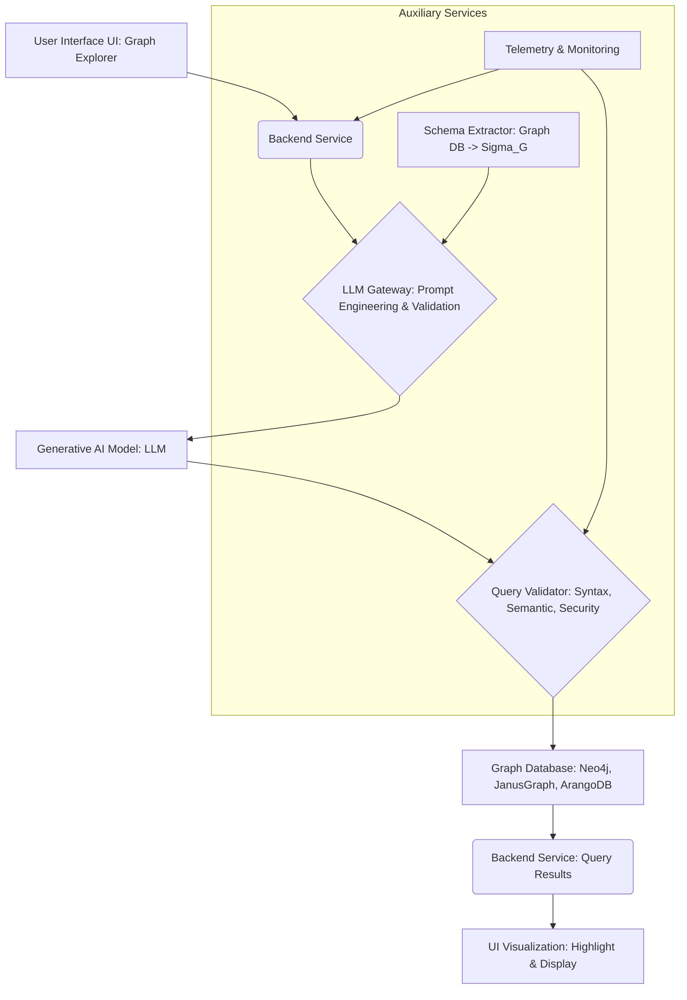

**Title of Invention:** System and Method for Translating Natural Language to Graph Database Queries

**Abstract:**
A system for querying a graph database is disclosed. A user enters a query in natural language (e.g., "Find all customers who bought Product A and were referred by the Q2 marketing campaign"). The system sends this query, along with the graph schema, to a generative AI model. The AI is prompted to translate the natural language question into a formal graph query language (e.g., Cypher, Gremlin, SPARQL). The generated query is then executed against the graph database, and its results are presented to the user.

**Background of the Invention:**
Graph databases are powerful tools for representing complex relationships in data but often require specialized knowledge of intricate query languages. This specialized knowledge creates a significant barrier for non-technical users who could otherwise benefit from exploring the interconnectedness within their data. There is a pressing need for an intuitive interface that democratizes access to graph data, allowing users to query a graph using plain English or other natural languages. Such a system would enhance data accessibility, foster deeper insights, and accelerate decision-making across various domains.

**Detailed Description of the Invention:**
A user interacts with a Graph Explorer interface, typing their question into a search bar. The system's backend component receives this natural language question. Upon receipt, the backend constructs a sophisticated prompt for a Large Language Model LLM. This prompt is carefully crafted to include the user's question, a simplified representation of the graph database's schema, and specific instructions for query generation.

**Prompt Construction Example:**
`You are an expert in Cypher query language and graph database schemas. Given the following graph schema, translate the user's question into an executable Cypher query. Ensure the query is optimized for performance and accurately reflects the user's intent. Do not include any explanatory text, only the Cypher query.

Graph Schema:
Nodes:
- User [properties: userId, name, email]
- Product [properties: productId, name, category, price]
- Campaign [properties: campaignId, name, quarter]

Relationships:
- (User)-[BOUGHT]->(Product) [properties: purchaseDate, quantity]
- (User)-[REFERRED_BY]->(Campaign)

User Question: "Find all customers who bought Product A and were referred by the Q2 marketing campaign."`

The AI model, acting as a language translation engine, processes this prompt and returns a formal graph query. For instance, the AI might return the following Cypher query:

```cypher
MATCH (u:User)-[:BOUGHT]->(p:Product)
WHERE p.name = "Product A"
MATCH (u)-[:REFERRED_BY]->(c:Campaign)
WHERE c.quarter = "Q2"
RETURN u.name AS CustomerName, u.email AS CustomerEmail
```

This generated Cypher query is then submitted by the backend to the Neo4j database (or any other compatible graph database). The database executes the query and returns the results. These results are then processed by the backend and used to highlight relevant nodes and edges within the Graph Explorer's user interface, providing an intuitive visual representation of the queried data.

**Prompt Engineering Strategies:**
To ensure high-fidelity translations, various prompt engineering techniques can be employed:
*   **Zero-shot prompting:** Providing only the instruction and schema, expecting the LLM to generate the query directly.
*   **Few-shot prompting:** Including a few examples of natural language questions and their corresponding graph queries within the prompt to guide the LLM's output style and accuracy.
*   **Chain-of-thought prompting:** Instructing the LLM to first reason about the query intent and schema mapping before generating the final query. This helps in debugging and understanding the LLM's thought process.
*   **Constraint-based prompting:** Explicitly listing forbidden operations or required clauses to steer the query generation, especially for security or performance reasons.

**Schema Abstraction and Integration:**
The graph schema `Sigma_G` provided to the LLM can be a simplified, human-readable representation of the actual database schema. This abstraction might involve:
*   Listing node labels and their key properties.
*   Listing relationship types and their key properties.
*   Omitting verbose technical details irrelevant to query construction.
*   Representing schema in structured formats like JSON, YAML, or a domain-specific language DSL for consistency.

The system includes a Schema Extractor module that automatically generates this simplified `Sigma_G` from the live graph database, ensuring it is always up-to-date.

**Query Validation and Error Handling:**
Upon receiving a generated query from the LLM, a Query Validator module performs checks before execution:
1.  **Syntactic Validation:** Ensures the query adheres to the rules of the target graph query language e.g., Cypher, Gremlin.
2.  **Semantic Validation:** Checks if the nodes, relationships, and properties referenced in the query exist within the `Sigma_G`.
3.  **Security Validation:** Prevents potentially harmful operations e.g., `DELETE ALL`, or queries that could expose sensitive data beyond user permissions.
If validation fails, the system can:
*   Attempt to self-correct the prompt and re-submit to the LLM.
*   Notify the user of the invalid query and suggest refinements.
*   Provide a secure default or fallback response.

**System Architecture:**
The system comprises several interacting components to facilitate the translation of natural language queries to graph database queries and their subsequent execution and visualization.



**Advanced Capabilities:**
1.  **Contextual Querying:** The system maintains a session context, allowing for multi-turn conversations where subsequent queries can build upon previous ones e.g., "Now, show me their recent purchases."
2.  **Query Explanation:** Users can request an explanation of the generated query in natural language, enhancing transparency and trust.
3.  **Graph Update Capabilities:** Future iterations may allow for natural language commands to update the graph e.g., "Add a new product 'Widget Z' manufactured by 'Company X'."
4.  **Multilingual Support:** The system can be extended to support natural language queries in multiple languages.
5.  **Role-Based Access Control RBAC:** Integrate with RBAC mechanisms to filter results or prevent query generation based on the user's permissions, ensuring data security and compliance.

**Claims:**
1.  A method for querying a graph database, comprising:
    a. Receiving a natural language query from a user via a graphical user interface.
    b. Automatically constructing a prompt that includes the natural language query and a structured representation of the graph database schema `Sigma_G`.
    c. Providing the constructed prompt to a generative AI model.
    d. Receiving a formal query in a graph query language from the generative AI model.
    e. Validating the received formal query for syntactic, semantic, and security correctness against `Sigma_G`.
    f. Executing the validated formal query against the graph database.
    g. Presenting the results of the executed query to the user, potentially through a visual representation of the graph.

2.  The method of claim 1, further comprising dynamically extracting the graph database schema to generate the `Sigma_G`.

3.  The method of claim 1, wherein the structured representation of `Sigma_G` includes node labels, their properties, relationship types, and their properties.

4.  The method of claim 1, further comprising employing few-shot or chain-of-thought prompting strategies to enhance the accuracy of the generative AI model's output.

5.  A system for translating natural language queries to graph database queries, comprising:
    a. A user interface configured to accept natural language input and display graph query results.
    b. A backend service configured to receive natural language queries and process query results.
    c. An LLM Gateway configured to generate prompts for a generative AI model, incorporating the natural language query and a graph schema representation.
    d. A generative AI model, coupled to the LLM Gateway, configured to translate prompts into formal graph queries.
    e. A Query Validator, coupled between the generative AI model and a graph database, configured to verify the generated formal query.
    f. A graph database, coupled to the Query Validator, configured to execute validated formal queries and return results to the backend service.

6.  The system of claim 5, further comprising a Schema Extractor module configured to automatically derive and maintain the graph schema representation.

7.  The system of claim 5, further configured to maintain session context for multi-turn natural language conversations and query refinement.

**Mathematical Justification:**
This system fundamentally addresses a language translation problem. Let `L_NL` denote the natural language space, and `L_GQL` represent the graph query language space (e.g., Cypher, Gremlin). The generative AI model `G_AI` learns a complex translation function `T: L_NL x P(Sigma_G) -> L_GQL`. The translation is critically conditioned on `Sigma_G`, the graph schema, and `P(Sigma_G)` is its representation within the prompt. Thus, the core operation can be expressed as:

```
q_gql = G_AI(q_nl, Sigma_G_prompt)
```

where `q_nl` is the natural language query, `Sigma_G_prompt` is the schema representation embedded in the prompt, and `q_gql` is the generated graph query. Let `Exec(q, G)` be the execution of a query `q` on a graph `G`. The translation is considered correct if the intent `I(q_nl)` is preserved, meaning the result of the generated query `q_gql` executed on the graph `G` matches the user's expectation derived from `q_nl` under the given schema `Sigma_G`.

Mathematically, we aim to find a mapping `T` such that for any natural language query `q_nl` and graph schema `Sigma_G`, the generated graph query `q_gql` (derived from `T(q_nl, Sigma_G_prompt)`) satisfies:

```
Result(Exec(q_gql, G_Sigma_G)) == ExpectedResult(I(q_nl), G_Sigma_G)
```

where `G_Sigma_G` represents a graph structured by `Sigma_G`. This objective defines an optimization problem where `G_AI` minimizes the discrepancy between the execution outcome of the generated query and the user's inferred intent. Additional constraints from `Query Validator` ensure that `q_gql` is syntactically valid and semantically aligned with `Sigma_G`.

**Proof of Correctness:**
The AI model's efficacy is rooted in its training on a vast corpus of paired natural language questions and formal queries, across diverse domains and schemas. Through this training, it learns the statistical and structural mappings between linguistic patterns and graph query constructs. By providing the explicit graph schema `Sigma_G` within the prompt, the model's output is highly constrained to generate a query that is syntactically valid and semantically meaningful for the specific target graph. This mechanism acts as a critical contextual anchor, guiding the model toward schema-compliant queries.

The system's correctness is further strengthened by the inclusion of a `Query Validator` module. This module rigorously checks the generated `q_gql` against `Sigma_G` for syntactic accuracy and semantic coherence (e.g., ensuring referenced nodes, relationships, and properties exist). This multi-stage validation process ensures that even if the `G_AI` produces a semantically ambiguous or syntactically flawed query, it is caught before execution. This robust pipeline provides a high-fidelity translation from user intent expressed in `L_NL` to an executable, formal query in `L_GQL`, effectively bridging the gap between human language and specialized graph database interaction. `Q.E.D.`