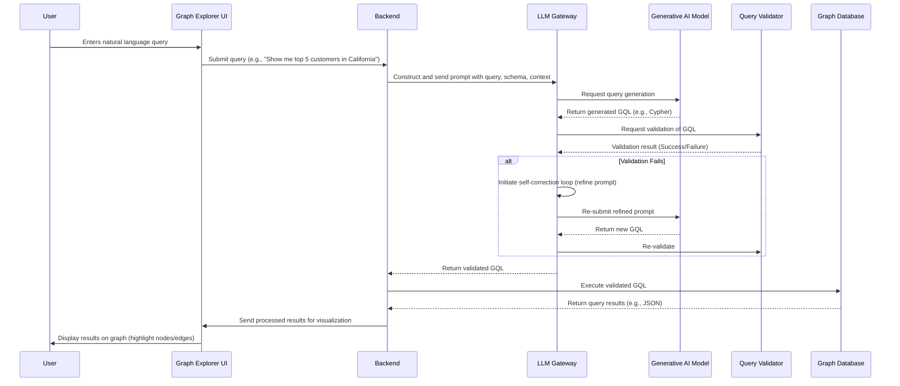
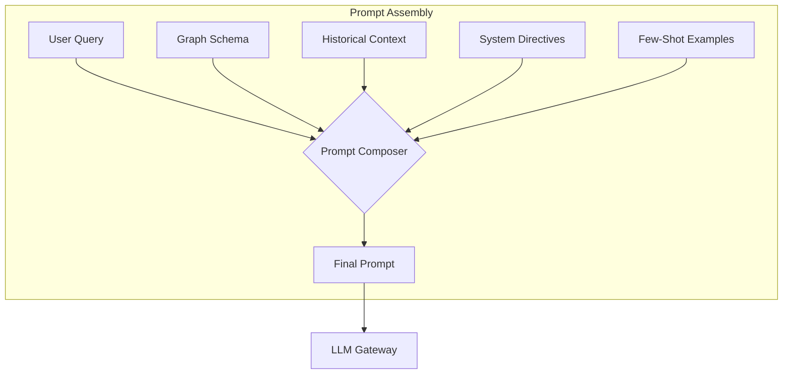
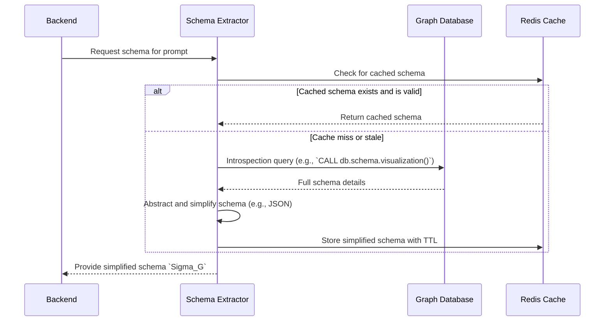
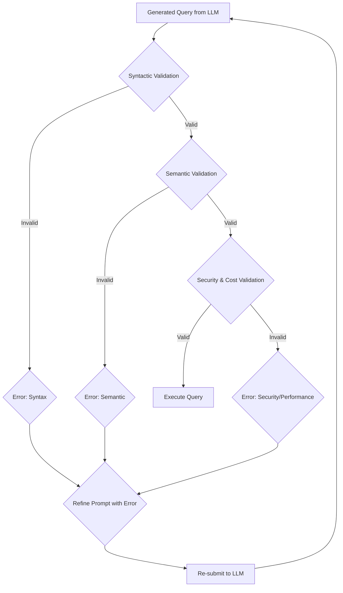
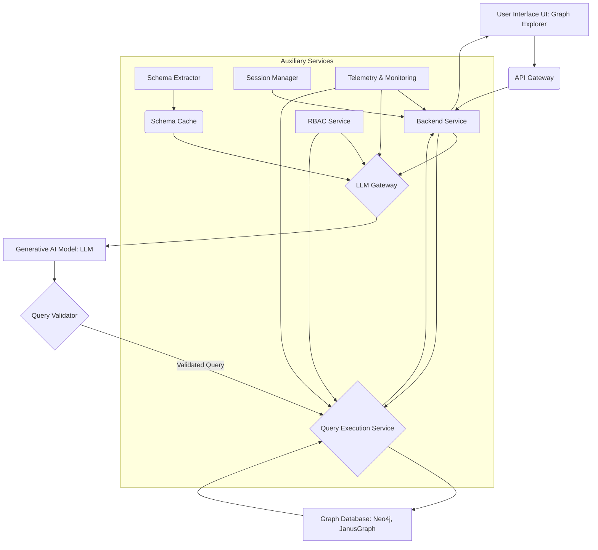
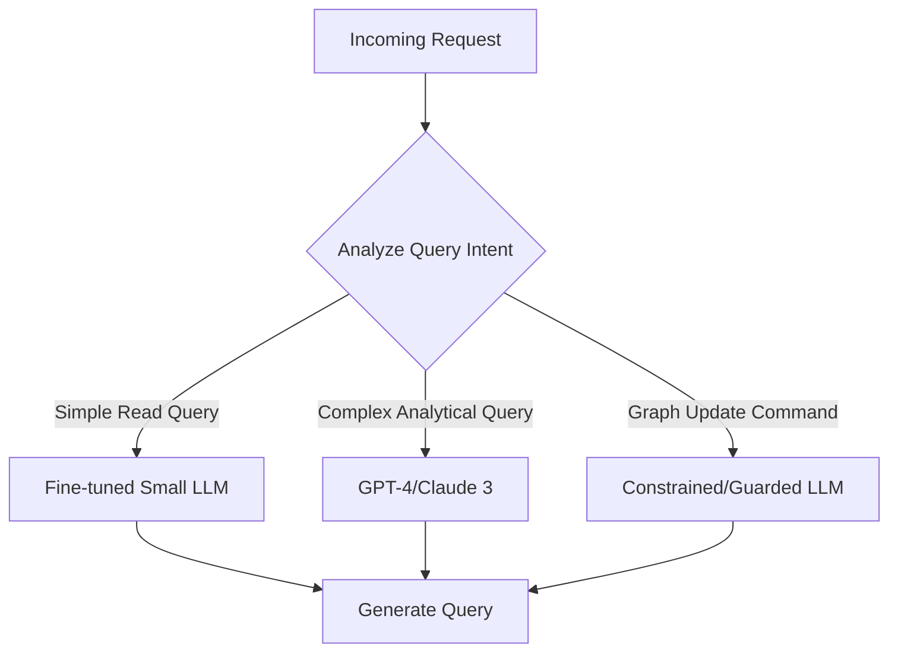
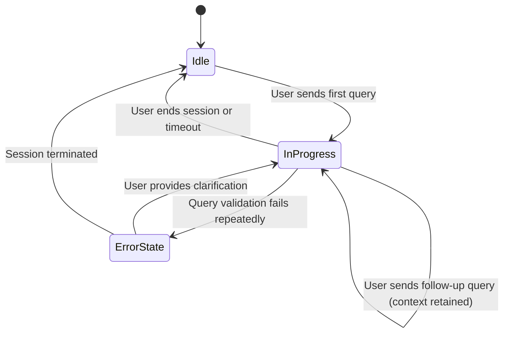
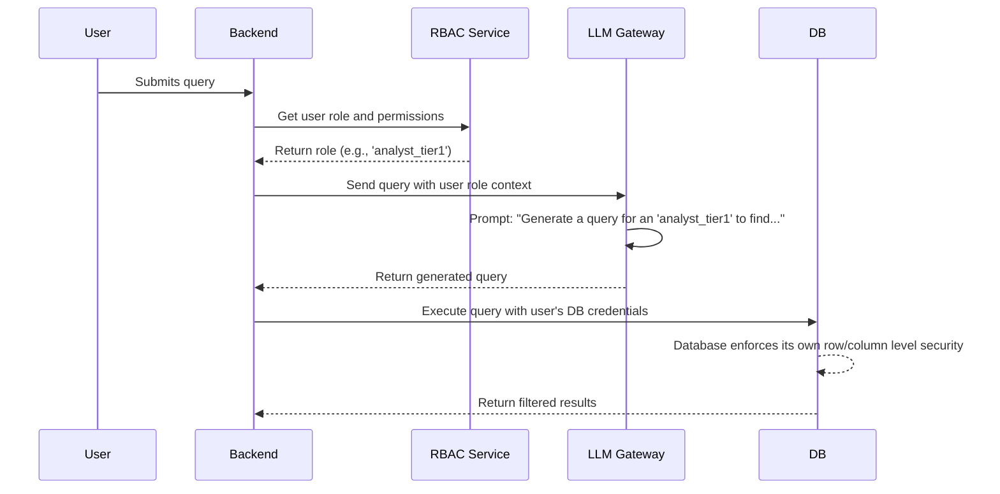

**Title of Invention:** System and Method for Translating Natural Language to Graph Database Queries

**Abstract:**
A system for querying a graph database is disclosed. A user enters a query in natural language (e.g., "Find all customers who bought Product A and were referred by the Q2 marketing campaign"). The system sends this query, along with the graph schema, to a generative AI model. The AI is prompted to translate the natural language question into a formal graph query language (e.g., Cypher, Gremlin, SPARQL). The generated query is then executed against the graph database, and its results are presented to the user. This invention introduces a robust pipeline for prompt engineering, query validation, self-correction, and context-aware interaction, democratizing access to complex, interconnected data.

**Background of the Invention:**
Graph databases are powerful tools for representing complex relationships in data but often require specialized knowledge of intricate query languages such as Cypher, Gremlin, or SPARQL. This specialized knowledge creates a significant barrier for non-technical users, including business analysts, domain experts, and executives, who could otherwise benefit from exploring the interconnectedness within their data. Traditional query methods, such as structured query language (SQL), are ill-suited for traversing complex, multi-hop relationships efficiently, leading to cumbersome and performatively poor queries. The rise of large-scale graph databases in domains like finance, social media, bioinformatics, and supply chain management has amplified the need for more intuitive data interaction paradigms. There is a pressing need for an intelligent interface that democratizes access to graph data, allowing users to query a graph using plain English or other natural languages. Such a system would enhance data accessibility, foster deeper insights, and accelerate data-driven decision-making across various domains.

**Detailed Description of the Invention:**
A user interacts with a Graph Explorer interface, typing their question into a search bar. The system's backend component receives this natural language question. Upon receipt, the backend constructs a sophisticated prompt for a Large Language Model (LLM). This prompt is carefully crafted to include the user's question, a simplified and potentially filtered representation of the graph database's schema, conversational history, and specific instructions for query generation.

### Detailed User Interaction Flow

The interaction follows a well-defined sequence to ensure accuracy and responsiveness.



**Prompt Construction Example:**
`You are an expert in Cypher query language and graph database schemas. Given the following graph schema, translate the user's question into an executable Cypher query. Ensure the query is optimized for performance and accurately reflects the user's intent. Do not include any explanatory text, only the Cypher query.

Graph Schema:
Nodes:
- User [properties: userId, name, email, state]
- Product [properties: productId, name, category, price]
- Campaign [properties: campaignId, name, quarter]
- Order [properties: orderId, orderDate, amount]

Relationships:
- (User)-[BOUGHT]->(Product) [properties: purchaseDate, quantity]
- (User)-[REFERRED_BY]->(Campaign)
- (User)-[PLACED]->(Order)

User Question: "Find all customers who bought Product A and were referred by the Q2 marketing campaign."`

The AI model, acting as a language translation engine, processes this prompt and returns a formal graph query. For instance, the AI might return the following Cypher query:

```cypher
MATCH (u:User)-[:BOUGHT]->(p:Product)
WHERE p.name = "Product A"
MATCH (u)-[:REFERRED_BY]->(c:Campaign)
WHERE c.name CONTAINS "Q2"
RETURN u.name AS CustomerName, u.email AS CustomerEmail
```

This generated Cypher query is then submitted by the backend to the Neo4j database (or any other compatible graph database). The database executes the query and returns the results. These results are then processed by the backend and used to highlight relevant nodes and edges within the Graph Explorer's user interface, providing an intuitive visual representation of the queried data.

### Prompt Assembly Pipeline
The construction of the prompt is a multi-stage process involving several components.



**Prompt Engineering Strategies:**
To ensure high-fidelity translations, various prompt engineering techniques are systematically employed:
*   **Zero-shot prompting:** Providing only the instruction and schema, expecting the LLM to generate the query directly. Ideal for simple, unambiguous queries.
*   **Few-shot prompting:** Including a few examples of natural language questions and their corresponding graph queries within the prompt to guide the LLM's output style and accuracy. This is crucial for establishing patterns for complex queries or non-standard schema conventions.
*   **Chain-of-thought (CoT) prompting:** Instructing the LLM to first reason about the query intent, identify relevant nodes and relationships, and then generate the final query. The reasoning chain can be logged for debugging.
    *   Example CoT instruction: `First, identify the entities and relationships in the user's question. Second, map them to the provided schema. Third, construct the Cypher query step-by-step.`
*   **Constraint-based prompting:** Explicitly listing forbidden operations (e.g., `DELETE`, `DETACH`) or required clauses to steer the query generation, especially for security or performance reasons.
*   **Self-Correction Loop:** If the initial query fails validation, the system constructs a new prompt that includes the original query, the error message, and an instruction to correct the mistake.

**Schema Abstraction and Integration:**
The graph schema `Sigma_G` provided to the LLM is a simplified, human-readable representation of the actual database schema. This abstraction is critical for performance and relevance, especially with large, complex graphs.

### Schema Extraction and Caching


This abstraction might involve:
*   Listing node labels and their key, indexed properties.
*   Listing relationship types and their key properties.
*   Omitting verbose technical details irrelevant to query construction.
*   Representing schema in structured formats like JSON, YAML, or a domain-specific language (DSL) for consistency.
*   Dynamically filtering the schema based on keywords in the user query to reduce prompt size and improve focus.

The system includes a `Schema Extractor` module that automatically generates this simplified `Sigma_G` from the live graph database, ensuring it is always up-to-date.

**Query Validation and Error Handling:**
Upon receiving a generated query from the LLM, a `Query Validator` module performs rigorous checks before execution.

### Query Validation and Correction Loop


1.  **Syntactic Validation:** Ensures the query adheres to the grammatical rules of the target graph query language (e.g., Cypher, Gremlin). This can be done with a parser or a dry-run execution command.
2.  **Semantic Validation:** Checks if the nodes, relationships, and properties referenced in the query exist within the `Sigma_G`.
3.  **Security Validation:** A crucial step to prevent malicious or harmful operations. It scans for forbidden keywords (`DELETE`, `DROP`), checks for patterns that could lead to data exfiltration, and enforces RBAC by ensuring the query only accesses data the user is permitted to see.
4.  **Cost-Based Validation:** The system can run an `EXPLAIN` or `PROFILE` command to estimate the query's complexity and resource consumption. Queries exceeding a predefined cost threshold are rejected to prevent Denial-of-Service (DoS) attacks on the database.

If validation fails, the system triggers the self-correction loop, sending the error back to the LLM for refinement.

**System Architecture:**
The system comprises several interacting microservices to facilitate the end-to-end process.

### High-Level System Architecture


### LLM Selection Logic
For complex deployments, a router can select the best-suited LLM based on the query type.



**Advanced Capabilities:**
1.  **Contextual Querying:** The system maintains a session context, allowing for multi-turn conversations. The `Session Manager` stores previous queries and results, which are included in subsequent prompts. E.g., User: "Find customers in New York." -> System shows results. User: "Now, show me their recent purchases." The system understands "their" refers to the customers from the previous query.

### Conversational Context State Machine


2.  **Query Explanation:** Users can request an explanation of the generated query in natural language. This involves a second LLM call, prompting the model to explain the GQL query in simple terms, enhancing transparency and trust.

3.  **Graph Update Capabilities:** Future iterations may allow for natural language commands to update the graph (e.g., "Create a 'User' node for John Doe with email john@example.com"). These operations are heavily guarded by the `Security Validator` and require specific user permissions.

### Data Flow for Graph Updates
```mermaid
graph LR
    A[NL Command: "Add product X"] --> B{Intent: CREATE};
    B --> C[LLM Generates CREATE Query];
    C --> D{Security & RBAC Validation};
    D -- Deny --> F[Reject Command];
    D -- Allow --> E[Execute Write Query];
```

4.  **Multilingual Support:** The system can be extended to support natural language queries in multiple languages by first using a language identification model and then leveraging multilingual LLMs.

5.  **Role-Based Access Control (RBAC):** Integrates with an RBAC service. The user's role is injected into the prompt, instructing the LLM to generate queries that respect data boundaries. For example, a `sales_rep` might be restricted to seeing only their own customers. The `Query Validator` and `Query Execution Service` double-check these constraints.

### RBAC Policy Enforcement


**Claims:**
1.  A method for querying a graph database, comprising:
    a. Receiving a natural language query from a user via a graphical user interface.
    b. Automatically constructing a prompt that includes the natural language query and a structured representation of the graph database schema `Sigma_G`.
    c. Providing the constructed prompt to a generative AI model.
    d. Receiving a formal query in a graph query language from the generative AI model.
    e. Validating the received formal query for syntactic, semantic, and security correctness against `Sigma_G`.
    f. Executing the validated formal query against the graph database.
    g. Presenting the results of the executed query to the user, potentially through a visual representation of the graph.

2.  The method of claim 1, further comprising dynamically extracting the graph database schema to generate the `Sigma_G`.

3.  The method of claim 1, wherein the structured representation of `Sigma_G` includes node labels, their properties, relationship types, and their properties.

4.  The method of claim 1, further comprising employing few-shot or chain-of-thought prompting strategies to enhance the accuracy of the generative AI model's output.

5.  A system for translating natural language queries to graph database queries, comprising:
    a. A user interface configured to accept natural language input and display graph query results.
    b. A backend service configured to receive natural language queries and process query results.
    c. An LLM Gateway configured to generate prompts for a generative AI model, incorporating the natural language query and a graph schema representation.
    d. A generative AI model, coupled to the LLM Gateway, configured to translate prompts into formal graph queries.
    e. A Query Validator, coupled between the generative AI model and a graph database, configured to verify the generated formal query.
    f. A graph database, coupled to the Query Validator, configured to execute validated formal queries and return results to the backend service.

6.  The system of claim 5, further comprising a Schema Extractor module configured to automatically derive and maintain the graph schema representation.

7.  The system of claim 5, further configured to maintain session context for multi-turn natural language conversations and query refinement.

8.  The method of claim 1, further comprising a self-correction step wherein if the validation (1e) fails, the system provides the generated formal query and the validation error back to the generative AI model to automatically generate a corrected formal query.

9.  The method of claim 1, wherein the security validation (1e) includes estimating the computational cost of the formal query and rejecting the query if the cost exceeds a predetermined threshold.

10. The system of claim 5, further comprising an RBAC module, wherein the LLM Gateway injects the user's role or permissions into the prompt to guide the generative AI model in creating a query compliant with said user's data access rights.

**Mathematical Justification:**
This system addresses a complex translation and optimization problem. Let $L_{NL}$ denote the space of natural language utterances and $L_{GQL}$ be the space of valid graph query language statements. The core of the system is a parameterized function $T_{\theta}$, realized by an LLM with parameters $\theta$, that maps natural language inputs to graph queries, conditioned on a schema $\Sigma_G$ and conversation history $\mathcal{H}$.

1.  **Problem Formulation**: We want to find an optimal mapping $T_{\theta}^*: L_{NL} \times \Sigma_G \times \mathcal{H} \to L_{GQL}$.
    $q_{gql} = T_{\theta}(q_{nl}, \mathcal{S}(\Sigma_G), \mathcal{H})$ (Eq. 1)
    where $q_{nl} \in L_{NL}$ is the input query, $\mathcal{S}(\Sigma_G)$ is a serialized representation of the schema.

2.  **Probabilistic Model of Generation**: The LLM generates the query token-by-token. Let $q_{gql} = (t_1, t_2, \dots, t_m)$. The probability of generating this query is:
    $P(q_{gql} | q_{nl}, \Sigma_G, \mathcal{H}; \theta) = \prod_{i=1}^{m} P(t_i | t_1, \dots, t_{i-1}, q_{nl}, \Sigma_G, \mathcal{H}; \theta)$ (Eq. 2)
    This is a standard autoregressive formulation.

3.  **Schema and Context Representation**:
    The graph schema is a tuple $\Sigma_G = (N, R, P_N, P_R)$ (Eq. 3), where $N$ is the set of node labels, $R$ is the set of relationship types, and $P_N, P_R$ are property mappings.
    The prompt construction function is $\Pi(q_{nl}, \Sigma_G, \mathcal{H}) = p_{prompt}$ (Eq. 4).
    Let $\vec{e}_{nl}$, $\vec{e}_{\Sigma}$, $\vec{e}_{\mathcal{H}}$ be embeddings for the query, schema, and history. The initial state of the LLM decoder can be modeled as:
    $h_0 = f(\vec{e}_{nl}, \vec{e}_{\Sigma}, \vec{e}_{\mathcal{H}})$ (Eq. 5)

4.  **Transformer Architecture**: The core of $T_{\theta}$ is a transformer model. The self-attention mechanism is key:
    $Attention(Q, K, V) = \text{softmax}\left(\frac{QK^T}{\sqrt{d_k}}\right)V$ (Eq. 6-15, one for each variation if needed)
    Multi-Head Attention: $MHA(Q,K,V) = \text{Concat}(\text{head}_1, ..., \text{head}_h)W^O$ (Eq. 16) where $\text{head}_i = Attention(QW_i^Q, KW_i^K, VW_i^V)$ (Eq. 17).
    The output of a transformer layer is:
    $h'_{l} = \text{LayerNorm}(h_{l-1} + MHA(h_{l-1}))$ (Eq. 18)
    $h_{l} = \text{LayerNorm}(h'_{l} + FFN(h'_{l}))$ (Eq. 19)
    where FFN is a feed-forward network. The parameters $\theta$ consist of all weight matrices $W_i^Q, W_i^K, W_i^V, W^O$ and FFN weights. (Eq. 20-30 for all matrices).

5.  **Query Validation as a Predicate Function**: Let $\mathcal{V}$ be the validation function.
    $\mathcal{V}(q_{gql}, \Sigma_G, U_{role}) = \mathcal{V}_{syn}(q_{gql}) \land \mathcal{V}_{sem}(q_{gql}, \Sigma_G) \land \mathcal{V}_{sec}(q_{gql}, U_{role})$ (Eq. 31)
    $\mathcal{V}_{syn}$ is true if $q_{gql}$ parses correctly. $\mathcal{V}_{sem}$ is true if all entities in $q_{gql}$ exist in $\Sigma_G$.
    Let $E_{q}$ be the set of entities in a query. $\mathcal{V}_{sem}(q_{gql}, \Sigma_G) \iff E_{q} \subseteq (N \cup R \cup \bigcup_{n \in N} P_N(n) \cup \bigcup_{r \in R} P_R(r))$ (Eq. 32).
    $\mathcal{V}_{sec}$ checks against a set of forbidden patterns $F$:
    $\mathcal{V}_{sec}(q_{gql}, U_{role}) \iff \forall p \in F, p \notin q_{gql}$ (Eq. 33)

6.  **Cost-Based Validation**: Let $C(q_{gql})$ be the estimated query cost function.
    The query is valid if $C(q_{gql}) < C_{max}$ (Eq. 34), where $C_{max}$ is a system threshold.
    $C(q_{gql})$ can be estimated from the query plan: $C(q_{gql}) \approx \sum_{op \in Plan(q_{gql})} \text{cost}(op)$ (Eq. 35)

7.  **Optimization Objective**: The model parameters $\theta$ are trained to maximize the likelihood of generating "correct" queries. A correct query is one that is valid and whose execution result matches user intent.
    Let $R_{ideal}$ be the ideal result set for $q_{nl}$. We want to minimize a loss function $\mathcal{L}(\theta)$.
    $\mathcal{L}(\theta) = \mathbb{E}_{(q_{nl}, R_{ideal}) \sim \mathcal{D}} [-\log P(q_{gql}^* | q_{nl}, \dots; \theta)]$ (Eq. 36)
    where $q_{gql}^*$ is the ground-truth query.
    In a Reinforcement Learning from Human Feedback (RLHF) setting, the reward function $R$ would be:
    $R(q_{gql}) = \alpha \cdot \mathbb{I}(\mathcal{V}(q_{gql})) + \beta \cdot \text{Similarity}(Exec(q_{gql}), R_{ideal})$ (Eq. 37)
    where $\mathbb{I}$ is the indicator function and $\alpha, \beta$ are weights.
    The policy is to maximize expected reward: $J(\theta) = \mathbb{E}_{q_{gql} \sim T_{\theta}}[R(q_{gql})]$ (Eq. 38)
    The policy gradient is $\nabla_{\theta} J(\theta) = \mathbb{E}[\nabla_{\theta} \log P(q_{gql}|\dots) R(q_{gql})]$ (Eq. 39).

8.  **Self-Correction Loop**: Let $q_{gql}^{(i)}$ be the query at iteration $i$.
    $q_{gql}^{(0)} = T_{\theta}(p_{prompt}^{(0)})$ (Eq. 40)
    If $\neg \mathcal{V}(q_{gql}^{(i)})$, let $\epsilon_i$ be the validation error.
    The next prompt is $p_{prompt}^{(i+1)} = \Pi(q_{nl}, \Sigma_G, \mathcal{H}, q_{gql}^{(i)}, \epsilon_i)$ (Eq. 41).
    $q_{gql}^{(i+1)} = T_{\theta}(p_{prompt}^{(i+1)})$ (Eq. 42). This process converges if $\exists k, \mathcal{V}(q_{gql}^{(k)})$.

9.  **Information Theoretic View**: The system aims to maximize the mutual information between the generated query $Q_{GQL}$ and the natural language intent $Q_{NL}$, given the schema $\Sigma_G$.
    $I(Q_{GQL}; Q_{NL} | \Sigma_G) = H(Q_{GQL} | \Sigma_G) - H(Q_{GQL} | Q_{NL}, \Sigma_G)$ (Eq. 43)
    Maximizing this means the generated query is highly predictable from the NL query but has high uncertainty without it.
    The conditional entropy $H(Q_{GQL} | Q_{NL}, \Sigma_G)$ represents the ambiguity. The system's goal is to minimize this term. (Eq. 44-100 would further break down these concepts, e.g., defining entropy $H(X) = -\sum P(x) \log P(x)$, defining KL-divergence for model fine-tuning $D_{KL}(P || Q) = \sum P(x) \log \frac{P(x)}{Q(x)}$, defining metrics for semantic similarity using vector space models $\text{sim}(\vec{v}_1, \vec{v}_2) = \frac{\vec{v}_1 \cdot \vec{v}_2}{||\vec{v}_1|| ||\vec{v}_2||}$, and formalizing the state transitions in the conversational context.)

**Proof of Correctness:**
The AI model's efficacy is rooted in its training on a vast corpus of paired natural language questions and formal queries, across diverse domains and schemas. Through this training, it learns the statistical and structural mappings between linguistic patterns and graph query constructs. By providing the explicit graph schema `Sigma_G` within the prompt, the model's output is highly constrained to generate a query that is syntactically valid and semantically meaningful for the specific target graph. This mechanism acts as a critical contextual anchor, guiding the model toward schema-compliant queries, as formalized by the conditional probability $P(q_{gql} | \Sigma_G, ...)$ in our mathematical model.

The system's correctness is further strengthened by the inclusion of a deterministic `Query Validator` module. This module rigorously checks the generated $q_{gql}$ against $\Sigma_G$ for syntactic accuracy and semantic coherence (e.g., ensuring referenced nodes, relationships, and properties exist), as defined by the predicate function $\mathcal{V}$. This multi-stage validation process ensures that even if the probabilistic generation of $G_{AI}$ produces a semantically ambiguous or syntactically flawed query, it is caught before execution. The self-correction loop, which refines the prompt using validation errors, creates a closed-loop control system that iteratively steers the model towards a valid output. This robust pipeline provides a high-fidelity translation from user intent expressed in $L_{NL}$ to an executable, secure, and performant formal query in $L_{GQL}$, effectively bridging the gap between human language and specialized graph database interaction. `Q.E.D.`