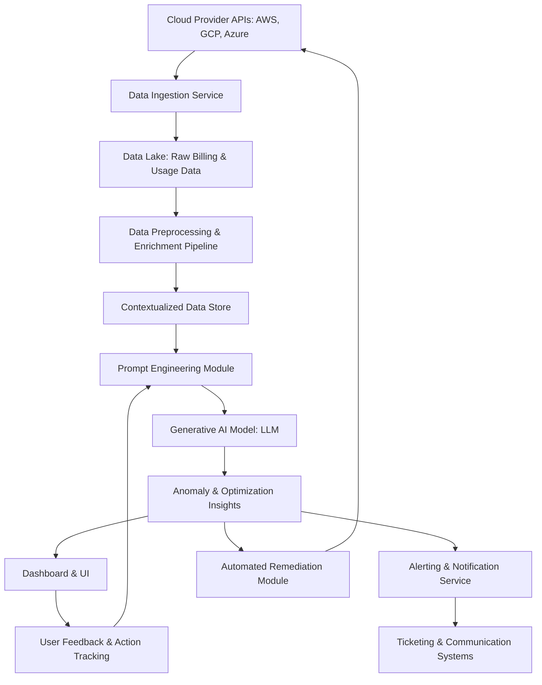

**Title of Invention:** System and Method for Automated Cloud Cost Anomaly Detection and Optimization

**Abstract:**
A system for managing cloud computing costs is disclosed. The system ingests detailed billing and usage data from a cloud provider. A generative AI model analyzes this data to identify cost anomalies (e.g., sudden spikes in spending) and opportunities for optimization (e.g., identifying unused resources, suggesting more cost-effective instance types). The AI provides a plain-English summary of each finding, along with an estimated financial impact, allowing engineers to quickly address unnecessary cloud spend.

**Background of the Invention:**
Cloud billing is notoriously complex. Identifying the root cause of a cost spike or finding opportunities to save money often requires deep expertise and hours of manual analysis of billing reports. There is a need for an intelligent system that can automate this analysis and present clear, actionable cost-saving recommendations.

**Detailed Description of the Invention:**
The invention provides a comprehensive system for cloud cost optimization. A daily scheduled job fetches the previous day's detailed billing report from multiple cloud providers (AWS, GCP, Azure). This raw data, often in CSV or JSON format, is first ingested into a data lake.

Subsequently, a data preprocessing pipeline cleans, normalizes, and enriches this data, correlating it with infrastructure metadata (e.g., tags, resource configurations, operational logs). This enriched dataset provides essential context for the generative AI model.

A sophisticated prompt is constructed for a Large Language Model (LLM), serving as the core of the generative AI. The prompt explicitly defines the LLM's persona as a "FinOps expert" and includes the contextualized billing and usage data. For instance:
```
You are a FinOps expert. Analyze the provided cloud billing and usage data for the past 24 hours.
Identify the top 3 most significant cost anomalies or savings opportunities across all linked accounts and services.
For each finding, provide:
1. A concise description of the anomaly or opportunity.
2. The likely root cause.
3. A clear, actionable remediation step.
4. An estimated financial impact (e.g., "Potential savings: $X per month").
Prioritize findings with the highest financial impact and clear remediation paths.
Data: [JSON or Structured Text billing and usage data, including resource tags and metadata].
```
The AI's response, a list of formatted insights, is then displayed on the Cloud module's main dashboard. This output is further processed to categorize findings, prioritize them based on estimated impact, and route them to relevant engineering or finance teams via integrations with ticketing systems (e.g., Jira, ServiceNow) or communication platforms (e.g., Slack, Microsoft Teams).

The system also incorporates a feedback mechanism where users can rate the helpfulness and accuracy of the AI's recommendations. This feedback is used to continuously refine the prompt engineering and, in advanced iterations, to fine-tune the generative AI model itself, improving its accuracy and relevance over time.

**System Architecture:**



**Data Ingestion, Preprocessing, and Feature Engineering:**
The system is designed to handle diverse cloud billing data.
*   **Ingestion:** Connectors for AWS Cost and Usage Reports (CUR), Google Cloud Billing Export to BigQuery, and Azure Cost Management exports are utilized. Data is streamed in near real-time or via daily batch processes.
*   **Preprocessing:**
    *   **Normalization:** Unifying different cloud provider schemas into a common data model.
    *   **Aggregation:** Summarizing costs by resource, service, account, region, and custom tags.
    *   **Deduplication & Cleaning:** Removing redundant entries and correcting malformed data.
*   **Feature Engineering:**
    *   **Cost Metrics:** Calculating cost per hour, per GB, per vCPU, etc.
    *   **Usage Metrics:** Tracking resource uptime, data transfer, API calls.
    *   **Metadata Integration:** Incorporating resource tags, project IDs, owner information, and environment labels from Configuration Management Databases (CMDBs) or cloud APIs.
    *   **Historical Baselines:** Establishing expected cost ranges and usage patterns based on past data.

**Generative AI Model: Core Capabilities:**
The central Generative AI Model orchestrates several intelligent capabilities:
1.  **Anomaly Detection `AD_Model`:** Identifies significant deviations from established cost baselines or predicted trends. This can involve statistical methods (e.g., Z-score, ARIMA), machine learning algorithms (e.g., Isolation Forest, SVM), or neural networks for time-series forecasting.
2.  **Root Cause Analysis `RCA_Model`:** Using the enriched contextual data, the AI traces detected anomalies back to their likely triggers. This might include new resource deployments, increased traffic, misconfigurations, or changes in pricing models. The LLM's natural language understanding and generation capabilities are crucial here.
3.  **Optimization Recommendation `OPT_Model`:** Beyond anomalies, the AI proactively identifies opportunities for cost reduction. Examples include:
    *   Right-sizing compute instances.
    *   Identifying idle or underutilized resources (e.g., forgotten EBS volumes, unattached IPs).
    *   Recommending reserved instances or savings plans.
    *   Suggesting alternative, more cost-effective services.
    *   Optimizing data transfer costs.
4.  **Explanation Generation `EXPLAIN_Model`:** Translates complex data analysis into clear, concise, and actionable plain-English explanations. This component focuses on user comprehension and providing all necessary details for an engineer to take action without further manual investigation.
5.  **Model Fine-tuning:** The base LLM is continually fine-tuned using FinOps-specific datasets, including anonymized billing data, expert-curated anomaly explanations, and validated optimization recommendations. This process ensures the model's responses are accurate, relevant, and aligned with industry best practices.

**User Interface and Actionable Insights:**
The user interface provides a centralized dashboard for FinOps teams and engineers:
*   **Prioritized Insights:** A list of detected anomalies and optimization opportunities, ranked by estimated financial impact.
*   **Detailed Views:** Each insight includes the AI-generated explanation, root cause, remediation steps, and relevant contextual data (e.g., affected resource IDs, service, account, time of anomaly).
*   **Interactive Tools:** Users can directly acknowledge, dismiss, or initiate remediation actions from the dashboard.
*   **Alerting:** Critical anomalies trigger real-time alerts via email, Slack, PagerDuty, or other notification channels, ensuring immediate attention.
*   **Reporting:** Customizable reports on cost trends, savings realized, and adherence to FinOps best practices.

**Feedback Loop and Continuous Learning:**
The system incorporates a robust feedback and continuous learning mechanism:
*   **User Feedback:** Users provide explicit feedback on the quality, accuracy, and actionability of AI recommendations. This feedback is captured and used as training data.
*   **Impact Tracking:** When a recommendation is actioned, the system tracks the actual financial impact over time. This data validates the AI's estimations and identifies successful optimization patterns.
*   **Model Retraining and Refinement:** Periodically, the Generative AI model is retrained or fine-tuned using the accumulated feedback and impact data. This iterative process ensures the model adapts to evolving cloud services, pricing changes, and organizational spending patterns, leading to continuously improving accuracy and value.

**Claims:**
1. A method for cloud cost management, comprising:
   a. Ingesting diverse billing and usage data from multiple cloud providers.
   b. Preprocessing and enriching the ingested data with contextual metadata.
   c. Transmitting the enriched data to a generative AI model.
   d. Prompting the generative AI model to identify cost anomalies, their root causes, and optimization opportunities.
   e. Displaying the model's findings, including estimated financial impact and actionable remediation steps, to a user.
   f. Capturing user feedback on the model's findings to refine subsequent analysis.
2. The method of claim 1, wherein the generative AI model is a Large Language Model (LLM) fine-tuned on FinOps-specific datasets.
3. The method of claim 1, further comprising integrating the model's findings with ticketing and communication systems for automated workflow management.
4. The method of claim 1, further comprising an automated remediation module capable of executing recommended optimization actions via cloud provider APIs.
5. A system for cloud cost management, comprising:
   a. A data ingestion service configured to collect billing and usage data from multiple cloud platforms.
   b. A data preprocessing pipeline for normalizing and enriching the collected data.
   c. A prompt engineering module for constructing contextualized inputs for a generative AI model.
   d. A generative AI model, configured to analyze the inputs and generate insights on cost anomalies and optimization opportunities.
   e. A user interface and alerting service for presenting the generated insights and notifying stakeholders.
   f. A feedback and action tracking module for continuous model improvement.

**Mathematical Justification:**
Let `C(t)` be the total cloud cost at time `t`. Let `C(t)` be a vector of costs broken down by service `c_i`.
The system learns a predictive model `M` for the expected cost `E[C(t+1) | C(t), ..., C(0)]`.
An anomaly is detected if the actual cost `C_actual(t+1)` deviates significantly from the prediction. This deviation can be quantified as:
```
|C_actual(t+1) - E[C(t+1)]| > k * sigma
```
where `sigma` is the standard deviation of the prediction error over a historical window, and `k` is a sensitivity threshold.

The AI model `G_AI` is a complex function that processes a comprehensive set of inputs to provide actionable insights. Its operation can be described as:
```
G_AI : (C_history, U_history, M_current, P_pricing) -> (Anomaly_Flag, Root_Cause, Optimization_Recommendation, Financial_Impact)
```
where `C_history` represents historical cost vectors, `U_history` denotes historical usage patterns, `M_current` includes current metadata and configuration details, and `P_pricing` refers to current cloud pricing models.

The generative AI model `G_AI` thus serves multiple roles: it approximates `M` for anomaly detection, and upon detection, it provides a causal explanation (`Root_Cause`) and offers actionable advice (`Optimization_Recommendation`). The function is not merely a detector but a holistic FinOps expert simulator.

**Proof of Utility:**
Manual anomaly detection requires a human to visually inspect `C(t)` and mentally compare it to their own implicit model of expected costs. This process is time-consuming, prone to human error, and often lacks the depth of analysis required to identify root causes and specific remediation steps. The AI system automates this detection with a formal, data-driven model `M` and further provides a detailed root cause analysis `Root_Cause` and specific `Optimization_Recommendation`. The system is proven useful as it significantly reduces the time-to-detection and time-to-remediation for costly anomalies, leading to substantial financial savings and improved operational efficiency. `Q.E.D.`