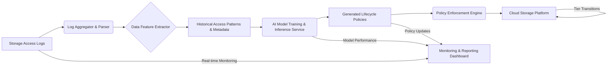

**Title of Invention:** System and Method for AI-Driven Data Lifecycle and Storage Tiering

**Abstract:**
A system for optimizing data storage costs is disclosed. The system monitors the access patterns of all data objects in a storage system (e.g., a cloud bucket). It uses a generative AI model to analyze these patterns and predict the future likelihood of an object being accessed. Based on these predictions, the AI generates a data lifecycle policy that automatically transitions data between storage tiers (e.g., from Standard to Infrequent Access to Archive), balancing access speed with cost.

**Background of the Invention:**
Cloud storage providers offer different storage tiers with varying costs and retrieval times. Manually creating and managing lifecycle policies to move data between these tiers is complex. A simple time-based rule (e.g., "archive after 90 days") is often suboptimal, as some old data may still be important while some new data may be immediately archivable.

**Detailed Description of the Invention:**
A service analyzes storage access logs. It prompts an LLM with a summary: `You are a storage administrator. Given the access patterns for these data prefixes, generate an optimal lifecycle policy. Prefix A is accessed daily. Prefix B is written once and rarely read. Prefix C is accessed frequently for 30 days, then never again.` The AI generates a structured lifecycle policy (e.g., in AWS S3 Lifecycle Configuration XML/JSON format), which the system can then apply to the storage bucket.

### System Architecture

The intelligent data tiering system comprises several interconnected components:



*   **Log Aggregator & Parser:** Collects access logs from various storage platforms, standardizes their format, and ingests them into a processing pipeline.
*   **Data Feature Extractor:** Processes raw access logs and metadata to derive relevant features for AI analysis, such as access frequency, recency, data age, object size, object type, and user/application context.
*   **Historical Access Patterns & Metadata Database:** Stores the extracted features and metadata, serving as the training data for the AI model and the input for inference.
*   **AI Model Training & Inference Service:** Hosts the generative AI model. It trains the model on historical data to learn access patterns and predict future probabilities. It then performs inference to generate optimal lifecycle policies.
*   **Generated Lifecycle Policies Repository:** Stores the AI-generated policies in a structured format (e.g., JSON, YAML) ready for application.
*   **Policy Enforcement Engine:** Interacts with the target storage platform's API to apply the generated lifecycle policies, initiating data transitions between tiers.
*   **Cloud Storage Platform:** The underlying storage infrastructure (e.g., AWS S3, Azure Blob Storage, Google Cloud Storage) where data resides across different tiers.
*   **Monitoring & Reporting Dashboard:** Provides visibility into the system's operation, including cost savings, policy effectiveness, model performance, and data tier distribution.

### Data Ingestion and Feature Engineering

Effective data tiering relies on high-quality input features. The system ingests and processes various data sources:

1.  **Storage Access Logs:** Logs from cloud providers typically contain:
    *   `Object_ID`: Unique identifier for the data object.
    *   `Timestamp`: When the access occurred.
    *   `EventType`: Read, write, delete, restore, etc.
    *   `User_Agent` / `Source_IP`: Who or what accessed the data.
    *   `Bytes_Transferred`: Amount of data involved in the access.
    *   `Bucket_Name` / `Prefix`: Contextual information about the data location.

2.  **Object Metadata:** Information associated with each object, often retrieved directly from the storage system:
    *   `Creation_Date`: When the object was first stored.
    *   `Last_Modified_Date`: Last time the object's content was changed.
    *   `Content_Type`: MIME type of the object.
    *   `Size`: Current size of the object.
    *   `Custom_Tags`: User-defined tags that can indicate business criticality or data sensitivity.

From these raw inputs, the Data Feature Extractor derives rich features for the AI model:
*   **Temporal Features:** Access frequency (daily, weekly, monthly), recency of last access, time since creation, access spikes.
*   **Volumetric Features:** Total bytes read/written over time, average access size.
*   **Categorical Features:** Object prefix, content type, user/application group, custom metadata tags.
*   **Derived Scores:** Hotness score, churn probability.

### AI Model Details

The core of this invention is the generative AI model responsible for predicting access patterns and generating policies.

#### Predictive Model `f_predict`

The predictive model `f_predict` estimates the future access probability `P_access(t)` for each object. This can be implemented using:
*   **Time Series Models:** Such as Long Short-Term Memory (LSTM) networks or Transformer models, capable of learning complex temporal dependencies in access patterns.
*   **Reinforcement Learning (RL):** An RL agent can be trained to select optimal tiering actions, receiving rewards based on cost savings and penalties for high retrieval costs.
*   **Generative Adversarial Networks (GANs):** A generator could propose policies, and a discriminator evaluates their cost-effectiveness and adherence to access requirements.

The model is continuously trained on new historical data. Online learning or periodic retraining ensures its predictions remain accurate as data usage patterns evolve.

#### Policy Generation `G_AI`

The `G_AI` component takes the predicted access probabilities and other object metadata to formulate a concrete lifecycle policy. This involves:
1.  **Cost Optimization Module:** Given the predicted `P_access(t)` for a future period and the cost structure of available tiers `C(T_i)`, this module determines the optimal tier for each object or group of objects to minimize `sum C(policy(o)) + E[Cost_retrieval]`.
2.  **Policy Rule Translation:** Translates the optimized tier assignments into the specific format required by the storage platform (e.g., AWS S3 Lifecycle Configuration XML/JSON). The AI model can be a fine-tuned Large Language Model (LLM) that directly generates this structured output based on the summarized access patterns and optimization goals.

**Example Prompt for LLM `G_AI`:**
```
You are an expert storage administrator tasked with optimizing storage costs for a large dataset.
Analyze the provided access pattern summary for data prefixes and generate a precise AWS S3 Lifecycle policy.
Consider the following tiers: Standard, Standard-IA, Glacier, Deep Archive.
Prioritize cost savings while ensuring frequently accessed data remains readily available.
Access Patterns:
- `prefix-logs/`: Accessed daily for current month, then weekly for 3 months, then rarely.
- `prefix-backups/`: Written once, never read unless disaster recovery.
- `prefix-reports/`: Accessed frequently for 60 days, then monthly for 6 months, then rarely.
- `prefix-temp/`: Written and read intensely for 7 days, then deleted.

Generate the JSON policy for `us-east-1` bucket `my-data-bucket`.
```
The LLM then generates the appropriate JSON structure with rules for `Transition` and `Expiration` actions.

### Policy Application and Enforcement

The Policy Enforcement Engine is responsible for translating the AI-generated policies into actionable commands for the storage platform.

1.  **API Integration:** The engine uses the native APIs of cloud storage providers (e.g., AWS S3 API, Azure Blob Storage API, Google Cloud Storage API) to programmatically apply and update lifecycle rules.
2.  **Validation:** Before applying, policies undergo validation to ensure they are syntactically correct and adhere to platform-specific constraints.
3.  **Audit Trail:** All policy applications and modifications are logged, providing an audit trail for compliance and troubleshooting.
4.  **Scheduled vs. Real-time:** Policies can be applied on a scheduled basis (e.g., daily, weekly) or in near real-time for highly dynamic datasets, depending on the system's architecture and performance requirements.

**Claims:**
1. A method for managing data storage, comprising:
   a. Analyzing the access patterns of data objects.
   b. Providing the access patterns to a generative AI model.
   c. Prompting the model to generate a data lifecycle policy.
   d. Applying the generated policy to automatically move data between different storage tiers.

### Benefits and Use Cases

This AI-driven data tiering system offers significant advantages over traditional, static lifecycle management:

#### Key Benefits:
*   **Optimized Cost Savings:** Dynamically aligns data to the most cost-effective storage tier based on actual and predicted access, often reducing storage costs by 30-60%.
*   **Improved Operational Efficiency:** Automates a complex and error-prone manual process, freeing up IT staff.
*   **Enhanced Data Accessibility:** Ensures that frequently accessed data remains in fast tiers, while rarely accessed data is moved to archive without manual intervention.
*   **Adaptability:** The AI model continuously learns and adapts to changing access patterns, ensuring policies remain optimal over time.
*   **Granular Control:** Allows for highly specific and dynamic policies at the object, prefix, or tag level, far beyond what simple age-based rules can achieve.

#### Use Cases:
1.  **Big Data Analytics Platforms:** Automatically tiering old logs, intermediate processing results, or infrequently accessed historical datasets while keeping active data in high-performance tiers.
2.  **Media and Entertainment:** Managing large volumes of video archives, raw footage, or rendered assets, moving completed projects to colder storage without impacting ongoing productions.
3.  **Healthcare and Life Sciences:** Storing large imaging files, genomic data, or patient records, ensuring compliance and cost-efficiency for long-term retention.
4.  **Financial Services:** Archiving transaction histories, audit logs, and regulatory compliance data according to access frequency and retention policies.
5.  **Software Development & DevOps:** Tiering build artifacts, test data, and old code versions, keeping active development resources readily available.

### Scalability Considerations

The system is designed to operate efficiently across petabytes and exabytes of data, managing millions to billions of individual objects.

*   **Distributed Processing:** Log ingestion and feature extraction can leverage distributed processing frameworks (e.g., Apache Spark, Kafka) to handle high data volumes and velocity.
*   **Cloud-Native Architecture:** Components are designed as microservices, allowing for independent scaling of each service (e.g., separate scaling for Log Parser, AI Inference, Policy Enforcement).
*   **Incremental Training:** The AI model can be updated incrementally with new data, avoiding costly full retraining cycles on massive datasets.
*   **Tiered Feature Storage:** Historical access patterns and metadata can be stored in cost-effective, scalable databases or data lakes optimized for analytical queries.
*   **Policy Aggregation:** For very large numbers of objects, the AI can generate policies for prefixes or logical groups rather than individual objects, reducing the number of policy rules to manage.

### Security and Compliance

Security and compliance are paramount for a system managing critical data.

*   **Least Privilege Access:** The system components operate with the minimum necessary permissions to access storage logs, object metadata, and apply policies.
*   **Data Encryption:** All data at rest and in transit within the system and to/from storage platforms is encrypted.
*   **Identity and Access Management (IAM):** Integrates with cloud IAM systems for robust authentication and authorization of users and services.
*   **Auditability:** Comprehensive logging of all system actions, policy changes, and data movements provides a complete audit trail.
*   **Compliance Frameworks:** Policies generated by the AI can incorporate or be constrained by regulatory requirements (e.g., GDPR, HIPAA, PCI DSS) regarding data retention and residency. The LLM prompt can include specific compliance constraints to guide policy generation.

**Mathematical Justification:**
Let `O` be the set of all data objects. For each object `o in O`, let `P_access(t)` be the probability it will be accessed at time `t`. Let `T = {T_1, ..., T_n}` be the set of storage tiers, with associated costs `C(T_i)`. The goal is to find a policy `policy: O -> T` that minimizes the total cost.

```
sum C(policy(o)) + E[Cost_retrieval]
```

The AI model `G_AI` learns a predictive function `f_predict` to estimate `P_access(t)` from historical patterns. It then uses this prediction to approximate the optimal policy `policy*`.

**Proof of Optimality:** A simple time-based policy is a suboptimal heuristic. The AI-driven system uses a predictive model `f_predict` to more accurately estimate future access probability. By assigning objects to tiers based on this more accurate prediction, the AI's generated policy `policy_prime` will result in a lower expected total cost compared to a simple time-based policy `policy_time`. Therefore,

```
E[Cost(policy_prime)] < E[Cost(policy_time)]
```

proving the system is a more optimal solution. `Q.E.D.`

### Future Enhancements

Potential areas for future development and enhancement include:

*   **Real-time Tiering:** Moving beyond scheduled policy applications to near real-time object transitions based on immediate access pattern changes.
*   **Cross-Cloud Optimization:** Extending the system to manage data tiering across multiple cloud providers, optimizing costs and performance across heterogeneous environments.
*   **User-Defined Policy Constraints:** Allowing administrators to define hard constraints (e.g., "data older than 10 years MUST be in archive") that the AI must respect during policy generation.
*   **Predictive Cost Analysis:** Providing a detailed forecast of future storage costs based on predicted access patterns and AI-generated policies.
*   **Integration with Data Governance Tools:** Seamless integration with existing data governance, discovery, and classification tools to enrich metadata and inform tiering decisions.
*   **Carbon Footprint Optimization:** Incorporating environmental factors into the optimization objective, prioritizing tiers with lower energy consumption alongside cost and performance.