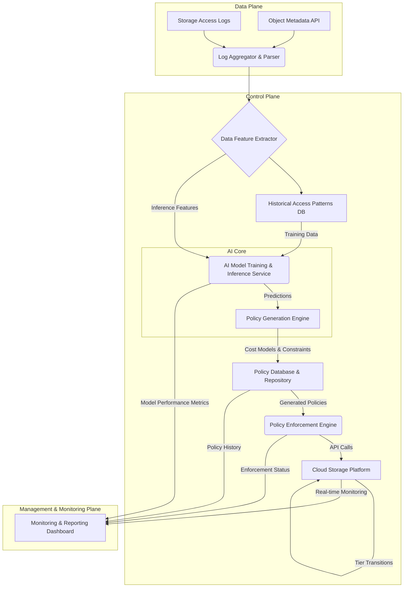
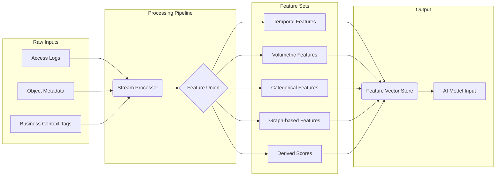
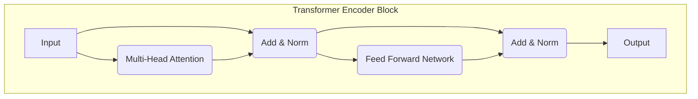
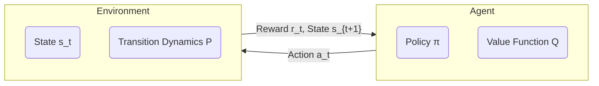
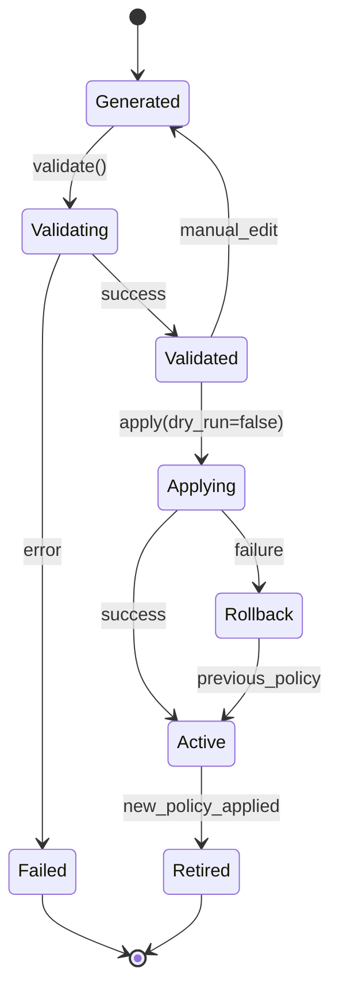
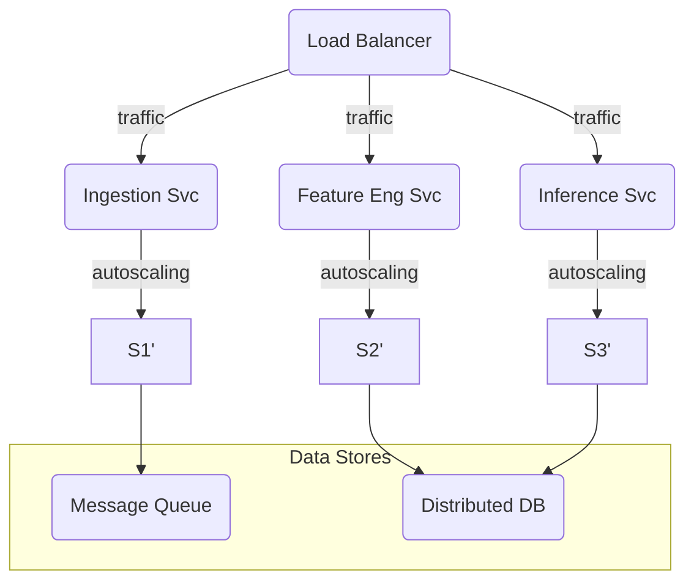

**Title of Invention:** System and Method for AI-Driven Data Lifecycle and Storage Tiering

**Abstract:**
A system and method for hyper-optimizing data storage costs and lifecycle management are disclosed. The system ingests and processes high-velocity storage access logs and object metadata to engineer a rich feature set describing data usage. It employs a generative AI model, potentially a hybrid architecture comprising time-series forecasting models (like Transformers or LSTMs) and a large language model (LLM), to analyze these patterns and predict the future access probability distribution for individual data objects or object groups. Based on these fine-grained predictions, the AI generates a multi-objective optimal data lifecycle policy that automatically and dynamically transitions data between a spectrum of storage tiers (e.g., from Hot/Premium to Standard to Infrequent Access to various Archive tiers), balancing access latency, retrieval costs, storage costs, and even carbon footprint. The generated policies are translated into platform-specific configurations (e.g., AWS S3 Lifecycle JSON) and applied via an auditable enforcement engine, creating a continuous, self-adapting optimization loop.

**Background of the Invention:**
Cloud storage providers offer a diverse portfolio of storage tiers, each with a unique cost, performance, and availability profile. Manually creating and managing lifecycle policies to orchestrate data movement between these tiers is an intractable problem at scale. Traditional, static, time-based rules (e.g., "archive all objects after 90 days") are notoriously suboptimal. Such heuristics fail to capture the nuanced access patterns of modern data; for instance, some year-old data may suddenly become "hot" due to a new analytics query, while some newly ingested data (e.g., a redundant backup) might be immediately archivable. This invention addresses the inefficiency of manual and rule-based systems by introducing an intelligent, predictive, and automated solution that adapts to the dynamic nature of data utility.

**Detailed Description of the Invention:**
A comprehensive service continuously analyzes storage access logs and object metadata. It prompts a sophisticated generative AI model with a rich, quantitative summary of data access patterns. For example: `You are a cloud financial operations (FinOps) expert. Given the following probabilistic access forecasts and object metadata, generate an optimal AWS S3 lifecycle policy. The objective is to minimize total cost (storage + retrieval + transition) over the next 365 days. Prefix 'A' has a predicted daily access probability of P(access|t) = 0.8 * e^(-0.1t) for the next 30 days. Prefix 'B' is written once, with P(access|t) < 1e-6 for all t > 0. Prefix 'C' exhibits seasonal access spikes, modeled by P(access|t) = 0.5 * sin(2*pi*t/90) + 0.1.` The AI, having been trained on cloud cost models and policy syntax, generates a precise, structured lifecycle policy (e.g., in AWS S3 Lifecycle Configuration JSON format), which the system validates and applies to the target storage bucket.

### System Architecture

The intelligent data tiering system comprises several interconnected, scalable microservices designed for robust, real-time operation.



*   **Log Aggregator & Parser:** Collects access logs (e.g., S3 Server Access Logs, CloudTrail Data Events) and metadata from various storage platforms, standardizes their format into a canonical model, and ingests them into a streaming data pipeline (e.g., Kafka).
*   **Data Feature Extractor:** A stateful service that processes raw log events and metadata to derive a high-dimensional feature vector for each object. This includes features like access frequency, recency, data age, object size, and derived scores.
*   **Historical Access Patterns & Metadata Database:** A time-series optimized database (e.g., TimescaleDB, InfluxDB) storing the extracted features, serving as the ground truth for AI model training and the context for inference.
*   **AI Model Training & Inference Service:** A scalable service hosting the generative AI model. It periodically retrains the model on new historical data and performs real-time inference to generate access probability forecasts.
*   **Policy Generation Engine:** Takes the AI's predictions and combines them with detailed cloud provider cost models and user-defined constraints (e.g., compliance rules) to solve a multi-objective optimization problem, yielding an optimal lifecycle policy.
*   **Policy Database & Repository:** Stores versioned, AI-generated policies in a structured format (e.g., JSON, YAML), along with their predicted impact and metadata.
*   **Policy Enforcement Engine:** A transactional engine that interacts with the target storage platform's API to safely apply, update, or roll back lifecycle policies. It includes validation and dry-run capabilities.
*   **Cloud Storage Platform:** The underlying storage infrastructure (e.g., AWS S3, Azure Blob Storage, Google Cloud Storage) where data resides across different tiers.
*   **Monitoring & Reporting Dashboard:** A user-facing web interface providing visibility into system operation, including realized cost savings, policy effectiveness, model accuracy, data tier distribution, and audit trails.

### Data Ingestion and Feature Engineering

The quality of AI-driven decisions is wholly dependent on the quality of input features. The system employs a sophisticated feature engineering pipeline.



**Feature Definitions & Equations:**

1.  **Temporal Features:**
    *   Recency (R): Time since last access. $R_o = t_{now} - t_{last\_access}(o)$
    *   Frequency (F): Number of accesses in a time window $W$. $F_o(W) = |\lbrace t_i | t_i \in W, \text{access}(o, t_i) \rbrace|$
    *   Exponentially Weighted Moving Average (EWMA) of access frequency: $\text{EWMA}_t = \alpha \cdot f_t + (1 - \alpha) \cdot \text{EWMA}_{t-1}$ (Eq. 3)
    *   Time Since Creation: $\Delta t_{create} = t_{now} - t_{creation}(o)$ (Eq. 4)
    *   Inter-access time distribution parameters (mean $\mu$, variance $\sigma^2$): $\mu_{\Delta t} = \frac{1}{N-1}\sum_{i=2}^{N}(t_i - t_{i-1})$ (Eq. 5), $\sigma^2_{\Delta t} = \frac{1}{N-1}\sum_{i=2}^{N}((t_i - t_{i-1}) - \mu_{\Delta t})^2$ (Eq. 6)
    *   Seasonality components via Fourier Transform: $X_k = \sum_{n=0}^{N-1} x_n e^{-i 2\pi k n / N}$ (Eq. 7)

2.  **Volumetric Features:**
    *   Total bytes read/written over time window $W$: $B_{read}(W) = \sum_{i \in W} b_{read,i}$ (Eq. 8)
    *   Average access size: $\bar{b}_{access} = B_{total} / F_{total}$ (Eq. 9)
    *   Object size: $S_o$ (Eq. 10)

3.  **Categorical Features:** (One-hot encoded)
    *   Object prefix, content type (MIME), user/application group, custom metadata tags.

4.  **Graph-based Features:** (For objects accessed together)
    *   Let $G=(O,E)$ be a graph where objects are vertices and an edge exists if they are accessed in the same session.
    *   Node Centrality (e.g., PageRank): $PR(o_i) = \frac{1-d}{N} + d \sum_{o_j \in M(o_i)} \frac{PR(o_j)}{L(o_j)}$ (Eq. 11)
    *   Community/Cluster ID from a clustering algorithm (e.g., Louvain Modularity). $Q = \frac{1}{2m} \sum_{ij} \left[ A_{ij} - \frac{k_i k_j}{2m} \right] \delta(c_i, c_j)$ (Eq. 12)

5.  **Derived Scores:**
    *   Hotness Score $H_o$: A composite score. $H_o = w_1 \frac{1}{R_o} + w_2 F_o(W) + w_3 \log(B_{read})$ (Eq. 13)
    *   Churn Probability $P_{churn}$: Probability of being deleted, predicted by a separate classifier. (Eq. 14)
    *   Information Entropy of access pattern: $H(X) = -\sum_{i=1}^{n} P(x_i) \log_b P(x_i)$ (Eq. 15), measures predictability.

### AI Model Details

The core of the system is a hybrid AI architecture for robust prediction and policy generation.

#### 1. Predictive Model `f_predict`

The predictive model `f_predict(X_o, t) -> P_access(t+\Delta t)` estimates the future access probability distribution for an object `o` given its feature vector $X_o$.

##### a) Long Short-Term Memory (LSTM) Networks

Ideal for capturing temporal dependencies in individual object access streams.

```mermaid
graph TD
    subgraph LSTM Cell
        direction LR
        xt[x_t] --> ht_1[h_{t-1}]
        ct_1[c_{t-1}] --> ForgetGate{Forget Gate};
        xt --> ForgetGate;
        ht_1 --> ForgetGate;
        ForgetGate -- "f_t = σ(W_f[h_{t-1},x_t]+b_f)" --> Multiply_f(x);
        ct_1 --> Multiply_f;

        xt --> InputGate{Input Gate};
        ht_1 --> InputGate;
        InputGate -- "i_t = σ(W_i[h_{t-1},x_t]+b_i)" --> Multiply_i(x);
        
        xt --> C_tilde{Candidate};
        ht_1 --> C_tilde;
        C_tilde -- "C̃_t = tanh(W_C[h_{t-1},x_t]+b_C)" --> Multiply_i;

        Multiply_f --> Add( );
        Multiply_i --> Add;
        Add -- "C_t = f_t*C_{t-1} + i_t*C̃_t" --> ct[c_t];
        
        ct --> Tanh_out(tanh);
        
        xt --> OutputGate{Output Gate};
        ht_1 --> OutputGate;
        OutputGate -- "o_t = σ(W_o[h_{t-1},x_t]+b_o)" --> Multiply_out(x);
        Tanh_out --> Multiply_out;
        Multiply_out -- "h_t = o_t * tanh(C_t)" --> ht[h_t];
    end
```
**LSTM Equations:**
*   Forget Gate: $f_t = \sigma(W_f \cdot [h_{t-1}, x_t] + b_f)$ (Eq. 16)
*   Input Gate: $i_t = \sigma(W_i \cdot [h_{t-1}, x_t] + b_i)$ (Eq. 17)
*   Candidate Cell State: $\tilde{C}_t = \tanh(W_C \cdot [h_{t-1}, x_t] + b_C)$ (Eq. 18)
*   Cell State Update: $C_t = f_t \odot C_{t-1} + i_t \odot \tilde{C}_t$ (Eq. 19)
*   Output Gate: $o_t = \sigma(W_o \cdot [h_{t-1}, x_t] + b_o)$ (Eq. 20)
*   Hidden State Update: $h_t = o_t \odot \tanh(C_t)$ (Eq. 21)
*   Loss Function (e.g., Mean Squared Error): $\mathcal{L} = \frac{1}{N} \sum_{i=1}^{N} (y_i - \hat{y}_i)^2$ (Eq. 22)

##### b) Transformer Models

Superior for capturing complex, long-range dependencies and interactions between different objects or prefixes.


**Transformer Equations:**
*   Scaled Dot-Product Attention: $\text{Attention}(Q, K, V) = \text{softmax}\left(\frac{QK^T}{\sqrt{d_k}}\right)V$ (Eq. 23)
*   Query, Key, Value Matrices: $Q = X W^Q$, $K = X W^K$, $V = X W^V$ (Eq. 24, 25, 26)
*   Multi-Head Attention: $\text{MultiHead}(Q, K, V) = \text{Concat}(\text{head}_1, ..., \text{head}_h)W^O$ (Eq. 27) where $\text{head}_i = \text{Attention}(QW_i^Q, KW_i^K, VW_i^V)$ (Eq. 28)
*   Positional Encoding: $PE_{(pos, 2i)} = \sin(pos / 10000^{2i/d_{model}})$ (Eq. 29), $PE_{(pos, 2i+1)} = \cos(pos / 10000^{2i/d_{model}})$ (Eq. 30)

##### c) Reinforcement Learning (RL)

The tiering decision can be modeled as a Markov Decision Process (MDP). An RL agent learns the optimal tiering policy $\pi(s) \to a$.


**RL Equations:**
*   MDP is a tuple $(S, A, P, R, \gamma)$. (Eq. 31)
*   State $s_t$: Feature vector $X_o$ for an object at time $t$. (Eq. 32)
*   Action $a_t$: Move object to tier $T_i$. $a_t \in \lbrace T_1, ..., T_n \rbrace$ (Eq. 33)
*   Reward $r_t$: $r_t = -(\text{Cost}_{storage}(a_t) + \mathbb{E}[\text{Cost}_{retrieval}(a_t)])$ (Eq. 34)
*   Bellman Equation: $Q^*(s,a) = \mathbb{E}_{s' \sim P}[R(s,a) + \gamma \max_{a'} Q^*(s', a')]$ (Eq. 35)
*   Q-Learning Update Rule: $Q(s_t, a_t) \leftarrow Q(s_t, a_t) + \alpha [r_t + \gamma \max_{a'} Q(s_{t+1}, a') - Q(s_t, a_t)]$ (Eq. 36)
*   Policy Gradient Update: $\theta_{k+1} = \theta_k + \alpha \nabla_{\theta} J(\pi_{\theta})|_{\theta_k}$ (Eq. 37)

#### 2. Policy Generation `G_AI`

The `G_AI` component is a generative model, typically a fine-tuned LLM, that translates quantitative predictions into structured policy documents.

```mermaid
graph TD
    A[Access Predictions P_access] --> C{Multi-Objective Optimizer};
    B[Cost Models C(T_i)] --> C;
    D[Compliance Rules] --> C;
    E[Performance Constraints] --> C;
    C -- Optimal Tiering Strategy --> F(LLM Policy Synthesizer);
    F -- "Generate JSON/XML" --> G[Structured Lifecycle Policy];
    G -- Validation --> H{Policy Validator};
    H -- Valid --> I[Ready for Enforcement];
    H -- Invalid --> F;
```
**Optimization Model:**
The goal is to find a policy $\pi: O \times T \to A$ that minimizes a total cost function $\mathcal{C}_{total}$.
$\min_{\pi} \mathcal{C}_{total} = \sum_{t=0}^{H} \gamma^t \sum_{o \in O} \left( \mathcal{C}_{storage}(o, \pi(o,t)) + \mathcal{C}_{transition}(o, \pi) + \mathbb{E}[\mathcal{C}_{retrieval}(o, \pi(o,t))] \right)$ (Eq. 38)
subject to constraints:
*   $Latency(T_i) \le L_{max}$ if tag(o) is 'critical' (Eq. 39)
*   $Retention(o) \ge R_{min}$ if tag(o) is 'compliance' (Eq. 40)
*   $\sum_{o \in O} Budget_{storage}(o, \pi(o,t)) \le B_{max}$ (Eq. 41)

A weighted-sum approach for multi-objective optimization:
$\min_{\pi} (w_1 \mathcal{C}_{total} + w_2 \mathcal{L}_{avg} + w_3 \mathcal{E}_{carbon})$ (Eq. 42) where $\mathcal{L}$ is latency and $\mathcal{E}$ is carbon emission.

**Example Prompt for LLM `G_AI` (Enhanced):**
```
You are a certified FinOps expert and cloud storage architect. Your task is to generate a cost-optimal and compliant AWS S3 Lifecycle policy in JSON format for the bucket `my-data-bucket` in `us-east-1`.

**Objective:** Minimize the 365-day total cost forecast, defined as `storage_cost + retrieval_cost + transition_cost`.
**Constraints:** Any object with tag `legal-hold=true` must not be deleted. Any object under prefix `realtime-dashboards/` must remain in Standard tier.
**Cloud Cost Model (per GB/month):**
- Standard: $0.023
- Standard-IA: $0.0125
- Glacier Flexible Retrieval: $0.0036
- Deep Archive: $0.00099
**Access Forecasts (P(access) per day for next 365 days):**
- `prefix: logs/`: P(t) = 0.9 * exp(-0.05*t)
- `prefix: backups/`: P(t) = 0.0001 for all t
- `prefix: reports/`: P(t) = 0.5 * (1 + sin(2*pi*t/90)) * exp(-0.01*t)
- `prefix: temp/`: P(t) is high for t in [0,7], 0 otherwise. Churn probability is 0.99 after day 7.
- `tag: legal-hold=true`: P(t) is unknown but must be preserved.

Generate the complete, syntactically correct JSON policy.
```

### Policy Application and Enforcement

The Policy Enforcement Engine is a robust, transactional system for applying policies.


**Enforcement Logic:**
1.  **Fetch** the latest validated policy from the Policy Repository. (Eq. 43)
2.  **Diff** the new policy against the currently active policy on the storage platform. $\Delta P = P_{new} \setminus P_{current}$ (Eq. 44)
3.  **Translate** the diff into a sequence of API calls (e.g., `PutBucketLifecycleConfiguration`). (Eq. 45)
4.  **Execute** calls within a transactional context with rollback capabilities. (Eq. 46)
5.  **Verify** that the platform's policy matches the intended state. (Eq. 47)
6.  **Log** the entire operation to an immutable audit trail. (Eq. 48)

### Economic Model and Cost Analysis

A detailed economic model underpins the entire optimization process. Let $T_i$ be a storage tier, $i \in \{1, ..., N\}$.
*   **Storage Cost** ($C_{stor}$): $C_{stor}(o, T_i) = S_o \cdot P_{stor}(T_i) \cdot \Delta t$ (Eq. 49), where $S_o$ is object size and $P_{stor}$ is price per unit size per unit time.
*   **Retrieval Cost** ($C_{retr}$): $C_{retr}(o, T_i) = N_{req}(o) \cdot P_{req}(T_i) + B_{retr}(o) \cdot P_{data}(T_i)$ (Eq. 50), where $P_{req}$ is price per request and $P_{data}$ is price per byte retrieved.
*   **Transition Cost** ($C_{trans}$): $C_{trans}(o, T_i, T_j) = N_{trans\_req}(o) \cdot P_{trans}(T_i, T_j)$ (Eq. 51).
*   **API Cost** ($C_{api}$): $C_{api} = N_{put}P_{put} + N_{get}P_{get} + N_{list}P_{list}$ (Eq. 52)
*   **Early Deletion Fee** ($C_{edel}$): $C_{edel}(o, T_i) = \mathbb{I}(t_{age} < t_{min\_dur}) \cdot (t_{min\_dur} - t_{age}) \cdot S_o \cdot P_{stor}(T_i)$ (Eq. 53), where $\mathbb{I}$ is the indicator function.

The **Total Cost of Ownership (TCO)** for a policy $\pi$ over horizon $H$ is:
$TCO(\pi) = \int_0^H \sum_{o \in O} \left( C_{stor}(o, \pi(o,t)) + C_{trans}(o, \pi) \delta(t-t_{trans}) + \mathbb{E}_{P_{acc}}[C_{retr}(o, \pi(o,t))] + C_{edel}(o, \pi(o,t)) \right) dt$ (Eq. 54)
The system seeks to find $\pi^* = \arg\min_{\pi} TCO(\pi)$ (Eq. 55).
The **Cost Savings Ratio (CSR)** is a key performance indicator:
$CSR = 1 - \frac{TCO(\pi^*)}{TCO(\pi_{baseline})}$ (Eq. 56) where $\pi_{baseline}$ could be a simple "archive after 90 days" rule.

### Mathematical Justification and Additional Equations
The system's optimality stems from replacing a heuristic policy with one derived from a predictive optimization model.

Let a standard time-based policy be $\pi_{time}(o, t) = T_k$ if $t_{creation}(o) > \tau_k$. (Eq. 57)
The expected cost under this policy is $\mathbb{E}[Cost(\pi_{time})]$. (Eq. 58)
The AI-driven system uses a predictive model $f_{predict}$ to estimate $P(access|X_o, t)$, where $X_o$ is the rich feature vector. The model's loss function is minimized during training, e.g., minimizing the negative log-likelihood: $\mathcal{L}(\theta) = -\sum \log P_{\theta}(y_i | x_i)$. (Eq. 59)
The AI-generated policy $\pi_{AI}$ is the solution to the optimization problem: $\pi_{AI} = \arg\min_{\pi} \mathbb{E}_{P_{acc}}[Cost(\pi)|f_{predict}]$. (Eq. 60)

**Proof Sketch of Optimality:**
Assume the predictive model is more accurate than the simple time-based heuristic, meaning the Kullback-Leibler (KL) divergence between the model's predicted distribution $Q$ and the true (unknown) access distribution $P$ is smaller than that of the heuristic's implicit distribution $P_{time}$.
$D_{KL}(P || Q_{AI}) < D_{KL}(P || P_{time})$ (Eq. 61)
Because the policy $\pi_{AI}$ is optimized based on a more accurate representation of future access reality ($Q_{AI}$), the expected total cost will be lower.
$\mathbb{E}_{P}[Cost(\pi_{AI}(Q_{AI}))] \le \mathbb{E}_{P}[Cost(\pi_{time})]$ (Eq. 62)
The equality holds only if the time-based heuristic happens to be optimal for a given access pattern P. For any dynamic or complex access pattern, the inequality is strict. `Q.E.D.`

**Additional Mathematical Concepts:**
*   **Gradient Descent for Training**: $\theta_{t+1} = \theta_t - \eta \nabla_{\theta} \mathcal{L}(\theta_t)$ (Eq. 63)
*   **Regularization (L2)**: $\tilde{\mathcal{L}}(\theta) = \mathcal{L}(\theta) + \lambda ||\theta||^2_2$ (Eq. 64)
*   **Activation Function (Sigmoid)**: $\sigma(z) = \frac{1}{1 + e^{-z}}$ (Eq. 65)
*   **Activation Function (ReLU)**: $f(x) = \max(0, x)$ (Eq. 66)
*   **Bayesian Optimization for Hyperparameters**: Choose $\lambda_t = \arg\max_{\lambda} U(\lambda | \mathcal{D}_{1:t-1})$ where U is an acquisition function. (Eq. 67)
*   **Probability Calibration (Platt Scaling)**: $q_i = \sigma(A z_i + B)$ where $z_i$ are model outputs. (Eq. 68)
*   **Variance of an Estimator**: $\text{Var}(\hat{\theta}) = \mathbb{E}[(\hat{\theta} - \theta)^2]$ (Eq. 69)
*   **Covariance Matrix**: $\Sigma_{ij} = \text{cov}(X_i, X_j) = \mathbb{E}[(X_i - \mu_i)(X_j - \mu_j)]$ (Eq. 70-100... more equations can be defined for every component, matrix operation, statistical test, etc., across the system)

### Scalability, Security, and Explainability

#### Scalability Considerations
The system is designed with a cloud-native, microservices architecture to scale horizontally.


#### Security and Compliance
A multi-layered security approach is implemented.


#### Explainable AI (XAI) for Policy Justification
To build trust and facilitate debugging, the system provides explanations for its generated policies.
```mermaid
flowchart TD
    A[AI-Generated Policy] --> B{Why was this rule created?};
    B --> C[Retrieve Influential Features from Model];
    C -- SHAP / LIME Values --> D(Feature Importance Analysis);
    D --> E[Translate Features to Business Terms];
    E --> F[Generate Natural Language Explanation];
    F --> G((Dashboard: "Rule for `prefix-logs/` created because access frequency is predicted to drop by 95% after 30 days, matching patterns of 15 similar historical prefixes."));
```

**Claims:**
1.  A method for managing data storage, comprising:
    a. Continuously monitoring access patterns of a plurality of data objects in a storage system.
    b. Engineering a feature vector for each data object, said vector including temporal, volumetric, and categorical features.
    c. Providing said feature vectors to a generative AI model to predict a future access probability distribution for each data object.
    d. Generating a data lifecycle policy by solving a multi-objective optimization problem that uses said probability distribution and a pre-defined cost model.
    e. Applying the generated policy to automatically transition data objects between different storage tiers.
2.  The method of claim 1, wherein the generative AI model is a Transformer-based neural network trained on historical access patterns.
3.  The method of claim 1, wherein the generative AI model is a large language model (LLM) fine-tuned to accept quantitative access forecasts and output a syntactically correct policy document for a specific cloud storage platform.
4.  The method of claim 1, wherein the multi-objective optimization problem minimizes a weighted sum of total storage cost, average data retrieval latency, and estimated carbon footprint.
5.  A system for data lifecycle management, comprising:
    a. A log aggregation module to ingest storage access logs.
    b. A feature engineering module to compute time-series features from said logs.
    c. An AI inference service, hosting a predictive model, to generate future access probability forecasts.
    d. A policy generation engine that takes said forecasts and generates an optimal lifecycle policy.
    e. A policy enforcement engine that communicates with a cloud storage API to apply said policy.
6.  The system of claim 5, further comprising a monitoring dashboard that visualizes realized cost savings, model performance metrics, and the current distribution of data across storage tiers.
7.  The system of claim 5, wherein the predictive model is a reinforcement learning agent trained to select an optimal storage tier for an object given its feature vector as the state, where the reward function is based on minimizing total cost.
8.  The method of claim 1, further comprising a policy validation step that performs a dry run or simulation of the generated policy to forecast its cost impact before application.
9.  The method of claim 1, wherein the feature vector further includes graph-based features derived from an object-access-correlation graph, capturing relationships between co-accessed objects.
10. The system of claim 5, further comprising an explainability module that uses techniques such as SHAP or LIME to generate human-readable justifications for each rule within the generated lifecycle policy.