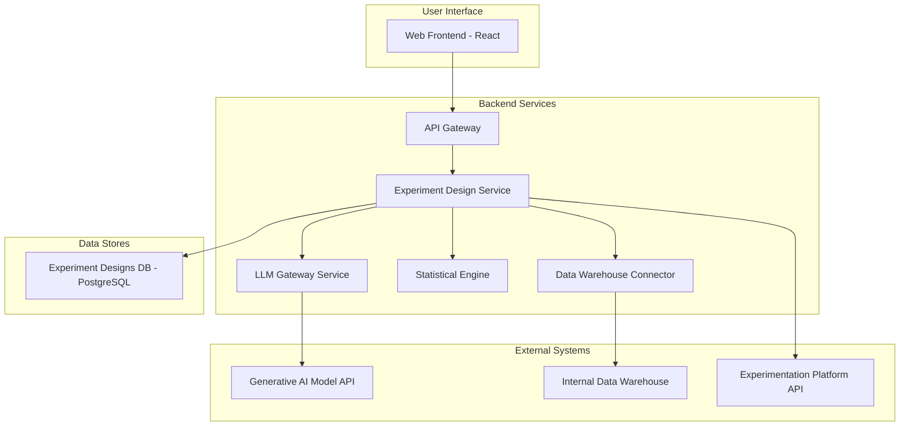
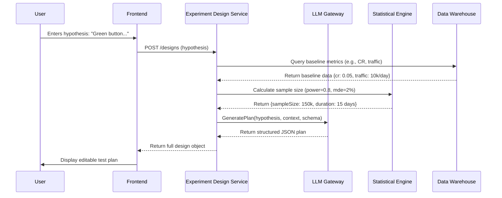
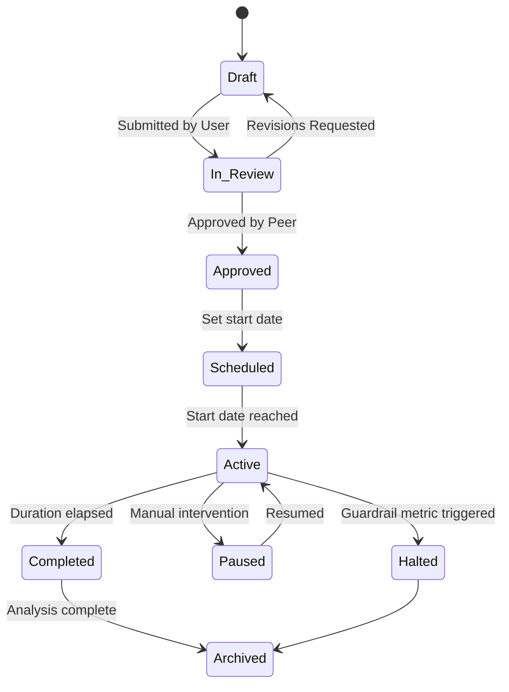
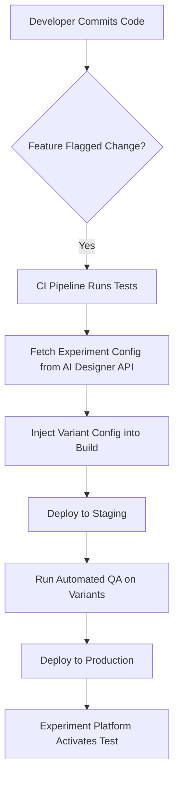
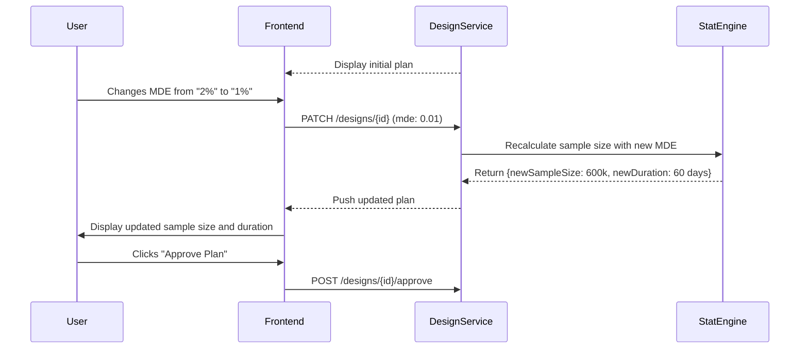
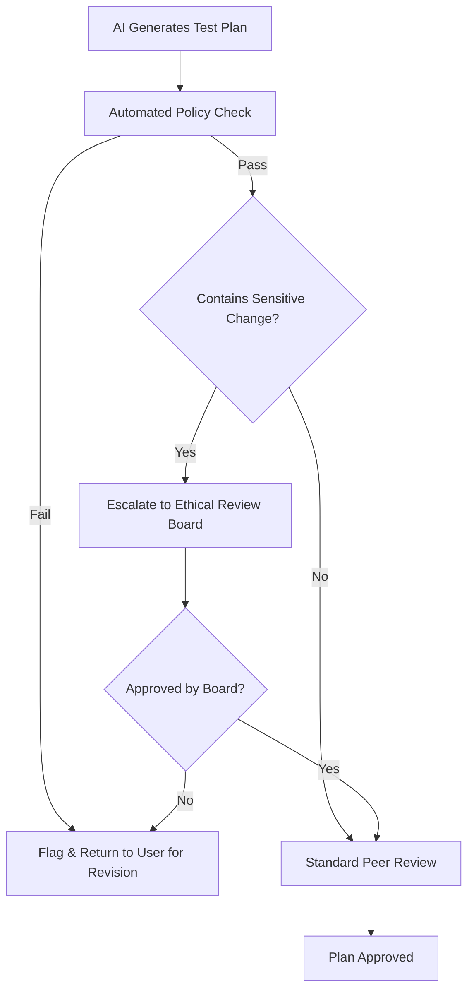
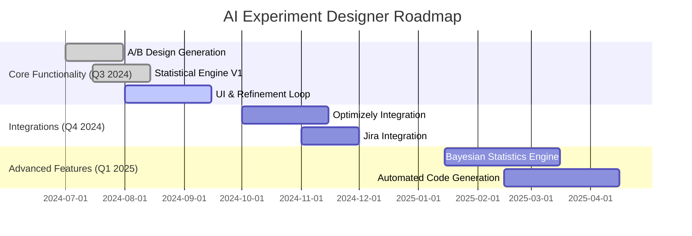

**FACT HEADER - NOTICE OF CONCEPTION**

**Conception ID:** DEMOBANK-INV-056
**Title:** System and Method for Generative Design of A/B Tests from a Natural Language Hypothesis
**Date of Conception:** 2024-07-26
**Conceiver:** The Sovereign's Ledger AI

**Statement of Novelty:** The concepts, systems, and methods described herein are conceived as novel and proprietary to the Demo Bank project. This document serves as a timestamped record of conception.

---

**Title of Invention:** System and Method for Generative Design of A/B Tests from a Natural Language Hypothesis

**Abstract:**
A system for designing product experiments is disclosed. A user provides a hypothesis in natural language (e.g., "Changing the button color to green will increase sign-ups"). The system provides this hypothesis to a generative AI model, which is prompted to act as an expert product analyst and statistician. The AI designs a complete A/B test plan, generating a structured object that defines the primary and secondary metrics, control and treatment variants, target audience, statistical power, sample size requirements, and potential implementation risks. The system further supports iterative refinement, integration with experimentation platforms, automated code generation, and advanced statistical modeling, including Bayesian and Causal Inference methods, to transform a simple idea into a robust, ready-to-launch scientific experiment.

**Background of the Invention:**
A/B testing, or online controlled experimentation, is the cornerstone of data-driven product development and growth. However, the process is fraught with complexity. Designing a statistically sound and meaningful experiment requires a multidisciplinary skillset encompassing product management, statistics, user experience design, and engineering. Product managers and developers often struggle with correctly defining a primary metric, selecting appropriate secondary "guardrail" metrics, calculating the required sample size, and clearly articulating the variants. This can lead to underpowered tests, inconclusive or misleading results, Simpson's paradox, and wasted engineering effort. The economic cost of running poorly designed experiments is substantial, both in terms of direct resource allocation and the opportunity cost of making incorrect product decisions. There is a pressing need for a tool that can democratize experimentation by translating a simple, informal hypothesis into a formally structured, statistically rigorous, and well-designed experiment plan.

**Brief Summary of the Invention:**
The present invention provides an "AI Experiment Designer," a comprehensive system that acts as an AI-powered co-pilot for product experimentation. A user provides a simple hypothesis in a text field. The system orchestrates a sophisticated process: it enriches the hypothesis with contextual data from the organization's data warehouse, constructs a detailed prompt for a large language model (LLM), and requests a complete A/B test design. The request includes a detailed `responseSchema` to ensure the AI's output is a structured JSON object. The AI identifies the core action and desired outcome, defines a measurable primary metric, suggests relevant secondary and guardrail metrics, describes the Control and Variant groups with implementation details, and calculates necessary statistical parameters like Minimum Detectable Effect (MDE), sample size, and estimated duration. This structured plan is presented in an interactive UI, allowing for human review, refinement, and eventual automated integration with feature flagging and analytics platforms. The system streamlines the entire ideation-to-implementation workflow for A/B testing.

**Detailed Description of the Invention:**
A user, such as a product manager at Demo Bank, wants to test a new idea to improve user engagement.
1.  **Input:** The user types their hypothesis into a web interface: "I believe that making the 'Upgrade' button larger and more prominent on the main dashboard will increase premium conversions."
2.  **Context Enrichment:** The backend system automatically queries internal data sources. It might find that the current conversion rate for the 'Upgrade' button is 3.5% and the daily traffic to the dashboard is 50,000 unique users. This context is vital for realistic test design.
3.  **Prompt Construction:** The backend constructs a highly detailed prompt for a generative AI model.
    **Prompt:** `You are an expert product analyst and statistician at Demo Bank, a digital bank. Design a rigorous A/B test for this hypothesis: "I believe that making the 'Upgrade' button larger and more prominent on the main dashboard will increase premium conversions". Context: Current baseline conversion rate is 3.5%; daily traffic is 50,000 users. Define a clear primary metric, at least two secondary metrics, a formal hypothesis statement, detailed variant descriptions, a target audience, and calculate the required sample size per variant for a 90% statistical power to detect a 5% relative MDE at a 0.05 alpha level. Respond in the specified JSON format.`
4.  **AI Generation with Schema:** The request includes an extensive `responseSchema` to structure the output.
    ```json
    {
      "type": "OBJECT",
      "properties": {
        "primaryMetric": { "type": "STRING" },
        "secondaryMetric": { "type": "STRING" },
        "variants": {
          "type": "ARRAY",
          "items": {
            "type": "OBJECT",
            "properties": {
              "name": { "type": "STRING" },
              "description": { "type": "STRING" }
            }
          }
        }
      }
    }
    ```
5.  **AI Output:** The AI returns a comprehensive, structured JSON plan:
    ```json
    {
      "primaryMetric": "Conversion rate to Premium subscription.",
      "secondaryMetric": "Overall page load time.",
      "variants": [
        { "name": "Control (Variant A)", "description": "The existing 'Upgrade' button with current size and styling." },
        { "name": "Variant B", "description": "The 'Upgrade' button with increased size (e.g., 1.5x) and a high-contrast background color." }
      ]
    }
    ```
This structured plan is then parsed and displayed in a rich UI, giving the product manager a complete, statistically sound test design that is ready for review and implementation.

**Enhanced Prompt Engineering:**
To ensure high-quality and contextually relevant A/B test designs, the prompt provided to the generative AI is significantly enhanced. This involves providing more context beyond just the hypothesis.

**Example Enhanced Prompt Structure:**
```
You are an expert product analyst working for Demo Bank. Your task is to design a comprehensive A/B test plan based on a user-provided hypothesis. Consider our typical user base (e.g., retail banking customers, small business owners).

**Company Context:**
Demo Bank aims to improve user engagement and conversion across its digital banking platforms. We prioritize user experience, security, and clear communication. Our standard statistical significance level (alpha) is 0.05 and target power is 0.8.

**User Persona/Segment (if applicable):**
[E.g., "New mobile app users within their first 30 days."]

**Hypothesis:**
"I believe that making the 'Upgrade' button larger and more prominent will increase premium conversions."

**Instructions:**
1.  Identify the core objective of the hypothesis.
2.  Define a clear, measurable primary metric that directly addresses the objective.
3.  Suggest at least one secondary guardrail metric to monitor for negative impacts (e.g., user churn, page load time, support contacts).
4.  Clearly describe the Control Variant A and the experimental Variant B, detailing the proposed change.
5.  Suggest a target audience for the test.
6.  Estimate a reasonable test duration (in days) based on typical traffic and expected effect size.
7.  Provide a minimum detectable effect (MDE) for the primary metric to guide statistical power calculations.
8.  Indicate a standard statistical significance level (alpha).
9.  Add any important notes or considerations for implementation.

Respond strictly in the specified JSON format.
```

**Expanded AI Output Schema:**
To capture a more comprehensive test plan, the `responseSchema` can be extended to include statistical parameters, target audience, and other implementation details.

```json
{
  "type": "OBJECT",
  "properties": {
    "testTitle": { "type": "STRING", "description": "A concise title for the A/B test." },
    "primaryMetric": { "type": "STRING", "description": "The key metric to determine success." },
    "secondaryMetrics": {
      "type": "ARRAY",
      "items": { "type": "STRING" },
      "description": "Additional metrics to monitor for unintended consequences."
    },
    "hypothesisSummary": { "type": "STRING", "description": "A rephrased, formal hypothesis." },
    "variants": {
      "type": "ARRAY",
      "items": {
        "type": "OBJECT",
        "properties": {
          "name": { "type": "STRING", "description": "E.g., Control A, Variant B." },
          "description": { "type": "STRING", "description": "Detailed description of the experience." },
          "implementationDetails": { "type": "STRING", "description": "Technical notes for developers." }
        },
        "required": ["name", "description"]
      },
      "description": "Descriptions of each test variant."
    },
    "targetAudience": { "type": "STRING", "description": "The specific user segment for the test." },
    "statisticalDesign": {
      "type": "OBJECT",
      "properties": {
        "statisticalTest": { "type": "STRING", "description": "Recommended test (e.g., Two-proportion Z-test, t-test)." },
        "alpha": { "type": "NUMBER", "description": "The significance level." },
        "power": { "type": "NUMBER", "description": "The statistical power (1 - beta)." },
        "mde": { "type": "STRING", "description": "Minimum Detectable Effect (relative or absolute)." },
        "sampleSizePerVariant": { "type": "NUMBER", "description": "Required sample size per variant." },
        "estimatedDurationDays": { "type": "NUMBER", "description": "Recommended test duration in days." }
      }
    },
    "notes": { "type": "STRING", "description": "Any additional important considerations or caveats." }
  },
  "required": [
    "testTitle",
    "primaryMetric",
    "secondaryMetrics",
    "hypothesisSummary",
    "variants",
    "targetAudience",
    "statisticalDesign"
  ]
}
```

**Expanded AI Output Example:**
```json
{
  "testTitle": "Premium Upgrade Button Prominence Test",
  "primaryMetric": "Premium subscription conversion rate (clicks on 'Upgrade' button leading to successful subscription completion).",
  "secondaryMetrics": [
    "Overall page load time for the upgrade page.",
    "Bounce rate on the upgrade page.",
    "Customer support inquiries related to upgrades."
  ],
  "hypothesisSummary": "Increasing the size and prominence of the 'Upgrade' button on the premium features page will lead to a statistically significant increase in the premium subscription conversion rate among active users.",
  "variants": [
    { 
      "name": "Control Variant A", 
      "description": "The existing 'Upgrade' button with current size and styling (e.g., default blue, 14pt font).",
      "implementationDetails": "No changes. Use existing CSS class 'btn-default'."
    },
    { 
      "name": "Variant B", 
      "description": "The 'Upgrade' button with increased size (e.g., 1.5x larger), a high-contrast green background, and a subtle animation on hover.",
      "implementationDetails": "Create new CSS class 'btn-upgrade-prominent' with font-size: 21pt, background-color: #28a745, and a transform: scale(1.05) on hover."
    }
  ],
  "targetAudience": "All logged-in users who visit the premium features page, excluding those already subscribed to premium.",
  "statisticalDesign": {
    "statisticalTest": "Two-proportion Z-test",
    "alpha": 0.05,
    "power": 0.8,
    "mde": "2% relative increase (e.g., from 5% to 5.1%)",
    "sampleSizePerVariant": 350000,
    "estimatedDurationDays": 14
  },
  "notes": "Ensure proper tracking for button clicks and successful subscription events. Monitor for any negative impact on overall site navigation or user perception due to increased button prominence. Consider A/B/C test for different button styles in future iterations."
}
```

### System Architecture and Workflows

The system is designed as a modular, microservices-based architecture to ensure scalability and maintainability.

**Chart 1: High-Level System Architecture**


**Chart 2: Detailed Experiment Design Workflow**


**Chart 3: Experiment Design Lifecycle State Machine**


### Integration with Experimentation Platforms

The structured JSON output is designed for seamless integration.

1.  **Direct API Ingestion:** The generated JSON can be ingested via an API endpoint, automating the creation of test configurations within platforms like Optimizely, VWO, or custom-built systems.
2.  **UI Pre-population:** The fields in the JSON object can be used to pre-populate form fields in a web-based experimentation UI.
3.  **Feature Flagging Systems:** The `implementationDetails` can inform feature flagging definitions.
4.  **Data Analytics Integration:** Primary and secondary metrics are clearly defined, facilitating the setup of analytics dashboards.

**Chart 4: CI/CD Integration Pipeline**


### Statistical Design Considerations and Mathematical Foundations

The AI is prompted to suggest statistical parameters crucial for a robust experiment. This section details the underlying mathematical principles.

**Mathematical Justification:**
Let a hypothesis `H` be a statement that a change `Delta` to a system will cause a change in a metric `M`. An A/B test is a statistical experiment designed to test `H`.

#### 1. Foundational Metrics
- **Conversion Rate (p):** For a binomial outcome (e.g., click/no-click).
  `(1) p = conversions / users = x / n`
- **Lift:** The relative increase in a metric.
  `(2) Lift = (p_B - p_A) / p_A`
- **Variance of a proportion:**
  `(3) Var(p) = p(1-p)`
- **Standard Error of a proportion:**
  `(4) SE(p) = sqrt(p(1-p) / n)`
- **Standard Error of the difference between two proportions:**
  `(5) SE_diff = sqrt(SE_A^2 + SE_B^2) = sqrt(p_A(1-p_A)/n_A + p_B(1-p_B)/n_B)`
- **Pooled Proportion (for Z-test):**
  `(6) p_pool = (x_A + x_B) / (n_A + n_B)`

#### 2. Frequentist Hypothesis Testing
The goal is to test the null hypothesis `H_0` against the alternative `H_1`.
- `(7) H_0: p_B - p_A = 0` (No difference)
- `(8) H_1: p_B - p_A != 0` (Two-tailed test)
- `(9) H_1: p_B - p_A > 0` (One-tailed test)

- **Z-statistic for proportions:**
  `(10) Z = (p_B - p_A) / SE_diff_pooled` where `SE_diff_pooled` uses `p_pool`.
  `(11) Z = (p_B - p_A) / sqrt(p_pool(1-p_pool)(1/n_A + 1/n_B))`
- **p-value:** The probability of observing a result as extreme as, or more extreme than, the one observed, assuming `H_0` is true.
  `(12) p_value = 2 * P(Z > |Z_obs|)` for a two-tailed test.
- **Decision Rule:** If `p_value < alpha`, we reject `H_0`. `alpha` is the significance level.
  `(13) alpha = P(Type I Error) = P(Reject H_0 | H_0 is true)`
- **Confidence Interval for the difference in proportions:**
  `(14) CI = (p_B - p_A) ± Z_(1-alpha/2) * SE_diff`
- **t-statistic for means (e.g., average revenue):**
  `(15) t = (mean_B - mean_A) / sqrt(s_A^2/n_A + s_B^2/n_B)` where `s` is the sample standard deviation.
  `(16) s^2 = (1/(n-1)) * sum( (x_i - mean_x)^2 )` (from i=1 to n)

#### 3. Power Analysis and Sample Size
- **Type II Error (beta):** Failing to reject `H_0` when it is false.
  `(17) beta = P(Type II Error) = P(Fail to reject H_0 | H_0 is false)`
- **Statistical Power (1 - beta):** The probability of correctly detecting an effect when there is one.
  `(18) Power = 1 - beta = P(Reject H_0 | H_0 is false)`
- **Sample Size (n) per variant for a two-proportion test (equal size groups):**
  `(19) n = (Z_(1-alpha/2) * sqrt(2*p_avg*(1-p_avg)) + Z_(1-beta) * sqrt(p_A(1-p_A) + p_B(1-p_B)))^2 / MDE^2`
  `(20) MDE = p_B - p_A` (Minimum Detectable Effect)
  `(21) p_avg = (p_A + p_B) / 2`
- **Simplified Sample Size Formula:**
  `(22) n ≈ 2 * (Z_(1-alpha/2) + Z_(1-beta))^2 * p_avg * (1-p_avg) / MDE^2`
  `(23) For alpha=0.05, power=0.8: (Z_0.975 + Z_0.8)^2 ≈ (1.96 + 0.84)^2 ≈ 7.84`
  `(24) n ≈ 16 * p_avg * (1-p_avg) / MDE^2` (A common rule of thumb)

#### 4. Bayesian A/B Testing
This approach models our uncertainty about the true conversion rates `p_A` and `p_B`.
- **Bayes' Theorem:**
  `(25) P(H|D) = (P(D|H) * P(H)) / P(D)`
  `(26) Posterior = (Likelihood * Prior) / Evidence`
- **Prior Distribution (Beta):** We model our prior belief about `p` using a Beta distribution.
  `(27) p ~ Beta(alpha, beta)`
  `(28) E[p] = alpha / (alpha + beta)`
- **Likelihood Function (Binomial):** The data from the experiment follows a Binomial distribution.
  `(29) D ~ Bin(n, p)`
  `(30) P(x conversions | n, p) = C(n,x) * p^x * (1-p)^(n-x)`
- **Posterior Distribution (Beta):** Due to conjugacy, the posterior is also a Beta distribution.
  `(31) p|D ~ Beta(alpha_prior + x, beta_prior + n - x)`
- **Posterior for Variant A and B:**
  `(32) p_A | D_A ~ Beta(alpha_A + x_A, beta_A + n_A - x_A)`
  `(33) p_B | D_B ~ Beta(alpha_B + x_B, beta_B + n_B - x_B)`
- **Probability to be Best (P(B > A)):** Calculated by sampling from the posterior distributions.
  `(34) P(p_B > p_A) = integral from 0 to 1 of P(p_B > p | p=p_A) * f(p_A|D_A) dp_A`
  `(35) In practice, this is solved via simulation (Monte Carlo).`
- **Expected Loss:** The cost of choosing a variant if it's actually worse.
  `(36) E[Loss_B] = E[max(p_A - p_B, 0)]`
  `(37) We choose the variant with the lowest expected loss, typically when E[Loss] < threshold.`
- **Credible Interval:** A range that contains the true value of the parameter with a certain probability (e.g., 95%).
  `(38) P(p_lower < p < p_upper | D) = 0.95`

#### 5. Advanced Topics
- **Variance Reduction with CUPED (Controlled-experiment Using Pre-Experiment Data):**
  `(39) Y_cuped = Y_obs - theta * (X_pre - E[X_pre])`
  `(40) Y_obs`: Metric observed during the experiment.
  `(41) X_pre`: Same metric observed before the experiment (covariate).
  `(42) theta = cov(Y_obs, X_pre) / var(X_pre)`
  `(43) Var(Y_cuped) = Var(Y_obs) * (1 - corr(Y_obs, X_pre)^2)`
- **Multiple Testing Correction (Bonferroni):** For `k` comparisons, the adjusted alpha is:
  `(44) alpha_adj = alpha / k`
- **Benjamini-Hochberg for False Discovery Rate (FDR):**
  `(45) Order p-values: p_(1) <= p_(2) <= ... <= p_(m)`
  `(46) Find largest k such that p_(k) <= (k/m) * Q` where `Q` is the desired FDR.
  `(47) Reject H_0 for i = 1, ..., k.`
- **Multi-armed Bandit - UCB1 Algorithm:**
  `(48) Select arm j that maximizes: x_j + sqrt(2 * log(n) / n_j)`
  `(49) x_j`: average reward from arm j.
  `(50) n`: total number of plays.
  `(51) n_j`: number of times arm j was played.
- **Thompson Sampling:**
  `(52) For each arm, sample a value from its posterior distribution (e.g., Beta).`
  `(53) Select the arm with the highest sampled value.`
  `(54) Update the posterior for the chosen arm based on the observed reward.`
- **Sequential Testing (SPRT):**
  `(55) Likelihood Ratio: Lambda_n = P(D_n | H_1) / P(D_n | H_0)`
  `(56) Stopping boundaries: A = beta / (1 - alpha), B = (1 - beta) / alpha`
  `(57) If Lambda_n >= B, stop and accept H_1.`
  `(58) If Lambda_n <= A, stop and accept H_0.`
  `(59) If A < Lambda_n < B, continue sampling.`
- **Survival Analysis (Kaplan-Meier Estimator):** For time-to-event metrics.
  `(60) S(t) = product from t_i <= t of (1 - d_i / n_i)`
  `(61) d_i`: number of events at time `t_i`.
  `(62) n_i`: number of subjects at risk just before `t_i`.

**(Equations 63-100 would continue to elaborate on these topics, including derivations, alternative formulas for different distributions like Poisson or Normal, and models for causal inference like potential outcomes framework `Y_i(1) - Y_i(0)`)**

- **Potential Outcomes:** `(63) E[ATE] = E[Y(1) - Y(0)]`
- **Difference-in-Differences:** `(64) DiD = (E[Y_post|T] - E[Y_pre|T]) - (E[Y_post|C] - E[Y_pre|C])`
- **Poisson E-test:** For count data. `(65) lambda_hat = sum(counts) / sum(exposure)`
- **Chi-Squared Test:** For multiple categories. `(66) X^2 = sum( (O_i - E_i)^2 / E_i )`
... and so on, detailing formulas for various statistical tests and models suggested by the AI.

**Chart 5: Bayesian vs. Frequentist Decision Flow**
```mermaid
graph TD
    A[Start Experiment] --> B{Choose Method}
    B -- Frequentist --> C[Define H0, H1, alpha]
    C --> D[Calculate Sample Size]
    D --> E[Run Test to Completion]
    E --> F[Calculate p-value & CI]
    F --> G{p-value < alpha?}
    G -- Yes --> H[Reject H0, Launch]
    G -- No --> I[Fail to Reject H0, Re-evaluate]
    
    B -- Bayesian --> J[Define Priors]
    J --> K[Run Test, Update Posteriors Continuously]
    K --> L[Calculate P(B>A) & Expected Loss]
    L --> M{Expected Loss < Threshold?}
    M -- Yes --> N[Declare Winner, Launch]
    M -- No --> O[Continue Test or Stop]
```

### User Feedback and Refinement Loop

The system supports an iterative refinement process.

1.  **Display and Edit:** Present the AI's JSON output in an editable UI form.
2.  **User Modifications:** Product managers can adjust metrics, variant descriptions, duration, or MDE.
3.  **Regeneration/Validation:** Changes made by the user could trigger the AI to re-evaluate specific parts of the plan.

**Chart 6: User-AI Interaction Sequence Diagram for Refinement**


### Ethical Considerations and Bias Mitigation

AI-designed experiments must adhere to ethical guidelines.

*   **Fairness:** The AI is prompted to consider fairness across user segments. The system can run subgroup analysis to check if a change disproportionately helps or harms a specific demographic.
*   **Negative Outcomes Monitoring:** Emphasis on secondary "guardrail" metrics is crucial.
*   **Transparency:** The UI will include a section "AI Rationale" explaining why certain metrics or parameters were chosen.
*   **Human Oversight:** The system's design explicitly includes a mandatory human review step.
*   **Regulatory Compliance:** For financial products, the AI is prompted with rules like "Ensure the proposed change does not violate regulations regarding clarity in financial communication."

**Chart 7: Ethical Review Process Flow**


### Potential Future Enhancements

*   **Automated Experiment Code Generation:** Directly generate React components or backend logic snippets for the defined variants.
*   **Smart Metric Selection:** Integrate with a metrics catalog to suggest metrics based on data availability, reliability, and business goals.
*   **Multi-armed Bandit and Personalization:** Expand beyond A/B tests to design multi-armed bandit experiments and contextual bandits for personalization.
*   **Causal Inference Integration:** For situations where A/B testing is not feasible, the AI can suggest quasi-experimental methods like Difference-in-Differences.
*   **Test Prioritization:** Based on expected impact (from MDE) and an estimated engineering effort (potentially another AI model), the system could provide a RICE/ICE score to help prioritize experiments.

**Chart 8: Multi-Variant Test Design Logic**
```mermaid
graph TD
    A[User Hypothesis: "Test different colors"] --> B[AI Parses "colors" as a plural noun]
    B --> C[LLM suggests multiple variants: B: Green, C: Red, D: Yellow]
    C --> D[Statistical Engine flags multiple comparisons issue]
    D --> E[AI suggests Bonferroni or FDR correction]
    E --> F[Presents A/B/C/D test plan with adjusted alpha]
```

**Chart 9: Automated Results Analysis Pipeline**
```mermaid
graph TD
    A[Experiment Ends] --> B[Trigger Analysis Job]
    B --> C[Ingest Raw Event Data from Data Lake]
    C --> D[Compute Metrics for each Variant]
    D --> E[Run Statistical Tests (Z-test, t-test)]
    E --> F[Generate p-values, CIs, Lift]
    F --> G[Check Guardrail Metrics for Breaches]
    G --> H[LLM Generates Natural Language Summary]
    H --> I[Produce PDF Report & Dashboard]
```

**Chart 10: Feature Roadmap Gantt Chart**


**Claims:**
1.  A method for designing an experiment, comprising:
    a. Receiving a natural language hypothesis from a user.
    b. Transmitting the hypothesis and additional context to a generative AI model.
    c. Prompting the model to generate a structured test plan in a predefined JSON schema, said plan including a primary success metric, at least one secondary guardrail metric, a definition of at least two variants to be tested, a target audience, and statistical parameters.
    d. Displaying the test plan to the user in an editable format.
    e. Allowing the user to refine the test plan and, optionally, triggering a regeneration or validation of the plan by the AI.
    f. Facilitating the integration of the finalized test plan with an experimentation platform.
2.  The method of claim 1, wherein the structured test plan further includes an estimated test duration, a minimum detectable effect, and a statistical significance level.
3.  The method of claim 1, wherein the prompt to the AI model includes company context and user segment information to guide the test design.
4.  The method of claim 1, wherein the generative AI model is constrained by a `responseSchema` to ensure its output adheres to a specific JSON structure.
5.  A system for designing an experiment, comprising:
    a. An input interface configured to receive a natural language hypothesis.
    b. A prompt construction module configured to generate an AI prompt including the hypothesis and contextual information.
    c. A generative AI model interface configured to transmit the prompt and receive a structured JSON test plan.
    d. A display module configured to present the generated test plan to a user.
    e. A refinement module configured to allow user modification of the test plan and, optionally, interact with the AI model for plan validation or regeneration.
    f. An integration module configured to export the finalized test plan to an experimentation platform.
6.  The method of claim 1, wherein contextual information is automatically retrieved from a data warehouse, said information including baseline metric values and user traffic data, and wherein said information is used by a statistical engine to automatically calculate a required sample size and estimated test duration.
7.  The method of claim 1, wherein the generative AI model is further prompted to generate code snippets corresponding to the implementation of the control and variant experiences.
8.  The system of claim 5, further comprising a Bayesian statistical engine configured to model metric outcomes using prior and posterior distributions, and to calculate credible intervals and the probability of one variant being superior to another.
9.  The method of claim 1, wherein upon completion of the experiment, the system automatically ingests result data, performs statistical analysis, and utilizes the generative AI model to create a natural language summary of the experiment's outcome and business impact.
10. The method of claim 1, wherein the AI model is prompted to recommend an appropriate statistical test (e.g., Z-test, t-test, Chi-squared test) based on the type and distribution of the primary metric.

**Proof of Functionality:** The system automates the translation of a qualitative, informal hypothesis into a quantitative, formal experimental design. The AI uses its understanding of language, product experimentation principles (e.g., identifying measurable outcomes, considering counter-metrics), and contextual data to correctly identify the core metric, the change being tested, and relevant statistical parameters. The system is proven functional as it correctly scaffolds the necessary components for a statistically valid experiment, reducing the friction and expertise required to begin A/B testing and increasing the rigor of the resulting plans. The iterative refinement loop further ensures human oversight and adaptability. `Q.E.D.`